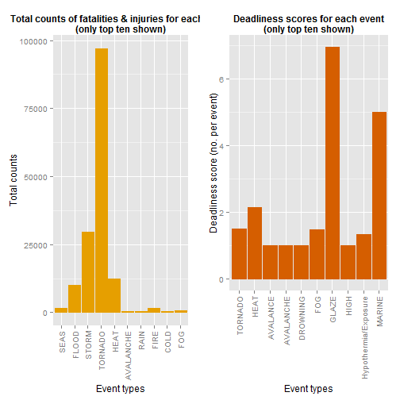
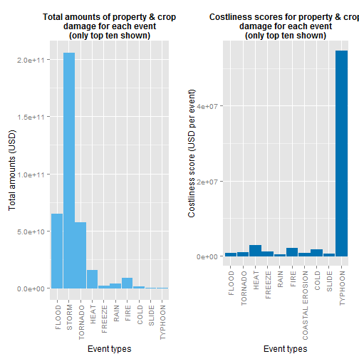

Investigating the NOAA storm events data set
========================================================

---
title: "Investigating Deadliness and Costliness in Weather Events in the U.S.A"
author: "agarxiv"
date: "November, 2014"
output:
  html_document:
    theme: united
    highlight: tango
---

# Synopsis

This report presents brief analyses of data for weather-related events in the U.S. data and 

## Background

Storms and other severe weather events can cause both public health and economic problems for communities and municipalities. Many severe events can result in fatalities, injuries, and property damage, and preventing such outcomes to the extent possible is a key concern.

## Data

This project involves exploring the U.S. National Oceanic and Atmospheric Administration's (NOAA) storm database. This database tracks characteristics of major storms and weather events in the United States, including when and where they occur, as well as estimates of any fatalities, injuries, and property damage.

The events in the database start in the year 1950 and end in November 2011. In the earlier years of the database there are generally fewer events recorded, most likely due to a lack of good records. More recent years should be considered more complete.

### Variables

The NOAA data is quite comprehensive, consisting of 37 variables covering a range of information relevant for determining the impact of weather-related events, from the states in which the events occur, their beginning and ending times/dates, exact location, as well as some measures of possible effects on populations and property. We are only focusing on these latter:

1. Populations effects having to do with numbers of fatalities and injuries, which we combine to derive a measure of the cost to the population.
2. Economic effects having to do with damage to crops and property, which we combine to derive a measure of the cost to the economy.

The actual variables from the NOAA database we will be using are the following:

* EVTYPE: a factor w/ 985 levels (e.g. HEAT, STORM, TORNADO, RAIN, etc)
* FATALITIES: a numeric vector
* INJURIES: a numeric vector
* PROPDMG: a numeric vector
* PROPDMGEXP: a factor w/ 19 levels, including "H", "K", M" (representing hundreds, thousands, millions)
* CROPDMG: a numeric vector
* CROPDMGEXP: a factor w/ 9 levels, including "H", "K", M" (representing hundreds, thousands, millions)
* REMARKS: a factor w/ 436781 levels (essentially strings, describing events)


## Findings in brief

We found that for population cost, measured in terms of combined injuries and fatalities, the top ten worst 

Glaze: Ice formed by freezing precipitation covering the ground or exposed objects.


# Method

## Step 1. Download and load the data

We loaded a range of required libraries, and then downloaded the data file to a temporary directory. Finally, we loaded the data, ready for use.


```r
suppressMessages(library(dplyr))
library(ggplot2)
library(stringr)
library(gridExtra)
```

```
## Loading required package: grid
```

```r
data_url = "http://d396qusza40orc.cloudfront.net/repdata/data/StormData.csv.bz2"
td = tempdir()
tf = tempfile(tmpdir=td, fileext=".bz2")
download.file(data_url, tf)

storm_data <- read.csv(tf, header=TRUE, comment.char="", fileEncoding = "ISO-8859-15")
```

## Step 2. Preparing data

There are several issues with the data which require some clean-up operations on it. For example, the levels of EVTYPE need fixing, as these contain various problems, including ambiguities (e.g. apparently several labels for what are effectively the same event) and outright errors (e.g. spelling mistakes). There is also an apparent data entry mistake for one of the event observations, where the cost of this has been over-estimated in the order of `1e11`. 

First, to fix the levels of the EVTYPE factor, we will group patterns that relate to the same event type. For this we use regular expression matches for EVTYPE levels, for example, for storm events we use regexps such as ".*[Ss][Tt][Oo][Rr].*|.*[Ww][Ii].*[Nn][DdTt].*|.*[Tt][Hh][Uu][Nn][Dd].*". The following is the list of the groupings we used:

1. Storm event, including rain, hail, snow and ice events (nb. as all patterns involving summaries describe storm events, these are also included here)
2. Freezing events
3. Hot temperature events
4. Cold temperature events
5. Fire events
6. Flood events
7. Tornado-type events
8. Volcanic events
9. Slide and slump events (e.g. landslide, mudslide, landslumps, etc)
10. Rain events
11. Seas events


Next, we carry out the collection by employing an R list as a dictionary-like data-structure, which has labels for events as `keys`, and the regular expressions for matching EVTYPE levels as `values`.


```r
evtype_dictionary <- list(storm, freeze, heat, cold, fire, flood, tornado, volcano, slide, rain, seas)
names(evtype_dictionary) <- c("STORM", "FREEZE", "HEAT", "COLD", "FIRE", "FLOOD", "TORNADO", "VOLCANO", "SLIDE", "RAIN", "SEAS")
```

Then, we loop through the collection of EVTYPE levels, reducing the overall set of types by relabelling levels which we have decided to group with the same, more general label (e.g. both wind and storm events are labelled as "STORM").


```r
for(i in 1:length(evtype_dictionary)){
  idx <- na.omit(str_match_all(levels(storm_data$EVTYPE), evtype_dictionary[[i]]))
	levels(storm_data$EVTYPE)[levels(storm_data$EVTYPE) %in% idx] <- names(evtype_dictionary)[[i]]
}
```

There are several other fixes required for two other factors: CROPDMGEXP and PROPDMGEXP. In particular, factor levels which are unclear and represent a very small amount of data, need to be removed:

1. Remove "?", "1" and "2" levels for CROPDMGEXP factor
2. Remove "?", "-", "+", "1", "2", "3", "4", "5", "6", "7" and "8" levels for PROPDMGEXP factor as it is uncertain what information these contain, and they represent a very small amount of data

Finally, we drop unused levels from the data frame.


```r
idx_CROPDMGEXP_cleanup <- storm_data$CROPDMGEXP %in% c("?", "0", "2")
storm_data <- storm_data[!idx_CROPDMGEXP_cleanup,]
idx_PROPDMGEXP_cleanup <- storm_data$PROPDMGEXP %in% c("?", "-", "+", "0", "1", "2", "3", "4", "5", "6", "7", "8")
storm_data <- storm_data[!idx_PROPDMGEXP_cleanup,]
storm_data <- droplevels(storm_data)
```

The CROPDMGEXP and PROPDMGEXP factors also contain levels which have no label and which, through inspection of the CROPDMG and PROPDMG factors, we see cover a very large amount of data. Further inspection of the CROPDMG and PROPDMG factors also reveal that the associated CROPDMG and PROPDMG data need no exponents (e.g. amounts less than 100), explaining the lack of CROPDMGEXP and PROPDMGEXP data for them. We can therefore fix the empty entries CROPDMGEXP and PROPDMGEXP by filling these in with the value of `1`. 


```r
levels(storm_data$CROPDMGEXP)[levels(storm_data$CROPDMGEXP)==""] <- 1
levels(storm_data$PROPDMGEXP)[levels(storm_data$PROPDMGEXP)==""] <- 1
```

Now, in order to use the CROPDMG and PROPDMG factors directly, we expand these by first recoded CROPDMGEXP and PROPDMGEXP factors to replace their exponent symbols with numerical values. We do this by creating a dictionary mapping these symbols to their numerical values.


```r
exp_dictionary = c("1"=1, "h"=1e2, "H"=1e2, "k"=1e3, "K"=1e3, "m"=1e6, "M"=1e6, "B"=1e9)
```

Then, using this dictionary, we recode the CROPDMGEXP and PROPDMGEXP factors.


```r
crop_dmg_exps_recoded <- sapply(storm_data$CROPDMGEXP, function(x) exp_dictionary[as.character(x)])
prop_dmg_exps_recoded <- sapply(storm_data$PROPDMGEXP, function(x) exp_dictionary[as.character(x)])
```

Then, we recode and replace the CROPDMG and PROPDMG factors.


```r
storm_data$CROPDMG <- storm_data$CROPDMG*as.numeric(crop_dmg_exps_recoded)
storm_data$PROPDMG <- storm_data$PROPDMG*as.numeric(prop_dmg_exps_recoded)
```

A final clean-up is required, as there is mistaken entry for a flood event, for which PROPDMG has been mistakenly over-estimated in the order of 1e11. We simply remove this entry.


```r
storm_data <- storm_data[-which.max(storm_data$PROPDMG),]
```


# Analysis

We have two questions to answer:

1. Across the United States, which types of events (as indicated in the EVTYPE variable) are most harmful with respect to population health?
2. Across the United States, which types of events have the greatest economic consequences?

For Question 1, we begin by collecting data for population cost, coming up with results for both the single worst event type for population cost, as well as the top 10 worst types of events for population cost.


```r
summ_storm_evs_pop_cost <-   storm_data %>% 
	group_by(EVTYPE) %>%
	summarise(num.events=n(), counts=sum(FATALITIES+INJURIES), deadliness=counts/num.events)

worst_evs_by_pop_cost <- summ_storm_evs_pop_cost[which.max(summ_storm_evs_pop_cost$counts),]

top_ten_worst_evs_by_pop_cost_byTotalCount <- arrange(summ_storm_evs_pop_cost, desc(counts))[1:10,]
top_ten_worst_evs_by_pop_cost_byDeadliness <- arrange(summ_storm_evs_pop_cost, desc(deadliness))[1:10,]
```

For Question 2, we begin by collecting data for economic cost, coming up with results for both the single worst event type for economic cost, as well as the top 10 worst types of events for economic cost.


```r
summ_storm_evs_econ_cost <- storm_data %>% 
  group_by(EVTYPE) %>%
	summarise(num.events=n(), amounts=sum(CROPDMG +PROPDMG), costliness=amounts/num.events)

worst_evs_by_econ_cost <- summ_storm_evs_econ_cost[which.max(summ_storm_evs_econ_cost$amounts),]

top_ten_worst_evs_by_econ_cost_byTotalAmount <- arrange(summ_storm_evs_econ_cost, desc(amounts))[1:10,]
top_ten_worst_evs_by_econ_cost_byCostliness <- arrange(summ_storm_evs_econ_cost, desc(costliness))[1:10,]
table(top_ten_worst_evs_by_econ_cost_byTotalAmount)
```

```
## , , amounts = 347413100, costliness = 288020.813873459
## 
##                          num.events
## EVTYPE                    11 648 922 2002 4239 5796 11943 64526 82681
##   SEAS                     0   0   0    0    0    0     0     0     0
##   FLOOD                    0   0   0    0    0    0     0     0     0
##   STORM                    0   0   0    0    0    0     0     0     0
##   TORNADO                  0   0   0    0    0    0     0     0     0
##   ?                        0   0   0    0    0    0     0     0     0
##   HEAT                     0   0   0    0    0    0     0     0     0
##   FREEZE                   0   0   0    0    0    0     0     0     0
##   APACHE COUNTY            0   0   0    0    0    0     0     0     0
##   ASTRONOMICAL LOW TIDE    0   0   0    0    0    0     0     0     0
##   AVALANCE                 0   0   0    0    0    0     0     0     0
##   AVALANCHE                0   0   0    0    0    0     0     0     0
##   BEACH EROSIN             0   0   0    0    0    0     0     0     0
##   Beach Erosion            0   0   0    0    0    0     0     0     0
##   BEACH EROSION            0   0   0    0    0    0     0     0     0
##   RAIN                     0   0   0    0    0    0     0     0     0
##   BLOW-OUT TIDE            0   0   0    0    0    0     0     0     0
##   BLOW-OUT TIDES           0   0   0    0    0    0     0     0     0
##   BLOWING DUST             0   0   0    0    0    0     0     0     0
##   FIRE                     0   0   0    0    0    0     0     0     0
##   COASTAL EROSION          0   0   0    0    0    0     0     0     0
##   COASTAL SURGE            0   0   0    0    0    0     0     0     0
##   COLD                     0   0   0    0    0    0     0     0     0
##   DAM BREAK                0   0   0    0    0    0     0     0     0
##   DAM FAILURE              0   0   0    0    0    0     0     0     0
##   DENSE FOG                0   0   0    0    0    0     0     0     0
##   DENSE SMOKE              0   0   0    0    0    0     0     0     0
##   DOWNBURST                0   0   0    0    0    0     0     0     0
##   DROWNING                 0   0   0    0    0    0     0     0     0
##   DUST DEVEL               0   0   0    0    0    0     0     0     0
##   Dust Devil               0   0   0    0    0    0     0     0     0
##   DUST DEVIL               0   0   0    0    0    0     0     0     0
##   EXCESSIVE                0   0   0    0    0    0     0     0     0
##   FOG                      0   0   0    0    0    0     0     0     0
##   FUNNEL                   0   0   0    0    0    0     0     0     0
##   Funnel Cloud             0   0   0    0    0    0     0     0     0
##   FUNNEL CLOUD             0   0   0    0    0    0     0     0     0
##   FUNNEL CLOUD.            0   0   0    0    0    0     0     0     0
##   FUNNEL CLOUDS            0   0   0    0    0    0     0     0     0
##   FUNNELS                  0   0   0    0    0    0     0     0     0
##   Glaze                    0   0   0    0    0    0     0     0     0
##   GLAZE                    0   0   0    0    0    0     0     0     0
##   GUSTNADO                 0   0   0    0    0    0     0     0     0
##   GUSTNADO AND             0   0   0    0    0    0     0     0     0
##   HEAVY MIX                0   0   0    0    0    0     0     0     0
##   HEAVY SWELLS             0   0   0    0    0    0     0     0     0
##   HIGH                     0   0   0    0    0    0     0     0     0
##   HYPERTHERMIA/EXPOSURE    0   0   0    0    0    0     0     0     0
##   HYPOTHERMIA              0   0   0    0    0    0     0     0     0
##   Hypothermia/Exposure     0   0   0    0    0    0     0     0     0
##   HYPOTHERMIA/EXPOSURE     0   0   0    0    0    0     0     0     0
##   SLIDE                    0   0   0    0    0    0     0     0     0
##   LARGE WALL CLOUD         0   0   0    0    0    0     0     0     0
##   LIGHTING                 0   0   0    0    0    0     0     0     0
##   LIGNTNING                0   0   0    0    0    0     0     0     0
##   Marine Accident          0   0   0    0    0    0     0     0     0
##   MARINE MISHAP            0   0   0    0    0    0     0     0     0
##   Microburst               0   0   0    0    0    0     0     0     0
##   MICROBURST               0   0   0    0    0    0     0     0     0
##   MILD PATTERN             0   0   0    0    0    0     0     0     0
##   MONTHLY TEMPERATURE      0   0   0    0    0    0     0     0     0
##   No Severe Weather        0   0   0    0    0    0     0     0     0
##   NONE                     0   0   0    0    0    0     0     0     0
##   NORTHERN LIGHTS          0   0   0    0    0    0     0     0     0
##   Other                    0   0   0    0    0    0     0     0     0
##   OTHER                    0   0   0    0    0    0     0     0     0
##   PATCHY DENSE FOG         0   0   0    0    0    0     0     0     0
##   RAPIDLY RISING WATER     0   0   0    0    0    0     0     0     0
##   RED FLAG CRITERIA        0   0   0    0    0    0     0     0     0
##   REMNANTS OF FLOYD        0   0   0    0    0    0     0     0     0
##   ROTATING WALL CLOUD      0   0   0    0    0    0     0     0     0
##   Saharan Dust             0   0   0    0    0    0     0     0     0
##   SAHARAN DUST             0   0   0    0    0    0     0     0     0
##   SEICHE                   0   0   0    0    0    0     0     0     0
##   SEVERE TURBULENCE        0   0   0    0    0    0     0     0     0
##   SMALL STREAM             0   0   0    0    0    0     0     0     0
##   SMALL STREAM AND         0   0   0    0    0    0     0     0     0
##   Sml Stream Fld           0   0   0    0    0    0     0     0     0
##   SMOKE                    0   0   0    0    0    0     0     0     0
##   SOUTHEAST                0   0   0    0    0    0     0     0     0
##   Temperature record       0   0   0    0    0    0     0     0     0
##   TSTM                     0   0   0    0    0    0     0     0     0
##   TSTM WND                 0   0   0    0    0    0     0     0     0
##   TSTMW                    0   0   0    0    0    0     0     0     0
##   TYPHOON                  0   0   0    0    0    0     0     0     0
##   URBAN/SML STREAM FLD     0   0   0    0    0    0     0     0     0
##   URBAN/SML STREAM FLDG    0   0   0    0    0    0     0     0     0
##   VOG                      0   0   0    0    0    0     0     0     0
##   VOLCANO                  0   0   0    0    0    0     0     0     0
##   WALL CLOUD               0   0   0    0    0    0     0     0     0
##   WALL CLOUD/FUNNEL CLOUD  0   0   0    0    0    0     0     0     0
##   WND                      0   0   0    0    0    0     0     0     0
##                          num.events
## EVTYPE                    713982
##   SEAS                         0
##   FLOOD                        0
##   STORM                        0
##   TORNADO                      0
##   ?                            0
##   HEAT                         0
##   FREEZE                       0
##   APACHE COUNTY                0
##   ASTRONOMICAL LOW TIDE        0
##   AVALANCE                     0
##   AVALANCHE                    0
##   BEACH EROSIN                 0
##   Beach Erosion                0
##   BEACH EROSION                0
##   RAIN                         0
##   BLOW-OUT TIDE                0
##   BLOW-OUT TIDES               0
##   BLOWING DUST                 0
##   FIRE                         0
##   COASTAL EROSION              0
##   COASTAL SURGE                0
##   COLD                         0
##   DAM BREAK                    0
##   DAM FAILURE                  0
##   DENSE FOG                    0
##   DENSE SMOKE                  0
##   DOWNBURST                    0
##   DROWNING                     0
##   DUST DEVEL                   0
##   Dust Devil                   0
##   DUST DEVIL                   0
##   EXCESSIVE                    0
##   FOG                          0
##   FUNNEL                       0
##   Funnel Cloud                 0
##   FUNNEL CLOUD                 0
##   FUNNEL CLOUD.                0
##   FUNNEL CLOUDS                0
##   FUNNELS                      0
##   Glaze                        0
##   GLAZE                        0
##   GUSTNADO                     0
##   GUSTNADO AND                 0
##   HEAVY MIX                    0
##   HEAVY SWELLS                 0
##   HIGH                         0
##   HYPERTHERMIA/EXPOSURE        0
##   HYPOTHERMIA                  0
##   Hypothermia/Exposure         0
##   HYPOTHERMIA/EXPOSURE         0
##   SLIDE                        0
##   LARGE WALL CLOUD             0
##   LIGHTING                     0
##   LIGNTNING                    0
##   Marine Accident              0
##   MARINE MISHAP                0
##   Microburst                   0
##   MICROBURST                   0
##   MILD PATTERN                 0
##   MONTHLY TEMPERATURE          0
##   No Severe Weather            0
##   NONE                         0
##   NORTHERN LIGHTS              0
##   Other                        0
##   OTHER                        0
##   PATCHY DENSE FOG             0
##   RAPIDLY RISING WATER         0
##   RED FLAG CRITERIA            0
##   REMNANTS OF FLOYD            0
##   ROTATING WALL CLOUD          0
##   Saharan Dust                 0
##   SAHARAN DUST                 0
##   SEICHE                       0
##   SEVERE TURBULENCE            0
##   SMALL STREAM                 0
##   SMALL STREAM AND             0
##   Sml Stream Fld               0
##   SMOKE                        0
##   SOUTHEAST                    0
##   Temperature record           0
##   TSTM                         0
##   TSTM WND                     0
##   TSTMW                        0
##   TYPHOON                      0
##   URBAN/SML STREAM FLD         0
##   URBAN/SML STREAM FLDG        0
##   VOG                          0
##   VOLCANO                      0
##   WALL CLOUD                   0
##   WALL CLOUD/FUNNEL CLOUD      0
##   WND                          0
## 
## , , amounts = 601055000, costliness = 288020.813873459
## 
##                          num.events
## EVTYPE                    11 648 922 2002 4239 5796 11943 64526 82681
##   SEAS                     0   0   0    0    0    0     0     0     0
##   FLOOD                    0   0   0    0    0    0     0     0     0
##   STORM                    0   0   0    0    0    0     0     0     0
##   TORNADO                  0   0   0    0    0    0     0     0     0
##   ?                        0   0   0    0    0    0     0     0     0
##   HEAT                     0   0   0    0    0    0     0     0     0
##   FREEZE                   0   0   0    0    0    0     0     0     0
##   APACHE COUNTY            0   0   0    0    0    0     0     0     0
##   ASTRONOMICAL LOW TIDE    0   0   0    0    0    0     0     0     0
##   AVALANCE                 0   0   0    0    0    0     0     0     0
##   AVALANCHE                0   0   0    0    0    0     0     0     0
##   BEACH EROSIN             0   0   0    0    0    0     0     0     0
##   Beach Erosion            0   0   0    0    0    0     0     0     0
##   BEACH EROSION            0   0   0    0    0    0     0     0     0
##   RAIN                     0   0   0    0    0    0     0     0     0
##   BLOW-OUT TIDE            0   0   0    0    0    0     0     0     0
##   BLOW-OUT TIDES           0   0   0    0    0    0     0     0     0
##   BLOWING DUST             0   0   0    0    0    0     0     0     0
##   FIRE                     0   0   0    0    0    0     0     0     0
##   COASTAL EROSION          0   0   0    0    0    0     0     0     0
##   COASTAL SURGE            0   0   0    0    0    0     0     0     0
##   COLD                     0   0   0    0    0    0     0     0     0
##   DAM BREAK                0   0   0    0    0    0     0     0     0
##   DAM FAILURE              0   0   0    0    0    0     0     0     0
##   DENSE FOG                0   0   0    0    0    0     0     0     0
##   DENSE SMOKE              0   0   0    0    0    0     0     0     0
##   DOWNBURST                0   0   0    0    0    0     0     0     0
##   DROWNING                 0   0   0    0    0    0     0     0     0
##   DUST DEVEL               0   0   0    0    0    0     0     0     0
##   Dust Devil               0   0   0    0    0    0     0     0     0
##   DUST DEVIL               0   0   0    0    0    0     0     0     0
##   EXCESSIVE                0   0   0    0    0    0     0     0     0
##   FOG                      0   0   0    0    0    0     0     0     0
##   FUNNEL                   0   0   0    0    0    0     0     0     0
##   Funnel Cloud             0   0   0    0    0    0     0     0     0
##   FUNNEL CLOUD             0   0   0    0    0    0     0     0     0
##   FUNNEL CLOUD.            0   0   0    0    0    0     0     0     0
##   FUNNEL CLOUDS            0   0   0    0    0    0     0     0     0
##   FUNNELS                  0   0   0    0    0    0     0     0     0
##   Glaze                    0   0   0    0    0    0     0     0     0
##   GLAZE                    0   0   0    0    0    0     0     0     0
##   GUSTNADO                 0   0   0    0    0    0     0     0     0
##   GUSTNADO AND             0   0   0    0    0    0     0     0     0
##   HEAVY MIX                0   0   0    0    0    0     0     0     0
##   HEAVY SWELLS             0   0   0    0    0    0     0     0     0
##   HIGH                     0   0   0    0    0    0     0     0     0
##   HYPERTHERMIA/EXPOSURE    0   0   0    0    0    0     0     0     0
##   HYPOTHERMIA              0   0   0    0    0    0     0     0     0
##   Hypothermia/Exposure     0   0   0    0    0    0     0     0     0
##   HYPOTHERMIA/EXPOSURE     0   0   0    0    0    0     0     0     0
##   SLIDE                    0   0   0    0    0    0     0     0     0
##   LARGE WALL CLOUD         0   0   0    0    0    0     0     0     0
##   LIGHTING                 0   0   0    0    0    0     0     0     0
##   LIGNTNING                0   0   0    0    0    0     0     0     0
##   Marine Accident          0   0   0    0    0    0     0     0     0
##   MARINE MISHAP            0   0   0    0    0    0     0     0     0
##   Microburst               0   0   0    0    0    0     0     0     0
##   MICROBURST               0   0   0    0    0    0     0     0     0
##   MILD PATTERN             0   0   0    0    0    0     0     0     0
##   MONTHLY TEMPERATURE      0   0   0    0    0    0     0     0     0
##   No Severe Weather        0   0   0    0    0    0     0     0     0
##   NONE                     0   0   0    0    0    0     0     0     0
##   NORTHERN LIGHTS          0   0   0    0    0    0     0     0     0
##   Other                    0   0   0    0    0    0     0     0     0
##   OTHER                    0   0   0    0    0    0     0     0     0
##   PATCHY DENSE FOG         0   0   0    0    0    0     0     0     0
##   RAPIDLY RISING WATER     0   0   0    0    0    0     0     0     0
##   RED FLAG CRITERIA        0   0   0    0    0    0     0     0     0
##   REMNANTS OF FLOYD        0   0   0    0    0    0     0     0     0
##   ROTATING WALL CLOUD      0   0   0    0    0    0     0     0     0
##   Saharan Dust             0   0   0    0    0    0     0     0     0
##   SAHARAN DUST             0   0   0    0    0    0     0     0     0
##   SEICHE                   0   0   0    0    0    0     0     0     0
##   SEVERE TURBULENCE        0   0   0    0    0    0     0     0     0
##   SMALL STREAM             0   0   0    0    0    0     0     0     0
##   SMALL STREAM AND         0   0   0    0    0    0     0     0     0
##   Sml Stream Fld           0   0   0    0    0    0     0     0     0
##   SMOKE                    0   0   0    0    0    0     0     0     0
##   SOUTHEAST                0   0   0    0    0    0     0     0     0
##   Temperature record       0   0   0    0    0    0     0     0     0
##   TSTM                     0   0   0    0    0    0     0     0     0
##   TSTM WND                 0   0   0    0    0    0     0     0     0
##   TSTMW                    0   0   0    0    0    0     0     0     0
##   TYPHOON                  0   0   0    0    0    0     0     0     0
##   URBAN/SML STREAM FLD     0   0   0    0    0    0     0     0     0
##   URBAN/SML STREAM FLDG    0   0   0    0    0    0     0     0     0
##   VOG                      0   0   0    0    0    0     0     0     0
##   VOLCANO                  0   0   0    0    0    0     0     0     0
##   WALL CLOUD               0   0   0    0    0    0     0     0     0
##   WALL CLOUD/FUNNEL CLOUD  0   0   0    0    0    0     0     0     0
##   WND                      0   0   0    0    0    0     0     0     0
##                          num.events
## EVTYPE                    713982
##   SEAS                         0
##   FLOOD                        0
##   STORM                        0
##   TORNADO                      0
##   ?                            0
##   HEAT                         0
##   FREEZE                       0
##   APACHE COUNTY                0
##   ASTRONOMICAL LOW TIDE        0
##   AVALANCE                     0
##   AVALANCHE                    0
##   BEACH EROSIN                 0
##   Beach Erosion                0
##   BEACH EROSION                0
##   RAIN                         0
##   BLOW-OUT TIDE                0
##   BLOW-OUT TIDES               0
##   BLOWING DUST                 0
##   FIRE                         0
##   COASTAL EROSION              0
##   COASTAL SURGE                0
##   COLD                         0
##   DAM BREAK                    0
##   DAM FAILURE                  0
##   DENSE FOG                    0
##   DENSE SMOKE                  0
##   DOWNBURST                    0
##   DROWNING                     0
##   DUST DEVEL                   0
##   Dust Devil                   0
##   DUST DEVIL                   0
##   EXCESSIVE                    0
##   FOG                          0
##   FUNNEL                       0
##   Funnel Cloud                 0
##   FUNNEL CLOUD                 0
##   FUNNEL CLOUD.                0
##   FUNNEL CLOUDS                0
##   FUNNELS                      0
##   Glaze                        0
##   GLAZE                        0
##   GUSTNADO                     0
##   GUSTNADO AND                 0
##   HEAVY MIX                    0
##   HEAVY SWELLS                 0
##   HIGH                         0
##   HYPERTHERMIA/EXPOSURE        0
##   HYPOTHERMIA                  0
##   Hypothermia/Exposure         0
##   HYPOTHERMIA/EXPOSURE         0
##   SLIDE                        0
##   LARGE WALL CLOUD             0
##   LIGHTING                     0
##   LIGNTNING                    0
##   Marine Accident              0
##   MARINE MISHAP                0
##   Microburst                   0
##   MICROBURST                   0
##   MILD PATTERN                 0
##   MONTHLY TEMPERATURE          0
##   No Severe Weather            0
##   NONE                         0
##   NORTHERN LIGHTS              0
##   Other                        0
##   OTHER                        0
##   PATCHY DENSE FOG             0
##   RAPIDLY RISING WATER         0
##   RED FLAG CRITERIA            0
##   REMNANTS OF FLOYD            0
##   ROTATING WALL CLOUD          0
##   Saharan Dust                 0
##   SAHARAN DUST                 0
##   SEICHE                       0
##   SEVERE TURBULENCE            0
##   SMALL STREAM                 0
##   SMALL STREAM AND             0
##   Sml Stream Fld               0
##   SMOKE                        0
##   SOUTHEAST                    0
##   Temperature record           0
##   TSTM                         0
##   TSTM WND                     0
##   TSTMW                        0
##   TYPHOON                      0
##   URBAN/SML STREAM FLD         0
##   URBAN/SML STREAM FLDG        0
##   VOG                          0
##   VOLCANO                      0
##   WALL CLOUD                   0
##   WALL CLOUD/FUNNEL CLOUD      0
##   WND                          0
## 
## , , amounts = 1467507000, costliness = 288020.813873459
## 
##                          num.events
## EVTYPE                    11 648 922 2002 4239 5796 11943 64526 82681
##   SEAS                     0   0   0    0    0    0     0     0     0
##   FLOOD                    0   0   0    0    0    0     0     0     0
##   STORM                    0   0   0    0    0    0     0     0     0
##   TORNADO                  0   0   0    0    0    0     0     0     0
##   ?                        0   0   0    0    0    0     0     0     0
##   HEAT                     0   0   0    0    0    0     0     0     0
##   FREEZE                   0   0   0    0    0    0     0     0     0
##   APACHE COUNTY            0   0   0    0    0    0     0     0     0
##   ASTRONOMICAL LOW TIDE    0   0   0    0    0    0     0     0     0
##   AVALANCE                 0   0   0    0    0    0     0     0     0
##   AVALANCHE                0   0   0    0    0    0     0     0     0
##   BEACH EROSIN             0   0   0    0    0    0     0     0     0
##   Beach Erosion            0   0   0    0    0    0     0     0     0
##   BEACH EROSION            0   0   0    0    0    0     0     0     0
##   RAIN                     0   0   0    0    0    0     0     0     0
##   BLOW-OUT TIDE            0   0   0    0    0    0     0     0     0
##   BLOW-OUT TIDES           0   0   0    0    0    0     0     0     0
##   BLOWING DUST             0   0   0    0    0    0     0     0     0
##   FIRE                     0   0   0    0    0    0     0     0     0
##   COASTAL EROSION          0   0   0    0    0    0     0     0     0
##   COASTAL SURGE            0   0   0    0    0    0     0     0     0
##   COLD                     0   0   0    0    0    0     0     0     0
##   DAM BREAK                0   0   0    0    0    0     0     0     0
##   DAM FAILURE              0   0   0    0    0    0     0     0     0
##   DENSE FOG                0   0   0    0    0    0     0     0     0
##   DENSE SMOKE              0   0   0    0    0    0     0     0     0
##   DOWNBURST                0   0   0    0    0    0     0     0     0
##   DROWNING                 0   0   0    0    0    0     0     0     0
##   DUST DEVEL               0   0   0    0    0    0     0     0     0
##   Dust Devil               0   0   0    0    0    0     0     0     0
##   DUST DEVIL               0   0   0    0    0    0     0     0     0
##   EXCESSIVE                0   0   0    0    0    0     0     0     0
##   FOG                      0   0   0    0    0    0     0     0     0
##   FUNNEL                   0   0   0    0    0    0     0     0     0
##   Funnel Cloud             0   0   0    0    0    0     0     0     0
##   FUNNEL CLOUD             0   0   0    0    0    0     0     0     0
##   FUNNEL CLOUD.            0   0   0    0    0    0     0     0     0
##   FUNNEL CLOUDS            0   0   0    0    0    0     0     0     0
##   FUNNELS                  0   0   0    0    0    0     0     0     0
##   Glaze                    0   0   0    0    0    0     0     0     0
##   GLAZE                    0   0   0    0    0    0     0     0     0
##   GUSTNADO                 0   0   0    0    0    0     0     0     0
##   GUSTNADO AND             0   0   0    0    0    0     0     0     0
##   HEAVY MIX                0   0   0    0    0    0     0     0     0
##   HEAVY SWELLS             0   0   0    0    0    0     0     0     0
##   HIGH                     0   0   0    0    0    0     0     0     0
##   HYPERTHERMIA/EXPOSURE    0   0   0    0    0    0     0     0     0
##   HYPOTHERMIA              0   0   0    0    0    0     0     0     0
##   Hypothermia/Exposure     0   0   0    0    0    0     0     0     0
##   HYPOTHERMIA/EXPOSURE     0   0   0    0    0    0     0     0     0
##   SLIDE                    0   0   0    0    0    0     0     0     0
##   LARGE WALL CLOUD         0   0   0    0    0    0     0     0     0
##   LIGHTING                 0   0   0    0    0    0     0     0     0
##   LIGNTNING                0   0   0    0    0    0     0     0     0
##   Marine Accident          0   0   0    0    0    0     0     0     0
##   MARINE MISHAP            0   0   0    0    0    0     0     0     0
##   Microburst               0   0   0    0    0    0     0     0     0
##   MICROBURST               0   0   0    0    0    0     0     0     0
##   MILD PATTERN             0   0   0    0    0    0     0     0     0
##   MONTHLY TEMPERATURE      0   0   0    0    0    0     0     0     0
##   No Severe Weather        0   0   0    0    0    0     0     0     0
##   NONE                     0   0   0    0    0    0     0     0     0
##   NORTHERN LIGHTS          0   0   0    0    0    0     0     0     0
##   Other                    0   0   0    0    0    0     0     0     0
##   OTHER                    0   0   0    0    0    0     0     0     0
##   PATCHY DENSE FOG         0   0   0    0    0    0     0     0     0
##   RAPIDLY RISING WATER     0   0   0    0    0    0     0     0     0
##   RED FLAG CRITERIA        0   0   0    0    0    0     0     0     0
##   REMNANTS OF FLOYD        0   0   0    0    0    0     0     0     0
##   ROTATING WALL CLOUD      0   0   0    0    0    0     0     0     0
##   Saharan Dust             0   0   0    0    0    0     0     0     0
##   SAHARAN DUST             0   0   0    0    0    0     0     0     0
##   SEICHE                   0   0   0    0    0    0     0     0     0
##   SEVERE TURBULENCE        0   0   0    0    0    0     0     0     0
##   SMALL STREAM             0   0   0    0    0    0     0     0     0
##   SMALL STREAM AND         0   0   0    0    0    0     0     0     0
##   Sml Stream Fld           0   0   0    0    0    0     0     0     0
##   SMOKE                    0   0   0    0    0    0     0     0     0
##   SOUTHEAST                0   0   0    0    0    0     0     0     0
##   Temperature record       0   0   0    0    0    0     0     0     0
##   TSTM                     0   0   0    0    0    0     0     0     0
##   TSTM WND                 0   0   0    0    0    0     0     0     0
##   TSTMW                    0   0   0    0    0    0     0     0     0
##   TYPHOON                  0   0   0    0    0    0     0     0     0
##   URBAN/SML STREAM FLD     0   0   0    0    0    0     0     0     0
##   URBAN/SML STREAM FLDG    0   0   0    0    0    0     0     0     0
##   VOG                      0   0   0    0    0    0     0     0     0
##   VOLCANO                  0   0   0    0    0    0     0     0     0
##   WALL CLOUD               0   0   0    0    0    0     0     0     0
##   WALL CLOUD/FUNNEL CLOUD  0   0   0    0    0    0     0     0     0
##   WND                      0   0   0    0    0    0     0     0     0
##                          num.events
## EVTYPE                    713982
##   SEAS                         0
##   FLOOD                        0
##   STORM                        0
##   TORNADO                      0
##   ?                            0
##   HEAT                         0
##   FREEZE                       0
##   APACHE COUNTY                0
##   ASTRONOMICAL LOW TIDE        0
##   AVALANCE                     0
##   AVALANCHE                    0
##   BEACH EROSIN                 0
##   Beach Erosion                0
##   BEACH EROSION                0
##   RAIN                         0
##   BLOW-OUT TIDE                0
##   BLOW-OUT TIDES               0
##   BLOWING DUST                 0
##   FIRE                         0
##   COASTAL EROSION              0
##   COASTAL SURGE                0
##   COLD                         0
##   DAM BREAK                    0
##   DAM FAILURE                  0
##   DENSE FOG                    0
##   DENSE SMOKE                  0
##   DOWNBURST                    0
##   DROWNING                     0
##   DUST DEVEL                   0
##   Dust Devil                   0
##   DUST DEVIL                   0
##   EXCESSIVE                    0
##   FOG                          0
##   FUNNEL                       0
##   Funnel Cloud                 0
##   FUNNEL CLOUD                 0
##   FUNNEL CLOUD.                0
##   FUNNEL CLOUDS                0
##   FUNNELS                      0
##   Glaze                        0
##   GLAZE                        0
##   GUSTNADO                     0
##   GUSTNADO AND                 0
##   HEAVY MIX                    0
##   HEAVY SWELLS                 0
##   HIGH                         0
##   HYPERTHERMIA/EXPOSURE        0
##   HYPOTHERMIA                  0
##   Hypothermia/Exposure         0
##   HYPOTHERMIA/EXPOSURE         0
##   SLIDE                        0
##   LARGE WALL CLOUD             0
##   LIGHTING                     0
##   LIGNTNING                    0
##   Marine Accident              0
##   MARINE MISHAP                0
##   Microburst                   0
##   MICROBURST                   0
##   MILD PATTERN                 0
##   MONTHLY TEMPERATURE          0
##   No Severe Weather            0
##   NONE                         0
##   NORTHERN LIGHTS              0
##   Other                        0
##   OTHER                        0
##   PATCHY DENSE FOG             0
##   RAPIDLY RISING WATER         0
##   RED FLAG CRITERIA            0
##   REMNANTS OF FLOYD            0
##   ROTATING WALL CLOUD          0
##   Saharan Dust                 0
##   SAHARAN DUST                 0
##   SEICHE                       0
##   SEVERE TURBULENCE            0
##   SMALL STREAM                 0
##   SMALL STREAM AND             0
##   Sml Stream Fld               0
##   SMOKE                        0
##   SOUTHEAST                    0
##   Temperature record           0
##   TSTM                         0
##   TSTM WND                     0
##   TSTMW                        0
##   TYPHOON                      0
##   URBAN/SML STREAM FLD         0
##   URBAN/SML STREAM FLDG        0
##   VOG                          0
##   VOLCANO                      0
##   WALL CLOUD                   0
##   WALL CLOUD/FUNNEL CLOUD      0
##   WND                          0
## 
## , , amounts = 2051371000, costliness = 288020.813873459
## 
##                          num.events
## EVTYPE                    11 648 922 2002 4239 5796 11943 64526 82681
##   SEAS                     0   0   0    0    0    0     0     0     0
##   FLOOD                    0   0   0    0    0    0     0     0     0
##   STORM                    0   0   0    0    0    0     0     0     0
##   TORNADO                  0   0   0    0    0    0     0     0     0
##   ?                        0   0   0    0    0    0     0     0     0
##   HEAT                     0   0   0    0    0    0     0     0     0
##   FREEZE                   0   0   0    0    0    0     0     0     0
##   APACHE COUNTY            0   0   0    0    0    0     0     0     0
##   ASTRONOMICAL LOW TIDE    0   0   0    0    0    0     0     0     0
##   AVALANCE                 0   0   0    0    0    0     0     0     0
##   AVALANCHE                0   0   0    0    0    0     0     0     0
##   BEACH EROSIN             0   0   0    0    0    0     0     0     0
##   Beach Erosion            0   0   0    0    0    0     0     0     0
##   BEACH EROSION            0   0   0    0    0    0     0     0     0
##   RAIN                     0   0   0    0    0    0     0     0     0
##   BLOW-OUT TIDE            0   0   0    0    0    0     0     0     0
##   BLOW-OUT TIDES           0   0   0    0    0    0     0     0     0
##   BLOWING DUST             0   0   0    0    0    0     0     0     0
##   FIRE                     0   0   0    0    0    0     0     0     0
##   COASTAL EROSION          0   0   0    0    0    0     0     0     0
##   COASTAL SURGE            0   0   0    0    0    0     0     0     0
##   COLD                     0   0   0    0    0    0     0     0     0
##   DAM BREAK                0   0   0    0    0    0     0     0     0
##   DAM FAILURE              0   0   0    0    0    0     0     0     0
##   DENSE FOG                0   0   0    0    0    0     0     0     0
##   DENSE SMOKE              0   0   0    0    0    0     0     0     0
##   DOWNBURST                0   0   0    0    0    0     0     0     0
##   DROWNING                 0   0   0    0    0    0     0     0     0
##   DUST DEVEL               0   0   0    0    0    0     0     0     0
##   Dust Devil               0   0   0    0    0    0     0     0     0
##   DUST DEVIL               0   0   0    0    0    0     0     0     0
##   EXCESSIVE                0   0   0    0    0    0     0     0     0
##   FOG                      0   0   0    0    0    0     0     0     0
##   FUNNEL                   0   0   0    0    0    0     0     0     0
##   Funnel Cloud             0   0   0    0    0    0     0     0     0
##   FUNNEL CLOUD             0   0   0    0    0    0     0     0     0
##   FUNNEL CLOUD.            0   0   0    0    0    0     0     0     0
##   FUNNEL CLOUDS            0   0   0    0    0    0     0     0     0
##   FUNNELS                  0   0   0    0    0    0     0     0     0
##   Glaze                    0   0   0    0    0    0     0     0     0
##   GLAZE                    0   0   0    0    0    0     0     0     0
##   GUSTNADO                 0   0   0    0    0    0     0     0     0
##   GUSTNADO AND             0   0   0    0    0    0     0     0     0
##   HEAVY MIX                0   0   0    0    0    0     0     0     0
##   HEAVY SWELLS             0   0   0    0    0    0     0     0     0
##   HIGH                     0   0   0    0    0    0     0     0     0
##   HYPERTHERMIA/EXPOSURE    0   0   0    0    0    0     0     0     0
##   HYPOTHERMIA              0   0   0    0    0    0     0     0     0
##   Hypothermia/Exposure     0   0   0    0    0    0     0     0     0
##   HYPOTHERMIA/EXPOSURE     0   0   0    0    0    0     0     0     0
##   SLIDE                    0   0   0    0    0    0     0     0     0
##   LARGE WALL CLOUD         0   0   0    0    0    0     0     0     0
##   LIGHTING                 0   0   0    0    0    0     0     0     0
##   LIGNTNING                0   0   0    0    0    0     0     0     0
##   Marine Accident          0   0   0    0    0    0     0     0     0
##   MARINE MISHAP            0   0   0    0    0    0     0     0     0
##   Microburst               0   0   0    0    0    0     0     0     0
##   MICROBURST               0   0   0    0    0    0     0     0     0
##   MILD PATTERN             0   0   0    0    0    0     0     0     0
##   MONTHLY TEMPERATURE      0   0   0    0    0    0     0     0     0
##   No Severe Weather        0   0   0    0    0    0     0     0     0
##   NONE                     0   0   0    0    0    0     0     0     0
##   NORTHERN LIGHTS          0   0   0    0    0    0     0     0     0
##   Other                    0   0   0    0    0    0     0     0     0
##   OTHER                    0   0   0    0    0    0     0     0     0
##   PATCHY DENSE FOG         0   0   0    0    0    0     0     0     0
##   RAPIDLY RISING WATER     0   0   0    0    0    0     0     0     0
##   RED FLAG CRITERIA        0   0   0    0    0    0     0     0     0
##   REMNANTS OF FLOYD        0   0   0    0    0    0     0     0     0
##   ROTATING WALL CLOUD      0   0   0    0    0    0     0     0     0
##   Saharan Dust             0   0   0    0    0    0     0     0     0
##   SAHARAN DUST             0   0   0    0    0    0     0     0     0
##   SEICHE                   0   0   0    0    0    0     0     0     0
##   SEVERE TURBULENCE        0   0   0    0    0    0     0     0     0
##   SMALL STREAM             0   0   0    0    0    0     0     0     0
##   SMALL STREAM AND         0   0   0    0    0    0     0     0     0
##   Sml Stream Fld           0   0   0    0    0    0     0     0     0
##   SMOKE                    0   0   0    0    0    0     0     0     0
##   SOUTHEAST                0   0   0    0    0    0     0     0     0
##   Temperature record       0   0   0    0    0    0     0     0     0
##   TSTM                     0   0   0    0    0    0     0     0     0
##   TSTM WND                 0   0   0    0    0    0     0     0     0
##   TSTMW                    0   0   0    0    0    0     0     0     0
##   TYPHOON                  0   0   0    0    0    0     0     0     0
##   URBAN/SML STREAM FLD     0   0   0    0    0    0     0     0     0
##   URBAN/SML STREAM FLDG    0   0   0    0    0    0     0     0     0
##   VOG                      0   0   0    0    0    0     0     0     0
##   VOLCANO                  0   0   0    0    0    0     0     0     0
##   WALL CLOUD               0   0   0    0    0    0     0     0     0
##   WALL CLOUD/FUNNEL CLOUD  0   0   0    0    0    0     0     0     0
##   WND                      0   0   0    0    0    0     0     0     0
##                          num.events
## EVTYPE                    713982
##   SEAS                         0
##   FLOOD                        0
##   STORM                        0
##   TORNADO                      0
##   ?                            0
##   HEAT                         0
##   FREEZE                       0
##   APACHE COUNTY                0
##   ASTRONOMICAL LOW TIDE        0
##   AVALANCE                     0
##   AVALANCHE                    0
##   BEACH EROSIN                 0
##   Beach Erosion                0
##   BEACH EROSION                0
##   RAIN                         0
##   BLOW-OUT TIDE                0
##   BLOW-OUT TIDES               0
##   BLOWING DUST                 0
##   FIRE                         0
##   COASTAL EROSION              0
##   COASTAL SURGE                0
##   COLD                         0
##   DAM BREAK                    0
##   DAM FAILURE                  0
##   DENSE FOG                    0
##   DENSE SMOKE                  0
##   DOWNBURST                    0
##   DROWNING                     0
##   DUST DEVEL                   0
##   Dust Devil                   0
##   DUST DEVIL                   0
##   EXCESSIVE                    0
##   FOG                          0
##   FUNNEL                       0
##   Funnel Cloud                 0
##   FUNNEL CLOUD                 0
##   FUNNEL CLOUD.                0
##   FUNNEL CLOUDS                0
##   FUNNELS                      0
##   Glaze                        0
##   GLAZE                        0
##   GUSTNADO                     0
##   GUSTNADO AND                 0
##   HEAVY MIX                    0
##   HEAVY SWELLS                 0
##   HIGH                         0
##   HYPERTHERMIA/EXPOSURE        0
##   HYPOTHERMIA                  0
##   Hypothermia/Exposure         0
##   HYPOTHERMIA/EXPOSURE         0
##   SLIDE                        0
##   LARGE WALL CLOUD             0
##   LIGHTING                     0
##   LIGNTNING                    0
##   Marine Accident              0
##   MARINE MISHAP                0
##   Microburst                   0
##   MICROBURST                   0
##   MILD PATTERN                 0
##   MONTHLY TEMPERATURE          0
##   No Severe Weather            0
##   NONE                         0
##   NORTHERN LIGHTS              0
##   Other                        0
##   OTHER                        0
##   PATCHY DENSE FOG             0
##   RAPIDLY RISING WATER         0
##   RED FLAG CRITERIA            0
##   REMNANTS OF FLOYD            0
##   ROTATING WALL CLOUD          0
##   Saharan Dust                 0
##   SAHARAN DUST                 0
##   SEICHE                       0
##   SEVERE TURBULENCE            0
##   SMALL STREAM                 0
##   SMALL STREAM AND             0
##   Sml Stream Fld               0
##   SMOKE                        0
##   SOUTHEAST                    0
##   Temperature record           0
##   TSTM                         0
##   TSTM WND                     0
##   TSTMW                        0
##   TYPHOON                      0
##   URBAN/SML STREAM FLD         0
##   URBAN/SML STREAM FLDG        0
##   VOG                          0
##   VOLCANO                      0
##   WALL CLOUD                   0
##   WALL CLOUD/FUNNEL CLOUD      0
##   WND                          0
## 
## , , amounts = 4032781990, costliness = 288020.813873459
## 
##                          num.events
## EVTYPE                    11 648 922 2002 4239 5796 11943 64526 82681
##   SEAS                     0   0   0    0    0    0     0     0     0
##   FLOOD                    0   0   0    0    0    0     0     0     0
##   STORM                    0   0   0    0    0    0     0     0     0
##   TORNADO                  0   0   0    0    0    0     0     0     0
##   ?                        0   0   0    0    0    0     0     0     0
##   HEAT                     0   0   0    0    0    0     0     0     0
##   FREEZE                   0   0   0    0    0    0     0     0     0
##   APACHE COUNTY            0   0   0    0    0    0     0     0     0
##   ASTRONOMICAL LOW TIDE    0   0   0    0    0    0     0     0     0
##   AVALANCE                 0   0   0    0    0    0     0     0     0
##   AVALANCHE                0   0   0    0    0    0     0     0     0
##   BEACH EROSIN             0   0   0    0    0    0     0     0     0
##   Beach Erosion            0   0   0    0    0    0     0     0     0
##   BEACH EROSION            0   0   0    0    0    0     0     0     0
##   RAIN                     0   0   0    0    0    0     0     0     0
##   BLOW-OUT TIDE            0   0   0    0    0    0     0     0     0
##   BLOW-OUT TIDES           0   0   0    0    0    0     0     0     0
##   BLOWING DUST             0   0   0    0    0    0     0     0     0
##   FIRE                     0   0   0    0    0    0     0     0     0
##   COASTAL EROSION          0   0   0    0    0    0     0     0     0
##   COASTAL SURGE            0   0   0    0    0    0     0     0     0
##   COLD                     0   0   0    0    0    0     0     0     0
##   DAM BREAK                0   0   0    0    0    0     0     0     0
##   DAM FAILURE              0   0   0    0    0    0     0     0     0
##   DENSE FOG                0   0   0    0    0    0     0     0     0
##   DENSE SMOKE              0   0   0    0    0    0     0     0     0
##   DOWNBURST                0   0   0    0    0    0     0     0     0
##   DROWNING                 0   0   0    0    0    0     0     0     0
##   DUST DEVEL               0   0   0    0    0    0     0     0     0
##   Dust Devil               0   0   0    0    0    0     0     0     0
##   DUST DEVIL               0   0   0    0    0    0     0     0     0
##   EXCESSIVE                0   0   0    0    0    0     0     0     0
##   FOG                      0   0   0    0    0    0     0     0     0
##   FUNNEL                   0   0   0    0    0    0     0     0     0
##   Funnel Cloud             0   0   0    0    0    0     0     0     0
##   FUNNEL CLOUD             0   0   0    0    0    0     0     0     0
##   FUNNEL CLOUD.            0   0   0    0    0    0     0     0     0
##   FUNNEL CLOUDS            0   0   0    0    0    0     0     0     0
##   FUNNELS                  0   0   0    0    0    0     0     0     0
##   Glaze                    0   0   0    0    0    0     0     0     0
##   GLAZE                    0   0   0    0    0    0     0     0     0
##   GUSTNADO                 0   0   0    0    0    0     0     0     0
##   GUSTNADO AND             0   0   0    0    0    0     0     0     0
##   HEAVY MIX                0   0   0    0    0    0     0     0     0
##   HEAVY SWELLS             0   0   0    0    0    0     0     0     0
##   HIGH                     0   0   0    0    0    0     0     0     0
##   HYPERTHERMIA/EXPOSURE    0   0   0    0    0    0     0     0     0
##   HYPOTHERMIA              0   0   0    0    0    0     0     0     0
##   Hypothermia/Exposure     0   0   0    0    0    0     0     0     0
##   HYPOTHERMIA/EXPOSURE     0   0   0    0    0    0     0     0     0
##   SLIDE                    0   0   0    0    0    0     0     0     0
##   LARGE WALL CLOUD         0   0   0    0    0    0     0     0     0
##   LIGHTING                 0   0   0    0    0    0     0     0     0
##   LIGNTNING                0   0   0    0    0    0     0     0     0
##   Marine Accident          0   0   0    0    0    0     0     0     0
##   MARINE MISHAP            0   0   0    0    0    0     0     0     0
##   Microburst               0   0   0    0    0    0     0     0     0
##   MICROBURST               0   0   0    0    0    0     0     0     0
##   MILD PATTERN             0   0   0    0    0    0     0     0     0
##   MONTHLY TEMPERATURE      0   0   0    0    0    0     0     0     0
##   No Severe Weather        0   0   0    0    0    0     0     0     0
##   NONE                     0   0   0    0    0    0     0     0     0
##   NORTHERN LIGHTS          0   0   0    0    0    0     0     0     0
##   Other                    0   0   0    0    0    0     0     0     0
##   OTHER                    0   0   0    0    0    0     0     0     0
##   PATCHY DENSE FOG         0   0   0    0    0    0     0     0     0
##   RAPIDLY RISING WATER     0   0   0    0    0    0     0     0     0
##   RED FLAG CRITERIA        0   0   0    0    0    0     0     0     0
##   REMNANTS OF FLOYD        0   0   0    0    0    0     0     0     0
##   ROTATING WALL CLOUD      0   0   0    0    0    0     0     0     0
##   Saharan Dust             0   0   0    0    0    0     0     0     0
##   SAHARAN DUST             0   0   0    0    0    0     0     0     0
##   SEICHE                   0   0   0    0    0    0     0     0     0
##   SEVERE TURBULENCE        0   0   0    0    0    0     0     0     0
##   SMALL STREAM             0   0   0    0    0    0     0     0     0
##   SMALL STREAM AND         0   0   0    0    0    0     0     0     0
##   Sml Stream Fld           0   0   0    0    0    0     0     0     0
##   SMOKE                    0   0   0    0    0    0     0     0     0
##   SOUTHEAST                0   0   0    0    0    0     0     0     0
##   Temperature record       0   0   0    0    0    0     0     0     0
##   TSTM                     0   0   0    0    0    0     0     0     0
##   TSTM WND                 0   0   0    0    0    0     0     0     0
##   TSTMW                    0   0   0    0    0    0     0     0     0
##   TYPHOON                  0   0   0    0    0    0     0     0     0
##   URBAN/SML STREAM FLD     0   0   0    0    0    0     0     0     0
##   URBAN/SML STREAM FLDG    0   0   0    0    0    0     0     0     0
##   VOG                      0   0   0    0    0    0     0     0     0
##   VOLCANO                  0   0   0    0    0    0     0     0     0
##   WALL CLOUD               0   0   0    0    0    0     0     0     0
##   WALL CLOUD/FUNNEL CLOUD  0   0   0    0    0    0     0     0     0
##   WND                      0   0   0    0    0    0     0     0     0
##                          num.events
## EVTYPE                    713982
##   SEAS                         0
##   FLOOD                        0
##   STORM                        0
##   TORNADO                      0
##   ?                            0
##   HEAT                         0
##   FREEZE                       0
##   APACHE COUNTY                0
##   ASTRONOMICAL LOW TIDE        0
##   AVALANCE                     0
##   AVALANCHE                    0
##   BEACH EROSIN                 0
##   Beach Erosion                0
##   BEACH EROSION                0
##   RAIN                         0
##   BLOW-OUT TIDE                0
##   BLOW-OUT TIDES               0
##   BLOWING DUST                 0
##   FIRE                         0
##   COASTAL EROSION              0
##   COASTAL SURGE                0
##   COLD                         0
##   DAM BREAK                    0
##   DAM FAILURE                  0
##   DENSE FOG                    0
##   DENSE SMOKE                  0
##   DOWNBURST                    0
##   DROWNING                     0
##   DUST DEVEL                   0
##   Dust Devil                   0
##   DUST DEVIL                   0
##   EXCESSIVE                    0
##   FOG                          0
##   FUNNEL                       0
##   Funnel Cloud                 0
##   FUNNEL CLOUD                 0
##   FUNNEL CLOUD.                0
##   FUNNEL CLOUDS                0
##   FUNNELS                      0
##   Glaze                        0
##   GLAZE                        0
##   GUSTNADO                     0
##   GUSTNADO AND                 0
##   HEAVY MIX                    0
##   HEAVY SWELLS                 0
##   HIGH                         0
##   HYPERTHERMIA/EXPOSURE        0
##   HYPOTHERMIA                  0
##   Hypothermia/Exposure         0
##   HYPOTHERMIA/EXPOSURE         0
##   SLIDE                        0
##   LARGE WALL CLOUD             0
##   LIGHTING                     0
##   LIGNTNING                    0
##   Marine Accident              0
##   MARINE MISHAP                0
##   Microburst                   0
##   MICROBURST                   0
##   MILD PATTERN                 0
##   MONTHLY TEMPERATURE          0
##   No Severe Weather            0
##   NONE                         0
##   NORTHERN LIGHTS              0
##   Other                        0
##   OTHER                        0
##   PATCHY DENSE FOG             0
##   RAPIDLY RISING WATER         0
##   RED FLAG CRITERIA            0
##   REMNANTS OF FLOYD            0
##   ROTATING WALL CLOUD          0
##   Saharan Dust                 0
##   SAHARAN DUST                 0
##   SEICHE                       0
##   SEVERE TURBULENCE            0
##   SMALL STREAM                 0
##   SMALL STREAM AND             0
##   Sml Stream Fld               0
##   SMOKE                        0
##   SOUTHEAST                    0
##   Temperature record           0
##   TSTM                         0
##   TSTM WND                     0
##   TSTMW                        0
##   TYPHOON                      0
##   URBAN/SML STREAM FLD         0
##   URBAN/SML STREAM FLDG        0
##   VOG                          0
##   VOLCANO                      0
##   WALL CLOUD                   0
##   WALL CLOUD/FUNNEL CLOUD      0
##   WND                          0
## 
## , , amounts = 8899910130, costliness = 288020.813873459
## 
##                          num.events
## EVTYPE                    11 648 922 2002 4239 5796 11943 64526 82681
##   SEAS                     0   0   0    0    0    0     0     0     0
##   FLOOD                    0   0   0    0    0    0     0     0     0
##   STORM                    0   0   0    0    0    0     0     0     0
##   TORNADO                  0   0   0    0    0    0     0     0     0
##   ?                        0   0   0    0    0    0     0     0     0
##   HEAT                     0   0   0    0    0    0     0     0     0
##   FREEZE                   0   0   0    0    0    0     0     0     0
##   APACHE COUNTY            0   0   0    0    0    0     0     0     0
##   ASTRONOMICAL LOW TIDE    0   0   0    0    0    0     0     0     0
##   AVALANCE                 0   0   0    0    0    0     0     0     0
##   AVALANCHE                0   0   0    0    0    0     0     0     0
##   BEACH EROSIN             0   0   0    0    0    0     0     0     0
##   Beach Erosion            0   0   0    0    0    0     0     0     0
##   BEACH EROSION            0   0   0    0    0    0     0     0     0
##   RAIN                     0   0   0    0    0    0     0     0     0
##   BLOW-OUT TIDE            0   0   0    0    0    0     0     0     0
##   BLOW-OUT TIDES           0   0   0    0    0    0     0     0     0
##   BLOWING DUST             0   0   0    0    0    0     0     0     0
##   FIRE                     0   0   0    0    0    0     0     0     0
##   COASTAL EROSION          0   0   0    0    0    0     0     0     0
##   COASTAL SURGE            0   0   0    0    0    0     0     0     0
##   COLD                     0   0   0    0    0    0     0     0     0
##   DAM BREAK                0   0   0    0    0    0     0     0     0
##   DAM FAILURE              0   0   0    0    0    0     0     0     0
##   DENSE FOG                0   0   0    0    0    0     0     0     0
##   DENSE SMOKE              0   0   0    0    0    0     0     0     0
##   DOWNBURST                0   0   0    0    0    0     0     0     0
##   DROWNING                 0   0   0    0    0    0     0     0     0
##   DUST DEVEL               0   0   0    0    0    0     0     0     0
##   Dust Devil               0   0   0    0    0    0     0     0     0
##   DUST DEVIL               0   0   0    0    0    0     0     0     0
##   EXCESSIVE                0   0   0    0    0    0     0     0     0
##   FOG                      0   0   0    0    0    0     0     0     0
##   FUNNEL                   0   0   0    0    0    0     0     0     0
##   Funnel Cloud             0   0   0    0    0    0     0     0     0
##   FUNNEL CLOUD             0   0   0    0    0    0     0     0     0
##   FUNNEL CLOUD.            0   0   0    0    0    0     0     0     0
##   FUNNEL CLOUDS            0   0   0    0    0    0     0     0     0
##   FUNNELS                  0   0   0    0    0    0     0     0     0
##   Glaze                    0   0   0    0    0    0     0     0     0
##   GLAZE                    0   0   0    0    0    0     0     0     0
##   GUSTNADO                 0   0   0    0    0    0     0     0     0
##   GUSTNADO AND             0   0   0    0    0    0     0     0     0
##   HEAVY MIX                0   0   0    0    0    0     0     0     0
##   HEAVY SWELLS             0   0   0    0    0    0     0     0     0
##   HIGH                     0   0   0    0    0    0     0     0     0
##   HYPERTHERMIA/EXPOSURE    0   0   0    0    0    0     0     0     0
##   HYPOTHERMIA              0   0   0    0    0    0     0     0     0
##   Hypothermia/Exposure     0   0   0    0    0    0     0     0     0
##   HYPOTHERMIA/EXPOSURE     0   0   0    0    0    0     0     0     0
##   SLIDE                    0   0   0    0    0    0     0     0     0
##   LARGE WALL CLOUD         0   0   0    0    0    0     0     0     0
##   LIGHTING                 0   0   0    0    0    0     0     0     0
##   LIGNTNING                0   0   0    0    0    0     0     0     0
##   Marine Accident          0   0   0    0    0    0     0     0     0
##   MARINE MISHAP            0   0   0    0    0    0     0     0     0
##   Microburst               0   0   0    0    0    0     0     0     0
##   MICROBURST               0   0   0    0    0    0     0     0     0
##   MILD PATTERN             0   0   0    0    0    0     0     0     0
##   MONTHLY TEMPERATURE      0   0   0    0    0    0     0     0     0
##   No Severe Weather        0   0   0    0    0    0     0     0     0
##   NONE                     0   0   0    0    0    0     0     0     0
##   NORTHERN LIGHTS          0   0   0    0    0    0     0     0     0
##   Other                    0   0   0    0    0    0     0     0     0
##   OTHER                    0   0   0    0    0    0     0     0     0
##   PATCHY DENSE FOG         0   0   0    0    0    0     0     0     0
##   RAPIDLY RISING WATER     0   0   0    0    0    0     0     0     0
##   RED FLAG CRITERIA        0   0   0    0    0    0     0     0     0
##   REMNANTS OF FLOYD        0   0   0    0    0    0     0     0     0
##   ROTATING WALL CLOUD      0   0   0    0    0    0     0     0     0
##   Saharan Dust             0   0   0    0    0    0     0     0     0
##   SAHARAN DUST             0   0   0    0    0    0     0     0     0
##   SEICHE                   0   0   0    0    0    0     0     0     0
##   SEVERE TURBULENCE        0   0   0    0    0    0     0     0     0
##   SMALL STREAM             0   0   0    0    0    0     0     0     0
##   SMALL STREAM AND         0   0   0    0    0    0     0     0     0
##   Sml Stream Fld           0   0   0    0    0    0     0     0     0
##   SMOKE                    0   0   0    0    0    0     0     0     0
##   SOUTHEAST                0   0   0    0    0    0     0     0     0
##   Temperature record       0   0   0    0    0    0     0     0     0
##   TSTM                     0   0   0    0    0    0     0     0     0
##   TSTM WND                 0   0   0    0    0    0     0     0     0
##   TSTMW                    0   0   0    0    0    0     0     0     0
##   TYPHOON                  0   0   0    0    0    0     0     0     0
##   URBAN/SML STREAM FLD     0   0   0    0    0    0     0     0     0
##   URBAN/SML STREAM FLDG    0   0   0    0    0    0     0     0     0
##   VOG                      0   0   0    0    0    0     0     0     0
##   VOLCANO                  0   0   0    0    0    0     0     0     0
##   WALL CLOUD               0   0   0    0    0    0     0     0     0
##   WALL CLOUD/FUNNEL CLOUD  0   0   0    0    0    0     0     0     0
##   WND                      0   0   0    0    0    0     0     0     0
##                          num.events
## EVTYPE                    713982
##   SEAS                         0
##   FLOOD                        0
##   STORM                        0
##   TORNADO                      0
##   ?                            0
##   HEAT                         0
##   FREEZE                       0
##   APACHE COUNTY                0
##   ASTRONOMICAL LOW TIDE        0
##   AVALANCE                     0
##   AVALANCHE                    0
##   BEACH EROSIN                 0
##   Beach Erosion                0
##   BEACH EROSION                0
##   RAIN                         0
##   BLOW-OUT TIDE                0
##   BLOW-OUT TIDES               0
##   BLOWING DUST                 0
##   FIRE                         0
##   COASTAL EROSION              0
##   COASTAL SURGE                0
##   COLD                         0
##   DAM BREAK                    0
##   DAM FAILURE                  0
##   DENSE FOG                    0
##   DENSE SMOKE                  0
##   DOWNBURST                    0
##   DROWNING                     0
##   DUST DEVEL                   0
##   Dust Devil                   0
##   DUST DEVIL                   0
##   EXCESSIVE                    0
##   FOG                          0
##   FUNNEL                       0
##   Funnel Cloud                 0
##   FUNNEL CLOUD                 0
##   FUNNEL CLOUD.                0
##   FUNNEL CLOUDS                0
##   FUNNELS                      0
##   Glaze                        0
##   GLAZE                        0
##   GUSTNADO                     0
##   GUSTNADO AND                 0
##   HEAVY MIX                    0
##   HEAVY SWELLS                 0
##   HIGH                         0
##   HYPERTHERMIA/EXPOSURE        0
##   HYPOTHERMIA                  0
##   Hypothermia/Exposure         0
##   HYPOTHERMIA/EXPOSURE         0
##   SLIDE                        0
##   LARGE WALL CLOUD             0
##   LIGHTING                     0
##   LIGNTNING                    0
##   Marine Accident              0
##   MARINE MISHAP                0
##   Microburst                   0
##   MICROBURST                   0
##   MILD PATTERN                 0
##   MONTHLY TEMPERATURE          0
##   No Severe Weather            0
##   NONE                         0
##   NORTHERN LIGHTS              0
##   Other                        0
##   OTHER                        0
##   PATCHY DENSE FOG             0
##   RAPIDLY RISING WATER         0
##   RED FLAG CRITERIA            0
##   REMNANTS OF FLOYD            0
##   ROTATING WALL CLOUD          0
##   Saharan Dust                 0
##   SAHARAN DUST                 0
##   SEICHE                       0
##   SEVERE TURBULENCE            0
##   SMALL STREAM                 0
##   SMALL STREAM AND             0
##   Sml Stream Fld               0
##   SMOKE                        0
##   SOUTHEAST                    0
##   Temperature record           0
##   TSTM                         0
##   TSTM WND                     0
##   TSTMW                        0
##   TYPHOON                      0
##   URBAN/SML STREAM FLD         0
##   URBAN/SML STREAM FLDG        0
##   VOG                          0
##   VOLCANO                      0
##   WALL CLOUD                   0
##   WALL CLOUD/FUNNEL CLOUD      0
##   WND                          0
## 
## , , amounts = 15950224630, costliness = 288020.813873459
## 
##                          num.events
## EVTYPE                    11 648 922 2002 4239 5796 11943 64526 82681
##   SEAS                     0   0   0    0    0    0     0     0     0
##   FLOOD                    0   0   0    0    0    0     0     0     0
##   STORM                    0   0   0    0    0    0     0     0     0
##   TORNADO                  0   0   0    0    0    0     0     0     0
##   ?                        0   0   0    0    0    0     0     0     0
##   HEAT                     0   0   0    0    0    0     0     0     0
##   FREEZE                   0   0   0    0    0    0     0     0     0
##   APACHE COUNTY            0   0   0    0    0    0     0     0     0
##   ASTRONOMICAL LOW TIDE    0   0   0    0    0    0     0     0     0
##   AVALANCE                 0   0   0    0    0    0     0     0     0
##   AVALANCHE                0   0   0    0    0    0     0     0     0
##   BEACH EROSIN             0   0   0    0    0    0     0     0     0
##   Beach Erosion            0   0   0    0    0    0     0     0     0
##   BEACH EROSION            0   0   0    0    0    0     0     0     0
##   RAIN                     0   0   0    0    0    0     0     0     0
##   BLOW-OUT TIDE            0   0   0    0    0    0     0     0     0
##   BLOW-OUT TIDES           0   0   0    0    0    0     0     0     0
##   BLOWING DUST             0   0   0    0    0    0     0     0     0
##   FIRE                     0   0   0    0    0    0     0     0     0
##   COASTAL EROSION          0   0   0    0    0    0     0     0     0
##   COASTAL SURGE            0   0   0    0    0    0     0     0     0
##   COLD                     0   0   0    0    0    0     0     0     0
##   DAM BREAK                0   0   0    0    0    0     0     0     0
##   DAM FAILURE              0   0   0    0    0    0     0     0     0
##   DENSE FOG                0   0   0    0    0    0     0     0     0
##   DENSE SMOKE              0   0   0    0    0    0     0     0     0
##   DOWNBURST                0   0   0    0    0    0     0     0     0
##   DROWNING                 0   0   0    0    0    0     0     0     0
##   DUST DEVEL               0   0   0    0    0    0     0     0     0
##   Dust Devil               0   0   0    0    0    0     0     0     0
##   DUST DEVIL               0   0   0    0    0    0     0     0     0
##   EXCESSIVE                0   0   0    0    0    0     0     0     0
##   FOG                      0   0   0    0    0    0     0     0     0
##   FUNNEL                   0   0   0    0    0    0     0     0     0
##   Funnel Cloud             0   0   0    0    0    0     0     0     0
##   FUNNEL CLOUD             0   0   0    0    0    0     0     0     0
##   FUNNEL CLOUD.            0   0   0    0    0    0     0     0     0
##   FUNNEL CLOUDS            0   0   0    0    0    0     0     0     0
##   FUNNELS                  0   0   0    0    0    0     0     0     0
##   Glaze                    0   0   0    0    0    0     0     0     0
##   GLAZE                    0   0   0    0    0    0     0     0     0
##   GUSTNADO                 0   0   0    0    0    0     0     0     0
##   GUSTNADO AND             0   0   0    0    0    0     0     0     0
##   HEAVY MIX                0   0   0    0    0    0     0     0     0
##   HEAVY SWELLS             0   0   0    0    0    0     0     0     0
##   HIGH                     0   0   0    0    0    0     0     0     0
##   HYPERTHERMIA/EXPOSURE    0   0   0    0    0    0     0     0     0
##   HYPOTHERMIA              0   0   0    0    0    0     0     0     0
##   Hypothermia/Exposure     0   0   0    0    0    0     0     0     0
##   HYPOTHERMIA/EXPOSURE     0   0   0    0    0    0     0     0     0
##   SLIDE                    0   0   0    0    0    0     0     0     0
##   LARGE WALL CLOUD         0   0   0    0    0    0     0     0     0
##   LIGHTING                 0   0   0    0    0    0     0     0     0
##   LIGNTNING                0   0   0    0    0    0     0     0     0
##   Marine Accident          0   0   0    0    0    0     0     0     0
##   MARINE MISHAP            0   0   0    0    0    0     0     0     0
##   Microburst               0   0   0    0    0    0     0     0     0
##   MICROBURST               0   0   0    0    0    0     0     0     0
##   MILD PATTERN             0   0   0    0    0    0     0     0     0
##   MONTHLY TEMPERATURE      0   0   0    0    0    0     0     0     0
##   No Severe Weather        0   0   0    0    0    0     0     0     0
##   NONE                     0   0   0    0    0    0     0     0     0
##   NORTHERN LIGHTS          0   0   0    0    0    0     0     0     0
##   Other                    0   0   0    0    0    0     0     0     0
##   OTHER                    0   0   0    0    0    0     0     0     0
##   PATCHY DENSE FOG         0   0   0    0    0    0     0     0     0
##   RAPIDLY RISING WATER     0   0   0    0    0    0     0     0     0
##   RED FLAG CRITERIA        0   0   0    0    0    0     0     0     0
##   REMNANTS OF FLOYD        0   0   0    0    0    0     0     0     0
##   ROTATING WALL CLOUD      0   0   0    0    0    0     0     0     0
##   Saharan Dust             0   0   0    0    0    0     0     0     0
##   SAHARAN DUST             0   0   0    0    0    0     0     0     0
##   SEICHE                   0   0   0    0    0    0     0     0     0
##   SEVERE TURBULENCE        0   0   0    0    0    0     0     0     0
##   SMALL STREAM             0   0   0    0    0    0     0     0     0
##   SMALL STREAM AND         0   0   0    0    0    0     0     0     0
##   Sml Stream Fld           0   0   0    0    0    0     0     0     0
##   SMOKE                    0   0   0    0    0    0     0     0     0
##   SOUTHEAST                0   0   0    0    0    0     0     0     0
##   Temperature record       0   0   0    0    0    0     0     0     0
##   TSTM                     0   0   0    0    0    0     0     0     0
##   TSTM WND                 0   0   0    0    0    0     0     0     0
##   TSTMW                    0   0   0    0    0    0     0     0     0
##   TYPHOON                  0   0   0    0    0    0     0     0     0
##   URBAN/SML STREAM FLD     0   0   0    0    0    0     0     0     0
##   URBAN/SML STREAM FLDG    0   0   0    0    0    0     0     0     0
##   VOG                      0   0   0    0    0    0     0     0     0
##   VOLCANO                  0   0   0    0    0    0     0     0     0
##   WALL CLOUD               0   0   0    0    0    0     0     0     0
##   WALL CLOUD/FUNNEL CLOUD  0   0   0    0    0    0     0     0     0
##   WND                      0   0   0    0    0    0     0     0     0
##                          num.events
## EVTYPE                    713982
##   SEAS                         0
##   FLOOD                        0
##   STORM                        0
##   TORNADO                      0
##   ?                            0
##   HEAT                         0
##   FREEZE                       0
##   APACHE COUNTY                0
##   ASTRONOMICAL LOW TIDE        0
##   AVALANCE                     0
##   AVALANCHE                    0
##   BEACH EROSIN                 0
##   Beach Erosion                0
##   BEACH EROSION                0
##   RAIN                         0
##   BLOW-OUT TIDE                0
##   BLOW-OUT TIDES               0
##   BLOWING DUST                 0
##   FIRE                         0
##   COASTAL EROSION              0
##   COASTAL SURGE                0
##   COLD                         0
##   DAM BREAK                    0
##   DAM FAILURE                  0
##   DENSE FOG                    0
##   DENSE SMOKE                  0
##   DOWNBURST                    0
##   DROWNING                     0
##   DUST DEVEL                   0
##   Dust Devil                   0
##   DUST DEVIL                   0
##   EXCESSIVE                    0
##   FOG                          0
##   FUNNEL                       0
##   Funnel Cloud                 0
##   FUNNEL CLOUD                 0
##   FUNNEL CLOUD.                0
##   FUNNEL CLOUDS                0
##   FUNNELS                      0
##   Glaze                        0
##   GLAZE                        0
##   GUSTNADO                     0
##   GUSTNADO AND                 0
##   HEAVY MIX                    0
##   HEAVY SWELLS                 0
##   HIGH                         0
##   HYPERTHERMIA/EXPOSURE        0
##   HYPOTHERMIA                  0
##   Hypothermia/Exposure         0
##   HYPOTHERMIA/EXPOSURE         0
##   SLIDE                        0
##   LARGE WALL CLOUD             0
##   LIGHTING                     0
##   LIGNTNING                    0
##   Marine Accident              0
##   MARINE MISHAP                0
##   Microburst                   0
##   MICROBURST                   0
##   MILD PATTERN                 0
##   MONTHLY TEMPERATURE          0
##   No Severe Weather            0
##   NONE                         0
##   NORTHERN LIGHTS              0
##   Other                        0
##   OTHER                        0
##   PATCHY DENSE FOG             0
##   RAPIDLY RISING WATER         0
##   RED FLAG CRITERIA            0
##   REMNANTS OF FLOYD            0
##   ROTATING WALL CLOUD          0
##   Saharan Dust                 0
##   SAHARAN DUST                 0
##   SEICHE                       0
##   SEVERE TURBULENCE            0
##   SMALL STREAM                 0
##   SMALL STREAM AND             0
##   Sml Stream Fld               0
##   SMOKE                        0
##   SOUTHEAST                    0
##   Temperature record           0
##   TSTM                         0
##   TSTM WND                     0
##   TSTMW                        0
##   TYPHOON                      0
##   URBAN/SML STREAM FLD         0
##   URBAN/SML STREAM FLDG        0
##   VOG                          0
##   VOLCANO                      0
##   WALL CLOUD                   0
##   WALL CLOUD/FUNNEL CLOUD      0
##   WND                          0
## 
## , , amounts = 57367453193, costliness = 288020.813873459
## 
##                          num.events
## EVTYPE                    11 648 922 2002 4239 5796 11943 64526 82681
##   SEAS                     0   0   0    0    0    0     0     0     0
##   FLOOD                    0   0   0    0    0    0     0     0     0
##   STORM                    0   0   0    0    0    0     0     0     0
##   TORNADO                  0   0   0    0    0    0     0     0     0
##   ?                        0   0   0    0    0    0     0     0     0
##   HEAT                     0   0   0    0    0    0     0     0     0
##   FREEZE                   0   0   0    0    0    0     0     0     0
##   APACHE COUNTY            0   0   0    0    0    0     0     0     0
##   ASTRONOMICAL LOW TIDE    0   0   0    0    0    0     0     0     0
##   AVALANCE                 0   0   0    0    0    0     0     0     0
##   AVALANCHE                0   0   0    0    0    0     0     0     0
##   BEACH EROSIN             0   0   0    0    0    0     0     0     0
##   Beach Erosion            0   0   0    0    0    0     0     0     0
##   BEACH EROSION            0   0   0    0    0    0     0     0     0
##   RAIN                     0   0   0    0    0    0     0     0     0
##   BLOW-OUT TIDE            0   0   0    0    0    0     0     0     0
##   BLOW-OUT TIDES           0   0   0    0    0    0     0     0     0
##   BLOWING DUST             0   0   0    0    0    0     0     0     0
##   FIRE                     0   0   0    0    0    0     0     0     0
##   COASTAL EROSION          0   0   0    0    0    0     0     0     0
##   COASTAL SURGE            0   0   0    0    0    0     0     0     0
##   COLD                     0   0   0    0    0    0     0     0     0
##   DAM BREAK                0   0   0    0    0    0     0     0     0
##   DAM FAILURE              0   0   0    0    0    0     0     0     0
##   DENSE FOG                0   0   0    0    0    0     0     0     0
##   DENSE SMOKE              0   0   0    0    0    0     0     0     0
##   DOWNBURST                0   0   0    0    0    0     0     0     0
##   DROWNING                 0   0   0    0    0    0     0     0     0
##   DUST DEVEL               0   0   0    0    0    0     0     0     0
##   Dust Devil               0   0   0    0    0    0     0     0     0
##   DUST DEVIL               0   0   0    0    0    0     0     0     0
##   EXCESSIVE                0   0   0    0    0    0     0     0     0
##   FOG                      0   0   0    0    0    0     0     0     0
##   FUNNEL                   0   0   0    0    0    0     0     0     0
##   Funnel Cloud             0   0   0    0    0    0     0     0     0
##   FUNNEL CLOUD             0   0   0    0    0    0     0     0     0
##   FUNNEL CLOUD.            0   0   0    0    0    0     0     0     0
##   FUNNEL CLOUDS            0   0   0    0    0    0     0     0     0
##   FUNNELS                  0   0   0    0    0    0     0     0     0
##   Glaze                    0   0   0    0    0    0     0     0     0
##   GLAZE                    0   0   0    0    0    0     0     0     0
##   GUSTNADO                 0   0   0    0    0    0     0     0     0
##   GUSTNADO AND             0   0   0    0    0    0     0     0     0
##   HEAVY MIX                0   0   0    0    0    0     0     0     0
##   HEAVY SWELLS             0   0   0    0    0    0     0     0     0
##   HIGH                     0   0   0    0    0    0     0     0     0
##   HYPERTHERMIA/EXPOSURE    0   0   0    0    0    0     0     0     0
##   HYPOTHERMIA              0   0   0    0    0    0     0     0     0
##   Hypothermia/Exposure     0   0   0    0    0    0     0     0     0
##   HYPOTHERMIA/EXPOSURE     0   0   0    0    0    0     0     0     0
##   SLIDE                    0   0   0    0    0    0     0     0     0
##   LARGE WALL CLOUD         0   0   0    0    0    0     0     0     0
##   LIGHTING                 0   0   0    0    0    0     0     0     0
##   LIGNTNING                0   0   0    0    0    0     0     0     0
##   Marine Accident          0   0   0    0    0    0     0     0     0
##   MARINE MISHAP            0   0   0    0    0    0     0     0     0
##   Microburst               0   0   0    0    0    0     0     0     0
##   MICROBURST               0   0   0    0    0    0     0     0     0
##   MILD PATTERN             0   0   0    0    0    0     0     0     0
##   MONTHLY TEMPERATURE      0   0   0    0    0    0     0     0     0
##   No Severe Weather        0   0   0    0    0    0     0     0     0
##   NONE                     0   0   0    0    0    0     0     0     0
##   NORTHERN LIGHTS          0   0   0    0    0    0     0     0     0
##   Other                    0   0   0    0    0    0     0     0     0
##   OTHER                    0   0   0    0    0    0     0     0     0
##   PATCHY DENSE FOG         0   0   0    0    0    0     0     0     0
##   RAPIDLY RISING WATER     0   0   0    0    0    0     0     0     0
##   RED FLAG CRITERIA        0   0   0    0    0    0     0     0     0
##   REMNANTS OF FLOYD        0   0   0    0    0    0     0     0     0
##   ROTATING WALL CLOUD      0   0   0    0    0    0     0     0     0
##   Saharan Dust             0   0   0    0    0    0     0     0     0
##   SAHARAN DUST             0   0   0    0    0    0     0     0     0
##   SEICHE                   0   0   0    0    0    0     0     0     0
##   SEVERE TURBULENCE        0   0   0    0    0    0     0     0     0
##   SMALL STREAM             0   0   0    0    0    0     0     0     0
##   SMALL STREAM AND         0   0   0    0    0    0     0     0     0
##   Sml Stream Fld           0   0   0    0    0    0     0     0     0
##   SMOKE                    0   0   0    0    0    0     0     0     0
##   SOUTHEAST                0   0   0    0    0    0     0     0     0
##   Temperature record       0   0   0    0    0    0     0     0     0
##   TSTM                     0   0   0    0    0    0     0     0     0
##   TSTM WND                 0   0   0    0    0    0     0     0     0
##   TSTMW                    0   0   0    0    0    0     0     0     0
##   TYPHOON                  0   0   0    0    0    0     0     0     0
##   URBAN/SML STREAM FLD     0   0   0    0    0    0     0     0     0
##   URBAN/SML STREAM FLDG    0   0   0    0    0    0     0     0     0
##   VOG                      0   0   0    0    0    0     0     0     0
##   VOLCANO                  0   0   0    0    0    0     0     0     0
##   WALL CLOUD               0   0   0    0    0    0     0     0     0
##   WALL CLOUD/FUNNEL CLOUD  0   0   0    0    0    0     0     0     0
##   WND                      0   0   0    0    0    0     0     0     0
##                          num.events
## EVTYPE                    713982
##   SEAS                         0
##   FLOOD                        0
##   STORM                        0
##   TORNADO                      0
##   ?                            0
##   HEAT                         0
##   FREEZE                       0
##   APACHE COUNTY                0
##   ASTRONOMICAL LOW TIDE        0
##   AVALANCE                     0
##   AVALANCHE                    0
##   BEACH EROSIN                 0
##   Beach Erosion                0
##   BEACH EROSION                0
##   RAIN                         0
##   BLOW-OUT TIDE                0
##   BLOW-OUT TIDES               0
##   BLOWING DUST                 0
##   FIRE                         0
##   COASTAL EROSION              0
##   COASTAL SURGE                0
##   COLD                         0
##   DAM BREAK                    0
##   DAM FAILURE                  0
##   DENSE FOG                    0
##   DENSE SMOKE                  0
##   DOWNBURST                    0
##   DROWNING                     0
##   DUST DEVEL                   0
##   Dust Devil                   0
##   DUST DEVIL                   0
##   EXCESSIVE                    0
##   FOG                          0
##   FUNNEL                       0
##   Funnel Cloud                 0
##   FUNNEL CLOUD                 0
##   FUNNEL CLOUD.                0
##   FUNNEL CLOUDS                0
##   FUNNELS                      0
##   Glaze                        0
##   GLAZE                        0
##   GUSTNADO                     0
##   GUSTNADO AND                 0
##   HEAVY MIX                    0
##   HEAVY SWELLS                 0
##   HIGH                         0
##   HYPERTHERMIA/EXPOSURE        0
##   HYPOTHERMIA                  0
##   Hypothermia/Exposure         0
##   HYPOTHERMIA/EXPOSURE         0
##   SLIDE                        0
##   LARGE WALL CLOUD             0
##   LIGHTING                     0
##   LIGNTNING                    0
##   Marine Accident              0
##   MARINE MISHAP                0
##   Microburst                   0
##   MICROBURST                   0
##   MILD PATTERN                 0
##   MONTHLY TEMPERATURE          0
##   No Severe Weather            0
##   NONE                         0
##   NORTHERN LIGHTS              0
##   Other                        0
##   OTHER                        0
##   PATCHY DENSE FOG             0
##   RAPIDLY RISING WATER         0
##   RED FLAG CRITERIA            0
##   REMNANTS OF FLOYD            0
##   ROTATING WALL CLOUD          0
##   Saharan Dust                 0
##   SAHARAN DUST                 0
##   SEICHE                       0
##   SEVERE TURBULENCE            0
##   SMALL STREAM                 0
##   SMALL STREAM AND             0
##   Sml Stream Fld               0
##   SMOKE                        0
##   SOUTHEAST                    0
##   Temperature record           0
##   TSTM                         0
##   TSTM WND                     0
##   TSTMW                        0
##   TYPHOON                      0
##   URBAN/SML STREAM FLD         0
##   URBAN/SML STREAM FLDG        0
##   VOG                          0
##   VOLCANO                      0
##   WALL CLOUD                   0
##   WALL CLOUD/FUNNEL CLOUD      0
##   WND                          0
## 
## , , amounts = 64740177694, costliness = 288020.813873459
## 
##                          num.events
## EVTYPE                    11 648 922 2002 4239 5796 11943 64526 82681
##   SEAS                     0   0   0    0    0    0     0     0     0
##   FLOOD                    0   0   0    0    0    0     0     0     0
##   STORM                    0   0   0    0    0    0     0     0     0
##   TORNADO                  0   0   0    0    0    0     0     0     0
##   ?                        0   0   0    0    0    0     0     0     0
##   HEAT                     0   0   0    0    0    0     0     0     0
##   FREEZE                   0   0   0    0    0    0     0     0     0
##   APACHE COUNTY            0   0   0    0    0    0     0     0     0
##   ASTRONOMICAL LOW TIDE    0   0   0    0    0    0     0     0     0
##   AVALANCE                 0   0   0    0    0    0     0     0     0
##   AVALANCHE                0   0   0    0    0    0     0     0     0
##   BEACH EROSIN             0   0   0    0    0    0     0     0     0
##   Beach Erosion            0   0   0    0    0    0     0     0     0
##   BEACH EROSION            0   0   0    0    0    0     0     0     0
##   RAIN                     0   0   0    0    0    0     0     0     0
##   BLOW-OUT TIDE            0   0   0    0    0    0     0     0     0
##   BLOW-OUT TIDES           0   0   0    0    0    0     0     0     0
##   BLOWING DUST             0   0   0    0    0    0     0     0     0
##   FIRE                     0   0   0    0    0    0     0     0     0
##   COASTAL EROSION          0   0   0    0    0    0     0     0     0
##   COASTAL SURGE            0   0   0    0    0    0     0     0     0
##   COLD                     0   0   0    0    0    0     0     0     0
##   DAM BREAK                0   0   0    0    0    0     0     0     0
##   DAM FAILURE              0   0   0    0    0    0     0     0     0
##   DENSE FOG                0   0   0    0    0    0     0     0     0
##   DENSE SMOKE              0   0   0    0    0    0     0     0     0
##   DOWNBURST                0   0   0    0    0    0     0     0     0
##   DROWNING                 0   0   0    0    0    0     0     0     0
##   DUST DEVEL               0   0   0    0    0    0     0     0     0
##   Dust Devil               0   0   0    0    0    0     0     0     0
##   DUST DEVIL               0   0   0    0    0    0     0     0     0
##   EXCESSIVE                0   0   0    0    0    0     0     0     0
##   FOG                      0   0   0    0    0    0     0     0     0
##   FUNNEL                   0   0   0    0    0    0     0     0     0
##   Funnel Cloud             0   0   0    0    0    0     0     0     0
##   FUNNEL CLOUD             0   0   0    0    0    0     0     0     0
##   FUNNEL CLOUD.            0   0   0    0    0    0     0     0     0
##   FUNNEL CLOUDS            0   0   0    0    0    0     0     0     0
##   FUNNELS                  0   0   0    0    0    0     0     0     0
##   Glaze                    0   0   0    0    0    0     0     0     0
##   GLAZE                    0   0   0    0    0    0     0     0     0
##   GUSTNADO                 0   0   0    0    0    0     0     0     0
##   GUSTNADO AND             0   0   0    0    0    0     0     0     0
##   HEAVY MIX                0   0   0    0    0    0     0     0     0
##   HEAVY SWELLS             0   0   0    0    0    0     0     0     0
##   HIGH                     0   0   0    0    0    0     0     0     0
##   HYPERTHERMIA/EXPOSURE    0   0   0    0    0    0     0     0     0
##   HYPOTHERMIA              0   0   0    0    0    0     0     0     0
##   Hypothermia/Exposure     0   0   0    0    0    0     0     0     0
##   HYPOTHERMIA/EXPOSURE     0   0   0    0    0    0     0     0     0
##   SLIDE                    0   0   0    0    0    0     0     0     0
##   LARGE WALL CLOUD         0   0   0    0    0    0     0     0     0
##   LIGHTING                 0   0   0    0    0    0     0     0     0
##   LIGNTNING                0   0   0    0    0    0     0     0     0
##   Marine Accident          0   0   0    0    0    0     0     0     0
##   MARINE MISHAP            0   0   0    0    0    0     0     0     0
##   Microburst               0   0   0    0    0    0     0     0     0
##   MICROBURST               0   0   0    0    0    0     0     0     0
##   MILD PATTERN             0   0   0    0    0    0     0     0     0
##   MONTHLY TEMPERATURE      0   0   0    0    0    0     0     0     0
##   No Severe Weather        0   0   0    0    0    0     0     0     0
##   NONE                     0   0   0    0    0    0     0     0     0
##   NORTHERN LIGHTS          0   0   0    0    0    0     0     0     0
##   Other                    0   0   0    0    0    0     0     0     0
##   OTHER                    0   0   0    0    0    0     0     0     0
##   PATCHY DENSE FOG         0   0   0    0    0    0     0     0     0
##   RAPIDLY RISING WATER     0   0   0    0    0    0     0     0     0
##   RED FLAG CRITERIA        0   0   0    0    0    0     0     0     0
##   REMNANTS OF FLOYD        0   0   0    0    0    0     0     0     0
##   ROTATING WALL CLOUD      0   0   0    0    0    0     0     0     0
##   Saharan Dust             0   0   0    0    0    0     0     0     0
##   SAHARAN DUST             0   0   0    0    0    0     0     0     0
##   SEICHE                   0   0   0    0    0    0     0     0     0
##   SEVERE TURBULENCE        0   0   0    0    0    0     0     0     0
##   SMALL STREAM             0   0   0    0    0    0     0     0     0
##   SMALL STREAM AND         0   0   0    0    0    0     0     0     0
##   Sml Stream Fld           0   0   0    0    0    0     0     0     0
##   SMOKE                    0   0   0    0    0    0     0     0     0
##   SOUTHEAST                0   0   0    0    0    0     0     0     0
##   Temperature record       0   0   0    0    0    0     0     0     0
##   TSTM                     0   0   0    0    0    0     0     0     0
##   TSTM WND                 0   0   0    0    0    0     0     0     0
##   TSTMW                    0   0   0    0    0    0     0     0     0
##   TYPHOON                  0   0   0    0    0    0     0     0     0
##   URBAN/SML STREAM FLD     0   0   0    0    0    0     0     0     0
##   URBAN/SML STREAM FLDG    0   0   0    0    0    0     0     0     0
##   VOG                      0   0   0    0    0    0     0     0     0
##   VOLCANO                  0   0   0    0    0    0     0     0     0
##   WALL CLOUD               0   0   0    0    0    0     0     0     0
##   WALL CLOUD/FUNNEL CLOUD  0   0   0    0    0    0     0     0     0
##   WND                      0   0   0    0    0    0     0     0     0
##                          num.events
## EVTYPE                    713982
##   SEAS                         0
##   FLOOD                        0
##   STORM                        0
##   TORNADO                      0
##   ?                            0
##   HEAT                         0
##   FREEZE                       0
##   APACHE COUNTY                0
##   ASTRONOMICAL LOW TIDE        0
##   AVALANCE                     0
##   AVALANCHE                    0
##   BEACH EROSIN                 0
##   Beach Erosion                0
##   BEACH EROSION                0
##   RAIN                         0
##   BLOW-OUT TIDE                0
##   BLOW-OUT TIDES               0
##   BLOWING DUST                 0
##   FIRE                         0
##   COASTAL EROSION              0
##   COASTAL SURGE                0
##   COLD                         0
##   DAM BREAK                    0
##   DAM FAILURE                  0
##   DENSE FOG                    0
##   DENSE SMOKE                  0
##   DOWNBURST                    0
##   DROWNING                     0
##   DUST DEVEL                   0
##   Dust Devil                   0
##   DUST DEVIL                   0
##   EXCESSIVE                    0
##   FOG                          0
##   FUNNEL                       0
##   Funnel Cloud                 0
##   FUNNEL CLOUD                 0
##   FUNNEL CLOUD.                0
##   FUNNEL CLOUDS                0
##   FUNNELS                      0
##   Glaze                        0
##   GLAZE                        0
##   GUSTNADO                     0
##   GUSTNADO AND                 0
##   HEAVY MIX                    0
##   HEAVY SWELLS                 0
##   HIGH                         0
##   HYPERTHERMIA/EXPOSURE        0
##   HYPOTHERMIA                  0
##   Hypothermia/Exposure         0
##   HYPOTHERMIA/EXPOSURE         0
##   SLIDE                        0
##   LARGE WALL CLOUD             0
##   LIGHTING                     0
##   LIGNTNING                    0
##   Marine Accident              0
##   MARINE MISHAP                0
##   Microburst                   0
##   MICROBURST                   0
##   MILD PATTERN                 0
##   MONTHLY TEMPERATURE          0
##   No Severe Weather            0
##   NONE                         0
##   NORTHERN LIGHTS              0
##   Other                        0
##   OTHER                        0
##   PATCHY DENSE FOG             0
##   RAPIDLY RISING WATER         0
##   RED FLAG CRITERIA            0
##   REMNANTS OF FLOYD            0
##   ROTATING WALL CLOUD          0
##   Saharan Dust                 0
##   SAHARAN DUST                 0
##   SEICHE                       0
##   SEVERE TURBULENCE            0
##   SMALL STREAM                 0
##   SMALL STREAM AND             0
##   Sml Stream Fld               0
##   SMOKE                        0
##   SOUTHEAST                    0
##   Temperature record           0
##   TSTM                         0
##   TSTM WND                     0
##   TSTMW                        0
##   TYPHOON                      0
##   URBAN/SML STREAM FLD         0
##   URBAN/SML STREAM FLDG        0
##   VOG                          0
##   VOLCANO                      0
##   WALL CLOUD                   0
##   WALL CLOUD/FUNNEL CLOUD      0
##   WND                          0
## 
## , , amounts = 205641676731, costliness = 288020.813873459
## 
##                          num.events
## EVTYPE                    11 648 922 2002 4239 5796 11943 64526 82681
##   SEAS                     0   0   0    0    0    0     0     0     0
##   FLOOD                    0   0   0    0    0    0     0     0     0
##   STORM                    0   0   0    0    0    0     0     0     0
##   TORNADO                  0   0   0    0    0    0     0     0     0
##   ?                        0   0   0    0    0    0     0     0     0
##   HEAT                     0   0   0    0    0    0     0     0     0
##   FREEZE                   0   0   0    0    0    0     0     0     0
##   APACHE COUNTY            0   0   0    0    0    0     0     0     0
##   ASTRONOMICAL LOW TIDE    0   0   0    0    0    0     0     0     0
##   AVALANCE                 0   0   0    0    0    0     0     0     0
##   AVALANCHE                0   0   0    0    0    0     0     0     0
##   BEACH EROSIN             0   0   0    0    0    0     0     0     0
##   Beach Erosion            0   0   0    0    0    0     0     0     0
##   BEACH EROSION            0   0   0    0    0    0     0     0     0
##   RAIN                     0   0   0    0    0    0     0     0     0
##   BLOW-OUT TIDE            0   0   0    0    0    0     0     0     0
##   BLOW-OUT TIDES           0   0   0    0    0    0     0     0     0
##   BLOWING DUST             0   0   0    0    0    0     0     0     0
##   FIRE                     0   0   0    0    0    0     0     0     0
##   COASTAL EROSION          0   0   0    0    0    0     0     0     0
##   COASTAL SURGE            0   0   0    0    0    0     0     0     0
##   COLD                     0   0   0    0    0    0     0     0     0
##   DAM BREAK                0   0   0    0    0    0     0     0     0
##   DAM FAILURE              0   0   0    0    0    0     0     0     0
##   DENSE FOG                0   0   0    0    0    0     0     0     0
##   DENSE SMOKE              0   0   0    0    0    0     0     0     0
##   DOWNBURST                0   0   0    0    0    0     0     0     0
##   DROWNING                 0   0   0    0    0    0     0     0     0
##   DUST DEVEL               0   0   0    0    0    0     0     0     0
##   Dust Devil               0   0   0    0    0    0     0     0     0
##   DUST DEVIL               0   0   0    0    0    0     0     0     0
##   EXCESSIVE                0   0   0    0    0    0     0     0     0
##   FOG                      0   0   0    0    0    0     0     0     0
##   FUNNEL                   0   0   0    0    0    0     0     0     0
##   Funnel Cloud             0   0   0    0    0    0     0     0     0
##   FUNNEL CLOUD             0   0   0    0    0    0     0     0     0
##   FUNNEL CLOUD.            0   0   0    0    0    0     0     0     0
##   FUNNEL CLOUDS            0   0   0    0    0    0     0     0     0
##   FUNNELS                  0   0   0    0    0    0     0     0     0
##   Glaze                    0   0   0    0    0    0     0     0     0
##   GLAZE                    0   0   0    0    0    0     0     0     0
##   GUSTNADO                 0   0   0    0    0    0     0     0     0
##   GUSTNADO AND             0   0   0    0    0    0     0     0     0
##   HEAVY MIX                0   0   0    0    0    0     0     0     0
##   HEAVY SWELLS             0   0   0    0    0    0     0     0     0
##   HIGH                     0   0   0    0    0    0     0     0     0
##   HYPERTHERMIA/EXPOSURE    0   0   0    0    0    0     0     0     0
##   HYPOTHERMIA              0   0   0    0    0    0     0     0     0
##   Hypothermia/Exposure     0   0   0    0    0    0     0     0     0
##   HYPOTHERMIA/EXPOSURE     0   0   0    0    0    0     0     0     0
##   SLIDE                    0   0   0    0    0    0     0     0     0
##   LARGE WALL CLOUD         0   0   0    0    0    0     0     0     0
##   LIGHTING                 0   0   0    0    0    0     0     0     0
##   LIGNTNING                0   0   0    0    0    0     0     0     0
##   Marine Accident          0   0   0    0    0    0     0     0     0
##   MARINE MISHAP            0   0   0    0    0    0     0     0     0
##   Microburst               0   0   0    0    0    0     0     0     0
##   MICROBURST               0   0   0    0    0    0     0     0     0
##   MILD PATTERN             0   0   0    0    0    0     0     0     0
##   MONTHLY TEMPERATURE      0   0   0    0    0    0     0     0     0
##   No Severe Weather        0   0   0    0    0    0     0     0     0
##   NONE                     0   0   0    0    0    0     0     0     0
##   NORTHERN LIGHTS          0   0   0    0    0    0     0     0     0
##   Other                    0   0   0    0    0    0     0     0     0
##   OTHER                    0   0   0    0    0    0     0     0     0
##   PATCHY DENSE FOG         0   0   0    0    0    0     0     0     0
##   RAPIDLY RISING WATER     0   0   0    0    0    0     0     0     0
##   RED FLAG CRITERIA        0   0   0    0    0    0     0     0     0
##   REMNANTS OF FLOYD        0   0   0    0    0    0     0     0     0
##   ROTATING WALL CLOUD      0   0   0    0    0    0     0     0     0
##   Saharan Dust             0   0   0    0    0    0     0     0     0
##   SAHARAN DUST             0   0   0    0    0    0     0     0     0
##   SEICHE                   0   0   0    0    0    0     0     0     0
##   SEVERE TURBULENCE        0   0   0    0    0    0     0     0     0
##   SMALL STREAM             0   0   0    0    0    0     0     0     0
##   SMALL STREAM AND         0   0   0    0    0    0     0     0     0
##   Sml Stream Fld           0   0   0    0    0    0     0     0     0
##   SMOKE                    0   0   0    0    0    0     0     0     0
##   SOUTHEAST                0   0   0    0    0    0     0     0     0
##   Temperature record       0   0   0    0    0    0     0     0     0
##   TSTM                     0   0   0    0    0    0     0     0     0
##   TSTM WND                 0   0   0    0    0    0     0     0     0
##   TSTMW                    0   0   0    0    0    0     0     0     0
##   TYPHOON                  0   0   0    0    0    0     0     0     0
##   URBAN/SML STREAM FLD     0   0   0    0    0    0     0     0     0
##   URBAN/SML STREAM FLDG    0   0   0    0    0    0     0     0     0
##   VOG                      0   0   0    0    0    0     0     0     0
##   VOLCANO                  0   0   0    0    0    0     0     0     0
##   WALL CLOUD               0   0   0    0    0    0     0     0     0
##   WALL CLOUD/FUNNEL CLOUD  0   0   0    0    0    0     0     0     0
##   WND                      0   0   0    0    0    0     0     0     0
##                          num.events
## EVTYPE                    713982
##   SEAS                         0
##   FLOOD                        0
##   STORM                        1
##   TORNADO                      0
##   ?                            0
##   HEAT                         0
##   FREEZE                       0
##   APACHE COUNTY                0
##   ASTRONOMICAL LOW TIDE        0
##   AVALANCE                     0
##   AVALANCHE                    0
##   BEACH EROSIN                 0
##   Beach Erosion                0
##   BEACH EROSION                0
##   RAIN                         0
##   BLOW-OUT TIDE                0
##   BLOW-OUT TIDES               0
##   BLOWING DUST                 0
##   FIRE                         0
##   COASTAL EROSION              0
##   COASTAL SURGE                0
##   COLD                         0
##   DAM BREAK                    0
##   DAM FAILURE                  0
##   DENSE FOG                    0
##   DENSE SMOKE                  0
##   DOWNBURST                    0
##   DROWNING                     0
##   DUST DEVEL                   0
##   Dust Devil                   0
##   DUST DEVIL                   0
##   EXCESSIVE                    0
##   FOG                          0
##   FUNNEL                       0
##   Funnel Cloud                 0
##   FUNNEL CLOUD                 0
##   FUNNEL CLOUD.                0
##   FUNNEL CLOUDS                0
##   FUNNELS                      0
##   Glaze                        0
##   GLAZE                        0
##   GUSTNADO                     0
##   GUSTNADO AND                 0
##   HEAVY MIX                    0
##   HEAVY SWELLS                 0
##   HIGH                         0
##   HYPERTHERMIA/EXPOSURE        0
##   HYPOTHERMIA                  0
##   Hypothermia/Exposure         0
##   HYPOTHERMIA/EXPOSURE         0
##   SLIDE                        0
##   LARGE WALL CLOUD             0
##   LIGHTING                     0
##   LIGNTNING                    0
##   Marine Accident              0
##   MARINE MISHAP                0
##   Microburst                   0
##   MICROBURST                   0
##   MILD PATTERN                 0
##   MONTHLY TEMPERATURE          0
##   No Severe Weather            0
##   NONE                         0
##   NORTHERN LIGHTS              0
##   Other                        0
##   OTHER                        0
##   PATCHY DENSE FOG             0
##   RAPIDLY RISING WATER         0
##   RED FLAG CRITERIA            0
##   REMNANTS OF FLOYD            0
##   ROTATING WALL CLOUD          0
##   Saharan Dust                 0
##   SAHARAN DUST                 0
##   SEICHE                       0
##   SEVERE TURBULENCE            0
##   SMALL STREAM                 0
##   SMALL STREAM AND             0
##   Sml Stream Fld               0
##   SMOKE                        0
##   SOUTHEAST                    0
##   Temperature record           0
##   TSTM                         0
##   TSTM WND                     0
##   TSTMW                        0
##   TYPHOON                      0
##   URBAN/SML STREAM FLD         0
##   URBAN/SML STREAM FLDG        0
##   VOG                          0
##   VOLCANO                      0
##   WALL CLOUD                   0
##   WALL CLOUD/FUNNEL CLOUD      0
##   WND                          0
## 
## , , amounts = 347413100, costliness = 337669.094029976
## 
##                          num.events
## EVTYPE                    11 648 922 2002 4239 5796 11943 64526 82681
##   SEAS                     0   0   0    0    0    0     0     0     0
##   FLOOD                    0   0   0    0    0    0     0     0     0
##   STORM                    0   0   0    0    0    0     0     0     0
##   TORNADO                  0   0   0    0    0    0     0     0     0
##   ?                        0   0   0    0    0    0     0     0     0
##   HEAT                     0   0   0    0    0    0     0     0     0
##   FREEZE                   0   0   0    0    0    0     0     0     0
##   APACHE COUNTY            0   0   0    0    0    0     0     0     0
##   ASTRONOMICAL LOW TIDE    0   0   0    0    0    0     0     0     0
##   AVALANCE                 0   0   0    0    0    0     0     0     0
##   AVALANCHE                0   0   0    0    0    0     0     0     0
##   BEACH EROSIN             0   0   0    0    0    0     0     0     0
##   Beach Erosion            0   0   0    0    0    0     0     0     0
##   BEACH EROSION            0   0   0    0    0    0     0     0     0
##   RAIN                     0   0   0    0    0    0     0     0     0
##   BLOW-OUT TIDE            0   0   0    0    0    0     0     0     0
##   BLOW-OUT TIDES           0   0   0    0    0    0     0     0     0
##   BLOWING DUST             0   0   0    0    0    0     0     0     0
##   FIRE                     0   0   0    0    0    0     0     0     0
##   COASTAL EROSION          0   0   0    0    0    0     0     0     0
##   COASTAL SURGE            0   0   0    0    0    0     0     0     0
##   COLD                     0   0   0    0    0    0     0     0     0
##   DAM BREAK                0   0   0    0    0    0     0     0     0
##   DAM FAILURE              0   0   0    0    0    0     0     0     0
##   DENSE FOG                0   0   0    0    0    0     0     0     0
##   DENSE SMOKE              0   0   0    0    0    0     0     0     0
##   DOWNBURST                0   0   0    0    0    0     0     0     0
##   DROWNING                 0   0   0    0    0    0     0     0     0
##   DUST DEVEL               0   0   0    0    0    0     0     0     0
##   Dust Devil               0   0   0    0    0    0     0     0     0
##   DUST DEVIL               0   0   0    0    0    0     0     0     0
##   EXCESSIVE                0   0   0    0    0    0     0     0     0
##   FOG                      0   0   0    0    0    0     0     0     0
##   FUNNEL                   0   0   0    0    0    0     0     0     0
##   Funnel Cloud             0   0   0    0    0    0     0     0     0
##   FUNNEL CLOUD             0   0   0    0    0    0     0     0     0
##   FUNNEL CLOUD.            0   0   0    0    0    0     0     0     0
##   FUNNEL CLOUDS            0   0   0    0    0    0     0     0     0
##   FUNNELS                  0   0   0    0    0    0     0     0     0
##   Glaze                    0   0   0    0    0    0     0     0     0
##   GLAZE                    0   0   0    0    0    0     0     0     0
##   GUSTNADO                 0   0   0    0    0    0     0     0     0
##   GUSTNADO AND             0   0   0    0    0    0     0     0     0
##   HEAVY MIX                0   0   0    0    0    0     0     0     0
##   HEAVY SWELLS             0   0   0    0    0    0     0     0     0
##   HIGH                     0   0   0    0    0    0     0     0     0
##   HYPERTHERMIA/EXPOSURE    0   0   0    0    0    0     0     0     0
##   HYPOTHERMIA              0   0   0    0    0    0     0     0     0
##   Hypothermia/Exposure     0   0   0    0    0    0     0     0     0
##   HYPOTHERMIA/EXPOSURE     0   0   0    0    0    0     0     0     0
##   SLIDE                    0   0   0    0    0    0     0     0     0
##   LARGE WALL CLOUD         0   0   0    0    0    0     0     0     0
##   LIGHTING                 0   0   0    0    0    0     0     0     0
##   LIGNTNING                0   0   0    0    0    0     0     0     0
##   Marine Accident          0   0   0    0    0    0     0     0     0
##   MARINE MISHAP            0   0   0    0    0    0     0     0     0
##   Microburst               0   0   0    0    0    0     0     0     0
##   MICROBURST               0   0   0    0    0    0     0     0     0
##   MILD PATTERN             0   0   0    0    0    0     0     0     0
##   MONTHLY TEMPERATURE      0   0   0    0    0    0     0     0     0
##   No Severe Weather        0   0   0    0    0    0     0     0     0
##   NONE                     0   0   0    0    0    0     0     0     0
##   NORTHERN LIGHTS          0   0   0    0    0    0     0     0     0
##   Other                    0   0   0    0    0    0     0     0     0
##   OTHER                    0   0   0    0    0    0     0     0     0
##   PATCHY DENSE FOG         0   0   0    0    0    0     0     0     0
##   RAPIDLY RISING WATER     0   0   0    0    0    0     0     0     0
##   RED FLAG CRITERIA        0   0   0    0    0    0     0     0     0
##   REMNANTS OF FLOYD        0   0   0    0    0    0     0     0     0
##   ROTATING WALL CLOUD      0   0   0    0    0    0     0     0     0
##   Saharan Dust             0   0   0    0    0    0     0     0     0
##   SAHARAN DUST             0   0   0    0    0    0     0     0     0
##   SEICHE                   0   0   0    0    0    0     0     0     0
##   SEVERE TURBULENCE        0   0   0    0    0    0     0     0     0
##   SMALL STREAM             0   0   0    0    0    0     0     0     0
##   SMALL STREAM AND         0   0   0    0    0    0     0     0     0
##   Sml Stream Fld           0   0   0    0    0    0     0     0     0
##   SMOKE                    0   0   0    0    0    0     0     0     0
##   SOUTHEAST                0   0   0    0    0    0     0     0     0
##   Temperature record       0   0   0    0    0    0     0     0     0
##   TSTM                     0   0   0    0    0    0     0     0     0
##   TSTM WND                 0   0   0    0    0    0     0     0     0
##   TSTMW                    0   0   0    0    0    0     0     0     0
##   TYPHOON                  0   0   0    0    0    0     0     0     0
##   URBAN/SML STREAM FLD     0   0   0    0    0    0     0     0     0
##   URBAN/SML STREAM FLDG    0   0   0    0    0    0     0     0     0
##   VOG                      0   0   0    0    0    0     0     0     0
##   VOLCANO                  0   0   0    0    0    0     0     0     0
##   WALL CLOUD               0   0   0    0    0    0     0     0     0
##   WALL CLOUD/FUNNEL CLOUD  0   0   0    0    0    0     0     0     0
##   WND                      0   0   0    0    0    0     0     0     0
##                          num.events
## EVTYPE                    713982
##   SEAS                         0
##   FLOOD                        0
##   STORM                        0
##   TORNADO                      0
##   ?                            0
##   HEAT                         0
##   FREEZE                       0
##   APACHE COUNTY                0
##   ASTRONOMICAL LOW TIDE        0
##   AVALANCE                     0
##   AVALANCHE                    0
##   BEACH EROSIN                 0
##   Beach Erosion                0
##   BEACH EROSION                0
##   RAIN                         0
##   BLOW-OUT TIDE                0
##   BLOW-OUT TIDES               0
##   BLOWING DUST                 0
##   FIRE                         0
##   COASTAL EROSION              0
##   COASTAL SURGE                0
##   COLD                         0
##   DAM BREAK                    0
##   DAM FAILURE                  0
##   DENSE FOG                    0
##   DENSE SMOKE                  0
##   DOWNBURST                    0
##   DROWNING                     0
##   DUST DEVEL                   0
##   Dust Devil                   0
##   DUST DEVIL                   0
##   EXCESSIVE                    0
##   FOG                          0
##   FUNNEL                       0
##   Funnel Cloud                 0
##   FUNNEL CLOUD                 0
##   FUNNEL CLOUD.                0
##   FUNNEL CLOUDS                0
##   FUNNELS                      0
##   Glaze                        0
##   GLAZE                        0
##   GUSTNADO                     0
##   GUSTNADO AND                 0
##   HEAVY MIX                    0
##   HEAVY SWELLS                 0
##   HIGH                         0
##   HYPERTHERMIA/EXPOSURE        0
##   HYPOTHERMIA                  0
##   Hypothermia/Exposure         0
##   HYPOTHERMIA/EXPOSURE         0
##   SLIDE                        0
##   LARGE WALL CLOUD             0
##   LIGHTING                     0
##   LIGNTNING                    0
##   Marine Accident              0
##   MARINE MISHAP                0
##   Microburst                   0
##   MICROBURST                   0
##   MILD PATTERN                 0
##   MONTHLY TEMPERATURE          0
##   No Severe Weather            0
##   NONE                         0
##   NORTHERN LIGHTS              0
##   Other                        0
##   OTHER                        0
##   PATCHY DENSE FOG             0
##   RAPIDLY RISING WATER         0
##   RED FLAG CRITERIA            0
##   REMNANTS OF FLOYD            0
##   ROTATING WALL CLOUD          0
##   Saharan Dust                 0
##   SAHARAN DUST                 0
##   SEICHE                       0
##   SEVERE TURBULENCE            0
##   SMALL STREAM                 0
##   SMALL STREAM AND             0
##   Sml Stream Fld               0
##   SMOKE                        0
##   SOUTHEAST                    0
##   Temperature record           0
##   TSTM                         0
##   TSTM WND                     0
##   TSTMW                        0
##   TYPHOON                      0
##   URBAN/SML STREAM FLD         0
##   URBAN/SML STREAM FLDG        0
##   VOG                          0
##   VOLCANO                      0
##   WALL CLOUD                   0
##   WALL CLOUD/FUNNEL CLOUD      0
##   WND                          0
## 
## , , amounts = 601055000, costliness = 337669.094029976
## 
##                          num.events
## EVTYPE                    11 648 922 2002 4239 5796 11943 64526 82681
##   SEAS                     0   0   0    0    0    0     0     0     0
##   FLOOD                    0   0   0    0    0    0     0     0     0
##   STORM                    0   0   0    0    0    0     0     0     0
##   TORNADO                  0   0   0    0    0    0     0     0     0
##   ?                        0   0   0    0    0    0     0     0     0
##   HEAT                     0   0   0    0    0    0     0     0     0
##   FREEZE                   0   0   0    0    0    0     0     0     0
##   APACHE COUNTY            0   0   0    0    0    0     0     0     0
##   ASTRONOMICAL LOW TIDE    0   0   0    0    0    0     0     0     0
##   AVALANCE                 0   0   0    0    0    0     0     0     0
##   AVALANCHE                0   0   0    0    0    0     0     0     0
##   BEACH EROSIN             0   0   0    0    0    0     0     0     0
##   Beach Erosion            0   0   0    0    0    0     0     0     0
##   BEACH EROSION            0   0   0    0    0    0     0     0     0
##   RAIN                     0   0   0    0    0    0     0     0     0
##   BLOW-OUT TIDE            0   0   0    0    0    0     0     0     0
##   BLOW-OUT TIDES           0   0   0    0    0    0     0     0     0
##   BLOWING DUST             0   0   0    0    0    0     0     0     0
##   FIRE                     0   0   0    0    0    0     0     0     0
##   COASTAL EROSION          0   0   0    0    0    0     0     0     0
##   COASTAL SURGE            0   0   0    0    0    0     0     0     0
##   COLD                     0   0   0    0    0    0     0     0     0
##   DAM BREAK                0   0   0    0    0    0     0     0     0
##   DAM FAILURE              0   0   0    0    0    0     0     0     0
##   DENSE FOG                0   0   0    0    0    0     0     0     0
##   DENSE SMOKE              0   0   0    0    0    0     0     0     0
##   DOWNBURST                0   0   0    0    0    0     0     0     0
##   DROWNING                 0   0   0    0    0    0     0     0     0
##   DUST DEVEL               0   0   0    0    0    0     0     0     0
##   Dust Devil               0   0   0    0    0    0     0     0     0
##   DUST DEVIL               0   0   0    0    0    0     0     0     0
##   EXCESSIVE                0   0   0    0    0    0     0     0     0
##   FOG                      0   0   0    0    0    0     0     0     0
##   FUNNEL                   0   0   0    0    0    0     0     0     0
##   Funnel Cloud             0   0   0    0    0    0     0     0     0
##   FUNNEL CLOUD             0   0   0    0    0    0     0     0     0
##   FUNNEL CLOUD.            0   0   0    0    0    0     0     0     0
##   FUNNEL CLOUDS            0   0   0    0    0    0     0     0     0
##   FUNNELS                  0   0   0    0    0    0     0     0     0
##   Glaze                    0   0   0    0    0    0     0     0     0
##   GLAZE                    0   0   0    0    0    0     0     0     0
##   GUSTNADO                 0   0   0    0    0    0     0     0     0
##   GUSTNADO AND             0   0   0    0    0    0     0     0     0
##   HEAVY MIX                0   0   0    0    0    0     0     0     0
##   HEAVY SWELLS             0   0   0    0    0    0     0     0     0
##   HIGH                     0   0   0    0    0    0     0     0     0
##   HYPERTHERMIA/EXPOSURE    0   0   0    0    0    0     0     0     0
##   HYPOTHERMIA              0   0   0    0    0    0     0     0     0
##   Hypothermia/Exposure     0   0   0    0    0    0     0     0     0
##   HYPOTHERMIA/EXPOSURE     0   0   0    0    0    0     0     0     0
##   SLIDE                    0   0   0    0    0    0     0     0     0
##   LARGE WALL CLOUD         0   0   0    0    0    0     0     0     0
##   LIGHTING                 0   0   0    0    0    0     0     0     0
##   LIGNTNING                0   0   0    0    0    0     0     0     0
##   Marine Accident          0   0   0    0    0    0     0     0     0
##   MARINE MISHAP            0   0   0    0    0    0     0     0     0
##   Microburst               0   0   0    0    0    0     0     0     0
##   MICROBURST               0   0   0    0    0    0     0     0     0
##   MILD PATTERN             0   0   0    0    0    0     0     0     0
##   MONTHLY TEMPERATURE      0   0   0    0    0    0     0     0     0
##   No Severe Weather        0   0   0    0    0    0     0     0     0
##   NONE                     0   0   0    0    0    0     0     0     0
##   NORTHERN LIGHTS          0   0   0    0    0    0     0     0     0
##   Other                    0   0   0    0    0    0     0     0     0
##   OTHER                    0   0   0    0    0    0     0     0     0
##   PATCHY DENSE FOG         0   0   0    0    0    0     0     0     0
##   RAPIDLY RISING WATER     0   0   0    0    0    0     0     0     0
##   RED FLAG CRITERIA        0   0   0    0    0    0     0     0     0
##   REMNANTS OF FLOYD        0   0   0    0    0    0     0     0     0
##   ROTATING WALL CLOUD      0   0   0    0    0    0     0     0     0
##   Saharan Dust             0   0   0    0    0    0     0     0     0
##   SAHARAN DUST             0   0   0    0    0    0     0     0     0
##   SEICHE                   0   0   0    0    0    0     0     0     0
##   SEVERE TURBULENCE        0   0   0    0    0    0     0     0     0
##   SMALL STREAM             0   0   0    0    0    0     0     0     0
##   SMALL STREAM AND         0   0   0    0    0    0     0     0     0
##   Sml Stream Fld           0   0   0    0    0    0     0     0     0
##   SMOKE                    0   0   0    0    0    0     0     0     0
##   SOUTHEAST                0   0   0    0    0    0     0     0     0
##   Temperature record       0   0   0    0    0    0     0     0     0
##   TSTM                     0   0   0    0    0    0     0     0     0
##   TSTM WND                 0   0   0    0    0    0     0     0     0
##   TSTMW                    0   0   0    0    0    0     0     0     0
##   TYPHOON                  0   0   0    0    0    0     0     0     0
##   URBAN/SML STREAM FLD     0   0   0    0    0    0     0     0     0
##   URBAN/SML STREAM FLDG    0   0   0    0    0    0     0     0     0
##   VOG                      0   0   0    0    0    0     0     0     0
##   VOLCANO                  0   0   0    0    0    0     0     0     0
##   WALL CLOUD               0   0   0    0    0    0     0     0     0
##   WALL CLOUD/FUNNEL CLOUD  0   0   0    0    0    0     0     0     0
##   WND                      0   0   0    0    0    0     0     0     0
##                          num.events
## EVTYPE                    713982
##   SEAS                         0
##   FLOOD                        0
##   STORM                        0
##   TORNADO                      0
##   ?                            0
##   HEAT                         0
##   FREEZE                       0
##   APACHE COUNTY                0
##   ASTRONOMICAL LOW TIDE        0
##   AVALANCE                     0
##   AVALANCHE                    0
##   BEACH EROSIN                 0
##   Beach Erosion                0
##   BEACH EROSION                0
##   RAIN                         0
##   BLOW-OUT TIDE                0
##   BLOW-OUT TIDES               0
##   BLOWING DUST                 0
##   FIRE                         0
##   COASTAL EROSION              0
##   COASTAL SURGE                0
##   COLD                         0
##   DAM BREAK                    0
##   DAM FAILURE                  0
##   DENSE FOG                    0
##   DENSE SMOKE                  0
##   DOWNBURST                    0
##   DROWNING                     0
##   DUST DEVEL                   0
##   Dust Devil                   0
##   DUST DEVIL                   0
##   EXCESSIVE                    0
##   FOG                          0
##   FUNNEL                       0
##   Funnel Cloud                 0
##   FUNNEL CLOUD                 0
##   FUNNEL CLOUD.                0
##   FUNNEL CLOUDS                0
##   FUNNELS                      0
##   Glaze                        0
##   GLAZE                        0
##   GUSTNADO                     0
##   GUSTNADO AND                 0
##   HEAVY MIX                    0
##   HEAVY SWELLS                 0
##   HIGH                         0
##   HYPERTHERMIA/EXPOSURE        0
##   HYPOTHERMIA                  0
##   Hypothermia/Exposure         0
##   HYPOTHERMIA/EXPOSURE         0
##   SLIDE                        0
##   LARGE WALL CLOUD             0
##   LIGHTING                     0
##   LIGNTNING                    0
##   Marine Accident              0
##   MARINE MISHAP                0
##   Microburst                   0
##   MICROBURST                   0
##   MILD PATTERN                 0
##   MONTHLY TEMPERATURE          0
##   No Severe Weather            0
##   NONE                         0
##   NORTHERN LIGHTS              0
##   Other                        0
##   OTHER                        0
##   PATCHY DENSE FOG             0
##   RAPIDLY RISING WATER         0
##   RED FLAG CRITERIA            0
##   REMNANTS OF FLOYD            0
##   ROTATING WALL CLOUD          0
##   Saharan Dust                 0
##   SAHARAN DUST                 0
##   SEICHE                       0
##   SEVERE TURBULENCE            0
##   SMALL STREAM                 0
##   SMALL STREAM AND             0
##   Sml Stream Fld               0
##   SMOKE                        0
##   SOUTHEAST                    0
##   Temperature record           0
##   TSTM                         0
##   TSTM WND                     0
##   TSTMW                        0
##   TYPHOON                      0
##   URBAN/SML STREAM FLD         0
##   URBAN/SML STREAM FLDG        0
##   VOG                          0
##   VOLCANO                      0
##   WALL CLOUD                   0
##   WALL CLOUD/FUNNEL CLOUD      0
##   WND                          0
## 
## , , amounts = 1467507000, costliness = 337669.094029976
## 
##                          num.events
## EVTYPE                    11 648 922 2002 4239 5796 11943 64526 82681
##   SEAS                     0   0   0    0    0    0     0     0     0
##   FLOOD                    0   0   0    0    0    0     0     0     0
##   STORM                    0   0   0    0    0    0     0     0     0
##   TORNADO                  0   0   0    0    0    0     0     0     0
##   ?                        0   0   0    0    0    0     0     0     0
##   HEAT                     0   0   0    0    0    0     0     0     0
##   FREEZE                   0   0   0    0    0    0     0     0     0
##   APACHE COUNTY            0   0   0    0    0    0     0     0     0
##   ASTRONOMICAL LOW TIDE    0   0   0    0    0    0     0     0     0
##   AVALANCE                 0   0   0    0    0    0     0     0     0
##   AVALANCHE                0   0   0    0    0    0     0     0     0
##   BEACH EROSIN             0   0   0    0    0    0     0     0     0
##   Beach Erosion            0   0   0    0    0    0     0     0     0
##   BEACH EROSION            0   0   0    0    0    0     0     0     0
##   RAIN                     0   0   0    0    0    0     0     0     0
##   BLOW-OUT TIDE            0   0   0    0    0    0     0     0     0
##   BLOW-OUT TIDES           0   0   0    0    0    0     0     0     0
##   BLOWING DUST             0   0   0    0    0    0     0     0     0
##   FIRE                     0   0   0    0    0    0     0     0     0
##   COASTAL EROSION          0   0   0    0    0    0     0     0     0
##   COASTAL SURGE            0   0   0    0    0    0     0     0     0
##   COLD                     0   0   0    0    0    0     0     0     0
##   DAM BREAK                0   0   0    0    0    0     0     0     0
##   DAM FAILURE              0   0   0    0    0    0     0     0     0
##   DENSE FOG                0   0   0    0    0    0     0     0     0
##   DENSE SMOKE              0   0   0    0    0    0     0     0     0
##   DOWNBURST                0   0   0    0    0    0     0     0     0
##   DROWNING                 0   0   0    0    0    0     0     0     0
##   DUST DEVEL               0   0   0    0    0    0     0     0     0
##   Dust Devil               0   0   0    0    0    0     0     0     0
##   DUST DEVIL               0   0   0    0    0    0     0     0     0
##   EXCESSIVE                0   0   0    0    0    0     0     0     0
##   FOG                      0   0   0    0    0    0     0     0     0
##   FUNNEL                   0   0   0    0    0    0     0     0     0
##   Funnel Cloud             0   0   0    0    0    0     0     0     0
##   FUNNEL CLOUD             0   0   0    0    0    0     0     0     0
##   FUNNEL CLOUD.            0   0   0    0    0    0     0     0     0
##   FUNNEL CLOUDS            0   0   0    0    0    0     0     0     0
##   FUNNELS                  0   0   0    0    0    0     0     0     0
##   Glaze                    0   0   0    0    0    0     0     0     0
##   GLAZE                    0   0   0    0    0    0     0     0     0
##   GUSTNADO                 0   0   0    0    0    0     0     0     0
##   GUSTNADO AND             0   0   0    0    0    0     0     0     0
##   HEAVY MIX                0   0   0    0    0    0     0     0     0
##   HEAVY SWELLS             0   0   0    0    0    0     0     0     0
##   HIGH                     0   0   0    0    0    0     0     0     0
##   HYPERTHERMIA/EXPOSURE    0   0   0    0    0    0     0     0     0
##   HYPOTHERMIA              0   0   0    0    0    0     0     0     0
##   Hypothermia/Exposure     0   0   0    0    0    0     0     0     0
##   HYPOTHERMIA/EXPOSURE     0   0   0    0    0    0     0     0     0
##   SLIDE                    0   0   0    0    0    0     0     0     0
##   LARGE WALL CLOUD         0   0   0    0    0    0     0     0     0
##   LIGHTING                 0   0   0    0    0    0     0     0     0
##   LIGNTNING                0   0   0    0    0    0     0     0     0
##   Marine Accident          0   0   0    0    0    0     0     0     0
##   MARINE MISHAP            0   0   0    0    0    0     0     0     0
##   Microburst               0   0   0    0    0    0     0     0     0
##   MICROBURST               0   0   0    0    0    0     0     0     0
##   MILD PATTERN             0   0   0    0    0    0     0     0     0
##   MONTHLY TEMPERATURE      0   0   0    0    0    0     0     0     0
##   No Severe Weather        0   0   0    0    0    0     0     0     0
##   NONE                     0   0   0    0    0    0     0     0     0
##   NORTHERN LIGHTS          0   0   0    0    0    0     0     0     0
##   Other                    0   0   0    0    0    0     0     0     0
##   OTHER                    0   0   0    0    0    0     0     0     0
##   PATCHY DENSE FOG         0   0   0    0    0    0     0     0     0
##   RAPIDLY RISING WATER     0   0   0    0    0    0     0     0     0
##   RED FLAG CRITERIA        0   0   0    0    0    0     0     0     0
##   REMNANTS OF FLOYD        0   0   0    0    0    0     0     0     0
##   ROTATING WALL CLOUD      0   0   0    0    0    0     0     0     0
##   Saharan Dust             0   0   0    0    0    0     0     0     0
##   SAHARAN DUST             0   0   0    0    0    0     0     0     0
##   SEICHE                   0   0   0    0    0    0     0     0     0
##   SEVERE TURBULENCE        0   0   0    0    0    0     0     0     0
##   SMALL STREAM             0   0   0    0    0    0     0     0     0
##   SMALL STREAM AND         0   0   0    0    0    0     0     0     0
##   Sml Stream Fld           0   0   0    0    0    0     0     0     0
##   SMOKE                    0   0   0    0    0    0     0     0     0
##   SOUTHEAST                0   0   0    0    0    0     0     0     0
##   Temperature record       0   0   0    0    0    0     0     0     0
##   TSTM                     0   0   0    0    0    0     0     0     0
##   TSTM WND                 0   0   0    0    0    0     0     0     0
##   TSTMW                    0   0   0    0    0    0     0     0     0
##   TYPHOON                  0   0   0    0    0    0     0     0     0
##   URBAN/SML STREAM FLD     0   0   0    0    0    0     0     0     0
##   URBAN/SML STREAM FLDG    0   0   0    0    0    0     0     0     0
##   VOG                      0   0   0    0    0    0     0     0     0
##   VOLCANO                  0   0   0    0    0    0     0     0     0
##   WALL CLOUD               0   0   0    0    0    0     0     0     0
##   WALL CLOUD/FUNNEL CLOUD  0   0   0    0    0    0     0     0     0
##   WND                      0   0   0    0    0    0     0     0     0
##                          num.events
## EVTYPE                    713982
##   SEAS                         0
##   FLOOD                        0
##   STORM                        0
##   TORNADO                      0
##   ?                            0
##   HEAT                         0
##   FREEZE                       0
##   APACHE COUNTY                0
##   ASTRONOMICAL LOW TIDE        0
##   AVALANCE                     0
##   AVALANCHE                    0
##   BEACH EROSIN                 0
##   Beach Erosion                0
##   BEACH EROSION                0
##   RAIN                         0
##   BLOW-OUT TIDE                0
##   BLOW-OUT TIDES               0
##   BLOWING DUST                 0
##   FIRE                         0
##   COASTAL EROSION              0
##   COASTAL SURGE                0
##   COLD                         0
##   DAM BREAK                    0
##   DAM FAILURE                  0
##   DENSE FOG                    0
##   DENSE SMOKE                  0
##   DOWNBURST                    0
##   DROWNING                     0
##   DUST DEVEL                   0
##   Dust Devil                   0
##   DUST DEVIL                   0
##   EXCESSIVE                    0
##   FOG                          0
##   FUNNEL                       0
##   Funnel Cloud                 0
##   FUNNEL CLOUD                 0
##   FUNNEL CLOUD.                0
##   FUNNEL CLOUDS                0
##   FUNNELS                      0
##   Glaze                        0
##   GLAZE                        0
##   GUSTNADO                     0
##   GUSTNADO AND                 0
##   HEAVY MIX                    0
##   HEAVY SWELLS                 0
##   HIGH                         0
##   HYPERTHERMIA/EXPOSURE        0
##   HYPOTHERMIA                  0
##   Hypothermia/Exposure         0
##   HYPOTHERMIA/EXPOSURE         0
##   SLIDE                        0
##   LARGE WALL CLOUD             0
##   LIGHTING                     0
##   LIGNTNING                    0
##   Marine Accident              0
##   MARINE MISHAP                0
##   Microburst                   0
##   MICROBURST                   0
##   MILD PATTERN                 0
##   MONTHLY TEMPERATURE          0
##   No Severe Weather            0
##   NONE                         0
##   NORTHERN LIGHTS              0
##   Other                        0
##   OTHER                        0
##   PATCHY DENSE FOG             0
##   RAPIDLY RISING WATER         0
##   RED FLAG CRITERIA            0
##   REMNANTS OF FLOYD            0
##   ROTATING WALL CLOUD          0
##   Saharan Dust                 0
##   SAHARAN DUST                 0
##   SEICHE                       0
##   SEVERE TURBULENCE            0
##   SMALL STREAM                 0
##   SMALL STREAM AND             0
##   Sml Stream Fld               0
##   SMOKE                        0
##   SOUTHEAST                    0
##   Temperature record           0
##   TSTM                         0
##   TSTM WND                     0
##   TSTMW                        0
##   TYPHOON                      0
##   URBAN/SML STREAM FLD         0
##   URBAN/SML STREAM FLDG        0
##   VOG                          0
##   VOLCANO                      0
##   WALL CLOUD                   0
##   WALL CLOUD/FUNNEL CLOUD      0
##   WND                          0
## 
## , , amounts = 2051371000, costliness = 337669.094029976
## 
##                          num.events
## EVTYPE                    11 648 922 2002 4239 5796 11943 64526 82681
##   SEAS                     0   0   0    0    0    0     0     0     0
##   FLOOD                    0   0   0    0    0    0     0     0     0
##   STORM                    0   0   0    0    0    0     0     0     0
##   TORNADO                  0   0   0    0    0    0     0     0     0
##   ?                        0   0   0    0    0    0     0     0     0
##   HEAT                     0   0   0    0    0    0     0     0     0
##   FREEZE                   0   0   0    0    0    0     0     0     0
##   APACHE COUNTY            0   0   0    0    0    0     0     0     0
##   ASTRONOMICAL LOW TIDE    0   0   0    0    0    0     0     0     0
##   AVALANCE                 0   0   0    0    0    0     0     0     0
##   AVALANCHE                0   0   0    0    0    0     0     0     0
##   BEACH EROSIN             0   0   0    0    0    0     0     0     0
##   Beach Erosion            0   0   0    0    0    0     0     0     0
##   BEACH EROSION            0   0   0    0    0    0     0     0     0
##   RAIN                     0   0   0    0    0    0     0     0     0
##   BLOW-OUT TIDE            0   0   0    0    0    0     0     0     0
##   BLOW-OUT TIDES           0   0   0    0    0    0     0     0     0
##   BLOWING DUST             0   0   0    0    0    0     0     0     0
##   FIRE                     0   0   0    0    0    0     0     0     0
##   COASTAL EROSION          0   0   0    0    0    0     0     0     0
##   COASTAL SURGE            0   0   0    0    0    0     0     0     0
##   COLD                     0   0   0    0    0    0     0     0     0
##   DAM BREAK                0   0   0    0    0    0     0     0     0
##   DAM FAILURE              0   0   0    0    0    0     0     0     0
##   DENSE FOG                0   0   0    0    0    0     0     0     0
##   DENSE SMOKE              0   0   0    0    0    0     0     0     0
##   DOWNBURST                0   0   0    0    0    0     0     0     0
##   DROWNING                 0   0   0    0    0    0     0     0     0
##   DUST DEVEL               0   0   0    0    0    0     0     0     0
##   Dust Devil               0   0   0    0    0    0     0     0     0
##   DUST DEVIL               0   0   0    0    0    0     0     0     0
##   EXCESSIVE                0   0   0    0    0    0     0     0     0
##   FOG                      0   0   0    0    0    0     0     0     0
##   FUNNEL                   0   0   0    0    0    0     0     0     0
##   Funnel Cloud             0   0   0    0    0    0     0     0     0
##   FUNNEL CLOUD             0   0   0    0    0    0     0     0     0
##   FUNNEL CLOUD.            0   0   0    0    0    0     0     0     0
##   FUNNEL CLOUDS            0   0   0    0    0    0     0     0     0
##   FUNNELS                  0   0   0    0    0    0     0     0     0
##   Glaze                    0   0   0    0    0    0     0     0     0
##   GLAZE                    0   0   0    0    0    0     0     0     0
##   GUSTNADO                 0   0   0    0    0    0     0     0     0
##   GUSTNADO AND             0   0   0    0    0    0     0     0     0
##   HEAVY MIX                0   0   0    0    0    0     0     0     0
##   HEAVY SWELLS             0   0   0    0    0    0     0     0     0
##   HIGH                     0   0   0    0    0    0     0     0     0
##   HYPERTHERMIA/EXPOSURE    0   0   0    0    0    0     0     0     0
##   HYPOTHERMIA              0   0   0    0    0    0     0     0     0
##   Hypothermia/Exposure     0   0   0    0    0    0     0     0     0
##   HYPOTHERMIA/EXPOSURE     0   0   0    0    0    0     0     0     0
##   SLIDE                    0   0   0    0    0    0     0     0     0
##   LARGE WALL CLOUD         0   0   0    0    0    0     0     0     0
##   LIGHTING                 0   0   0    0    0    0     0     0     0
##   LIGNTNING                0   0   0    0    0    0     0     0     0
##   Marine Accident          0   0   0    0    0    0     0     0     0
##   MARINE MISHAP            0   0   0    0    0    0     0     0     0
##   Microburst               0   0   0    0    0    0     0     0     0
##   MICROBURST               0   0   0    0    0    0     0     0     0
##   MILD PATTERN             0   0   0    0    0    0     0     0     0
##   MONTHLY TEMPERATURE      0   0   0    0    0    0     0     0     0
##   No Severe Weather        0   0   0    0    0    0     0     0     0
##   NONE                     0   0   0    0    0    0     0     0     0
##   NORTHERN LIGHTS          0   0   0    0    0    0     0     0     0
##   Other                    0   0   0    0    0    0     0     0     0
##   OTHER                    0   0   0    0    0    0     0     0     0
##   PATCHY DENSE FOG         0   0   0    0    0    0     0     0     0
##   RAPIDLY RISING WATER     0   0   0    0    0    0     0     0     0
##   RED FLAG CRITERIA        0   0   0    0    0    0     0     0     0
##   REMNANTS OF FLOYD        0   0   0    0    0    0     0     0     0
##   ROTATING WALL CLOUD      0   0   0    0    0    0     0     0     0
##   Saharan Dust             0   0   0    0    0    0     0     0     0
##   SAHARAN DUST             0   0   0    0    0    0     0     0     0
##   SEICHE                   0   0   0    0    0    0     0     0     0
##   SEVERE TURBULENCE        0   0   0    0    0    0     0     0     0
##   SMALL STREAM             0   0   0    0    0    0     0     0     0
##   SMALL STREAM AND         0   0   0    0    0    0     0     0     0
##   Sml Stream Fld           0   0   0    0    0    0     0     0     0
##   SMOKE                    0   0   0    0    0    0     0     0     0
##   SOUTHEAST                0   0   0    0    0    0     0     0     0
##   Temperature record       0   0   0    0    0    0     0     0     0
##   TSTM                     0   0   0    0    0    0     0     0     0
##   TSTM WND                 0   0   0    0    0    0     0     0     0
##   TSTMW                    0   0   0    0    0    0     0     0     0
##   TYPHOON                  0   0   0    0    0    0     0     0     0
##   URBAN/SML STREAM FLD     0   0   0    0    0    0     0     0     0
##   URBAN/SML STREAM FLDG    0   0   0    0    0    0     0     0     0
##   VOG                      0   0   0    0    0    0     0     0     0
##   VOLCANO                  0   0   0    0    0    0     0     0     0
##   WALL CLOUD               0   0   0    0    0    0     0     0     0
##   WALL CLOUD/FUNNEL CLOUD  0   0   0    0    0    0     0     0     0
##   WND                      0   0   0    0    0    0     0     0     0
##                          num.events
## EVTYPE                    713982
##   SEAS                         0
##   FLOOD                        0
##   STORM                        0
##   TORNADO                      0
##   ?                            0
##   HEAT                         0
##   FREEZE                       0
##   APACHE COUNTY                0
##   ASTRONOMICAL LOW TIDE        0
##   AVALANCE                     0
##   AVALANCHE                    0
##   BEACH EROSIN                 0
##   Beach Erosion                0
##   BEACH EROSION                0
##   RAIN                         0
##   BLOW-OUT TIDE                0
##   BLOW-OUT TIDES               0
##   BLOWING DUST                 0
##   FIRE                         0
##   COASTAL EROSION              0
##   COASTAL SURGE                0
##   COLD                         0
##   DAM BREAK                    0
##   DAM FAILURE                  0
##   DENSE FOG                    0
##   DENSE SMOKE                  0
##   DOWNBURST                    0
##   DROWNING                     0
##   DUST DEVEL                   0
##   Dust Devil                   0
##   DUST DEVIL                   0
##   EXCESSIVE                    0
##   FOG                          0
##   FUNNEL                       0
##   Funnel Cloud                 0
##   FUNNEL CLOUD                 0
##   FUNNEL CLOUD.                0
##   FUNNEL CLOUDS                0
##   FUNNELS                      0
##   Glaze                        0
##   GLAZE                        0
##   GUSTNADO                     0
##   GUSTNADO AND                 0
##   HEAVY MIX                    0
##   HEAVY SWELLS                 0
##   HIGH                         0
##   HYPERTHERMIA/EXPOSURE        0
##   HYPOTHERMIA                  0
##   Hypothermia/Exposure         0
##   HYPOTHERMIA/EXPOSURE         0
##   SLIDE                        0
##   LARGE WALL CLOUD             0
##   LIGHTING                     0
##   LIGNTNING                    0
##   Marine Accident              0
##   MARINE MISHAP                0
##   Microburst                   0
##   MICROBURST                   0
##   MILD PATTERN                 0
##   MONTHLY TEMPERATURE          0
##   No Severe Weather            0
##   NONE                         0
##   NORTHERN LIGHTS              0
##   Other                        0
##   OTHER                        0
##   PATCHY DENSE FOG             0
##   RAPIDLY RISING WATER         0
##   RED FLAG CRITERIA            0
##   REMNANTS OF FLOYD            0
##   ROTATING WALL CLOUD          0
##   Saharan Dust                 0
##   SAHARAN DUST                 0
##   SEICHE                       0
##   SEVERE TURBULENCE            0
##   SMALL STREAM                 0
##   SMALL STREAM AND             0
##   Sml Stream Fld               0
##   SMOKE                        0
##   SOUTHEAST                    0
##   Temperature record           0
##   TSTM                         0
##   TSTM WND                     0
##   TSTMW                        0
##   TYPHOON                      0
##   URBAN/SML STREAM FLD         0
##   URBAN/SML STREAM FLDG        0
##   VOG                          0
##   VOLCANO                      0
##   WALL CLOUD                   0
##   WALL CLOUD/FUNNEL CLOUD      0
##   WND                          0
## 
## , , amounts = 4032781990, costliness = 337669.094029976
## 
##                          num.events
## EVTYPE                    11 648 922 2002 4239 5796 11943 64526 82681
##   SEAS                     0   0   0    0    0    0     0     0     0
##   FLOOD                    0   0   0    0    0    0     0     0     0
##   STORM                    0   0   0    0    0    0     0     0     0
##   TORNADO                  0   0   0    0    0    0     0     0     0
##   ?                        0   0   0    0    0    0     0     0     0
##   HEAT                     0   0   0    0    0    0     0     0     0
##   FREEZE                   0   0   0    0    0    0     0     0     0
##   APACHE COUNTY            0   0   0    0    0    0     0     0     0
##   ASTRONOMICAL LOW TIDE    0   0   0    0    0    0     0     0     0
##   AVALANCE                 0   0   0    0    0    0     0     0     0
##   AVALANCHE                0   0   0    0    0    0     0     0     0
##   BEACH EROSIN             0   0   0    0    0    0     0     0     0
##   Beach Erosion            0   0   0    0    0    0     0     0     0
##   BEACH EROSION            0   0   0    0    0    0     0     0     0
##   RAIN                     0   0   0    0    0    0     1     0     0
##   BLOW-OUT TIDE            0   0   0    0    0    0     0     0     0
##   BLOW-OUT TIDES           0   0   0    0    0    0     0     0     0
##   BLOWING DUST             0   0   0    0    0    0     0     0     0
##   FIRE                     0   0   0    0    0    0     0     0     0
##   COASTAL EROSION          0   0   0    0    0    0     0     0     0
##   COASTAL SURGE            0   0   0    0    0    0     0     0     0
##   COLD                     0   0   0    0    0    0     0     0     0
##   DAM BREAK                0   0   0    0    0    0     0     0     0
##   DAM FAILURE              0   0   0    0    0    0     0     0     0
##   DENSE FOG                0   0   0    0    0    0     0     0     0
##   DENSE SMOKE              0   0   0    0    0    0     0     0     0
##   DOWNBURST                0   0   0    0    0    0     0     0     0
##   DROWNING                 0   0   0    0    0    0     0     0     0
##   DUST DEVEL               0   0   0    0    0    0     0     0     0
##   Dust Devil               0   0   0    0    0    0     0     0     0
##   DUST DEVIL               0   0   0    0    0    0     0     0     0
##   EXCESSIVE                0   0   0    0    0    0     0     0     0
##   FOG                      0   0   0    0    0    0     0     0     0
##   FUNNEL                   0   0   0    0    0    0     0     0     0
##   Funnel Cloud             0   0   0    0    0    0     0     0     0
##   FUNNEL CLOUD             0   0   0    0    0    0     0     0     0
##   FUNNEL CLOUD.            0   0   0    0    0    0     0     0     0
##   FUNNEL CLOUDS            0   0   0    0    0    0     0     0     0
##   FUNNELS                  0   0   0    0    0    0     0     0     0
##   Glaze                    0   0   0    0    0    0     0     0     0
##   GLAZE                    0   0   0    0    0    0     0     0     0
##   GUSTNADO                 0   0   0    0    0    0     0     0     0
##   GUSTNADO AND             0   0   0    0    0    0     0     0     0
##   HEAVY MIX                0   0   0    0    0    0     0     0     0
##   HEAVY SWELLS             0   0   0    0    0    0     0     0     0
##   HIGH                     0   0   0    0    0    0     0     0     0
##   HYPERTHERMIA/EXPOSURE    0   0   0    0    0    0     0     0     0
##   HYPOTHERMIA              0   0   0    0    0    0     0     0     0
##   Hypothermia/Exposure     0   0   0    0    0    0     0     0     0
##   HYPOTHERMIA/EXPOSURE     0   0   0    0    0    0     0     0     0
##   SLIDE                    0   0   0    0    0    0     0     0     0
##   LARGE WALL CLOUD         0   0   0    0    0    0     0     0     0
##   LIGHTING                 0   0   0    0    0    0     0     0     0
##   LIGNTNING                0   0   0    0    0    0     0     0     0
##   Marine Accident          0   0   0    0    0    0     0     0     0
##   MARINE MISHAP            0   0   0    0    0    0     0     0     0
##   Microburst               0   0   0    0    0    0     0     0     0
##   MICROBURST               0   0   0    0    0    0     0     0     0
##   MILD PATTERN             0   0   0    0    0    0     0     0     0
##   MONTHLY TEMPERATURE      0   0   0    0    0    0     0     0     0
##   No Severe Weather        0   0   0    0    0    0     0     0     0
##   NONE                     0   0   0    0    0    0     0     0     0
##   NORTHERN LIGHTS          0   0   0    0    0    0     0     0     0
##   Other                    0   0   0    0    0    0     0     0     0
##   OTHER                    0   0   0    0    0    0     0     0     0
##   PATCHY DENSE FOG         0   0   0    0    0    0     0     0     0
##   RAPIDLY RISING WATER     0   0   0    0    0    0     0     0     0
##   RED FLAG CRITERIA        0   0   0    0    0    0     0     0     0
##   REMNANTS OF FLOYD        0   0   0    0    0    0     0     0     0
##   ROTATING WALL CLOUD      0   0   0    0    0    0     0     0     0
##   Saharan Dust             0   0   0    0    0    0     0     0     0
##   SAHARAN DUST             0   0   0    0    0    0     0     0     0
##   SEICHE                   0   0   0    0    0    0     0     0     0
##   SEVERE TURBULENCE        0   0   0    0    0    0     0     0     0
##   SMALL STREAM             0   0   0    0    0    0     0     0     0
##   SMALL STREAM AND         0   0   0    0    0    0     0     0     0
##   Sml Stream Fld           0   0   0    0    0    0     0     0     0
##   SMOKE                    0   0   0    0    0    0     0     0     0
##   SOUTHEAST                0   0   0    0    0    0     0     0     0
##   Temperature record       0   0   0    0    0    0     0     0     0
##   TSTM                     0   0   0    0    0    0     0     0     0
##   TSTM WND                 0   0   0    0    0    0     0     0     0
##   TSTMW                    0   0   0    0    0    0     0     0     0
##   TYPHOON                  0   0   0    0    0    0     0     0     0
##   URBAN/SML STREAM FLD     0   0   0    0    0    0     0     0     0
##   URBAN/SML STREAM FLDG    0   0   0    0    0    0     0     0     0
##   VOG                      0   0   0    0    0    0     0     0     0
##   VOLCANO                  0   0   0    0    0    0     0     0     0
##   WALL CLOUD               0   0   0    0    0    0     0     0     0
##   WALL CLOUD/FUNNEL CLOUD  0   0   0    0    0    0     0     0     0
##   WND                      0   0   0    0    0    0     0     0     0
##                          num.events
## EVTYPE                    713982
##   SEAS                         0
##   FLOOD                        0
##   STORM                        0
##   TORNADO                      0
##   ?                            0
##   HEAT                         0
##   FREEZE                       0
##   APACHE COUNTY                0
##   ASTRONOMICAL LOW TIDE        0
##   AVALANCE                     0
##   AVALANCHE                    0
##   BEACH EROSIN                 0
##   Beach Erosion                0
##   BEACH EROSION                0
##   RAIN                         0
##   BLOW-OUT TIDE                0
##   BLOW-OUT TIDES               0
##   BLOWING DUST                 0
##   FIRE                         0
##   COASTAL EROSION              0
##   COASTAL SURGE                0
##   COLD                         0
##   DAM BREAK                    0
##   DAM FAILURE                  0
##   DENSE FOG                    0
##   DENSE SMOKE                  0
##   DOWNBURST                    0
##   DROWNING                     0
##   DUST DEVEL                   0
##   Dust Devil                   0
##   DUST DEVIL                   0
##   EXCESSIVE                    0
##   FOG                          0
##   FUNNEL                       0
##   Funnel Cloud                 0
##   FUNNEL CLOUD                 0
##   FUNNEL CLOUD.                0
##   FUNNEL CLOUDS                0
##   FUNNELS                      0
##   Glaze                        0
##   GLAZE                        0
##   GUSTNADO                     0
##   GUSTNADO AND                 0
##   HEAVY MIX                    0
##   HEAVY SWELLS                 0
##   HIGH                         0
##   HYPERTHERMIA/EXPOSURE        0
##   HYPOTHERMIA                  0
##   Hypothermia/Exposure         0
##   HYPOTHERMIA/EXPOSURE         0
##   SLIDE                        0
##   LARGE WALL CLOUD             0
##   LIGHTING                     0
##   LIGNTNING                    0
##   Marine Accident              0
##   MARINE MISHAP                0
##   Microburst                   0
##   MICROBURST                   0
##   MILD PATTERN                 0
##   MONTHLY TEMPERATURE          0
##   No Severe Weather            0
##   NONE                         0
##   NORTHERN LIGHTS              0
##   Other                        0
##   OTHER                        0
##   PATCHY DENSE FOG             0
##   RAPIDLY RISING WATER         0
##   RED FLAG CRITERIA            0
##   REMNANTS OF FLOYD            0
##   ROTATING WALL CLOUD          0
##   Saharan Dust                 0
##   SAHARAN DUST                 0
##   SEICHE                       0
##   SEVERE TURBULENCE            0
##   SMALL STREAM                 0
##   SMALL STREAM AND             0
##   Sml Stream Fld               0
##   SMOKE                        0
##   SOUTHEAST                    0
##   Temperature record           0
##   TSTM                         0
##   TSTM WND                     0
##   TSTMW                        0
##   TYPHOON                      0
##   URBAN/SML STREAM FLD         0
##   URBAN/SML STREAM FLDG        0
##   VOG                          0
##   VOLCANO                      0
##   WALL CLOUD                   0
##   WALL CLOUD/FUNNEL CLOUD      0
##   WND                          0
## 
## , , amounts = 8899910130, costliness = 337669.094029976
## 
##                          num.events
## EVTYPE                    11 648 922 2002 4239 5796 11943 64526 82681
##   SEAS                     0   0   0    0    0    0     0     0     0
##   FLOOD                    0   0   0    0    0    0     0     0     0
##   STORM                    0   0   0    0    0    0     0     0     0
##   TORNADO                  0   0   0    0    0    0     0     0     0
##   ?                        0   0   0    0    0    0     0     0     0
##   HEAT                     0   0   0    0    0    0     0     0     0
##   FREEZE                   0   0   0    0    0    0     0     0     0
##   APACHE COUNTY            0   0   0    0    0    0     0     0     0
##   ASTRONOMICAL LOW TIDE    0   0   0    0    0    0     0     0     0
##   AVALANCE                 0   0   0    0    0    0     0     0     0
##   AVALANCHE                0   0   0    0    0    0     0     0     0
##   BEACH EROSIN             0   0   0    0    0    0     0     0     0
##   Beach Erosion            0   0   0    0    0    0     0     0     0
##   BEACH EROSION            0   0   0    0    0    0     0     0     0
##   RAIN                     0   0   0    0    0    0     0     0     0
##   BLOW-OUT TIDE            0   0   0    0    0    0     0     0     0
##   BLOW-OUT TIDES           0   0   0    0    0    0     0     0     0
##   BLOWING DUST             0   0   0    0    0    0     0     0     0
##   FIRE                     0   0   0    0    0    0     0     0     0
##   COASTAL EROSION          0   0   0    0    0    0     0     0     0
##   COASTAL SURGE            0   0   0    0    0    0     0     0     0
##   COLD                     0   0   0    0    0    0     0     0     0
##   DAM BREAK                0   0   0    0    0    0     0     0     0
##   DAM FAILURE              0   0   0    0    0    0     0     0     0
##   DENSE FOG                0   0   0    0    0    0     0     0     0
##   DENSE SMOKE              0   0   0    0    0    0     0     0     0
##   DOWNBURST                0   0   0    0    0    0     0     0     0
##   DROWNING                 0   0   0    0    0    0     0     0     0
##   DUST DEVEL               0   0   0    0    0    0     0     0     0
##   Dust Devil               0   0   0    0    0    0     0     0     0
##   DUST DEVIL               0   0   0    0    0    0     0     0     0
##   EXCESSIVE                0   0   0    0    0    0     0     0     0
##   FOG                      0   0   0    0    0    0     0     0     0
##   FUNNEL                   0   0   0    0    0    0     0     0     0
##   Funnel Cloud             0   0   0    0    0    0     0     0     0
##   FUNNEL CLOUD             0   0   0    0    0    0     0     0     0
##   FUNNEL CLOUD.            0   0   0    0    0    0     0     0     0
##   FUNNEL CLOUDS            0   0   0    0    0    0     0     0     0
##   FUNNELS                  0   0   0    0    0    0     0     0     0
##   Glaze                    0   0   0    0    0    0     0     0     0
##   GLAZE                    0   0   0    0    0    0     0     0     0
##   GUSTNADO                 0   0   0    0    0    0     0     0     0
##   GUSTNADO AND             0   0   0    0    0    0     0     0     0
##   HEAVY MIX                0   0   0    0    0    0     0     0     0
##   HEAVY SWELLS             0   0   0    0    0    0     0     0     0
##   HIGH                     0   0   0    0    0    0     0     0     0
##   HYPERTHERMIA/EXPOSURE    0   0   0    0    0    0     0     0     0
##   HYPOTHERMIA              0   0   0    0    0    0     0     0     0
##   Hypothermia/Exposure     0   0   0    0    0    0     0     0     0
##   HYPOTHERMIA/EXPOSURE     0   0   0    0    0    0     0     0     0
##   SLIDE                    0   0   0    0    0    0     0     0     0
##   LARGE WALL CLOUD         0   0   0    0    0    0     0     0     0
##   LIGHTING                 0   0   0    0    0    0     0     0     0
##   LIGNTNING                0   0   0    0    0    0     0     0     0
##   Marine Accident          0   0   0    0    0    0     0     0     0
##   MARINE MISHAP            0   0   0    0    0    0     0     0     0
##   Microburst               0   0   0    0    0    0     0     0     0
##   MICROBURST               0   0   0    0    0    0     0     0     0
##   MILD PATTERN             0   0   0    0    0    0     0     0     0
##   MONTHLY TEMPERATURE      0   0   0    0    0    0     0     0     0
##   No Severe Weather        0   0   0    0    0    0     0     0     0
##   NONE                     0   0   0    0    0    0     0     0     0
##   NORTHERN LIGHTS          0   0   0    0    0    0     0     0     0
##   Other                    0   0   0    0    0    0     0     0     0
##   OTHER                    0   0   0    0    0    0     0     0     0
##   PATCHY DENSE FOG         0   0   0    0    0    0     0     0     0
##   RAPIDLY RISING WATER     0   0   0    0    0    0     0     0     0
##   RED FLAG CRITERIA        0   0   0    0    0    0     0     0     0
##   REMNANTS OF FLOYD        0   0   0    0    0    0     0     0     0
##   ROTATING WALL CLOUD      0   0   0    0    0    0     0     0     0
##   Saharan Dust             0   0   0    0    0    0     0     0     0
##   SAHARAN DUST             0   0   0    0    0    0     0     0     0
##   SEICHE                   0   0   0    0    0    0     0     0     0
##   SEVERE TURBULENCE        0   0   0    0    0    0     0     0     0
##   SMALL STREAM             0   0   0    0    0    0     0     0     0
##   SMALL STREAM AND         0   0   0    0    0    0     0     0     0
##   Sml Stream Fld           0   0   0    0    0    0     0     0     0
##   SMOKE                    0   0   0    0    0    0     0     0     0
##   SOUTHEAST                0   0   0    0    0    0     0     0     0
##   Temperature record       0   0   0    0    0    0     0     0     0
##   TSTM                     0   0   0    0    0    0     0     0     0
##   TSTM WND                 0   0   0    0    0    0     0     0     0
##   TSTMW                    0   0   0    0    0    0     0     0     0
##   TYPHOON                  0   0   0    0    0    0     0     0     0
##   URBAN/SML STREAM FLD     0   0   0    0    0    0     0     0     0
##   URBAN/SML STREAM FLDG    0   0   0    0    0    0     0     0     0
##   VOG                      0   0   0    0    0    0     0     0     0
##   VOLCANO                  0   0   0    0    0    0     0     0     0
##   WALL CLOUD               0   0   0    0    0    0     0     0     0
##   WALL CLOUD/FUNNEL CLOUD  0   0   0    0    0    0     0     0     0
##   WND                      0   0   0    0    0    0     0     0     0
##                          num.events
## EVTYPE                    713982
##   SEAS                         0
##   FLOOD                        0
##   STORM                        0
##   TORNADO                      0
##   ?                            0
##   HEAT                         0
##   FREEZE                       0
##   APACHE COUNTY                0
##   ASTRONOMICAL LOW TIDE        0
##   AVALANCE                     0
##   AVALANCHE                    0
##   BEACH EROSIN                 0
##   Beach Erosion                0
##   BEACH EROSION                0
##   RAIN                         0
##   BLOW-OUT TIDE                0
##   BLOW-OUT TIDES               0
##   BLOWING DUST                 0
##   FIRE                         0
##   COASTAL EROSION              0
##   COASTAL SURGE                0
##   COLD                         0
##   DAM BREAK                    0
##   DAM FAILURE                  0
##   DENSE FOG                    0
##   DENSE SMOKE                  0
##   DOWNBURST                    0
##   DROWNING                     0
##   DUST DEVEL                   0
##   Dust Devil                   0
##   DUST DEVIL                   0
##   EXCESSIVE                    0
##   FOG                          0
##   FUNNEL                       0
##   Funnel Cloud                 0
##   FUNNEL CLOUD                 0
##   FUNNEL CLOUD.                0
##   FUNNEL CLOUDS                0
##   FUNNELS                      0
##   Glaze                        0
##   GLAZE                        0
##   GUSTNADO                     0
##   GUSTNADO AND                 0
##   HEAVY MIX                    0
##   HEAVY SWELLS                 0
##   HIGH                         0
##   HYPERTHERMIA/EXPOSURE        0
##   HYPOTHERMIA                  0
##   Hypothermia/Exposure         0
##   HYPOTHERMIA/EXPOSURE         0
##   SLIDE                        0
##   LARGE WALL CLOUD             0
##   LIGHTING                     0
##   LIGNTNING                    0
##   Marine Accident              0
##   MARINE MISHAP                0
##   Microburst                   0
##   MICROBURST                   0
##   MILD PATTERN                 0
##   MONTHLY TEMPERATURE          0
##   No Severe Weather            0
##   NONE                         0
##   NORTHERN LIGHTS              0
##   Other                        0
##   OTHER                        0
##   PATCHY DENSE FOG             0
##   RAPIDLY RISING WATER         0
##   RED FLAG CRITERIA            0
##   REMNANTS OF FLOYD            0
##   ROTATING WALL CLOUD          0
##   Saharan Dust                 0
##   SAHARAN DUST                 0
##   SEICHE                       0
##   SEVERE TURBULENCE            0
##   SMALL STREAM                 0
##   SMALL STREAM AND             0
##   Sml Stream Fld               0
##   SMOKE                        0
##   SOUTHEAST                    0
##   Temperature record           0
##   TSTM                         0
##   TSTM WND                     0
##   TSTMW                        0
##   TYPHOON                      0
##   URBAN/SML STREAM FLD         0
##   URBAN/SML STREAM FLDG        0
##   VOG                          0
##   VOLCANO                      0
##   WALL CLOUD                   0
##   WALL CLOUD/FUNNEL CLOUD      0
##   WND                          0
## 
## , , amounts = 15950224630, costliness = 337669.094029976
## 
##                          num.events
## EVTYPE                    11 648 922 2002 4239 5796 11943 64526 82681
##   SEAS                     0   0   0    0    0    0     0     0     0
##   FLOOD                    0   0   0    0    0    0     0     0     0
##   STORM                    0   0   0    0    0    0     0     0     0
##   TORNADO                  0   0   0    0    0    0     0     0     0
##   ?                        0   0   0    0    0    0     0     0     0
##   HEAT                     0   0   0    0    0    0     0     0     0
##   FREEZE                   0   0   0    0    0    0     0     0     0
##   APACHE COUNTY            0   0   0    0    0    0     0     0     0
##   ASTRONOMICAL LOW TIDE    0   0   0    0    0    0     0     0     0
##   AVALANCE                 0   0   0    0    0    0     0     0     0
##   AVALANCHE                0   0   0    0    0    0     0     0     0
##   BEACH EROSIN             0   0   0    0    0    0     0     0     0
##   Beach Erosion            0   0   0    0    0    0     0     0     0
##   BEACH EROSION            0   0   0    0    0    0     0     0     0
##   RAIN                     0   0   0    0    0    0     0     0     0
##   BLOW-OUT TIDE            0   0   0    0    0    0     0     0     0
##   BLOW-OUT TIDES           0   0   0    0    0    0     0     0     0
##   BLOWING DUST             0   0   0    0    0    0     0     0     0
##   FIRE                     0   0   0    0    0    0     0     0     0
##   COASTAL EROSION          0   0   0    0    0    0     0     0     0
##   COASTAL SURGE            0   0   0    0    0    0     0     0     0
##   COLD                     0   0   0    0    0    0     0     0     0
##   DAM BREAK                0   0   0    0    0    0     0     0     0
##   DAM FAILURE              0   0   0    0    0    0     0     0     0
##   DENSE FOG                0   0   0    0    0    0     0     0     0
##   DENSE SMOKE              0   0   0    0    0    0     0     0     0
##   DOWNBURST                0   0   0    0    0    0     0     0     0
##   DROWNING                 0   0   0    0    0    0     0     0     0
##   DUST DEVEL               0   0   0    0    0    0     0     0     0
##   Dust Devil               0   0   0    0    0    0     0     0     0
##   DUST DEVIL               0   0   0    0    0    0     0     0     0
##   EXCESSIVE                0   0   0    0    0    0     0     0     0
##   FOG                      0   0   0    0    0    0     0     0     0
##   FUNNEL                   0   0   0    0    0    0     0     0     0
##   Funnel Cloud             0   0   0    0    0    0     0     0     0
##   FUNNEL CLOUD             0   0   0    0    0    0     0     0     0
##   FUNNEL CLOUD.            0   0   0    0    0    0     0     0     0
##   FUNNEL CLOUDS            0   0   0    0    0    0     0     0     0
##   FUNNELS                  0   0   0    0    0    0     0     0     0
##   Glaze                    0   0   0    0    0    0     0     0     0
##   GLAZE                    0   0   0    0    0    0     0     0     0
##   GUSTNADO                 0   0   0    0    0    0     0     0     0
##   GUSTNADO AND             0   0   0    0    0    0     0     0     0
##   HEAVY MIX                0   0   0    0    0    0     0     0     0
##   HEAVY SWELLS             0   0   0    0    0    0     0     0     0
##   HIGH                     0   0   0    0    0    0     0     0     0
##   HYPERTHERMIA/EXPOSURE    0   0   0    0    0    0     0     0     0
##   HYPOTHERMIA              0   0   0    0    0    0     0     0     0
##   Hypothermia/Exposure     0   0   0    0    0    0     0     0     0
##   HYPOTHERMIA/EXPOSURE     0   0   0    0    0    0     0     0     0
##   SLIDE                    0   0   0    0    0    0     0     0     0
##   LARGE WALL CLOUD         0   0   0    0    0    0     0     0     0
##   LIGHTING                 0   0   0    0    0    0     0     0     0
##   LIGNTNING                0   0   0    0    0    0     0     0     0
##   Marine Accident          0   0   0    0    0    0     0     0     0
##   MARINE MISHAP            0   0   0    0    0    0     0     0     0
##   Microburst               0   0   0    0    0    0     0     0     0
##   MICROBURST               0   0   0    0    0    0     0     0     0
##   MILD PATTERN             0   0   0    0    0    0     0     0     0
##   MONTHLY TEMPERATURE      0   0   0    0    0    0     0     0     0
##   No Severe Weather        0   0   0    0    0    0     0     0     0
##   NONE                     0   0   0    0    0    0     0     0     0
##   NORTHERN LIGHTS          0   0   0    0    0    0     0     0     0
##   Other                    0   0   0    0    0    0     0     0     0
##   OTHER                    0   0   0    0    0    0     0     0     0
##   PATCHY DENSE FOG         0   0   0    0    0    0     0     0     0
##   RAPIDLY RISING WATER     0   0   0    0    0    0     0     0     0
##   RED FLAG CRITERIA        0   0   0    0    0    0     0     0     0
##   REMNANTS OF FLOYD        0   0   0    0    0    0     0     0     0
##   ROTATING WALL CLOUD      0   0   0    0    0    0     0     0     0
##   Saharan Dust             0   0   0    0    0    0     0     0     0
##   SAHARAN DUST             0   0   0    0    0    0     0     0     0
##   SEICHE                   0   0   0    0    0    0     0     0     0
##   SEVERE TURBULENCE        0   0   0    0    0    0     0     0     0
##   SMALL STREAM             0   0   0    0    0    0     0     0     0
##   SMALL STREAM AND         0   0   0    0    0    0     0     0     0
##   Sml Stream Fld           0   0   0    0    0    0     0     0     0
##   SMOKE                    0   0   0    0    0    0     0     0     0
##   SOUTHEAST                0   0   0    0    0    0     0     0     0
##   Temperature record       0   0   0    0    0    0     0     0     0
##   TSTM                     0   0   0    0    0    0     0     0     0
##   TSTM WND                 0   0   0    0    0    0     0     0     0
##   TSTMW                    0   0   0    0    0    0     0     0     0
##   TYPHOON                  0   0   0    0    0    0     0     0     0
##   URBAN/SML STREAM FLD     0   0   0    0    0    0     0     0     0
##   URBAN/SML STREAM FLDG    0   0   0    0    0    0     0     0     0
##   VOG                      0   0   0    0    0    0     0     0     0
##   VOLCANO                  0   0   0    0    0    0     0     0     0
##   WALL CLOUD               0   0   0    0    0    0     0     0     0
##   WALL CLOUD/FUNNEL CLOUD  0   0   0    0    0    0     0     0     0
##   WND                      0   0   0    0    0    0     0     0     0
##                          num.events
## EVTYPE                    713982
##   SEAS                         0
##   FLOOD                        0
##   STORM                        0
##   TORNADO                      0
##   ?                            0
##   HEAT                         0
##   FREEZE                       0
##   APACHE COUNTY                0
##   ASTRONOMICAL LOW TIDE        0
##   AVALANCE                     0
##   AVALANCHE                    0
##   BEACH EROSIN                 0
##   Beach Erosion                0
##   BEACH EROSION                0
##   RAIN                         0
##   BLOW-OUT TIDE                0
##   BLOW-OUT TIDES               0
##   BLOWING DUST                 0
##   FIRE                         0
##   COASTAL EROSION              0
##   COASTAL SURGE                0
##   COLD                         0
##   DAM BREAK                    0
##   DAM FAILURE                  0
##   DENSE FOG                    0
##   DENSE SMOKE                  0
##   DOWNBURST                    0
##   DROWNING                     0
##   DUST DEVEL                   0
##   Dust Devil                   0
##   DUST DEVIL                   0
##   EXCESSIVE                    0
##   FOG                          0
##   FUNNEL                       0
##   Funnel Cloud                 0
##   FUNNEL CLOUD                 0
##   FUNNEL CLOUD.                0
##   FUNNEL CLOUDS                0
##   FUNNELS                      0
##   Glaze                        0
##   GLAZE                        0
##   GUSTNADO                     0
##   GUSTNADO AND                 0
##   HEAVY MIX                    0
##   HEAVY SWELLS                 0
##   HIGH                         0
##   HYPERTHERMIA/EXPOSURE        0
##   HYPOTHERMIA                  0
##   Hypothermia/Exposure         0
##   HYPOTHERMIA/EXPOSURE         0
##   SLIDE                        0
##   LARGE WALL CLOUD             0
##   LIGHTING                     0
##   LIGNTNING                    0
##   Marine Accident              0
##   MARINE MISHAP                0
##   Microburst                   0
##   MICROBURST                   0
##   MILD PATTERN                 0
##   MONTHLY TEMPERATURE          0
##   No Severe Weather            0
##   NONE                         0
##   NORTHERN LIGHTS              0
##   Other                        0
##   OTHER                        0
##   PATCHY DENSE FOG             0
##   RAPIDLY RISING WATER         0
##   RED FLAG CRITERIA            0
##   REMNANTS OF FLOYD            0
##   ROTATING WALL CLOUD          0
##   Saharan Dust                 0
##   SAHARAN DUST                 0
##   SEICHE                       0
##   SEVERE TURBULENCE            0
##   SMALL STREAM                 0
##   SMALL STREAM AND             0
##   Sml Stream Fld               0
##   SMOKE                        0
##   SOUTHEAST                    0
##   Temperature record           0
##   TSTM                         0
##   TSTM WND                     0
##   TSTMW                        0
##   TYPHOON                      0
##   URBAN/SML STREAM FLD         0
##   URBAN/SML STREAM FLDG        0
##   VOG                          0
##   VOLCANO                      0
##   WALL CLOUD                   0
##   WALL CLOUD/FUNNEL CLOUD      0
##   WND                          0
## 
## , , amounts = 57367453193, costliness = 337669.094029976
## 
##                          num.events
## EVTYPE                    11 648 922 2002 4239 5796 11943 64526 82681
##   SEAS                     0   0   0    0    0    0     0     0     0
##   FLOOD                    0   0   0    0    0    0     0     0     0
##   STORM                    0   0   0    0    0    0     0     0     0
##   TORNADO                  0   0   0    0    0    0     0     0     0
##   ?                        0   0   0    0    0    0     0     0     0
##   HEAT                     0   0   0    0    0    0     0     0     0
##   FREEZE                   0   0   0    0    0    0     0     0     0
##   APACHE COUNTY            0   0   0    0    0    0     0     0     0
##   ASTRONOMICAL LOW TIDE    0   0   0    0    0    0     0     0     0
##   AVALANCE                 0   0   0    0    0    0     0     0     0
##   AVALANCHE                0   0   0    0    0    0     0     0     0
##   BEACH EROSIN             0   0   0    0    0    0     0     0     0
##   Beach Erosion            0   0   0    0    0    0     0     0     0
##   BEACH EROSION            0   0   0    0    0    0     0     0     0
##   RAIN                     0   0   0    0    0    0     0     0     0
##   BLOW-OUT TIDE            0   0   0    0    0    0     0     0     0
##   BLOW-OUT TIDES           0   0   0    0    0    0     0     0     0
##   BLOWING DUST             0   0   0    0    0    0     0     0     0
##   FIRE                     0   0   0    0    0    0     0     0     0
##   COASTAL EROSION          0   0   0    0    0    0     0     0     0
##   COASTAL SURGE            0   0   0    0    0    0     0     0     0
##   COLD                     0   0   0    0    0    0     0     0     0
##   DAM BREAK                0   0   0    0    0    0     0     0     0
##   DAM FAILURE              0   0   0    0    0    0     0     0     0
##   DENSE FOG                0   0   0    0    0    0     0     0     0
##   DENSE SMOKE              0   0   0    0    0    0     0     0     0
##   DOWNBURST                0   0   0    0    0    0     0     0     0
##   DROWNING                 0   0   0    0    0    0     0     0     0
##   DUST DEVEL               0   0   0    0    0    0     0     0     0
##   Dust Devil               0   0   0    0    0    0     0     0     0
##   DUST DEVIL               0   0   0    0    0    0     0     0     0
##   EXCESSIVE                0   0   0    0    0    0     0     0     0
##   FOG                      0   0   0    0    0    0     0     0     0
##   FUNNEL                   0   0   0    0    0    0     0     0     0
##   Funnel Cloud             0   0   0    0    0    0     0     0     0
##   FUNNEL CLOUD             0   0   0    0    0    0     0     0     0
##   FUNNEL CLOUD.            0   0   0    0    0    0     0     0     0
##   FUNNEL CLOUDS            0   0   0    0    0    0     0     0     0
##   FUNNELS                  0   0   0    0    0    0     0     0     0
##   Glaze                    0   0   0    0    0    0     0     0     0
##   GLAZE                    0   0   0    0    0    0     0     0     0
##   GUSTNADO                 0   0   0    0    0    0     0     0     0
##   GUSTNADO AND             0   0   0    0    0    0     0     0     0
##   HEAVY MIX                0   0   0    0    0    0     0     0     0
##   HEAVY SWELLS             0   0   0    0    0    0     0     0     0
##   HIGH                     0   0   0    0    0    0     0     0     0
##   HYPERTHERMIA/EXPOSURE    0   0   0    0    0    0     0     0     0
##   HYPOTHERMIA              0   0   0    0    0    0     0     0     0
##   Hypothermia/Exposure     0   0   0    0    0    0     0     0     0
##   HYPOTHERMIA/EXPOSURE     0   0   0    0    0    0     0     0     0
##   SLIDE                    0   0   0    0    0    0     0     0     0
##   LARGE WALL CLOUD         0   0   0    0    0    0     0     0     0
##   LIGHTING                 0   0   0    0    0    0     0     0     0
##   LIGNTNING                0   0   0    0    0    0     0     0     0
##   Marine Accident          0   0   0    0    0    0     0     0     0
##   MARINE MISHAP            0   0   0    0    0    0     0     0     0
##   Microburst               0   0   0    0    0    0     0     0     0
##   MICROBURST               0   0   0    0    0    0     0     0     0
##   MILD PATTERN             0   0   0    0    0    0     0     0     0
##   MONTHLY TEMPERATURE      0   0   0    0    0    0     0     0     0
##   No Severe Weather        0   0   0    0    0    0     0     0     0
##   NONE                     0   0   0    0    0    0     0     0     0
##   NORTHERN LIGHTS          0   0   0    0    0    0     0     0     0
##   Other                    0   0   0    0    0    0     0     0     0
##   OTHER                    0   0   0    0    0    0     0     0     0
##   PATCHY DENSE FOG         0   0   0    0    0    0     0     0     0
##   RAPIDLY RISING WATER     0   0   0    0    0    0     0     0     0
##   RED FLAG CRITERIA        0   0   0    0    0    0     0     0     0
##   REMNANTS OF FLOYD        0   0   0    0    0    0     0     0     0
##   ROTATING WALL CLOUD      0   0   0    0    0    0     0     0     0
##   Saharan Dust             0   0   0    0    0    0     0     0     0
##   SAHARAN DUST             0   0   0    0    0    0     0     0     0
##   SEICHE                   0   0   0    0    0    0     0     0     0
##   SEVERE TURBULENCE        0   0   0    0    0    0     0     0     0
##   SMALL STREAM             0   0   0    0    0    0     0     0     0
##   SMALL STREAM AND         0   0   0    0    0    0     0     0     0
##   Sml Stream Fld           0   0   0    0    0    0     0     0     0
##   SMOKE                    0   0   0    0    0    0     0     0     0
##   SOUTHEAST                0   0   0    0    0    0     0     0     0
##   Temperature record       0   0   0    0    0    0     0     0     0
##   TSTM                     0   0   0    0    0    0     0     0     0
##   TSTM WND                 0   0   0    0    0    0     0     0     0
##   TSTMW                    0   0   0    0    0    0     0     0     0
##   TYPHOON                  0   0   0    0    0    0     0     0     0
##   URBAN/SML STREAM FLD     0   0   0    0    0    0     0     0     0
##   URBAN/SML STREAM FLDG    0   0   0    0    0    0     0     0     0
##   VOG                      0   0   0    0    0    0     0     0     0
##   VOLCANO                  0   0   0    0    0    0     0     0     0
##   WALL CLOUD               0   0   0    0    0    0     0     0     0
##   WALL CLOUD/FUNNEL CLOUD  0   0   0    0    0    0     0     0     0
##   WND                      0   0   0    0    0    0     0     0     0
##                          num.events
## EVTYPE                    713982
##   SEAS                         0
##   FLOOD                        0
##   STORM                        0
##   TORNADO                      0
##   ?                            0
##   HEAT                         0
##   FREEZE                       0
##   APACHE COUNTY                0
##   ASTRONOMICAL LOW TIDE        0
##   AVALANCE                     0
##   AVALANCHE                    0
##   BEACH EROSIN                 0
##   Beach Erosion                0
##   BEACH EROSION                0
##   RAIN                         0
##   BLOW-OUT TIDE                0
##   BLOW-OUT TIDES               0
##   BLOWING DUST                 0
##   FIRE                         0
##   COASTAL EROSION              0
##   COASTAL SURGE                0
##   COLD                         0
##   DAM BREAK                    0
##   DAM FAILURE                  0
##   DENSE FOG                    0
##   DENSE SMOKE                  0
##   DOWNBURST                    0
##   DROWNING                     0
##   DUST DEVEL                   0
##   Dust Devil                   0
##   DUST DEVIL                   0
##   EXCESSIVE                    0
##   FOG                          0
##   FUNNEL                       0
##   Funnel Cloud                 0
##   FUNNEL CLOUD                 0
##   FUNNEL CLOUD.                0
##   FUNNEL CLOUDS                0
##   FUNNELS                      0
##   Glaze                        0
##   GLAZE                        0
##   GUSTNADO                     0
##   GUSTNADO AND                 0
##   HEAVY MIX                    0
##   HEAVY SWELLS                 0
##   HIGH                         0
##   HYPERTHERMIA/EXPOSURE        0
##   HYPOTHERMIA                  0
##   Hypothermia/Exposure         0
##   HYPOTHERMIA/EXPOSURE         0
##   SLIDE                        0
##   LARGE WALL CLOUD             0
##   LIGHTING                     0
##   LIGNTNING                    0
##   Marine Accident              0
##   MARINE MISHAP                0
##   Microburst                   0
##   MICROBURST                   0
##   MILD PATTERN                 0
##   MONTHLY TEMPERATURE          0
##   No Severe Weather            0
##   NONE                         0
##   NORTHERN LIGHTS              0
##   Other                        0
##   OTHER                        0
##   PATCHY DENSE FOG             0
##   RAPIDLY RISING WATER         0
##   RED FLAG CRITERIA            0
##   REMNANTS OF FLOYD            0
##   ROTATING WALL CLOUD          0
##   Saharan Dust                 0
##   SAHARAN DUST                 0
##   SEICHE                       0
##   SEVERE TURBULENCE            0
##   SMALL STREAM                 0
##   SMALL STREAM AND             0
##   Sml Stream Fld               0
##   SMOKE                        0
##   SOUTHEAST                    0
##   Temperature record           0
##   TSTM                         0
##   TSTM WND                     0
##   TSTMW                        0
##   TYPHOON                      0
##   URBAN/SML STREAM FLD         0
##   URBAN/SML STREAM FLDG        0
##   VOG                          0
##   VOLCANO                      0
##   WALL CLOUD                   0
##   WALL CLOUD/FUNNEL CLOUD      0
##   WND                          0
## 
## , , amounts = 64740177694, costliness = 337669.094029976
## 
##                          num.events
## EVTYPE                    11 648 922 2002 4239 5796 11943 64526 82681
##   SEAS                     0   0   0    0    0    0     0     0     0
##   FLOOD                    0   0   0    0    0    0     0     0     0
##   STORM                    0   0   0    0    0    0     0     0     0
##   TORNADO                  0   0   0    0    0    0     0     0     0
##   ?                        0   0   0    0    0    0     0     0     0
##   HEAT                     0   0   0    0    0    0     0     0     0
##   FREEZE                   0   0   0    0    0    0     0     0     0
##   APACHE COUNTY            0   0   0    0    0    0     0     0     0
##   ASTRONOMICAL LOW TIDE    0   0   0    0    0    0     0     0     0
##   AVALANCE                 0   0   0    0    0    0     0     0     0
##   AVALANCHE                0   0   0    0    0    0     0     0     0
##   BEACH EROSIN             0   0   0    0    0    0     0     0     0
##   Beach Erosion            0   0   0    0    0    0     0     0     0
##   BEACH EROSION            0   0   0    0    0    0     0     0     0
##   RAIN                     0   0   0    0    0    0     0     0     0
##   BLOW-OUT TIDE            0   0   0    0    0    0     0     0     0
##   BLOW-OUT TIDES           0   0   0    0    0    0     0     0     0
##   BLOWING DUST             0   0   0    0    0    0     0     0     0
##   FIRE                     0   0   0    0    0    0     0     0     0
##   COASTAL EROSION          0   0   0    0    0    0     0     0     0
##   COASTAL SURGE            0   0   0    0    0    0     0     0     0
##   COLD                     0   0   0    0    0    0     0     0     0
##   DAM BREAK                0   0   0    0    0    0     0     0     0
##   DAM FAILURE              0   0   0    0    0    0     0     0     0
##   DENSE FOG                0   0   0    0    0    0     0     0     0
##   DENSE SMOKE              0   0   0    0    0    0     0     0     0
##   DOWNBURST                0   0   0    0    0    0     0     0     0
##   DROWNING                 0   0   0    0    0    0     0     0     0
##   DUST DEVEL               0   0   0    0    0    0     0     0     0
##   Dust Devil               0   0   0    0    0    0     0     0     0
##   DUST DEVIL               0   0   0    0    0    0     0     0     0
##   EXCESSIVE                0   0   0    0    0    0     0     0     0
##   FOG                      0   0   0    0    0    0     0     0     0
##   FUNNEL                   0   0   0    0    0    0     0     0     0
##   Funnel Cloud             0   0   0    0    0    0     0     0     0
##   FUNNEL CLOUD             0   0   0    0    0    0     0     0     0
##   FUNNEL CLOUD.            0   0   0    0    0    0     0     0     0
##   FUNNEL CLOUDS            0   0   0    0    0    0     0     0     0
##   FUNNELS                  0   0   0    0    0    0     0     0     0
##   Glaze                    0   0   0    0    0    0     0     0     0
##   GLAZE                    0   0   0    0    0    0     0     0     0
##   GUSTNADO                 0   0   0    0    0    0     0     0     0
##   GUSTNADO AND             0   0   0    0    0    0     0     0     0
##   HEAVY MIX                0   0   0    0    0    0     0     0     0
##   HEAVY SWELLS             0   0   0    0    0    0     0     0     0
##   HIGH                     0   0   0    0    0    0     0     0     0
##   HYPERTHERMIA/EXPOSURE    0   0   0    0    0    0     0     0     0
##   HYPOTHERMIA              0   0   0    0    0    0     0     0     0
##   Hypothermia/Exposure     0   0   0    0    0    0     0     0     0
##   HYPOTHERMIA/EXPOSURE     0   0   0    0    0    0     0     0     0
##   SLIDE                    0   0   0    0    0    0     0     0     0
##   LARGE WALL CLOUD         0   0   0    0    0    0     0     0     0
##   LIGHTING                 0   0   0    0    0    0     0     0     0
##   LIGNTNING                0   0   0    0    0    0     0     0     0
##   Marine Accident          0   0   0    0    0    0     0     0     0
##   MARINE MISHAP            0   0   0    0    0    0     0     0     0
##   Microburst               0   0   0    0    0    0     0     0     0
##   MICROBURST               0   0   0    0    0    0     0     0     0
##   MILD PATTERN             0   0   0    0    0    0     0     0     0
##   MONTHLY TEMPERATURE      0   0   0    0    0    0     0     0     0
##   No Severe Weather        0   0   0    0    0    0     0     0     0
##   NONE                     0   0   0    0    0    0     0     0     0
##   NORTHERN LIGHTS          0   0   0    0    0    0     0     0     0
##   Other                    0   0   0    0    0    0     0     0     0
##   OTHER                    0   0   0    0    0    0     0     0     0
##   PATCHY DENSE FOG         0   0   0    0    0    0     0     0     0
##   RAPIDLY RISING WATER     0   0   0    0    0    0     0     0     0
##   RED FLAG CRITERIA        0   0   0    0    0    0     0     0     0
##   REMNANTS OF FLOYD        0   0   0    0    0    0     0     0     0
##   ROTATING WALL CLOUD      0   0   0    0    0    0     0     0     0
##   Saharan Dust             0   0   0    0    0    0     0     0     0
##   SAHARAN DUST             0   0   0    0    0    0     0     0     0
##   SEICHE                   0   0   0    0    0    0     0     0     0
##   SEVERE TURBULENCE        0   0   0    0    0    0     0     0     0
##   SMALL STREAM             0   0   0    0    0    0     0     0     0
##   SMALL STREAM AND         0   0   0    0    0    0     0     0     0
##   Sml Stream Fld           0   0   0    0    0    0     0     0     0
##   SMOKE                    0   0   0    0    0    0     0     0     0
##   SOUTHEAST                0   0   0    0    0    0     0     0     0
##   Temperature record       0   0   0    0    0    0     0     0     0
##   TSTM                     0   0   0    0    0    0     0     0     0
##   TSTM WND                 0   0   0    0    0    0     0     0     0
##   TSTMW                    0   0   0    0    0    0     0     0     0
##   TYPHOON                  0   0   0    0    0    0     0     0     0
##   URBAN/SML STREAM FLD     0   0   0    0    0    0     0     0     0
##   URBAN/SML STREAM FLDG    0   0   0    0    0    0     0     0     0
##   VOG                      0   0   0    0    0    0     0     0     0
##   VOLCANO                  0   0   0    0    0    0     0     0     0
##   WALL CLOUD               0   0   0    0    0    0     0     0     0
##   WALL CLOUD/FUNNEL CLOUD  0   0   0    0    0    0     0     0     0
##   WND                      0   0   0    0    0    0     0     0     0
##                          num.events
## EVTYPE                    713982
##   SEAS                         0
##   FLOOD                        0
##   STORM                        0
##   TORNADO                      0
##   ?                            0
##   HEAT                         0
##   FREEZE                       0
##   APACHE COUNTY                0
##   ASTRONOMICAL LOW TIDE        0
##   AVALANCE                     0
##   AVALANCHE                    0
##   BEACH EROSIN                 0
##   Beach Erosion                0
##   BEACH EROSION                0
##   RAIN                         0
##   BLOW-OUT TIDE                0
##   BLOW-OUT TIDES               0
##   BLOWING DUST                 0
##   FIRE                         0
##   COASTAL EROSION              0
##   COASTAL SURGE                0
##   COLD                         0
##   DAM BREAK                    0
##   DAM FAILURE                  0
##   DENSE FOG                    0
##   DENSE SMOKE                  0
##   DOWNBURST                    0
##   DROWNING                     0
##   DUST DEVEL                   0
##   Dust Devil                   0
##   DUST DEVIL                   0
##   EXCESSIVE                    0
##   FOG                          0
##   FUNNEL                       0
##   Funnel Cloud                 0
##   FUNNEL CLOUD                 0
##   FUNNEL CLOUD.                0
##   FUNNEL CLOUDS                0
##   FUNNELS                      0
##   Glaze                        0
##   GLAZE                        0
##   GUSTNADO                     0
##   GUSTNADO AND                 0
##   HEAVY MIX                    0
##   HEAVY SWELLS                 0
##   HIGH                         0
##   HYPERTHERMIA/EXPOSURE        0
##   HYPOTHERMIA                  0
##   Hypothermia/Exposure         0
##   HYPOTHERMIA/EXPOSURE         0
##   SLIDE                        0
##   LARGE WALL CLOUD             0
##   LIGHTING                     0
##   LIGNTNING                    0
##   Marine Accident              0
##   MARINE MISHAP                0
##   Microburst                   0
##   MICROBURST                   0
##   MILD PATTERN                 0
##   MONTHLY TEMPERATURE          0
##   No Severe Weather            0
##   NONE                         0
##   NORTHERN LIGHTS              0
##   Other                        0
##   OTHER                        0
##   PATCHY DENSE FOG             0
##   RAPIDLY RISING WATER         0
##   RED FLAG CRITERIA            0
##   REMNANTS OF FLOYD            0
##   ROTATING WALL CLOUD          0
##   Saharan Dust                 0
##   SAHARAN DUST                 0
##   SEICHE                       0
##   SEVERE TURBULENCE            0
##   SMALL STREAM                 0
##   SMALL STREAM AND             0
##   Sml Stream Fld               0
##   SMOKE                        0
##   SOUTHEAST                    0
##   Temperature record           0
##   TSTM                         0
##   TSTM WND                     0
##   TSTMW                        0
##   TYPHOON                      0
##   URBAN/SML STREAM FLD         0
##   URBAN/SML STREAM FLDG        0
##   VOG                          0
##   VOLCANO                      0
##   WALL CLOUD                   0
##   WALL CLOUD/FUNNEL CLOUD      0
##   WND                          0
## 
## , , amounts = 205641676731, costliness = 337669.094029976
## 
##                          num.events
## EVTYPE                    11 648 922 2002 4239 5796 11943 64526 82681
##   SEAS                     0   0   0    0    0    0     0     0     0
##   FLOOD                    0   0   0    0    0    0     0     0     0
##   STORM                    0   0   0    0    0    0     0     0     0
##   TORNADO                  0   0   0    0    0    0     0     0     0
##   ?                        0   0   0    0    0    0     0     0     0
##   HEAT                     0   0   0    0    0    0     0     0     0
##   FREEZE                   0   0   0    0    0    0     0     0     0
##   APACHE COUNTY            0   0   0    0    0    0     0     0     0
##   ASTRONOMICAL LOW TIDE    0   0   0    0    0    0     0     0     0
##   AVALANCE                 0   0   0    0    0    0     0     0     0
##   AVALANCHE                0   0   0    0    0    0     0     0     0
##   BEACH EROSIN             0   0   0    0    0    0     0     0     0
##   Beach Erosion            0   0   0    0    0    0     0     0     0
##   BEACH EROSION            0   0   0    0    0    0     0     0     0
##   RAIN                     0   0   0    0    0    0     0     0     0
##   BLOW-OUT TIDE            0   0   0    0    0    0     0     0     0
##   BLOW-OUT TIDES           0   0   0    0    0    0     0     0     0
##   BLOWING DUST             0   0   0    0    0    0     0     0     0
##   FIRE                     0   0   0    0    0    0     0     0     0
##   COASTAL EROSION          0   0   0    0    0    0     0     0     0
##   COASTAL SURGE            0   0   0    0    0    0     0     0     0
##   COLD                     0   0   0    0    0    0     0     0     0
##   DAM BREAK                0   0   0    0    0    0     0     0     0
##   DAM FAILURE              0   0   0    0    0    0     0     0     0
##   DENSE FOG                0   0   0    0    0    0     0     0     0
##   DENSE SMOKE              0   0   0    0    0    0     0     0     0
##   DOWNBURST                0   0   0    0    0    0     0     0     0
##   DROWNING                 0   0   0    0    0    0     0     0     0
##   DUST DEVEL               0   0   0    0    0    0     0     0     0
##   Dust Devil               0   0   0    0    0    0     0     0     0
##   DUST DEVIL               0   0   0    0    0    0     0     0     0
##   EXCESSIVE                0   0   0    0    0    0     0     0     0
##   FOG                      0   0   0    0    0    0     0     0     0
##   FUNNEL                   0   0   0    0    0    0     0     0     0
##   Funnel Cloud             0   0   0    0    0    0     0     0     0
##   FUNNEL CLOUD             0   0   0    0    0    0     0     0     0
##   FUNNEL CLOUD.            0   0   0    0    0    0     0     0     0
##   FUNNEL CLOUDS            0   0   0    0    0    0     0     0     0
##   FUNNELS                  0   0   0    0    0    0     0     0     0
##   Glaze                    0   0   0    0    0    0     0     0     0
##   GLAZE                    0   0   0    0    0    0     0     0     0
##   GUSTNADO                 0   0   0    0    0    0     0     0     0
##   GUSTNADO AND             0   0   0    0    0    0     0     0     0
##   HEAVY MIX                0   0   0    0    0    0     0     0     0
##   HEAVY SWELLS             0   0   0    0    0    0     0     0     0
##   HIGH                     0   0   0    0    0    0     0     0     0
##   HYPERTHERMIA/EXPOSURE    0   0   0    0    0    0     0     0     0
##   HYPOTHERMIA              0   0   0    0    0    0     0     0     0
##   Hypothermia/Exposure     0   0   0    0    0    0     0     0     0
##   HYPOTHERMIA/EXPOSURE     0   0   0    0    0    0     0     0     0
##   SLIDE                    0   0   0    0    0    0     0     0     0
##   LARGE WALL CLOUD         0   0   0    0    0    0     0     0     0
##   LIGHTING                 0   0   0    0    0    0     0     0     0
##   LIGNTNING                0   0   0    0    0    0     0     0     0
##   Marine Accident          0   0   0    0    0    0     0     0     0
##   MARINE MISHAP            0   0   0    0    0    0     0     0     0
##   Microburst               0   0   0    0    0    0     0     0     0
##   MICROBURST               0   0   0    0    0    0     0     0     0
##   MILD PATTERN             0   0   0    0    0    0     0     0     0
##   MONTHLY TEMPERATURE      0   0   0    0    0    0     0     0     0
##   No Severe Weather        0   0   0    0    0    0     0     0     0
##   NONE                     0   0   0    0    0    0     0     0     0
##   NORTHERN LIGHTS          0   0   0    0    0    0     0     0     0
##   Other                    0   0   0    0    0    0     0     0     0
##   OTHER                    0   0   0    0    0    0     0     0     0
##   PATCHY DENSE FOG         0   0   0    0    0    0     0     0     0
##   RAPIDLY RISING WATER     0   0   0    0    0    0     0     0     0
##   RED FLAG CRITERIA        0   0   0    0    0    0     0     0     0
##   REMNANTS OF FLOYD        0   0   0    0    0    0     0     0     0
##   ROTATING WALL CLOUD      0   0   0    0    0    0     0     0     0
##   Saharan Dust             0   0   0    0    0    0     0     0     0
##   SAHARAN DUST             0   0   0    0    0    0     0     0     0
##   SEICHE                   0   0   0    0    0    0     0     0     0
##   SEVERE TURBULENCE        0   0   0    0    0    0     0     0     0
##   SMALL STREAM             0   0   0    0    0    0     0     0     0
##   SMALL STREAM AND         0   0   0    0    0    0     0     0     0
##   Sml Stream Fld           0   0   0    0    0    0     0     0     0
##   SMOKE                    0   0   0    0    0    0     0     0     0
##   SOUTHEAST                0   0   0    0    0    0     0     0     0
##   Temperature record       0   0   0    0    0    0     0     0     0
##   TSTM                     0   0   0    0    0    0     0     0     0
##   TSTM WND                 0   0   0    0    0    0     0     0     0
##   TSTMW                    0   0   0    0    0    0     0     0     0
##   TYPHOON                  0   0   0    0    0    0     0     0     0
##   URBAN/SML STREAM FLD     0   0   0    0    0    0     0     0     0
##   URBAN/SML STREAM FLDG    0   0   0    0    0    0     0     0     0
##   VOG                      0   0   0    0    0    0     0     0     0
##   VOLCANO                  0   0   0    0    0    0     0     0     0
##   WALL CLOUD               0   0   0    0    0    0     0     0     0
##   WALL CLOUD/FUNNEL CLOUD  0   0   0    0    0    0     0     0     0
##   WND                      0   0   0    0    0    0     0     0     0
##                          num.events
## EVTYPE                    713982
##   SEAS                         0
##   FLOOD                        0
##   STORM                        0
##   TORNADO                      0
##   ?                            0
##   HEAT                         0
##   FREEZE                       0
##   APACHE COUNTY                0
##   ASTRONOMICAL LOW TIDE        0
##   AVALANCE                     0
##   AVALANCHE                    0
##   BEACH EROSIN                 0
##   Beach Erosion                0
##   BEACH EROSION                0
##   RAIN                         0
##   BLOW-OUT TIDE                0
##   BLOW-OUT TIDES               0
##   BLOWING DUST                 0
##   FIRE                         0
##   COASTAL EROSION              0
##   COASTAL SURGE                0
##   COLD                         0
##   DAM BREAK                    0
##   DAM FAILURE                  0
##   DENSE FOG                    0
##   DENSE SMOKE                  0
##   DOWNBURST                    0
##   DROWNING                     0
##   DUST DEVEL                   0
##   Dust Devil                   0
##   DUST DEVIL                   0
##   EXCESSIVE                    0
##   FOG                          0
##   FUNNEL                       0
##   Funnel Cloud                 0
##   FUNNEL CLOUD                 0
##   FUNNEL CLOUD.                0
##   FUNNEL CLOUDS                0
##   FUNNELS                      0
##   Glaze                        0
##   GLAZE                        0
##   GUSTNADO                     0
##   GUSTNADO AND                 0
##   HEAVY MIX                    0
##   HEAVY SWELLS                 0
##   HIGH                         0
##   HYPERTHERMIA/EXPOSURE        0
##   HYPOTHERMIA                  0
##   Hypothermia/Exposure         0
##   HYPOTHERMIA/EXPOSURE         0
##   SLIDE                        0
##   LARGE WALL CLOUD             0
##   LIGHTING                     0
##   LIGNTNING                    0
##   Marine Accident              0
##   MARINE MISHAP                0
##   Microburst                   0
##   MICROBURST                   0
##   MILD PATTERN                 0
##   MONTHLY TEMPERATURE          0
##   No Severe Weather            0
##   NONE                         0
##   NORTHERN LIGHTS              0
##   Other                        0
##   OTHER                        0
##   PATCHY DENSE FOG             0
##   RAPIDLY RISING WATER         0
##   RED FLAG CRITERIA            0
##   REMNANTS OF FLOYD            0
##   ROTATING WALL CLOUD          0
##   Saharan Dust                 0
##   SAHARAN DUST                 0
##   SEICHE                       0
##   SEVERE TURBULENCE            0
##   SMALL STREAM                 0
##   SMALL STREAM AND             0
##   Sml Stream Fld               0
##   SMOKE                        0
##   SOUTHEAST                    0
##   Temperature record           0
##   TSTM                         0
##   TSTM WND                     0
##   TSTMW                        0
##   TYPHOON                      0
##   URBAN/SML STREAM FLD         0
##   URBAN/SML STREAM FLDG        0
##   VOG                          0
##   VOLCANO                      0
##   WALL CLOUD                   0
##   WALL CLOUD/FUNNEL CLOUD      0
##   WND                          0
## 
## , , amounts = 347413100, costliness = 536131.327160494
## 
##                          num.events
## EVTYPE                    11 648 922 2002 4239 5796 11943 64526 82681
##   SEAS                     0   0   0    0    0    0     0     0     0
##   FLOOD                    0   0   0    0    0    0     0     0     0
##   STORM                    0   0   0    0    0    0     0     0     0
##   TORNADO                  0   0   0    0    0    0     0     0     0
##   ?                        0   0   0    0    0    0     0     0     0
##   HEAT                     0   0   0    0    0    0     0     0     0
##   FREEZE                   0   0   0    0    0    0     0     0     0
##   APACHE COUNTY            0   0   0    0    0    0     0     0     0
##   ASTRONOMICAL LOW TIDE    0   0   0    0    0    0     0     0     0
##   AVALANCE                 0   0   0    0    0    0     0     0     0
##   AVALANCHE                0   0   0    0    0    0     0     0     0
##   BEACH EROSIN             0   0   0    0    0    0     0     0     0
##   Beach Erosion            0   0   0    0    0    0     0     0     0
##   BEACH EROSION            0   0   0    0    0    0     0     0     0
##   RAIN                     0   0   0    0    0    0     0     0     0
##   BLOW-OUT TIDE            0   0   0    0    0    0     0     0     0
##   BLOW-OUT TIDES           0   0   0    0    0    0     0     0     0
##   BLOWING DUST             0   0   0    0    0    0     0     0     0
##   FIRE                     0   0   0    0    0    0     0     0     0
##   COASTAL EROSION          0   0   0    0    0    0     0     0     0
##   COASTAL SURGE            0   0   0    0    0    0     0     0     0
##   COLD                     0   0   0    0    0    0     0     0     0
##   DAM BREAK                0   0   0    0    0    0     0     0     0
##   DAM FAILURE              0   0   0    0    0    0     0     0     0
##   DENSE FOG                0   0   0    0    0    0     0     0     0
##   DENSE SMOKE              0   0   0    0    0    0     0     0     0
##   DOWNBURST                0   0   0    0    0    0     0     0     0
##   DROWNING                 0   0   0    0    0    0     0     0     0
##   DUST DEVEL               0   0   0    0    0    0     0     0     0
##   Dust Devil               0   0   0    0    0    0     0     0     0
##   DUST DEVIL               0   0   0    0    0    0     0     0     0
##   EXCESSIVE                0   0   0    0    0    0     0     0     0
##   FOG                      0   0   0    0    0    0     0     0     0
##   FUNNEL                   0   0   0    0    0    0     0     0     0
##   Funnel Cloud             0   0   0    0    0    0     0     0     0
##   FUNNEL CLOUD             0   0   0    0    0    0     0     0     0
##   FUNNEL CLOUD.            0   0   0    0    0    0     0     0     0
##   FUNNEL CLOUDS            0   0   0    0    0    0     0     0     0
##   FUNNELS                  0   0   0    0    0    0     0     0     0
##   Glaze                    0   0   0    0    0    0     0     0     0
##   GLAZE                    0   0   0    0    0    0     0     0     0
##   GUSTNADO                 0   0   0    0    0    0     0     0     0
##   GUSTNADO AND             0   0   0    0    0    0     0     0     0
##   HEAVY MIX                0   0   0    0    0    0     0     0     0
##   HEAVY SWELLS             0   0   0    0    0    0     0     0     0
##   HIGH                     0   0   0    0    0    0     0     0     0
##   HYPERTHERMIA/EXPOSURE    0   0   0    0    0    0     0     0     0
##   HYPOTHERMIA              0   0   0    0    0    0     0     0     0
##   Hypothermia/Exposure     0   0   0    0    0    0     0     0     0
##   HYPOTHERMIA/EXPOSURE     0   0   0    0    0    0     0     0     0
##   SLIDE                    0   1   0    0    0    0     0     0     0
##   LARGE WALL CLOUD         0   0   0    0    0    0     0     0     0
##   LIGHTING                 0   0   0    0    0    0     0     0     0
##   LIGNTNING                0   0   0    0    0    0     0     0     0
##   Marine Accident          0   0   0    0    0    0     0     0     0
##   MARINE MISHAP            0   0   0    0    0    0     0     0     0
##   Microburst               0   0   0    0    0    0     0     0     0
##   MICROBURST               0   0   0    0    0    0     0     0     0
##   MILD PATTERN             0   0   0    0    0    0     0     0     0
##   MONTHLY TEMPERATURE      0   0   0    0    0    0     0     0     0
##   No Severe Weather        0   0   0    0    0    0     0     0     0
##   NONE                     0   0   0    0    0    0     0     0     0
##   NORTHERN LIGHTS          0   0   0    0    0    0     0     0     0
##   Other                    0   0   0    0    0    0     0     0     0
##   OTHER                    0   0   0    0    0    0     0     0     0
##   PATCHY DENSE FOG         0   0   0    0    0    0     0     0     0
##   RAPIDLY RISING WATER     0   0   0    0    0    0     0     0     0
##   RED FLAG CRITERIA        0   0   0    0    0    0     0     0     0
##   REMNANTS OF FLOYD        0   0   0    0    0    0     0     0     0
##   ROTATING WALL CLOUD      0   0   0    0    0    0     0     0     0
##   Saharan Dust             0   0   0    0    0    0     0     0     0
##   SAHARAN DUST             0   0   0    0    0    0     0     0     0
##   SEICHE                   0   0   0    0    0    0     0     0     0
##   SEVERE TURBULENCE        0   0   0    0    0    0     0     0     0
##   SMALL STREAM             0   0   0    0    0    0     0     0     0
##   SMALL STREAM AND         0   0   0    0    0    0     0     0     0
##   Sml Stream Fld           0   0   0    0    0    0     0     0     0
##   SMOKE                    0   0   0    0    0    0     0     0     0
##   SOUTHEAST                0   0   0    0    0    0     0     0     0
##   Temperature record       0   0   0    0    0    0     0     0     0
##   TSTM                     0   0   0    0    0    0     0     0     0
##   TSTM WND                 0   0   0    0    0    0     0     0     0
##   TSTMW                    0   0   0    0    0    0     0     0     0
##   TYPHOON                  0   0   0    0    0    0     0     0     0
##   URBAN/SML STREAM FLD     0   0   0    0    0    0     0     0     0
##   URBAN/SML STREAM FLDG    0   0   0    0    0    0     0     0     0
##   VOG                      0   0   0    0    0    0     0     0     0
##   VOLCANO                  0   0   0    0    0    0     0     0     0
##   WALL CLOUD               0   0   0    0    0    0     0     0     0
##   WALL CLOUD/FUNNEL CLOUD  0   0   0    0    0    0     0     0     0
##   WND                      0   0   0    0    0    0     0     0     0
##                          num.events
## EVTYPE                    713982
##   SEAS                         0
##   FLOOD                        0
##   STORM                        0
##   TORNADO                      0
##   ?                            0
##   HEAT                         0
##   FREEZE                       0
##   APACHE COUNTY                0
##   ASTRONOMICAL LOW TIDE        0
##   AVALANCE                     0
##   AVALANCHE                    0
##   BEACH EROSIN                 0
##   Beach Erosion                0
##   BEACH EROSION                0
##   RAIN                         0
##   BLOW-OUT TIDE                0
##   BLOW-OUT TIDES               0
##   BLOWING DUST                 0
##   FIRE                         0
##   COASTAL EROSION              0
##   COASTAL SURGE                0
##   COLD                         0
##   DAM BREAK                    0
##   DAM FAILURE                  0
##   DENSE FOG                    0
##   DENSE SMOKE                  0
##   DOWNBURST                    0
##   DROWNING                     0
##   DUST DEVEL                   0
##   Dust Devil                   0
##   DUST DEVIL                   0
##   EXCESSIVE                    0
##   FOG                          0
##   FUNNEL                       0
##   Funnel Cloud                 0
##   FUNNEL CLOUD                 0
##   FUNNEL CLOUD.                0
##   FUNNEL CLOUDS                0
##   FUNNELS                      0
##   Glaze                        0
##   GLAZE                        0
##   GUSTNADO                     0
##   GUSTNADO AND                 0
##   HEAVY MIX                    0
##   HEAVY SWELLS                 0
##   HIGH                         0
##   HYPERTHERMIA/EXPOSURE        0
##   HYPOTHERMIA                  0
##   Hypothermia/Exposure         0
##   HYPOTHERMIA/EXPOSURE         0
##   SLIDE                        0
##   LARGE WALL CLOUD             0
##   LIGHTING                     0
##   LIGNTNING                    0
##   Marine Accident              0
##   MARINE MISHAP                0
##   Microburst                   0
##   MICROBURST                   0
##   MILD PATTERN                 0
##   MONTHLY TEMPERATURE          0
##   No Severe Weather            0
##   NONE                         0
##   NORTHERN LIGHTS              0
##   Other                        0
##   OTHER                        0
##   PATCHY DENSE FOG             0
##   RAPIDLY RISING WATER         0
##   RED FLAG CRITERIA            0
##   REMNANTS OF FLOYD            0
##   ROTATING WALL CLOUD          0
##   Saharan Dust                 0
##   SAHARAN DUST                 0
##   SEICHE                       0
##   SEVERE TURBULENCE            0
##   SMALL STREAM                 0
##   SMALL STREAM AND             0
##   Sml Stream Fld               0
##   SMOKE                        0
##   SOUTHEAST                    0
##   Temperature record           0
##   TSTM                         0
##   TSTM WND                     0
##   TSTMW                        0
##   TYPHOON                      0
##   URBAN/SML STREAM FLD         0
##   URBAN/SML STREAM FLDG        0
##   VOG                          0
##   VOLCANO                      0
##   WALL CLOUD                   0
##   WALL CLOUD/FUNNEL CLOUD      0
##   WND                          0
## 
## , , amounts = 601055000, costliness = 536131.327160494
## 
##                          num.events
## EVTYPE                    11 648 922 2002 4239 5796 11943 64526 82681
##   SEAS                     0   0   0    0    0    0     0     0     0
##   FLOOD                    0   0   0    0    0    0     0     0     0
##   STORM                    0   0   0    0    0    0     0     0     0
##   TORNADO                  0   0   0    0    0    0     0     0     0
##   ?                        0   0   0    0    0    0     0     0     0
##   HEAT                     0   0   0    0    0    0     0     0     0
##   FREEZE                   0   0   0    0    0    0     0     0     0
##   APACHE COUNTY            0   0   0    0    0    0     0     0     0
##   ASTRONOMICAL LOW TIDE    0   0   0    0    0    0     0     0     0
##   AVALANCE                 0   0   0    0    0    0     0     0     0
##   AVALANCHE                0   0   0    0    0    0     0     0     0
##   BEACH EROSIN             0   0   0    0    0    0     0     0     0
##   Beach Erosion            0   0   0    0    0    0     0     0     0
##   BEACH EROSION            0   0   0    0    0    0     0     0     0
##   RAIN                     0   0   0    0    0    0     0     0     0
##   BLOW-OUT TIDE            0   0   0    0    0    0     0     0     0
##   BLOW-OUT TIDES           0   0   0    0    0    0     0     0     0
##   BLOWING DUST             0   0   0    0    0    0     0     0     0
##   FIRE                     0   0   0    0    0    0     0     0     0
##   COASTAL EROSION          0   0   0    0    0    0     0     0     0
##   COASTAL SURGE            0   0   0    0    0    0     0     0     0
##   COLD                     0   0   0    0    0    0     0     0     0
##   DAM BREAK                0   0   0    0    0    0     0     0     0
##   DAM FAILURE              0   0   0    0    0    0     0     0     0
##   DENSE FOG                0   0   0    0    0    0     0     0     0
##   DENSE SMOKE              0   0   0    0    0    0     0     0     0
##   DOWNBURST                0   0   0    0    0    0     0     0     0
##   DROWNING                 0   0   0    0    0    0     0     0     0
##   DUST DEVEL               0   0   0    0    0    0     0     0     0
##   Dust Devil               0   0   0    0    0    0     0     0     0
##   DUST DEVIL               0   0   0    0    0    0     0     0     0
##   EXCESSIVE                0   0   0    0    0    0     0     0     0
##   FOG                      0   0   0    0    0    0     0     0     0
##   FUNNEL                   0   0   0    0    0    0     0     0     0
##   Funnel Cloud             0   0   0    0    0    0     0     0     0
##   FUNNEL CLOUD             0   0   0    0    0    0     0     0     0
##   FUNNEL CLOUD.            0   0   0    0    0    0     0     0     0
##   FUNNEL CLOUDS            0   0   0    0    0    0     0     0     0
##   FUNNELS                  0   0   0    0    0    0     0     0     0
##   Glaze                    0   0   0    0    0    0     0     0     0
##   GLAZE                    0   0   0    0    0    0     0     0     0
##   GUSTNADO                 0   0   0    0    0    0     0     0     0
##   GUSTNADO AND             0   0   0    0    0    0     0     0     0
##   HEAVY MIX                0   0   0    0    0    0     0     0     0
##   HEAVY SWELLS             0   0   0    0    0    0     0     0     0
##   HIGH                     0   0   0    0    0    0     0     0     0
##   HYPERTHERMIA/EXPOSURE    0   0   0    0    0    0     0     0     0
##   HYPOTHERMIA              0   0   0    0    0    0     0     0     0
##   Hypothermia/Exposure     0   0   0    0    0    0     0     0     0
##   HYPOTHERMIA/EXPOSURE     0   0   0    0    0    0     0     0     0
##   SLIDE                    0   0   0    0    0    0     0     0     0
##   LARGE WALL CLOUD         0   0   0    0    0    0     0     0     0
##   LIGHTING                 0   0   0    0    0    0     0     0     0
##   LIGNTNING                0   0   0    0    0    0     0     0     0
##   Marine Accident          0   0   0    0    0    0     0     0     0
##   MARINE MISHAP            0   0   0    0    0    0     0     0     0
##   Microburst               0   0   0    0    0    0     0     0     0
##   MICROBURST               0   0   0    0    0    0     0     0     0
##   MILD PATTERN             0   0   0    0    0    0     0     0     0
##   MONTHLY TEMPERATURE      0   0   0    0    0    0     0     0     0
##   No Severe Weather        0   0   0    0    0    0     0     0     0
##   NONE                     0   0   0    0    0    0     0     0     0
##   NORTHERN LIGHTS          0   0   0    0    0    0     0     0     0
##   Other                    0   0   0    0    0    0     0     0     0
##   OTHER                    0   0   0    0    0    0     0     0     0
##   PATCHY DENSE FOG         0   0   0    0    0    0     0     0     0
##   RAPIDLY RISING WATER     0   0   0    0    0    0     0     0     0
##   RED FLAG CRITERIA        0   0   0    0    0    0     0     0     0
##   REMNANTS OF FLOYD        0   0   0    0    0    0     0     0     0
##   ROTATING WALL CLOUD      0   0   0    0    0    0     0     0     0
##   Saharan Dust             0   0   0    0    0    0     0     0     0
##   SAHARAN DUST             0   0   0    0    0    0     0     0     0
##   SEICHE                   0   0   0    0    0    0     0     0     0
##   SEVERE TURBULENCE        0   0   0    0    0    0     0     0     0
##   SMALL STREAM             0   0   0    0    0    0     0     0     0
##   SMALL STREAM AND         0   0   0    0    0    0     0     0     0
##   Sml Stream Fld           0   0   0    0    0    0     0     0     0
##   SMOKE                    0   0   0    0    0    0     0     0     0
##   SOUTHEAST                0   0   0    0    0    0     0     0     0
##   Temperature record       0   0   0    0    0    0     0     0     0
##   TSTM                     0   0   0    0    0    0     0     0     0
##   TSTM WND                 0   0   0    0    0    0     0     0     0
##   TSTMW                    0   0   0    0    0    0     0     0     0
##   TYPHOON                  0   0   0    0    0    0     0     0     0
##   URBAN/SML STREAM FLD     0   0   0    0    0    0     0     0     0
##   URBAN/SML STREAM FLDG    0   0   0    0    0    0     0     0     0
##   VOG                      0   0   0    0    0    0     0     0     0
##   VOLCANO                  0   0   0    0    0    0     0     0     0
##   WALL CLOUD               0   0   0    0    0    0     0     0     0
##   WALL CLOUD/FUNNEL CLOUD  0   0   0    0    0    0     0     0     0
##   WND                      0   0   0    0    0    0     0     0     0
##                          num.events
## EVTYPE                    713982
##   SEAS                         0
##   FLOOD                        0
##   STORM                        0
##   TORNADO                      0
##   ?                            0
##   HEAT                         0
##   FREEZE                       0
##   APACHE COUNTY                0
##   ASTRONOMICAL LOW TIDE        0
##   AVALANCE                     0
##   AVALANCHE                    0
##   BEACH EROSIN                 0
##   Beach Erosion                0
##   BEACH EROSION                0
##   RAIN                         0
##   BLOW-OUT TIDE                0
##   BLOW-OUT TIDES               0
##   BLOWING DUST                 0
##   FIRE                         0
##   COASTAL EROSION              0
##   COASTAL SURGE                0
##   COLD                         0
##   DAM BREAK                    0
##   DAM FAILURE                  0
##   DENSE FOG                    0
##   DENSE SMOKE                  0
##   DOWNBURST                    0
##   DROWNING                     0
##   DUST DEVEL                   0
##   Dust Devil                   0
##   DUST DEVIL                   0
##   EXCESSIVE                    0
##   FOG                          0
##   FUNNEL                       0
##   Funnel Cloud                 0
##   FUNNEL CLOUD                 0
##   FUNNEL CLOUD.                0
##   FUNNEL CLOUDS                0
##   FUNNELS                      0
##   Glaze                        0
##   GLAZE                        0
##   GUSTNADO                     0
##   GUSTNADO AND                 0
##   HEAVY MIX                    0
##   HEAVY SWELLS                 0
##   HIGH                         0
##   HYPERTHERMIA/EXPOSURE        0
##   HYPOTHERMIA                  0
##   Hypothermia/Exposure         0
##   HYPOTHERMIA/EXPOSURE         0
##   SLIDE                        0
##   LARGE WALL CLOUD             0
##   LIGHTING                     0
##   LIGNTNING                    0
##   Marine Accident              0
##   MARINE MISHAP                0
##   Microburst                   0
##   MICROBURST                   0
##   MILD PATTERN                 0
##   MONTHLY TEMPERATURE          0
##   No Severe Weather            0
##   NONE                         0
##   NORTHERN LIGHTS              0
##   Other                        0
##   OTHER                        0
##   PATCHY DENSE FOG             0
##   RAPIDLY RISING WATER         0
##   RED FLAG CRITERIA            0
##   REMNANTS OF FLOYD            0
##   ROTATING WALL CLOUD          0
##   Saharan Dust                 0
##   SAHARAN DUST                 0
##   SEICHE                       0
##   SEVERE TURBULENCE            0
##   SMALL STREAM                 0
##   SMALL STREAM AND             0
##   Sml Stream Fld               0
##   SMOKE                        0
##   SOUTHEAST                    0
##   Temperature record           0
##   TSTM                         0
##   TSTM WND                     0
##   TSTMW                        0
##   TYPHOON                      0
##   URBAN/SML STREAM FLD         0
##   URBAN/SML STREAM FLDG        0
##   VOG                          0
##   VOLCANO                      0
##   WALL CLOUD                   0
##   WALL CLOUD/FUNNEL CLOUD      0
##   WND                          0
## 
## , , amounts = 1467507000, costliness = 536131.327160494
## 
##                          num.events
## EVTYPE                    11 648 922 2002 4239 5796 11943 64526 82681
##   SEAS                     0   0   0    0    0    0     0     0     0
##   FLOOD                    0   0   0    0    0    0     0     0     0
##   STORM                    0   0   0    0    0    0     0     0     0
##   TORNADO                  0   0   0    0    0    0     0     0     0
##   ?                        0   0   0    0    0    0     0     0     0
##   HEAT                     0   0   0    0    0    0     0     0     0
##   FREEZE                   0   0   0    0    0    0     0     0     0
##   APACHE COUNTY            0   0   0    0    0    0     0     0     0
##   ASTRONOMICAL LOW TIDE    0   0   0    0    0    0     0     0     0
##   AVALANCE                 0   0   0    0    0    0     0     0     0
##   AVALANCHE                0   0   0    0    0    0     0     0     0
##   BEACH EROSIN             0   0   0    0    0    0     0     0     0
##   Beach Erosion            0   0   0    0    0    0     0     0     0
##   BEACH EROSION            0   0   0    0    0    0     0     0     0
##   RAIN                     0   0   0    0    0    0     0     0     0
##   BLOW-OUT TIDE            0   0   0    0    0    0     0     0     0
##   BLOW-OUT TIDES           0   0   0    0    0    0     0     0     0
##   BLOWING DUST             0   0   0    0    0    0     0     0     0
##   FIRE                     0   0   0    0    0    0     0     0     0
##   COASTAL EROSION          0   0   0    0    0    0     0     0     0
##   COASTAL SURGE            0   0   0    0    0    0     0     0     0
##   COLD                     0   0   0    0    0    0     0     0     0
##   DAM BREAK                0   0   0    0    0    0     0     0     0
##   DAM FAILURE              0   0   0    0    0    0     0     0     0
##   DENSE FOG                0   0   0    0    0    0     0     0     0
##   DENSE SMOKE              0   0   0    0    0    0     0     0     0
##   DOWNBURST                0   0   0    0    0    0     0     0     0
##   DROWNING                 0   0   0    0    0    0     0     0     0
##   DUST DEVEL               0   0   0    0    0    0     0     0     0
##   Dust Devil               0   0   0    0    0    0     0     0     0
##   DUST DEVIL               0   0   0    0    0    0     0     0     0
##   EXCESSIVE                0   0   0    0    0    0     0     0     0
##   FOG                      0   0   0    0    0    0     0     0     0
##   FUNNEL                   0   0   0    0    0    0     0     0     0
##   Funnel Cloud             0   0   0    0    0    0     0     0     0
##   FUNNEL CLOUD             0   0   0    0    0    0     0     0     0
##   FUNNEL CLOUD.            0   0   0    0    0    0     0     0     0
##   FUNNEL CLOUDS            0   0   0    0    0    0     0     0     0
##   FUNNELS                  0   0   0    0    0    0     0     0     0
##   Glaze                    0   0   0    0    0    0     0     0     0
##   GLAZE                    0   0   0    0    0    0     0     0     0
##   GUSTNADO                 0   0   0    0    0    0     0     0     0
##   GUSTNADO AND             0   0   0    0    0    0     0     0     0
##   HEAVY MIX                0   0   0    0    0    0     0     0     0
##   HEAVY SWELLS             0   0   0    0    0    0     0     0     0
##   HIGH                     0   0   0    0    0    0     0     0     0
##   HYPERTHERMIA/EXPOSURE    0   0   0    0    0    0     0     0     0
##   HYPOTHERMIA              0   0   0    0    0    0     0     0     0
##   Hypothermia/Exposure     0   0   0    0    0    0     0     0     0
##   HYPOTHERMIA/EXPOSURE     0   0   0    0    0    0     0     0     0
##   SLIDE                    0   0   0    0    0    0     0     0     0
##   LARGE WALL CLOUD         0   0   0    0    0    0     0     0     0
##   LIGHTING                 0   0   0    0    0    0     0     0     0
##   LIGNTNING                0   0   0    0    0    0     0     0     0
##   Marine Accident          0   0   0    0    0    0     0     0     0
##   MARINE MISHAP            0   0   0    0    0    0     0     0     0
##   Microburst               0   0   0    0    0    0     0     0     0
##   MICROBURST               0   0   0    0    0    0     0     0     0
##   MILD PATTERN             0   0   0    0    0    0     0     0     0
##   MONTHLY TEMPERATURE      0   0   0    0    0    0     0     0     0
##   No Severe Weather        0   0   0    0    0    0     0     0     0
##   NONE                     0   0   0    0    0    0     0     0     0
##   NORTHERN LIGHTS          0   0   0    0    0    0     0     0     0
##   Other                    0   0   0    0    0    0     0     0     0
##   OTHER                    0   0   0    0    0    0     0     0     0
##   PATCHY DENSE FOG         0   0   0    0    0    0     0     0     0
##   RAPIDLY RISING WATER     0   0   0    0    0    0     0     0     0
##   RED FLAG CRITERIA        0   0   0    0    0    0     0     0     0
##   REMNANTS OF FLOYD        0   0   0    0    0    0     0     0     0
##   ROTATING WALL CLOUD      0   0   0    0    0    0     0     0     0
##   Saharan Dust             0   0   0    0    0    0     0     0     0
##   SAHARAN DUST             0   0   0    0    0    0     0     0     0
##   SEICHE                   0   0   0    0    0    0     0     0     0
##   SEVERE TURBULENCE        0   0   0    0    0    0     0     0     0
##   SMALL STREAM             0   0   0    0    0    0     0     0     0
##   SMALL STREAM AND         0   0   0    0    0    0     0     0     0
##   Sml Stream Fld           0   0   0    0    0    0     0     0     0
##   SMOKE                    0   0   0    0    0    0     0     0     0
##   SOUTHEAST                0   0   0    0    0    0     0     0     0
##   Temperature record       0   0   0    0    0    0     0     0     0
##   TSTM                     0   0   0    0    0    0     0     0     0
##   TSTM WND                 0   0   0    0    0    0     0     0     0
##   TSTMW                    0   0   0    0    0    0     0     0     0
##   TYPHOON                  0   0   0    0    0    0     0     0     0
##   URBAN/SML STREAM FLD     0   0   0    0    0    0     0     0     0
##   URBAN/SML STREAM FLDG    0   0   0    0    0    0     0     0     0
##   VOG                      0   0   0    0    0    0     0     0     0
##   VOLCANO                  0   0   0    0    0    0     0     0     0
##   WALL CLOUD               0   0   0    0    0    0     0     0     0
##   WALL CLOUD/FUNNEL CLOUD  0   0   0    0    0    0     0     0     0
##   WND                      0   0   0    0    0    0     0     0     0
##                          num.events
## EVTYPE                    713982
##   SEAS                         0
##   FLOOD                        0
##   STORM                        0
##   TORNADO                      0
##   ?                            0
##   HEAT                         0
##   FREEZE                       0
##   APACHE COUNTY                0
##   ASTRONOMICAL LOW TIDE        0
##   AVALANCE                     0
##   AVALANCHE                    0
##   BEACH EROSIN                 0
##   Beach Erosion                0
##   BEACH EROSION                0
##   RAIN                         0
##   BLOW-OUT TIDE                0
##   BLOW-OUT TIDES               0
##   BLOWING DUST                 0
##   FIRE                         0
##   COASTAL EROSION              0
##   COASTAL SURGE                0
##   COLD                         0
##   DAM BREAK                    0
##   DAM FAILURE                  0
##   DENSE FOG                    0
##   DENSE SMOKE                  0
##   DOWNBURST                    0
##   DROWNING                     0
##   DUST DEVEL                   0
##   Dust Devil                   0
##   DUST DEVIL                   0
##   EXCESSIVE                    0
##   FOG                          0
##   FUNNEL                       0
##   Funnel Cloud                 0
##   FUNNEL CLOUD                 0
##   FUNNEL CLOUD.                0
##   FUNNEL CLOUDS                0
##   FUNNELS                      0
##   Glaze                        0
##   GLAZE                        0
##   GUSTNADO                     0
##   GUSTNADO AND                 0
##   HEAVY MIX                    0
##   HEAVY SWELLS                 0
##   HIGH                         0
##   HYPERTHERMIA/EXPOSURE        0
##   HYPOTHERMIA                  0
##   Hypothermia/Exposure         0
##   HYPOTHERMIA/EXPOSURE         0
##   SLIDE                        0
##   LARGE WALL CLOUD             0
##   LIGHTING                     0
##   LIGNTNING                    0
##   Marine Accident              0
##   MARINE MISHAP                0
##   Microburst                   0
##   MICROBURST                   0
##   MILD PATTERN                 0
##   MONTHLY TEMPERATURE          0
##   No Severe Weather            0
##   NONE                         0
##   NORTHERN LIGHTS              0
##   Other                        0
##   OTHER                        0
##   PATCHY DENSE FOG             0
##   RAPIDLY RISING WATER         0
##   RED FLAG CRITERIA            0
##   REMNANTS OF FLOYD            0
##   ROTATING WALL CLOUD          0
##   Saharan Dust                 0
##   SAHARAN DUST                 0
##   SEICHE                       0
##   SEVERE TURBULENCE            0
##   SMALL STREAM                 0
##   SMALL STREAM AND             0
##   Sml Stream Fld               0
##   SMOKE                        0
##   SOUTHEAST                    0
##   Temperature record           0
##   TSTM                         0
##   TSTM WND                     0
##   TSTMW                        0
##   TYPHOON                      0
##   URBAN/SML STREAM FLD         0
##   URBAN/SML STREAM FLDG        0
##   VOG                          0
##   VOLCANO                      0
##   WALL CLOUD                   0
##   WALL CLOUD/FUNNEL CLOUD      0
##   WND                          0
## 
## , , amounts = 2051371000, costliness = 536131.327160494
## 
##                          num.events
## EVTYPE                    11 648 922 2002 4239 5796 11943 64526 82681
##   SEAS                     0   0   0    0    0    0     0     0     0
##   FLOOD                    0   0   0    0    0    0     0     0     0
##   STORM                    0   0   0    0    0    0     0     0     0
##   TORNADO                  0   0   0    0    0    0     0     0     0
##   ?                        0   0   0    0    0    0     0     0     0
##   HEAT                     0   0   0    0    0    0     0     0     0
##   FREEZE                   0   0   0    0    0    0     0     0     0
##   APACHE COUNTY            0   0   0    0    0    0     0     0     0
##   ASTRONOMICAL LOW TIDE    0   0   0    0    0    0     0     0     0
##   AVALANCE                 0   0   0    0    0    0     0     0     0
##   AVALANCHE                0   0   0    0    0    0     0     0     0
##   BEACH EROSIN             0   0   0    0    0    0     0     0     0
##   Beach Erosion            0   0   0    0    0    0     0     0     0
##   BEACH EROSION            0   0   0    0    0    0     0     0     0
##   RAIN                     0   0   0    0    0    0     0     0     0
##   BLOW-OUT TIDE            0   0   0    0    0    0     0     0     0
##   BLOW-OUT TIDES           0   0   0    0    0    0     0     0     0
##   BLOWING DUST             0   0   0    0    0    0     0     0     0
##   FIRE                     0   0   0    0    0    0     0     0     0
##   COASTAL EROSION          0   0   0    0    0    0     0     0     0
##   COASTAL SURGE            0   0   0    0    0    0     0     0     0
##   COLD                     0   0   0    0    0    0     0     0     0
##   DAM BREAK                0   0   0    0    0    0     0     0     0
##   DAM FAILURE              0   0   0    0    0    0     0     0     0
##   DENSE FOG                0   0   0    0    0    0     0     0     0
##   DENSE SMOKE              0   0   0    0    0    0     0     0     0
##   DOWNBURST                0   0   0    0    0    0     0     0     0
##   DROWNING                 0   0   0    0    0    0     0     0     0
##   DUST DEVEL               0   0   0    0    0    0     0     0     0
##   Dust Devil               0   0   0    0    0    0     0     0     0
##   DUST DEVIL               0   0   0    0    0    0     0     0     0
##   EXCESSIVE                0   0   0    0    0    0     0     0     0
##   FOG                      0   0   0    0    0    0     0     0     0
##   FUNNEL                   0   0   0    0    0    0     0     0     0
##   Funnel Cloud             0   0   0    0    0    0     0     0     0
##   FUNNEL CLOUD             0   0   0    0    0    0     0     0     0
##   FUNNEL CLOUD.            0   0   0    0    0    0     0     0     0
##   FUNNEL CLOUDS            0   0   0    0    0    0     0     0     0
##   FUNNELS                  0   0   0    0    0    0     0     0     0
##   Glaze                    0   0   0    0    0    0     0     0     0
##   GLAZE                    0   0   0    0    0    0     0     0     0
##   GUSTNADO                 0   0   0    0    0    0     0     0     0
##   GUSTNADO AND             0   0   0    0    0    0     0     0     0
##   HEAVY MIX                0   0   0    0    0    0     0     0     0
##   HEAVY SWELLS             0   0   0    0    0    0     0     0     0
##   HIGH                     0   0   0    0    0    0     0     0     0
##   HYPERTHERMIA/EXPOSURE    0   0   0    0    0    0     0     0     0
##   HYPOTHERMIA              0   0   0    0    0    0     0     0     0
##   Hypothermia/Exposure     0   0   0    0    0    0     0     0     0
##   HYPOTHERMIA/EXPOSURE     0   0   0    0    0    0     0     0     0
##   SLIDE                    0   0   0    0    0    0     0     0     0
##   LARGE WALL CLOUD         0   0   0    0    0    0     0     0     0
##   LIGHTING                 0   0   0    0    0    0     0     0     0
##   LIGNTNING                0   0   0    0    0    0     0     0     0
##   Marine Accident          0   0   0    0    0    0     0     0     0
##   MARINE MISHAP            0   0   0    0    0    0     0     0     0
##   Microburst               0   0   0    0    0    0     0     0     0
##   MICROBURST               0   0   0    0    0    0     0     0     0
##   MILD PATTERN             0   0   0    0    0    0     0     0     0
##   MONTHLY TEMPERATURE      0   0   0    0    0    0     0     0     0
##   No Severe Weather        0   0   0    0    0    0     0     0     0
##   NONE                     0   0   0    0    0    0     0     0     0
##   NORTHERN LIGHTS          0   0   0    0    0    0     0     0     0
##   Other                    0   0   0    0    0    0     0     0     0
##   OTHER                    0   0   0    0    0    0     0     0     0
##   PATCHY DENSE FOG         0   0   0    0    0    0     0     0     0
##   RAPIDLY RISING WATER     0   0   0    0    0    0     0     0     0
##   RED FLAG CRITERIA        0   0   0    0    0    0     0     0     0
##   REMNANTS OF FLOYD        0   0   0    0    0    0     0     0     0
##   ROTATING WALL CLOUD      0   0   0    0    0    0     0     0     0
##   Saharan Dust             0   0   0    0    0    0     0     0     0
##   SAHARAN DUST             0   0   0    0    0    0     0     0     0
##   SEICHE                   0   0   0    0    0    0     0     0     0
##   SEVERE TURBULENCE        0   0   0    0    0    0     0     0     0
##   SMALL STREAM             0   0   0    0    0    0     0     0     0
##   SMALL STREAM AND         0   0   0    0    0    0     0     0     0
##   Sml Stream Fld           0   0   0    0    0    0     0     0     0
##   SMOKE                    0   0   0    0    0    0     0     0     0
##   SOUTHEAST                0   0   0    0    0    0     0     0     0
##   Temperature record       0   0   0    0    0    0     0     0     0
##   TSTM                     0   0   0    0    0    0     0     0     0
##   TSTM WND                 0   0   0    0    0    0     0     0     0
##   TSTMW                    0   0   0    0    0    0     0     0     0
##   TYPHOON                  0   0   0    0    0    0     0     0     0
##   URBAN/SML STREAM FLD     0   0   0    0    0    0     0     0     0
##   URBAN/SML STREAM FLDG    0   0   0    0    0    0     0     0     0
##   VOG                      0   0   0    0    0    0     0     0     0
##   VOLCANO                  0   0   0    0    0    0     0     0     0
##   WALL CLOUD               0   0   0    0    0    0     0     0     0
##   WALL CLOUD/FUNNEL CLOUD  0   0   0    0    0    0     0     0     0
##   WND                      0   0   0    0    0    0     0     0     0
##                          num.events
## EVTYPE                    713982
##   SEAS                         0
##   FLOOD                        0
##   STORM                        0
##   TORNADO                      0
##   ?                            0
##   HEAT                         0
##   FREEZE                       0
##   APACHE COUNTY                0
##   ASTRONOMICAL LOW TIDE        0
##   AVALANCE                     0
##   AVALANCHE                    0
##   BEACH EROSIN                 0
##   Beach Erosion                0
##   BEACH EROSION                0
##   RAIN                         0
##   BLOW-OUT TIDE                0
##   BLOW-OUT TIDES               0
##   BLOWING DUST                 0
##   FIRE                         0
##   COASTAL EROSION              0
##   COASTAL SURGE                0
##   COLD                         0
##   DAM BREAK                    0
##   DAM FAILURE                  0
##   DENSE FOG                    0
##   DENSE SMOKE                  0
##   DOWNBURST                    0
##   DROWNING                     0
##   DUST DEVEL                   0
##   Dust Devil                   0
##   DUST DEVIL                   0
##   EXCESSIVE                    0
##   FOG                          0
##   FUNNEL                       0
##   Funnel Cloud                 0
##   FUNNEL CLOUD                 0
##   FUNNEL CLOUD.                0
##   FUNNEL CLOUDS                0
##   FUNNELS                      0
##   Glaze                        0
##   GLAZE                        0
##   GUSTNADO                     0
##   GUSTNADO AND                 0
##   HEAVY MIX                    0
##   HEAVY SWELLS                 0
##   HIGH                         0
##   HYPERTHERMIA/EXPOSURE        0
##   HYPOTHERMIA                  0
##   Hypothermia/Exposure         0
##   HYPOTHERMIA/EXPOSURE         0
##   SLIDE                        0
##   LARGE WALL CLOUD             0
##   LIGHTING                     0
##   LIGNTNING                    0
##   Marine Accident              0
##   MARINE MISHAP                0
##   Microburst                   0
##   MICROBURST                   0
##   MILD PATTERN                 0
##   MONTHLY TEMPERATURE          0
##   No Severe Weather            0
##   NONE                         0
##   NORTHERN LIGHTS              0
##   Other                        0
##   OTHER                        0
##   PATCHY DENSE FOG             0
##   RAPIDLY RISING WATER         0
##   RED FLAG CRITERIA            0
##   REMNANTS OF FLOYD            0
##   ROTATING WALL CLOUD          0
##   Saharan Dust                 0
##   SAHARAN DUST                 0
##   SEICHE                       0
##   SEVERE TURBULENCE            0
##   SMALL STREAM                 0
##   SMALL STREAM AND             0
##   Sml Stream Fld               0
##   SMOKE                        0
##   SOUTHEAST                    0
##   Temperature record           0
##   TSTM                         0
##   TSTM WND                     0
##   TSTMW                        0
##   TYPHOON                      0
##   URBAN/SML STREAM FLD         0
##   URBAN/SML STREAM FLDG        0
##   VOG                          0
##   VOLCANO                      0
##   WALL CLOUD                   0
##   WALL CLOUD/FUNNEL CLOUD      0
##   WND                          0
## 
## , , amounts = 4032781990, costliness = 536131.327160494
## 
##                          num.events
## EVTYPE                    11 648 922 2002 4239 5796 11943 64526 82681
##   SEAS                     0   0   0    0    0    0     0     0     0
##   FLOOD                    0   0   0    0    0    0     0     0     0
##   STORM                    0   0   0    0    0    0     0     0     0
##   TORNADO                  0   0   0    0    0    0     0     0     0
##   ?                        0   0   0    0    0    0     0     0     0
##   HEAT                     0   0   0    0    0    0     0     0     0
##   FREEZE                   0   0   0    0    0    0     0     0     0
##   APACHE COUNTY            0   0   0    0    0    0     0     0     0
##   ASTRONOMICAL LOW TIDE    0   0   0    0    0    0     0     0     0
##   AVALANCE                 0   0   0    0    0    0     0     0     0
##   AVALANCHE                0   0   0    0    0    0     0     0     0
##   BEACH EROSIN             0   0   0    0    0    0     0     0     0
##   Beach Erosion            0   0   0    0    0    0     0     0     0
##   BEACH EROSION            0   0   0    0    0    0     0     0     0
##   RAIN                     0   0   0    0    0    0     0     0     0
##   BLOW-OUT TIDE            0   0   0    0    0    0     0     0     0
##   BLOW-OUT TIDES           0   0   0    0    0    0     0     0     0
##   BLOWING DUST             0   0   0    0    0    0     0     0     0
##   FIRE                     0   0   0    0    0    0     0     0     0
##   COASTAL EROSION          0   0   0    0    0    0     0     0     0
##   COASTAL SURGE            0   0   0    0    0    0     0     0     0
##   COLD                     0   0   0    0    0    0     0     0     0
##   DAM BREAK                0   0   0    0    0    0     0     0     0
##   DAM FAILURE              0   0   0    0    0    0     0     0     0
##   DENSE FOG                0   0   0    0    0    0     0     0     0
##   DENSE SMOKE              0   0   0    0    0    0     0     0     0
##   DOWNBURST                0   0   0    0    0    0     0     0     0
##   DROWNING                 0   0   0    0    0    0     0     0     0
##   DUST DEVEL               0   0   0    0    0    0     0     0     0
##   Dust Devil               0   0   0    0    0    0     0     0     0
##   DUST DEVIL               0   0   0    0    0    0     0     0     0
##   EXCESSIVE                0   0   0    0    0    0     0     0     0
##   FOG                      0   0   0    0    0    0     0     0     0
##   FUNNEL                   0   0   0    0    0    0     0     0     0
##   Funnel Cloud             0   0   0    0    0    0     0     0     0
##   FUNNEL CLOUD             0   0   0    0    0    0     0     0     0
##   FUNNEL CLOUD.            0   0   0    0    0    0     0     0     0
##   FUNNEL CLOUDS            0   0   0    0    0    0     0     0     0
##   FUNNELS                  0   0   0    0    0    0     0     0     0
##   Glaze                    0   0   0    0    0    0     0     0     0
##   GLAZE                    0   0   0    0    0    0     0     0     0
##   GUSTNADO                 0   0   0    0    0    0     0     0     0
##   GUSTNADO AND             0   0   0    0    0    0     0     0     0
##   HEAVY MIX                0   0   0    0    0    0     0     0     0
##   HEAVY SWELLS             0   0   0    0    0    0     0     0     0
##   HIGH                     0   0   0    0    0    0     0     0     0
##   HYPERTHERMIA/EXPOSURE    0   0   0    0    0    0     0     0     0
##   HYPOTHERMIA              0   0   0    0    0    0     0     0     0
##   Hypothermia/Exposure     0   0   0    0    0    0     0     0     0
##   HYPOTHERMIA/EXPOSURE     0   0   0    0    0    0     0     0     0
##   SLIDE                    0   0   0    0    0    0     0     0     0
##   LARGE WALL CLOUD         0   0   0    0    0    0     0     0     0
##   LIGHTING                 0   0   0    0    0    0     0     0     0
##   LIGNTNING                0   0   0    0    0    0     0     0     0
##   Marine Accident          0   0   0    0    0    0     0     0     0
##   MARINE MISHAP            0   0   0    0    0    0     0     0     0
##   Microburst               0   0   0    0    0    0     0     0     0
##   MICROBURST               0   0   0    0    0    0     0     0     0
##   MILD PATTERN             0   0   0    0    0    0     0     0     0
##   MONTHLY TEMPERATURE      0   0   0    0    0    0     0     0     0
##   No Severe Weather        0   0   0    0    0    0     0     0     0
##   NONE                     0   0   0    0    0    0     0     0     0
##   NORTHERN LIGHTS          0   0   0    0    0    0     0     0     0
##   Other                    0   0   0    0    0    0     0     0     0
##   OTHER                    0   0   0    0    0    0     0     0     0
##   PATCHY DENSE FOG         0   0   0    0    0    0     0     0     0
##   RAPIDLY RISING WATER     0   0   0    0    0    0     0     0     0
##   RED FLAG CRITERIA        0   0   0    0    0    0     0     0     0
##   REMNANTS OF FLOYD        0   0   0    0    0    0     0     0     0
##   ROTATING WALL CLOUD      0   0   0    0    0    0     0     0     0
##   Saharan Dust             0   0   0    0    0    0     0     0     0
##   SAHARAN DUST             0   0   0    0    0    0     0     0     0
##   SEICHE                   0   0   0    0    0    0     0     0     0
##   SEVERE TURBULENCE        0   0   0    0    0    0     0     0     0
##   SMALL STREAM             0   0   0    0    0    0     0     0     0
##   SMALL STREAM AND         0   0   0    0    0    0     0     0     0
##   Sml Stream Fld           0   0   0    0    0    0     0     0     0
##   SMOKE                    0   0   0    0    0    0     0     0     0
##   SOUTHEAST                0   0   0    0    0    0     0     0     0
##   Temperature record       0   0   0    0    0    0     0     0     0
##   TSTM                     0   0   0    0    0    0     0     0     0
##   TSTM WND                 0   0   0    0    0    0     0     0     0
##   TSTMW                    0   0   0    0    0    0     0     0     0
##   TYPHOON                  0   0   0    0    0    0     0     0     0
##   URBAN/SML STREAM FLD     0   0   0    0    0    0     0     0     0
##   URBAN/SML STREAM FLDG    0   0   0    0    0    0     0     0     0
##   VOG                      0   0   0    0    0    0     0     0     0
##   VOLCANO                  0   0   0    0    0    0     0     0     0
##   WALL CLOUD               0   0   0    0    0    0     0     0     0
##   WALL CLOUD/FUNNEL CLOUD  0   0   0    0    0    0     0     0     0
##   WND                      0   0   0    0    0    0     0     0     0
##                          num.events
## EVTYPE                    713982
##   SEAS                         0
##   FLOOD                        0
##   STORM                        0
##   TORNADO                      0
##   ?                            0
##   HEAT                         0
##   FREEZE                       0
##   APACHE COUNTY                0
##   ASTRONOMICAL LOW TIDE        0
##   AVALANCE                     0
##   AVALANCHE                    0
##   BEACH EROSIN                 0
##   Beach Erosion                0
##   BEACH EROSION                0
##   RAIN                         0
##   BLOW-OUT TIDE                0
##   BLOW-OUT TIDES               0
##   BLOWING DUST                 0
##   FIRE                         0
##   COASTAL EROSION              0
##   COASTAL SURGE                0
##   COLD                         0
##   DAM BREAK                    0
##   DAM FAILURE                  0
##   DENSE FOG                    0
##   DENSE SMOKE                  0
##   DOWNBURST                    0
##   DROWNING                     0
##   DUST DEVEL                   0
##   Dust Devil                   0
##   DUST DEVIL                   0
##   EXCESSIVE                    0
##   FOG                          0
##   FUNNEL                       0
##   Funnel Cloud                 0
##   FUNNEL CLOUD                 0
##   FUNNEL CLOUD.                0
##   FUNNEL CLOUDS                0
##   FUNNELS                      0
##   Glaze                        0
##   GLAZE                        0
##   GUSTNADO                     0
##   GUSTNADO AND                 0
##   HEAVY MIX                    0
##   HEAVY SWELLS                 0
##   HIGH                         0
##   HYPERTHERMIA/EXPOSURE        0
##   HYPOTHERMIA                  0
##   Hypothermia/Exposure         0
##   HYPOTHERMIA/EXPOSURE         0
##   SLIDE                        0
##   LARGE WALL CLOUD             0
##   LIGHTING                     0
##   LIGNTNING                    0
##   Marine Accident              0
##   MARINE MISHAP                0
##   Microburst                   0
##   MICROBURST                   0
##   MILD PATTERN                 0
##   MONTHLY TEMPERATURE          0
##   No Severe Weather            0
##   NONE                         0
##   NORTHERN LIGHTS              0
##   Other                        0
##   OTHER                        0
##   PATCHY DENSE FOG             0
##   RAPIDLY RISING WATER         0
##   RED FLAG CRITERIA            0
##   REMNANTS OF FLOYD            0
##   ROTATING WALL CLOUD          0
##   Saharan Dust                 0
##   SAHARAN DUST                 0
##   SEICHE                       0
##   SEVERE TURBULENCE            0
##   SMALL STREAM                 0
##   SMALL STREAM AND             0
##   Sml Stream Fld               0
##   SMOKE                        0
##   SOUTHEAST                    0
##   Temperature record           0
##   TSTM                         0
##   TSTM WND                     0
##   TSTMW                        0
##   TYPHOON                      0
##   URBAN/SML STREAM FLD         0
##   URBAN/SML STREAM FLDG        0
##   VOG                          0
##   VOLCANO                      0
##   WALL CLOUD                   0
##   WALL CLOUD/FUNNEL CLOUD      0
##   WND                          0
## 
## , , amounts = 8899910130, costliness = 536131.327160494
## 
##                          num.events
## EVTYPE                    11 648 922 2002 4239 5796 11943 64526 82681
##   SEAS                     0   0   0    0    0    0     0     0     0
##   FLOOD                    0   0   0    0    0    0     0     0     0
##   STORM                    0   0   0    0    0    0     0     0     0
##   TORNADO                  0   0   0    0    0    0     0     0     0
##   ?                        0   0   0    0    0    0     0     0     0
##   HEAT                     0   0   0    0    0    0     0     0     0
##   FREEZE                   0   0   0    0    0    0     0     0     0
##   APACHE COUNTY            0   0   0    0    0    0     0     0     0
##   ASTRONOMICAL LOW TIDE    0   0   0    0    0    0     0     0     0
##   AVALANCE                 0   0   0    0    0    0     0     0     0
##   AVALANCHE                0   0   0    0    0    0     0     0     0
##   BEACH EROSIN             0   0   0    0    0    0     0     0     0
##   Beach Erosion            0   0   0    0    0    0     0     0     0
##   BEACH EROSION            0   0   0    0    0    0     0     0     0
##   RAIN                     0   0   0    0    0    0     0     0     0
##   BLOW-OUT TIDE            0   0   0    0    0    0     0     0     0
##   BLOW-OUT TIDES           0   0   0    0    0    0     0     0     0
##   BLOWING DUST             0   0   0    0    0    0     0     0     0
##   FIRE                     0   0   0    0    0    0     0     0     0
##   COASTAL EROSION          0   0   0    0    0    0     0     0     0
##   COASTAL SURGE            0   0   0    0    0    0     0     0     0
##   COLD                     0   0   0    0    0    0     0     0     0
##   DAM BREAK                0   0   0    0    0    0     0     0     0
##   DAM FAILURE              0   0   0    0    0    0     0     0     0
##   DENSE FOG                0   0   0    0    0    0     0     0     0
##   DENSE SMOKE              0   0   0    0    0    0     0     0     0
##   DOWNBURST                0   0   0    0    0    0     0     0     0
##   DROWNING                 0   0   0    0    0    0     0     0     0
##   DUST DEVEL               0   0   0    0    0    0     0     0     0
##   Dust Devil               0   0   0    0    0    0     0     0     0
##   DUST DEVIL               0   0   0    0    0    0     0     0     0
##   EXCESSIVE                0   0   0    0    0    0     0     0     0
##   FOG                      0   0   0    0    0    0     0     0     0
##   FUNNEL                   0   0   0    0    0    0     0     0     0
##   Funnel Cloud             0   0   0    0    0    0     0     0     0
##   FUNNEL CLOUD             0   0   0    0    0    0     0     0     0
##   FUNNEL CLOUD.            0   0   0    0    0    0     0     0     0
##   FUNNEL CLOUDS            0   0   0    0    0    0     0     0     0
##   FUNNELS                  0   0   0    0    0    0     0     0     0
##   Glaze                    0   0   0    0    0    0     0     0     0
##   GLAZE                    0   0   0    0    0    0     0     0     0
##   GUSTNADO                 0   0   0    0    0    0     0     0     0
##   GUSTNADO AND             0   0   0    0    0    0     0     0     0
##   HEAVY MIX                0   0   0    0    0    0     0     0     0
##   HEAVY SWELLS             0   0   0    0    0    0     0     0     0
##   HIGH                     0   0   0    0    0    0     0     0     0
##   HYPERTHERMIA/EXPOSURE    0   0   0    0    0    0     0     0     0
##   HYPOTHERMIA              0   0   0    0    0    0     0     0     0
##   Hypothermia/Exposure     0   0   0    0    0    0     0     0     0
##   HYPOTHERMIA/EXPOSURE     0   0   0    0    0    0     0     0     0
##   SLIDE                    0   0   0    0    0    0     0     0     0
##   LARGE WALL CLOUD         0   0   0    0    0    0     0     0     0
##   LIGHTING                 0   0   0    0    0    0     0     0     0
##   LIGNTNING                0   0   0    0    0    0     0     0     0
##   Marine Accident          0   0   0    0    0    0     0     0     0
##   MARINE MISHAP            0   0   0    0    0    0     0     0     0
##   Microburst               0   0   0    0    0    0     0     0     0
##   MICROBURST               0   0   0    0    0    0     0     0     0
##   MILD PATTERN             0   0   0    0    0    0     0     0     0
##   MONTHLY TEMPERATURE      0   0   0    0    0    0     0     0     0
##   No Severe Weather        0   0   0    0    0    0     0     0     0
##   NONE                     0   0   0    0    0    0     0     0     0
##   NORTHERN LIGHTS          0   0   0    0    0    0     0     0     0
##   Other                    0   0   0    0    0    0     0     0     0
##   OTHER                    0   0   0    0    0    0     0     0     0
##   PATCHY DENSE FOG         0   0   0    0    0    0     0     0     0
##   RAPIDLY RISING WATER     0   0   0    0    0    0     0     0     0
##   RED FLAG CRITERIA        0   0   0    0    0    0     0     0     0
##   REMNANTS OF FLOYD        0   0   0    0    0    0     0     0     0
##   ROTATING WALL CLOUD      0   0   0    0    0    0     0     0     0
##   Saharan Dust             0   0   0    0    0    0     0     0     0
##   SAHARAN DUST             0   0   0    0    0    0     0     0     0
##   SEICHE                   0   0   0    0    0    0     0     0     0
##   SEVERE TURBULENCE        0   0   0    0    0    0     0     0     0
##   SMALL STREAM             0   0   0    0    0    0     0     0     0
##   SMALL STREAM AND         0   0   0    0    0    0     0     0     0
##   Sml Stream Fld           0   0   0    0    0    0     0     0     0
##   SMOKE                    0   0   0    0    0    0     0     0     0
##   SOUTHEAST                0   0   0    0    0    0     0     0     0
##   Temperature record       0   0   0    0    0    0     0     0     0
##   TSTM                     0   0   0    0    0    0     0     0     0
##   TSTM WND                 0   0   0    0    0    0     0     0     0
##   TSTMW                    0   0   0    0    0    0     0     0     0
##   TYPHOON                  0   0   0    0    0    0     0     0     0
##   URBAN/SML STREAM FLD     0   0   0    0    0    0     0     0     0
##   URBAN/SML STREAM FLDG    0   0   0    0    0    0     0     0     0
##   VOG                      0   0   0    0    0    0     0     0     0
##   VOLCANO                  0   0   0    0    0    0     0     0     0
##   WALL CLOUD               0   0   0    0    0    0     0     0     0
##   WALL CLOUD/FUNNEL CLOUD  0   0   0    0    0    0     0     0     0
##   WND                      0   0   0    0    0    0     0     0     0
##                          num.events
## EVTYPE                    713982
##   SEAS                         0
##   FLOOD                        0
##   STORM                        0
##   TORNADO                      0
##   ?                            0
##   HEAT                         0
##   FREEZE                       0
##   APACHE COUNTY                0
##   ASTRONOMICAL LOW TIDE        0
##   AVALANCE                     0
##   AVALANCHE                    0
##   BEACH EROSIN                 0
##   Beach Erosion                0
##   BEACH EROSION                0
##   RAIN                         0
##   BLOW-OUT TIDE                0
##   BLOW-OUT TIDES               0
##   BLOWING DUST                 0
##   FIRE                         0
##   COASTAL EROSION              0
##   COASTAL SURGE                0
##   COLD                         0
##   DAM BREAK                    0
##   DAM FAILURE                  0
##   DENSE FOG                    0
##   DENSE SMOKE                  0
##   DOWNBURST                    0
##   DROWNING                     0
##   DUST DEVEL                   0
##   Dust Devil                   0
##   DUST DEVIL                   0
##   EXCESSIVE                    0
##   FOG                          0
##   FUNNEL                       0
##   Funnel Cloud                 0
##   FUNNEL CLOUD                 0
##   FUNNEL CLOUD.                0
##   FUNNEL CLOUDS                0
##   FUNNELS                      0
##   Glaze                        0
##   GLAZE                        0
##   GUSTNADO                     0
##   GUSTNADO AND                 0
##   HEAVY MIX                    0
##   HEAVY SWELLS                 0
##   HIGH                         0
##   HYPERTHERMIA/EXPOSURE        0
##   HYPOTHERMIA                  0
##   Hypothermia/Exposure         0
##   HYPOTHERMIA/EXPOSURE         0
##   SLIDE                        0
##   LARGE WALL CLOUD             0
##   LIGHTING                     0
##   LIGNTNING                    0
##   Marine Accident              0
##   MARINE MISHAP                0
##   Microburst                   0
##   MICROBURST                   0
##   MILD PATTERN                 0
##   MONTHLY TEMPERATURE          0
##   No Severe Weather            0
##   NONE                         0
##   NORTHERN LIGHTS              0
##   Other                        0
##   OTHER                        0
##   PATCHY DENSE FOG             0
##   RAPIDLY RISING WATER         0
##   RED FLAG CRITERIA            0
##   REMNANTS OF FLOYD            0
##   ROTATING WALL CLOUD          0
##   Saharan Dust                 0
##   SAHARAN DUST                 0
##   SEICHE                       0
##   SEVERE TURBULENCE            0
##   SMALL STREAM                 0
##   SMALL STREAM AND             0
##   Sml Stream Fld               0
##   SMOKE                        0
##   SOUTHEAST                    0
##   Temperature record           0
##   TSTM                         0
##   TSTM WND                     0
##   TSTMW                        0
##   TYPHOON                      0
##   URBAN/SML STREAM FLD         0
##   URBAN/SML STREAM FLDG        0
##   VOG                          0
##   VOLCANO                      0
##   WALL CLOUD                   0
##   WALL CLOUD/FUNNEL CLOUD      0
##   WND                          0
## 
## , , amounts = 15950224630, costliness = 536131.327160494
## 
##                          num.events
## EVTYPE                    11 648 922 2002 4239 5796 11943 64526 82681
##   SEAS                     0   0   0    0    0    0     0     0     0
##   FLOOD                    0   0   0    0    0    0     0     0     0
##   STORM                    0   0   0    0    0    0     0     0     0
##   TORNADO                  0   0   0    0    0    0     0     0     0
##   ?                        0   0   0    0    0    0     0     0     0
##   HEAT                     0   0   0    0    0    0     0     0     0
##   FREEZE                   0   0   0    0    0    0     0     0     0
##   APACHE COUNTY            0   0   0    0    0    0     0     0     0
##   ASTRONOMICAL LOW TIDE    0   0   0    0    0    0     0     0     0
##   AVALANCE                 0   0   0    0    0    0     0     0     0
##   AVALANCHE                0   0   0    0    0    0     0     0     0
##   BEACH EROSIN             0   0   0    0    0    0     0     0     0
##   Beach Erosion            0   0   0    0    0    0     0     0     0
##   BEACH EROSION            0   0   0    0    0    0     0     0     0
##   RAIN                     0   0   0    0    0    0     0     0     0
##   BLOW-OUT TIDE            0   0   0    0    0    0     0     0     0
##   BLOW-OUT TIDES           0   0   0    0    0    0     0     0     0
##   BLOWING DUST             0   0   0    0    0    0     0     0     0
##   FIRE                     0   0   0    0    0    0     0     0     0
##   COASTAL EROSION          0   0   0    0    0    0     0     0     0
##   COASTAL SURGE            0   0   0    0    0    0     0     0     0
##   COLD                     0   0   0    0    0    0     0     0     0
##   DAM BREAK                0   0   0    0    0    0     0     0     0
##   DAM FAILURE              0   0   0    0    0    0     0     0     0
##   DENSE FOG                0   0   0    0    0    0     0     0     0
##   DENSE SMOKE              0   0   0    0    0    0     0     0     0
##   DOWNBURST                0   0   0    0    0    0     0     0     0
##   DROWNING                 0   0   0    0    0    0     0     0     0
##   DUST DEVEL               0   0   0    0    0    0     0     0     0
##   Dust Devil               0   0   0    0    0    0     0     0     0
##   DUST DEVIL               0   0   0    0    0    0     0     0     0
##   EXCESSIVE                0   0   0    0    0    0     0     0     0
##   FOG                      0   0   0    0    0    0     0     0     0
##   FUNNEL                   0   0   0    0    0    0     0     0     0
##   Funnel Cloud             0   0   0    0    0    0     0     0     0
##   FUNNEL CLOUD             0   0   0    0    0    0     0     0     0
##   FUNNEL CLOUD.            0   0   0    0    0    0     0     0     0
##   FUNNEL CLOUDS            0   0   0    0    0    0     0     0     0
##   FUNNELS                  0   0   0    0    0    0     0     0     0
##   Glaze                    0   0   0    0    0    0     0     0     0
##   GLAZE                    0   0   0    0    0    0     0     0     0
##   GUSTNADO                 0   0   0    0    0    0     0     0     0
##   GUSTNADO AND             0   0   0    0    0    0     0     0     0
##   HEAVY MIX                0   0   0    0    0    0     0     0     0
##   HEAVY SWELLS             0   0   0    0    0    0     0     0     0
##   HIGH                     0   0   0    0    0    0     0     0     0
##   HYPERTHERMIA/EXPOSURE    0   0   0    0    0    0     0     0     0
##   HYPOTHERMIA              0   0   0    0    0    0     0     0     0
##   Hypothermia/Exposure     0   0   0    0    0    0     0     0     0
##   HYPOTHERMIA/EXPOSURE     0   0   0    0    0    0     0     0     0
##   SLIDE                    0   0   0    0    0    0     0     0     0
##   LARGE WALL CLOUD         0   0   0    0    0    0     0     0     0
##   LIGHTING                 0   0   0    0    0    0     0     0     0
##   LIGNTNING                0   0   0    0    0    0     0     0     0
##   Marine Accident          0   0   0    0    0    0     0     0     0
##   MARINE MISHAP            0   0   0    0    0    0     0     0     0
##   Microburst               0   0   0    0    0    0     0     0     0
##   MICROBURST               0   0   0    0    0    0     0     0     0
##   MILD PATTERN             0   0   0    0    0    0     0     0     0
##   MONTHLY TEMPERATURE      0   0   0    0    0    0     0     0     0
##   No Severe Weather        0   0   0    0    0    0     0     0     0
##   NONE                     0   0   0    0    0    0     0     0     0
##   NORTHERN LIGHTS          0   0   0    0    0    0     0     0     0
##   Other                    0   0   0    0    0    0     0     0     0
##   OTHER                    0   0   0    0    0    0     0     0     0
##   PATCHY DENSE FOG         0   0   0    0    0    0     0     0     0
##   RAPIDLY RISING WATER     0   0   0    0    0    0     0     0     0
##   RED FLAG CRITERIA        0   0   0    0    0    0     0     0     0
##   REMNANTS OF FLOYD        0   0   0    0    0    0     0     0     0
##   ROTATING WALL CLOUD      0   0   0    0    0    0     0     0     0
##   Saharan Dust             0   0   0    0    0    0     0     0     0
##   SAHARAN DUST             0   0   0    0    0    0     0     0     0
##   SEICHE                   0   0   0    0    0    0     0     0     0
##   SEVERE TURBULENCE        0   0   0    0    0    0     0     0     0
##   SMALL STREAM             0   0   0    0    0    0     0     0     0
##   SMALL STREAM AND         0   0   0    0    0    0     0     0     0
##   Sml Stream Fld           0   0   0    0    0    0     0     0     0
##   SMOKE                    0   0   0    0    0    0     0     0     0
##   SOUTHEAST                0   0   0    0    0    0     0     0     0
##   Temperature record       0   0   0    0    0    0     0     0     0
##   TSTM                     0   0   0    0    0    0     0     0     0
##   TSTM WND                 0   0   0    0    0    0     0     0     0
##   TSTMW                    0   0   0    0    0    0     0     0     0
##   TYPHOON                  0   0   0    0    0    0     0     0     0
##   URBAN/SML STREAM FLD     0   0   0    0    0    0     0     0     0
##   URBAN/SML STREAM FLDG    0   0   0    0    0    0     0     0     0
##   VOG                      0   0   0    0    0    0     0     0     0
##   VOLCANO                  0   0   0    0    0    0     0     0     0
##   WALL CLOUD               0   0   0    0    0    0     0     0     0
##   WALL CLOUD/FUNNEL CLOUD  0   0   0    0    0    0     0     0     0
##   WND                      0   0   0    0    0    0     0     0     0
##                          num.events
## EVTYPE                    713982
##   SEAS                         0
##   FLOOD                        0
##   STORM                        0
##   TORNADO                      0
##   ?                            0
##   HEAT                         0
##   FREEZE                       0
##   APACHE COUNTY                0
##   ASTRONOMICAL LOW TIDE        0
##   AVALANCE                     0
##   AVALANCHE                    0
##   BEACH EROSIN                 0
##   Beach Erosion                0
##   BEACH EROSION                0
##   RAIN                         0
##   BLOW-OUT TIDE                0
##   BLOW-OUT TIDES               0
##   BLOWING DUST                 0
##   FIRE                         0
##   COASTAL EROSION              0
##   COASTAL SURGE                0
##   COLD                         0
##   DAM BREAK                    0
##   DAM FAILURE                  0
##   DENSE FOG                    0
##   DENSE SMOKE                  0
##   DOWNBURST                    0
##   DROWNING                     0
##   DUST DEVEL                   0
##   Dust Devil                   0
##   DUST DEVIL                   0
##   EXCESSIVE                    0
##   FOG                          0
##   FUNNEL                       0
##   Funnel Cloud                 0
##   FUNNEL CLOUD                 0
##   FUNNEL CLOUD.                0
##   FUNNEL CLOUDS                0
##   FUNNELS                      0
##   Glaze                        0
##   GLAZE                        0
##   GUSTNADO                     0
##   GUSTNADO AND                 0
##   HEAVY MIX                    0
##   HEAVY SWELLS                 0
##   HIGH                         0
##   HYPERTHERMIA/EXPOSURE        0
##   HYPOTHERMIA                  0
##   Hypothermia/Exposure         0
##   HYPOTHERMIA/EXPOSURE         0
##   SLIDE                        0
##   LARGE WALL CLOUD             0
##   LIGHTING                     0
##   LIGNTNING                    0
##   Marine Accident              0
##   MARINE MISHAP                0
##   Microburst                   0
##   MICROBURST                   0
##   MILD PATTERN                 0
##   MONTHLY TEMPERATURE          0
##   No Severe Weather            0
##   NONE                         0
##   NORTHERN LIGHTS              0
##   Other                        0
##   OTHER                        0
##   PATCHY DENSE FOG             0
##   RAPIDLY RISING WATER         0
##   RED FLAG CRITERIA            0
##   REMNANTS OF FLOYD            0
##   ROTATING WALL CLOUD          0
##   Saharan Dust                 0
##   SAHARAN DUST                 0
##   SEICHE                       0
##   SEVERE TURBULENCE            0
##   SMALL STREAM                 0
##   SMALL STREAM AND             0
##   Sml Stream Fld               0
##   SMOKE                        0
##   SOUTHEAST                    0
##   Temperature record           0
##   TSTM                         0
##   TSTM WND                     0
##   TSTMW                        0
##   TYPHOON                      0
##   URBAN/SML STREAM FLD         0
##   URBAN/SML STREAM FLDG        0
##   VOG                          0
##   VOLCANO                      0
##   WALL CLOUD                   0
##   WALL CLOUD/FUNNEL CLOUD      0
##   WND                          0
## 
## , , amounts = 57367453193, costliness = 536131.327160494
## 
##                          num.events
## EVTYPE                    11 648 922 2002 4239 5796 11943 64526 82681
##   SEAS                     0   0   0    0    0    0     0     0     0
##   FLOOD                    0   0   0    0    0    0     0     0     0
##   STORM                    0   0   0    0    0    0     0     0     0
##   TORNADO                  0   0   0    0    0    0     0     0     0
##   ?                        0   0   0    0    0    0     0     0     0
##   HEAT                     0   0   0    0    0    0     0     0     0
##   FREEZE                   0   0   0    0    0    0     0     0     0
##   APACHE COUNTY            0   0   0    0    0    0     0     0     0
##   ASTRONOMICAL LOW TIDE    0   0   0    0    0    0     0     0     0
##   AVALANCE                 0   0   0    0    0    0     0     0     0
##   AVALANCHE                0   0   0    0    0    0     0     0     0
##   BEACH EROSIN             0   0   0    0    0    0     0     0     0
##   Beach Erosion            0   0   0    0    0    0     0     0     0
##   BEACH EROSION            0   0   0    0    0    0     0     0     0
##   RAIN                     0   0   0    0    0    0     0     0     0
##   BLOW-OUT TIDE            0   0   0    0    0    0     0     0     0
##   BLOW-OUT TIDES           0   0   0    0    0    0     0     0     0
##   BLOWING DUST             0   0   0    0    0    0     0     0     0
##   FIRE                     0   0   0    0    0    0     0     0     0
##   COASTAL EROSION          0   0   0    0    0    0     0     0     0
##   COASTAL SURGE            0   0   0    0    0    0     0     0     0
##   COLD                     0   0   0    0    0    0     0     0     0
##   DAM BREAK                0   0   0    0    0    0     0     0     0
##   DAM FAILURE              0   0   0    0    0    0     0     0     0
##   DENSE FOG                0   0   0    0    0    0     0     0     0
##   DENSE SMOKE              0   0   0    0    0    0     0     0     0
##   DOWNBURST                0   0   0    0    0    0     0     0     0
##   DROWNING                 0   0   0    0    0    0     0     0     0
##   DUST DEVEL               0   0   0    0    0    0     0     0     0
##   Dust Devil               0   0   0    0    0    0     0     0     0
##   DUST DEVIL               0   0   0    0    0    0     0     0     0
##   EXCESSIVE                0   0   0    0    0    0     0     0     0
##   FOG                      0   0   0    0    0    0     0     0     0
##   FUNNEL                   0   0   0    0    0    0     0     0     0
##   Funnel Cloud             0   0   0    0    0    0     0     0     0
##   FUNNEL CLOUD             0   0   0    0    0    0     0     0     0
##   FUNNEL CLOUD.            0   0   0    0    0    0     0     0     0
##   FUNNEL CLOUDS            0   0   0    0    0    0     0     0     0
##   FUNNELS                  0   0   0    0    0    0     0     0     0
##   Glaze                    0   0   0    0    0    0     0     0     0
##   GLAZE                    0   0   0    0    0    0     0     0     0
##   GUSTNADO                 0   0   0    0    0    0     0     0     0
##   GUSTNADO AND             0   0   0    0    0    0     0     0     0
##   HEAVY MIX                0   0   0    0    0    0     0     0     0
##   HEAVY SWELLS             0   0   0    0    0    0     0     0     0
##   HIGH                     0   0   0    0    0    0     0     0     0
##   HYPERTHERMIA/EXPOSURE    0   0   0    0    0    0     0     0     0
##   HYPOTHERMIA              0   0   0    0    0    0     0     0     0
##   Hypothermia/Exposure     0   0   0    0    0    0     0     0     0
##   HYPOTHERMIA/EXPOSURE     0   0   0    0    0    0     0     0     0
##   SLIDE                    0   0   0    0    0    0     0     0     0
##   LARGE WALL CLOUD         0   0   0    0    0    0     0     0     0
##   LIGHTING                 0   0   0    0    0    0     0     0     0
##   LIGNTNING                0   0   0    0    0    0     0     0     0
##   Marine Accident          0   0   0    0    0    0     0     0     0
##   MARINE MISHAP            0   0   0    0    0    0     0     0     0
##   Microburst               0   0   0    0    0    0     0     0     0
##   MICROBURST               0   0   0    0    0    0     0     0     0
##   MILD PATTERN             0   0   0    0    0    0     0     0     0
##   MONTHLY TEMPERATURE      0   0   0    0    0    0     0     0     0
##   No Severe Weather        0   0   0    0    0    0     0     0     0
##   NONE                     0   0   0    0    0    0     0     0     0
##   NORTHERN LIGHTS          0   0   0    0    0    0     0     0     0
##   Other                    0   0   0    0    0    0     0     0     0
##   OTHER                    0   0   0    0    0    0     0     0     0
##   PATCHY DENSE FOG         0   0   0    0    0    0     0     0     0
##   RAPIDLY RISING WATER     0   0   0    0    0    0     0     0     0
##   RED FLAG CRITERIA        0   0   0    0    0    0     0     0     0
##   REMNANTS OF FLOYD        0   0   0    0    0    0     0     0     0
##   ROTATING WALL CLOUD      0   0   0    0    0    0     0     0     0
##   Saharan Dust             0   0   0    0    0    0     0     0     0
##   SAHARAN DUST             0   0   0    0    0    0     0     0     0
##   SEICHE                   0   0   0    0    0    0     0     0     0
##   SEVERE TURBULENCE        0   0   0    0    0    0     0     0     0
##   SMALL STREAM             0   0   0    0    0    0     0     0     0
##   SMALL STREAM AND         0   0   0    0    0    0     0     0     0
##   Sml Stream Fld           0   0   0    0    0    0     0     0     0
##   SMOKE                    0   0   0    0    0    0     0     0     0
##   SOUTHEAST                0   0   0    0    0    0     0     0     0
##   Temperature record       0   0   0    0    0    0     0     0     0
##   TSTM                     0   0   0    0    0    0     0     0     0
##   TSTM WND                 0   0   0    0    0    0     0     0     0
##   TSTMW                    0   0   0    0    0    0     0     0     0
##   TYPHOON                  0   0   0    0    0    0     0     0     0
##   URBAN/SML STREAM FLD     0   0   0    0    0    0     0     0     0
##   URBAN/SML STREAM FLDG    0   0   0    0    0    0     0     0     0
##   VOG                      0   0   0    0    0    0     0     0     0
##   VOLCANO                  0   0   0    0    0    0     0     0     0
##   WALL CLOUD               0   0   0    0    0    0     0     0     0
##   WALL CLOUD/FUNNEL CLOUD  0   0   0    0    0    0     0     0     0
##   WND                      0   0   0    0    0    0     0     0     0
##                          num.events
## EVTYPE                    713982
##   SEAS                         0
##   FLOOD                        0
##   STORM                        0
##   TORNADO                      0
##   ?                            0
##   HEAT                         0
##   FREEZE                       0
##   APACHE COUNTY                0
##   ASTRONOMICAL LOW TIDE        0
##   AVALANCE                     0
##   AVALANCHE                    0
##   BEACH EROSIN                 0
##   Beach Erosion                0
##   BEACH EROSION                0
##   RAIN                         0
##   BLOW-OUT TIDE                0
##   BLOW-OUT TIDES               0
##   BLOWING DUST                 0
##   FIRE                         0
##   COASTAL EROSION              0
##   COASTAL SURGE                0
##   COLD                         0
##   DAM BREAK                    0
##   DAM FAILURE                  0
##   DENSE FOG                    0
##   DENSE SMOKE                  0
##   DOWNBURST                    0
##   DROWNING                     0
##   DUST DEVEL                   0
##   Dust Devil                   0
##   DUST DEVIL                   0
##   EXCESSIVE                    0
##   FOG                          0
##   FUNNEL                       0
##   Funnel Cloud                 0
##   FUNNEL CLOUD                 0
##   FUNNEL CLOUD.                0
##   FUNNEL CLOUDS                0
##   FUNNELS                      0
##   Glaze                        0
##   GLAZE                        0
##   GUSTNADO                     0
##   GUSTNADO AND                 0
##   HEAVY MIX                    0
##   HEAVY SWELLS                 0
##   HIGH                         0
##   HYPERTHERMIA/EXPOSURE        0
##   HYPOTHERMIA                  0
##   Hypothermia/Exposure         0
##   HYPOTHERMIA/EXPOSURE         0
##   SLIDE                        0
##   LARGE WALL CLOUD             0
##   LIGHTING                     0
##   LIGNTNING                    0
##   Marine Accident              0
##   MARINE MISHAP                0
##   Microburst                   0
##   MICROBURST                   0
##   MILD PATTERN                 0
##   MONTHLY TEMPERATURE          0
##   No Severe Weather            0
##   NONE                         0
##   NORTHERN LIGHTS              0
##   Other                        0
##   OTHER                        0
##   PATCHY DENSE FOG             0
##   RAPIDLY RISING WATER         0
##   RED FLAG CRITERIA            0
##   REMNANTS OF FLOYD            0
##   ROTATING WALL CLOUD          0
##   Saharan Dust                 0
##   SAHARAN DUST                 0
##   SEICHE                       0
##   SEVERE TURBULENCE            0
##   SMALL STREAM                 0
##   SMALL STREAM AND             0
##   Sml Stream Fld               0
##   SMOKE                        0
##   SOUTHEAST                    0
##   Temperature record           0
##   TSTM                         0
##   TSTM WND                     0
##   TSTMW                        0
##   TYPHOON                      0
##   URBAN/SML STREAM FLD         0
##   URBAN/SML STREAM FLDG        0
##   VOG                          0
##   VOLCANO                      0
##   WALL CLOUD                   0
##   WALL CLOUD/FUNNEL CLOUD      0
##   WND                          0
## 
## , , amounts = 64740177694, costliness = 536131.327160494
## 
##                          num.events
## EVTYPE                    11 648 922 2002 4239 5796 11943 64526 82681
##   SEAS                     0   0   0    0    0    0     0     0     0
##   FLOOD                    0   0   0    0    0    0     0     0     0
##   STORM                    0   0   0    0    0    0     0     0     0
##   TORNADO                  0   0   0    0    0    0     0     0     0
##   ?                        0   0   0    0    0    0     0     0     0
##   HEAT                     0   0   0    0    0    0     0     0     0
##   FREEZE                   0   0   0    0    0    0     0     0     0
##   APACHE COUNTY            0   0   0    0    0    0     0     0     0
##   ASTRONOMICAL LOW TIDE    0   0   0    0    0    0     0     0     0
##   AVALANCE                 0   0   0    0    0    0     0     0     0
##   AVALANCHE                0   0   0    0    0    0     0     0     0
##   BEACH EROSIN             0   0   0    0    0    0     0     0     0
##   Beach Erosion            0   0   0    0    0    0     0     0     0
##   BEACH EROSION            0   0   0    0    0    0     0     0     0
##   RAIN                     0   0   0    0    0    0     0     0     0
##   BLOW-OUT TIDE            0   0   0    0    0    0     0     0     0
##   BLOW-OUT TIDES           0   0   0    0    0    0     0     0     0
##   BLOWING DUST             0   0   0    0    0    0     0     0     0
##   FIRE                     0   0   0    0    0    0     0     0     0
##   COASTAL EROSION          0   0   0    0    0    0     0     0     0
##   COASTAL SURGE            0   0   0    0    0    0     0     0     0
##   COLD                     0   0   0    0    0    0     0     0     0
##   DAM BREAK                0   0   0    0    0    0     0     0     0
##   DAM FAILURE              0   0   0    0    0    0     0     0     0
##   DENSE FOG                0   0   0    0    0    0     0     0     0
##   DENSE SMOKE              0   0   0    0    0    0     0     0     0
##   DOWNBURST                0   0   0    0    0    0     0     0     0
##   DROWNING                 0   0   0    0    0    0     0     0     0
##   DUST DEVEL               0   0   0    0    0    0     0     0     0
##   Dust Devil               0   0   0    0    0    0     0     0     0
##   DUST DEVIL               0   0   0    0    0    0     0     0     0
##   EXCESSIVE                0   0   0    0    0    0     0     0     0
##   FOG                      0   0   0    0    0    0     0     0     0
##   FUNNEL                   0   0   0    0    0    0     0     0     0
##   Funnel Cloud             0   0   0    0    0    0     0     0     0
##   FUNNEL CLOUD             0   0   0    0    0    0     0     0     0
##   FUNNEL CLOUD.            0   0   0    0    0    0     0     0     0
##   FUNNEL CLOUDS            0   0   0    0    0    0     0     0     0
##   FUNNELS                  0   0   0    0    0    0     0     0     0
##   Glaze                    0   0   0    0    0    0     0     0     0
##   GLAZE                    0   0   0    0    0    0     0     0     0
##   GUSTNADO                 0   0   0    0    0    0     0     0     0
##   GUSTNADO AND             0   0   0    0    0    0     0     0     0
##   HEAVY MIX                0   0   0    0    0    0     0     0     0
##   HEAVY SWELLS             0   0   0    0    0    0     0     0     0
##   HIGH                     0   0   0    0    0    0     0     0     0
##   HYPERTHERMIA/EXPOSURE    0   0   0    0    0    0     0     0     0
##   HYPOTHERMIA              0   0   0    0    0    0     0     0     0
##   Hypothermia/Exposure     0   0   0    0    0    0     0     0     0
##   HYPOTHERMIA/EXPOSURE     0   0   0    0    0    0     0     0     0
##   SLIDE                    0   0   0    0    0    0     0     0     0
##   LARGE WALL CLOUD         0   0   0    0    0    0     0     0     0
##   LIGHTING                 0   0   0    0    0    0     0     0     0
##   LIGNTNING                0   0   0    0    0    0     0     0     0
##   Marine Accident          0   0   0    0    0    0     0     0     0
##   MARINE MISHAP            0   0   0    0    0    0     0     0     0
##   Microburst               0   0   0    0    0    0     0     0     0
##   MICROBURST               0   0   0    0    0    0     0     0     0
##   MILD PATTERN             0   0   0    0    0    0     0     0     0
##   MONTHLY TEMPERATURE      0   0   0    0    0    0     0     0     0
##   No Severe Weather        0   0   0    0    0    0     0     0     0
##   NONE                     0   0   0    0    0    0     0     0     0
##   NORTHERN LIGHTS          0   0   0    0    0    0     0     0     0
##   Other                    0   0   0    0    0    0     0     0     0
##   OTHER                    0   0   0    0    0    0     0     0     0
##   PATCHY DENSE FOG         0   0   0    0    0    0     0     0     0
##   RAPIDLY RISING WATER     0   0   0    0    0    0     0     0     0
##   RED FLAG CRITERIA        0   0   0    0    0    0     0     0     0
##   REMNANTS OF FLOYD        0   0   0    0    0    0     0     0     0
##   ROTATING WALL CLOUD      0   0   0    0    0    0     0     0     0
##   Saharan Dust             0   0   0    0    0    0     0     0     0
##   SAHARAN DUST             0   0   0    0    0    0     0     0     0
##   SEICHE                   0   0   0    0    0    0     0     0     0
##   SEVERE TURBULENCE        0   0   0    0    0    0     0     0     0
##   SMALL STREAM             0   0   0    0    0    0     0     0     0
##   SMALL STREAM AND         0   0   0    0    0    0     0     0     0
##   Sml Stream Fld           0   0   0    0    0    0     0     0     0
##   SMOKE                    0   0   0    0    0    0     0     0     0
##   SOUTHEAST                0   0   0    0    0    0     0     0     0
##   Temperature record       0   0   0    0    0    0     0     0     0
##   TSTM                     0   0   0    0    0    0     0     0     0
##   TSTM WND                 0   0   0    0    0    0     0     0     0
##   TSTMW                    0   0   0    0    0    0     0     0     0
##   TYPHOON                  0   0   0    0    0    0     0     0     0
##   URBAN/SML STREAM FLD     0   0   0    0    0    0     0     0     0
##   URBAN/SML STREAM FLDG    0   0   0    0    0    0     0     0     0
##   VOG                      0   0   0    0    0    0     0     0     0
##   VOLCANO                  0   0   0    0    0    0     0     0     0
##   WALL CLOUD               0   0   0    0    0    0     0     0     0
##   WALL CLOUD/FUNNEL CLOUD  0   0   0    0    0    0     0     0     0
##   WND                      0   0   0    0    0    0     0     0     0
##                          num.events
## EVTYPE                    713982
##   SEAS                         0
##   FLOOD                        0
##   STORM                        0
##   TORNADO                      0
##   ?                            0
##   HEAT                         0
##   FREEZE                       0
##   APACHE COUNTY                0
##   ASTRONOMICAL LOW TIDE        0
##   AVALANCE                     0
##   AVALANCHE                    0
##   BEACH EROSIN                 0
##   Beach Erosion                0
##   BEACH EROSION                0
##   RAIN                         0
##   BLOW-OUT TIDE                0
##   BLOW-OUT TIDES               0
##   BLOWING DUST                 0
##   FIRE                         0
##   COASTAL EROSION              0
##   COASTAL SURGE                0
##   COLD                         0
##   DAM BREAK                    0
##   DAM FAILURE                  0
##   DENSE FOG                    0
##   DENSE SMOKE                  0
##   DOWNBURST                    0
##   DROWNING                     0
##   DUST DEVEL                   0
##   Dust Devil                   0
##   DUST DEVIL                   0
##   EXCESSIVE                    0
##   FOG                          0
##   FUNNEL                       0
##   Funnel Cloud                 0
##   FUNNEL CLOUD                 0
##   FUNNEL CLOUD.                0
##   FUNNEL CLOUDS                0
##   FUNNELS                      0
##   Glaze                        0
##   GLAZE                        0
##   GUSTNADO                     0
##   GUSTNADO AND                 0
##   HEAVY MIX                    0
##   HEAVY SWELLS                 0
##   HIGH                         0
##   HYPERTHERMIA/EXPOSURE        0
##   HYPOTHERMIA                  0
##   Hypothermia/Exposure         0
##   HYPOTHERMIA/EXPOSURE         0
##   SLIDE                        0
##   LARGE WALL CLOUD             0
##   LIGHTING                     0
##   LIGNTNING                    0
##   Marine Accident              0
##   MARINE MISHAP                0
##   Microburst                   0
##   MICROBURST                   0
##   MILD PATTERN                 0
##   MONTHLY TEMPERATURE          0
##   No Severe Weather            0
##   NONE                         0
##   NORTHERN LIGHTS              0
##   Other                        0
##   OTHER                        0
##   PATCHY DENSE FOG             0
##   RAPIDLY RISING WATER         0
##   RED FLAG CRITERIA            0
##   REMNANTS OF FLOYD            0
##   ROTATING WALL CLOUD          0
##   Saharan Dust                 0
##   SAHARAN DUST                 0
##   SEICHE                       0
##   SEVERE TURBULENCE            0
##   SMALL STREAM                 0
##   SMALL STREAM AND             0
##   Sml Stream Fld               0
##   SMOKE                        0
##   SOUTHEAST                    0
##   Temperature record           0
##   TSTM                         0
##   TSTM WND                     0
##   TSTMW                        0
##   TYPHOON                      0
##   URBAN/SML STREAM FLD         0
##   URBAN/SML STREAM FLDG        0
##   VOG                          0
##   VOLCANO                      0
##   WALL CLOUD                   0
##   WALL CLOUD/FUNNEL CLOUD      0
##   WND                          0
## 
## , , amounts = 205641676731, costliness = 536131.327160494
## 
##                          num.events
## EVTYPE                    11 648 922 2002 4239 5796 11943 64526 82681
##   SEAS                     0   0   0    0    0    0     0     0     0
##   FLOOD                    0   0   0    0    0    0     0     0     0
##   STORM                    0   0   0    0    0    0     0     0     0
##   TORNADO                  0   0   0    0    0    0     0     0     0
##   ?                        0   0   0    0    0    0     0     0     0
##   HEAT                     0   0   0    0    0    0     0     0     0
##   FREEZE                   0   0   0    0    0    0     0     0     0
##   APACHE COUNTY            0   0   0    0    0    0     0     0     0
##   ASTRONOMICAL LOW TIDE    0   0   0    0    0    0     0     0     0
##   AVALANCE                 0   0   0    0    0    0     0     0     0
##   AVALANCHE                0   0   0    0    0    0     0     0     0
##   BEACH EROSIN             0   0   0    0    0    0     0     0     0
##   Beach Erosion            0   0   0    0    0    0     0     0     0
##   BEACH EROSION            0   0   0    0    0    0     0     0     0
##   RAIN                     0   0   0    0    0    0     0     0     0
##   BLOW-OUT TIDE            0   0   0    0    0    0     0     0     0
##   BLOW-OUT TIDES           0   0   0    0    0    0     0     0     0
##   BLOWING DUST             0   0   0    0    0    0     0     0     0
##   FIRE                     0   0   0    0    0    0     0     0     0
##   COASTAL EROSION          0   0   0    0    0    0     0     0     0
##   COASTAL SURGE            0   0   0    0    0    0     0     0     0
##   COLD                     0   0   0    0    0    0     0     0     0
##   DAM BREAK                0   0   0    0    0    0     0     0     0
##   DAM FAILURE              0   0   0    0    0    0     0     0     0
##   DENSE FOG                0   0   0    0    0    0     0     0     0
##   DENSE SMOKE              0   0   0    0    0    0     0     0     0
##   DOWNBURST                0   0   0    0    0    0     0     0     0
##   DROWNING                 0   0   0    0    0    0     0     0     0
##   DUST DEVEL               0   0   0    0    0    0     0     0     0
##   Dust Devil               0   0   0    0    0    0     0     0     0
##   DUST DEVIL               0   0   0    0    0    0     0     0     0
##   EXCESSIVE                0   0   0    0    0    0     0     0     0
##   FOG                      0   0   0    0    0    0     0     0     0
##   FUNNEL                   0   0   0    0    0    0     0     0     0
##   Funnel Cloud             0   0   0    0    0    0     0     0     0
##   FUNNEL CLOUD             0   0   0    0    0    0     0     0     0
##   FUNNEL CLOUD.            0   0   0    0    0    0     0     0     0
##   FUNNEL CLOUDS            0   0   0    0    0    0     0     0     0
##   FUNNELS                  0   0   0    0    0    0     0     0     0
##   Glaze                    0   0   0    0    0    0     0     0     0
##   GLAZE                    0   0   0    0    0    0     0     0     0
##   GUSTNADO                 0   0   0    0    0    0     0     0     0
##   GUSTNADO AND             0   0   0    0    0    0     0     0     0
##   HEAVY MIX                0   0   0    0    0    0     0     0     0
##   HEAVY SWELLS             0   0   0    0    0    0     0     0     0
##   HIGH                     0   0   0    0    0    0     0     0     0
##   HYPERTHERMIA/EXPOSURE    0   0   0    0    0    0     0     0     0
##   HYPOTHERMIA              0   0   0    0    0    0     0     0     0
##   Hypothermia/Exposure     0   0   0    0    0    0     0     0     0
##   HYPOTHERMIA/EXPOSURE     0   0   0    0    0    0     0     0     0
##   SLIDE                    0   0   0    0    0    0     0     0     0
##   LARGE WALL CLOUD         0   0   0    0    0    0     0     0     0
##   LIGHTING                 0   0   0    0    0    0     0     0     0
##   LIGNTNING                0   0   0    0    0    0     0     0     0
##   Marine Accident          0   0   0    0    0    0     0     0     0
##   MARINE MISHAP            0   0   0    0    0    0     0     0     0
##   Microburst               0   0   0    0    0    0     0     0     0
##   MICROBURST               0   0   0    0    0    0     0     0     0
##   MILD PATTERN             0   0   0    0    0    0     0     0     0
##   MONTHLY TEMPERATURE      0   0   0    0    0    0     0     0     0
##   No Severe Weather        0   0   0    0    0    0     0     0     0
##   NONE                     0   0   0    0    0    0     0     0     0
##   NORTHERN LIGHTS          0   0   0    0    0    0     0     0     0
##   Other                    0   0   0    0    0    0     0     0     0
##   OTHER                    0   0   0    0    0    0     0     0     0
##   PATCHY DENSE FOG         0   0   0    0    0    0     0     0     0
##   RAPIDLY RISING WATER     0   0   0    0    0    0     0     0     0
##   RED FLAG CRITERIA        0   0   0    0    0    0     0     0     0
##   REMNANTS OF FLOYD        0   0   0    0    0    0     0     0     0
##   ROTATING WALL CLOUD      0   0   0    0    0    0     0     0     0
##   Saharan Dust             0   0   0    0    0    0     0     0     0
##   SAHARAN DUST             0   0   0    0    0    0     0     0     0
##   SEICHE                   0   0   0    0    0    0     0     0     0
##   SEVERE TURBULENCE        0   0   0    0    0    0     0     0     0
##   SMALL STREAM             0   0   0    0    0    0     0     0     0
##   SMALL STREAM AND         0   0   0    0    0    0     0     0     0
##   Sml Stream Fld           0   0   0    0    0    0     0     0     0
##   SMOKE                    0   0   0    0    0    0     0     0     0
##   SOUTHEAST                0   0   0    0    0    0     0     0     0
##   Temperature record       0   0   0    0    0    0     0     0     0
##   TSTM                     0   0   0    0    0    0     0     0     0
##   TSTM WND                 0   0   0    0    0    0     0     0     0
##   TSTMW                    0   0   0    0    0    0     0     0     0
##   TYPHOON                  0   0   0    0    0    0     0     0     0
##   URBAN/SML STREAM FLD     0   0   0    0    0    0     0     0     0
##   URBAN/SML STREAM FLDG    0   0   0    0    0    0     0     0     0
##   VOG                      0   0   0    0    0    0     0     0     0
##   VOLCANO                  0   0   0    0    0    0     0     0     0
##   WALL CLOUD               0   0   0    0    0    0     0     0     0
##   WALL CLOUD/FUNNEL CLOUD  0   0   0    0    0    0     0     0     0
##   WND                      0   0   0    0    0    0     0     0     0
##                          num.events
## EVTYPE                    713982
##   SEAS                         0
##   FLOOD                        0
##   STORM                        0
##   TORNADO                      0
##   ?                            0
##   HEAT                         0
##   FREEZE                       0
##   APACHE COUNTY                0
##   ASTRONOMICAL LOW TIDE        0
##   AVALANCE                     0
##   AVALANCHE                    0
##   BEACH EROSIN                 0
##   Beach Erosion                0
##   BEACH EROSION                0
##   RAIN                         0
##   BLOW-OUT TIDE                0
##   BLOW-OUT TIDES               0
##   BLOWING DUST                 0
##   FIRE                         0
##   COASTAL EROSION              0
##   COASTAL SURGE                0
##   COLD                         0
##   DAM BREAK                    0
##   DAM FAILURE                  0
##   DENSE FOG                    0
##   DENSE SMOKE                  0
##   DOWNBURST                    0
##   DROWNING                     0
##   DUST DEVEL                   0
##   Dust Devil                   0
##   DUST DEVIL                   0
##   EXCESSIVE                    0
##   FOG                          0
##   FUNNEL                       0
##   Funnel Cloud                 0
##   FUNNEL CLOUD                 0
##   FUNNEL CLOUD.                0
##   FUNNEL CLOUDS                0
##   FUNNELS                      0
##   Glaze                        0
##   GLAZE                        0
##   GUSTNADO                     0
##   GUSTNADO AND                 0
##   HEAVY MIX                    0
##   HEAVY SWELLS                 0
##   HIGH                         0
##   HYPERTHERMIA/EXPOSURE        0
##   HYPOTHERMIA                  0
##   Hypothermia/Exposure         0
##   HYPOTHERMIA/EXPOSURE         0
##   SLIDE                        0
##   LARGE WALL CLOUD             0
##   LIGHTING                     0
##   LIGNTNING                    0
##   Marine Accident              0
##   MARINE MISHAP                0
##   Microburst                   0
##   MICROBURST                   0
##   MILD PATTERN                 0
##   MONTHLY TEMPERATURE          0
##   No Severe Weather            0
##   NONE                         0
##   NORTHERN LIGHTS              0
##   Other                        0
##   OTHER                        0
##   PATCHY DENSE FOG             0
##   RAPIDLY RISING WATER         0
##   RED FLAG CRITERIA            0
##   REMNANTS OF FLOYD            0
##   ROTATING WALL CLOUD          0
##   Saharan Dust                 0
##   SAHARAN DUST                 0
##   SEICHE                       0
##   SEVERE TURBULENCE            0
##   SMALL STREAM                 0
##   SMALL STREAM AND             0
##   Sml Stream Fld               0
##   SMOKE                        0
##   SOUTHEAST                    0
##   Temperature record           0
##   TSTM                         0
##   TSTM WND                     0
##   TSTMW                        0
##   TYPHOON                      0
##   URBAN/SML STREAM FLD         0
##   URBAN/SML STREAM FLDG        0
##   VOG                          0
##   VOLCANO                      0
##   WALL CLOUD                   0
##   WALL CLOUD/FUNNEL CLOUD      0
##   WND                          0
## 
## , , amounts = 347413100, costliness = 783011.54671569
## 
##                          num.events
## EVTYPE                    11 648 922 2002 4239 5796 11943 64526 82681
##   SEAS                     0   0   0    0    0    0     0     0     0
##   FLOOD                    0   0   0    0    0    0     0     0     0
##   STORM                    0   0   0    0    0    0     0     0     0
##   TORNADO                  0   0   0    0    0    0     0     0     0
##   ?                        0   0   0    0    0    0     0     0     0
##   HEAT                     0   0   0    0    0    0     0     0     0
##   FREEZE                   0   0   0    0    0    0     0     0     0
##   APACHE COUNTY            0   0   0    0    0    0     0     0     0
##   ASTRONOMICAL LOW TIDE    0   0   0    0    0    0     0     0     0
##   AVALANCE                 0   0   0    0    0    0     0     0     0
##   AVALANCHE                0   0   0    0    0    0     0     0     0
##   BEACH EROSIN             0   0   0    0    0    0     0     0     0
##   Beach Erosion            0   0   0    0    0    0     0     0     0
##   BEACH EROSION            0   0   0    0    0    0     0     0     0
##   RAIN                     0   0   0    0    0    0     0     0     0
##   BLOW-OUT TIDE            0   0   0    0    0    0     0     0     0
##   BLOW-OUT TIDES           0   0   0    0    0    0     0     0     0
##   BLOWING DUST             0   0   0    0    0    0     0     0     0
##   FIRE                     0   0   0    0    0    0     0     0     0
##   COASTAL EROSION          0   0   0    0    0    0     0     0     0
##   COASTAL SURGE            0   0   0    0    0    0     0     0     0
##   COLD                     0   0   0    0    0    0     0     0     0
##   DAM BREAK                0   0   0    0    0    0     0     0     0
##   DAM FAILURE              0   0   0    0    0    0     0     0     0
##   DENSE FOG                0   0   0    0    0    0     0     0     0
##   DENSE SMOKE              0   0   0    0    0    0     0     0     0
##   DOWNBURST                0   0   0    0    0    0     0     0     0
##   DROWNING                 0   0   0    0    0    0     0     0     0
##   DUST DEVEL               0   0   0    0    0    0     0     0     0
##   Dust Devil               0   0   0    0    0    0     0     0     0
##   DUST DEVIL               0   0   0    0    0    0     0     0     0
##   EXCESSIVE                0   0   0    0    0    0     0     0     0
##   FOG                      0   0   0    0    0    0     0     0     0
##   FUNNEL                   0   0   0    0    0    0     0     0     0
##   Funnel Cloud             0   0   0    0    0    0     0     0     0
##   FUNNEL CLOUD             0   0   0    0    0    0     0     0     0
##   FUNNEL CLOUD.            0   0   0    0    0    0     0     0     0
##   FUNNEL CLOUDS            0   0   0    0    0    0     0     0     0
##   FUNNELS                  0   0   0    0    0    0     0     0     0
##   Glaze                    0   0   0    0    0    0     0     0     0
##   GLAZE                    0   0   0    0    0    0     0     0     0
##   GUSTNADO                 0   0   0    0    0    0     0     0     0
##   GUSTNADO AND             0   0   0    0    0    0     0     0     0
##   HEAVY MIX                0   0   0    0    0    0     0     0     0
##   HEAVY SWELLS             0   0   0    0    0    0     0     0     0
##   HIGH                     0   0   0    0    0    0     0     0     0
##   HYPERTHERMIA/EXPOSURE    0   0   0    0    0    0     0     0     0
##   HYPOTHERMIA              0   0   0    0    0    0     0     0     0
##   Hypothermia/Exposure     0   0   0    0    0    0     0     0     0
##   HYPOTHERMIA/EXPOSURE     0   0   0    0    0    0     0     0     0
##   SLIDE                    0   0   0    0    0    0     0     0     0
##   LARGE WALL CLOUD         0   0   0    0    0    0     0     0     0
##   LIGHTING                 0   0   0    0    0    0     0     0     0
##   LIGNTNING                0   0   0    0    0    0     0     0     0
##   Marine Accident          0   0   0    0    0    0     0     0     0
##   MARINE MISHAP            0   0   0    0    0    0     0     0     0
##   Microburst               0   0   0    0    0    0     0     0     0
##   MICROBURST               0   0   0    0    0    0     0     0     0
##   MILD PATTERN             0   0   0    0    0    0     0     0     0
##   MONTHLY TEMPERATURE      0   0   0    0    0    0     0     0     0
##   No Severe Weather        0   0   0    0    0    0     0     0     0
##   NONE                     0   0   0    0    0    0     0     0     0
##   NORTHERN LIGHTS          0   0   0    0    0    0     0     0     0
##   Other                    0   0   0    0    0    0     0     0     0
##   OTHER                    0   0   0    0    0    0     0     0     0
##   PATCHY DENSE FOG         0   0   0    0    0    0     0     0     0
##   RAPIDLY RISING WATER     0   0   0    0    0    0     0     0     0
##   RED FLAG CRITERIA        0   0   0    0    0    0     0     0     0
##   REMNANTS OF FLOYD        0   0   0    0    0    0     0     0     0
##   ROTATING WALL CLOUD      0   0   0    0    0    0     0     0     0
##   Saharan Dust             0   0   0    0    0    0     0     0     0
##   SAHARAN DUST             0   0   0    0    0    0     0     0     0
##   SEICHE                   0   0   0    0    0    0     0     0     0
##   SEVERE TURBULENCE        0   0   0    0    0    0     0     0     0
##   SMALL STREAM             0   0   0    0    0    0     0     0     0
##   SMALL STREAM AND         0   0   0    0    0    0     0     0     0
##   Sml Stream Fld           0   0   0    0    0    0     0     0     0
##   SMOKE                    0   0   0    0    0    0     0     0     0
##   SOUTHEAST                0   0   0    0    0    0     0     0     0
##   Temperature record       0   0   0    0    0    0     0     0     0
##   TSTM                     0   0   0    0    0    0     0     0     0
##   TSTM WND                 0   0   0    0    0    0     0     0     0
##   TSTMW                    0   0   0    0    0    0     0     0     0
##   TYPHOON                  0   0   0    0    0    0     0     0     0
##   URBAN/SML STREAM FLD     0   0   0    0    0    0     0     0     0
##   URBAN/SML STREAM FLDG    0   0   0    0    0    0     0     0     0
##   VOG                      0   0   0    0    0    0     0     0     0
##   VOLCANO                  0   0   0    0    0    0     0     0     0
##   WALL CLOUD               0   0   0    0    0    0     0     0     0
##   WALL CLOUD/FUNNEL CLOUD  0   0   0    0    0    0     0     0     0
##   WND                      0   0   0    0    0    0     0     0     0
##                          num.events
## EVTYPE                    713982
##   SEAS                         0
##   FLOOD                        0
##   STORM                        0
##   TORNADO                      0
##   ?                            0
##   HEAT                         0
##   FREEZE                       0
##   APACHE COUNTY                0
##   ASTRONOMICAL LOW TIDE        0
##   AVALANCE                     0
##   AVALANCHE                    0
##   BEACH EROSIN                 0
##   Beach Erosion                0
##   BEACH EROSION                0
##   RAIN                         0
##   BLOW-OUT TIDE                0
##   BLOW-OUT TIDES               0
##   BLOWING DUST                 0
##   FIRE                         0
##   COASTAL EROSION              0
##   COASTAL SURGE                0
##   COLD                         0
##   DAM BREAK                    0
##   DAM FAILURE                  0
##   DENSE FOG                    0
##   DENSE SMOKE                  0
##   DOWNBURST                    0
##   DROWNING                     0
##   DUST DEVEL                   0
##   Dust Devil                   0
##   DUST DEVIL                   0
##   EXCESSIVE                    0
##   FOG                          0
##   FUNNEL                       0
##   Funnel Cloud                 0
##   FUNNEL CLOUD                 0
##   FUNNEL CLOUD.                0
##   FUNNEL CLOUDS                0
##   FUNNELS                      0
##   Glaze                        0
##   GLAZE                        0
##   GUSTNADO                     0
##   GUSTNADO AND                 0
##   HEAVY MIX                    0
##   HEAVY SWELLS                 0
##   HIGH                         0
##   HYPERTHERMIA/EXPOSURE        0
##   HYPOTHERMIA                  0
##   Hypothermia/Exposure         0
##   HYPOTHERMIA/EXPOSURE         0
##   SLIDE                        0
##   LARGE WALL CLOUD             0
##   LIGHTING                     0
##   LIGNTNING                    0
##   Marine Accident              0
##   MARINE MISHAP                0
##   Microburst                   0
##   MICROBURST                   0
##   MILD PATTERN                 0
##   MONTHLY TEMPERATURE          0
##   No Severe Weather            0
##   NONE                         0
##   NORTHERN LIGHTS              0
##   Other                        0
##   OTHER                        0
##   PATCHY DENSE FOG             0
##   RAPIDLY RISING WATER         0
##   RED FLAG CRITERIA            0
##   REMNANTS OF FLOYD            0
##   ROTATING WALL CLOUD          0
##   Saharan Dust                 0
##   SAHARAN DUST                 0
##   SEICHE                       0
##   SEVERE TURBULENCE            0
##   SMALL STREAM                 0
##   SMALL STREAM AND             0
##   Sml Stream Fld               0
##   SMOKE                        0
##   SOUTHEAST                    0
##   Temperature record           0
##   TSTM                         0
##   TSTM WND                     0
##   TSTMW                        0
##   TYPHOON                      0
##   URBAN/SML STREAM FLD         0
##   URBAN/SML STREAM FLDG        0
##   VOG                          0
##   VOLCANO                      0
##   WALL CLOUD                   0
##   WALL CLOUD/FUNNEL CLOUD      0
##   WND                          0
## 
## , , amounts = 601055000, costliness = 783011.54671569
## 
##                          num.events
## EVTYPE                    11 648 922 2002 4239 5796 11943 64526 82681
##   SEAS                     0   0   0    0    0    0     0     0     0
##   FLOOD                    0   0   0    0    0    0     0     0     0
##   STORM                    0   0   0    0    0    0     0     0     0
##   TORNADO                  0   0   0    0    0    0     0     0     0
##   ?                        0   0   0    0    0    0     0     0     0
##   HEAT                     0   0   0    0    0    0     0     0     0
##   FREEZE                   0   0   0    0    0    0     0     0     0
##   APACHE COUNTY            0   0   0    0    0    0     0     0     0
##   ASTRONOMICAL LOW TIDE    0   0   0    0    0    0     0     0     0
##   AVALANCE                 0   0   0    0    0    0     0     0     0
##   AVALANCHE                0   0   0    0    0    0     0     0     0
##   BEACH EROSIN             0   0   0    0    0    0     0     0     0
##   Beach Erosion            0   0   0    0    0    0     0     0     0
##   BEACH EROSION            0   0   0    0    0    0     0     0     0
##   RAIN                     0   0   0    0    0    0     0     0     0
##   BLOW-OUT TIDE            0   0   0    0    0    0     0     0     0
##   BLOW-OUT TIDES           0   0   0    0    0    0     0     0     0
##   BLOWING DUST             0   0   0    0    0    0     0     0     0
##   FIRE                     0   0   0    0    0    0     0     0     0
##   COASTAL EROSION          0   0   0    0    0    0     0     0     0
##   COASTAL SURGE            0   0   0    0    0    0     0     0     0
##   COLD                     0   0   0    0    0    0     0     0     0
##   DAM BREAK                0   0   0    0    0    0     0     0     0
##   DAM FAILURE              0   0   0    0    0    0     0     0     0
##   DENSE FOG                0   0   0    0    0    0     0     0     0
##   DENSE SMOKE              0   0   0    0    0    0     0     0     0
##   DOWNBURST                0   0   0    0    0    0     0     0     0
##   DROWNING                 0   0   0    0    0    0     0     0     0
##   DUST DEVEL               0   0   0    0    0    0     0     0     0
##   Dust Devil               0   0   0    0    0    0     0     0     0
##   DUST DEVIL               0   0   0    0    0    0     0     0     0
##   EXCESSIVE                0   0   0    0    0    0     0     0     0
##   FOG                      0   0   0    0    0    0     0     0     0
##   FUNNEL                   0   0   0    0    0    0     0     0     0
##   Funnel Cloud             0   0   0    0    0    0     0     0     0
##   FUNNEL CLOUD             0   0   0    0    0    0     0     0     0
##   FUNNEL CLOUD.            0   0   0    0    0    0     0     0     0
##   FUNNEL CLOUDS            0   0   0    0    0    0     0     0     0
##   FUNNELS                  0   0   0    0    0    0     0     0     0
##   Glaze                    0   0   0    0    0    0     0     0     0
##   GLAZE                    0   0   0    0    0    0     0     0     0
##   GUSTNADO                 0   0   0    0    0    0     0     0     0
##   GUSTNADO AND             0   0   0    0    0    0     0     0     0
##   HEAVY MIX                0   0   0    0    0    0     0     0     0
##   HEAVY SWELLS             0   0   0    0    0    0     0     0     0
##   HIGH                     0   0   0    0    0    0     0     0     0
##   HYPERTHERMIA/EXPOSURE    0   0   0    0    0    0     0     0     0
##   HYPOTHERMIA              0   0   0    0    0    0     0     0     0
##   Hypothermia/Exposure     0   0   0    0    0    0     0     0     0
##   HYPOTHERMIA/EXPOSURE     0   0   0    0    0    0     0     0     0
##   SLIDE                    0   0   0    0    0    0     0     0     0
##   LARGE WALL CLOUD         0   0   0    0    0    0     0     0     0
##   LIGHTING                 0   0   0    0    0    0     0     0     0
##   LIGNTNING                0   0   0    0    0    0     0     0     0
##   Marine Accident          0   0   0    0    0    0     0     0     0
##   MARINE MISHAP            0   0   0    0    0    0     0     0     0
##   Microburst               0   0   0    0    0    0     0     0     0
##   MICROBURST               0   0   0    0    0    0     0     0     0
##   MILD PATTERN             0   0   0    0    0    0     0     0     0
##   MONTHLY TEMPERATURE      0   0   0    0    0    0     0     0     0
##   No Severe Weather        0   0   0    0    0    0     0     0     0
##   NONE                     0   0   0    0    0    0     0     0     0
##   NORTHERN LIGHTS          0   0   0    0    0    0     0     0     0
##   Other                    0   0   0    0    0    0     0     0     0
##   OTHER                    0   0   0    0    0    0     0     0     0
##   PATCHY DENSE FOG         0   0   0    0    0    0     0     0     0
##   RAPIDLY RISING WATER     0   0   0    0    0    0     0     0     0
##   RED FLAG CRITERIA        0   0   0    0    0    0     0     0     0
##   REMNANTS OF FLOYD        0   0   0    0    0    0     0     0     0
##   ROTATING WALL CLOUD      0   0   0    0    0    0     0     0     0
##   Saharan Dust             0   0   0    0    0    0     0     0     0
##   SAHARAN DUST             0   0   0    0    0    0     0     0     0
##   SEICHE                   0   0   0    0    0    0     0     0     0
##   SEVERE TURBULENCE        0   0   0    0    0    0     0     0     0
##   SMALL STREAM             0   0   0    0    0    0     0     0     0
##   SMALL STREAM AND         0   0   0    0    0    0     0     0     0
##   Sml Stream Fld           0   0   0    0    0    0     0     0     0
##   SMOKE                    0   0   0    0    0    0     0     0     0
##   SOUTHEAST                0   0   0    0    0    0     0     0     0
##   Temperature record       0   0   0    0    0    0     0     0     0
##   TSTM                     0   0   0    0    0    0     0     0     0
##   TSTM WND                 0   0   0    0    0    0     0     0     0
##   TSTMW                    0   0   0    0    0    0     0     0     0
##   TYPHOON                  0   0   0    0    0    0     0     0     0
##   URBAN/SML STREAM FLD     0   0   0    0    0    0     0     0     0
##   URBAN/SML STREAM FLDG    0   0   0    0    0    0     0     0     0
##   VOG                      0   0   0    0    0    0     0     0     0
##   VOLCANO                  0   0   0    0    0    0     0     0     0
##   WALL CLOUD               0   0   0    0    0    0     0     0     0
##   WALL CLOUD/FUNNEL CLOUD  0   0   0    0    0    0     0     0     0
##   WND                      0   0   0    0    0    0     0     0     0
##                          num.events
## EVTYPE                    713982
##   SEAS                         0
##   FLOOD                        0
##   STORM                        0
##   TORNADO                      0
##   ?                            0
##   HEAT                         0
##   FREEZE                       0
##   APACHE COUNTY                0
##   ASTRONOMICAL LOW TIDE        0
##   AVALANCE                     0
##   AVALANCHE                    0
##   BEACH EROSIN                 0
##   Beach Erosion                0
##   BEACH EROSION                0
##   RAIN                         0
##   BLOW-OUT TIDE                0
##   BLOW-OUT TIDES               0
##   BLOWING DUST                 0
##   FIRE                         0
##   COASTAL EROSION              0
##   COASTAL SURGE                0
##   COLD                         0
##   DAM BREAK                    0
##   DAM FAILURE                  0
##   DENSE FOG                    0
##   DENSE SMOKE                  0
##   DOWNBURST                    0
##   DROWNING                     0
##   DUST DEVEL                   0
##   Dust Devil                   0
##   DUST DEVIL                   0
##   EXCESSIVE                    0
##   FOG                          0
##   FUNNEL                       0
##   Funnel Cloud                 0
##   FUNNEL CLOUD                 0
##   FUNNEL CLOUD.                0
##   FUNNEL CLOUDS                0
##   FUNNELS                      0
##   Glaze                        0
##   GLAZE                        0
##   GUSTNADO                     0
##   GUSTNADO AND                 0
##   HEAVY MIX                    0
##   HEAVY SWELLS                 0
##   HIGH                         0
##   HYPERTHERMIA/EXPOSURE        0
##   HYPOTHERMIA                  0
##   Hypothermia/Exposure         0
##   HYPOTHERMIA/EXPOSURE         0
##   SLIDE                        0
##   LARGE WALL CLOUD             0
##   LIGHTING                     0
##   LIGNTNING                    0
##   Marine Accident              0
##   MARINE MISHAP                0
##   Microburst                   0
##   MICROBURST                   0
##   MILD PATTERN                 0
##   MONTHLY TEMPERATURE          0
##   No Severe Weather            0
##   NONE                         0
##   NORTHERN LIGHTS              0
##   Other                        0
##   OTHER                        0
##   PATCHY DENSE FOG             0
##   RAPIDLY RISING WATER         0
##   RED FLAG CRITERIA            0
##   REMNANTS OF FLOYD            0
##   ROTATING WALL CLOUD          0
##   Saharan Dust                 0
##   SAHARAN DUST                 0
##   SEICHE                       0
##   SEVERE TURBULENCE            0
##   SMALL STREAM                 0
##   SMALL STREAM AND             0
##   Sml Stream Fld               0
##   SMOKE                        0
##   SOUTHEAST                    0
##   Temperature record           0
##   TSTM                         0
##   TSTM WND                     0
##   TSTMW                        0
##   TYPHOON                      0
##   URBAN/SML STREAM FLD         0
##   URBAN/SML STREAM FLDG        0
##   VOG                          0
##   VOLCANO                      0
##   WALL CLOUD                   0
##   WALL CLOUD/FUNNEL CLOUD      0
##   WND                          0
## 
## , , amounts = 1467507000, costliness = 783011.54671569
## 
##                          num.events
## EVTYPE                    11 648 922 2002 4239 5796 11943 64526 82681
##   SEAS                     0   0   0    0    0    0     0     0     0
##   FLOOD                    0   0   0    0    0    0     0     0     0
##   STORM                    0   0   0    0    0    0     0     0     0
##   TORNADO                  0   0   0    0    0    0     0     0     0
##   ?                        0   0   0    0    0    0     0     0     0
##   HEAT                     0   0   0    0    0    0     0     0     0
##   FREEZE                   0   0   0    0    0    0     0     0     0
##   APACHE COUNTY            0   0   0    0    0    0     0     0     0
##   ASTRONOMICAL LOW TIDE    0   0   0    0    0    0     0     0     0
##   AVALANCE                 0   0   0    0    0    0     0     0     0
##   AVALANCHE                0   0   0    0    0    0     0     0     0
##   BEACH EROSIN             0   0   0    0    0    0     0     0     0
##   Beach Erosion            0   0   0    0    0    0     0     0     0
##   BEACH EROSION            0   0   0    0    0    0     0     0     0
##   RAIN                     0   0   0    0    0    0     0     0     0
##   BLOW-OUT TIDE            0   0   0    0    0    0     0     0     0
##   BLOW-OUT TIDES           0   0   0    0    0    0     0     0     0
##   BLOWING DUST             0   0   0    0    0    0     0     0     0
##   FIRE                     0   0   0    0    0    0     0     0     0
##   COASTAL EROSION          0   0   0    0    0    0     0     0     0
##   COASTAL SURGE            0   0   0    0    0    0     0     0     0
##   COLD                     0   0   0    0    0    0     0     0     0
##   DAM BREAK                0   0   0    0    0    0     0     0     0
##   DAM FAILURE              0   0   0    0    0    0     0     0     0
##   DENSE FOG                0   0   0    0    0    0     0     0     0
##   DENSE SMOKE              0   0   0    0    0    0     0     0     0
##   DOWNBURST                0   0   0    0    0    0     0     0     0
##   DROWNING                 0   0   0    0    0    0     0     0     0
##   DUST DEVEL               0   0   0    0    0    0     0     0     0
##   Dust Devil               0   0   0    0    0    0     0     0     0
##   DUST DEVIL               0   0   0    0    0    0     0     0     0
##   EXCESSIVE                0   0   0    0    0    0     0     0     0
##   FOG                      0   0   0    0    0    0     0     0     0
##   FUNNEL                   0   0   0    0    0    0     0     0     0
##   Funnel Cloud             0   0   0    0    0    0     0     0     0
##   FUNNEL CLOUD             0   0   0    0    0    0     0     0     0
##   FUNNEL CLOUD.            0   0   0    0    0    0     0     0     0
##   FUNNEL CLOUDS            0   0   0    0    0    0     0     0     0
##   FUNNELS                  0   0   0    0    0    0     0     0     0
##   Glaze                    0   0   0    0    0    0     0     0     0
##   GLAZE                    0   0   0    0    0    0     0     0     0
##   GUSTNADO                 0   0   0    0    0    0     0     0     0
##   GUSTNADO AND             0   0   0    0    0    0     0     0     0
##   HEAVY MIX                0   0   0    0    0    0     0     0     0
##   HEAVY SWELLS             0   0   0    0    0    0     0     0     0
##   HIGH                     0   0   0    0    0    0     0     0     0
##   HYPERTHERMIA/EXPOSURE    0   0   0    0    0    0     0     0     0
##   HYPOTHERMIA              0   0   0    0    0    0     0     0     0
##   Hypothermia/Exposure     0   0   0    0    0    0     0     0     0
##   HYPOTHERMIA/EXPOSURE     0   0   0    0    0    0     0     0     0
##   SLIDE                    0   0   0    0    0    0     0     0     0
##   LARGE WALL CLOUD         0   0   0    0    0    0     0     0     0
##   LIGHTING                 0   0   0    0    0    0     0     0     0
##   LIGNTNING                0   0   0    0    0    0     0     0     0
##   Marine Accident          0   0   0    0    0    0     0     0     0
##   MARINE MISHAP            0   0   0    0    0    0     0     0     0
##   Microburst               0   0   0    0    0    0     0     0     0
##   MICROBURST               0   0   0    0    0    0     0     0     0
##   MILD PATTERN             0   0   0    0    0    0     0     0     0
##   MONTHLY TEMPERATURE      0   0   0    0    0    0     0     0     0
##   No Severe Weather        0   0   0    0    0    0     0     0     0
##   NONE                     0   0   0    0    0    0     0     0     0
##   NORTHERN LIGHTS          0   0   0    0    0    0     0     0     0
##   Other                    0   0   0    0    0    0     0     0     0
##   OTHER                    0   0   0    0    0    0     0     0     0
##   PATCHY DENSE FOG         0   0   0    0    0    0     0     0     0
##   RAPIDLY RISING WATER     0   0   0    0    0    0     0     0     0
##   RED FLAG CRITERIA        0   0   0    0    0    0     0     0     0
##   REMNANTS OF FLOYD        0   0   0    0    0    0     0     0     0
##   ROTATING WALL CLOUD      0   0   0    0    0    0     0     0     0
##   Saharan Dust             0   0   0    0    0    0     0     0     0
##   SAHARAN DUST             0   0   0    0    0    0     0     0     0
##   SEICHE                   0   0   0    0    0    0     0     0     0
##   SEVERE TURBULENCE        0   0   0    0    0    0     0     0     0
##   SMALL STREAM             0   0   0    0    0    0     0     0     0
##   SMALL STREAM AND         0   0   0    0    0    0     0     0     0
##   Sml Stream Fld           0   0   0    0    0    0     0     0     0
##   SMOKE                    0   0   0    0    0    0     0     0     0
##   SOUTHEAST                0   0   0    0    0    0     0     0     0
##   Temperature record       0   0   0    0    0    0     0     0     0
##   TSTM                     0   0   0    0    0    0     0     0     0
##   TSTM WND                 0   0   0    0    0    0     0     0     0
##   TSTMW                    0   0   0    0    0    0     0     0     0
##   TYPHOON                  0   0   0    0    0    0     0     0     0
##   URBAN/SML STREAM FLD     0   0   0    0    0    0     0     0     0
##   URBAN/SML STREAM FLDG    0   0   0    0    0    0     0     0     0
##   VOG                      0   0   0    0    0    0     0     0     0
##   VOLCANO                  0   0   0    0    0    0     0     0     0
##   WALL CLOUD               0   0   0    0    0    0     0     0     0
##   WALL CLOUD/FUNNEL CLOUD  0   0   0    0    0    0     0     0     0
##   WND                      0   0   0    0    0    0     0     0     0
##                          num.events
## EVTYPE                    713982
##   SEAS                         0
##   FLOOD                        0
##   STORM                        0
##   TORNADO                      0
##   ?                            0
##   HEAT                         0
##   FREEZE                       0
##   APACHE COUNTY                0
##   ASTRONOMICAL LOW TIDE        0
##   AVALANCE                     0
##   AVALANCHE                    0
##   BEACH EROSIN                 0
##   Beach Erosion                0
##   BEACH EROSION                0
##   RAIN                         0
##   BLOW-OUT TIDE                0
##   BLOW-OUT TIDES               0
##   BLOWING DUST                 0
##   FIRE                         0
##   COASTAL EROSION              0
##   COASTAL SURGE                0
##   COLD                         0
##   DAM BREAK                    0
##   DAM FAILURE                  0
##   DENSE FOG                    0
##   DENSE SMOKE                  0
##   DOWNBURST                    0
##   DROWNING                     0
##   DUST DEVEL                   0
##   Dust Devil                   0
##   DUST DEVIL                   0
##   EXCESSIVE                    0
##   FOG                          0
##   FUNNEL                       0
##   Funnel Cloud                 0
##   FUNNEL CLOUD                 0
##   FUNNEL CLOUD.                0
##   FUNNEL CLOUDS                0
##   FUNNELS                      0
##   Glaze                        0
##   GLAZE                        0
##   GUSTNADO                     0
##   GUSTNADO AND                 0
##   HEAVY MIX                    0
##   HEAVY SWELLS                 0
##   HIGH                         0
##   HYPERTHERMIA/EXPOSURE        0
##   HYPOTHERMIA                  0
##   Hypothermia/Exposure         0
##   HYPOTHERMIA/EXPOSURE         0
##   SLIDE                        0
##   LARGE WALL CLOUD             0
##   LIGHTING                     0
##   LIGNTNING                    0
##   Marine Accident              0
##   MARINE MISHAP                0
##   Microburst                   0
##   MICROBURST                   0
##   MILD PATTERN                 0
##   MONTHLY TEMPERATURE          0
##   No Severe Weather            0
##   NONE                         0
##   NORTHERN LIGHTS              0
##   Other                        0
##   OTHER                        0
##   PATCHY DENSE FOG             0
##   RAPIDLY RISING WATER         0
##   RED FLAG CRITERIA            0
##   REMNANTS OF FLOYD            0
##   ROTATING WALL CLOUD          0
##   Saharan Dust                 0
##   SAHARAN DUST                 0
##   SEICHE                       0
##   SEVERE TURBULENCE            0
##   SMALL STREAM                 0
##   SMALL STREAM AND             0
##   Sml Stream Fld               0
##   SMOKE                        0
##   SOUTHEAST                    0
##   Temperature record           0
##   TSTM                         0
##   TSTM WND                     0
##   TSTMW                        0
##   TYPHOON                      0
##   URBAN/SML STREAM FLD         0
##   URBAN/SML STREAM FLDG        0
##   VOG                          0
##   VOLCANO                      0
##   WALL CLOUD                   0
##   WALL CLOUD/FUNNEL CLOUD      0
##   WND                          0
## 
## , , amounts = 2051371000, costliness = 783011.54671569
## 
##                          num.events
## EVTYPE                    11 648 922 2002 4239 5796 11943 64526 82681
##   SEAS                     0   0   0    0    0    0     0     0     0
##   FLOOD                    0   0   0    0    0    0     0     0     0
##   STORM                    0   0   0    0    0    0     0     0     0
##   TORNADO                  0   0   0    0    0    0     0     0     0
##   ?                        0   0   0    0    0    0     0     0     0
##   HEAT                     0   0   0    0    0    0     0     0     0
##   FREEZE                   0   0   0    0    0    0     0     0     0
##   APACHE COUNTY            0   0   0    0    0    0     0     0     0
##   ASTRONOMICAL LOW TIDE    0   0   0    0    0    0     0     0     0
##   AVALANCE                 0   0   0    0    0    0     0     0     0
##   AVALANCHE                0   0   0    0    0    0     0     0     0
##   BEACH EROSIN             0   0   0    0    0    0     0     0     0
##   Beach Erosion            0   0   0    0    0    0     0     0     0
##   BEACH EROSION            0   0   0    0    0    0     0     0     0
##   RAIN                     0   0   0    0    0    0     0     0     0
##   BLOW-OUT TIDE            0   0   0    0    0    0     0     0     0
##   BLOW-OUT TIDES           0   0   0    0    0    0     0     0     0
##   BLOWING DUST             0   0   0    0    0    0     0     0     0
##   FIRE                     0   0   0    0    0    0     0     0     0
##   COASTAL EROSION          0   0   0    0    0    0     0     0     0
##   COASTAL SURGE            0   0   0    0    0    0     0     0     0
##   COLD                     0   0   0    0    0    0     0     0     0
##   DAM BREAK                0   0   0    0    0    0     0     0     0
##   DAM FAILURE              0   0   0    0    0    0     0     0     0
##   DENSE FOG                0   0   0    0    0    0     0     0     0
##   DENSE SMOKE              0   0   0    0    0    0     0     0     0
##   DOWNBURST                0   0   0    0    0    0     0     0     0
##   DROWNING                 0   0   0    0    0    0     0     0     0
##   DUST DEVEL               0   0   0    0    0    0     0     0     0
##   Dust Devil               0   0   0    0    0    0     0     0     0
##   DUST DEVIL               0   0   0    0    0    0     0     0     0
##   EXCESSIVE                0   0   0    0    0    0     0     0     0
##   FOG                      0   0   0    0    0    0     0     0     0
##   FUNNEL                   0   0   0    0    0    0     0     0     0
##   Funnel Cloud             0   0   0    0    0    0     0     0     0
##   FUNNEL CLOUD             0   0   0    0    0    0     0     0     0
##   FUNNEL CLOUD.            0   0   0    0    0    0     0     0     0
##   FUNNEL CLOUDS            0   0   0    0    0    0     0     0     0
##   FUNNELS                  0   0   0    0    0    0     0     0     0
##   Glaze                    0   0   0    0    0    0     0     0     0
##   GLAZE                    0   0   0    0    0    0     0     0     0
##   GUSTNADO                 0   0   0    0    0    0     0     0     0
##   GUSTNADO AND             0   0   0    0    0    0     0     0     0
##   HEAVY MIX                0   0   0    0    0    0     0     0     0
##   HEAVY SWELLS             0   0   0    0    0    0     0     0     0
##   HIGH                     0   0   0    0    0    0     0     0     0
##   HYPERTHERMIA/EXPOSURE    0   0   0    0    0    0     0     0     0
##   HYPOTHERMIA              0   0   0    0    0    0     0     0     0
##   Hypothermia/Exposure     0   0   0    0    0    0     0     0     0
##   HYPOTHERMIA/EXPOSURE     0   0   0    0    0    0     0     0     0
##   SLIDE                    0   0   0    0    0    0     0     0     0
##   LARGE WALL CLOUD         0   0   0    0    0    0     0     0     0
##   LIGHTING                 0   0   0    0    0    0     0     0     0
##   LIGNTNING                0   0   0    0    0    0     0     0     0
##   Marine Accident          0   0   0    0    0    0     0     0     0
##   MARINE MISHAP            0   0   0    0    0    0     0     0     0
##   Microburst               0   0   0    0    0    0     0     0     0
##   MICROBURST               0   0   0    0    0    0     0     0     0
##   MILD PATTERN             0   0   0    0    0    0     0     0     0
##   MONTHLY TEMPERATURE      0   0   0    0    0    0     0     0     0
##   No Severe Weather        0   0   0    0    0    0     0     0     0
##   NONE                     0   0   0    0    0    0     0     0     0
##   NORTHERN LIGHTS          0   0   0    0    0    0     0     0     0
##   Other                    0   0   0    0    0    0     0     0     0
##   OTHER                    0   0   0    0    0    0     0     0     0
##   PATCHY DENSE FOG         0   0   0    0    0    0     0     0     0
##   RAPIDLY RISING WATER     0   0   0    0    0    0     0     0     0
##   RED FLAG CRITERIA        0   0   0    0    0    0     0     0     0
##   REMNANTS OF FLOYD        0   0   0    0    0    0     0     0     0
##   ROTATING WALL CLOUD      0   0   0    0    0    0     0     0     0
##   Saharan Dust             0   0   0    0    0    0     0     0     0
##   SAHARAN DUST             0   0   0    0    0    0     0     0     0
##   SEICHE                   0   0   0    0    0    0     0     0     0
##   SEVERE TURBULENCE        0   0   0    0    0    0     0     0     0
##   SMALL STREAM             0   0   0    0    0    0     0     0     0
##   SMALL STREAM AND         0   0   0    0    0    0     0     0     0
##   Sml Stream Fld           0   0   0    0    0    0     0     0     0
##   SMOKE                    0   0   0    0    0    0     0     0     0
##   SOUTHEAST                0   0   0    0    0    0     0     0     0
##   Temperature record       0   0   0    0    0    0     0     0     0
##   TSTM                     0   0   0    0    0    0     0     0     0
##   TSTM WND                 0   0   0    0    0    0     0     0     0
##   TSTMW                    0   0   0    0    0    0     0     0     0
##   TYPHOON                  0   0   0    0    0    0     0     0     0
##   URBAN/SML STREAM FLD     0   0   0    0    0    0     0     0     0
##   URBAN/SML STREAM FLDG    0   0   0    0    0    0     0     0     0
##   VOG                      0   0   0    0    0    0     0     0     0
##   VOLCANO                  0   0   0    0    0    0     0     0     0
##   WALL CLOUD               0   0   0    0    0    0     0     0     0
##   WALL CLOUD/FUNNEL CLOUD  0   0   0    0    0    0     0     0     0
##   WND                      0   0   0    0    0    0     0     0     0
##                          num.events
## EVTYPE                    713982
##   SEAS                         0
##   FLOOD                        0
##   STORM                        0
##   TORNADO                      0
##   ?                            0
##   HEAT                         0
##   FREEZE                       0
##   APACHE COUNTY                0
##   ASTRONOMICAL LOW TIDE        0
##   AVALANCE                     0
##   AVALANCHE                    0
##   BEACH EROSIN                 0
##   Beach Erosion                0
##   BEACH EROSION                0
##   RAIN                         0
##   BLOW-OUT TIDE                0
##   BLOW-OUT TIDES               0
##   BLOWING DUST                 0
##   FIRE                         0
##   COASTAL EROSION              0
##   COASTAL SURGE                0
##   COLD                         0
##   DAM BREAK                    0
##   DAM FAILURE                  0
##   DENSE FOG                    0
##   DENSE SMOKE                  0
##   DOWNBURST                    0
##   DROWNING                     0
##   DUST DEVEL                   0
##   Dust Devil                   0
##   DUST DEVIL                   0
##   EXCESSIVE                    0
##   FOG                          0
##   FUNNEL                       0
##   Funnel Cloud                 0
##   FUNNEL CLOUD                 0
##   FUNNEL CLOUD.                0
##   FUNNEL CLOUDS                0
##   FUNNELS                      0
##   Glaze                        0
##   GLAZE                        0
##   GUSTNADO                     0
##   GUSTNADO AND                 0
##   HEAVY MIX                    0
##   HEAVY SWELLS                 0
##   HIGH                         0
##   HYPERTHERMIA/EXPOSURE        0
##   HYPOTHERMIA                  0
##   Hypothermia/Exposure         0
##   HYPOTHERMIA/EXPOSURE         0
##   SLIDE                        0
##   LARGE WALL CLOUD             0
##   LIGHTING                     0
##   LIGNTNING                    0
##   Marine Accident              0
##   MARINE MISHAP                0
##   Microburst                   0
##   MICROBURST                   0
##   MILD PATTERN                 0
##   MONTHLY TEMPERATURE          0
##   No Severe Weather            0
##   NONE                         0
##   NORTHERN LIGHTS              0
##   Other                        0
##   OTHER                        0
##   PATCHY DENSE FOG             0
##   RAPIDLY RISING WATER         0
##   RED FLAG CRITERIA            0
##   REMNANTS OF FLOYD            0
##   ROTATING WALL CLOUD          0
##   Saharan Dust                 0
##   SAHARAN DUST                 0
##   SEICHE                       0
##   SEVERE TURBULENCE            0
##   SMALL STREAM                 0
##   SMALL STREAM AND             0
##   Sml Stream Fld               0
##   SMOKE                        0
##   SOUTHEAST                    0
##   Temperature record           0
##   TSTM                         0
##   TSTM WND                     0
##   TSTMW                        0
##   TYPHOON                      0
##   URBAN/SML STREAM FLD         0
##   URBAN/SML STREAM FLDG        0
##   VOG                          0
##   VOLCANO                      0
##   WALL CLOUD                   0
##   WALL CLOUD/FUNNEL CLOUD      0
##   WND                          0
## 
## , , amounts = 4032781990, costliness = 783011.54671569
## 
##                          num.events
## EVTYPE                    11 648 922 2002 4239 5796 11943 64526 82681
##   SEAS                     0   0   0    0    0    0     0     0     0
##   FLOOD                    0   0   0    0    0    0     0     0     0
##   STORM                    0   0   0    0    0    0     0     0     0
##   TORNADO                  0   0   0    0    0    0     0     0     0
##   ?                        0   0   0    0    0    0     0     0     0
##   HEAT                     0   0   0    0    0    0     0     0     0
##   FREEZE                   0   0   0    0    0    0     0     0     0
##   APACHE COUNTY            0   0   0    0    0    0     0     0     0
##   ASTRONOMICAL LOW TIDE    0   0   0    0    0    0     0     0     0
##   AVALANCE                 0   0   0    0    0    0     0     0     0
##   AVALANCHE                0   0   0    0    0    0     0     0     0
##   BEACH EROSIN             0   0   0    0    0    0     0     0     0
##   Beach Erosion            0   0   0    0    0    0     0     0     0
##   BEACH EROSION            0   0   0    0    0    0     0     0     0
##   RAIN                     0   0   0    0    0    0     0     0     0
##   BLOW-OUT TIDE            0   0   0    0    0    0     0     0     0
##   BLOW-OUT TIDES           0   0   0    0    0    0     0     0     0
##   BLOWING DUST             0   0   0    0    0    0     0     0     0
##   FIRE                     0   0   0    0    0    0     0     0     0
##   COASTAL EROSION          0   0   0    0    0    0     0     0     0
##   COASTAL SURGE            0   0   0    0    0    0     0     0     0
##   COLD                     0   0   0    0    0    0     0     0     0
##   DAM BREAK                0   0   0    0    0    0     0     0     0
##   DAM FAILURE              0   0   0    0    0    0     0     0     0
##   DENSE FOG                0   0   0    0    0    0     0     0     0
##   DENSE SMOKE              0   0   0    0    0    0     0     0     0
##   DOWNBURST                0   0   0    0    0    0     0     0     0
##   DROWNING                 0   0   0    0    0    0     0     0     0
##   DUST DEVEL               0   0   0    0    0    0     0     0     0
##   Dust Devil               0   0   0    0    0    0     0     0     0
##   DUST DEVIL               0   0   0    0    0    0     0     0     0
##   EXCESSIVE                0   0   0    0    0    0     0     0     0
##   FOG                      0   0   0    0    0    0     0     0     0
##   FUNNEL                   0   0   0    0    0    0     0     0     0
##   Funnel Cloud             0   0   0    0    0    0     0     0     0
##   FUNNEL CLOUD             0   0   0    0    0    0     0     0     0
##   FUNNEL CLOUD.            0   0   0    0    0    0     0     0     0
##   FUNNEL CLOUDS            0   0   0    0    0    0     0     0     0
##   FUNNELS                  0   0   0    0    0    0     0     0     0
##   Glaze                    0   0   0    0    0    0     0     0     0
##   GLAZE                    0   0   0    0    0    0     0     0     0
##   GUSTNADO                 0   0   0    0    0    0     0     0     0
##   GUSTNADO AND             0   0   0    0    0    0     0     0     0
##   HEAVY MIX                0   0   0    0    0    0     0     0     0
##   HEAVY SWELLS             0   0   0    0    0    0     0     0     0
##   HIGH                     0   0   0    0    0    0     0     0     0
##   HYPERTHERMIA/EXPOSURE    0   0   0    0    0    0     0     0     0
##   HYPOTHERMIA              0   0   0    0    0    0     0     0     0
##   Hypothermia/Exposure     0   0   0    0    0    0     0     0     0
##   HYPOTHERMIA/EXPOSURE     0   0   0    0    0    0     0     0     0
##   SLIDE                    0   0   0    0    0    0     0     0     0
##   LARGE WALL CLOUD         0   0   0    0    0    0     0     0     0
##   LIGHTING                 0   0   0    0    0    0     0     0     0
##   LIGNTNING                0   0   0    0    0    0     0     0     0
##   Marine Accident          0   0   0    0    0    0     0     0     0
##   MARINE MISHAP            0   0   0    0    0    0     0     0     0
##   Microburst               0   0   0    0    0    0     0     0     0
##   MICROBURST               0   0   0    0    0    0     0     0     0
##   MILD PATTERN             0   0   0    0    0    0     0     0     0
##   MONTHLY TEMPERATURE      0   0   0    0    0    0     0     0     0
##   No Severe Weather        0   0   0    0    0    0     0     0     0
##   NONE                     0   0   0    0    0    0     0     0     0
##   NORTHERN LIGHTS          0   0   0    0    0    0     0     0     0
##   Other                    0   0   0    0    0    0     0     0     0
##   OTHER                    0   0   0    0    0    0     0     0     0
##   PATCHY DENSE FOG         0   0   0    0    0    0     0     0     0
##   RAPIDLY RISING WATER     0   0   0    0    0    0     0     0     0
##   RED FLAG CRITERIA        0   0   0    0    0    0     0     0     0
##   REMNANTS OF FLOYD        0   0   0    0    0    0     0     0     0
##   ROTATING WALL CLOUD      0   0   0    0    0    0     0     0     0
##   Saharan Dust             0   0   0    0    0    0     0     0     0
##   SAHARAN DUST             0   0   0    0    0    0     0     0     0
##   SEICHE                   0   0   0    0    0    0     0     0     0
##   SEVERE TURBULENCE        0   0   0    0    0    0     0     0     0
##   SMALL STREAM             0   0   0    0    0    0     0     0     0
##   SMALL STREAM AND         0   0   0    0    0    0     0     0     0
##   Sml Stream Fld           0   0   0    0    0    0     0     0     0
##   SMOKE                    0   0   0    0    0    0     0     0     0
##   SOUTHEAST                0   0   0    0    0    0     0     0     0
##   Temperature record       0   0   0    0    0    0     0     0     0
##   TSTM                     0   0   0    0    0    0     0     0     0
##   TSTM WND                 0   0   0    0    0    0     0     0     0
##   TSTMW                    0   0   0    0    0    0     0     0     0
##   TYPHOON                  0   0   0    0    0    0     0     0     0
##   URBAN/SML STREAM FLD     0   0   0    0    0    0     0     0     0
##   URBAN/SML STREAM FLDG    0   0   0    0    0    0     0     0     0
##   VOG                      0   0   0    0    0    0     0     0     0
##   VOLCANO                  0   0   0    0    0    0     0     0     0
##   WALL CLOUD               0   0   0    0    0    0     0     0     0
##   WALL CLOUD/FUNNEL CLOUD  0   0   0    0    0    0     0     0     0
##   WND                      0   0   0    0    0    0     0     0     0
##                          num.events
## EVTYPE                    713982
##   SEAS                         0
##   FLOOD                        0
##   STORM                        0
##   TORNADO                      0
##   ?                            0
##   HEAT                         0
##   FREEZE                       0
##   APACHE COUNTY                0
##   ASTRONOMICAL LOW TIDE        0
##   AVALANCE                     0
##   AVALANCHE                    0
##   BEACH EROSIN                 0
##   Beach Erosion                0
##   BEACH EROSION                0
##   RAIN                         0
##   BLOW-OUT TIDE                0
##   BLOW-OUT TIDES               0
##   BLOWING DUST                 0
##   FIRE                         0
##   COASTAL EROSION              0
##   COASTAL SURGE                0
##   COLD                         0
##   DAM BREAK                    0
##   DAM FAILURE                  0
##   DENSE FOG                    0
##   DENSE SMOKE                  0
##   DOWNBURST                    0
##   DROWNING                     0
##   DUST DEVEL                   0
##   Dust Devil                   0
##   DUST DEVIL                   0
##   EXCESSIVE                    0
##   FOG                          0
##   FUNNEL                       0
##   Funnel Cloud                 0
##   FUNNEL CLOUD                 0
##   FUNNEL CLOUD.                0
##   FUNNEL CLOUDS                0
##   FUNNELS                      0
##   Glaze                        0
##   GLAZE                        0
##   GUSTNADO                     0
##   GUSTNADO AND                 0
##   HEAVY MIX                    0
##   HEAVY SWELLS                 0
##   HIGH                         0
##   HYPERTHERMIA/EXPOSURE        0
##   HYPOTHERMIA                  0
##   Hypothermia/Exposure         0
##   HYPOTHERMIA/EXPOSURE         0
##   SLIDE                        0
##   LARGE WALL CLOUD             0
##   LIGHTING                     0
##   LIGNTNING                    0
##   Marine Accident              0
##   MARINE MISHAP                0
##   Microburst                   0
##   MICROBURST                   0
##   MILD PATTERN                 0
##   MONTHLY TEMPERATURE          0
##   No Severe Weather            0
##   NONE                         0
##   NORTHERN LIGHTS              0
##   Other                        0
##   OTHER                        0
##   PATCHY DENSE FOG             0
##   RAPIDLY RISING WATER         0
##   RED FLAG CRITERIA            0
##   REMNANTS OF FLOYD            0
##   ROTATING WALL CLOUD          0
##   Saharan Dust                 0
##   SAHARAN DUST                 0
##   SEICHE                       0
##   SEVERE TURBULENCE            0
##   SMALL STREAM                 0
##   SMALL STREAM AND             0
##   Sml Stream Fld               0
##   SMOKE                        0
##   SOUTHEAST                    0
##   Temperature record           0
##   TSTM                         0
##   TSTM WND                     0
##   TSTMW                        0
##   TYPHOON                      0
##   URBAN/SML STREAM FLD         0
##   URBAN/SML STREAM FLDG        0
##   VOG                          0
##   VOLCANO                      0
##   WALL CLOUD                   0
##   WALL CLOUD/FUNNEL CLOUD      0
##   WND                          0
## 
## , , amounts = 8899910130, costliness = 783011.54671569
## 
##                          num.events
## EVTYPE                    11 648 922 2002 4239 5796 11943 64526 82681
##   SEAS                     0   0   0    0    0    0     0     0     0
##   FLOOD                    0   0   0    0    0    0     0     0     0
##   STORM                    0   0   0    0    0    0     0     0     0
##   TORNADO                  0   0   0    0    0    0     0     0     0
##   ?                        0   0   0    0    0    0     0     0     0
##   HEAT                     0   0   0    0    0    0     0     0     0
##   FREEZE                   0   0   0    0    0    0     0     0     0
##   APACHE COUNTY            0   0   0    0    0    0     0     0     0
##   ASTRONOMICAL LOW TIDE    0   0   0    0    0    0     0     0     0
##   AVALANCE                 0   0   0    0    0    0     0     0     0
##   AVALANCHE                0   0   0    0    0    0     0     0     0
##   BEACH EROSIN             0   0   0    0    0    0     0     0     0
##   Beach Erosion            0   0   0    0    0    0     0     0     0
##   BEACH EROSION            0   0   0    0    0    0     0     0     0
##   RAIN                     0   0   0    0    0    0     0     0     0
##   BLOW-OUT TIDE            0   0   0    0    0    0     0     0     0
##   BLOW-OUT TIDES           0   0   0    0    0    0     0     0     0
##   BLOWING DUST             0   0   0    0    0    0     0     0     0
##   FIRE                     0   0   0    0    0    0     0     0     0
##   COASTAL EROSION          0   0   0    0    0    0     0     0     0
##   COASTAL SURGE            0   0   0    0    0    0     0     0     0
##   COLD                     0   0   0    0    0    0     0     0     0
##   DAM BREAK                0   0   0    0    0    0     0     0     0
##   DAM FAILURE              0   0   0    0    0    0     0     0     0
##   DENSE FOG                0   0   0    0    0    0     0     0     0
##   DENSE SMOKE              0   0   0    0    0    0     0     0     0
##   DOWNBURST                0   0   0    0    0    0     0     0     0
##   DROWNING                 0   0   0    0    0    0     0     0     0
##   DUST DEVEL               0   0   0    0    0    0     0     0     0
##   Dust Devil               0   0   0    0    0    0     0     0     0
##   DUST DEVIL               0   0   0    0    0    0     0     0     0
##   EXCESSIVE                0   0   0    0    0    0     0     0     0
##   FOG                      0   0   0    0    0    0     0     0     0
##   FUNNEL                   0   0   0    0    0    0     0     0     0
##   Funnel Cloud             0   0   0    0    0    0     0     0     0
##   FUNNEL CLOUD             0   0   0    0    0    0     0     0     0
##   FUNNEL CLOUD.            0   0   0    0    0    0     0     0     0
##   FUNNEL CLOUDS            0   0   0    0    0    0     0     0     0
##   FUNNELS                  0   0   0    0    0    0     0     0     0
##   Glaze                    0   0   0    0    0    0     0     0     0
##   GLAZE                    0   0   0    0    0    0     0     0     0
##   GUSTNADO                 0   0   0    0    0    0     0     0     0
##   GUSTNADO AND             0   0   0    0    0    0     0     0     0
##   HEAVY MIX                0   0   0    0    0    0     0     0     0
##   HEAVY SWELLS             0   0   0    0    0    0     0     0     0
##   HIGH                     0   0   0    0    0    0     0     0     0
##   HYPERTHERMIA/EXPOSURE    0   0   0    0    0    0     0     0     0
##   HYPOTHERMIA              0   0   0    0    0    0     0     0     0
##   Hypothermia/Exposure     0   0   0    0    0    0     0     0     0
##   HYPOTHERMIA/EXPOSURE     0   0   0    0    0    0     0     0     0
##   SLIDE                    0   0   0    0    0    0     0     0     0
##   LARGE WALL CLOUD         0   0   0    0    0    0     0     0     0
##   LIGHTING                 0   0   0    0    0    0     0     0     0
##   LIGNTNING                0   0   0    0    0    0     0     0     0
##   Marine Accident          0   0   0    0    0    0     0     0     0
##   MARINE MISHAP            0   0   0    0    0    0     0     0     0
##   Microburst               0   0   0    0    0    0     0     0     0
##   MICROBURST               0   0   0    0    0    0     0     0     0
##   MILD PATTERN             0   0   0    0    0    0     0     0     0
##   MONTHLY TEMPERATURE      0   0   0    0    0    0     0     0     0
##   No Severe Weather        0   0   0    0    0    0     0     0     0
##   NONE                     0   0   0    0    0    0     0     0     0
##   NORTHERN LIGHTS          0   0   0    0    0    0     0     0     0
##   Other                    0   0   0    0    0    0     0     0     0
##   OTHER                    0   0   0    0    0    0     0     0     0
##   PATCHY DENSE FOG         0   0   0    0    0    0     0     0     0
##   RAPIDLY RISING WATER     0   0   0    0    0    0     0     0     0
##   RED FLAG CRITERIA        0   0   0    0    0    0     0     0     0
##   REMNANTS OF FLOYD        0   0   0    0    0    0     0     0     0
##   ROTATING WALL CLOUD      0   0   0    0    0    0     0     0     0
##   Saharan Dust             0   0   0    0    0    0     0     0     0
##   SAHARAN DUST             0   0   0    0    0    0     0     0     0
##   SEICHE                   0   0   0    0    0    0     0     0     0
##   SEVERE TURBULENCE        0   0   0    0    0    0     0     0     0
##   SMALL STREAM             0   0   0    0    0    0     0     0     0
##   SMALL STREAM AND         0   0   0    0    0    0     0     0     0
##   Sml Stream Fld           0   0   0    0    0    0     0     0     0
##   SMOKE                    0   0   0    0    0    0     0     0     0
##   SOUTHEAST                0   0   0    0    0    0     0     0     0
##   Temperature record       0   0   0    0    0    0     0     0     0
##   TSTM                     0   0   0    0    0    0     0     0     0
##   TSTM WND                 0   0   0    0    0    0     0     0     0
##   TSTMW                    0   0   0    0    0    0     0     0     0
##   TYPHOON                  0   0   0    0    0    0     0     0     0
##   URBAN/SML STREAM FLD     0   0   0    0    0    0     0     0     0
##   URBAN/SML STREAM FLDG    0   0   0    0    0    0     0     0     0
##   VOG                      0   0   0    0    0    0     0     0     0
##   VOLCANO                  0   0   0    0    0    0     0     0     0
##   WALL CLOUD               0   0   0    0    0    0     0     0     0
##   WALL CLOUD/FUNNEL CLOUD  0   0   0    0    0    0     0     0     0
##   WND                      0   0   0    0    0    0     0     0     0
##                          num.events
## EVTYPE                    713982
##   SEAS                         0
##   FLOOD                        0
##   STORM                        0
##   TORNADO                      0
##   ?                            0
##   HEAT                         0
##   FREEZE                       0
##   APACHE COUNTY                0
##   ASTRONOMICAL LOW TIDE        0
##   AVALANCE                     0
##   AVALANCHE                    0
##   BEACH EROSIN                 0
##   Beach Erosion                0
##   BEACH EROSION                0
##   RAIN                         0
##   BLOW-OUT TIDE                0
##   BLOW-OUT TIDES               0
##   BLOWING DUST                 0
##   FIRE                         0
##   COASTAL EROSION              0
##   COASTAL SURGE                0
##   COLD                         0
##   DAM BREAK                    0
##   DAM FAILURE                  0
##   DENSE FOG                    0
##   DENSE SMOKE                  0
##   DOWNBURST                    0
##   DROWNING                     0
##   DUST DEVEL                   0
##   Dust Devil                   0
##   DUST DEVIL                   0
##   EXCESSIVE                    0
##   FOG                          0
##   FUNNEL                       0
##   Funnel Cloud                 0
##   FUNNEL CLOUD                 0
##   FUNNEL CLOUD.                0
##   FUNNEL CLOUDS                0
##   FUNNELS                      0
##   Glaze                        0
##   GLAZE                        0
##   GUSTNADO                     0
##   GUSTNADO AND                 0
##   HEAVY MIX                    0
##   HEAVY SWELLS                 0
##   HIGH                         0
##   HYPERTHERMIA/EXPOSURE        0
##   HYPOTHERMIA                  0
##   Hypothermia/Exposure         0
##   HYPOTHERMIA/EXPOSURE         0
##   SLIDE                        0
##   LARGE WALL CLOUD             0
##   LIGHTING                     0
##   LIGNTNING                    0
##   Marine Accident              0
##   MARINE MISHAP                0
##   Microburst                   0
##   MICROBURST                   0
##   MILD PATTERN                 0
##   MONTHLY TEMPERATURE          0
##   No Severe Weather            0
##   NONE                         0
##   NORTHERN LIGHTS              0
##   Other                        0
##   OTHER                        0
##   PATCHY DENSE FOG             0
##   RAPIDLY RISING WATER         0
##   RED FLAG CRITERIA            0
##   REMNANTS OF FLOYD            0
##   ROTATING WALL CLOUD          0
##   Saharan Dust                 0
##   SAHARAN DUST                 0
##   SEICHE                       0
##   SEVERE TURBULENCE            0
##   SMALL STREAM                 0
##   SMALL STREAM AND             0
##   Sml Stream Fld               0
##   SMOKE                        0
##   SOUTHEAST                    0
##   Temperature record           0
##   TSTM                         0
##   TSTM WND                     0
##   TSTMW                        0
##   TYPHOON                      0
##   URBAN/SML STREAM FLD         0
##   URBAN/SML STREAM FLDG        0
##   VOG                          0
##   VOLCANO                      0
##   WALL CLOUD                   0
##   WALL CLOUD/FUNNEL CLOUD      0
##   WND                          0
## 
## , , amounts = 15950224630, costliness = 783011.54671569
## 
##                          num.events
## EVTYPE                    11 648 922 2002 4239 5796 11943 64526 82681
##   SEAS                     0   0   0    0    0    0     0     0     0
##   FLOOD                    0   0   0    0    0    0     0     0     0
##   STORM                    0   0   0    0    0    0     0     0     0
##   TORNADO                  0   0   0    0    0    0     0     0     0
##   ?                        0   0   0    0    0    0     0     0     0
##   HEAT                     0   0   0    0    0    0     0     0     0
##   FREEZE                   0   0   0    0    0    0     0     0     0
##   APACHE COUNTY            0   0   0    0    0    0     0     0     0
##   ASTRONOMICAL LOW TIDE    0   0   0    0    0    0     0     0     0
##   AVALANCE                 0   0   0    0    0    0     0     0     0
##   AVALANCHE                0   0   0    0    0    0     0     0     0
##   BEACH EROSIN             0   0   0    0    0    0     0     0     0
##   Beach Erosion            0   0   0    0    0    0     0     0     0
##   BEACH EROSION            0   0   0    0    0    0     0     0     0
##   RAIN                     0   0   0    0    0    0     0     0     0
##   BLOW-OUT TIDE            0   0   0    0    0    0     0     0     0
##   BLOW-OUT TIDES           0   0   0    0    0    0     0     0     0
##   BLOWING DUST             0   0   0    0    0    0     0     0     0
##   FIRE                     0   0   0    0    0    0     0     0     0
##   COASTAL EROSION          0   0   0    0    0    0     0     0     0
##   COASTAL SURGE            0   0   0    0    0    0     0     0     0
##   COLD                     0   0   0    0    0    0     0     0     0
##   DAM BREAK                0   0   0    0    0    0     0     0     0
##   DAM FAILURE              0   0   0    0    0    0     0     0     0
##   DENSE FOG                0   0   0    0    0    0     0     0     0
##   DENSE SMOKE              0   0   0    0    0    0     0     0     0
##   DOWNBURST                0   0   0    0    0    0     0     0     0
##   DROWNING                 0   0   0    0    0    0     0     0     0
##   DUST DEVEL               0   0   0    0    0    0     0     0     0
##   Dust Devil               0   0   0    0    0    0     0     0     0
##   DUST DEVIL               0   0   0    0    0    0     0     0     0
##   EXCESSIVE                0   0   0    0    0    0     0     0     0
##   FOG                      0   0   0    0    0    0     0     0     0
##   FUNNEL                   0   0   0    0    0    0     0     0     0
##   Funnel Cloud             0   0   0    0    0    0     0     0     0
##   FUNNEL CLOUD             0   0   0    0    0    0     0     0     0
##   FUNNEL CLOUD.            0   0   0    0    0    0     0     0     0
##   FUNNEL CLOUDS            0   0   0    0    0    0     0     0     0
##   FUNNELS                  0   0   0    0    0    0     0     0     0
##   Glaze                    0   0   0    0    0    0     0     0     0
##   GLAZE                    0   0   0    0    0    0     0     0     0
##   GUSTNADO                 0   0   0    0    0    0     0     0     0
##   GUSTNADO AND             0   0   0    0    0    0     0     0     0
##   HEAVY MIX                0   0   0    0    0    0     0     0     0
##   HEAVY SWELLS             0   0   0    0    0    0     0     0     0
##   HIGH                     0   0   0    0    0    0     0     0     0
##   HYPERTHERMIA/EXPOSURE    0   0   0    0    0    0     0     0     0
##   HYPOTHERMIA              0   0   0    0    0    0     0     0     0
##   Hypothermia/Exposure     0   0   0    0    0    0     0     0     0
##   HYPOTHERMIA/EXPOSURE     0   0   0    0    0    0     0     0     0
##   SLIDE                    0   0   0    0    0    0     0     0     0
##   LARGE WALL CLOUD         0   0   0    0    0    0     0     0     0
##   LIGHTING                 0   0   0    0    0    0     0     0     0
##   LIGNTNING                0   0   0    0    0    0     0     0     0
##   Marine Accident          0   0   0    0    0    0     0     0     0
##   MARINE MISHAP            0   0   0    0    0    0     0     0     0
##   Microburst               0   0   0    0    0    0     0     0     0
##   MICROBURST               0   0   0    0    0    0     0     0     0
##   MILD PATTERN             0   0   0    0    0    0     0     0     0
##   MONTHLY TEMPERATURE      0   0   0    0    0    0     0     0     0
##   No Severe Weather        0   0   0    0    0    0     0     0     0
##   NONE                     0   0   0    0    0    0     0     0     0
##   NORTHERN LIGHTS          0   0   0    0    0    0     0     0     0
##   Other                    0   0   0    0    0    0     0     0     0
##   OTHER                    0   0   0    0    0    0     0     0     0
##   PATCHY DENSE FOG         0   0   0    0    0    0     0     0     0
##   RAPIDLY RISING WATER     0   0   0    0    0    0     0     0     0
##   RED FLAG CRITERIA        0   0   0    0    0    0     0     0     0
##   REMNANTS OF FLOYD        0   0   0    0    0    0     0     0     0
##   ROTATING WALL CLOUD      0   0   0    0    0    0     0     0     0
##   Saharan Dust             0   0   0    0    0    0     0     0     0
##   SAHARAN DUST             0   0   0    0    0    0     0     0     0
##   SEICHE                   0   0   0    0    0    0     0     0     0
##   SEVERE TURBULENCE        0   0   0    0    0    0     0     0     0
##   SMALL STREAM             0   0   0    0    0    0     0     0     0
##   SMALL STREAM AND         0   0   0    0    0    0     0     0     0
##   Sml Stream Fld           0   0   0    0    0    0     0     0     0
##   SMOKE                    0   0   0    0    0    0     0     0     0
##   SOUTHEAST                0   0   0    0    0    0     0     0     0
##   Temperature record       0   0   0    0    0    0     0     0     0
##   TSTM                     0   0   0    0    0    0     0     0     0
##   TSTM WND                 0   0   0    0    0    0     0     0     0
##   TSTMW                    0   0   0    0    0    0     0     0     0
##   TYPHOON                  0   0   0    0    0    0     0     0     0
##   URBAN/SML STREAM FLD     0   0   0    0    0    0     0     0     0
##   URBAN/SML STREAM FLDG    0   0   0    0    0    0     0     0     0
##   VOG                      0   0   0    0    0    0     0     0     0
##   VOLCANO                  0   0   0    0    0    0     0     0     0
##   WALL CLOUD               0   0   0    0    0    0     0     0     0
##   WALL CLOUD/FUNNEL CLOUD  0   0   0    0    0    0     0     0     0
##   WND                      0   0   0    0    0    0     0     0     0
##                          num.events
## EVTYPE                    713982
##   SEAS                         0
##   FLOOD                        0
##   STORM                        0
##   TORNADO                      0
##   ?                            0
##   HEAT                         0
##   FREEZE                       0
##   APACHE COUNTY                0
##   ASTRONOMICAL LOW TIDE        0
##   AVALANCE                     0
##   AVALANCHE                    0
##   BEACH EROSIN                 0
##   Beach Erosion                0
##   BEACH EROSION                0
##   RAIN                         0
##   BLOW-OUT TIDE                0
##   BLOW-OUT TIDES               0
##   BLOWING DUST                 0
##   FIRE                         0
##   COASTAL EROSION              0
##   COASTAL SURGE                0
##   COLD                         0
##   DAM BREAK                    0
##   DAM FAILURE                  0
##   DENSE FOG                    0
##   DENSE SMOKE                  0
##   DOWNBURST                    0
##   DROWNING                     0
##   DUST DEVEL                   0
##   Dust Devil                   0
##   DUST DEVIL                   0
##   EXCESSIVE                    0
##   FOG                          0
##   FUNNEL                       0
##   Funnel Cloud                 0
##   FUNNEL CLOUD                 0
##   FUNNEL CLOUD.                0
##   FUNNEL CLOUDS                0
##   FUNNELS                      0
##   Glaze                        0
##   GLAZE                        0
##   GUSTNADO                     0
##   GUSTNADO AND                 0
##   HEAVY MIX                    0
##   HEAVY SWELLS                 0
##   HIGH                         0
##   HYPERTHERMIA/EXPOSURE        0
##   HYPOTHERMIA                  0
##   Hypothermia/Exposure         0
##   HYPOTHERMIA/EXPOSURE         0
##   SLIDE                        0
##   LARGE WALL CLOUD             0
##   LIGHTING                     0
##   LIGNTNING                    0
##   Marine Accident              0
##   MARINE MISHAP                0
##   Microburst                   0
##   MICROBURST                   0
##   MILD PATTERN                 0
##   MONTHLY TEMPERATURE          0
##   No Severe Weather            0
##   NONE                         0
##   NORTHERN LIGHTS              0
##   Other                        0
##   OTHER                        0
##   PATCHY DENSE FOG             0
##   RAPIDLY RISING WATER         0
##   RED FLAG CRITERIA            0
##   REMNANTS OF FLOYD            0
##   ROTATING WALL CLOUD          0
##   Saharan Dust                 0
##   SAHARAN DUST                 0
##   SEICHE                       0
##   SEVERE TURBULENCE            0
##   SMALL STREAM                 0
##   SMALL STREAM AND             0
##   Sml Stream Fld               0
##   SMOKE                        0
##   SOUTHEAST                    0
##   Temperature record           0
##   TSTM                         0
##   TSTM WND                     0
##   TSTMW                        0
##   TYPHOON                      0
##   URBAN/SML STREAM FLD         0
##   URBAN/SML STREAM FLDG        0
##   VOG                          0
##   VOLCANO                      0
##   WALL CLOUD                   0
##   WALL CLOUD/FUNNEL CLOUD      0
##   WND                          0
## 
## , , amounts = 57367453193, costliness = 783011.54671569
## 
##                          num.events
## EVTYPE                    11 648 922 2002 4239 5796 11943 64526 82681
##   SEAS                     0   0   0    0    0    0     0     0     0
##   FLOOD                    0   0   0    0    0    0     0     0     0
##   STORM                    0   0   0    0    0    0     0     0     0
##   TORNADO                  0   0   0    0    0    0     0     0     0
##   ?                        0   0   0    0    0    0     0     0     0
##   HEAT                     0   0   0    0    0    0     0     0     0
##   FREEZE                   0   0   0    0    0    0     0     0     0
##   APACHE COUNTY            0   0   0    0    0    0     0     0     0
##   ASTRONOMICAL LOW TIDE    0   0   0    0    0    0     0     0     0
##   AVALANCE                 0   0   0    0    0    0     0     0     0
##   AVALANCHE                0   0   0    0    0    0     0     0     0
##   BEACH EROSIN             0   0   0    0    0    0     0     0     0
##   Beach Erosion            0   0   0    0    0    0     0     0     0
##   BEACH EROSION            0   0   0    0    0    0     0     0     0
##   RAIN                     0   0   0    0    0    0     0     0     0
##   BLOW-OUT TIDE            0   0   0    0    0    0     0     0     0
##   BLOW-OUT TIDES           0   0   0    0    0    0     0     0     0
##   BLOWING DUST             0   0   0    0    0    0     0     0     0
##   FIRE                     0   0   0    0    0    0     0     0     0
##   COASTAL EROSION          0   0   0    0    0    0     0     0     0
##   COASTAL SURGE            0   0   0    0    0    0     0     0     0
##   COLD                     0   0   0    0    0    0     0     0     0
##   DAM BREAK                0   0   0    0    0    0     0     0     0
##   DAM FAILURE              0   0   0    0    0    0     0     0     0
##   DENSE FOG                0   0   0    0    0    0     0     0     0
##   DENSE SMOKE              0   0   0    0    0    0     0     0     0
##   DOWNBURST                0   0   0    0    0    0     0     0     0
##   DROWNING                 0   0   0    0    0    0     0     0     0
##   DUST DEVEL               0   0   0    0    0    0     0     0     0
##   Dust Devil               0   0   0    0    0    0     0     0     0
##   DUST DEVIL               0   0   0    0    0    0     0     0     0
##   EXCESSIVE                0   0   0    0    0    0     0     0     0
##   FOG                      0   0   0    0    0    0     0     0     0
##   FUNNEL                   0   0   0    0    0    0     0     0     0
##   Funnel Cloud             0   0   0    0    0    0     0     0     0
##   FUNNEL CLOUD             0   0   0    0    0    0     0     0     0
##   FUNNEL CLOUD.            0   0   0    0    0    0     0     0     0
##   FUNNEL CLOUDS            0   0   0    0    0    0     0     0     0
##   FUNNELS                  0   0   0    0    0    0     0     0     0
##   Glaze                    0   0   0    0    0    0     0     0     0
##   GLAZE                    0   0   0    0    0    0     0     0     0
##   GUSTNADO                 0   0   0    0    0    0     0     0     0
##   GUSTNADO AND             0   0   0    0    0    0     0     0     0
##   HEAVY MIX                0   0   0    0    0    0     0     0     0
##   HEAVY SWELLS             0   0   0    0    0    0     0     0     0
##   HIGH                     0   0   0    0    0    0     0     0     0
##   HYPERTHERMIA/EXPOSURE    0   0   0    0    0    0     0     0     0
##   HYPOTHERMIA              0   0   0    0    0    0     0     0     0
##   Hypothermia/Exposure     0   0   0    0    0    0     0     0     0
##   HYPOTHERMIA/EXPOSURE     0   0   0    0    0    0     0     0     0
##   SLIDE                    0   0   0    0    0    0     0     0     0
##   LARGE WALL CLOUD         0   0   0    0    0    0     0     0     0
##   LIGHTING                 0   0   0    0    0    0     0     0     0
##   LIGNTNING                0   0   0    0    0    0     0     0     0
##   Marine Accident          0   0   0    0    0    0     0     0     0
##   MARINE MISHAP            0   0   0    0    0    0     0     0     0
##   Microburst               0   0   0    0    0    0     0     0     0
##   MICROBURST               0   0   0    0    0    0     0     0     0
##   MILD PATTERN             0   0   0    0    0    0     0     0     0
##   MONTHLY TEMPERATURE      0   0   0    0    0    0     0     0     0
##   No Severe Weather        0   0   0    0    0    0     0     0     0
##   NONE                     0   0   0    0    0    0     0     0     0
##   NORTHERN LIGHTS          0   0   0    0    0    0     0     0     0
##   Other                    0   0   0    0    0    0     0     0     0
##   OTHER                    0   0   0    0    0    0     0     0     0
##   PATCHY DENSE FOG         0   0   0    0    0    0     0     0     0
##   RAPIDLY RISING WATER     0   0   0    0    0    0     0     0     0
##   RED FLAG CRITERIA        0   0   0    0    0    0     0     0     0
##   REMNANTS OF FLOYD        0   0   0    0    0    0     0     0     0
##   ROTATING WALL CLOUD      0   0   0    0    0    0     0     0     0
##   Saharan Dust             0   0   0    0    0    0     0     0     0
##   SAHARAN DUST             0   0   0    0    0    0     0     0     0
##   SEICHE                   0   0   0    0    0    0     0     0     0
##   SEVERE TURBULENCE        0   0   0    0    0    0     0     0     0
##   SMALL STREAM             0   0   0    0    0    0     0     0     0
##   SMALL STREAM AND         0   0   0    0    0    0     0     0     0
##   Sml Stream Fld           0   0   0    0    0    0     0     0     0
##   SMOKE                    0   0   0    0    0    0     0     0     0
##   SOUTHEAST                0   0   0    0    0    0     0     0     0
##   Temperature record       0   0   0    0    0    0     0     0     0
##   TSTM                     0   0   0    0    0    0     0     0     0
##   TSTM WND                 0   0   0    0    0    0     0     0     0
##   TSTMW                    0   0   0    0    0    0     0     0     0
##   TYPHOON                  0   0   0    0    0    0     0     0     0
##   URBAN/SML STREAM FLD     0   0   0    0    0    0     0     0     0
##   URBAN/SML STREAM FLDG    0   0   0    0    0    0     0     0     0
##   VOG                      0   0   0    0    0    0     0     0     0
##   VOLCANO                  0   0   0    0    0    0     0     0     0
##   WALL CLOUD               0   0   0    0    0    0     0     0     0
##   WALL CLOUD/FUNNEL CLOUD  0   0   0    0    0    0     0     0     0
##   WND                      0   0   0    0    0    0     0     0     0
##                          num.events
## EVTYPE                    713982
##   SEAS                         0
##   FLOOD                        0
##   STORM                        0
##   TORNADO                      0
##   ?                            0
##   HEAT                         0
##   FREEZE                       0
##   APACHE COUNTY                0
##   ASTRONOMICAL LOW TIDE        0
##   AVALANCE                     0
##   AVALANCHE                    0
##   BEACH EROSIN                 0
##   Beach Erosion                0
##   BEACH EROSION                0
##   RAIN                         0
##   BLOW-OUT TIDE                0
##   BLOW-OUT TIDES               0
##   BLOWING DUST                 0
##   FIRE                         0
##   COASTAL EROSION              0
##   COASTAL SURGE                0
##   COLD                         0
##   DAM BREAK                    0
##   DAM FAILURE                  0
##   DENSE FOG                    0
##   DENSE SMOKE                  0
##   DOWNBURST                    0
##   DROWNING                     0
##   DUST DEVEL                   0
##   Dust Devil                   0
##   DUST DEVIL                   0
##   EXCESSIVE                    0
##   FOG                          0
##   FUNNEL                       0
##   Funnel Cloud                 0
##   FUNNEL CLOUD                 0
##   FUNNEL CLOUD.                0
##   FUNNEL CLOUDS                0
##   FUNNELS                      0
##   Glaze                        0
##   GLAZE                        0
##   GUSTNADO                     0
##   GUSTNADO AND                 0
##   HEAVY MIX                    0
##   HEAVY SWELLS                 0
##   HIGH                         0
##   HYPERTHERMIA/EXPOSURE        0
##   HYPOTHERMIA                  0
##   Hypothermia/Exposure         0
##   HYPOTHERMIA/EXPOSURE         0
##   SLIDE                        0
##   LARGE WALL CLOUD             0
##   LIGHTING                     0
##   LIGNTNING                    0
##   Marine Accident              0
##   MARINE MISHAP                0
##   Microburst                   0
##   MICROBURST                   0
##   MILD PATTERN                 0
##   MONTHLY TEMPERATURE          0
##   No Severe Weather            0
##   NONE                         0
##   NORTHERN LIGHTS              0
##   Other                        0
##   OTHER                        0
##   PATCHY DENSE FOG             0
##   RAPIDLY RISING WATER         0
##   RED FLAG CRITERIA            0
##   REMNANTS OF FLOYD            0
##   ROTATING WALL CLOUD          0
##   Saharan Dust                 0
##   SAHARAN DUST                 0
##   SEICHE                       0
##   SEVERE TURBULENCE            0
##   SMALL STREAM                 0
##   SMALL STREAM AND             0
##   Sml Stream Fld               0
##   SMOKE                        0
##   SOUTHEAST                    0
##   Temperature record           0
##   TSTM                         0
##   TSTM WND                     0
##   TSTMW                        0
##   TYPHOON                      0
##   URBAN/SML STREAM FLD         0
##   URBAN/SML STREAM FLDG        0
##   VOG                          0
##   VOLCANO                      0
##   WALL CLOUD                   0
##   WALL CLOUD/FUNNEL CLOUD      0
##   WND                          0
## 
## , , amounts = 64740177694, costliness = 783011.54671569
## 
##                          num.events
## EVTYPE                    11 648 922 2002 4239 5796 11943 64526 82681
##   SEAS                     0   0   0    0    0    0     0     0     0
##   FLOOD                    0   0   0    0    0    0     0     0     1
##   STORM                    0   0   0    0    0    0     0     0     0
##   TORNADO                  0   0   0    0    0    0     0     0     0
##   ?                        0   0   0    0    0    0     0     0     0
##   HEAT                     0   0   0    0    0    0     0     0     0
##   FREEZE                   0   0   0    0    0    0     0     0     0
##   APACHE COUNTY            0   0   0    0    0    0     0     0     0
##   ASTRONOMICAL LOW TIDE    0   0   0    0    0    0     0     0     0
##   AVALANCE                 0   0   0    0    0    0     0     0     0
##   AVALANCHE                0   0   0    0    0    0     0     0     0
##   BEACH EROSIN             0   0   0    0    0    0     0     0     0
##   Beach Erosion            0   0   0    0    0    0     0     0     0
##   BEACH EROSION            0   0   0    0    0    0     0     0     0
##   RAIN                     0   0   0    0    0    0     0     0     0
##   BLOW-OUT TIDE            0   0   0    0    0    0     0     0     0
##   BLOW-OUT TIDES           0   0   0    0    0    0     0     0     0
##   BLOWING DUST             0   0   0    0    0    0     0     0     0
##   FIRE                     0   0   0    0    0    0     0     0     0
##   COASTAL EROSION          0   0   0    0    0    0     0     0     0
##   COASTAL SURGE            0   0   0    0    0    0     0     0     0
##   COLD                     0   0   0    0    0    0     0     0     0
##   DAM BREAK                0   0   0    0    0    0     0     0     0
##   DAM FAILURE              0   0   0    0    0    0     0     0     0
##   DENSE FOG                0   0   0    0    0    0     0     0     0
##   DENSE SMOKE              0   0   0    0    0    0     0     0     0
##   DOWNBURST                0   0   0    0    0    0     0     0     0
##   DROWNING                 0   0   0    0    0    0     0     0     0
##   DUST DEVEL               0   0   0    0    0    0     0     0     0
##   Dust Devil               0   0   0    0    0    0     0     0     0
##   DUST DEVIL               0   0   0    0    0    0     0     0     0
##   EXCESSIVE                0   0   0    0    0    0     0     0     0
##   FOG                      0   0   0    0    0    0     0     0     0
##   FUNNEL                   0   0   0    0    0    0     0     0     0
##   Funnel Cloud             0   0   0    0    0    0     0     0     0
##   FUNNEL CLOUD             0   0   0    0    0    0     0     0     0
##   FUNNEL CLOUD.            0   0   0    0    0    0     0     0     0
##   FUNNEL CLOUDS            0   0   0    0    0    0     0     0     0
##   FUNNELS                  0   0   0    0    0    0     0     0     0
##   Glaze                    0   0   0    0    0    0     0     0     0
##   GLAZE                    0   0   0    0    0    0     0     0     0
##   GUSTNADO                 0   0   0    0    0    0     0     0     0
##   GUSTNADO AND             0   0   0    0    0    0     0     0     0
##   HEAVY MIX                0   0   0    0    0    0     0     0     0
##   HEAVY SWELLS             0   0   0    0    0    0     0     0     0
##   HIGH                     0   0   0    0    0    0     0     0     0
##   HYPERTHERMIA/EXPOSURE    0   0   0    0    0    0     0     0     0
##   HYPOTHERMIA              0   0   0    0    0    0     0     0     0
##   Hypothermia/Exposure     0   0   0    0    0    0     0     0     0
##   HYPOTHERMIA/EXPOSURE     0   0   0    0    0    0     0     0     0
##   SLIDE                    0   0   0    0    0    0     0     0     0
##   LARGE WALL CLOUD         0   0   0    0    0    0     0     0     0
##   LIGHTING                 0   0   0    0    0    0     0     0     0
##   LIGNTNING                0   0   0    0    0    0     0     0     0
##   Marine Accident          0   0   0    0    0    0     0     0     0
##   MARINE MISHAP            0   0   0    0    0    0     0     0     0
##   Microburst               0   0   0    0    0    0     0     0     0
##   MICROBURST               0   0   0    0    0    0     0     0     0
##   MILD PATTERN             0   0   0    0    0    0     0     0     0
##   MONTHLY TEMPERATURE      0   0   0    0    0    0     0     0     0
##   No Severe Weather        0   0   0    0    0    0     0     0     0
##   NONE                     0   0   0    0    0    0     0     0     0
##   NORTHERN LIGHTS          0   0   0    0    0    0     0     0     0
##   Other                    0   0   0    0    0    0     0     0     0
##   OTHER                    0   0   0    0    0    0     0     0     0
##   PATCHY DENSE FOG         0   0   0    0    0    0     0     0     0
##   RAPIDLY RISING WATER     0   0   0    0    0    0     0     0     0
##   RED FLAG CRITERIA        0   0   0    0    0    0     0     0     0
##   REMNANTS OF FLOYD        0   0   0    0    0    0     0     0     0
##   ROTATING WALL CLOUD      0   0   0    0    0    0     0     0     0
##   Saharan Dust             0   0   0    0    0    0     0     0     0
##   SAHARAN DUST             0   0   0    0    0    0     0     0     0
##   SEICHE                   0   0   0    0    0    0     0     0     0
##   SEVERE TURBULENCE        0   0   0    0    0    0     0     0     0
##   SMALL STREAM             0   0   0    0    0    0     0     0     0
##   SMALL STREAM AND         0   0   0    0    0    0     0     0     0
##   Sml Stream Fld           0   0   0    0    0    0     0     0     0
##   SMOKE                    0   0   0    0    0    0     0     0     0
##   SOUTHEAST                0   0   0    0    0    0     0     0     0
##   Temperature record       0   0   0    0    0    0     0     0     0
##   TSTM                     0   0   0    0    0    0     0     0     0
##   TSTM WND                 0   0   0    0    0    0     0     0     0
##   TSTMW                    0   0   0    0    0    0     0     0     0
##   TYPHOON                  0   0   0    0    0    0     0     0     0
##   URBAN/SML STREAM FLD     0   0   0    0    0    0     0     0     0
##   URBAN/SML STREAM FLDG    0   0   0    0    0    0     0     0     0
##   VOG                      0   0   0    0    0    0     0     0     0
##   VOLCANO                  0   0   0    0    0    0     0     0     0
##   WALL CLOUD               0   0   0    0    0    0     0     0     0
##   WALL CLOUD/FUNNEL CLOUD  0   0   0    0    0    0     0     0     0
##   WND                      0   0   0    0    0    0     0     0     0
##                          num.events
## EVTYPE                    713982
##   SEAS                         0
##   FLOOD                        0
##   STORM                        0
##   TORNADO                      0
##   ?                            0
##   HEAT                         0
##   FREEZE                       0
##   APACHE COUNTY                0
##   ASTRONOMICAL LOW TIDE        0
##   AVALANCE                     0
##   AVALANCHE                    0
##   BEACH EROSIN                 0
##   Beach Erosion                0
##   BEACH EROSION                0
##   RAIN                         0
##   BLOW-OUT TIDE                0
##   BLOW-OUT TIDES               0
##   BLOWING DUST                 0
##   FIRE                         0
##   COASTAL EROSION              0
##   COASTAL SURGE                0
##   COLD                         0
##   DAM BREAK                    0
##   DAM FAILURE                  0
##   DENSE FOG                    0
##   DENSE SMOKE                  0
##   DOWNBURST                    0
##   DROWNING                     0
##   DUST DEVEL                   0
##   Dust Devil                   0
##   DUST DEVIL                   0
##   EXCESSIVE                    0
##   FOG                          0
##   FUNNEL                       0
##   Funnel Cloud                 0
##   FUNNEL CLOUD                 0
##   FUNNEL CLOUD.                0
##   FUNNEL CLOUDS                0
##   FUNNELS                      0
##   Glaze                        0
##   GLAZE                        0
##   GUSTNADO                     0
##   GUSTNADO AND                 0
##   HEAVY MIX                    0
##   HEAVY SWELLS                 0
##   HIGH                         0
##   HYPERTHERMIA/EXPOSURE        0
##   HYPOTHERMIA                  0
##   Hypothermia/Exposure         0
##   HYPOTHERMIA/EXPOSURE         0
##   SLIDE                        0
##   LARGE WALL CLOUD             0
##   LIGHTING                     0
##   LIGNTNING                    0
##   Marine Accident              0
##   MARINE MISHAP                0
##   Microburst                   0
##   MICROBURST                   0
##   MILD PATTERN                 0
##   MONTHLY TEMPERATURE          0
##   No Severe Weather            0
##   NONE                         0
##   NORTHERN LIGHTS              0
##   Other                        0
##   OTHER                        0
##   PATCHY DENSE FOG             0
##   RAPIDLY RISING WATER         0
##   RED FLAG CRITERIA            0
##   REMNANTS OF FLOYD            0
##   ROTATING WALL CLOUD          0
##   Saharan Dust                 0
##   SAHARAN DUST                 0
##   SEICHE                       0
##   SEVERE TURBULENCE            0
##   SMALL STREAM                 0
##   SMALL STREAM AND             0
##   Sml Stream Fld               0
##   SMOKE                        0
##   SOUTHEAST                    0
##   Temperature record           0
##   TSTM                         0
##   TSTM WND                     0
##   TSTMW                        0
##   TYPHOON                      0
##   URBAN/SML STREAM FLD         0
##   URBAN/SML STREAM FLDG        0
##   VOG                          0
##   VOLCANO                      0
##   WALL CLOUD                   0
##   WALL CLOUD/FUNNEL CLOUD      0
##   WND                          0
## 
## , , amounts = 205641676731, costliness = 783011.54671569
## 
##                          num.events
## EVTYPE                    11 648 922 2002 4239 5796 11943 64526 82681
##   SEAS                     0   0   0    0    0    0     0     0     0
##   FLOOD                    0   0   0    0    0    0     0     0     0
##   STORM                    0   0   0    0    0    0     0     0     0
##   TORNADO                  0   0   0    0    0    0     0     0     0
##   ?                        0   0   0    0    0    0     0     0     0
##   HEAT                     0   0   0    0    0    0     0     0     0
##   FREEZE                   0   0   0    0    0    0     0     0     0
##   APACHE COUNTY            0   0   0    0    0    0     0     0     0
##   ASTRONOMICAL LOW TIDE    0   0   0    0    0    0     0     0     0
##   AVALANCE                 0   0   0    0    0    0     0     0     0
##   AVALANCHE                0   0   0    0    0    0     0     0     0
##   BEACH EROSIN             0   0   0    0    0    0     0     0     0
##   Beach Erosion            0   0   0    0    0    0     0     0     0
##   BEACH EROSION            0   0   0    0    0    0     0     0     0
##   RAIN                     0   0   0    0    0    0     0     0     0
##   BLOW-OUT TIDE            0   0   0    0    0    0     0     0     0
##   BLOW-OUT TIDES           0   0   0    0    0    0     0     0     0
##   BLOWING DUST             0   0   0    0    0    0     0     0     0
##   FIRE                     0   0   0    0    0    0     0     0     0
##   COASTAL EROSION          0   0   0    0    0    0     0     0     0
##   COASTAL SURGE            0   0   0    0    0    0     0     0     0
##   COLD                     0   0   0    0    0    0     0     0     0
##   DAM BREAK                0   0   0    0    0    0     0     0     0
##   DAM FAILURE              0   0   0    0    0    0     0     0     0
##   DENSE FOG                0   0   0    0    0    0     0     0     0
##   DENSE SMOKE              0   0   0    0    0    0     0     0     0
##   DOWNBURST                0   0   0    0    0    0     0     0     0
##   DROWNING                 0   0   0    0    0    0     0     0     0
##   DUST DEVEL               0   0   0    0    0    0     0     0     0
##   Dust Devil               0   0   0    0    0    0     0     0     0
##   DUST DEVIL               0   0   0    0    0    0     0     0     0
##   EXCESSIVE                0   0   0    0    0    0     0     0     0
##   FOG                      0   0   0    0    0    0     0     0     0
##   FUNNEL                   0   0   0    0    0    0     0     0     0
##   Funnel Cloud             0   0   0    0    0    0     0     0     0
##   FUNNEL CLOUD             0   0   0    0    0    0     0     0     0
##   FUNNEL CLOUD.            0   0   0    0    0    0     0     0     0
##   FUNNEL CLOUDS            0   0   0    0    0    0     0     0     0
##   FUNNELS                  0   0   0    0    0    0     0     0     0
##   Glaze                    0   0   0    0    0    0     0     0     0
##   GLAZE                    0   0   0    0    0    0     0     0     0
##   GUSTNADO                 0   0   0    0    0    0     0     0     0
##   GUSTNADO AND             0   0   0    0    0    0     0     0     0
##   HEAVY MIX                0   0   0    0    0    0     0     0     0
##   HEAVY SWELLS             0   0   0    0    0    0     0     0     0
##   HIGH                     0   0   0    0    0    0     0     0     0
##   HYPERTHERMIA/EXPOSURE    0   0   0    0    0    0     0     0     0
##   HYPOTHERMIA              0   0   0    0    0    0     0     0     0
##   Hypothermia/Exposure     0   0   0    0    0    0     0     0     0
##   HYPOTHERMIA/EXPOSURE     0   0   0    0    0    0     0     0     0
##   SLIDE                    0   0   0    0    0    0     0     0     0
##   LARGE WALL CLOUD         0   0   0    0    0    0     0     0     0
##   LIGHTING                 0   0   0    0    0    0     0     0     0
##   LIGNTNING                0   0   0    0    0    0     0     0     0
##   Marine Accident          0   0   0    0    0    0     0     0     0
##   MARINE MISHAP            0   0   0    0    0    0     0     0     0
##   Microburst               0   0   0    0    0    0     0     0     0
##   MICROBURST               0   0   0    0    0    0     0     0     0
##   MILD PATTERN             0   0   0    0    0    0     0     0     0
##   MONTHLY TEMPERATURE      0   0   0    0    0    0     0     0     0
##   No Severe Weather        0   0   0    0    0    0     0     0     0
##   NONE                     0   0   0    0    0    0     0     0     0
##   NORTHERN LIGHTS          0   0   0    0    0    0     0     0     0
##   Other                    0   0   0    0    0    0     0     0     0
##   OTHER                    0   0   0    0    0    0     0     0     0
##   PATCHY DENSE FOG         0   0   0    0    0    0     0     0     0
##   RAPIDLY RISING WATER     0   0   0    0    0    0     0     0     0
##   RED FLAG CRITERIA        0   0   0    0    0    0     0     0     0
##   REMNANTS OF FLOYD        0   0   0    0    0    0     0     0     0
##   ROTATING WALL CLOUD      0   0   0    0    0    0     0     0     0
##   Saharan Dust             0   0   0    0    0    0     0     0     0
##   SAHARAN DUST             0   0   0    0    0    0     0     0     0
##   SEICHE                   0   0   0    0    0    0     0     0     0
##   SEVERE TURBULENCE        0   0   0    0    0    0     0     0     0
##   SMALL STREAM             0   0   0    0    0    0     0     0     0
##   SMALL STREAM AND         0   0   0    0    0    0     0     0     0
##   Sml Stream Fld           0   0   0    0    0    0     0     0     0
##   SMOKE                    0   0   0    0    0    0     0     0     0
##   SOUTHEAST                0   0   0    0    0    0     0     0     0
##   Temperature record       0   0   0    0    0    0     0     0     0
##   TSTM                     0   0   0    0    0    0     0     0     0
##   TSTM WND                 0   0   0    0    0    0     0     0     0
##   TSTMW                    0   0   0    0    0    0     0     0     0
##   TYPHOON                  0   0   0    0    0    0     0     0     0
##   URBAN/SML STREAM FLD     0   0   0    0    0    0     0     0     0
##   URBAN/SML STREAM FLDG    0   0   0    0    0    0     0     0     0
##   VOG                      0   0   0    0    0    0     0     0     0
##   VOLCANO                  0   0   0    0    0    0     0     0     0
##   WALL CLOUD               0   0   0    0    0    0     0     0     0
##   WALL CLOUD/FUNNEL CLOUD  0   0   0    0    0    0     0     0     0
##   WND                      0   0   0    0    0    0     0     0     0
##                          num.events
## EVTYPE                    713982
##   SEAS                         0
##   FLOOD                        0
##   STORM                        0
##   TORNADO                      0
##   ?                            0
##   HEAT                         0
##   FREEZE                       0
##   APACHE COUNTY                0
##   ASTRONOMICAL LOW TIDE        0
##   AVALANCE                     0
##   AVALANCHE                    0
##   BEACH EROSIN                 0
##   Beach Erosion                0
##   BEACH EROSION                0
##   RAIN                         0
##   BLOW-OUT TIDE                0
##   BLOW-OUT TIDES               0
##   BLOWING DUST                 0
##   FIRE                         0
##   COASTAL EROSION              0
##   COASTAL SURGE                0
##   COLD                         0
##   DAM BREAK                    0
##   DAM FAILURE                  0
##   DENSE FOG                    0
##   DENSE SMOKE                  0
##   DOWNBURST                    0
##   DROWNING                     0
##   DUST DEVEL                   0
##   Dust Devil                   0
##   DUST DEVIL                   0
##   EXCESSIVE                    0
##   FOG                          0
##   FUNNEL                       0
##   Funnel Cloud                 0
##   FUNNEL CLOUD                 0
##   FUNNEL CLOUD.                0
##   FUNNEL CLOUDS                0
##   FUNNELS                      0
##   Glaze                        0
##   GLAZE                        0
##   GUSTNADO                     0
##   GUSTNADO AND                 0
##   HEAVY MIX                    0
##   HEAVY SWELLS                 0
##   HIGH                         0
##   HYPERTHERMIA/EXPOSURE        0
##   HYPOTHERMIA                  0
##   Hypothermia/Exposure         0
##   HYPOTHERMIA/EXPOSURE         0
##   SLIDE                        0
##   LARGE WALL CLOUD             0
##   LIGHTING                     0
##   LIGNTNING                    0
##   Marine Accident              0
##   MARINE MISHAP                0
##   Microburst                   0
##   MICROBURST                   0
##   MILD PATTERN                 0
##   MONTHLY TEMPERATURE          0
##   No Severe Weather            0
##   NONE                         0
##   NORTHERN LIGHTS              0
##   Other                        0
##   OTHER                        0
##   PATCHY DENSE FOG             0
##   RAPIDLY RISING WATER         0
##   RED FLAG CRITERIA            0
##   REMNANTS OF FLOYD            0
##   ROTATING WALL CLOUD          0
##   Saharan Dust                 0
##   SAHARAN DUST                 0
##   SEICHE                       0
##   SEVERE TURBULENCE            0
##   SMALL STREAM                 0
##   SMALL STREAM AND             0
##   Sml Stream Fld               0
##   SMOKE                        0
##   SOUTHEAST                    0
##   Temperature record           0
##   TSTM                         0
##   TSTM WND                     0
##   TSTMW                        0
##   TYPHOON                      0
##   URBAN/SML STREAM FLD         0
##   URBAN/SML STREAM FLDG        0
##   VOG                          0
##   VOLCANO                      0
##   WALL CLOUD                   0
##   WALL CLOUD/FUNNEL CLOUD      0
##   WND                          0
## 
## , , amounts = 347413100, costliness = 889059.498388247
## 
##                          num.events
## EVTYPE                    11 648 922 2002 4239 5796 11943 64526 82681
##   SEAS                     0   0   0    0    0    0     0     0     0
##   FLOOD                    0   0   0    0    0    0     0     0     0
##   STORM                    0   0   0    0    0    0     0     0     0
##   TORNADO                  0   0   0    0    0    0     0     0     0
##   ?                        0   0   0    0    0    0     0     0     0
##   HEAT                     0   0   0    0    0    0     0     0     0
##   FREEZE                   0   0   0    0    0    0     0     0     0
##   APACHE COUNTY            0   0   0    0    0    0     0     0     0
##   ASTRONOMICAL LOW TIDE    0   0   0    0    0    0     0     0     0
##   AVALANCE                 0   0   0    0    0    0     0     0     0
##   AVALANCHE                0   0   0    0    0    0     0     0     0
##   BEACH EROSIN             0   0   0    0    0    0     0     0     0
##   Beach Erosion            0   0   0    0    0    0     0     0     0
##   BEACH EROSION            0   0   0    0    0    0     0     0     0
##   RAIN                     0   0   0    0    0    0     0     0     0
##   BLOW-OUT TIDE            0   0   0    0    0    0     0     0     0
##   BLOW-OUT TIDES           0   0   0    0    0    0     0     0     0
##   BLOWING DUST             0   0   0    0    0    0     0     0     0
##   FIRE                     0   0   0    0    0    0     0     0     0
##   COASTAL EROSION          0   0   0    0    0    0     0     0     0
##   COASTAL SURGE            0   0   0    0    0    0     0     0     0
##   COLD                     0   0   0    0    0    0     0     0     0
##   DAM BREAK                0   0   0    0    0    0     0     0     0
##   DAM FAILURE              0   0   0    0    0    0     0     0     0
##   DENSE FOG                0   0   0    0    0    0     0     0     0
##   DENSE SMOKE              0   0   0    0    0    0     0     0     0
##   DOWNBURST                0   0   0    0    0    0     0     0     0
##   DROWNING                 0   0   0    0    0    0     0     0     0
##   DUST DEVEL               0   0   0    0    0    0     0     0     0
##   Dust Devil               0   0   0    0    0    0     0     0     0
##   DUST DEVIL               0   0   0    0    0    0     0     0     0
##   EXCESSIVE                0   0   0    0    0    0     0     0     0
##   FOG                      0   0   0    0    0    0     0     0     0
##   FUNNEL                   0   0   0    0    0    0     0     0     0
##   Funnel Cloud             0   0   0    0    0    0     0     0     0
##   FUNNEL CLOUD             0   0   0    0    0    0     0     0     0
##   FUNNEL CLOUD.            0   0   0    0    0    0     0     0     0
##   FUNNEL CLOUDS            0   0   0    0    0    0     0     0     0
##   FUNNELS                  0   0   0    0    0    0     0     0     0
##   Glaze                    0   0   0    0    0    0     0     0     0
##   GLAZE                    0   0   0    0    0    0     0     0     0
##   GUSTNADO                 0   0   0    0    0    0     0     0     0
##   GUSTNADO AND             0   0   0    0    0    0     0     0     0
##   HEAVY MIX                0   0   0    0    0    0     0     0     0
##   HEAVY SWELLS             0   0   0    0    0    0     0     0     0
##   HIGH                     0   0   0    0    0    0     0     0     0
##   HYPERTHERMIA/EXPOSURE    0   0   0    0    0    0     0     0     0
##   HYPOTHERMIA              0   0   0    0    0    0     0     0     0
##   Hypothermia/Exposure     0   0   0    0    0    0     0     0     0
##   HYPOTHERMIA/EXPOSURE     0   0   0    0    0    0     0     0     0
##   SLIDE                    0   0   0    0    0    0     0     0     0
##   LARGE WALL CLOUD         0   0   0    0    0    0     0     0     0
##   LIGHTING                 0   0   0    0    0    0     0     0     0
##   LIGNTNING                0   0   0    0    0    0     0     0     0
##   Marine Accident          0   0   0    0    0    0     0     0     0
##   MARINE MISHAP            0   0   0    0    0    0     0     0     0
##   Microburst               0   0   0    0    0    0     0     0     0
##   MICROBURST               0   0   0    0    0    0     0     0     0
##   MILD PATTERN             0   0   0    0    0    0     0     0     0
##   MONTHLY TEMPERATURE      0   0   0    0    0    0     0     0     0
##   No Severe Weather        0   0   0    0    0    0     0     0     0
##   NONE                     0   0   0    0    0    0     0     0     0
##   NORTHERN LIGHTS          0   0   0    0    0    0     0     0     0
##   Other                    0   0   0    0    0    0     0     0     0
##   OTHER                    0   0   0    0    0    0     0     0     0
##   PATCHY DENSE FOG         0   0   0    0    0    0     0     0     0
##   RAPIDLY RISING WATER     0   0   0    0    0    0     0     0     0
##   RED FLAG CRITERIA        0   0   0    0    0    0     0     0     0
##   REMNANTS OF FLOYD        0   0   0    0    0    0     0     0     0
##   ROTATING WALL CLOUD      0   0   0    0    0    0     0     0     0
##   Saharan Dust             0   0   0    0    0    0     0     0     0
##   SAHARAN DUST             0   0   0    0    0    0     0     0     0
##   SEICHE                   0   0   0    0    0    0     0     0     0
##   SEVERE TURBULENCE        0   0   0    0    0    0     0     0     0
##   SMALL STREAM             0   0   0    0    0    0     0     0     0
##   SMALL STREAM AND         0   0   0    0    0    0     0     0     0
##   Sml Stream Fld           0   0   0    0    0    0     0     0     0
##   SMOKE                    0   0   0    0    0    0     0     0     0
##   SOUTHEAST                0   0   0    0    0    0     0     0     0
##   Temperature record       0   0   0    0    0    0     0     0     0
##   TSTM                     0   0   0    0    0    0     0     0     0
##   TSTM WND                 0   0   0    0    0    0     0     0     0
##   TSTMW                    0   0   0    0    0    0     0     0     0
##   TYPHOON                  0   0   0    0    0    0     0     0     0
##   URBAN/SML STREAM FLD     0   0   0    0    0    0     0     0     0
##   URBAN/SML STREAM FLDG    0   0   0    0    0    0     0     0     0
##   VOG                      0   0   0    0    0    0     0     0     0
##   VOLCANO                  0   0   0    0    0    0     0     0     0
##   WALL CLOUD               0   0   0    0    0    0     0     0     0
##   WALL CLOUD/FUNNEL CLOUD  0   0   0    0    0    0     0     0     0
##   WND                      0   0   0    0    0    0     0     0     0
##                          num.events
## EVTYPE                    713982
##   SEAS                         0
##   FLOOD                        0
##   STORM                        0
##   TORNADO                      0
##   ?                            0
##   HEAT                         0
##   FREEZE                       0
##   APACHE COUNTY                0
##   ASTRONOMICAL LOW TIDE        0
##   AVALANCE                     0
##   AVALANCHE                    0
##   BEACH EROSIN                 0
##   Beach Erosion                0
##   BEACH EROSION                0
##   RAIN                         0
##   BLOW-OUT TIDE                0
##   BLOW-OUT TIDES               0
##   BLOWING DUST                 0
##   FIRE                         0
##   COASTAL EROSION              0
##   COASTAL SURGE                0
##   COLD                         0
##   DAM BREAK                    0
##   DAM FAILURE                  0
##   DENSE FOG                    0
##   DENSE SMOKE                  0
##   DOWNBURST                    0
##   DROWNING                     0
##   DUST DEVEL                   0
##   Dust Devil                   0
##   DUST DEVIL                   0
##   EXCESSIVE                    0
##   FOG                          0
##   FUNNEL                       0
##   Funnel Cloud                 0
##   FUNNEL CLOUD                 0
##   FUNNEL CLOUD.                0
##   FUNNEL CLOUDS                0
##   FUNNELS                      0
##   Glaze                        0
##   GLAZE                        0
##   GUSTNADO                     0
##   GUSTNADO AND                 0
##   HEAVY MIX                    0
##   HEAVY SWELLS                 0
##   HIGH                         0
##   HYPERTHERMIA/EXPOSURE        0
##   HYPOTHERMIA                  0
##   Hypothermia/Exposure         0
##   HYPOTHERMIA/EXPOSURE         0
##   SLIDE                        0
##   LARGE WALL CLOUD             0
##   LIGHTING                     0
##   LIGNTNING                    0
##   Marine Accident              0
##   MARINE MISHAP                0
##   Microburst                   0
##   MICROBURST                   0
##   MILD PATTERN                 0
##   MONTHLY TEMPERATURE          0
##   No Severe Weather            0
##   NONE                         0
##   NORTHERN LIGHTS              0
##   Other                        0
##   OTHER                        0
##   PATCHY DENSE FOG             0
##   RAPIDLY RISING WATER         0
##   RED FLAG CRITERIA            0
##   REMNANTS OF FLOYD            0
##   ROTATING WALL CLOUD          0
##   Saharan Dust                 0
##   SAHARAN DUST                 0
##   SEICHE                       0
##   SEVERE TURBULENCE            0
##   SMALL STREAM                 0
##   SMALL STREAM AND             0
##   Sml Stream Fld               0
##   SMOKE                        0
##   SOUTHEAST                    0
##   Temperature record           0
##   TSTM                         0
##   TSTM WND                     0
##   TSTMW                        0
##   TYPHOON                      0
##   URBAN/SML STREAM FLD         0
##   URBAN/SML STREAM FLDG        0
##   VOG                          0
##   VOLCANO                      0
##   WALL CLOUD                   0
##   WALL CLOUD/FUNNEL CLOUD      0
##   WND                          0
## 
## , , amounts = 601055000, costliness = 889059.498388247
## 
##                          num.events
## EVTYPE                    11 648 922 2002 4239 5796 11943 64526 82681
##   SEAS                     0   0   0    0    0    0     0     0     0
##   FLOOD                    0   0   0    0    0    0     0     0     0
##   STORM                    0   0   0    0    0    0     0     0     0
##   TORNADO                  0   0   0    0    0    0     0     0     0
##   ?                        0   0   0    0    0    0     0     0     0
##   HEAT                     0   0   0    0    0    0     0     0     0
##   FREEZE                   0   0   0    0    0    0     0     0     0
##   APACHE COUNTY            0   0   0    0    0    0     0     0     0
##   ASTRONOMICAL LOW TIDE    0   0   0    0    0    0     0     0     0
##   AVALANCE                 0   0   0    0    0    0     0     0     0
##   AVALANCHE                0   0   0    0    0    0     0     0     0
##   BEACH EROSIN             0   0   0    0    0    0     0     0     0
##   Beach Erosion            0   0   0    0    0    0     0     0     0
##   BEACH EROSION            0   0   0    0    0    0     0     0     0
##   RAIN                     0   0   0    0    0    0     0     0     0
##   BLOW-OUT TIDE            0   0   0    0    0    0     0     0     0
##   BLOW-OUT TIDES           0   0   0    0    0    0     0     0     0
##   BLOWING DUST             0   0   0    0    0    0     0     0     0
##   FIRE                     0   0   0    0    0    0     0     0     0
##   COASTAL EROSION          0   0   0    0    0    0     0     0     0
##   COASTAL SURGE            0   0   0    0    0    0     0     0     0
##   COLD                     0   0   0    0    0    0     0     0     0
##   DAM BREAK                0   0   0    0    0    0     0     0     0
##   DAM FAILURE              0   0   0    0    0    0     0     0     0
##   DENSE FOG                0   0   0    0    0    0     0     0     0
##   DENSE SMOKE              0   0   0    0    0    0     0     0     0
##   DOWNBURST                0   0   0    0    0    0     0     0     0
##   DROWNING                 0   0   0    0    0    0     0     0     0
##   DUST DEVEL               0   0   0    0    0    0     0     0     0
##   Dust Devil               0   0   0    0    0    0     0     0     0
##   DUST DEVIL               0   0   0    0    0    0     0     0     0
##   EXCESSIVE                0   0   0    0    0    0     0     0     0
##   FOG                      0   0   0    0    0    0     0     0     0
##   FUNNEL                   0   0   0    0    0    0     0     0     0
##   Funnel Cloud             0   0   0    0    0    0     0     0     0
##   FUNNEL CLOUD             0   0   0    0    0    0     0     0     0
##   FUNNEL CLOUD.            0   0   0    0    0    0     0     0     0
##   FUNNEL CLOUDS            0   0   0    0    0    0     0     0     0
##   FUNNELS                  0   0   0    0    0    0     0     0     0
##   Glaze                    0   0   0    0    0    0     0     0     0
##   GLAZE                    0   0   0    0    0    0     0     0     0
##   GUSTNADO                 0   0   0    0    0    0     0     0     0
##   GUSTNADO AND             0   0   0    0    0    0     0     0     0
##   HEAVY MIX                0   0   0    0    0    0     0     0     0
##   HEAVY SWELLS             0   0   0    0    0    0     0     0     0
##   HIGH                     0   0   0    0    0    0     0     0     0
##   HYPERTHERMIA/EXPOSURE    0   0   0    0    0    0     0     0     0
##   HYPOTHERMIA              0   0   0    0    0    0     0     0     0
##   Hypothermia/Exposure     0   0   0    0    0    0     0     0     0
##   HYPOTHERMIA/EXPOSURE     0   0   0    0    0    0     0     0     0
##   SLIDE                    0   0   0    0    0    0     0     0     0
##   LARGE WALL CLOUD         0   0   0    0    0    0     0     0     0
##   LIGHTING                 0   0   0    0    0    0     0     0     0
##   LIGNTNING                0   0   0    0    0    0     0     0     0
##   Marine Accident          0   0   0    0    0    0     0     0     0
##   MARINE MISHAP            0   0   0    0    0    0     0     0     0
##   Microburst               0   0   0    0    0    0     0     0     0
##   MICROBURST               0   0   0    0    0    0     0     0     0
##   MILD PATTERN             0   0   0    0    0    0     0     0     0
##   MONTHLY TEMPERATURE      0   0   0    0    0    0     0     0     0
##   No Severe Weather        0   0   0    0    0    0     0     0     0
##   NONE                     0   0   0    0    0    0     0     0     0
##   NORTHERN LIGHTS          0   0   0    0    0    0     0     0     0
##   Other                    0   0   0    0    0    0     0     0     0
##   OTHER                    0   0   0    0    0    0     0     0     0
##   PATCHY DENSE FOG         0   0   0    0    0    0     0     0     0
##   RAPIDLY RISING WATER     0   0   0    0    0    0     0     0     0
##   RED FLAG CRITERIA        0   0   0    0    0    0     0     0     0
##   REMNANTS OF FLOYD        0   0   0    0    0    0     0     0     0
##   ROTATING WALL CLOUD      0   0   0    0    0    0     0     0     0
##   Saharan Dust             0   0   0    0    0    0     0     0     0
##   SAHARAN DUST             0   0   0    0    0    0     0     0     0
##   SEICHE                   0   0   0    0    0    0     0     0     0
##   SEVERE TURBULENCE        0   0   0    0    0    0     0     0     0
##   SMALL STREAM             0   0   0    0    0    0     0     0     0
##   SMALL STREAM AND         0   0   0    0    0    0     0     0     0
##   Sml Stream Fld           0   0   0    0    0    0     0     0     0
##   SMOKE                    0   0   0    0    0    0     0     0     0
##   SOUTHEAST                0   0   0    0    0    0     0     0     0
##   Temperature record       0   0   0    0    0    0     0     0     0
##   TSTM                     0   0   0    0    0    0     0     0     0
##   TSTM WND                 0   0   0    0    0    0     0     0     0
##   TSTMW                    0   0   0    0    0    0     0     0     0
##   TYPHOON                  0   0   0    0    0    0     0     0     0
##   URBAN/SML STREAM FLD     0   0   0    0    0    0     0     0     0
##   URBAN/SML STREAM FLDG    0   0   0    0    0    0     0     0     0
##   VOG                      0   0   0    0    0    0     0     0     0
##   VOLCANO                  0   0   0    0    0    0     0     0     0
##   WALL CLOUD               0   0   0    0    0    0     0     0     0
##   WALL CLOUD/FUNNEL CLOUD  0   0   0    0    0    0     0     0     0
##   WND                      0   0   0    0    0    0     0     0     0
##                          num.events
## EVTYPE                    713982
##   SEAS                         0
##   FLOOD                        0
##   STORM                        0
##   TORNADO                      0
##   ?                            0
##   HEAT                         0
##   FREEZE                       0
##   APACHE COUNTY                0
##   ASTRONOMICAL LOW TIDE        0
##   AVALANCE                     0
##   AVALANCHE                    0
##   BEACH EROSIN                 0
##   Beach Erosion                0
##   BEACH EROSION                0
##   RAIN                         0
##   BLOW-OUT TIDE                0
##   BLOW-OUT TIDES               0
##   BLOWING DUST                 0
##   FIRE                         0
##   COASTAL EROSION              0
##   COASTAL SURGE                0
##   COLD                         0
##   DAM BREAK                    0
##   DAM FAILURE                  0
##   DENSE FOG                    0
##   DENSE SMOKE                  0
##   DOWNBURST                    0
##   DROWNING                     0
##   DUST DEVEL                   0
##   Dust Devil                   0
##   DUST DEVIL                   0
##   EXCESSIVE                    0
##   FOG                          0
##   FUNNEL                       0
##   Funnel Cloud                 0
##   FUNNEL CLOUD                 0
##   FUNNEL CLOUD.                0
##   FUNNEL CLOUDS                0
##   FUNNELS                      0
##   Glaze                        0
##   GLAZE                        0
##   GUSTNADO                     0
##   GUSTNADO AND                 0
##   HEAVY MIX                    0
##   HEAVY SWELLS                 0
##   HIGH                         0
##   HYPERTHERMIA/EXPOSURE        0
##   HYPOTHERMIA                  0
##   Hypothermia/Exposure         0
##   HYPOTHERMIA/EXPOSURE         0
##   SLIDE                        0
##   LARGE WALL CLOUD             0
##   LIGHTING                     0
##   LIGNTNING                    0
##   Marine Accident              0
##   MARINE MISHAP                0
##   Microburst                   0
##   MICROBURST                   0
##   MILD PATTERN                 0
##   MONTHLY TEMPERATURE          0
##   No Severe Weather            0
##   NONE                         0
##   NORTHERN LIGHTS              0
##   Other                        0
##   OTHER                        0
##   PATCHY DENSE FOG             0
##   RAPIDLY RISING WATER         0
##   RED FLAG CRITERIA            0
##   REMNANTS OF FLOYD            0
##   ROTATING WALL CLOUD          0
##   Saharan Dust                 0
##   SAHARAN DUST                 0
##   SEICHE                       0
##   SEVERE TURBULENCE            0
##   SMALL STREAM                 0
##   SMALL STREAM AND             0
##   Sml Stream Fld               0
##   SMOKE                        0
##   SOUTHEAST                    0
##   Temperature record           0
##   TSTM                         0
##   TSTM WND                     0
##   TSTMW                        0
##   TYPHOON                      0
##   URBAN/SML STREAM FLD         0
##   URBAN/SML STREAM FLDG        0
##   VOG                          0
##   VOLCANO                      0
##   WALL CLOUD                   0
##   WALL CLOUD/FUNNEL CLOUD      0
##   WND                          0
## 
## , , amounts = 1467507000, costliness = 889059.498388247
## 
##                          num.events
## EVTYPE                    11 648 922 2002 4239 5796 11943 64526 82681
##   SEAS                     0   0   0    0    0    0     0     0     0
##   FLOOD                    0   0   0    0    0    0     0     0     0
##   STORM                    0   0   0    0    0    0     0     0     0
##   TORNADO                  0   0   0    0    0    0     0     0     0
##   ?                        0   0   0    0    0    0     0     0     0
##   HEAT                     0   0   0    0    0    0     0     0     0
##   FREEZE                   0   0   0    0    0    0     0     0     0
##   APACHE COUNTY            0   0   0    0    0    0     0     0     0
##   ASTRONOMICAL LOW TIDE    0   0   0    0    0    0     0     0     0
##   AVALANCE                 0   0   0    0    0    0     0     0     0
##   AVALANCHE                0   0   0    0    0    0     0     0     0
##   BEACH EROSIN             0   0   0    0    0    0     0     0     0
##   Beach Erosion            0   0   0    0    0    0     0     0     0
##   BEACH EROSION            0   0   0    0    0    0     0     0     0
##   RAIN                     0   0   0    0    0    0     0     0     0
##   BLOW-OUT TIDE            0   0   0    0    0    0     0     0     0
##   BLOW-OUT TIDES           0   0   0    0    0    0     0     0     0
##   BLOWING DUST             0   0   0    0    0    0     0     0     0
##   FIRE                     0   0   0    0    0    0     0     0     0
##   COASTAL EROSION          0   0   0    0    0    0     0     0     0
##   COASTAL SURGE            0   0   0    0    0    0     0     0     0
##   COLD                     0   0   0    0    0    0     0     0     0
##   DAM BREAK                0   0   0    0    0    0     0     0     0
##   DAM FAILURE              0   0   0    0    0    0     0     0     0
##   DENSE FOG                0   0   0    0    0    0     0     0     0
##   DENSE SMOKE              0   0   0    0    0    0     0     0     0
##   DOWNBURST                0   0   0    0    0    0     0     0     0
##   DROWNING                 0   0   0    0    0    0     0     0     0
##   DUST DEVEL               0   0   0    0    0    0     0     0     0
##   Dust Devil               0   0   0    0    0    0     0     0     0
##   DUST DEVIL               0   0   0    0    0    0     0     0     0
##   EXCESSIVE                0   0   0    0    0    0     0     0     0
##   FOG                      0   0   0    0    0    0     0     0     0
##   FUNNEL                   0   0   0    0    0    0     0     0     0
##   Funnel Cloud             0   0   0    0    0    0     0     0     0
##   FUNNEL CLOUD             0   0   0    0    0    0     0     0     0
##   FUNNEL CLOUD.            0   0   0    0    0    0     0     0     0
##   FUNNEL CLOUDS            0   0   0    0    0    0     0     0     0
##   FUNNELS                  0   0   0    0    0    0     0     0     0
##   Glaze                    0   0   0    0    0    0     0     0     0
##   GLAZE                    0   0   0    0    0    0     0     0     0
##   GUSTNADO                 0   0   0    0    0    0     0     0     0
##   GUSTNADO AND             0   0   0    0    0    0     0     0     0
##   HEAVY MIX                0   0   0    0    0    0     0     0     0
##   HEAVY SWELLS             0   0   0    0    0    0     0     0     0
##   HIGH                     0   0   0    0    0    0     0     0     0
##   HYPERTHERMIA/EXPOSURE    0   0   0    0    0    0     0     0     0
##   HYPOTHERMIA              0   0   0    0    0    0     0     0     0
##   Hypothermia/Exposure     0   0   0    0    0    0     0     0     0
##   HYPOTHERMIA/EXPOSURE     0   0   0    0    0    0     0     0     0
##   SLIDE                    0   0   0    0    0    0     0     0     0
##   LARGE WALL CLOUD         0   0   0    0    0    0     0     0     0
##   LIGHTING                 0   0   0    0    0    0     0     0     0
##   LIGNTNING                0   0   0    0    0    0     0     0     0
##   Marine Accident          0   0   0    0    0    0     0     0     0
##   MARINE MISHAP            0   0   0    0    0    0     0     0     0
##   Microburst               0   0   0    0    0    0     0     0     0
##   MICROBURST               0   0   0    0    0    0     0     0     0
##   MILD PATTERN             0   0   0    0    0    0     0     0     0
##   MONTHLY TEMPERATURE      0   0   0    0    0    0     0     0     0
##   No Severe Weather        0   0   0    0    0    0     0     0     0
##   NONE                     0   0   0    0    0    0     0     0     0
##   NORTHERN LIGHTS          0   0   0    0    0    0     0     0     0
##   Other                    0   0   0    0    0    0     0     0     0
##   OTHER                    0   0   0    0    0    0     0     0     0
##   PATCHY DENSE FOG         0   0   0    0    0    0     0     0     0
##   RAPIDLY RISING WATER     0   0   0    0    0    0     0     0     0
##   RED FLAG CRITERIA        0   0   0    0    0    0     0     0     0
##   REMNANTS OF FLOYD        0   0   0    0    0    0     0     0     0
##   ROTATING WALL CLOUD      0   0   0    0    0    0     0     0     0
##   Saharan Dust             0   0   0    0    0    0     0     0     0
##   SAHARAN DUST             0   0   0    0    0    0     0     0     0
##   SEICHE                   0   0   0    0    0    0     0     0     0
##   SEVERE TURBULENCE        0   0   0    0    0    0     0     0     0
##   SMALL STREAM             0   0   0    0    0    0     0     0     0
##   SMALL STREAM AND         0   0   0    0    0    0     0     0     0
##   Sml Stream Fld           0   0   0    0    0    0     0     0     0
##   SMOKE                    0   0   0    0    0    0     0     0     0
##   SOUTHEAST                0   0   0    0    0    0     0     0     0
##   Temperature record       0   0   0    0    0    0     0     0     0
##   TSTM                     0   0   0    0    0    0     0     0     0
##   TSTM WND                 0   0   0    0    0    0     0     0     0
##   TSTMW                    0   0   0    0    0    0     0     0     0
##   TYPHOON                  0   0   0    0    0    0     0     0     0
##   URBAN/SML STREAM FLD     0   0   0    0    0    0     0     0     0
##   URBAN/SML STREAM FLDG    0   0   0    0    0    0     0     0     0
##   VOG                      0   0   0    0    0    0     0     0     0
##   VOLCANO                  0   0   0    0    0    0     0     0     0
##   WALL CLOUD               0   0   0    0    0    0     0     0     0
##   WALL CLOUD/FUNNEL CLOUD  0   0   0    0    0    0     0     0     0
##   WND                      0   0   0    0    0    0     0     0     0
##                          num.events
## EVTYPE                    713982
##   SEAS                         0
##   FLOOD                        0
##   STORM                        0
##   TORNADO                      0
##   ?                            0
##   HEAT                         0
##   FREEZE                       0
##   APACHE COUNTY                0
##   ASTRONOMICAL LOW TIDE        0
##   AVALANCE                     0
##   AVALANCHE                    0
##   BEACH EROSIN                 0
##   Beach Erosion                0
##   BEACH EROSION                0
##   RAIN                         0
##   BLOW-OUT TIDE                0
##   BLOW-OUT TIDES               0
##   BLOWING DUST                 0
##   FIRE                         0
##   COASTAL EROSION              0
##   COASTAL SURGE                0
##   COLD                         0
##   DAM BREAK                    0
##   DAM FAILURE                  0
##   DENSE FOG                    0
##   DENSE SMOKE                  0
##   DOWNBURST                    0
##   DROWNING                     0
##   DUST DEVEL                   0
##   Dust Devil                   0
##   DUST DEVIL                   0
##   EXCESSIVE                    0
##   FOG                          0
##   FUNNEL                       0
##   Funnel Cloud                 0
##   FUNNEL CLOUD                 0
##   FUNNEL CLOUD.                0
##   FUNNEL CLOUDS                0
##   FUNNELS                      0
##   Glaze                        0
##   GLAZE                        0
##   GUSTNADO                     0
##   GUSTNADO AND                 0
##   HEAVY MIX                    0
##   HEAVY SWELLS                 0
##   HIGH                         0
##   HYPERTHERMIA/EXPOSURE        0
##   HYPOTHERMIA                  0
##   Hypothermia/Exposure         0
##   HYPOTHERMIA/EXPOSURE         0
##   SLIDE                        0
##   LARGE WALL CLOUD             0
##   LIGHTING                     0
##   LIGNTNING                    0
##   Marine Accident              0
##   MARINE MISHAP                0
##   Microburst                   0
##   MICROBURST                   0
##   MILD PATTERN                 0
##   MONTHLY TEMPERATURE          0
##   No Severe Weather            0
##   NONE                         0
##   NORTHERN LIGHTS              0
##   Other                        0
##   OTHER                        0
##   PATCHY DENSE FOG             0
##   RAPIDLY RISING WATER         0
##   RED FLAG CRITERIA            0
##   REMNANTS OF FLOYD            0
##   ROTATING WALL CLOUD          0
##   Saharan Dust                 0
##   SAHARAN DUST                 0
##   SEICHE                       0
##   SEVERE TURBULENCE            0
##   SMALL STREAM                 0
##   SMALL STREAM AND             0
##   Sml Stream Fld               0
##   SMOKE                        0
##   SOUTHEAST                    0
##   Temperature record           0
##   TSTM                         0
##   TSTM WND                     0
##   TSTMW                        0
##   TYPHOON                      0
##   URBAN/SML STREAM FLD         0
##   URBAN/SML STREAM FLDG        0
##   VOG                          0
##   VOLCANO                      0
##   WALL CLOUD                   0
##   WALL CLOUD/FUNNEL CLOUD      0
##   WND                          0
## 
## , , amounts = 2051371000, costliness = 889059.498388247
## 
##                          num.events
## EVTYPE                    11 648 922 2002 4239 5796 11943 64526 82681
##   SEAS                     0   0   0    0    0    0     0     0     0
##   FLOOD                    0   0   0    0    0    0     0     0     0
##   STORM                    0   0   0    0    0    0     0     0     0
##   TORNADO                  0   0   0    0    0    0     0     0     0
##   ?                        0   0   0    0    0    0     0     0     0
##   HEAT                     0   0   0    0    0    0     0     0     0
##   FREEZE                   0   0   0    0    0    0     0     0     0
##   APACHE COUNTY            0   0   0    0    0    0     0     0     0
##   ASTRONOMICAL LOW TIDE    0   0   0    0    0    0     0     0     0
##   AVALANCE                 0   0   0    0    0    0     0     0     0
##   AVALANCHE                0   0   0    0    0    0     0     0     0
##   BEACH EROSIN             0   0   0    0    0    0     0     0     0
##   Beach Erosion            0   0   0    0    0    0     0     0     0
##   BEACH EROSION            0   0   0    0    0    0     0     0     0
##   RAIN                     0   0   0    0    0    0     0     0     0
##   BLOW-OUT TIDE            0   0   0    0    0    0     0     0     0
##   BLOW-OUT TIDES           0   0   0    0    0    0     0     0     0
##   BLOWING DUST             0   0   0    0    0    0     0     0     0
##   FIRE                     0   0   0    0    0    0     0     0     0
##   COASTAL EROSION          0   0   0    0    0    0     0     0     0
##   COASTAL SURGE            0   0   0    0    0    0     0     0     0
##   COLD                     0   0   0    0    0    0     0     0     0
##   DAM BREAK                0   0   0    0    0    0     0     0     0
##   DAM FAILURE              0   0   0    0    0    0     0     0     0
##   DENSE FOG                0   0   0    0    0    0     0     0     0
##   DENSE SMOKE              0   0   0    0    0    0     0     0     0
##   DOWNBURST                0   0   0    0    0    0     0     0     0
##   DROWNING                 0   0   0    0    0    0     0     0     0
##   DUST DEVEL               0   0   0    0    0    0     0     0     0
##   Dust Devil               0   0   0    0    0    0     0     0     0
##   DUST DEVIL               0   0   0    0    0    0     0     0     0
##   EXCESSIVE                0   0   0    0    0    0     0     0     0
##   FOG                      0   0   0    0    0    0     0     0     0
##   FUNNEL                   0   0   0    0    0    0     0     0     0
##   Funnel Cloud             0   0   0    0    0    0     0     0     0
##   FUNNEL CLOUD             0   0   0    0    0    0     0     0     0
##   FUNNEL CLOUD.            0   0   0    0    0    0     0     0     0
##   FUNNEL CLOUDS            0   0   0    0    0    0     0     0     0
##   FUNNELS                  0   0   0    0    0    0     0     0     0
##   Glaze                    0   0   0    0    0    0     0     0     0
##   GLAZE                    0   0   0    0    0    0     0     0     0
##   GUSTNADO                 0   0   0    0    0    0     0     0     0
##   GUSTNADO AND             0   0   0    0    0    0     0     0     0
##   HEAVY MIX                0   0   0    0    0    0     0     0     0
##   HEAVY SWELLS             0   0   0    0    0    0     0     0     0
##   HIGH                     0   0   0    0    0    0     0     0     0
##   HYPERTHERMIA/EXPOSURE    0   0   0    0    0    0     0     0     0
##   HYPOTHERMIA              0   0   0    0    0    0     0     0     0
##   Hypothermia/Exposure     0   0   0    0    0    0     0     0     0
##   HYPOTHERMIA/EXPOSURE     0   0   0    0    0    0     0     0     0
##   SLIDE                    0   0   0    0    0    0     0     0     0
##   LARGE WALL CLOUD         0   0   0    0    0    0     0     0     0
##   LIGHTING                 0   0   0    0    0    0     0     0     0
##   LIGNTNING                0   0   0    0    0    0     0     0     0
##   Marine Accident          0   0   0    0    0    0     0     0     0
##   MARINE MISHAP            0   0   0    0    0    0     0     0     0
##   Microburst               0   0   0    0    0    0     0     0     0
##   MICROBURST               0   0   0    0    0    0     0     0     0
##   MILD PATTERN             0   0   0    0    0    0     0     0     0
##   MONTHLY TEMPERATURE      0   0   0    0    0    0     0     0     0
##   No Severe Weather        0   0   0    0    0    0     0     0     0
##   NONE                     0   0   0    0    0    0     0     0     0
##   NORTHERN LIGHTS          0   0   0    0    0    0     0     0     0
##   Other                    0   0   0    0    0    0     0     0     0
##   OTHER                    0   0   0    0    0    0     0     0     0
##   PATCHY DENSE FOG         0   0   0    0    0    0     0     0     0
##   RAPIDLY RISING WATER     0   0   0    0    0    0     0     0     0
##   RED FLAG CRITERIA        0   0   0    0    0    0     0     0     0
##   REMNANTS OF FLOYD        0   0   0    0    0    0     0     0     0
##   ROTATING WALL CLOUD      0   0   0    0    0    0     0     0     0
##   Saharan Dust             0   0   0    0    0    0     0     0     0
##   SAHARAN DUST             0   0   0    0    0    0     0     0     0
##   SEICHE                   0   0   0    0    0    0     0     0     0
##   SEVERE TURBULENCE        0   0   0    0    0    0     0     0     0
##   SMALL STREAM             0   0   0    0    0    0     0     0     0
##   SMALL STREAM AND         0   0   0    0    0    0     0     0     0
##   Sml Stream Fld           0   0   0    0    0    0     0     0     0
##   SMOKE                    0   0   0    0    0    0     0     0     0
##   SOUTHEAST                0   0   0    0    0    0     0     0     0
##   Temperature record       0   0   0    0    0    0     0     0     0
##   TSTM                     0   0   0    0    0    0     0     0     0
##   TSTM WND                 0   0   0    0    0    0     0     0     0
##   TSTMW                    0   0   0    0    0    0     0     0     0
##   TYPHOON                  0   0   0    0    0    0     0     0     0
##   URBAN/SML STREAM FLD     0   0   0    0    0    0     0     0     0
##   URBAN/SML STREAM FLDG    0   0   0    0    0    0     0     0     0
##   VOG                      0   0   0    0    0    0     0     0     0
##   VOLCANO                  0   0   0    0    0    0     0     0     0
##   WALL CLOUD               0   0   0    0    0    0     0     0     0
##   WALL CLOUD/FUNNEL CLOUD  0   0   0    0    0    0     0     0     0
##   WND                      0   0   0    0    0    0     0     0     0
##                          num.events
## EVTYPE                    713982
##   SEAS                         0
##   FLOOD                        0
##   STORM                        0
##   TORNADO                      0
##   ?                            0
##   HEAT                         0
##   FREEZE                       0
##   APACHE COUNTY                0
##   ASTRONOMICAL LOW TIDE        0
##   AVALANCE                     0
##   AVALANCHE                    0
##   BEACH EROSIN                 0
##   Beach Erosion                0
##   BEACH EROSION                0
##   RAIN                         0
##   BLOW-OUT TIDE                0
##   BLOW-OUT TIDES               0
##   BLOWING DUST                 0
##   FIRE                         0
##   COASTAL EROSION              0
##   COASTAL SURGE                0
##   COLD                         0
##   DAM BREAK                    0
##   DAM FAILURE                  0
##   DENSE FOG                    0
##   DENSE SMOKE                  0
##   DOWNBURST                    0
##   DROWNING                     0
##   DUST DEVEL                   0
##   Dust Devil                   0
##   DUST DEVIL                   0
##   EXCESSIVE                    0
##   FOG                          0
##   FUNNEL                       0
##   Funnel Cloud                 0
##   FUNNEL CLOUD                 0
##   FUNNEL CLOUD.                0
##   FUNNEL CLOUDS                0
##   FUNNELS                      0
##   Glaze                        0
##   GLAZE                        0
##   GUSTNADO                     0
##   GUSTNADO AND                 0
##   HEAVY MIX                    0
##   HEAVY SWELLS                 0
##   HIGH                         0
##   HYPERTHERMIA/EXPOSURE        0
##   HYPOTHERMIA                  0
##   Hypothermia/Exposure         0
##   HYPOTHERMIA/EXPOSURE         0
##   SLIDE                        0
##   LARGE WALL CLOUD             0
##   LIGHTING                     0
##   LIGNTNING                    0
##   Marine Accident              0
##   MARINE MISHAP                0
##   Microburst                   0
##   MICROBURST                   0
##   MILD PATTERN                 0
##   MONTHLY TEMPERATURE          0
##   No Severe Weather            0
##   NONE                         0
##   NORTHERN LIGHTS              0
##   Other                        0
##   OTHER                        0
##   PATCHY DENSE FOG             0
##   RAPIDLY RISING WATER         0
##   RED FLAG CRITERIA            0
##   REMNANTS OF FLOYD            0
##   ROTATING WALL CLOUD          0
##   Saharan Dust                 0
##   SAHARAN DUST                 0
##   SEICHE                       0
##   SEVERE TURBULENCE            0
##   SMALL STREAM                 0
##   SMALL STREAM AND             0
##   Sml Stream Fld               0
##   SMOKE                        0
##   SOUTHEAST                    0
##   Temperature record           0
##   TSTM                         0
##   TSTM WND                     0
##   TSTMW                        0
##   TYPHOON                      0
##   URBAN/SML STREAM FLD         0
##   URBAN/SML STREAM FLDG        0
##   VOG                          0
##   VOLCANO                      0
##   WALL CLOUD                   0
##   WALL CLOUD/FUNNEL CLOUD      0
##   WND                          0
## 
## , , amounts = 4032781990, costliness = 889059.498388247
## 
##                          num.events
## EVTYPE                    11 648 922 2002 4239 5796 11943 64526 82681
##   SEAS                     0   0   0    0    0    0     0     0     0
##   FLOOD                    0   0   0    0    0    0     0     0     0
##   STORM                    0   0   0    0    0    0     0     0     0
##   TORNADO                  0   0   0    0    0    0     0     0     0
##   ?                        0   0   0    0    0    0     0     0     0
##   HEAT                     0   0   0    0    0    0     0     0     0
##   FREEZE                   0   0   0    0    0    0     0     0     0
##   APACHE COUNTY            0   0   0    0    0    0     0     0     0
##   ASTRONOMICAL LOW TIDE    0   0   0    0    0    0     0     0     0
##   AVALANCE                 0   0   0    0    0    0     0     0     0
##   AVALANCHE                0   0   0    0    0    0     0     0     0
##   BEACH EROSIN             0   0   0    0    0    0     0     0     0
##   Beach Erosion            0   0   0    0    0    0     0     0     0
##   BEACH EROSION            0   0   0    0    0    0     0     0     0
##   RAIN                     0   0   0    0    0    0     0     0     0
##   BLOW-OUT TIDE            0   0   0    0    0    0     0     0     0
##   BLOW-OUT TIDES           0   0   0    0    0    0     0     0     0
##   BLOWING DUST             0   0   0    0    0    0     0     0     0
##   FIRE                     0   0   0    0    0    0     0     0     0
##   COASTAL EROSION          0   0   0    0    0    0     0     0     0
##   COASTAL SURGE            0   0   0    0    0    0     0     0     0
##   COLD                     0   0   0    0    0    0     0     0     0
##   DAM BREAK                0   0   0    0    0    0     0     0     0
##   DAM FAILURE              0   0   0    0    0    0     0     0     0
##   DENSE FOG                0   0   0    0    0    0     0     0     0
##   DENSE SMOKE              0   0   0    0    0    0     0     0     0
##   DOWNBURST                0   0   0    0    0    0     0     0     0
##   DROWNING                 0   0   0    0    0    0     0     0     0
##   DUST DEVEL               0   0   0    0    0    0     0     0     0
##   Dust Devil               0   0   0    0    0    0     0     0     0
##   DUST DEVIL               0   0   0    0    0    0     0     0     0
##   EXCESSIVE                0   0   0    0    0    0     0     0     0
##   FOG                      0   0   0    0    0    0     0     0     0
##   FUNNEL                   0   0   0    0    0    0     0     0     0
##   Funnel Cloud             0   0   0    0    0    0     0     0     0
##   FUNNEL CLOUD             0   0   0    0    0    0     0     0     0
##   FUNNEL CLOUD.            0   0   0    0    0    0     0     0     0
##   FUNNEL CLOUDS            0   0   0    0    0    0     0     0     0
##   FUNNELS                  0   0   0    0    0    0     0     0     0
##   Glaze                    0   0   0    0    0    0     0     0     0
##   GLAZE                    0   0   0    0    0    0     0     0     0
##   GUSTNADO                 0   0   0    0    0    0     0     0     0
##   GUSTNADO AND             0   0   0    0    0    0     0     0     0
##   HEAVY MIX                0   0   0    0    0    0     0     0     0
##   HEAVY SWELLS             0   0   0    0    0    0     0     0     0
##   HIGH                     0   0   0    0    0    0     0     0     0
##   HYPERTHERMIA/EXPOSURE    0   0   0    0    0    0     0     0     0
##   HYPOTHERMIA              0   0   0    0    0    0     0     0     0
##   Hypothermia/Exposure     0   0   0    0    0    0     0     0     0
##   HYPOTHERMIA/EXPOSURE     0   0   0    0    0    0     0     0     0
##   SLIDE                    0   0   0    0    0    0     0     0     0
##   LARGE WALL CLOUD         0   0   0    0    0    0     0     0     0
##   LIGHTING                 0   0   0    0    0    0     0     0     0
##   LIGNTNING                0   0   0    0    0    0     0     0     0
##   Marine Accident          0   0   0    0    0    0     0     0     0
##   MARINE MISHAP            0   0   0    0    0    0     0     0     0
##   Microburst               0   0   0    0    0    0     0     0     0
##   MICROBURST               0   0   0    0    0    0     0     0     0
##   MILD PATTERN             0   0   0    0    0    0     0     0     0
##   MONTHLY TEMPERATURE      0   0   0    0    0    0     0     0     0
##   No Severe Weather        0   0   0    0    0    0     0     0     0
##   NONE                     0   0   0    0    0    0     0     0     0
##   NORTHERN LIGHTS          0   0   0    0    0    0     0     0     0
##   Other                    0   0   0    0    0    0     0     0     0
##   OTHER                    0   0   0    0    0    0     0     0     0
##   PATCHY DENSE FOG         0   0   0    0    0    0     0     0     0
##   RAPIDLY RISING WATER     0   0   0    0    0    0     0     0     0
##   RED FLAG CRITERIA        0   0   0    0    0    0     0     0     0
##   REMNANTS OF FLOYD        0   0   0    0    0    0     0     0     0
##   ROTATING WALL CLOUD      0   0   0    0    0    0     0     0     0
##   Saharan Dust             0   0   0    0    0    0     0     0     0
##   SAHARAN DUST             0   0   0    0    0    0     0     0     0
##   SEICHE                   0   0   0    0    0    0     0     0     0
##   SEVERE TURBULENCE        0   0   0    0    0    0     0     0     0
##   SMALL STREAM             0   0   0    0    0    0     0     0     0
##   SMALL STREAM AND         0   0   0    0    0    0     0     0     0
##   Sml Stream Fld           0   0   0    0    0    0     0     0     0
##   SMOKE                    0   0   0    0    0    0     0     0     0
##   SOUTHEAST                0   0   0    0    0    0     0     0     0
##   Temperature record       0   0   0    0    0    0     0     0     0
##   TSTM                     0   0   0    0    0    0     0     0     0
##   TSTM WND                 0   0   0    0    0    0     0     0     0
##   TSTMW                    0   0   0    0    0    0     0     0     0
##   TYPHOON                  0   0   0    0    0    0     0     0     0
##   URBAN/SML STREAM FLD     0   0   0    0    0    0     0     0     0
##   URBAN/SML STREAM FLDG    0   0   0    0    0    0     0     0     0
##   VOG                      0   0   0    0    0    0     0     0     0
##   VOLCANO                  0   0   0    0    0    0     0     0     0
##   WALL CLOUD               0   0   0    0    0    0     0     0     0
##   WALL CLOUD/FUNNEL CLOUD  0   0   0    0    0    0     0     0     0
##   WND                      0   0   0    0    0    0     0     0     0
##                          num.events
## EVTYPE                    713982
##   SEAS                         0
##   FLOOD                        0
##   STORM                        0
##   TORNADO                      0
##   ?                            0
##   HEAT                         0
##   FREEZE                       0
##   APACHE COUNTY                0
##   ASTRONOMICAL LOW TIDE        0
##   AVALANCE                     0
##   AVALANCHE                    0
##   BEACH EROSIN                 0
##   Beach Erosion                0
##   BEACH EROSION                0
##   RAIN                         0
##   BLOW-OUT TIDE                0
##   BLOW-OUT TIDES               0
##   BLOWING DUST                 0
##   FIRE                         0
##   COASTAL EROSION              0
##   COASTAL SURGE                0
##   COLD                         0
##   DAM BREAK                    0
##   DAM FAILURE                  0
##   DENSE FOG                    0
##   DENSE SMOKE                  0
##   DOWNBURST                    0
##   DROWNING                     0
##   DUST DEVEL                   0
##   Dust Devil                   0
##   DUST DEVIL                   0
##   EXCESSIVE                    0
##   FOG                          0
##   FUNNEL                       0
##   Funnel Cloud                 0
##   FUNNEL CLOUD                 0
##   FUNNEL CLOUD.                0
##   FUNNEL CLOUDS                0
##   FUNNELS                      0
##   Glaze                        0
##   GLAZE                        0
##   GUSTNADO                     0
##   GUSTNADO AND                 0
##   HEAVY MIX                    0
##   HEAVY SWELLS                 0
##   HIGH                         0
##   HYPERTHERMIA/EXPOSURE        0
##   HYPOTHERMIA                  0
##   Hypothermia/Exposure         0
##   HYPOTHERMIA/EXPOSURE         0
##   SLIDE                        0
##   LARGE WALL CLOUD             0
##   LIGHTING                     0
##   LIGNTNING                    0
##   Marine Accident              0
##   MARINE MISHAP                0
##   Microburst                   0
##   MICROBURST                   0
##   MILD PATTERN                 0
##   MONTHLY TEMPERATURE          0
##   No Severe Weather            0
##   NONE                         0
##   NORTHERN LIGHTS              0
##   Other                        0
##   OTHER                        0
##   PATCHY DENSE FOG             0
##   RAPIDLY RISING WATER         0
##   RED FLAG CRITERIA            0
##   REMNANTS OF FLOYD            0
##   ROTATING WALL CLOUD          0
##   Saharan Dust                 0
##   SAHARAN DUST                 0
##   SEICHE                       0
##   SEVERE TURBULENCE            0
##   SMALL STREAM                 0
##   SMALL STREAM AND             0
##   Sml Stream Fld               0
##   SMOKE                        0
##   SOUTHEAST                    0
##   Temperature record           0
##   TSTM                         0
##   TSTM WND                     0
##   TSTMW                        0
##   TYPHOON                      0
##   URBAN/SML STREAM FLD         0
##   URBAN/SML STREAM FLDG        0
##   VOG                          0
##   VOLCANO                      0
##   WALL CLOUD                   0
##   WALL CLOUD/FUNNEL CLOUD      0
##   WND                          0
## 
## , , amounts = 8899910130, costliness = 889059.498388247
## 
##                          num.events
## EVTYPE                    11 648 922 2002 4239 5796 11943 64526 82681
##   SEAS                     0   0   0    0    0    0     0     0     0
##   FLOOD                    0   0   0    0    0    0     0     0     0
##   STORM                    0   0   0    0    0    0     0     0     0
##   TORNADO                  0   0   0    0    0    0     0     0     0
##   ?                        0   0   0    0    0    0     0     0     0
##   HEAT                     0   0   0    0    0    0     0     0     0
##   FREEZE                   0   0   0    0    0    0     0     0     0
##   APACHE COUNTY            0   0   0    0    0    0     0     0     0
##   ASTRONOMICAL LOW TIDE    0   0   0    0    0    0     0     0     0
##   AVALANCE                 0   0   0    0    0    0     0     0     0
##   AVALANCHE                0   0   0    0    0    0     0     0     0
##   BEACH EROSIN             0   0   0    0    0    0     0     0     0
##   Beach Erosion            0   0   0    0    0    0     0     0     0
##   BEACH EROSION            0   0   0    0    0    0     0     0     0
##   RAIN                     0   0   0    0    0    0     0     0     0
##   BLOW-OUT TIDE            0   0   0    0    0    0     0     0     0
##   BLOW-OUT TIDES           0   0   0    0    0    0     0     0     0
##   BLOWING DUST             0   0   0    0    0    0     0     0     0
##   FIRE                     0   0   0    0    0    0     0     0     0
##   COASTAL EROSION          0   0   0    0    0    0     0     0     0
##   COASTAL SURGE            0   0   0    0    0    0     0     0     0
##   COLD                     0   0   0    0    0    0     0     0     0
##   DAM BREAK                0   0   0    0    0    0     0     0     0
##   DAM FAILURE              0   0   0    0    0    0     0     0     0
##   DENSE FOG                0   0   0    0    0    0     0     0     0
##   DENSE SMOKE              0   0   0    0    0    0     0     0     0
##   DOWNBURST                0   0   0    0    0    0     0     0     0
##   DROWNING                 0   0   0    0    0    0     0     0     0
##   DUST DEVEL               0   0   0    0    0    0     0     0     0
##   Dust Devil               0   0   0    0    0    0     0     0     0
##   DUST DEVIL               0   0   0    0    0    0     0     0     0
##   EXCESSIVE                0   0   0    0    0    0     0     0     0
##   FOG                      0   0   0    0    0    0     0     0     0
##   FUNNEL                   0   0   0    0    0    0     0     0     0
##   Funnel Cloud             0   0   0    0    0    0     0     0     0
##   FUNNEL CLOUD             0   0   0    0    0    0     0     0     0
##   FUNNEL CLOUD.            0   0   0    0    0    0     0     0     0
##   FUNNEL CLOUDS            0   0   0    0    0    0     0     0     0
##   FUNNELS                  0   0   0    0    0    0     0     0     0
##   Glaze                    0   0   0    0    0    0     0     0     0
##   GLAZE                    0   0   0    0    0    0     0     0     0
##   GUSTNADO                 0   0   0    0    0    0     0     0     0
##   GUSTNADO AND             0   0   0    0    0    0     0     0     0
##   HEAVY MIX                0   0   0    0    0    0     0     0     0
##   HEAVY SWELLS             0   0   0    0    0    0     0     0     0
##   HIGH                     0   0   0    0    0    0     0     0     0
##   HYPERTHERMIA/EXPOSURE    0   0   0    0    0    0     0     0     0
##   HYPOTHERMIA              0   0   0    0    0    0     0     0     0
##   Hypothermia/Exposure     0   0   0    0    0    0     0     0     0
##   HYPOTHERMIA/EXPOSURE     0   0   0    0    0    0     0     0     0
##   SLIDE                    0   0   0    0    0    0     0     0     0
##   LARGE WALL CLOUD         0   0   0    0    0    0     0     0     0
##   LIGHTING                 0   0   0    0    0    0     0     0     0
##   LIGNTNING                0   0   0    0    0    0     0     0     0
##   Marine Accident          0   0   0    0    0    0     0     0     0
##   MARINE MISHAP            0   0   0    0    0    0     0     0     0
##   Microburst               0   0   0    0    0    0     0     0     0
##   MICROBURST               0   0   0    0    0    0     0     0     0
##   MILD PATTERN             0   0   0    0    0    0     0     0     0
##   MONTHLY TEMPERATURE      0   0   0    0    0    0     0     0     0
##   No Severe Weather        0   0   0    0    0    0     0     0     0
##   NONE                     0   0   0    0    0    0     0     0     0
##   NORTHERN LIGHTS          0   0   0    0    0    0     0     0     0
##   Other                    0   0   0    0    0    0     0     0     0
##   OTHER                    0   0   0    0    0    0     0     0     0
##   PATCHY DENSE FOG         0   0   0    0    0    0     0     0     0
##   RAPIDLY RISING WATER     0   0   0    0    0    0     0     0     0
##   RED FLAG CRITERIA        0   0   0    0    0    0     0     0     0
##   REMNANTS OF FLOYD        0   0   0    0    0    0     0     0     0
##   ROTATING WALL CLOUD      0   0   0    0    0    0     0     0     0
##   Saharan Dust             0   0   0    0    0    0     0     0     0
##   SAHARAN DUST             0   0   0    0    0    0     0     0     0
##   SEICHE                   0   0   0    0    0    0     0     0     0
##   SEVERE TURBULENCE        0   0   0    0    0    0     0     0     0
##   SMALL STREAM             0   0   0    0    0    0     0     0     0
##   SMALL STREAM AND         0   0   0    0    0    0     0     0     0
##   Sml Stream Fld           0   0   0    0    0    0     0     0     0
##   SMOKE                    0   0   0    0    0    0     0     0     0
##   SOUTHEAST                0   0   0    0    0    0     0     0     0
##   Temperature record       0   0   0    0    0    0     0     0     0
##   TSTM                     0   0   0    0    0    0     0     0     0
##   TSTM WND                 0   0   0    0    0    0     0     0     0
##   TSTMW                    0   0   0    0    0    0     0     0     0
##   TYPHOON                  0   0   0    0    0    0     0     0     0
##   URBAN/SML STREAM FLD     0   0   0    0    0    0     0     0     0
##   URBAN/SML STREAM FLDG    0   0   0    0    0    0     0     0     0
##   VOG                      0   0   0    0    0    0     0     0     0
##   VOLCANO                  0   0   0    0    0    0     0     0     0
##   WALL CLOUD               0   0   0    0    0    0     0     0     0
##   WALL CLOUD/FUNNEL CLOUD  0   0   0    0    0    0     0     0     0
##   WND                      0   0   0    0    0    0     0     0     0
##                          num.events
## EVTYPE                    713982
##   SEAS                         0
##   FLOOD                        0
##   STORM                        0
##   TORNADO                      0
##   ?                            0
##   HEAT                         0
##   FREEZE                       0
##   APACHE COUNTY                0
##   ASTRONOMICAL LOW TIDE        0
##   AVALANCE                     0
##   AVALANCHE                    0
##   BEACH EROSIN                 0
##   Beach Erosion                0
##   BEACH EROSION                0
##   RAIN                         0
##   BLOW-OUT TIDE                0
##   BLOW-OUT TIDES               0
##   BLOWING DUST                 0
##   FIRE                         0
##   COASTAL EROSION              0
##   COASTAL SURGE                0
##   COLD                         0
##   DAM BREAK                    0
##   DAM FAILURE                  0
##   DENSE FOG                    0
##   DENSE SMOKE                  0
##   DOWNBURST                    0
##   DROWNING                     0
##   DUST DEVEL                   0
##   Dust Devil                   0
##   DUST DEVIL                   0
##   EXCESSIVE                    0
##   FOG                          0
##   FUNNEL                       0
##   Funnel Cloud                 0
##   FUNNEL CLOUD                 0
##   FUNNEL CLOUD.                0
##   FUNNEL CLOUDS                0
##   FUNNELS                      0
##   Glaze                        0
##   GLAZE                        0
##   GUSTNADO                     0
##   GUSTNADO AND                 0
##   HEAVY MIX                    0
##   HEAVY SWELLS                 0
##   HIGH                         0
##   HYPERTHERMIA/EXPOSURE        0
##   HYPOTHERMIA                  0
##   Hypothermia/Exposure         0
##   HYPOTHERMIA/EXPOSURE         0
##   SLIDE                        0
##   LARGE WALL CLOUD             0
##   LIGHTING                     0
##   LIGNTNING                    0
##   Marine Accident              0
##   MARINE MISHAP                0
##   Microburst                   0
##   MICROBURST                   0
##   MILD PATTERN                 0
##   MONTHLY TEMPERATURE          0
##   No Severe Weather            0
##   NONE                         0
##   NORTHERN LIGHTS              0
##   Other                        0
##   OTHER                        0
##   PATCHY DENSE FOG             0
##   RAPIDLY RISING WATER         0
##   RED FLAG CRITERIA            0
##   REMNANTS OF FLOYD            0
##   ROTATING WALL CLOUD          0
##   Saharan Dust                 0
##   SAHARAN DUST                 0
##   SEICHE                       0
##   SEVERE TURBULENCE            0
##   SMALL STREAM                 0
##   SMALL STREAM AND             0
##   Sml Stream Fld               0
##   SMOKE                        0
##   SOUTHEAST                    0
##   Temperature record           0
##   TSTM                         0
##   TSTM WND                     0
##   TSTMW                        0
##   TYPHOON                      0
##   URBAN/SML STREAM FLD         0
##   URBAN/SML STREAM FLDG        0
##   VOG                          0
##   VOLCANO                      0
##   WALL CLOUD                   0
##   WALL CLOUD/FUNNEL CLOUD      0
##   WND                          0
## 
## , , amounts = 15950224630, costliness = 889059.498388247
## 
##                          num.events
## EVTYPE                    11 648 922 2002 4239 5796 11943 64526 82681
##   SEAS                     0   0   0    0    0    0     0     0     0
##   FLOOD                    0   0   0    0    0    0     0     0     0
##   STORM                    0   0   0    0    0    0     0     0     0
##   TORNADO                  0   0   0    0    0    0     0     0     0
##   ?                        0   0   0    0    0    0     0     0     0
##   HEAT                     0   0   0    0    0    0     0     0     0
##   FREEZE                   0   0   0    0    0    0     0     0     0
##   APACHE COUNTY            0   0   0    0    0    0     0     0     0
##   ASTRONOMICAL LOW TIDE    0   0   0    0    0    0     0     0     0
##   AVALANCE                 0   0   0    0    0    0     0     0     0
##   AVALANCHE                0   0   0    0    0    0     0     0     0
##   BEACH EROSIN             0   0   0    0    0    0     0     0     0
##   Beach Erosion            0   0   0    0    0    0     0     0     0
##   BEACH EROSION            0   0   0    0    0    0     0     0     0
##   RAIN                     0   0   0    0    0    0     0     0     0
##   BLOW-OUT TIDE            0   0   0    0    0    0     0     0     0
##   BLOW-OUT TIDES           0   0   0    0    0    0     0     0     0
##   BLOWING DUST             0   0   0    0    0    0     0     0     0
##   FIRE                     0   0   0    0    0    0     0     0     0
##   COASTAL EROSION          0   0   0    0    0    0     0     0     0
##   COASTAL SURGE            0   0   0    0    0    0     0     0     0
##   COLD                     0   0   0    0    0    0     0     0     0
##   DAM BREAK                0   0   0    0    0    0     0     0     0
##   DAM FAILURE              0   0   0    0    0    0     0     0     0
##   DENSE FOG                0   0   0    0    0    0     0     0     0
##   DENSE SMOKE              0   0   0    0    0    0     0     0     0
##   DOWNBURST                0   0   0    0    0    0     0     0     0
##   DROWNING                 0   0   0    0    0    0     0     0     0
##   DUST DEVEL               0   0   0    0    0    0     0     0     0
##   Dust Devil               0   0   0    0    0    0     0     0     0
##   DUST DEVIL               0   0   0    0    0    0     0     0     0
##   EXCESSIVE                0   0   0    0    0    0     0     0     0
##   FOG                      0   0   0    0    0    0     0     0     0
##   FUNNEL                   0   0   0    0    0    0     0     0     0
##   Funnel Cloud             0   0   0    0    0    0     0     0     0
##   FUNNEL CLOUD             0   0   0    0    0    0     0     0     0
##   FUNNEL CLOUD.            0   0   0    0    0    0     0     0     0
##   FUNNEL CLOUDS            0   0   0    0    0    0     0     0     0
##   FUNNELS                  0   0   0    0    0    0     0     0     0
##   Glaze                    0   0   0    0    0    0     0     0     0
##   GLAZE                    0   0   0    0    0    0     0     0     0
##   GUSTNADO                 0   0   0    0    0    0     0     0     0
##   GUSTNADO AND             0   0   0    0    0    0     0     0     0
##   HEAVY MIX                0   0   0    0    0    0     0     0     0
##   HEAVY SWELLS             0   0   0    0    0    0     0     0     0
##   HIGH                     0   0   0    0    0    0     0     0     0
##   HYPERTHERMIA/EXPOSURE    0   0   0    0    0    0     0     0     0
##   HYPOTHERMIA              0   0   0    0    0    0     0     0     0
##   Hypothermia/Exposure     0   0   0    0    0    0     0     0     0
##   HYPOTHERMIA/EXPOSURE     0   0   0    0    0    0     0     0     0
##   SLIDE                    0   0   0    0    0    0     0     0     0
##   LARGE WALL CLOUD         0   0   0    0    0    0     0     0     0
##   LIGHTING                 0   0   0    0    0    0     0     0     0
##   LIGNTNING                0   0   0    0    0    0     0     0     0
##   Marine Accident          0   0   0    0    0    0     0     0     0
##   MARINE MISHAP            0   0   0    0    0    0     0     0     0
##   Microburst               0   0   0    0    0    0     0     0     0
##   MICROBURST               0   0   0    0    0    0     0     0     0
##   MILD PATTERN             0   0   0    0    0    0     0     0     0
##   MONTHLY TEMPERATURE      0   0   0    0    0    0     0     0     0
##   No Severe Weather        0   0   0    0    0    0     0     0     0
##   NONE                     0   0   0    0    0    0     0     0     0
##   NORTHERN LIGHTS          0   0   0    0    0    0     0     0     0
##   Other                    0   0   0    0    0    0     0     0     0
##   OTHER                    0   0   0    0    0    0     0     0     0
##   PATCHY DENSE FOG         0   0   0    0    0    0     0     0     0
##   RAPIDLY RISING WATER     0   0   0    0    0    0     0     0     0
##   RED FLAG CRITERIA        0   0   0    0    0    0     0     0     0
##   REMNANTS OF FLOYD        0   0   0    0    0    0     0     0     0
##   ROTATING WALL CLOUD      0   0   0    0    0    0     0     0     0
##   Saharan Dust             0   0   0    0    0    0     0     0     0
##   SAHARAN DUST             0   0   0    0    0    0     0     0     0
##   SEICHE                   0   0   0    0    0    0     0     0     0
##   SEVERE TURBULENCE        0   0   0    0    0    0     0     0     0
##   SMALL STREAM             0   0   0    0    0    0     0     0     0
##   SMALL STREAM AND         0   0   0    0    0    0     0     0     0
##   Sml Stream Fld           0   0   0    0    0    0     0     0     0
##   SMOKE                    0   0   0    0    0    0     0     0     0
##   SOUTHEAST                0   0   0    0    0    0     0     0     0
##   Temperature record       0   0   0    0    0    0     0     0     0
##   TSTM                     0   0   0    0    0    0     0     0     0
##   TSTM WND                 0   0   0    0    0    0     0     0     0
##   TSTMW                    0   0   0    0    0    0     0     0     0
##   TYPHOON                  0   0   0    0    0    0     0     0     0
##   URBAN/SML STREAM FLD     0   0   0    0    0    0     0     0     0
##   URBAN/SML STREAM FLDG    0   0   0    0    0    0     0     0     0
##   VOG                      0   0   0    0    0    0     0     0     0
##   VOLCANO                  0   0   0    0    0    0     0     0     0
##   WALL CLOUD               0   0   0    0    0    0     0     0     0
##   WALL CLOUD/FUNNEL CLOUD  0   0   0    0    0    0     0     0     0
##   WND                      0   0   0    0    0    0     0     0     0
##                          num.events
## EVTYPE                    713982
##   SEAS                         0
##   FLOOD                        0
##   STORM                        0
##   TORNADO                      0
##   ?                            0
##   HEAT                         0
##   FREEZE                       0
##   APACHE COUNTY                0
##   ASTRONOMICAL LOW TIDE        0
##   AVALANCE                     0
##   AVALANCHE                    0
##   BEACH EROSIN                 0
##   Beach Erosion                0
##   BEACH EROSION                0
##   RAIN                         0
##   BLOW-OUT TIDE                0
##   BLOW-OUT TIDES               0
##   BLOWING DUST                 0
##   FIRE                         0
##   COASTAL EROSION              0
##   COASTAL SURGE                0
##   COLD                         0
##   DAM BREAK                    0
##   DAM FAILURE                  0
##   DENSE FOG                    0
##   DENSE SMOKE                  0
##   DOWNBURST                    0
##   DROWNING                     0
##   DUST DEVEL                   0
##   Dust Devil                   0
##   DUST DEVIL                   0
##   EXCESSIVE                    0
##   FOG                          0
##   FUNNEL                       0
##   Funnel Cloud                 0
##   FUNNEL CLOUD                 0
##   FUNNEL CLOUD.                0
##   FUNNEL CLOUDS                0
##   FUNNELS                      0
##   Glaze                        0
##   GLAZE                        0
##   GUSTNADO                     0
##   GUSTNADO AND                 0
##   HEAVY MIX                    0
##   HEAVY SWELLS                 0
##   HIGH                         0
##   HYPERTHERMIA/EXPOSURE        0
##   HYPOTHERMIA                  0
##   Hypothermia/Exposure         0
##   HYPOTHERMIA/EXPOSURE         0
##   SLIDE                        0
##   LARGE WALL CLOUD             0
##   LIGHTING                     0
##   LIGNTNING                    0
##   Marine Accident              0
##   MARINE MISHAP                0
##   Microburst                   0
##   MICROBURST                   0
##   MILD PATTERN                 0
##   MONTHLY TEMPERATURE          0
##   No Severe Weather            0
##   NONE                         0
##   NORTHERN LIGHTS              0
##   Other                        0
##   OTHER                        0
##   PATCHY DENSE FOG             0
##   RAPIDLY RISING WATER         0
##   RED FLAG CRITERIA            0
##   REMNANTS OF FLOYD            0
##   ROTATING WALL CLOUD          0
##   Saharan Dust                 0
##   SAHARAN DUST                 0
##   SEICHE                       0
##   SEVERE TURBULENCE            0
##   SMALL STREAM                 0
##   SMALL STREAM AND             0
##   Sml Stream Fld               0
##   SMOKE                        0
##   SOUTHEAST                    0
##   Temperature record           0
##   TSTM                         0
##   TSTM WND                     0
##   TSTMW                        0
##   TYPHOON                      0
##   URBAN/SML STREAM FLD         0
##   URBAN/SML STREAM FLDG        0
##   VOG                          0
##   VOLCANO                      0
##   WALL CLOUD                   0
##   WALL CLOUD/FUNNEL CLOUD      0
##   WND                          0
## 
## , , amounts = 57367453193, costliness = 889059.498388247
## 
##                          num.events
## EVTYPE                    11 648 922 2002 4239 5796 11943 64526 82681
##   SEAS                     0   0   0    0    0    0     0     0     0
##   FLOOD                    0   0   0    0    0    0     0     0     0
##   STORM                    0   0   0    0    0    0     0     0     0
##   TORNADO                  0   0   0    0    0    0     0     1     0
##   ?                        0   0   0    0    0    0     0     0     0
##   HEAT                     0   0   0    0    0    0     0     0     0
##   FREEZE                   0   0   0    0    0    0     0     0     0
##   APACHE COUNTY            0   0   0    0    0    0     0     0     0
##   ASTRONOMICAL LOW TIDE    0   0   0    0    0    0     0     0     0
##   AVALANCE                 0   0   0    0    0    0     0     0     0
##   AVALANCHE                0   0   0    0    0    0     0     0     0
##   BEACH EROSIN             0   0   0    0    0    0     0     0     0
##   Beach Erosion            0   0   0    0    0    0     0     0     0
##   BEACH EROSION            0   0   0    0    0    0     0     0     0
##   RAIN                     0   0   0    0    0    0     0     0     0
##   BLOW-OUT TIDE            0   0   0    0    0    0     0     0     0
##   BLOW-OUT TIDES           0   0   0    0    0    0     0     0     0
##   BLOWING DUST             0   0   0    0    0    0     0     0     0
##   FIRE                     0   0   0    0    0    0     0     0     0
##   COASTAL EROSION          0   0   0    0    0    0     0     0     0
##   COASTAL SURGE            0   0   0    0    0    0     0     0     0
##   COLD                     0   0   0    0    0    0     0     0     0
##   DAM BREAK                0   0   0    0    0    0     0     0     0
##   DAM FAILURE              0   0   0    0    0    0     0     0     0
##   DENSE FOG                0   0   0    0    0    0     0     0     0
##   DENSE SMOKE              0   0   0    0    0    0     0     0     0
##   DOWNBURST                0   0   0    0    0    0     0     0     0
##   DROWNING                 0   0   0    0    0    0     0     0     0
##   DUST DEVEL               0   0   0    0    0    0     0     0     0
##   Dust Devil               0   0   0    0    0    0     0     0     0
##   DUST DEVIL               0   0   0    0    0    0     0     0     0
##   EXCESSIVE                0   0   0    0    0    0     0     0     0
##   FOG                      0   0   0    0    0    0     0     0     0
##   FUNNEL                   0   0   0    0    0    0     0     0     0
##   Funnel Cloud             0   0   0    0    0    0     0     0     0
##   FUNNEL CLOUD             0   0   0    0    0    0     0     0     0
##   FUNNEL CLOUD.            0   0   0    0    0    0     0     0     0
##   FUNNEL CLOUDS            0   0   0    0    0    0     0     0     0
##   FUNNELS                  0   0   0    0    0    0     0     0     0
##   Glaze                    0   0   0    0    0    0     0     0     0
##   GLAZE                    0   0   0    0    0    0     0     0     0
##   GUSTNADO                 0   0   0    0    0    0     0     0     0
##   GUSTNADO AND             0   0   0    0    0    0     0     0     0
##   HEAVY MIX                0   0   0    0    0    0     0     0     0
##   HEAVY SWELLS             0   0   0    0    0    0     0     0     0
##   HIGH                     0   0   0    0    0    0     0     0     0
##   HYPERTHERMIA/EXPOSURE    0   0   0    0    0    0     0     0     0
##   HYPOTHERMIA              0   0   0    0    0    0     0     0     0
##   Hypothermia/Exposure     0   0   0    0    0    0     0     0     0
##   HYPOTHERMIA/EXPOSURE     0   0   0    0    0    0     0     0     0
##   SLIDE                    0   0   0    0    0    0     0     0     0
##   LARGE WALL CLOUD         0   0   0    0    0    0     0     0     0
##   LIGHTING                 0   0   0    0    0    0     0     0     0
##   LIGNTNING                0   0   0    0    0    0     0     0     0
##   Marine Accident          0   0   0    0    0    0     0     0     0
##   MARINE MISHAP            0   0   0    0    0    0     0     0     0
##   Microburst               0   0   0    0    0    0     0     0     0
##   MICROBURST               0   0   0    0    0    0     0     0     0
##   MILD PATTERN             0   0   0    0    0    0     0     0     0
##   MONTHLY TEMPERATURE      0   0   0    0    0    0     0     0     0
##   No Severe Weather        0   0   0    0    0    0     0     0     0
##   NONE                     0   0   0    0    0    0     0     0     0
##   NORTHERN LIGHTS          0   0   0    0    0    0     0     0     0
##   Other                    0   0   0    0    0    0     0     0     0
##   OTHER                    0   0   0    0    0    0     0     0     0
##   PATCHY DENSE FOG         0   0   0    0    0    0     0     0     0
##   RAPIDLY RISING WATER     0   0   0    0    0    0     0     0     0
##   RED FLAG CRITERIA        0   0   0    0    0    0     0     0     0
##   REMNANTS OF FLOYD        0   0   0    0    0    0     0     0     0
##   ROTATING WALL CLOUD      0   0   0    0    0    0     0     0     0
##   Saharan Dust             0   0   0    0    0    0     0     0     0
##   SAHARAN DUST             0   0   0    0    0    0     0     0     0
##   SEICHE                   0   0   0    0    0    0     0     0     0
##   SEVERE TURBULENCE        0   0   0    0    0    0     0     0     0
##   SMALL STREAM             0   0   0    0    0    0     0     0     0
##   SMALL STREAM AND         0   0   0    0    0    0     0     0     0
##   Sml Stream Fld           0   0   0    0    0    0     0     0     0
##   SMOKE                    0   0   0    0    0    0     0     0     0
##   SOUTHEAST                0   0   0    0    0    0     0     0     0
##   Temperature record       0   0   0    0    0    0     0     0     0
##   TSTM                     0   0   0    0    0    0     0     0     0
##   TSTM WND                 0   0   0    0    0    0     0     0     0
##   TSTMW                    0   0   0    0    0    0     0     0     0
##   TYPHOON                  0   0   0    0    0    0     0     0     0
##   URBAN/SML STREAM FLD     0   0   0    0    0    0     0     0     0
##   URBAN/SML STREAM FLDG    0   0   0    0    0    0     0     0     0
##   VOG                      0   0   0    0    0    0     0     0     0
##   VOLCANO                  0   0   0    0    0    0     0     0     0
##   WALL CLOUD               0   0   0    0    0    0     0     0     0
##   WALL CLOUD/FUNNEL CLOUD  0   0   0    0    0    0     0     0     0
##   WND                      0   0   0    0    0    0     0     0     0
##                          num.events
## EVTYPE                    713982
##   SEAS                         0
##   FLOOD                        0
##   STORM                        0
##   TORNADO                      0
##   ?                            0
##   HEAT                         0
##   FREEZE                       0
##   APACHE COUNTY                0
##   ASTRONOMICAL LOW TIDE        0
##   AVALANCE                     0
##   AVALANCHE                    0
##   BEACH EROSIN                 0
##   Beach Erosion                0
##   BEACH EROSION                0
##   RAIN                         0
##   BLOW-OUT TIDE                0
##   BLOW-OUT TIDES               0
##   BLOWING DUST                 0
##   FIRE                         0
##   COASTAL EROSION              0
##   COASTAL SURGE                0
##   COLD                         0
##   DAM BREAK                    0
##   DAM FAILURE                  0
##   DENSE FOG                    0
##   DENSE SMOKE                  0
##   DOWNBURST                    0
##   DROWNING                     0
##   DUST DEVEL                   0
##   Dust Devil                   0
##   DUST DEVIL                   0
##   EXCESSIVE                    0
##   FOG                          0
##   FUNNEL                       0
##   Funnel Cloud                 0
##   FUNNEL CLOUD                 0
##   FUNNEL CLOUD.                0
##   FUNNEL CLOUDS                0
##   FUNNELS                      0
##   Glaze                        0
##   GLAZE                        0
##   GUSTNADO                     0
##   GUSTNADO AND                 0
##   HEAVY MIX                    0
##   HEAVY SWELLS                 0
##   HIGH                         0
##   HYPERTHERMIA/EXPOSURE        0
##   HYPOTHERMIA                  0
##   Hypothermia/Exposure         0
##   HYPOTHERMIA/EXPOSURE         0
##   SLIDE                        0
##   LARGE WALL CLOUD             0
##   LIGHTING                     0
##   LIGNTNING                    0
##   Marine Accident              0
##   MARINE MISHAP                0
##   Microburst                   0
##   MICROBURST                   0
##   MILD PATTERN                 0
##   MONTHLY TEMPERATURE          0
##   No Severe Weather            0
##   NONE                         0
##   NORTHERN LIGHTS              0
##   Other                        0
##   OTHER                        0
##   PATCHY DENSE FOG             0
##   RAPIDLY RISING WATER         0
##   RED FLAG CRITERIA            0
##   REMNANTS OF FLOYD            0
##   ROTATING WALL CLOUD          0
##   Saharan Dust                 0
##   SAHARAN DUST                 0
##   SEICHE                       0
##   SEVERE TURBULENCE            0
##   SMALL STREAM                 0
##   SMALL STREAM AND             0
##   Sml Stream Fld               0
##   SMOKE                        0
##   SOUTHEAST                    0
##   Temperature record           0
##   TSTM                         0
##   TSTM WND                     0
##   TSTMW                        0
##   TYPHOON                      0
##   URBAN/SML STREAM FLD         0
##   URBAN/SML STREAM FLDG        0
##   VOG                          0
##   VOLCANO                      0
##   WALL CLOUD                   0
##   WALL CLOUD/FUNNEL CLOUD      0
##   WND                          0
## 
## , , amounts = 64740177694, costliness = 889059.498388247
## 
##                          num.events
## EVTYPE                    11 648 922 2002 4239 5796 11943 64526 82681
##   SEAS                     0   0   0    0    0    0     0     0     0
##   FLOOD                    0   0   0    0    0    0     0     0     0
##   STORM                    0   0   0    0    0    0     0     0     0
##   TORNADO                  0   0   0    0    0    0     0     0     0
##   ?                        0   0   0    0    0    0     0     0     0
##   HEAT                     0   0   0    0    0    0     0     0     0
##   FREEZE                   0   0   0    0    0    0     0     0     0
##   APACHE COUNTY            0   0   0    0    0    0     0     0     0
##   ASTRONOMICAL LOW TIDE    0   0   0    0    0    0     0     0     0
##   AVALANCE                 0   0   0    0    0    0     0     0     0
##   AVALANCHE                0   0   0    0    0    0     0     0     0
##   BEACH EROSIN             0   0   0    0    0    0     0     0     0
##   Beach Erosion            0   0   0    0    0    0     0     0     0
##   BEACH EROSION            0   0   0    0    0    0     0     0     0
##   RAIN                     0   0   0    0    0    0     0     0     0
##   BLOW-OUT TIDE            0   0   0    0    0    0     0     0     0
##   BLOW-OUT TIDES           0   0   0    0    0    0     0     0     0
##   BLOWING DUST             0   0   0    0    0    0     0     0     0
##   FIRE                     0   0   0    0    0    0     0     0     0
##   COASTAL EROSION          0   0   0    0    0    0     0     0     0
##   COASTAL SURGE            0   0   0    0    0    0     0     0     0
##   COLD                     0   0   0    0    0    0     0     0     0
##   DAM BREAK                0   0   0    0    0    0     0     0     0
##   DAM FAILURE              0   0   0    0    0    0     0     0     0
##   DENSE FOG                0   0   0    0    0    0     0     0     0
##   DENSE SMOKE              0   0   0    0    0    0     0     0     0
##   DOWNBURST                0   0   0    0    0    0     0     0     0
##   DROWNING                 0   0   0    0    0    0     0     0     0
##   DUST DEVEL               0   0   0    0    0    0     0     0     0
##   Dust Devil               0   0   0    0    0    0     0     0     0
##   DUST DEVIL               0   0   0    0    0    0     0     0     0
##   EXCESSIVE                0   0   0    0    0    0     0     0     0
##   FOG                      0   0   0    0    0    0     0     0     0
##   FUNNEL                   0   0   0    0    0    0     0     0     0
##   Funnel Cloud             0   0   0    0    0    0     0     0     0
##   FUNNEL CLOUD             0   0   0    0    0    0     0     0     0
##   FUNNEL CLOUD.            0   0   0    0    0    0     0     0     0
##   FUNNEL CLOUDS            0   0   0    0    0    0     0     0     0
##   FUNNELS                  0   0   0    0    0    0     0     0     0
##   Glaze                    0   0   0    0    0    0     0     0     0
##   GLAZE                    0   0   0    0    0    0     0     0     0
##   GUSTNADO                 0   0   0    0    0    0     0     0     0
##   GUSTNADO AND             0   0   0    0    0    0     0     0     0
##   HEAVY MIX                0   0   0    0    0    0     0     0     0
##   HEAVY SWELLS             0   0   0    0    0    0     0     0     0
##   HIGH                     0   0   0    0    0    0     0     0     0
##   HYPERTHERMIA/EXPOSURE    0   0   0    0    0    0     0     0     0
##   HYPOTHERMIA              0   0   0    0    0    0     0     0     0
##   Hypothermia/Exposure     0   0   0    0    0    0     0     0     0
##   HYPOTHERMIA/EXPOSURE     0   0   0    0    0    0     0     0     0
##   SLIDE                    0   0   0    0    0    0     0     0     0
##   LARGE WALL CLOUD         0   0   0    0    0    0     0     0     0
##   LIGHTING                 0   0   0    0    0    0     0     0     0
##   LIGNTNING                0   0   0    0    0    0     0     0     0
##   Marine Accident          0   0   0    0    0    0     0     0     0
##   MARINE MISHAP            0   0   0    0    0    0     0     0     0
##   Microburst               0   0   0    0    0    0     0     0     0
##   MICROBURST               0   0   0    0    0    0     0     0     0
##   MILD PATTERN             0   0   0    0    0    0     0     0     0
##   MONTHLY TEMPERATURE      0   0   0    0    0    0     0     0     0
##   No Severe Weather        0   0   0    0    0    0     0     0     0
##   NONE                     0   0   0    0    0    0     0     0     0
##   NORTHERN LIGHTS          0   0   0    0    0    0     0     0     0
##   Other                    0   0   0    0    0    0     0     0     0
##   OTHER                    0   0   0    0    0    0     0     0     0
##   PATCHY DENSE FOG         0   0   0    0    0    0     0     0     0
##   RAPIDLY RISING WATER     0   0   0    0    0    0     0     0     0
##   RED FLAG CRITERIA        0   0   0    0    0    0     0     0     0
##   REMNANTS OF FLOYD        0   0   0    0    0    0     0     0     0
##   ROTATING WALL CLOUD      0   0   0    0    0    0     0     0     0
##   Saharan Dust             0   0   0    0    0    0     0     0     0
##   SAHARAN DUST             0   0   0    0    0    0     0     0     0
##   SEICHE                   0   0   0    0    0    0     0     0     0
##   SEVERE TURBULENCE        0   0   0    0    0    0     0     0     0
##   SMALL STREAM             0   0   0    0    0    0     0     0     0
##   SMALL STREAM AND         0   0   0    0    0    0     0     0     0
##   Sml Stream Fld           0   0   0    0    0    0     0     0     0
##   SMOKE                    0   0   0    0    0    0     0     0     0
##   SOUTHEAST                0   0   0    0    0    0     0     0     0
##   Temperature record       0   0   0    0    0    0     0     0     0
##   TSTM                     0   0   0    0    0    0     0     0     0
##   TSTM WND                 0   0   0    0    0    0     0     0     0
##   TSTMW                    0   0   0    0    0    0     0     0     0
##   TYPHOON                  0   0   0    0    0    0     0     0     0
##   URBAN/SML STREAM FLD     0   0   0    0    0    0     0     0     0
##   URBAN/SML STREAM FLDG    0   0   0    0    0    0     0     0     0
##   VOG                      0   0   0    0    0    0     0     0     0
##   VOLCANO                  0   0   0    0    0    0     0     0     0
##   WALL CLOUD               0   0   0    0    0    0     0     0     0
##   WALL CLOUD/FUNNEL CLOUD  0   0   0    0    0    0     0     0     0
##   WND                      0   0   0    0    0    0     0     0     0
##                          num.events
## EVTYPE                    713982
##   SEAS                         0
##   FLOOD                        0
##   STORM                        0
##   TORNADO                      0
##   ?                            0
##   HEAT                         0
##   FREEZE                       0
##   APACHE COUNTY                0
##   ASTRONOMICAL LOW TIDE        0
##   AVALANCE                     0
##   AVALANCHE                    0
##   BEACH EROSIN                 0
##   Beach Erosion                0
##   BEACH EROSION                0
##   RAIN                         0
##   BLOW-OUT TIDE                0
##   BLOW-OUT TIDES               0
##   BLOWING DUST                 0
##   FIRE                         0
##   COASTAL EROSION              0
##   COASTAL SURGE                0
##   COLD                         0
##   DAM BREAK                    0
##   DAM FAILURE                  0
##   DENSE FOG                    0
##   DENSE SMOKE                  0
##   DOWNBURST                    0
##   DROWNING                     0
##   DUST DEVEL                   0
##   Dust Devil                   0
##   DUST DEVIL                   0
##   EXCESSIVE                    0
##   FOG                          0
##   FUNNEL                       0
##   Funnel Cloud                 0
##   FUNNEL CLOUD                 0
##   FUNNEL CLOUD.                0
##   FUNNEL CLOUDS                0
##   FUNNELS                      0
##   Glaze                        0
##   GLAZE                        0
##   GUSTNADO                     0
##   GUSTNADO AND                 0
##   HEAVY MIX                    0
##   HEAVY SWELLS                 0
##   HIGH                         0
##   HYPERTHERMIA/EXPOSURE        0
##   HYPOTHERMIA                  0
##   Hypothermia/Exposure         0
##   HYPOTHERMIA/EXPOSURE         0
##   SLIDE                        0
##   LARGE WALL CLOUD             0
##   LIGHTING                     0
##   LIGNTNING                    0
##   Marine Accident              0
##   MARINE MISHAP                0
##   Microburst                   0
##   MICROBURST                   0
##   MILD PATTERN                 0
##   MONTHLY TEMPERATURE          0
##   No Severe Weather            0
##   NONE                         0
##   NORTHERN LIGHTS              0
##   Other                        0
##   OTHER                        0
##   PATCHY DENSE FOG             0
##   RAPIDLY RISING WATER         0
##   RED FLAG CRITERIA            0
##   REMNANTS OF FLOYD            0
##   ROTATING WALL CLOUD          0
##   Saharan Dust                 0
##   SAHARAN DUST                 0
##   SEICHE                       0
##   SEVERE TURBULENCE            0
##   SMALL STREAM                 0
##   SMALL STREAM AND             0
##   Sml Stream Fld               0
##   SMOKE                        0
##   SOUTHEAST                    0
##   Temperature record           0
##   TSTM                         0
##   TSTM WND                     0
##   TSTMW                        0
##   TYPHOON                      0
##   URBAN/SML STREAM FLD         0
##   URBAN/SML STREAM FLDG        0
##   VOG                          0
##   VOLCANO                      0
##   WALL CLOUD                   0
##   WALL CLOUD/FUNNEL CLOUD      0
##   WND                          0
## 
## , , amounts = 205641676731, costliness = 889059.498388247
## 
##                          num.events
## EVTYPE                    11 648 922 2002 4239 5796 11943 64526 82681
##   SEAS                     0   0   0    0    0    0     0     0     0
##   FLOOD                    0   0   0    0    0    0     0     0     0
##   STORM                    0   0   0    0    0    0     0     0     0
##   TORNADO                  0   0   0    0    0    0     0     0     0
##   ?                        0   0   0    0    0    0     0     0     0
##   HEAT                     0   0   0    0    0    0     0     0     0
##   FREEZE                   0   0   0    0    0    0     0     0     0
##   APACHE COUNTY            0   0   0    0    0    0     0     0     0
##   ASTRONOMICAL LOW TIDE    0   0   0    0    0    0     0     0     0
##   AVALANCE                 0   0   0    0    0    0     0     0     0
##   AVALANCHE                0   0   0    0    0    0     0     0     0
##   BEACH EROSIN             0   0   0    0    0    0     0     0     0
##   Beach Erosion            0   0   0    0    0    0     0     0     0
##   BEACH EROSION            0   0   0    0    0    0     0     0     0
##   RAIN                     0   0   0    0    0    0     0     0     0
##   BLOW-OUT TIDE            0   0   0    0    0    0     0     0     0
##   BLOW-OUT TIDES           0   0   0    0    0    0     0     0     0
##   BLOWING DUST             0   0   0    0    0    0     0     0     0
##   FIRE                     0   0   0    0    0    0     0     0     0
##   COASTAL EROSION          0   0   0    0    0    0     0     0     0
##   COASTAL SURGE            0   0   0    0    0    0     0     0     0
##   COLD                     0   0   0    0    0    0     0     0     0
##   DAM BREAK                0   0   0    0    0    0     0     0     0
##   DAM FAILURE              0   0   0    0    0    0     0     0     0
##   DENSE FOG                0   0   0    0    0    0     0     0     0
##   DENSE SMOKE              0   0   0    0    0    0     0     0     0
##   DOWNBURST                0   0   0    0    0    0     0     0     0
##   DROWNING                 0   0   0    0    0    0     0     0     0
##   DUST DEVEL               0   0   0    0    0    0     0     0     0
##   Dust Devil               0   0   0    0    0    0     0     0     0
##   DUST DEVIL               0   0   0    0    0    0     0     0     0
##   EXCESSIVE                0   0   0    0    0    0     0     0     0
##   FOG                      0   0   0    0    0    0     0     0     0
##   FUNNEL                   0   0   0    0    0    0     0     0     0
##   Funnel Cloud             0   0   0    0    0    0     0     0     0
##   FUNNEL CLOUD             0   0   0    0    0    0     0     0     0
##   FUNNEL CLOUD.            0   0   0    0    0    0     0     0     0
##   FUNNEL CLOUDS            0   0   0    0    0    0     0     0     0
##   FUNNELS                  0   0   0    0    0    0     0     0     0
##   Glaze                    0   0   0    0    0    0     0     0     0
##   GLAZE                    0   0   0    0    0    0     0     0     0
##   GUSTNADO                 0   0   0    0    0    0     0     0     0
##   GUSTNADO AND             0   0   0    0    0    0     0     0     0
##   HEAVY MIX                0   0   0    0    0    0     0     0     0
##   HEAVY SWELLS             0   0   0    0    0    0     0     0     0
##   HIGH                     0   0   0    0    0    0     0     0     0
##   HYPERTHERMIA/EXPOSURE    0   0   0    0    0    0     0     0     0
##   HYPOTHERMIA              0   0   0    0    0    0     0     0     0
##   Hypothermia/Exposure     0   0   0    0    0    0     0     0     0
##   HYPOTHERMIA/EXPOSURE     0   0   0    0    0    0     0     0     0
##   SLIDE                    0   0   0    0    0    0     0     0     0
##   LARGE WALL CLOUD         0   0   0    0    0    0     0     0     0
##   LIGHTING                 0   0   0    0    0    0     0     0     0
##   LIGNTNING                0   0   0    0    0    0     0     0     0
##   Marine Accident          0   0   0    0    0    0     0     0     0
##   MARINE MISHAP            0   0   0    0    0    0     0     0     0
##   Microburst               0   0   0    0    0    0     0     0     0
##   MICROBURST               0   0   0    0    0    0     0     0     0
##   MILD PATTERN             0   0   0    0    0    0     0     0     0
##   MONTHLY TEMPERATURE      0   0   0    0    0    0     0     0     0
##   No Severe Weather        0   0   0    0    0    0     0     0     0
##   NONE                     0   0   0    0    0    0     0     0     0
##   NORTHERN LIGHTS          0   0   0    0    0    0     0     0     0
##   Other                    0   0   0    0    0    0     0     0     0
##   OTHER                    0   0   0    0    0    0     0     0     0
##   PATCHY DENSE FOG         0   0   0    0    0    0     0     0     0
##   RAPIDLY RISING WATER     0   0   0    0    0    0     0     0     0
##   RED FLAG CRITERIA        0   0   0    0    0    0     0     0     0
##   REMNANTS OF FLOYD        0   0   0    0    0    0     0     0     0
##   ROTATING WALL CLOUD      0   0   0    0    0    0     0     0     0
##   Saharan Dust             0   0   0    0    0    0     0     0     0
##   SAHARAN DUST             0   0   0    0    0    0     0     0     0
##   SEICHE                   0   0   0    0    0    0     0     0     0
##   SEVERE TURBULENCE        0   0   0    0    0    0     0     0     0
##   SMALL STREAM             0   0   0    0    0    0     0     0     0
##   SMALL STREAM AND         0   0   0    0    0    0     0     0     0
##   Sml Stream Fld           0   0   0    0    0    0     0     0     0
##   SMOKE                    0   0   0    0    0    0     0     0     0
##   SOUTHEAST                0   0   0    0    0    0     0     0     0
##   Temperature record       0   0   0    0    0    0     0     0     0
##   TSTM                     0   0   0    0    0    0     0     0     0
##   TSTM WND                 0   0   0    0    0    0     0     0     0
##   TSTMW                    0   0   0    0    0    0     0     0     0
##   TYPHOON                  0   0   0    0    0    0     0     0     0
##   URBAN/SML STREAM FLD     0   0   0    0    0    0     0     0     0
##   URBAN/SML STREAM FLDG    0   0   0    0    0    0     0     0     0
##   VOG                      0   0   0    0    0    0     0     0     0
##   VOLCANO                  0   0   0    0    0    0     0     0     0
##   WALL CLOUD               0   0   0    0    0    0     0     0     0
##   WALL CLOUD/FUNNEL CLOUD  0   0   0    0    0    0     0     0     0
##   WND                      0   0   0    0    0    0     0     0     0
##                          num.events
## EVTYPE                    713982
##   SEAS                         0
##   FLOOD                        0
##   STORM                        0
##   TORNADO                      0
##   ?                            0
##   HEAT                         0
##   FREEZE                       0
##   APACHE COUNTY                0
##   ASTRONOMICAL LOW TIDE        0
##   AVALANCE                     0
##   AVALANCHE                    0
##   BEACH EROSIN                 0
##   Beach Erosion                0
##   BEACH EROSION                0
##   RAIN                         0
##   BLOW-OUT TIDE                0
##   BLOW-OUT TIDES               0
##   BLOWING DUST                 0
##   FIRE                         0
##   COASTAL EROSION              0
##   COASTAL SURGE                0
##   COLD                         0
##   DAM BREAK                    0
##   DAM FAILURE                  0
##   DENSE FOG                    0
##   DENSE SMOKE                  0
##   DOWNBURST                    0
##   DROWNING                     0
##   DUST DEVEL                   0
##   Dust Devil                   0
##   DUST DEVIL                   0
##   EXCESSIVE                    0
##   FOG                          0
##   FUNNEL                       0
##   Funnel Cloud                 0
##   FUNNEL CLOUD                 0
##   FUNNEL CLOUD.                0
##   FUNNEL CLOUDS                0
##   FUNNELS                      0
##   Glaze                        0
##   GLAZE                        0
##   GUSTNADO                     0
##   GUSTNADO AND                 0
##   HEAVY MIX                    0
##   HEAVY SWELLS                 0
##   HIGH                         0
##   HYPERTHERMIA/EXPOSURE        0
##   HYPOTHERMIA                  0
##   Hypothermia/Exposure         0
##   HYPOTHERMIA/EXPOSURE         0
##   SLIDE                        0
##   LARGE WALL CLOUD             0
##   LIGHTING                     0
##   LIGNTNING                    0
##   Marine Accident              0
##   MARINE MISHAP                0
##   Microburst                   0
##   MICROBURST                   0
##   MILD PATTERN                 0
##   MONTHLY TEMPERATURE          0
##   No Severe Weather            0
##   NONE                         0
##   NORTHERN LIGHTS              0
##   Other                        0
##   OTHER                        0
##   PATCHY DENSE FOG             0
##   RAPIDLY RISING WATER         0
##   RED FLAG CRITERIA            0
##   REMNANTS OF FLOYD            0
##   ROTATING WALL CLOUD          0
##   Saharan Dust                 0
##   SAHARAN DUST                 0
##   SEICHE                       0
##   SEVERE TURBULENCE            0
##   SMALL STREAM                 0
##   SMALL STREAM AND             0
##   Sml Stream Fld               0
##   SMOKE                        0
##   SOUTHEAST                    0
##   Temperature record           0
##   TSTM                         0
##   TSTM WND                     0
##   TSTMW                        0
##   TYPHOON                      0
##   URBAN/SML STREAM FLD         0
##   URBAN/SML STREAM FLDG        0
##   VOG                          0
##   VOLCANO                      0
##   WALL CLOUD                   0
##   WALL CLOUD/FUNNEL CLOUD      0
##   WND                          0
## 
## , , amounts = 347413100, costliness = 1024660.83916084
## 
##                          num.events
## EVTYPE                    11 648 922 2002 4239 5796 11943 64526 82681
##   SEAS                     0   0   0    0    0    0     0     0     0
##   FLOOD                    0   0   0    0    0    0     0     0     0
##   STORM                    0   0   0    0    0    0     0     0     0
##   TORNADO                  0   0   0    0    0    0     0     0     0
##   ?                        0   0   0    0    0    0     0     0     0
##   HEAT                     0   0   0    0    0    0     0     0     0
##   FREEZE                   0   0   0    0    0    0     0     0     0
##   APACHE COUNTY            0   0   0    0    0    0     0     0     0
##   ASTRONOMICAL LOW TIDE    0   0   0    0    0    0     0     0     0
##   AVALANCE                 0   0   0    0    0    0     0     0     0
##   AVALANCHE                0   0   0    0    0    0     0     0     0
##   BEACH EROSIN             0   0   0    0    0    0     0     0     0
##   Beach Erosion            0   0   0    0    0    0     0     0     0
##   BEACH EROSION            0   0   0    0    0    0     0     0     0
##   RAIN                     0   0   0    0    0    0     0     0     0
##   BLOW-OUT TIDE            0   0   0    0    0    0     0     0     0
##   BLOW-OUT TIDES           0   0   0    0    0    0     0     0     0
##   BLOWING DUST             0   0   0    0    0    0     0     0     0
##   FIRE                     0   0   0    0    0    0     0     0     0
##   COASTAL EROSION          0   0   0    0    0    0     0     0     0
##   COASTAL SURGE            0   0   0    0    0    0     0     0     0
##   COLD                     0   0   0    0    0    0     0     0     0
##   DAM BREAK                0   0   0    0    0    0     0     0     0
##   DAM FAILURE              0   0   0    0    0    0     0     0     0
##   DENSE FOG                0   0   0    0    0    0     0     0     0
##   DENSE SMOKE              0   0   0    0    0    0     0     0     0
##   DOWNBURST                0   0   0    0    0    0     0     0     0
##   DROWNING                 0   0   0    0    0    0     0     0     0
##   DUST DEVEL               0   0   0    0    0    0     0     0     0
##   Dust Devil               0   0   0    0    0    0     0     0     0
##   DUST DEVIL               0   0   0    0    0    0     0     0     0
##   EXCESSIVE                0   0   0    0    0    0     0     0     0
##   FOG                      0   0   0    0    0    0     0     0     0
##   FUNNEL                   0   0   0    0    0    0     0     0     0
##   Funnel Cloud             0   0   0    0    0    0     0     0     0
##   FUNNEL CLOUD             0   0   0    0    0    0     0     0     0
##   FUNNEL CLOUD.            0   0   0    0    0    0     0     0     0
##   FUNNEL CLOUDS            0   0   0    0    0    0     0     0     0
##   FUNNELS                  0   0   0    0    0    0     0     0     0
##   Glaze                    0   0   0    0    0    0     0     0     0
##   GLAZE                    0   0   0    0    0    0     0     0     0
##   GUSTNADO                 0   0   0    0    0    0     0     0     0
##   GUSTNADO AND             0   0   0    0    0    0     0     0     0
##   HEAVY MIX                0   0   0    0    0    0     0     0     0
##   HEAVY SWELLS             0   0   0    0    0    0     0     0     0
##   HIGH                     0   0   0    0    0    0     0     0     0
##   HYPERTHERMIA/EXPOSURE    0   0   0    0    0    0     0     0     0
##   HYPOTHERMIA              0   0   0    0    0    0     0     0     0
##   Hypothermia/Exposure     0   0   0    0    0    0     0     0     0
##   HYPOTHERMIA/EXPOSURE     0   0   0    0    0    0     0     0     0
##   SLIDE                    0   0   0    0    0    0     0     0     0
##   LARGE WALL CLOUD         0   0   0    0    0    0     0     0     0
##   LIGHTING                 0   0   0    0    0    0     0     0     0
##   LIGNTNING                0   0   0    0    0    0     0     0     0
##   Marine Accident          0   0   0    0    0    0     0     0     0
##   MARINE MISHAP            0   0   0    0    0    0     0     0     0
##   Microburst               0   0   0    0    0    0     0     0     0
##   MICROBURST               0   0   0    0    0    0     0     0     0
##   MILD PATTERN             0   0   0    0    0    0     0     0     0
##   MONTHLY TEMPERATURE      0   0   0    0    0    0     0     0     0
##   No Severe Weather        0   0   0    0    0    0     0     0     0
##   NONE                     0   0   0    0    0    0     0     0     0
##   NORTHERN LIGHTS          0   0   0    0    0    0     0     0     0
##   Other                    0   0   0    0    0    0     0     0     0
##   OTHER                    0   0   0    0    0    0     0     0     0
##   PATCHY DENSE FOG         0   0   0    0    0    0     0     0     0
##   RAPIDLY RISING WATER     0   0   0    0    0    0     0     0     0
##   RED FLAG CRITERIA        0   0   0    0    0    0     0     0     0
##   REMNANTS OF FLOYD        0   0   0    0    0    0     0     0     0
##   ROTATING WALL CLOUD      0   0   0    0    0    0     0     0     0
##   Saharan Dust             0   0   0    0    0    0     0     0     0
##   SAHARAN DUST             0   0   0    0    0    0     0     0     0
##   SEICHE                   0   0   0    0    0    0     0     0     0
##   SEVERE TURBULENCE        0   0   0    0    0    0     0     0     0
##   SMALL STREAM             0   0   0    0    0    0     0     0     0
##   SMALL STREAM AND         0   0   0    0    0    0     0     0     0
##   Sml Stream Fld           0   0   0    0    0    0     0     0     0
##   SMOKE                    0   0   0    0    0    0     0     0     0
##   SOUTHEAST                0   0   0    0    0    0     0     0     0
##   Temperature record       0   0   0    0    0    0     0     0     0
##   TSTM                     0   0   0    0    0    0     0     0     0
##   TSTM WND                 0   0   0    0    0    0     0     0     0
##   TSTMW                    0   0   0    0    0    0     0     0     0
##   TYPHOON                  0   0   0    0    0    0     0     0     0
##   URBAN/SML STREAM FLD     0   0   0    0    0    0     0     0     0
##   URBAN/SML STREAM FLDG    0   0   0    0    0    0     0     0     0
##   VOG                      0   0   0    0    0    0     0     0     0
##   VOLCANO                  0   0   0    0    0    0     0     0     0
##   WALL CLOUD               0   0   0    0    0    0     0     0     0
##   WALL CLOUD/FUNNEL CLOUD  0   0   0    0    0    0     0     0     0
##   WND                      0   0   0    0    0    0     0     0     0
##                          num.events
## EVTYPE                    713982
##   SEAS                         0
##   FLOOD                        0
##   STORM                        0
##   TORNADO                      0
##   ?                            0
##   HEAT                         0
##   FREEZE                       0
##   APACHE COUNTY                0
##   ASTRONOMICAL LOW TIDE        0
##   AVALANCE                     0
##   AVALANCHE                    0
##   BEACH EROSIN                 0
##   Beach Erosion                0
##   BEACH EROSION                0
##   RAIN                         0
##   BLOW-OUT TIDE                0
##   BLOW-OUT TIDES               0
##   BLOWING DUST                 0
##   FIRE                         0
##   COASTAL EROSION              0
##   COASTAL SURGE                0
##   COLD                         0
##   DAM BREAK                    0
##   DAM FAILURE                  0
##   DENSE FOG                    0
##   DENSE SMOKE                  0
##   DOWNBURST                    0
##   DROWNING                     0
##   DUST DEVEL                   0
##   Dust Devil                   0
##   DUST DEVIL                   0
##   EXCESSIVE                    0
##   FOG                          0
##   FUNNEL                       0
##   Funnel Cloud                 0
##   FUNNEL CLOUD                 0
##   FUNNEL CLOUD.                0
##   FUNNEL CLOUDS                0
##   FUNNELS                      0
##   Glaze                        0
##   GLAZE                        0
##   GUSTNADO                     0
##   GUSTNADO AND                 0
##   HEAVY MIX                    0
##   HEAVY SWELLS                 0
##   HIGH                         0
##   HYPERTHERMIA/EXPOSURE        0
##   HYPOTHERMIA                  0
##   Hypothermia/Exposure         0
##   HYPOTHERMIA/EXPOSURE         0
##   SLIDE                        0
##   LARGE WALL CLOUD             0
##   LIGHTING                     0
##   LIGNTNING                    0
##   Marine Accident              0
##   MARINE MISHAP                0
##   Microburst                   0
##   MICROBURST                   0
##   MILD PATTERN                 0
##   MONTHLY TEMPERATURE          0
##   No Severe Weather            0
##   NONE                         0
##   NORTHERN LIGHTS              0
##   Other                        0
##   OTHER                        0
##   PATCHY DENSE FOG             0
##   RAPIDLY RISING WATER         0
##   RED FLAG CRITERIA            0
##   REMNANTS OF FLOYD            0
##   ROTATING WALL CLOUD          0
##   Saharan Dust                 0
##   SAHARAN DUST                 0
##   SEICHE                       0
##   SEVERE TURBULENCE            0
##   SMALL STREAM                 0
##   SMALL STREAM AND             0
##   Sml Stream Fld               0
##   SMOKE                        0
##   SOUTHEAST                    0
##   Temperature record           0
##   TSTM                         0
##   TSTM WND                     0
##   TSTMW                        0
##   TYPHOON                      0
##   URBAN/SML STREAM FLD         0
##   URBAN/SML STREAM FLDG        0
##   VOG                          0
##   VOLCANO                      0
##   WALL CLOUD                   0
##   WALL CLOUD/FUNNEL CLOUD      0
##   WND                          0
## 
## , , amounts = 601055000, costliness = 1024660.83916084
## 
##                          num.events
## EVTYPE                    11 648 922 2002 4239 5796 11943 64526 82681
##   SEAS                     0   0   0    0    0    0     0     0     0
##   FLOOD                    0   0   0    0    0    0     0     0     0
##   STORM                    0   0   0    0    0    0     0     0     0
##   TORNADO                  0   0   0    0    0    0     0     0     0
##   ?                        0   0   0    0    0    0     0     0     0
##   HEAT                     0   0   0    0    0    0     0     0     0
##   FREEZE                   0   0   0    0    0    0     0     0     0
##   APACHE COUNTY            0   0   0    0    0    0     0     0     0
##   ASTRONOMICAL LOW TIDE    0   0   0    0    0    0     0     0     0
##   AVALANCE                 0   0   0    0    0    0     0     0     0
##   AVALANCHE                0   0   0    0    0    0     0     0     0
##   BEACH EROSIN             0   0   0    0    0    0     0     0     0
##   Beach Erosion            0   0   0    0    0    0     0     0     0
##   BEACH EROSION            0   0   0    0    0    0     0     0     0
##   RAIN                     0   0   0    0    0    0     0     0     0
##   BLOW-OUT TIDE            0   0   0    0    0    0     0     0     0
##   BLOW-OUT TIDES           0   0   0    0    0    0     0     0     0
##   BLOWING DUST             0   0   0    0    0    0     0     0     0
##   FIRE                     0   0   0    0    0    0     0     0     0
##   COASTAL EROSION          0   0   0    0    0    0     0     0     0
##   COASTAL SURGE            0   0   0    0    0    0     0     0     0
##   COLD                     0   0   0    0    0    0     0     0     0
##   DAM BREAK                0   0   0    0    0    0     0     0     0
##   DAM FAILURE              0   0   0    0    0    0     0     0     0
##   DENSE FOG                0   0   0    0    0    0     0     0     0
##   DENSE SMOKE              0   0   0    0    0    0     0     0     0
##   DOWNBURST                0   0   0    0    0    0     0     0     0
##   DROWNING                 0   0   0    0    0    0     0     0     0
##   DUST DEVEL               0   0   0    0    0    0     0     0     0
##   Dust Devil               0   0   0    0    0    0     0     0     0
##   DUST DEVIL               0   0   0    0    0    0     0     0     0
##   EXCESSIVE                0   0   0    0    0    0     0     0     0
##   FOG                      0   0   0    0    0    0     0     0     0
##   FUNNEL                   0   0   0    0    0    0     0     0     0
##   Funnel Cloud             0   0   0    0    0    0     0     0     0
##   FUNNEL CLOUD             0   0   0    0    0    0     0     0     0
##   FUNNEL CLOUD.            0   0   0    0    0    0     0     0     0
##   FUNNEL CLOUDS            0   0   0    0    0    0     0     0     0
##   FUNNELS                  0   0   0    0    0    0     0     0     0
##   Glaze                    0   0   0    0    0    0     0     0     0
##   GLAZE                    0   0   0    0    0    0     0     0     0
##   GUSTNADO                 0   0   0    0    0    0     0     0     0
##   GUSTNADO AND             0   0   0    0    0    0     0     0     0
##   HEAVY MIX                0   0   0    0    0    0     0     0     0
##   HEAVY SWELLS             0   0   0    0    0    0     0     0     0
##   HIGH                     0   0   0    0    0    0     0     0     0
##   HYPERTHERMIA/EXPOSURE    0   0   0    0    0    0     0     0     0
##   HYPOTHERMIA              0   0   0    0    0    0     0     0     0
##   Hypothermia/Exposure     0   0   0    0    0    0     0     0     0
##   HYPOTHERMIA/EXPOSURE     0   0   0    0    0    0     0     0     0
##   SLIDE                    0   0   0    0    0    0     0     0     0
##   LARGE WALL CLOUD         0   0   0    0    0    0     0     0     0
##   LIGHTING                 0   0   0    0    0    0     0     0     0
##   LIGNTNING                0   0   0    0    0    0     0     0     0
##   Marine Accident          0   0   0    0    0    0     0     0     0
##   MARINE MISHAP            0   0   0    0    0    0     0     0     0
##   Microburst               0   0   0    0    0    0     0     0     0
##   MICROBURST               0   0   0    0    0    0     0     0     0
##   MILD PATTERN             0   0   0    0    0    0     0     0     0
##   MONTHLY TEMPERATURE      0   0   0    0    0    0     0     0     0
##   No Severe Weather        0   0   0    0    0    0     0     0     0
##   NONE                     0   0   0    0    0    0     0     0     0
##   NORTHERN LIGHTS          0   0   0    0    0    0     0     0     0
##   Other                    0   0   0    0    0    0     0     0     0
##   OTHER                    0   0   0    0    0    0     0     0     0
##   PATCHY DENSE FOG         0   0   0    0    0    0     0     0     0
##   RAPIDLY RISING WATER     0   0   0    0    0    0     0     0     0
##   RED FLAG CRITERIA        0   0   0    0    0    0     0     0     0
##   REMNANTS OF FLOYD        0   0   0    0    0    0     0     0     0
##   ROTATING WALL CLOUD      0   0   0    0    0    0     0     0     0
##   Saharan Dust             0   0   0    0    0    0     0     0     0
##   SAHARAN DUST             0   0   0    0    0    0     0     0     0
##   SEICHE                   0   0   0    0    0    0     0     0     0
##   SEVERE TURBULENCE        0   0   0    0    0    0     0     0     0
##   SMALL STREAM             0   0   0    0    0    0     0     0     0
##   SMALL STREAM AND         0   0   0    0    0    0     0     0     0
##   Sml Stream Fld           0   0   0    0    0    0     0     0     0
##   SMOKE                    0   0   0    0    0    0     0     0     0
##   SOUTHEAST                0   0   0    0    0    0     0     0     0
##   Temperature record       0   0   0    0    0    0     0     0     0
##   TSTM                     0   0   0    0    0    0     0     0     0
##   TSTM WND                 0   0   0    0    0    0     0     0     0
##   TSTMW                    0   0   0    0    0    0     0     0     0
##   TYPHOON                  0   0   0    0    0    0     0     0     0
##   URBAN/SML STREAM FLD     0   0   0    0    0    0     0     0     0
##   URBAN/SML STREAM FLDG    0   0   0    0    0    0     0     0     0
##   VOG                      0   0   0    0    0    0     0     0     0
##   VOLCANO                  0   0   0    0    0    0     0     0     0
##   WALL CLOUD               0   0   0    0    0    0     0     0     0
##   WALL CLOUD/FUNNEL CLOUD  0   0   0    0    0    0     0     0     0
##   WND                      0   0   0    0    0    0     0     0     0
##                          num.events
## EVTYPE                    713982
##   SEAS                         0
##   FLOOD                        0
##   STORM                        0
##   TORNADO                      0
##   ?                            0
##   HEAT                         0
##   FREEZE                       0
##   APACHE COUNTY                0
##   ASTRONOMICAL LOW TIDE        0
##   AVALANCE                     0
##   AVALANCHE                    0
##   BEACH EROSIN                 0
##   Beach Erosion                0
##   BEACH EROSION                0
##   RAIN                         0
##   BLOW-OUT TIDE                0
##   BLOW-OUT TIDES               0
##   BLOWING DUST                 0
##   FIRE                         0
##   COASTAL EROSION              0
##   COASTAL SURGE                0
##   COLD                         0
##   DAM BREAK                    0
##   DAM FAILURE                  0
##   DENSE FOG                    0
##   DENSE SMOKE                  0
##   DOWNBURST                    0
##   DROWNING                     0
##   DUST DEVEL                   0
##   Dust Devil                   0
##   DUST DEVIL                   0
##   EXCESSIVE                    0
##   FOG                          0
##   FUNNEL                       0
##   Funnel Cloud                 0
##   FUNNEL CLOUD                 0
##   FUNNEL CLOUD.                0
##   FUNNEL CLOUDS                0
##   FUNNELS                      0
##   Glaze                        0
##   GLAZE                        0
##   GUSTNADO                     0
##   GUSTNADO AND                 0
##   HEAVY MIX                    0
##   HEAVY SWELLS                 0
##   HIGH                         0
##   HYPERTHERMIA/EXPOSURE        0
##   HYPOTHERMIA                  0
##   Hypothermia/Exposure         0
##   HYPOTHERMIA/EXPOSURE         0
##   SLIDE                        0
##   LARGE WALL CLOUD             0
##   LIGHTING                     0
##   LIGNTNING                    0
##   Marine Accident              0
##   MARINE MISHAP                0
##   Microburst                   0
##   MICROBURST                   0
##   MILD PATTERN                 0
##   MONTHLY TEMPERATURE          0
##   No Severe Weather            0
##   NONE                         0
##   NORTHERN LIGHTS              0
##   Other                        0
##   OTHER                        0
##   PATCHY DENSE FOG             0
##   RAPIDLY RISING WATER         0
##   RED FLAG CRITERIA            0
##   REMNANTS OF FLOYD            0
##   ROTATING WALL CLOUD          0
##   Saharan Dust                 0
##   SAHARAN DUST                 0
##   SEICHE                       0
##   SEVERE TURBULENCE            0
##   SMALL STREAM                 0
##   SMALL STREAM AND             0
##   Sml Stream Fld               0
##   SMOKE                        0
##   SOUTHEAST                    0
##   Temperature record           0
##   TSTM                         0
##   TSTM WND                     0
##   TSTMW                        0
##   TYPHOON                      0
##   URBAN/SML STREAM FLD         0
##   URBAN/SML STREAM FLDG        0
##   VOG                          0
##   VOLCANO                      0
##   WALL CLOUD                   0
##   WALL CLOUD/FUNNEL CLOUD      0
##   WND                          0
## 
## , , amounts = 1467507000, costliness = 1024660.83916084
## 
##                          num.events
## EVTYPE                    11 648 922 2002 4239 5796 11943 64526 82681
##   SEAS                     0   0   0    0    0    0     0     0     0
##   FLOOD                    0   0   0    0    0    0     0     0     0
##   STORM                    0   0   0    0    0    0     0     0     0
##   TORNADO                  0   0   0    0    0    0     0     0     0
##   ?                        0   0   0    0    0    0     0     0     0
##   HEAT                     0   0   0    0    0    0     0     0     0
##   FREEZE                   0   0   0    0    0    0     0     0     0
##   APACHE COUNTY            0   0   0    0    0    0     0     0     0
##   ASTRONOMICAL LOW TIDE    0   0   0    0    0    0     0     0     0
##   AVALANCE                 0   0   0    0    0    0     0     0     0
##   AVALANCHE                0   0   0    0    0    0     0     0     0
##   BEACH EROSIN             0   0   0    0    0    0     0     0     0
##   Beach Erosion            0   0   0    0    0    0     0     0     0
##   BEACH EROSION            0   0   0    0    0    0     0     0     0
##   RAIN                     0   0   0    0    0    0     0     0     0
##   BLOW-OUT TIDE            0   0   0    0    0    0     0     0     0
##   BLOW-OUT TIDES           0   0   0    0    0    0     0     0     0
##   BLOWING DUST             0   0   0    0    0    0     0     0     0
##   FIRE                     0   0   0    0    0    0     0     0     0
##   COASTAL EROSION          0   0   0    0    0    0     0     0     0
##   COASTAL SURGE            0   0   0    0    0    0     0     0     0
##   COLD                     0   0   0    0    0    0     0     0     0
##   DAM BREAK                0   0   0    0    0    0     0     0     0
##   DAM FAILURE              0   0   0    0    0    0     0     0     0
##   DENSE FOG                0   0   0    0    0    0     0     0     0
##   DENSE SMOKE              0   0   0    0    0    0     0     0     0
##   DOWNBURST                0   0   0    0    0    0     0     0     0
##   DROWNING                 0   0   0    0    0    0     0     0     0
##   DUST DEVEL               0   0   0    0    0    0     0     0     0
##   Dust Devil               0   0   0    0    0    0     0     0     0
##   DUST DEVIL               0   0   0    0    0    0     0     0     0
##   EXCESSIVE                0   0   0    0    0    0     0     0     0
##   FOG                      0   0   0    0    0    0     0     0     0
##   FUNNEL                   0   0   0    0    0    0     0     0     0
##   Funnel Cloud             0   0   0    0    0    0     0     0     0
##   FUNNEL CLOUD             0   0   0    0    0    0     0     0     0
##   FUNNEL CLOUD.            0   0   0    0    0    0     0     0     0
##   FUNNEL CLOUDS            0   0   0    0    0    0     0     0     0
##   FUNNELS                  0   0   0    0    0    0     0     0     0
##   Glaze                    0   0   0    0    0    0     0     0     0
##   GLAZE                    0   0   0    0    0    0     0     0     0
##   GUSTNADO                 0   0   0    0    0    0     0     0     0
##   GUSTNADO AND             0   0   0    0    0    0     0     0     0
##   HEAVY MIX                0   0   0    0    0    0     0     0     0
##   HEAVY SWELLS             0   0   0    0    0    0     0     0     0
##   HIGH                     0   0   0    0    0    0     0     0     0
##   HYPERTHERMIA/EXPOSURE    0   0   0    0    0    0     0     0     0
##   HYPOTHERMIA              0   0   0    0    0    0     0     0     0
##   Hypothermia/Exposure     0   0   0    0    0    0     0     0     0
##   HYPOTHERMIA/EXPOSURE     0   0   0    0    0    0     0     0     0
##   SLIDE                    0   0   0    0    0    0     0     0     0
##   LARGE WALL CLOUD         0   0   0    0    0    0     0     0     0
##   LIGHTING                 0   0   0    0    0    0     0     0     0
##   LIGNTNING                0   0   0    0    0    0     0     0     0
##   Marine Accident          0   0   0    0    0    0     0     0     0
##   MARINE MISHAP            0   0   0    0    0    0     0     0     0
##   Microburst               0   0   0    0    0    0     0     0     0
##   MICROBURST               0   0   0    0    0    0     0     0     0
##   MILD PATTERN             0   0   0    0    0    0     0     0     0
##   MONTHLY TEMPERATURE      0   0   0    0    0    0     0     0     0
##   No Severe Weather        0   0   0    0    0    0     0     0     0
##   NONE                     0   0   0    0    0    0     0     0     0
##   NORTHERN LIGHTS          0   0   0    0    0    0     0     0     0
##   Other                    0   0   0    0    0    0     0     0     0
##   OTHER                    0   0   0    0    0    0     0     0     0
##   PATCHY DENSE FOG         0   0   0    0    0    0     0     0     0
##   RAPIDLY RISING WATER     0   0   0    0    0    0     0     0     0
##   RED FLAG CRITERIA        0   0   0    0    0    0     0     0     0
##   REMNANTS OF FLOYD        0   0   0    0    0    0     0     0     0
##   ROTATING WALL CLOUD      0   0   0    0    0    0     0     0     0
##   Saharan Dust             0   0   0    0    0    0     0     0     0
##   SAHARAN DUST             0   0   0    0    0    0     0     0     0
##   SEICHE                   0   0   0    0    0    0     0     0     0
##   SEVERE TURBULENCE        0   0   0    0    0    0     0     0     0
##   SMALL STREAM             0   0   0    0    0    0     0     0     0
##   SMALL STREAM AND         0   0   0    0    0    0     0     0     0
##   Sml Stream Fld           0   0   0    0    0    0     0     0     0
##   SMOKE                    0   0   0    0    0    0     0     0     0
##   SOUTHEAST                0   0   0    0    0    0     0     0     0
##   Temperature record       0   0   0    0    0    0     0     0     0
##   TSTM                     0   0   0    0    0    0     0     0     0
##   TSTM WND                 0   0   0    0    0    0     0     0     0
##   TSTMW                    0   0   0    0    0    0     0     0     0
##   TYPHOON                  0   0   0    0    0    0     0     0     0
##   URBAN/SML STREAM FLD     0   0   0    0    0    0     0     0     0
##   URBAN/SML STREAM FLDG    0   0   0    0    0    0     0     0     0
##   VOG                      0   0   0    0    0    0     0     0     0
##   VOLCANO                  0   0   0    0    0    0     0     0     0
##   WALL CLOUD               0   0   0    0    0    0     0     0     0
##   WALL CLOUD/FUNNEL CLOUD  0   0   0    0    0    0     0     0     0
##   WND                      0   0   0    0    0    0     0     0     0
##                          num.events
## EVTYPE                    713982
##   SEAS                         0
##   FLOOD                        0
##   STORM                        0
##   TORNADO                      0
##   ?                            0
##   HEAT                         0
##   FREEZE                       0
##   APACHE COUNTY                0
##   ASTRONOMICAL LOW TIDE        0
##   AVALANCE                     0
##   AVALANCHE                    0
##   BEACH EROSIN                 0
##   Beach Erosion                0
##   BEACH EROSION                0
##   RAIN                         0
##   BLOW-OUT TIDE                0
##   BLOW-OUT TIDES               0
##   BLOWING DUST                 0
##   FIRE                         0
##   COASTAL EROSION              0
##   COASTAL SURGE                0
##   COLD                         0
##   DAM BREAK                    0
##   DAM FAILURE                  0
##   DENSE FOG                    0
##   DENSE SMOKE                  0
##   DOWNBURST                    0
##   DROWNING                     0
##   DUST DEVEL                   0
##   Dust Devil                   0
##   DUST DEVIL                   0
##   EXCESSIVE                    0
##   FOG                          0
##   FUNNEL                       0
##   Funnel Cloud                 0
##   FUNNEL CLOUD                 0
##   FUNNEL CLOUD.                0
##   FUNNEL CLOUDS                0
##   FUNNELS                      0
##   Glaze                        0
##   GLAZE                        0
##   GUSTNADO                     0
##   GUSTNADO AND                 0
##   HEAVY MIX                    0
##   HEAVY SWELLS                 0
##   HIGH                         0
##   HYPERTHERMIA/EXPOSURE        0
##   HYPOTHERMIA                  0
##   Hypothermia/Exposure         0
##   HYPOTHERMIA/EXPOSURE         0
##   SLIDE                        0
##   LARGE WALL CLOUD             0
##   LIGHTING                     0
##   LIGNTNING                    0
##   Marine Accident              0
##   MARINE MISHAP                0
##   Microburst                   0
##   MICROBURST                   0
##   MILD PATTERN                 0
##   MONTHLY TEMPERATURE          0
##   No Severe Weather            0
##   NONE                         0
##   NORTHERN LIGHTS              0
##   Other                        0
##   OTHER                        0
##   PATCHY DENSE FOG             0
##   RAPIDLY RISING WATER         0
##   RED FLAG CRITERIA            0
##   REMNANTS OF FLOYD            0
##   ROTATING WALL CLOUD          0
##   Saharan Dust                 0
##   SAHARAN DUST                 0
##   SEICHE                       0
##   SEVERE TURBULENCE            0
##   SMALL STREAM                 0
##   SMALL STREAM AND             0
##   Sml Stream Fld               0
##   SMOKE                        0
##   SOUTHEAST                    0
##   Temperature record           0
##   TSTM                         0
##   TSTM WND                     0
##   TSTMW                        0
##   TYPHOON                      0
##   URBAN/SML STREAM FLD         0
##   URBAN/SML STREAM FLDG        0
##   VOG                          0
##   VOLCANO                      0
##   WALL CLOUD                   0
##   WALL CLOUD/FUNNEL CLOUD      0
##   WND                          0
## 
## , , amounts = 2051371000, costliness = 1024660.83916084
## 
##                          num.events
## EVTYPE                    11 648 922 2002 4239 5796 11943 64526 82681
##   SEAS                     0   0   0    0    0    0     0     0     0
##   FLOOD                    0   0   0    0    0    0     0     0     0
##   STORM                    0   0   0    0    0    0     0     0     0
##   TORNADO                  0   0   0    0    0    0     0     0     0
##   ?                        0   0   0    0    0    0     0     0     0
##   HEAT                     0   0   0    0    0    0     0     0     0
##   FREEZE                   0   0   0    1    0    0     0     0     0
##   APACHE COUNTY            0   0   0    0    0    0     0     0     0
##   ASTRONOMICAL LOW TIDE    0   0   0    0    0    0     0     0     0
##   AVALANCE                 0   0   0    0    0    0     0     0     0
##   AVALANCHE                0   0   0    0    0    0     0     0     0
##   BEACH EROSIN             0   0   0    0    0    0     0     0     0
##   Beach Erosion            0   0   0    0    0    0     0     0     0
##   BEACH EROSION            0   0   0    0    0    0     0     0     0
##   RAIN                     0   0   0    0    0    0     0     0     0
##   BLOW-OUT TIDE            0   0   0    0    0    0     0     0     0
##   BLOW-OUT TIDES           0   0   0    0    0    0     0     0     0
##   BLOWING DUST             0   0   0    0    0    0     0     0     0
##   FIRE                     0   0   0    0    0    0     0     0     0
##   COASTAL EROSION          0   0   0    0    0    0     0     0     0
##   COASTAL SURGE            0   0   0    0    0    0     0     0     0
##   COLD                     0   0   0    0    0    0     0     0     0
##   DAM BREAK                0   0   0    0    0    0     0     0     0
##   DAM FAILURE              0   0   0    0    0    0     0     0     0
##   DENSE FOG                0   0   0    0    0    0     0     0     0
##   DENSE SMOKE              0   0   0    0    0    0     0     0     0
##   DOWNBURST                0   0   0    0    0    0     0     0     0
##   DROWNING                 0   0   0    0    0    0     0     0     0
##   DUST DEVEL               0   0   0    0    0    0     0     0     0
##   Dust Devil               0   0   0    0    0    0     0     0     0
##   DUST DEVIL               0   0   0    0    0    0     0     0     0
##   EXCESSIVE                0   0   0    0    0    0     0     0     0
##   FOG                      0   0   0    0    0    0     0     0     0
##   FUNNEL                   0   0   0    0    0    0     0     0     0
##   Funnel Cloud             0   0   0    0    0    0     0     0     0
##   FUNNEL CLOUD             0   0   0    0    0    0     0     0     0
##   FUNNEL CLOUD.            0   0   0    0    0    0     0     0     0
##   FUNNEL CLOUDS            0   0   0    0    0    0     0     0     0
##   FUNNELS                  0   0   0    0    0    0     0     0     0
##   Glaze                    0   0   0    0    0    0     0     0     0
##   GLAZE                    0   0   0    0    0    0     0     0     0
##   GUSTNADO                 0   0   0    0    0    0     0     0     0
##   GUSTNADO AND             0   0   0    0    0    0     0     0     0
##   HEAVY MIX                0   0   0    0    0    0     0     0     0
##   HEAVY SWELLS             0   0   0    0    0    0     0     0     0
##   HIGH                     0   0   0    0    0    0     0     0     0
##   HYPERTHERMIA/EXPOSURE    0   0   0    0    0    0     0     0     0
##   HYPOTHERMIA              0   0   0    0    0    0     0     0     0
##   Hypothermia/Exposure     0   0   0    0    0    0     0     0     0
##   HYPOTHERMIA/EXPOSURE     0   0   0    0    0    0     0     0     0
##   SLIDE                    0   0   0    0    0    0     0     0     0
##   LARGE WALL CLOUD         0   0   0    0    0    0     0     0     0
##   LIGHTING                 0   0   0    0    0    0     0     0     0
##   LIGNTNING                0   0   0    0    0    0     0     0     0
##   Marine Accident          0   0   0    0    0    0     0     0     0
##   MARINE MISHAP            0   0   0    0    0    0     0     0     0
##   Microburst               0   0   0    0    0    0     0     0     0
##   MICROBURST               0   0   0    0    0    0     0     0     0
##   MILD PATTERN             0   0   0    0    0    0     0     0     0
##   MONTHLY TEMPERATURE      0   0   0    0    0    0     0     0     0
##   No Severe Weather        0   0   0    0    0    0     0     0     0
##   NONE                     0   0   0    0    0    0     0     0     0
##   NORTHERN LIGHTS          0   0   0    0    0    0     0     0     0
##   Other                    0   0   0    0    0    0     0     0     0
##   OTHER                    0   0   0    0    0    0     0     0     0
##   PATCHY DENSE FOG         0   0   0    0    0    0     0     0     0
##   RAPIDLY RISING WATER     0   0   0    0    0    0     0     0     0
##   RED FLAG CRITERIA        0   0   0    0    0    0     0     0     0
##   REMNANTS OF FLOYD        0   0   0    0    0    0     0     0     0
##   ROTATING WALL CLOUD      0   0   0    0    0    0     0     0     0
##   Saharan Dust             0   0   0    0    0    0     0     0     0
##   SAHARAN DUST             0   0   0    0    0    0     0     0     0
##   SEICHE                   0   0   0    0    0    0     0     0     0
##   SEVERE TURBULENCE        0   0   0    0    0    0     0     0     0
##   SMALL STREAM             0   0   0    0    0    0     0     0     0
##   SMALL STREAM AND         0   0   0    0    0    0     0     0     0
##   Sml Stream Fld           0   0   0    0    0    0     0     0     0
##   SMOKE                    0   0   0    0    0    0     0     0     0
##   SOUTHEAST                0   0   0    0    0    0     0     0     0
##   Temperature record       0   0   0    0    0    0     0     0     0
##   TSTM                     0   0   0    0    0    0     0     0     0
##   TSTM WND                 0   0   0    0    0    0     0     0     0
##   TSTMW                    0   0   0    0    0    0     0     0     0
##   TYPHOON                  0   0   0    0    0    0     0     0     0
##   URBAN/SML STREAM FLD     0   0   0    0    0    0     0     0     0
##   URBAN/SML STREAM FLDG    0   0   0    0    0    0     0     0     0
##   VOG                      0   0   0    0    0    0     0     0     0
##   VOLCANO                  0   0   0    0    0    0     0     0     0
##   WALL CLOUD               0   0   0    0    0    0     0     0     0
##   WALL CLOUD/FUNNEL CLOUD  0   0   0    0    0    0     0     0     0
##   WND                      0   0   0    0    0    0     0     0     0
##                          num.events
## EVTYPE                    713982
##   SEAS                         0
##   FLOOD                        0
##   STORM                        0
##   TORNADO                      0
##   ?                            0
##   HEAT                         0
##   FREEZE                       0
##   APACHE COUNTY                0
##   ASTRONOMICAL LOW TIDE        0
##   AVALANCE                     0
##   AVALANCHE                    0
##   BEACH EROSIN                 0
##   Beach Erosion                0
##   BEACH EROSION                0
##   RAIN                         0
##   BLOW-OUT TIDE                0
##   BLOW-OUT TIDES               0
##   BLOWING DUST                 0
##   FIRE                         0
##   COASTAL EROSION              0
##   COASTAL SURGE                0
##   COLD                         0
##   DAM BREAK                    0
##   DAM FAILURE                  0
##   DENSE FOG                    0
##   DENSE SMOKE                  0
##   DOWNBURST                    0
##   DROWNING                     0
##   DUST DEVEL                   0
##   Dust Devil                   0
##   DUST DEVIL                   0
##   EXCESSIVE                    0
##   FOG                          0
##   FUNNEL                       0
##   Funnel Cloud                 0
##   FUNNEL CLOUD                 0
##   FUNNEL CLOUD.                0
##   FUNNEL CLOUDS                0
##   FUNNELS                      0
##   Glaze                        0
##   GLAZE                        0
##   GUSTNADO                     0
##   GUSTNADO AND                 0
##   HEAVY MIX                    0
##   HEAVY SWELLS                 0
##   HIGH                         0
##   HYPERTHERMIA/EXPOSURE        0
##   HYPOTHERMIA                  0
##   Hypothermia/Exposure         0
##   HYPOTHERMIA/EXPOSURE         0
##   SLIDE                        0
##   LARGE WALL CLOUD             0
##   LIGHTING                     0
##   LIGNTNING                    0
##   Marine Accident              0
##   MARINE MISHAP                0
##   Microburst                   0
##   MICROBURST                   0
##   MILD PATTERN                 0
##   MONTHLY TEMPERATURE          0
##   No Severe Weather            0
##   NONE                         0
##   NORTHERN LIGHTS              0
##   Other                        0
##   OTHER                        0
##   PATCHY DENSE FOG             0
##   RAPIDLY RISING WATER         0
##   RED FLAG CRITERIA            0
##   REMNANTS OF FLOYD            0
##   ROTATING WALL CLOUD          0
##   Saharan Dust                 0
##   SAHARAN DUST                 0
##   SEICHE                       0
##   SEVERE TURBULENCE            0
##   SMALL STREAM                 0
##   SMALL STREAM AND             0
##   Sml Stream Fld               0
##   SMOKE                        0
##   SOUTHEAST                    0
##   Temperature record           0
##   TSTM                         0
##   TSTM WND                     0
##   TSTMW                        0
##   TYPHOON                      0
##   URBAN/SML STREAM FLD         0
##   URBAN/SML STREAM FLDG        0
##   VOG                          0
##   VOLCANO                      0
##   WALL CLOUD                   0
##   WALL CLOUD/FUNNEL CLOUD      0
##   WND                          0
## 
## , , amounts = 4032781990, costliness = 1024660.83916084
## 
##                          num.events
## EVTYPE                    11 648 922 2002 4239 5796 11943 64526 82681
##   SEAS                     0   0   0    0    0    0     0     0     0
##   FLOOD                    0   0   0    0    0    0     0     0     0
##   STORM                    0   0   0    0    0    0     0     0     0
##   TORNADO                  0   0   0    0    0    0     0     0     0
##   ?                        0   0   0    0    0    0     0     0     0
##   HEAT                     0   0   0    0    0    0     0     0     0
##   FREEZE                   0   0   0    0    0    0     0     0     0
##   APACHE COUNTY            0   0   0    0    0    0     0     0     0
##   ASTRONOMICAL LOW TIDE    0   0   0    0    0    0     0     0     0
##   AVALANCE                 0   0   0    0    0    0     0     0     0
##   AVALANCHE                0   0   0    0    0    0     0     0     0
##   BEACH EROSIN             0   0   0    0    0    0     0     0     0
##   Beach Erosion            0   0   0    0    0    0     0     0     0
##   BEACH EROSION            0   0   0    0    0    0     0     0     0
##   RAIN                     0   0   0    0    0    0     0     0     0
##   BLOW-OUT TIDE            0   0   0    0    0    0     0     0     0
##   BLOW-OUT TIDES           0   0   0    0    0    0     0     0     0
##   BLOWING DUST             0   0   0    0    0    0     0     0     0
##   FIRE                     0   0   0    0    0    0     0     0     0
##   COASTAL EROSION          0   0   0    0    0    0     0     0     0
##   COASTAL SURGE            0   0   0    0    0    0     0     0     0
##   COLD                     0   0   0    0    0    0     0     0     0
##   DAM BREAK                0   0   0    0    0    0     0     0     0
##   DAM FAILURE              0   0   0    0    0    0     0     0     0
##   DENSE FOG                0   0   0    0    0    0     0     0     0
##   DENSE SMOKE              0   0   0    0    0    0     0     0     0
##   DOWNBURST                0   0   0    0    0    0     0     0     0
##   DROWNING                 0   0   0    0    0    0     0     0     0
##   DUST DEVEL               0   0   0    0    0    0     0     0     0
##   Dust Devil               0   0   0    0    0    0     0     0     0
##   DUST DEVIL               0   0   0    0    0    0     0     0     0
##   EXCESSIVE                0   0   0    0    0    0     0     0     0
##   FOG                      0   0   0    0    0    0     0     0     0
##   FUNNEL                   0   0   0    0    0    0     0     0     0
##   Funnel Cloud             0   0   0    0    0    0     0     0     0
##   FUNNEL CLOUD             0   0   0    0    0    0     0     0     0
##   FUNNEL CLOUD.            0   0   0    0    0    0     0     0     0
##   FUNNEL CLOUDS            0   0   0    0    0    0     0     0     0
##   FUNNELS                  0   0   0    0    0    0     0     0     0
##   Glaze                    0   0   0    0    0    0     0     0     0
##   GLAZE                    0   0   0    0    0    0     0     0     0
##   GUSTNADO                 0   0   0    0    0    0     0     0     0
##   GUSTNADO AND             0   0   0    0    0    0     0     0     0
##   HEAVY MIX                0   0   0    0    0    0     0     0     0
##   HEAVY SWELLS             0   0   0    0    0    0     0     0     0
##   HIGH                     0   0   0    0    0    0     0     0     0
##   HYPERTHERMIA/EXPOSURE    0   0   0    0    0    0     0     0     0
##   HYPOTHERMIA              0   0   0    0    0    0     0     0     0
##   Hypothermia/Exposure     0   0   0    0    0    0     0     0     0
##   HYPOTHERMIA/EXPOSURE     0   0   0    0    0    0     0     0     0
##   SLIDE                    0   0   0    0    0    0     0     0     0
##   LARGE WALL CLOUD         0   0   0    0    0    0     0     0     0
##   LIGHTING                 0   0   0    0    0    0     0     0     0
##   LIGNTNING                0   0   0    0    0    0     0     0     0
##   Marine Accident          0   0   0    0    0    0     0     0     0
##   MARINE MISHAP            0   0   0    0    0    0     0     0     0
##   Microburst               0   0   0    0    0    0     0     0     0
##   MICROBURST               0   0   0    0    0    0     0     0     0
##   MILD PATTERN             0   0   0    0    0    0     0     0     0
##   MONTHLY TEMPERATURE      0   0   0    0    0    0     0     0     0
##   No Severe Weather        0   0   0    0    0    0     0     0     0
##   NONE                     0   0   0    0    0    0     0     0     0
##   NORTHERN LIGHTS          0   0   0    0    0    0     0     0     0
##   Other                    0   0   0    0    0    0     0     0     0
##   OTHER                    0   0   0    0    0    0     0     0     0
##   PATCHY DENSE FOG         0   0   0    0    0    0     0     0     0
##   RAPIDLY RISING WATER     0   0   0    0    0    0     0     0     0
##   RED FLAG CRITERIA        0   0   0    0    0    0     0     0     0
##   REMNANTS OF FLOYD        0   0   0    0    0    0     0     0     0
##   ROTATING WALL CLOUD      0   0   0    0    0    0     0     0     0
##   Saharan Dust             0   0   0    0    0    0     0     0     0
##   SAHARAN DUST             0   0   0    0    0    0     0     0     0
##   SEICHE                   0   0   0    0    0    0     0     0     0
##   SEVERE TURBULENCE        0   0   0    0    0    0     0     0     0
##   SMALL STREAM             0   0   0    0    0    0     0     0     0
##   SMALL STREAM AND         0   0   0    0    0    0     0     0     0
##   Sml Stream Fld           0   0   0    0    0    0     0     0     0
##   SMOKE                    0   0   0    0    0    0     0     0     0
##   SOUTHEAST                0   0   0    0    0    0     0     0     0
##   Temperature record       0   0   0    0    0    0     0     0     0
##   TSTM                     0   0   0    0    0    0     0     0     0
##   TSTM WND                 0   0   0    0    0    0     0     0     0
##   TSTMW                    0   0   0    0    0    0     0     0     0
##   TYPHOON                  0   0   0    0    0    0     0     0     0
##   URBAN/SML STREAM FLD     0   0   0    0    0    0     0     0     0
##   URBAN/SML STREAM FLDG    0   0   0    0    0    0     0     0     0
##   VOG                      0   0   0    0    0    0     0     0     0
##   VOLCANO                  0   0   0    0    0    0     0     0     0
##   WALL CLOUD               0   0   0    0    0    0     0     0     0
##   WALL CLOUD/FUNNEL CLOUD  0   0   0    0    0    0     0     0     0
##   WND                      0   0   0    0    0    0     0     0     0
##                          num.events
## EVTYPE                    713982
##   SEAS                         0
##   FLOOD                        0
##   STORM                        0
##   TORNADO                      0
##   ?                            0
##   HEAT                         0
##   FREEZE                       0
##   APACHE COUNTY                0
##   ASTRONOMICAL LOW TIDE        0
##   AVALANCE                     0
##   AVALANCHE                    0
##   BEACH EROSIN                 0
##   Beach Erosion                0
##   BEACH EROSION                0
##   RAIN                         0
##   BLOW-OUT TIDE                0
##   BLOW-OUT TIDES               0
##   BLOWING DUST                 0
##   FIRE                         0
##   COASTAL EROSION              0
##   COASTAL SURGE                0
##   COLD                         0
##   DAM BREAK                    0
##   DAM FAILURE                  0
##   DENSE FOG                    0
##   DENSE SMOKE                  0
##   DOWNBURST                    0
##   DROWNING                     0
##   DUST DEVEL                   0
##   Dust Devil                   0
##   DUST DEVIL                   0
##   EXCESSIVE                    0
##   FOG                          0
##   FUNNEL                       0
##   Funnel Cloud                 0
##   FUNNEL CLOUD                 0
##   FUNNEL CLOUD.                0
##   FUNNEL CLOUDS                0
##   FUNNELS                      0
##   Glaze                        0
##   GLAZE                        0
##   GUSTNADO                     0
##   GUSTNADO AND                 0
##   HEAVY MIX                    0
##   HEAVY SWELLS                 0
##   HIGH                         0
##   HYPERTHERMIA/EXPOSURE        0
##   HYPOTHERMIA                  0
##   Hypothermia/Exposure         0
##   HYPOTHERMIA/EXPOSURE         0
##   SLIDE                        0
##   LARGE WALL CLOUD             0
##   LIGHTING                     0
##   LIGNTNING                    0
##   Marine Accident              0
##   MARINE MISHAP                0
##   Microburst                   0
##   MICROBURST                   0
##   MILD PATTERN                 0
##   MONTHLY TEMPERATURE          0
##   No Severe Weather            0
##   NONE                         0
##   NORTHERN LIGHTS              0
##   Other                        0
##   OTHER                        0
##   PATCHY DENSE FOG             0
##   RAPIDLY RISING WATER         0
##   RED FLAG CRITERIA            0
##   REMNANTS OF FLOYD            0
##   ROTATING WALL CLOUD          0
##   Saharan Dust                 0
##   SAHARAN DUST                 0
##   SEICHE                       0
##   SEVERE TURBULENCE            0
##   SMALL STREAM                 0
##   SMALL STREAM AND             0
##   Sml Stream Fld               0
##   SMOKE                        0
##   SOUTHEAST                    0
##   Temperature record           0
##   TSTM                         0
##   TSTM WND                     0
##   TSTMW                        0
##   TYPHOON                      0
##   URBAN/SML STREAM FLD         0
##   URBAN/SML STREAM FLDG        0
##   VOG                          0
##   VOLCANO                      0
##   WALL CLOUD                   0
##   WALL CLOUD/FUNNEL CLOUD      0
##   WND                          0
## 
## , , amounts = 8899910130, costliness = 1024660.83916084
## 
##                          num.events
## EVTYPE                    11 648 922 2002 4239 5796 11943 64526 82681
##   SEAS                     0   0   0    0    0    0     0     0     0
##   FLOOD                    0   0   0    0    0    0     0     0     0
##   STORM                    0   0   0    0    0    0     0     0     0
##   TORNADO                  0   0   0    0    0    0     0     0     0
##   ?                        0   0   0    0    0    0     0     0     0
##   HEAT                     0   0   0    0    0    0     0     0     0
##   FREEZE                   0   0   0    0    0    0     0     0     0
##   APACHE COUNTY            0   0   0    0    0    0     0     0     0
##   ASTRONOMICAL LOW TIDE    0   0   0    0    0    0     0     0     0
##   AVALANCE                 0   0   0    0    0    0     0     0     0
##   AVALANCHE                0   0   0    0    0    0     0     0     0
##   BEACH EROSIN             0   0   0    0    0    0     0     0     0
##   Beach Erosion            0   0   0    0    0    0     0     0     0
##   BEACH EROSION            0   0   0    0    0    0     0     0     0
##   RAIN                     0   0   0    0    0    0     0     0     0
##   BLOW-OUT TIDE            0   0   0    0    0    0     0     0     0
##   BLOW-OUT TIDES           0   0   0    0    0    0     0     0     0
##   BLOWING DUST             0   0   0    0    0    0     0     0     0
##   FIRE                     0   0   0    0    0    0     0     0     0
##   COASTAL EROSION          0   0   0    0    0    0     0     0     0
##   COASTAL SURGE            0   0   0    0    0    0     0     0     0
##   COLD                     0   0   0    0    0    0     0     0     0
##   DAM BREAK                0   0   0    0    0    0     0     0     0
##   DAM FAILURE              0   0   0    0    0    0     0     0     0
##   DENSE FOG                0   0   0    0    0    0     0     0     0
##   DENSE SMOKE              0   0   0    0    0    0     0     0     0
##   DOWNBURST                0   0   0    0    0    0     0     0     0
##   DROWNING                 0   0   0    0    0    0     0     0     0
##   DUST DEVEL               0   0   0    0    0    0     0     0     0
##   Dust Devil               0   0   0    0    0    0     0     0     0
##   DUST DEVIL               0   0   0    0    0    0     0     0     0
##   EXCESSIVE                0   0   0    0    0    0     0     0     0
##   FOG                      0   0   0    0    0    0     0     0     0
##   FUNNEL                   0   0   0    0    0    0     0     0     0
##   Funnel Cloud             0   0   0    0    0    0     0     0     0
##   FUNNEL CLOUD             0   0   0    0    0    0     0     0     0
##   FUNNEL CLOUD.            0   0   0    0    0    0     0     0     0
##   FUNNEL CLOUDS            0   0   0    0    0    0     0     0     0
##   FUNNELS                  0   0   0    0    0    0     0     0     0
##   Glaze                    0   0   0    0    0    0     0     0     0
##   GLAZE                    0   0   0    0    0    0     0     0     0
##   GUSTNADO                 0   0   0    0    0    0     0     0     0
##   GUSTNADO AND             0   0   0    0    0    0     0     0     0
##   HEAVY MIX                0   0   0    0    0    0     0     0     0
##   HEAVY SWELLS             0   0   0    0    0    0     0     0     0
##   HIGH                     0   0   0    0    0    0     0     0     0
##   HYPERTHERMIA/EXPOSURE    0   0   0    0    0    0     0     0     0
##   HYPOTHERMIA              0   0   0    0    0    0     0     0     0
##   Hypothermia/Exposure     0   0   0    0    0    0     0     0     0
##   HYPOTHERMIA/EXPOSURE     0   0   0    0    0    0     0     0     0
##   SLIDE                    0   0   0    0    0    0     0     0     0
##   LARGE WALL CLOUD         0   0   0    0    0    0     0     0     0
##   LIGHTING                 0   0   0    0    0    0     0     0     0
##   LIGNTNING                0   0   0    0    0    0     0     0     0
##   Marine Accident          0   0   0    0    0    0     0     0     0
##   MARINE MISHAP            0   0   0    0    0    0     0     0     0
##   Microburst               0   0   0    0    0    0     0     0     0
##   MICROBURST               0   0   0    0    0    0     0     0     0
##   MILD PATTERN             0   0   0    0    0    0     0     0     0
##   MONTHLY TEMPERATURE      0   0   0    0    0    0     0     0     0
##   No Severe Weather        0   0   0    0    0    0     0     0     0
##   NONE                     0   0   0    0    0    0     0     0     0
##   NORTHERN LIGHTS          0   0   0    0    0    0     0     0     0
##   Other                    0   0   0    0    0    0     0     0     0
##   OTHER                    0   0   0    0    0    0     0     0     0
##   PATCHY DENSE FOG         0   0   0    0    0    0     0     0     0
##   RAPIDLY RISING WATER     0   0   0    0    0    0     0     0     0
##   RED FLAG CRITERIA        0   0   0    0    0    0     0     0     0
##   REMNANTS OF FLOYD        0   0   0    0    0    0     0     0     0
##   ROTATING WALL CLOUD      0   0   0    0    0    0     0     0     0
##   Saharan Dust             0   0   0    0    0    0     0     0     0
##   SAHARAN DUST             0   0   0    0    0    0     0     0     0
##   SEICHE                   0   0   0    0    0    0     0     0     0
##   SEVERE TURBULENCE        0   0   0    0    0    0     0     0     0
##   SMALL STREAM             0   0   0    0    0    0     0     0     0
##   SMALL STREAM AND         0   0   0    0    0    0     0     0     0
##   Sml Stream Fld           0   0   0    0    0    0     0     0     0
##   SMOKE                    0   0   0    0    0    0     0     0     0
##   SOUTHEAST                0   0   0    0    0    0     0     0     0
##   Temperature record       0   0   0    0    0    0     0     0     0
##   TSTM                     0   0   0    0    0    0     0     0     0
##   TSTM WND                 0   0   0    0    0    0     0     0     0
##   TSTMW                    0   0   0    0    0    0     0     0     0
##   TYPHOON                  0   0   0    0    0    0     0     0     0
##   URBAN/SML STREAM FLD     0   0   0    0    0    0     0     0     0
##   URBAN/SML STREAM FLDG    0   0   0    0    0    0     0     0     0
##   VOG                      0   0   0    0    0    0     0     0     0
##   VOLCANO                  0   0   0    0    0    0     0     0     0
##   WALL CLOUD               0   0   0    0    0    0     0     0     0
##   WALL CLOUD/FUNNEL CLOUD  0   0   0    0    0    0     0     0     0
##   WND                      0   0   0    0    0    0     0     0     0
##                          num.events
## EVTYPE                    713982
##   SEAS                         0
##   FLOOD                        0
##   STORM                        0
##   TORNADO                      0
##   ?                            0
##   HEAT                         0
##   FREEZE                       0
##   APACHE COUNTY                0
##   ASTRONOMICAL LOW TIDE        0
##   AVALANCE                     0
##   AVALANCHE                    0
##   BEACH EROSIN                 0
##   Beach Erosion                0
##   BEACH EROSION                0
##   RAIN                         0
##   BLOW-OUT TIDE                0
##   BLOW-OUT TIDES               0
##   BLOWING DUST                 0
##   FIRE                         0
##   COASTAL EROSION              0
##   COASTAL SURGE                0
##   COLD                         0
##   DAM BREAK                    0
##   DAM FAILURE                  0
##   DENSE FOG                    0
##   DENSE SMOKE                  0
##   DOWNBURST                    0
##   DROWNING                     0
##   DUST DEVEL                   0
##   Dust Devil                   0
##   DUST DEVIL                   0
##   EXCESSIVE                    0
##   FOG                          0
##   FUNNEL                       0
##   Funnel Cloud                 0
##   FUNNEL CLOUD                 0
##   FUNNEL CLOUD.                0
##   FUNNEL CLOUDS                0
##   FUNNELS                      0
##   Glaze                        0
##   GLAZE                        0
##   GUSTNADO                     0
##   GUSTNADO AND                 0
##   HEAVY MIX                    0
##   HEAVY SWELLS                 0
##   HIGH                         0
##   HYPERTHERMIA/EXPOSURE        0
##   HYPOTHERMIA                  0
##   Hypothermia/Exposure         0
##   HYPOTHERMIA/EXPOSURE         0
##   SLIDE                        0
##   LARGE WALL CLOUD             0
##   LIGHTING                     0
##   LIGNTNING                    0
##   Marine Accident              0
##   MARINE MISHAP                0
##   Microburst                   0
##   MICROBURST                   0
##   MILD PATTERN                 0
##   MONTHLY TEMPERATURE          0
##   No Severe Weather            0
##   NONE                         0
##   NORTHERN LIGHTS              0
##   Other                        0
##   OTHER                        0
##   PATCHY DENSE FOG             0
##   RAPIDLY RISING WATER         0
##   RED FLAG CRITERIA            0
##   REMNANTS OF FLOYD            0
##   ROTATING WALL CLOUD          0
##   Saharan Dust                 0
##   SAHARAN DUST                 0
##   SEICHE                       0
##   SEVERE TURBULENCE            0
##   SMALL STREAM                 0
##   SMALL STREAM AND             0
##   Sml Stream Fld               0
##   SMOKE                        0
##   SOUTHEAST                    0
##   Temperature record           0
##   TSTM                         0
##   TSTM WND                     0
##   TSTMW                        0
##   TYPHOON                      0
##   URBAN/SML STREAM FLD         0
##   URBAN/SML STREAM FLDG        0
##   VOG                          0
##   VOLCANO                      0
##   WALL CLOUD                   0
##   WALL CLOUD/FUNNEL CLOUD      0
##   WND                          0
## 
## , , amounts = 15950224630, costliness = 1024660.83916084
## 
##                          num.events
## EVTYPE                    11 648 922 2002 4239 5796 11943 64526 82681
##   SEAS                     0   0   0    0    0    0     0     0     0
##   FLOOD                    0   0   0    0    0    0     0     0     0
##   STORM                    0   0   0    0    0    0     0     0     0
##   TORNADO                  0   0   0    0    0    0     0     0     0
##   ?                        0   0   0    0    0    0     0     0     0
##   HEAT                     0   0   0    0    0    0     0     0     0
##   FREEZE                   0   0   0    0    0    0     0     0     0
##   APACHE COUNTY            0   0   0    0    0    0     0     0     0
##   ASTRONOMICAL LOW TIDE    0   0   0    0    0    0     0     0     0
##   AVALANCE                 0   0   0    0    0    0     0     0     0
##   AVALANCHE                0   0   0    0    0    0     0     0     0
##   BEACH EROSIN             0   0   0    0    0    0     0     0     0
##   Beach Erosion            0   0   0    0    0    0     0     0     0
##   BEACH EROSION            0   0   0    0    0    0     0     0     0
##   RAIN                     0   0   0    0    0    0     0     0     0
##   BLOW-OUT TIDE            0   0   0    0    0    0     0     0     0
##   BLOW-OUT TIDES           0   0   0    0    0    0     0     0     0
##   BLOWING DUST             0   0   0    0    0    0     0     0     0
##   FIRE                     0   0   0    0    0    0     0     0     0
##   COASTAL EROSION          0   0   0    0    0    0     0     0     0
##   COASTAL SURGE            0   0   0    0    0    0     0     0     0
##   COLD                     0   0   0    0    0    0     0     0     0
##   DAM BREAK                0   0   0    0    0    0     0     0     0
##   DAM FAILURE              0   0   0    0    0    0     0     0     0
##   DENSE FOG                0   0   0    0    0    0     0     0     0
##   DENSE SMOKE              0   0   0    0    0    0     0     0     0
##   DOWNBURST                0   0   0    0    0    0     0     0     0
##   DROWNING                 0   0   0    0    0    0     0     0     0
##   DUST DEVEL               0   0   0    0    0    0     0     0     0
##   Dust Devil               0   0   0    0    0    0     0     0     0
##   DUST DEVIL               0   0   0    0    0    0     0     0     0
##   EXCESSIVE                0   0   0    0    0    0     0     0     0
##   FOG                      0   0   0    0    0    0     0     0     0
##   FUNNEL                   0   0   0    0    0    0     0     0     0
##   Funnel Cloud             0   0   0    0    0    0     0     0     0
##   FUNNEL CLOUD             0   0   0    0    0    0     0     0     0
##   FUNNEL CLOUD.            0   0   0    0    0    0     0     0     0
##   FUNNEL CLOUDS            0   0   0    0    0    0     0     0     0
##   FUNNELS                  0   0   0    0    0    0     0     0     0
##   Glaze                    0   0   0    0    0    0     0     0     0
##   GLAZE                    0   0   0    0    0    0     0     0     0
##   GUSTNADO                 0   0   0    0    0    0     0     0     0
##   GUSTNADO AND             0   0   0    0    0    0     0     0     0
##   HEAVY MIX                0   0   0    0    0    0     0     0     0
##   HEAVY SWELLS             0   0   0    0    0    0     0     0     0
##   HIGH                     0   0   0    0    0    0     0     0     0
##   HYPERTHERMIA/EXPOSURE    0   0   0    0    0    0     0     0     0
##   HYPOTHERMIA              0   0   0    0    0    0     0     0     0
##   Hypothermia/Exposure     0   0   0    0    0    0     0     0     0
##   HYPOTHERMIA/EXPOSURE     0   0   0    0    0    0     0     0     0
##   SLIDE                    0   0   0    0    0    0     0     0     0
##   LARGE WALL CLOUD         0   0   0    0    0    0     0     0     0
##   LIGHTING                 0   0   0    0    0    0     0     0     0
##   LIGNTNING                0   0   0    0    0    0     0     0     0
##   Marine Accident          0   0   0    0    0    0     0     0     0
##   MARINE MISHAP            0   0   0    0    0    0     0     0     0
##   Microburst               0   0   0    0    0    0     0     0     0
##   MICROBURST               0   0   0    0    0    0     0     0     0
##   MILD PATTERN             0   0   0    0    0    0     0     0     0
##   MONTHLY TEMPERATURE      0   0   0    0    0    0     0     0     0
##   No Severe Weather        0   0   0    0    0    0     0     0     0
##   NONE                     0   0   0    0    0    0     0     0     0
##   NORTHERN LIGHTS          0   0   0    0    0    0     0     0     0
##   Other                    0   0   0    0    0    0     0     0     0
##   OTHER                    0   0   0    0    0    0     0     0     0
##   PATCHY DENSE FOG         0   0   0    0    0    0     0     0     0
##   RAPIDLY RISING WATER     0   0   0    0    0    0     0     0     0
##   RED FLAG CRITERIA        0   0   0    0    0    0     0     0     0
##   REMNANTS OF FLOYD        0   0   0    0    0    0     0     0     0
##   ROTATING WALL CLOUD      0   0   0    0    0    0     0     0     0
##   Saharan Dust             0   0   0    0    0    0     0     0     0
##   SAHARAN DUST             0   0   0    0    0    0     0     0     0
##   SEICHE                   0   0   0    0    0    0     0     0     0
##   SEVERE TURBULENCE        0   0   0    0    0    0     0     0     0
##   SMALL STREAM             0   0   0    0    0    0     0     0     0
##   SMALL STREAM AND         0   0   0    0    0    0     0     0     0
##   Sml Stream Fld           0   0   0    0    0    0     0     0     0
##   SMOKE                    0   0   0    0    0    0     0     0     0
##   SOUTHEAST                0   0   0    0    0    0     0     0     0
##   Temperature record       0   0   0    0    0    0     0     0     0
##   TSTM                     0   0   0    0    0    0     0     0     0
##   TSTM WND                 0   0   0    0    0    0     0     0     0
##   TSTMW                    0   0   0    0    0    0     0     0     0
##   TYPHOON                  0   0   0    0    0    0     0     0     0
##   URBAN/SML STREAM FLD     0   0   0    0    0    0     0     0     0
##   URBAN/SML STREAM FLDG    0   0   0    0    0    0     0     0     0
##   VOG                      0   0   0    0    0    0     0     0     0
##   VOLCANO                  0   0   0    0    0    0     0     0     0
##   WALL CLOUD               0   0   0    0    0    0     0     0     0
##   WALL CLOUD/FUNNEL CLOUD  0   0   0    0    0    0     0     0     0
##   WND                      0   0   0    0    0    0     0     0     0
##                          num.events
## EVTYPE                    713982
##   SEAS                         0
##   FLOOD                        0
##   STORM                        0
##   TORNADO                      0
##   ?                            0
##   HEAT                         0
##   FREEZE                       0
##   APACHE COUNTY                0
##   ASTRONOMICAL LOW TIDE        0
##   AVALANCE                     0
##   AVALANCHE                    0
##   BEACH EROSIN                 0
##   Beach Erosion                0
##   BEACH EROSION                0
##   RAIN                         0
##   BLOW-OUT TIDE                0
##   BLOW-OUT TIDES               0
##   BLOWING DUST                 0
##   FIRE                         0
##   COASTAL EROSION              0
##   COASTAL SURGE                0
##   COLD                         0
##   DAM BREAK                    0
##   DAM FAILURE                  0
##   DENSE FOG                    0
##   DENSE SMOKE                  0
##   DOWNBURST                    0
##   DROWNING                     0
##   DUST DEVEL                   0
##   Dust Devil                   0
##   DUST DEVIL                   0
##   EXCESSIVE                    0
##   FOG                          0
##   FUNNEL                       0
##   Funnel Cloud                 0
##   FUNNEL CLOUD                 0
##   FUNNEL CLOUD.                0
##   FUNNEL CLOUDS                0
##   FUNNELS                      0
##   Glaze                        0
##   GLAZE                        0
##   GUSTNADO                     0
##   GUSTNADO AND                 0
##   HEAVY MIX                    0
##   HEAVY SWELLS                 0
##   HIGH                         0
##   HYPERTHERMIA/EXPOSURE        0
##   HYPOTHERMIA                  0
##   Hypothermia/Exposure         0
##   HYPOTHERMIA/EXPOSURE         0
##   SLIDE                        0
##   LARGE WALL CLOUD             0
##   LIGHTING                     0
##   LIGNTNING                    0
##   Marine Accident              0
##   MARINE MISHAP                0
##   Microburst                   0
##   MICROBURST                   0
##   MILD PATTERN                 0
##   MONTHLY TEMPERATURE          0
##   No Severe Weather            0
##   NONE                         0
##   NORTHERN LIGHTS              0
##   Other                        0
##   OTHER                        0
##   PATCHY DENSE FOG             0
##   RAPIDLY RISING WATER         0
##   RED FLAG CRITERIA            0
##   REMNANTS OF FLOYD            0
##   ROTATING WALL CLOUD          0
##   Saharan Dust                 0
##   SAHARAN DUST                 0
##   SEICHE                       0
##   SEVERE TURBULENCE            0
##   SMALL STREAM                 0
##   SMALL STREAM AND             0
##   Sml Stream Fld               0
##   SMOKE                        0
##   SOUTHEAST                    0
##   Temperature record           0
##   TSTM                         0
##   TSTM WND                     0
##   TSTMW                        0
##   TYPHOON                      0
##   URBAN/SML STREAM FLD         0
##   URBAN/SML STREAM FLDG        0
##   VOG                          0
##   VOLCANO                      0
##   WALL CLOUD                   0
##   WALL CLOUD/FUNNEL CLOUD      0
##   WND                          0
## 
## , , amounts = 57367453193, costliness = 1024660.83916084
## 
##                          num.events
## EVTYPE                    11 648 922 2002 4239 5796 11943 64526 82681
##   SEAS                     0   0   0    0    0    0     0     0     0
##   FLOOD                    0   0   0    0    0    0     0     0     0
##   STORM                    0   0   0    0    0    0     0     0     0
##   TORNADO                  0   0   0    0    0    0     0     0     0
##   ?                        0   0   0    0    0    0     0     0     0
##   HEAT                     0   0   0    0    0    0     0     0     0
##   FREEZE                   0   0   0    0    0    0     0     0     0
##   APACHE COUNTY            0   0   0    0    0    0     0     0     0
##   ASTRONOMICAL LOW TIDE    0   0   0    0    0    0     0     0     0
##   AVALANCE                 0   0   0    0    0    0     0     0     0
##   AVALANCHE                0   0   0    0    0    0     0     0     0
##   BEACH EROSIN             0   0   0    0    0    0     0     0     0
##   Beach Erosion            0   0   0    0    0    0     0     0     0
##   BEACH EROSION            0   0   0    0    0    0     0     0     0
##   RAIN                     0   0   0    0    0    0     0     0     0
##   BLOW-OUT TIDE            0   0   0    0    0    0     0     0     0
##   BLOW-OUT TIDES           0   0   0    0    0    0     0     0     0
##   BLOWING DUST             0   0   0    0    0    0     0     0     0
##   FIRE                     0   0   0    0    0    0     0     0     0
##   COASTAL EROSION          0   0   0    0    0    0     0     0     0
##   COASTAL SURGE            0   0   0    0    0    0     0     0     0
##   COLD                     0   0   0    0    0    0     0     0     0
##   DAM BREAK                0   0   0    0    0    0     0     0     0
##   DAM FAILURE              0   0   0    0    0    0     0     0     0
##   DENSE FOG                0   0   0    0    0    0     0     0     0
##   DENSE SMOKE              0   0   0    0    0    0     0     0     0
##   DOWNBURST                0   0   0    0    0    0     0     0     0
##   DROWNING                 0   0   0    0    0    0     0     0     0
##   DUST DEVEL               0   0   0    0    0    0     0     0     0
##   Dust Devil               0   0   0    0    0    0     0     0     0
##   DUST DEVIL               0   0   0    0    0    0     0     0     0
##   EXCESSIVE                0   0   0    0    0    0     0     0     0
##   FOG                      0   0   0    0    0    0     0     0     0
##   FUNNEL                   0   0   0    0    0    0     0     0     0
##   Funnel Cloud             0   0   0    0    0    0     0     0     0
##   FUNNEL CLOUD             0   0   0    0    0    0     0     0     0
##   FUNNEL CLOUD.            0   0   0    0    0    0     0     0     0
##   FUNNEL CLOUDS            0   0   0    0    0    0     0     0     0
##   FUNNELS                  0   0   0    0    0    0     0     0     0
##   Glaze                    0   0   0    0    0    0     0     0     0
##   GLAZE                    0   0   0    0    0    0     0     0     0
##   GUSTNADO                 0   0   0    0    0    0     0     0     0
##   GUSTNADO AND             0   0   0    0    0    0     0     0     0
##   HEAVY MIX                0   0   0    0    0    0     0     0     0
##   HEAVY SWELLS             0   0   0    0    0    0     0     0     0
##   HIGH                     0   0   0    0    0    0     0     0     0
##   HYPERTHERMIA/EXPOSURE    0   0   0    0    0    0     0     0     0
##   HYPOTHERMIA              0   0   0    0    0    0     0     0     0
##   Hypothermia/Exposure     0   0   0    0    0    0     0     0     0
##   HYPOTHERMIA/EXPOSURE     0   0   0    0    0    0     0     0     0
##   SLIDE                    0   0   0    0    0    0     0     0     0
##   LARGE WALL CLOUD         0   0   0    0    0    0     0     0     0
##   LIGHTING                 0   0   0    0    0    0     0     0     0
##   LIGNTNING                0   0   0    0    0    0     0     0     0
##   Marine Accident          0   0   0    0    0    0     0     0     0
##   MARINE MISHAP            0   0   0    0    0    0     0     0     0
##   Microburst               0   0   0    0    0    0     0     0     0
##   MICROBURST               0   0   0    0    0    0     0     0     0
##   MILD PATTERN             0   0   0    0    0    0     0     0     0
##   MONTHLY TEMPERATURE      0   0   0    0    0    0     0     0     0
##   No Severe Weather        0   0   0    0    0    0     0     0     0
##   NONE                     0   0   0    0    0    0     0     0     0
##   NORTHERN LIGHTS          0   0   0    0    0    0     0     0     0
##   Other                    0   0   0    0    0    0     0     0     0
##   OTHER                    0   0   0    0    0    0     0     0     0
##   PATCHY DENSE FOG         0   0   0    0    0    0     0     0     0
##   RAPIDLY RISING WATER     0   0   0    0    0    0     0     0     0
##   RED FLAG CRITERIA        0   0   0    0    0    0     0     0     0
##   REMNANTS OF FLOYD        0   0   0    0    0    0     0     0     0
##   ROTATING WALL CLOUD      0   0   0    0    0    0     0     0     0
##   Saharan Dust             0   0   0    0    0    0     0     0     0
##   SAHARAN DUST             0   0   0    0    0    0     0     0     0
##   SEICHE                   0   0   0    0    0    0     0     0     0
##   SEVERE TURBULENCE        0   0   0    0    0    0     0     0     0
##   SMALL STREAM             0   0   0    0    0    0     0     0     0
##   SMALL STREAM AND         0   0   0    0    0    0     0     0     0
##   Sml Stream Fld           0   0   0    0    0    0     0     0     0
##   SMOKE                    0   0   0    0    0    0     0     0     0
##   SOUTHEAST                0   0   0    0    0    0     0     0     0
##   Temperature record       0   0   0    0    0    0     0     0     0
##   TSTM                     0   0   0    0    0    0     0     0     0
##   TSTM WND                 0   0   0    0    0    0     0     0     0
##   TSTMW                    0   0   0    0    0    0     0     0     0
##   TYPHOON                  0   0   0    0    0    0     0     0     0
##   URBAN/SML STREAM FLD     0   0   0    0    0    0     0     0     0
##   URBAN/SML STREAM FLDG    0   0   0    0    0    0     0     0     0
##   VOG                      0   0   0    0    0    0     0     0     0
##   VOLCANO                  0   0   0    0    0    0     0     0     0
##   WALL CLOUD               0   0   0    0    0    0     0     0     0
##   WALL CLOUD/FUNNEL CLOUD  0   0   0    0    0    0     0     0     0
##   WND                      0   0   0    0    0    0     0     0     0
##                          num.events
## EVTYPE                    713982
##   SEAS                         0
##   FLOOD                        0
##   STORM                        0
##   TORNADO                      0
##   ?                            0
##   HEAT                         0
##   FREEZE                       0
##   APACHE COUNTY                0
##   ASTRONOMICAL LOW TIDE        0
##   AVALANCE                     0
##   AVALANCHE                    0
##   BEACH EROSIN                 0
##   Beach Erosion                0
##   BEACH EROSION                0
##   RAIN                         0
##   BLOW-OUT TIDE                0
##   BLOW-OUT TIDES               0
##   BLOWING DUST                 0
##   FIRE                         0
##   COASTAL EROSION              0
##   COASTAL SURGE                0
##   COLD                         0
##   DAM BREAK                    0
##   DAM FAILURE                  0
##   DENSE FOG                    0
##   DENSE SMOKE                  0
##   DOWNBURST                    0
##   DROWNING                     0
##   DUST DEVEL                   0
##   Dust Devil                   0
##   DUST DEVIL                   0
##   EXCESSIVE                    0
##   FOG                          0
##   FUNNEL                       0
##   Funnel Cloud                 0
##   FUNNEL CLOUD                 0
##   FUNNEL CLOUD.                0
##   FUNNEL CLOUDS                0
##   FUNNELS                      0
##   Glaze                        0
##   GLAZE                        0
##   GUSTNADO                     0
##   GUSTNADO AND                 0
##   HEAVY MIX                    0
##   HEAVY SWELLS                 0
##   HIGH                         0
##   HYPERTHERMIA/EXPOSURE        0
##   HYPOTHERMIA                  0
##   Hypothermia/Exposure         0
##   HYPOTHERMIA/EXPOSURE         0
##   SLIDE                        0
##   LARGE WALL CLOUD             0
##   LIGHTING                     0
##   LIGNTNING                    0
##   Marine Accident              0
##   MARINE MISHAP                0
##   Microburst                   0
##   MICROBURST                   0
##   MILD PATTERN                 0
##   MONTHLY TEMPERATURE          0
##   No Severe Weather            0
##   NONE                         0
##   NORTHERN LIGHTS              0
##   Other                        0
##   OTHER                        0
##   PATCHY DENSE FOG             0
##   RAPIDLY RISING WATER         0
##   RED FLAG CRITERIA            0
##   REMNANTS OF FLOYD            0
##   ROTATING WALL CLOUD          0
##   Saharan Dust                 0
##   SAHARAN DUST                 0
##   SEICHE                       0
##   SEVERE TURBULENCE            0
##   SMALL STREAM                 0
##   SMALL STREAM AND             0
##   Sml Stream Fld               0
##   SMOKE                        0
##   SOUTHEAST                    0
##   Temperature record           0
##   TSTM                         0
##   TSTM WND                     0
##   TSTMW                        0
##   TYPHOON                      0
##   URBAN/SML STREAM FLD         0
##   URBAN/SML STREAM FLDG        0
##   VOG                          0
##   VOLCANO                      0
##   WALL CLOUD                   0
##   WALL CLOUD/FUNNEL CLOUD      0
##   WND                          0
## 
## , , amounts = 64740177694, costliness = 1024660.83916084
## 
##                          num.events
## EVTYPE                    11 648 922 2002 4239 5796 11943 64526 82681
##   SEAS                     0   0   0    0    0    0     0     0     0
##   FLOOD                    0   0   0    0    0    0     0     0     0
##   STORM                    0   0   0    0    0    0     0     0     0
##   TORNADO                  0   0   0    0    0    0     0     0     0
##   ?                        0   0   0    0    0    0     0     0     0
##   HEAT                     0   0   0    0    0    0     0     0     0
##   FREEZE                   0   0   0    0    0    0     0     0     0
##   APACHE COUNTY            0   0   0    0    0    0     0     0     0
##   ASTRONOMICAL LOW TIDE    0   0   0    0    0    0     0     0     0
##   AVALANCE                 0   0   0    0    0    0     0     0     0
##   AVALANCHE                0   0   0    0    0    0     0     0     0
##   BEACH EROSIN             0   0   0    0    0    0     0     0     0
##   Beach Erosion            0   0   0    0    0    0     0     0     0
##   BEACH EROSION            0   0   0    0    0    0     0     0     0
##   RAIN                     0   0   0    0    0    0     0     0     0
##   BLOW-OUT TIDE            0   0   0    0    0    0     0     0     0
##   BLOW-OUT TIDES           0   0   0    0    0    0     0     0     0
##   BLOWING DUST             0   0   0    0    0    0     0     0     0
##   FIRE                     0   0   0    0    0    0     0     0     0
##   COASTAL EROSION          0   0   0    0    0    0     0     0     0
##   COASTAL SURGE            0   0   0    0    0    0     0     0     0
##   COLD                     0   0   0    0    0    0     0     0     0
##   DAM BREAK                0   0   0    0    0    0     0     0     0
##   DAM FAILURE              0   0   0    0    0    0     0     0     0
##   DENSE FOG                0   0   0    0    0    0     0     0     0
##   DENSE SMOKE              0   0   0    0    0    0     0     0     0
##   DOWNBURST                0   0   0    0    0    0     0     0     0
##   DROWNING                 0   0   0    0    0    0     0     0     0
##   DUST DEVEL               0   0   0    0    0    0     0     0     0
##   Dust Devil               0   0   0    0    0    0     0     0     0
##   DUST DEVIL               0   0   0    0    0    0     0     0     0
##   EXCESSIVE                0   0   0    0    0    0     0     0     0
##   FOG                      0   0   0    0    0    0     0     0     0
##   FUNNEL                   0   0   0    0    0    0     0     0     0
##   Funnel Cloud             0   0   0    0    0    0     0     0     0
##   FUNNEL CLOUD             0   0   0    0    0    0     0     0     0
##   FUNNEL CLOUD.            0   0   0    0    0    0     0     0     0
##   FUNNEL CLOUDS            0   0   0    0    0    0     0     0     0
##   FUNNELS                  0   0   0    0    0    0     0     0     0
##   Glaze                    0   0   0    0    0    0     0     0     0
##   GLAZE                    0   0   0    0    0    0     0     0     0
##   GUSTNADO                 0   0   0    0    0    0     0     0     0
##   GUSTNADO AND             0   0   0    0    0    0     0     0     0
##   HEAVY MIX                0   0   0    0    0    0     0     0     0
##   HEAVY SWELLS             0   0   0    0    0    0     0     0     0
##   HIGH                     0   0   0    0    0    0     0     0     0
##   HYPERTHERMIA/EXPOSURE    0   0   0    0    0    0     0     0     0
##   HYPOTHERMIA              0   0   0    0    0    0     0     0     0
##   Hypothermia/Exposure     0   0   0    0    0    0     0     0     0
##   HYPOTHERMIA/EXPOSURE     0   0   0    0    0    0     0     0     0
##   SLIDE                    0   0   0    0    0    0     0     0     0
##   LARGE WALL CLOUD         0   0   0    0    0    0     0     0     0
##   LIGHTING                 0   0   0    0    0    0     0     0     0
##   LIGNTNING                0   0   0    0    0    0     0     0     0
##   Marine Accident          0   0   0    0    0    0     0     0     0
##   MARINE MISHAP            0   0   0    0    0    0     0     0     0
##   Microburst               0   0   0    0    0    0     0     0     0
##   MICROBURST               0   0   0    0    0    0     0     0     0
##   MILD PATTERN             0   0   0    0    0    0     0     0     0
##   MONTHLY TEMPERATURE      0   0   0    0    0    0     0     0     0
##   No Severe Weather        0   0   0    0    0    0     0     0     0
##   NONE                     0   0   0    0    0    0     0     0     0
##   NORTHERN LIGHTS          0   0   0    0    0    0     0     0     0
##   Other                    0   0   0    0    0    0     0     0     0
##   OTHER                    0   0   0    0    0    0     0     0     0
##   PATCHY DENSE FOG         0   0   0    0    0    0     0     0     0
##   RAPIDLY RISING WATER     0   0   0    0    0    0     0     0     0
##   RED FLAG CRITERIA        0   0   0    0    0    0     0     0     0
##   REMNANTS OF FLOYD        0   0   0    0    0    0     0     0     0
##   ROTATING WALL CLOUD      0   0   0    0    0    0     0     0     0
##   Saharan Dust             0   0   0    0    0    0     0     0     0
##   SAHARAN DUST             0   0   0    0    0    0     0     0     0
##   SEICHE                   0   0   0    0    0    0     0     0     0
##   SEVERE TURBULENCE        0   0   0    0    0    0     0     0     0
##   SMALL STREAM             0   0   0    0    0    0     0     0     0
##   SMALL STREAM AND         0   0   0    0    0    0     0     0     0
##   Sml Stream Fld           0   0   0    0    0    0     0     0     0
##   SMOKE                    0   0   0    0    0    0     0     0     0
##   SOUTHEAST                0   0   0    0    0    0     0     0     0
##   Temperature record       0   0   0    0    0    0     0     0     0
##   TSTM                     0   0   0    0    0    0     0     0     0
##   TSTM WND                 0   0   0    0    0    0     0     0     0
##   TSTMW                    0   0   0    0    0    0     0     0     0
##   TYPHOON                  0   0   0    0    0    0     0     0     0
##   URBAN/SML STREAM FLD     0   0   0    0    0    0     0     0     0
##   URBAN/SML STREAM FLDG    0   0   0    0    0    0     0     0     0
##   VOG                      0   0   0    0    0    0     0     0     0
##   VOLCANO                  0   0   0    0    0    0     0     0     0
##   WALL CLOUD               0   0   0    0    0    0     0     0     0
##   WALL CLOUD/FUNNEL CLOUD  0   0   0    0    0    0     0     0     0
##   WND                      0   0   0    0    0    0     0     0     0
##                          num.events
## EVTYPE                    713982
##   SEAS                         0
##   FLOOD                        0
##   STORM                        0
##   TORNADO                      0
##   ?                            0
##   HEAT                         0
##   FREEZE                       0
##   APACHE COUNTY                0
##   ASTRONOMICAL LOW TIDE        0
##   AVALANCE                     0
##   AVALANCHE                    0
##   BEACH EROSIN                 0
##   Beach Erosion                0
##   BEACH EROSION                0
##   RAIN                         0
##   BLOW-OUT TIDE                0
##   BLOW-OUT TIDES               0
##   BLOWING DUST                 0
##   FIRE                         0
##   COASTAL EROSION              0
##   COASTAL SURGE                0
##   COLD                         0
##   DAM BREAK                    0
##   DAM FAILURE                  0
##   DENSE FOG                    0
##   DENSE SMOKE                  0
##   DOWNBURST                    0
##   DROWNING                     0
##   DUST DEVEL                   0
##   Dust Devil                   0
##   DUST DEVIL                   0
##   EXCESSIVE                    0
##   FOG                          0
##   FUNNEL                       0
##   Funnel Cloud                 0
##   FUNNEL CLOUD                 0
##   FUNNEL CLOUD.                0
##   FUNNEL CLOUDS                0
##   FUNNELS                      0
##   Glaze                        0
##   GLAZE                        0
##   GUSTNADO                     0
##   GUSTNADO AND                 0
##   HEAVY MIX                    0
##   HEAVY SWELLS                 0
##   HIGH                         0
##   HYPERTHERMIA/EXPOSURE        0
##   HYPOTHERMIA                  0
##   Hypothermia/Exposure         0
##   HYPOTHERMIA/EXPOSURE         0
##   SLIDE                        0
##   LARGE WALL CLOUD             0
##   LIGHTING                     0
##   LIGNTNING                    0
##   Marine Accident              0
##   MARINE MISHAP                0
##   Microburst                   0
##   MICROBURST                   0
##   MILD PATTERN                 0
##   MONTHLY TEMPERATURE          0
##   No Severe Weather            0
##   NONE                         0
##   NORTHERN LIGHTS              0
##   Other                        0
##   OTHER                        0
##   PATCHY DENSE FOG             0
##   RAPIDLY RISING WATER         0
##   RED FLAG CRITERIA            0
##   REMNANTS OF FLOYD            0
##   ROTATING WALL CLOUD          0
##   Saharan Dust                 0
##   SAHARAN DUST                 0
##   SEICHE                       0
##   SEVERE TURBULENCE            0
##   SMALL STREAM                 0
##   SMALL STREAM AND             0
##   Sml Stream Fld               0
##   SMOKE                        0
##   SOUTHEAST                    0
##   Temperature record           0
##   TSTM                         0
##   TSTM WND                     0
##   TSTMW                        0
##   TYPHOON                      0
##   URBAN/SML STREAM FLD         0
##   URBAN/SML STREAM FLDG        0
##   VOG                          0
##   VOLCANO                      0
##   WALL CLOUD                   0
##   WALL CLOUD/FUNNEL CLOUD      0
##   WND                          0
## 
## , , amounts = 205641676731, costliness = 1024660.83916084
## 
##                          num.events
## EVTYPE                    11 648 922 2002 4239 5796 11943 64526 82681
##   SEAS                     0   0   0    0    0    0     0     0     0
##   FLOOD                    0   0   0    0    0    0     0     0     0
##   STORM                    0   0   0    0    0    0     0     0     0
##   TORNADO                  0   0   0    0    0    0     0     0     0
##   ?                        0   0   0    0    0    0     0     0     0
##   HEAT                     0   0   0    0    0    0     0     0     0
##   FREEZE                   0   0   0    0    0    0     0     0     0
##   APACHE COUNTY            0   0   0    0    0    0     0     0     0
##   ASTRONOMICAL LOW TIDE    0   0   0    0    0    0     0     0     0
##   AVALANCE                 0   0   0    0    0    0     0     0     0
##   AVALANCHE                0   0   0    0    0    0     0     0     0
##   BEACH EROSIN             0   0   0    0    0    0     0     0     0
##   Beach Erosion            0   0   0    0    0    0     0     0     0
##   BEACH EROSION            0   0   0    0    0    0     0     0     0
##   RAIN                     0   0   0    0    0    0     0     0     0
##   BLOW-OUT TIDE            0   0   0    0    0    0     0     0     0
##   BLOW-OUT TIDES           0   0   0    0    0    0     0     0     0
##   BLOWING DUST             0   0   0    0    0    0     0     0     0
##   FIRE                     0   0   0    0    0    0     0     0     0
##   COASTAL EROSION          0   0   0    0    0    0     0     0     0
##   COASTAL SURGE            0   0   0    0    0    0     0     0     0
##   COLD                     0   0   0    0    0    0     0     0     0
##   DAM BREAK                0   0   0    0    0    0     0     0     0
##   DAM FAILURE              0   0   0    0    0    0     0     0     0
##   DENSE FOG                0   0   0    0    0    0     0     0     0
##   DENSE SMOKE              0   0   0    0    0    0     0     0     0
##   DOWNBURST                0   0   0    0    0    0     0     0     0
##   DROWNING                 0   0   0    0    0    0     0     0     0
##   DUST DEVEL               0   0   0    0    0    0     0     0     0
##   Dust Devil               0   0   0    0    0    0     0     0     0
##   DUST DEVIL               0   0   0    0    0    0     0     0     0
##   EXCESSIVE                0   0   0    0    0    0     0     0     0
##   FOG                      0   0   0    0    0    0     0     0     0
##   FUNNEL                   0   0   0    0    0    0     0     0     0
##   Funnel Cloud             0   0   0    0    0    0     0     0     0
##   FUNNEL CLOUD             0   0   0    0    0    0     0     0     0
##   FUNNEL CLOUD.            0   0   0    0    0    0     0     0     0
##   FUNNEL CLOUDS            0   0   0    0    0    0     0     0     0
##   FUNNELS                  0   0   0    0    0    0     0     0     0
##   Glaze                    0   0   0    0    0    0     0     0     0
##   GLAZE                    0   0   0    0    0    0     0     0     0
##   GUSTNADO                 0   0   0    0    0    0     0     0     0
##   GUSTNADO AND             0   0   0    0    0    0     0     0     0
##   HEAVY MIX                0   0   0    0    0    0     0     0     0
##   HEAVY SWELLS             0   0   0    0    0    0     0     0     0
##   HIGH                     0   0   0    0    0    0     0     0     0
##   HYPERTHERMIA/EXPOSURE    0   0   0    0    0    0     0     0     0
##   HYPOTHERMIA              0   0   0    0    0    0     0     0     0
##   Hypothermia/Exposure     0   0   0    0    0    0     0     0     0
##   HYPOTHERMIA/EXPOSURE     0   0   0    0    0    0     0     0     0
##   SLIDE                    0   0   0    0    0    0     0     0     0
##   LARGE WALL CLOUD         0   0   0    0    0    0     0     0     0
##   LIGHTING                 0   0   0    0    0    0     0     0     0
##   LIGNTNING                0   0   0    0    0    0     0     0     0
##   Marine Accident          0   0   0    0    0    0     0     0     0
##   MARINE MISHAP            0   0   0    0    0    0     0     0     0
##   Microburst               0   0   0    0    0    0     0     0     0
##   MICROBURST               0   0   0    0    0    0     0     0     0
##   MILD PATTERN             0   0   0    0    0    0     0     0     0
##   MONTHLY TEMPERATURE      0   0   0    0    0    0     0     0     0
##   No Severe Weather        0   0   0    0    0    0     0     0     0
##   NONE                     0   0   0    0    0    0     0     0     0
##   NORTHERN LIGHTS          0   0   0    0    0    0     0     0     0
##   Other                    0   0   0    0    0    0     0     0     0
##   OTHER                    0   0   0    0    0    0     0     0     0
##   PATCHY DENSE FOG         0   0   0    0    0    0     0     0     0
##   RAPIDLY RISING WATER     0   0   0    0    0    0     0     0     0
##   RED FLAG CRITERIA        0   0   0    0    0    0     0     0     0
##   REMNANTS OF FLOYD        0   0   0    0    0    0     0     0     0
##   ROTATING WALL CLOUD      0   0   0    0    0    0     0     0     0
##   Saharan Dust             0   0   0    0    0    0     0     0     0
##   SAHARAN DUST             0   0   0    0    0    0     0     0     0
##   SEICHE                   0   0   0    0    0    0     0     0     0
##   SEVERE TURBULENCE        0   0   0    0    0    0     0     0     0
##   SMALL STREAM             0   0   0    0    0    0     0     0     0
##   SMALL STREAM AND         0   0   0    0    0    0     0     0     0
##   Sml Stream Fld           0   0   0    0    0    0     0     0     0
##   SMOKE                    0   0   0    0    0    0     0     0     0
##   SOUTHEAST                0   0   0    0    0    0     0     0     0
##   Temperature record       0   0   0    0    0    0     0     0     0
##   TSTM                     0   0   0    0    0    0     0     0     0
##   TSTM WND                 0   0   0    0    0    0     0     0     0
##   TSTMW                    0   0   0    0    0    0     0     0     0
##   TYPHOON                  0   0   0    0    0    0     0     0     0
##   URBAN/SML STREAM FLD     0   0   0    0    0    0     0     0     0
##   URBAN/SML STREAM FLDG    0   0   0    0    0    0     0     0     0
##   VOG                      0   0   0    0    0    0     0     0     0
##   VOLCANO                  0   0   0    0    0    0     0     0     0
##   WALL CLOUD               0   0   0    0    0    0     0     0     0
##   WALL CLOUD/FUNNEL CLOUD  0   0   0    0    0    0     0     0     0
##   WND                      0   0   0    0    0    0     0     0     0
##                          num.events
## EVTYPE                    713982
##   SEAS                         0
##   FLOOD                        0
##   STORM                        0
##   TORNADO                      0
##   ?                            0
##   HEAT                         0
##   FREEZE                       0
##   APACHE COUNTY                0
##   ASTRONOMICAL LOW TIDE        0
##   AVALANCE                     0
##   AVALANCHE                    0
##   BEACH EROSIN                 0
##   Beach Erosion                0
##   BEACH EROSION                0
##   RAIN                         0
##   BLOW-OUT TIDE                0
##   BLOW-OUT TIDES               0
##   BLOWING DUST                 0
##   FIRE                         0
##   COASTAL EROSION              0
##   COASTAL SURGE                0
##   COLD                         0
##   DAM BREAK                    0
##   DAM FAILURE                  0
##   DENSE FOG                    0
##   DENSE SMOKE                  0
##   DOWNBURST                    0
##   DROWNING                     0
##   DUST DEVEL                   0
##   Dust Devil                   0
##   DUST DEVIL                   0
##   EXCESSIVE                    0
##   FOG                          0
##   FUNNEL                       0
##   Funnel Cloud                 0
##   FUNNEL CLOUD                 0
##   FUNNEL CLOUD.                0
##   FUNNEL CLOUDS                0
##   FUNNELS                      0
##   Glaze                        0
##   GLAZE                        0
##   GUSTNADO                     0
##   GUSTNADO AND                 0
##   HEAVY MIX                    0
##   HEAVY SWELLS                 0
##   HIGH                         0
##   HYPERTHERMIA/EXPOSURE        0
##   HYPOTHERMIA                  0
##   Hypothermia/Exposure         0
##   HYPOTHERMIA/EXPOSURE         0
##   SLIDE                        0
##   LARGE WALL CLOUD             0
##   LIGHTING                     0
##   LIGNTNING                    0
##   Marine Accident              0
##   MARINE MISHAP                0
##   Microburst                   0
##   MICROBURST                   0
##   MILD PATTERN                 0
##   MONTHLY TEMPERATURE          0
##   No Severe Weather            0
##   NONE                         0
##   NORTHERN LIGHTS              0
##   Other                        0
##   OTHER                        0
##   PATCHY DENSE FOG             0
##   RAPIDLY RISING WATER         0
##   RED FLAG CRITERIA            0
##   REMNANTS OF FLOYD            0
##   ROTATING WALL CLOUD          0
##   Saharan Dust                 0
##   SAHARAN DUST                 0
##   SEICHE                       0
##   SEVERE TURBULENCE            0
##   SMALL STREAM                 0
##   SMALL STREAM AND             0
##   Sml Stream Fld               0
##   SMOKE                        0
##   SOUTHEAST                    0
##   Temperature record           0
##   TSTM                         0
##   TSTM WND                     0
##   TSTMW                        0
##   TYPHOON                      0
##   URBAN/SML STREAM FLD         0
##   URBAN/SML STREAM FLDG        0
##   VOG                          0
##   VOLCANO                      0
##   WALL CLOUD                   0
##   WALL CLOUD/FUNNEL CLOUD      0
##   WND                          0
## 
## , , amounts = 347413100, costliness = 1591656.18221258
## 
##                          num.events
## EVTYPE                    11 648 922 2002 4239 5796 11943 64526 82681
##   SEAS                     0   0   0    0    0    0     0     0     0
##   FLOOD                    0   0   0    0    0    0     0     0     0
##   STORM                    0   0   0    0    0    0     0     0     0
##   TORNADO                  0   0   0    0    0    0     0     0     0
##   ?                        0   0   0    0    0    0     0     0     0
##   HEAT                     0   0   0    0    0    0     0     0     0
##   FREEZE                   0   0   0    0    0    0     0     0     0
##   APACHE COUNTY            0   0   0    0    0    0     0     0     0
##   ASTRONOMICAL LOW TIDE    0   0   0    0    0    0     0     0     0
##   AVALANCE                 0   0   0    0    0    0     0     0     0
##   AVALANCHE                0   0   0    0    0    0     0     0     0
##   BEACH EROSIN             0   0   0    0    0    0     0     0     0
##   Beach Erosion            0   0   0    0    0    0     0     0     0
##   BEACH EROSION            0   0   0    0    0    0     0     0     0
##   RAIN                     0   0   0    0    0    0     0     0     0
##   BLOW-OUT TIDE            0   0   0    0    0    0     0     0     0
##   BLOW-OUT TIDES           0   0   0    0    0    0     0     0     0
##   BLOWING DUST             0   0   0    0    0    0     0     0     0
##   FIRE                     0   0   0    0    0    0     0     0     0
##   COASTAL EROSION          0   0   0    0    0    0     0     0     0
##   COASTAL SURGE            0   0   0    0    0    0     0     0     0
##   COLD                     0   0   0    0    0    0     0     0     0
##   DAM BREAK                0   0   0    0    0    0     0     0     0
##   DAM FAILURE              0   0   0    0    0    0     0     0     0
##   DENSE FOG                0   0   0    0    0    0     0     0     0
##   DENSE SMOKE              0   0   0    0    0    0     0     0     0
##   DOWNBURST                0   0   0    0    0    0     0     0     0
##   DROWNING                 0   0   0    0    0    0     0     0     0
##   DUST DEVEL               0   0   0    0    0    0     0     0     0
##   Dust Devil               0   0   0    0    0    0     0     0     0
##   DUST DEVIL               0   0   0    0    0    0     0     0     0
##   EXCESSIVE                0   0   0    0    0    0     0     0     0
##   FOG                      0   0   0    0    0    0     0     0     0
##   FUNNEL                   0   0   0    0    0    0     0     0     0
##   Funnel Cloud             0   0   0    0    0    0     0     0     0
##   FUNNEL CLOUD             0   0   0    0    0    0     0     0     0
##   FUNNEL CLOUD.            0   0   0    0    0    0     0     0     0
##   FUNNEL CLOUDS            0   0   0    0    0    0     0     0     0
##   FUNNELS                  0   0   0    0    0    0     0     0     0
##   Glaze                    0   0   0    0    0    0     0     0     0
##   GLAZE                    0   0   0    0    0    0     0     0     0
##   GUSTNADO                 0   0   0    0    0    0     0     0     0
##   GUSTNADO AND             0   0   0    0    0    0     0     0     0
##   HEAVY MIX                0   0   0    0    0    0     0     0     0
##   HEAVY SWELLS             0   0   0    0    0    0     0     0     0
##   HIGH                     0   0   0    0    0    0     0     0     0
##   HYPERTHERMIA/EXPOSURE    0   0   0    0    0    0     0     0     0
##   HYPOTHERMIA              0   0   0    0    0    0     0     0     0
##   Hypothermia/Exposure     0   0   0    0    0    0     0     0     0
##   HYPOTHERMIA/EXPOSURE     0   0   0    0    0    0     0     0     0
##   SLIDE                    0   0   0    0    0    0     0     0     0
##   LARGE WALL CLOUD         0   0   0    0    0    0     0     0     0
##   LIGHTING                 0   0   0    0    0    0     0     0     0
##   LIGNTNING                0   0   0    0    0    0     0     0     0
##   Marine Accident          0   0   0    0    0    0     0     0     0
##   MARINE MISHAP            0   0   0    0    0    0     0     0     0
##   Microburst               0   0   0    0    0    0     0     0     0
##   MICROBURST               0   0   0    0    0    0     0     0     0
##   MILD PATTERN             0   0   0    0    0    0     0     0     0
##   MONTHLY TEMPERATURE      0   0   0    0    0    0     0     0     0
##   No Severe Weather        0   0   0    0    0    0     0     0     0
##   NONE                     0   0   0    0    0    0     0     0     0
##   NORTHERN LIGHTS          0   0   0    0    0    0     0     0     0
##   Other                    0   0   0    0    0    0     0     0     0
##   OTHER                    0   0   0    0    0    0     0     0     0
##   PATCHY DENSE FOG         0   0   0    0    0    0     0     0     0
##   RAPIDLY RISING WATER     0   0   0    0    0    0     0     0     0
##   RED FLAG CRITERIA        0   0   0    0    0    0     0     0     0
##   REMNANTS OF FLOYD        0   0   0    0    0    0     0     0     0
##   ROTATING WALL CLOUD      0   0   0    0    0    0     0     0     0
##   Saharan Dust             0   0   0    0    0    0     0     0     0
##   SAHARAN DUST             0   0   0    0    0    0     0     0     0
##   SEICHE                   0   0   0    0    0    0     0     0     0
##   SEVERE TURBULENCE        0   0   0    0    0    0     0     0     0
##   SMALL STREAM             0   0   0    0    0    0     0     0     0
##   SMALL STREAM AND         0   0   0    0    0    0     0     0     0
##   Sml Stream Fld           0   0   0    0    0    0     0     0     0
##   SMOKE                    0   0   0    0    0    0     0     0     0
##   SOUTHEAST                0   0   0    0    0    0     0     0     0
##   Temperature record       0   0   0    0    0    0     0     0     0
##   TSTM                     0   0   0    0    0    0     0     0     0
##   TSTM WND                 0   0   0    0    0    0     0     0     0
##   TSTMW                    0   0   0    0    0    0     0     0     0
##   TYPHOON                  0   0   0    0    0    0     0     0     0
##   URBAN/SML STREAM FLD     0   0   0    0    0    0     0     0     0
##   URBAN/SML STREAM FLDG    0   0   0    0    0    0     0     0     0
##   VOG                      0   0   0    0    0    0     0     0     0
##   VOLCANO                  0   0   0    0    0    0     0     0     0
##   WALL CLOUD               0   0   0    0    0    0     0     0     0
##   WALL CLOUD/FUNNEL CLOUD  0   0   0    0    0    0     0     0     0
##   WND                      0   0   0    0    0    0     0     0     0
##                          num.events
## EVTYPE                    713982
##   SEAS                         0
##   FLOOD                        0
##   STORM                        0
##   TORNADO                      0
##   ?                            0
##   HEAT                         0
##   FREEZE                       0
##   APACHE COUNTY                0
##   ASTRONOMICAL LOW TIDE        0
##   AVALANCE                     0
##   AVALANCHE                    0
##   BEACH EROSIN                 0
##   Beach Erosion                0
##   BEACH EROSION                0
##   RAIN                         0
##   BLOW-OUT TIDE                0
##   BLOW-OUT TIDES               0
##   BLOWING DUST                 0
##   FIRE                         0
##   COASTAL EROSION              0
##   COASTAL SURGE                0
##   COLD                         0
##   DAM BREAK                    0
##   DAM FAILURE                  0
##   DENSE FOG                    0
##   DENSE SMOKE                  0
##   DOWNBURST                    0
##   DROWNING                     0
##   DUST DEVEL                   0
##   Dust Devil                   0
##   DUST DEVIL                   0
##   EXCESSIVE                    0
##   FOG                          0
##   FUNNEL                       0
##   Funnel Cloud                 0
##   FUNNEL CLOUD                 0
##   FUNNEL CLOUD.                0
##   FUNNEL CLOUDS                0
##   FUNNELS                      0
##   Glaze                        0
##   GLAZE                        0
##   GUSTNADO                     0
##   GUSTNADO AND                 0
##   HEAVY MIX                    0
##   HEAVY SWELLS                 0
##   HIGH                         0
##   HYPERTHERMIA/EXPOSURE        0
##   HYPOTHERMIA                  0
##   Hypothermia/Exposure         0
##   HYPOTHERMIA/EXPOSURE         0
##   SLIDE                        0
##   LARGE WALL CLOUD             0
##   LIGHTING                     0
##   LIGNTNING                    0
##   Marine Accident              0
##   MARINE MISHAP                0
##   Microburst                   0
##   MICROBURST                   0
##   MILD PATTERN                 0
##   MONTHLY TEMPERATURE          0
##   No Severe Weather            0
##   NONE                         0
##   NORTHERN LIGHTS              0
##   Other                        0
##   OTHER                        0
##   PATCHY DENSE FOG             0
##   RAPIDLY RISING WATER         0
##   RED FLAG CRITERIA            0
##   REMNANTS OF FLOYD            0
##   ROTATING WALL CLOUD          0
##   Saharan Dust                 0
##   SAHARAN DUST                 0
##   SEICHE                       0
##   SEVERE TURBULENCE            0
##   SMALL STREAM                 0
##   SMALL STREAM AND             0
##   Sml Stream Fld               0
##   SMOKE                        0
##   SOUTHEAST                    0
##   Temperature record           0
##   TSTM                         0
##   TSTM WND                     0
##   TSTMW                        0
##   TYPHOON                      0
##   URBAN/SML STREAM FLD         0
##   URBAN/SML STREAM FLDG        0
##   VOG                          0
##   VOLCANO                      0
##   WALL CLOUD                   0
##   WALL CLOUD/FUNNEL CLOUD      0
##   WND                          0
## 
## , , amounts = 601055000, costliness = 1591656.18221258
## 
##                          num.events
## EVTYPE                    11 648 922 2002 4239 5796 11943 64526 82681
##   SEAS                     0   0   0    0    0    0     0     0     0
##   FLOOD                    0   0   0    0    0    0     0     0     0
##   STORM                    0   0   0    0    0    0     0     0     0
##   TORNADO                  0   0   0    0    0    0     0     0     0
##   ?                        0   0   0    0    0    0     0     0     0
##   HEAT                     0   0   0    0    0    0     0     0     0
##   FREEZE                   0   0   0    0    0    0     0     0     0
##   APACHE COUNTY            0   0   0    0    0    0     0     0     0
##   ASTRONOMICAL LOW TIDE    0   0   0    0    0    0     0     0     0
##   AVALANCE                 0   0   0    0    0    0     0     0     0
##   AVALANCHE                0   0   0    0    0    0     0     0     0
##   BEACH EROSIN             0   0   0    0    0    0     0     0     0
##   Beach Erosion            0   0   0    0    0    0     0     0     0
##   BEACH EROSION            0   0   0    0    0    0     0     0     0
##   RAIN                     0   0   0    0    0    0     0     0     0
##   BLOW-OUT TIDE            0   0   0    0    0    0     0     0     0
##   BLOW-OUT TIDES           0   0   0    0    0    0     0     0     0
##   BLOWING DUST             0   0   0    0    0    0     0     0     0
##   FIRE                     0   0   0    0    0    0     0     0     0
##   COASTAL EROSION          0   0   0    0    0    0     0     0     0
##   COASTAL SURGE            0   0   0    0    0    0     0     0     0
##   COLD                     0   0   0    0    0    0     0     0     0
##   DAM BREAK                0   0   0    0    0    0     0     0     0
##   DAM FAILURE              0   0   0    0    0    0     0     0     0
##   DENSE FOG                0   0   0    0    0    0     0     0     0
##   DENSE SMOKE              0   0   0    0    0    0     0     0     0
##   DOWNBURST                0   0   0    0    0    0     0     0     0
##   DROWNING                 0   0   0    0    0    0     0     0     0
##   DUST DEVEL               0   0   0    0    0    0     0     0     0
##   Dust Devil               0   0   0    0    0    0     0     0     0
##   DUST DEVIL               0   0   0    0    0    0     0     0     0
##   EXCESSIVE                0   0   0    0    0    0     0     0     0
##   FOG                      0   0   0    0    0    0     0     0     0
##   FUNNEL                   0   0   0    0    0    0     0     0     0
##   Funnel Cloud             0   0   0    0    0    0     0     0     0
##   FUNNEL CLOUD             0   0   0    0    0    0     0     0     0
##   FUNNEL CLOUD.            0   0   0    0    0    0     0     0     0
##   FUNNEL CLOUDS            0   0   0    0    0    0     0     0     0
##   FUNNELS                  0   0   0    0    0    0     0     0     0
##   Glaze                    0   0   0    0    0    0     0     0     0
##   GLAZE                    0   0   0    0    0    0     0     0     0
##   GUSTNADO                 0   0   0    0    0    0     0     0     0
##   GUSTNADO AND             0   0   0    0    0    0     0     0     0
##   HEAVY MIX                0   0   0    0    0    0     0     0     0
##   HEAVY SWELLS             0   0   0    0    0    0     0     0     0
##   HIGH                     0   0   0    0    0    0     0     0     0
##   HYPERTHERMIA/EXPOSURE    0   0   0    0    0    0     0     0     0
##   HYPOTHERMIA              0   0   0    0    0    0     0     0     0
##   Hypothermia/Exposure     0   0   0    0    0    0     0     0     0
##   HYPOTHERMIA/EXPOSURE     0   0   0    0    0    0     0     0     0
##   SLIDE                    0   0   0    0    0    0     0     0     0
##   LARGE WALL CLOUD         0   0   0    0    0    0     0     0     0
##   LIGHTING                 0   0   0    0    0    0     0     0     0
##   LIGNTNING                0   0   0    0    0    0     0     0     0
##   Marine Accident          0   0   0    0    0    0     0     0     0
##   MARINE MISHAP            0   0   0    0    0    0     0     0     0
##   Microburst               0   0   0    0    0    0     0     0     0
##   MICROBURST               0   0   0    0    0    0     0     0     0
##   MILD PATTERN             0   0   0    0    0    0     0     0     0
##   MONTHLY TEMPERATURE      0   0   0    0    0    0     0     0     0
##   No Severe Weather        0   0   0    0    0    0     0     0     0
##   NONE                     0   0   0    0    0    0     0     0     0
##   NORTHERN LIGHTS          0   0   0    0    0    0     0     0     0
##   Other                    0   0   0    0    0    0     0     0     0
##   OTHER                    0   0   0    0    0    0     0     0     0
##   PATCHY DENSE FOG         0   0   0    0    0    0     0     0     0
##   RAPIDLY RISING WATER     0   0   0    0    0    0     0     0     0
##   RED FLAG CRITERIA        0   0   0    0    0    0     0     0     0
##   REMNANTS OF FLOYD        0   0   0    0    0    0     0     0     0
##   ROTATING WALL CLOUD      0   0   0    0    0    0     0     0     0
##   Saharan Dust             0   0   0    0    0    0     0     0     0
##   SAHARAN DUST             0   0   0    0    0    0     0     0     0
##   SEICHE                   0   0   0    0    0    0     0     0     0
##   SEVERE TURBULENCE        0   0   0    0    0    0     0     0     0
##   SMALL STREAM             0   0   0    0    0    0     0     0     0
##   SMALL STREAM AND         0   0   0    0    0    0     0     0     0
##   Sml Stream Fld           0   0   0    0    0    0     0     0     0
##   SMOKE                    0   0   0    0    0    0     0     0     0
##   SOUTHEAST                0   0   0    0    0    0     0     0     0
##   Temperature record       0   0   0    0    0    0     0     0     0
##   TSTM                     0   0   0    0    0    0     0     0     0
##   TSTM WND                 0   0   0    0    0    0     0     0     0
##   TSTMW                    0   0   0    0    0    0     0     0     0
##   TYPHOON                  0   0   0    0    0    0     0     0     0
##   URBAN/SML STREAM FLD     0   0   0    0    0    0     0     0     0
##   URBAN/SML STREAM FLDG    0   0   0    0    0    0     0     0     0
##   VOG                      0   0   0    0    0    0     0     0     0
##   VOLCANO                  0   0   0    0    0    0     0     0     0
##   WALL CLOUD               0   0   0    0    0    0     0     0     0
##   WALL CLOUD/FUNNEL CLOUD  0   0   0    0    0    0     0     0     0
##   WND                      0   0   0    0    0    0     0     0     0
##                          num.events
## EVTYPE                    713982
##   SEAS                         0
##   FLOOD                        0
##   STORM                        0
##   TORNADO                      0
##   ?                            0
##   HEAT                         0
##   FREEZE                       0
##   APACHE COUNTY                0
##   ASTRONOMICAL LOW TIDE        0
##   AVALANCE                     0
##   AVALANCHE                    0
##   BEACH EROSIN                 0
##   Beach Erosion                0
##   BEACH EROSION                0
##   RAIN                         0
##   BLOW-OUT TIDE                0
##   BLOW-OUT TIDES               0
##   BLOWING DUST                 0
##   FIRE                         0
##   COASTAL EROSION              0
##   COASTAL SURGE                0
##   COLD                         0
##   DAM BREAK                    0
##   DAM FAILURE                  0
##   DENSE FOG                    0
##   DENSE SMOKE                  0
##   DOWNBURST                    0
##   DROWNING                     0
##   DUST DEVEL                   0
##   Dust Devil                   0
##   DUST DEVIL                   0
##   EXCESSIVE                    0
##   FOG                          0
##   FUNNEL                       0
##   Funnel Cloud                 0
##   FUNNEL CLOUD                 0
##   FUNNEL CLOUD.                0
##   FUNNEL CLOUDS                0
##   FUNNELS                      0
##   Glaze                        0
##   GLAZE                        0
##   GUSTNADO                     0
##   GUSTNADO AND                 0
##   HEAVY MIX                    0
##   HEAVY SWELLS                 0
##   HIGH                         0
##   HYPERTHERMIA/EXPOSURE        0
##   HYPOTHERMIA                  0
##   Hypothermia/Exposure         0
##   HYPOTHERMIA/EXPOSURE         0
##   SLIDE                        0
##   LARGE WALL CLOUD             0
##   LIGHTING                     0
##   LIGNTNING                    0
##   Marine Accident              0
##   MARINE MISHAP                0
##   Microburst                   0
##   MICROBURST                   0
##   MILD PATTERN                 0
##   MONTHLY TEMPERATURE          0
##   No Severe Weather            0
##   NONE                         0
##   NORTHERN LIGHTS              0
##   Other                        0
##   OTHER                        0
##   PATCHY DENSE FOG             0
##   RAPIDLY RISING WATER         0
##   RED FLAG CRITERIA            0
##   REMNANTS OF FLOYD            0
##   ROTATING WALL CLOUD          0
##   Saharan Dust                 0
##   SAHARAN DUST                 0
##   SEICHE                       0
##   SEVERE TURBULENCE            0
##   SMALL STREAM                 0
##   SMALL STREAM AND             0
##   Sml Stream Fld               0
##   SMOKE                        0
##   SOUTHEAST                    0
##   Temperature record           0
##   TSTM                         0
##   TSTM WND                     0
##   TSTMW                        0
##   TYPHOON                      0
##   URBAN/SML STREAM FLD         0
##   URBAN/SML STREAM FLDG        0
##   VOG                          0
##   VOLCANO                      0
##   WALL CLOUD                   0
##   WALL CLOUD/FUNNEL CLOUD      0
##   WND                          0
## 
## , , amounts = 1467507000, costliness = 1591656.18221258
## 
##                          num.events
## EVTYPE                    11 648 922 2002 4239 5796 11943 64526 82681
##   SEAS                     0   0   0    0    0    0     0     0     0
##   FLOOD                    0   0   0    0    0    0     0     0     0
##   STORM                    0   0   0    0    0    0     0     0     0
##   TORNADO                  0   0   0    0    0    0     0     0     0
##   ?                        0   0   0    0    0    0     0     0     0
##   HEAT                     0   0   0    0    0    0     0     0     0
##   FREEZE                   0   0   0    0    0    0     0     0     0
##   APACHE COUNTY            0   0   0    0    0    0     0     0     0
##   ASTRONOMICAL LOW TIDE    0   0   0    0    0    0     0     0     0
##   AVALANCE                 0   0   0    0    0    0     0     0     0
##   AVALANCHE                0   0   0    0    0    0     0     0     0
##   BEACH EROSIN             0   0   0    0    0    0     0     0     0
##   Beach Erosion            0   0   0    0    0    0     0     0     0
##   BEACH EROSION            0   0   0    0    0    0     0     0     0
##   RAIN                     0   0   0    0    0    0     0     0     0
##   BLOW-OUT TIDE            0   0   0    0    0    0     0     0     0
##   BLOW-OUT TIDES           0   0   0    0    0    0     0     0     0
##   BLOWING DUST             0   0   0    0    0    0     0     0     0
##   FIRE                     0   0   0    0    0    0     0     0     0
##   COASTAL EROSION          0   0   0    0    0    0     0     0     0
##   COASTAL SURGE            0   0   0    0    0    0     0     0     0
##   COLD                     0   0   1    0    0    0     0     0     0
##   DAM BREAK                0   0   0    0    0    0     0     0     0
##   DAM FAILURE              0   0   0    0    0    0     0     0     0
##   DENSE FOG                0   0   0    0    0    0     0     0     0
##   DENSE SMOKE              0   0   0    0    0    0     0     0     0
##   DOWNBURST                0   0   0    0    0    0     0     0     0
##   DROWNING                 0   0   0    0    0    0     0     0     0
##   DUST DEVEL               0   0   0    0    0    0     0     0     0
##   Dust Devil               0   0   0    0    0    0     0     0     0
##   DUST DEVIL               0   0   0    0    0    0     0     0     0
##   EXCESSIVE                0   0   0    0    0    0     0     0     0
##   FOG                      0   0   0    0    0    0     0     0     0
##   FUNNEL                   0   0   0    0    0    0     0     0     0
##   Funnel Cloud             0   0   0    0    0    0     0     0     0
##   FUNNEL CLOUD             0   0   0    0    0    0     0     0     0
##   FUNNEL CLOUD.            0   0   0    0    0    0     0     0     0
##   FUNNEL CLOUDS            0   0   0    0    0    0     0     0     0
##   FUNNELS                  0   0   0    0    0    0     0     0     0
##   Glaze                    0   0   0    0    0    0     0     0     0
##   GLAZE                    0   0   0    0    0    0     0     0     0
##   GUSTNADO                 0   0   0    0    0    0     0     0     0
##   GUSTNADO AND             0   0   0    0    0    0     0     0     0
##   HEAVY MIX                0   0   0    0    0    0     0     0     0
##   HEAVY SWELLS             0   0   0    0    0    0     0     0     0
##   HIGH                     0   0   0    0    0    0     0     0     0
##   HYPERTHERMIA/EXPOSURE    0   0   0    0    0    0     0     0     0
##   HYPOTHERMIA              0   0   0    0    0    0     0     0     0
##   Hypothermia/Exposure     0   0   0    0    0    0     0     0     0
##   HYPOTHERMIA/EXPOSURE     0   0   0    0    0    0     0     0     0
##   SLIDE                    0   0   0    0    0    0     0     0     0
##   LARGE WALL CLOUD         0   0   0    0    0    0     0     0     0
##   LIGHTING                 0   0   0    0    0    0     0     0     0
##   LIGNTNING                0   0   0    0    0    0     0     0     0
##   Marine Accident          0   0   0    0    0    0     0     0     0
##   MARINE MISHAP            0   0   0    0    0    0     0     0     0
##   Microburst               0   0   0    0    0    0     0     0     0
##   MICROBURST               0   0   0    0    0    0     0     0     0
##   MILD PATTERN             0   0   0    0    0    0     0     0     0
##   MONTHLY TEMPERATURE      0   0   0    0    0    0     0     0     0
##   No Severe Weather        0   0   0    0    0    0     0     0     0
##   NONE                     0   0   0    0    0    0     0     0     0
##   NORTHERN LIGHTS          0   0   0    0    0    0     0     0     0
##   Other                    0   0   0    0    0    0     0     0     0
##   OTHER                    0   0   0    0    0    0     0     0     0
##   PATCHY DENSE FOG         0   0   0    0    0    0     0     0     0
##   RAPIDLY RISING WATER     0   0   0    0    0    0     0     0     0
##   RED FLAG CRITERIA        0   0   0    0    0    0     0     0     0
##   REMNANTS OF FLOYD        0   0   0    0    0    0     0     0     0
##   ROTATING WALL CLOUD      0   0   0    0    0    0     0     0     0
##   Saharan Dust             0   0   0    0    0    0     0     0     0
##   SAHARAN DUST             0   0   0    0    0    0     0     0     0
##   SEICHE                   0   0   0    0    0    0     0     0     0
##   SEVERE TURBULENCE        0   0   0    0    0    0     0     0     0
##   SMALL STREAM             0   0   0    0    0    0     0     0     0
##   SMALL STREAM AND         0   0   0    0    0    0     0     0     0
##   Sml Stream Fld           0   0   0    0    0    0     0     0     0
##   SMOKE                    0   0   0    0    0    0     0     0     0
##   SOUTHEAST                0   0   0    0    0    0     0     0     0
##   Temperature record       0   0   0    0    0    0     0     0     0
##   TSTM                     0   0   0    0    0    0     0     0     0
##   TSTM WND                 0   0   0    0    0    0     0     0     0
##   TSTMW                    0   0   0    0    0    0     0     0     0
##   TYPHOON                  0   0   0    0    0    0     0     0     0
##   URBAN/SML STREAM FLD     0   0   0    0    0    0     0     0     0
##   URBAN/SML STREAM FLDG    0   0   0    0    0    0     0     0     0
##   VOG                      0   0   0    0    0    0     0     0     0
##   VOLCANO                  0   0   0    0    0    0     0     0     0
##   WALL CLOUD               0   0   0    0    0    0     0     0     0
##   WALL CLOUD/FUNNEL CLOUD  0   0   0    0    0    0     0     0     0
##   WND                      0   0   0    0    0    0     0     0     0
##                          num.events
## EVTYPE                    713982
##   SEAS                         0
##   FLOOD                        0
##   STORM                        0
##   TORNADO                      0
##   ?                            0
##   HEAT                         0
##   FREEZE                       0
##   APACHE COUNTY                0
##   ASTRONOMICAL LOW TIDE        0
##   AVALANCE                     0
##   AVALANCHE                    0
##   BEACH EROSIN                 0
##   Beach Erosion                0
##   BEACH EROSION                0
##   RAIN                         0
##   BLOW-OUT TIDE                0
##   BLOW-OUT TIDES               0
##   BLOWING DUST                 0
##   FIRE                         0
##   COASTAL EROSION              0
##   COASTAL SURGE                0
##   COLD                         0
##   DAM BREAK                    0
##   DAM FAILURE                  0
##   DENSE FOG                    0
##   DENSE SMOKE                  0
##   DOWNBURST                    0
##   DROWNING                     0
##   DUST DEVEL                   0
##   Dust Devil                   0
##   DUST DEVIL                   0
##   EXCESSIVE                    0
##   FOG                          0
##   FUNNEL                       0
##   Funnel Cloud                 0
##   FUNNEL CLOUD                 0
##   FUNNEL CLOUD.                0
##   FUNNEL CLOUDS                0
##   FUNNELS                      0
##   Glaze                        0
##   GLAZE                        0
##   GUSTNADO                     0
##   GUSTNADO AND                 0
##   HEAVY MIX                    0
##   HEAVY SWELLS                 0
##   HIGH                         0
##   HYPERTHERMIA/EXPOSURE        0
##   HYPOTHERMIA                  0
##   Hypothermia/Exposure         0
##   HYPOTHERMIA/EXPOSURE         0
##   SLIDE                        0
##   LARGE WALL CLOUD             0
##   LIGHTING                     0
##   LIGNTNING                    0
##   Marine Accident              0
##   MARINE MISHAP                0
##   Microburst                   0
##   MICROBURST                   0
##   MILD PATTERN                 0
##   MONTHLY TEMPERATURE          0
##   No Severe Weather            0
##   NONE                         0
##   NORTHERN LIGHTS              0
##   Other                        0
##   OTHER                        0
##   PATCHY DENSE FOG             0
##   RAPIDLY RISING WATER         0
##   RED FLAG CRITERIA            0
##   REMNANTS OF FLOYD            0
##   ROTATING WALL CLOUD          0
##   Saharan Dust                 0
##   SAHARAN DUST                 0
##   SEICHE                       0
##   SEVERE TURBULENCE            0
##   SMALL STREAM                 0
##   SMALL STREAM AND             0
##   Sml Stream Fld               0
##   SMOKE                        0
##   SOUTHEAST                    0
##   Temperature record           0
##   TSTM                         0
##   TSTM WND                     0
##   TSTMW                        0
##   TYPHOON                      0
##   URBAN/SML STREAM FLD         0
##   URBAN/SML STREAM FLDG        0
##   VOG                          0
##   VOLCANO                      0
##   WALL CLOUD                   0
##   WALL CLOUD/FUNNEL CLOUD      0
##   WND                          0
## 
## , , amounts = 2051371000, costliness = 1591656.18221258
## 
##                          num.events
## EVTYPE                    11 648 922 2002 4239 5796 11943 64526 82681
##   SEAS                     0   0   0    0    0    0     0     0     0
##   FLOOD                    0   0   0    0    0    0     0     0     0
##   STORM                    0   0   0    0    0    0     0     0     0
##   TORNADO                  0   0   0    0    0    0     0     0     0
##   ?                        0   0   0    0    0    0     0     0     0
##   HEAT                     0   0   0    0    0    0     0     0     0
##   FREEZE                   0   0   0    0    0    0     0     0     0
##   APACHE COUNTY            0   0   0    0    0    0     0     0     0
##   ASTRONOMICAL LOW TIDE    0   0   0    0    0    0     0     0     0
##   AVALANCE                 0   0   0    0    0    0     0     0     0
##   AVALANCHE                0   0   0    0    0    0     0     0     0
##   BEACH EROSIN             0   0   0    0    0    0     0     0     0
##   Beach Erosion            0   0   0    0    0    0     0     0     0
##   BEACH EROSION            0   0   0    0    0    0     0     0     0
##   RAIN                     0   0   0    0    0    0     0     0     0
##   BLOW-OUT TIDE            0   0   0    0    0    0     0     0     0
##   BLOW-OUT TIDES           0   0   0    0    0    0     0     0     0
##   BLOWING DUST             0   0   0    0    0    0     0     0     0
##   FIRE                     0   0   0    0    0    0     0     0     0
##   COASTAL EROSION          0   0   0    0    0    0     0     0     0
##   COASTAL SURGE            0   0   0    0    0    0     0     0     0
##   COLD                     0   0   0    0    0    0     0     0     0
##   DAM BREAK                0   0   0    0    0    0     0     0     0
##   DAM FAILURE              0   0   0    0    0    0     0     0     0
##   DENSE FOG                0   0   0    0    0    0     0     0     0
##   DENSE SMOKE              0   0   0    0    0    0     0     0     0
##   DOWNBURST                0   0   0    0    0    0     0     0     0
##   DROWNING                 0   0   0    0    0    0     0     0     0
##   DUST DEVEL               0   0   0    0    0    0     0     0     0
##   Dust Devil               0   0   0    0    0    0     0     0     0
##   DUST DEVIL               0   0   0    0    0    0     0     0     0
##   EXCESSIVE                0   0   0    0    0    0     0     0     0
##   FOG                      0   0   0    0    0    0     0     0     0
##   FUNNEL                   0   0   0    0    0    0     0     0     0
##   Funnel Cloud             0   0   0    0    0    0     0     0     0
##   FUNNEL CLOUD             0   0   0    0    0    0     0     0     0
##   FUNNEL CLOUD.            0   0   0    0    0    0     0     0     0
##   FUNNEL CLOUDS            0   0   0    0    0    0     0     0     0
##   FUNNELS                  0   0   0    0    0    0     0     0     0
##   Glaze                    0   0   0    0    0    0     0     0     0
##   GLAZE                    0   0   0    0    0    0     0     0     0
##   GUSTNADO                 0   0   0    0    0    0     0     0     0
##   GUSTNADO AND             0   0   0    0    0    0     0     0     0
##   HEAVY MIX                0   0   0    0    0    0     0     0     0
##   HEAVY SWELLS             0   0   0    0    0    0     0     0     0
##   HIGH                     0   0   0    0    0    0     0     0     0
##   HYPERTHERMIA/EXPOSURE    0   0   0    0    0    0     0     0     0
##   HYPOTHERMIA              0   0   0    0    0    0     0     0     0
##   Hypothermia/Exposure     0   0   0    0    0    0     0     0     0
##   HYPOTHERMIA/EXPOSURE     0   0   0    0    0    0     0     0     0
##   SLIDE                    0   0   0    0    0    0     0     0     0
##   LARGE WALL CLOUD         0   0   0    0    0    0     0     0     0
##   LIGHTING                 0   0   0    0    0    0     0     0     0
##   LIGNTNING                0   0   0    0    0    0     0     0     0
##   Marine Accident          0   0   0    0    0    0     0     0     0
##   MARINE MISHAP            0   0   0    0    0    0     0     0     0
##   Microburst               0   0   0    0    0    0     0     0     0
##   MICROBURST               0   0   0    0    0    0     0     0     0
##   MILD PATTERN             0   0   0    0    0    0     0     0     0
##   MONTHLY TEMPERATURE      0   0   0    0    0    0     0     0     0
##   No Severe Weather        0   0   0    0    0    0     0     0     0
##   NONE                     0   0   0    0    0    0     0     0     0
##   NORTHERN LIGHTS          0   0   0    0    0    0     0     0     0
##   Other                    0   0   0    0    0    0     0     0     0
##   OTHER                    0   0   0    0    0    0     0     0     0
##   PATCHY DENSE FOG         0   0   0    0    0    0     0     0     0
##   RAPIDLY RISING WATER     0   0   0    0    0    0     0     0     0
##   RED FLAG CRITERIA        0   0   0    0    0    0     0     0     0
##   REMNANTS OF FLOYD        0   0   0    0    0    0     0     0     0
##   ROTATING WALL CLOUD      0   0   0    0    0    0     0     0     0
##   Saharan Dust             0   0   0    0    0    0     0     0     0
##   SAHARAN DUST             0   0   0    0    0    0     0     0     0
##   SEICHE                   0   0   0    0    0    0     0     0     0
##   SEVERE TURBULENCE        0   0   0    0    0    0     0     0     0
##   SMALL STREAM             0   0   0    0    0    0     0     0     0
##   SMALL STREAM AND         0   0   0    0    0    0     0     0     0
##   Sml Stream Fld           0   0   0    0    0    0     0     0     0
##   SMOKE                    0   0   0    0    0    0     0     0     0
##   SOUTHEAST                0   0   0    0    0    0     0     0     0
##   Temperature record       0   0   0    0    0    0     0     0     0
##   TSTM                     0   0   0    0    0    0     0     0     0
##   TSTM WND                 0   0   0    0    0    0     0     0     0
##   TSTMW                    0   0   0    0    0    0     0     0     0
##   TYPHOON                  0   0   0    0    0    0     0     0     0
##   URBAN/SML STREAM FLD     0   0   0    0    0    0     0     0     0
##   URBAN/SML STREAM FLDG    0   0   0    0    0    0     0     0     0
##   VOG                      0   0   0    0    0    0     0     0     0
##   VOLCANO                  0   0   0    0    0    0     0     0     0
##   WALL CLOUD               0   0   0    0    0    0     0     0     0
##   WALL CLOUD/FUNNEL CLOUD  0   0   0    0    0    0     0     0     0
##   WND                      0   0   0    0    0    0     0     0     0
##                          num.events
## EVTYPE                    713982
##   SEAS                         0
##   FLOOD                        0
##   STORM                        0
##   TORNADO                      0
##   ?                            0
##   HEAT                         0
##   FREEZE                       0
##   APACHE COUNTY                0
##   ASTRONOMICAL LOW TIDE        0
##   AVALANCE                     0
##   AVALANCHE                    0
##   BEACH EROSIN                 0
##   Beach Erosion                0
##   BEACH EROSION                0
##   RAIN                         0
##   BLOW-OUT TIDE                0
##   BLOW-OUT TIDES               0
##   BLOWING DUST                 0
##   FIRE                         0
##   COASTAL EROSION              0
##   COASTAL SURGE                0
##   COLD                         0
##   DAM BREAK                    0
##   DAM FAILURE                  0
##   DENSE FOG                    0
##   DENSE SMOKE                  0
##   DOWNBURST                    0
##   DROWNING                     0
##   DUST DEVEL                   0
##   Dust Devil                   0
##   DUST DEVIL                   0
##   EXCESSIVE                    0
##   FOG                          0
##   FUNNEL                       0
##   Funnel Cloud                 0
##   FUNNEL CLOUD                 0
##   FUNNEL CLOUD.                0
##   FUNNEL CLOUDS                0
##   FUNNELS                      0
##   Glaze                        0
##   GLAZE                        0
##   GUSTNADO                     0
##   GUSTNADO AND                 0
##   HEAVY MIX                    0
##   HEAVY SWELLS                 0
##   HIGH                         0
##   HYPERTHERMIA/EXPOSURE        0
##   HYPOTHERMIA                  0
##   Hypothermia/Exposure         0
##   HYPOTHERMIA/EXPOSURE         0
##   SLIDE                        0
##   LARGE WALL CLOUD             0
##   LIGHTING                     0
##   LIGNTNING                    0
##   Marine Accident              0
##   MARINE MISHAP                0
##   Microburst                   0
##   MICROBURST                   0
##   MILD PATTERN                 0
##   MONTHLY TEMPERATURE          0
##   No Severe Weather            0
##   NONE                         0
##   NORTHERN LIGHTS              0
##   Other                        0
##   OTHER                        0
##   PATCHY DENSE FOG             0
##   RAPIDLY RISING WATER         0
##   RED FLAG CRITERIA            0
##   REMNANTS OF FLOYD            0
##   ROTATING WALL CLOUD          0
##   Saharan Dust                 0
##   SAHARAN DUST                 0
##   SEICHE                       0
##   SEVERE TURBULENCE            0
##   SMALL STREAM                 0
##   SMALL STREAM AND             0
##   Sml Stream Fld               0
##   SMOKE                        0
##   SOUTHEAST                    0
##   Temperature record           0
##   TSTM                         0
##   TSTM WND                     0
##   TSTMW                        0
##   TYPHOON                      0
##   URBAN/SML STREAM FLD         0
##   URBAN/SML STREAM FLDG        0
##   VOG                          0
##   VOLCANO                      0
##   WALL CLOUD                   0
##   WALL CLOUD/FUNNEL CLOUD      0
##   WND                          0
## 
## , , amounts = 4032781990, costliness = 1591656.18221258
## 
##                          num.events
## EVTYPE                    11 648 922 2002 4239 5796 11943 64526 82681
##   SEAS                     0   0   0    0    0    0     0     0     0
##   FLOOD                    0   0   0    0    0    0     0     0     0
##   STORM                    0   0   0    0    0    0     0     0     0
##   TORNADO                  0   0   0    0    0    0     0     0     0
##   ?                        0   0   0    0    0    0     0     0     0
##   HEAT                     0   0   0    0    0    0     0     0     0
##   FREEZE                   0   0   0    0    0    0     0     0     0
##   APACHE COUNTY            0   0   0    0    0    0     0     0     0
##   ASTRONOMICAL LOW TIDE    0   0   0    0    0    0     0     0     0
##   AVALANCE                 0   0   0    0    0    0     0     0     0
##   AVALANCHE                0   0   0    0    0    0     0     0     0
##   BEACH EROSIN             0   0   0    0    0    0     0     0     0
##   Beach Erosion            0   0   0    0    0    0     0     0     0
##   BEACH EROSION            0   0   0    0    0    0     0     0     0
##   RAIN                     0   0   0    0    0    0     0     0     0
##   BLOW-OUT TIDE            0   0   0    0    0    0     0     0     0
##   BLOW-OUT TIDES           0   0   0    0    0    0     0     0     0
##   BLOWING DUST             0   0   0    0    0    0     0     0     0
##   FIRE                     0   0   0    0    0    0     0     0     0
##   COASTAL EROSION          0   0   0    0    0    0     0     0     0
##   COASTAL SURGE            0   0   0    0    0    0     0     0     0
##   COLD                     0   0   0    0    0    0     0     0     0
##   DAM BREAK                0   0   0    0    0    0     0     0     0
##   DAM FAILURE              0   0   0    0    0    0     0     0     0
##   DENSE FOG                0   0   0    0    0    0     0     0     0
##   DENSE SMOKE              0   0   0    0    0    0     0     0     0
##   DOWNBURST                0   0   0    0    0    0     0     0     0
##   DROWNING                 0   0   0    0    0    0     0     0     0
##   DUST DEVEL               0   0   0    0    0    0     0     0     0
##   Dust Devil               0   0   0    0    0    0     0     0     0
##   DUST DEVIL               0   0   0    0    0    0     0     0     0
##   EXCESSIVE                0   0   0    0    0    0     0     0     0
##   FOG                      0   0   0    0    0    0     0     0     0
##   FUNNEL                   0   0   0    0    0    0     0     0     0
##   Funnel Cloud             0   0   0    0    0    0     0     0     0
##   FUNNEL CLOUD             0   0   0    0    0    0     0     0     0
##   FUNNEL CLOUD.            0   0   0    0    0    0     0     0     0
##   FUNNEL CLOUDS            0   0   0    0    0    0     0     0     0
##   FUNNELS                  0   0   0    0    0    0     0     0     0
##   Glaze                    0   0   0    0    0    0     0     0     0
##   GLAZE                    0   0   0    0    0    0     0     0     0
##   GUSTNADO                 0   0   0    0    0    0     0     0     0
##   GUSTNADO AND             0   0   0    0    0    0     0     0     0
##   HEAVY MIX                0   0   0    0    0    0     0     0     0
##   HEAVY SWELLS             0   0   0    0    0    0     0     0     0
##   HIGH                     0   0   0    0    0    0     0     0     0
##   HYPERTHERMIA/EXPOSURE    0   0   0    0    0    0     0     0     0
##   HYPOTHERMIA              0   0   0    0    0    0     0     0     0
##   Hypothermia/Exposure     0   0   0    0    0    0     0     0     0
##   HYPOTHERMIA/EXPOSURE     0   0   0    0    0    0     0     0     0
##   SLIDE                    0   0   0    0    0    0     0     0     0
##   LARGE WALL CLOUD         0   0   0    0    0    0     0     0     0
##   LIGHTING                 0   0   0    0    0    0     0     0     0
##   LIGNTNING                0   0   0    0    0    0     0     0     0
##   Marine Accident          0   0   0    0    0    0     0     0     0
##   MARINE MISHAP            0   0   0    0    0    0     0     0     0
##   Microburst               0   0   0    0    0    0     0     0     0
##   MICROBURST               0   0   0    0    0    0     0     0     0
##   MILD PATTERN             0   0   0    0    0    0     0     0     0
##   MONTHLY TEMPERATURE      0   0   0    0    0    0     0     0     0
##   No Severe Weather        0   0   0    0    0    0     0     0     0
##   NONE                     0   0   0    0    0    0     0     0     0
##   NORTHERN LIGHTS          0   0   0    0    0    0     0     0     0
##   Other                    0   0   0    0    0    0     0     0     0
##   OTHER                    0   0   0    0    0    0     0     0     0
##   PATCHY DENSE FOG         0   0   0    0    0    0     0     0     0
##   RAPIDLY RISING WATER     0   0   0    0    0    0     0     0     0
##   RED FLAG CRITERIA        0   0   0    0    0    0     0     0     0
##   REMNANTS OF FLOYD        0   0   0    0    0    0     0     0     0
##   ROTATING WALL CLOUD      0   0   0    0    0    0     0     0     0
##   Saharan Dust             0   0   0    0    0    0     0     0     0
##   SAHARAN DUST             0   0   0    0    0    0     0     0     0
##   SEICHE                   0   0   0    0    0    0     0     0     0
##   SEVERE TURBULENCE        0   0   0    0    0    0     0     0     0
##   SMALL STREAM             0   0   0    0    0    0     0     0     0
##   SMALL STREAM AND         0   0   0    0    0    0     0     0     0
##   Sml Stream Fld           0   0   0    0    0    0     0     0     0
##   SMOKE                    0   0   0    0    0    0     0     0     0
##   SOUTHEAST                0   0   0    0    0    0     0     0     0
##   Temperature record       0   0   0    0    0    0     0     0     0
##   TSTM                     0   0   0    0    0    0     0     0     0
##   TSTM WND                 0   0   0    0    0    0     0     0     0
##   TSTMW                    0   0   0    0    0    0     0     0     0
##   TYPHOON                  0   0   0    0    0    0     0     0     0
##   URBAN/SML STREAM FLD     0   0   0    0    0    0     0     0     0
##   URBAN/SML STREAM FLDG    0   0   0    0    0    0     0     0     0
##   VOG                      0   0   0    0    0    0     0     0     0
##   VOLCANO                  0   0   0    0    0    0     0     0     0
##   WALL CLOUD               0   0   0    0    0    0     0     0     0
##   WALL CLOUD/FUNNEL CLOUD  0   0   0    0    0    0     0     0     0
##   WND                      0   0   0    0    0    0     0     0     0
##                          num.events
## EVTYPE                    713982
##   SEAS                         0
##   FLOOD                        0
##   STORM                        0
##   TORNADO                      0
##   ?                            0
##   HEAT                         0
##   FREEZE                       0
##   APACHE COUNTY                0
##   ASTRONOMICAL LOW TIDE        0
##   AVALANCE                     0
##   AVALANCHE                    0
##   BEACH EROSIN                 0
##   Beach Erosion                0
##   BEACH EROSION                0
##   RAIN                         0
##   BLOW-OUT TIDE                0
##   BLOW-OUT TIDES               0
##   BLOWING DUST                 0
##   FIRE                         0
##   COASTAL EROSION              0
##   COASTAL SURGE                0
##   COLD                         0
##   DAM BREAK                    0
##   DAM FAILURE                  0
##   DENSE FOG                    0
##   DENSE SMOKE                  0
##   DOWNBURST                    0
##   DROWNING                     0
##   DUST DEVEL                   0
##   Dust Devil                   0
##   DUST DEVIL                   0
##   EXCESSIVE                    0
##   FOG                          0
##   FUNNEL                       0
##   Funnel Cloud                 0
##   FUNNEL CLOUD                 0
##   FUNNEL CLOUD.                0
##   FUNNEL CLOUDS                0
##   FUNNELS                      0
##   Glaze                        0
##   GLAZE                        0
##   GUSTNADO                     0
##   GUSTNADO AND                 0
##   HEAVY MIX                    0
##   HEAVY SWELLS                 0
##   HIGH                         0
##   HYPERTHERMIA/EXPOSURE        0
##   HYPOTHERMIA                  0
##   Hypothermia/Exposure         0
##   HYPOTHERMIA/EXPOSURE         0
##   SLIDE                        0
##   LARGE WALL CLOUD             0
##   LIGHTING                     0
##   LIGNTNING                    0
##   Marine Accident              0
##   MARINE MISHAP                0
##   Microburst                   0
##   MICROBURST                   0
##   MILD PATTERN                 0
##   MONTHLY TEMPERATURE          0
##   No Severe Weather            0
##   NONE                         0
##   NORTHERN LIGHTS              0
##   Other                        0
##   OTHER                        0
##   PATCHY DENSE FOG             0
##   RAPIDLY RISING WATER         0
##   RED FLAG CRITERIA            0
##   REMNANTS OF FLOYD            0
##   ROTATING WALL CLOUD          0
##   Saharan Dust                 0
##   SAHARAN DUST                 0
##   SEICHE                       0
##   SEVERE TURBULENCE            0
##   SMALL STREAM                 0
##   SMALL STREAM AND             0
##   Sml Stream Fld               0
##   SMOKE                        0
##   SOUTHEAST                    0
##   Temperature record           0
##   TSTM                         0
##   TSTM WND                     0
##   TSTMW                        0
##   TYPHOON                      0
##   URBAN/SML STREAM FLD         0
##   URBAN/SML STREAM FLDG        0
##   VOG                          0
##   VOLCANO                      0
##   WALL CLOUD                   0
##   WALL CLOUD/FUNNEL CLOUD      0
##   WND                          0
## 
## , , amounts = 8899910130, costliness = 1591656.18221258
## 
##                          num.events
## EVTYPE                    11 648 922 2002 4239 5796 11943 64526 82681
##   SEAS                     0   0   0    0    0    0     0     0     0
##   FLOOD                    0   0   0    0    0    0     0     0     0
##   STORM                    0   0   0    0    0    0     0     0     0
##   TORNADO                  0   0   0    0    0    0     0     0     0
##   ?                        0   0   0    0    0    0     0     0     0
##   HEAT                     0   0   0    0    0    0     0     0     0
##   FREEZE                   0   0   0    0    0    0     0     0     0
##   APACHE COUNTY            0   0   0    0    0    0     0     0     0
##   ASTRONOMICAL LOW TIDE    0   0   0    0    0    0     0     0     0
##   AVALANCE                 0   0   0    0    0    0     0     0     0
##   AVALANCHE                0   0   0    0    0    0     0     0     0
##   BEACH EROSIN             0   0   0    0    0    0     0     0     0
##   Beach Erosion            0   0   0    0    0    0     0     0     0
##   BEACH EROSION            0   0   0    0    0    0     0     0     0
##   RAIN                     0   0   0    0    0    0     0     0     0
##   BLOW-OUT TIDE            0   0   0    0    0    0     0     0     0
##   BLOW-OUT TIDES           0   0   0    0    0    0     0     0     0
##   BLOWING DUST             0   0   0    0    0    0     0     0     0
##   FIRE                     0   0   0    0    0    0     0     0     0
##   COASTAL EROSION          0   0   0    0    0    0     0     0     0
##   COASTAL SURGE            0   0   0    0    0    0     0     0     0
##   COLD                     0   0   0    0    0    0     0     0     0
##   DAM BREAK                0   0   0    0    0    0     0     0     0
##   DAM FAILURE              0   0   0    0    0    0     0     0     0
##   DENSE FOG                0   0   0    0    0    0     0     0     0
##   DENSE SMOKE              0   0   0    0    0    0     0     0     0
##   DOWNBURST                0   0   0    0    0    0     0     0     0
##   DROWNING                 0   0   0    0    0    0     0     0     0
##   DUST DEVEL               0   0   0    0    0    0     0     0     0
##   Dust Devil               0   0   0    0    0    0     0     0     0
##   DUST DEVIL               0   0   0    0    0    0     0     0     0
##   EXCESSIVE                0   0   0    0    0    0     0     0     0
##   FOG                      0   0   0    0    0    0     0     0     0
##   FUNNEL                   0   0   0    0    0    0     0     0     0
##   Funnel Cloud             0   0   0    0    0    0     0     0     0
##   FUNNEL CLOUD             0   0   0    0    0    0     0     0     0
##   FUNNEL CLOUD.            0   0   0    0    0    0     0     0     0
##   FUNNEL CLOUDS            0   0   0    0    0    0     0     0     0
##   FUNNELS                  0   0   0    0    0    0     0     0     0
##   Glaze                    0   0   0    0    0    0     0     0     0
##   GLAZE                    0   0   0    0    0    0     0     0     0
##   GUSTNADO                 0   0   0    0    0    0     0     0     0
##   GUSTNADO AND             0   0   0    0    0    0     0     0     0
##   HEAVY MIX                0   0   0    0    0    0     0     0     0
##   HEAVY SWELLS             0   0   0    0    0    0     0     0     0
##   HIGH                     0   0   0    0    0    0     0     0     0
##   HYPERTHERMIA/EXPOSURE    0   0   0    0    0    0     0     0     0
##   HYPOTHERMIA              0   0   0    0    0    0     0     0     0
##   Hypothermia/Exposure     0   0   0    0    0    0     0     0     0
##   HYPOTHERMIA/EXPOSURE     0   0   0    0    0    0     0     0     0
##   SLIDE                    0   0   0    0    0    0     0     0     0
##   LARGE WALL CLOUD         0   0   0    0    0    0     0     0     0
##   LIGHTING                 0   0   0    0    0    0     0     0     0
##   LIGNTNING                0   0   0    0    0    0     0     0     0
##   Marine Accident          0   0   0    0    0    0     0     0     0
##   MARINE MISHAP            0   0   0    0    0    0     0     0     0
##   Microburst               0   0   0    0    0    0     0     0     0
##   MICROBURST               0   0   0    0    0    0     0     0     0
##   MILD PATTERN             0   0   0    0    0    0     0     0     0
##   MONTHLY TEMPERATURE      0   0   0    0    0    0     0     0     0
##   No Severe Weather        0   0   0    0    0    0     0     0     0
##   NONE                     0   0   0    0    0    0     0     0     0
##   NORTHERN LIGHTS          0   0   0    0    0    0     0     0     0
##   Other                    0   0   0    0    0    0     0     0     0
##   OTHER                    0   0   0    0    0    0     0     0     0
##   PATCHY DENSE FOG         0   0   0    0    0    0     0     0     0
##   RAPIDLY RISING WATER     0   0   0    0    0    0     0     0     0
##   RED FLAG CRITERIA        0   0   0    0    0    0     0     0     0
##   REMNANTS OF FLOYD        0   0   0    0    0    0     0     0     0
##   ROTATING WALL CLOUD      0   0   0    0    0    0     0     0     0
##   Saharan Dust             0   0   0    0    0    0     0     0     0
##   SAHARAN DUST             0   0   0    0    0    0     0     0     0
##   SEICHE                   0   0   0    0    0    0     0     0     0
##   SEVERE TURBULENCE        0   0   0    0    0    0     0     0     0
##   SMALL STREAM             0   0   0    0    0    0     0     0     0
##   SMALL STREAM AND         0   0   0    0    0    0     0     0     0
##   Sml Stream Fld           0   0   0    0    0    0     0     0     0
##   SMOKE                    0   0   0    0    0    0     0     0     0
##   SOUTHEAST                0   0   0    0    0    0     0     0     0
##   Temperature record       0   0   0    0    0    0     0     0     0
##   TSTM                     0   0   0    0    0    0     0     0     0
##   TSTM WND                 0   0   0    0    0    0     0     0     0
##   TSTMW                    0   0   0    0    0    0     0     0     0
##   TYPHOON                  0   0   0    0    0    0     0     0     0
##   URBAN/SML STREAM FLD     0   0   0    0    0    0     0     0     0
##   URBAN/SML STREAM FLDG    0   0   0    0    0    0     0     0     0
##   VOG                      0   0   0    0    0    0     0     0     0
##   VOLCANO                  0   0   0    0    0    0     0     0     0
##   WALL CLOUD               0   0   0    0    0    0     0     0     0
##   WALL CLOUD/FUNNEL CLOUD  0   0   0    0    0    0     0     0     0
##   WND                      0   0   0    0    0    0     0     0     0
##                          num.events
## EVTYPE                    713982
##   SEAS                         0
##   FLOOD                        0
##   STORM                        0
##   TORNADO                      0
##   ?                            0
##   HEAT                         0
##   FREEZE                       0
##   APACHE COUNTY                0
##   ASTRONOMICAL LOW TIDE        0
##   AVALANCE                     0
##   AVALANCHE                    0
##   BEACH EROSIN                 0
##   Beach Erosion                0
##   BEACH EROSION                0
##   RAIN                         0
##   BLOW-OUT TIDE                0
##   BLOW-OUT TIDES               0
##   BLOWING DUST                 0
##   FIRE                         0
##   COASTAL EROSION              0
##   COASTAL SURGE                0
##   COLD                         0
##   DAM BREAK                    0
##   DAM FAILURE                  0
##   DENSE FOG                    0
##   DENSE SMOKE                  0
##   DOWNBURST                    0
##   DROWNING                     0
##   DUST DEVEL                   0
##   Dust Devil                   0
##   DUST DEVIL                   0
##   EXCESSIVE                    0
##   FOG                          0
##   FUNNEL                       0
##   Funnel Cloud                 0
##   FUNNEL CLOUD                 0
##   FUNNEL CLOUD.                0
##   FUNNEL CLOUDS                0
##   FUNNELS                      0
##   Glaze                        0
##   GLAZE                        0
##   GUSTNADO                     0
##   GUSTNADO AND                 0
##   HEAVY MIX                    0
##   HEAVY SWELLS                 0
##   HIGH                         0
##   HYPERTHERMIA/EXPOSURE        0
##   HYPOTHERMIA                  0
##   Hypothermia/Exposure         0
##   HYPOTHERMIA/EXPOSURE         0
##   SLIDE                        0
##   LARGE WALL CLOUD             0
##   LIGHTING                     0
##   LIGNTNING                    0
##   Marine Accident              0
##   MARINE MISHAP                0
##   Microburst                   0
##   MICROBURST                   0
##   MILD PATTERN                 0
##   MONTHLY TEMPERATURE          0
##   No Severe Weather            0
##   NONE                         0
##   NORTHERN LIGHTS              0
##   Other                        0
##   OTHER                        0
##   PATCHY DENSE FOG             0
##   RAPIDLY RISING WATER         0
##   RED FLAG CRITERIA            0
##   REMNANTS OF FLOYD            0
##   ROTATING WALL CLOUD          0
##   Saharan Dust                 0
##   SAHARAN DUST                 0
##   SEICHE                       0
##   SEVERE TURBULENCE            0
##   SMALL STREAM                 0
##   SMALL STREAM AND             0
##   Sml Stream Fld               0
##   SMOKE                        0
##   SOUTHEAST                    0
##   Temperature record           0
##   TSTM                         0
##   TSTM WND                     0
##   TSTMW                        0
##   TYPHOON                      0
##   URBAN/SML STREAM FLD         0
##   URBAN/SML STREAM FLDG        0
##   VOG                          0
##   VOLCANO                      0
##   WALL CLOUD                   0
##   WALL CLOUD/FUNNEL CLOUD      0
##   WND                          0
## 
## , , amounts = 15950224630, costliness = 1591656.18221258
## 
##                          num.events
## EVTYPE                    11 648 922 2002 4239 5796 11943 64526 82681
##   SEAS                     0   0   0    0    0    0     0     0     0
##   FLOOD                    0   0   0    0    0    0     0     0     0
##   STORM                    0   0   0    0    0    0     0     0     0
##   TORNADO                  0   0   0    0    0    0     0     0     0
##   ?                        0   0   0    0    0    0     0     0     0
##   HEAT                     0   0   0    0    0    0     0     0     0
##   FREEZE                   0   0   0    0    0    0     0     0     0
##   APACHE COUNTY            0   0   0    0    0    0     0     0     0
##   ASTRONOMICAL LOW TIDE    0   0   0    0    0    0     0     0     0
##   AVALANCE                 0   0   0    0    0    0     0     0     0
##   AVALANCHE                0   0   0    0    0    0     0     0     0
##   BEACH EROSIN             0   0   0    0    0    0     0     0     0
##   Beach Erosion            0   0   0    0    0    0     0     0     0
##   BEACH EROSION            0   0   0    0    0    0     0     0     0
##   RAIN                     0   0   0    0    0    0     0     0     0
##   BLOW-OUT TIDE            0   0   0    0    0    0     0     0     0
##   BLOW-OUT TIDES           0   0   0    0    0    0     0     0     0
##   BLOWING DUST             0   0   0    0    0    0     0     0     0
##   FIRE                     0   0   0    0    0    0     0     0     0
##   COASTAL EROSION          0   0   0    0    0    0     0     0     0
##   COASTAL SURGE            0   0   0    0    0    0     0     0     0
##   COLD                     0   0   0    0    0    0     0     0     0
##   DAM BREAK                0   0   0    0    0    0     0     0     0
##   DAM FAILURE              0   0   0    0    0    0     0     0     0
##   DENSE FOG                0   0   0    0    0    0     0     0     0
##   DENSE SMOKE              0   0   0    0    0    0     0     0     0
##   DOWNBURST                0   0   0    0    0    0     0     0     0
##   DROWNING                 0   0   0    0    0    0     0     0     0
##   DUST DEVEL               0   0   0    0    0    0     0     0     0
##   Dust Devil               0   0   0    0    0    0     0     0     0
##   DUST DEVIL               0   0   0    0    0    0     0     0     0
##   EXCESSIVE                0   0   0    0    0    0     0     0     0
##   FOG                      0   0   0    0    0    0     0     0     0
##   FUNNEL                   0   0   0    0    0    0     0     0     0
##   Funnel Cloud             0   0   0    0    0    0     0     0     0
##   FUNNEL CLOUD             0   0   0    0    0    0     0     0     0
##   FUNNEL CLOUD.            0   0   0    0    0    0     0     0     0
##   FUNNEL CLOUDS            0   0   0    0    0    0     0     0     0
##   FUNNELS                  0   0   0    0    0    0     0     0     0
##   Glaze                    0   0   0    0    0    0     0     0     0
##   GLAZE                    0   0   0    0    0    0     0     0     0
##   GUSTNADO                 0   0   0    0    0    0     0     0     0
##   GUSTNADO AND             0   0   0    0    0    0     0     0     0
##   HEAVY MIX                0   0   0    0    0    0     0     0     0
##   HEAVY SWELLS             0   0   0    0    0    0     0     0     0
##   HIGH                     0   0   0    0    0    0     0     0     0
##   HYPERTHERMIA/EXPOSURE    0   0   0    0    0    0     0     0     0
##   HYPOTHERMIA              0   0   0    0    0    0     0     0     0
##   Hypothermia/Exposure     0   0   0    0    0    0     0     0     0
##   HYPOTHERMIA/EXPOSURE     0   0   0    0    0    0     0     0     0
##   SLIDE                    0   0   0    0    0    0     0     0     0
##   LARGE WALL CLOUD         0   0   0    0    0    0     0     0     0
##   LIGHTING                 0   0   0    0    0    0     0     0     0
##   LIGNTNING                0   0   0    0    0    0     0     0     0
##   Marine Accident          0   0   0    0    0    0     0     0     0
##   MARINE MISHAP            0   0   0    0    0    0     0     0     0
##   Microburst               0   0   0    0    0    0     0     0     0
##   MICROBURST               0   0   0    0    0    0     0     0     0
##   MILD PATTERN             0   0   0    0    0    0     0     0     0
##   MONTHLY TEMPERATURE      0   0   0    0    0    0     0     0     0
##   No Severe Weather        0   0   0    0    0    0     0     0     0
##   NONE                     0   0   0    0    0    0     0     0     0
##   NORTHERN LIGHTS          0   0   0    0    0    0     0     0     0
##   Other                    0   0   0    0    0    0     0     0     0
##   OTHER                    0   0   0    0    0    0     0     0     0
##   PATCHY DENSE FOG         0   0   0    0    0    0     0     0     0
##   RAPIDLY RISING WATER     0   0   0    0    0    0     0     0     0
##   RED FLAG CRITERIA        0   0   0    0    0    0     0     0     0
##   REMNANTS OF FLOYD        0   0   0    0    0    0     0     0     0
##   ROTATING WALL CLOUD      0   0   0    0    0    0     0     0     0
##   Saharan Dust             0   0   0    0    0    0     0     0     0
##   SAHARAN DUST             0   0   0    0    0    0     0     0     0
##   SEICHE                   0   0   0    0    0    0     0     0     0
##   SEVERE TURBULENCE        0   0   0    0    0    0     0     0     0
##   SMALL STREAM             0   0   0    0    0    0     0     0     0
##   SMALL STREAM AND         0   0   0    0    0    0     0     0     0
##   Sml Stream Fld           0   0   0    0    0    0     0     0     0
##   SMOKE                    0   0   0    0    0    0     0     0     0
##   SOUTHEAST                0   0   0    0    0    0     0     0     0
##   Temperature record       0   0   0    0    0    0     0     0     0
##   TSTM                     0   0   0    0    0    0     0     0     0
##   TSTM WND                 0   0   0    0    0    0     0     0     0
##   TSTMW                    0   0   0    0    0    0     0     0     0
##   TYPHOON                  0   0   0    0    0    0     0     0     0
##   URBAN/SML STREAM FLD     0   0   0    0    0    0     0     0     0
##   URBAN/SML STREAM FLDG    0   0   0    0    0    0     0     0     0
##   VOG                      0   0   0    0    0    0     0     0     0
##   VOLCANO                  0   0   0    0    0    0     0     0     0
##   WALL CLOUD               0   0   0    0    0    0     0     0     0
##   WALL CLOUD/FUNNEL CLOUD  0   0   0    0    0    0     0     0     0
##   WND                      0   0   0    0    0    0     0     0     0
##                          num.events
## EVTYPE                    713982
##   SEAS                         0
##   FLOOD                        0
##   STORM                        0
##   TORNADO                      0
##   ?                            0
##   HEAT                         0
##   FREEZE                       0
##   APACHE COUNTY                0
##   ASTRONOMICAL LOW TIDE        0
##   AVALANCE                     0
##   AVALANCHE                    0
##   BEACH EROSIN                 0
##   Beach Erosion                0
##   BEACH EROSION                0
##   RAIN                         0
##   BLOW-OUT TIDE                0
##   BLOW-OUT TIDES               0
##   BLOWING DUST                 0
##   FIRE                         0
##   COASTAL EROSION              0
##   COASTAL SURGE                0
##   COLD                         0
##   DAM BREAK                    0
##   DAM FAILURE                  0
##   DENSE FOG                    0
##   DENSE SMOKE                  0
##   DOWNBURST                    0
##   DROWNING                     0
##   DUST DEVEL                   0
##   Dust Devil                   0
##   DUST DEVIL                   0
##   EXCESSIVE                    0
##   FOG                          0
##   FUNNEL                       0
##   Funnel Cloud                 0
##   FUNNEL CLOUD                 0
##   FUNNEL CLOUD.                0
##   FUNNEL CLOUDS                0
##   FUNNELS                      0
##   Glaze                        0
##   GLAZE                        0
##   GUSTNADO                     0
##   GUSTNADO AND                 0
##   HEAVY MIX                    0
##   HEAVY SWELLS                 0
##   HIGH                         0
##   HYPERTHERMIA/EXPOSURE        0
##   HYPOTHERMIA                  0
##   Hypothermia/Exposure         0
##   HYPOTHERMIA/EXPOSURE         0
##   SLIDE                        0
##   LARGE WALL CLOUD             0
##   LIGHTING                     0
##   LIGNTNING                    0
##   Marine Accident              0
##   MARINE MISHAP                0
##   Microburst                   0
##   MICROBURST                   0
##   MILD PATTERN                 0
##   MONTHLY TEMPERATURE          0
##   No Severe Weather            0
##   NONE                         0
##   NORTHERN LIGHTS              0
##   Other                        0
##   OTHER                        0
##   PATCHY DENSE FOG             0
##   RAPIDLY RISING WATER         0
##   RED FLAG CRITERIA            0
##   REMNANTS OF FLOYD            0
##   ROTATING WALL CLOUD          0
##   Saharan Dust                 0
##   SAHARAN DUST                 0
##   SEICHE                       0
##   SEVERE TURBULENCE            0
##   SMALL STREAM                 0
##   SMALL STREAM AND             0
##   Sml Stream Fld               0
##   SMOKE                        0
##   SOUTHEAST                    0
##   Temperature record           0
##   TSTM                         0
##   TSTM WND                     0
##   TSTMW                        0
##   TYPHOON                      0
##   URBAN/SML STREAM FLD         0
##   URBAN/SML STREAM FLDG        0
##   VOG                          0
##   VOLCANO                      0
##   WALL CLOUD                   0
##   WALL CLOUD/FUNNEL CLOUD      0
##   WND                          0
## 
## , , amounts = 57367453193, costliness = 1591656.18221258
## 
##                          num.events
## EVTYPE                    11 648 922 2002 4239 5796 11943 64526 82681
##   SEAS                     0   0   0    0    0    0     0     0     0
##   FLOOD                    0   0   0    0    0    0     0     0     0
##   STORM                    0   0   0    0    0    0     0     0     0
##   TORNADO                  0   0   0    0    0    0     0     0     0
##   ?                        0   0   0    0    0    0     0     0     0
##   HEAT                     0   0   0    0    0    0     0     0     0
##   FREEZE                   0   0   0    0    0    0     0     0     0
##   APACHE COUNTY            0   0   0    0    0    0     0     0     0
##   ASTRONOMICAL LOW TIDE    0   0   0    0    0    0     0     0     0
##   AVALANCE                 0   0   0    0    0    0     0     0     0
##   AVALANCHE                0   0   0    0    0    0     0     0     0
##   BEACH EROSIN             0   0   0    0    0    0     0     0     0
##   Beach Erosion            0   0   0    0    0    0     0     0     0
##   BEACH EROSION            0   0   0    0    0    0     0     0     0
##   RAIN                     0   0   0    0    0    0     0     0     0
##   BLOW-OUT TIDE            0   0   0    0    0    0     0     0     0
##   BLOW-OUT TIDES           0   0   0    0    0    0     0     0     0
##   BLOWING DUST             0   0   0    0    0    0     0     0     0
##   FIRE                     0   0   0    0    0    0     0     0     0
##   COASTAL EROSION          0   0   0    0    0    0     0     0     0
##   COASTAL SURGE            0   0   0    0    0    0     0     0     0
##   COLD                     0   0   0    0    0    0     0     0     0
##   DAM BREAK                0   0   0    0    0    0     0     0     0
##   DAM FAILURE              0   0   0    0    0    0     0     0     0
##   DENSE FOG                0   0   0    0    0    0     0     0     0
##   DENSE SMOKE              0   0   0    0    0    0     0     0     0
##   DOWNBURST                0   0   0    0    0    0     0     0     0
##   DROWNING                 0   0   0    0    0    0     0     0     0
##   DUST DEVEL               0   0   0    0    0    0     0     0     0
##   Dust Devil               0   0   0    0    0    0     0     0     0
##   DUST DEVIL               0   0   0    0    0    0     0     0     0
##   EXCESSIVE                0   0   0    0    0    0     0     0     0
##   FOG                      0   0   0    0    0    0     0     0     0
##   FUNNEL                   0   0   0    0    0    0     0     0     0
##   Funnel Cloud             0   0   0    0    0    0     0     0     0
##   FUNNEL CLOUD             0   0   0    0    0    0     0     0     0
##   FUNNEL CLOUD.            0   0   0    0    0    0     0     0     0
##   FUNNEL CLOUDS            0   0   0    0    0    0     0     0     0
##   FUNNELS                  0   0   0    0    0    0     0     0     0
##   Glaze                    0   0   0    0    0    0     0     0     0
##   GLAZE                    0   0   0    0    0    0     0     0     0
##   GUSTNADO                 0   0   0    0    0    0     0     0     0
##   GUSTNADO AND             0   0   0    0    0    0     0     0     0
##   HEAVY MIX                0   0   0    0    0    0     0     0     0
##   HEAVY SWELLS             0   0   0    0    0    0     0     0     0
##   HIGH                     0   0   0    0    0    0     0     0     0
##   HYPERTHERMIA/EXPOSURE    0   0   0    0    0    0     0     0     0
##   HYPOTHERMIA              0   0   0    0    0    0     0     0     0
##   Hypothermia/Exposure     0   0   0    0    0    0     0     0     0
##   HYPOTHERMIA/EXPOSURE     0   0   0    0    0    0     0     0     0
##   SLIDE                    0   0   0    0    0    0     0     0     0
##   LARGE WALL CLOUD         0   0   0    0    0    0     0     0     0
##   LIGHTING                 0   0   0    0    0    0     0     0     0
##   LIGNTNING                0   0   0    0    0    0     0     0     0
##   Marine Accident          0   0   0    0    0    0     0     0     0
##   MARINE MISHAP            0   0   0    0    0    0     0     0     0
##   Microburst               0   0   0    0    0    0     0     0     0
##   MICROBURST               0   0   0    0    0    0     0     0     0
##   MILD PATTERN             0   0   0    0    0    0     0     0     0
##   MONTHLY TEMPERATURE      0   0   0    0    0    0     0     0     0
##   No Severe Weather        0   0   0    0    0    0     0     0     0
##   NONE                     0   0   0    0    0    0     0     0     0
##   NORTHERN LIGHTS          0   0   0    0    0    0     0     0     0
##   Other                    0   0   0    0    0    0     0     0     0
##   OTHER                    0   0   0    0    0    0     0     0     0
##   PATCHY DENSE FOG         0   0   0    0    0    0     0     0     0
##   RAPIDLY RISING WATER     0   0   0    0    0    0     0     0     0
##   RED FLAG CRITERIA        0   0   0    0    0    0     0     0     0
##   REMNANTS OF FLOYD        0   0   0    0    0    0     0     0     0
##   ROTATING WALL CLOUD      0   0   0    0    0    0     0     0     0
##   Saharan Dust             0   0   0    0    0    0     0     0     0
##   SAHARAN DUST             0   0   0    0    0    0     0     0     0
##   SEICHE                   0   0   0    0    0    0     0     0     0
##   SEVERE TURBULENCE        0   0   0    0    0    0     0     0     0
##   SMALL STREAM             0   0   0    0    0    0     0     0     0
##   SMALL STREAM AND         0   0   0    0    0    0     0     0     0
##   Sml Stream Fld           0   0   0    0    0    0     0     0     0
##   SMOKE                    0   0   0    0    0    0     0     0     0
##   SOUTHEAST                0   0   0    0    0    0     0     0     0
##   Temperature record       0   0   0    0    0    0     0     0     0
##   TSTM                     0   0   0    0    0    0     0     0     0
##   TSTM WND                 0   0   0    0    0    0     0     0     0
##   TSTMW                    0   0   0    0    0    0     0     0     0
##   TYPHOON                  0   0   0    0    0    0     0     0     0
##   URBAN/SML STREAM FLD     0   0   0    0    0    0     0     0     0
##   URBAN/SML STREAM FLDG    0   0   0    0    0    0     0     0     0
##   VOG                      0   0   0    0    0    0     0     0     0
##   VOLCANO                  0   0   0    0    0    0     0     0     0
##   WALL CLOUD               0   0   0    0    0    0     0     0     0
##   WALL CLOUD/FUNNEL CLOUD  0   0   0    0    0    0     0     0     0
##   WND                      0   0   0    0    0    0     0     0     0
##                          num.events
## EVTYPE                    713982
##   SEAS                         0
##   FLOOD                        0
##   STORM                        0
##   TORNADO                      0
##   ?                            0
##   HEAT                         0
##   FREEZE                       0
##   APACHE COUNTY                0
##   ASTRONOMICAL LOW TIDE        0
##   AVALANCE                     0
##   AVALANCHE                    0
##   BEACH EROSIN                 0
##   Beach Erosion                0
##   BEACH EROSION                0
##   RAIN                         0
##   BLOW-OUT TIDE                0
##   BLOW-OUT TIDES               0
##   BLOWING DUST                 0
##   FIRE                         0
##   COASTAL EROSION              0
##   COASTAL SURGE                0
##   COLD                         0
##   DAM BREAK                    0
##   DAM FAILURE                  0
##   DENSE FOG                    0
##   DENSE SMOKE                  0
##   DOWNBURST                    0
##   DROWNING                     0
##   DUST DEVEL                   0
##   Dust Devil                   0
##   DUST DEVIL                   0
##   EXCESSIVE                    0
##   FOG                          0
##   FUNNEL                       0
##   Funnel Cloud                 0
##   FUNNEL CLOUD                 0
##   FUNNEL CLOUD.                0
##   FUNNEL CLOUDS                0
##   FUNNELS                      0
##   Glaze                        0
##   GLAZE                        0
##   GUSTNADO                     0
##   GUSTNADO AND                 0
##   HEAVY MIX                    0
##   HEAVY SWELLS                 0
##   HIGH                         0
##   HYPERTHERMIA/EXPOSURE        0
##   HYPOTHERMIA                  0
##   Hypothermia/Exposure         0
##   HYPOTHERMIA/EXPOSURE         0
##   SLIDE                        0
##   LARGE WALL CLOUD             0
##   LIGHTING                     0
##   LIGNTNING                    0
##   Marine Accident              0
##   MARINE MISHAP                0
##   Microburst                   0
##   MICROBURST                   0
##   MILD PATTERN                 0
##   MONTHLY TEMPERATURE          0
##   No Severe Weather            0
##   NONE                         0
##   NORTHERN LIGHTS              0
##   Other                        0
##   OTHER                        0
##   PATCHY DENSE FOG             0
##   RAPIDLY RISING WATER         0
##   RED FLAG CRITERIA            0
##   REMNANTS OF FLOYD            0
##   ROTATING WALL CLOUD          0
##   Saharan Dust                 0
##   SAHARAN DUST                 0
##   SEICHE                       0
##   SEVERE TURBULENCE            0
##   SMALL STREAM                 0
##   SMALL STREAM AND             0
##   Sml Stream Fld               0
##   SMOKE                        0
##   SOUTHEAST                    0
##   Temperature record           0
##   TSTM                         0
##   TSTM WND                     0
##   TSTMW                        0
##   TYPHOON                      0
##   URBAN/SML STREAM FLD         0
##   URBAN/SML STREAM FLDG        0
##   VOG                          0
##   VOLCANO                      0
##   WALL CLOUD                   0
##   WALL CLOUD/FUNNEL CLOUD      0
##   WND                          0
## 
## , , amounts = 64740177694, costliness = 1591656.18221258
## 
##                          num.events
## EVTYPE                    11 648 922 2002 4239 5796 11943 64526 82681
##   SEAS                     0   0   0    0    0    0     0     0     0
##   FLOOD                    0   0   0    0    0    0     0     0     0
##   STORM                    0   0   0    0    0    0     0     0     0
##   TORNADO                  0   0   0    0    0    0     0     0     0
##   ?                        0   0   0    0    0    0     0     0     0
##   HEAT                     0   0   0    0    0    0     0     0     0
##   FREEZE                   0   0   0    0    0    0     0     0     0
##   APACHE COUNTY            0   0   0    0    0    0     0     0     0
##   ASTRONOMICAL LOW TIDE    0   0   0    0    0    0     0     0     0
##   AVALANCE                 0   0   0    0    0    0     0     0     0
##   AVALANCHE                0   0   0    0    0    0     0     0     0
##   BEACH EROSIN             0   0   0    0    0    0     0     0     0
##   Beach Erosion            0   0   0    0    0    0     0     0     0
##   BEACH EROSION            0   0   0    0    0    0     0     0     0
##   RAIN                     0   0   0    0    0    0     0     0     0
##   BLOW-OUT TIDE            0   0   0    0    0    0     0     0     0
##   BLOW-OUT TIDES           0   0   0    0    0    0     0     0     0
##   BLOWING DUST             0   0   0    0    0    0     0     0     0
##   FIRE                     0   0   0    0    0    0     0     0     0
##   COASTAL EROSION          0   0   0    0    0    0     0     0     0
##   COASTAL SURGE            0   0   0    0    0    0     0     0     0
##   COLD                     0   0   0    0    0    0     0     0     0
##   DAM BREAK                0   0   0    0    0    0     0     0     0
##   DAM FAILURE              0   0   0    0    0    0     0     0     0
##   DENSE FOG                0   0   0    0    0    0     0     0     0
##   DENSE SMOKE              0   0   0    0    0    0     0     0     0
##   DOWNBURST                0   0   0    0    0    0     0     0     0
##   DROWNING                 0   0   0    0    0    0     0     0     0
##   DUST DEVEL               0   0   0    0    0    0     0     0     0
##   Dust Devil               0   0   0    0    0    0     0     0     0
##   DUST DEVIL               0   0   0    0    0    0     0     0     0
##   EXCESSIVE                0   0   0    0    0    0     0     0     0
##   FOG                      0   0   0    0    0    0     0     0     0
##   FUNNEL                   0   0   0    0    0    0     0     0     0
##   Funnel Cloud             0   0   0    0    0    0     0     0     0
##   FUNNEL CLOUD             0   0   0    0    0    0     0     0     0
##   FUNNEL CLOUD.            0   0   0    0    0    0     0     0     0
##   FUNNEL CLOUDS            0   0   0    0    0    0     0     0     0
##   FUNNELS                  0   0   0    0    0    0     0     0     0
##   Glaze                    0   0   0    0    0    0     0     0     0
##   GLAZE                    0   0   0    0    0    0     0     0     0
##   GUSTNADO                 0   0   0    0    0    0     0     0     0
##   GUSTNADO AND             0   0   0    0    0    0     0     0     0
##   HEAVY MIX                0   0   0    0    0    0     0     0     0
##   HEAVY SWELLS             0   0   0    0    0    0     0     0     0
##   HIGH                     0   0   0    0    0    0     0     0     0
##   HYPERTHERMIA/EXPOSURE    0   0   0    0    0    0     0     0     0
##   HYPOTHERMIA              0   0   0    0    0    0     0     0     0
##   Hypothermia/Exposure     0   0   0    0    0    0     0     0     0
##   HYPOTHERMIA/EXPOSURE     0   0   0    0    0    0     0     0     0
##   SLIDE                    0   0   0    0    0    0     0     0     0
##   LARGE WALL CLOUD         0   0   0    0    0    0     0     0     0
##   LIGHTING                 0   0   0    0    0    0     0     0     0
##   LIGNTNING                0   0   0    0    0    0     0     0     0
##   Marine Accident          0   0   0    0    0    0     0     0     0
##   MARINE MISHAP            0   0   0    0    0    0     0     0     0
##   Microburst               0   0   0    0    0    0     0     0     0
##   MICROBURST               0   0   0    0    0    0     0     0     0
##   MILD PATTERN             0   0   0    0    0    0     0     0     0
##   MONTHLY TEMPERATURE      0   0   0    0    0    0     0     0     0
##   No Severe Weather        0   0   0    0    0    0     0     0     0
##   NONE                     0   0   0    0    0    0     0     0     0
##   NORTHERN LIGHTS          0   0   0    0    0    0     0     0     0
##   Other                    0   0   0    0    0    0     0     0     0
##   OTHER                    0   0   0    0    0    0     0     0     0
##   PATCHY DENSE FOG         0   0   0    0    0    0     0     0     0
##   RAPIDLY RISING WATER     0   0   0    0    0    0     0     0     0
##   RED FLAG CRITERIA        0   0   0    0    0    0     0     0     0
##   REMNANTS OF FLOYD        0   0   0    0    0    0     0     0     0
##   ROTATING WALL CLOUD      0   0   0    0    0    0     0     0     0
##   Saharan Dust             0   0   0    0    0    0     0     0     0
##   SAHARAN DUST             0   0   0    0    0    0     0     0     0
##   SEICHE                   0   0   0    0    0    0     0     0     0
##   SEVERE TURBULENCE        0   0   0    0    0    0     0     0     0
##   SMALL STREAM             0   0   0    0    0    0     0     0     0
##   SMALL STREAM AND         0   0   0    0    0    0     0     0     0
##   Sml Stream Fld           0   0   0    0    0    0     0     0     0
##   SMOKE                    0   0   0    0    0    0     0     0     0
##   SOUTHEAST                0   0   0    0    0    0     0     0     0
##   Temperature record       0   0   0    0    0    0     0     0     0
##   TSTM                     0   0   0    0    0    0     0     0     0
##   TSTM WND                 0   0   0    0    0    0     0     0     0
##   TSTMW                    0   0   0    0    0    0     0     0     0
##   TYPHOON                  0   0   0    0    0    0     0     0     0
##   URBAN/SML STREAM FLD     0   0   0    0    0    0     0     0     0
##   URBAN/SML STREAM FLDG    0   0   0    0    0    0     0     0     0
##   VOG                      0   0   0    0    0    0     0     0     0
##   VOLCANO                  0   0   0    0    0    0     0     0     0
##   WALL CLOUD               0   0   0    0    0    0     0     0     0
##   WALL CLOUD/FUNNEL CLOUD  0   0   0    0    0    0     0     0     0
##   WND                      0   0   0    0    0    0     0     0     0
##                          num.events
## EVTYPE                    713982
##   SEAS                         0
##   FLOOD                        0
##   STORM                        0
##   TORNADO                      0
##   ?                            0
##   HEAT                         0
##   FREEZE                       0
##   APACHE COUNTY                0
##   ASTRONOMICAL LOW TIDE        0
##   AVALANCE                     0
##   AVALANCHE                    0
##   BEACH EROSIN                 0
##   Beach Erosion                0
##   BEACH EROSION                0
##   RAIN                         0
##   BLOW-OUT TIDE                0
##   BLOW-OUT TIDES               0
##   BLOWING DUST                 0
##   FIRE                         0
##   COASTAL EROSION              0
##   COASTAL SURGE                0
##   COLD                         0
##   DAM BREAK                    0
##   DAM FAILURE                  0
##   DENSE FOG                    0
##   DENSE SMOKE                  0
##   DOWNBURST                    0
##   DROWNING                     0
##   DUST DEVEL                   0
##   Dust Devil                   0
##   DUST DEVIL                   0
##   EXCESSIVE                    0
##   FOG                          0
##   FUNNEL                       0
##   Funnel Cloud                 0
##   FUNNEL CLOUD                 0
##   FUNNEL CLOUD.                0
##   FUNNEL CLOUDS                0
##   FUNNELS                      0
##   Glaze                        0
##   GLAZE                        0
##   GUSTNADO                     0
##   GUSTNADO AND                 0
##   HEAVY MIX                    0
##   HEAVY SWELLS                 0
##   HIGH                         0
##   HYPERTHERMIA/EXPOSURE        0
##   HYPOTHERMIA                  0
##   Hypothermia/Exposure         0
##   HYPOTHERMIA/EXPOSURE         0
##   SLIDE                        0
##   LARGE WALL CLOUD             0
##   LIGHTING                     0
##   LIGNTNING                    0
##   Marine Accident              0
##   MARINE MISHAP                0
##   Microburst                   0
##   MICROBURST                   0
##   MILD PATTERN                 0
##   MONTHLY TEMPERATURE          0
##   No Severe Weather            0
##   NONE                         0
##   NORTHERN LIGHTS              0
##   Other                        0
##   OTHER                        0
##   PATCHY DENSE FOG             0
##   RAPIDLY RISING WATER         0
##   RED FLAG CRITERIA            0
##   REMNANTS OF FLOYD            0
##   ROTATING WALL CLOUD          0
##   Saharan Dust                 0
##   SAHARAN DUST                 0
##   SEICHE                       0
##   SEVERE TURBULENCE            0
##   SMALL STREAM                 0
##   SMALL STREAM AND             0
##   Sml Stream Fld               0
##   SMOKE                        0
##   SOUTHEAST                    0
##   Temperature record           0
##   TSTM                         0
##   TSTM WND                     0
##   TSTMW                        0
##   TYPHOON                      0
##   URBAN/SML STREAM FLD         0
##   URBAN/SML STREAM FLDG        0
##   VOG                          0
##   VOLCANO                      0
##   WALL CLOUD                   0
##   WALL CLOUD/FUNNEL CLOUD      0
##   WND                          0
## 
## , , amounts = 205641676731, costliness = 1591656.18221258
## 
##                          num.events
## EVTYPE                    11 648 922 2002 4239 5796 11943 64526 82681
##   SEAS                     0   0   0    0    0    0     0     0     0
##   FLOOD                    0   0   0    0    0    0     0     0     0
##   STORM                    0   0   0    0    0    0     0     0     0
##   TORNADO                  0   0   0    0    0    0     0     0     0
##   ?                        0   0   0    0    0    0     0     0     0
##   HEAT                     0   0   0    0    0    0     0     0     0
##   FREEZE                   0   0   0    0    0    0     0     0     0
##   APACHE COUNTY            0   0   0    0    0    0     0     0     0
##   ASTRONOMICAL LOW TIDE    0   0   0    0    0    0     0     0     0
##   AVALANCE                 0   0   0    0    0    0     0     0     0
##   AVALANCHE                0   0   0    0    0    0     0     0     0
##   BEACH EROSIN             0   0   0    0    0    0     0     0     0
##   Beach Erosion            0   0   0    0    0    0     0     0     0
##   BEACH EROSION            0   0   0    0    0    0     0     0     0
##   RAIN                     0   0   0    0    0    0     0     0     0
##   BLOW-OUT TIDE            0   0   0    0    0    0     0     0     0
##   BLOW-OUT TIDES           0   0   0    0    0    0     0     0     0
##   BLOWING DUST             0   0   0    0    0    0     0     0     0
##   FIRE                     0   0   0    0    0    0     0     0     0
##   COASTAL EROSION          0   0   0    0    0    0     0     0     0
##   COASTAL SURGE            0   0   0    0    0    0     0     0     0
##   COLD                     0   0   0    0    0    0     0     0     0
##   DAM BREAK                0   0   0    0    0    0     0     0     0
##   DAM FAILURE              0   0   0    0    0    0     0     0     0
##   DENSE FOG                0   0   0    0    0    0     0     0     0
##   DENSE SMOKE              0   0   0    0    0    0     0     0     0
##   DOWNBURST                0   0   0    0    0    0     0     0     0
##   DROWNING                 0   0   0    0    0    0     0     0     0
##   DUST DEVEL               0   0   0    0    0    0     0     0     0
##   Dust Devil               0   0   0    0    0    0     0     0     0
##   DUST DEVIL               0   0   0    0    0    0     0     0     0
##   EXCESSIVE                0   0   0    0    0    0     0     0     0
##   FOG                      0   0   0    0    0    0     0     0     0
##   FUNNEL                   0   0   0    0    0    0     0     0     0
##   Funnel Cloud             0   0   0    0    0    0     0     0     0
##   FUNNEL CLOUD             0   0   0    0    0    0     0     0     0
##   FUNNEL CLOUD.            0   0   0    0    0    0     0     0     0
##   FUNNEL CLOUDS            0   0   0    0    0    0     0     0     0
##   FUNNELS                  0   0   0    0    0    0     0     0     0
##   Glaze                    0   0   0    0    0    0     0     0     0
##   GLAZE                    0   0   0    0    0    0     0     0     0
##   GUSTNADO                 0   0   0    0    0    0     0     0     0
##   GUSTNADO AND             0   0   0    0    0    0     0     0     0
##   HEAVY MIX                0   0   0    0    0    0     0     0     0
##   HEAVY SWELLS             0   0   0    0    0    0     0     0     0
##   HIGH                     0   0   0    0    0    0     0     0     0
##   HYPERTHERMIA/EXPOSURE    0   0   0    0    0    0     0     0     0
##   HYPOTHERMIA              0   0   0    0    0    0     0     0     0
##   Hypothermia/Exposure     0   0   0    0    0    0     0     0     0
##   HYPOTHERMIA/EXPOSURE     0   0   0    0    0    0     0     0     0
##   SLIDE                    0   0   0    0    0    0     0     0     0
##   LARGE WALL CLOUD         0   0   0    0    0    0     0     0     0
##   LIGHTING                 0   0   0    0    0    0     0     0     0
##   LIGNTNING                0   0   0    0    0    0     0     0     0
##   Marine Accident          0   0   0    0    0    0     0     0     0
##   MARINE MISHAP            0   0   0    0    0    0     0     0     0
##   Microburst               0   0   0    0    0    0     0     0     0
##   MICROBURST               0   0   0    0    0    0     0     0     0
##   MILD PATTERN             0   0   0    0    0    0     0     0     0
##   MONTHLY TEMPERATURE      0   0   0    0    0    0     0     0     0
##   No Severe Weather        0   0   0    0    0    0     0     0     0
##   NONE                     0   0   0    0    0    0     0     0     0
##   NORTHERN LIGHTS          0   0   0    0    0    0     0     0     0
##   Other                    0   0   0    0    0    0     0     0     0
##   OTHER                    0   0   0    0    0    0     0     0     0
##   PATCHY DENSE FOG         0   0   0    0    0    0     0     0     0
##   RAPIDLY RISING WATER     0   0   0    0    0    0     0     0     0
##   RED FLAG CRITERIA        0   0   0    0    0    0     0     0     0
##   REMNANTS OF FLOYD        0   0   0    0    0    0     0     0     0
##   ROTATING WALL CLOUD      0   0   0    0    0    0     0     0     0
##   Saharan Dust             0   0   0    0    0    0     0     0     0
##   SAHARAN DUST             0   0   0    0    0    0     0     0     0
##   SEICHE                   0   0   0    0    0    0     0     0     0
##   SEVERE TURBULENCE        0   0   0    0    0    0     0     0     0
##   SMALL STREAM             0   0   0    0    0    0     0     0     0
##   SMALL STREAM AND         0   0   0    0    0    0     0     0     0
##   Sml Stream Fld           0   0   0    0    0    0     0     0     0
##   SMOKE                    0   0   0    0    0    0     0     0     0
##   SOUTHEAST                0   0   0    0    0    0     0     0     0
##   Temperature record       0   0   0    0    0    0     0     0     0
##   TSTM                     0   0   0    0    0    0     0     0     0
##   TSTM WND                 0   0   0    0    0    0     0     0     0
##   TSTMW                    0   0   0    0    0    0     0     0     0
##   TYPHOON                  0   0   0    0    0    0     0     0     0
##   URBAN/SML STREAM FLD     0   0   0    0    0    0     0     0     0
##   URBAN/SML STREAM FLDG    0   0   0    0    0    0     0     0     0
##   VOG                      0   0   0    0    0    0     0     0     0
##   VOLCANO                  0   0   0    0    0    0     0     0     0
##   WALL CLOUD               0   0   0    0    0    0     0     0     0
##   WALL CLOUD/FUNNEL CLOUD  0   0   0    0    0    0     0     0     0
##   WND                      0   0   0    0    0    0     0     0     0
##                          num.events
## EVTYPE                    713982
##   SEAS                         0
##   FLOOD                        0
##   STORM                        0
##   TORNADO                      0
##   ?                            0
##   HEAT                         0
##   FREEZE                       0
##   APACHE COUNTY                0
##   ASTRONOMICAL LOW TIDE        0
##   AVALANCE                     0
##   AVALANCHE                    0
##   BEACH EROSIN                 0
##   Beach Erosion                0
##   BEACH EROSION                0
##   RAIN                         0
##   BLOW-OUT TIDE                0
##   BLOW-OUT TIDES               0
##   BLOWING DUST                 0
##   FIRE                         0
##   COASTAL EROSION              0
##   COASTAL SURGE                0
##   COLD                         0
##   DAM BREAK                    0
##   DAM FAILURE                  0
##   DENSE FOG                    0
##   DENSE SMOKE                  0
##   DOWNBURST                    0
##   DROWNING                     0
##   DUST DEVEL                   0
##   Dust Devil                   0
##   DUST DEVIL                   0
##   EXCESSIVE                    0
##   FOG                          0
##   FUNNEL                       0
##   Funnel Cloud                 0
##   FUNNEL CLOUD                 0
##   FUNNEL CLOUD.                0
##   FUNNEL CLOUDS                0
##   FUNNELS                      0
##   Glaze                        0
##   GLAZE                        0
##   GUSTNADO                     0
##   GUSTNADO AND                 0
##   HEAVY MIX                    0
##   HEAVY SWELLS                 0
##   HIGH                         0
##   HYPERTHERMIA/EXPOSURE        0
##   HYPOTHERMIA                  0
##   Hypothermia/Exposure         0
##   HYPOTHERMIA/EXPOSURE         0
##   SLIDE                        0
##   LARGE WALL CLOUD             0
##   LIGHTING                     0
##   LIGNTNING                    0
##   Marine Accident              0
##   MARINE MISHAP                0
##   Microburst                   0
##   MICROBURST                   0
##   MILD PATTERN                 0
##   MONTHLY TEMPERATURE          0
##   No Severe Weather            0
##   NONE                         0
##   NORTHERN LIGHTS              0
##   Other                        0
##   OTHER                        0
##   PATCHY DENSE FOG             0
##   RAPIDLY RISING WATER         0
##   RED FLAG CRITERIA            0
##   REMNANTS OF FLOYD            0
##   ROTATING WALL CLOUD          0
##   Saharan Dust                 0
##   SAHARAN DUST                 0
##   SEICHE                       0
##   SEVERE TURBULENCE            0
##   SMALL STREAM                 0
##   SMALL STREAM AND             0
##   Sml Stream Fld               0
##   SMOKE                        0
##   SOUTHEAST                    0
##   Temperature record           0
##   TSTM                         0
##   TSTM WND                     0
##   TSTMW                        0
##   TYPHOON                      0
##   URBAN/SML STREAM FLD         0
##   URBAN/SML STREAM FLDG        0
##   VOG                          0
##   VOLCANO                      0
##   WALL CLOUD                   0
##   WALL CLOUD/FUNNEL CLOUD      0
##   WND                          0
## 
## , , amounts = 347413100, costliness = 2099530.58032555
## 
##                          num.events
## EVTYPE                    11 648 922 2002 4239 5796 11943 64526 82681
##   SEAS                     0   0   0    0    0    0     0     0     0
##   FLOOD                    0   0   0    0    0    0     0     0     0
##   STORM                    0   0   0    0    0    0     0     0     0
##   TORNADO                  0   0   0    0    0    0     0     0     0
##   ?                        0   0   0    0    0    0     0     0     0
##   HEAT                     0   0   0    0    0    0     0     0     0
##   FREEZE                   0   0   0    0    0    0     0     0     0
##   APACHE COUNTY            0   0   0    0    0    0     0     0     0
##   ASTRONOMICAL LOW TIDE    0   0   0    0    0    0     0     0     0
##   AVALANCE                 0   0   0    0    0    0     0     0     0
##   AVALANCHE                0   0   0    0    0    0     0     0     0
##   BEACH EROSIN             0   0   0    0    0    0     0     0     0
##   Beach Erosion            0   0   0    0    0    0     0     0     0
##   BEACH EROSION            0   0   0    0    0    0     0     0     0
##   RAIN                     0   0   0    0    0    0     0     0     0
##   BLOW-OUT TIDE            0   0   0    0    0    0     0     0     0
##   BLOW-OUT TIDES           0   0   0    0    0    0     0     0     0
##   BLOWING DUST             0   0   0    0    0    0     0     0     0
##   FIRE                     0   0   0    0    0    0     0     0     0
##   COASTAL EROSION          0   0   0    0    0    0     0     0     0
##   COASTAL SURGE            0   0   0    0    0    0     0     0     0
##   COLD                     0   0   0    0    0    0     0     0     0
##   DAM BREAK                0   0   0    0    0    0     0     0     0
##   DAM FAILURE              0   0   0    0    0    0     0     0     0
##   DENSE FOG                0   0   0    0    0    0     0     0     0
##   DENSE SMOKE              0   0   0    0    0    0     0     0     0
##   DOWNBURST                0   0   0    0    0    0     0     0     0
##   DROWNING                 0   0   0    0    0    0     0     0     0
##   DUST DEVEL               0   0   0    0    0    0     0     0     0
##   Dust Devil               0   0   0    0    0    0     0     0     0
##   DUST DEVIL               0   0   0    0    0    0     0     0     0
##   EXCESSIVE                0   0   0    0    0    0     0     0     0
##   FOG                      0   0   0    0    0    0     0     0     0
##   FUNNEL                   0   0   0    0    0    0     0     0     0
##   Funnel Cloud             0   0   0    0    0    0     0     0     0
##   FUNNEL CLOUD             0   0   0    0    0    0     0     0     0
##   FUNNEL CLOUD.            0   0   0    0    0    0     0     0     0
##   FUNNEL CLOUDS            0   0   0    0    0    0     0     0     0
##   FUNNELS                  0   0   0    0    0    0     0     0     0
##   Glaze                    0   0   0    0    0    0     0     0     0
##   GLAZE                    0   0   0    0    0    0     0     0     0
##   GUSTNADO                 0   0   0    0    0    0     0     0     0
##   GUSTNADO AND             0   0   0    0    0    0     0     0     0
##   HEAVY MIX                0   0   0    0    0    0     0     0     0
##   HEAVY SWELLS             0   0   0    0    0    0     0     0     0
##   HIGH                     0   0   0    0    0    0     0     0     0
##   HYPERTHERMIA/EXPOSURE    0   0   0    0    0    0     0     0     0
##   HYPOTHERMIA              0   0   0    0    0    0     0     0     0
##   Hypothermia/Exposure     0   0   0    0    0    0     0     0     0
##   HYPOTHERMIA/EXPOSURE     0   0   0    0    0    0     0     0     0
##   SLIDE                    0   0   0    0    0    0     0     0     0
##   LARGE WALL CLOUD         0   0   0    0    0    0     0     0     0
##   LIGHTING                 0   0   0    0    0    0     0     0     0
##   LIGNTNING                0   0   0    0    0    0     0     0     0
##   Marine Accident          0   0   0    0    0    0     0     0     0
##   MARINE MISHAP            0   0   0    0    0    0     0     0     0
##   Microburst               0   0   0    0    0    0     0     0     0
##   MICROBURST               0   0   0    0    0    0     0     0     0
##   MILD PATTERN             0   0   0    0    0    0     0     0     0
##   MONTHLY TEMPERATURE      0   0   0    0    0    0     0     0     0
##   No Severe Weather        0   0   0    0    0    0     0     0     0
##   NONE                     0   0   0    0    0    0     0     0     0
##   NORTHERN LIGHTS          0   0   0    0    0    0     0     0     0
##   Other                    0   0   0    0    0    0     0     0     0
##   OTHER                    0   0   0    0    0    0     0     0     0
##   PATCHY DENSE FOG         0   0   0    0    0    0     0     0     0
##   RAPIDLY RISING WATER     0   0   0    0    0    0     0     0     0
##   RED FLAG CRITERIA        0   0   0    0    0    0     0     0     0
##   REMNANTS OF FLOYD        0   0   0    0    0    0     0     0     0
##   ROTATING WALL CLOUD      0   0   0    0    0    0     0     0     0
##   Saharan Dust             0   0   0    0    0    0     0     0     0
##   SAHARAN DUST             0   0   0    0    0    0     0     0     0
##   SEICHE                   0   0   0    0    0    0     0     0     0
##   SEVERE TURBULENCE        0   0   0    0    0    0     0     0     0
##   SMALL STREAM             0   0   0    0    0    0     0     0     0
##   SMALL STREAM AND         0   0   0    0    0    0     0     0     0
##   Sml Stream Fld           0   0   0    0    0    0     0     0     0
##   SMOKE                    0   0   0    0    0    0     0     0     0
##   SOUTHEAST                0   0   0    0    0    0     0     0     0
##   Temperature record       0   0   0    0    0    0     0     0     0
##   TSTM                     0   0   0    0    0    0     0     0     0
##   TSTM WND                 0   0   0    0    0    0     0     0     0
##   TSTMW                    0   0   0    0    0    0     0     0     0
##   TYPHOON                  0   0   0    0    0    0     0     0     0
##   URBAN/SML STREAM FLD     0   0   0    0    0    0     0     0     0
##   URBAN/SML STREAM FLDG    0   0   0    0    0    0     0     0     0
##   VOG                      0   0   0    0    0    0     0     0     0
##   VOLCANO                  0   0   0    0    0    0     0     0     0
##   WALL CLOUD               0   0   0    0    0    0     0     0     0
##   WALL CLOUD/FUNNEL CLOUD  0   0   0    0    0    0     0     0     0
##   WND                      0   0   0    0    0    0     0     0     0
##                          num.events
## EVTYPE                    713982
##   SEAS                         0
##   FLOOD                        0
##   STORM                        0
##   TORNADO                      0
##   ?                            0
##   HEAT                         0
##   FREEZE                       0
##   APACHE COUNTY                0
##   ASTRONOMICAL LOW TIDE        0
##   AVALANCE                     0
##   AVALANCHE                    0
##   BEACH EROSIN                 0
##   Beach Erosion                0
##   BEACH EROSION                0
##   RAIN                         0
##   BLOW-OUT TIDE                0
##   BLOW-OUT TIDES               0
##   BLOWING DUST                 0
##   FIRE                         0
##   COASTAL EROSION              0
##   COASTAL SURGE                0
##   COLD                         0
##   DAM BREAK                    0
##   DAM FAILURE                  0
##   DENSE FOG                    0
##   DENSE SMOKE                  0
##   DOWNBURST                    0
##   DROWNING                     0
##   DUST DEVEL                   0
##   Dust Devil                   0
##   DUST DEVIL                   0
##   EXCESSIVE                    0
##   FOG                          0
##   FUNNEL                       0
##   Funnel Cloud                 0
##   FUNNEL CLOUD                 0
##   FUNNEL CLOUD.                0
##   FUNNEL CLOUDS                0
##   FUNNELS                      0
##   Glaze                        0
##   GLAZE                        0
##   GUSTNADO                     0
##   GUSTNADO AND                 0
##   HEAVY MIX                    0
##   HEAVY SWELLS                 0
##   HIGH                         0
##   HYPERTHERMIA/EXPOSURE        0
##   HYPOTHERMIA                  0
##   Hypothermia/Exposure         0
##   HYPOTHERMIA/EXPOSURE         0
##   SLIDE                        0
##   LARGE WALL CLOUD             0
##   LIGHTING                     0
##   LIGNTNING                    0
##   Marine Accident              0
##   MARINE MISHAP                0
##   Microburst                   0
##   MICROBURST                   0
##   MILD PATTERN                 0
##   MONTHLY TEMPERATURE          0
##   No Severe Weather            0
##   NONE                         0
##   NORTHERN LIGHTS              0
##   Other                        0
##   OTHER                        0
##   PATCHY DENSE FOG             0
##   RAPIDLY RISING WATER         0
##   RED FLAG CRITERIA            0
##   REMNANTS OF FLOYD            0
##   ROTATING WALL CLOUD          0
##   Saharan Dust                 0
##   SAHARAN DUST                 0
##   SEICHE                       0
##   SEVERE TURBULENCE            0
##   SMALL STREAM                 0
##   SMALL STREAM AND             0
##   Sml Stream Fld               0
##   SMOKE                        0
##   SOUTHEAST                    0
##   Temperature record           0
##   TSTM                         0
##   TSTM WND                     0
##   TSTMW                        0
##   TYPHOON                      0
##   URBAN/SML STREAM FLD         0
##   URBAN/SML STREAM FLDG        0
##   VOG                          0
##   VOLCANO                      0
##   WALL CLOUD                   0
##   WALL CLOUD/FUNNEL CLOUD      0
##   WND                          0
## 
## , , amounts = 601055000, costliness = 2099530.58032555
## 
##                          num.events
## EVTYPE                    11 648 922 2002 4239 5796 11943 64526 82681
##   SEAS                     0   0   0    0    0    0     0     0     0
##   FLOOD                    0   0   0    0    0    0     0     0     0
##   STORM                    0   0   0    0    0    0     0     0     0
##   TORNADO                  0   0   0    0    0    0     0     0     0
##   ?                        0   0   0    0    0    0     0     0     0
##   HEAT                     0   0   0    0    0    0     0     0     0
##   FREEZE                   0   0   0    0    0    0     0     0     0
##   APACHE COUNTY            0   0   0    0    0    0     0     0     0
##   ASTRONOMICAL LOW TIDE    0   0   0    0    0    0     0     0     0
##   AVALANCE                 0   0   0    0    0    0     0     0     0
##   AVALANCHE                0   0   0    0    0    0     0     0     0
##   BEACH EROSIN             0   0   0    0    0    0     0     0     0
##   Beach Erosion            0   0   0    0    0    0     0     0     0
##   BEACH EROSION            0   0   0    0    0    0     0     0     0
##   RAIN                     0   0   0    0    0    0     0     0     0
##   BLOW-OUT TIDE            0   0   0    0    0    0     0     0     0
##   BLOW-OUT TIDES           0   0   0    0    0    0     0     0     0
##   BLOWING DUST             0   0   0    0    0    0     0     0     0
##   FIRE                     0   0   0    0    0    0     0     0     0
##   COASTAL EROSION          0   0   0    0    0    0     0     0     0
##   COASTAL SURGE            0   0   0    0    0    0     0     0     0
##   COLD                     0   0   0    0    0    0     0     0     0
##   DAM BREAK                0   0   0    0    0    0     0     0     0
##   DAM FAILURE              0   0   0    0    0    0     0     0     0
##   DENSE FOG                0   0   0    0    0    0     0     0     0
##   DENSE SMOKE              0   0   0    0    0    0     0     0     0
##   DOWNBURST                0   0   0    0    0    0     0     0     0
##   DROWNING                 0   0   0    0    0    0     0     0     0
##   DUST DEVEL               0   0   0    0    0    0     0     0     0
##   Dust Devil               0   0   0    0    0    0     0     0     0
##   DUST DEVIL               0   0   0    0    0    0     0     0     0
##   EXCESSIVE                0   0   0    0    0    0     0     0     0
##   FOG                      0   0   0    0    0    0     0     0     0
##   FUNNEL                   0   0   0    0    0    0     0     0     0
##   Funnel Cloud             0   0   0    0    0    0     0     0     0
##   FUNNEL CLOUD             0   0   0    0    0    0     0     0     0
##   FUNNEL CLOUD.            0   0   0    0    0    0     0     0     0
##   FUNNEL CLOUDS            0   0   0    0    0    0     0     0     0
##   FUNNELS                  0   0   0    0    0    0     0     0     0
##   Glaze                    0   0   0    0    0    0     0     0     0
##   GLAZE                    0   0   0    0    0    0     0     0     0
##   GUSTNADO                 0   0   0    0    0    0     0     0     0
##   GUSTNADO AND             0   0   0    0    0    0     0     0     0
##   HEAVY MIX                0   0   0    0    0    0     0     0     0
##   HEAVY SWELLS             0   0   0    0    0    0     0     0     0
##   HIGH                     0   0   0    0    0    0     0     0     0
##   HYPERTHERMIA/EXPOSURE    0   0   0    0    0    0     0     0     0
##   HYPOTHERMIA              0   0   0    0    0    0     0     0     0
##   Hypothermia/Exposure     0   0   0    0    0    0     0     0     0
##   HYPOTHERMIA/EXPOSURE     0   0   0    0    0    0     0     0     0
##   SLIDE                    0   0   0    0    0    0     0     0     0
##   LARGE WALL CLOUD         0   0   0    0    0    0     0     0     0
##   LIGHTING                 0   0   0    0    0    0     0     0     0
##   LIGNTNING                0   0   0    0    0    0     0     0     0
##   Marine Accident          0   0   0    0    0    0     0     0     0
##   MARINE MISHAP            0   0   0    0    0    0     0     0     0
##   Microburst               0   0   0    0    0    0     0     0     0
##   MICROBURST               0   0   0    0    0    0     0     0     0
##   MILD PATTERN             0   0   0    0    0    0     0     0     0
##   MONTHLY TEMPERATURE      0   0   0    0    0    0     0     0     0
##   No Severe Weather        0   0   0    0    0    0     0     0     0
##   NONE                     0   0   0    0    0    0     0     0     0
##   NORTHERN LIGHTS          0   0   0    0    0    0     0     0     0
##   Other                    0   0   0    0    0    0     0     0     0
##   OTHER                    0   0   0    0    0    0     0     0     0
##   PATCHY DENSE FOG         0   0   0    0    0    0     0     0     0
##   RAPIDLY RISING WATER     0   0   0    0    0    0     0     0     0
##   RED FLAG CRITERIA        0   0   0    0    0    0     0     0     0
##   REMNANTS OF FLOYD        0   0   0    0    0    0     0     0     0
##   ROTATING WALL CLOUD      0   0   0    0    0    0     0     0     0
##   Saharan Dust             0   0   0    0    0    0     0     0     0
##   SAHARAN DUST             0   0   0    0    0    0     0     0     0
##   SEICHE                   0   0   0    0    0    0     0     0     0
##   SEVERE TURBULENCE        0   0   0    0    0    0     0     0     0
##   SMALL STREAM             0   0   0    0    0    0     0     0     0
##   SMALL STREAM AND         0   0   0    0    0    0     0     0     0
##   Sml Stream Fld           0   0   0    0    0    0     0     0     0
##   SMOKE                    0   0   0    0    0    0     0     0     0
##   SOUTHEAST                0   0   0    0    0    0     0     0     0
##   Temperature record       0   0   0    0    0    0     0     0     0
##   TSTM                     0   0   0    0    0    0     0     0     0
##   TSTM WND                 0   0   0    0    0    0     0     0     0
##   TSTMW                    0   0   0    0    0    0     0     0     0
##   TYPHOON                  0   0   0    0    0    0     0     0     0
##   URBAN/SML STREAM FLD     0   0   0    0    0    0     0     0     0
##   URBAN/SML STREAM FLDG    0   0   0    0    0    0     0     0     0
##   VOG                      0   0   0    0    0    0     0     0     0
##   VOLCANO                  0   0   0    0    0    0     0     0     0
##   WALL CLOUD               0   0   0    0    0    0     0     0     0
##   WALL CLOUD/FUNNEL CLOUD  0   0   0    0    0    0     0     0     0
##   WND                      0   0   0    0    0    0     0     0     0
##                          num.events
## EVTYPE                    713982
##   SEAS                         0
##   FLOOD                        0
##   STORM                        0
##   TORNADO                      0
##   ?                            0
##   HEAT                         0
##   FREEZE                       0
##   APACHE COUNTY                0
##   ASTRONOMICAL LOW TIDE        0
##   AVALANCE                     0
##   AVALANCHE                    0
##   BEACH EROSIN                 0
##   Beach Erosion                0
##   BEACH EROSION                0
##   RAIN                         0
##   BLOW-OUT TIDE                0
##   BLOW-OUT TIDES               0
##   BLOWING DUST                 0
##   FIRE                         0
##   COASTAL EROSION              0
##   COASTAL SURGE                0
##   COLD                         0
##   DAM BREAK                    0
##   DAM FAILURE                  0
##   DENSE FOG                    0
##   DENSE SMOKE                  0
##   DOWNBURST                    0
##   DROWNING                     0
##   DUST DEVEL                   0
##   Dust Devil                   0
##   DUST DEVIL                   0
##   EXCESSIVE                    0
##   FOG                          0
##   FUNNEL                       0
##   Funnel Cloud                 0
##   FUNNEL CLOUD                 0
##   FUNNEL CLOUD.                0
##   FUNNEL CLOUDS                0
##   FUNNELS                      0
##   Glaze                        0
##   GLAZE                        0
##   GUSTNADO                     0
##   GUSTNADO AND                 0
##   HEAVY MIX                    0
##   HEAVY SWELLS                 0
##   HIGH                         0
##   HYPERTHERMIA/EXPOSURE        0
##   HYPOTHERMIA                  0
##   Hypothermia/Exposure         0
##   HYPOTHERMIA/EXPOSURE         0
##   SLIDE                        0
##   LARGE WALL CLOUD             0
##   LIGHTING                     0
##   LIGNTNING                    0
##   Marine Accident              0
##   MARINE MISHAP                0
##   Microburst                   0
##   MICROBURST                   0
##   MILD PATTERN                 0
##   MONTHLY TEMPERATURE          0
##   No Severe Weather            0
##   NONE                         0
##   NORTHERN LIGHTS              0
##   Other                        0
##   OTHER                        0
##   PATCHY DENSE FOG             0
##   RAPIDLY RISING WATER         0
##   RED FLAG CRITERIA            0
##   REMNANTS OF FLOYD            0
##   ROTATING WALL CLOUD          0
##   Saharan Dust                 0
##   SAHARAN DUST                 0
##   SEICHE                       0
##   SEVERE TURBULENCE            0
##   SMALL STREAM                 0
##   SMALL STREAM AND             0
##   Sml Stream Fld               0
##   SMOKE                        0
##   SOUTHEAST                    0
##   Temperature record           0
##   TSTM                         0
##   TSTM WND                     0
##   TSTMW                        0
##   TYPHOON                      0
##   URBAN/SML STREAM FLD         0
##   URBAN/SML STREAM FLDG        0
##   VOG                          0
##   VOLCANO                      0
##   WALL CLOUD                   0
##   WALL CLOUD/FUNNEL CLOUD      0
##   WND                          0
## 
## , , amounts = 1467507000, costliness = 2099530.58032555
## 
##                          num.events
## EVTYPE                    11 648 922 2002 4239 5796 11943 64526 82681
##   SEAS                     0   0   0    0    0    0     0     0     0
##   FLOOD                    0   0   0    0    0    0     0     0     0
##   STORM                    0   0   0    0    0    0     0     0     0
##   TORNADO                  0   0   0    0    0    0     0     0     0
##   ?                        0   0   0    0    0    0     0     0     0
##   HEAT                     0   0   0    0    0    0     0     0     0
##   FREEZE                   0   0   0    0    0    0     0     0     0
##   APACHE COUNTY            0   0   0    0    0    0     0     0     0
##   ASTRONOMICAL LOW TIDE    0   0   0    0    0    0     0     0     0
##   AVALANCE                 0   0   0    0    0    0     0     0     0
##   AVALANCHE                0   0   0    0    0    0     0     0     0
##   BEACH EROSIN             0   0   0    0    0    0     0     0     0
##   Beach Erosion            0   0   0    0    0    0     0     0     0
##   BEACH EROSION            0   0   0    0    0    0     0     0     0
##   RAIN                     0   0   0    0    0    0     0     0     0
##   BLOW-OUT TIDE            0   0   0    0    0    0     0     0     0
##   BLOW-OUT TIDES           0   0   0    0    0    0     0     0     0
##   BLOWING DUST             0   0   0    0    0    0     0     0     0
##   FIRE                     0   0   0    0    0    0     0     0     0
##   COASTAL EROSION          0   0   0    0    0    0     0     0     0
##   COASTAL SURGE            0   0   0    0    0    0     0     0     0
##   COLD                     0   0   0    0    0    0     0     0     0
##   DAM BREAK                0   0   0    0    0    0     0     0     0
##   DAM FAILURE              0   0   0    0    0    0     0     0     0
##   DENSE FOG                0   0   0    0    0    0     0     0     0
##   DENSE SMOKE              0   0   0    0    0    0     0     0     0
##   DOWNBURST                0   0   0    0    0    0     0     0     0
##   DROWNING                 0   0   0    0    0    0     0     0     0
##   DUST DEVEL               0   0   0    0    0    0     0     0     0
##   Dust Devil               0   0   0    0    0    0     0     0     0
##   DUST DEVIL               0   0   0    0    0    0     0     0     0
##   EXCESSIVE                0   0   0    0    0    0     0     0     0
##   FOG                      0   0   0    0    0    0     0     0     0
##   FUNNEL                   0   0   0    0    0    0     0     0     0
##   Funnel Cloud             0   0   0    0    0    0     0     0     0
##   FUNNEL CLOUD             0   0   0    0    0    0     0     0     0
##   FUNNEL CLOUD.            0   0   0    0    0    0     0     0     0
##   FUNNEL CLOUDS            0   0   0    0    0    0     0     0     0
##   FUNNELS                  0   0   0    0    0    0     0     0     0
##   Glaze                    0   0   0    0    0    0     0     0     0
##   GLAZE                    0   0   0    0    0    0     0     0     0
##   GUSTNADO                 0   0   0    0    0    0     0     0     0
##   GUSTNADO AND             0   0   0    0    0    0     0     0     0
##   HEAVY MIX                0   0   0    0    0    0     0     0     0
##   HEAVY SWELLS             0   0   0    0    0    0     0     0     0
##   HIGH                     0   0   0    0    0    0     0     0     0
##   HYPERTHERMIA/EXPOSURE    0   0   0    0    0    0     0     0     0
##   HYPOTHERMIA              0   0   0    0    0    0     0     0     0
##   Hypothermia/Exposure     0   0   0    0    0    0     0     0     0
##   HYPOTHERMIA/EXPOSURE     0   0   0    0    0    0     0     0     0
##   SLIDE                    0   0   0    0    0    0     0     0     0
##   LARGE WALL CLOUD         0   0   0    0    0    0     0     0     0
##   LIGHTING                 0   0   0    0    0    0     0     0     0
##   LIGNTNING                0   0   0    0    0    0     0     0     0
##   Marine Accident          0   0   0    0    0    0     0     0     0
##   MARINE MISHAP            0   0   0    0    0    0     0     0     0
##   Microburst               0   0   0    0    0    0     0     0     0
##   MICROBURST               0   0   0    0    0    0     0     0     0
##   MILD PATTERN             0   0   0    0    0    0     0     0     0
##   MONTHLY TEMPERATURE      0   0   0    0    0    0     0     0     0
##   No Severe Weather        0   0   0    0    0    0     0     0     0
##   NONE                     0   0   0    0    0    0     0     0     0
##   NORTHERN LIGHTS          0   0   0    0    0    0     0     0     0
##   Other                    0   0   0    0    0    0     0     0     0
##   OTHER                    0   0   0    0    0    0     0     0     0
##   PATCHY DENSE FOG         0   0   0    0    0    0     0     0     0
##   RAPIDLY RISING WATER     0   0   0    0    0    0     0     0     0
##   RED FLAG CRITERIA        0   0   0    0    0    0     0     0     0
##   REMNANTS OF FLOYD        0   0   0    0    0    0     0     0     0
##   ROTATING WALL CLOUD      0   0   0    0    0    0     0     0     0
##   Saharan Dust             0   0   0    0    0    0     0     0     0
##   SAHARAN DUST             0   0   0    0    0    0     0     0     0
##   SEICHE                   0   0   0    0    0    0     0     0     0
##   SEVERE TURBULENCE        0   0   0    0    0    0     0     0     0
##   SMALL STREAM             0   0   0    0    0    0     0     0     0
##   SMALL STREAM AND         0   0   0    0    0    0     0     0     0
##   Sml Stream Fld           0   0   0    0    0    0     0     0     0
##   SMOKE                    0   0   0    0    0    0     0     0     0
##   SOUTHEAST                0   0   0    0    0    0     0     0     0
##   Temperature record       0   0   0    0    0    0     0     0     0
##   TSTM                     0   0   0    0    0    0     0     0     0
##   TSTM WND                 0   0   0    0    0    0     0     0     0
##   TSTMW                    0   0   0    0    0    0     0     0     0
##   TYPHOON                  0   0   0    0    0    0     0     0     0
##   URBAN/SML STREAM FLD     0   0   0    0    0    0     0     0     0
##   URBAN/SML STREAM FLDG    0   0   0    0    0    0     0     0     0
##   VOG                      0   0   0    0    0    0     0     0     0
##   VOLCANO                  0   0   0    0    0    0     0     0     0
##   WALL CLOUD               0   0   0    0    0    0     0     0     0
##   WALL CLOUD/FUNNEL CLOUD  0   0   0    0    0    0     0     0     0
##   WND                      0   0   0    0    0    0     0     0     0
##                          num.events
## EVTYPE                    713982
##   SEAS                         0
##   FLOOD                        0
##   STORM                        0
##   TORNADO                      0
##   ?                            0
##   HEAT                         0
##   FREEZE                       0
##   APACHE COUNTY                0
##   ASTRONOMICAL LOW TIDE        0
##   AVALANCE                     0
##   AVALANCHE                    0
##   BEACH EROSIN                 0
##   Beach Erosion                0
##   BEACH EROSION                0
##   RAIN                         0
##   BLOW-OUT TIDE                0
##   BLOW-OUT TIDES               0
##   BLOWING DUST                 0
##   FIRE                         0
##   COASTAL EROSION              0
##   COASTAL SURGE                0
##   COLD                         0
##   DAM BREAK                    0
##   DAM FAILURE                  0
##   DENSE FOG                    0
##   DENSE SMOKE                  0
##   DOWNBURST                    0
##   DROWNING                     0
##   DUST DEVEL                   0
##   Dust Devil                   0
##   DUST DEVIL                   0
##   EXCESSIVE                    0
##   FOG                          0
##   FUNNEL                       0
##   Funnel Cloud                 0
##   FUNNEL CLOUD                 0
##   FUNNEL CLOUD.                0
##   FUNNEL CLOUDS                0
##   FUNNELS                      0
##   Glaze                        0
##   GLAZE                        0
##   GUSTNADO                     0
##   GUSTNADO AND                 0
##   HEAVY MIX                    0
##   HEAVY SWELLS                 0
##   HIGH                         0
##   HYPERTHERMIA/EXPOSURE        0
##   HYPOTHERMIA                  0
##   Hypothermia/Exposure         0
##   HYPOTHERMIA/EXPOSURE         0
##   SLIDE                        0
##   LARGE WALL CLOUD             0
##   LIGHTING                     0
##   LIGNTNING                    0
##   Marine Accident              0
##   MARINE MISHAP                0
##   Microburst                   0
##   MICROBURST                   0
##   MILD PATTERN                 0
##   MONTHLY TEMPERATURE          0
##   No Severe Weather            0
##   NONE                         0
##   NORTHERN LIGHTS              0
##   Other                        0
##   OTHER                        0
##   PATCHY DENSE FOG             0
##   RAPIDLY RISING WATER         0
##   RED FLAG CRITERIA            0
##   REMNANTS OF FLOYD            0
##   ROTATING WALL CLOUD          0
##   Saharan Dust                 0
##   SAHARAN DUST                 0
##   SEICHE                       0
##   SEVERE TURBULENCE            0
##   SMALL STREAM                 0
##   SMALL STREAM AND             0
##   Sml Stream Fld               0
##   SMOKE                        0
##   SOUTHEAST                    0
##   Temperature record           0
##   TSTM                         0
##   TSTM WND                     0
##   TSTMW                        0
##   TYPHOON                      0
##   URBAN/SML STREAM FLD         0
##   URBAN/SML STREAM FLDG        0
##   VOG                          0
##   VOLCANO                      0
##   WALL CLOUD                   0
##   WALL CLOUD/FUNNEL CLOUD      0
##   WND                          0
## 
## , , amounts = 2051371000, costliness = 2099530.58032555
## 
##                          num.events
## EVTYPE                    11 648 922 2002 4239 5796 11943 64526 82681
##   SEAS                     0   0   0    0    0    0     0     0     0
##   FLOOD                    0   0   0    0    0    0     0     0     0
##   STORM                    0   0   0    0    0    0     0     0     0
##   TORNADO                  0   0   0    0    0    0     0     0     0
##   ?                        0   0   0    0    0    0     0     0     0
##   HEAT                     0   0   0    0    0    0     0     0     0
##   FREEZE                   0   0   0    0    0    0     0     0     0
##   APACHE COUNTY            0   0   0    0    0    0     0     0     0
##   ASTRONOMICAL LOW TIDE    0   0   0    0    0    0     0     0     0
##   AVALANCE                 0   0   0    0    0    0     0     0     0
##   AVALANCHE                0   0   0    0    0    0     0     0     0
##   BEACH EROSIN             0   0   0    0    0    0     0     0     0
##   Beach Erosion            0   0   0    0    0    0     0     0     0
##   BEACH EROSION            0   0   0    0    0    0     0     0     0
##   RAIN                     0   0   0    0    0    0     0     0     0
##   BLOW-OUT TIDE            0   0   0    0    0    0     0     0     0
##   BLOW-OUT TIDES           0   0   0    0    0    0     0     0     0
##   BLOWING DUST             0   0   0    0    0    0     0     0     0
##   FIRE                     0   0   0    0    0    0     0     0     0
##   COASTAL EROSION          0   0   0    0    0    0     0     0     0
##   COASTAL SURGE            0   0   0    0    0    0     0     0     0
##   COLD                     0   0   0    0    0    0     0     0     0
##   DAM BREAK                0   0   0    0    0    0     0     0     0
##   DAM FAILURE              0   0   0    0    0    0     0     0     0
##   DENSE FOG                0   0   0    0    0    0     0     0     0
##   DENSE SMOKE              0   0   0    0    0    0     0     0     0
##   DOWNBURST                0   0   0    0    0    0     0     0     0
##   DROWNING                 0   0   0    0    0    0     0     0     0
##   DUST DEVEL               0   0   0    0    0    0     0     0     0
##   Dust Devil               0   0   0    0    0    0     0     0     0
##   DUST DEVIL               0   0   0    0    0    0     0     0     0
##   EXCESSIVE                0   0   0    0    0    0     0     0     0
##   FOG                      0   0   0    0    0    0     0     0     0
##   FUNNEL                   0   0   0    0    0    0     0     0     0
##   Funnel Cloud             0   0   0    0    0    0     0     0     0
##   FUNNEL CLOUD             0   0   0    0    0    0     0     0     0
##   FUNNEL CLOUD.            0   0   0    0    0    0     0     0     0
##   FUNNEL CLOUDS            0   0   0    0    0    0     0     0     0
##   FUNNELS                  0   0   0    0    0    0     0     0     0
##   Glaze                    0   0   0    0    0    0     0     0     0
##   GLAZE                    0   0   0    0    0    0     0     0     0
##   GUSTNADO                 0   0   0    0    0    0     0     0     0
##   GUSTNADO AND             0   0   0    0    0    0     0     0     0
##   HEAVY MIX                0   0   0    0    0    0     0     0     0
##   HEAVY SWELLS             0   0   0    0    0    0     0     0     0
##   HIGH                     0   0   0    0    0    0     0     0     0
##   HYPERTHERMIA/EXPOSURE    0   0   0    0    0    0     0     0     0
##   HYPOTHERMIA              0   0   0    0    0    0     0     0     0
##   Hypothermia/Exposure     0   0   0    0    0    0     0     0     0
##   HYPOTHERMIA/EXPOSURE     0   0   0    0    0    0     0     0     0
##   SLIDE                    0   0   0    0    0    0     0     0     0
##   LARGE WALL CLOUD         0   0   0    0    0    0     0     0     0
##   LIGHTING                 0   0   0    0    0    0     0     0     0
##   LIGNTNING                0   0   0    0    0    0     0     0     0
##   Marine Accident          0   0   0    0    0    0     0     0     0
##   MARINE MISHAP            0   0   0    0    0    0     0     0     0
##   Microburst               0   0   0    0    0    0     0     0     0
##   MICROBURST               0   0   0    0    0    0     0     0     0
##   MILD PATTERN             0   0   0    0    0    0     0     0     0
##   MONTHLY TEMPERATURE      0   0   0    0    0    0     0     0     0
##   No Severe Weather        0   0   0    0    0    0     0     0     0
##   NONE                     0   0   0    0    0    0     0     0     0
##   NORTHERN LIGHTS          0   0   0    0    0    0     0     0     0
##   Other                    0   0   0    0    0    0     0     0     0
##   OTHER                    0   0   0    0    0    0     0     0     0
##   PATCHY DENSE FOG         0   0   0    0    0    0     0     0     0
##   RAPIDLY RISING WATER     0   0   0    0    0    0     0     0     0
##   RED FLAG CRITERIA        0   0   0    0    0    0     0     0     0
##   REMNANTS OF FLOYD        0   0   0    0    0    0     0     0     0
##   ROTATING WALL CLOUD      0   0   0    0    0    0     0     0     0
##   Saharan Dust             0   0   0    0    0    0     0     0     0
##   SAHARAN DUST             0   0   0    0    0    0     0     0     0
##   SEICHE                   0   0   0    0    0    0     0     0     0
##   SEVERE TURBULENCE        0   0   0    0    0    0     0     0     0
##   SMALL STREAM             0   0   0    0    0    0     0     0     0
##   SMALL STREAM AND         0   0   0    0    0    0     0     0     0
##   Sml Stream Fld           0   0   0    0    0    0     0     0     0
##   SMOKE                    0   0   0    0    0    0     0     0     0
##   SOUTHEAST                0   0   0    0    0    0     0     0     0
##   Temperature record       0   0   0    0    0    0     0     0     0
##   TSTM                     0   0   0    0    0    0     0     0     0
##   TSTM WND                 0   0   0    0    0    0     0     0     0
##   TSTMW                    0   0   0    0    0    0     0     0     0
##   TYPHOON                  0   0   0    0    0    0     0     0     0
##   URBAN/SML STREAM FLD     0   0   0    0    0    0     0     0     0
##   URBAN/SML STREAM FLDG    0   0   0    0    0    0     0     0     0
##   VOG                      0   0   0    0    0    0     0     0     0
##   VOLCANO                  0   0   0    0    0    0     0     0     0
##   WALL CLOUD               0   0   0    0    0    0     0     0     0
##   WALL CLOUD/FUNNEL CLOUD  0   0   0    0    0    0     0     0     0
##   WND                      0   0   0    0    0    0     0     0     0
##                          num.events
## EVTYPE                    713982
##   SEAS                         0
##   FLOOD                        0
##   STORM                        0
##   TORNADO                      0
##   ?                            0
##   HEAT                         0
##   FREEZE                       0
##   APACHE COUNTY                0
##   ASTRONOMICAL LOW TIDE        0
##   AVALANCE                     0
##   AVALANCHE                    0
##   BEACH EROSIN                 0
##   Beach Erosion                0
##   BEACH EROSION                0
##   RAIN                         0
##   BLOW-OUT TIDE                0
##   BLOW-OUT TIDES               0
##   BLOWING DUST                 0
##   FIRE                         0
##   COASTAL EROSION              0
##   COASTAL SURGE                0
##   COLD                         0
##   DAM BREAK                    0
##   DAM FAILURE                  0
##   DENSE FOG                    0
##   DENSE SMOKE                  0
##   DOWNBURST                    0
##   DROWNING                     0
##   DUST DEVEL                   0
##   Dust Devil                   0
##   DUST DEVIL                   0
##   EXCESSIVE                    0
##   FOG                          0
##   FUNNEL                       0
##   Funnel Cloud                 0
##   FUNNEL CLOUD                 0
##   FUNNEL CLOUD.                0
##   FUNNEL CLOUDS                0
##   FUNNELS                      0
##   Glaze                        0
##   GLAZE                        0
##   GUSTNADO                     0
##   GUSTNADO AND                 0
##   HEAVY MIX                    0
##   HEAVY SWELLS                 0
##   HIGH                         0
##   HYPERTHERMIA/EXPOSURE        0
##   HYPOTHERMIA                  0
##   Hypothermia/Exposure         0
##   HYPOTHERMIA/EXPOSURE         0
##   SLIDE                        0
##   LARGE WALL CLOUD             0
##   LIGHTING                     0
##   LIGNTNING                    0
##   Marine Accident              0
##   MARINE MISHAP                0
##   Microburst                   0
##   MICROBURST                   0
##   MILD PATTERN                 0
##   MONTHLY TEMPERATURE          0
##   No Severe Weather            0
##   NONE                         0
##   NORTHERN LIGHTS              0
##   Other                        0
##   OTHER                        0
##   PATCHY DENSE FOG             0
##   RAPIDLY RISING WATER         0
##   RED FLAG CRITERIA            0
##   REMNANTS OF FLOYD            0
##   ROTATING WALL CLOUD          0
##   Saharan Dust                 0
##   SAHARAN DUST                 0
##   SEICHE                       0
##   SEVERE TURBULENCE            0
##   SMALL STREAM                 0
##   SMALL STREAM AND             0
##   Sml Stream Fld               0
##   SMOKE                        0
##   SOUTHEAST                    0
##   Temperature record           0
##   TSTM                         0
##   TSTM WND                     0
##   TSTMW                        0
##   TYPHOON                      0
##   URBAN/SML STREAM FLD         0
##   URBAN/SML STREAM FLDG        0
##   VOG                          0
##   VOLCANO                      0
##   WALL CLOUD                   0
##   WALL CLOUD/FUNNEL CLOUD      0
##   WND                          0
## 
## , , amounts = 4032781990, costliness = 2099530.58032555
## 
##                          num.events
## EVTYPE                    11 648 922 2002 4239 5796 11943 64526 82681
##   SEAS                     0   0   0    0    0    0     0     0     0
##   FLOOD                    0   0   0    0    0    0     0     0     0
##   STORM                    0   0   0    0    0    0     0     0     0
##   TORNADO                  0   0   0    0    0    0     0     0     0
##   ?                        0   0   0    0    0    0     0     0     0
##   HEAT                     0   0   0    0    0    0     0     0     0
##   FREEZE                   0   0   0    0    0    0     0     0     0
##   APACHE COUNTY            0   0   0    0    0    0     0     0     0
##   ASTRONOMICAL LOW TIDE    0   0   0    0    0    0     0     0     0
##   AVALANCE                 0   0   0    0    0    0     0     0     0
##   AVALANCHE                0   0   0    0    0    0     0     0     0
##   BEACH EROSIN             0   0   0    0    0    0     0     0     0
##   Beach Erosion            0   0   0    0    0    0     0     0     0
##   BEACH EROSION            0   0   0    0    0    0     0     0     0
##   RAIN                     0   0   0    0    0    0     0     0     0
##   BLOW-OUT TIDE            0   0   0    0    0    0     0     0     0
##   BLOW-OUT TIDES           0   0   0    0    0    0     0     0     0
##   BLOWING DUST             0   0   0    0    0    0     0     0     0
##   FIRE                     0   0   0    0    0    0     0     0     0
##   COASTAL EROSION          0   0   0    0    0    0     0     0     0
##   COASTAL SURGE            0   0   0    0    0    0     0     0     0
##   COLD                     0   0   0    0    0    0     0     0     0
##   DAM BREAK                0   0   0    0    0    0     0     0     0
##   DAM FAILURE              0   0   0    0    0    0     0     0     0
##   DENSE FOG                0   0   0    0    0    0     0     0     0
##   DENSE SMOKE              0   0   0    0    0    0     0     0     0
##   DOWNBURST                0   0   0    0    0    0     0     0     0
##   DROWNING                 0   0   0    0    0    0     0     0     0
##   DUST DEVEL               0   0   0    0    0    0     0     0     0
##   Dust Devil               0   0   0    0    0    0     0     0     0
##   DUST DEVIL               0   0   0    0    0    0     0     0     0
##   EXCESSIVE                0   0   0    0    0    0     0     0     0
##   FOG                      0   0   0    0    0    0     0     0     0
##   FUNNEL                   0   0   0    0    0    0     0     0     0
##   Funnel Cloud             0   0   0    0    0    0     0     0     0
##   FUNNEL CLOUD             0   0   0    0    0    0     0     0     0
##   FUNNEL CLOUD.            0   0   0    0    0    0     0     0     0
##   FUNNEL CLOUDS            0   0   0    0    0    0     0     0     0
##   FUNNELS                  0   0   0    0    0    0     0     0     0
##   Glaze                    0   0   0    0    0    0     0     0     0
##   GLAZE                    0   0   0    0    0    0     0     0     0
##   GUSTNADO                 0   0   0    0    0    0     0     0     0
##   GUSTNADO AND             0   0   0    0    0    0     0     0     0
##   HEAVY MIX                0   0   0    0    0    0     0     0     0
##   HEAVY SWELLS             0   0   0    0    0    0     0     0     0
##   HIGH                     0   0   0    0    0    0     0     0     0
##   HYPERTHERMIA/EXPOSURE    0   0   0    0    0    0     0     0     0
##   HYPOTHERMIA              0   0   0    0    0    0     0     0     0
##   Hypothermia/Exposure     0   0   0    0    0    0     0     0     0
##   HYPOTHERMIA/EXPOSURE     0   0   0    0    0    0     0     0     0
##   SLIDE                    0   0   0    0    0    0     0     0     0
##   LARGE WALL CLOUD         0   0   0    0    0    0     0     0     0
##   LIGHTING                 0   0   0    0    0    0     0     0     0
##   LIGNTNING                0   0   0    0    0    0     0     0     0
##   Marine Accident          0   0   0    0    0    0     0     0     0
##   MARINE MISHAP            0   0   0    0    0    0     0     0     0
##   Microburst               0   0   0    0    0    0     0     0     0
##   MICROBURST               0   0   0    0    0    0     0     0     0
##   MILD PATTERN             0   0   0    0    0    0     0     0     0
##   MONTHLY TEMPERATURE      0   0   0    0    0    0     0     0     0
##   No Severe Weather        0   0   0    0    0    0     0     0     0
##   NONE                     0   0   0    0    0    0     0     0     0
##   NORTHERN LIGHTS          0   0   0    0    0    0     0     0     0
##   Other                    0   0   0    0    0    0     0     0     0
##   OTHER                    0   0   0    0    0    0     0     0     0
##   PATCHY DENSE FOG         0   0   0    0    0    0     0     0     0
##   RAPIDLY RISING WATER     0   0   0    0    0    0     0     0     0
##   RED FLAG CRITERIA        0   0   0    0    0    0     0     0     0
##   REMNANTS OF FLOYD        0   0   0    0    0    0     0     0     0
##   ROTATING WALL CLOUD      0   0   0    0    0    0     0     0     0
##   Saharan Dust             0   0   0    0    0    0     0     0     0
##   SAHARAN DUST             0   0   0    0    0    0     0     0     0
##   SEICHE                   0   0   0    0    0    0     0     0     0
##   SEVERE TURBULENCE        0   0   0    0    0    0     0     0     0
##   SMALL STREAM             0   0   0    0    0    0     0     0     0
##   SMALL STREAM AND         0   0   0    0    0    0     0     0     0
##   Sml Stream Fld           0   0   0    0    0    0     0     0     0
##   SMOKE                    0   0   0    0    0    0     0     0     0
##   SOUTHEAST                0   0   0    0    0    0     0     0     0
##   Temperature record       0   0   0    0    0    0     0     0     0
##   TSTM                     0   0   0    0    0    0     0     0     0
##   TSTM WND                 0   0   0    0    0    0     0     0     0
##   TSTMW                    0   0   0    0    0    0     0     0     0
##   TYPHOON                  0   0   0    0    0    0     0     0     0
##   URBAN/SML STREAM FLD     0   0   0    0    0    0     0     0     0
##   URBAN/SML STREAM FLDG    0   0   0    0    0    0     0     0     0
##   VOG                      0   0   0    0    0    0     0     0     0
##   VOLCANO                  0   0   0    0    0    0     0     0     0
##   WALL CLOUD               0   0   0    0    0    0     0     0     0
##   WALL CLOUD/FUNNEL CLOUD  0   0   0    0    0    0     0     0     0
##   WND                      0   0   0    0    0    0     0     0     0
##                          num.events
## EVTYPE                    713982
##   SEAS                         0
##   FLOOD                        0
##   STORM                        0
##   TORNADO                      0
##   ?                            0
##   HEAT                         0
##   FREEZE                       0
##   APACHE COUNTY                0
##   ASTRONOMICAL LOW TIDE        0
##   AVALANCE                     0
##   AVALANCHE                    0
##   BEACH EROSIN                 0
##   Beach Erosion                0
##   BEACH EROSION                0
##   RAIN                         0
##   BLOW-OUT TIDE                0
##   BLOW-OUT TIDES               0
##   BLOWING DUST                 0
##   FIRE                         0
##   COASTAL EROSION              0
##   COASTAL SURGE                0
##   COLD                         0
##   DAM BREAK                    0
##   DAM FAILURE                  0
##   DENSE FOG                    0
##   DENSE SMOKE                  0
##   DOWNBURST                    0
##   DROWNING                     0
##   DUST DEVEL                   0
##   Dust Devil                   0
##   DUST DEVIL                   0
##   EXCESSIVE                    0
##   FOG                          0
##   FUNNEL                       0
##   Funnel Cloud                 0
##   FUNNEL CLOUD                 0
##   FUNNEL CLOUD.                0
##   FUNNEL CLOUDS                0
##   FUNNELS                      0
##   Glaze                        0
##   GLAZE                        0
##   GUSTNADO                     0
##   GUSTNADO AND                 0
##   HEAVY MIX                    0
##   HEAVY SWELLS                 0
##   HIGH                         0
##   HYPERTHERMIA/EXPOSURE        0
##   HYPOTHERMIA                  0
##   Hypothermia/Exposure         0
##   HYPOTHERMIA/EXPOSURE         0
##   SLIDE                        0
##   LARGE WALL CLOUD             0
##   LIGHTING                     0
##   LIGNTNING                    0
##   Marine Accident              0
##   MARINE MISHAP                0
##   Microburst                   0
##   MICROBURST                   0
##   MILD PATTERN                 0
##   MONTHLY TEMPERATURE          0
##   No Severe Weather            0
##   NONE                         0
##   NORTHERN LIGHTS              0
##   Other                        0
##   OTHER                        0
##   PATCHY DENSE FOG             0
##   RAPIDLY RISING WATER         0
##   RED FLAG CRITERIA            0
##   REMNANTS OF FLOYD            0
##   ROTATING WALL CLOUD          0
##   Saharan Dust                 0
##   SAHARAN DUST                 0
##   SEICHE                       0
##   SEVERE TURBULENCE            0
##   SMALL STREAM                 0
##   SMALL STREAM AND             0
##   Sml Stream Fld               0
##   SMOKE                        0
##   SOUTHEAST                    0
##   Temperature record           0
##   TSTM                         0
##   TSTM WND                     0
##   TSTMW                        0
##   TYPHOON                      0
##   URBAN/SML STREAM FLD         0
##   URBAN/SML STREAM FLDG        0
##   VOG                          0
##   VOLCANO                      0
##   WALL CLOUD                   0
##   WALL CLOUD/FUNNEL CLOUD      0
##   WND                          0
## 
## , , amounts = 8899910130, costliness = 2099530.58032555
## 
##                          num.events
## EVTYPE                    11 648 922 2002 4239 5796 11943 64526 82681
##   SEAS                     0   0   0    0    0    0     0     0     0
##   FLOOD                    0   0   0    0    0    0     0     0     0
##   STORM                    0   0   0    0    0    0     0     0     0
##   TORNADO                  0   0   0    0    0    0     0     0     0
##   ?                        0   0   0    0    0    0     0     0     0
##   HEAT                     0   0   0    0    0    0     0     0     0
##   FREEZE                   0   0   0    0    0    0     0     0     0
##   APACHE COUNTY            0   0   0    0    0    0     0     0     0
##   ASTRONOMICAL LOW TIDE    0   0   0    0    0    0     0     0     0
##   AVALANCE                 0   0   0    0    0    0     0     0     0
##   AVALANCHE                0   0   0    0    0    0     0     0     0
##   BEACH EROSIN             0   0   0    0    0    0     0     0     0
##   Beach Erosion            0   0   0    0    0    0     0     0     0
##   BEACH EROSION            0   0   0    0    0    0     0     0     0
##   RAIN                     0   0   0    0    0    0     0     0     0
##   BLOW-OUT TIDE            0   0   0    0    0    0     0     0     0
##   BLOW-OUT TIDES           0   0   0    0    0    0     0     0     0
##   BLOWING DUST             0   0   0    0    0    0     0     0     0
##   FIRE                     0   0   0    0    1    0     0     0     0
##   COASTAL EROSION          0   0   0    0    0    0     0     0     0
##   COASTAL SURGE            0   0   0    0    0    0     0     0     0
##   COLD                     0   0   0    0    0    0     0     0     0
##   DAM BREAK                0   0   0    0    0    0     0     0     0
##   DAM FAILURE              0   0   0    0    0    0     0     0     0
##   DENSE FOG                0   0   0    0    0    0     0     0     0
##   DENSE SMOKE              0   0   0    0    0    0     0     0     0
##   DOWNBURST                0   0   0    0    0    0     0     0     0
##   DROWNING                 0   0   0    0    0    0     0     0     0
##   DUST DEVEL               0   0   0    0    0    0     0     0     0
##   Dust Devil               0   0   0    0    0    0     0     0     0
##   DUST DEVIL               0   0   0    0    0    0     0     0     0
##   EXCESSIVE                0   0   0    0    0    0     0     0     0
##   FOG                      0   0   0    0    0    0     0     0     0
##   FUNNEL                   0   0   0    0    0    0     0     0     0
##   Funnel Cloud             0   0   0    0    0    0     0     0     0
##   FUNNEL CLOUD             0   0   0    0    0    0     0     0     0
##   FUNNEL CLOUD.            0   0   0    0    0    0     0     0     0
##   FUNNEL CLOUDS            0   0   0    0    0    0     0     0     0
##   FUNNELS                  0   0   0    0    0    0     0     0     0
##   Glaze                    0   0   0    0    0    0     0     0     0
##   GLAZE                    0   0   0    0    0    0     0     0     0
##   GUSTNADO                 0   0   0    0    0    0     0     0     0
##   GUSTNADO AND             0   0   0    0    0    0     0     0     0
##   HEAVY MIX                0   0   0    0    0    0     0     0     0
##   HEAVY SWELLS             0   0   0    0    0    0     0     0     0
##   HIGH                     0   0   0    0    0    0     0     0     0
##   HYPERTHERMIA/EXPOSURE    0   0   0    0    0    0     0     0     0
##   HYPOTHERMIA              0   0   0    0    0    0     0     0     0
##   Hypothermia/Exposure     0   0   0    0    0    0     0     0     0
##   HYPOTHERMIA/EXPOSURE     0   0   0    0    0    0     0     0     0
##   SLIDE                    0   0   0    0    0    0     0     0     0
##   LARGE WALL CLOUD         0   0   0    0    0    0     0     0     0
##   LIGHTING                 0   0   0    0    0    0     0     0     0
##   LIGNTNING                0   0   0    0    0    0     0     0     0
##   Marine Accident          0   0   0    0    0    0     0     0     0
##   MARINE MISHAP            0   0   0    0    0    0     0     0     0
##   Microburst               0   0   0    0    0    0     0     0     0
##   MICROBURST               0   0   0    0    0    0     0     0     0
##   MILD PATTERN             0   0   0    0    0    0     0     0     0
##   MONTHLY TEMPERATURE      0   0   0    0    0    0     0     0     0
##   No Severe Weather        0   0   0    0    0    0     0     0     0
##   NONE                     0   0   0    0    0    0     0     0     0
##   NORTHERN LIGHTS          0   0   0    0    0    0     0     0     0
##   Other                    0   0   0    0    0    0     0     0     0
##   OTHER                    0   0   0    0    0    0     0     0     0
##   PATCHY DENSE FOG         0   0   0    0    0    0     0     0     0
##   RAPIDLY RISING WATER     0   0   0    0    0    0     0     0     0
##   RED FLAG CRITERIA        0   0   0    0    0    0     0     0     0
##   REMNANTS OF FLOYD        0   0   0    0    0    0     0     0     0
##   ROTATING WALL CLOUD      0   0   0    0    0    0     0     0     0
##   Saharan Dust             0   0   0    0    0    0     0     0     0
##   SAHARAN DUST             0   0   0    0    0    0     0     0     0
##   SEICHE                   0   0   0    0    0    0     0     0     0
##   SEVERE TURBULENCE        0   0   0    0    0    0     0     0     0
##   SMALL STREAM             0   0   0    0    0    0     0     0     0
##   SMALL STREAM AND         0   0   0    0    0    0     0     0     0
##   Sml Stream Fld           0   0   0    0    0    0     0     0     0
##   SMOKE                    0   0   0    0    0    0     0     0     0
##   SOUTHEAST                0   0   0    0    0    0     0     0     0
##   Temperature record       0   0   0    0    0    0     0     0     0
##   TSTM                     0   0   0    0    0    0     0     0     0
##   TSTM WND                 0   0   0    0    0    0     0     0     0
##   TSTMW                    0   0   0    0    0    0     0     0     0
##   TYPHOON                  0   0   0    0    0    0     0     0     0
##   URBAN/SML STREAM FLD     0   0   0    0    0    0     0     0     0
##   URBAN/SML STREAM FLDG    0   0   0    0    0    0     0     0     0
##   VOG                      0   0   0    0    0    0     0     0     0
##   VOLCANO                  0   0   0    0    0    0     0     0     0
##   WALL CLOUD               0   0   0    0    0    0     0     0     0
##   WALL CLOUD/FUNNEL CLOUD  0   0   0    0    0    0     0     0     0
##   WND                      0   0   0    0    0    0     0     0     0
##                          num.events
## EVTYPE                    713982
##   SEAS                         0
##   FLOOD                        0
##   STORM                        0
##   TORNADO                      0
##   ?                            0
##   HEAT                         0
##   FREEZE                       0
##   APACHE COUNTY                0
##   ASTRONOMICAL LOW TIDE        0
##   AVALANCE                     0
##   AVALANCHE                    0
##   BEACH EROSIN                 0
##   Beach Erosion                0
##   BEACH EROSION                0
##   RAIN                         0
##   BLOW-OUT TIDE                0
##   BLOW-OUT TIDES               0
##   BLOWING DUST                 0
##   FIRE                         0
##   COASTAL EROSION              0
##   COASTAL SURGE                0
##   COLD                         0
##   DAM BREAK                    0
##   DAM FAILURE                  0
##   DENSE FOG                    0
##   DENSE SMOKE                  0
##   DOWNBURST                    0
##   DROWNING                     0
##   DUST DEVEL                   0
##   Dust Devil                   0
##   DUST DEVIL                   0
##   EXCESSIVE                    0
##   FOG                          0
##   FUNNEL                       0
##   Funnel Cloud                 0
##   FUNNEL CLOUD                 0
##   FUNNEL CLOUD.                0
##   FUNNEL CLOUDS                0
##   FUNNELS                      0
##   Glaze                        0
##   GLAZE                        0
##   GUSTNADO                     0
##   GUSTNADO AND                 0
##   HEAVY MIX                    0
##   HEAVY SWELLS                 0
##   HIGH                         0
##   HYPERTHERMIA/EXPOSURE        0
##   HYPOTHERMIA                  0
##   Hypothermia/Exposure         0
##   HYPOTHERMIA/EXPOSURE         0
##   SLIDE                        0
##   LARGE WALL CLOUD             0
##   LIGHTING                     0
##   LIGNTNING                    0
##   Marine Accident              0
##   MARINE MISHAP                0
##   Microburst                   0
##   MICROBURST                   0
##   MILD PATTERN                 0
##   MONTHLY TEMPERATURE          0
##   No Severe Weather            0
##   NONE                         0
##   NORTHERN LIGHTS              0
##   Other                        0
##   OTHER                        0
##   PATCHY DENSE FOG             0
##   RAPIDLY RISING WATER         0
##   RED FLAG CRITERIA            0
##   REMNANTS OF FLOYD            0
##   ROTATING WALL CLOUD          0
##   Saharan Dust                 0
##   SAHARAN DUST                 0
##   SEICHE                       0
##   SEVERE TURBULENCE            0
##   SMALL STREAM                 0
##   SMALL STREAM AND             0
##   Sml Stream Fld               0
##   SMOKE                        0
##   SOUTHEAST                    0
##   Temperature record           0
##   TSTM                         0
##   TSTM WND                     0
##   TSTMW                        0
##   TYPHOON                      0
##   URBAN/SML STREAM FLD         0
##   URBAN/SML STREAM FLDG        0
##   VOG                          0
##   VOLCANO                      0
##   WALL CLOUD                   0
##   WALL CLOUD/FUNNEL CLOUD      0
##   WND                          0
## 
## , , amounts = 15950224630, costliness = 2099530.58032555
## 
##                          num.events
## EVTYPE                    11 648 922 2002 4239 5796 11943 64526 82681
##   SEAS                     0   0   0    0    0    0     0     0     0
##   FLOOD                    0   0   0    0    0    0     0     0     0
##   STORM                    0   0   0    0    0    0     0     0     0
##   TORNADO                  0   0   0    0    0    0     0     0     0
##   ?                        0   0   0    0    0    0     0     0     0
##   HEAT                     0   0   0    0    0    0     0     0     0
##   FREEZE                   0   0   0    0    0    0     0     0     0
##   APACHE COUNTY            0   0   0    0    0    0     0     0     0
##   ASTRONOMICAL LOW TIDE    0   0   0    0    0    0     0     0     0
##   AVALANCE                 0   0   0    0    0    0     0     0     0
##   AVALANCHE                0   0   0    0    0    0     0     0     0
##   BEACH EROSIN             0   0   0    0    0    0     0     0     0
##   Beach Erosion            0   0   0    0    0    0     0     0     0
##   BEACH EROSION            0   0   0    0    0    0     0     0     0
##   RAIN                     0   0   0    0    0    0     0     0     0
##   BLOW-OUT TIDE            0   0   0    0    0    0     0     0     0
##   BLOW-OUT TIDES           0   0   0    0    0    0     0     0     0
##   BLOWING DUST             0   0   0    0    0    0     0     0     0
##   FIRE                     0   0   0    0    0    0     0     0     0
##   COASTAL EROSION          0   0   0    0    0    0     0     0     0
##   COASTAL SURGE            0   0   0    0    0    0     0     0     0
##   COLD                     0   0   0    0    0    0     0     0     0
##   DAM BREAK                0   0   0    0    0    0     0     0     0
##   DAM FAILURE              0   0   0    0    0    0     0     0     0
##   DENSE FOG                0   0   0    0    0    0     0     0     0
##   DENSE SMOKE              0   0   0    0    0    0     0     0     0
##   DOWNBURST                0   0   0    0    0    0     0     0     0
##   DROWNING                 0   0   0    0    0    0     0     0     0
##   DUST DEVEL               0   0   0    0    0    0     0     0     0
##   Dust Devil               0   0   0    0    0    0     0     0     0
##   DUST DEVIL               0   0   0    0    0    0     0     0     0
##   EXCESSIVE                0   0   0    0    0    0     0     0     0
##   FOG                      0   0   0    0    0    0     0     0     0
##   FUNNEL                   0   0   0    0    0    0     0     0     0
##   Funnel Cloud             0   0   0    0    0    0     0     0     0
##   FUNNEL CLOUD             0   0   0    0    0    0     0     0     0
##   FUNNEL CLOUD.            0   0   0    0    0    0     0     0     0
##   FUNNEL CLOUDS            0   0   0    0    0    0     0     0     0
##   FUNNELS                  0   0   0    0    0    0     0     0     0
##   Glaze                    0   0   0    0    0    0     0     0     0
##   GLAZE                    0   0   0    0    0    0     0     0     0
##   GUSTNADO                 0   0   0    0    0    0     0     0     0
##   GUSTNADO AND             0   0   0    0    0    0     0     0     0
##   HEAVY MIX                0   0   0    0    0    0     0     0     0
##   HEAVY SWELLS             0   0   0    0    0    0     0     0     0
##   HIGH                     0   0   0    0    0    0     0     0     0
##   HYPERTHERMIA/EXPOSURE    0   0   0    0    0    0     0     0     0
##   HYPOTHERMIA              0   0   0    0    0    0     0     0     0
##   Hypothermia/Exposure     0   0   0    0    0    0     0     0     0
##   HYPOTHERMIA/EXPOSURE     0   0   0    0    0    0     0     0     0
##   SLIDE                    0   0   0    0    0    0     0     0     0
##   LARGE WALL CLOUD         0   0   0    0    0    0     0     0     0
##   LIGHTING                 0   0   0    0    0    0     0     0     0
##   LIGNTNING                0   0   0    0    0    0     0     0     0
##   Marine Accident          0   0   0    0    0    0     0     0     0
##   MARINE MISHAP            0   0   0    0    0    0     0     0     0
##   Microburst               0   0   0    0    0    0     0     0     0
##   MICROBURST               0   0   0    0    0    0     0     0     0
##   MILD PATTERN             0   0   0    0    0    0     0     0     0
##   MONTHLY TEMPERATURE      0   0   0    0    0    0     0     0     0
##   No Severe Weather        0   0   0    0    0    0     0     0     0
##   NONE                     0   0   0    0    0    0     0     0     0
##   NORTHERN LIGHTS          0   0   0    0    0    0     0     0     0
##   Other                    0   0   0    0    0    0     0     0     0
##   OTHER                    0   0   0    0    0    0     0     0     0
##   PATCHY DENSE FOG         0   0   0    0    0    0     0     0     0
##   RAPIDLY RISING WATER     0   0   0    0    0    0     0     0     0
##   RED FLAG CRITERIA        0   0   0    0    0    0     0     0     0
##   REMNANTS OF FLOYD        0   0   0    0    0    0     0     0     0
##   ROTATING WALL CLOUD      0   0   0    0    0    0     0     0     0
##   Saharan Dust             0   0   0    0    0    0     0     0     0
##   SAHARAN DUST             0   0   0    0    0    0     0     0     0
##   SEICHE                   0   0   0    0    0    0     0     0     0
##   SEVERE TURBULENCE        0   0   0    0    0    0     0     0     0
##   SMALL STREAM             0   0   0    0    0    0     0     0     0
##   SMALL STREAM AND         0   0   0    0    0    0     0     0     0
##   Sml Stream Fld           0   0   0    0    0    0     0     0     0
##   SMOKE                    0   0   0    0    0    0     0     0     0
##   SOUTHEAST                0   0   0    0    0    0     0     0     0
##   Temperature record       0   0   0    0    0    0     0     0     0
##   TSTM                     0   0   0    0    0    0     0     0     0
##   TSTM WND                 0   0   0    0    0    0     0     0     0
##   TSTMW                    0   0   0    0    0    0     0     0     0
##   TYPHOON                  0   0   0    0    0    0     0     0     0
##   URBAN/SML STREAM FLD     0   0   0    0    0    0     0     0     0
##   URBAN/SML STREAM FLDG    0   0   0    0    0    0     0     0     0
##   VOG                      0   0   0    0    0    0     0     0     0
##   VOLCANO                  0   0   0    0    0    0     0     0     0
##   WALL CLOUD               0   0   0    0    0    0     0     0     0
##   WALL CLOUD/FUNNEL CLOUD  0   0   0    0    0    0     0     0     0
##   WND                      0   0   0    0    0    0     0     0     0
##                          num.events
## EVTYPE                    713982
##   SEAS                         0
##   FLOOD                        0
##   STORM                        0
##   TORNADO                      0
##   ?                            0
##   HEAT                         0
##   FREEZE                       0
##   APACHE COUNTY                0
##   ASTRONOMICAL LOW TIDE        0
##   AVALANCE                     0
##   AVALANCHE                    0
##   BEACH EROSIN                 0
##   Beach Erosion                0
##   BEACH EROSION                0
##   RAIN                         0
##   BLOW-OUT TIDE                0
##   BLOW-OUT TIDES               0
##   BLOWING DUST                 0
##   FIRE                         0
##   COASTAL EROSION              0
##   COASTAL SURGE                0
##   COLD                         0
##   DAM BREAK                    0
##   DAM FAILURE                  0
##   DENSE FOG                    0
##   DENSE SMOKE                  0
##   DOWNBURST                    0
##   DROWNING                     0
##   DUST DEVEL                   0
##   Dust Devil                   0
##   DUST DEVIL                   0
##   EXCESSIVE                    0
##   FOG                          0
##   FUNNEL                       0
##   Funnel Cloud                 0
##   FUNNEL CLOUD                 0
##   FUNNEL CLOUD.                0
##   FUNNEL CLOUDS                0
##   FUNNELS                      0
##   Glaze                        0
##   GLAZE                        0
##   GUSTNADO                     0
##   GUSTNADO AND                 0
##   HEAVY MIX                    0
##   HEAVY SWELLS                 0
##   HIGH                         0
##   HYPERTHERMIA/EXPOSURE        0
##   HYPOTHERMIA                  0
##   Hypothermia/Exposure         0
##   HYPOTHERMIA/EXPOSURE         0
##   SLIDE                        0
##   LARGE WALL CLOUD             0
##   LIGHTING                     0
##   LIGNTNING                    0
##   Marine Accident              0
##   MARINE MISHAP                0
##   Microburst                   0
##   MICROBURST                   0
##   MILD PATTERN                 0
##   MONTHLY TEMPERATURE          0
##   No Severe Weather            0
##   NONE                         0
##   NORTHERN LIGHTS              0
##   Other                        0
##   OTHER                        0
##   PATCHY DENSE FOG             0
##   RAPIDLY RISING WATER         0
##   RED FLAG CRITERIA            0
##   REMNANTS OF FLOYD            0
##   ROTATING WALL CLOUD          0
##   Saharan Dust                 0
##   SAHARAN DUST                 0
##   SEICHE                       0
##   SEVERE TURBULENCE            0
##   SMALL STREAM                 0
##   SMALL STREAM AND             0
##   Sml Stream Fld               0
##   SMOKE                        0
##   SOUTHEAST                    0
##   Temperature record           0
##   TSTM                         0
##   TSTM WND                     0
##   TSTMW                        0
##   TYPHOON                      0
##   URBAN/SML STREAM FLD         0
##   URBAN/SML STREAM FLDG        0
##   VOG                          0
##   VOLCANO                      0
##   WALL CLOUD                   0
##   WALL CLOUD/FUNNEL CLOUD      0
##   WND                          0
## 
## , , amounts = 57367453193, costliness = 2099530.58032555
## 
##                          num.events
## EVTYPE                    11 648 922 2002 4239 5796 11943 64526 82681
##   SEAS                     0   0   0    0    0    0     0     0     0
##   FLOOD                    0   0   0    0    0    0     0     0     0
##   STORM                    0   0   0    0    0    0     0     0     0
##   TORNADO                  0   0   0    0    0    0     0     0     0
##   ?                        0   0   0    0    0    0     0     0     0
##   HEAT                     0   0   0    0    0    0     0     0     0
##   FREEZE                   0   0   0    0    0    0     0     0     0
##   APACHE COUNTY            0   0   0    0    0    0     0     0     0
##   ASTRONOMICAL LOW TIDE    0   0   0    0    0    0     0     0     0
##   AVALANCE                 0   0   0    0    0    0     0     0     0
##   AVALANCHE                0   0   0    0    0    0     0     0     0
##   BEACH EROSIN             0   0   0    0    0    0     0     0     0
##   Beach Erosion            0   0   0    0    0    0     0     0     0
##   BEACH EROSION            0   0   0    0    0    0     0     0     0
##   RAIN                     0   0   0    0    0    0     0     0     0
##   BLOW-OUT TIDE            0   0   0    0    0    0     0     0     0
##   BLOW-OUT TIDES           0   0   0    0    0    0     0     0     0
##   BLOWING DUST             0   0   0    0    0    0     0     0     0
##   FIRE                     0   0   0    0    0    0     0     0     0
##   COASTAL EROSION          0   0   0    0    0    0     0     0     0
##   COASTAL SURGE            0   0   0    0    0    0     0     0     0
##   COLD                     0   0   0    0    0    0     0     0     0
##   DAM BREAK                0   0   0    0    0    0     0     0     0
##   DAM FAILURE              0   0   0    0    0    0     0     0     0
##   DENSE FOG                0   0   0    0    0    0     0     0     0
##   DENSE SMOKE              0   0   0    0    0    0     0     0     0
##   DOWNBURST                0   0   0    0    0    0     0     0     0
##   DROWNING                 0   0   0    0    0    0     0     0     0
##   DUST DEVEL               0   0   0    0    0    0     0     0     0
##   Dust Devil               0   0   0    0    0    0     0     0     0
##   DUST DEVIL               0   0   0    0    0    0     0     0     0
##   EXCESSIVE                0   0   0    0    0    0     0     0     0
##   FOG                      0   0   0    0    0    0     0     0     0
##   FUNNEL                   0   0   0    0    0    0     0     0     0
##   Funnel Cloud             0   0   0    0    0    0     0     0     0
##   FUNNEL CLOUD             0   0   0    0    0    0     0     0     0
##   FUNNEL CLOUD.            0   0   0    0    0    0     0     0     0
##   FUNNEL CLOUDS            0   0   0    0    0    0     0     0     0
##   FUNNELS                  0   0   0    0    0    0     0     0     0
##   Glaze                    0   0   0    0    0    0     0     0     0
##   GLAZE                    0   0   0    0    0    0     0     0     0
##   GUSTNADO                 0   0   0    0    0    0     0     0     0
##   GUSTNADO AND             0   0   0    0    0    0     0     0     0
##   HEAVY MIX                0   0   0    0    0    0     0     0     0
##   HEAVY SWELLS             0   0   0    0    0    0     0     0     0
##   HIGH                     0   0   0    0    0    0     0     0     0
##   HYPERTHERMIA/EXPOSURE    0   0   0    0    0    0     0     0     0
##   HYPOTHERMIA              0   0   0    0    0    0     0     0     0
##   Hypothermia/Exposure     0   0   0    0    0    0     0     0     0
##   HYPOTHERMIA/EXPOSURE     0   0   0    0    0    0     0     0     0
##   SLIDE                    0   0   0    0    0    0     0     0     0
##   LARGE WALL CLOUD         0   0   0    0    0    0     0     0     0
##   LIGHTING                 0   0   0    0    0    0     0     0     0
##   LIGNTNING                0   0   0    0    0    0     0     0     0
##   Marine Accident          0   0   0    0    0    0     0     0     0
##   MARINE MISHAP            0   0   0    0    0    0     0     0     0
##   Microburst               0   0   0    0    0    0     0     0     0
##   MICROBURST               0   0   0    0    0    0     0     0     0
##   MILD PATTERN             0   0   0    0    0    0     0     0     0
##   MONTHLY TEMPERATURE      0   0   0    0    0    0     0     0     0
##   No Severe Weather        0   0   0    0    0    0     0     0     0
##   NONE                     0   0   0    0    0    0     0     0     0
##   NORTHERN LIGHTS          0   0   0    0    0    0     0     0     0
##   Other                    0   0   0    0    0    0     0     0     0
##   OTHER                    0   0   0    0    0    0     0     0     0
##   PATCHY DENSE FOG         0   0   0    0    0    0     0     0     0
##   RAPIDLY RISING WATER     0   0   0    0    0    0     0     0     0
##   RED FLAG CRITERIA        0   0   0    0    0    0     0     0     0
##   REMNANTS OF FLOYD        0   0   0    0    0    0     0     0     0
##   ROTATING WALL CLOUD      0   0   0    0    0    0     0     0     0
##   Saharan Dust             0   0   0    0    0    0     0     0     0
##   SAHARAN DUST             0   0   0    0    0    0     0     0     0
##   SEICHE                   0   0   0    0    0    0     0     0     0
##   SEVERE TURBULENCE        0   0   0    0    0    0     0     0     0
##   SMALL STREAM             0   0   0    0    0    0     0     0     0
##   SMALL STREAM AND         0   0   0    0    0    0     0     0     0
##   Sml Stream Fld           0   0   0    0    0    0     0     0     0
##   SMOKE                    0   0   0    0    0    0     0     0     0
##   SOUTHEAST                0   0   0    0    0    0     0     0     0
##   Temperature record       0   0   0    0    0    0     0     0     0
##   TSTM                     0   0   0    0    0    0     0     0     0
##   TSTM WND                 0   0   0    0    0    0     0     0     0
##   TSTMW                    0   0   0    0    0    0     0     0     0
##   TYPHOON                  0   0   0    0    0    0     0     0     0
##   URBAN/SML STREAM FLD     0   0   0    0    0    0     0     0     0
##   URBAN/SML STREAM FLDG    0   0   0    0    0    0     0     0     0
##   VOG                      0   0   0    0    0    0     0     0     0
##   VOLCANO                  0   0   0    0    0    0     0     0     0
##   WALL CLOUD               0   0   0    0    0    0     0     0     0
##   WALL CLOUD/FUNNEL CLOUD  0   0   0    0    0    0     0     0     0
##   WND                      0   0   0    0    0    0     0     0     0
##                          num.events
## EVTYPE                    713982
##   SEAS                         0
##   FLOOD                        0
##   STORM                        0
##   TORNADO                      0
##   ?                            0
##   HEAT                         0
##   FREEZE                       0
##   APACHE COUNTY                0
##   ASTRONOMICAL LOW TIDE        0
##   AVALANCE                     0
##   AVALANCHE                    0
##   BEACH EROSIN                 0
##   Beach Erosion                0
##   BEACH EROSION                0
##   RAIN                         0
##   BLOW-OUT TIDE                0
##   BLOW-OUT TIDES               0
##   BLOWING DUST                 0
##   FIRE                         0
##   COASTAL EROSION              0
##   COASTAL SURGE                0
##   COLD                         0
##   DAM BREAK                    0
##   DAM FAILURE                  0
##   DENSE FOG                    0
##   DENSE SMOKE                  0
##   DOWNBURST                    0
##   DROWNING                     0
##   DUST DEVEL                   0
##   Dust Devil                   0
##   DUST DEVIL                   0
##   EXCESSIVE                    0
##   FOG                          0
##   FUNNEL                       0
##   Funnel Cloud                 0
##   FUNNEL CLOUD                 0
##   FUNNEL CLOUD.                0
##   FUNNEL CLOUDS                0
##   FUNNELS                      0
##   Glaze                        0
##   GLAZE                        0
##   GUSTNADO                     0
##   GUSTNADO AND                 0
##   HEAVY MIX                    0
##   HEAVY SWELLS                 0
##   HIGH                         0
##   HYPERTHERMIA/EXPOSURE        0
##   HYPOTHERMIA                  0
##   Hypothermia/Exposure         0
##   HYPOTHERMIA/EXPOSURE         0
##   SLIDE                        0
##   LARGE WALL CLOUD             0
##   LIGHTING                     0
##   LIGNTNING                    0
##   Marine Accident              0
##   MARINE MISHAP                0
##   Microburst                   0
##   MICROBURST                   0
##   MILD PATTERN                 0
##   MONTHLY TEMPERATURE          0
##   No Severe Weather            0
##   NONE                         0
##   NORTHERN LIGHTS              0
##   Other                        0
##   OTHER                        0
##   PATCHY DENSE FOG             0
##   RAPIDLY RISING WATER         0
##   RED FLAG CRITERIA            0
##   REMNANTS OF FLOYD            0
##   ROTATING WALL CLOUD          0
##   Saharan Dust                 0
##   SAHARAN DUST                 0
##   SEICHE                       0
##   SEVERE TURBULENCE            0
##   SMALL STREAM                 0
##   SMALL STREAM AND             0
##   Sml Stream Fld               0
##   SMOKE                        0
##   SOUTHEAST                    0
##   Temperature record           0
##   TSTM                         0
##   TSTM WND                     0
##   TSTMW                        0
##   TYPHOON                      0
##   URBAN/SML STREAM FLD         0
##   URBAN/SML STREAM FLDG        0
##   VOG                          0
##   VOLCANO                      0
##   WALL CLOUD                   0
##   WALL CLOUD/FUNNEL CLOUD      0
##   WND                          0
## 
## , , amounts = 64740177694, costliness = 2099530.58032555
## 
##                          num.events
## EVTYPE                    11 648 922 2002 4239 5796 11943 64526 82681
##   SEAS                     0   0   0    0    0    0     0     0     0
##   FLOOD                    0   0   0    0    0    0     0     0     0
##   STORM                    0   0   0    0    0    0     0     0     0
##   TORNADO                  0   0   0    0    0    0     0     0     0
##   ?                        0   0   0    0    0    0     0     0     0
##   HEAT                     0   0   0    0    0    0     0     0     0
##   FREEZE                   0   0   0    0    0    0     0     0     0
##   APACHE COUNTY            0   0   0    0    0    0     0     0     0
##   ASTRONOMICAL LOW TIDE    0   0   0    0    0    0     0     0     0
##   AVALANCE                 0   0   0    0    0    0     0     0     0
##   AVALANCHE                0   0   0    0    0    0     0     0     0
##   BEACH EROSIN             0   0   0    0    0    0     0     0     0
##   Beach Erosion            0   0   0    0    0    0     0     0     0
##   BEACH EROSION            0   0   0    0    0    0     0     0     0
##   RAIN                     0   0   0    0    0    0     0     0     0
##   BLOW-OUT TIDE            0   0   0    0    0    0     0     0     0
##   BLOW-OUT TIDES           0   0   0    0    0    0     0     0     0
##   BLOWING DUST             0   0   0    0    0    0     0     0     0
##   FIRE                     0   0   0    0    0    0     0     0     0
##   COASTAL EROSION          0   0   0    0    0    0     0     0     0
##   COASTAL SURGE            0   0   0    0    0    0     0     0     0
##   COLD                     0   0   0    0    0    0     0     0     0
##   DAM BREAK                0   0   0    0    0    0     0     0     0
##   DAM FAILURE              0   0   0    0    0    0     0     0     0
##   DENSE FOG                0   0   0    0    0    0     0     0     0
##   DENSE SMOKE              0   0   0    0    0    0     0     0     0
##   DOWNBURST                0   0   0    0    0    0     0     0     0
##   DROWNING                 0   0   0    0    0    0     0     0     0
##   DUST DEVEL               0   0   0    0    0    0     0     0     0
##   Dust Devil               0   0   0    0    0    0     0     0     0
##   DUST DEVIL               0   0   0    0    0    0     0     0     0
##   EXCESSIVE                0   0   0    0    0    0     0     0     0
##   FOG                      0   0   0    0    0    0     0     0     0
##   FUNNEL                   0   0   0    0    0    0     0     0     0
##   Funnel Cloud             0   0   0    0    0    0     0     0     0
##   FUNNEL CLOUD             0   0   0    0    0    0     0     0     0
##   FUNNEL CLOUD.            0   0   0    0    0    0     0     0     0
##   FUNNEL CLOUDS            0   0   0    0    0    0     0     0     0
##   FUNNELS                  0   0   0    0    0    0     0     0     0
##   Glaze                    0   0   0    0    0    0     0     0     0
##   GLAZE                    0   0   0    0    0    0     0     0     0
##   GUSTNADO                 0   0   0    0    0    0     0     0     0
##   GUSTNADO AND             0   0   0    0    0    0     0     0     0
##   HEAVY MIX                0   0   0    0    0    0     0     0     0
##   HEAVY SWELLS             0   0   0    0    0    0     0     0     0
##   HIGH                     0   0   0    0    0    0     0     0     0
##   HYPERTHERMIA/EXPOSURE    0   0   0    0    0    0     0     0     0
##   HYPOTHERMIA              0   0   0    0    0    0     0     0     0
##   Hypothermia/Exposure     0   0   0    0    0    0     0     0     0
##   HYPOTHERMIA/EXPOSURE     0   0   0    0    0    0     0     0     0
##   SLIDE                    0   0   0    0    0    0     0     0     0
##   LARGE WALL CLOUD         0   0   0    0    0    0     0     0     0
##   LIGHTING                 0   0   0    0    0    0     0     0     0
##   LIGNTNING                0   0   0    0    0    0     0     0     0
##   Marine Accident          0   0   0    0    0    0     0     0     0
##   MARINE MISHAP            0   0   0    0    0    0     0     0     0
##   Microburst               0   0   0    0    0    0     0     0     0
##   MICROBURST               0   0   0    0    0    0     0     0     0
##   MILD PATTERN             0   0   0    0    0    0     0     0     0
##   MONTHLY TEMPERATURE      0   0   0    0    0    0     0     0     0
##   No Severe Weather        0   0   0    0    0    0     0     0     0
##   NONE                     0   0   0    0    0    0     0     0     0
##   NORTHERN LIGHTS          0   0   0    0    0    0     0     0     0
##   Other                    0   0   0    0    0    0     0     0     0
##   OTHER                    0   0   0    0    0    0     0     0     0
##   PATCHY DENSE FOG         0   0   0    0    0    0     0     0     0
##   RAPIDLY RISING WATER     0   0   0    0    0    0     0     0     0
##   RED FLAG CRITERIA        0   0   0    0    0    0     0     0     0
##   REMNANTS OF FLOYD        0   0   0    0    0    0     0     0     0
##   ROTATING WALL CLOUD      0   0   0    0    0    0     0     0     0
##   Saharan Dust             0   0   0    0    0    0     0     0     0
##   SAHARAN DUST             0   0   0    0    0    0     0     0     0
##   SEICHE                   0   0   0    0    0    0     0     0     0
##   SEVERE TURBULENCE        0   0   0    0    0    0     0     0     0
##   SMALL STREAM             0   0   0    0    0    0     0     0     0
##   SMALL STREAM AND         0   0   0    0    0    0     0     0     0
##   Sml Stream Fld           0   0   0    0    0    0     0     0     0
##   SMOKE                    0   0   0    0    0    0     0     0     0
##   SOUTHEAST                0   0   0    0    0    0     0     0     0
##   Temperature record       0   0   0    0    0    0     0     0     0
##   TSTM                     0   0   0    0    0    0     0     0     0
##   TSTM WND                 0   0   0    0    0    0     0     0     0
##   TSTMW                    0   0   0    0    0    0     0     0     0
##   TYPHOON                  0   0   0    0    0    0     0     0     0
##   URBAN/SML STREAM FLD     0   0   0    0    0    0     0     0     0
##   URBAN/SML STREAM FLDG    0   0   0    0    0    0     0     0     0
##   VOG                      0   0   0    0    0    0     0     0     0
##   VOLCANO                  0   0   0    0    0    0     0     0     0
##   WALL CLOUD               0   0   0    0    0    0     0     0     0
##   WALL CLOUD/FUNNEL CLOUD  0   0   0    0    0    0     0     0     0
##   WND                      0   0   0    0    0    0     0     0     0
##                          num.events
## EVTYPE                    713982
##   SEAS                         0
##   FLOOD                        0
##   STORM                        0
##   TORNADO                      0
##   ?                            0
##   HEAT                         0
##   FREEZE                       0
##   APACHE COUNTY                0
##   ASTRONOMICAL LOW TIDE        0
##   AVALANCE                     0
##   AVALANCHE                    0
##   BEACH EROSIN                 0
##   Beach Erosion                0
##   BEACH EROSION                0
##   RAIN                         0
##   BLOW-OUT TIDE                0
##   BLOW-OUT TIDES               0
##   BLOWING DUST                 0
##   FIRE                         0
##   COASTAL EROSION              0
##   COASTAL SURGE                0
##   COLD                         0
##   DAM BREAK                    0
##   DAM FAILURE                  0
##   DENSE FOG                    0
##   DENSE SMOKE                  0
##   DOWNBURST                    0
##   DROWNING                     0
##   DUST DEVEL                   0
##   Dust Devil                   0
##   DUST DEVIL                   0
##   EXCESSIVE                    0
##   FOG                          0
##   FUNNEL                       0
##   Funnel Cloud                 0
##   FUNNEL CLOUD                 0
##   FUNNEL CLOUD.                0
##   FUNNEL CLOUDS                0
##   FUNNELS                      0
##   Glaze                        0
##   GLAZE                        0
##   GUSTNADO                     0
##   GUSTNADO AND                 0
##   HEAVY MIX                    0
##   HEAVY SWELLS                 0
##   HIGH                         0
##   HYPERTHERMIA/EXPOSURE        0
##   HYPOTHERMIA                  0
##   Hypothermia/Exposure         0
##   HYPOTHERMIA/EXPOSURE         0
##   SLIDE                        0
##   LARGE WALL CLOUD             0
##   LIGHTING                     0
##   LIGNTNING                    0
##   Marine Accident              0
##   MARINE MISHAP                0
##   Microburst                   0
##   MICROBURST                   0
##   MILD PATTERN                 0
##   MONTHLY TEMPERATURE          0
##   No Severe Weather            0
##   NONE                         0
##   NORTHERN LIGHTS              0
##   Other                        0
##   OTHER                        0
##   PATCHY DENSE FOG             0
##   RAPIDLY RISING WATER         0
##   RED FLAG CRITERIA            0
##   REMNANTS OF FLOYD            0
##   ROTATING WALL CLOUD          0
##   Saharan Dust                 0
##   SAHARAN DUST                 0
##   SEICHE                       0
##   SEVERE TURBULENCE            0
##   SMALL STREAM                 0
##   SMALL STREAM AND             0
##   Sml Stream Fld               0
##   SMOKE                        0
##   SOUTHEAST                    0
##   Temperature record           0
##   TSTM                         0
##   TSTM WND                     0
##   TSTMW                        0
##   TYPHOON                      0
##   URBAN/SML STREAM FLD         0
##   URBAN/SML STREAM FLDG        0
##   VOG                          0
##   VOLCANO                      0
##   WALL CLOUD                   0
##   WALL CLOUD/FUNNEL CLOUD      0
##   WND                          0
## 
## , , amounts = 205641676731, costliness = 2099530.58032555
## 
##                          num.events
## EVTYPE                    11 648 922 2002 4239 5796 11943 64526 82681
##   SEAS                     0   0   0    0    0    0     0     0     0
##   FLOOD                    0   0   0    0    0    0     0     0     0
##   STORM                    0   0   0    0    0    0     0     0     0
##   TORNADO                  0   0   0    0    0    0     0     0     0
##   ?                        0   0   0    0    0    0     0     0     0
##   HEAT                     0   0   0    0    0    0     0     0     0
##   FREEZE                   0   0   0    0    0    0     0     0     0
##   APACHE COUNTY            0   0   0    0    0    0     0     0     0
##   ASTRONOMICAL LOW TIDE    0   0   0    0    0    0     0     0     0
##   AVALANCE                 0   0   0    0    0    0     0     0     0
##   AVALANCHE                0   0   0    0    0    0     0     0     0
##   BEACH EROSIN             0   0   0    0    0    0     0     0     0
##   Beach Erosion            0   0   0    0    0    0     0     0     0
##   BEACH EROSION            0   0   0    0    0    0     0     0     0
##   RAIN                     0   0   0    0    0    0     0     0     0
##   BLOW-OUT TIDE            0   0   0    0    0    0     0     0     0
##   BLOW-OUT TIDES           0   0   0    0    0    0     0     0     0
##   BLOWING DUST             0   0   0    0    0    0     0     0     0
##   FIRE                     0   0   0    0    0    0     0     0     0
##   COASTAL EROSION          0   0   0    0    0    0     0     0     0
##   COASTAL SURGE            0   0   0    0    0    0     0     0     0
##   COLD                     0   0   0    0    0    0     0     0     0
##   DAM BREAK                0   0   0    0    0    0     0     0     0
##   DAM FAILURE              0   0   0    0    0    0     0     0     0
##   DENSE FOG                0   0   0    0    0    0     0     0     0
##   DENSE SMOKE              0   0   0    0    0    0     0     0     0
##   DOWNBURST                0   0   0    0    0    0     0     0     0
##   DROWNING                 0   0   0    0    0    0     0     0     0
##   DUST DEVEL               0   0   0    0    0    0     0     0     0
##   Dust Devil               0   0   0    0    0    0     0     0     0
##   DUST DEVIL               0   0   0    0    0    0     0     0     0
##   EXCESSIVE                0   0   0    0    0    0     0     0     0
##   FOG                      0   0   0    0    0    0     0     0     0
##   FUNNEL                   0   0   0    0    0    0     0     0     0
##   Funnel Cloud             0   0   0    0    0    0     0     0     0
##   FUNNEL CLOUD             0   0   0    0    0    0     0     0     0
##   FUNNEL CLOUD.            0   0   0    0    0    0     0     0     0
##   FUNNEL CLOUDS            0   0   0    0    0    0     0     0     0
##   FUNNELS                  0   0   0    0    0    0     0     0     0
##   Glaze                    0   0   0    0    0    0     0     0     0
##   GLAZE                    0   0   0    0    0    0     0     0     0
##   GUSTNADO                 0   0   0    0    0    0     0     0     0
##   GUSTNADO AND             0   0   0    0    0    0     0     0     0
##   HEAVY MIX                0   0   0    0    0    0     0     0     0
##   HEAVY SWELLS             0   0   0    0    0    0     0     0     0
##   HIGH                     0   0   0    0    0    0     0     0     0
##   HYPERTHERMIA/EXPOSURE    0   0   0    0    0    0     0     0     0
##   HYPOTHERMIA              0   0   0    0    0    0     0     0     0
##   Hypothermia/Exposure     0   0   0    0    0    0     0     0     0
##   HYPOTHERMIA/EXPOSURE     0   0   0    0    0    0     0     0     0
##   SLIDE                    0   0   0    0    0    0     0     0     0
##   LARGE WALL CLOUD         0   0   0    0    0    0     0     0     0
##   LIGHTING                 0   0   0    0    0    0     0     0     0
##   LIGNTNING                0   0   0    0    0    0     0     0     0
##   Marine Accident          0   0   0    0    0    0     0     0     0
##   MARINE MISHAP            0   0   0    0    0    0     0     0     0
##   Microburst               0   0   0    0    0    0     0     0     0
##   MICROBURST               0   0   0    0    0    0     0     0     0
##   MILD PATTERN             0   0   0    0    0    0     0     0     0
##   MONTHLY TEMPERATURE      0   0   0    0    0    0     0     0     0
##   No Severe Weather        0   0   0    0    0    0     0     0     0
##   NONE                     0   0   0    0    0    0     0     0     0
##   NORTHERN LIGHTS          0   0   0    0    0    0     0     0     0
##   Other                    0   0   0    0    0    0     0     0     0
##   OTHER                    0   0   0    0    0    0     0     0     0
##   PATCHY DENSE FOG         0   0   0    0    0    0     0     0     0
##   RAPIDLY RISING WATER     0   0   0    0    0    0     0     0     0
##   RED FLAG CRITERIA        0   0   0    0    0    0     0     0     0
##   REMNANTS OF FLOYD        0   0   0    0    0    0     0     0     0
##   ROTATING WALL CLOUD      0   0   0    0    0    0     0     0     0
##   Saharan Dust             0   0   0    0    0    0     0     0     0
##   SAHARAN DUST             0   0   0    0    0    0     0     0     0
##   SEICHE                   0   0   0    0    0    0     0     0     0
##   SEVERE TURBULENCE        0   0   0    0    0    0     0     0     0
##   SMALL STREAM             0   0   0    0    0    0     0     0     0
##   SMALL STREAM AND         0   0   0    0    0    0     0     0     0
##   Sml Stream Fld           0   0   0    0    0    0     0     0     0
##   SMOKE                    0   0   0    0    0    0     0     0     0
##   SOUTHEAST                0   0   0    0    0    0     0     0     0
##   Temperature record       0   0   0    0    0    0     0     0     0
##   TSTM                     0   0   0    0    0    0     0     0     0
##   TSTM WND                 0   0   0    0    0    0     0     0     0
##   TSTMW                    0   0   0    0    0    0     0     0     0
##   TYPHOON                  0   0   0    0    0    0     0     0     0
##   URBAN/SML STREAM FLD     0   0   0    0    0    0     0     0     0
##   URBAN/SML STREAM FLDG    0   0   0    0    0    0     0     0     0
##   VOG                      0   0   0    0    0    0     0     0     0
##   VOLCANO                  0   0   0    0    0    0     0     0     0
##   WALL CLOUD               0   0   0    0    0    0     0     0     0
##   WALL CLOUD/FUNNEL CLOUD  0   0   0    0    0    0     0     0     0
##   WND                      0   0   0    0    0    0     0     0     0
##                          num.events
## EVTYPE                    713982
##   SEAS                         0
##   FLOOD                        0
##   STORM                        0
##   TORNADO                      0
##   ?                            0
##   HEAT                         0
##   FREEZE                       0
##   APACHE COUNTY                0
##   ASTRONOMICAL LOW TIDE        0
##   AVALANCE                     0
##   AVALANCHE                    0
##   BEACH EROSIN                 0
##   Beach Erosion                0
##   BEACH EROSION                0
##   RAIN                         0
##   BLOW-OUT TIDE                0
##   BLOW-OUT TIDES               0
##   BLOWING DUST                 0
##   FIRE                         0
##   COASTAL EROSION              0
##   COASTAL SURGE                0
##   COLD                         0
##   DAM BREAK                    0
##   DAM FAILURE                  0
##   DENSE FOG                    0
##   DENSE SMOKE                  0
##   DOWNBURST                    0
##   DROWNING                     0
##   DUST DEVEL                   0
##   Dust Devil                   0
##   DUST DEVIL                   0
##   EXCESSIVE                    0
##   FOG                          0
##   FUNNEL                       0
##   Funnel Cloud                 0
##   FUNNEL CLOUD                 0
##   FUNNEL CLOUD.                0
##   FUNNEL CLOUDS                0
##   FUNNELS                      0
##   Glaze                        0
##   GLAZE                        0
##   GUSTNADO                     0
##   GUSTNADO AND                 0
##   HEAVY MIX                    0
##   HEAVY SWELLS                 0
##   HIGH                         0
##   HYPERTHERMIA/EXPOSURE        0
##   HYPOTHERMIA                  0
##   Hypothermia/Exposure         0
##   HYPOTHERMIA/EXPOSURE         0
##   SLIDE                        0
##   LARGE WALL CLOUD             0
##   LIGHTING                     0
##   LIGNTNING                    0
##   Marine Accident              0
##   MARINE MISHAP                0
##   Microburst                   0
##   MICROBURST                   0
##   MILD PATTERN                 0
##   MONTHLY TEMPERATURE          0
##   No Severe Weather            0
##   NONE                         0
##   NORTHERN LIGHTS              0
##   Other                        0
##   OTHER                        0
##   PATCHY DENSE FOG             0
##   RAPIDLY RISING WATER         0
##   RED FLAG CRITERIA            0
##   REMNANTS OF FLOYD            0
##   ROTATING WALL CLOUD          0
##   Saharan Dust                 0
##   SAHARAN DUST                 0
##   SEICHE                       0
##   SEVERE TURBULENCE            0
##   SMALL STREAM                 0
##   SMALL STREAM AND             0
##   Sml Stream Fld               0
##   SMOKE                        0
##   SOUTHEAST                    0
##   Temperature record           0
##   TSTM                         0
##   TSTM WND                     0
##   TSTMW                        0
##   TYPHOON                      0
##   URBAN/SML STREAM FLD         0
##   URBAN/SML STREAM FLDG        0
##   VOG                          0
##   VOLCANO                      0
##   WALL CLOUD                   0
##   WALL CLOUD/FUNNEL CLOUD      0
##   WND                          0
## 
## , , amounts = 347413100, costliness = 2751936.61663216
## 
##                          num.events
## EVTYPE                    11 648 922 2002 4239 5796 11943 64526 82681
##   SEAS                     0   0   0    0    0    0     0     0     0
##   FLOOD                    0   0   0    0    0    0     0     0     0
##   STORM                    0   0   0    0    0    0     0     0     0
##   TORNADO                  0   0   0    0    0    0     0     0     0
##   ?                        0   0   0    0    0    0     0     0     0
##   HEAT                     0   0   0    0    0    0     0     0     0
##   FREEZE                   0   0   0    0    0    0     0     0     0
##   APACHE COUNTY            0   0   0    0    0    0     0     0     0
##   ASTRONOMICAL LOW TIDE    0   0   0    0    0    0     0     0     0
##   AVALANCE                 0   0   0    0    0    0     0     0     0
##   AVALANCHE                0   0   0    0    0    0     0     0     0
##   BEACH EROSIN             0   0   0    0    0    0     0     0     0
##   Beach Erosion            0   0   0    0    0    0     0     0     0
##   BEACH EROSION            0   0   0    0    0    0     0     0     0
##   RAIN                     0   0   0    0    0    0     0     0     0
##   BLOW-OUT TIDE            0   0   0    0    0    0     0     0     0
##   BLOW-OUT TIDES           0   0   0    0    0    0     0     0     0
##   BLOWING DUST             0   0   0    0    0    0     0     0     0
##   FIRE                     0   0   0    0    0    0     0     0     0
##   COASTAL EROSION          0   0   0    0    0    0     0     0     0
##   COASTAL SURGE            0   0   0    0    0    0     0     0     0
##   COLD                     0   0   0    0    0    0     0     0     0
##   DAM BREAK                0   0   0    0    0    0     0     0     0
##   DAM FAILURE              0   0   0    0    0    0     0     0     0
##   DENSE FOG                0   0   0    0    0    0     0     0     0
##   DENSE SMOKE              0   0   0    0    0    0     0     0     0
##   DOWNBURST                0   0   0    0    0    0     0     0     0
##   DROWNING                 0   0   0    0    0    0     0     0     0
##   DUST DEVEL               0   0   0    0    0    0     0     0     0
##   Dust Devil               0   0   0    0    0    0     0     0     0
##   DUST DEVIL               0   0   0    0    0    0     0     0     0
##   EXCESSIVE                0   0   0    0    0    0     0     0     0
##   FOG                      0   0   0    0    0    0     0     0     0
##   FUNNEL                   0   0   0    0    0    0     0     0     0
##   Funnel Cloud             0   0   0    0    0    0     0     0     0
##   FUNNEL CLOUD             0   0   0    0    0    0     0     0     0
##   FUNNEL CLOUD.            0   0   0    0    0    0     0     0     0
##   FUNNEL CLOUDS            0   0   0    0    0    0     0     0     0
##   FUNNELS                  0   0   0    0    0    0     0     0     0
##   Glaze                    0   0   0    0    0    0     0     0     0
##   GLAZE                    0   0   0    0    0    0     0     0     0
##   GUSTNADO                 0   0   0    0    0    0     0     0     0
##   GUSTNADO AND             0   0   0    0    0    0     0     0     0
##   HEAVY MIX                0   0   0    0    0    0     0     0     0
##   HEAVY SWELLS             0   0   0    0    0    0     0     0     0
##   HIGH                     0   0   0    0    0    0     0     0     0
##   HYPERTHERMIA/EXPOSURE    0   0   0    0    0    0     0     0     0
##   HYPOTHERMIA              0   0   0    0    0    0     0     0     0
##   Hypothermia/Exposure     0   0   0    0    0    0     0     0     0
##   HYPOTHERMIA/EXPOSURE     0   0   0    0    0    0     0     0     0
##   SLIDE                    0   0   0    0    0    0     0     0     0
##   LARGE WALL CLOUD         0   0   0    0    0    0     0     0     0
##   LIGHTING                 0   0   0    0    0    0     0     0     0
##   LIGNTNING                0   0   0    0    0    0     0     0     0
##   Marine Accident          0   0   0    0    0    0     0     0     0
##   MARINE MISHAP            0   0   0    0    0    0     0     0     0
##   Microburst               0   0   0    0    0    0     0     0     0
##   MICROBURST               0   0   0    0    0    0     0     0     0
##   MILD PATTERN             0   0   0    0    0    0     0     0     0
##   MONTHLY TEMPERATURE      0   0   0    0    0    0     0     0     0
##   No Severe Weather        0   0   0    0    0    0     0     0     0
##   NONE                     0   0   0    0    0    0     0     0     0
##   NORTHERN LIGHTS          0   0   0    0    0    0     0     0     0
##   Other                    0   0   0    0    0    0     0     0     0
##   OTHER                    0   0   0    0    0    0     0     0     0
##   PATCHY DENSE FOG         0   0   0    0    0    0     0     0     0
##   RAPIDLY RISING WATER     0   0   0    0    0    0     0     0     0
##   RED FLAG CRITERIA        0   0   0    0    0    0     0     0     0
##   REMNANTS OF FLOYD        0   0   0    0    0    0     0     0     0
##   ROTATING WALL CLOUD      0   0   0    0    0    0     0     0     0
##   Saharan Dust             0   0   0    0    0    0     0     0     0
##   SAHARAN DUST             0   0   0    0    0    0     0     0     0
##   SEICHE                   0   0   0    0    0    0     0     0     0
##   SEVERE TURBULENCE        0   0   0    0    0    0     0     0     0
##   SMALL STREAM             0   0   0    0    0    0     0     0     0
##   SMALL STREAM AND         0   0   0    0    0    0     0     0     0
##   Sml Stream Fld           0   0   0    0    0    0     0     0     0
##   SMOKE                    0   0   0    0    0    0     0     0     0
##   SOUTHEAST                0   0   0    0    0    0     0     0     0
##   Temperature record       0   0   0    0    0    0     0     0     0
##   TSTM                     0   0   0    0    0    0     0     0     0
##   TSTM WND                 0   0   0    0    0    0     0     0     0
##   TSTMW                    0   0   0    0    0    0     0     0     0
##   TYPHOON                  0   0   0    0    0    0     0     0     0
##   URBAN/SML STREAM FLD     0   0   0    0    0    0     0     0     0
##   URBAN/SML STREAM FLDG    0   0   0    0    0    0     0     0     0
##   VOG                      0   0   0    0    0    0     0     0     0
##   VOLCANO                  0   0   0    0    0    0     0     0     0
##   WALL CLOUD               0   0   0    0    0    0     0     0     0
##   WALL CLOUD/FUNNEL CLOUD  0   0   0    0    0    0     0     0     0
##   WND                      0   0   0    0    0    0     0     0     0
##                          num.events
## EVTYPE                    713982
##   SEAS                         0
##   FLOOD                        0
##   STORM                        0
##   TORNADO                      0
##   ?                            0
##   HEAT                         0
##   FREEZE                       0
##   APACHE COUNTY                0
##   ASTRONOMICAL LOW TIDE        0
##   AVALANCE                     0
##   AVALANCHE                    0
##   BEACH EROSIN                 0
##   Beach Erosion                0
##   BEACH EROSION                0
##   RAIN                         0
##   BLOW-OUT TIDE                0
##   BLOW-OUT TIDES               0
##   BLOWING DUST                 0
##   FIRE                         0
##   COASTAL EROSION              0
##   COASTAL SURGE                0
##   COLD                         0
##   DAM BREAK                    0
##   DAM FAILURE                  0
##   DENSE FOG                    0
##   DENSE SMOKE                  0
##   DOWNBURST                    0
##   DROWNING                     0
##   DUST DEVEL                   0
##   Dust Devil                   0
##   DUST DEVIL                   0
##   EXCESSIVE                    0
##   FOG                          0
##   FUNNEL                       0
##   Funnel Cloud                 0
##   FUNNEL CLOUD                 0
##   FUNNEL CLOUD.                0
##   FUNNEL CLOUDS                0
##   FUNNELS                      0
##   Glaze                        0
##   GLAZE                        0
##   GUSTNADO                     0
##   GUSTNADO AND                 0
##   HEAVY MIX                    0
##   HEAVY SWELLS                 0
##   HIGH                         0
##   HYPERTHERMIA/EXPOSURE        0
##   HYPOTHERMIA                  0
##   Hypothermia/Exposure         0
##   HYPOTHERMIA/EXPOSURE         0
##   SLIDE                        0
##   LARGE WALL CLOUD             0
##   LIGHTING                     0
##   LIGNTNING                    0
##   Marine Accident              0
##   MARINE MISHAP                0
##   Microburst                   0
##   MICROBURST                   0
##   MILD PATTERN                 0
##   MONTHLY TEMPERATURE          0
##   No Severe Weather            0
##   NONE                         0
##   NORTHERN LIGHTS              0
##   Other                        0
##   OTHER                        0
##   PATCHY DENSE FOG             0
##   RAPIDLY RISING WATER         0
##   RED FLAG CRITERIA            0
##   REMNANTS OF FLOYD            0
##   ROTATING WALL CLOUD          0
##   Saharan Dust                 0
##   SAHARAN DUST                 0
##   SEICHE                       0
##   SEVERE TURBULENCE            0
##   SMALL STREAM                 0
##   SMALL STREAM AND             0
##   Sml Stream Fld               0
##   SMOKE                        0
##   SOUTHEAST                    0
##   Temperature record           0
##   TSTM                         0
##   TSTM WND                     0
##   TSTMW                        0
##   TYPHOON                      0
##   URBAN/SML STREAM FLD         0
##   URBAN/SML STREAM FLDG        0
##   VOG                          0
##   VOLCANO                      0
##   WALL CLOUD                   0
##   WALL CLOUD/FUNNEL CLOUD      0
##   WND                          0
## 
## , , amounts = 601055000, costliness = 2751936.61663216
## 
##                          num.events
## EVTYPE                    11 648 922 2002 4239 5796 11943 64526 82681
##   SEAS                     0   0   0    0    0    0     0     0     0
##   FLOOD                    0   0   0    0    0    0     0     0     0
##   STORM                    0   0   0    0    0    0     0     0     0
##   TORNADO                  0   0   0    0    0    0     0     0     0
##   ?                        0   0   0    0    0    0     0     0     0
##   HEAT                     0   0   0    0    0    0     0     0     0
##   FREEZE                   0   0   0    0    0    0     0     0     0
##   APACHE COUNTY            0   0   0    0    0    0     0     0     0
##   ASTRONOMICAL LOW TIDE    0   0   0    0    0    0     0     0     0
##   AVALANCE                 0   0   0    0    0    0     0     0     0
##   AVALANCHE                0   0   0    0    0    0     0     0     0
##   BEACH EROSIN             0   0   0    0    0    0     0     0     0
##   Beach Erosion            0   0   0    0    0    0     0     0     0
##   BEACH EROSION            0   0   0    0    0    0     0     0     0
##   RAIN                     0   0   0    0    0    0     0     0     0
##   BLOW-OUT TIDE            0   0   0    0    0    0     0     0     0
##   BLOW-OUT TIDES           0   0   0    0    0    0     0     0     0
##   BLOWING DUST             0   0   0    0    0    0     0     0     0
##   FIRE                     0   0   0    0    0    0     0     0     0
##   COASTAL EROSION          0   0   0    0    0    0     0     0     0
##   COASTAL SURGE            0   0   0    0    0    0     0     0     0
##   COLD                     0   0   0    0    0    0     0     0     0
##   DAM BREAK                0   0   0    0    0    0     0     0     0
##   DAM FAILURE              0   0   0    0    0    0     0     0     0
##   DENSE FOG                0   0   0    0    0    0     0     0     0
##   DENSE SMOKE              0   0   0    0    0    0     0     0     0
##   DOWNBURST                0   0   0    0    0    0     0     0     0
##   DROWNING                 0   0   0    0    0    0     0     0     0
##   DUST DEVEL               0   0   0    0    0    0     0     0     0
##   Dust Devil               0   0   0    0    0    0     0     0     0
##   DUST DEVIL               0   0   0    0    0    0     0     0     0
##   EXCESSIVE                0   0   0    0    0    0     0     0     0
##   FOG                      0   0   0    0    0    0     0     0     0
##   FUNNEL                   0   0   0    0    0    0     0     0     0
##   Funnel Cloud             0   0   0    0    0    0     0     0     0
##   FUNNEL CLOUD             0   0   0    0    0    0     0     0     0
##   FUNNEL CLOUD.            0   0   0    0    0    0     0     0     0
##   FUNNEL CLOUDS            0   0   0    0    0    0     0     0     0
##   FUNNELS                  0   0   0    0    0    0     0     0     0
##   Glaze                    0   0   0    0    0    0     0     0     0
##   GLAZE                    0   0   0    0    0    0     0     0     0
##   GUSTNADO                 0   0   0    0    0    0     0     0     0
##   GUSTNADO AND             0   0   0    0    0    0     0     0     0
##   HEAVY MIX                0   0   0    0    0    0     0     0     0
##   HEAVY SWELLS             0   0   0    0    0    0     0     0     0
##   HIGH                     0   0   0    0    0    0     0     0     0
##   HYPERTHERMIA/EXPOSURE    0   0   0    0    0    0     0     0     0
##   HYPOTHERMIA              0   0   0    0    0    0     0     0     0
##   Hypothermia/Exposure     0   0   0    0    0    0     0     0     0
##   HYPOTHERMIA/EXPOSURE     0   0   0    0    0    0     0     0     0
##   SLIDE                    0   0   0    0    0    0     0     0     0
##   LARGE WALL CLOUD         0   0   0    0    0    0     0     0     0
##   LIGHTING                 0   0   0    0    0    0     0     0     0
##   LIGNTNING                0   0   0    0    0    0     0     0     0
##   Marine Accident          0   0   0    0    0    0     0     0     0
##   MARINE MISHAP            0   0   0    0    0    0     0     0     0
##   Microburst               0   0   0    0    0    0     0     0     0
##   MICROBURST               0   0   0    0    0    0     0     0     0
##   MILD PATTERN             0   0   0    0    0    0     0     0     0
##   MONTHLY TEMPERATURE      0   0   0    0    0    0     0     0     0
##   No Severe Weather        0   0   0    0    0    0     0     0     0
##   NONE                     0   0   0    0    0    0     0     0     0
##   NORTHERN LIGHTS          0   0   0    0    0    0     0     0     0
##   Other                    0   0   0    0    0    0     0     0     0
##   OTHER                    0   0   0    0    0    0     0     0     0
##   PATCHY DENSE FOG         0   0   0    0    0    0     0     0     0
##   RAPIDLY RISING WATER     0   0   0    0    0    0     0     0     0
##   RED FLAG CRITERIA        0   0   0    0    0    0     0     0     0
##   REMNANTS OF FLOYD        0   0   0    0    0    0     0     0     0
##   ROTATING WALL CLOUD      0   0   0    0    0    0     0     0     0
##   Saharan Dust             0   0   0    0    0    0     0     0     0
##   SAHARAN DUST             0   0   0    0    0    0     0     0     0
##   SEICHE                   0   0   0    0    0    0     0     0     0
##   SEVERE TURBULENCE        0   0   0    0    0    0     0     0     0
##   SMALL STREAM             0   0   0    0    0    0     0     0     0
##   SMALL STREAM AND         0   0   0    0    0    0     0     0     0
##   Sml Stream Fld           0   0   0    0    0    0     0     0     0
##   SMOKE                    0   0   0    0    0    0     0     0     0
##   SOUTHEAST                0   0   0    0    0    0     0     0     0
##   Temperature record       0   0   0    0    0    0     0     0     0
##   TSTM                     0   0   0    0    0    0     0     0     0
##   TSTM WND                 0   0   0    0    0    0     0     0     0
##   TSTMW                    0   0   0    0    0    0     0     0     0
##   TYPHOON                  0   0   0    0    0    0     0     0     0
##   URBAN/SML STREAM FLD     0   0   0    0    0    0     0     0     0
##   URBAN/SML STREAM FLDG    0   0   0    0    0    0     0     0     0
##   VOG                      0   0   0    0    0    0     0     0     0
##   VOLCANO                  0   0   0    0    0    0     0     0     0
##   WALL CLOUD               0   0   0    0    0    0     0     0     0
##   WALL CLOUD/FUNNEL CLOUD  0   0   0    0    0    0     0     0     0
##   WND                      0   0   0    0    0    0     0     0     0
##                          num.events
## EVTYPE                    713982
##   SEAS                         0
##   FLOOD                        0
##   STORM                        0
##   TORNADO                      0
##   ?                            0
##   HEAT                         0
##   FREEZE                       0
##   APACHE COUNTY                0
##   ASTRONOMICAL LOW TIDE        0
##   AVALANCE                     0
##   AVALANCHE                    0
##   BEACH EROSIN                 0
##   Beach Erosion                0
##   BEACH EROSION                0
##   RAIN                         0
##   BLOW-OUT TIDE                0
##   BLOW-OUT TIDES               0
##   BLOWING DUST                 0
##   FIRE                         0
##   COASTAL EROSION              0
##   COASTAL SURGE                0
##   COLD                         0
##   DAM BREAK                    0
##   DAM FAILURE                  0
##   DENSE FOG                    0
##   DENSE SMOKE                  0
##   DOWNBURST                    0
##   DROWNING                     0
##   DUST DEVEL                   0
##   Dust Devil                   0
##   DUST DEVIL                   0
##   EXCESSIVE                    0
##   FOG                          0
##   FUNNEL                       0
##   Funnel Cloud                 0
##   FUNNEL CLOUD                 0
##   FUNNEL CLOUD.                0
##   FUNNEL CLOUDS                0
##   FUNNELS                      0
##   Glaze                        0
##   GLAZE                        0
##   GUSTNADO                     0
##   GUSTNADO AND                 0
##   HEAVY MIX                    0
##   HEAVY SWELLS                 0
##   HIGH                         0
##   HYPERTHERMIA/EXPOSURE        0
##   HYPOTHERMIA                  0
##   Hypothermia/Exposure         0
##   HYPOTHERMIA/EXPOSURE         0
##   SLIDE                        0
##   LARGE WALL CLOUD             0
##   LIGHTING                     0
##   LIGNTNING                    0
##   Marine Accident              0
##   MARINE MISHAP                0
##   Microburst                   0
##   MICROBURST                   0
##   MILD PATTERN                 0
##   MONTHLY TEMPERATURE          0
##   No Severe Weather            0
##   NONE                         0
##   NORTHERN LIGHTS              0
##   Other                        0
##   OTHER                        0
##   PATCHY DENSE FOG             0
##   RAPIDLY RISING WATER         0
##   RED FLAG CRITERIA            0
##   REMNANTS OF FLOYD            0
##   ROTATING WALL CLOUD          0
##   Saharan Dust                 0
##   SAHARAN DUST                 0
##   SEICHE                       0
##   SEVERE TURBULENCE            0
##   SMALL STREAM                 0
##   SMALL STREAM AND             0
##   Sml Stream Fld               0
##   SMOKE                        0
##   SOUTHEAST                    0
##   Temperature record           0
##   TSTM                         0
##   TSTM WND                     0
##   TSTMW                        0
##   TYPHOON                      0
##   URBAN/SML STREAM FLD         0
##   URBAN/SML STREAM FLDG        0
##   VOG                          0
##   VOLCANO                      0
##   WALL CLOUD                   0
##   WALL CLOUD/FUNNEL CLOUD      0
##   WND                          0
## 
## , , amounts = 1467507000, costliness = 2751936.61663216
## 
##                          num.events
## EVTYPE                    11 648 922 2002 4239 5796 11943 64526 82681
##   SEAS                     0   0   0    0    0    0     0     0     0
##   FLOOD                    0   0   0    0    0    0     0     0     0
##   STORM                    0   0   0    0    0    0     0     0     0
##   TORNADO                  0   0   0    0    0    0     0     0     0
##   ?                        0   0   0    0    0    0     0     0     0
##   HEAT                     0   0   0    0    0    0     0     0     0
##   FREEZE                   0   0   0    0    0    0     0     0     0
##   APACHE COUNTY            0   0   0    0    0    0     0     0     0
##   ASTRONOMICAL LOW TIDE    0   0   0    0    0    0     0     0     0
##   AVALANCE                 0   0   0    0    0    0     0     0     0
##   AVALANCHE                0   0   0    0    0    0     0     0     0
##   BEACH EROSIN             0   0   0    0    0    0     0     0     0
##   Beach Erosion            0   0   0    0    0    0     0     0     0
##   BEACH EROSION            0   0   0    0    0    0     0     0     0
##   RAIN                     0   0   0    0    0    0     0     0     0
##   BLOW-OUT TIDE            0   0   0    0    0    0     0     0     0
##   BLOW-OUT TIDES           0   0   0    0    0    0     0     0     0
##   BLOWING DUST             0   0   0    0    0    0     0     0     0
##   FIRE                     0   0   0    0    0    0     0     0     0
##   COASTAL EROSION          0   0   0    0    0    0     0     0     0
##   COASTAL SURGE            0   0   0    0    0    0     0     0     0
##   COLD                     0   0   0    0    0    0     0     0     0
##   DAM BREAK                0   0   0    0    0    0     0     0     0
##   DAM FAILURE              0   0   0    0    0    0     0     0     0
##   DENSE FOG                0   0   0    0    0    0     0     0     0
##   DENSE SMOKE              0   0   0    0    0    0     0     0     0
##   DOWNBURST                0   0   0    0    0    0     0     0     0
##   DROWNING                 0   0   0    0    0    0     0     0     0
##   DUST DEVEL               0   0   0    0    0    0     0     0     0
##   Dust Devil               0   0   0    0    0    0     0     0     0
##   DUST DEVIL               0   0   0    0    0    0     0     0     0
##   EXCESSIVE                0   0   0    0    0    0     0     0     0
##   FOG                      0   0   0    0    0    0     0     0     0
##   FUNNEL                   0   0   0    0    0    0     0     0     0
##   Funnel Cloud             0   0   0    0    0    0     0     0     0
##   FUNNEL CLOUD             0   0   0    0    0    0     0     0     0
##   FUNNEL CLOUD.            0   0   0    0    0    0     0     0     0
##   FUNNEL CLOUDS            0   0   0    0    0    0     0     0     0
##   FUNNELS                  0   0   0    0    0    0     0     0     0
##   Glaze                    0   0   0    0    0    0     0     0     0
##   GLAZE                    0   0   0    0    0    0     0     0     0
##   GUSTNADO                 0   0   0    0    0    0     0     0     0
##   GUSTNADO AND             0   0   0    0    0    0     0     0     0
##   HEAVY MIX                0   0   0    0    0    0     0     0     0
##   HEAVY SWELLS             0   0   0    0    0    0     0     0     0
##   HIGH                     0   0   0    0    0    0     0     0     0
##   HYPERTHERMIA/EXPOSURE    0   0   0    0    0    0     0     0     0
##   HYPOTHERMIA              0   0   0    0    0    0     0     0     0
##   Hypothermia/Exposure     0   0   0    0    0    0     0     0     0
##   HYPOTHERMIA/EXPOSURE     0   0   0    0    0    0     0     0     0
##   SLIDE                    0   0   0    0    0    0     0     0     0
##   LARGE WALL CLOUD         0   0   0    0    0    0     0     0     0
##   LIGHTING                 0   0   0    0    0    0     0     0     0
##   LIGNTNING                0   0   0    0    0    0     0     0     0
##   Marine Accident          0   0   0    0    0    0     0     0     0
##   MARINE MISHAP            0   0   0    0    0    0     0     0     0
##   Microburst               0   0   0    0    0    0     0     0     0
##   MICROBURST               0   0   0    0    0    0     0     0     0
##   MILD PATTERN             0   0   0    0    0    0     0     0     0
##   MONTHLY TEMPERATURE      0   0   0    0    0    0     0     0     0
##   No Severe Weather        0   0   0    0    0    0     0     0     0
##   NONE                     0   0   0    0    0    0     0     0     0
##   NORTHERN LIGHTS          0   0   0    0    0    0     0     0     0
##   Other                    0   0   0    0    0    0     0     0     0
##   OTHER                    0   0   0    0    0    0     0     0     0
##   PATCHY DENSE FOG         0   0   0    0    0    0     0     0     0
##   RAPIDLY RISING WATER     0   0   0    0    0    0     0     0     0
##   RED FLAG CRITERIA        0   0   0    0    0    0     0     0     0
##   REMNANTS OF FLOYD        0   0   0    0    0    0     0     0     0
##   ROTATING WALL CLOUD      0   0   0    0    0    0     0     0     0
##   Saharan Dust             0   0   0    0    0    0     0     0     0
##   SAHARAN DUST             0   0   0    0    0    0     0     0     0
##   SEICHE                   0   0   0    0    0    0     0     0     0
##   SEVERE TURBULENCE        0   0   0    0    0    0     0     0     0
##   SMALL STREAM             0   0   0    0    0    0     0     0     0
##   SMALL STREAM AND         0   0   0    0    0    0     0     0     0
##   Sml Stream Fld           0   0   0    0    0    0     0     0     0
##   SMOKE                    0   0   0    0    0    0     0     0     0
##   SOUTHEAST                0   0   0    0    0    0     0     0     0
##   Temperature record       0   0   0    0    0    0     0     0     0
##   TSTM                     0   0   0    0    0    0     0     0     0
##   TSTM WND                 0   0   0    0    0    0     0     0     0
##   TSTMW                    0   0   0    0    0    0     0     0     0
##   TYPHOON                  0   0   0    0    0    0     0     0     0
##   URBAN/SML STREAM FLD     0   0   0    0    0    0     0     0     0
##   URBAN/SML STREAM FLDG    0   0   0    0    0    0     0     0     0
##   VOG                      0   0   0    0    0    0     0     0     0
##   VOLCANO                  0   0   0    0    0    0     0     0     0
##   WALL CLOUD               0   0   0    0    0    0     0     0     0
##   WALL CLOUD/FUNNEL CLOUD  0   0   0    0    0    0     0     0     0
##   WND                      0   0   0    0    0    0     0     0     0
##                          num.events
## EVTYPE                    713982
##   SEAS                         0
##   FLOOD                        0
##   STORM                        0
##   TORNADO                      0
##   ?                            0
##   HEAT                         0
##   FREEZE                       0
##   APACHE COUNTY                0
##   ASTRONOMICAL LOW TIDE        0
##   AVALANCE                     0
##   AVALANCHE                    0
##   BEACH EROSIN                 0
##   Beach Erosion                0
##   BEACH EROSION                0
##   RAIN                         0
##   BLOW-OUT TIDE                0
##   BLOW-OUT TIDES               0
##   BLOWING DUST                 0
##   FIRE                         0
##   COASTAL EROSION              0
##   COASTAL SURGE                0
##   COLD                         0
##   DAM BREAK                    0
##   DAM FAILURE                  0
##   DENSE FOG                    0
##   DENSE SMOKE                  0
##   DOWNBURST                    0
##   DROWNING                     0
##   DUST DEVEL                   0
##   Dust Devil                   0
##   DUST DEVIL                   0
##   EXCESSIVE                    0
##   FOG                          0
##   FUNNEL                       0
##   Funnel Cloud                 0
##   FUNNEL CLOUD                 0
##   FUNNEL CLOUD.                0
##   FUNNEL CLOUDS                0
##   FUNNELS                      0
##   Glaze                        0
##   GLAZE                        0
##   GUSTNADO                     0
##   GUSTNADO AND                 0
##   HEAVY MIX                    0
##   HEAVY SWELLS                 0
##   HIGH                         0
##   HYPERTHERMIA/EXPOSURE        0
##   HYPOTHERMIA                  0
##   Hypothermia/Exposure         0
##   HYPOTHERMIA/EXPOSURE         0
##   SLIDE                        0
##   LARGE WALL CLOUD             0
##   LIGHTING                     0
##   LIGNTNING                    0
##   Marine Accident              0
##   MARINE MISHAP                0
##   Microburst                   0
##   MICROBURST                   0
##   MILD PATTERN                 0
##   MONTHLY TEMPERATURE          0
##   No Severe Weather            0
##   NONE                         0
##   NORTHERN LIGHTS              0
##   Other                        0
##   OTHER                        0
##   PATCHY DENSE FOG             0
##   RAPIDLY RISING WATER         0
##   RED FLAG CRITERIA            0
##   REMNANTS OF FLOYD            0
##   ROTATING WALL CLOUD          0
##   Saharan Dust                 0
##   SAHARAN DUST                 0
##   SEICHE                       0
##   SEVERE TURBULENCE            0
##   SMALL STREAM                 0
##   SMALL STREAM AND             0
##   Sml Stream Fld               0
##   SMOKE                        0
##   SOUTHEAST                    0
##   Temperature record           0
##   TSTM                         0
##   TSTM WND                     0
##   TSTMW                        0
##   TYPHOON                      0
##   URBAN/SML STREAM FLD         0
##   URBAN/SML STREAM FLDG        0
##   VOG                          0
##   VOLCANO                      0
##   WALL CLOUD                   0
##   WALL CLOUD/FUNNEL CLOUD      0
##   WND                          0
## 
## , , amounts = 2051371000, costliness = 2751936.61663216
## 
##                          num.events
## EVTYPE                    11 648 922 2002 4239 5796 11943 64526 82681
##   SEAS                     0   0   0    0    0    0     0     0     0
##   FLOOD                    0   0   0    0    0    0     0     0     0
##   STORM                    0   0   0    0    0    0     0     0     0
##   TORNADO                  0   0   0    0    0    0     0     0     0
##   ?                        0   0   0    0    0    0     0     0     0
##   HEAT                     0   0   0    0    0    0     0     0     0
##   FREEZE                   0   0   0    0    0    0     0     0     0
##   APACHE COUNTY            0   0   0    0    0    0     0     0     0
##   ASTRONOMICAL LOW TIDE    0   0   0    0    0    0     0     0     0
##   AVALANCE                 0   0   0    0    0    0     0     0     0
##   AVALANCHE                0   0   0    0    0    0     0     0     0
##   BEACH EROSIN             0   0   0    0    0    0     0     0     0
##   Beach Erosion            0   0   0    0    0    0     0     0     0
##   BEACH EROSION            0   0   0    0    0    0     0     0     0
##   RAIN                     0   0   0    0    0    0     0     0     0
##   BLOW-OUT TIDE            0   0   0    0    0    0     0     0     0
##   BLOW-OUT TIDES           0   0   0    0    0    0     0     0     0
##   BLOWING DUST             0   0   0    0    0    0     0     0     0
##   FIRE                     0   0   0    0    0    0     0     0     0
##   COASTAL EROSION          0   0   0    0    0    0     0     0     0
##   COASTAL SURGE            0   0   0    0    0    0     0     0     0
##   COLD                     0   0   0    0    0    0     0     0     0
##   DAM BREAK                0   0   0    0    0    0     0     0     0
##   DAM FAILURE              0   0   0    0    0    0     0     0     0
##   DENSE FOG                0   0   0    0    0    0     0     0     0
##   DENSE SMOKE              0   0   0    0    0    0     0     0     0
##   DOWNBURST                0   0   0    0    0    0     0     0     0
##   DROWNING                 0   0   0    0    0    0     0     0     0
##   DUST DEVEL               0   0   0    0    0    0     0     0     0
##   Dust Devil               0   0   0    0    0    0     0     0     0
##   DUST DEVIL               0   0   0    0    0    0     0     0     0
##   EXCESSIVE                0   0   0    0    0    0     0     0     0
##   FOG                      0   0   0    0    0    0     0     0     0
##   FUNNEL                   0   0   0    0    0    0     0     0     0
##   Funnel Cloud             0   0   0    0    0    0     0     0     0
##   FUNNEL CLOUD             0   0   0    0    0    0     0     0     0
##   FUNNEL CLOUD.            0   0   0    0    0    0     0     0     0
##   FUNNEL CLOUDS            0   0   0    0    0    0     0     0     0
##   FUNNELS                  0   0   0    0    0    0     0     0     0
##   Glaze                    0   0   0    0    0    0     0     0     0
##   GLAZE                    0   0   0    0    0    0     0     0     0
##   GUSTNADO                 0   0   0    0    0    0     0     0     0
##   GUSTNADO AND             0   0   0    0    0    0     0     0     0
##   HEAVY MIX                0   0   0    0    0    0     0     0     0
##   HEAVY SWELLS             0   0   0    0    0    0     0     0     0
##   HIGH                     0   0   0    0    0    0     0     0     0
##   HYPERTHERMIA/EXPOSURE    0   0   0    0    0    0     0     0     0
##   HYPOTHERMIA              0   0   0    0    0    0     0     0     0
##   Hypothermia/Exposure     0   0   0    0    0    0     0     0     0
##   HYPOTHERMIA/EXPOSURE     0   0   0    0    0    0     0     0     0
##   SLIDE                    0   0   0    0    0    0     0     0     0
##   LARGE WALL CLOUD         0   0   0    0    0    0     0     0     0
##   LIGHTING                 0   0   0    0    0    0     0     0     0
##   LIGNTNING                0   0   0    0    0    0     0     0     0
##   Marine Accident          0   0   0    0    0    0     0     0     0
##   MARINE MISHAP            0   0   0    0    0    0     0     0     0
##   Microburst               0   0   0    0    0    0     0     0     0
##   MICROBURST               0   0   0    0    0    0     0     0     0
##   MILD PATTERN             0   0   0    0    0    0     0     0     0
##   MONTHLY TEMPERATURE      0   0   0    0    0    0     0     0     0
##   No Severe Weather        0   0   0    0    0    0     0     0     0
##   NONE                     0   0   0    0    0    0     0     0     0
##   NORTHERN LIGHTS          0   0   0    0    0    0     0     0     0
##   Other                    0   0   0    0    0    0     0     0     0
##   OTHER                    0   0   0    0    0    0     0     0     0
##   PATCHY DENSE FOG         0   0   0    0    0    0     0     0     0
##   RAPIDLY RISING WATER     0   0   0    0    0    0     0     0     0
##   RED FLAG CRITERIA        0   0   0    0    0    0     0     0     0
##   REMNANTS OF FLOYD        0   0   0    0    0    0     0     0     0
##   ROTATING WALL CLOUD      0   0   0    0    0    0     0     0     0
##   Saharan Dust             0   0   0    0    0    0     0     0     0
##   SAHARAN DUST             0   0   0    0    0    0     0     0     0
##   SEICHE                   0   0   0    0    0    0     0     0     0
##   SEVERE TURBULENCE        0   0   0    0    0    0     0     0     0
##   SMALL STREAM             0   0   0    0    0    0     0     0     0
##   SMALL STREAM AND         0   0   0    0    0    0     0     0     0
##   Sml Stream Fld           0   0   0    0    0    0     0     0     0
##   SMOKE                    0   0   0    0    0    0     0     0     0
##   SOUTHEAST                0   0   0    0    0    0     0     0     0
##   Temperature record       0   0   0    0    0    0     0     0     0
##   TSTM                     0   0   0    0    0    0     0     0     0
##   TSTM WND                 0   0   0    0    0    0     0     0     0
##   TSTMW                    0   0   0    0    0    0     0     0     0
##   TYPHOON                  0   0   0    0    0    0     0     0     0
##   URBAN/SML STREAM FLD     0   0   0    0    0    0     0     0     0
##   URBAN/SML STREAM FLDG    0   0   0    0    0    0     0     0     0
##   VOG                      0   0   0    0    0    0     0     0     0
##   VOLCANO                  0   0   0    0    0    0     0     0     0
##   WALL CLOUD               0   0   0    0    0    0     0     0     0
##   WALL CLOUD/FUNNEL CLOUD  0   0   0    0    0    0     0     0     0
##   WND                      0   0   0    0    0    0     0     0     0
##                          num.events
## EVTYPE                    713982
##   SEAS                         0
##   FLOOD                        0
##   STORM                        0
##   TORNADO                      0
##   ?                            0
##   HEAT                         0
##   FREEZE                       0
##   APACHE COUNTY                0
##   ASTRONOMICAL LOW TIDE        0
##   AVALANCE                     0
##   AVALANCHE                    0
##   BEACH EROSIN                 0
##   Beach Erosion                0
##   BEACH EROSION                0
##   RAIN                         0
##   BLOW-OUT TIDE                0
##   BLOW-OUT TIDES               0
##   BLOWING DUST                 0
##   FIRE                         0
##   COASTAL EROSION              0
##   COASTAL SURGE                0
##   COLD                         0
##   DAM BREAK                    0
##   DAM FAILURE                  0
##   DENSE FOG                    0
##   DENSE SMOKE                  0
##   DOWNBURST                    0
##   DROWNING                     0
##   DUST DEVEL                   0
##   Dust Devil                   0
##   DUST DEVIL                   0
##   EXCESSIVE                    0
##   FOG                          0
##   FUNNEL                       0
##   Funnel Cloud                 0
##   FUNNEL CLOUD                 0
##   FUNNEL CLOUD.                0
##   FUNNEL CLOUDS                0
##   FUNNELS                      0
##   Glaze                        0
##   GLAZE                        0
##   GUSTNADO                     0
##   GUSTNADO AND                 0
##   HEAVY MIX                    0
##   HEAVY SWELLS                 0
##   HIGH                         0
##   HYPERTHERMIA/EXPOSURE        0
##   HYPOTHERMIA                  0
##   Hypothermia/Exposure         0
##   HYPOTHERMIA/EXPOSURE         0
##   SLIDE                        0
##   LARGE WALL CLOUD             0
##   LIGHTING                     0
##   LIGNTNING                    0
##   Marine Accident              0
##   MARINE MISHAP                0
##   Microburst                   0
##   MICROBURST                   0
##   MILD PATTERN                 0
##   MONTHLY TEMPERATURE          0
##   No Severe Weather            0
##   NONE                         0
##   NORTHERN LIGHTS              0
##   Other                        0
##   OTHER                        0
##   PATCHY DENSE FOG             0
##   RAPIDLY RISING WATER         0
##   RED FLAG CRITERIA            0
##   REMNANTS OF FLOYD            0
##   ROTATING WALL CLOUD          0
##   Saharan Dust                 0
##   SAHARAN DUST                 0
##   SEICHE                       0
##   SEVERE TURBULENCE            0
##   SMALL STREAM                 0
##   SMALL STREAM AND             0
##   Sml Stream Fld               0
##   SMOKE                        0
##   SOUTHEAST                    0
##   Temperature record           0
##   TSTM                         0
##   TSTM WND                     0
##   TSTMW                        0
##   TYPHOON                      0
##   URBAN/SML STREAM FLD         0
##   URBAN/SML STREAM FLDG        0
##   VOG                          0
##   VOLCANO                      0
##   WALL CLOUD                   0
##   WALL CLOUD/FUNNEL CLOUD      0
##   WND                          0
## 
## , , amounts = 4032781990, costliness = 2751936.61663216
## 
##                          num.events
## EVTYPE                    11 648 922 2002 4239 5796 11943 64526 82681
##   SEAS                     0   0   0    0    0    0     0     0     0
##   FLOOD                    0   0   0    0    0    0     0     0     0
##   STORM                    0   0   0    0    0    0     0     0     0
##   TORNADO                  0   0   0    0    0    0     0     0     0
##   ?                        0   0   0    0    0    0     0     0     0
##   HEAT                     0   0   0    0    0    0     0     0     0
##   FREEZE                   0   0   0    0    0    0     0     0     0
##   APACHE COUNTY            0   0   0    0    0    0     0     0     0
##   ASTRONOMICAL LOW TIDE    0   0   0    0    0    0     0     0     0
##   AVALANCE                 0   0   0    0    0    0     0     0     0
##   AVALANCHE                0   0   0    0    0    0     0     0     0
##   BEACH EROSIN             0   0   0    0    0    0     0     0     0
##   Beach Erosion            0   0   0    0    0    0     0     0     0
##   BEACH EROSION            0   0   0    0    0    0     0     0     0
##   RAIN                     0   0   0    0    0    0     0     0     0
##   BLOW-OUT TIDE            0   0   0    0    0    0     0     0     0
##   BLOW-OUT TIDES           0   0   0    0    0    0     0     0     0
##   BLOWING DUST             0   0   0    0    0    0     0     0     0
##   FIRE                     0   0   0    0    0    0     0     0     0
##   COASTAL EROSION          0   0   0    0    0    0     0     0     0
##   COASTAL SURGE            0   0   0    0    0    0     0     0     0
##   COLD                     0   0   0    0    0    0     0     0     0
##   DAM BREAK                0   0   0    0    0    0     0     0     0
##   DAM FAILURE              0   0   0    0    0    0     0     0     0
##   DENSE FOG                0   0   0    0    0    0     0     0     0
##   DENSE SMOKE              0   0   0    0    0    0     0     0     0
##   DOWNBURST                0   0   0    0    0    0     0     0     0
##   DROWNING                 0   0   0    0    0    0     0     0     0
##   DUST DEVEL               0   0   0    0    0    0     0     0     0
##   Dust Devil               0   0   0    0    0    0     0     0     0
##   DUST DEVIL               0   0   0    0    0    0     0     0     0
##   EXCESSIVE                0   0   0    0    0    0     0     0     0
##   FOG                      0   0   0    0    0    0     0     0     0
##   FUNNEL                   0   0   0    0    0    0     0     0     0
##   Funnel Cloud             0   0   0    0    0    0     0     0     0
##   FUNNEL CLOUD             0   0   0    0    0    0     0     0     0
##   FUNNEL CLOUD.            0   0   0    0    0    0     0     0     0
##   FUNNEL CLOUDS            0   0   0    0    0    0     0     0     0
##   FUNNELS                  0   0   0    0    0    0     0     0     0
##   Glaze                    0   0   0    0    0    0     0     0     0
##   GLAZE                    0   0   0    0    0    0     0     0     0
##   GUSTNADO                 0   0   0    0    0    0     0     0     0
##   GUSTNADO AND             0   0   0    0    0    0     0     0     0
##   HEAVY MIX                0   0   0    0    0    0     0     0     0
##   HEAVY SWELLS             0   0   0    0    0    0     0     0     0
##   HIGH                     0   0   0    0    0    0     0     0     0
##   HYPERTHERMIA/EXPOSURE    0   0   0    0    0    0     0     0     0
##   HYPOTHERMIA              0   0   0    0    0    0     0     0     0
##   Hypothermia/Exposure     0   0   0    0    0    0     0     0     0
##   HYPOTHERMIA/EXPOSURE     0   0   0    0    0    0     0     0     0
##   SLIDE                    0   0   0    0    0    0     0     0     0
##   LARGE WALL CLOUD         0   0   0    0    0    0     0     0     0
##   LIGHTING                 0   0   0    0    0    0     0     0     0
##   LIGNTNING                0   0   0    0    0    0     0     0     0
##   Marine Accident          0   0   0    0    0    0     0     0     0
##   MARINE MISHAP            0   0   0    0    0    0     0     0     0
##   Microburst               0   0   0    0    0    0     0     0     0
##   MICROBURST               0   0   0    0    0    0     0     0     0
##   MILD PATTERN             0   0   0    0    0    0     0     0     0
##   MONTHLY TEMPERATURE      0   0   0    0    0    0     0     0     0
##   No Severe Weather        0   0   0    0    0    0     0     0     0
##   NONE                     0   0   0    0    0    0     0     0     0
##   NORTHERN LIGHTS          0   0   0    0    0    0     0     0     0
##   Other                    0   0   0    0    0    0     0     0     0
##   OTHER                    0   0   0    0    0    0     0     0     0
##   PATCHY DENSE FOG         0   0   0    0    0    0     0     0     0
##   RAPIDLY RISING WATER     0   0   0    0    0    0     0     0     0
##   RED FLAG CRITERIA        0   0   0    0    0    0     0     0     0
##   REMNANTS OF FLOYD        0   0   0    0    0    0     0     0     0
##   ROTATING WALL CLOUD      0   0   0    0    0    0     0     0     0
##   Saharan Dust             0   0   0    0    0    0     0     0     0
##   SAHARAN DUST             0   0   0    0    0    0     0     0     0
##   SEICHE                   0   0   0    0    0    0     0     0     0
##   SEVERE TURBULENCE        0   0   0    0    0    0     0     0     0
##   SMALL STREAM             0   0   0    0    0    0     0     0     0
##   SMALL STREAM AND         0   0   0    0    0    0     0     0     0
##   Sml Stream Fld           0   0   0    0    0    0     0     0     0
##   SMOKE                    0   0   0    0    0    0     0     0     0
##   SOUTHEAST                0   0   0    0    0    0     0     0     0
##   Temperature record       0   0   0    0    0    0     0     0     0
##   TSTM                     0   0   0    0    0    0     0     0     0
##   TSTM WND                 0   0   0    0    0    0     0     0     0
##   TSTMW                    0   0   0    0    0    0     0     0     0
##   TYPHOON                  0   0   0    0    0    0     0     0     0
##   URBAN/SML STREAM FLD     0   0   0    0    0    0     0     0     0
##   URBAN/SML STREAM FLDG    0   0   0    0    0    0     0     0     0
##   VOG                      0   0   0    0    0    0     0     0     0
##   VOLCANO                  0   0   0    0    0    0     0     0     0
##   WALL CLOUD               0   0   0    0    0    0     0     0     0
##   WALL CLOUD/FUNNEL CLOUD  0   0   0    0    0    0     0     0     0
##   WND                      0   0   0    0    0    0     0     0     0
##                          num.events
## EVTYPE                    713982
##   SEAS                         0
##   FLOOD                        0
##   STORM                        0
##   TORNADO                      0
##   ?                            0
##   HEAT                         0
##   FREEZE                       0
##   APACHE COUNTY                0
##   ASTRONOMICAL LOW TIDE        0
##   AVALANCE                     0
##   AVALANCHE                    0
##   BEACH EROSIN                 0
##   Beach Erosion                0
##   BEACH EROSION                0
##   RAIN                         0
##   BLOW-OUT TIDE                0
##   BLOW-OUT TIDES               0
##   BLOWING DUST                 0
##   FIRE                         0
##   COASTAL EROSION              0
##   COASTAL SURGE                0
##   COLD                         0
##   DAM BREAK                    0
##   DAM FAILURE                  0
##   DENSE FOG                    0
##   DENSE SMOKE                  0
##   DOWNBURST                    0
##   DROWNING                     0
##   DUST DEVEL                   0
##   Dust Devil                   0
##   DUST DEVIL                   0
##   EXCESSIVE                    0
##   FOG                          0
##   FUNNEL                       0
##   Funnel Cloud                 0
##   FUNNEL CLOUD                 0
##   FUNNEL CLOUD.                0
##   FUNNEL CLOUDS                0
##   FUNNELS                      0
##   Glaze                        0
##   GLAZE                        0
##   GUSTNADO                     0
##   GUSTNADO AND                 0
##   HEAVY MIX                    0
##   HEAVY SWELLS                 0
##   HIGH                         0
##   HYPERTHERMIA/EXPOSURE        0
##   HYPOTHERMIA                  0
##   Hypothermia/Exposure         0
##   HYPOTHERMIA/EXPOSURE         0
##   SLIDE                        0
##   LARGE WALL CLOUD             0
##   LIGHTING                     0
##   LIGNTNING                    0
##   Marine Accident              0
##   MARINE MISHAP                0
##   Microburst                   0
##   MICROBURST                   0
##   MILD PATTERN                 0
##   MONTHLY TEMPERATURE          0
##   No Severe Weather            0
##   NONE                         0
##   NORTHERN LIGHTS              0
##   Other                        0
##   OTHER                        0
##   PATCHY DENSE FOG             0
##   RAPIDLY RISING WATER         0
##   RED FLAG CRITERIA            0
##   REMNANTS OF FLOYD            0
##   ROTATING WALL CLOUD          0
##   Saharan Dust                 0
##   SAHARAN DUST                 0
##   SEICHE                       0
##   SEVERE TURBULENCE            0
##   SMALL STREAM                 0
##   SMALL STREAM AND             0
##   Sml Stream Fld               0
##   SMOKE                        0
##   SOUTHEAST                    0
##   Temperature record           0
##   TSTM                         0
##   TSTM WND                     0
##   TSTMW                        0
##   TYPHOON                      0
##   URBAN/SML STREAM FLD         0
##   URBAN/SML STREAM FLDG        0
##   VOG                          0
##   VOLCANO                      0
##   WALL CLOUD                   0
##   WALL CLOUD/FUNNEL CLOUD      0
##   WND                          0
## 
## , , amounts = 8899910130, costliness = 2751936.61663216
## 
##                          num.events
## EVTYPE                    11 648 922 2002 4239 5796 11943 64526 82681
##   SEAS                     0   0   0    0    0    0     0     0     0
##   FLOOD                    0   0   0    0    0    0     0     0     0
##   STORM                    0   0   0    0    0    0     0     0     0
##   TORNADO                  0   0   0    0    0    0     0     0     0
##   ?                        0   0   0    0    0    0     0     0     0
##   HEAT                     0   0   0    0    0    0     0     0     0
##   FREEZE                   0   0   0    0    0    0     0     0     0
##   APACHE COUNTY            0   0   0    0    0    0     0     0     0
##   ASTRONOMICAL LOW TIDE    0   0   0    0    0    0     0     0     0
##   AVALANCE                 0   0   0    0    0    0     0     0     0
##   AVALANCHE                0   0   0    0    0    0     0     0     0
##   BEACH EROSIN             0   0   0    0    0    0     0     0     0
##   Beach Erosion            0   0   0    0    0    0     0     0     0
##   BEACH EROSION            0   0   0    0    0    0     0     0     0
##   RAIN                     0   0   0    0    0    0     0     0     0
##   BLOW-OUT TIDE            0   0   0    0    0    0     0     0     0
##   BLOW-OUT TIDES           0   0   0    0    0    0     0     0     0
##   BLOWING DUST             0   0   0    0    0    0     0     0     0
##   FIRE                     0   0   0    0    0    0     0     0     0
##   COASTAL EROSION          0   0   0    0    0    0     0     0     0
##   COASTAL SURGE            0   0   0    0    0    0     0     0     0
##   COLD                     0   0   0    0    0    0     0     0     0
##   DAM BREAK                0   0   0    0    0    0     0     0     0
##   DAM FAILURE              0   0   0    0    0    0     0     0     0
##   DENSE FOG                0   0   0    0    0    0     0     0     0
##   DENSE SMOKE              0   0   0    0    0    0     0     0     0
##   DOWNBURST                0   0   0    0    0    0     0     0     0
##   DROWNING                 0   0   0    0    0    0     0     0     0
##   DUST DEVEL               0   0   0    0    0    0     0     0     0
##   Dust Devil               0   0   0    0    0    0     0     0     0
##   DUST DEVIL               0   0   0    0    0    0     0     0     0
##   EXCESSIVE                0   0   0    0    0    0     0     0     0
##   FOG                      0   0   0    0    0    0     0     0     0
##   FUNNEL                   0   0   0    0    0    0     0     0     0
##   Funnel Cloud             0   0   0    0    0    0     0     0     0
##   FUNNEL CLOUD             0   0   0    0    0    0     0     0     0
##   FUNNEL CLOUD.            0   0   0    0    0    0     0     0     0
##   FUNNEL CLOUDS            0   0   0    0    0    0     0     0     0
##   FUNNELS                  0   0   0    0    0    0     0     0     0
##   Glaze                    0   0   0    0    0    0     0     0     0
##   GLAZE                    0   0   0    0    0    0     0     0     0
##   GUSTNADO                 0   0   0    0    0    0     0     0     0
##   GUSTNADO AND             0   0   0    0    0    0     0     0     0
##   HEAVY MIX                0   0   0    0    0    0     0     0     0
##   HEAVY SWELLS             0   0   0    0    0    0     0     0     0
##   HIGH                     0   0   0    0    0    0     0     0     0
##   HYPERTHERMIA/EXPOSURE    0   0   0    0    0    0     0     0     0
##   HYPOTHERMIA              0   0   0    0    0    0     0     0     0
##   Hypothermia/Exposure     0   0   0    0    0    0     0     0     0
##   HYPOTHERMIA/EXPOSURE     0   0   0    0    0    0     0     0     0
##   SLIDE                    0   0   0    0    0    0     0     0     0
##   LARGE WALL CLOUD         0   0   0    0    0    0     0     0     0
##   LIGHTING                 0   0   0    0    0    0     0     0     0
##   LIGNTNING                0   0   0    0    0    0     0     0     0
##   Marine Accident          0   0   0    0    0    0     0     0     0
##   MARINE MISHAP            0   0   0    0    0    0     0     0     0
##   Microburst               0   0   0    0    0    0     0     0     0
##   MICROBURST               0   0   0    0    0    0     0     0     0
##   MILD PATTERN             0   0   0    0    0    0     0     0     0
##   MONTHLY TEMPERATURE      0   0   0    0    0    0     0     0     0
##   No Severe Weather        0   0   0    0    0    0     0     0     0
##   NONE                     0   0   0    0    0    0     0     0     0
##   NORTHERN LIGHTS          0   0   0    0    0    0     0     0     0
##   Other                    0   0   0    0    0    0     0     0     0
##   OTHER                    0   0   0    0    0    0     0     0     0
##   PATCHY DENSE FOG         0   0   0    0    0    0     0     0     0
##   RAPIDLY RISING WATER     0   0   0    0    0    0     0     0     0
##   RED FLAG CRITERIA        0   0   0    0    0    0     0     0     0
##   REMNANTS OF FLOYD        0   0   0    0    0    0     0     0     0
##   ROTATING WALL CLOUD      0   0   0    0    0    0     0     0     0
##   Saharan Dust             0   0   0    0    0    0     0     0     0
##   SAHARAN DUST             0   0   0    0    0    0     0     0     0
##   SEICHE                   0   0   0    0    0    0     0     0     0
##   SEVERE TURBULENCE        0   0   0    0    0    0     0     0     0
##   SMALL STREAM             0   0   0    0    0    0     0     0     0
##   SMALL STREAM AND         0   0   0    0    0    0     0     0     0
##   Sml Stream Fld           0   0   0    0    0    0     0     0     0
##   SMOKE                    0   0   0    0    0    0     0     0     0
##   SOUTHEAST                0   0   0    0    0    0     0     0     0
##   Temperature record       0   0   0    0    0    0     0     0     0
##   TSTM                     0   0   0    0    0    0     0     0     0
##   TSTM WND                 0   0   0    0    0    0     0     0     0
##   TSTMW                    0   0   0    0    0    0     0     0     0
##   TYPHOON                  0   0   0    0    0    0     0     0     0
##   URBAN/SML STREAM FLD     0   0   0    0    0    0     0     0     0
##   URBAN/SML STREAM FLDG    0   0   0    0    0    0     0     0     0
##   VOG                      0   0   0    0    0    0     0     0     0
##   VOLCANO                  0   0   0    0    0    0     0     0     0
##   WALL CLOUD               0   0   0    0    0    0     0     0     0
##   WALL CLOUD/FUNNEL CLOUD  0   0   0    0    0    0     0     0     0
##   WND                      0   0   0    0    0    0     0     0     0
##                          num.events
## EVTYPE                    713982
##   SEAS                         0
##   FLOOD                        0
##   STORM                        0
##   TORNADO                      0
##   ?                            0
##   HEAT                         0
##   FREEZE                       0
##   APACHE COUNTY                0
##   ASTRONOMICAL LOW TIDE        0
##   AVALANCE                     0
##   AVALANCHE                    0
##   BEACH EROSIN                 0
##   Beach Erosion                0
##   BEACH EROSION                0
##   RAIN                         0
##   BLOW-OUT TIDE                0
##   BLOW-OUT TIDES               0
##   BLOWING DUST                 0
##   FIRE                         0
##   COASTAL EROSION              0
##   COASTAL SURGE                0
##   COLD                         0
##   DAM BREAK                    0
##   DAM FAILURE                  0
##   DENSE FOG                    0
##   DENSE SMOKE                  0
##   DOWNBURST                    0
##   DROWNING                     0
##   DUST DEVEL                   0
##   Dust Devil                   0
##   DUST DEVIL                   0
##   EXCESSIVE                    0
##   FOG                          0
##   FUNNEL                       0
##   Funnel Cloud                 0
##   FUNNEL CLOUD                 0
##   FUNNEL CLOUD.                0
##   FUNNEL CLOUDS                0
##   FUNNELS                      0
##   Glaze                        0
##   GLAZE                        0
##   GUSTNADO                     0
##   GUSTNADO AND                 0
##   HEAVY MIX                    0
##   HEAVY SWELLS                 0
##   HIGH                         0
##   HYPERTHERMIA/EXPOSURE        0
##   HYPOTHERMIA                  0
##   Hypothermia/Exposure         0
##   HYPOTHERMIA/EXPOSURE         0
##   SLIDE                        0
##   LARGE WALL CLOUD             0
##   LIGHTING                     0
##   LIGNTNING                    0
##   Marine Accident              0
##   MARINE MISHAP                0
##   Microburst                   0
##   MICROBURST                   0
##   MILD PATTERN                 0
##   MONTHLY TEMPERATURE          0
##   No Severe Weather            0
##   NONE                         0
##   NORTHERN LIGHTS              0
##   Other                        0
##   OTHER                        0
##   PATCHY DENSE FOG             0
##   RAPIDLY RISING WATER         0
##   RED FLAG CRITERIA            0
##   REMNANTS OF FLOYD            0
##   ROTATING WALL CLOUD          0
##   Saharan Dust                 0
##   SAHARAN DUST                 0
##   SEICHE                       0
##   SEVERE TURBULENCE            0
##   SMALL STREAM                 0
##   SMALL STREAM AND             0
##   Sml Stream Fld               0
##   SMOKE                        0
##   SOUTHEAST                    0
##   Temperature record           0
##   TSTM                         0
##   TSTM WND                     0
##   TSTMW                        0
##   TYPHOON                      0
##   URBAN/SML STREAM FLD         0
##   URBAN/SML STREAM FLDG        0
##   VOG                          0
##   VOLCANO                      0
##   WALL CLOUD                   0
##   WALL CLOUD/FUNNEL CLOUD      0
##   WND                          0
## 
## , , amounts = 15950224630, costliness = 2751936.61663216
## 
##                          num.events
## EVTYPE                    11 648 922 2002 4239 5796 11943 64526 82681
##   SEAS                     0   0   0    0    0    0     0     0     0
##   FLOOD                    0   0   0    0    0    0     0     0     0
##   STORM                    0   0   0    0    0    0     0     0     0
##   TORNADO                  0   0   0    0    0    0     0     0     0
##   ?                        0   0   0    0    0    0     0     0     0
##   HEAT                     0   0   0    0    0    1     0     0     0
##   FREEZE                   0   0   0    0    0    0     0     0     0
##   APACHE COUNTY            0   0   0    0    0    0     0     0     0
##   ASTRONOMICAL LOW TIDE    0   0   0    0    0    0     0     0     0
##   AVALANCE                 0   0   0    0    0    0     0     0     0
##   AVALANCHE                0   0   0    0    0    0     0     0     0
##   BEACH EROSIN             0   0   0    0    0    0     0     0     0
##   Beach Erosion            0   0   0    0    0    0     0     0     0
##   BEACH EROSION            0   0   0    0    0    0     0     0     0
##   RAIN                     0   0   0    0    0    0     0     0     0
##   BLOW-OUT TIDE            0   0   0    0    0    0     0     0     0
##   BLOW-OUT TIDES           0   0   0    0    0    0     0     0     0
##   BLOWING DUST             0   0   0    0    0    0     0     0     0
##   FIRE                     0   0   0    0    0    0     0     0     0
##   COASTAL EROSION          0   0   0    0    0    0     0     0     0
##   COASTAL SURGE            0   0   0    0    0    0     0     0     0
##   COLD                     0   0   0    0    0    0     0     0     0
##   DAM BREAK                0   0   0    0    0    0     0     0     0
##   DAM FAILURE              0   0   0    0    0    0     0     0     0
##   DENSE FOG                0   0   0    0    0    0     0     0     0
##   DENSE SMOKE              0   0   0    0    0    0     0     0     0
##   DOWNBURST                0   0   0    0    0    0     0     0     0
##   DROWNING                 0   0   0    0    0    0     0     0     0
##   DUST DEVEL               0   0   0    0    0    0     0     0     0
##   Dust Devil               0   0   0    0    0    0     0     0     0
##   DUST DEVIL               0   0   0    0    0    0     0     0     0
##   EXCESSIVE                0   0   0    0    0    0     0     0     0
##   FOG                      0   0   0    0    0    0     0     0     0
##   FUNNEL                   0   0   0    0    0    0     0     0     0
##   Funnel Cloud             0   0   0    0    0    0     0     0     0
##   FUNNEL CLOUD             0   0   0    0    0    0     0     0     0
##   FUNNEL CLOUD.            0   0   0    0    0    0     0     0     0
##   FUNNEL CLOUDS            0   0   0    0    0    0     0     0     0
##   FUNNELS                  0   0   0    0    0    0     0     0     0
##   Glaze                    0   0   0    0    0    0     0     0     0
##   GLAZE                    0   0   0    0    0    0     0     0     0
##   GUSTNADO                 0   0   0    0    0    0     0     0     0
##   GUSTNADO AND             0   0   0    0    0    0     0     0     0
##   HEAVY MIX                0   0   0    0    0    0     0     0     0
##   HEAVY SWELLS             0   0   0    0    0    0     0     0     0
##   HIGH                     0   0   0    0    0    0     0     0     0
##   HYPERTHERMIA/EXPOSURE    0   0   0    0    0    0     0     0     0
##   HYPOTHERMIA              0   0   0    0    0    0     0     0     0
##   Hypothermia/Exposure     0   0   0    0    0    0     0     0     0
##   HYPOTHERMIA/EXPOSURE     0   0   0    0    0    0     0     0     0
##   SLIDE                    0   0   0    0    0    0     0     0     0
##   LARGE WALL CLOUD         0   0   0    0    0    0     0     0     0
##   LIGHTING                 0   0   0    0    0    0     0     0     0
##   LIGNTNING                0   0   0    0    0    0     0     0     0
##   Marine Accident          0   0   0    0    0    0     0     0     0
##   MARINE MISHAP            0   0   0    0    0    0     0     0     0
##   Microburst               0   0   0    0    0    0     0     0     0
##   MICROBURST               0   0   0    0    0    0     0     0     0
##   MILD PATTERN             0   0   0    0    0    0     0     0     0
##   MONTHLY TEMPERATURE      0   0   0    0    0    0     0     0     0
##   No Severe Weather        0   0   0    0    0    0     0     0     0
##   NONE                     0   0   0    0    0    0     0     0     0
##   NORTHERN LIGHTS          0   0   0    0    0    0     0     0     0
##   Other                    0   0   0    0    0    0     0     0     0
##   OTHER                    0   0   0    0    0    0     0     0     0
##   PATCHY DENSE FOG         0   0   0    0    0    0     0     0     0
##   RAPIDLY RISING WATER     0   0   0    0    0    0     0     0     0
##   RED FLAG CRITERIA        0   0   0    0    0    0     0     0     0
##   REMNANTS OF FLOYD        0   0   0    0    0    0     0     0     0
##   ROTATING WALL CLOUD      0   0   0    0    0    0     0     0     0
##   Saharan Dust             0   0   0    0    0    0     0     0     0
##   SAHARAN DUST             0   0   0    0    0    0     0     0     0
##   SEICHE                   0   0   0    0    0    0     0     0     0
##   SEVERE TURBULENCE        0   0   0    0    0    0     0     0     0
##   SMALL STREAM             0   0   0    0    0    0     0     0     0
##   SMALL STREAM AND         0   0   0    0    0    0     0     0     0
##   Sml Stream Fld           0   0   0    0    0    0     0     0     0
##   SMOKE                    0   0   0    0    0    0     0     0     0
##   SOUTHEAST                0   0   0    0    0    0     0     0     0
##   Temperature record       0   0   0    0    0    0     0     0     0
##   TSTM                     0   0   0    0    0    0     0     0     0
##   TSTM WND                 0   0   0    0    0    0     0     0     0
##   TSTMW                    0   0   0    0    0    0     0     0     0
##   TYPHOON                  0   0   0    0    0    0     0     0     0
##   URBAN/SML STREAM FLD     0   0   0    0    0    0     0     0     0
##   URBAN/SML STREAM FLDG    0   0   0    0    0    0     0     0     0
##   VOG                      0   0   0    0    0    0     0     0     0
##   VOLCANO                  0   0   0    0    0    0     0     0     0
##   WALL CLOUD               0   0   0    0    0    0     0     0     0
##   WALL CLOUD/FUNNEL CLOUD  0   0   0    0    0    0     0     0     0
##   WND                      0   0   0    0    0    0     0     0     0
##                          num.events
## EVTYPE                    713982
##   SEAS                         0
##   FLOOD                        0
##   STORM                        0
##   TORNADO                      0
##   ?                            0
##   HEAT                         0
##   FREEZE                       0
##   APACHE COUNTY                0
##   ASTRONOMICAL LOW TIDE        0
##   AVALANCE                     0
##   AVALANCHE                    0
##   BEACH EROSIN                 0
##   Beach Erosion                0
##   BEACH EROSION                0
##   RAIN                         0
##   BLOW-OUT TIDE                0
##   BLOW-OUT TIDES               0
##   BLOWING DUST                 0
##   FIRE                         0
##   COASTAL EROSION              0
##   COASTAL SURGE                0
##   COLD                         0
##   DAM BREAK                    0
##   DAM FAILURE                  0
##   DENSE FOG                    0
##   DENSE SMOKE                  0
##   DOWNBURST                    0
##   DROWNING                     0
##   DUST DEVEL                   0
##   Dust Devil                   0
##   DUST DEVIL                   0
##   EXCESSIVE                    0
##   FOG                          0
##   FUNNEL                       0
##   Funnel Cloud                 0
##   FUNNEL CLOUD                 0
##   FUNNEL CLOUD.                0
##   FUNNEL CLOUDS                0
##   FUNNELS                      0
##   Glaze                        0
##   GLAZE                        0
##   GUSTNADO                     0
##   GUSTNADO AND                 0
##   HEAVY MIX                    0
##   HEAVY SWELLS                 0
##   HIGH                         0
##   HYPERTHERMIA/EXPOSURE        0
##   HYPOTHERMIA                  0
##   Hypothermia/Exposure         0
##   HYPOTHERMIA/EXPOSURE         0
##   SLIDE                        0
##   LARGE WALL CLOUD             0
##   LIGHTING                     0
##   LIGNTNING                    0
##   Marine Accident              0
##   MARINE MISHAP                0
##   Microburst                   0
##   MICROBURST                   0
##   MILD PATTERN                 0
##   MONTHLY TEMPERATURE          0
##   No Severe Weather            0
##   NONE                         0
##   NORTHERN LIGHTS              0
##   Other                        0
##   OTHER                        0
##   PATCHY DENSE FOG             0
##   RAPIDLY RISING WATER         0
##   RED FLAG CRITERIA            0
##   REMNANTS OF FLOYD            0
##   ROTATING WALL CLOUD          0
##   Saharan Dust                 0
##   SAHARAN DUST                 0
##   SEICHE                       0
##   SEVERE TURBULENCE            0
##   SMALL STREAM                 0
##   SMALL STREAM AND             0
##   Sml Stream Fld               0
##   SMOKE                        0
##   SOUTHEAST                    0
##   Temperature record           0
##   TSTM                         0
##   TSTM WND                     0
##   TSTMW                        0
##   TYPHOON                      0
##   URBAN/SML STREAM FLD         0
##   URBAN/SML STREAM FLDG        0
##   VOG                          0
##   VOLCANO                      0
##   WALL CLOUD                   0
##   WALL CLOUD/FUNNEL CLOUD      0
##   WND                          0
## 
## , , amounts = 57367453193, costliness = 2751936.61663216
## 
##                          num.events
## EVTYPE                    11 648 922 2002 4239 5796 11943 64526 82681
##   SEAS                     0   0   0    0    0    0     0     0     0
##   FLOOD                    0   0   0    0    0    0     0     0     0
##   STORM                    0   0   0    0    0    0     0     0     0
##   TORNADO                  0   0   0    0    0    0     0     0     0
##   ?                        0   0   0    0    0    0     0     0     0
##   HEAT                     0   0   0    0    0    0     0     0     0
##   FREEZE                   0   0   0    0    0    0     0     0     0
##   APACHE COUNTY            0   0   0    0    0    0     0     0     0
##   ASTRONOMICAL LOW TIDE    0   0   0    0    0    0     0     0     0
##   AVALANCE                 0   0   0    0    0    0     0     0     0
##   AVALANCHE                0   0   0    0    0    0     0     0     0
##   BEACH EROSIN             0   0   0    0    0    0     0     0     0
##   Beach Erosion            0   0   0    0    0    0     0     0     0
##   BEACH EROSION            0   0   0    0    0    0     0     0     0
##   RAIN                     0   0   0    0    0    0     0     0     0
##   BLOW-OUT TIDE            0   0   0    0    0    0     0     0     0
##   BLOW-OUT TIDES           0   0   0    0    0    0     0     0     0
##   BLOWING DUST             0   0   0    0    0    0     0     0     0
##   FIRE                     0   0   0    0    0    0     0     0     0
##   COASTAL EROSION          0   0   0    0    0    0     0     0     0
##   COASTAL SURGE            0   0   0    0    0    0     0     0     0
##   COLD                     0   0   0    0    0    0     0     0     0
##   DAM BREAK                0   0   0    0    0    0     0     0     0
##   DAM FAILURE              0   0   0    0    0    0     0     0     0
##   DENSE FOG                0   0   0    0    0    0     0     0     0
##   DENSE SMOKE              0   0   0    0    0    0     0     0     0
##   DOWNBURST                0   0   0    0    0    0     0     0     0
##   DROWNING                 0   0   0    0    0    0     0     0     0
##   DUST DEVEL               0   0   0    0    0    0     0     0     0
##   Dust Devil               0   0   0    0    0    0     0     0     0
##   DUST DEVIL               0   0   0    0    0    0     0     0     0
##   EXCESSIVE                0   0   0    0    0    0     0     0     0
##   FOG                      0   0   0    0    0    0     0     0     0
##   FUNNEL                   0   0   0    0    0    0     0     0     0
##   Funnel Cloud             0   0   0    0    0    0     0     0     0
##   FUNNEL CLOUD             0   0   0    0    0    0     0     0     0
##   FUNNEL CLOUD.            0   0   0    0    0    0     0     0     0
##   FUNNEL CLOUDS            0   0   0    0    0    0     0     0     0
##   FUNNELS                  0   0   0    0    0    0     0     0     0
##   Glaze                    0   0   0    0    0    0     0     0     0
##   GLAZE                    0   0   0    0    0    0     0     0     0
##   GUSTNADO                 0   0   0    0    0    0     0     0     0
##   GUSTNADO AND             0   0   0    0    0    0     0     0     0
##   HEAVY MIX                0   0   0    0    0    0     0     0     0
##   HEAVY SWELLS             0   0   0    0    0    0     0     0     0
##   HIGH                     0   0   0    0    0    0     0     0     0
##   HYPERTHERMIA/EXPOSURE    0   0   0    0    0    0     0     0     0
##   HYPOTHERMIA              0   0   0    0    0    0     0     0     0
##   Hypothermia/Exposure     0   0   0    0    0    0     0     0     0
##   HYPOTHERMIA/EXPOSURE     0   0   0    0    0    0     0     0     0
##   SLIDE                    0   0   0    0    0    0     0     0     0
##   LARGE WALL CLOUD         0   0   0    0    0    0     0     0     0
##   LIGHTING                 0   0   0    0    0    0     0     0     0
##   LIGNTNING                0   0   0    0    0    0     0     0     0
##   Marine Accident          0   0   0    0    0    0     0     0     0
##   MARINE MISHAP            0   0   0    0    0    0     0     0     0
##   Microburst               0   0   0    0    0    0     0     0     0
##   MICROBURST               0   0   0    0    0    0     0     0     0
##   MILD PATTERN             0   0   0    0    0    0     0     0     0
##   MONTHLY TEMPERATURE      0   0   0    0    0    0     0     0     0
##   No Severe Weather        0   0   0    0    0    0     0     0     0
##   NONE                     0   0   0    0    0    0     0     0     0
##   NORTHERN LIGHTS          0   0   0    0    0    0     0     0     0
##   Other                    0   0   0    0    0    0     0     0     0
##   OTHER                    0   0   0    0    0    0     0     0     0
##   PATCHY DENSE FOG         0   0   0    0    0    0     0     0     0
##   RAPIDLY RISING WATER     0   0   0    0    0    0     0     0     0
##   RED FLAG CRITERIA        0   0   0    0    0    0     0     0     0
##   REMNANTS OF FLOYD        0   0   0    0    0    0     0     0     0
##   ROTATING WALL CLOUD      0   0   0    0    0    0     0     0     0
##   Saharan Dust             0   0   0    0    0    0     0     0     0
##   SAHARAN DUST             0   0   0    0    0    0     0     0     0
##   SEICHE                   0   0   0    0    0    0     0     0     0
##   SEVERE TURBULENCE        0   0   0    0    0    0     0     0     0
##   SMALL STREAM             0   0   0    0    0    0     0     0     0
##   SMALL STREAM AND         0   0   0    0    0    0     0     0     0
##   Sml Stream Fld           0   0   0    0    0    0     0     0     0
##   SMOKE                    0   0   0    0    0    0     0     0     0
##   SOUTHEAST                0   0   0    0    0    0     0     0     0
##   Temperature record       0   0   0    0    0    0     0     0     0
##   TSTM                     0   0   0    0    0    0     0     0     0
##   TSTM WND                 0   0   0    0    0    0     0     0     0
##   TSTMW                    0   0   0    0    0    0     0     0     0
##   TYPHOON                  0   0   0    0    0    0     0     0     0
##   URBAN/SML STREAM FLD     0   0   0    0    0    0     0     0     0
##   URBAN/SML STREAM FLDG    0   0   0    0    0    0     0     0     0
##   VOG                      0   0   0    0    0    0     0     0     0
##   VOLCANO                  0   0   0    0    0    0     0     0     0
##   WALL CLOUD               0   0   0    0    0    0     0     0     0
##   WALL CLOUD/FUNNEL CLOUD  0   0   0    0    0    0     0     0     0
##   WND                      0   0   0    0    0    0     0     0     0
##                          num.events
## EVTYPE                    713982
##   SEAS                         0
##   FLOOD                        0
##   STORM                        0
##   TORNADO                      0
##   ?                            0
##   HEAT                         0
##   FREEZE                       0
##   APACHE COUNTY                0
##   ASTRONOMICAL LOW TIDE        0
##   AVALANCE                     0
##   AVALANCHE                    0
##   BEACH EROSIN                 0
##   Beach Erosion                0
##   BEACH EROSION                0
##   RAIN                         0
##   BLOW-OUT TIDE                0
##   BLOW-OUT TIDES               0
##   BLOWING DUST                 0
##   FIRE                         0
##   COASTAL EROSION              0
##   COASTAL SURGE                0
##   COLD                         0
##   DAM BREAK                    0
##   DAM FAILURE                  0
##   DENSE FOG                    0
##   DENSE SMOKE                  0
##   DOWNBURST                    0
##   DROWNING                     0
##   DUST DEVEL                   0
##   Dust Devil                   0
##   DUST DEVIL                   0
##   EXCESSIVE                    0
##   FOG                          0
##   FUNNEL                       0
##   Funnel Cloud                 0
##   FUNNEL CLOUD                 0
##   FUNNEL CLOUD.                0
##   FUNNEL CLOUDS                0
##   FUNNELS                      0
##   Glaze                        0
##   GLAZE                        0
##   GUSTNADO                     0
##   GUSTNADO AND                 0
##   HEAVY MIX                    0
##   HEAVY SWELLS                 0
##   HIGH                         0
##   HYPERTHERMIA/EXPOSURE        0
##   HYPOTHERMIA                  0
##   Hypothermia/Exposure         0
##   HYPOTHERMIA/EXPOSURE         0
##   SLIDE                        0
##   LARGE WALL CLOUD             0
##   LIGHTING                     0
##   LIGNTNING                    0
##   Marine Accident              0
##   MARINE MISHAP                0
##   Microburst                   0
##   MICROBURST                   0
##   MILD PATTERN                 0
##   MONTHLY TEMPERATURE          0
##   No Severe Weather            0
##   NONE                         0
##   NORTHERN LIGHTS              0
##   Other                        0
##   OTHER                        0
##   PATCHY DENSE FOG             0
##   RAPIDLY RISING WATER         0
##   RED FLAG CRITERIA            0
##   REMNANTS OF FLOYD            0
##   ROTATING WALL CLOUD          0
##   Saharan Dust                 0
##   SAHARAN DUST                 0
##   SEICHE                       0
##   SEVERE TURBULENCE            0
##   SMALL STREAM                 0
##   SMALL STREAM AND             0
##   Sml Stream Fld               0
##   SMOKE                        0
##   SOUTHEAST                    0
##   Temperature record           0
##   TSTM                         0
##   TSTM WND                     0
##   TSTMW                        0
##   TYPHOON                      0
##   URBAN/SML STREAM FLD         0
##   URBAN/SML STREAM FLDG        0
##   VOG                          0
##   VOLCANO                      0
##   WALL CLOUD                   0
##   WALL CLOUD/FUNNEL CLOUD      0
##   WND                          0
## 
## , , amounts = 64740177694, costliness = 2751936.61663216
## 
##                          num.events
## EVTYPE                    11 648 922 2002 4239 5796 11943 64526 82681
##   SEAS                     0   0   0    0    0    0     0     0     0
##   FLOOD                    0   0   0    0    0    0     0     0     0
##   STORM                    0   0   0    0    0    0     0     0     0
##   TORNADO                  0   0   0    0    0    0     0     0     0
##   ?                        0   0   0    0    0    0     0     0     0
##   HEAT                     0   0   0    0    0    0     0     0     0
##   FREEZE                   0   0   0    0    0    0     0     0     0
##   APACHE COUNTY            0   0   0    0    0    0     0     0     0
##   ASTRONOMICAL LOW TIDE    0   0   0    0    0    0     0     0     0
##   AVALANCE                 0   0   0    0    0    0     0     0     0
##   AVALANCHE                0   0   0    0    0    0     0     0     0
##   BEACH EROSIN             0   0   0    0    0    0     0     0     0
##   Beach Erosion            0   0   0    0    0    0     0     0     0
##   BEACH EROSION            0   0   0    0    0    0     0     0     0
##   RAIN                     0   0   0    0    0    0     0     0     0
##   BLOW-OUT TIDE            0   0   0    0    0    0     0     0     0
##   BLOW-OUT TIDES           0   0   0    0    0    0     0     0     0
##   BLOWING DUST             0   0   0    0    0    0     0     0     0
##   FIRE                     0   0   0    0    0    0     0     0     0
##   COASTAL EROSION          0   0   0    0    0    0     0     0     0
##   COASTAL SURGE            0   0   0    0    0    0     0     0     0
##   COLD                     0   0   0    0    0    0     0     0     0
##   DAM BREAK                0   0   0    0    0    0     0     0     0
##   DAM FAILURE              0   0   0    0    0    0     0     0     0
##   DENSE FOG                0   0   0    0    0    0     0     0     0
##   DENSE SMOKE              0   0   0    0    0    0     0     0     0
##   DOWNBURST                0   0   0    0    0    0     0     0     0
##   DROWNING                 0   0   0    0    0    0     0     0     0
##   DUST DEVEL               0   0   0    0    0    0     0     0     0
##   Dust Devil               0   0   0    0    0    0     0     0     0
##   DUST DEVIL               0   0   0    0    0    0     0     0     0
##   EXCESSIVE                0   0   0    0    0    0     0     0     0
##   FOG                      0   0   0    0    0    0     0     0     0
##   FUNNEL                   0   0   0    0    0    0     0     0     0
##   Funnel Cloud             0   0   0    0    0    0     0     0     0
##   FUNNEL CLOUD             0   0   0    0    0    0     0     0     0
##   FUNNEL CLOUD.            0   0   0    0    0    0     0     0     0
##   FUNNEL CLOUDS            0   0   0    0    0    0     0     0     0
##   FUNNELS                  0   0   0    0    0    0     0     0     0
##   Glaze                    0   0   0    0    0    0     0     0     0
##   GLAZE                    0   0   0    0    0    0     0     0     0
##   GUSTNADO                 0   0   0    0    0    0     0     0     0
##   GUSTNADO AND             0   0   0    0    0    0     0     0     0
##   HEAVY MIX                0   0   0    0    0    0     0     0     0
##   HEAVY SWELLS             0   0   0    0    0    0     0     0     0
##   HIGH                     0   0   0    0    0    0     0     0     0
##   HYPERTHERMIA/EXPOSURE    0   0   0    0    0    0     0     0     0
##   HYPOTHERMIA              0   0   0    0    0    0     0     0     0
##   Hypothermia/Exposure     0   0   0    0    0    0     0     0     0
##   HYPOTHERMIA/EXPOSURE     0   0   0    0    0    0     0     0     0
##   SLIDE                    0   0   0    0    0    0     0     0     0
##   LARGE WALL CLOUD         0   0   0    0    0    0     0     0     0
##   LIGHTING                 0   0   0    0    0    0     0     0     0
##   LIGNTNING                0   0   0    0    0    0     0     0     0
##   Marine Accident          0   0   0    0    0    0     0     0     0
##   MARINE MISHAP            0   0   0    0    0    0     0     0     0
##   Microburst               0   0   0    0    0    0     0     0     0
##   MICROBURST               0   0   0    0    0    0     0     0     0
##   MILD PATTERN             0   0   0    0    0    0     0     0     0
##   MONTHLY TEMPERATURE      0   0   0    0    0    0     0     0     0
##   No Severe Weather        0   0   0    0    0    0     0     0     0
##   NONE                     0   0   0    0    0    0     0     0     0
##   NORTHERN LIGHTS          0   0   0    0    0    0     0     0     0
##   Other                    0   0   0    0    0    0     0     0     0
##   OTHER                    0   0   0    0    0    0     0     0     0
##   PATCHY DENSE FOG         0   0   0    0    0    0     0     0     0
##   RAPIDLY RISING WATER     0   0   0    0    0    0     0     0     0
##   RED FLAG CRITERIA        0   0   0    0    0    0     0     0     0
##   REMNANTS OF FLOYD        0   0   0    0    0    0     0     0     0
##   ROTATING WALL CLOUD      0   0   0    0    0    0     0     0     0
##   Saharan Dust             0   0   0    0    0    0     0     0     0
##   SAHARAN DUST             0   0   0    0    0    0     0     0     0
##   SEICHE                   0   0   0    0    0    0     0     0     0
##   SEVERE TURBULENCE        0   0   0    0    0    0     0     0     0
##   SMALL STREAM             0   0   0    0    0    0     0     0     0
##   SMALL STREAM AND         0   0   0    0    0    0     0     0     0
##   Sml Stream Fld           0   0   0    0    0    0     0     0     0
##   SMOKE                    0   0   0    0    0    0     0     0     0
##   SOUTHEAST                0   0   0    0    0    0     0     0     0
##   Temperature record       0   0   0    0    0    0     0     0     0
##   TSTM                     0   0   0    0    0    0     0     0     0
##   TSTM WND                 0   0   0    0    0    0     0     0     0
##   TSTMW                    0   0   0    0    0    0     0     0     0
##   TYPHOON                  0   0   0    0    0    0     0     0     0
##   URBAN/SML STREAM FLD     0   0   0    0    0    0     0     0     0
##   URBAN/SML STREAM FLDG    0   0   0    0    0    0     0     0     0
##   VOG                      0   0   0    0    0    0     0     0     0
##   VOLCANO                  0   0   0    0    0    0     0     0     0
##   WALL CLOUD               0   0   0    0    0    0     0     0     0
##   WALL CLOUD/FUNNEL CLOUD  0   0   0    0    0    0     0     0     0
##   WND                      0   0   0    0    0    0     0     0     0
##                          num.events
## EVTYPE                    713982
##   SEAS                         0
##   FLOOD                        0
##   STORM                        0
##   TORNADO                      0
##   ?                            0
##   HEAT                         0
##   FREEZE                       0
##   APACHE COUNTY                0
##   ASTRONOMICAL LOW TIDE        0
##   AVALANCE                     0
##   AVALANCHE                    0
##   BEACH EROSIN                 0
##   Beach Erosion                0
##   BEACH EROSION                0
##   RAIN                         0
##   BLOW-OUT TIDE                0
##   BLOW-OUT TIDES               0
##   BLOWING DUST                 0
##   FIRE                         0
##   COASTAL EROSION              0
##   COASTAL SURGE                0
##   COLD                         0
##   DAM BREAK                    0
##   DAM FAILURE                  0
##   DENSE FOG                    0
##   DENSE SMOKE                  0
##   DOWNBURST                    0
##   DROWNING                     0
##   DUST DEVEL                   0
##   Dust Devil                   0
##   DUST DEVIL                   0
##   EXCESSIVE                    0
##   FOG                          0
##   FUNNEL                       0
##   Funnel Cloud                 0
##   FUNNEL CLOUD                 0
##   FUNNEL CLOUD.                0
##   FUNNEL CLOUDS                0
##   FUNNELS                      0
##   Glaze                        0
##   GLAZE                        0
##   GUSTNADO                     0
##   GUSTNADO AND                 0
##   HEAVY MIX                    0
##   HEAVY SWELLS                 0
##   HIGH                         0
##   HYPERTHERMIA/EXPOSURE        0
##   HYPOTHERMIA                  0
##   Hypothermia/Exposure         0
##   HYPOTHERMIA/EXPOSURE         0
##   SLIDE                        0
##   LARGE WALL CLOUD             0
##   LIGHTING                     0
##   LIGNTNING                    0
##   Marine Accident              0
##   MARINE MISHAP                0
##   Microburst                   0
##   MICROBURST                   0
##   MILD PATTERN                 0
##   MONTHLY TEMPERATURE          0
##   No Severe Weather            0
##   NONE                         0
##   NORTHERN LIGHTS              0
##   Other                        0
##   OTHER                        0
##   PATCHY DENSE FOG             0
##   RAPIDLY RISING WATER         0
##   RED FLAG CRITERIA            0
##   REMNANTS OF FLOYD            0
##   ROTATING WALL CLOUD          0
##   Saharan Dust                 0
##   SAHARAN DUST                 0
##   SEICHE                       0
##   SEVERE TURBULENCE            0
##   SMALL STREAM                 0
##   SMALL STREAM AND             0
##   Sml Stream Fld               0
##   SMOKE                        0
##   SOUTHEAST                    0
##   Temperature record           0
##   TSTM                         0
##   TSTM WND                     0
##   TSTMW                        0
##   TYPHOON                      0
##   URBAN/SML STREAM FLD         0
##   URBAN/SML STREAM FLDG        0
##   VOG                          0
##   VOLCANO                      0
##   WALL CLOUD                   0
##   WALL CLOUD/FUNNEL CLOUD      0
##   WND                          0
## 
## , , amounts = 205641676731, costliness = 2751936.61663216
## 
##                          num.events
## EVTYPE                    11 648 922 2002 4239 5796 11943 64526 82681
##   SEAS                     0   0   0    0    0    0     0     0     0
##   FLOOD                    0   0   0    0    0    0     0     0     0
##   STORM                    0   0   0    0    0    0     0     0     0
##   TORNADO                  0   0   0    0    0    0     0     0     0
##   ?                        0   0   0    0    0    0     0     0     0
##   HEAT                     0   0   0    0    0    0     0     0     0
##   FREEZE                   0   0   0    0    0    0     0     0     0
##   APACHE COUNTY            0   0   0    0    0    0     0     0     0
##   ASTRONOMICAL LOW TIDE    0   0   0    0    0    0     0     0     0
##   AVALANCE                 0   0   0    0    0    0     0     0     0
##   AVALANCHE                0   0   0    0    0    0     0     0     0
##   BEACH EROSIN             0   0   0    0    0    0     0     0     0
##   Beach Erosion            0   0   0    0    0    0     0     0     0
##   BEACH EROSION            0   0   0    0    0    0     0     0     0
##   RAIN                     0   0   0    0    0    0     0     0     0
##   BLOW-OUT TIDE            0   0   0    0    0    0     0     0     0
##   BLOW-OUT TIDES           0   0   0    0    0    0     0     0     0
##   BLOWING DUST             0   0   0    0    0    0     0     0     0
##   FIRE                     0   0   0    0    0    0     0     0     0
##   COASTAL EROSION          0   0   0    0    0    0     0     0     0
##   COASTAL SURGE            0   0   0    0    0    0     0     0     0
##   COLD                     0   0   0    0    0    0     0     0     0
##   DAM BREAK                0   0   0    0    0    0     0     0     0
##   DAM FAILURE              0   0   0    0    0    0     0     0     0
##   DENSE FOG                0   0   0    0    0    0     0     0     0
##   DENSE SMOKE              0   0   0    0    0    0     0     0     0
##   DOWNBURST                0   0   0    0    0    0     0     0     0
##   DROWNING                 0   0   0    0    0    0     0     0     0
##   DUST DEVEL               0   0   0    0    0    0     0     0     0
##   Dust Devil               0   0   0    0    0    0     0     0     0
##   DUST DEVIL               0   0   0    0    0    0     0     0     0
##   EXCESSIVE                0   0   0    0    0    0     0     0     0
##   FOG                      0   0   0    0    0    0     0     0     0
##   FUNNEL                   0   0   0    0    0    0     0     0     0
##   Funnel Cloud             0   0   0    0    0    0     0     0     0
##   FUNNEL CLOUD             0   0   0    0    0    0     0     0     0
##   FUNNEL CLOUD.            0   0   0    0    0    0     0     0     0
##   FUNNEL CLOUDS            0   0   0    0    0    0     0     0     0
##   FUNNELS                  0   0   0    0    0    0     0     0     0
##   Glaze                    0   0   0    0    0    0     0     0     0
##   GLAZE                    0   0   0    0    0    0     0     0     0
##   GUSTNADO                 0   0   0    0    0    0     0     0     0
##   GUSTNADO AND             0   0   0    0    0    0     0     0     0
##   HEAVY MIX                0   0   0    0    0    0     0     0     0
##   HEAVY SWELLS             0   0   0    0    0    0     0     0     0
##   HIGH                     0   0   0    0    0    0     0     0     0
##   HYPERTHERMIA/EXPOSURE    0   0   0    0    0    0     0     0     0
##   HYPOTHERMIA              0   0   0    0    0    0     0     0     0
##   Hypothermia/Exposure     0   0   0    0    0    0     0     0     0
##   HYPOTHERMIA/EXPOSURE     0   0   0    0    0    0     0     0     0
##   SLIDE                    0   0   0    0    0    0     0     0     0
##   LARGE WALL CLOUD         0   0   0    0    0    0     0     0     0
##   LIGHTING                 0   0   0    0    0    0     0     0     0
##   LIGNTNING                0   0   0    0    0    0     0     0     0
##   Marine Accident          0   0   0    0    0    0     0     0     0
##   MARINE MISHAP            0   0   0    0    0    0     0     0     0
##   Microburst               0   0   0    0    0    0     0     0     0
##   MICROBURST               0   0   0    0    0    0     0     0     0
##   MILD PATTERN             0   0   0    0    0    0     0     0     0
##   MONTHLY TEMPERATURE      0   0   0    0    0    0     0     0     0
##   No Severe Weather        0   0   0    0    0    0     0     0     0
##   NONE                     0   0   0    0    0    0     0     0     0
##   NORTHERN LIGHTS          0   0   0    0    0    0     0     0     0
##   Other                    0   0   0    0    0    0     0     0     0
##   OTHER                    0   0   0    0    0    0     0     0     0
##   PATCHY DENSE FOG         0   0   0    0    0    0     0     0     0
##   RAPIDLY RISING WATER     0   0   0    0    0    0     0     0     0
##   RED FLAG CRITERIA        0   0   0    0    0    0     0     0     0
##   REMNANTS OF FLOYD        0   0   0    0    0    0     0     0     0
##   ROTATING WALL CLOUD      0   0   0    0    0    0     0     0     0
##   Saharan Dust             0   0   0    0    0    0     0     0     0
##   SAHARAN DUST             0   0   0    0    0    0     0     0     0
##   SEICHE                   0   0   0    0    0    0     0     0     0
##   SEVERE TURBULENCE        0   0   0    0    0    0     0     0     0
##   SMALL STREAM             0   0   0    0    0    0     0     0     0
##   SMALL STREAM AND         0   0   0    0    0    0     0     0     0
##   Sml Stream Fld           0   0   0    0    0    0     0     0     0
##   SMOKE                    0   0   0    0    0    0     0     0     0
##   SOUTHEAST                0   0   0    0    0    0     0     0     0
##   Temperature record       0   0   0    0    0    0     0     0     0
##   TSTM                     0   0   0    0    0    0     0     0     0
##   TSTM WND                 0   0   0    0    0    0     0     0     0
##   TSTMW                    0   0   0    0    0    0     0     0     0
##   TYPHOON                  0   0   0    0    0    0     0     0     0
##   URBAN/SML STREAM FLD     0   0   0    0    0    0     0     0     0
##   URBAN/SML STREAM FLDG    0   0   0    0    0    0     0     0     0
##   VOG                      0   0   0    0    0    0     0     0     0
##   VOLCANO                  0   0   0    0    0    0     0     0     0
##   WALL CLOUD               0   0   0    0    0    0     0     0     0
##   WALL CLOUD/FUNNEL CLOUD  0   0   0    0    0    0     0     0     0
##   WND                      0   0   0    0    0    0     0     0     0
##                          num.events
## EVTYPE                    713982
##   SEAS                         0
##   FLOOD                        0
##   STORM                        0
##   TORNADO                      0
##   ?                            0
##   HEAT                         0
##   FREEZE                       0
##   APACHE COUNTY                0
##   ASTRONOMICAL LOW TIDE        0
##   AVALANCE                     0
##   AVALANCHE                    0
##   BEACH EROSIN                 0
##   Beach Erosion                0
##   BEACH EROSION                0
##   RAIN                         0
##   BLOW-OUT TIDE                0
##   BLOW-OUT TIDES               0
##   BLOWING DUST                 0
##   FIRE                         0
##   COASTAL EROSION              0
##   COASTAL SURGE                0
##   COLD                         0
##   DAM BREAK                    0
##   DAM FAILURE                  0
##   DENSE FOG                    0
##   DENSE SMOKE                  0
##   DOWNBURST                    0
##   DROWNING                     0
##   DUST DEVEL                   0
##   Dust Devil                   0
##   DUST DEVIL                   0
##   EXCESSIVE                    0
##   FOG                          0
##   FUNNEL                       0
##   Funnel Cloud                 0
##   FUNNEL CLOUD                 0
##   FUNNEL CLOUD.                0
##   FUNNEL CLOUDS                0
##   FUNNELS                      0
##   Glaze                        0
##   GLAZE                        0
##   GUSTNADO                     0
##   GUSTNADO AND                 0
##   HEAVY MIX                    0
##   HEAVY SWELLS                 0
##   HIGH                         0
##   HYPERTHERMIA/EXPOSURE        0
##   HYPOTHERMIA                  0
##   Hypothermia/Exposure         0
##   HYPOTHERMIA/EXPOSURE         0
##   SLIDE                        0
##   LARGE WALL CLOUD             0
##   LIGHTING                     0
##   LIGNTNING                    0
##   Marine Accident              0
##   MARINE MISHAP                0
##   Microburst                   0
##   MICROBURST                   0
##   MILD PATTERN                 0
##   MONTHLY TEMPERATURE          0
##   No Severe Weather            0
##   NONE                         0
##   NORTHERN LIGHTS              0
##   Other                        0
##   OTHER                        0
##   PATCHY DENSE FOG             0
##   RAPIDLY RISING WATER         0
##   RED FLAG CRITERIA            0
##   REMNANTS OF FLOYD            0
##   ROTATING WALL CLOUD          0
##   Saharan Dust                 0
##   SAHARAN DUST                 0
##   SEICHE                       0
##   SEVERE TURBULENCE            0
##   SMALL STREAM                 0
##   SMALL STREAM AND             0
##   Sml Stream Fld               0
##   SMOKE                        0
##   SOUTHEAST                    0
##   Temperature record           0
##   TSTM                         0
##   TSTM WND                     0
##   TSTMW                        0
##   TYPHOON                      0
##   URBAN/SML STREAM FLD         0
##   URBAN/SML STREAM FLDG        0
##   VOG                          0
##   VOLCANO                      0
##   WALL CLOUD                   0
##   WALL CLOUD/FUNNEL CLOUD      0
##   WND                          0
## 
## , , amounts = 347413100, costliness = 54641363.6363636
## 
##                          num.events
## EVTYPE                    11 648 922 2002 4239 5796 11943 64526 82681
##   SEAS                     0   0   0    0    0    0     0     0     0
##   FLOOD                    0   0   0    0    0    0     0     0     0
##   STORM                    0   0   0    0    0    0     0     0     0
##   TORNADO                  0   0   0    0    0    0     0     0     0
##   ?                        0   0   0    0    0    0     0     0     0
##   HEAT                     0   0   0    0    0    0     0     0     0
##   FREEZE                   0   0   0    0    0    0     0     0     0
##   APACHE COUNTY            0   0   0    0    0    0     0     0     0
##   ASTRONOMICAL LOW TIDE    0   0   0    0    0    0     0     0     0
##   AVALANCE                 0   0   0    0    0    0     0     0     0
##   AVALANCHE                0   0   0    0    0    0     0     0     0
##   BEACH EROSIN             0   0   0    0    0    0     0     0     0
##   Beach Erosion            0   0   0    0    0    0     0     0     0
##   BEACH EROSION            0   0   0    0    0    0     0     0     0
##   RAIN                     0   0   0    0    0    0     0     0     0
##   BLOW-OUT TIDE            0   0   0    0    0    0     0     0     0
##   BLOW-OUT TIDES           0   0   0    0    0    0     0     0     0
##   BLOWING DUST             0   0   0    0    0    0     0     0     0
##   FIRE                     0   0   0    0    0    0     0     0     0
##   COASTAL EROSION          0   0   0    0    0    0     0     0     0
##   COASTAL SURGE            0   0   0    0    0    0     0     0     0
##   COLD                     0   0   0    0    0    0     0     0     0
##   DAM BREAK                0   0   0    0    0    0     0     0     0
##   DAM FAILURE              0   0   0    0    0    0     0     0     0
##   DENSE FOG                0   0   0    0    0    0     0     0     0
##   DENSE SMOKE              0   0   0    0    0    0     0     0     0
##   DOWNBURST                0   0   0    0    0    0     0     0     0
##   DROWNING                 0   0   0    0    0    0     0     0     0
##   DUST DEVEL               0   0   0    0    0    0     0     0     0
##   Dust Devil               0   0   0    0    0    0     0     0     0
##   DUST DEVIL               0   0   0    0    0    0     0     0     0
##   EXCESSIVE                0   0   0    0    0    0     0     0     0
##   FOG                      0   0   0    0    0    0     0     0     0
##   FUNNEL                   0   0   0    0    0    0     0     0     0
##   Funnel Cloud             0   0   0    0    0    0     0     0     0
##   FUNNEL CLOUD             0   0   0    0    0    0     0     0     0
##   FUNNEL CLOUD.            0   0   0    0    0    0     0     0     0
##   FUNNEL CLOUDS            0   0   0    0    0    0     0     0     0
##   FUNNELS                  0   0   0    0    0    0     0     0     0
##   Glaze                    0   0   0    0    0    0     0     0     0
##   GLAZE                    0   0   0    0    0    0     0     0     0
##   GUSTNADO                 0   0   0    0    0    0     0     0     0
##   GUSTNADO AND             0   0   0    0    0    0     0     0     0
##   HEAVY MIX                0   0   0    0    0    0     0     0     0
##   HEAVY SWELLS             0   0   0    0    0    0     0     0     0
##   HIGH                     0   0   0    0    0    0     0     0     0
##   HYPERTHERMIA/EXPOSURE    0   0   0    0    0    0     0     0     0
##   HYPOTHERMIA              0   0   0    0    0    0     0     0     0
##   Hypothermia/Exposure     0   0   0    0    0    0     0     0     0
##   HYPOTHERMIA/EXPOSURE     0   0   0    0    0    0     0     0     0
##   SLIDE                    0   0   0    0    0    0     0     0     0
##   LARGE WALL CLOUD         0   0   0    0    0    0     0     0     0
##   LIGHTING                 0   0   0    0    0    0     0     0     0
##   LIGNTNING                0   0   0    0    0    0     0     0     0
##   Marine Accident          0   0   0    0    0    0     0     0     0
##   MARINE MISHAP            0   0   0    0    0    0     0     0     0
##   Microburst               0   0   0    0    0    0     0     0     0
##   MICROBURST               0   0   0    0    0    0     0     0     0
##   MILD PATTERN             0   0   0    0    0    0     0     0     0
##   MONTHLY TEMPERATURE      0   0   0    0    0    0     0     0     0
##   No Severe Weather        0   0   0    0    0    0     0     0     0
##   NONE                     0   0   0    0    0    0     0     0     0
##   NORTHERN LIGHTS          0   0   0    0    0    0     0     0     0
##   Other                    0   0   0    0    0    0     0     0     0
##   OTHER                    0   0   0    0    0    0     0     0     0
##   PATCHY DENSE FOG         0   0   0    0    0    0     0     0     0
##   RAPIDLY RISING WATER     0   0   0    0    0    0     0     0     0
##   RED FLAG CRITERIA        0   0   0    0    0    0     0     0     0
##   REMNANTS OF FLOYD        0   0   0    0    0    0     0     0     0
##   ROTATING WALL CLOUD      0   0   0    0    0    0     0     0     0
##   Saharan Dust             0   0   0    0    0    0     0     0     0
##   SAHARAN DUST             0   0   0    0    0    0     0     0     0
##   SEICHE                   0   0   0    0    0    0     0     0     0
##   SEVERE TURBULENCE        0   0   0    0    0    0     0     0     0
##   SMALL STREAM             0   0   0    0    0    0     0     0     0
##   SMALL STREAM AND         0   0   0    0    0    0     0     0     0
##   Sml Stream Fld           0   0   0    0    0    0     0     0     0
##   SMOKE                    0   0   0    0    0    0     0     0     0
##   SOUTHEAST                0   0   0    0    0    0     0     0     0
##   Temperature record       0   0   0    0    0    0     0     0     0
##   TSTM                     0   0   0    0    0    0     0     0     0
##   TSTM WND                 0   0   0    0    0    0     0     0     0
##   TSTMW                    0   0   0    0    0    0     0     0     0
##   TYPHOON                  0   0   0    0    0    0     0     0     0
##   URBAN/SML STREAM FLD     0   0   0    0    0    0     0     0     0
##   URBAN/SML STREAM FLDG    0   0   0    0    0    0     0     0     0
##   VOG                      0   0   0    0    0    0     0     0     0
##   VOLCANO                  0   0   0    0    0    0     0     0     0
##   WALL CLOUD               0   0   0    0    0    0     0     0     0
##   WALL CLOUD/FUNNEL CLOUD  0   0   0    0    0    0     0     0     0
##   WND                      0   0   0    0    0    0     0     0     0
##                          num.events
## EVTYPE                    713982
##   SEAS                         0
##   FLOOD                        0
##   STORM                        0
##   TORNADO                      0
##   ?                            0
##   HEAT                         0
##   FREEZE                       0
##   APACHE COUNTY                0
##   ASTRONOMICAL LOW TIDE        0
##   AVALANCE                     0
##   AVALANCHE                    0
##   BEACH EROSIN                 0
##   Beach Erosion                0
##   BEACH EROSION                0
##   RAIN                         0
##   BLOW-OUT TIDE                0
##   BLOW-OUT TIDES               0
##   BLOWING DUST                 0
##   FIRE                         0
##   COASTAL EROSION              0
##   COASTAL SURGE                0
##   COLD                         0
##   DAM BREAK                    0
##   DAM FAILURE                  0
##   DENSE FOG                    0
##   DENSE SMOKE                  0
##   DOWNBURST                    0
##   DROWNING                     0
##   DUST DEVEL                   0
##   Dust Devil                   0
##   DUST DEVIL                   0
##   EXCESSIVE                    0
##   FOG                          0
##   FUNNEL                       0
##   Funnel Cloud                 0
##   FUNNEL CLOUD                 0
##   FUNNEL CLOUD.                0
##   FUNNEL CLOUDS                0
##   FUNNELS                      0
##   Glaze                        0
##   GLAZE                        0
##   GUSTNADO                     0
##   GUSTNADO AND                 0
##   HEAVY MIX                    0
##   HEAVY SWELLS                 0
##   HIGH                         0
##   HYPERTHERMIA/EXPOSURE        0
##   HYPOTHERMIA                  0
##   Hypothermia/Exposure         0
##   HYPOTHERMIA/EXPOSURE         0
##   SLIDE                        0
##   LARGE WALL CLOUD             0
##   LIGHTING                     0
##   LIGNTNING                    0
##   Marine Accident              0
##   MARINE MISHAP                0
##   Microburst                   0
##   MICROBURST                   0
##   MILD PATTERN                 0
##   MONTHLY TEMPERATURE          0
##   No Severe Weather            0
##   NONE                         0
##   NORTHERN LIGHTS              0
##   Other                        0
##   OTHER                        0
##   PATCHY DENSE FOG             0
##   RAPIDLY RISING WATER         0
##   RED FLAG CRITERIA            0
##   REMNANTS OF FLOYD            0
##   ROTATING WALL CLOUD          0
##   Saharan Dust                 0
##   SAHARAN DUST                 0
##   SEICHE                       0
##   SEVERE TURBULENCE            0
##   SMALL STREAM                 0
##   SMALL STREAM AND             0
##   Sml Stream Fld               0
##   SMOKE                        0
##   SOUTHEAST                    0
##   Temperature record           0
##   TSTM                         0
##   TSTM WND                     0
##   TSTMW                        0
##   TYPHOON                      0
##   URBAN/SML STREAM FLD         0
##   URBAN/SML STREAM FLDG        0
##   VOG                          0
##   VOLCANO                      0
##   WALL CLOUD                   0
##   WALL CLOUD/FUNNEL CLOUD      0
##   WND                          0
## 
## , , amounts = 601055000, costliness = 54641363.6363636
## 
##                          num.events
## EVTYPE                    11 648 922 2002 4239 5796 11943 64526 82681
##   SEAS                     0   0   0    0    0    0     0     0     0
##   FLOOD                    0   0   0    0    0    0     0     0     0
##   STORM                    0   0   0    0    0    0     0     0     0
##   TORNADO                  0   0   0    0    0    0     0     0     0
##   ?                        0   0   0    0    0    0     0     0     0
##   HEAT                     0   0   0    0    0    0     0     0     0
##   FREEZE                   0   0   0    0    0    0     0     0     0
##   APACHE COUNTY            0   0   0    0    0    0     0     0     0
##   ASTRONOMICAL LOW TIDE    0   0   0    0    0    0     0     0     0
##   AVALANCE                 0   0   0    0    0    0     0     0     0
##   AVALANCHE                0   0   0    0    0    0     0     0     0
##   BEACH EROSIN             0   0   0    0    0    0     0     0     0
##   Beach Erosion            0   0   0    0    0    0     0     0     0
##   BEACH EROSION            0   0   0    0    0    0     0     0     0
##   RAIN                     0   0   0    0    0    0     0     0     0
##   BLOW-OUT TIDE            0   0   0    0    0    0     0     0     0
##   BLOW-OUT TIDES           0   0   0    0    0    0     0     0     0
##   BLOWING DUST             0   0   0    0    0    0     0     0     0
##   FIRE                     0   0   0    0    0    0     0     0     0
##   COASTAL EROSION          0   0   0    0    0    0     0     0     0
##   COASTAL SURGE            0   0   0    0    0    0     0     0     0
##   COLD                     0   0   0    0    0    0     0     0     0
##   DAM BREAK                0   0   0    0    0    0     0     0     0
##   DAM FAILURE              0   0   0    0    0    0     0     0     0
##   DENSE FOG                0   0   0    0    0    0     0     0     0
##   DENSE SMOKE              0   0   0    0    0    0     0     0     0
##   DOWNBURST                0   0   0    0    0    0     0     0     0
##   DROWNING                 0   0   0    0    0    0     0     0     0
##   DUST DEVEL               0   0   0    0    0    0     0     0     0
##   Dust Devil               0   0   0    0    0    0     0     0     0
##   DUST DEVIL               0   0   0    0    0    0     0     0     0
##   EXCESSIVE                0   0   0    0    0    0     0     0     0
##   FOG                      0   0   0    0    0    0     0     0     0
##   FUNNEL                   0   0   0    0    0    0     0     0     0
##   Funnel Cloud             0   0   0    0    0    0     0     0     0
##   FUNNEL CLOUD             0   0   0    0    0    0     0     0     0
##   FUNNEL CLOUD.            0   0   0    0    0    0     0     0     0
##   FUNNEL CLOUDS            0   0   0    0    0    0     0     0     0
##   FUNNELS                  0   0   0    0    0    0     0     0     0
##   Glaze                    0   0   0    0    0    0     0     0     0
##   GLAZE                    0   0   0    0    0    0     0     0     0
##   GUSTNADO                 0   0   0    0    0    0     0     0     0
##   GUSTNADO AND             0   0   0    0    0    0     0     0     0
##   HEAVY MIX                0   0   0    0    0    0     0     0     0
##   HEAVY SWELLS             0   0   0    0    0    0     0     0     0
##   HIGH                     0   0   0    0    0    0     0     0     0
##   HYPERTHERMIA/EXPOSURE    0   0   0    0    0    0     0     0     0
##   HYPOTHERMIA              0   0   0    0    0    0     0     0     0
##   Hypothermia/Exposure     0   0   0    0    0    0     0     0     0
##   HYPOTHERMIA/EXPOSURE     0   0   0    0    0    0     0     0     0
##   SLIDE                    0   0   0    0    0    0     0     0     0
##   LARGE WALL CLOUD         0   0   0    0    0    0     0     0     0
##   LIGHTING                 0   0   0    0    0    0     0     0     0
##   LIGNTNING                0   0   0    0    0    0     0     0     0
##   Marine Accident          0   0   0    0    0    0     0     0     0
##   MARINE MISHAP            0   0   0    0    0    0     0     0     0
##   Microburst               0   0   0    0    0    0     0     0     0
##   MICROBURST               0   0   0    0    0    0     0     0     0
##   MILD PATTERN             0   0   0    0    0    0     0     0     0
##   MONTHLY TEMPERATURE      0   0   0    0    0    0     0     0     0
##   No Severe Weather        0   0   0    0    0    0     0     0     0
##   NONE                     0   0   0    0    0    0     0     0     0
##   NORTHERN LIGHTS          0   0   0    0    0    0     0     0     0
##   Other                    0   0   0    0    0    0     0     0     0
##   OTHER                    0   0   0    0    0    0     0     0     0
##   PATCHY DENSE FOG         0   0   0    0    0    0     0     0     0
##   RAPIDLY RISING WATER     0   0   0    0    0    0     0     0     0
##   RED FLAG CRITERIA        0   0   0    0    0    0     0     0     0
##   REMNANTS OF FLOYD        0   0   0    0    0    0     0     0     0
##   ROTATING WALL CLOUD      0   0   0    0    0    0     0     0     0
##   Saharan Dust             0   0   0    0    0    0     0     0     0
##   SAHARAN DUST             0   0   0    0    0    0     0     0     0
##   SEICHE                   0   0   0    0    0    0     0     0     0
##   SEVERE TURBULENCE        0   0   0    0    0    0     0     0     0
##   SMALL STREAM             0   0   0    0    0    0     0     0     0
##   SMALL STREAM AND         0   0   0    0    0    0     0     0     0
##   Sml Stream Fld           0   0   0    0    0    0     0     0     0
##   SMOKE                    0   0   0    0    0    0     0     0     0
##   SOUTHEAST                0   0   0    0    0    0     0     0     0
##   Temperature record       0   0   0    0    0    0     0     0     0
##   TSTM                     0   0   0    0    0    0     0     0     0
##   TSTM WND                 0   0   0    0    0    0     0     0     0
##   TSTMW                    0   0   0    0    0    0     0     0     0
##   TYPHOON                  1   0   0    0    0    0     0     0     0
##   URBAN/SML STREAM FLD     0   0   0    0    0    0     0     0     0
##   URBAN/SML STREAM FLDG    0   0   0    0    0    0     0     0     0
##   VOG                      0   0   0    0    0    0     0     0     0
##   VOLCANO                  0   0   0    0    0    0     0     0     0
##   WALL CLOUD               0   0   0    0    0    0     0     0     0
##   WALL CLOUD/FUNNEL CLOUD  0   0   0    0    0    0     0     0     0
##   WND                      0   0   0    0    0    0     0     0     0
##                          num.events
## EVTYPE                    713982
##   SEAS                         0
##   FLOOD                        0
##   STORM                        0
##   TORNADO                      0
##   ?                            0
##   HEAT                         0
##   FREEZE                       0
##   APACHE COUNTY                0
##   ASTRONOMICAL LOW TIDE        0
##   AVALANCE                     0
##   AVALANCHE                    0
##   BEACH EROSIN                 0
##   Beach Erosion                0
##   BEACH EROSION                0
##   RAIN                         0
##   BLOW-OUT TIDE                0
##   BLOW-OUT TIDES               0
##   BLOWING DUST                 0
##   FIRE                         0
##   COASTAL EROSION              0
##   COASTAL SURGE                0
##   COLD                         0
##   DAM BREAK                    0
##   DAM FAILURE                  0
##   DENSE FOG                    0
##   DENSE SMOKE                  0
##   DOWNBURST                    0
##   DROWNING                     0
##   DUST DEVEL                   0
##   Dust Devil                   0
##   DUST DEVIL                   0
##   EXCESSIVE                    0
##   FOG                          0
##   FUNNEL                       0
##   Funnel Cloud                 0
##   FUNNEL CLOUD                 0
##   FUNNEL CLOUD.                0
##   FUNNEL CLOUDS                0
##   FUNNELS                      0
##   Glaze                        0
##   GLAZE                        0
##   GUSTNADO                     0
##   GUSTNADO AND                 0
##   HEAVY MIX                    0
##   HEAVY SWELLS                 0
##   HIGH                         0
##   HYPERTHERMIA/EXPOSURE        0
##   HYPOTHERMIA                  0
##   Hypothermia/Exposure         0
##   HYPOTHERMIA/EXPOSURE         0
##   SLIDE                        0
##   LARGE WALL CLOUD             0
##   LIGHTING                     0
##   LIGNTNING                    0
##   Marine Accident              0
##   MARINE MISHAP                0
##   Microburst                   0
##   MICROBURST                   0
##   MILD PATTERN                 0
##   MONTHLY TEMPERATURE          0
##   No Severe Weather            0
##   NONE                         0
##   NORTHERN LIGHTS              0
##   Other                        0
##   OTHER                        0
##   PATCHY DENSE FOG             0
##   RAPIDLY RISING WATER         0
##   RED FLAG CRITERIA            0
##   REMNANTS OF FLOYD            0
##   ROTATING WALL CLOUD          0
##   Saharan Dust                 0
##   SAHARAN DUST                 0
##   SEICHE                       0
##   SEVERE TURBULENCE            0
##   SMALL STREAM                 0
##   SMALL STREAM AND             0
##   Sml Stream Fld               0
##   SMOKE                        0
##   SOUTHEAST                    0
##   Temperature record           0
##   TSTM                         0
##   TSTM WND                     0
##   TSTMW                        0
##   TYPHOON                      0
##   URBAN/SML STREAM FLD         0
##   URBAN/SML STREAM FLDG        0
##   VOG                          0
##   VOLCANO                      0
##   WALL CLOUD                   0
##   WALL CLOUD/FUNNEL CLOUD      0
##   WND                          0
## 
## , , amounts = 1467507000, costliness = 54641363.6363636
## 
##                          num.events
## EVTYPE                    11 648 922 2002 4239 5796 11943 64526 82681
##   SEAS                     0   0   0    0    0    0     0     0     0
##   FLOOD                    0   0   0    0    0    0     0     0     0
##   STORM                    0   0   0    0    0    0     0     0     0
##   TORNADO                  0   0   0    0    0    0     0     0     0
##   ?                        0   0   0    0    0    0     0     0     0
##   HEAT                     0   0   0    0    0    0     0     0     0
##   FREEZE                   0   0   0    0    0    0     0     0     0
##   APACHE COUNTY            0   0   0    0    0    0     0     0     0
##   ASTRONOMICAL LOW TIDE    0   0   0    0    0    0     0     0     0
##   AVALANCE                 0   0   0    0    0    0     0     0     0
##   AVALANCHE                0   0   0    0    0    0     0     0     0
##   BEACH EROSIN             0   0   0    0    0    0     0     0     0
##   Beach Erosion            0   0   0    0    0    0     0     0     0
##   BEACH EROSION            0   0   0    0    0    0     0     0     0
##   RAIN                     0   0   0    0    0    0     0     0     0
##   BLOW-OUT TIDE            0   0   0    0    0    0     0     0     0
##   BLOW-OUT TIDES           0   0   0    0    0    0     0     0     0
##   BLOWING DUST             0   0   0    0    0    0     0     0     0
##   FIRE                     0   0   0    0    0    0     0     0     0
##   COASTAL EROSION          0   0   0    0    0    0     0     0     0
##   COASTAL SURGE            0   0   0    0    0    0     0     0     0
##   COLD                     0   0   0    0    0    0     0     0     0
##   DAM BREAK                0   0   0    0    0    0     0     0     0
##   DAM FAILURE              0   0   0    0    0    0     0     0     0
##   DENSE FOG                0   0   0    0    0    0     0     0     0
##   DENSE SMOKE              0   0   0    0    0    0     0     0     0
##   DOWNBURST                0   0   0    0    0    0     0     0     0
##   DROWNING                 0   0   0    0    0    0     0     0     0
##   DUST DEVEL               0   0   0    0    0    0     0     0     0
##   Dust Devil               0   0   0    0    0    0     0     0     0
##   DUST DEVIL               0   0   0    0    0    0     0     0     0
##   EXCESSIVE                0   0   0    0    0    0     0     0     0
##   FOG                      0   0   0    0    0    0     0     0     0
##   FUNNEL                   0   0   0    0    0    0     0     0     0
##   Funnel Cloud             0   0   0    0    0    0     0     0     0
##   FUNNEL CLOUD             0   0   0    0    0    0     0     0     0
##   FUNNEL CLOUD.            0   0   0    0    0    0     0     0     0
##   FUNNEL CLOUDS            0   0   0    0    0    0     0     0     0
##   FUNNELS                  0   0   0    0    0    0     0     0     0
##   Glaze                    0   0   0    0    0    0     0     0     0
##   GLAZE                    0   0   0    0    0    0     0     0     0
##   GUSTNADO                 0   0   0    0    0    0     0     0     0
##   GUSTNADO AND             0   0   0    0    0    0     0     0     0
##   HEAVY MIX                0   0   0    0    0    0     0     0     0
##   HEAVY SWELLS             0   0   0    0    0    0     0     0     0
##   HIGH                     0   0   0    0    0    0     0     0     0
##   HYPERTHERMIA/EXPOSURE    0   0   0    0    0    0     0     0     0
##   HYPOTHERMIA              0   0   0    0    0    0     0     0     0
##   Hypothermia/Exposure     0   0   0    0    0    0     0     0     0
##   HYPOTHERMIA/EXPOSURE     0   0   0    0    0    0     0     0     0
##   SLIDE                    0   0   0    0    0    0     0     0     0
##   LARGE WALL CLOUD         0   0   0    0    0    0     0     0     0
##   LIGHTING                 0   0   0    0    0    0     0     0     0
##   LIGNTNING                0   0   0    0    0    0     0     0     0
##   Marine Accident          0   0   0    0    0    0     0     0     0
##   MARINE MISHAP            0   0   0    0    0    0     0     0     0
##   Microburst               0   0   0    0    0    0     0     0     0
##   MICROBURST               0   0   0    0    0    0     0     0     0
##   MILD PATTERN             0   0   0    0    0    0     0     0     0
##   MONTHLY TEMPERATURE      0   0   0    0    0    0     0     0     0
##   No Severe Weather        0   0   0    0    0    0     0     0     0
##   NONE                     0   0   0    0    0    0     0     0     0
##   NORTHERN LIGHTS          0   0   0    0    0    0     0     0     0
##   Other                    0   0   0    0    0    0     0     0     0
##   OTHER                    0   0   0    0    0    0     0     0     0
##   PATCHY DENSE FOG         0   0   0    0    0    0     0     0     0
##   RAPIDLY RISING WATER     0   0   0    0    0    0     0     0     0
##   RED FLAG CRITERIA        0   0   0    0    0    0     0     0     0
##   REMNANTS OF FLOYD        0   0   0    0    0    0     0     0     0
##   ROTATING WALL CLOUD      0   0   0    0    0    0     0     0     0
##   Saharan Dust             0   0   0    0    0    0     0     0     0
##   SAHARAN DUST             0   0   0    0    0    0     0     0     0
##   SEICHE                   0   0   0    0    0    0     0     0     0
##   SEVERE TURBULENCE        0   0   0    0    0    0     0     0     0
##   SMALL STREAM             0   0   0    0    0    0     0     0     0
##   SMALL STREAM AND         0   0   0    0    0    0     0     0     0
##   Sml Stream Fld           0   0   0    0    0    0     0     0     0
##   SMOKE                    0   0   0    0    0    0     0     0     0
##   SOUTHEAST                0   0   0    0    0    0     0     0     0
##   Temperature record       0   0   0    0    0    0     0     0     0
##   TSTM                     0   0   0    0    0    0     0     0     0
##   TSTM WND                 0   0   0    0    0    0     0     0     0
##   TSTMW                    0   0   0    0    0    0     0     0     0
##   TYPHOON                  0   0   0    0    0    0     0     0     0
##   URBAN/SML STREAM FLD     0   0   0    0    0    0     0     0     0
##   URBAN/SML STREAM FLDG    0   0   0    0    0    0     0     0     0
##   VOG                      0   0   0    0    0    0     0     0     0
##   VOLCANO                  0   0   0    0    0    0     0     0     0
##   WALL CLOUD               0   0   0    0    0    0     0     0     0
##   WALL CLOUD/FUNNEL CLOUD  0   0   0    0    0    0     0     0     0
##   WND                      0   0   0    0    0    0     0     0     0
##                          num.events
## EVTYPE                    713982
##   SEAS                         0
##   FLOOD                        0
##   STORM                        0
##   TORNADO                      0
##   ?                            0
##   HEAT                         0
##   FREEZE                       0
##   APACHE COUNTY                0
##   ASTRONOMICAL LOW TIDE        0
##   AVALANCE                     0
##   AVALANCHE                    0
##   BEACH EROSIN                 0
##   Beach Erosion                0
##   BEACH EROSION                0
##   RAIN                         0
##   BLOW-OUT TIDE                0
##   BLOW-OUT TIDES               0
##   BLOWING DUST                 0
##   FIRE                         0
##   COASTAL EROSION              0
##   COASTAL SURGE                0
##   COLD                         0
##   DAM BREAK                    0
##   DAM FAILURE                  0
##   DENSE FOG                    0
##   DENSE SMOKE                  0
##   DOWNBURST                    0
##   DROWNING                     0
##   DUST DEVEL                   0
##   Dust Devil                   0
##   DUST DEVIL                   0
##   EXCESSIVE                    0
##   FOG                          0
##   FUNNEL                       0
##   Funnel Cloud                 0
##   FUNNEL CLOUD                 0
##   FUNNEL CLOUD.                0
##   FUNNEL CLOUDS                0
##   FUNNELS                      0
##   Glaze                        0
##   GLAZE                        0
##   GUSTNADO                     0
##   GUSTNADO AND                 0
##   HEAVY MIX                    0
##   HEAVY SWELLS                 0
##   HIGH                         0
##   HYPERTHERMIA/EXPOSURE        0
##   HYPOTHERMIA                  0
##   Hypothermia/Exposure         0
##   HYPOTHERMIA/EXPOSURE         0
##   SLIDE                        0
##   LARGE WALL CLOUD             0
##   LIGHTING                     0
##   LIGNTNING                    0
##   Marine Accident              0
##   MARINE MISHAP                0
##   Microburst                   0
##   MICROBURST                   0
##   MILD PATTERN                 0
##   MONTHLY TEMPERATURE          0
##   No Severe Weather            0
##   NONE                         0
##   NORTHERN LIGHTS              0
##   Other                        0
##   OTHER                        0
##   PATCHY DENSE FOG             0
##   RAPIDLY RISING WATER         0
##   RED FLAG CRITERIA            0
##   REMNANTS OF FLOYD            0
##   ROTATING WALL CLOUD          0
##   Saharan Dust                 0
##   SAHARAN DUST                 0
##   SEICHE                       0
##   SEVERE TURBULENCE            0
##   SMALL STREAM                 0
##   SMALL STREAM AND             0
##   Sml Stream Fld               0
##   SMOKE                        0
##   SOUTHEAST                    0
##   Temperature record           0
##   TSTM                         0
##   TSTM WND                     0
##   TSTMW                        0
##   TYPHOON                      0
##   URBAN/SML STREAM FLD         0
##   URBAN/SML STREAM FLDG        0
##   VOG                          0
##   VOLCANO                      0
##   WALL CLOUD                   0
##   WALL CLOUD/FUNNEL CLOUD      0
##   WND                          0
## 
## , , amounts = 2051371000, costliness = 54641363.6363636
## 
##                          num.events
## EVTYPE                    11 648 922 2002 4239 5796 11943 64526 82681
##   SEAS                     0   0   0    0    0    0     0     0     0
##   FLOOD                    0   0   0    0    0    0     0     0     0
##   STORM                    0   0   0    0    0    0     0     0     0
##   TORNADO                  0   0   0    0    0    0     0     0     0
##   ?                        0   0   0    0    0    0     0     0     0
##   HEAT                     0   0   0    0    0    0     0     0     0
##   FREEZE                   0   0   0    0    0    0     0     0     0
##   APACHE COUNTY            0   0   0    0    0    0     0     0     0
##   ASTRONOMICAL LOW TIDE    0   0   0    0    0    0     0     0     0
##   AVALANCE                 0   0   0    0    0    0     0     0     0
##   AVALANCHE                0   0   0    0    0    0     0     0     0
##   BEACH EROSIN             0   0   0    0    0    0     0     0     0
##   Beach Erosion            0   0   0    0    0    0     0     0     0
##   BEACH EROSION            0   0   0    0    0    0     0     0     0
##   RAIN                     0   0   0    0    0    0     0     0     0
##   BLOW-OUT TIDE            0   0   0    0    0    0     0     0     0
##   BLOW-OUT TIDES           0   0   0    0    0    0     0     0     0
##   BLOWING DUST             0   0   0    0    0    0     0     0     0
##   FIRE                     0   0   0    0    0    0     0     0     0
##   COASTAL EROSION          0   0   0    0    0    0     0     0     0
##   COASTAL SURGE            0   0   0    0    0    0     0     0     0
##   COLD                     0   0   0    0    0    0     0     0     0
##   DAM BREAK                0   0   0    0    0    0     0     0     0
##   DAM FAILURE              0   0   0    0    0    0     0     0     0
##   DENSE FOG                0   0   0    0    0    0     0     0     0
##   DENSE SMOKE              0   0   0    0    0    0     0     0     0
##   DOWNBURST                0   0   0    0    0    0     0     0     0
##   DROWNING                 0   0   0    0    0    0     0     0     0
##   DUST DEVEL               0   0   0    0    0    0     0     0     0
##   Dust Devil               0   0   0    0    0    0     0     0     0
##   DUST DEVIL               0   0   0    0    0    0     0     0     0
##   EXCESSIVE                0   0   0    0    0    0     0     0     0
##   FOG                      0   0   0    0    0    0     0     0     0
##   FUNNEL                   0   0   0    0    0    0     0     0     0
##   Funnel Cloud             0   0   0    0    0    0     0     0     0
##   FUNNEL CLOUD             0   0   0    0    0    0     0     0     0
##   FUNNEL CLOUD.            0   0   0    0    0    0     0     0     0
##   FUNNEL CLOUDS            0   0   0    0    0    0     0     0     0
##   FUNNELS                  0   0   0    0    0    0     0     0     0
##   Glaze                    0   0   0    0    0    0     0     0     0
##   GLAZE                    0   0   0    0    0    0     0     0     0
##   GUSTNADO                 0   0   0    0    0    0     0     0     0
##   GUSTNADO AND             0   0   0    0    0    0     0     0     0
##   HEAVY MIX                0   0   0    0    0    0     0     0     0
##   HEAVY SWELLS             0   0   0    0    0    0     0     0     0
##   HIGH                     0   0   0    0    0    0     0     0     0
##   HYPERTHERMIA/EXPOSURE    0   0   0    0    0    0     0     0     0
##   HYPOTHERMIA              0   0   0    0    0    0     0     0     0
##   Hypothermia/Exposure     0   0   0    0    0    0     0     0     0
##   HYPOTHERMIA/EXPOSURE     0   0   0    0    0    0     0     0     0
##   SLIDE                    0   0   0    0    0    0     0     0     0
##   LARGE WALL CLOUD         0   0   0    0    0    0     0     0     0
##   LIGHTING                 0   0   0    0    0    0     0     0     0
##   LIGNTNING                0   0   0    0    0    0     0     0     0
##   Marine Accident          0   0   0    0    0    0     0     0     0
##   MARINE MISHAP            0   0   0    0    0    0     0     0     0
##   Microburst               0   0   0    0    0    0     0     0     0
##   MICROBURST               0   0   0    0    0    0     0     0     0
##   MILD PATTERN             0   0   0    0    0    0     0     0     0
##   MONTHLY TEMPERATURE      0   0   0    0    0    0     0     0     0
##   No Severe Weather        0   0   0    0    0    0     0     0     0
##   NONE                     0   0   0    0    0    0     0     0     0
##   NORTHERN LIGHTS          0   0   0    0    0    0     0     0     0
##   Other                    0   0   0    0    0    0     0     0     0
##   OTHER                    0   0   0    0    0    0     0     0     0
##   PATCHY DENSE FOG         0   0   0    0    0    0     0     0     0
##   RAPIDLY RISING WATER     0   0   0    0    0    0     0     0     0
##   RED FLAG CRITERIA        0   0   0    0    0    0     0     0     0
##   REMNANTS OF FLOYD        0   0   0    0    0    0     0     0     0
##   ROTATING WALL CLOUD      0   0   0    0    0    0     0     0     0
##   Saharan Dust             0   0   0    0    0    0     0     0     0
##   SAHARAN DUST             0   0   0    0    0    0     0     0     0
##   SEICHE                   0   0   0    0    0    0     0     0     0
##   SEVERE TURBULENCE        0   0   0    0    0    0     0     0     0
##   SMALL STREAM             0   0   0    0    0    0     0     0     0
##   SMALL STREAM AND         0   0   0    0    0    0     0     0     0
##   Sml Stream Fld           0   0   0    0    0    0     0     0     0
##   SMOKE                    0   0   0    0    0    0     0     0     0
##   SOUTHEAST                0   0   0    0    0    0     0     0     0
##   Temperature record       0   0   0    0    0    0     0     0     0
##   TSTM                     0   0   0    0    0    0     0     0     0
##   TSTM WND                 0   0   0    0    0    0     0     0     0
##   TSTMW                    0   0   0    0    0    0     0     0     0
##   TYPHOON                  0   0   0    0    0    0     0     0     0
##   URBAN/SML STREAM FLD     0   0   0    0    0    0     0     0     0
##   URBAN/SML STREAM FLDG    0   0   0    0    0    0     0     0     0
##   VOG                      0   0   0    0    0    0     0     0     0
##   VOLCANO                  0   0   0    0    0    0     0     0     0
##   WALL CLOUD               0   0   0    0    0    0     0     0     0
##   WALL CLOUD/FUNNEL CLOUD  0   0   0    0    0    0     0     0     0
##   WND                      0   0   0    0    0    0     0     0     0
##                          num.events
## EVTYPE                    713982
##   SEAS                         0
##   FLOOD                        0
##   STORM                        0
##   TORNADO                      0
##   ?                            0
##   HEAT                         0
##   FREEZE                       0
##   APACHE COUNTY                0
##   ASTRONOMICAL LOW TIDE        0
##   AVALANCE                     0
##   AVALANCHE                    0
##   BEACH EROSIN                 0
##   Beach Erosion                0
##   BEACH EROSION                0
##   RAIN                         0
##   BLOW-OUT TIDE                0
##   BLOW-OUT TIDES               0
##   BLOWING DUST                 0
##   FIRE                         0
##   COASTAL EROSION              0
##   COASTAL SURGE                0
##   COLD                         0
##   DAM BREAK                    0
##   DAM FAILURE                  0
##   DENSE FOG                    0
##   DENSE SMOKE                  0
##   DOWNBURST                    0
##   DROWNING                     0
##   DUST DEVEL                   0
##   Dust Devil                   0
##   DUST DEVIL                   0
##   EXCESSIVE                    0
##   FOG                          0
##   FUNNEL                       0
##   Funnel Cloud                 0
##   FUNNEL CLOUD                 0
##   FUNNEL CLOUD.                0
##   FUNNEL CLOUDS                0
##   FUNNELS                      0
##   Glaze                        0
##   GLAZE                        0
##   GUSTNADO                     0
##   GUSTNADO AND                 0
##   HEAVY MIX                    0
##   HEAVY SWELLS                 0
##   HIGH                         0
##   HYPERTHERMIA/EXPOSURE        0
##   HYPOTHERMIA                  0
##   Hypothermia/Exposure         0
##   HYPOTHERMIA/EXPOSURE         0
##   SLIDE                        0
##   LARGE WALL CLOUD             0
##   LIGHTING                     0
##   LIGNTNING                    0
##   Marine Accident              0
##   MARINE MISHAP                0
##   Microburst                   0
##   MICROBURST                   0
##   MILD PATTERN                 0
##   MONTHLY TEMPERATURE          0
##   No Severe Weather            0
##   NONE                         0
##   NORTHERN LIGHTS              0
##   Other                        0
##   OTHER                        0
##   PATCHY DENSE FOG             0
##   RAPIDLY RISING WATER         0
##   RED FLAG CRITERIA            0
##   REMNANTS OF FLOYD            0
##   ROTATING WALL CLOUD          0
##   Saharan Dust                 0
##   SAHARAN DUST                 0
##   SEICHE                       0
##   SEVERE TURBULENCE            0
##   SMALL STREAM                 0
##   SMALL STREAM AND             0
##   Sml Stream Fld               0
##   SMOKE                        0
##   SOUTHEAST                    0
##   Temperature record           0
##   TSTM                         0
##   TSTM WND                     0
##   TSTMW                        0
##   TYPHOON                      0
##   URBAN/SML STREAM FLD         0
##   URBAN/SML STREAM FLDG        0
##   VOG                          0
##   VOLCANO                      0
##   WALL CLOUD                   0
##   WALL CLOUD/FUNNEL CLOUD      0
##   WND                          0
## 
## , , amounts = 4032781990, costliness = 54641363.6363636
## 
##                          num.events
## EVTYPE                    11 648 922 2002 4239 5796 11943 64526 82681
##   SEAS                     0   0   0    0    0    0     0     0     0
##   FLOOD                    0   0   0    0    0    0     0     0     0
##   STORM                    0   0   0    0    0    0     0     0     0
##   TORNADO                  0   0   0    0    0    0     0     0     0
##   ?                        0   0   0    0    0    0     0     0     0
##   HEAT                     0   0   0    0    0    0     0     0     0
##   FREEZE                   0   0   0    0    0    0     0     0     0
##   APACHE COUNTY            0   0   0    0    0    0     0     0     0
##   ASTRONOMICAL LOW TIDE    0   0   0    0    0    0     0     0     0
##   AVALANCE                 0   0   0    0    0    0     0     0     0
##   AVALANCHE                0   0   0    0    0    0     0     0     0
##   BEACH EROSIN             0   0   0    0    0    0     0     0     0
##   Beach Erosion            0   0   0    0    0    0     0     0     0
##   BEACH EROSION            0   0   0    0    0    0     0     0     0
##   RAIN                     0   0   0    0    0    0     0     0     0
##   BLOW-OUT TIDE            0   0   0    0    0    0     0     0     0
##   BLOW-OUT TIDES           0   0   0    0    0    0     0     0     0
##   BLOWING DUST             0   0   0    0    0    0     0     0     0
##   FIRE                     0   0   0    0    0    0     0     0     0
##   COASTAL EROSION          0   0   0    0    0    0     0     0     0
##   COASTAL SURGE            0   0   0    0    0    0     0     0     0
##   COLD                     0   0   0    0    0    0     0     0     0
##   DAM BREAK                0   0   0    0    0    0     0     0     0
##   DAM FAILURE              0   0   0    0    0    0     0     0     0
##   DENSE FOG                0   0   0    0    0    0     0     0     0
##   DENSE SMOKE              0   0   0    0    0    0     0     0     0
##   DOWNBURST                0   0   0    0    0    0     0     0     0
##   DROWNING                 0   0   0    0    0    0     0     0     0
##   DUST DEVEL               0   0   0    0    0    0     0     0     0
##   Dust Devil               0   0   0    0    0    0     0     0     0
##   DUST DEVIL               0   0   0    0    0    0     0     0     0
##   EXCESSIVE                0   0   0    0    0    0     0     0     0
##   FOG                      0   0   0    0    0    0     0     0     0
##   FUNNEL                   0   0   0    0    0    0     0     0     0
##   Funnel Cloud             0   0   0    0    0    0     0     0     0
##   FUNNEL CLOUD             0   0   0    0    0    0     0     0     0
##   FUNNEL CLOUD.            0   0   0    0    0    0     0     0     0
##   FUNNEL CLOUDS            0   0   0    0    0    0     0     0     0
##   FUNNELS                  0   0   0    0    0    0     0     0     0
##   Glaze                    0   0   0    0    0    0     0     0     0
##   GLAZE                    0   0   0    0    0    0     0     0     0
##   GUSTNADO                 0   0   0    0    0    0     0     0     0
##   GUSTNADO AND             0   0   0    0    0    0     0     0     0
##   HEAVY MIX                0   0   0    0    0    0     0     0     0
##   HEAVY SWELLS             0   0   0    0    0    0     0     0     0
##   HIGH                     0   0   0    0    0    0     0     0     0
##   HYPERTHERMIA/EXPOSURE    0   0   0    0    0    0     0     0     0
##   HYPOTHERMIA              0   0   0    0    0    0     0     0     0
##   Hypothermia/Exposure     0   0   0    0    0    0     0     0     0
##   HYPOTHERMIA/EXPOSURE     0   0   0    0    0    0     0     0     0
##   SLIDE                    0   0   0    0    0    0     0     0     0
##   LARGE WALL CLOUD         0   0   0    0    0    0     0     0     0
##   LIGHTING                 0   0   0    0    0    0     0     0     0
##   LIGNTNING                0   0   0    0    0    0     0     0     0
##   Marine Accident          0   0   0    0    0    0     0     0     0
##   MARINE MISHAP            0   0   0    0    0    0     0     0     0
##   Microburst               0   0   0    0    0    0     0     0     0
##   MICROBURST               0   0   0    0    0    0     0     0     0
##   MILD PATTERN             0   0   0    0    0    0     0     0     0
##   MONTHLY TEMPERATURE      0   0   0    0    0    0     0     0     0
##   No Severe Weather        0   0   0    0    0    0     0     0     0
##   NONE                     0   0   0    0    0    0     0     0     0
##   NORTHERN LIGHTS          0   0   0    0    0    0     0     0     0
##   Other                    0   0   0    0    0    0     0     0     0
##   OTHER                    0   0   0    0    0    0     0     0     0
##   PATCHY DENSE FOG         0   0   0    0    0    0     0     0     0
##   RAPIDLY RISING WATER     0   0   0    0    0    0     0     0     0
##   RED FLAG CRITERIA        0   0   0    0    0    0     0     0     0
##   REMNANTS OF FLOYD        0   0   0    0    0    0     0     0     0
##   ROTATING WALL CLOUD      0   0   0    0    0    0     0     0     0
##   Saharan Dust             0   0   0    0    0    0     0     0     0
##   SAHARAN DUST             0   0   0    0    0    0     0     0     0
##   SEICHE                   0   0   0    0    0    0     0     0     0
##   SEVERE TURBULENCE        0   0   0    0    0    0     0     0     0
##   SMALL STREAM             0   0   0    0    0    0     0     0     0
##   SMALL STREAM AND         0   0   0    0    0    0     0     0     0
##   Sml Stream Fld           0   0   0    0    0    0     0     0     0
##   SMOKE                    0   0   0    0    0    0     0     0     0
##   SOUTHEAST                0   0   0    0    0    0     0     0     0
##   Temperature record       0   0   0    0    0    0     0     0     0
##   TSTM                     0   0   0    0    0    0     0     0     0
##   TSTM WND                 0   0   0    0    0    0     0     0     0
##   TSTMW                    0   0   0    0    0    0     0     0     0
##   TYPHOON                  0   0   0    0    0    0     0     0     0
##   URBAN/SML STREAM FLD     0   0   0    0    0    0     0     0     0
##   URBAN/SML STREAM FLDG    0   0   0    0    0    0     0     0     0
##   VOG                      0   0   0    0    0    0     0     0     0
##   VOLCANO                  0   0   0    0    0    0     0     0     0
##   WALL CLOUD               0   0   0    0    0    0     0     0     0
##   WALL CLOUD/FUNNEL CLOUD  0   0   0    0    0    0     0     0     0
##   WND                      0   0   0    0    0    0     0     0     0
##                          num.events
## EVTYPE                    713982
##   SEAS                         0
##   FLOOD                        0
##   STORM                        0
##   TORNADO                      0
##   ?                            0
##   HEAT                         0
##   FREEZE                       0
##   APACHE COUNTY                0
##   ASTRONOMICAL LOW TIDE        0
##   AVALANCE                     0
##   AVALANCHE                    0
##   BEACH EROSIN                 0
##   Beach Erosion                0
##   BEACH EROSION                0
##   RAIN                         0
##   BLOW-OUT TIDE                0
##   BLOW-OUT TIDES               0
##   BLOWING DUST                 0
##   FIRE                         0
##   COASTAL EROSION              0
##   COASTAL SURGE                0
##   COLD                         0
##   DAM BREAK                    0
##   DAM FAILURE                  0
##   DENSE FOG                    0
##   DENSE SMOKE                  0
##   DOWNBURST                    0
##   DROWNING                     0
##   DUST DEVEL                   0
##   Dust Devil                   0
##   DUST DEVIL                   0
##   EXCESSIVE                    0
##   FOG                          0
##   FUNNEL                       0
##   Funnel Cloud                 0
##   FUNNEL CLOUD                 0
##   FUNNEL CLOUD.                0
##   FUNNEL CLOUDS                0
##   FUNNELS                      0
##   Glaze                        0
##   GLAZE                        0
##   GUSTNADO                     0
##   GUSTNADO AND                 0
##   HEAVY MIX                    0
##   HEAVY SWELLS                 0
##   HIGH                         0
##   HYPERTHERMIA/EXPOSURE        0
##   HYPOTHERMIA                  0
##   Hypothermia/Exposure         0
##   HYPOTHERMIA/EXPOSURE         0
##   SLIDE                        0
##   LARGE WALL CLOUD             0
##   LIGHTING                     0
##   LIGNTNING                    0
##   Marine Accident              0
##   MARINE MISHAP                0
##   Microburst                   0
##   MICROBURST                   0
##   MILD PATTERN                 0
##   MONTHLY TEMPERATURE          0
##   No Severe Weather            0
##   NONE                         0
##   NORTHERN LIGHTS              0
##   Other                        0
##   OTHER                        0
##   PATCHY DENSE FOG             0
##   RAPIDLY RISING WATER         0
##   RED FLAG CRITERIA            0
##   REMNANTS OF FLOYD            0
##   ROTATING WALL CLOUD          0
##   Saharan Dust                 0
##   SAHARAN DUST                 0
##   SEICHE                       0
##   SEVERE TURBULENCE            0
##   SMALL STREAM                 0
##   SMALL STREAM AND             0
##   Sml Stream Fld               0
##   SMOKE                        0
##   SOUTHEAST                    0
##   Temperature record           0
##   TSTM                         0
##   TSTM WND                     0
##   TSTMW                        0
##   TYPHOON                      0
##   URBAN/SML STREAM FLD         0
##   URBAN/SML STREAM FLDG        0
##   VOG                          0
##   VOLCANO                      0
##   WALL CLOUD                   0
##   WALL CLOUD/FUNNEL CLOUD      0
##   WND                          0
## 
## , , amounts = 8899910130, costliness = 54641363.6363636
## 
##                          num.events
## EVTYPE                    11 648 922 2002 4239 5796 11943 64526 82681
##   SEAS                     0   0   0    0    0    0     0     0     0
##   FLOOD                    0   0   0    0    0    0     0     0     0
##   STORM                    0   0   0    0    0    0     0     0     0
##   TORNADO                  0   0   0    0    0    0     0     0     0
##   ?                        0   0   0    0    0    0     0     0     0
##   HEAT                     0   0   0    0    0    0     0     0     0
##   FREEZE                   0   0   0    0    0    0     0     0     0
##   APACHE COUNTY            0   0   0    0    0    0     0     0     0
##   ASTRONOMICAL LOW TIDE    0   0   0    0    0    0     0     0     0
##   AVALANCE                 0   0   0    0    0    0     0     0     0
##   AVALANCHE                0   0   0    0    0    0     0     0     0
##   BEACH EROSIN             0   0   0    0    0    0     0     0     0
##   Beach Erosion            0   0   0    0    0    0     0     0     0
##   BEACH EROSION            0   0   0    0    0    0     0     0     0
##   RAIN                     0   0   0    0    0    0     0     0     0
##   BLOW-OUT TIDE            0   0   0    0    0    0     0     0     0
##   BLOW-OUT TIDES           0   0   0    0    0    0     0     0     0
##   BLOWING DUST             0   0   0    0    0    0     0     0     0
##   FIRE                     0   0   0    0    0    0     0     0     0
##   COASTAL EROSION          0   0   0    0    0    0     0     0     0
##   COASTAL SURGE            0   0   0    0    0    0     0     0     0
##   COLD                     0   0   0    0    0    0     0     0     0
##   DAM BREAK                0   0   0    0    0    0     0     0     0
##   DAM FAILURE              0   0   0    0    0    0     0     0     0
##   DENSE FOG                0   0   0    0    0    0     0     0     0
##   DENSE SMOKE              0   0   0    0    0    0     0     0     0
##   DOWNBURST                0   0   0    0    0    0     0     0     0
##   DROWNING                 0   0   0    0    0    0     0     0     0
##   DUST DEVEL               0   0   0    0    0    0     0     0     0
##   Dust Devil               0   0   0    0    0    0     0     0     0
##   DUST DEVIL               0   0   0    0    0    0     0     0     0
##   EXCESSIVE                0   0   0    0    0    0     0     0     0
##   FOG                      0   0   0    0    0    0     0     0     0
##   FUNNEL                   0   0   0    0    0    0     0     0     0
##   Funnel Cloud             0   0   0    0    0    0     0     0     0
##   FUNNEL CLOUD             0   0   0    0    0    0     0     0     0
##   FUNNEL CLOUD.            0   0   0    0    0    0     0     0     0
##   FUNNEL CLOUDS            0   0   0    0    0    0     0     0     0
##   FUNNELS                  0   0   0    0    0    0     0     0     0
##   Glaze                    0   0   0    0    0    0     0     0     0
##   GLAZE                    0   0   0    0    0    0     0     0     0
##   GUSTNADO                 0   0   0    0    0    0     0     0     0
##   GUSTNADO AND             0   0   0    0    0    0     0     0     0
##   HEAVY MIX                0   0   0    0    0    0     0     0     0
##   HEAVY SWELLS             0   0   0    0    0    0     0     0     0
##   HIGH                     0   0   0    0    0    0     0     0     0
##   HYPERTHERMIA/EXPOSURE    0   0   0    0    0    0     0     0     0
##   HYPOTHERMIA              0   0   0    0    0    0     0     0     0
##   Hypothermia/Exposure     0   0   0    0    0    0     0     0     0
##   HYPOTHERMIA/EXPOSURE     0   0   0    0    0    0     0     0     0
##   SLIDE                    0   0   0    0    0    0     0     0     0
##   LARGE WALL CLOUD         0   0   0    0    0    0     0     0     0
##   LIGHTING                 0   0   0    0    0    0     0     0     0
##   LIGNTNING                0   0   0    0    0    0     0     0     0
##   Marine Accident          0   0   0    0    0    0     0     0     0
##   MARINE MISHAP            0   0   0    0    0    0     0     0     0
##   Microburst               0   0   0    0    0    0     0     0     0
##   MICROBURST               0   0   0    0    0    0     0     0     0
##   MILD PATTERN             0   0   0    0    0    0     0     0     0
##   MONTHLY TEMPERATURE      0   0   0    0    0    0     0     0     0
##   No Severe Weather        0   0   0    0    0    0     0     0     0
##   NONE                     0   0   0    0    0    0     0     0     0
##   NORTHERN LIGHTS          0   0   0    0    0    0     0     0     0
##   Other                    0   0   0    0    0    0     0     0     0
##   OTHER                    0   0   0    0    0    0     0     0     0
##   PATCHY DENSE FOG         0   0   0    0    0    0     0     0     0
##   RAPIDLY RISING WATER     0   0   0    0    0    0     0     0     0
##   RED FLAG CRITERIA        0   0   0    0    0    0     0     0     0
##   REMNANTS OF FLOYD        0   0   0    0    0    0     0     0     0
##   ROTATING WALL CLOUD      0   0   0    0    0    0     0     0     0
##   Saharan Dust             0   0   0    0    0    0     0     0     0
##   SAHARAN DUST             0   0   0    0    0    0     0     0     0
##   SEICHE                   0   0   0    0    0    0     0     0     0
##   SEVERE TURBULENCE        0   0   0    0    0    0     0     0     0
##   SMALL STREAM             0   0   0    0    0    0     0     0     0
##   SMALL STREAM AND         0   0   0    0    0    0     0     0     0
##   Sml Stream Fld           0   0   0    0    0    0     0     0     0
##   SMOKE                    0   0   0    0    0    0     0     0     0
##   SOUTHEAST                0   0   0    0    0    0     0     0     0
##   Temperature record       0   0   0    0    0    0     0     0     0
##   TSTM                     0   0   0    0    0    0     0     0     0
##   TSTM WND                 0   0   0    0    0    0     0     0     0
##   TSTMW                    0   0   0    0    0    0     0     0     0
##   TYPHOON                  0   0   0    0    0    0     0     0     0
##   URBAN/SML STREAM FLD     0   0   0    0    0    0     0     0     0
##   URBAN/SML STREAM FLDG    0   0   0    0    0    0     0     0     0
##   VOG                      0   0   0    0    0    0     0     0     0
##   VOLCANO                  0   0   0    0    0    0     0     0     0
##   WALL CLOUD               0   0   0    0    0    0     0     0     0
##   WALL CLOUD/FUNNEL CLOUD  0   0   0    0    0    0     0     0     0
##   WND                      0   0   0    0    0    0     0     0     0
##                          num.events
## EVTYPE                    713982
##   SEAS                         0
##   FLOOD                        0
##   STORM                        0
##   TORNADO                      0
##   ?                            0
##   HEAT                         0
##   FREEZE                       0
##   APACHE COUNTY                0
##   ASTRONOMICAL LOW TIDE        0
##   AVALANCE                     0
##   AVALANCHE                    0
##   BEACH EROSIN                 0
##   Beach Erosion                0
##   BEACH EROSION                0
##   RAIN                         0
##   BLOW-OUT TIDE                0
##   BLOW-OUT TIDES               0
##   BLOWING DUST                 0
##   FIRE                         0
##   COASTAL EROSION              0
##   COASTAL SURGE                0
##   COLD                         0
##   DAM BREAK                    0
##   DAM FAILURE                  0
##   DENSE FOG                    0
##   DENSE SMOKE                  0
##   DOWNBURST                    0
##   DROWNING                     0
##   DUST DEVEL                   0
##   Dust Devil                   0
##   DUST DEVIL                   0
##   EXCESSIVE                    0
##   FOG                          0
##   FUNNEL                       0
##   Funnel Cloud                 0
##   FUNNEL CLOUD                 0
##   FUNNEL CLOUD.                0
##   FUNNEL CLOUDS                0
##   FUNNELS                      0
##   Glaze                        0
##   GLAZE                        0
##   GUSTNADO                     0
##   GUSTNADO AND                 0
##   HEAVY MIX                    0
##   HEAVY SWELLS                 0
##   HIGH                         0
##   HYPERTHERMIA/EXPOSURE        0
##   HYPOTHERMIA                  0
##   Hypothermia/Exposure         0
##   HYPOTHERMIA/EXPOSURE         0
##   SLIDE                        0
##   LARGE WALL CLOUD             0
##   LIGHTING                     0
##   LIGNTNING                    0
##   Marine Accident              0
##   MARINE MISHAP                0
##   Microburst                   0
##   MICROBURST                   0
##   MILD PATTERN                 0
##   MONTHLY TEMPERATURE          0
##   No Severe Weather            0
##   NONE                         0
##   NORTHERN LIGHTS              0
##   Other                        0
##   OTHER                        0
##   PATCHY DENSE FOG             0
##   RAPIDLY RISING WATER         0
##   RED FLAG CRITERIA            0
##   REMNANTS OF FLOYD            0
##   ROTATING WALL CLOUD          0
##   Saharan Dust                 0
##   SAHARAN DUST                 0
##   SEICHE                       0
##   SEVERE TURBULENCE            0
##   SMALL STREAM                 0
##   SMALL STREAM AND             0
##   Sml Stream Fld               0
##   SMOKE                        0
##   SOUTHEAST                    0
##   Temperature record           0
##   TSTM                         0
##   TSTM WND                     0
##   TSTMW                        0
##   TYPHOON                      0
##   URBAN/SML STREAM FLD         0
##   URBAN/SML STREAM FLDG        0
##   VOG                          0
##   VOLCANO                      0
##   WALL CLOUD                   0
##   WALL CLOUD/FUNNEL CLOUD      0
##   WND                          0
## 
## , , amounts = 15950224630, costliness = 54641363.6363636
## 
##                          num.events
## EVTYPE                    11 648 922 2002 4239 5796 11943 64526 82681
##   SEAS                     0   0   0    0    0    0     0     0     0
##   FLOOD                    0   0   0    0    0    0     0     0     0
##   STORM                    0   0   0    0    0    0     0     0     0
##   TORNADO                  0   0   0    0    0    0     0     0     0
##   ?                        0   0   0    0    0    0     0     0     0
##   HEAT                     0   0   0    0    0    0     0     0     0
##   FREEZE                   0   0   0    0    0    0     0     0     0
##   APACHE COUNTY            0   0   0    0    0    0     0     0     0
##   ASTRONOMICAL LOW TIDE    0   0   0    0    0    0     0     0     0
##   AVALANCE                 0   0   0    0    0    0     0     0     0
##   AVALANCHE                0   0   0    0    0    0     0     0     0
##   BEACH EROSIN             0   0   0    0    0    0     0     0     0
##   Beach Erosion            0   0   0    0    0    0     0     0     0
##   BEACH EROSION            0   0   0    0    0    0     0     0     0
##   RAIN                     0   0   0    0    0    0     0     0     0
##   BLOW-OUT TIDE            0   0   0    0    0    0     0     0     0
##   BLOW-OUT TIDES           0   0   0    0    0    0     0     0     0
##   BLOWING DUST             0   0   0    0    0    0     0     0     0
##   FIRE                     0   0   0    0    0    0     0     0     0
##   COASTAL EROSION          0   0   0    0    0    0     0     0     0
##   COASTAL SURGE            0   0   0    0    0    0     0     0     0
##   COLD                     0   0   0    0    0    0     0     0     0
##   DAM BREAK                0   0   0    0    0    0     0     0     0
##   DAM FAILURE              0   0   0    0    0    0     0     0     0
##   DENSE FOG                0   0   0    0    0    0     0     0     0
##   DENSE SMOKE              0   0   0    0    0    0     0     0     0
##   DOWNBURST                0   0   0    0    0    0     0     0     0
##   DROWNING                 0   0   0    0    0    0     0     0     0
##   DUST DEVEL               0   0   0    0    0    0     0     0     0
##   Dust Devil               0   0   0    0    0    0     0     0     0
##   DUST DEVIL               0   0   0    0    0    0     0     0     0
##   EXCESSIVE                0   0   0    0    0    0     0     0     0
##   FOG                      0   0   0    0    0    0     0     0     0
##   FUNNEL                   0   0   0    0    0    0     0     0     0
##   Funnel Cloud             0   0   0    0    0    0     0     0     0
##   FUNNEL CLOUD             0   0   0    0    0    0     0     0     0
##   FUNNEL CLOUD.            0   0   0    0    0    0     0     0     0
##   FUNNEL CLOUDS            0   0   0    0    0    0     0     0     0
##   FUNNELS                  0   0   0    0    0    0     0     0     0
##   Glaze                    0   0   0    0    0    0     0     0     0
##   GLAZE                    0   0   0    0    0    0     0     0     0
##   GUSTNADO                 0   0   0    0    0    0     0     0     0
##   GUSTNADO AND             0   0   0    0    0    0     0     0     0
##   HEAVY MIX                0   0   0    0    0    0     0     0     0
##   HEAVY SWELLS             0   0   0    0    0    0     0     0     0
##   HIGH                     0   0   0    0    0    0     0     0     0
##   HYPERTHERMIA/EXPOSURE    0   0   0    0    0    0     0     0     0
##   HYPOTHERMIA              0   0   0    0    0    0     0     0     0
##   Hypothermia/Exposure     0   0   0    0    0    0     0     0     0
##   HYPOTHERMIA/EXPOSURE     0   0   0    0    0    0     0     0     0
##   SLIDE                    0   0   0    0    0    0     0     0     0
##   LARGE WALL CLOUD         0   0   0    0    0    0     0     0     0
##   LIGHTING                 0   0   0    0    0    0     0     0     0
##   LIGNTNING                0   0   0    0    0    0     0     0     0
##   Marine Accident          0   0   0    0    0    0     0     0     0
##   MARINE MISHAP            0   0   0    0    0    0     0     0     0
##   Microburst               0   0   0    0    0    0     0     0     0
##   MICROBURST               0   0   0    0    0    0     0     0     0
##   MILD PATTERN             0   0   0    0    0    0     0     0     0
##   MONTHLY TEMPERATURE      0   0   0    0    0    0     0     0     0
##   No Severe Weather        0   0   0    0    0    0     0     0     0
##   NONE                     0   0   0    0    0    0     0     0     0
##   NORTHERN LIGHTS          0   0   0    0    0    0     0     0     0
##   Other                    0   0   0    0    0    0     0     0     0
##   OTHER                    0   0   0    0    0    0     0     0     0
##   PATCHY DENSE FOG         0   0   0    0    0    0     0     0     0
##   RAPIDLY RISING WATER     0   0   0    0    0    0     0     0     0
##   RED FLAG CRITERIA        0   0   0    0    0    0     0     0     0
##   REMNANTS OF FLOYD        0   0   0    0    0    0     0     0     0
##   ROTATING WALL CLOUD      0   0   0    0    0    0     0     0     0
##   Saharan Dust             0   0   0    0    0    0     0     0     0
##   SAHARAN DUST             0   0   0    0    0    0     0     0     0
##   SEICHE                   0   0   0    0    0    0     0     0     0
##   SEVERE TURBULENCE        0   0   0    0    0    0     0     0     0
##   SMALL STREAM             0   0   0    0    0    0     0     0     0
##   SMALL STREAM AND         0   0   0    0    0    0     0     0     0
##   Sml Stream Fld           0   0   0    0    0    0     0     0     0
##   SMOKE                    0   0   0    0    0    0     0     0     0
##   SOUTHEAST                0   0   0    0    0    0     0     0     0
##   Temperature record       0   0   0    0    0    0     0     0     0
##   TSTM                     0   0   0    0    0    0     0     0     0
##   TSTM WND                 0   0   0    0    0    0     0     0     0
##   TSTMW                    0   0   0    0    0    0     0     0     0
##   TYPHOON                  0   0   0    0    0    0     0     0     0
##   URBAN/SML STREAM FLD     0   0   0    0    0    0     0     0     0
##   URBAN/SML STREAM FLDG    0   0   0    0    0    0     0     0     0
##   VOG                      0   0   0    0    0    0     0     0     0
##   VOLCANO                  0   0   0    0    0    0     0     0     0
##   WALL CLOUD               0   0   0    0    0    0     0     0     0
##   WALL CLOUD/FUNNEL CLOUD  0   0   0    0    0    0     0     0     0
##   WND                      0   0   0    0    0    0     0     0     0
##                          num.events
## EVTYPE                    713982
##   SEAS                         0
##   FLOOD                        0
##   STORM                        0
##   TORNADO                      0
##   ?                            0
##   HEAT                         0
##   FREEZE                       0
##   APACHE COUNTY                0
##   ASTRONOMICAL LOW TIDE        0
##   AVALANCE                     0
##   AVALANCHE                    0
##   BEACH EROSIN                 0
##   Beach Erosion                0
##   BEACH EROSION                0
##   RAIN                         0
##   BLOW-OUT TIDE                0
##   BLOW-OUT TIDES               0
##   BLOWING DUST                 0
##   FIRE                         0
##   COASTAL EROSION              0
##   COASTAL SURGE                0
##   COLD                         0
##   DAM BREAK                    0
##   DAM FAILURE                  0
##   DENSE FOG                    0
##   DENSE SMOKE                  0
##   DOWNBURST                    0
##   DROWNING                     0
##   DUST DEVEL                   0
##   Dust Devil                   0
##   DUST DEVIL                   0
##   EXCESSIVE                    0
##   FOG                          0
##   FUNNEL                       0
##   Funnel Cloud                 0
##   FUNNEL CLOUD                 0
##   FUNNEL CLOUD.                0
##   FUNNEL CLOUDS                0
##   FUNNELS                      0
##   Glaze                        0
##   GLAZE                        0
##   GUSTNADO                     0
##   GUSTNADO AND                 0
##   HEAVY MIX                    0
##   HEAVY SWELLS                 0
##   HIGH                         0
##   HYPERTHERMIA/EXPOSURE        0
##   HYPOTHERMIA                  0
##   Hypothermia/Exposure         0
##   HYPOTHERMIA/EXPOSURE         0
##   SLIDE                        0
##   LARGE WALL CLOUD             0
##   LIGHTING                     0
##   LIGNTNING                    0
##   Marine Accident              0
##   MARINE MISHAP                0
##   Microburst                   0
##   MICROBURST                   0
##   MILD PATTERN                 0
##   MONTHLY TEMPERATURE          0
##   No Severe Weather            0
##   NONE                         0
##   NORTHERN LIGHTS              0
##   Other                        0
##   OTHER                        0
##   PATCHY DENSE FOG             0
##   RAPIDLY RISING WATER         0
##   RED FLAG CRITERIA            0
##   REMNANTS OF FLOYD            0
##   ROTATING WALL CLOUD          0
##   Saharan Dust                 0
##   SAHARAN DUST                 0
##   SEICHE                       0
##   SEVERE TURBULENCE            0
##   SMALL STREAM                 0
##   SMALL STREAM AND             0
##   Sml Stream Fld               0
##   SMOKE                        0
##   SOUTHEAST                    0
##   Temperature record           0
##   TSTM                         0
##   TSTM WND                     0
##   TSTMW                        0
##   TYPHOON                      0
##   URBAN/SML STREAM FLD         0
##   URBAN/SML STREAM FLDG        0
##   VOG                          0
##   VOLCANO                      0
##   WALL CLOUD                   0
##   WALL CLOUD/FUNNEL CLOUD      0
##   WND                          0
## 
## , , amounts = 57367453193, costliness = 54641363.6363636
## 
##                          num.events
## EVTYPE                    11 648 922 2002 4239 5796 11943 64526 82681
##   SEAS                     0   0   0    0    0    0     0     0     0
##   FLOOD                    0   0   0    0    0    0     0     0     0
##   STORM                    0   0   0    0    0    0     0     0     0
##   TORNADO                  0   0   0    0    0    0     0     0     0
##   ?                        0   0   0    0    0    0     0     0     0
##   HEAT                     0   0   0    0    0    0     0     0     0
##   FREEZE                   0   0   0    0    0    0     0     0     0
##   APACHE COUNTY            0   0   0    0    0    0     0     0     0
##   ASTRONOMICAL LOW TIDE    0   0   0    0    0    0     0     0     0
##   AVALANCE                 0   0   0    0    0    0     0     0     0
##   AVALANCHE                0   0   0    0    0    0     0     0     0
##   BEACH EROSIN             0   0   0    0    0    0     0     0     0
##   Beach Erosion            0   0   0    0    0    0     0     0     0
##   BEACH EROSION            0   0   0    0    0    0     0     0     0
##   RAIN                     0   0   0    0    0    0     0     0     0
##   BLOW-OUT TIDE            0   0   0    0    0    0     0     0     0
##   BLOW-OUT TIDES           0   0   0    0    0    0     0     0     0
##   BLOWING DUST             0   0   0    0    0    0     0     0     0
##   FIRE                     0   0   0    0    0    0     0     0     0
##   COASTAL EROSION          0   0   0    0    0    0     0     0     0
##   COASTAL SURGE            0   0   0    0    0    0     0     0     0
##   COLD                     0   0   0    0    0    0     0     0     0
##   DAM BREAK                0   0   0    0    0    0     0     0     0
##   DAM FAILURE              0   0   0    0    0    0     0     0     0
##   DENSE FOG                0   0   0    0    0    0     0     0     0
##   DENSE SMOKE              0   0   0    0    0    0     0     0     0
##   DOWNBURST                0   0   0    0    0    0     0     0     0
##   DROWNING                 0   0   0    0    0    0     0     0     0
##   DUST DEVEL               0   0   0    0    0    0     0     0     0
##   Dust Devil               0   0   0    0    0    0     0     0     0
##   DUST DEVIL               0   0   0    0    0    0     0     0     0
##   EXCESSIVE                0   0   0    0    0    0     0     0     0
##   FOG                      0   0   0    0    0    0     0     0     0
##   FUNNEL                   0   0   0    0    0    0     0     0     0
##   Funnel Cloud             0   0   0    0    0    0     0     0     0
##   FUNNEL CLOUD             0   0   0    0    0    0     0     0     0
##   FUNNEL CLOUD.            0   0   0    0    0    0     0     0     0
##   FUNNEL CLOUDS            0   0   0    0    0    0     0     0     0
##   FUNNELS                  0   0   0    0    0    0     0     0     0
##   Glaze                    0   0   0    0    0    0     0     0     0
##   GLAZE                    0   0   0    0    0    0     0     0     0
##   GUSTNADO                 0   0   0    0    0    0     0     0     0
##   GUSTNADO AND             0   0   0    0    0    0     0     0     0
##   HEAVY MIX                0   0   0    0    0    0     0     0     0
##   HEAVY SWELLS             0   0   0    0    0    0     0     0     0
##   HIGH                     0   0   0    0    0    0     0     0     0
##   HYPERTHERMIA/EXPOSURE    0   0   0    0    0    0     0     0     0
##   HYPOTHERMIA              0   0   0    0    0    0     0     0     0
##   Hypothermia/Exposure     0   0   0    0    0    0     0     0     0
##   HYPOTHERMIA/EXPOSURE     0   0   0    0    0    0     0     0     0
##   SLIDE                    0   0   0    0    0    0     0     0     0
##   LARGE WALL CLOUD         0   0   0    0    0    0     0     0     0
##   LIGHTING                 0   0   0    0    0    0     0     0     0
##   LIGNTNING                0   0   0    0    0    0     0     0     0
##   Marine Accident          0   0   0    0    0    0     0     0     0
##   MARINE MISHAP            0   0   0    0    0    0     0     0     0
##   Microburst               0   0   0    0    0    0     0     0     0
##   MICROBURST               0   0   0    0    0    0     0     0     0
##   MILD PATTERN             0   0   0    0    0    0     0     0     0
##   MONTHLY TEMPERATURE      0   0   0    0    0    0     0     0     0
##   No Severe Weather        0   0   0    0    0    0     0     0     0
##   NONE                     0   0   0    0    0    0     0     0     0
##   NORTHERN LIGHTS          0   0   0    0    0    0     0     0     0
##   Other                    0   0   0    0    0    0     0     0     0
##   OTHER                    0   0   0    0    0    0     0     0     0
##   PATCHY DENSE FOG         0   0   0    0    0    0     0     0     0
##   RAPIDLY RISING WATER     0   0   0    0    0    0     0     0     0
##   RED FLAG CRITERIA        0   0   0    0    0    0     0     0     0
##   REMNANTS OF FLOYD        0   0   0    0    0    0     0     0     0
##   ROTATING WALL CLOUD      0   0   0    0    0    0     0     0     0
##   Saharan Dust             0   0   0    0    0    0     0     0     0
##   SAHARAN DUST             0   0   0    0    0    0     0     0     0
##   SEICHE                   0   0   0    0    0    0     0     0     0
##   SEVERE TURBULENCE        0   0   0    0    0    0     0     0     0
##   SMALL STREAM             0   0   0    0    0    0     0     0     0
##   SMALL STREAM AND         0   0   0    0    0    0     0     0     0
##   Sml Stream Fld           0   0   0    0    0    0     0     0     0
##   SMOKE                    0   0   0    0    0    0     0     0     0
##   SOUTHEAST                0   0   0    0    0    0     0     0     0
##   Temperature record       0   0   0    0    0    0     0     0     0
##   TSTM                     0   0   0    0    0    0     0     0     0
##   TSTM WND                 0   0   0    0    0    0     0     0     0
##   TSTMW                    0   0   0    0    0    0     0     0     0
##   TYPHOON                  0   0   0    0    0    0     0     0     0
##   URBAN/SML STREAM FLD     0   0   0    0    0    0     0     0     0
##   URBAN/SML STREAM FLDG    0   0   0    0    0    0     0     0     0
##   VOG                      0   0   0    0    0    0     0     0     0
##   VOLCANO                  0   0   0    0    0    0     0     0     0
##   WALL CLOUD               0   0   0    0    0    0     0     0     0
##   WALL CLOUD/FUNNEL CLOUD  0   0   0    0    0    0     0     0     0
##   WND                      0   0   0    0    0    0     0     0     0
##                          num.events
## EVTYPE                    713982
##   SEAS                         0
##   FLOOD                        0
##   STORM                        0
##   TORNADO                      0
##   ?                            0
##   HEAT                         0
##   FREEZE                       0
##   APACHE COUNTY                0
##   ASTRONOMICAL LOW TIDE        0
##   AVALANCE                     0
##   AVALANCHE                    0
##   BEACH EROSIN                 0
##   Beach Erosion                0
##   BEACH EROSION                0
##   RAIN                         0
##   BLOW-OUT TIDE                0
##   BLOW-OUT TIDES               0
##   BLOWING DUST                 0
##   FIRE                         0
##   COASTAL EROSION              0
##   COASTAL SURGE                0
##   COLD                         0
##   DAM BREAK                    0
##   DAM FAILURE                  0
##   DENSE FOG                    0
##   DENSE SMOKE                  0
##   DOWNBURST                    0
##   DROWNING                     0
##   DUST DEVEL                   0
##   Dust Devil                   0
##   DUST DEVIL                   0
##   EXCESSIVE                    0
##   FOG                          0
##   FUNNEL                       0
##   Funnel Cloud                 0
##   FUNNEL CLOUD                 0
##   FUNNEL CLOUD.                0
##   FUNNEL CLOUDS                0
##   FUNNELS                      0
##   Glaze                        0
##   GLAZE                        0
##   GUSTNADO                     0
##   GUSTNADO AND                 0
##   HEAVY MIX                    0
##   HEAVY SWELLS                 0
##   HIGH                         0
##   HYPERTHERMIA/EXPOSURE        0
##   HYPOTHERMIA                  0
##   Hypothermia/Exposure         0
##   HYPOTHERMIA/EXPOSURE         0
##   SLIDE                        0
##   LARGE WALL CLOUD             0
##   LIGHTING                     0
##   LIGNTNING                    0
##   Marine Accident              0
##   MARINE MISHAP                0
##   Microburst                   0
##   MICROBURST                   0
##   MILD PATTERN                 0
##   MONTHLY TEMPERATURE          0
##   No Severe Weather            0
##   NONE                         0
##   NORTHERN LIGHTS              0
##   Other                        0
##   OTHER                        0
##   PATCHY DENSE FOG             0
##   RAPIDLY RISING WATER         0
##   RED FLAG CRITERIA            0
##   REMNANTS OF FLOYD            0
##   ROTATING WALL CLOUD          0
##   Saharan Dust                 0
##   SAHARAN DUST                 0
##   SEICHE                       0
##   SEVERE TURBULENCE            0
##   SMALL STREAM                 0
##   SMALL STREAM AND             0
##   Sml Stream Fld               0
##   SMOKE                        0
##   SOUTHEAST                    0
##   Temperature record           0
##   TSTM                         0
##   TSTM WND                     0
##   TSTMW                        0
##   TYPHOON                      0
##   URBAN/SML STREAM FLD         0
##   URBAN/SML STREAM FLDG        0
##   VOG                          0
##   VOLCANO                      0
##   WALL CLOUD                   0
##   WALL CLOUD/FUNNEL CLOUD      0
##   WND                          0
## 
## , , amounts = 64740177694, costliness = 54641363.6363636
## 
##                          num.events
## EVTYPE                    11 648 922 2002 4239 5796 11943 64526 82681
##   SEAS                     0   0   0    0    0    0     0     0     0
##   FLOOD                    0   0   0    0    0    0     0     0     0
##   STORM                    0   0   0    0    0    0     0     0     0
##   TORNADO                  0   0   0    0    0    0     0     0     0
##   ?                        0   0   0    0    0    0     0     0     0
##   HEAT                     0   0   0    0    0    0     0     0     0
##   FREEZE                   0   0   0    0    0    0     0     0     0
##   APACHE COUNTY            0   0   0    0    0    0     0     0     0
##   ASTRONOMICAL LOW TIDE    0   0   0    0    0    0     0     0     0
##   AVALANCE                 0   0   0    0    0    0     0     0     0
##   AVALANCHE                0   0   0    0    0    0     0     0     0
##   BEACH EROSIN             0   0   0    0    0    0     0     0     0
##   Beach Erosion            0   0   0    0    0    0     0     0     0
##   BEACH EROSION            0   0   0    0    0    0     0     0     0
##   RAIN                     0   0   0    0    0    0     0     0     0
##   BLOW-OUT TIDE            0   0   0    0    0    0     0     0     0
##   BLOW-OUT TIDES           0   0   0    0    0    0     0     0     0
##   BLOWING DUST             0   0   0    0    0    0     0     0     0
##   FIRE                     0   0   0    0    0    0     0     0     0
##   COASTAL EROSION          0   0   0    0    0    0     0     0     0
##   COASTAL SURGE            0   0   0    0    0    0     0     0     0
##   COLD                     0   0   0    0    0    0     0     0     0
##   DAM BREAK                0   0   0    0    0    0     0     0     0
##   DAM FAILURE              0   0   0    0    0    0     0     0     0
##   DENSE FOG                0   0   0    0    0    0     0     0     0
##   DENSE SMOKE              0   0   0    0    0    0     0     0     0
##   DOWNBURST                0   0   0    0    0    0     0     0     0
##   DROWNING                 0   0   0    0    0    0     0     0     0
##   DUST DEVEL               0   0   0    0    0    0     0     0     0
##   Dust Devil               0   0   0    0    0    0     0     0     0
##   DUST DEVIL               0   0   0    0    0    0     0     0     0
##   EXCESSIVE                0   0   0    0    0    0     0     0     0
##   FOG                      0   0   0    0    0    0     0     0     0
##   FUNNEL                   0   0   0    0    0    0     0     0     0
##   Funnel Cloud             0   0   0    0    0    0     0     0     0
##   FUNNEL CLOUD             0   0   0    0    0    0     0     0     0
##   FUNNEL CLOUD.            0   0   0    0    0    0     0     0     0
##   FUNNEL CLOUDS            0   0   0    0    0    0     0     0     0
##   FUNNELS                  0   0   0    0    0    0     0     0     0
##   Glaze                    0   0   0    0    0    0     0     0     0
##   GLAZE                    0   0   0    0    0    0     0     0     0
##   GUSTNADO                 0   0   0    0    0    0     0     0     0
##   GUSTNADO AND             0   0   0    0    0    0     0     0     0
##   HEAVY MIX                0   0   0    0    0    0     0     0     0
##   HEAVY SWELLS             0   0   0    0    0    0     0     0     0
##   HIGH                     0   0   0    0    0    0     0     0     0
##   HYPERTHERMIA/EXPOSURE    0   0   0    0    0    0     0     0     0
##   HYPOTHERMIA              0   0   0    0    0    0     0     0     0
##   Hypothermia/Exposure     0   0   0    0    0    0     0     0     0
##   HYPOTHERMIA/EXPOSURE     0   0   0    0    0    0     0     0     0
##   SLIDE                    0   0   0    0    0    0     0     0     0
##   LARGE WALL CLOUD         0   0   0    0    0    0     0     0     0
##   LIGHTING                 0   0   0    0    0    0     0     0     0
##   LIGNTNING                0   0   0    0    0    0     0     0     0
##   Marine Accident          0   0   0    0    0    0     0     0     0
##   MARINE MISHAP            0   0   0    0    0    0     0     0     0
##   Microburst               0   0   0    0    0    0     0     0     0
##   MICROBURST               0   0   0    0    0    0     0     0     0
##   MILD PATTERN             0   0   0    0    0    0     0     0     0
##   MONTHLY TEMPERATURE      0   0   0    0    0    0     0     0     0
##   No Severe Weather        0   0   0    0    0    0     0     0     0
##   NONE                     0   0   0    0    0    0     0     0     0
##   NORTHERN LIGHTS          0   0   0    0    0    0     0     0     0
##   Other                    0   0   0    0    0    0     0     0     0
##   OTHER                    0   0   0    0    0    0     0     0     0
##   PATCHY DENSE FOG         0   0   0    0    0    0     0     0     0
##   RAPIDLY RISING WATER     0   0   0    0    0    0     0     0     0
##   RED FLAG CRITERIA        0   0   0    0    0    0     0     0     0
##   REMNANTS OF FLOYD        0   0   0    0    0    0     0     0     0
##   ROTATING WALL CLOUD      0   0   0    0    0    0     0     0     0
##   Saharan Dust             0   0   0    0    0    0     0     0     0
##   SAHARAN DUST             0   0   0    0    0    0     0     0     0
##   SEICHE                   0   0   0    0    0    0     0     0     0
##   SEVERE TURBULENCE        0   0   0    0    0    0     0     0     0
##   SMALL STREAM             0   0   0    0    0    0     0     0     0
##   SMALL STREAM AND         0   0   0    0    0    0     0     0     0
##   Sml Stream Fld           0   0   0    0    0    0     0     0     0
##   SMOKE                    0   0   0    0    0    0     0     0     0
##   SOUTHEAST                0   0   0    0    0    0     0     0     0
##   Temperature record       0   0   0    0    0    0     0     0     0
##   TSTM                     0   0   0    0    0    0     0     0     0
##   TSTM WND                 0   0   0    0    0    0     0     0     0
##   TSTMW                    0   0   0    0    0    0     0     0     0
##   TYPHOON                  0   0   0    0    0    0     0     0     0
##   URBAN/SML STREAM FLD     0   0   0    0    0    0     0     0     0
##   URBAN/SML STREAM FLDG    0   0   0    0    0    0     0     0     0
##   VOG                      0   0   0    0    0    0     0     0     0
##   VOLCANO                  0   0   0    0    0    0     0     0     0
##   WALL CLOUD               0   0   0    0    0    0     0     0     0
##   WALL CLOUD/FUNNEL CLOUD  0   0   0    0    0    0     0     0     0
##   WND                      0   0   0    0    0    0     0     0     0
##                          num.events
## EVTYPE                    713982
##   SEAS                         0
##   FLOOD                        0
##   STORM                        0
##   TORNADO                      0
##   ?                            0
##   HEAT                         0
##   FREEZE                       0
##   APACHE COUNTY                0
##   ASTRONOMICAL LOW TIDE        0
##   AVALANCE                     0
##   AVALANCHE                    0
##   BEACH EROSIN                 0
##   Beach Erosion                0
##   BEACH EROSION                0
##   RAIN                         0
##   BLOW-OUT TIDE                0
##   BLOW-OUT TIDES               0
##   BLOWING DUST                 0
##   FIRE                         0
##   COASTAL EROSION              0
##   COASTAL SURGE                0
##   COLD                         0
##   DAM BREAK                    0
##   DAM FAILURE                  0
##   DENSE FOG                    0
##   DENSE SMOKE                  0
##   DOWNBURST                    0
##   DROWNING                     0
##   DUST DEVEL                   0
##   Dust Devil                   0
##   DUST DEVIL                   0
##   EXCESSIVE                    0
##   FOG                          0
##   FUNNEL                       0
##   Funnel Cloud                 0
##   FUNNEL CLOUD                 0
##   FUNNEL CLOUD.                0
##   FUNNEL CLOUDS                0
##   FUNNELS                      0
##   Glaze                        0
##   GLAZE                        0
##   GUSTNADO                     0
##   GUSTNADO AND                 0
##   HEAVY MIX                    0
##   HEAVY SWELLS                 0
##   HIGH                         0
##   HYPERTHERMIA/EXPOSURE        0
##   HYPOTHERMIA                  0
##   Hypothermia/Exposure         0
##   HYPOTHERMIA/EXPOSURE         0
##   SLIDE                        0
##   LARGE WALL CLOUD             0
##   LIGHTING                     0
##   LIGNTNING                    0
##   Marine Accident              0
##   MARINE MISHAP                0
##   Microburst                   0
##   MICROBURST                   0
##   MILD PATTERN                 0
##   MONTHLY TEMPERATURE          0
##   No Severe Weather            0
##   NONE                         0
##   NORTHERN LIGHTS              0
##   Other                        0
##   OTHER                        0
##   PATCHY DENSE FOG             0
##   RAPIDLY RISING WATER         0
##   RED FLAG CRITERIA            0
##   REMNANTS OF FLOYD            0
##   ROTATING WALL CLOUD          0
##   Saharan Dust                 0
##   SAHARAN DUST                 0
##   SEICHE                       0
##   SEVERE TURBULENCE            0
##   SMALL STREAM                 0
##   SMALL STREAM AND             0
##   Sml Stream Fld               0
##   SMOKE                        0
##   SOUTHEAST                    0
##   Temperature record           0
##   TSTM                         0
##   TSTM WND                     0
##   TSTMW                        0
##   TYPHOON                      0
##   URBAN/SML STREAM FLD         0
##   URBAN/SML STREAM FLDG        0
##   VOG                          0
##   VOLCANO                      0
##   WALL CLOUD                   0
##   WALL CLOUD/FUNNEL CLOUD      0
##   WND                          0
## 
## , , amounts = 205641676731, costliness = 54641363.6363636
## 
##                          num.events
## EVTYPE                    11 648 922 2002 4239 5796 11943 64526 82681
##   SEAS                     0   0   0    0    0    0     0     0     0
##   FLOOD                    0   0   0    0    0    0     0     0     0
##   STORM                    0   0   0    0    0    0     0     0     0
##   TORNADO                  0   0   0    0    0    0     0     0     0
##   ?                        0   0   0    0    0    0     0     0     0
##   HEAT                     0   0   0    0    0    0     0     0     0
##   FREEZE                   0   0   0    0    0    0     0     0     0
##   APACHE COUNTY            0   0   0    0    0    0     0     0     0
##   ASTRONOMICAL LOW TIDE    0   0   0    0    0    0     0     0     0
##   AVALANCE                 0   0   0    0    0    0     0     0     0
##   AVALANCHE                0   0   0    0    0    0     0     0     0
##   BEACH EROSIN             0   0   0    0    0    0     0     0     0
##   Beach Erosion            0   0   0    0    0    0     0     0     0
##   BEACH EROSION            0   0   0    0    0    0     0     0     0
##   RAIN                     0   0   0    0    0    0     0     0     0
##   BLOW-OUT TIDE            0   0   0    0    0    0     0     0     0
##   BLOW-OUT TIDES           0   0   0    0    0    0     0     0     0
##   BLOWING DUST             0   0   0    0    0    0     0     0     0
##   FIRE                     0   0   0    0    0    0     0     0     0
##   COASTAL EROSION          0   0   0    0    0    0     0     0     0
##   COASTAL SURGE            0   0   0    0    0    0     0     0     0
##   COLD                     0   0   0    0    0    0     0     0     0
##   DAM BREAK                0   0   0    0    0    0     0     0     0
##   DAM FAILURE              0   0   0    0    0    0     0     0     0
##   DENSE FOG                0   0   0    0    0    0     0     0     0
##   DENSE SMOKE              0   0   0    0    0    0     0     0     0
##   DOWNBURST                0   0   0    0    0    0     0     0     0
##   DROWNING                 0   0   0    0    0    0     0     0     0
##   DUST DEVEL               0   0   0    0    0    0     0     0     0
##   Dust Devil               0   0   0    0    0    0     0     0     0
##   DUST DEVIL               0   0   0    0    0    0     0     0     0
##   EXCESSIVE                0   0   0    0    0    0     0     0     0
##   FOG                      0   0   0    0    0    0     0     0     0
##   FUNNEL                   0   0   0    0    0    0     0     0     0
##   Funnel Cloud             0   0   0    0    0    0     0     0     0
##   FUNNEL CLOUD             0   0   0    0    0    0     0     0     0
##   FUNNEL CLOUD.            0   0   0    0    0    0     0     0     0
##   FUNNEL CLOUDS            0   0   0    0    0    0     0     0     0
##   FUNNELS                  0   0   0    0    0    0     0     0     0
##   Glaze                    0   0   0    0    0    0     0     0     0
##   GLAZE                    0   0   0    0    0    0     0     0     0
##   GUSTNADO                 0   0   0    0    0    0     0     0     0
##   GUSTNADO AND             0   0   0    0    0    0     0     0     0
##   HEAVY MIX                0   0   0    0    0    0     0     0     0
##   HEAVY SWELLS             0   0   0    0    0    0     0     0     0
##   HIGH                     0   0   0    0    0    0     0     0     0
##   HYPERTHERMIA/EXPOSURE    0   0   0    0    0    0     0     0     0
##   HYPOTHERMIA              0   0   0    0    0    0     0     0     0
##   Hypothermia/Exposure     0   0   0    0    0    0     0     0     0
##   HYPOTHERMIA/EXPOSURE     0   0   0    0    0    0     0     0     0
##   SLIDE                    0   0   0    0    0    0     0     0     0
##   LARGE WALL CLOUD         0   0   0    0    0    0     0     0     0
##   LIGHTING                 0   0   0    0    0    0     0     0     0
##   LIGNTNING                0   0   0    0    0    0     0     0     0
##   Marine Accident          0   0   0    0    0    0     0     0     0
##   MARINE MISHAP            0   0   0    0    0    0     0     0     0
##   Microburst               0   0   0    0    0    0     0     0     0
##   MICROBURST               0   0   0    0    0    0     0     0     0
##   MILD PATTERN             0   0   0    0    0    0     0     0     0
##   MONTHLY TEMPERATURE      0   0   0    0    0    0     0     0     0
##   No Severe Weather        0   0   0    0    0    0     0     0     0
##   NONE                     0   0   0    0    0    0     0     0     0
##   NORTHERN LIGHTS          0   0   0    0    0    0     0     0     0
##   Other                    0   0   0    0    0    0     0     0     0
##   OTHER                    0   0   0    0    0    0     0     0     0
##   PATCHY DENSE FOG         0   0   0    0    0    0     0     0     0
##   RAPIDLY RISING WATER     0   0   0    0    0    0     0     0     0
##   RED FLAG CRITERIA        0   0   0    0    0    0     0     0     0
##   REMNANTS OF FLOYD        0   0   0    0    0    0     0     0     0
##   ROTATING WALL CLOUD      0   0   0    0    0    0     0     0     0
##   Saharan Dust             0   0   0    0    0    0     0     0     0
##   SAHARAN DUST             0   0   0    0    0    0     0     0     0
##   SEICHE                   0   0   0    0    0    0     0     0     0
##   SEVERE TURBULENCE        0   0   0    0    0    0     0     0     0
##   SMALL STREAM             0   0   0    0    0    0     0     0     0
##   SMALL STREAM AND         0   0   0    0    0    0     0     0     0
##   Sml Stream Fld           0   0   0    0    0    0     0     0     0
##   SMOKE                    0   0   0    0    0    0     0     0     0
##   SOUTHEAST                0   0   0    0    0    0     0     0     0
##   Temperature record       0   0   0    0    0    0     0     0     0
##   TSTM                     0   0   0    0    0    0     0     0     0
##   TSTM WND                 0   0   0    0    0    0     0     0     0
##   TSTMW                    0   0   0    0    0    0     0     0     0
##   TYPHOON                  0   0   0    0    0    0     0     0     0
##   URBAN/SML STREAM FLD     0   0   0    0    0    0     0     0     0
##   URBAN/SML STREAM FLDG    0   0   0    0    0    0     0     0     0
##   VOG                      0   0   0    0    0    0     0     0     0
##   VOLCANO                  0   0   0    0    0    0     0     0     0
##   WALL CLOUD               0   0   0    0    0    0     0     0     0
##   WALL CLOUD/FUNNEL CLOUD  0   0   0    0    0    0     0     0     0
##   WND                      0   0   0    0    0    0     0     0     0
##                          num.events
## EVTYPE                    713982
##   SEAS                         0
##   FLOOD                        0
##   STORM                        0
##   TORNADO                      0
##   ?                            0
##   HEAT                         0
##   FREEZE                       0
##   APACHE COUNTY                0
##   ASTRONOMICAL LOW TIDE        0
##   AVALANCE                     0
##   AVALANCHE                    0
##   BEACH EROSIN                 0
##   Beach Erosion                0
##   BEACH EROSION                0
##   RAIN                         0
##   BLOW-OUT TIDE                0
##   BLOW-OUT TIDES               0
##   BLOWING DUST                 0
##   FIRE                         0
##   COASTAL EROSION              0
##   COASTAL SURGE                0
##   COLD                         0
##   DAM BREAK                    0
##   DAM FAILURE                  0
##   DENSE FOG                    0
##   DENSE SMOKE                  0
##   DOWNBURST                    0
##   DROWNING                     0
##   DUST DEVEL                   0
##   Dust Devil                   0
##   DUST DEVIL                   0
##   EXCESSIVE                    0
##   FOG                          0
##   FUNNEL                       0
##   Funnel Cloud                 0
##   FUNNEL CLOUD                 0
##   FUNNEL CLOUD.                0
##   FUNNEL CLOUDS                0
##   FUNNELS                      0
##   Glaze                        0
##   GLAZE                        0
##   GUSTNADO                     0
##   GUSTNADO AND                 0
##   HEAVY MIX                    0
##   HEAVY SWELLS                 0
##   HIGH                         0
##   HYPERTHERMIA/EXPOSURE        0
##   HYPOTHERMIA                  0
##   Hypothermia/Exposure         0
##   HYPOTHERMIA/EXPOSURE         0
##   SLIDE                        0
##   LARGE WALL CLOUD             0
##   LIGHTING                     0
##   LIGNTNING                    0
##   Marine Accident              0
##   MARINE MISHAP                0
##   Microburst                   0
##   MICROBURST                   0
##   MILD PATTERN                 0
##   MONTHLY TEMPERATURE          0
##   No Severe Weather            0
##   NONE                         0
##   NORTHERN LIGHTS              0
##   Other                        0
##   OTHER                        0
##   PATCHY DENSE FOG             0
##   RAPIDLY RISING WATER         0
##   RED FLAG CRITERIA            0
##   REMNANTS OF FLOYD            0
##   ROTATING WALL CLOUD          0
##   Saharan Dust                 0
##   SAHARAN DUST                 0
##   SEICHE                       0
##   SEVERE TURBULENCE            0
##   SMALL STREAM                 0
##   SMALL STREAM AND             0
##   Sml Stream Fld               0
##   SMOKE                        0
##   SOUTHEAST                    0
##   Temperature record           0
##   TSTM                         0
##   TSTM WND                     0
##   TSTMW                        0
##   TYPHOON                      0
##   URBAN/SML STREAM FLD         0
##   URBAN/SML STREAM FLDG        0
##   VOG                          0
##   VOLCANO                      0
##   WALL CLOUD                   0
##   WALL CLOUD/FUNNEL CLOUD      0
##   WND                          0
```

```r
table(top_ten_worst_evs_by_econ_cost_byCostliness)
```

```
## , , amounts = 766000, costliness = 337669.094029976
## 
##                          num.events
## EVTYPE                    1 11 648 922 2002 4239 5796 11943 64526 82681
##   SEAS                    0  0   0   0    0    0    0     0     0     0
##   FLOOD                   0  0   0   0    0    0    0     0     0     0
##   STORM                   0  0   0   0    0    0    0     0     0     0
##   TORNADO                 0  0   0   0    0    0    0     0     0     0
##   ?                       0  0   0   0    0    0    0     0     0     0
##   HEAT                    0  0   0   0    0    0    0     0     0     0
##   FREEZE                  0  0   0   0    0    0    0     0     0     0
##   APACHE COUNTY           0  0   0   0    0    0    0     0     0     0
##   ASTRONOMICAL LOW TIDE   0  0   0   0    0    0    0     0     0     0
##   AVALANCE                0  0   0   0    0    0    0     0     0     0
##   AVALANCHE               0  0   0   0    0    0    0     0     0     0
##   BEACH EROSIN            0  0   0   0    0    0    0     0     0     0
##   Beach Erosion           0  0   0   0    0    0    0     0     0     0
##   BEACH EROSION           0  0   0   0    0    0    0     0     0     0
##   RAIN                    0  0   0   0    0    0    0     0     0     0
##   BLOW-OUT TIDE           0  0   0   0    0    0    0     0     0     0
##   BLOW-OUT TIDES          0  0   0   0    0    0    0     0     0     0
##   BLOWING DUST            0  0   0   0    0    0    0     0     0     0
##   FIRE                    0  0   0   0    0    0    0     0     0     0
##   COASTAL EROSION         0  0   0   0    0    0    0     0     0     0
##   COASTAL SURGE           0  0   0   0    0    0    0     0     0     0
##   COLD                    0  0   0   0    0    0    0     0     0     0
##   DAM BREAK               0  0   0   0    0    0    0     0     0     0
##   DAM FAILURE             0  0   0   0    0    0    0     0     0     0
##   DENSE FOG               0  0   0   0    0    0    0     0     0     0
##   DENSE SMOKE             0  0   0   0    0    0    0     0     0     0
##   DOWNBURST               0  0   0   0    0    0    0     0     0     0
##   DROWNING                0  0   0   0    0    0    0     0     0     0
##   DUST DEVEL              0  0   0   0    0    0    0     0     0     0
##   Dust Devil              0  0   0   0    0    0    0     0     0     0
##   DUST DEVIL              0  0   0   0    0    0    0     0     0     0
##   EXCESSIVE               0  0   0   0    0    0    0     0     0     0
##   FOG                     0  0   0   0    0    0    0     0     0     0
##   FUNNEL                  0  0   0   0    0    0    0     0     0     0
##   Funnel Cloud            0  0   0   0    0    0    0     0     0     0
##   FUNNEL CLOUD            0  0   0   0    0    0    0     0     0     0
##   FUNNEL CLOUD.           0  0   0   0    0    0    0     0     0     0
##   FUNNEL CLOUDS           0  0   0   0    0    0    0     0     0     0
##   FUNNELS                 0  0   0   0    0    0    0     0     0     0
##   Glaze                   0  0   0   0    0    0    0     0     0     0
##   GLAZE                   0  0   0   0    0    0    0     0     0     0
##   GUSTNADO                0  0   0   0    0    0    0     0     0     0
##   GUSTNADO AND            0  0   0   0    0    0    0     0     0     0
##   HEAVY MIX               0  0   0   0    0    0    0     0     0     0
##   HEAVY SWELLS            0  0   0   0    0    0    0     0     0     0
##   HIGH                    0  0   0   0    0    0    0     0     0     0
##   HYPERTHERMIA/EXPOSURE   0  0   0   0    0    0    0     0     0     0
##   HYPOTHERMIA             0  0   0   0    0    0    0     0     0     0
##   Hypothermia/Exposure    0  0   0   0    0    0    0     0     0     0
##   HYPOTHERMIA/EXPOSURE    0  0   0   0    0    0    0     0     0     0
##   SLIDE                   0  0   0   0    0    0    0     0     0     0
##   LARGE WALL CLOUD        0  0   0   0    0    0    0     0     0     0
##   LIGHTING                0  0   0   0    0    0    0     0     0     0
##   LIGNTNING               0  0   0   0    0    0    0     0     0     0
##   Marine Accident         0  0   0   0    0    0    0     0     0     0
##   MARINE MISHAP           0  0   0   0    0    0    0     0     0     0
##   Microburst              0  0   0   0    0    0    0     0     0     0
##   MICROBURST              0  0   0   0    0    0    0     0     0     0
##   MILD PATTERN            0  0   0   0    0    0    0     0     0     0
##   MONTHLY TEMPERATURE     0  0   0   0    0    0    0     0     0     0
##   No Severe Weather       0  0   0   0    0    0    0     0     0     0
##   NONE                    0  0   0   0    0    0    0     0     0     0
##   NORTHERN LIGHTS         0  0   0   0    0    0    0     0     0     0
##   Other                   0  0   0   0    0    0    0     0     0     0
##   OTHER                   0  0   0   0    0    0    0     0     0     0
##   PATCHY DENSE FOG        0  0   0   0    0    0    0     0     0     0
##   RAPIDLY RISING WATER    0  0   0   0    0    0    0     0     0     0
##   RED FLAG CRITERIA       0  0   0   0    0    0    0     0     0     0
##   REMNANTS OF FLOYD       0  0   0   0    0    0    0     0     0     0
##   ROTATING WALL CLOUD     0  0   0   0    0    0    0     0     0     0
##   Saharan Dust            0  0   0   0    0    0    0     0     0     0
##   SAHARAN DUST            0  0   0   0    0    0    0     0     0     0
##   SEICHE                  0  0   0   0    0    0    0     0     0     0
##   SEVERE TURBULENCE       0  0   0   0    0    0    0     0     0     0
##   SMALL STREAM            0  0   0   0    0    0    0     0     0     0
##   SMALL STREAM AND        0  0   0   0    0    0    0     0     0     0
##   Sml Stream Fld          0  0   0   0    0    0    0     0     0     0
##   SMOKE                   0  0   0   0    0    0    0     0     0     0
##   SOUTHEAST               0  0   0   0    0    0    0     0     0     0
##   Temperature record      0  0   0   0    0    0    0     0     0     0
##   TSTM                    0  0   0   0    0    0    0     0     0     0
##   TSTM WND                0  0   0   0    0    0    0     0     0     0
##   TSTMW                   0  0   0   0    0    0    0     0     0     0
##   TYPHOON                 0  0   0   0    0    0    0     0     0     0
##   URBAN/SML STREAM FLD    0  0   0   0    0    0    0     0     0     0
##   URBAN/SML STREAM FLDG   0  0   0   0    0    0    0     0     0     0
##   VOG                     0  0   0   0    0    0    0     0     0     0
##   VOLCANO                 0  0   0   0    0    0    0     0     0     0
##   WALL CLOUD              0  0   0   0    0    0    0     0     0     0
##   WALL CLOUD/FUNNEL CLOUD 0  0   0   0    0    0    0     0     0     0
##   WND                     0  0   0   0    0    0    0     0     0     0
## 
## , , amounts = 347413100, costliness = 337669.094029976
## 
##                          num.events
## EVTYPE                    1 11 648 922 2002 4239 5796 11943 64526 82681
##   SEAS                    0  0   0   0    0    0    0     0     0     0
##   FLOOD                   0  0   0   0    0    0    0     0     0     0
##   STORM                   0  0   0   0    0    0    0     0     0     0
##   TORNADO                 0  0   0   0    0    0    0     0     0     0
##   ?                       0  0   0   0    0    0    0     0     0     0
##   HEAT                    0  0   0   0    0    0    0     0     0     0
##   FREEZE                  0  0   0   0    0    0    0     0     0     0
##   APACHE COUNTY           0  0   0   0    0    0    0     0     0     0
##   ASTRONOMICAL LOW TIDE   0  0   0   0    0    0    0     0     0     0
##   AVALANCE                0  0   0   0    0    0    0     0     0     0
##   AVALANCHE               0  0   0   0    0    0    0     0     0     0
##   BEACH EROSIN            0  0   0   0    0    0    0     0     0     0
##   Beach Erosion           0  0   0   0    0    0    0     0     0     0
##   BEACH EROSION           0  0   0   0    0    0    0     0     0     0
##   RAIN                    0  0   0   0    0    0    0     0     0     0
##   BLOW-OUT TIDE           0  0   0   0    0    0    0     0     0     0
##   BLOW-OUT TIDES          0  0   0   0    0    0    0     0     0     0
##   BLOWING DUST            0  0   0   0    0    0    0     0     0     0
##   FIRE                    0  0   0   0    0    0    0     0     0     0
##   COASTAL EROSION         0  0   0   0    0    0    0     0     0     0
##   COASTAL SURGE           0  0   0   0    0    0    0     0     0     0
##   COLD                    0  0   0   0    0    0    0     0     0     0
##   DAM BREAK               0  0   0   0    0    0    0     0     0     0
##   DAM FAILURE             0  0   0   0    0    0    0     0     0     0
##   DENSE FOG               0  0   0   0    0    0    0     0     0     0
##   DENSE SMOKE             0  0   0   0    0    0    0     0     0     0
##   DOWNBURST               0  0   0   0    0    0    0     0     0     0
##   DROWNING                0  0   0   0    0    0    0     0     0     0
##   DUST DEVEL              0  0   0   0    0    0    0     0     0     0
##   Dust Devil              0  0   0   0    0    0    0     0     0     0
##   DUST DEVIL              0  0   0   0    0    0    0     0     0     0
##   EXCESSIVE               0  0   0   0    0    0    0     0     0     0
##   FOG                     0  0   0   0    0    0    0     0     0     0
##   FUNNEL                  0  0   0   0    0    0    0     0     0     0
##   Funnel Cloud            0  0   0   0    0    0    0     0     0     0
##   FUNNEL CLOUD            0  0   0   0    0    0    0     0     0     0
##   FUNNEL CLOUD.           0  0   0   0    0    0    0     0     0     0
##   FUNNEL CLOUDS           0  0   0   0    0    0    0     0     0     0
##   FUNNELS                 0  0   0   0    0    0    0     0     0     0
##   Glaze                   0  0   0   0    0    0    0     0     0     0
##   GLAZE                   0  0   0   0    0    0    0     0     0     0
##   GUSTNADO                0  0   0   0    0    0    0     0     0     0
##   GUSTNADO AND            0  0   0   0    0    0    0     0     0     0
##   HEAVY MIX               0  0   0   0    0    0    0     0     0     0
##   HEAVY SWELLS            0  0   0   0    0    0    0     0     0     0
##   HIGH                    0  0   0   0    0    0    0     0     0     0
##   HYPERTHERMIA/EXPOSURE   0  0   0   0    0    0    0     0     0     0
##   HYPOTHERMIA             0  0   0   0    0    0    0     0     0     0
##   Hypothermia/Exposure    0  0   0   0    0    0    0     0     0     0
##   HYPOTHERMIA/EXPOSURE    0  0   0   0    0    0    0     0     0     0
##   SLIDE                   0  0   0   0    0    0    0     0     0     0
##   LARGE WALL CLOUD        0  0   0   0    0    0    0     0     0     0
##   LIGHTING                0  0   0   0    0    0    0     0     0     0
##   LIGNTNING               0  0   0   0    0    0    0     0     0     0
##   Marine Accident         0  0   0   0    0    0    0     0     0     0
##   MARINE MISHAP           0  0   0   0    0    0    0     0     0     0
##   Microburst              0  0   0   0    0    0    0     0     0     0
##   MICROBURST              0  0   0   0    0    0    0     0     0     0
##   MILD PATTERN            0  0   0   0    0    0    0     0     0     0
##   MONTHLY TEMPERATURE     0  0   0   0    0    0    0     0     0     0
##   No Severe Weather       0  0   0   0    0    0    0     0     0     0
##   NONE                    0  0   0   0    0    0    0     0     0     0
##   NORTHERN LIGHTS         0  0   0   0    0    0    0     0     0     0
##   Other                   0  0   0   0    0    0    0     0     0     0
##   OTHER                   0  0   0   0    0    0    0     0     0     0
##   PATCHY DENSE FOG        0  0   0   0    0    0    0     0     0     0
##   RAPIDLY RISING WATER    0  0   0   0    0    0    0     0     0     0
##   RED FLAG CRITERIA       0  0   0   0    0    0    0     0     0     0
##   REMNANTS OF FLOYD       0  0   0   0    0    0    0     0     0     0
##   ROTATING WALL CLOUD     0  0   0   0    0    0    0     0     0     0
##   Saharan Dust            0  0   0   0    0    0    0     0     0     0
##   SAHARAN DUST            0  0   0   0    0    0    0     0     0     0
##   SEICHE                  0  0   0   0    0    0    0     0     0     0
##   SEVERE TURBULENCE       0  0   0   0    0    0    0     0     0     0
##   SMALL STREAM            0  0   0   0    0    0    0     0     0     0
##   SMALL STREAM AND        0  0   0   0    0    0    0     0     0     0
##   Sml Stream Fld          0  0   0   0    0    0    0     0     0     0
##   SMOKE                   0  0   0   0    0    0    0     0     0     0
##   SOUTHEAST               0  0   0   0    0    0    0     0     0     0
##   Temperature record      0  0   0   0    0    0    0     0     0     0
##   TSTM                    0  0   0   0    0    0    0     0     0     0
##   TSTM WND                0  0   0   0    0    0    0     0     0     0
##   TSTMW                   0  0   0   0    0    0    0     0     0     0
##   TYPHOON                 0  0   0   0    0    0    0     0     0     0
##   URBAN/SML STREAM FLD    0  0   0   0    0    0    0     0     0     0
##   URBAN/SML STREAM FLDG   0  0   0   0    0    0    0     0     0     0
##   VOG                     0  0   0   0    0    0    0     0     0     0
##   VOLCANO                 0  0   0   0    0    0    0     0     0     0
##   WALL CLOUD              0  0   0   0    0    0    0     0     0     0
##   WALL CLOUD/FUNNEL CLOUD 0  0   0   0    0    0    0     0     0     0
##   WND                     0  0   0   0    0    0    0     0     0     0
## 
## , , amounts = 601055000, costliness = 337669.094029976
## 
##                          num.events
## EVTYPE                    1 11 648 922 2002 4239 5796 11943 64526 82681
##   SEAS                    0  0   0   0    0    0    0     0     0     0
##   FLOOD                   0  0   0   0    0    0    0     0     0     0
##   STORM                   0  0   0   0    0    0    0     0     0     0
##   TORNADO                 0  0   0   0    0    0    0     0     0     0
##   ?                       0  0   0   0    0    0    0     0     0     0
##   HEAT                    0  0   0   0    0    0    0     0     0     0
##   FREEZE                  0  0   0   0    0    0    0     0     0     0
##   APACHE COUNTY           0  0   0   0    0    0    0     0     0     0
##   ASTRONOMICAL LOW TIDE   0  0   0   0    0    0    0     0     0     0
##   AVALANCE                0  0   0   0    0    0    0     0     0     0
##   AVALANCHE               0  0   0   0    0    0    0     0     0     0
##   BEACH EROSIN            0  0   0   0    0    0    0     0     0     0
##   Beach Erosion           0  0   0   0    0    0    0     0     0     0
##   BEACH EROSION           0  0   0   0    0    0    0     0     0     0
##   RAIN                    0  0   0   0    0    0    0     0     0     0
##   BLOW-OUT TIDE           0  0   0   0    0    0    0     0     0     0
##   BLOW-OUT TIDES          0  0   0   0    0    0    0     0     0     0
##   BLOWING DUST            0  0   0   0    0    0    0     0     0     0
##   FIRE                    0  0   0   0    0    0    0     0     0     0
##   COASTAL EROSION         0  0   0   0    0    0    0     0     0     0
##   COASTAL SURGE           0  0   0   0    0    0    0     0     0     0
##   COLD                    0  0   0   0    0    0    0     0     0     0
##   DAM BREAK               0  0   0   0    0    0    0     0     0     0
##   DAM FAILURE             0  0   0   0    0    0    0     0     0     0
##   DENSE FOG               0  0   0   0    0    0    0     0     0     0
##   DENSE SMOKE             0  0   0   0    0    0    0     0     0     0
##   DOWNBURST               0  0   0   0    0    0    0     0     0     0
##   DROWNING                0  0   0   0    0    0    0     0     0     0
##   DUST DEVEL              0  0   0   0    0    0    0     0     0     0
##   Dust Devil              0  0   0   0    0    0    0     0     0     0
##   DUST DEVIL              0  0   0   0    0    0    0     0     0     0
##   EXCESSIVE               0  0   0   0    0    0    0     0     0     0
##   FOG                     0  0   0   0    0    0    0     0     0     0
##   FUNNEL                  0  0   0   0    0    0    0     0     0     0
##   Funnel Cloud            0  0   0   0    0    0    0     0     0     0
##   FUNNEL CLOUD            0  0   0   0    0    0    0     0     0     0
##   FUNNEL CLOUD.           0  0   0   0    0    0    0     0     0     0
##   FUNNEL CLOUDS           0  0   0   0    0    0    0     0     0     0
##   FUNNELS                 0  0   0   0    0    0    0     0     0     0
##   Glaze                   0  0   0   0    0    0    0     0     0     0
##   GLAZE                   0  0   0   0    0    0    0     0     0     0
##   GUSTNADO                0  0   0   0    0    0    0     0     0     0
##   GUSTNADO AND            0  0   0   0    0    0    0     0     0     0
##   HEAVY MIX               0  0   0   0    0    0    0     0     0     0
##   HEAVY SWELLS            0  0   0   0    0    0    0     0     0     0
##   HIGH                    0  0   0   0    0    0    0     0     0     0
##   HYPERTHERMIA/EXPOSURE   0  0   0   0    0    0    0     0     0     0
##   HYPOTHERMIA             0  0   0   0    0    0    0     0     0     0
##   Hypothermia/Exposure    0  0   0   0    0    0    0     0     0     0
##   HYPOTHERMIA/EXPOSURE    0  0   0   0    0    0    0     0     0     0
##   SLIDE                   0  0   0   0    0    0    0     0     0     0
##   LARGE WALL CLOUD        0  0   0   0    0    0    0     0     0     0
##   LIGHTING                0  0   0   0    0    0    0     0     0     0
##   LIGNTNING               0  0   0   0    0    0    0     0     0     0
##   Marine Accident         0  0   0   0    0    0    0     0     0     0
##   MARINE MISHAP           0  0   0   0    0    0    0     0     0     0
##   Microburst              0  0   0   0    0    0    0     0     0     0
##   MICROBURST              0  0   0   0    0    0    0     0     0     0
##   MILD PATTERN            0  0   0   0    0    0    0     0     0     0
##   MONTHLY TEMPERATURE     0  0   0   0    0    0    0     0     0     0
##   No Severe Weather       0  0   0   0    0    0    0     0     0     0
##   NONE                    0  0   0   0    0    0    0     0     0     0
##   NORTHERN LIGHTS         0  0   0   0    0    0    0     0     0     0
##   Other                   0  0   0   0    0    0    0     0     0     0
##   OTHER                   0  0   0   0    0    0    0     0     0     0
##   PATCHY DENSE FOG        0  0   0   0    0    0    0     0     0     0
##   RAPIDLY RISING WATER    0  0   0   0    0    0    0     0     0     0
##   RED FLAG CRITERIA       0  0   0   0    0    0    0     0     0     0
##   REMNANTS OF FLOYD       0  0   0   0    0    0    0     0     0     0
##   ROTATING WALL CLOUD     0  0   0   0    0    0    0     0     0     0
##   Saharan Dust            0  0   0   0    0    0    0     0     0     0
##   SAHARAN DUST            0  0   0   0    0    0    0     0     0     0
##   SEICHE                  0  0   0   0    0    0    0     0     0     0
##   SEVERE TURBULENCE       0  0   0   0    0    0    0     0     0     0
##   SMALL STREAM            0  0   0   0    0    0    0     0     0     0
##   SMALL STREAM AND        0  0   0   0    0    0    0     0     0     0
##   Sml Stream Fld          0  0   0   0    0    0    0     0     0     0
##   SMOKE                   0  0   0   0    0    0    0     0     0     0
##   SOUTHEAST               0  0   0   0    0    0    0     0     0     0
##   Temperature record      0  0   0   0    0    0    0     0     0     0
##   TSTM                    0  0   0   0    0    0    0     0     0     0
##   TSTM WND                0  0   0   0    0    0    0     0     0     0
##   TSTMW                   0  0   0   0    0    0    0     0     0     0
##   TYPHOON                 0  0   0   0    0    0    0     0     0     0
##   URBAN/SML STREAM FLD    0  0   0   0    0    0    0     0     0     0
##   URBAN/SML STREAM FLDG   0  0   0   0    0    0    0     0     0     0
##   VOG                     0  0   0   0    0    0    0     0     0     0
##   VOLCANO                 0  0   0   0    0    0    0     0     0     0
##   WALL CLOUD              0  0   0   0    0    0    0     0     0     0
##   WALL CLOUD/FUNNEL CLOUD 0  0   0   0    0    0    0     0     0     0
##   WND                     0  0   0   0    0    0    0     0     0     0
## 
## , , amounts = 1467507000, costliness = 337669.094029976
## 
##                          num.events
## EVTYPE                    1 11 648 922 2002 4239 5796 11943 64526 82681
##   SEAS                    0  0   0   0    0    0    0     0     0     0
##   FLOOD                   0  0   0   0    0    0    0     0     0     0
##   STORM                   0  0   0   0    0    0    0     0     0     0
##   TORNADO                 0  0   0   0    0    0    0     0     0     0
##   ?                       0  0   0   0    0    0    0     0     0     0
##   HEAT                    0  0   0   0    0    0    0     0     0     0
##   FREEZE                  0  0   0   0    0    0    0     0     0     0
##   APACHE COUNTY           0  0   0   0    0    0    0     0     0     0
##   ASTRONOMICAL LOW TIDE   0  0   0   0    0    0    0     0     0     0
##   AVALANCE                0  0   0   0    0    0    0     0     0     0
##   AVALANCHE               0  0   0   0    0    0    0     0     0     0
##   BEACH EROSIN            0  0   0   0    0    0    0     0     0     0
##   Beach Erosion           0  0   0   0    0    0    0     0     0     0
##   BEACH EROSION           0  0   0   0    0    0    0     0     0     0
##   RAIN                    0  0   0   0    0    0    0     0     0     0
##   BLOW-OUT TIDE           0  0   0   0    0    0    0     0     0     0
##   BLOW-OUT TIDES          0  0   0   0    0    0    0     0     0     0
##   BLOWING DUST            0  0   0   0    0    0    0     0     0     0
##   FIRE                    0  0   0   0    0    0    0     0     0     0
##   COASTAL EROSION         0  0   0   0    0    0    0     0     0     0
##   COASTAL SURGE           0  0   0   0    0    0    0     0     0     0
##   COLD                    0  0   0   0    0    0    0     0     0     0
##   DAM BREAK               0  0   0   0    0    0    0     0     0     0
##   DAM FAILURE             0  0   0   0    0    0    0     0     0     0
##   DENSE FOG               0  0   0   0    0    0    0     0     0     0
##   DENSE SMOKE             0  0   0   0    0    0    0     0     0     0
##   DOWNBURST               0  0   0   0    0    0    0     0     0     0
##   DROWNING                0  0   0   0    0    0    0     0     0     0
##   DUST DEVEL              0  0   0   0    0    0    0     0     0     0
##   Dust Devil              0  0   0   0    0    0    0     0     0     0
##   DUST DEVIL              0  0   0   0    0    0    0     0     0     0
##   EXCESSIVE               0  0   0   0    0    0    0     0     0     0
##   FOG                     0  0   0   0    0    0    0     0     0     0
##   FUNNEL                  0  0   0   0    0    0    0     0     0     0
##   Funnel Cloud            0  0   0   0    0    0    0     0     0     0
##   FUNNEL CLOUD            0  0   0   0    0    0    0     0     0     0
##   FUNNEL CLOUD.           0  0   0   0    0    0    0     0     0     0
##   FUNNEL CLOUDS           0  0   0   0    0    0    0     0     0     0
##   FUNNELS                 0  0   0   0    0    0    0     0     0     0
##   Glaze                   0  0   0   0    0    0    0     0     0     0
##   GLAZE                   0  0   0   0    0    0    0     0     0     0
##   GUSTNADO                0  0   0   0    0    0    0     0     0     0
##   GUSTNADO AND            0  0   0   0    0    0    0     0     0     0
##   HEAVY MIX               0  0   0   0    0    0    0     0     0     0
##   HEAVY SWELLS            0  0   0   0    0    0    0     0     0     0
##   HIGH                    0  0   0   0    0    0    0     0     0     0
##   HYPERTHERMIA/EXPOSURE   0  0   0   0    0    0    0     0     0     0
##   HYPOTHERMIA             0  0   0   0    0    0    0     0     0     0
##   Hypothermia/Exposure    0  0   0   0    0    0    0     0     0     0
##   HYPOTHERMIA/EXPOSURE    0  0   0   0    0    0    0     0     0     0
##   SLIDE                   0  0   0   0    0    0    0     0     0     0
##   LARGE WALL CLOUD        0  0   0   0    0    0    0     0     0     0
##   LIGHTING                0  0   0   0    0    0    0     0     0     0
##   LIGNTNING               0  0   0   0    0    0    0     0     0     0
##   Marine Accident         0  0   0   0    0    0    0     0     0     0
##   MARINE MISHAP           0  0   0   0    0    0    0     0     0     0
##   Microburst              0  0   0   0    0    0    0     0     0     0
##   MICROBURST              0  0   0   0    0    0    0     0     0     0
##   MILD PATTERN            0  0   0   0    0    0    0     0     0     0
##   MONTHLY TEMPERATURE     0  0   0   0    0    0    0     0     0     0
##   No Severe Weather       0  0   0   0    0    0    0     0     0     0
##   NONE                    0  0   0   0    0    0    0     0     0     0
##   NORTHERN LIGHTS         0  0   0   0    0    0    0     0     0     0
##   Other                   0  0   0   0    0    0    0     0     0     0
##   OTHER                   0  0   0   0    0    0    0     0     0     0
##   PATCHY DENSE FOG        0  0   0   0    0    0    0     0     0     0
##   RAPIDLY RISING WATER    0  0   0   0    0    0    0     0     0     0
##   RED FLAG CRITERIA       0  0   0   0    0    0    0     0     0     0
##   REMNANTS OF FLOYD       0  0   0   0    0    0    0     0     0     0
##   ROTATING WALL CLOUD     0  0   0   0    0    0    0     0     0     0
##   Saharan Dust            0  0   0   0    0    0    0     0     0     0
##   SAHARAN DUST            0  0   0   0    0    0    0     0     0     0
##   SEICHE                  0  0   0   0    0    0    0     0     0     0
##   SEVERE TURBULENCE       0  0   0   0    0    0    0     0     0     0
##   SMALL STREAM            0  0   0   0    0    0    0     0     0     0
##   SMALL STREAM AND        0  0   0   0    0    0    0     0     0     0
##   Sml Stream Fld          0  0   0   0    0    0    0     0     0     0
##   SMOKE                   0  0   0   0    0    0    0     0     0     0
##   SOUTHEAST               0  0   0   0    0    0    0     0     0     0
##   Temperature record      0  0   0   0    0    0    0     0     0     0
##   TSTM                    0  0   0   0    0    0    0     0     0     0
##   TSTM WND                0  0   0   0    0    0    0     0     0     0
##   TSTMW                   0  0   0   0    0    0    0     0     0     0
##   TYPHOON                 0  0   0   0    0    0    0     0     0     0
##   URBAN/SML STREAM FLD    0  0   0   0    0    0    0     0     0     0
##   URBAN/SML STREAM FLDG   0  0   0   0    0    0    0     0     0     0
##   VOG                     0  0   0   0    0    0    0     0     0     0
##   VOLCANO                 0  0   0   0    0    0    0     0     0     0
##   WALL CLOUD              0  0   0   0    0    0    0     0     0     0
##   WALL CLOUD/FUNNEL CLOUD 0  0   0   0    0    0    0     0     0     0
##   WND                     0  0   0   0    0    0    0     0     0     0
## 
## , , amounts = 2051371000, costliness = 337669.094029976
## 
##                          num.events
## EVTYPE                    1 11 648 922 2002 4239 5796 11943 64526 82681
##   SEAS                    0  0   0   0    0    0    0     0     0     0
##   FLOOD                   0  0   0   0    0    0    0     0     0     0
##   STORM                   0  0   0   0    0    0    0     0     0     0
##   TORNADO                 0  0   0   0    0    0    0     0     0     0
##   ?                       0  0   0   0    0    0    0     0     0     0
##   HEAT                    0  0   0   0    0    0    0     0     0     0
##   FREEZE                  0  0   0   0    0    0    0     0     0     0
##   APACHE COUNTY           0  0   0   0    0    0    0     0     0     0
##   ASTRONOMICAL LOW TIDE   0  0   0   0    0    0    0     0     0     0
##   AVALANCE                0  0   0   0    0    0    0     0     0     0
##   AVALANCHE               0  0   0   0    0    0    0     0     0     0
##   BEACH EROSIN            0  0   0   0    0    0    0     0     0     0
##   Beach Erosion           0  0   0   0    0    0    0     0     0     0
##   BEACH EROSION           0  0   0   0    0    0    0     0     0     0
##   RAIN                    0  0   0   0    0    0    0     0     0     0
##   BLOW-OUT TIDE           0  0   0   0    0    0    0     0     0     0
##   BLOW-OUT TIDES          0  0   0   0    0    0    0     0     0     0
##   BLOWING DUST            0  0   0   0    0    0    0     0     0     0
##   FIRE                    0  0   0   0    0    0    0     0     0     0
##   COASTAL EROSION         0  0   0   0    0    0    0     0     0     0
##   COASTAL SURGE           0  0   0   0    0    0    0     0     0     0
##   COLD                    0  0   0   0    0    0    0     0     0     0
##   DAM BREAK               0  0   0   0    0    0    0     0     0     0
##   DAM FAILURE             0  0   0   0    0    0    0     0     0     0
##   DENSE FOG               0  0   0   0    0    0    0     0     0     0
##   DENSE SMOKE             0  0   0   0    0    0    0     0     0     0
##   DOWNBURST               0  0   0   0    0    0    0     0     0     0
##   DROWNING                0  0   0   0    0    0    0     0     0     0
##   DUST DEVEL              0  0   0   0    0    0    0     0     0     0
##   Dust Devil              0  0   0   0    0    0    0     0     0     0
##   DUST DEVIL              0  0   0   0    0    0    0     0     0     0
##   EXCESSIVE               0  0   0   0    0    0    0     0     0     0
##   FOG                     0  0   0   0    0    0    0     0     0     0
##   FUNNEL                  0  0   0   0    0    0    0     0     0     0
##   Funnel Cloud            0  0   0   0    0    0    0     0     0     0
##   FUNNEL CLOUD            0  0   0   0    0    0    0     0     0     0
##   FUNNEL CLOUD.           0  0   0   0    0    0    0     0     0     0
##   FUNNEL CLOUDS           0  0   0   0    0    0    0     0     0     0
##   FUNNELS                 0  0   0   0    0    0    0     0     0     0
##   Glaze                   0  0   0   0    0    0    0     0     0     0
##   GLAZE                   0  0   0   0    0    0    0     0     0     0
##   GUSTNADO                0  0   0   0    0    0    0     0     0     0
##   GUSTNADO AND            0  0   0   0    0    0    0     0     0     0
##   HEAVY MIX               0  0   0   0    0    0    0     0     0     0
##   HEAVY SWELLS            0  0   0   0    0    0    0     0     0     0
##   HIGH                    0  0   0   0    0    0    0     0     0     0
##   HYPERTHERMIA/EXPOSURE   0  0   0   0    0    0    0     0     0     0
##   HYPOTHERMIA             0  0   0   0    0    0    0     0     0     0
##   Hypothermia/Exposure    0  0   0   0    0    0    0     0     0     0
##   HYPOTHERMIA/EXPOSURE    0  0   0   0    0    0    0     0     0     0
##   SLIDE                   0  0   0   0    0    0    0     0     0     0
##   LARGE WALL CLOUD        0  0   0   0    0    0    0     0     0     0
##   LIGHTING                0  0   0   0    0    0    0     0     0     0
##   LIGNTNING               0  0   0   0    0    0    0     0     0     0
##   Marine Accident         0  0   0   0    0    0    0     0     0     0
##   MARINE MISHAP           0  0   0   0    0    0    0     0     0     0
##   Microburst              0  0   0   0    0    0    0     0     0     0
##   MICROBURST              0  0   0   0    0    0    0     0     0     0
##   MILD PATTERN            0  0   0   0    0    0    0     0     0     0
##   MONTHLY TEMPERATURE     0  0   0   0    0    0    0     0     0     0
##   No Severe Weather       0  0   0   0    0    0    0     0     0     0
##   NONE                    0  0   0   0    0    0    0     0     0     0
##   NORTHERN LIGHTS         0  0   0   0    0    0    0     0     0     0
##   Other                   0  0   0   0    0    0    0     0     0     0
##   OTHER                   0  0   0   0    0    0    0     0     0     0
##   PATCHY DENSE FOG        0  0   0   0    0    0    0     0     0     0
##   RAPIDLY RISING WATER    0  0   0   0    0    0    0     0     0     0
##   RED FLAG CRITERIA       0  0   0   0    0    0    0     0     0     0
##   REMNANTS OF FLOYD       0  0   0   0    0    0    0     0     0     0
##   ROTATING WALL CLOUD     0  0   0   0    0    0    0     0     0     0
##   Saharan Dust            0  0   0   0    0    0    0     0     0     0
##   SAHARAN DUST            0  0   0   0    0    0    0     0     0     0
##   SEICHE                  0  0   0   0    0    0    0     0     0     0
##   SEVERE TURBULENCE       0  0   0   0    0    0    0     0     0     0
##   SMALL STREAM            0  0   0   0    0    0    0     0     0     0
##   SMALL STREAM AND        0  0   0   0    0    0    0     0     0     0
##   Sml Stream Fld          0  0   0   0    0    0    0     0     0     0
##   SMOKE                   0  0   0   0    0    0    0     0     0     0
##   SOUTHEAST               0  0   0   0    0    0    0     0     0     0
##   Temperature record      0  0   0   0    0    0    0     0     0     0
##   TSTM                    0  0   0   0    0    0    0     0     0     0
##   TSTM WND                0  0   0   0    0    0    0     0     0     0
##   TSTMW                   0  0   0   0    0    0    0     0     0     0
##   TYPHOON                 0  0   0   0    0    0    0     0     0     0
##   URBAN/SML STREAM FLD    0  0   0   0    0    0    0     0     0     0
##   URBAN/SML STREAM FLDG   0  0   0   0    0    0    0     0     0     0
##   VOG                     0  0   0   0    0    0    0     0     0     0
##   VOLCANO                 0  0   0   0    0    0    0     0     0     0
##   WALL CLOUD              0  0   0   0    0    0    0     0     0     0
##   WALL CLOUD/FUNNEL CLOUD 0  0   0   0    0    0    0     0     0     0
##   WND                     0  0   0   0    0    0    0     0     0     0
## 
## , , amounts = 4032781990, costliness = 337669.094029976
## 
##                          num.events
## EVTYPE                    1 11 648 922 2002 4239 5796 11943 64526 82681
##   SEAS                    0  0   0   0    0    0    0     0     0     0
##   FLOOD                   0  0   0   0    0    0    0     0     0     0
##   STORM                   0  0   0   0    0    0    0     0     0     0
##   TORNADO                 0  0   0   0    0    0    0     0     0     0
##   ?                       0  0   0   0    0    0    0     0     0     0
##   HEAT                    0  0   0   0    0    0    0     0     0     0
##   FREEZE                  0  0   0   0    0    0    0     0     0     0
##   APACHE COUNTY           0  0   0   0    0    0    0     0     0     0
##   ASTRONOMICAL LOW TIDE   0  0   0   0    0    0    0     0     0     0
##   AVALANCE                0  0   0   0    0    0    0     0     0     0
##   AVALANCHE               0  0   0   0    0    0    0     0     0     0
##   BEACH EROSIN            0  0   0   0    0    0    0     0     0     0
##   Beach Erosion           0  0   0   0    0    0    0     0     0     0
##   BEACH EROSION           0  0   0   0    0    0    0     0     0     0
##   RAIN                    0  0   0   0    0    0    0     1     0     0
##   BLOW-OUT TIDE           0  0   0   0    0    0    0     0     0     0
##   BLOW-OUT TIDES          0  0   0   0    0    0    0     0     0     0
##   BLOWING DUST            0  0   0   0    0    0    0     0     0     0
##   FIRE                    0  0   0   0    0    0    0     0     0     0
##   COASTAL EROSION         0  0   0   0    0    0    0     0     0     0
##   COASTAL SURGE           0  0   0   0    0    0    0     0     0     0
##   COLD                    0  0   0   0    0    0    0     0     0     0
##   DAM BREAK               0  0   0   0    0    0    0     0     0     0
##   DAM FAILURE             0  0   0   0    0    0    0     0     0     0
##   DENSE FOG               0  0   0   0    0    0    0     0     0     0
##   DENSE SMOKE             0  0   0   0    0    0    0     0     0     0
##   DOWNBURST               0  0   0   0    0    0    0     0     0     0
##   DROWNING                0  0   0   0    0    0    0     0     0     0
##   DUST DEVEL              0  0   0   0    0    0    0     0     0     0
##   Dust Devil              0  0   0   0    0    0    0     0     0     0
##   DUST DEVIL              0  0   0   0    0    0    0     0     0     0
##   EXCESSIVE               0  0   0   0    0    0    0     0     0     0
##   FOG                     0  0   0   0    0    0    0     0     0     0
##   FUNNEL                  0  0   0   0    0    0    0     0     0     0
##   Funnel Cloud            0  0   0   0    0    0    0     0     0     0
##   FUNNEL CLOUD            0  0   0   0    0    0    0     0     0     0
##   FUNNEL CLOUD.           0  0   0   0    0    0    0     0     0     0
##   FUNNEL CLOUDS           0  0   0   0    0    0    0     0     0     0
##   FUNNELS                 0  0   0   0    0    0    0     0     0     0
##   Glaze                   0  0   0   0    0    0    0     0     0     0
##   GLAZE                   0  0   0   0    0    0    0     0     0     0
##   GUSTNADO                0  0   0   0    0    0    0     0     0     0
##   GUSTNADO AND            0  0   0   0    0    0    0     0     0     0
##   HEAVY MIX               0  0   0   0    0    0    0     0     0     0
##   HEAVY SWELLS            0  0   0   0    0    0    0     0     0     0
##   HIGH                    0  0   0   0    0    0    0     0     0     0
##   HYPERTHERMIA/EXPOSURE   0  0   0   0    0    0    0     0     0     0
##   HYPOTHERMIA             0  0   0   0    0    0    0     0     0     0
##   Hypothermia/Exposure    0  0   0   0    0    0    0     0     0     0
##   HYPOTHERMIA/EXPOSURE    0  0   0   0    0    0    0     0     0     0
##   SLIDE                   0  0   0   0    0    0    0     0     0     0
##   LARGE WALL CLOUD        0  0   0   0    0    0    0     0     0     0
##   LIGHTING                0  0   0   0    0    0    0     0     0     0
##   LIGNTNING               0  0   0   0    0    0    0     0     0     0
##   Marine Accident         0  0   0   0    0    0    0     0     0     0
##   MARINE MISHAP           0  0   0   0    0    0    0     0     0     0
##   Microburst              0  0   0   0    0    0    0     0     0     0
##   MICROBURST              0  0   0   0    0    0    0     0     0     0
##   MILD PATTERN            0  0   0   0    0    0    0     0     0     0
##   MONTHLY TEMPERATURE     0  0   0   0    0    0    0     0     0     0
##   No Severe Weather       0  0   0   0    0    0    0     0     0     0
##   NONE                    0  0   0   0    0    0    0     0     0     0
##   NORTHERN LIGHTS         0  0   0   0    0    0    0     0     0     0
##   Other                   0  0   0   0    0    0    0     0     0     0
##   OTHER                   0  0   0   0    0    0    0     0     0     0
##   PATCHY DENSE FOG        0  0   0   0    0    0    0     0     0     0
##   RAPIDLY RISING WATER    0  0   0   0    0    0    0     0     0     0
##   RED FLAG CRITERIA       0  0   0   0    0    0    0     0     0     0
##   REMNANTS OF FLOYD       0  0   0   0    0    0    0     0     0     0
##   ROTATING WALL CLOUD     0  0   0   0    0    0    0     0     0     0
##   Saharan Dust            0  0   0   0    0    0    0     0     0     0
##   SAHARAN DUST            0  0   0   0    0    0    0     0     0     0
##   SEICHE                  0  0   0   0    0    0    0     0     0     0
##   SEVERE TURBULENCE       0  0   0   0    0    0    0     0     0     0
##   SMALL STREAM            0  0   0   0    0    0    0     0     0     0
##   SMALL STREAM AND        0  0   0   0    0    0    0     0     0     0
##   Sml Stream Fld          0  0   0   0    0    0    0     0     0     0
##   SMOKE                   0  0   0   0    0    0    0     0     0     0
##   SOUTHEAST               0  0   0   0    0    0    0     0     0     0
##   Temperature record      0  0   0   0    0    0    0     0     0     0
##   TSTM                    0  0   0   0    0    0    0     0     0     0
##   TSTM WND                0  0   0   0    0    0    0     0     0     0
##   TSTMW                   0  0   0   0    0    0    0     0     0     0
##   TYPHOON                 0  0   0   0    0    0    0     0     0     0
##   URBAN/SML STREAM FLD    0  0   0   0    0    0    0     0     0     0
##   URBAN/SML STREAM FLDG   0  0   0   0    0    0    0     0     0     0
##   VOG                     0  0   0   0    0    0    0     0     0     0
##   VOLCANO                 0  0   0   0    0    0    0     0     0     0
##   WALL CLOUD              0  0   0   0    0    0    0     0     0     0
##   WALL CLOUD/FUNNEL CLOUD 0  0   0   0    0    0    0     0     0     0
##   WND                     0  0   0   0    0    0    0     0     0     0
## 
## , , amounts = 8899910130, costliness = 337669.094029976
## 
##                          num.events
## EVTYPE                    1 11 648 922 2002 4239 5796 11943 64526 82681
##   SEAS                    0  0   0   0    0    0    0     0     0     0
##   FLOOD                   0  0   0   0    0    0    0     0     0     0
##   STORM                   0  0   0   0    0    0    0     0     0     0
##   TORNADO                 0  0   0   0    0    0    0     0     0     0
##   ?                       0  0   0   0    0    0    0     0     0     0
##   HEAT                    0  0   0   0    0    0    0     0     0     0
##   FREEZE                  0  0   0   0    0    0    0     0     0     0
##   APACHE COUNTY           0  0   0   0    0    0    0     0     0     0
##   ASTRONOMICAL LOW TIDE   0  0   0   0    0    0    0     0     0     0
##   AVALANCE                0  0   0   0    0    0    0     0     0     0
##   AVALANCHE               0  0   0   0    0    0    0     0     0     0
##   BEACH EROSIN            0  0   0   0    0    0    0     0     0     0
##   Beach Erosion           0  0   0   0    0    0    0     0     0     0
##   BEACH EROSION           0  0   0   0    0    0    0     0     0     0
##   RAIN                    0  0   0   0    0    0    0     0     0     0
##   BLOW-OUT TIDE           0  0   0   0    0    0    0     0     0     0
##   BLOW-OUT TIDES          0  0   0   0    0    0    0     0     0     0
##   BLOWING DUST            0  0   0   0    0    0    0     0     0     0
##   FIRE                    0  0   0   0    0    0    0     0     0     0
##   COASTAL EROSION         0  0   0   0    0    0    0     0     0     0
##   COASTAL SURGE           0  0   0   0    0    0    0     0     0     0
##   COLD                    0  0   0   0    0    0    0     0     0     0
##   DAM BREAK               0  0   0   0    0    0    0     0     0     0
##   DAM FAILURE             0  0   0   0    0    0    0     0     0     0
##   DENSE FOG               0  0   0   0    0    0    0     0     0     0
##   DENSE SMOKE             0  0   0   0    0    0    0     0     0     0
##   DOWNBURST               0  0   0   0    0    0    0     0     0     0
##   DROWNING                0  0   0   0    0    0    0     0     0     0
##   DUST DEVEL              0  0   0   0    0    0    0     0     0     0
##   Dust Devil              0  0   0   0    0    0    0     0     0     0
##   DUST DEVIL              0  0   0   0    0    0    0     0     0     0
##   EXCESSIVE               0  0   0   0    0    0    0     0     0     0
##   FOG                     0  0   0   0    0    0    0     0     0     0
##   FUNNEL                  0  0   0   0    0    0    0     0     0     0
##   Funnel Cloud            0  0   0   0    0    0    0     0     0     0
##   FUNNEL CLOUD            0  0   0   0    0    0    0     0     0     0
##   FUNNEL CLOUD.           0  0   0   0    0    0    0     0     0     0
##   FUNNEL CLOUDS           0  0   0   0    0    0    0     0     0     0
##   FUNNELS                 0  0   0   0    0    0    0     0     0     0
##   Glaze                   0  0   0   0    0    0    0     0     0     0
##   GLAZE                   0  0   0   0    0    0    0     0     0     0
##   GUSTNADO                0  0   0   0    0    0    0     0     0     0
##   GUSTNADO AND            0  0   0   0    0    0    0     0     0     0
##   HEAVY MIX               0  0   0   0    0    0    0     0     0     0
##   HEAVY SWELLS            0  0   0   0    0    0    0     0     0     0
##   HIGH                    0  0   0   0    0    0    0     0     0     0
##   HYPERTHERMIA/EXPOSURE   0  0   0   0    0    0    0     0     0     0
##   HYPOTHERMIA             0  0   0   0    0    0    0     0     0     0
##   Hypothermia/Exposure    0  0   0   0    0    0    0     0     0     0
##   HYPOTHERMIA/EXPOSURE    0  0   0   0    0    0    0     0     0     0
##   SLIDE                   0  0   0   0    0    0    0     0     0     0
##   LARGE WALL CLOUD        0  0   0   0    0    0    0     0     0     0
##   LIGHTING                0  0   0   0    0    0    0     0     0     0
##   LIGNTNING               0  0   0   0    0    0    0     0     0     0
##   Marine Accident         0  0   0   0    0    0    0     0     0     0
##   MARINE MISHAP           0  0   0   0    0    0    0     0     0     0
##   Microburst              0  0   0   0    0    0    0     0     0     0
##   MICROBURST              0  0   0   0    0    0    0     0     0     0
##   MILD PATTERN            0  0   0   0    0    0    0     0     0     0
##   MONTHLY TEMPERATURE     0  0   0   0    0    0    0     0     0     0
##   No Severe Weather       0  0   0   0    0    0    0     0     0     0
##   NONE                    0  0   0   0    0    0    0     0     0     0
##   NORTHERN LIGHTS         0  0   0   0    0    0    0     0     0     0
##   Other                   0  0   0   0    0    0    0     0     0     0
##   OTHER                   0  0   0   0    0    0    0     0     0     0
##   PATCHY DENSE FOG        0  0   0   0    0    0    0     0     0     0
##   RAPIDLY RISING WATER    0  0   0   0    0    0    0     0     0     0
##   RED FLAG CRITERIA       0  0   0   0    0    0    0     0     0     0
##   REMNANTS OF FLOYD       0  0   0   0    0    0    0     0     0     0
##   ROTATING WALL CLOUD     0  0   0   0    0    0    0     0     0     0
##   Saharan Dust            0  0   0   0    0    0    0     0     0     0
##   SAHARAN DUST            0  0   0   0    0    0    0     0     0     0
##   SEICHE                  0  0   0   0    0    0    0     0     0     0
##   SEVERE TURBULENCE       0  0   0   0    0    0    0     0     0     0
##   SMALL STREAM            0  0   0   0    0    0    0     0     0     0
##   SMALL STREAM AND        0  0   0   0    0    0    0     0     0     0
##   Sml Stream Fld          0  0   0   0    0    0    0     0     0     0
##   SMOKE                   0  0   0   0    0    0    0     0     0     0
##   SOUTHEAST               0  0   0   0    0    0    0     0     0     0
##   Temperature record      0  0   0   0    0    0    0     0     0     0
##   TSTM                    0  0   0   0    0    0    0     0     0     0
##   TSTM WND                0  0   0   0    0    0    0     0     0     0
##   TSTMW                   0  0   0   0    0    0    0     0     0     0
##   TYPHOON                 0  0   0   0    0    0    0     0     0     0
##   URBAN/SML STREAM FLD    0  0   0   0    0    0    0     0     0     0
##   URBAN/SML STREAM FLDG   0  0   0   0    0    0    0     0     0     0
##   VOG                     0  0   0   0    0    0    0     0     0     0
##   VOLCANO                 0  0   0   0    0    0    0     0     0     0
##   WALL CLOUD              0  0   0   0    0    0    0     0     0     0
##   WALL CLOUD/FUNNEL CLOUD 0  0   0   0    0    0    0     0     0     0
##   WND                     0  0   0   0    0    0    0     0     0     0
## 
## , , amounts = 15950224630, costliness = 337669.094029976
## 
##                          num.events
## EVTYPE                    1 11 648 922 2002 4239 5796 11943 64526 82681
##   SEAS                    0  0   0   0    0    0    0     0     0     0
##   FLOOD                   0  0   0   0    0    0    0     0     0     0
##   STORM                   0  0   0   0    0    0    0     0     0     0
##   TORNADO                 0  0   0   0    0    0    0     0     0     0
##   ?                       0  0   0   0    0    0    0     0     0     0
##   HEAT                    0  0   0   0    0    0    0     0     0     0
##   FREEZE                  0  0   0   0    0    0    0     0     0     0
##   APACHE COUNTY           0  0   0   0    0    0    0     0     0     0
##   ASTRONOMICAL LOW TIDE   0  0   0   0    0    0    0     0     0     0
##   AVALANCE                0  0   0   0    0    0    0     0     0     0
##   AVALANCHE               0  0   0   0    0    0    0     0     0     0
##   BEACH EROSIN            0  0   0   0    0    0    0     0     0     0
##   Beach Erosion           0  0   0   0    0    0    0     0     0     0
##   BEACH EROSION           0  0   0   0    0    0    0     0     0     0
##   RAIN                    0  0   0   0    0    0    0     0     0     0
##   BLOW-OUT TIDE           0  0   0   0    0    0    0     0     0     0
##   BLOW-OUT TIDES          0  0   0   0    0    0    0     0     0     0
##   BLOWING DUST            0  0   0   0    0    0    0     0     0     0
##   FIRE                    0  0   0   0    0    0    0     0     0     0
##   COASTAL EROSION         0  0   0   0    0    0    0     0     0     0
##   COASTAL SURGE           0  0   0   0    0    0    0     0     0     0
##   COLD                    0  0   0   0    0    0    0     0     0     0
##   DAM BREAK               0  0   0   0    0    0    0     0     0     0
##   DAM FAILURE             0  0   0   0    0    0    0     0     0     0
##   DENSE FOG               0  0   0   0    0    0    0     0     0     0
##   DENSE SMOKE             0  0   0   0    0    0    0     0     0     0
##   DOWNBURST               0  0   0   0    0    0    0     0     0     0
##   DROWNING                0  0   0   0    0    0    0     0     0     0
##   DUST DEVEL              0  0   0   0    0    0    0     0     0     0
##   Dust Devil              0  0   0   0    0    0    0     0     0     0
##   DUST DEVIL              0  0   0   0    0    0    0     0     0     0
##   EXCESSIVE               0  0   0   0    0    0    0     0     0     0
##   FOG                     0  0   0   0    0    0    0     0     0     0
##   FUNNEL                  0  0   0   0    0    0    0     0     0     0
##   Funnel Cloud            0  0   0   0    0    0    0     0     0     0
##   FUNNEL CLOUD            0  0   0   0    0    0    0     0     0     0
##   FUNNEL CLOUD.           0  0   0   0    0    0    0     0     0     0
##   FUNNEL CLOUDS           0  0   0   0    0    0    0     0     0     0
##   FUNNELS                 0  0   0   0    0    0    0     0     0     0
##   Glaze                   0  0   0   0    0    0    0     0     0     0
##   GLAZE                   0  0   0   0    0    0    0     0     0     0
##   GUSTNADO                0  0   0   0    0    0    0     0     0     0
##   GUSTNADO AND            0  0   0   0    0    0    0     0     0     0
##   HEAVY MIX               0  0   0   0    0    0    0     0     0     0
##   HEAVY SWELLS            0  0   0   0    0    0    0     0     0     0
##   HIGH                    0  0   0   0    0    0    0     0     0     0
##   HYPERTHERMIA/EXPOSURE   0  0   0   0    0    0    0     0     0     0
##   HYPOTHERMIA             0  0   0   0    0    0    0     0     0     0
##   Hypothermia/Exposure    0  0   0   0    0    0    0     0     0     0
##   HYPOTHERMIA/EXPOSURE    0  0   0   0    0    0    0     0     0     0
##   SLIDE                   0  0   0   0    0    0    0     0     0     0
##   LARGE WALL CLOUD        0  0   0   0    0    0    0     0     0     0
##   LIGHTING                0  0   0   0    0    0    0     0     0     0
##   LIGNTNING               0  0   0   0    0    0    0     0     0     0
##   Marine Accident         0  0   0   0    0    0    0     0     0     0
##   MARINE MISHAP           0  0   0   0    0    0    0     0     0     0
##   Microburst              0  0   0   0    0    0    0     0     0     0
##   MICROBURST              0  0   0   0    0    0    0     0     0     0
##   MILD PATTERN            0  0   0   0    0    0    0     0     0     0
##   MONTHLY TEMPERATURE     0  0   0   0    0    0    0     0     0     0
##   No Severe Weather       0  0   0   0    0    0    0     0     0     0
##   NONE                    0  0   0   0    0    0    0     0     0     0
##   NORTHERN LIGHTS         0  0   0   0    0    0    0     0     0     0
##   Other                   0  0   0   0    0    0    0     0     0     0
##   OTHER                   0  0   0   0    0    0    0     0     0     0
##   PATCHY DENSE FOG        0  0   0   0    0    0    0     0     0     0
##   RAPIDLY RISING WATER    0  0   0   0    0    0    0     0     0     0
##   RED FLAG CRITERIA       0  0   0   0    0    0    0     0     0     0
##   REMNANTS OF FLOYD       0  0   0   0    0    0    0     0     0     0
##   ROTATING WALL CLOUD     0  0   0   0    0    0    0     0     0     0
##   Saharan Dust            0  0   0   0    0    0    0     0     0     0
##   SAHARAN DUST            0  0   0   0    0    0    0     0     0     0
##   SEICHE                  0  0   0   0    0    0    0     0     0     0
##   SEVERE TURBULENCE       0  0   0   0    0    0    0     0     0     0
##   SMALL STREAM            0  0   0   0    0    0    0     0     0     0
##   SMALL STREAM AND        0  0   0   0    0    0    0     0     0     0
##   Sml Stream Fld          0  0   0   0    0    0    0     0     0     0
##   SMOKE                   0  0   0   0    0    0    0     0     0     0
##   SOUTHEAST               0  0   0   0    0    0    0     0     0     0
##   Temperature record      0  0   0   0    0    0    0     0     0     0
##   TSTM                    0  0   0   0    0    0    0     0     0     0
##   TSTM WND                0  0   0   0    0    0    0     0     0     0
##   TSTMW                   0  0   0   0    0    0    0     0     0     0
##   TYPHOON                 0  0   0   0    0    0    0     0     0     0
##   URBAN/SML STREAM FLD    0  0   0   0    0    0    0     0     0     0
##   URBAN/SML STREAM FLDG   0  0   0   0    0    0    0     0     0     0
##   VOG                     0  0   0   0    0    0    0     0     0     0
##   VOLCANO                 0  0   0   0    0    0    0     0     0     0
##   WALL CLOUD              0  0   0   0    0    0    0     0     0     0
##   WALL CLOUD/FUNNEL CLOUD 0  0   0   0    0    0    0     0     0     0
##   WND                     0  0   0   0    0    0    0     0     0     0
## 
## , , amounts = 57367453193, costliness = 337669.094029976
## 
##                          num.events
## EVTYPE                    1 11 648 922 2002 4239 5796 11943 64526 82681
##   SEAS                    0  0   0   0    0    0    0     0     0     0
##   FLOOD                   0  0   0   0    0    0    0     0     0     0
##   STORM                   0  0   0   0    0    0    0     0     0     0
##   TORNADO                 0  0   0   0    0    0    0     0     0     0
##   ?                       0  0   0   0    0    0    0     0     0     0
##   HEAT                    0  0   0   0    0    0    0     0     0     0
##   FREEZE                  0  0   0   0    0    0    0     0     0     0
##   APACHE COUNTY           0  0   0   0    0    0    0     0     0     0
##   ASTRONOMICAL LOW TIDE   0  0   0   0    0    0    0     0     0     0
##   AVALANCE                0  0   0   0    0    0    0     0     0     0
##   AVALANCHE               0  0   0   0    0    0    0     0     0     0
##   BEACH EROSIN            0  0   0   0    0    0    0     0     0     0
##   Beach Erosion           0  0   0   0    0    0    0     0     0     0
##   BEACH EROSION           0  0   0   0    0    0    0     0     0     0
##   RAIN                    0  0   0   0    0    0    0     0     0     0
##   BLOW-OUT TIDE           0  0   0   0    0    0    0     0     0     0
##   BLOW-OUT TIDES          0  0   0   0    0    0    0     0     0     0
##   BLOWING DUST            0  0   0   0    0    0    0     0     0     0
##   FIRE                    0  0   0   0    0    0    0     0     0     0
##   COASTAL EROSION         0  0   0   0    0    0    0     0     0     0
##   COASTAL SURGE           0  0   0   0    0    0    0     0     0     0
##   COLD                    0  0   0   0    0    0    0     0     0     0
##   DAM BREAK               0  0   0   0    0    0    0     0     0     0
##   DAM FAILURE             0  0   0   0    0    0    0     0     0     0
##   DENSE FOG               0  0   0   0    0    0    0     0     0     0
##   DENSE SMOKE             0  0   0   0    0    0    0     0     0     0
##   DOWNBURST               0  0   0   0    0    0    0     0     0     0
##   DROWNING                0  0   0   0    0    0    0     0     0     0
##   DUST DEVEL              0  0   0   0    0    0    0     0     0     0
##   Dust Devil              0  0   0   0    0    0    0     0     0     0
##   DUST DEVIL              0  0   0   0    0    0    0     0     0     0
##   EXCESSIVE               0  0   0   0    0    0    0     0     0     0
##   FOG                     0  0   0   0    0    0    0     0     0     0
##   FUNNEL                  0  0   0   0    0    0    0     0     0     0
##   Funnel Cloud            0  0   0   0    0    0    0     0     0     0
##   FUNNEL CLOUD            0  0   0   0    0    0    0     0     0     0
##   FUNNEL CLOUD.           0  0   0   0    0    0    0     0     0     0
##   FUNNEL CLOUDS           0  0   0   0    0    0    0     0     0     0
##   FUNNELS                 0  0   0   0    0    0    0     0     0     0
##   Glaze                   0  0   0   0    0    0    0     0     0     0
##   GLAZE                   0  0   0   0    0    0    0     0     0     0
##   GUSTNADO                0  0   0   0    0    0    0     0     0     0
##   GUSTNADO AND            0  0   0   0    0    0    0     0     0     0
##   HEAVY MIX               0  0   0   0    0    0    0     0     0     0
##   HEAVY SWELLS            0  0   0   0    0    0    0     0     0     0
##   HIGH                    0  0   0   0    0    0    0     0     0     0
##   HYPERTHERMIA/EXPOSURE   0  0   0   0    0    0    0     0     0     0
##   HYPOTHERMIA             0  0   0   0    0    0    0     0     0     0
##   Hypothermia/Exposure    0  0   0   0    0    0    0     0     0     0
##   HYPOTHERMIA/EXPOSURE    0  0   0   0    0    0    0     0     0     0
##   SLIDE                   0  0   0   0    0    0    0     0     0     0
##   LARGE WALL CLOUD        0  0   0   0    0    0    0     0     0     0
##   LIGHTING                0  0   0   0    0    0    0     0     0     0
##   LIGNTNING               0  0   0   0    0    0    0     0     0     0
##   Marine Accident         0  0   0   0    0    0    0     0     0     0
##   MARINE MISHAP           0  0   0   0    0    0    0     0     0     0
##   Microburst              0  0   0   0    0    0    0     0     0     0
##   MICROBURST              0  0   0   0    0    0    0     0     0     0
##   MILD PATTERN            0  0   0   0    0    0    0     0     0     0
##   MONTHLY TEMPERATURE     0  0   0   0    0    0    0     0     0     0
##   No Severe Weather       0  0   0   0    0    0    0     0     0     0
##   NONE                    0  0   0   0    0    0    0     0     0     0
##   NORTHERN LIGHTS         0  0   0   0    0    0    0     0     0     0
##   Other                   0  0   0   0    0    0    0     0     0     0
##   OTHER                   0  0   0   0    0    0    0     0     0     0
##   PATCHY DENSE FOG        0  0   0   0    0    0    0     0     0     0
##   RAPIDLY RISING WATER    0  0   0   0    0    0    0     0     0     0
##   RED FLAG CRITERIA       0  0   0   0    0    0    0     0     0     0
##   REMNANTS OF FLOYD       0  0   0   0    0    0    0     0     0     0
##   ROTATING WALL CLOUD     0  0   0   0    0    0    0     0     0     0
##   Saharan Dust            0  0   0   0    0    0    0     0     0     0
##   SAHARAN DUST            0  0   0   0    0    0    0     0     0     0
##   SEICHE                  0  0   0   0    0    0    0     0     0     0
##   SEVERE TURBULENCE       0  0   0   0    0    0    0     0     0     0
##   SMALL STREAM            0  0   0   0    0    0    0     0     0     0
##   SMALL STREAM AND        0  0   0   0    0    0    0     0     0     0
##   Sml Stream Fld          0  0   0   0    0    0    0     0     0     0
##   SMOKE                   0  0   0   0    0    0    0     0     0     0
##   SOUTHEAST               0  0   0   0    0    0    0     0     0     0
##   Temperature record      0  0   0   0    0    0    0     0     0     0
##   TSTM                    0  0   0   0    0    0    0     0     0     0
##   TSTM WND                0  0   0   0    0    0    0     0     0     0
##   TSTMW                   0  0   0   0    0    0    0     0     0     0
##   TYPHOON                 0  0   0   0    0    0    0     0     0     0
##   URBAN/SML STREAM FLD    0  0   0   0    0    0    0     0     0     0
##   URBAN/SML STREAM FLDG   0  0   0   0    0    0    0     0     0     0
##   VOG                     0  0   0   0    0    0    0     0     0     0
##   VOLCANO                 0  0   0   0    0    0    0     0     0     0
##   WALL CLOUD              0  0   0   0    0    0    0     0     0     0
##   WALL CLOUD/FUNNEL CLOUD 0  0   0   0    0    0    0     0     0     0
##   WND                     0  0   0   0    0    0    0     0     0     0
## 
## , , amounts = 64740177694, costliness = 337669.094029976
## 
##                          num.events
## EVTYPE                    1 11 648 922 2002 4239 5796 11943 64526 82681
##   SEAS                    0  0   0   0    0    0    0     0     0     0
##   FLOOD                   0  0   0   0    0    0    0     0     0     0
##   STORM                   0  0   0   0    0    0    0     0     0     0
##   TORNADO                 0  0   0   0    0    0    0     0     0     0
##   ?                       0  0   0   0    0    0    0     0     0     0
##   HEAT                    0  0   0   0    0    0    0     0     0     0
##   FREEZE                  0  0   0   0    0    0    0     0     0     0
##   APACHE COUNTY           0  0   0   0    0    0    0     0     0     0
##   ASTRONOMICAL LOW TIDE   0  0   0   0    0    0    0     0     0     0
##   AVALANCE                0  0   0   0    0    0    0     0     0     0
##   AVALANCHE               0  0   0   0    0    0    0     0     0     0
##   BEACH EROSIN            0  0   0   0    0    0    0     0     0     0
##   Beach Erosion           0  0   0   0    0    0    0     0     0     0
##   BEACH EROSION           0  0   0   0    0    0    0     0     0     0
##   RAIN                    0  0   0   0    0    0    0     0     0     0
##   BLOW-OUT TIDE           0  0   0   0    0    0    0     0     0     0
##   BLOW-OUT TIDES          0  0   0   0    0    0    0     0     0     0
##   BLOWING DUST            0  0   0   0    0    0    0     0     0     0
##   FIRE                    0  0   0   0    0    0    0     0     0     0
##   COASTAL EROSION         0  0   0   0    0    0    0     0     0     0
##   COASTAL SURGE           0  0   0   0    0    0    0     0     0     0
##   COLD                    0  0   0   0    0    0    0     0     0     0
##   DAM BREAK               0  0   0   0    0    0    0     0     0     0
##   DAM FAILURE             0  0   0   0    0    0    0     0     0     0
##   DENSE FOG               0  0   0   0    0    0    0     0     0     0
##   DENSE SMOKE             0  0   0   0    0    0    0     0     0     0
##   DOWNBURST               0  0   0   0    0    0    0     0     0     0
##   DROWNING                0  0   0   0    0    0    0     0     0     0
##   DUST DEVEL              0  0   0   0    0    0    0     0     0     0
##   Dust Devil              0  0   0   0    0    0    0     0     0     0
##   DUST DEVIL              0  0   0   0    0    0    0     0     0     0
##   EXCESSIVE               0  0   0   0    0    0    0     0     0     0
##   FOG                     0  0   0   0    0    0    0     0     0     0
##   FUNNEL                  0  0   0   0    0    0    0     0     0     0
##   Funnel Cloud            0  0   0   0    0    0    0     0     0     0
##   FUNNEL CLOUD            0  0   0   0    0    0    0     0     0     0
##   FUNNEL CLOUD.           0  0   0   0    0    0    0     0     0     0
##   FUNNEL CLOUDS           0  0   0   0    0    0    0     0     0     0
##   FUNNELS                 0  0   0   0    0    0    0     0     0     0
##   Glaze                   0  0   0   0    0    0    0     0     0     0
##   GLAZE                   0  0   0   0    0    0    0     0     0     0
##   GUSTNADO                0  0   0   0    0    0    0     0     0     0
##   GUSTNADO AND            0  0   0   0    0    0    0     0     0     0
##   HEAVY MIX               0  0   0   0    0    0    0     0     0     0
##   HEAVY SWELLS            0  0   0   0    0    0    0     0     0     0
##   HIGH                    0  0   0   0    0    0    0     0     0     0
##   HYPERTHERMIA/EXPOSURE   0  0   0   0    0    0    0     0     0     0
##   HYPOTHERMIA             0  0   0   0    0    0    0     0     0     0
##   Hypothermia/Exposure    0  0   0   0    0    0    0     0     0     0
##   HYPOTHERMIA/EXPOSURE    0  0   0   0    0    0    0     0     0     0
##   SLIDE                   0  0   0   0    0    0    0     0     0     0
##   LARGE WALL CLOUD        0  0   0   0    0    0    0     0     0     0
##   LIGHTING                0  0   0   0    0    0    0     0     0     0
##   LIGNTNING               0  0   0   0    0    0    0     0     0     0
##   Marine Accident         0  0   0   0    0    0    0     0     0     0
##   MARINE MISHAP           0  0   0   0    0    0    0     0     0     0
##   Microburst              0  0   0   0    0    0    0     0     0     0
##   MICROBURST              0  0   0   0    0    0    0     0     0     0
##   MILD PATTERN            0  0   0   0    0    0    0     0     0     0
##   MONTHLY TEMPERATURE     0  0   0   0    0    0    0     0     0     0
##   No Severe Weather       0  0   0   0    0    0    0     0     0     0
##   NONE                    0  0   0   0    0    0    0     0     0     0
##   NORTHERN LIGHTS         0  0   0   0    0    0    0     0     0     0
##   Other                   0  0   0   0    0    0    0     0     0     0
##   OTHER                   0  0   0   0    0    0    0     0     0     0
##   PATCHY DENSE FOG        0  0   0   0    0    0    0     0     0     0
##   RAPIDLY RISING WATER    0  0   0   0    0    0    0     0     0     0
##   RED FLAG CRITERIA       0  0   0   0    0    0    0     0     0     0
##   REMNANTS OF FLOYD       0  0   0   0    0    0    0     0     0     0
##   ROTATING WALL CLOUD     0  0   0   0    0    0    0     0     0     0
##   Saharan Dust            0  0   0   0    0    0    0     0     0     0
##   SAHARAN DUST            0  0   0   0    0    0    0     0     0     0
##   SEICHE                  0  0   0   0    0    0    0     0     0     0
##   SEVERE TURBULENCE       0  0   0   0    0    0    0     0     0     0
##   SMALL STREAM            0  0   0   0    0    0    0     0     0     0
##   SMALL STREAM AND        0  0   0   0    0    0    0     0     0     0
##   Sml Stream Fld          0  0   0   0    0    0    0     0     0     0
##   SMOKE                   0  0   0   0    0    0    0     0     0     0
##   SOUTHEAST               0  0   0   0    0    0    0     0     0     0
##   Temperature record      0  0   0   0    0    0    0     0     0     0
##   TSTM                    0  0   0   0    0    0    0     0     0     0
##   TSTM WND                0  0   0   0    0    0    0     0     0     0
##   TSTMW                   0  0   0   0    0    0    0     0     0     0
##   TYPHOON                 0  0   0   0    0    0    0     0     0     0
##   URBAN/SML STREAM FLD    0  0   0   0    0    0    0     0     0     0
##   URBAN/SML STREAM FLDG   0  0   0   0    0    0    0     0     0     0
##   VOG                     0  0   0   0    0    0    0     0     0     0
##   VOLCANO                 0  0   0   0    0    0    0     0     0     0
##   WALL CLOUD              0  0   0   0    0    0    0     0     0     0
##   WALL CLOUD/FUNNEL CLOUD 0  0   0   0    0    0    0     0     0     0
##   WND                     0  0   0   0    0    0    0     0     0     0
## 
## , , amounts = 766000, costliness = 536131.327160494
## 
##                          num.events
## EVTYPE                    1 11 648 922 2002 4239 5796 11943 64526 82681
##   SEAS                    0  0   0   0    0    0    0     0     0     0
##   FLOOD                   0  0   0   0    0    0    0     0     0     0
##   STORM                   0  0   0   0    0    0    0     0     0     0
##   TORNADO                 0  0   0   0    0    0    0     0     0     0
##   ?                       0  0   0   0    0    0    0     0     0     0
##   HEAT                    0  0   0   0    0    0    0     0     0     0
##   FREEZE                  0  0   0   0    0    0    0     0     0     0
##   APACHE COUNTY           0  0   0   0    0    0    0     0     0     0
##   ASTRONOMICAL LOW TIDE   0  0   0   0    0    0    0     0     0     0
##   AVALANCE                0  0   0   0    0    0    0     0     0     0
##   AVALANCHE               0  0   0   0    0    0    0     0     0     0
##   BEACH EROSIN            0  0   0   0    0    0    0     0     0     0
##   Beach Erosion           0  0   0   0    0    0    0     0     0     0
##   BEACH EROSION           0  0   0   0    0    0    0     0     0     0
##   RAIN                    0  0   0   0    0    0    0     0     0     0
##   BLOW-OUT TIDE           0  0   0   0    0    0    0     0     0     0
##   BLOW-OUT TIDES          0  0   0   0    0    0    0     0     0     0
##   BLOWING DUST            0  0   0   0    0    0    0     0     0     0
##   FIRE                    0  0   0   0    0    0    0     0     0     0
##   COASTAL EROSION         0  0   0   0    0    0    0     0     0     0
##   COASTAL SURGE           0  0   0   0    0    0    0     0     0     0
##   COLD                    0  0   0   0    0    0    0     0     0     0
##   DAM BREAK               0  0   0   0    0    0    0     0     0     0
##   DAM FAILURE             0  0   0   0    0    0    0     0     0     0
##   DENSE FOG               0  0   0   0    0    0    0     0     0     0
##   DENSE SMOKE             0  0   0   0    0    0    0     0     0     0
##   DOWNBURST               0  0   0   0    0    0    0     0     0     0
##   DROWNING                0  0   0   0    0    0    0     0     0     0
##   DUST DEVEL              0  0   0   0    0    0    0     0     0     0
##   Dust Devil              0  0   0   0    0    0    0     0     0     0
##   DUST DEVIL              0  0   0   0    0    0    0     0     0     0
##   EXCESSIVE               0  0   0   0    0    0    0     0     0     0
##   FOG                     0  0   0   0    0    0    0     0     0     0
##   FUNNEL                  0  0   0   0    0    0    0     0     0     0
##   Funnel Cloud            0  0   0   0    0    0    0     0     0     0
##   FUNNEL CLOUD            0  0   0   0    0    0    0     0     0     0
##   FUNNEL CLOUD.           0  0   0   0    0    0    0     0     0     0
##   FUNNEL CLOUDS           0  0   0   0    0    0    0     0     0     0
##   FUNNELS                 0  0   0   0    0    0    0     0     0     0
##   Glaze                   0  0   0   0    0    0    0     0     0     0
##   GLAZE                   0  0   0   0    0    0    0     0     0     0
##   GUSTNADO                0  0   0   0    0    0    0     0     0     0
##   GUSTNADO AND            0  0   0   0    0    0    0     0     0     0
##   HEAVY MIX               0  0   0   0    0    0    0     0     0     0
##   HEAVY SWELLS            0  0   0   0    0    0    0     0     0     0
##   HIGH                    0  0   0   0    0    0    0     0     0     0
##   HYPERTHERMIA/EXPOSURE   0  0   0   0    0    0    0     0     0     0
##   HYPOTHERMIA             0  0   0   0    0    0    0     0     0     0
##   Hypothermia/Exposure    0  0   0   0    0    0    0     0     0     0
##   HYPOTHERMIA/EXPOSURE    0  0   0   0    0    0    0     0     0     0
##   SLIDE                   0  0   0   0    0    0    0     0     0     0
##   LARGE WALL CLOUD        0  0   0   0    0    0    0     0     0     0
##   LIGHTING                0  0   0   0    0    0    0     0     0     0
##   LIGNTNING               0  0   0   0    0    0    0     0     0     0
##   Marine Accident         0  0   0   0    0    0    0     0     0     0
##   MARINE MISHAP           0  0   0   0    0    0    0     0     0     0
##   Microburst              0  0   0   0    0    0    0     0     0     0
##   MICROBURST              0  0   0   0    0    0    0     0     0     0
##   MILD PATTERN            0  0   0   0    0    0    0     0     0     0
##   MONTHLY TEMPERATURE     0  0   0   0    0    0    0     0     0     0
##   No Severe Weather       0  0   0   0    0    0    0     0     0     0
##   NONE                    0  0   0   0    0    0    0     0     0     0
##   NORTHERN LIGHTS         0  0   0   0    0    0    0     0     0     0
##   Other                   0  0   0   0    0    0    0     0     0     0
##   OTHER                   0  0   0   0    0    0    0     0     0     0
##   PATCHY DENSE FOG        0  0   0   0    0    0    0     0     0     0
##   RAPIDLY RISING WATER    0  0   0   0    0    0    0     0     0     0
##   RED FLAG CRITERIA       0  0   0   0    0    0    0     0     0     0
##   REMNANTS OF FLOYD       0  0   0   0    0    0    0     0     0     0
##   ROTATING WALL CLOUD     0  0   0   0    0    0    0     0     0     0
##   Saharan Dust            0  0   0   0    0    0    0     0     0     0
##   SAHARAN DUST            0  0   0   0    0    0    0     0     0     0
##   SEICHE                  0  0   0   0    0    0    0     0     0     0
##   SEVERE TURBULENCE       0  0   0   0    0    0    0     0     0     0
##   SMALL STREAM            0  0   0   0    0    0    0     0     0     0
##   SMALL STREAM AND        0  0   0   0    0    0    0     0     0     0
##   Sml Stream Fld          0  0   0   0    0    0    0     0     0     0
##   SMOKE                   0  0   0   0    0    0    0     0     0     0
##   SOUTHEAST               0  0   0   0    0    0    0     0     0     0
##   Temperature record      0  0   0   0    0    0    0     0     0     0
##   TSTM                    0  0   0   0    0    0    0     0     0     0
##   TSTM WND                0  0   0   0    0    0    0     0     0     0
##   TSTMW                   0  0   0   0    0    0    0     0     0     0
##   TYPHOON                 0  0   0   0    0    0    0     0     0     0
##   URBAN/SML STREAM FLD    0  0   0   0    0    0    0     0     0     0
##   URBAN/SML STREAM FLDG   0  0   0   0    0    0    0     0     0     0
##   VOG                     0  0   0   0    0    0    0     0     0     0
##   VOLCANO                 0  0   0   0    0    0    0     0     0     0
##   WALL CLOUD              0  0   0   0    0    0    0     0     0     0
##   WALL CLOUD/FUNNEL CLOUD 0  0   0   0    0    0    0     0     0     0
##   WND                     0  0   0   0    0    0    0     0     0     0
## 
## , , amounts = 347413100, costliness = 536131.327160494
## 
##                          num.events
## EVTYPE                    1 11 648 922 2002 4239 5796 11943 64526 82681
##   SEAS                    0  0   0   0    0    0    0     0     0     0
##   FLOOD                   0  0   0   0    0    0    0     0     0     0
##   STORM                   0  0   0   0    0    0    0     0     0     0
##   TORNADO                 0  0   0   0    0    0    0     0     0     0
##   ?                       0  0   0   0    0    0    0     0     0     0
##   HEAT                    0  0   0   0    0    0    0     0     0     0
##   FREEZE                  0  0   0   0    0    0    0     0     0     0
##   APACHE COUNTY           0  0   0   0    0    0    0     0     0     0
##   ASTRONOMICAL LOW TIDE   0  0   0   0    0    0    0     0     0     0
##   AVALANCE                0  0   0   0    0    0    0     0     0     0
##   AVALANCHE               0  0   0   0    0    0    0     0     0     0
##   BEACH EROSIN            0  0   0   0    0    0    0     0     0     0
##   Beach Erosion           0  0   0   0    0    0    0     0     0     0
##   BEACH EROSION           0  0   0   0    0    0    0     0     0     0
##   RAIN                    0  0   0   0    0    0    0     0     0     0
##   BLOW-OUT TIDE           0  0   0   0    0    0    0     0     0     0
##   BLOW-OUT TIDES          0  0   0   0    0    0    0     0     0     0
##   BLOWING DUST            0  0   0   0    0    0    0     0     0     0
##   FIRE                    0  0   0   0    0    0    0     0     0     0
##   COASTAL EROSION         0  0   0   0    0    0    0     0     0     0
##   COASTAL SURGE           0  0   0   0    0    0    0     0     0     0
##   COLD                    0  0   0   0    0    0    0     0     0     0
##   DAM BREAK               0  0   0   0    0    0    0     0     0     0
##   DAM FAILURE             0  0   0   0    0    0    0     0     0     0
##   DENSE FOG               0  0   0   0    0    0    0     0     0     0
##   DENSE SMOKE             0  0   0   0    0    0    0     0     0     0
##   DOWNBURST               0  0   0   0    0    0    0     0     0     0
##   DROWNING                0  0   0   0    0    0    0     0     0     0
##   DUST DEVEL              0  0   0   0    0    0    0     0     0     0
##   Dust Devil              0  0   0   0    0    0    0     0     0     0
##   DUST DEVIL              0  0   0   0    0    0    0     0     0     0
##   EXCESSIVE               0  0   0   0    0    0    0     0     0     0
##   FOG                     0  0   0   0    0    0    0     0     0     0
##   FUNNEL                  0  0   0   0    0    0    0     0     0     0
##   Funnel Cloud            0  0   0   0    0    0    0     0     0     0
##   FUNNEL CLOUD            0  0   0   0    0    0    0     0     0     0
##   FUNNEL CLOUD.           0  0   0   0    0    0    0     0     0     0
##   FUNNEL CLOUDS           0  0   0   0    0    0    0     0     0     0
##   FUNNELS                 0  0   0   0    0    0    0     0     0     0
##   Glaze                   0  0   0   0    0    0    0     0     0     0
##   GLAZE                   0  0   0   0    0    0    0     0     0     0
##   GUSTNADO                0  0   0   0    0    0    0     0     0     0
##   GUSTNADO AND            0  0   0   0    0    0    0     0     0     0
##   HEAVY MIX               0  0   0   0    0    0    0     0     0     0
##   HEAVY SWELLS            0  0   0   0    0    0    0     0     0     0
##   HIGH                    0  0   0   0    0    0    0     0     0     0
##   HYPERTHERMIA/EXPOSURE   0  0   0   0    0    0    0     0     0     0
##   HYPOTHERMIA             0  0   0   0    0    0    0     0     0     0
##   Hypothermia/Exposure    0  0   0   0    0    0    0     0     0     0
##   HYPOTHERMIA/EXPOSURE    0  0   0   0    0    0    0     0     0     0
##   SLIDE                   0  0   1   0    0    0    0     0     0     0
##   LARGE WALL CLOUD        0  0   0   0    0    0    0     0     0     0
##   LIGHTING                0  0   0   0    0    0    0     0     0     0
##   LIGNTNING               0  0   0   0    0    0    0     0     0     0
##   Marine Accident         0  0   0   0    0    0    0     0     0     0
##   MARINE MISHAP           0  0   0   0    0    0    0     0     0     0
##   Microburst              0  0   0   0    0    0    0     0     0     0
##   MICROBURST              0  0   0   0    0    0    0     0     0     0
##   MILD PATTERN            0  0   0   0    0    0    0     0     0     0
##   MONTHLY TEMPERATURE     0  0   0   0    0    0    0     0     0     0
##   No Severe Weather       0  0   0   0    0    0    0     0     0     0
##   NONE                    0  0   0   0    0    0    0     0     0     0
##   NORTHERN LIGHTS         0  0   0   0    0    0    0     0     0     0
##   Other                   0  0   0   0    0    0    0     0     0     0
##   OTHER                   0  0   0   0    0    0    0     0     0     0
##   PATCHY DENSE FOG        0  0   0   0    0    0    0     0     0     0
##   RAPIDLY RISING WATER    0  0   0   0    0    0    0     0     0     0
##   RED FLAG CRITERIA       0  0   0   0    0    0    0     0     0     0
##   REMNANTS OF FLOYD       0  0   0   0    0    0    0     0     0     0
##   ROTATING WALL CLOUD     0  0   0   0    0    0    0     0     0     0
##   Saharan Dust            0  0   0   0    0    0    0     0     0     0
##   SAHARAN DUST            0  0   0   0    0    0    0     0     0     0
##   SEICHE                  0  0   0   0    0    0    0     0     0     0
##   SEVERE TURBULENCE       0  0   0   0    0    0    0     0     0     0
##   SMALL STREAM            0  0   0   0    0    0    0     0     0     0
##   SMALL STREAM AND        0  0   0   0    0    0    0     0     0     0
##   Sml Stream Fld          0  0   0   0    0    0    0     0     0     0
##   SMOKE                   0  0   0   0    0    0    0     0     0     0
##   SOUTHEAST               0  0   0   0    0    0    0     0     0     0
##   Temperature record      0  0   0   0    0    0    0     0     0     0
##   TSTM                    0  0   0   0    0    0    0     0     0     0
##   TSTM WND                0  0   0   0    0    0    0     0     0     0
##   TSTMW                   0  0   0   0    0    0    0     0     0     0
##   TYPHOON                 0  0   0   0    0    0    0     0     0     0
##   URBAN/SML STREAM FLD    0  0   0   0    0    0    0     0     0     0
##   URBAN/SML STREAM FLDG   0  0   0   0    0    0    0     0     0     0
##   VOG                     0  0   0   0    0    0    0     0     0     0
##   VOLCANO                 0  0   0   0    0    0    0     0     0     0
##   WALL CLOUD              0  0   0   0    0    0    0     0     0     0
##   WALL CLOUD/FUNNEL CLOUD 0  0   0   0    0    0    0     0     0     0
##   WND                     0  0   0   0    0    0    0     0     0     0
## 
## , , amounts = 601055000, costliness = 536131.327160494
## 
##                          num.events
## EVTYPE                    1 11 648 922 2002 4239 5796 11943 64526 82681
##   SEAS                    0  0   0   0    0    0    0     0     0     0
##   FLOOD                   0  0   0   0    0    0    0     0     0     0
##   STORM                   0  0   0   0    0    0    0     0     0     0
##   TORNADO                 0  0   0   0    0    0    0     0     0     0
##   ?                       0  0   0   0    0    0    0     0     0     0
##   HEAT                    0  0   0   0    0    0    0     0     0     0
##   FREEZE                  0  0   0   0    0    0    0     0     0     0
##   APACHE COUNTY           0  0   0   0    0    0    0     0     0     0
##   ASTRONOMICAL LOW TIDE   0  0   0   0    0    0    0     0     0     0
##   AVALANCE                0  0   0   0    0    0    0     0     0     0
##   AVALANCHE               0  0   0   0    0    0    0     0     0     0
##   BEACH EROSIN            0  0   0   0    0    0    0     0     0     0
##   Beach Erosion           0  0   0   0    0    0    0     0     0     0
##   BEACH EROSION           0  0   0   0    0    0    0     0     0     0
##   RAIN                    0  0   0   0    0    0    0     0     0     0
##   BLOW-OUT TIDE           0  0   0   0    0    0    0     0     0     0
##   BLOW-OUT TIDES          0  0   0   0    0    0    0     0     0     0
##   BLOWING DUST            0  0   0   0    0    0    0     0     0     0
##   FIRE                    0  0   0   0    0    0    0     0     0     0
##   COASTAL EROSION         0  0   0   0    0    0    0     0     0     0
##   COASTAL SURGE           0  0   0   0    0    0    0     0     0     0
##   COLD                    0  0   0   0    0    0    0     0     0     0
##   DAM BREAK               0  0   0   0    0    0    0     0     0     0
##   DAM FAILURE             0  0   0   0    0    0    0     0     0     0
##   DENSE FOG               0  0   0   0    0    0    0     0     0     0
##   DENSE SMOKE             0  0   0   0    0    0    0     0     0     0
##   DOWNBURST               0  0   0   0    0    0    0     0     0     0
##   DROWNING                0  0   0   0    0    0    0     0     0     0
##   DUST DEVEL              0  0   0   0    0    0    0     0     0     0
##   Dust Devil              0  0   0   0    0    0    0     0     0     0
##   DUST DEVIL              0  0   0   0    0    0    0     0     0     0
##   EXCESSIVE               0  0   0   0    0    0    0     0     0     0
##   FOG                     0  0   0   0    0    0    0     0     0     0
##   FUNNEL                  0  0   0   0    0    0    0     0     0     0
##   Funnel Cloud            0  0   0   0    0    0    0     0     0     0
##   FUNNEL CLOUD            0  0   0   0    0    0    0     0     0     0
##   FUNNEL CLOUD.           0  0   0   0    0    0    0     0     0     0
##   FUNNEL CLOUDS           0  0   0   0    0    0    0     0     0     0
##   FUNNELS                 0  0   0   0    0    0    0     0     0     0
##   Glaze                   0  0   0   0    0    0    0     0     0     0
##   GLAZE                   0  0   0   0    0    0    0     0     0     0
##   GUSTNADO                0  0   0   0    0    0    0     0     0     0
##   GUSTNADO AND            0  0   0   0    0    0    0     0     0     0
##   HEAVY MIX               0  0   0   0    0    0    0     0     0     0
##   HEAVY SWELLS            0  0   0   0    0    0    0     0     0     0
##   HIGH                    0  0   0   0    0    0    0     0     0     0
##   HYPERTHERMIA/EXPOSURE   0  0   0   0    0    0    0     0     0     0
##   HYPOTHERMIA             0  0   0   0    0    0    0     0     0     0
##   Hypothermia/Exposure    0  0   0   0    0    0    0     0     0     0
##   HYPOTHERMIA/EXPOSURE    0  0   0   0    0    0    0     0     0     0
##   SLIDE                   0  0   0   0    0    0    0     0     0     0
##   LARGE WALL CLOUD        0  0   0   0    0    0    0     0     0     0
##   LIGHTING                0  0   0   0    0    0    0     0     0     0
##   LIGNTNING               0  0   0   0    0    0    0     0     0     0
##   Marine Accident         0  0   0   0    0    0    0     0     0     0
##   MARINE MISHAP           0  0   0   0    0    0    0     0     0     0
##   Microburst              0  0   0   0    0    0    0     0     0     0
##   MICROBURST              0  0   0   0    0    0    0     0     0     0
##   MILD PATTERN            0  0   0   0    0    0    0     0     0     0
##   MONTHLY TEMPERATURE     0  0   0   0    0    0    0     0     0     0
##   No Severe Weather       0  0   0   0    0    0    0     0     0     0
##   NONE                    0  0   0   0    0    0    0     0     0     0
##   NORTHERN LIGHTS         0  0   0   0    0    0    0     0     0     0
##   Other                   0  0   0   0    0    0    0     0     0     0
##   OTHER                   0  0   0   0    0    0    0     0     0     0
##   PATCHY DENSE FOG        0  0   0   0    0    0    0     0     0     0
##   RAPIDLY RISING WATER    0  0   0   0    0    0    0     0     0     0
##   RED FLAG CRITERIA       0  0   0   0    0    0    0     0     0     0
##   REMNANTS OF FLOYD       0  0   0   0    0    0    0     0     0     0
##   ROTATING WALL CLOUD     0  0   0   0    0    0    0     0     0     0
##   Saharan Dust            0  0   0   0    0    0    0     0     0     0
##   SAHARAN DUST            0  0   0   0    0    0    0     0     0     0
##   SEICHE                  0  0   0   0    0    0    0     0     0     0
##   SEVERE TURBULENCE       0  0   0   0    0    0    0     0     0     0
##   SMALL STREAM            0  0   0   0    0    0    0     0     0     0
##   SMALL STREAM AND        0  0   0   0    0    0    0     0     0     0
##   Sml Stream Fld          0  0   0   0    0    0    0     0     0     0
##   SMOKE                   0  0   0   0    0    0    0     0     0     0
##   SOUTHEAST               0  0   0   0    0    0    0     0     0     0
##   Temperature record      0  0   0   0    0    0    0     0     0     0
##   TSTM                    0  0   0   0    0    0    0     0     0     0
##   TSTM WND                0  0   0   0    0    0    0     0     0     0
##   TSTMW                   0  0   0   0    0    0    0     0     0     0
##   TYPHOON                 0  0   0   0    0    0    0     0     0     0
##   URBAN/SML STREAM FLD    0  0   0   0    0    0    0     0     0     0
##   URBAN/SML STREAM FLDG   0  0   0   0    0    0    0     0     0     0
##   VOG                     0  0   0   0    0    0    0     0     0     0
##   VOLCANO                 0  0   0   0    0    0    0     0     0     0
##   WALL CLOUD              0  0   0   0    0    0    0     0     0     0
##   WALL CLOUD/FUNNEL CLOUD 0  0   0   0    0    0    0     0     0     0
##   WND                     0  0   0   0    0    0    0     0     0     0
## 
## , , amounts = 1467507000, costliness = 536131.327160494
## 
##                          num.events
## EVTYPE                    1 11 648 922 2002 4239 5796 11943 64526 82681
##   SEAS                    0  0   0   0    0    0    0     0     0     0
##   FLOOD                   0  0   0   0    0    0    0     0     0     0
##   STORM                   0  0   0   0    0    0    0     0     0     0
##   TORNADO                 0  0   0   0    0    0    0     0     0     0
##   ?                       0  0   0   0    0    0    0     0     0     0
##   HEAT                    0  0   0   0    0    0    0     0     0     0
##   FREEZE                  0  0   0   0    0    0    0     0     0     0
##   APACHE COUNTY           0  0   0   0    0    0    0     0     0     0
##   ASTRONOMICAL LOW TIDE   0  0   0   0    0    0    0     0     0     0
##   AVALANCE                0  0   0   0    0    0    0     0     0     0
##   AVALANCHE               0  0   0   0    0    0    0     0     0     0
##   BEACH EROSIN            0  0   0   0    0    0    0     0     0     0
##   Beach Erosion           0  0   0   0    0    0    0     0     0     0
##   BEACH EROSION           0  0   0   0    0    0    0     0     0     0
##   RAIN                    0  0   0   0    0    0    0     0     0     0
##   BLOW-OUT TIDE           0  0   0   0    0    0    0     0     0     0
##   BLOW-OUT TIDES          0  0   0   0    0    0    0     0     0     0
##   BLOWING DUST            0  0   0   0    0    0    0     0     0     0
##   FIRE                    0  0   0   0    0    0    0     0     0     0
##   COASTAL EROSION         0  0   0   0    0    0    0     0     0     0
##   COASTAL SURGE           0  0   0   0    0    0    0     0     0     0
##   COLD                    0  0   0   0    0    0    0     0     0     0
##   DAM BREAK               0  0   0   0    0    0    0     0     0     0
##   DAM FAILURE             0  0   0   0    0    0    0     0     0     0
##   DENSE FOG               0  0   0   0    0    0    0     0     0     0
##   DENSE SMOKE             0  0   0   0    0    0    0     0     0     0
##   DOWNBURST               0  0   0   0    0    0    0     0     0     0
##   DROWNING                0  0   0   0    0    0    0     0     0     0
##   DUST DEVEL              0  0   0   0    0    0    0     0     0     0
##   Dust Devil              0  0   0   0    0    0    0     0     0     0
##   DUST DEVIL              0  0   0   0    0    0    0     0     0     0
##   EXCESSIVE               0  0   0   0    0    0    0     0     0     0
##   FOG                     0  0   0   0    0    0    0     0     0     0
##   FUNNEL                  0  0   0   0    0    0    0     0     0     0
##   Funnel Cloud            0  0   0   0    0    0    0     0     0     0
##   FUNNEL CLOUD            0  0   0   0    0    0    0     0     0     0
##   FUNNEL CLOUD.           0  0   0   0    0    0    0     0     0     0
##   FUNNEL CLOUDS           0  0   0   0    0    0    0     0     0     0
##   FUNNELS                 0  0   0   0    0    0    0     0     0     0
##   Glaze                   0  0   0   0    0    0    0     0     0     0
##   GLAZE                   0  0   0   0    0    0    0     0     0     0
##   GUSTNADO                0  0   0   0    0    0    0     0     0     0
##   GUSTNADO AND            0  0   0   0    0    0    0     0     0     0
##   HEAVY MIX               0  0   0   0    0    0    0     0     0     0
##   HEAVY SWELLS            0  0   0   0    0    0    0     0     0     0
##   HIGH                    0  0   0   0    0    0    0     0     0     0
##   HYPERTHERMIA/EXPOSURE   0  0   0   0    0    0    0     0     0     0
##   HYPOTHERMIA             0  0   0   0    0    0    0     0     0     0
##   Hypothermia/Exposure    0  0   0   0    0    0    0     0     0     0
##   HYPOTHERMIA/EXPOSURE    0  0   0   0    0    0    0     0     0     0
##   SLIDE                   0  0   0   0    0    0    0     0     0     0
##   LARGE WALL CLOUD        0  0   0   0    0    0    0     0     0     0
##   LIGHTING                0  0   0   0    0    0    0     0     0     0
##   LIGNTNING               0  0   0   0    0    0    0     0     0     0
##   Marine Accident         0  0   0   0    0    0    0     0     0     0
##   MARINE MISHAP           0  0   0   0    0    0    0     0     0     0
##   Microburst              0  0   0   0    0    0    0     0     0     0
##   MICROBURST              0  0   0   0    0    0    0     0     0     0
##   MILD PATTERN            0  0   0   0    0    0    0     0     0     0
##   MONTHLY TEMPERATURE     0  0   0   0    0    0    0     0     0     0
##   No Severe Weather       0  0   0   0    0    0    0     0     0     0
##   NONE                    0  0   0   0    0    0    0     0     0     0
##   NORTHERN LIGHTS         0  0   0   0    0    0    0     0     0     0
##   Other                   0  0   0   0    0    0    0     0     0     0
##   OTHER                   0  0   0   0    0    0    0     0     0     0
##   PATCHY DENSE FOG        0  0   0   0    0    0    0     0     0     0
##   RAPIDLY RISING WATER    0  0   0   0    0    0    0     0     0     0
##   RED FLAG CRITERIA       0  0   0   0    0    0    0     0     0     0
##   REMNANTS OF FLOYD       0  0   0   0    0    0    0     0     0     0
##   ROTATING WALL CLOUD     0  0   0   0    0    0    0     0     0     0
##   Saharan Dust            0  0   0   0    0    0    0     0     0     0
##   SAHARAN DUST            0  0   0   0    0    0    0     0     0     0
##   SEICHE                  0  0   0   0    0    0    0     0     0     0
##   SEVERE TURBULENCE       0  0   0   0    0    0    0     0     0     0
##   SMALL STREAM            0  0   0   0    0    0    0     0     0     0
##   SMALL STREAM AND        0  0   0   0    0    0    0     0     0     0
##   Sml Stream Fld          0  0   0   0    0    0    0     0     0     0
##   SMOKE                   0  0   0   0    0    0    0     0     0     0
##   SOUTHEAST               0  0   0   0    0    0    0     0     0     0
##   Temperature record      0  0   0   0    0    0    0     0     0     0
##   TSTM                    0  0   0   0    0    0    0     0     0     0
##   TSTM WND                0  0   0   0    0    0    0     0     0     0
##   TSTMW                   0  0   0   0    0    0    0     0     0     0
##   TYPHOON                 0  0   0   0    0    0    0     0     0     0
##   URBAN/SML STREAM FLD    0  0   0   0    0    0    0     0     0     0
##   URBAN/SML STREAM FLDG   0  0   0   0    0    0    0     0     0     0
##   VOG                     0  0   0   0    0    0    0     0     0     0
##   VOLCANO                 0  0   0   0    0    0    0     0     0     0
##   WALL CLOUD              0  0   0   0    0    0    0     0     0     0
##   WALL CLOUD/FUNNEL CLOUD 0  0   0   0    0    0    0     0     0     0
##   WND                     0  0   0   0    0    0    0     0     0     0
## 
## , , amounts = 2051371000, costliness = 536131.327160494
## 
##                          num.events
## EVTYPE                    1 11 648 922 2002 4239 5796 11943 64526 82681
##   SEAS                    0  0   0   0    0    0    0     0     0     0
##   FLOOD                   0  0   0   0    0    0    0     0     0     0
##   STORM                   0  0   0   0    0    0    0     0     0     0
##   TORNADO                 0  0   0   0    0    0    0     0     0     0
##   ?                       0  0   0   0    0    0    0     0     0     0
##   HEAT                    0  0   0   0    0    0    0     0     0     0
##   FREEZE                  0  0   0   0    0    0    0     0     0     0
##   APACHE COUNTY           0  0   0   0    0    0    0     0     0     0
##   ASTRONOMICAL LOW TIDE   0  0   0   0    0    0    0     0     0     0
##   AVALANCE                0  0   0   0    0    0    0     0     0     0
##   AVALANCHE               0  0   0   0    0    0    0     0     0     0
##   BEACH EROSIN            0  0   0   0    0    0    0     0     0     0
##   Beach Erosion           0  0   0   0    0    0    0     0     0     0
##   BEACH EROSION           0  0   0   0    0    0    0     0     0     0
##   RAIN                    0  0   0   0    0    0    0     0     0     0
##   BLOW-OUT TIDE           0  0   0   0    0    0    0     0     0     0
##   BLOW-OUT TIDES          0  0   0   0    0    0    0     0     0     0
##   BLOWING DUST            0  0   0   0    0    0    0     0     0     0
##   FIRE                    0  0   0   0    0    0    0     0     0     0
##   COASTAL EROSION         0  0   0   0    0    0    0     0     0     0
##   COASTAL SURGE           0  0   0   0    0    0    0     0     0     0
##   COLD                    0  0   0   0    0    0    0     0     0     0
##   DAM BREAK               0  0   0   0    0    0    0     0     0     0
##   DAM FAILURE             0  0   0   0    0    0    0     0     0     0
##   DENSE FOG               0  0   0   0    0    0    0     0     0     0
##   DENSE SMOKE             0  0   0   0    0    0    0     0     0     0
##   DOWNBURST               0  0   0   0    0    0    0     0     0     0
##   DROWNING                0  0   0   0    0    0    0     0     0     0
##   DUST DEVEL              0  0   0   0    0    0    0     0     0     0
##   Dust Devil              0  0   0   0    0    0    0     0     0     0
##   DUST DEVIL              0  0   0   0    0    0    0     0     0     0
##   EXCESSIVE               0  0   0   0    0    0    0     0     0     0
##   FOG                     0  0   0   0    0    0    0     0     0     0
##   FUNNEL                  0  0   0   0    0    0    0     0     0     0
##   Funnel Cloud            0  0   0   0    0    0    0     0     0     0
##   FUNNEL CLOUD            0  0   0   0    0    0    0     0     0     0
##   FUNNEL CLOUD.           0  0   0   0    0    0    0     0     0     0
##   FUNNEL CLOUDS           0  0   0   0    0    0    0     0     0     0
##   FUNNELS                 0  0   0   0    0    0    0     0     0     0
##   Glaze                   0  0   0   0    0    0    0     0     0     0
##   GLAZE                   0  0   0   0    0    0    0     0     0     0
##   GUSTNADO                0  0   0   0    0    0    0     0     0     0
##   GUSTNADO AND            0  0   0   0    0    0    0     0     0     0
##   HEAVY MIX               0  0   0   0    0    0    0     0     0     0
##   HEAVY SWELLS            0  0   0   0    0    0    0     0     0     0
##   HIGH                    0  0   0   0    0    0    0     0     0     0
##   HYPERTHERMIA/EXPOSURE   0  0   0   0    0    0    0     0     0     0
##   HYPOTHERMIA             0  0   0   0    0    0    0     0     0     0
##   Hypothermia/Exposure    0  0   0   0    0    0    0     0     0     0
##   HYPOTHERMIA/EXPOSURE    0  0   0   0    0    0    0     0     0     0
##   SLIDE                   0  0   0   0    0    0    0     0     0     0
##   LARGE WALL CLOUD        0  0   0   0    0    0    0     0     0     0
##   LIGHTING                0  0   0   0    0    0    0     0     0     0
##   LIGNTNING               0  0   0   0    0    0    0     0     0     0
##   Marine Accident         0  0   0   0    0    0    0     0     0     0
##   MARINE MISHAP           0  0   0   0    0    0    0     0     0     0
##   Microburst              0  0   0   0    0    0    0     0     0     0
##   MICROBURST              0  0   0   0    0    0    0     0     0     0
##   MILD PATTERN            0  0   0   0    0    0    0     0     0     0
##   MONTHLY TEMPERATURE     0  0   0   0    0    0    0     0     0     0
##   No Severe Weather       0  0   0   0    0    0    0     0     0     0
##   NONE                    0  0   0   0    0    0    0     0     0     0
##   NORTHERN LIGHTS         0  0   0   0    0    0    0     0     0     0
##   Other                   0  0   0   0    0    0    0     0     0     0
##   OTHER                   0  0   0   0    0    0    0     0     0     0
##   PATCHY DENSE FOG        0  0   0   0    0    0    0     0     0     0
##   RAPIDLY RISING WATER    0  0   0   0    0    0    0     0     0     0
##   RED FLAG CRITERIA       0  0   0   0    0    0    0     0     0     0
##   REMNANTS OF FLOYD       0  0   0   0    0    0    0     0     0     0
##   ROTATING WALL CLOUD     0  0   0   0    0    0    0     0     0     0
##   Saharan Dust            0  0   0   0    0    0    0     0     0     0
##   SAHARAN DUST            0  0   0   0    0    0    0     0     0     0
##   SEICHE                  0  0   0   0    0    0    0     0     0     0
##   SEVERE TURBULENCE       0  0   0   0    0    0    0     0     0     0
##   SMALL STREAM            0  0   0   0    0    0    0     0     0     0
##   SMALL STREAM AND        0  0   0   0    0    0    0     0     0     0
##   Sml Stream Fld          0  0   0   0    0    0    0     0     0     0
##   SMOKE                   0  0   0   0    0    0    0     0     0     0
##   SOUTHEAST               0  0   0   0    0    0    0     0     0     0
##   Temperature record      0  0   0   0    0    0    0     0     0     0
##   TSTM                    0  0   0   0    0    0    0     0     0     0
##   TSTM WND                0  0   0   0    0    0    0     0     0     0
##   TSTMW                   0  0   0   0    0    0    0     0     0     0
##   TYPHOON                 0  0   0   0    0    0    0     0     0     0
##   URBAN/SML STREAM FLD    0  0   0   0    0    0    0     0     0     0
##   URBAN/SML STREAM FLDG   0  0   0   0    0    0    0     0     0     0
##   VOG                     0  0   0   0    0    0    0     0     0     0
##   VOLCANO                 0  0   0   0    0    0    0     0     0     0
##   WALL CLOUD              0  0   0   0    0    0    0     0     0     0
##   WALL CLOUD/FUNNEL CLOUD 0  0   0   0    0    0    0     0     0     0
##   WND                     0  0   0   0    0    0    0     0     0     0
## 
## , , amounts = 4032781990, costliness = 536131.327160494
## 
##                          num.events
## EVTYPE                    1 11 648 922 2002 4239 5796 11943 64526 82681
##   SEAS                    0  0   0   0    0    0    0     0     0     0
##   FLOOD                   0  0   0   0    0    0    0     0     0     0
##   STORM                   0  0   0   0    0    0    0     0     0     0
##   TORNADO                 0  0   0   0    0    0    0     0     0     0
##   ?                       0  0   0   0    0    0    0     0     0     0
##   HEAT                    0  0   0   0    0    0    0     0     0     0
##   FREEZE                  0  0   0   0    0    0    0     0     0     0
##   APACHE COUNTY           0  0   0   0    0    0    0     0     0     0
##   ASTRONOMICAL LOW TIDE   0  0   0   0    0    0    0     0     0     0
##   AVALANCE                0  0   0   0    0    0    0     0     0     0
##   AVALANCHE               0  0   0   0    0    0    0     0     0     0
##   BEACH EROSIN            0  0   0   0    0    0    0     0     0     0
##   Beach Erosion           0  0   0   0    0    0    0     0     0     0
##   BEACH EROSION           0  0   0   0    0    0    0     0     0     0
##   RAIN                    0  0   0   0    0    0    0     0     0     0
##   BLOW-OUT TIDE           0  0   0   0    0    0    0     0     0     0
##   BLOW-OUT TIDES          0  0   0   0    0    0    0     0     0     0
##   BLOWING DUST            0  0   0   0    0    0    0     0     0     0
##   FIRE                    0  0   0   0    0    0    0     0     0     0
##   COASTAL EROSION         0  0   0   0    0    0    0     0     0     0
##   COASTAL SURGE           0  0   0   0    0    0    0     0     0     0
##   COLD                    0  0   0   0    0    0    0     0     0     0
##   DAM BREAK               0  0   0   0    0    0    0     0     0     0
##   DAM FAILURE             0  0   0   0    0    0    0     0     0     0
##   DENSE FOG               0  0   0   0    0    0    0     0     0     0
##   DENSE SMOKE             0  0   0   0    0    0    0     0     0     0
##   DOWNBURST               0  0   0   0    0    0    0     0     0     0
##   DROWNING                0  0   0   0    0    0    0     0     0     0
##   DUST DEVEL              0  0   0   0    0    0    0     0     0     0
##   Dust Devil              0  0   0   0    0    0    0     0     0     0
##   DUST DEVIL              0  0   0   0    0    0    0     0     0     0
##   EXCESSIVE               0  0   0   0    0    0    0     0     0     0
##   FOG                     0  0   0   0    0    0    0     0     0     0
##   FUNNEL                  0  0   0   0    0    0    0     0     0     0
##   Funnel Cloud            0  0   0   0    0    0    0     0     0     0
##   FUNNEL CLOUD            0  0   0   0    0    0    0     0     0     0
##   FUNNEL CLOUD.           0  0   0   0    0    0    0     0     0     0
##   FUNNEL CLOUDS           0  0   0   0    0    0    0     0     0     0
##   FUNNELS                 0  0   0   0    0    0    0     0     0     0
##   Glaze                   0  0   0   0    0    0    0     0     0     0
##   GLAZE                   0  0   0   0    0    0    0     0     0     0
##   GUSTNADO                0  0   0   0    0    0    0     0     0     0
##   GUSTNADO AND            0  0   0   0    0    0    0     0     0     0
##   HEAVY MIX               0  0   0   0    0    0    0     0     0     0
##   HEAVY SWELLS            0  0   0   0    0    0    0     0     0     0
##   HIGH                    0  0   0   0    0    0    0     0     0     0
##   HYPERTHERMIA/EXPOSURE   0  0   0   0    0    0    0     0     0     0
##   HYPOTHERMIA             0  0   0   0    0    0    0     0     0     0
##   Hypothermia/Exposure    0  0   0   0    0    0    0     0     0     0
##   HYPOTHERMIA/EXPOSURE    0  0   0   0    0    0    0     0     0     0
##   SLIDE                   0  0   0   0    0    0    0     0     0     0
##   LARGE WALL CLOUD        0  0   0   0    0    0    0     0     0     0
##   LIGHTING                0  0   0   0    0    0    0     0     0     0
##   LIGNTNING               0  0   0   0    0    0    0     0     0     0
##   Marine Accident         0  0   0   0    0    0    0     0     0     0
##   MARINE MISHAP           0  0   0   0    0    0    0     0     0     0
##   Microburst              0  0   0   0    0    0    0     0     0     0
##   MICROBURST              0  0   0   0    0    0    0     0     0     0
##   MILD PATTERN            0  0   0   0    0    0    0     0     0     0
##   MONTHLY TEMPERATURE     0  0   0   0    0    0    0     0     0     0
##   No Severe Weather       0  0   0   0    0    0    0     0     0     0
##   NONE                    0  0   0   0    0    0    0     0     0     0
##   NORTHERN LIGHTS         0  0   0   0    0    0    0     0     0     0
##   Other                   0  0   0   0    0    0    0     0     0     0
##   OTHER                   0  0   0   0    0    0    0     0     0     0
##   PATCHY DENSE FOG        0  0   0   0    0    0    0     0     0     0
##   RAPIDLY RISING WATER    0  0   0   0    0    0    0     0     0     0
##   RED FLAG CRITERIA       0  0   0   0    0    0    0     0     0     0
##   REMNANTS OF FLOYD       0  0   0   0    0    0    0     0     0     0
##   ROTATING WALL CLOUD     0  0   0   0    0    0    0     0     0     0
##   Saharan Dust            0  0   0   0    0    0    0     0     0     0
##   SAHARAN DUST            0  0   0   0    0    0    0     0     0     0
##   SEICHE                  0  0   0   0    0    0    0     0     0     0
##   SEVERE TURBULENCE       0  0   0   0    0    0    0     0     0     0
##   SMALL STREAM            0  0   0   0    0    0    0     0     0     0
##   SMALL STREAM AND        0  0   0   0    0    0    0     0     0     0
##   Sml Stream Fld          0  0   0   0    0    0    0     0     0     0
##   SMOKE                   0  0   0   0    0    0    0     0     0     0
##   SOUTHEAST               0  0   0   0    0    0    0     0     0     0
##   Temperature record      0  0   0   0    0    0    0     0     0     0
##   TSTM                    0  0   0   0    0    0    0     0     0     0
##   TSTM WND                0  0   0   0    0    0    0     0     0     0
##   TSTMW                   0  0   0   0    0    0    0     0     0     0
##   TYPHOON                 0  0   0   0    0    0    0     0     0     0
##   URBAN/SML STREAM FLD    0  0   0   0    0    0    0     0     0     0
##   URBAN/SML STREAM FLDG   0  0   0   0    0    0    0     0     0     0
##   VOG                     0  0   0   0    0    0    0     0     0     0
##   VOLCANO                 0  0   0   0    0    0    0     0     0     0
##   WALL CLOUD              0  0   0   0    0    0    0     0     0     0
##   WALL CLOUD/FUNNEL CLOUD 0  0   0   0    0    0    0     0     0     0
##   WND                     0  0   0   0    0    0    0     0     0     0
## 
## , , amounts = 8899910130, costliness = 536131.327160494
## 
##                          num.events
## EVTYPE                    1 11 648 922 2002 4239 5796 11943 64526 82681
##   SEAS                    0  0   0   0    0    0    0     0     0     0
##   FLOOD                   0  0   0   0    0    0    0     0     0     0
##   STORM                   0  0   0   0    0    0    0     0     0     0
##   TORNADO                 0  0   0   0    0    0    0     0     0     0
##   ?                       0  0   0   0    0    0    0     0     0     0
##   HEAT                    0  0   0   0    0    0    0     0     0     0
##   FREEZE                  0  0   0   0    0    0    0     0     0     0
##   APACHE COUNTY           0  0   0   0    0    0    0     0     0     0
##   ASTRONOMICAL LOW TIDE   0  0   0   0    0    0    0     0     0     0
##   AVALANCE                0  0   0   0    0    0    0     0     0     0
##   AVALANCHE               0  0   0   0    0    0    0     0     0     0
##   BEACH EROSIN            0  0   0   0    0    0    0     0     0     0
##   Beach Erosion           0  0   0   0    0    0    0     0     0     0
##   BEACH EROSION           0  0   0   0    0    0    0     0     0     0
##   RAIN                    0  0   0   0    0    0    0     0     0     0
##   BLOW-OUT TIDE           0  0   0   0    0    0    0     0     0     0
##   BLOW-OUT TIDES          0  0   0   0    0    0    0     0     0     0
##   BLOWING DUST            0  0   0   0    0    0    0     0     0     0
##   FIRE                    0  0   0   0    0    0    0     0     0     0
##   COASTAL EROSION         0  0   0   0    0    0    0     0     0     0
##   COASTAL SURGE           0  0   0   0    0    0    0     0     0     0
##   COLD                    0  0   0   0    0    0    0     0     0     0
##   DAM BREAK               0  0   0   0    0    0    0     0     0     0
##   DAM FAILURE             0  0   0   0    0    0    0     0     0     0
##   DENSE FOG               0  0   0   0    0    0    0     0     0     0
##   DENSE SMOKE             0  0   0   0    0    0    0     0     0     0
##   DOWNBURST               0  0   0   0    0    0    0     0     0     0
##   DROWNING                0  0   0   0    0    0    0     0     0     0
##   DUST DEVEL              0  0   0   0    0    0    0     0     0     0
##   Dust Devil              0  0   0   0    0    0    0     0     0     0
##   DUST DEVIL              0  0   0   0    0    0    0     0     0     0
##   EXCESSIVE               0  0   0   0    0    0    0     0     0     0
##   FOG                     0  0   0   0    0    0    0     0     0     0
##   FUNNEL                  0  0   0   0    0    0    0     0     0     0
##   Funnel Cloud            0  0   0   0    0    0    0     0     0     0
##   FUNNEL CLOUD            0  0   0   0    0    0    0     0     0     0
##   FUNNEL CLOUD.           0  0   0   0    0    0    0     0     0     0
##   FUNNEL CLOUDS           0  0   0   0    0    0    0     0     0     0
##   FUNNELS                 0  0   0   0    0    0    0     0     0     0
##   Glaze                   0  0   0   0    0    0    0     0     0     0
##   GLAZE                   0  0   0   0    0    0    0     0     0     0
##   GUSTNADO                0  0   0   0    0    0    0     0     0     0
##   GUSTNADO AND            0  0   0   0    0    0    0     0     0     0
##   HEAVY MIX               0  0   0   0    0    0    0     0     0     0
##   HEAVY SWELLS            0  0   0   0    0    0    0     0     0     0
##   HIGH                    0  0   0   0    0    0    0     0     0     0
##   HYPERTHERMIA/EXPOSURE   0  0   0   0    0    0    0     0     0     0
##   HYPOTHERMIA             0  0   0   0    0    0    0     0     0     0
##   Hypothermia/Exposure    0  0   0   0    0    0    0     0     0     0
##   HYPOTHERMIA/EXPOSURE    0  0   0   0    0    0    0     0     0     0
##   SLIDE                   0  0   0   0    0    0    0     0     0     0
##   LARGE WALL CLOUD        0  0   0   0    0    0    0     0     0     0
##   LIGHTING                0  0   0   0    0    0    0     0     0     0
##   LIGNTNING               0  0   0   0    0    0    0     0     0     0
##   Marine Accident         0  0   0   0    0    0    0     0     0     0
##   MARINE MISHAP           0  0   0   0    0    0    0     0     0     0
##   Microburst              0  0   0   0    0    0    0     0     0     0
##   MICROBURST              0  0   0   0    0    0    0     0     0     0
##   MILD PATTERN            0  0   0   0    0    0    0     0     0     0
##   MONTHLY TEMPERATURE     0  0   0   0    0    0    0     0     0     0
##   No Severe Weather       0  0   0   0    0    0    0     0     0     0
##   NONE                    0  0   0   0    0    0    0     0     0     0
##   NORTHERN LIGHTS         0  0   0   0    0    0    0     0     0     0
##   Other                   0  0   0   0    0    0    0     0     0     0
##   OTHER                   0  0   0   0    0    0    0     0     0     0
##   PATCHY DENSE FOG        0  0   0   0    0    0    0     0     0     0
##   RAPIDLY RISING WATER    0  0   0   0    0    0    0     0     0     0
##   RED FLAG CRITERIA       0  0   0   0    0    0    0     0     0     0
##   REMNANTS OF FLOYD       0  0   0   0    0    0    0     0     0     0
##   ROTATING WALL CLOUD     0  0   0   0    0    0    0     0     0     0
##   Saharan Dust            0  0   0   0    0    0    0     0     0     0
##   SAHARAN DUST            0  0   0   0    0    0    0     0     0     0
##   SEICHE                  0  0   0   0    0    0    0     0     0     0
##   SEVERE TURBULENCE       0  0   0   0    0    0    0     0     0     0
##   SMALL STREAM            0  0   0   0    0    0    0     0     0     0
##   SMALL STREAM AND        0  0   0   0    0    0    0     0     0     0
##   Sml Stream Fld          0  0   0   0    0    0    0     0     0     0
##   SMOKE                   0  0   0   0    0    0    0     0     0     0
##   SOUTHEAST               0  0   0   0    0    0    0     0     0     0
##   Temperature record      0  0   0   0    0    0    0     0     0     0
##   TSTM                    0  0   0   0    0    0    0     0     0     0
##   TSTM WND                0  0   0   0    0    0    0     0     0     0
##   TSTMW                   0  0   0   0    0    0    0     0     0     0
##   TYPHOON                 0  0   0   0    0    0    0     0     0     0
##   URBAN/SML STREAM FLD    0  0   0   0    0    0    0     0     0     0
##   URBAN/SML STREAM FLDG   0  0   0   0    0    0    0     0     0     0
##   VOG                     0  0   0   0    0    0    0     0     0     0
##   VOLCANO                 0  0   0   0    0    0    0     0     0     0
##   WALL CLOUD              0  0   0   0    0    0    0     0     0     0
##   WALL CLOUD/FUNNEL CLOUD 0  0   0   0    0    0    0     0     0     0
##   WND                     0  0   0   0    0    0    0     0     0     0
## 
## , , amounts = 15950224630, costliness = 536131.327160494
## 
##                          num.events
## EVTYPE                    1 11 648 922 2002 4239 5796 11943 64526 82681
##   SEAS                    0  0   0   0    0    0    0     0     0     0
##   FLOOD                   0  0   0   0    0    0    0     0     0     0
##   STORM                   0  0   0   0    0    0    0     0     0     0
##   TORNADO                 0  0   0   0    0    0    0     0     0     0
##   ?                       0  0   0   0    0    0    0     0     0     0
##   HEAT                    0  0   0   0    0    0    0     0     0     0
##   FREEZE                  0  0   0   0    0    0    0     0     0     0
##   APACHE COUNTY           0  0   0   0    0    0    0     0     0     0
##   ASTRONOMICAL LOW TIDE   0  0   0   0    0    0    0     0     0     0
##   AVALANCE                0  0   0   0    0    0    0     0     0     0
##   AVALANCHE               0  0   0   0    0    0    0     0     0     0
##   BEACH EROSIN            0  0   0   0    0    0    0     0     0     0
##   Beach Erosion           0  0   0   0    0    0    0     0     0     0
##   BEACH EROSION           0  0   0   0    0    0    0     0     0     0
##   RAIN                    0  0   0   0    0    0    0     0     0     0
##   BLOW-OUT TIDE           0  0   0   0    0    0    0     0     0     0
##   BLOW-OUT TIDES          0  0   0   0    0    0    0     0     0     0
##   BLOWING DUST            0  0   0   0    0    0    0     0     0     0
##   FIRE                    0  0   0   0    0    0    0     0     0     0
##   COASTAL EROSION         0  0   0   0    0    0    0     0     0     0
##   COASTAL SURGE           0  0   0   0    0    0    0     0     0     0
##   COLD                    0  0   0   0    0    0    0     0     0     0
##   DAM BREAK               0  0   0   0    0    0    0     0     0     0
##   DAM FAILURE             0  0   0   0    0    0    0     0     0     0
##   DENSE FOG               0  0   0   0    0    0    0     0     0     0
##   DENSE SMOKE             0  0   0   0    0    0    0     0     0     0
##   DOWNBURST               0  0   0   0    0    0    0     0     0     0
##   DROWNING                0  0   0   0    0    0    0     0     0     0
##   DUST DEVEL              0  0   0   0    0    0    0     0     0     0
##   Dust Devil              0  0   0   0    0    0    0     0     0     0
##   DUST DEVIL              0  0   0   0    0    0    0     0     0     0
##   EXCESSIVE               0  0   0   0    0    0    0     0     0     0
##   FOG                     0  0   0   0    0    0    0     0     0     0
##   FUNNEL                  0  0   0   0    0    0    0     0     0     0
##   Funnel Cloud            0  0   0   0    0    0    0     0     0     0
##   FUNNEL CLOUD            0  0   0   0    0    0    0     0     0     0
##   FUNNEL CLOUD.           0  0   0   0    0    0    0     0     0     0
##   FUNNEL CLOUDS           0  0   0   0    0    0    0     0     0     0
##   FUNNELS                 0  0   0   0    0    0    0     0     0     0
##   Glaze                   0  0   0   0    0    0    0     0     0     0
##   GLAZE                   0  0   0   0    0    0    0     0     0     0
##   GUSTNADO                0  0   0   0    0    0    0     0     0     0
##   GUSTNADO AND            0  0   0   0    0    0    0     0     0     0
##   HEAVY MIX               0  0   0   0    0    0    0     0     0     0
##   HEAVY SWELLS            0  0   0   0    0    0    0     0     0     0
##   HIGH                    0  0   0   0    0    0    0     0     0     0
##   HYPERTHERMIA/EXPOSURE   0  0   0   0    0    0    0     0     0     0
##   HYPOTHERMIA             0  0   0   0    0    0    0     0     0     0
##   Hypothermia/Exposure    0  0   0   0    0    0    0     0     0     0
##   HYPOTHERMIA/EXPOSURE    0  0   0   0    0    0    0     0     0     0
##   SLIDE                   0  0   0   0    0    0    0     0     0     0
##   LARGE WALL CLOUD        0  0   0   0    0    0    0     0     0     0
##   LIGHTING                0  0   0   0    0    0    0     0     0     0
##   LIGNTNING               0  0   0   0    0    0    0     0     0     0
##   Marine Accident         0  0   0   0    0    0    0     0     0     0
##   MARINE MISHAP           0  0   0   0    0    0    0     0     0     0
##   Microburst              0  0   0   0    0    0    0     0     0     0
##   MICROBURST              0  0   0   0    0    0    0     0     0     0
##   MILD PATTERN            0  0   0   0    0    0    0     0     0     0
##   MONTHLY TEMPERATURE     0  0   0   0    0    0    0     0     0     0
##   No Severe Weather       0  0   0   0    0    0    0     0     0     0
##   NONE                    0  0   0   0    0    0    0     0     0     0
##   NORTHERN LIGHTS         0  0   0   0    0    0    0     0     0     0
##   Other                   0  0   0   0    0    0    0     0     0     0
##   OTHER                   0  0   0   0    0    0    0     0     0     0
##   PATCHY DENSE FOG        0  0   0   0    0    0    0     0     0     0
##   RAPIDLY RISING WATER    0  0   0   0    0    0    0     0     0     0
##   RED FLAG CRITERIA       0  0   0   0    0    0    0     0     0     0
##   REMNANTS OF FLOYD       0  0   0   0    0    0    0     0     0     0
##   ROTATING WALL CLOUD     0  0   0   0    0    0    0     0     0     0
##   Saharan Dust            0  0   0   0    0    0    0     0     0     0
##   SAHARAN DUST            0  0   0   0    0    0    0     0     0     0
##   SEICHE                  0  0   0   0    0    0    0     0     0     0
##   SEVERE TURBULENCE       0  0   0   0    0    0    0     0     0     0
##   SMALL STREAM            0  0   0   0    0    0    0     0     0     0
##   SMALL STREAM AND        0  0   0   0    0    0    0     0     0     0
##   Sml Stream Fld          0  0   0   0    0    0    0     0     0     0
##   SMOKE                   0  0   0   0    0    0    0     0     0     0
##   SOUTHEAST               0  0   0   0    0    0    0     0     0     0
##   Temperature record      0  0   0   0    0    0    0     0     0     0
##   TSTM                    0  0   0   0    0    0    0     0     0     0
##   TSTM WND                0  0   0   0    0    0    0     0     0     0
##   TSTMW                   0  0   0   0    0    0    0     0     0     0
##   TYPHOON                 0  0   0   0    0    0    0     0     0     0
##   URBAN/SML STREAM FLD    0  0   0   0    0    0    0     0     0     0
##   URBAN/SML STREAM FLDG   0  0   0   0    0    0    0     0     0     0
##   VOG                     0  0   0   0    0    0    0     0     0     0
##   VOLCANO                 0  0   0   0    0    0    0     0     0     0
##   WALL CLOUD              0  0   0   0    0    0    0     0     0     0
##   WALL CLOUD/FUNNEL CLOUD 0  0   0   0    0    0    0     0     0     0
##   WND                     0  0   0   0    0    0    0     0     0     0
## 
## , , amounts = 57367453193, costliness = 536131.327160494
## 
##                          num.events
## EVTYPE                    1 11 648 922 2002 4239 5796 11943 64526 82681
##   SEAS                    0  0   0   0    0    0    0     0     0     0
##   FLOOD                   0  0   0   0    0    0    0     0     0     0
##   STORM                   0  0   0   0    0    0    0     0     0     0
##   TORNADO                 0  0   0   0    0    0    0     0     0     0
##   ?                       0  0   0   0    0    0    0     0     0     0
##   HEAT                    0  0   0   0    0    0    0     0     0     0
##   FREEZE                  0  0   0   0    0    0    0     0     0     0
##   APACHE COUNTY           0  0   0   0    0    0    0     0     0     0
##   ASTRONOMICAL LOW TIDE   0  0   0   0    0    0    0     0     0     0
##   AVALANCE                0  0   0   0    0    0    0     0     0     0
##   AVALANCHE               0  0   0   0    0    0    0     0     0     0
##   BEACH EROSIN            0  0   0   0    0    0    0     0     0     0
##   Beach Erosion           0  0   0   0    0    0    0     0     0     0
##   BEACH EROSION           0  0   0   0    0    0    0     0     0     0
##   RAIN                    0  0   0   0    0    0    0     0     0     0
##   BLOW-OUT TIDE           0  0   0   0    0    0    0     0     0     0
##   BLOW-OUT TIDES          0  0   0   0    0    0    0     0     0     0
##   BLOWING DUST            0  0   0   0    0    0    0     0     0     0
##   FIRE                    0  0   0   0    0    0    0     0     0     0
##   COASTAL EROSION         0  0   0   0    0    0    0     0     0     0
##   COASTAL SURGE           0  0   0   0    0    0    0     0     0     0
##   COLD                    0  0   0   0    0    0    0     0     0     0
##   DAM BREAK               0  0   0   0    0    0    0     0     0     0
##   DAM FAILURE             0  0   0   0    0    0    0     0     0     0
##   DENSE FOG               0  0   0   0    0    0    0     0     0     0
##   DENSE SMOKE             0  0   0   0    0    0    0     0     0     0
##   DOWNBURST               0  0   0   0    0    0    0     0     0     0
##   DROWNING                0  0   0   0    0    0    0     0     0     0
##   DUST DEVEL              0  0   0   0    0    0    0     0     0     0
##   Dust Devil              0  0   0   0    0    0    0     0     0     0
##   DUST DEVIL              0  0   0   0    0    0    0     0     0     0
##   EXCESSIVE               0  0   0   0    0    0    0     0     0     0
##   FOG                     0  0   0   0    0    0    0     0     0     0
##   FUNNEL                  0  0   0   0    0    0    0     0     0     0
##   Funnel Cloud            0  0   0   0    0    0    0     0     0     0
##   FUNNEL CLOUD            0  0   0   0    0    0    0     0     0     0
##   FUNNEL CLOUD.           0  0   0   0    0    0    0     0     0     0
##   FUNNEL CLOUDS           0  0   0   0    0    0    0     0     0     0
##   FUNNELS                 0  0   0   0    0    0    0     0     0     0
##   Glaze                   0  0   0   0    0    0    0     0     0     0
##   GLAZE                   0  0   0   0    0    0    0     0     0     0
##   GUSTNADO                0  0   0   0    0    0    0     0     0     0
##   GUSTNADO AND            0  0   0   0    0    0    0     0     0     0
##   HEAVY MIX               0  0   0   0    0    0    0     0     0     0
##   HEAVY SWELLS            0  0   0   0    0    0    0     0     0     0
##   HIGH                    0  0   0   0    0    0    0     0     0     0
##   HYPERTHERMIA/EXPOSURE   0  0   0   0    0    0    0     0     0     0
##   HYPOTHERMIA             0  0   0   0    0    0    0     0     0     0
##   Hypothermia/Exposure    0  0   0   0    0    0    0     0     0     0
##   HYPOTHERMIA/EXPOSURE    0  0   0   0    0    0    0     0     0     0
##   SLIDE                   0  0   0   0    0    0    0     0     0     0
##   LARGE WALL CLOUD        0  0   0   0    0    0    0     0     0     0
##   LIGHTING                0  0   0   0    0    0    0     0     0     0
##   LIGNTNING               0  0   0   0    0    0    0     0     0     0
##   Marine Accident         0  0   0   0    0    0    0     0     0     0
##   MARINE MISHAP           0  0   0   0    0    0    0     0     0     0
##   Microburst              0  0   0   0    0    0    0     0     0     0
##   MICROBURST              0  0   0   0    0    0    0     0     0     0
##   MILD PATTERN            0  0   0   0    0    0    0     0     0     0
##   MONTHLY TEMPERATURE     0  0   0   0    0    0    0     0     0     0
##   No Severe Weather       0  0   0   0    0    0    0     0     0     0
##   NONE                    0  0   0   0    0    0    0     0     0     0
##   NORTHERN LIGHTS         0  0   0   0    0    0    0     0     0     0
##   Other                   0  0   0   0    0    0    0     0     0     0
##   OTHER                   0  0   0   0    0    0    0     0     0     0
##   PATCHY DENSE FOG        0  0   0   0    0    0    0     0     0     0
##   RAPIDLY RISING WATER    0  0   0   0    0    0    0     0     0     0
##   RED FLAG CRITERIA       0  0   0   0    0    0    0     0     0     0
##   REMNANTS OF FLOYD       0  0   0   0    0    0    0     0     0     0
##   ROTATING WALL CLOUD     0  0   0   0    0    0    0     0     0     0
##   Saharan Dust            0  0   0   0    0    0    0     0     0     0
##   SAHARAN DUST            0  0   0   0    0    0    0     0     0     0
##   SEICHE                  0  0   0   0    0    0    0     0     0     0
##   SEVERE TURBULENCE       0  0   0   0    0    0    0     0     0     0
##   SMALL STREAM            0  0   0   0    0    0    0     0     0     0
##   SMALL STREAM AND        0  0   0   0    0    0    0     0     0     0
##   Sml Stream Fld          0  0   0   0    0    0    0     0     0     0
##   SMOKE                   0  0   0   0    0    0    0     0     0     0
##   SOUTHEAST               0  0   0   0    0    0    0     0     0     0
##   Temperature record      0  0   0   0    0    0    0     0     0     0
##   TSTM                    0  0   0   0    0    0    0     0     0     0
##   TSTM WND                0  0   0   0    0    0    0     0     0     0
##   TSTMW                   0  0   0   0    0    0    0     0     0     0
##   TYPHOON                 0  0   0   0    0    0    0     0     0     0
##   URBAN/SML STREAM FLD    0  0   0   0    0    0    0     0     0     0
##   URBAN/SML STREAM FLDG   0  0   0   0    0    0    0     0     0     0
##   VOG                     0  0   0   0    0    0    0     0     0     0
##   VOLCANO                 0  0   0   0    0    0    0     0     0     0
##   WALL CLOUD              0  0   0   0    0    0    0     0     0     0
##   WALL CLOUD/FUNNEL CLOUD 0  0   0   0    0    0    0     0     0     0
##   WND                     0  0   0   0    0    0    0     0     0     0
## 
## , , amounts = 64740177694, costliness = 536131.327160494
## 
##                          num.events
## EVTYPE                    1 11 648 922 2002 4239 5796 11943 64526 82681
##   SEAS                    0  0   0   0    0    0    0     0     0     0
##   FLOOD                   0  0   0   0    0    0    0     0     0     0
##   STORM                   0  0   0   0    0    0    0     0     0     0
##   TORNADO                 0  0   0   0    0    0    0     0     0     0
##   ?                       0  0   0   0    0    0    0     0     0     0
##   HEAT                    0  0   0   0    0    0    0     0     0     0
##   FREEZE                  0  0   0   0    0    0    0     0     0     0
##   APACHE COUNTY           0  0   0   0    0    0    0     0     0     0
##   ASTRONOMICAL LOW TIDE   0  0   0   0    0    0    0     0     0     0
##   AVALANCE                0  0   0   0    0    0    0     0     0     0
##   AVALANCHE               0  0   0   0    0    0    0     0     0     0
##   BEACH EROSIN            0  0   0   0    0    0    0     0     0     0
##   Beach Erosion           0  0   0   0    0    0    0     0     0     0
##   BEACH EROSION           0  0   0   0    0    0    0     0     0     0
##   RAIN                    0  0   0   0    0    0    0     0     0     0
##   BLOW-OUT TIDE           0  0   0   0    0    0    0     0     0     0
##   BLOW-OUT TIDES          0  0   0   0    0    0    0     0     0     0
##   BLOWING DUST            0  0   0   0    0    0    0     0     0     0
##   FIRE                    0  0   0   0    0    0    0     0     0     0
##   COASTAL EROSION         0  0   0   0    0    0    0     0     0     0
##   COASTAL SURGE           0  0   0   0    0    0    0     0     0     0
##   COLD                    0  0   0   0    0    0    0     0     0     0
##   DAM BREAK               0  0   0   0    0    0    0     0     0     0
##   DAM FAILURE             0  0   0   0    0    0    0     0     0     0
##   DENSE FOG               0  0   0   0    0    0    0     0     0     0
##   DENSE SMOKE             0  0   0   0    0    0    0     0     0     0
##   DOWNBURST               0  0   0   0    0    0    0     0     0     0
##   DROWNING                0  0   0   0    0    0    0     0     0     0
##   DUST DEVEL              0  0   0   0    0    0    0     0     0     0
##   Dust Devil              0  0   0   0    0    0    0     0     0     0
##   DUST DEVIL              0  0   0   0    0    0    0     0     0     0
##   EXCESSIVE               0  0   0   0    0    0    0     0     0     0
##   FOG                     0  0   0   0    0    0    0     0     0     0
##   FUNNEL                  0  0   0   0    0    0    0     0     0     0
##   Funnel Cloud            0  0   0   0    0    0    0     0     0     0
##   FUNNEL CLOUD            0  0   0   0    0    0    0     0     0     0
##   FUNNEL CLOUD.           0  0   0   0    0    0    0     0     0     0
##   FUNNEL CLOUDS           0  0   0   0    0    0    0     0     0     0
##   FUNNELS                 0  0   0   0    0    0    0     0     0     0
##   Glaze                   0  0   0   0    0    0    0     0     0     0
##   GLAZE                   0  0   0   0    0    0    0     0     0     0
##   GUSTNADO                0  0   0   0    0    0    0     0     0     0
##   GUSTNADO AND            0  0   0   0    0    0    0     0     0     0
##   HEAVY MIX               0  0   0   0    0    0    0     0     0     0
##   HEAVY SWELLS            0  0   0   0    0    0    0     0     0     0
##   HIGH                    0  0   0   0    0    0    0     0     0     0
##   HYPERTHERMIA/EXPOSURE   0  0   0   0    0    0    0     0     0     0
##   HYPOTHERMIA             0  0   0   0    0    0    0     0     0     0
##   Hypothermia/Exposure    0  0   0   0    0    0    0     0     0     0
##   HYPOTHERMIA/EXPOSURE    0  0   0   0    0    0    0     0     0     0
##   SLIDE                   0  0   0   0    0    0    0     0     0     0
##   LARGE WALL CLOUD        0  0   0   0    0    0    0     0     0     0
##   LIGHTING                0  0   0   0    0    0    0     0     0     0
##   LIGNTNING               0  0   0   0    0    0    0     0     0     0
##   Marine Accident         0  0   0   0    0    0    0     0     0     0
##   MARINE MISHAP           0  0   0   0    0    0    0     0     0     0
##   Microburst              0  0   0   0    0    0    0     0     0     0
##   MICROBURST              0  0   0   0    0    0    0     0     0     0
##   MILD PATTERN            0  0   0   0    0    0    0     0     0     0
##   MONTHLY TEMPERATURE     0  0   0   0    0    0    0     0     0     0
##   No Severe Weather       0  0   0   0    0    0    0     0     0     0
##   NONE                    0  0   0   0    0    0    0     0     0     0
##   NORTHERN LIGHTS         0  0   0   0    0    0    0     0     0     0
##   Other                   0  0   0   0    0    0    0     0     0     0
##   OTHER                   0  0   0   0    0    0    0     0     0     0
##   PATCHY DENSE FOG        0  0   0   0    0    0    0     0     0     0
##   RAPIDLY RISING WATER    0  0   0   0    0    0    0     0     0     0
##   RED FLAG CRITERIA       0  0   0   0    0    0    0     0     0     0
##   REMNANTS OF FLOYD       0  0   0   0    0    0    0     0     0     0
##   ROTATING WALL CLOUD     0  0   0   0    0    0    0     0     0     0
##   Saharan Dust            0  0   0   0    0    0    0     0     0     0
##   SAHARAN DUST            0  0   0   0    0    0    0     0     0     0
##   SEICHE                  0  0   0   0    0    0    0     0     0     0
##   SEVERE TURBULENCE       0  0   0   0    0    0    0     0     0     0
##   SMALL STREAM            0  0   0   0    0    0    0     0     0     0
##   SMALL STREAM AND        0  0   0   0    0    0    0     0     0     0
##   Sml Stream Fld          0  0   0   0    0    0    0     0     0     0
##   SMOKE                   0  0   0   0    0    0    0     0     0     0
##   SOUTHEAST               0  0   0   0    0    0    0     0     0     0
##   Temperature record      0  0   0   0    0    0    0     0     0     0
##   TSTM                    0  0   0   0    0    0    0     0     0     0
##   TSTM WND                0  0   0   0    0    0    0     0     0     0
##   TSTMW                   0  0   0   0    0    0    0     0     0     0
##   TYPHOON                 0  0   0   0    0    0    0     0     0     0
##   URBAN/SML STREAM FLD    0  0   0   0    0    0    0     0     0     0
##   URBAN/SML STREAM FLDG   0  0   0   0    0    0    0     0     0     0
##   VOG                     0  0   0   0    0    0    0     0     0     0
##   VOLCANO                 0  0   0   0    0    0    0     0     0     0
##   WALL CLOUD              0  0   0   0    0    0    0     0     0     0
##   WALL CLOUD/FUNNEL CLOUD 0  0   0   0    0    0    0     0     0     0
##   WND                     0  0   0   0    0    0    0     0     0     0
## 
## , , amounts = 766000, costliness = 766000
## 
##                          num.events
## EVTYPE                    1 11 648 922 2002 4239 5796 11943 64526 82681
##   SEAS                    0  0   0   0    0    0    0     0     0     0
##   FLOOD                   0  0   0   0    0    0    0     0     0     0
##   STORM                   0  0   0   0    0    0    0     0     0     0
##   TORNADO                 0  0   0   0    0    0    0     0     0     0
##   ?                       0  0   0   0    0    0    0     0     0     0
##   HEAT                    0  0   0   0    0    0    0     0     0     0
##   FREEZE                  0  0   0   0    0    0    0     0     0     0
##   APACHE COUNTY           0  0   0   0    0    0    0     0     0     0
##   ASTRONOMICAL LOW TIDE   0  0   0   0    0    0    0     0     0     0
##   AVALANCE                0  0   0   0    0    0    0     0     0     0
##   AVALANCHE               0  0   0   0    0    0    0     0     0     0
##   BEACH EROSIN            0  0   0   0    0    0    0     0     0     0
##   Beach Erosion           0  0   0   0    0    0    0     0     0     0
##   BEACH EROSION           0  0   0   0    0    0    0     0     0     0
##   RAIN                    0  0   0   0    0    0    0     0     0     0
##   BLOW-OUT TIDE           0  0   0   0    0    0    0     0     0     0
##   BLOW-OUT TIDES          0  0   0   0    0    0    0     0     0     0
##   BLOWING DUST            0  0   0   0    0    0    0     0     0     0
##   FIRE                    0  0   0   0    0    0    0     0     0     0
##   COASTAL EROSION         1  0   0   0    0    0    0     0     0     0
##   COASTAL SURGE           0  0   0   0    0    0    0     0     0     0
##   COLD                    0  0   0   0    0    0    0     0     0     0
##   DAM BREAK               0  0   0   0    0    0    0     0     0     0
##   DAM FAILURE             0  0   0   0    0    0    0     0     0     0
##   DENSE FOG               0  0   0   0    0    0    0     0     0     0
##   DENSE SMOKE             0  0   0   0    0    0    0     0     0     0
##   DOWNBURST               0  0   0   0    0    0    0     0     0     0
##   DROWNING                0  0   0   0    0    0    0     0     0     0
##   DUST DEVEL              0  0   0   0    0    0    0     0     0     0
##   Dust Devil              0  0   0   0    0    0    0     0     0     0
##   DUST DEVIL              0  0   0   0    0    0    0     0     0     0
##   EXCESSIVE               0  0   0   0    0    0    0     0     0     0
##   FOG                     0  0   0   0    0    0    0     0     0     0
##   FUNNEL                  0  0   0   0    0    0    0     0     0     0
##   Funnel Cloud            0  0   0   0    0    0    0     0     0     0
##   FUNNEL CLOUD            0  0   0   0    0    0    0     0     0     0
##   FUNNEL CLOUD.           0  0   0   0    0    0    0     0     0     0
##   FUNNEL CLOUDS           0  0   0   0    0    0    0     0     0     0
##   FUNNELS                 0  0   0   0    0    0    0     0     0     0
##   Glaze                   0  0   0   0    0    0    0     0     0     0
##   GLAZE                   0  0   0   0    0    0    0     0     0     0
##   GUSTNADO                0  0   0   0    0    0    0     0     0     0
##   GUSTNADO AND            0  0   0   0    0    0    0     0     0     0
##   HEAVY MIX               0  0   0   0    0    0    0     0     0     0
##   HEAVY SWELLS            0  0   0   0    0    0    0     0     0     0
##   HIGH                    0  0   0   0    0    0    0     0     0     0
##   HYPERTHERMIA/EXPOSURE   0  0   0   0    0    0    0     0     0     0
##   HYPOTHERMIA             0  0   0   0    0    0    0     0     0     0
##   Hypothermia/Exposure    0  0   0   0    0    0    0     0     0     0
##   HYPOTHERMIA/EXPOSURE    0  0   0   0    0    0    0     0     0     0
##   SLIDE                   0  0   0   0    0    0    0     0     0     0
##   LARGE WALL CLOUD        0  0   0   0    0    0    0     0     0     0
##   LIGHTING                0  0   0   0    0    0    0     0     0     0
##   LIGNTNING               0  0   0   0    0    0    0     0     0     0
##   Marine Accident         0  0   0   0    0    0    0     0     0     0
##   MARINE MISHAP           0  0   0   0    0    0    0     0     0     0
##   Microburst              0  0   0   0    0    0    0     0     0     0
##   MICROBURST              0  0   0   0    0    0    0     0     0     0
##   MILD PATTERN            0  0   0   0    0    0    0     0     0     0
##   MONTHLY TEMPERATURE     0  0   0   0    0    0    0     0     0     0
##   No Severe Weather       0  0   0   0    0    0    0     0     0     0
##   NONE                    0  0   0   0    0    0    0     0     0     0
##   NORTHERN LIGHTS         0  0   0   0    0    0    0     0     0     0
##   Other                   0  0   0   0    0    0    0     0     0     0
##   OTHER                   0  0   0   0    0    0    0     0     0     0
##   PATCHY DENSE FOG        0  0   0   0    0    0    0     0     0     0
##   RAPIDLY RISING WATER    0  0   0   0    0    0    0     0     0     0
##   RED FLAG CRITERIA       0  0   0   0    0    0    0     0     0     0
##   REMNANTS OF FLOYD       0  0   0   0    0    0    0     0     0     0
##   ROTATING WALL CLOUD     0  0   0   0    0    0    0     0     0     0
##   Saharan Dust            0  0   0   0    0    0    0     0     0     0
##   SAHARAN DUST            0  0   0   0    0    0    0     0     0     0
##   SEICHE                  0  0   0   0    0    0    0     0     0     0
##   SEVERE TURBULENCE       0  0   0   0    0    0    0     0     0     0
##   SMALL STREAM            0  0   0   0    0    0    0     0     0     0
##   SMALL STREAM AND        0  0   0   0    0    0    0     0     0     0
##   Sml Stream Fld          0  0   0   0    0    0    0     0     0     0
##   SMOKE                   0  0   0   0    0    0    0     0     0     0
##   SOUTHEAST               0  0   0   0    0    0    0     0     0     0
##   Temperature record      0  0   0   0    0    0    0     0     0     0
##   TSTM                    0  0   0   0    0    0    0     0     0     0
##   TSTM WND                0  0   0   0    0    0    0     0     0     0
##   TSTMW                   0  0   0   0    0    0    0     0     0     0
##   TYPHOON                 0  0   0   0    0    0    0     0     0     0
##   URBAN/SML STREAM FLD    0  0   0   0    0    0    0     0     0     0
##   URBAN/SML STREAM FLDG   0  0   0   0    0    0    0     0     0     0
##   VOG                     0  0   0   0    0    0    0     0     0     0
##   VOLCANO                 0  0   0   0    0    0    0     0     0     0
##   WALL CLOUD              0  0   0   0    0    0    0     0     0     0
##   WALL CLOUD/FUNNEL CLOUD 0  0   0   0    0    0    0     0     0     0
##   WND                     0  0   0   0    0    0    0     0     0     0
## 
## , , amounts = 347413100, costliness = 766000
## 
##                          num.events
## EVTYPE                    1 11 648 922 2002 4239 5796 11943 64526 82681
##   SEAS                    0  0   0   0    0    0    0     0     0     0
##   FLOOD                   0  0   0   0    0    0    0     0     0     0
##   STORM                   0  0   0   0    0    0    0     0     0     0
##   TORNADO                 0  0   0   0    0    0    0     0     0     0
##   ?                       0  0   0   0    0    0    0     0     0     0
##   HEAT                    0  0   0   0    0    0    0     0     0     0
##   FREEZE                  0  0   0   0    0    0    0     0     0     0
##   APACHE COUNTY           0  0   0   0    0    0    0     0     0     0
##   ASTRONOMICAL LOW TIDE   0  0   0   0    0    0    0     0     0     0
##   AVALANCE                0  0   0   0    0    0    0     0     0     0
##   AVALANCHE               0  0   0   0    0    0    0     0     0     0
##   BEACH EROSIN            0  0   0   0    0    0    0     0     0     0
##   Beach Erosion           0  0   0   0    0    0    0     0     0     0
##   BEACH EROSION           0  0   0   0    0    0    0     0     0     0
##   RAIN                    0  0   0   0    0    0    0     0     0     0
##   BLOW-OUT TIDE           0  0   0   0    0    0    0     0     0     0
##   BLOW-OUT TIDES          0  0   0   0    0    0    0     0     0     0
##   BLOWING DUST            0  0   0   0    0    0    0     0     0     0
##   FIRE                    0  0   0   0    0    0    0     0     0     0
##   COASTAL EROSION         0  0   0   0    0    0    0     0     0     0
##   COASTAL SURGE           0  0   0   0    0    0    0     0     0     0
##   COLD                    0  0   0   0    0    0    0     0     0     0
##   DAM BREAK               0  0   0   0    0    0    0     0     0     0
##   DAM FAILURE             0  0   0   0    0    0    0     0     0     0
##   DENSE FOG               0  0   0   0    0    0    0     0     0     0
##   DENSE SMOKE             0  0   0   0    0    0    0     0     0     0
##   DOWNBURST               0  0   0   0    0    0    0     0     0     0
##   DROWNING                0  0   0   0    0    0    0     0     0     0
##   DUST DEVEL              0  0   0   0    0    0    0     0     0     0
##   Dust Devil              0  0   0   0    0    0    0     0     0     0
##   DUST DEVIL              0  0   0   0    0    0    0     0     0     0
##   EXCESSIVE               0  0   0   0    0    0    0     0     0     0
##   FOG                     0  0   0   0    0    0    0     0     0     0
##   FUNNEL                  0  0   0   0    0    0    0     0     0     0
##   Funnel Cloud            0  0   0   0    0    0    0     0     0     0
##   FUNNEL CLOUD            0  0   0   0    0    0    0     0     0     0
##   FUNNEL CLOUD.           0  0   0   0    0    0    0     0     0     0
##   FUNNEL CLOUDS           0  0   0   0    0    0    0     0     0     0
##   FUNNELS                 0  0   0   0    0    0    0     0     0     0
##   Glaze                   0  0   0   0    0    0    0     0     0     0
##   GLAZE                   0  0   0   0    0    0    0     0     0     0
##   GUSTNADO                0  0   0   0    0    0    0     0     0     0
##   GUSTNADO AND            0  0   0   0    0    0    0     0     0     0
##   HEAVY MIX               0  0   0   0    0    0    0     0     0     0
##   HEAVY SWELLS            0  0   0   0    0    0    0     0     0     0
##   HIGH                    0  0   0   0    0    0    0     0     0     0
##   HYPERTHERMIA/EXPOSURE   0  0   0   0    0    0    0     0     0     0
##   HYPOTHERMIA             0  0   0   0    0    0    0     0     0     0
##   Hypothermia/Exposure    0  0   0   0    0    0    0     0     0     0
##   HYPOTHERMIA/EXPOSURE    0  0   0   0    0    0    0     0     0     0
##   SLIDE                   0  0   0   0    0    0    0     0     0     0
##   LARGE WALL CLOUD        0  0   0   0    0    0    0     0     0     0
##   LIGHTING                0  0   0   0    0    0    0     0     0     0
##   LIGNTNING               0  0   0   0    0    0    0     0     0     0
##   Marine Accident         0  0   0   0    0    0    0     0     0     0
##   MARINE MISHAP           0  0   0   0    0    0    0     0     0     0
##   Microburst              0  0   0   0    0    0    0     0     0     0
##   MICROBURST              0  0   0   0    0    0    0     0     0     0
##   MILD PATTERN            0  0   0   0    0    0    0     0     0     0
##   MONTHLY TEMPERATURE     0  0   0   0    0    0    0     0     0     0
##   No Severe Weather       0  0   0   0    0    0    0     0     0     0
##   NONE                    0  0   0   0    0    0    0     0     0     0
##   NORTHERN LIGHTS         0  0   0   0    0    0    0     0     0     0
##   Other                   0  0   0   0    0    0    0     0     0     0
##   OTHER                   0  0   0   0    0    0    0     0     0     0
##   PATCHY DENSE FOG        0  0   0   0    0    0    0     0     0     0
##   RAPIDLY RISING WATER    0  0   0   0    0    0    0     0     0     0
##   RED FLAG CRITERIA       0  0   0   0    0    0    0     0     0     0
##   REMNANTS OF FLOYD       0  0   0   0    0    0    0     0     0     0
##   ROTATING WALL CLOUD     0  0   0   0    0    0    0     0     0     0
##   Saharan Dust            0  0   0   0    0    0    0     0     0     0
##   SAHARAN DUST            0  0   0   0    0    0    0     0     0     0
##   SEICHE                  0  0   0   0    0    0    0     0     0     0
##   SEVERE TURBULENCE       0  0   0   0    0    0    0     0     0     0
##   SMALL STREAM            0  0   0   0    0    0    0     0     0     0
##   SMALL STREAM AND        0  0   0   0    0    0    0     0     0     0
##   Sml Stream Fld          0  0   0   0    0    0    0     0     0     0
##   SMOKE                   0  0   0   0    0    0    0     0     0     0
##   SOUTHEAST               0  0   0   0    0    0    0     0     0     0
##   Temperature record      0  0   0   0    0    0    0     0     0     0
##   TSTM                    0  0   0   0    0    0    0     0     0     0
##   TSTM WND                0  0   0   0    0    0    0     0     0     0
##   TSTMW                   0  0   0   0    0    0    0     0     0     0
##   TYPHOON                 0  0   0   0    0    0    0     0     0     0
##   URBAN/SML STREAM FLD    0  0   0   0    0    0    0     0     0     0
##   URBAN/SML STREAM FLDG   0  0   0   0    0    0    0     0     0     0
##   VOG                     0  0   0   0    0    0    0     0     0     0
##   VOLCANO                 0  0   0   0    0    0    0     0     0     0
##   WALL CLOUD              0  0   0   0    0    0    0     0     0     0
##   WALL CLOUD/FUNNEL CLOUD 0  0   0   0    0    0    0     0     0     0
##   WND                     0  0   0   0    0    0    0     0     0     0
## 
## , , amounts = 601055000, costliness = 766000
## 
##                          num.events
## EVTYPE                    1 11 648 922 2002 4239 5796 11943 64526 82681
##   SEAS                    0  0   0   0    0    0    0     0     0     0
##   FLOOD                   0  0   0   0    0    0    0     0     0     0
##   STORM                   0  0   0   0    0    0    0     0     0     0
##   TORNADO                 0  0   0   0    0    0    0     0     0     0
##   ?                       0  0   0   0    0    0    0     0     0     0
##   HEAT                    0  0   0   0    0    0    0     0     0     0
##   FREEZE                  0  0   0   0    0    0    0     0     0     0
##   APACHE COUNTY           0  0   0   0    0    0    0     0     0     0
##   ASTRONOMICAL LOW TIDE   0  0   0   0    0    0    0     0     0     0
##   AVALANCE                0  0   0   0    0    0    0     0     0     0
##   AVALANCHE               0  0   0   0    0    0    0     0     0     0
##   BEACH EROSIN            0  0   0   0    0    0    0     0     0     0
##   Beach Erosion           0  0   0   0    0    0    0     0     0     0
##   BEACH EROSION           0  0   0   0    0    0    0     0     0     0
##   RAIN                    0  0   0   0    0    0    0     0     0     0
##   BLOW-OUT TIDE           0  0   0   0    0    0    0     0     0     0
##   BLOW-OUT TIDES          0  0   0   0    0    0    0     0     0     0
##   BLOWING DUST            0  0   0   0    0    0    0     0     0     0
##   FIRE                    0  0   0   0    0    0    0     0     0     0
##   COASTAL EROSION         0  0   0   0    0    0    0     0     0     0
##   COASTAL SURGE           0  0   0   0    0    0    0     0     0     0
##   COLD                    0  0   0   0    0    0    0     0     0     0
##   DAM BREAK               0  0   0   0    0    0    0     0     0     0
##   DAM FAILURE             0  0   0   0    0    0    0     0     0     0
##   DENSE FOG               0  0   0   0    0    0    0     0     0     0
##   DENSE SMOKE             0  0   0   0    0    0    0     0     0     0
##   DOWNBURST               0  0   0   0    0    0    0     0     0     0
##   DROWNING                0  0   0   0    0    0    0     0     0     0
##   DUST DEVEL              0  0   0   0    0    0    0     0     0     0
##   Dust Devil              0  0   0   0    0    0    0     0     0     0
##   DUST DEVIL              0  0   0   0    0    0    0     0     0     0
##   EXCESSIVE               0  0   0   0    0    0    0     0     0     0
##   FOG                     0  0   0   0    0    0    0     0     0     0
##   FUNNEL                  0  0   0   0    0    0    0     0     0     0
##   Funnel Cloud            0  0   0   0    0    0    0     0     0     0
##   FUNNEL CLOUD            0  0   0   0    0    0    0     0     0     0
##   FUNNEL CLOUD.           0  0   0   0    0    0    0     0     0     0
##   FUNNEL CLOUDS           0  0   0   0    0    0    0     0     0     0
##   FUNNELS                 0  0   0   0    0    0    0     0     0     0
##   Glaze                   0  0   0   0    0    0    0     0     0     0
##   GLAZE                   0  0   0   0    0    0    0     0     0     0
##   GUSTNADO                0  0   0   0    0    0    0     0     0     0
##   GUSTNADO AND            0  0   0   0    0    0    0     0     0     0
##   HEAVY MIX               0  0   0   0    0    0    0     0     0     0
##   HEAVY SWELLS            0  0   0   0    0    0    0     0     0     0
##   HIGH                    0  0   0   0    0    0    0     0     0     0
##   HYPERTHERMIA/EXPOSURE   0  0   0   0    0    0    0     0     0     0
##   HYPOTHERMIA             0  0   0   0    0    0    0     0     0     0
##   Hypothermia/Exposure    0  0   0   0    0    0    0     0     0     0
##   HYPOTHERMIA/EXPOSURE    0  0   0   0    0    0    0     0     0     0
##   SLIDE                   0  0   0   0    0    0    0     0     0     0
##   LARGE WALL CLOUD        0  0   0   0    0    0    0     0     0     0
##   LIGHTING                0  0   0   0    0    0    0     0     0     0
##   LIGNTNING               0  0   0   0    0    0    0     0     0     0
##   Marine Accident         0  0   0   0    0    0    0     0     0     0
##   MARINE MISHAP           0  0   0   0    0    0    0     0     0     0
##   Microburst              0  0   0   0    0    0    0     0     0     0
##   MICROBURST              0  0   0   0    0    0    0     0     0     0
##   MILD PATTERN            0  0   0   0    0    0    0     0     0     0
##   MONTHLY TEMPERATURE     0  0   0   0    0    0    0     0     0     0
##   No Severe Weather       0  0   0   0    0    0    0     0     0     0
##   NONE                    0  0   0   0    0    0    0     0     0     0
##   NORTHERN LIGHTS         0  0   0   0    0    0    0     0     0     0
##   Other                   0  0   0   0    0    0    0     0     0     0
##   OTHER                   0  0   0   0    0    0    0     0     0     0
##   PATCHY DENSE FOG        0  0   0   0    0    0    0     0     0     0
##   RAPIDLY RISING WATER    0  0   0   0    0    0    0     0     0     0
##   RED FLAG CRITERIA       0  0   0   0    0    0    0     0     0     0
##   REMNANTS OF FLOYD       0  0   0   0    0    0    0     0     0     0
##   ROTATING WALL CLOUD     0  0   0   0    0    0    0     0     0     0
##   Saharan Dust            0  0   0   0    0    0    0     0     0     0
##   SAHARAN DUST            0  0   0   0    0    0    0     0     0     0
##   SEICHE                  0  0   0   0    0    0    0     0     0     0
##   SEVERE TURBULENCE       0  0   0   0    0    0    0     0     0     0
##   SMALL STREAM            0  0   0   0    0    0    0     0     0     0
##   SMALL STREAM AND        0  0   0   0    0    0    0     0     0     0
##   Sml Stream Fld          0  0   0   0    0    0    0     0     0     0
##   SMOKE                   0  0   0   0    0    0    0     0     0     0
##   SOUTHEAST               0  0   0   0    0    0    0     0     0     0
##   Temperature record      0  0   0   0    0    0    0     0     0     0
##   TSTM                    0  0   0   0    0    0    0     0     0     0
##   TSTM WND                0  0   0   0    0    0    0     0     0     0
##   TSTMW                   0  0   0   0    0    0    0     0     0     0
##   TYPHOON                 0  0   0   0    0    0    0     0     0     0
##   URBAN/SML STREAM FLD    0  0   0   0    0    0    0     0     0     0
##   URBAN/SML STREAM FLDG   0  0   0   0    0    0    0     0     0     0
##   VOG                     0  0   0   0    0    0    0     0     0     0
##   VOLCANO                 0  0   0   0    0    0    0     0     0     0
##   WALL CLOUD              0  0   0   0    0    0    0     0     0     0
##   WALL CLOUD/FUNNEL CLOUD 0  0   0   0    0    0    0     0     0     0
##   WND                     0  0   0   0    0    0    0     0     0     0
## 
## , , amounts = 1467507000, costliness = 766000
## 
##                          num.events
## EVTYPE                    1 11 648 922 2002 4239 5796 11943 64526 82681
##   SEAS                    0  0   0   0    0    0    0     0     0     0
##   FLOOD                   0  0   0   0    0    0    0     0     0     0
##   STORM                   0  0   0   0    0    0    0     0     0     0
##   TORNADO                 0  0   0   0    0    0    0     0     0     0
##   ?                       0  0   0   0    0    0    0     0     0     0
##   HEAT                    0  0   0   0    0    0    0     0     0     0
##   FREEZE                  0  0   0   0    0    0    0     0     0     0
##   APACHE COUNTY           0  0   0   0    0    0    0     0     0     0
##   ASTRONOMICAL LOW TIDE   0  0   0   0    0    0    0     0     0     0
##   AVALANCE                0  0   0   0    0    0    0     0     0     0
##   AVALANCHE               0  0   0   0    0    0    0     0     0     0
##   BEACH EROSIN            0  0   0   0    0    0    0     0     0     0
##   Beach Erosion           0  0   0   0    0    0    0     0     0     0
##   BEACH EROSION           0  0   0   0    0    0    0     0     0     0
##   RAIN                    0  0   0   0    0    0    0     0     0     0
##   BLOW-OUT TIDE           0  0   0   0    0    0    0     0     0     0
##   BLOW-OUT TIDES          0  0   0   0    0    0    0     0     0     0
##   BLOWING DUST            0  0   0   0    0    0    0     0     0     0
##   FIRE                    0  0   0   0    0    0    0     0     0     0
##   COASTAL EROSION         0  0   0   0    0    0    0     0     0     0
##   COASTAL SURGE           0  0   0   0    0    0    0     0     0     0
##   COLD                    0  0   0   0    0    0    0     0     0     0
##   DAM BREAK               0  0   0   0    0    0    0     0     0     0
##   DAM FAILURE             0  0   0   0    0    0    0     0     0     0
##   DENSE FOG               0  0   0   0    0    0    0     0     0     0
##   DENSE SMOKE             0  0   0   0    0    0    0     0     0     0
##   DOWNBURST               0  0   0   0    0    0    0     0     0     0
##   DROWNING                0  0   0   0    0    0    0     0     0     0
##   DUST DEVEL              0  0   0   0    0    0    0     0     0     0
##   Dust Devil              0  0   0   0    0    0    0     0     0     0
##   DUST DEVIL              0  0   0   0    0    0    0     0     0     0
##   EXCESSIVE               0  0   0   0    0    0    0     0     0     0
##   FOG                     0  0   0   0    0    0    0     0     0     0
##   FUNNEL                  0  0   0   0    0    0    0     0     0     0
##   Funnel Cloud            0  0   0   0    0    0    0     0     0     0
##   FUNNEL CLOUD            0  0   0   0    0    0    0     0     0     0
##   FUNNEL CLOUD.           0  0   0   0    0    0    0     0     0     0
##   FUNNEL CLOUDS           0  0   0   0    0    0    0     0     0     0
##   FUNNELS                 0  0   0   0    0    0    0     0     0     0
##   Glaze                   0  0   0   0    0    0    0     0     0     0
##   GLAZE                   0  0   0   0    0    0    0     0     0     0
##   GUSTNADO                0  0   0   0    0    0    0     0     0     0
##   GUSTNADO AND            0  0   0   0    0    0    0     0     0     0
##   HEAVY MIX               0  0   0   0    0    0    0     0     0     0
##   HEAVY SWELLS            0  0   0   0    0    0    0     0     0     0
##   HIGH                    0  0   0   0    0    0    0     0     0     0
##   HYPERTHERMIA/EXPOSURE   0  0   0   0    0    0    0     0     0     0
##   HYPOTHERMIA             0  0   0   0    0    0    0     0     0     0
##   Hypothermia/Exposure    0  0   0   0    0    0    0     0     0     0
##   HYPOTHERMIA/EXPOSURE    0  0   0   0    0    0    0     0     0     0
##   SLIDE                   0  0   0   0    0    0    0     0     0     0
##   LARGE WALL CLOUD        0  0   0   0    0    0    0     0     0     0
##   LIGHTING                0  0   0   0    0    0    0     0     0     0
##   LIGNTNING               0  0   0   0    0    0    0     0     0     0
##   Marine Accident         0  0   0   0    0    0    0     0     0     0
##   MARINE MISHAP           0  0   0   0    0    0    0     0     0     0
##   Microburst              0  0   0   0    0    0    0     0     0     0
##   MICROBURST              0  0   0   0    0    0    0     0     0     0
##   MILD PATTERN            0  0   0   0    0    0    0     0     0     0
##   MONTHLY TEMPERATURE     0  0   0   0    0    0    0     0     0     0
##   No Severe Weather       0  0   0   0    0    0    0     0     0     0
##   NONE                    0  0   0   0    0    0    0     0     0     0
##   NORTHERN LIGHTS         0  0   0   0    0    0    0     0     0     0
##   Other                   0  0   0   0    0    0    0     0     0     0
##   OTHER                   0  0   0   0    0    0    0     0     0     0
##   PATCHY DENSE FOG        0  0   0   0    0    0    0     0     0     0
##   RAPIDLY RISING WATER    0  0   0   0    0    0    0     0     0     0
##   RED FLAG CRITERIA       0  0   0   0    0    0    0     0     0     0
##   REMNANTS OF FLOYD       0  0   0   0    0    0    0     0     0     0
##   ROTATING WALL CLOUD     0  0   0   0    0    0    0     0     0     0
##   Saharan Dust            0  0   0   0    0    0    0     0     0     0
##   SAHARAN DUST            0  0   0   0    0    0    0     0     0     0
##   SEICHE                  0  0   0   0    0    0    0     0     0     0
##   SEVERE TURBULENCE       0  0   0   0    0    0    0     0     0     0
##   SMALL STREAM            0  0   0   0    0    0    0     0     0     0
##   SMALL STREAM AND        0  0   0   0    0    0    0     0     0     0
##   Sml Stream Fld          0  0   0   0    0    0    0     0     0     0
##   SMOKE                   0  0   0   0    0    0    0     0     0     0
##   SOUTHEAST               0  0   0   0    0    0    0     0     0     0
##   Temperature record      0  0   0   0    0    0    0     0     0     0
##   TSTM                    0  0   0   0    0    0    0     0     0     0
##   TSTM WND                0  0   0   0    0    0    0     0     0     0
##   TSTMW                   0  0   0   0    0    0    0     0     0     0
##   TYPHOON                 0  0   0   0    0    0    0     0     0     0
##   URBAN/SML STREAM FLD    0  0   0   0    0    0    0     0     0     0
##   URBAN/SML STREAM FLDG   0  0   0   0    0    0    0     0     0     0
##   VOG                     0  0   0   0    0    0    0     0     0     0
##   VOLCANO                 0  0   0   0    0    0    0     0     0     0
##   WALL CLOUD              0  0   0   0    0    0    0     0     0     0
##   WALL CLOUD/FUNNEL CLOUD 0  0   0   0    0    0    0     0     0     0
##   WND                     0  0   0   0    0    0    0     0     0     0
## 
## , , amounts = 2051371000, costliness = 766000
## 
##                          num.events
## EVTYPE                    1 11 648 922 2002 4239 5796 11943 64526 82681
##   SEAS                    0  0   0   0    0    0    0     0     0     0
##   FLOOD                   0  0   0   0    0    0    0     0     0     0
##   STORM                   0  0   0   0    0    0    0     0     0     0
##   TORNADO                 0  0   0   0    0    0    0     0     0     0
##   ?                       0  0   0   0    0    0    0     0     0     0
##   HEAT                    0  0   0   0    0    0    0     0     0     0
##   FREEZE                  0  0   0   0    0    0    0     0     0     0
##   APACHE COUNTY           0  0   0   0    0    0    0     0     0     0
##   ASTRONOMICAL LOW TIDE   0  0   0   0    0    0    0     0     0     0
##   AVALANCE                0  0   0   0    0    0    0     0     0     0
##   AVALANCHE               0  0   0   0    0    0    0     0     0     0
##   BEACH EROSIN            0  0   0   0    0    0    0     0     0     0
##   Beach Erosion           0  0   0   0    0    0    0     0     0     0
##   BEACH EROSION           0  0   0   0    0    0    0     0     0     0
##   RAIN                    0  0   0   0    0    0    0     0     0     0
##   BLOW-OUT TIDE           0  0   0   0    0    0    0     0     0     0
##   BLOW-OUT TIDES          0  0   0   0    0    0    0     0     0     0
##   BLOWING DUST            0  0   0   0    0    0    0     0     0     0
##   FIRE                    0  0   0   0    0    0    0     0     0     0
##   COASTAL EROSION         0  0   0   0    0    0    0     0     0     0
##   COASTAL SURGE           0  0   0   0    0    0    0     0     0     0
##   COLD                    0  0   0   0    0    0    0     0     0     0
##   DAM BREAK               0  0   0   0    0    0    0     0     0     0
##   DAM FAILURE             0  0   0   0    0    0    0     0     0     0
##   DENSE FOG               0  0   0   0    0    0    0     0     0     0
##   DENSE SMOKE             0  0   0   0    0    0    0     0     0     0
##   DOWNBURST               0  0   0   0    0    0    0     0     0     0
##   DROWNING                0  0   0   0    0    0    0     0     0     0
##   DUST DEVEL              0  0   0   0    0    0    0     0     0     0
##   Dust Devil              0  0   0   0    0    0    0     0     0     0
##   DUST DEVIL              0  0   0   0    0    0    0     0     0     0
##   EXCESSIVE               0  0   0   0    0    0    0     0     0     0
##   FOG                     0  0   0   0    0    0    0     0     0     0
##   FUNNEL                  0  0   0   0    0    0    0     0     0     0
##   Funnel Cloud            0  0   0   0    0    0    0     0     0     0
##   FUNNEL CLOUD            0  0   0   0    0    0    0     0     0     0
##   FUNNEL CLOUD.           0  0   0   0    0    0    0     0     0     0
##   FUNNEL CLOUDS           0  0   0   0    0    0    0     0     0     0
##   FUNNELS                 0  0   0   0    0    0    0     0     0     0
##   Glaze                   0  0   0   0    0    0    0     0     0     0
##   GLAZE                   0  0   0   0    0    0    0     0     0     0
##   GUSTNADO                0  0   0   0    0    0    0     0     0     0
##   GUSTNADO AND            0  0   0   0    0    0    0     0     0     0
##   HEAVY MIX               0  0   0   0    0    0    0     0     0     0
##   HEAVY SWELLS            0  0   0   0    0    0    0     0     0     0
##   HIGH                    0  0   0   0    0    0    0     0     0     0
##   HYPERTHERMIA/EXPOSURE   0  0   0   0    0    0    0     0     0     0
##   HYPOTHERMIA             0  0   0   0    0    0    0     0     0     0
##   Hypothermia/Exposure    0  0   0   0    0    0    0     0     0     0
##   HYPOTHERMIA/EXPOSURE    0  0   0   0    0    0    0     0     0     0
##   SLIDE                   0  0   0   0    0    0    0     0     0     0
##   LARGE WALL CLOUD        0  0   0   0    0    0    0     0     0     0
##   LIGHTING                0  0   0   0    0    0    0     0     0     0
##   LIGNTNING               0  0   0   0    0    0    0     0     0     0
##   Marine Accident         0  0   0   0    0    0    0     0     0     0
##   MARINE MISHAP           0  0   0   0    0    0    0     0     0     0
##   Microburst              0  0   0   0    0    0    0     0     0     0
##   MICROBURST              0  0   0   0    0    0    0     0     0     0
##   MILD PATTERN            0  0   0   0    0    0    0     0     0     0
##   MONTHLY TEMPERATURE     0  0   0   0    0    0    0     0     0     0
##   No Severe Weather       0  0   0   0    0    0    0     0     0     0
##   NONE                    0  0   0   0    0    0    0     0     0     0
##   NORTHERN LIGHTS         0  0   0   0    0    0    0     0     0     0
##   Other                   0  0   0   0    0    0    0     0     0     0
##   OTHER                   0  0   0   0    0    0    0     0     0     0
##   PATCHY DENSE FOG        0  0   0   0    0    0    0     0     0     0
##   RAPIDLY RISING WATER    0  0   0   0    0    0    0     0     0     0
##   RED FLAG CRITERIA       0  0   0   0    0    0    0     0     0     0
##   REMNANTS OF FLOYD       0  0   0   0    0    0    0     0     0     0
##   ROTATING WALL CLOUD     0  0   0   0    0    0    0     0     0     0
##   Saharan Dust            0  0   0   0    0    0    0     0     0     0
##   SAHARAN DUST            0  0   0   0    0    0    0     0     0     0
##   SEICHE                  0  0   0   0    0    0    0     0     0     0
##   SEVERE TURBULENCE       0  0   0   0    0    0    0     0     0     0
##   SMALL STREAM            0  0   0   0    0    0    0     0     0     0
##   SMALL STREAM AND        0  0   0   0    0    0    0     0     0     0
##   Sml Stream Fld          0  0   0   0    0    0    0     0     0     0
##   SMOKE                   0  0   0   0    0    0    0     0     0     0
##   SOUTHEAST               0  0   0   0    0    0    0     0     0     0
##   Temperature record      0  0   0   0    0    0    0     0     0     0
##   TSTM                    0  0   0   0    0    0    0     0     0     0
##   TSTM WND                0  0   0   0    0    0    0     0     0     0
##   TSTMW                   0  0   0   0    0    0    0     0     0     0
##   TYPHOON                 0  0   0   0    0    0    0     0     0     0
##   URBAN/SML STREAM FLD    0  0   0   0    0    0    0     0     0     0
##   URBAN/SML STREAM FLDG   0  0   0   0    0    0    0     0     0     0
##   VOG                     0  0   0   0    0    0    0     0     0     0
##   VOLCANO                 0  0   0   0    0    0    0     0     0     0
##   WALL CLOUD              0  0   0   0    0    0    0     0     0     0
##   WALL CLOUD/FUNNEL CLOUD 0  0   0   0    0    0    0     0     0     0
##   WND                     0  0   0   0    0    0    0     0     0     0
## 
## , , amounts = 4032781990, costliness = 766000
## 
##                          num.events
## EVTYPE                    1 11 648 922 2002 4239 5796 11943 64526 82681
##   SEAS                    0  0   0   0    0    0    0     0     0     0
##   FLOOD                   0  0   0   0    0    0    0     0     0     0
##   STORM                   0  0   0   0    0    0    0     0     0     0
##   TORNADO                 0  0   0   0    0    0    0     0     0     0
##   ?                       0  0   0   0    0    0    0     0     0     0
##   HEAT                    0  0   0   0    0    0    0     0     0     0
##   FREEZE                  0  0   0   0    0    0    0     0     0     0
##   APACHE COUNTY           0  0   0   0    0    0    0     0     0     0
##   ASTRONOMICAL LOW TIDE   0  0   0   0    0    0    0     0     0     0
##   AVALANCE                0  0   0   0    0    0    0     0     0     0
##   AVALANCHE               0  0   0   0    0    0    0     0     0     0
##   BEACH EROSIN            0  0   0   0    0    0    0     0     0     0
##   Beach Erosion           0  0   0   0    0    0    0     0     0     0
##   BEACH EROSION           0  0   0   0    0    0    0     0     0     0
##   RAIN                    0  0   0   0    0    0    0     0     0     0
##   BLOW-OUT TIDE           0  0   0   0    0    0    0     0     0     0
##   BLOW-OUT TIDES          0  0   0   0    0    0    0     0     0     0
##   BLOWING DUST            0  0   0   0    0    0    0     0     0     0
##   FIRE                    0  0   0   0    0    0    0     0     0     0
##   COASTAL EROSION         0  0   0   0    0    0    0     0     0     0
##   COASTAL SURGE           0  0   0   0    0    0    0     0     0     0
##   COLD                    0  0   0   0    0    0    0     0     0     0
##   DAM BREAK               0  0   0   0    0    0    0     0     0     0
##   DAM FAILURE             0  0   0   0    0    0    0     0     0     0
##   DENSE FOG               0  0   0   0    0    0    0     0     0     0
##   DENSE SMOKE             0  0   0   0    0    0    0     0     0     0
##   DOWNBURST               0  0   0   0    0    0    0     0     0     0
##   DROWNING                0  0   0   0    0    0    0     0     0     0
##   DUST DEVEL              0  0   0   0    0    0    0     0     0     0
##   Dust Devil              0  0   0   0    0    0    0     0     0     0
##   DUST DEVIL              0  0   0   0    0    0    0     0     0     0
##   EXCESSIVE               0  0   0   0    0    0    0     0     0     0
##   FOG                     0  0   0   0    0    0    0     0     0     0
##   FUNNEL                  0  0   0   0    0    0    0     0     0     0
##   Funnel Cloud            0  0   0   0    0    0    0     0     0     0
##   FUNNEL CLOUD            0  0   0   0    0    0    0     0     0     0
##   FUNNEL CLOUD.           0  0   0   0    0    0    0     0     0     0
##   FUNNEL CLOUDS           0  0   0   0    0    0    0     0     0     0
##   FUNNELS                 0  0   0   0    0    0    0     0     0     0
##   Glaze                   0  0   0   0    0    0    0     0     0     0
##   GLAZE                   0  0   0   0    0    0    0     0     0     0
##   GUSTNADO                0  0   0   0    0    0    0     0     0     0
##   GUSTNADO AND            0  0   0   0    0    0    0     0     0     0
##   HEAVY MIX               0  0   0   0    0    0    0     0     0     0
##   HEAVY SWELLS            0  0   0   0    0    0    0     0     0     0
##   HIGH                    0  0   0   0    0    0    0     0     0     0
##   HYPERTHERMIA/EXPOSURE   0  0   0   0    0    0    0     0     0     0
##   HYPOTHERMIA             0  0   0   0    0    0    0     0     0     0
##   Hypothermia/Exposure    0  0   0   0    0    0    0     0     0     0
##   HYPOTHERMIA/EXPOSURE    0  0   0   0    0    0    0     0     0     0
##   SLIDE                   0  0   0   0    0    0    0     0     0     0
##   LARGE WALL CLOUD        0  0   0   0    0    0    0     0     0     0
##   LIGHTING                0  0   0   0    0    0    0     0     0     0
##   LIGNTNING               0  0   0   0    0    0    0     0     0     0
##   Marine Accident         0  0   0   0    0    0    0     0     0     0
##   MARINE MISHAP           0  0   0   0    0    0    0     0     0     0
##   Microburst              0  0   0   0    0    0    0     0     0     0
##   MICROBURST              0  0   0   0    0    0    0     0     0     0
##   MILD PATTERN            0  0   0   0    0    0    0     0     0     0
##   MONTHLY TEMPERATURE     0  0   0   0    0    0    0     0     0     0
##   No Severe Weather       0  0   0   0    0    0    0     0     0     0
##   NONE                    0  0   0   0    0    0    0     0     0     0
##   NORTHERN LIGHTS         0  0   0   0    0    0    0     0     0     0
##   Other                   0  0   0   0    0    0    0     0     0     0
##   OTHER                   0  0   0   0    0    0    0     0     0     0
##   PATCHY DENSE FOG        0  0   0   0    0    0    0     0     0     0
##   RAPIDLY RISING WATER    0  0   0   0    0    0    0     0     0     0
##   RED FLAG CRITERIA       0  0   0   0    0    0    0     0     0     0
##   REMNANTS OF FLOYD       0  0   0   0    0    0    0     0     0     0
##   ROTATING WALL CLOUD     0  0   0   0    0    0    0     0     0     0
##   Saharan Dust            0  0   0   0    0    0    0     0     0     0
##   SAHARAN DUST            0  0   0   0    0    0    0     0     0     0
##   SEICHE                  0  0   0   0    0    0    0     0     0     0
##   SEVERE TURBULENCE       0  0   0   0    0    0    0     0     0     0
##   SMALL STREAM            0  0   0   0    0    0    0     0     0     0
##   SMALL STREAM AND        0  0   0   0    0    0    0     0     0     0
##   Sml Stream Fld          0  0   0   0    0    0    0     0     0     0
##   SMOKE                   0  0   0   0    0    0    0     0     0     0
##   SOUTHEAST               0  0   0   0    0    0    0     0     0     0
##   Temperature record      0  0   0   0    0    0    0     0     0     0
##   TSTM                    0  0   0   0    0    0    0     0     0     0
##   TSTM WND                0  0   0   0    0    0    0     0     0     0
##   TSTMW                   0  0   0   0    0    0    0     0     0     0
##   TYPHOON                 0  0   0   0    0    0    0     0     0     0
##   URBAN/SML STREAM FLD    0  0   0   0    0    0    0     0     0     0
##   URBAN/SML STREAM FLDG   0  0   0   0    0    0    0     0     0     0
##   VOG                     0  0   0   0    0    0    0     0     0     0
##   VOLCANO                 0  0   0   0    0    0    0     0     0     0
##   WALL CLOUD              0  0   0   0    0    0    0     0     0     0
##   WALL CLOUD/FUNNEL CLOUD 0  0   0   0    0    0    0     0     0     0
##   WND                     0  0   0   0    0    0    0     0     0     0
## 
## , , amounts = 8899910130, costliness = 766000
## 
##                          num.events
## EVTYPE                    1 11 648 922 2002 4239 5796 11943 64526 82681
##   SEAS                    0  0   0   0    0    0    0     0     0     0
##   FLOOD                   0  0   0   0    0    0    0     0     0     0
##   STORM                   0  0   0   0    0    0    0     0     0     0
##   TORNADO                 0  0   0   0    0    0    0     0     0     0
##   ?                       0  0   0   0    0    0    0     0     0     0
##   HEAT                    0  0   0   0    0    0    0     0     0     0
##   FREEZE                  0  0   0   0    0    0    0     0     0     0
##   APACHE COUNTY           0  0   0   0    0    0    0     0     0     0
##   ASTRONOMICAL LOW TIDE   0  0   0   0    0    0    0     0     0     0
##   AVALANCE                0  0   0   0    0    0    0     0     0     0
##   AVALANCHE               0  0   0   0    0    0    0     0     0     0
##   BEACH EROSIN            0  0   0   0    0    0    0     0     0     0
##   Beach Erosion           0  0   0   0    0    0    0     0     0     0
##   BEACH EROSION           0  0   0   0    0    0    0     0     0     0
##   RAIN                    0  0   0   0    0    0    0     0     0     0
##   BLOW-OUT TIDE           0  0   0   0    0    0    0     0     0     0
##   BLOW-OUT TIDES          0  0   0   0    0    0    0     0     0     0
##   BLOWING DUST            0  0   0   0    0    0    0     0     0     0
##   FIRE                    0  0   0   0    0    0    0     0     0     0
##   COASTAL EROSION         0  0   0   0    0    0    0     0     0     0
##   COASTAL SURGE           0  0   0   0    0    0    0     0     0     0
##   COLD                    0  0   0   0    0    0    0     0     0     0
##   DAM BREAK               0  0   0   0    0    0    0     0     0     0
##   DAM FAILURE             0  0   0   0    0    0    0     0     0     0
##   DENSE FOG               0  0   0   0    0    0    0     0     0     0
##   DENSE SMOKE             0  0   0   0    0    0    0     0     0     0
##   DOWNBURST               0  0   0   0    0    0    0     0     0     0
##   DROWNING                0  0   0   0    0    0    0     0     0     0
##   DUST DEVEL              0  0   0   0    0    0    0     0     0     0
##   Dust Devil              0  0   0   0    0    0    0     0     0     0
##   DUST DEVIL              0  0   0   0    0    0    0     0     0     0
##   EXCESSIVE               0  0   0   0    0    0    0     0     0     0
##   FOG                     0  0   0   0    0    0    0     0     0     0
##   FUNNEL                  0  0   0   0    0    0    0     0     0     0
##   Funnel Cloud            0  0   0   0    0    0    0     0     0     0
##   FUNNEL CLOUD            0  0   0   0    0    0    0     0     0     0
##   FUNNEL CLOUD.           0  0   0   0    0    0    0     0     0     0
##   FUNNEL CLOUDS           0  0   0   0    0    0    0     0     0     0
##   FUNNELS                 0  0   0   0    0    0    0     0     0     0
##   Glaze                   0  0   0   0    0    0    0     0     0     0
##   GLAZE                   0  0   0   0    0    0    0     0     0     0
##   GUSTNADO                0  0   0   0    0    0    0     0     0     0
##   GUSTNADO AND            0  0   0   0    0    0    0     0     0     0
##   HEAVY MIX               0  0   0   0    0    0    0     0     0     0
##   HEAVY SWELLS            0  0   0   0    0    0    0     0     0     0
##   HIGH                    0  0   0   0    0    0    0     0     0     0
##   HYPERTHERMIA/EXPOSURE   0  0   0   0    0    0    0     0     0     0
##   HYPOTHERMIA             0  0   0   0    0    0    0     0     0     0
##   Hypothermia/Exposure    0  0   0   0    0    0    0     0     0     0
##   HYPOTHERMIA/EXPOSURE    0  0   0   0    0    0    0     0     0     0
##   SLIDE                   0  0   0   0    0    0    0     0     0     0
##   LARGE WALL CLOUD        0  0   0   0    0    0    0     0     0     0
##   LIGHTING                0  0   0   0    0    0    0     0     0     0
##   LIGNTNING               0  0   0   0    0    0    0     0     0     0
##   Marine Accident         0  0   0   0    0    0    0     0     0     0
##   MARINE MISHAP           0  0   0   0    0    0    0     0     0     0
##   Microburst              0  0   0   0    0    0    0     0     0     0
##   MICROBURST              0  0   0   0    0    0    0     0     0     0
##   MILD PATTERN            0  0   0   0    0    0    0     0     0     0
##   MONTHLY TEMPERATURE     0  0   0   0    0    0    0     0     0     0
##   No Severe Weather       0  0   0   0    0    0    0     0     0     0
##   NONE                    0  0   0   0    0    0    0     0     0     0
##   NORTHERN LIGHTS         0  0   0   0    0    0    0     0     0     0
##   Other                   0  0   0   0    0    0    0     0     0     0
##   OTHER                   0  0   0   0    0    0    0     0     0     0
##   PATCHY DENSE FOG        0  0   0   0    0    0    0     0     0     0
##   RAPIDLY RISING WATER    0  0   0   0    0    0    0     0     0     0
##   RED FLAG CRITERIA       0  0   0   0    0    0    0     0     0     0
##   REMNANTS OF FLOYD       0  0   0   0    0    0    0     0     0     0
##   ROTATING WALL CLOUD     0  0   0   0    0    0    0     0     0     0
##   Saharan Dust            0  0   0   0    0    0    0     0     0     0
##   SAHARAN DUST            0  0   0   0    0    0    0     0     0     0
##   SEICHE                  0  0   0   0    0    0    0     0     0     0
##   SEVERE TURBULENCE       0  0   0   0    0    0    0     0     0     0
##   SMALL STREAM            0  0   0   0    0    0    0     0     0     0
##   SMALL STREAM AND        0  0   0   0    0    0    0     0     0     0
##   Sml Stream Fld          0  0   0   0    0    0    0     0     0     0
##   SMOKE                   0  0   0   0    0    0    0     0     0     0
##   SOUTHEAST               0  0   0   0    0    0    0     0     0     0
##   Temperature record      0  0   0   0    0    0    0     0     0     0
##   TSTM                    0  0   0   0    0    0    0     0     0     0
##   TSTM WND                0  0   0   0    0    0    0     0     0     0
##   TSTMW                   0  0   0   0    0    0    0     0     0     0
##   TYPHOON                 0  0   0   0    0    0    0     0     0     0
##   URBAN/SML STREAM FLD    0  0   0   0    0    0    0     0     0     0
##   URBAN/SML STREAM FLDG   0  0   0   0    0    0    0     0     0     0
##   VOG                     0  0   0   0    0    0    0     0     0     0
##   VOLCANO                 0  0   0   0    0    0    0     0     0     0
##   WALL CLOUD              0  0   0   0    0    0    0     0     0     0
##   WALL CLOUD/FUNNEL CLOUD 0  0   0   0    0    0    0     0     0     0
##   WND                     0  0   0   0    0    0    0     0     0     0
## 
## , , amounts = 15950224630, costliness = 766000
## 
##                          num.events
## EVTYPE                    1 11 648 922 2002 4239 5796 11943 64526 82681
##   SEAS                    0  0   0   0    0    0    0     0     0     0
##   FLOOD                   0  0   0   0    0    0    0     0     0     0
##   STORM                   0  0   0   0    0    0    0     0     0     0
##   TORNADO                 0  0   0   0    0    0    0     0     0     0
##   ?                       0  0   0   0    0    0    0     0     0     0
##   HEAT                    0  0   0   0    0    0    0     0     0     0
##   FREEZE                  0  0   0   0    0    0    0     0     0     0
##   APACHE COUNTY           0  0   0   0    0    0    0     0     0     0
##   ASTRONOMICAL LOW TIDE   0  0   0   0    0    0    0     0     0     0
##   AVALANCE                0  0   0   0    0    0    0     0     0     0
##   AVALANCHE               0  0   0   0    0    0    0     0     0     0
##   BEACH EROSIN            0  0   0   0    0    0    0     0     0     0
##   Beach Erosion           0  0   0   0    0    0    0     0     0     0
##   BEACH EROSION           0  0   0   0    0    0    0     0     0     0
##   RAIN                    0  0   0   0    0    0    0     0     0     0
##   BLOW-OUT TIDE           0  0   0   0    0    0    0     0     0     0
##   BLOW-OUT TIDES          0  0   0   0    0    0    0     0     0     0
##   BLOWING DUST            0  0   0   0    0    0    0     0     0     0
##   FIRE                    0  0   0   0    0    0    0     0     0     0
##   COASTAL EROSION         0  0   0   0    0    0    0     0     0     0
##   COASTAL SURGE           0  0   0   0    0    0    0     0     0     0
##   COLD                    0  0   0   0    0    0    0     0     0     0
##   DAM BREAK               0  0   0   0    0    0    0     0     0     0
##   DAM FAILURE             0  0   0   0    0    0    0     0     0     0
##   DENSE FOG               0  0   0   0    0    0    0     0     0     0
##   DENSE SMOKE             0  0   0   0    0    0    0     0     0     0
##   DOWNBURST               0  0   0   0    0    0    0     0     0     0
##   DROWNING                0  0   0   0    0    0    0     0     0     0
##   DUST DEVEL              0  0   0   0    0    0    0     0     0     0
##   Dust Devil              0  0   0   0    0    0    0     0     0     0
##   DUST DEVIL              0  0   0   0    0    0    0     0     0     0
##   EXCESSIVE               0  0   0   0    0    0    0     0     0     0
##   FOG                     0  0   0   0    0    0    0     0     0     0
##   FUNNEL                  0  0   0   0    0    0    0     0     0     0
##   Funnel Cloud            0  0   0   0    0    0    0     0     0     0
##   FUNNEL CLOUD            0  0   0   0    0    0    0     0     0     0
##   FUNNEL CLOUD.           0  0   0   0    0    0    0     0     0     0
##   FUNNEL CLOUDS           0  0   0   0    0    0    0     0     0     0
##   FUNNELS                 0  0   0   0    0    0    0     0     0     0
##   Glaze                   0  0   0   0    0    0    0     0     0     0
##   GLAZE                   0  0   0   0    0    0    0     0     0     0
##   GUSTNADO                0  0   0   0    0    0    0     0     0     0
##   GUSTNADO AND            0  0   0   0    0    0    0     0     0     0
##   HEAVY MIX               0  0   0   0    0    0    0     0     0     0
##   HEAVY SWELLS            0  0   0   0    0    0    0     0     0     0
##   HIGH                    0  0   0   0    0    0    0     0     0     0
##   HYPERTHERMIA/EXPOSURE   0  0   0   0    0    0    0     0     0     0
##   HYPOTHERMIA             0  0   0   0    0    0    0     0     0     0
##   Hypothermia/Exposure    0  0   0   0    0    0    0     0     0     0
##   HYPOTHERMIA/EXPOSURE    0  0   0   0    0    0    0     0     0     0
##   SLIDE                   0  0   0   0    0    0    0     0     0     0
##   LARGE WALL CLOUD        0  0   0   0    0    0    0     0     0     0
##   LIGHTING                0  0   0   0    0    0    0     0     0     0
##   LIGNTNING               0  0   0   0    0    0    0     0     0     0
##   Marine Accident         0  0   0   0    0    0    0     0     0     0
##   MARINE MISHAP           0  0   0   0    0    0    0     0     0     0
##   Microburst              0  0   0   0    0    0    0     0     0     0
##   MICROBURST              0  0   0   0    0    0    0     0     0     0
##   MILD PATTERN            0  0   0   0    0    0    0     0     0     0
##   MONTHLY TEMPERATURE     0  0   0   0    0    0    0     0     0     0
##   No Severe Weather       0  0   0   0    0    0    0     0     0     0
##   NONE                    0  0   0   0    0    0    0     0     0     0
##   NORTHERN LIGHTS         0  0   0   0    0    0    0     0     0     0
##   Other                   0  0   0   0    0    0    0     0     0     0
##   OTHER                   0  0   0   0    0    0    0     0     0     0
##   PATCHY DENSE FOG        0  0   0   0    0    0    0     0     0     0
##   RAPIDLY RISING WATER    0  0   0   0    0    0    0     0     0     0
##   RED FLAG CRITERIA       0  0   0   0    0    0    0     0     0     0
##   REMNANTS OF FLOYD       0  0   0   0    0    0    0     0     0     0
##   ROTATING WALL CLOUD     0  0   0   0    0    0    0     0     0     0
##   Saharan Dust            0  0   0   0    0    0    0     0     0     0
##   SAHARAN DUST            0  0   0   0    0    0    0     0     0     0
##   SEICHE                  0  0   0   0    0    0    0     0     0     0
##   SEVERE TURBULENCE       0  0   0   0    0    0    0     0     0     0
##   SMALL STREAM            0  0   0   0    0    0    0     0     0     0
##   SMALL STREAM AND        0  0   0   0    0    0    0     0     0     0
##   Sml Stream Fld          0  0   0   0    0    0    0     0     0     0
##   SMOKE                   0  0   0   0    0    0    0     0     0     0
##   SOUTHEAST               0  0   0   0    0    0    0     0     0     0
##   Temperature record      0  0   0   0    0    0    0     0     0     0
##   TSTM                    0  0   0   0    0    0    0     0     0     0
##   TSTM WND                0  0   0   0    0    0    0     0     0     0
##   TSTMW                   0  0   0   0    0    0    0     0     0     0
##   TYPHOON                 0  0   0   0    0    0    0     0     0     0
##   URBAN/SML STREAM FLD    0  0   0   0    0    0    0     0     0     0
##   URBAN/SML STREAM FLDG   0  0   0   0    0    0    0     0     0     0
##   VOG                     0  0   0   0    0    0    0     0     0     0
##   VOLCANO                 0  0   0   0    0    0    0     0     0     0
##   WALL CLOUD              0  0   0   0    0    0    0     0     0     0
##   WALL CLOUD/FUNNEL CLOUD 0  0   0   0    0    0    0     0     0     0
##   WND                     0  0   0   0    0    0    0     0     0     0
## 
## , , amounts = 57367453193, costliness = 766000
## 
##                          num.events
## EVTYPE                    1 11 648 922 2002 4239 5796 11943 64526 82681
##   SEAS                    0  0   0   0    0    0    0     0     0     0
##   FLOOD                   0  0   0   0    0    0    0     0     0     0
##   STORM                   0  0   0   0    0    0    0     0     0     0
##   TORNADO                 0  0   0   0    0    0    0     0     0     0
##   ?                       0  0   0   0    0    0    0     0     0     0
##   HEAT                    0  0   0   0    0    0    0     0     0     0
##   FREEZE                  0  0   0   0    0    0    0     0     0     0
##   APACHE COUNTY           0  0   0   0    0    0    0     0     0     0
##   ASTRONOMICAL LOW TIDE   0  0   0   0    0    0    0     0     0     0
##   AVALANCE                0  0   0   0    0    0    0     0     0     0
##   AVALANCHE               0  0   0   0    0    0    0     0     0     0
##   BEACH EROSIN            0  0   0   0    0    0    0     0     0     0
##   Beach Erosion           0  0   0   0    0    0    0     0     0     0
##   BEACH EROSION           0  0   0   0    0    0    0     0     0     0
##   RAIN                    0  0   0   0    0    0    0     0     0     0
##   BLOW-OUT TIDE           0  0   0   0    0    0    0     0     0     0
##   BLOW-OUT TIDES          0  0   0   0    0    0    0     0     0     0
##   BLOWING DUST            0  0   0   0    0    0    0     0     0     0
##   FIRE                    0  0   0   0    0    0    0     0     0     0
##   COASTAL EROSION         0  0   0   0    0    0    0     0     0     0
##   COASTAL SURGE           0  0   0   0    0    0    0     0     0     0
##   COLD                    0  0   0   0    0    0    0     0     0     0
##   DAM BREAK               0  0   0   0    0    0    0     0     0     0
##   DAM FAILURE             0  0   0   0    0    0    0     0     0     0
##   DENSE FOG               0  0   0   0    0    0    0     0     0     0
##   DENSE SMOKE             0  0   0   0    0    0    0     0     0     0
##   DOWNBURST               0  0   0   0    0    0    0     0     0     0
##   DROWNING                0  0   0   0    0    0    0     0     0     0
##   DUST DEVEL              0  0   0   0    0    0    0     0     0     0
##   Dust Devil              0  0   0   0    0    0    0     0     0     0
##   DUST DEVIL              0  0   0   0    0    0    0     0     0     0
##   EXCESSIVE               0  0   0   0    0    0    0     0     0     0
##   FOG                     0  0   0   0    0    0    0     0     0     0
##   FUNNEL                  0  0   0   0    0    0    0     0     0     0
##   Funnel Cloud            0  0   0   0    0    0    0     0     0     0
##   FUNNEL CLOUD            0  0   0   0    0    0    0     0     0     0
##   FUNNEL CLOUD.           0  0   0   0    0    0    0     0     0     0
##   FUNNEL CLOUDS           0  0   0   0    0    0    0     0     0     0
##   FUNNELS                 0  0   0   0    0    0    0     0     0     0
##   Glaze                   0  0   0   0    0    0    0     0     0     0
##   GLAZE                   0  0   0   0    0    0    0     0     0     0
##   GUSTNADO                0  0   0   0    0    0    0     0     0     0
##   GUSTNADO AND            0  0   0   0    0    0    0     0     0     0
##   HEAVY MIX               0  0   0   0    0    0    0     0     0     0
##   HEAVY SWELLS            0  0   0   0    0    0    0     0     0     0
##   HIGH                    0  0   0   0    0    0    0     0     0     0
##   HYPERTHERMIA/EXPOSURE   0  0   0   0    0    0    0     0     0     0
##   HYPOTHERMIA             0  0   0   0    0    0    0     0     0     0
##   Hypothermia/Exposure    0  0   0   0    0    0    0     0     0     0
##   HYPOTHERMIA/EXPOSURE    0  0   0   0    0    0    0     0     0     0
##   SLIDE                   0  0   0   0    0    0    0     0     0     0
##   LARGE WALL CLOUD        0  0   0   0    0    0    0     0     0     0
##   LIGHTING                0  0   0   0    0    0    0     0     0     0
##   LIGNTNING               0  0   0   0    0    0    0     0     0     0
##   Marine Accident         0  0   0   0    0    0    0     0     0     0
##   MARINE MISHAP           0  0   0   0    0    0    0     0     0     0
##   Microburst              0  0   0   0    0    0    0     0     0     0
##   MICROBURST              0  0   0   0    0    0    0     0     0     0
##   MILD PATTERN            0  0   0   0    0    0    0     0     0     0
##   MONTHLY TEMPERATURE     0  0   0   0    0    0    0     0     0     0
##   No Severe Weather       0  0   0   0    0    0    0     0     0     0
##   NONE                    0  0   0   0    0    0    0     0     0     0
##   NORTHERN LIGHTS         0  0   0   0    0    0    0     0     0     0
##   Other                   0  0   0   0    0    0    0     0     0     0
##   OTHER                   0  0   0   0    0    0    0     0     0     0
##   PATCHY DENSE FOG        0  0   0   0    0    0    0     0     0     0
##   RAPIDLY RISING WATER    0  0   0   0    0    0    0     0     0     0
##   RED FLAG CRITERIA       0  0   0   0    0    0    0     0     0     0
##   REMNANTS OF FLOYD       0  0   0   0    0    0    0     0     0     0
##   ROTATING WALL CLOUD     0  0   0   0    0    0    0     0     0     0
##   Saharan Dust            0  0   0   0    0    0    0     0     0     0
##   SAHARAN DUST            0  0   0   0    0    0    0     0     0     0
##   SEICHE                  0  0   0   0    0    0    0     0     0     0
##   SEVERE TURBULENCE       0  0   0   0    0    0    0     0     0     0
##   SMALL STREAM            0  0   0   0    0    0    0     0     0     0
##   SMALL STREAM AND        0  0   0   0    0    0    0     0     0     0
##   Sml Stream Fld          0  0   0   0    0    0    0     0     0     0
##   SMOKE                   0  0   0   0    0    0    0     0     0     0
##   SOUTHEAST               0  0   0   0    0    0    0     0     0     0
##   Temperature record      0  0   0   0    0    0    0     0     0     0
##   TSTM                    0  0   0   0    0    0    0     0     0     0
##   TSTM WND                0  0   0   0    0    0    0     0     0     0
##   TSTMW                   0  0   0   0    0    0    0     0     0     0
##   TYPHOON                 0  0   0   0    0    0    0     0     0     0
##   URBAN/SML STREAM FLD    0  0   0   0    0    0    0     0     0     0
##   URBAN/SML STREAM FLDG   0  0   0   0    0    0    0     0     0     0
##   VOG                     0  0   0   0    0    0    0     0     0     0
##   VOLCANO                 0  0   0   0    0    0    0     0     0     0
##   WALL CLOUD              0  0   0   0    0    0    0     0     0     0
##   WALL CLOUD/FUNNEL CLOUD 0  0   0   0    0    0    0     0     0     0
##   WND                     0  0   0   0    0    0    0     0     0     0
## 
## , , amounts = 64740177694, costliness = 766000
## 
##                          num.events
## EVTYPE                    1 11 648 922 2002 4239 5796 11943 64526 82681
##   SEAS                    0  0   0   0    0    0    0     0     0     0
##   FLOOD                   0  0   0   0    0    0    0     0     0     0
##   STORM                   0  0   0   0    0    0    0     0     0     0
##   TORNADO                 0  0   0   0    0    0    0     0     0     0
##   ?                       0  0   0   0    0    0    0     0     0     0
##   HEAT                    0  0   0   0    0    0    0     0     0     0
##   FREEZE                  0  0   0   0    0    0    0     0     0     0
##   APACHE COUNTY           0  0   0   0    0    0    0     0     0     0
##   ASTRONOMICAL LOW TIDE   0  0   0   0    0    0    0     0     0     0
##   AVALANCE                0  0   0   0    0    0    0     0     0     0
##   AVALANCHE               0  0   0   0    0    0    0     0     0     0
##   BEACH EROSIN            0  0   0   0    0    0    0     0     0     0
##   Beach Erosion           0  0   0   0    0    0    0     0     0     0
##   BEACH EROSION           0  0   0   0    0    0    0     0     0     0
##   RAIN                    0  0   0   0    0    0    0     0     0     0
##   BLOW-OUT TIDE           0  0   0   0    0    0    0     0     0     0
##   BLOW-OUT TIDES          0  0   0   0    0    0    0     0     0     0
##   BLOWING DUST            0  0   0   0    0    0    0     0     0     0
##   FIRE                    0  0   0   0    0    0    0     0     0     0
##   COASTAL EROSION         0  0   0   0    0    0    0     0     0     0
##   COASTAL SURGE           0  0   0   0    0    0    0     0     0     0
##   COLD                    0  0   0   0    0    0    0     0     0     0
##   DAM BREAK               0  0   0   0    0    0    0     0     0     0
##   DAM FAILURE             0  0   0   0    0    0    0     0     0     0
##   DENSE FOG               0  0   0   0    0    0    0     0     0     0
##   DENSE SMOKE             0  0   0   0    0    0    0     0     0     0
##   DOWNBURST               0  0   0   0    0    0    0     0     0     0
##   DROWNING                0  0   0   0    0    0    0     0     0     0
##   DUST DEVEL              0  0   0   0    0    0    0     0     0     0
##   Dust Devil              0  0   0   0    0    0    0     0     0     0
##   DUST DEVIL              0  0   0   0    0    0    0     0     0     0
##   EXCESSIVE               0  0   0   0    0    0    0     0     0     0
##   FOG                     0  0   0   0    0    0    0     0     0     0
##   FUNNEL                  0  0   0   0    0    0    0     0     0     0
##   Funnel Cloud            0  0   0   0    0    0    0     0     0     0
##   FUNNEL CLOUD            0  0   0   0    0    0    0     0     0     0
##   FUNNEL CLOUD.           0  0   0   0    0    0    0     0     0     0
##   FUNNEL CLOUDS           0  0   0   0    0    0    0     0     0     0
##   FUNNELS                 0  0   0   0    0    0    0     0     0     0
##   Glaze                   0  0   0   0    0    0    0     0     0     0
##   GLAZE                   0  0   0   0    0    0    0     0     0     0
##   GUSTNADO                0  0   0   0    0    0    0     0     0     0
##   GUSTNADO AND            0  0   0   0    0    0    0     0     0     0
##   HEAVY MIX               0  0   0   0    0    0    0     0     0     0
##   HEAVY SWELLS            0  0   0   0    0    0    0     0     0     0
##   HIGH                    0  0   0   0    0    0    0     0     0     0
##   HYPERTHERMIA/EXPOSURE   0  0   0   0    0    0    0     0     0     0
##   HYPOTHERMIA             0  0   0   0    0    0    0     0     0     0
##   Hypothermia/Exposure    0  0   0   0    0    0    0     0     0     0
##   HYPOTHERMIA/EXPOSURE    0  0   0   0    0    0    0     0     0     0
##   SLIDE                   0  0   0   0    0    0    0     0     0     0
##   LARGE WALL CLOUD        0  0   0   0    0    0    0     0     0     0
##   LIGHTING                0  0   0   0    0    0    0     0     0     0
##   LIGNTNING               0  0   0   0    0    0    0     0     0     0
##   Marine Accident         0  0   0   0    0    0    0     0     0     0
##   MARINE MISHAP           0  0   0   0    0    0    0     0     0     0
##   Microburst              0  0   0   0    0    0    0     0     0     0
##   MICROBURST              0  0   0   0    0    0    0     0     0     0
##   MILD PATTERN            0  0   0   0    0    0    0     0     0     0
##   MONTHLY TEMPERATURE     0  0   0   0    0    0    0     0     0     0
##   No Severe Weather       0  0   0   0    0    0    0     0     0     0
##   NONE                    0  0   0   0    0    0    0     0     0     0
##   NORTHERN LIGHTS         0  0   0   0    0    0    0     0     0     0
##   Other                   0  0   0   0    0    0    0     0     0     0
##   OTHER                   0  0   0   0    0    0    0     0     0     0
##   PATCHY DENSE FOG        0  0   0   0    0    0    0     0     0     0
##   RAPIDLY RISING WATER    0  0   0   0    0    0    0     0     0     0
##   RED FLAG CRITERIA       0  0   0   0    0    0    0     0     0     0
##   REMNANTS OF FLOYD       0  0   0   0    0    0    0     0     0     0
##   ROTATING WALL CLOUD     0  0   0   0    0    0    0     0     0     0
##   Saharan Dust            0  0   0   0    0    0    0     0     0     0
##   SAHARAN DUST            0  0   0   0    0    0    0     0     0     0
##   SEICHE                  0  0   0   0    0    0    0     0     0     0
##   SEVERE TURBULENCE       0  0   0   0    0    0    0     0     0     0
##   SMALL STREAM            0  0   0   0    0    0    0     0     0     0
##   SMALL STREAM AND        0  0   0   0    0    0    0     0     0     0
##   Sml Stream Fld          0  0   0   0    0    0    0     0     0     0
##   SMOKE                   0  0   0   0    0    0    0     0     0     0
##   SOUTHEAST               0  0   0   0    0    0    0     0     0     0
##   Temperature record      0  0   0   0    0    0    0     0     0     0
##   TSTM                    0  0   0   0    0    0    0     0     0     0
##   TSTM WND                0  0   0   0    0    0    0     0     0     0
##   TSTMW                   0  0   0   0    0    0    0     0     0     0
##   TYPHOON                 0  0   0   0    0    0    0     0     0     0
##   URBAN/SML STREAM FLD    0  0   0   0    0    0    0     0     0     0
##   URBAN/SML STREAM FLDG   0  0   0   0    0    0    0     0     0     0
##   VOG                     0  0   0   0    0    0    0     0     0     0
##   VOLCANO                 0  0   0   0    0    0    0     0     0     0
##   WALL CLOUD              0  0   0   0    0    0    0     0     0     0
##   WALL CLOUD/FUNNEL CLOUD 0  0   0   0    0    0    0     0     0     0
##   WND                     0  0   0   0    0    0    0     0     0     0
## 
## , , amounts = 766000, costliness = 783011.54671569
## 
##                          num.events
## EVTYPE                    1 11 648 922 2002 4239 5796 11943 64526 82681
##   SEAS                    0  0   0   0    0    0    0     0     0     0
##   FLOOD                   0  0   0   0    0    0    0     0     0     0
##   STORM                   0  0   0   0    0    0    0     0     0     0
##   TORNADO                 0  0   0   0    0    0    0     0     0     0
##   ?                       0  0   0   0    0    0    0     0     0     0
##   HEAT                    0  0   0   0    0    0    0     0     0     0
##   FREEZE                  0  0   0   0    0    0    0     0     0     0
##   APACHE COUNTY           0  0   0   0    0    0    0     0     0     0
##   ASTRONOMICAL LOW TIDE   0  0   0   0    0    0    0     0     0     0
##   AVALANCE                0  0   0   0    0    0    0     0     0     0
##   AVALANCHE               0  0   0   0    0    0    0     0     0     0
##   BEACH EROSIN            0  0   0   0    0    0    0     0     0     0
##   Beach Erosion           0  0   0   0    0    0    0     0     0     0
##   BEACH EROSION           0  0   0   0    0    0    0     0     0     0
##   RAIN                    0  0   0   0    0    0    0     0     0     0
##   BLOW-OUT TIDE           0  0   0   0    0    0    0     0     0     0
##   BLOW-OUT TIDES          0  0   0   0    0    0    0     0     0     0
##   BLOWING DUST            0  0   0   0    0    0    0     0     0     0
##   FIRE                    0  0   0   0    0    0    0     0     0     0
##   COASTAL EROSION         0  0   0   0    0    0    0     0     0     0
##   COASTAL SURGE           0  0   0   0    0    0    0     0     0     0
##   COLD                    0  0   0   0    0    0    0     0     0     0
##   DAM BREAK               0  0   0   0    0    0    0     0     0     0
##   DAM FAILURE             0  0   0   0    0    0    0     0     0     0
##   DENSE FOG               0  0   0   0    0    0    0     0     0     0
##   DENSE SMOKE             0  0   0   0    0    0    0     0     0     0
##   DOWNBURST               0  0   0   0    0    0    0     0     0     0
##   DROWNING                0  0   0   0    0    0    0     0     0     0
##   DUST DEVEL              0  0   0   0    0    0    0     0     0     0
##   Dust Devil              0  0   0   0    0    0    0     0     0     0
##   DUST DEVIL              0  0   0   0    0    0    0     0     0     0
##   EXCESSIVE               0  0   0   0    0    0    0     0     0     0
##   FOG                     0  0   0   0    0    0    0     0     0     0
##   FUNNEL                  0  0   0   0    0    0    0     0     0     0
##   Funnel Cloud            0  0   0   0    0    0    0     0     0     0
##   FUNNEL CLOUD            0  0   0   0    0    0    0     0     0     0
##   FUNNEL CLOUD.           0  0   0   0    0    0    0     0     0     0
##   FUNNEL CLOUDS           0  0   0   0    0    0    0     0     0     0
##   FUNNELS                 0  0   0   0    0    0    0     0     0     0
##   Glaze                   0  0   0   0    0    0    0     0     0     0
##   GLAZE                   0  0   0   0    0    0    0     0     0     0
##   GUSTNADO                0  0   0   0    0    0    0     0     0     0
##   GUSTNADO AND            0  0   0   0    0    0    0     0     0     0
##   HEAVY MIX               0  0   0   0    0    0    0     0     0     0
##   HEAVY SWELLS            0  0   0   0    0    0    0     0     0     0
##   HIGH                    0  0   0   0    0    0    0     0     0     0
##   HYPERTHERMIA/EXPOSURE   0  0   0   0    0    0    0     0     0     0
##   HYPOTHERMIA             0  0   0   0    0    0    0     0     0     0
##   Hypothermia/Exposure    0  0   0   0    0    0    0     0     0     0
##   HYPOTHERMIA/EXPOSURE    0  0   0   0    0    0    0     0     0     0
##   SLIDE                   0  0   0   0    0    0    0     0     0     0
##   LARGE WALL CLOUD        0  0   0   0    0    0    0     0     0     0
##   LIGHTING                0  0   0   0    0    0    0     0     0     0
##   LIGNTNING               0  0   0   0    0    0    0     0     0     0
##   Marine Accident         0  0   0   0    0    0    0     0     0     0
##   MARINE MISHAP           0  0   0   0    0    0    0     0     0     0
##   Microburst              0  0   0   0    0    0    0     0     0     0
##   MICROBURST              0  0   0   0    0    0    0     0     0     0
##   MILD PATTERN            0  0   0   0    0    0    0     0     0     0
##   MONTHLY TEMPERATURE     0  0   0   0    0    0    0     0     0     0
##   No Severe Weather       0  0   0   0    0    0    0     0     0     0
##   NONE                    0  0   0   0    0    0    0     0     0     0
##   NORTHERN LIGHTS         0  0   0   0    0    0    0     0     0     0
##   Other                   0  0   0   0    0    0    0     0     0     0
##   OTHER                   0  0   0   0    0    0    0     0     0     0
##   PATCHY DENSE FOG        0  0   0   0    0    0    0     0     0     0
##   RAPIDLY RISING WATER    0  0   0   0    0    0    0     0     0     0
##   RED FLAG CRITERIA       0  0   0   0    0    0    0     0     0     0
##   REMNANTS OF FLOYD       0  0   0   0    0    0    0     0     0     0
##   ROTATING WALL CLOUD     0  0   0   0    0    0    0     0     0     0
##   Saharan Dust            0  0   0   0    0    0    0     0     0     0
##   SAHARAN DUST            0  0   0   0    0    0    0     0     0     0
##   SEICHE                  0  0   0   0    0    0    0     0     0     0
##   SEVERE TURBULENCE       0  0   0   0    0    0    0     0     0     0
##   SMALL STREAM            0  0   0   0    0    0    0     0     0     0
##   SMALL STREAM AND        0  0   0   0    0    0    0     0     0     0
##   Sml Stream Fld          0  0   0   0    0    0    0     0     0     0
##   SMOKE                   0  0   0   0    0    0    0     0     0     0
##   SOUTHEAST               0  0   0   0    0    0    0     0     0     0
##   Temperature record      0  0   0   0    0    0    0     0     0     0
##   TSTM                    0  0   0   0    0    0    0     0     0     0
##   TSTM WND                0  0   0   0    0    0    0     0     0     0
##   TSTMW                   0  0   0   0    0    0    0     0     0     0
##   TYPHOON                 0  0   0   0    0    0    0     0     0     0
##   URBAN/SML STREAM FLD    0  0   0   0    0    0    0     0     0     0
##   URBAN/SML STREAM FLDG   0  0   0   0    0    0    0     0     0     0
##   VOG                     0  0   0   0    0    0    0     0     0     0
##   VOLCANO                 0  0   0   0    0    0    0     0     0     0
##   WALL CLOUD              0  0   0   0    0    0    0     0     0     0
##   WALL CLOUD/FUNNEL CLOUD 0  0   0   0    0    0    0     0     0     0
##   WND                     0  0   0   0    0    0    0     0     0     0
## 
## , , amounts = 347413100, costliness = 783011.54671569
## 
##                          num.events
## EVTYPE                    1 11 648 922 2002 4239 5796 11943 64526 82681
##   SEAS                    0  0   0   0    0    0    0     0     0     0
##   FLOOD                   0  0   0   0    0    0    0     0     0     0
##   STORM                   0  0   0   0    0    0    0     0     0     0
##   TORNADO                 0  0   0   0    0    0    0     0     0     0
##   ?                       0  0   0   0    0    0    0     0     0     0
##   HEAT                    0  0   0   0    0    0    0     0     0     0
##   FREEZE                  0  0   0   0    0    0    0     0     0     0
##   APACHE COUNTY           0  0   0   0    0    0    0     0     0     0
##   ASTRONOMICAL LOW TIDE   0  0   0   0    0    0    0     0     0     0
##   AVALANCE                0  0   0   0    0    0    0     0     0     0
##   AVALANCHE               0  0   0   0    0    0    0     0     0     0
##   BEACH EROSIN            0  0   0   0    0    0    0     0     0     0
##   Beach Erosion           0  0   0   0    0    0    0     0     0     0
##   BEACH EROSION           0  0   0   0    0    0    0     0     0     0
##   RAIN                    0  0   0   0    0    0    0     0     0     0
##   BLOW-OUT TIDE           0  0   0   0    0    0    0     0     0     0
##   BLOW-OUT TIDES          0  0   0   0    0    0    0     0     0     0
##   BLOWING DUST            0  0   0   0    0    0    0     0     0     0
##   FIRE                    0  0   0   0    0    0    0     0     0     0
##   COASTAL EROSION         0  0   0   0    0    0    0     0     0     0
##   COASTAL SURGE           0  0   0   0    0    0    0     0     0     0
##   COLD                    0  0   0   0    0    0    0     0     0     0
##   DAM BREAK               0  0   0   0    0    0    0     0     0     0
##   DAM FAILURE             0  0   0   0    0    0    0     0     0     0
##   DENSE FOG               0  0   0   0    0    0    0     0     0     0
##   DENSE SMOKE             0  0   0   0    0    0    0     0     0     0
##   DOWNBURST               0  0   0   0    0    0    0     0     0     0
##   DROWNING                0  0   0   0    0    0    0     0     0     0
##   DUST DEVEL              0  0   0   0    0    0    0     0     0     0
##   Dust Devil              0  0   0   0    0    0    0     0     0     0
##   DUST DEVIL              0  0   0   0    0    0    0     0     0     0
##   EXCESSIVE               0  0   0   0    0    0    0     0     0     0
##   FOG                     0  0   0   0    0    0    0     0     0     0
##   FUNNEL                  0  0   0   0    0    0    0     0     0     0
##   Funnel Cloud            0  0   0   0    0    0    0     0     0     0
##   FUNNEL CLOUD            0  0   0   0    0    0    0     0     0     0
##   FUNNEL CLOUD.           0  0   0   0    0    0    0     0     0     0
##   FUNNEL CLOUDS           0  0   0   0    0    0    0     0     0     0
##   FUNNELS                 0  0   0   0    0    0    0     0     0     0
##   Glaze                   0  0   0   0    0    0    0     0     0     0
##   GLAZE                   0  0   0   0    0    0    0     0     0     0
##   GUSTNADO                0  0   0   0    0    0    0     0     0     0
##   GUSTNADO AND            0  0   0   0    0    0    0     0     0     0
##   HEAVY MIX               0  0   0   0    0    0    0     0     0     0
##   HEAVY SWELLS            0  0   0   0    0    0    0     0     0     0
##   HIGH                    0  0   0   0    0    0    0     0     0     0
##   HYPERTHERMIA/EXPOSURE   0  0   0   0    0    0    0     0     0     0
##   HYPOTHERMIA             0  0   0   0    0    0    0     0     0     0
##   Hypothermia/Exposure    0  0   0   0    0    0    0     0     0     0
##   HYPOTHERMIA/EXPOSURE    0  0   0   0    0    0    0     0     0     0
##   SLIDE                   0  0   0   0    0    0    0     0     0     0
##   LARGE WALL CLOUD        0  0   0   0    0    0    0     0     0     0
##   LIGHTING                0  0   0   0    0    0    0     0     0     0
##   LIGNTNING               0  0   0   0    0    0    0     0     0     0
##   Marine Accident         0  0   0   0    0    0    0     0     0     0
##   MARINE MISHAP           0  0   0   0    0    0    0     0     0     0
##   Microburst              0  0   0   0    0    0    0     0     0     0
##   MICROBURST              0  0   0   0    0    0    0     0     0     0
##   MILD PATTERN            0  0   0   0    0    0    0     0     0     0
##   MONTHLY TEMPERATURE     0  0   0   0    0    0    0     0     0     0
##   No Severe Weather       0  0   0   0    0    0    0     0     0     0
##   NONE                    0  0   0   0    0    0    0     0     0     0
##   NORTHERN LIGHTS         0  0   0   0    0    0    0     0     0     0
##   Other                   0  0   0   0    0    0    0     0     0     0
##   OTHER                   0  0   0   0    0    0    0     0     0     0
##   PATCHY DENSE FOG        0  0   0   0    0    0    0     0     0     0
##   RAPIDLY RISING WATER    0  0   0   0    0    0    0     0     0     0
##   RED FLAG CRITERIA       0  0   0   0    0    0    0     0     0     0
##   REMNANTS OF FLOYD       0  0   0   0    0    0    0     0     0     0
##   ROTATING WALL CLOUD     0  0   0   0    0    0    0     0     0     0
##   Saharan Dust            0  0   0   0    0    0    0     0     0     0
##   SAHARAN DUST            0  0   0   0    0    0    0     0     0     0
##   SEICHE                  0  0   0   0    0    0    0     0     0     0
##   SEVERE TURBULENCE       0  0   0   0    0    0    0     0     0     0
##   SMALL STREAM            0  0   0   0    0    0    0     0     0     0
##   SMALL STREAM AND        0  0   0   0    0    0    0     0     0     0
##   Sml Stream Fld          0  0   0   0    0    0    0     0     0     0
##   SMOKE                   0  0   0   0    0    0    0     0     0     0
##   SOUTHEAST               0  0   0   0    0    0    0     0     0     0
##   Temperature record      0  0   0   0    0    0    0     0     0     0
##   TSTM                    0  0   0   0    0    0    0     0     0     0
##   TSTM WND                0  0   0   0    0    0    0     0     0     0
##   TSTMW                   0  0   0   0    0    0    0     0     0     0
##   TYPHOON                 0  0   0   0    0    0    0     0     0     0
##   URBAN/SML STREAM FLD    0  0   0   0    0    0    0     0     0     0
##   URBAN/SML STREAM FLDG   0  0   0   0    0    0    0     0     0     0
##   VOG                     0  0   0   0    0    0    0     0     0     0
##   VOLCANO                 0  0   0   0    0    0    0     0     0     0
##   WALL CLOUD              0  0   0   0    0    0    0     0     0     0
##   WALL CLOUD/FUNNEL CLOUD 0  0   0   0    0    0    0     0     0     0
##   WND                     0  0   0   0    0    0    0     0     0     0
## 
## , , amounts = 601055000, costliness = 783011.54671569
## 
##                          num.events
## EVTYPE                    1 11 648 922 2002 4239 5796 11943 64526 82681
##   SEAS                    0  0   0   0    0    0    0     0     0     0
##   FLOOD                   0  0   0   0    0    0    0     0     0     0
##   STORM                   0  0   0   0    0    0    0     0     0     0
##   TORNADO                 0  0   0   0    0    0    0     0     0     0
##   ?                       0  0   0   0    0    0    0     0     0     0
##   HEAT                    0  0   0   0    0    0    0     0     0     0
##   FREEZE                  0  0   0   0    0    0    0     0     0     0
##   APACHE COUNTY           0  0   0   0    0    0    0     0     0     0
##   ASTRONOMICAL LOW TIDE   0  0   0   0    0    0    0     0     0     0
##   AVALANCE                0  0   0   0    0    0    0     0     0     0
##   AVALANCHE               0  0   0   0    0    0    0     0     0     0
##   BEACH EROSIN            0  0   0   0    0    0    0     0     0     0
##   Beach Erosion           0  0   0   0    0    0    0     0     0     0
##   BEACH EROSION           0  0   0   0    0    0    0     0     0     0
##   RAIN                    0  0   0   0    0    0    0     0     0     0
##   BLOW-OUT TIDE           0  0   0   0    0    0    0     0     0     0
##   BLOW-OUT TIDES          0  0   0   0    0    0    0     0     0     0
##   BLOWING DUST            0  0   0   0    0    0    0     0     0     0
##   FIRE                    0  0   0   0    0    0    0     0     0     0
##   COASTAL EROSION         0  0   0   0    0    0    0     0     0     0
##   COASTAL SURGE           0  0   0   0    0    0    0     0     0     0
##   COLD                    0  0   0   0    0    0    0     0     0     0
##   DAM BREAK               0  0   0   0    0    0    0     0     0     0
##   DAM FAILURE             0  0   0   0    0    0    0     0     0     0
##   DENSE FOG               0  0   0   0    0    0    0     0     0     0
##   DENSE SMOKE             0  0   0   0    0    0    0     0     0     0
##   DOWNBURST               0  0   0   0    0    0    0     0     0     0
##   DROWNING                0  0   0   0    0    0    0     0     0     0
##   DUST DEVEL              0  0   0   0    0    0    0     0     0     0
##   Dust Devil              0  0   0   0    0    0    0     0     0     0
##   DUST DEVIL              0  0   0   0    0    0    0     0     0     0
##   EXCESSIVE               0  0   0   0    0    0    0     0     0     0
##   FOG                     0  0   0   0    0    0    0     0     0     0
##   FUNNEL                  0  0   0   0    0    0    0     0     0     0
##   Funnel Cloud            0  0   0   0    0    0    0     0     0     0
##   FUNNEL CLOUD            0  0   0   0    0    0    0     0     0     0
##   FUNNEL CLOUD.           0  0   0   0    0    0    0     0     0     0
##   FUNNEL CLOUDS           0  0   0   0    0    0    0     0     0     0
##   FUNNELS                 0  0   0   0    0    0    0     0     0     0
##   Glaze                   0  0   0   0    0    0    0     0     0     0
##   GLAZE                   0  0   0   0    0    0    0     0     0     0
##   GUSTNADO                0  0   0   0    0    0    0     0     0     0
##   GUSTNADO AND            0  0   0   0    0    0    0     0     0     0
##   HEAVY MIX               0  0   0   0    0    0    0     0     0     0
##   HEAVY SWELLS            0  0   0   0    0    0    0     0     0     0
##   HIGH                    0  0   0   0    0    0    0     0     0     0
##   HYPERTHERMIA/EXPOSURE   0  0   0   0    0    0    0     0     0     0
##   HYPOTHERMIA             0  0   0   0    0    0    0     0     0     0
##   Hypothermia/Exposure    0  0   0   0    0    0    0     0     0     0
##   HYPOTHERMIA/EXPOSURE    0  0   0   0    0    0    0     0     0     0
##   SLIDE                   0  0   0   0    0    0    0     0     0     0
##   LARGE WALL CLOUD        0  0   0   0    0    0    0     0     0     0
##   LIGHTING                0  0   0   0    0    0    0     0     0     0
##   LIGNTNING               0  0   0   0    0    0    0     0     0     0
##   Marine Accident         0  0   0   0    0    0    0     0     0     0
##   MARINE MISHAP           0  0   0   0    0    0    0     0     0     0
##   Microburst              0  0   0   0    0    0    0     0     0     0
##   MICROBURST              0  0   0   0    0    0    0     0     0     0
##   MILD PATTERN            0  0   0   0    0    0    0     0     0     0
##   MONTHLY TEMPERATURE     0  0   0   0    0    0    0     0     0     0
##   No Severe Weather       0  0   0   0    0    0    0     0     0     0
##   NONE                    0  0   0   0    0    0    0     0     0     0
##   NORTHERN LIGHTS         0  0   0   0    0    0    0     0     0     0
##   Other                   0  0   0   0    0    0    0     0     0     0
##   OTHER                   0  0   0   0    0    0    0     0     0     0
##   PATCHY DENSE FOG        0  0   0   0    0    0    0     0     0     0
##   RAPIDLY RISING WATER    0  0   0   0    0    0    0     0     0     0
##   RED FLAG CRITERIA       0  0   0   0    0    0    0     0     0     0
##   REMNANTS OF FLOYD       0  0   0   0    0    0    0     0     0     0
##   ROTATING WALL CLOUD     0  0   0   0    0    0    0     0     0     0
##   Saharan Dust            0  0   0   0    0    0    0     0     0     0
##   SAHARAN DUST            0  0   0   0    0    0    0     0     0     0
##   SEICHE                  0  0   0   0    0    0    0     0     0     0
##   SEVERE TURBULENCE       0  0   0   0    0    0    0     0     0     0
##   SMALL STREAM            0  0   0   0    0    0    0     0     0     0
##   SMALL STREAM AND        0  0   0   0    0    0    0     0     0     0
##   Sml Stream Fld          0  0   0   0    0    0    0     0     0     0
##   SMOKE                   0  0   0   0    0    0    0     0     0     0
##   SOUTHEAST               0  0   0   0    0    0    0     0     0     0
##   Temperature record      0  0   0   0    0    0    0     0     0     0
##   TSTM                    0  0   0   0    0    0    0     0     0     0
##   TSTM WND                0  0   0   0    0    0    0     0     0     0
##   TSTMW                   0  0   0   0    0    0    0     0     0     0
##   TYPHOON                 0  0   0   0    0    0    0     0     0     0
##   URBAN/SML STREAM FLD    0  0   0   0    0    0    0     0     0     0
##   URBAN/SML STREAM FLDG   0  0   0   0    0    0    0     0     0     0
##   VOG                     0  0   0   0    0    0    0     0     0     0
##   VOLCANO                 0  0   0   0    0    0    0     0     0     0
##   WALL CLOUD              0  0   0   0    0    0    0     0     0     0
##   WALL CLOUD/FUNNEL CLOUD 0  0   0   0    0    0    0     0     0     0
##   WND                     0  0   0   0    0    0    0     0     0     0
## 
## , , amounts = 1467507000, costliness = 783011.54671569
## 
##                          num.events
## EVTYPE                    1 11 648 922 2002 4239 5796 11943 64526 82681
##   SEAS                    0  0   0   0    0    0    0     0     0     0
##   FLOOD                   0  0   0   0    0    0    0     0     0     0
##   STORM                   0  0   0   0    0    0    0     0     0     0
##   TORNADO                 0  0   0   0    0    0    0     0     0     0
##   ?                       0  0   0   0    0    0    0     0     0     0
##   HEAT                    0  0   0   0    0    0    0     0     0     0
##   FREEZE                  0  0   0   0    0    0    0     0     0     0
##   APACHE COUNTY           0  0   0   0    0    0    0     0     0     0
##   ASTRONOMICAL LOW TIDE   0  0   0   0    0    0    0     0     0     0
##   AVALANCE                0  0   0   0    0    0    0     0     0     0
##   AVALANCHE               0  0   0   0    0    0    0     0     0     0
##   BEACH EROSIN            0  0   0   0    0    0    0     0     0     0
##   Beach Erosion           0  0   0   0    0    0    0     0     0     0
##   BEACH EROSION           0  0   0   0    0    0    0     0     0     0
##   RAIN                    0  0   0   0    0    0    0     0     0     0
##   BLOW-OUT TIDE           0  0   0   0    0    0    0     0     0     0
##   BLOW-OUT TIDES          0  0   0   0    0    0    0     0     0     0
##   BLOWING DUST            0  0   0   0    0    0    0     0     0     0
##   FIRE                    0  0   0   0    0    0    0     0     0     0
##   COASTAL EROSION         0  0   0   0    0    0    0     0     0     0
##   COASTAL SURGE           0  0   0   0    0    0    0     0     0     0
##   COLD                    0  0   0   0    0    0    0     0     0     0
##   DAM BREAK               0  0   0   0    0    0    0     0     0     0
##   DAM FAILURE             0  0   0   0    0    0    0     0     0     0
##   DENSE FOG               0  0   0   0    0    0    0     0     0     0
##   DENSE SMOKE             0  0   0   0    0    0    0     0     0     0
##   DOWNBURST               0  0   0   0    0    0    0     0     0     0
##   DROWNING                0  0   0   0    0    0    0     0     0     0
##   DUST DEVEL              0  0   0   0    0    0    0     0     0     0
##   Dust Devil              0  0   0   0    0    0    0     0     0     0
##   DUST DEVIL              0  0   0   0    0    0    0     0     0     0
##   EXCESSIVE               0  0   0   0    0    0    0     0     0     0
##   FOG                     0  0   0   0    0    0    0     0     0     0
##   FUNNEL                  0  0   0   0    0    0    0     0     0     0
##   Funnel Cloud            0  0   0   0    0    0    0     0     0     0
##   FUNNEL CLOUD            0  0   0   0    0    0    0     0     0     0
##   FUNNEL CLOUD.           0  0   0   0    0    0    0     0     0     0
##   FUNNEL CLOUDS           0  0   0   0    0    0    0     0     0     0
##   FUNNELS                 0  0   0   0    0    0    0     0     0     0
##   Glaze                   0  0   0   0    0    0    0     0     0     0
##   GLAZE                   0  0   0   0    0    0    0     0     0     0
##   GUSTNADO                0  0   0   0    0    0    0     0     0     0
##   GUSTNADO AND            0  0   0   0    0    0    0     0     0     0
##   HEAVY MIX               0  0   0   0    0    0    0     0     0     0
##   HEAVY SWELLS            0  0   0   0    0    0    0     0     0     0
##   HIGH                    0  0   0   0    0    0    0     0     0     0
##   HYPERTHERMIA/EXPOSURE   0  0   0   0    0    0    0     0     0     0
##   HYPOTHERMIA             0  0   0   0    0    0    0     0     0     0
##   Hypothermia/Exposure    0  0   0   0    0    0    0     0     0     0
##   HYPOTHERMIA/EXPOSURE    0  0   0   0    0    0    0     0     0     0
##   SLIDE                   0  0   0   0    0    0    0     0     0     0
##   LARGE WALL CLOUD        0  0   0   0    0    0    0     0     0     0
##   LIGHTING                0  0   0   0    0    0    0     0     0     0
##   LIGNTNING               0  0   0   0    0    0    0     0     0     0
##   Marine Accident         0  0   0   0    0    0    0     0     0     0
##   MARINE MISHAP           0  0   0   0    0    0    0     0     0     0
##   Microburst              0  0   0   0    0    0    0     0     0     0
##   MICROBURST              0  0   0   0    0    0    0     0     0     0
##   MILD PATTERN            0  0   0   0    0    0    0     0     0     0
##   MONTHLY TEMPERATURE     0  0   0   0    0    0    0     0     0     0
##   No Severe Weather       0  0   0   0    0    0    0     0     0     0
##   NONE                    0  0   0   0    0    0    0     0     0     0
##   NORTHERN LIGHTS         0  0   0   0    0    0    0     0     0     0
##   Other                   0  0   0   0    0    0    0     0     0     0
##   OTHER                   0  0   0   0    0    0    0     0     0     0
##   PATCHY DENSE FOG        0  0   0   0    0    0    0     0     0     0
##   RAPIDLY RISING WATER    0  0   0   0    0    0    0     0     0     0
##   RED FLAG CRITERIA       0  0   0   0    0    0    0     0     0     0
##   REMNANTS OF FLOYD       0  0   0   0    0    0    0     0     0     0
##   ROTATING WALL CLOUD     0  0   0   0    0    0    0     0     0     0
##   Saharan Dust            0  0   0   0    0    0    0     0     0     0
##   SAHARAN DUST            0  0   0   0    0    0    0     0     0     0
##   SEICHE                  0  0   0   0    0    0    0     0     0     0
##   SEVERE TURBULENCE       0  0   0   0    0    0    0     0     0     0
##   SMALL STREAM            0  0   0   0    0    0    0     0     0     0
##   SMALL STREAM AND        0  0   0   0    0    0    0     0     0     0
##   Sml Stream Fld          0  0   0   0    0    0    0     0     0     0
##   SMOKE                   0  0   0   0    0    0    0     0     0     0
##   SOUTHEAST               0  0   0   0    0    0    0     0     0     0
##   Temperature record      0  0   0   0    0    0    0     0     0     0
##   TSTM                    0  0   0   0    0    0    0     0     0     0
##   TSTM WND                0  0   0   0    0    0    0     0     0     0
##   TSTMW                   0  0   0   0    0    0    0     0     0     0
##   TYPHOON                 0  0   0   0    0    0    0     0     0     0
##   URBAN/SML STREAM FLD    0  0   0   0    0    0    0     0     0     0
##   URBAN/SML STREAM FLDG   0  0   0   0    0    0    0     0     0     0
##   VOG                     0  0   0   0    0    0    0     0     0     0
##   VOLCANO                 0  0   0   0    0    0    0     0     0     0
##   WALL CLOUD              0  0   0   0    0    0    0     0     0     0
##   WALL CLOUD/FUNNEL CLOUD 0  0   0   0    0    0    0     0     0     0
##   WND                     0  0   0   0    0    0    0     0     0     0
## 
## , , amounts = 2051371000, costliness = 783011.54671569
## 
##                          num.events
## EVTYPE                    1 11 648 922 2002 4239 5796 11943 64526 82681
##   SEAS                    0  0   0   0    0    0    0     0     0     0
##   FLOOD                   0  0   0   0    0    0    0     0     0     0
##   STORM                   0  0   0   0    0    0    0     0     0     0
##   TORNADO                 0  0   0   0    0    0    0     0     0     0
##   ?                       0  0   0   0    0    0    0     0     0     0
##   HEAT                    0  0   0   0    0    0    0     0     0     0
##   FREEZE                  0  0   0   0    0    0    0     0     0     0
##   APACHE COUNTY           0  0   0   0    0    0    0     0     0     0
##   ASTRONOMICAL LOW TIDE   0  0   0   0    0    0    0     0     0     0
##   AVALANCE                0  0   0   0    0    0    0     0     0     0
##   AVALANCHE               0  0   0   0    0    0    0     0     0     0
##   BEACH EROSIN            0  0   0   0    0    0    0     0     0     0
##   Beach Erosion           0  0   0   0    0    0    0     0     0     0
##   BEACH EROSION           0  0   0   0    0    0    0     0     0     0
##   RAIN                    0  0   0   0    0    0    0     0     0     0
##   BLOW-OUT TIDE           0  0   0   0    0    0    0     0     0     0
##   BLOW-OUT TIDES          0  0   0   0    0    0    0     0     0     0
##   BLOWING DUST            0  0   0   0    0    0    0     0     0     0
##   FIRE                    0  0   0   0    0    0    0     0     0     0
##   COASTAL EROSION         0  0   0   0    0    0    0     0     0     0
##   COASTAL SURGE           0  0   0   0    0    0    0     0     0     0
##   COLD                    0  0   0   0    0    0    0     0     0     0
##   DAM BREAK               0  0   0   0    0    0    0     0     0     0
##   DAM FAILURE             0  0   0   0    0    0    0     0     0     0
##   DENSE FOG               0  0   0   0    0    0    0     0     0     0
##   DENSE SMOKE             0  0   0   0    0    0    0     0     0     0
##   DOWNBURST               0  0   0   0    0    0    0     0     0     0
##   DROWNING                0  0   0   0    0    0    0     0     0     0
##   DUST DEVEL              0  0   0   0    0    0    0     0     0     0
##   Dust Devil              0  0   0   0    0    0    0     0     0     0
##   DUST DEVIL              0  0   0   0    0    0    0     0     0     0
##   EXCESSIVE               0  0   0   0    0    0    0     0     0     0
##   FOG                     0  0   0   0    0    0    0     0     0     0
##   FUNNEL                  0  0   0   0    0    0    0     0     0     0
##   Funnel Cloud            0  0   0   0    0    0    0     0     0     0
##   FUNNEL CLOUD            0  0   0   0    0    0    0     0     0     0
##   FUNNEL CLOUD.           0  0   0   0    0    0    0     0     0     0
##   FUNNEL CLOUDS           0  0   0   0    0    0    0     0     0     0
##   FUNNELS                 0  0   0   0    0    0    0     0     0     0
##   Glaze                   0  0   0   0    0    0    0     0     0     0
##   GLAZE                   0  0   0   0    0    0    0     0     0     0
##   GUSTNADO                0  0   0   0    0    0    0     0     0     0
##   GUSTNADO AND            0  0   0   0    0    0    0     0     0     0
##   HEAVY MIX               0  0   0   0    0    0    0     0     0     0
##   HEAVY SWELLS            0  0   0   0    0    0    0     0     0     0
##   HIGH                    0  0   0   0    0    0    0     0     0     0
##   HYPERTHERMIA/EXPOSURE   0  0   0   0    0    0    0     0     0     0
##   HYPOTHERMIA             0  0   0   0    0    0    0     0     0     0
##   Hypothermia/Exposure    0  0   0   0    0    0    0     0     0     0
##   HYPOTHERMIA/EXPOSURE    0  0   0   0    0    0    0     0     0     0
##   SLIDE                   0  0   0   0    0    0    0     0     0     0
##   LARGE WALL CLOUD        0  0   0   0    0    0    0     0     0     0
##   LIGHTING                0  0   0   0    0    0    0     0     0     0
##   LIGNTNING               0  0   0   0    0    0    0     0     0     0
##   Marine Accident         0  0   0   0    0    0    0     0     0     0
##   MARINE MISHAP           0  0   0   0    0    0    0     0     0     0
##   Microburst              0  0   0   0    0    0    0     0     0     0
##   MICROBURST              0  0   0   0    0    0    0     0     0     0
##   MILD PATTERN            0  0   0   0    0    0    0     0     0     0
##   MONTHLY TEMPERATURE     0  0   0   0    0    0    0     0     0     0
##   No Severe Weather       0  0   0   0    0    0    0     0     0     0
##   NONE                    0  0   0   0    0    0    0     0     0     0
##   NORTHERN LIGHTS         0  0   0   0    0    0    0     0     0     0
##   Other                   0  0   0   0    0    0    0     0     0     0
##   OTHER                   0  0   0   0    0    0    0     0     0     0
##   PATCHY DENSE FOG        0  0   0   0    0    0    0     0     0     0
##   RAPIDLY RISING WATER    0  0   0   0    0    0    0     0     0     0
##   RED FLAG CRITERIA       0  0   0   0    0    0    0     0     0     0
##   REMNANTS OF FLOYD       0  0   0   0    0    0    0     0     0     0
##   ROTATING WALL CLOUD     0  0   0   0    0    0    0     0     0     0
##   Saharan Dust            0  0   0   0    0    0    0     0     0     0
##   SAHARAN DUST            0  0   0   0    0    0    0     0     0     0
##   SEICHE                  0  0   0   0    0    0    0     0     0     0
##   SEVERE TURBULENCE       0  0   0   0    0    0    0     0     0     0
##   SMALL STREAM            0  0   0   0    0    0    0     0     0     0
##   SMALL STREAM AND        0  0   0   0    0    0    0     0     0     0
##   Sml Stream Fld          0  0   0   0    0    0    0     0     0     0
##   SMOKE                   0  0   0   0    0    0    0     0     0     0
##   SOUTHEAST               0  0   0   0    0    0    0     0     0     0
##   Temperature record      0  0   0   0    0    0    0     0     0     0
##   TSTM                    0  0   0   0    0    0    0     0     0     0
##   TSTM WND                0  0   0   0    0    0    0     0     0     0
##   TSTMW                   0  0   0   0    0    0    0     0     0     0
##   TYPHOON                 0  0   0   0    0    0    0     0     0     0
##   URBAN/SML STREAM FLD    0  0   0   0    0    0    0     0     0     0
##   URBAN/SML STREAM FLDG   0  0   0   0    0    0    0     0     0     0
##   VOG                     0  0   0   0    0    0    0     0     0     0
##   VOLCANO                 0  0   0   0    0    0    0     0     0     0
##   WALL CLOUD              0  0   0   0    0    0    0     0     0     0
##   WALL CLOUD/FUNNEL CLOUD 0  0   0   0    0    0    0     0     0     0
##   WND                     0  0   0   0    0    0    0     0     0     0
## 
## , , amounts = 4032781990, costliness = 783011.54671569
## 
##                          num.events
## EVTYPE                    1 11 648 922 2002 4239 5796 11943 64526 82681
##   SEAS                    0  0   0   0    0    0    0     0     0     0
##   FLOOD                   0  0   0   0    0    0    0     0     0     0
##   STORM                   0  0   0   0    0    0    0     0     0     0
##   TORNADO                 0  0   0   0    0    0    0     0     0     0
##   ?                       0  0   0   0    0    0    0     0     0     0
##   HEAT                    0  0   0   0    0    0    0     0     0     0
##   FREEZE                  0  0   0   0    0    0    0     0     0     0
##   APACHE COUNTY           0  0   0   0    0    0    0     0     0     0
##   ASTRONOMICAL LOW TIDE   0  0   0   0    0    0    0     0     0     0
##   AVALANCE                0  0   0   0    0    0    0     0     0     0
##   AVALANCHE               0  0   0   0    0    0    0     0     0     0
##   BEACH EROSIN            0  0   0   0    0    0    0     0     0     0
##   Beach Erosion           0  0   0   0    0    0    0     0     0     0
##   BEACH EROSION           0  0   0   0    0    0    0     0     0     0
##   RAIN                    0  0   0   0    0    0    0     0     0     0
##   BLOW-OUT TIDE           0  0   0   0    0    0    0     0     0     0
##   BLOW-OUT TIDES          0  0   0   0    0    0    0     0     0     0
##   BLOWING DUST            0  0   0   0    0    0    0     0     0     0
##   FIRE                    0  0   0   0    0    0    0     0     0     0
##   COASTAL EROSION         0  0   0   0    0    0    0     0     0     0
##   COASTAL SURGE           0  0   0   0    0    0    0     0     0     0
##   COLD                    0  0   0   0    0    0    0     0     0     0
##   DAM BREAK               0  0   0   0    0    0    0     0     0     0
##   DAM FAILURE             0  0   0   0    0    0    0     0     0     0
##   DENSE FOG               0  0   0   0    0    0    0     0     0     0
##   DENSE SMOKE             0  0   0   0    0    0    0     0     0     0
##   DOWNBURST               0  0   0   0    0    0    0     0     0     0
##   DROWNING                0  0   0   0    0    0    0     0     0     0
##   DUST DEVEL              0  0   0   0    0    0    0     0     0     0
##   Dust Devil              0  0   0   0    0    0    0     0     0     0
##   DUST DEVIL              0  0   0   0    0    0    0     0     0     0
##   EXCESSIVE               0  0   0   0    0    0    0     0     0     0
##   FOG                     0  0   0   0    0    0    0     0     0     0
##   FUNNEL                  0  0   0   0    0    0    0     0     0     0
##   Funnel Cloud            0  0   0   0    0    0    0     0     0     0
##   FUNNEL CLOUD            0  0   0   0    0    0    0     0     0     0
##   FUNNEL CLOUD.           0  0   0   0    0    0    0     0     0     0
##   FUNNEL CLOUDS           0  0   0   0    0    0    0     0     0     0
##   FUNNELS                 0  0   0   0    0    0    0     0     0     0
##   Glaze                   0  0   0   0    0    0    0     0     0     0
##   GLAZE                   0  0   0   0    0    0    0     0     0     0
##   GUSTNADO                0  0   0   0    0    0    0     0     0     0
##   GUSTNADO AND            0  0   0   0    0    0    0     0     0     0
##   HEAVY MIX               0  0   0   0    0    0    0     0     0     0
##   HEAVY SWELLS            0  0   0   0    0    0    0     0     0     0
##   HIGH                    0  0   0   0    0    0    0     0     0     0
##   HYPERTHERMIA/EXPOSURE   0  0   0   0    0    0    0     0     0     0
##   HYPOTHERMIA             0  0   0   0    0    0    0     0     0     0
##   Hypothermia/Exposure    0  0   0   0    0    0    0     0     0     0
##   HYPOTHERMIA/EXPOSURE    0  0   0   0    0    0    0     0     0     0
##   SLIDE                   0  0   0   0    0    0    0     0     0     0
##   LARGE WALL CLOUD        0  0   0   0    0    0    0     0     0     0
##   LIGHTING                0  0   0   0    0    0    0     0     0     0
##   LIGNTNING               0  0   0   0    0    0    0     0     0     0
##   Marine Accident         0  0   0   0    0    0    0     0     0     0
##   MARINE MISHAP           0  0   0   0    0    0    0     0     0     0
##   Microburst              0  0   0   0    0    0    0     0     0     0
##   MICROBURST              0  0   0   0    0    0    0     0     0     0
##   MILD PATTERN            0  0   0   0    0    0    0     0     0     0
##   MONTHLY TEMPERATURE     0  0   0   0    0    0    0     0     0     0
##   No Severe Weather       0  0   0   0    0    0    0     0     0     0
##   NONE                    0  0   0   0    0    0    0     0     0     0
##   NORTHERN LIGHTS         0  0   0   0    0    0    0     0     0     0
##   Other                   0  0   0   0    0    0    0     0     0     0
##   OTHER                   0  0   0   0    0    0    0     0     0     0
##   PATCHY DENSE FOG        0  0   0   0    0    0    0     0     0     0
##   RAPIDLY RISING WATER    0  0   0   0    0    0    0     0     0     0
##   RED FLAG CRITERIA       0  0   0   0    0    0    0     0     0     0
##   REMNANTS OF FLOYD       0  0   0   0    0    0    0     0     0     0
##   ROTATING WALL CLOUD     0  0   0   0    0    0    0     0     0     0
##   Saharan Dust            0  0   0   0    0    0    0     0     0     0
##   SAHARAN DUST            0  0   0   0    0    0    0     0     0     0
##   SEICHE                  0  0   0   0    0    0    0     0     0     0
##   SEVERE TURBULENCE       0  0   0   0    0    0    0     0     0     0
##   SMALL STREAM            0  0   0   0    0    0    0     0     0     0
##   SMALL STREAM AND        0  0   0   0    0    0    0     0     0     0
##   Sml Stream Fld          0  0   0   0    0    0    0     0     0     0
##   SMOKE                   0  0   0   0    0    0    0     0     0     0
##   SOUTHEAST               0  0   0   0    0    0    0     0     0     0
##   Temperature record      0  0   0   0    0    0    0     0     0     0
##   TSTM                    0  0   0   0    0    0    0     0     0     0
##   TSTM WND                0  0   0   0    0    0    0     0     0     0
##   TSTMW                   0  0   0   0    0    0    0     0     0     0
##   TYPHOON                 0  0   0   0    0    0    0     0     0     0
##   URBAN/SML STREAM FLD    0  0   0   0    0    0    0     0     0     0
##   URBAN/SML STREAM FLDG   0  0   0   0    0    0    0     0     0     0
##   VOG                     0  0   0   0    0    0    0     0     0     0
##   VOLCANO                 0  0   0   0    0    0    0     0     0     0
##   WALL CLOUD              0  0   0   0    0    0    0     0     0     0
##   WALL CLOUD/FUNNEL CLOUD 0  0   0   0    0    0    0     0     0     0
##   WND                     0  0   0   0    0    0    0     0     0     0
## 
## , , amounts = 8899910130, costliness = 783011.54671569
## 
##                          num.events
## EVTYPE                    1 11 648 922 2002 4239 5796 11943 64526 82681
##   SEAS                    0  0   0   0    0    0    0     0     0     0
##   FLOOD                   0  0   0   0    0    0    0     0     0     0
##   STORM                   0  0   0   0    0    0    0     0     0     0
##   TORNADO                 0  0   0   0    0    0    0     0     0     0
##   ?                       0  0   0   0    0    0    0     0     0     0
##   HEAT                    0  0   0   0    0    0    0     0     0     0
##   FREEZE                  0  0   0   0    0    0    0     0     0     0
##   APACHE COUNTY           0  0   0   0    0    0    0     0     0     0
##   ASTRONOMICAL LOW TIDE   0  0   0   0    0    0    0     0     0     0
##   AVALANCE                0  0   0   0    0    0    0     0     0     0
##   AVALANCHE               0  0   0   0    0    0    0     0     0     0
##   BEACH EROSIN            0  0   0   0    0    0    0     0     0     0
##   Beach Erosion           0  0   0   0    0    0    0     0     0     0
##   BEACH EROSION           0  0   0   0    0    0    0     0     0     0
##   RAIN                    0  0   0   0    0    0    0     0     0     0
##   BLOW-OUT TIDE           0  0   0   0    0    0    0     0     0     0
##   BLOW-OUT TIDES          0  0   0   0    0    0    0     0     0     0
##   BLOWING DUST            0  0   0   0    0    0    0     0     0     0
##   FIRE                    0  0   0   0    0    0    0     0     0     0
##   COASTAL EROSION         0  0   0   0    0    0    0     0     0     0
##   COASTAL SURGE           0  0   0   0    0    0    0     0     0     0
##   COLD                    0  0   0   0    0    0    0     0     0     0
##   DAM BREAK               0  0   0   0    0    0    0     0     0     0
##   DAM FAILURE             0  0   0   0    0    0    0     0     0     0
##   DENSE FOG               0  0   0   0    0    0    0     0     0     0
##   DENSE SMOKE             0  0   0   0    0    0    0     0     0     0
##   DOWNBURST               0  0   0   0    0    0    0     0     0     0
##   DROWNING                0  0   0   0    0    0    0     0     0     0
##   DUST DEVEL              0  0   0   0    0    0    0     0     0     0
##   Dust Devil              0  0   0   0    0    0    0     0     0     0
##   DUST DEVIL              0  0   0   0    0    0    0     0     0     0
##   EXCESSIVE               0  0   0   0    0    0    0     0     0     0
##   FOG                     0  0   0   0    0    0    0     0     0     0
##   FUNNEL                  0  0   0   0    0    0    0     0     0     0
##   Funnel Cloud            0  0   0   0    0    0    0     0     0     0
##   FUNNEL CLOUD            0  0   0   0    0    0    0     0     0     0
##   FUNNEL CLOUD.           0  0   0   0    0    0    0     0     0     0
##   FUNNEL CLOUDS           0  0   0   0    0    0    0     0     0     0
##   FUNNELS                 0  0   0   0    0    0    0     0     0     0
##   Glaze                   0  0   0   0    0    0    0     0     0     0
##   GLAZE                   0  0   0   0    0    0    0     0     0     0
##   GUSTNADO                0  0   0   0    0    0    0     0     0     0
##   GUSTNADO AND            0  0   0   0    0    0    0     0     0     0
##   HEAVY MIX               0  0   0   0    0    0    0     0     0     0
##   HEAVY SWELLS            0  0   0   0    0    0    0     0     0     0
##   HIGH                    0  0   0   0    0    0    0     0     0     0
##   HYPERTHERMIA/EXPOSURE   0  0   0   0    0    0    0     0     0     0
##   HYPOTHERMIA             0  0   0   0    0    0    0     0     0     0
##   Hypothermia/Exposure    0  0   0   0    0    0    0     0     0     0
##   HYPOTHERMIA/EXPOSURE    0  0   0   0    0    0    0     0     0     0
##   SLIDE                   0  0   0   0    0    0    0     0     0     0
##   LARGE WALL CLOUD        0  0   0   0    0    0    0     0     0     0
##   LIGHTING                0  0   0   0    0    0    0     0     0     0
##   LIGNTNING               0  0   0   0    0    0    0     0     0     0
##   Marine Accident         0  0   0   0    0    0    0     0     0     0
##   MARINE MISHAP           0  0   0   0    0    0    0     0     0     0
##   Microburst              0  0   0   0    0    0    0     0     0     0
##   MICROBURST              0  0   0   0    0    0    0     0     0     0
##   MILD PATTERN            0  0   0   0    0    0    0     0     0     0
##   MONTHLY TEMPERATURE     0  0   0   0    0    0    0     0     0     0
##   No Severe Weather       0  0   0   0    0    0    0     0     0     0
##   NONE                    0  0   0   0    0    0    0     0     0     0
##   NORTHERN LIGHTS         0  0   0   0    0    0    0     0     0     0
##   Other                   0  0   0   0    0    0    0     0     0     0
##   OTHER                   0  0   0   0    0    0    0     0     0     0
##   PATCHY DENSE FOG        0  0   0   0    0    0    0     0     0     0
##   RAPIDLY RISING WATER    0  0   0   0    0    0    0     0     0     0
##   RED FLAG CRITERIA       0  0   0   0    0    0    0     0     0     0
##   REMNANTS OF FLOYD       0  0   0   0    0    0    0     0     0     0
##   ROTATING WALL CLOUD     0  0   0   0    0    0    0     0     0     0
##   Saharan Dust            0  0   0   0    0    0    0     0     0     0
##   SAHARAN DUST            0  0   0   0    0    0    0     0     0     0
##   SEICHE                  0  0   0   0    0    0    0     0     0     0
##   SEVERE TURBULENCE       0  0   0   0    0    0    0     0     0     0
##   SMALL STREAM            0  0   0   0    0    0    0     0     0     0
##   SMALL STREAM AND        0  0   0   0    0    0    0     0     0     0
##   Sml Stream Fld          0  0   0   0    0    0    0     0     0     0
##   SMOKE                   0  0   0   0    0    0    0     0     0     0
##   SOUTHEAST               0  0   0   0    0    0    0     0     0     0
##   Temperature record      0  0   0   0    0    0    0     0     0     0
##   TSTM                    0  0   0   0    0    0    0     0     0     0
##   TSTM WND                0  0   0   0    0    0    0     0     0     0
##   TSTMW                   0  0   0   0    0    0    0     0     0     0
##   TYPHOON                 0  0   0   0    0    0    0     0     0     0
##   URBAN/SML STREAM FLD    0  0   0   0    0    0    0     0     0     0
##   URBAN/SML STREAM FLDG   0  0   0   0    0    0    0     0     0     0
##   VOG                     0  0   0   0    0    0    0     0     0     0
##   VOLCANO                 0  0   0   0    0    0    0     0     0     0
##   WALL CLOUD              0  0   0   0    0    0    0     0     0     0
##   WALL CLOUD/FUNNEL CLOUD 0  0   0   0    0    0    0     0     0     0
##   WND                     0  0   0   0    0    0    0     0     0     0
## 
## , , amounts = 15950224630, costliness = 783011.54671569
## 
##                          num.events
## EVTYPE                    1 11 648 922 2002 4239 5796 11943 64526 82681
##   SEAS                    0  0   0   0    0    0    0     0     0     0
##   FLOOD                   0  0   0   0    0    0    0     0     0     0
##   STORM                   0  0   0   0    0    0    0     0     0     0
##   TORNADO                 0  0   0   0    0    0    0     0     0     0
##   ?                       0  0   0   0    0    0    0     0     0     0
##   HEAT                    0  0   0   0    0    0    0     0     0     0
##   FREEZE                  0  0   0   0    0    0    0     0     0     0
##   APACHE COUNTY           0  0   0   0    0    0    0     0     0     0
##   ASTRONOMICAL LOW TIDE   0  0   0   0    0    0    0     0     0     0
##   AVALANCE                0  0   0   0    0    0    0     0     0     0
##   AVALANCHE               0  0   0   0    0    0    0     0     0     0
##   BEACH EROSIN            0  0   0   0    0    0    0     0     0     0
##   Beach Erosion           0  0   0   0    0    0    0     0     0     0
##   BEACH EROSION           0  0   0   0    0    0    0     0     0     0
##   RAIN                    0  0   0   0    0    0    0     0     0     0
##   BLOW-OUT TIDE           0  0   0   0    0    0    0     0     0     0
##   BLOW-OUT TIDES          0  0   0   0    0    0    0     0     0     0
##   BLOWING DUST            0  0   0   0    0    0    0     0     0     0
##   FIRE                    0  0   0   0    0    0    0     0     0     0
##   COASTAL EROSION         0  0   0   0    0    0    0     0     0     0
##   COASTAL SURGE           0  0   0   0    0    0    0     0     0     0
##   COLD                    0  0   0   0    0    0    0     0     0     0
##   DAM BREAK               0  0   0   0    0    0    0     0     0     0
##   DAM FAILURE             0  0   0   0    0    0    0     0     0     0
##   DENSE FOG               0  0   0   0    0    0    0     0     0     0
##   DENSE SMOKE             0  0   0   0    0    0    0     0     0     0
##   DOWNBURST               0  0   0   0    0    0    0     0     0     0
##   DROWNING                0  0   0   0    0    0    0     0     0     0
##   DUST DEVEL              0  0   0   0    0    0    0     0     0     0
##   Dust Devil              0  0   0   0    0    0    0     0     0     0
##   DUST DEVIL              0  0   0   0    0    0    0     0     0     0
##   EXCESSIVE               0  0   0   0    0    0    0     0     0     0
##   FOG                     0  0   0   0    0    0    0     0     0     0
##   FUNNEL                  0  0   0   0    0    0    0     0     0     0
##   Funnel Cloud            0  0   0   0    0    0    0     0     0     0
##   FUNNEL CLOUD            0  0   0   0    0    0    0     0     0     0
##   FUNNEL CLOUD.           0  0   0   0    0    0    0     0     0     0
##   FUNNEL CLOUDS           0  0   0   0    0    0    0     0     0     0
##   FUNNELS                 0  0   0   0    0    0    0     0     0     0
##   Glaze                   0  0   0   0    0    0    0     0     0     0
##   GLAZE                   0  0   0   0    0    0    0     0     0     0
##   GUSTNADO                0  0   0   0    0    0    0     0     0     0
##   GUSTNADO AND            0  0   0   0    0    0    0     0     0     0
##   HEAVY MIX               0  0   0   0    0    0    0     0     0     0
##   HEAVY SWELLS            0  0   0   0    0    0    0     0     0     0
##   HIGH                    0  0   0   0    0    0    0     0     0     0
##   HYPERTHERMIA/EXPOSURE   0  0   0   0    0    0    0     0     0     0
##   HYPOTHERMIA             0  0   0   0    0    0    0     0     0     0
##   Hypothermia/Exposure    0  0   0   0    0    0    0     0     0     0
##   HYPOTHERMIA/EXPOSURE    0  0   0   0    0    0    0     0     0     0
##   SLIDE                   0  0   0   0    0    0    0     0     0     0
##   LARGE WALL CLOUD        0  0   0   0    0    0    0     0     0     0
##   LIGHTING                0  0   0   0    0    0    0     0     0     0
##   LIGNTNING               0  0   0   0    0    0    0     0     0     0
##   Marine Accident         0  0   0   0    0    0    0     0     0     0
##   MARINE MISHAP           0  0   0   0    0    0    0     0     0     0
##   Microburst              0  0   0   0    0    0    0     0     0     0
##   MICROBURST              0  0   0   0    0    0    0     0     0     0
##   MILD PATTERN            0  0   0   0    0    0    0     0     0     0
##   MONTHLY TEMPERATURE     0  0   0   0    0    0    0     0     0     0
##   No Severe Weather       0  0   0   0    0    0    0     0     0     0
##   NONE                    0  0   0   0    0    0    0     0     0     0
##   NORTHERN LIGHTS         0  0   0   0    0    0    0     0     0     0
##   Other                   0  0   0   0    0    0    0     0     0     0
##   OTHER                   0  0   0   0    0    0    0     0     0     0
##   PATCHY DENSE FOG        0  0   0   0    0    0    0     0     0     0
##   RAPIDLY RISING WATER    0  0   0   0    0    0    0     0     0     0
##   RED FLAG CRITERIA       0  0   0   0    0    0    0     0     0     0
##   REMNANTS OF FLOYD       0  0   0   0    0    0    0     0     0     0
##   ROTATING WALL CLOUD     0  0   0   0    0    0    0     0     0     0
##   Saharan Dust            0  0   0   0    0    0    0     0     0     0
##   SAHARAN DUST            0  0   0   0    0    0    0     0     0     0
##   SEICHE                  0  0   0   0    0    0    0     0     0     0
##   SEVERE TURBULENCE       0  0   0   0    0    0    0     0     0     0
##   SMALL STREAM            0  0   0   0    0    0    0     0     0     0
##   SMALL STREAM AND        0  0   0   0    0    0    0     0     0     0
##   Sml Stream Fld          0  0   0   0    0    0    0     0     0     0
##   SMOKE                   0  0   0   0    0    0    0     0     0     0
##   SOUTHEAST               0  0   0   0    0    0    0     0     0     0
##   Temperature record      0  0   0   0    0    0    0     0     0     0
##   TSTM                    0  0   0   0    0    0    0     0     0     0
##   TSTM WND                0  0   0   0    0    0    0     0     0     0
##   TSTMW                   0  0   0   0    0    0    0     0     0     0
##   TYPHOON                 0  0   0   0    0    0    0     0     0     0
##   URBAN/SML STREAM FLD    0  0   0   0    0    0    0     0     0     0
##   URBAN/SML STREAM FLDG   0  0   0   0    0    0    0     0     0     0
##   VOG                     0  0   0   0    0    0    0     0     0     0
##   VOLCANO                 0  0   0   0    0    0    0     0     0     0
##   WALL CLOUD              0  0   0   0    0    0    0     0     0     0
##   WALL CLOUD/FUNNEL CLOUD 0  0   0   0    0    0    0     0     0     0
##   WND                     0  0   0   0    0    0    0     0     0     0
## 
## , , amounts = 57367453193, costliness = 783011.54671569
## 
##                          num.events
## EVTYPE                    1 11 648 922 2002 4239 5796 11943 64526 82681
##   SEAS                    0  0   0   0    0    0    0     0     0     0
##   FLOOD                   0  0   0   0    0    0    0     0     0     0
##   STORM                   0  0   0   0    0    0    0     0     0     0
##   TORNADO                 0  0   0   0    0    0    0     0     0     0
##   ?                       0  0   0   0    0    0    0     0     0     0
##   HEAT                    0  0   0   0    0    0    0     0     0     0
##   FREEZE                  0  0   0   0    0    0    0     0     0     0
##   APACHE COUNTY           0  0   0   0    0    0    0     0     0     0
##   ASTRONOMICAL LOW TIDE   0  0   0   0    0    0    0     0     0     0
##   AVALANCE                0  0   0   0    0    0    0     0     0     0
##   AVALANCHE               0  0   0   0    0    0    0     0     0     0
##   BEACH EROSIN            0  0   0   0    0    0    0     0     0     0
##   Beach Erosion           0  0   0   0    0    0    0     0     0     0
##   BEACH EROSION           0  0   0   0    0    0    0     0     0     0
##   RAIN                    0  0   0   0    0    0    0     0     0     0
##   BLOW-OUT TIDE           0  0   0   0    0    0    0     0     0     0
##   BLOW-OUT TIDES          0  0   0   0    0    0    0     0     0     0
##   BLOWING DUST            0  0   0   0    0    0    0     0     0     0
##   FIRE                    0  0   0   0    0    0    0     0     0     0
##   COASTAL EROSION         0  0   0   0    0    0    0     0     0     0
##   COASTAL SURGE           0  0   0   0    0    0    0     0     0     0
##   COLD                    0  0   0   0    0    0    0     0     0     0
##   DAM BREAK               0  0   0   0    0    0    0     0     0     0
##   DAM FAILURE             0  0   0   0    0    0    0     0     0     0
##   DENSE FOG               0  0   0   0    0    0    0     0     0     0
##   DENSE SMOKE             0  0   0   0    0    0    0     0     0     0
##   DOWNBURST               0  0   0   0    0    0    0     0     0     0
##   DROWNING                0  0   0   0    0    0    0     0     0     0
##   DUST DEVEL              0  0   0   0    0    0    0     0     0     0
##   Dust Devil              0  0   0   0    0    0    0     0     0     0
##   DUST DEVIL              0  0   0   0    0    0    0     0     0     0
##   EXCESSIVE               0  0   0   0    0    0    0     0     0     0
##   FOG                     0  0   0   0    0    0    0     0     0     0
##   FUNNEL                  0  0   0   0    0    0    0     0     0     0
##   Funnel Cloud            0  0   0   0    0    0    0     0     0     0
##   FUNNEL CLOUD            0  0   0   0    0    0    0     0     0     0
##   FUNNEL CLOUD.           0  0   0   0    0    0    0     0     0     0
##   FUNNEL CLOUDS           0  0   0   0    0    0    0     0     0     0
##   FUNNELS                 0  0   0   0    0    0    0     0     0     0
##   Glaze                   0  0   0   0    0    0    0     0     0     0
##   GLAZE                   0  0   0   0    0    0    0     0     0     0
##   GUSTNADO                0  0   0   0    0    0    0     0     0     0
##   GUSTNADO AND            0  0   0   0    0    0    0     0     0     0
##   HEAVY MIX               0  0   0   0    0    0    0     0     0     0
##   HEAVY SWELLS            0  0   0   0    0    0    0     0     0     0
##   HIGH                    0  0   0   0    0    0    0     0     0     0
##   HYPERTHERMIA/EXPOSURE   0  0   0   0    0    0    0     0     0     0
##   HYPOTHERMIA             0  0   0   0    0    0    0     0     0     0
##   Hypothermia/Exposure    0  0   0   0    0    0    0     0     0     0
##   HYPOTHERMIA/EXPOSURE    0  0   0   0    0    0    0     0     0     0
##   SLIDE                   0  0   0   0    0    0    0     0     0     0
##   LARGE WALL CLOUD        0  0   0   0    0    0    0     0     0     0
##   LIGHTING                0  0   0   0    0    0    0     0     0     0
##   LIGNTNING               0  0   0   0    0    0    0     0     0     0
##   Marine Accident         0  0   0   0    0    0    0     0     0     0
##   MARINE MISHAP           0  0   0   0    0    0    0     0     0     0
##   Microburst              0  0   0   0    0    0    0     0     0     0
##   MICROBURST              0  0   0   0    0    0    0     0     0     0
##   MILD PATTERN            0  0   0   0    0    0    0     0     0     0
##   MONTHLY TEMPERATURE     0  0   0   0    0    0    0     0     0     0
##   No Severe Weather       0  0   0   0    0    0    0     0     0     0
##   NONE                    0  0   0   0    0    0    0     0     0     0
##   NORTHERN LIGHTS         0  0   0   0    0    0    0     0     0     0
##   Other                   0  0   0   0    0    0    0     0     0     0
##   OTHER                   0  0   0   0    0    0    0     0     0     0
##   PATCHY DENSE FOG        0  0   0   0    0    0    0     0     0     0
##   RAPIDLY RISING WATER    0  0   0   0    0    0    0     0     0     0
##   RED FLAG CRITERIA       0  0   0   0    0    0    0     0     0     0
##   REMNANTS OF FLOYD       0  0   0   0    0    0    0     0     0     0
##   ROTATING WALL CLOUD     0  0   0   0    0    0    0     0     0     0
##   Saharan Dust            0  0   0   0    0    0    0     0     0     0
##   SAHARAN DUST            0  0   0   0    0    0    0     0     0     0
##   SEICHE                  0  0   0   0    0    0    0     0     0     0
##   SEVERE TURBULENCE       0  0   0   0    0    0    0     0     0     0
##   SMALL STREAM            0  0   0   0    0    0    0     0     0     0
##   SMALL STREAM AND        0  0   0   0    0    0    0     0     0     0
##   Sml Stream Fld          0  0   0   0    0    0    0     0     0     0
##   SMOKE                   0  0   0   0    0    0    0     0     0     0
##   SOUTHEAST               0  0   0   0    0    0    0     0     0     0
##   Temperature record      0  0   0   0    0    0    0     0     0     0
##   TSTM                    0  0   0   0    0    0    0     0     0     0
##   TSTM WND                0  0   0   0    0    0    0     0     0     0
##   TSTMW                   0  0   0   0    0    0    0     0     0     0
##   TYPHOON                 0  0   0   0    0    0    0     0     0     0
##   URBAN/SML STREAM FLD    0  0   0   0    0    0    0     0     0     0
##   URBAN/SML STREAM FLDG   0  0   0   0    0    0    0     0     0     0
##   VOG                     0  0   0   0    0    0    0     0     0     0
##   VOLCANO                 0  0   0   0    0    0    0     0     0     0
##   WALL CLOUD              0  0   0   0    0    0    0     0     0     0
##   WALL CLOUD/FUNNEL CLOUD 0  0   0   0    0    0    0     0     0     0
##   WND                     0  0   0   0    0    0    0     0     0     0
## 
## , , amounts = 64740177694, costliness = 783011.54671569
## 
##                          num.events
## EVTYPE                    1 11 648 922 2002 4239 5796 11943 64526 82681
##   SEAS                    0  0   0   0    0    0    0     0     0     0
##   FLOOD                   0  0   0   0    0    0    0     0     0     1
##   STORM                   0  0   0   0    0    0    0     0     0     0
##   TORNADO                 0  0   0   0    0    0    0     0     0     0
##   ?                       0  0   0   0    0    0    0     0     0     0
##   HEAT                    0  0   0   0    0    0    0     0     0     0
##   FREEZE                  0  0   0   0    0    0    0     0     0     0
##   APACHE COUNTY           0  0   0   0    0    0    0     0     0     0
##   ASTRONOMICAL LOW TIDE   0  0   0   0    0    0    0     0     0     0
##   AVALANCE                0  0   0   0    0    0    0     0     0     0
##   AVALANCHE               0  0   0   0    0    0    0     0     0     0
##   BEACH EROSIN            0  0   0   0    0    0    0     0     0     0
##   Beach Erosion           0  0   0   0    0    0    0     0     0     0
##   BEACH EROSION           0  0   0   0    0    0    0     0     0     0
##   RAIN                    0  0   0   0    0    0    0     0     0     0
##   BLOW-OUT TIDE           0  0   0   0    0    0    0     0     0     0
##   BLOW-OUT TIDES          0  0   0   0    0    0    0     0     0     0
##   BLOWING DUST            0  0   0   0    0    0    0     0     0     0
##   FIRE                    0  0   0   0    0    0    0     0     0     0
##   COASTAL EROSION         0  0   0   0    0    0    0     0     0     0
##   COASTAL SURGE           0  0   0   0    0    0    0     0     0     0
##   COLD                    0  0   0   0    0    0    0     0     0     0
##   DAM BREAK               0  0   0   0    0    0    0     0     0     0
##   DAM FAILURE             0  0   0   0    0    0    0     0     0     0
##   DENSE FOG               0  0   0   0    0    0    0     0     0     0
##   DENSE SMOKE             0  0   0   0    0    0    0     0     0     0
##   DOWNBURST               0  0   0   0    0    0    0     0     0     0
##   DROWNING                0  0   0   0    0    0    0     0     0     0
##   DUST DEVEL              0  0   0   0    0    0    0     0     0     0
##   Dust Devil              0  0   0   0    0    0    0     0     0     0
##   DUST DEVIL              0  0   0   0    0    0    0     0     0     0
##   EXCESSIVE               0  0   0   0    0    0    0     0     0     0
##   FOG                     0  0   0   0    0    0    0     0     0     0
##   FUNNEL                  0  0   0   0    0    0    0     0     0     0
##   Funnel Cloud            0  0   0   0    0    0    0     0     0     0
##   FUNNEL CLOUD            0  0   0   0    0    0    0     0     0     0
##   FUNNEL CLOUD.           0  0   0   0    0    0    0     0     0     0
##   FUNNEL CLOUDS           0  0   0   0    0    0    0     0     0     0
##   FUNNELS                 0  0   0   0    0    0    0     0     0     0
##   Glaze                   0  0   0   0    0    0    0     0     0     0
##   GLAZE                   0  0   0   0    0    0    0     0     0     0
##   GUSTNADO                0  0   0   0    0    0    0     0     0     0
##   GUSTNADO AND            0  0   0   0    0    0    0     0     0     0
##   HEAVY MIX               0  0   0   0    0    0    0     0     0     0
##   HEAVY SWELLS            0  0   0   0    0    0    0     0     0     0
##   HIGH                    0  0   0   0    0    0    0     0     0     0
##   HYPERTHERMIA/EXPOSURE   0  0   0   0    0    0    0     0     0     0
##   HYPOTHERMIA             0  0   0   0    0    0    0     0     0     0
##   Hypothermia/Exposure    0  0   0   0    0    0    0     0     0     0
##   HYPOTHERMIA/EXPOSURE    0  0   0   0    0    0    0     0     0     0
##   SLIDE                   0  0   0   0    0    0    0     0     0     0
##   LARGE WALL CLOUD        0  0   0   0    0    0    0     0     0     0
##   LIGHTING                0  0   0   0    0    0    0     0     0     0
##   LIGNTNING               0  0   0   0    0    0    0     0     0     0
##   Marine Accident         0  0   0   0    0    0    0     0     0     0
##   MARINE MISHAP           0  0   0   0    0    0    0     0     0     0
##   Microburst              0  0   0   0    0    0    0     0     0     0
##   MICROBURST              0  0   0   0    0    0    0     0     0     0
##   MILD PATTERN            0  0   0   0    0    0    0     0     0     0
##   MONTHLY TEMPERATURE     0  0   0   0    0    0    0     0     0     0
##   No Severe Weather       0  0   0   0    0    0    0     0     0     0
##   NONE                    0  0   0   0    0    0    0     0     0     0
##   NORTHERN LIGHTS         0  0   0   0    0    0    0     0     0     0
##   Other                   0  0   0   0    0    0    0     0     0     0
##   OTHER                   0  0   0   0    0    0    0     0     0     0
##   PATCHY DENSE FOG        0  0   0   0    0    0    0     0     0     0
##   RAPIDLY RISING WATER    0  0   0   0    0    0    0     0     0     0
##   RED FLAG CRITERIA       0  0   0   0    0    0    0     0     0     0
##   REMNANTS OF FLOYD       0  0   0   0    0    0    0     0     0     0
##   ROTATING WALL CLOUD     0  0   0   0    0    0    0     0     0     0
##   Saharan Dust            0  0   0   0    0    0    0     0     0     0
##   SAHARAN DUST            0  0   0   0    0    0    0     0     0     0
##   SEICHE                  0  0   0   0    0    0    0     0     0     0
##   SEVERE TURBULENCE       0  0   0   0    0    0    0     0     0     0
##   SMALL STREAM            0  0   0   0    0    0    0     0     0     0
##   SMALL STREAM AND        0  0   0   0    0    0    0     0     0     0
##   Sml Stream Fld          0  0   0   0    0    0    0     0     0     0
##   SMOKE                   0  0   0   0    0    0    0     0     0     0
##   SOUTHEAST               0  0   0   0    0    0    0     0     0     0
##   Temperature record      0  0   0   0    0    0    0     0     0     0
##   TSTM                    0  0   0   0    0    0    0     0     0     0
##   TSTM WND                0  0   0   0    0    0    0     0     0     0
##   TSTMW                   0  0   0   0    0    0    0     0     0     0
##   TYPHOON                 0  0   0   0    0    0    0     0     0     0
##   URBAN/SML STREAM FLD    0  0   0   0    0    0    0     0     0     0
##   URBAN/SML STREAM FLDG   0  0   0   0    0    0    0     0     0     0
##   VOG                     0  0   0   0    0    0    0     0     0     0
##   VOLCANO                 0  0   0   0    0    0    0     0     0     0
##   WALL CLOUD              0  0   0   0    0    0    0     0     0     0
##   WALL CLOUD/FUNNEL CLOUD 0  0   0   0    0    0    0     0     0     0
##   WND                     0  0   0   0    0    0    0     0     0     0
## 
## , , amounts = 766000, costliness = 889059.498388247
## 
##                          num.events
## EVTYPE                    1 11 648 922 2002 4239 5796 11943 64526 82681
##   SEAS                    0  0   0   0    0    0    0     0     0     0
##   FLOOD                   0  0   0   0    0    0    0     0     0     0
##   STORM                   0  0   0   0    0    0    0     0     0     0
##   TORNADO                 0  0   0   0    0    0    0     0     0     0
##   ?                       0  0   0   0    0    0    0     0     0     0
##   HEAT                    0  0   0   0    0    0    0     0     0     0
##   FREEZE                  0  0   0   0    0    0    0     0     0     0
##   APACHE COUNTY           0  0   0   0    0    0    0     0     0     0
##   ASTRONOMICAL LOW TIDE   0  0   0   0    0    0    0     0     0     0
##   AVALANCE                0  0   0   0    0    0    0     0     0     0
##   AVALANCHE               0  0   0   0    0    0    0     0     0     0
##   BEACH EROSIN            0  0   0   0    0    0    0     0     0     0
##   Beach Erosion           0  0   0   0    0    0    0     0     0     0
##   BEACH EROSION           0  0   0   0    0    0    0     0     0     0
##   RAIN                    0  0   0   0    0    0    0     0     0     0
##   BLOW-OUT TIDE           0  0   0   0    0    0    0     0     0     0
##   BLOW-OUT TIDES          0  0   0   0    0    0    0     0     0     0
##   BLOWING DUST            0  0   0   0    0    0    0     0     0     0
##   FIRE                    0  0   0   0    0    0    0     0     0     0
##   COASTAL EROSION         0  0   0   0    0    0    0     0     0     0
##   COASTAL SURGE           0  0   0   0    0    0    0     0     0     0
##   COLD                    0  0   0   0    0    0    0     0     0     0
##   DAM BREAK               0  0   0   0    0    0    0     0     0     0
##   DAM FAILURE             0  0   0   0    0    0    0     0     0     0
##   DENSE FOG               0  0   0   0    0    0    0     0     0     0
##   DENSE SMOKE             0  0   0   0    0    0    0     0     0     0
##   DOWNBURST               0  0   0   0    0    0    0     0     0     0
##   DROWNING                0  0   0   0    0    0    0     0     0     0
##   DUST DEVEL              0  0   0   0    0    0    0     0     0     0
##   Dust Devil              0  0   0   0    0    0    0     0     0     0
##   DUST DEVIL              0  0   0   0    0    0    0     0     0     0
##   EXCESSIVE               0  0   0   0    0    0    0     0     0     0
##   FOG                     0  0   0   0    0    0    0     0     0     0
##   FUNNEL                  0  0   0   0    0    0    0     0     0     0
##   Funnel Cloud            0  0   0   0    0    0    0     0     0     0
##   FUNNEL CLOUD            0  0   0   0    0    0    0     0     0     0
##   FUNNEL CLOUD.           0  0   0   0    0    0    0     0     0     0
##   FUNNEL CLOUDS           0  0   0   0    0    0    0     0     0     0
##   FUNNELS                 0  0   0   0    0    0    0     0     0     0
##   Glaze                   0  0   0   0    0    0    0     0     0     0
##   GLAZE                   0  0   0   0    0    0    0     0     0     0
##   GUSTNADO                0  0   0   0    0    0    0     0     0     0
##   GUSTNADO AND            0  0   0   0    0    0    0     0     0     0
##   HEAVY MIX               0  0   0   0    0    0    0     0     0     0
##   HEAVY SWELLS            0  0   0   0    0    0    0     0     0     0
##   HIGH                    0  0   0   0    0    0    0     0     0     0
##   HYPERTHERMIA/EXPOSURE   0  0   0   0    0    0    0     0     0     0
##   HYPOTHERMIA             0  0   0   0    0    0    0     0     0     0
##   Hypothermia/Exposure    0  0   0   0    0    0    0     0     0     0
##   HYPOTHERMIA/EXPOSURE    0  0   0   0    0    0    0     0     0     0
##   SLIDE                   0  0   0   0    0    0    0     0     0     0
##   LARGE WALL CLOUD        0  0   0   0    0    0    0     0     0     0
##   LIGHTING                0  0   0   0    0    0    0     0     0     0
##   LIGNTNING               0  0   0   0    0    0    0     0     0     0
##   Marine Accident         0  0   0   0    0    0    0     0     0     0
##   MARINE MISHAP           0  0   0   0    0    0    0     0     0     0
##   Microburst              0  0   0   0    0    0    0     0     0     0
##   MICROBURST              0  0   0   0    0    0    0     0     0     0
##   MILD PATTERN            0  0   0   0    0    0    0     0     0     0
##   MONTHLY TEMPERATURE     0  0   0   0    0    0    0     0     0     0
##   No Severe Weather       0  0   0   0    0    0    0     0     0     0
##   NONE                    0  0   0   0    0    0    0     0     0     0
##   NORTHERN LIGHTS         0  0   0   0    0    0    0     0     0     0
##   Other                   0  0   0   0    0    0    0     0     0     0
##   OTHER                   0  0   0   0    0    0    0     0     0     0
##   PATCHY DENSE FOG        0  0   0   0    0    0    0     0     0     0
##   RAPIDLY RISING WATER    0  0   0   0    0    0    0     0     0     0
##   RED FLAG CRITERIA       0  0   0   0    0    0    0     0     0     0
##   REMNANTS OF FLOYD       0  0   0   0    0    0    0     0     0     0
##   ROTATING WALL CLOUD     0  0   0   0    0    0    0     0     0     0
##   Saharan Dust            0  0   0   0    0    0    0     0     0     0
##   SAHARAN DUST            0  0   0   0    0    0    0     0     0     0
##   SEICHE                  0  0   0   0    0    0    0     0     0     0
##   SEVERE TURBULENCE       0  0   0   0    0    0    0     0     0     0
##   SMALL STREAM            0  0   0   0    0    0    0     0     0     0
##   SMALL STREAM AND        0  0   0   0    0    0    0     0     0     0
##   Sml Stream Fld          0  0   0   0    0    0    0     0     0     0
##   SMOKE                   0  0   0   0    0    0    0     0     0     0
##   SOUTHEAST               0  0   0   0    0    0    0     0     0     0
##   Temperature record      0  0   0   0    0    0    0     0     0     0
##   TSTM                    0  0   0   0    0    0    0     0     0     0
##   TSTM WND                0  0   0   0    0    0    0     0     0     0
##   TSTMW                   0  0   0   0    0    0    0     0     0     0
##   TYPHOON                 0  0   0   0    0    0    0     0     0     0
##   URBAN/SML STREAM FLD    0  0   0   0    0    0    0     0     0     0
##   URBAN/SML STREAM FLDG   0  0   0   0    0    0    0     0     0     0
##   VOG                     0  0   0   0    0    0    0     0     0     0
##   VOLCANO                 0  0   0   0    0    0    0     0     0     0
##   WALL CLOUD              0  0   0   0    0    0    0     0     0     0
##   WALL CLOUD/FUNNEL CLOUD 0  0   0   0    0    0    0     0     0     0
##   WND                     0  0   0   0    0    0    0     0     0     0
## 
## , , amounts = 347413100, costliness = 889059.498388247
## 
##                          num.events
## EVTYPE                    1 11 648 922 2002 4239 5796 11943 64526 82681
##   SEAS                    0  0   0   0    0    0    0     0     0     0
##   FLOOD                   0  0   0   0    0    0    0     0     0     0
##   STORM                   0  0   0   0    0    0    0     0     0     0
##   TORNADO                 0  0   0   0    0    0    0     0     0     0
##   ?                       0  0   0   0    0    0    0     0     0     0
##   HEAT                    0  0   0   0    0    0    0     0     0     0
##   FREEZE                  0  0   0   0    0    0    0     0     0     0
##   APACHE COUNTY           0  0   0   0    0    0    0     0     0     0
##   ASTRONOMICAL LOW TIDE   0  0   0   0    0    0    0     0     0     0
##   AVALANCE                0  0   0   0    0    0    0     0     0     0
##   AVALANCHE               0  0   0   0    0    0    0     0     0     0
##   BEACH EROSIN            0  0   0   0    0    0    0     0     0     0
##   Beach Erosion           0  0   0   0    0    0    0     0     0     0
##   BEACH EROSION           0  0   0   0    0    0    0     0     0     0
##   RAIN                    0  0   0   0    0    0    0     0     0     0
##   BLOW-OUT TIDE           0  0   0   0    0    0    0     0     0     0
##   BLOW-OUT TIDES          0  0   0   0    0    0    0     0     0     0
##   BLOWING DUST            0  0   0   0    0    0    0     0     0     0
##   FIRE                    0  0   0   0    0    0    0     0     0     0
##   COASTAL EROSION         0  0   0   0    0    0    0     0     0     0
##   COASTAL SURGE           0  0   0   0    0    0    0     0     0     0
##   COLD                    0  0   0   0    0    0    0     0     0     0
##   DAM BREAK               0  0   0   0    0    0    0     0     0     0
##   DAM FAILURE             0  0   0   0    0    0    0     0     0     0
##   DENSE FOG               0  0   0   0    0    0    0     0     0     0
##   DENSE SMOKE             0  0   0   0    0    0    0     0     0     0
##   DOWNBURST               0  0   0   0    0    0    0     0     0     0
##   DROWNING                0  0   0   0    0    0    0     0     0     0
##   DUST DEVEL              0  0   0   0    0    0    0     0     0     0
##   Dust Devil              0  0   0   0    0    0    0     0     0     0
##   DUST DEVIL              0  0   0   0    0    0    0     0     0     0
##   EXCESSIVE               0  0   0   0    0    0    0     0     0     0
##   FOG                     0  0   0   0    0    0    0     0     0     0
##   FUNNEL                  0  0   0   0    0    0    0     0     0     0
##   Funnel Cloud            0  0   0   0    0    0    0     0     0     0
##   FUNNEL CLOUD            0  0   0   0    0    0    0     0     0     0
##   FUNNEL CLOUD.           0  0   0   0    0    0    0     0     0     0
##   FUNNEL CLOUDS           0  0   0   0    0    0    0     0     0     0
##   FUNNELS                 0  0   0   0    0    0    0     0     0     0
##   Glaze                   0  0   0   0    0    0    0     0     0     0
##   GLAZE                   0  0   0   0    0    0    0     0     0     0
##   GUSTNADO                0  0   0   0    0    0    0     0     0     0
##   GUSTNADO AND            0  0   0   0    0    0    0     0     0     0
##   HEAVY MIX               0  0   0   0    0    0    0     0     0     0
##   HEAVY SWELLS            0  0   0   0    0    0    0     0     0     0
##   HIGH                    0  0   0   0    0    0    0     0     0     0
##   HYPERTHERMIA/EXPOSURE   0  0   0   0    0    0    0     0     0     0
##   HYPOTHERMIA             0  0   0   0    0    0    0     0     0     0
##   Hypothermia/Exposure    0  0   0   0    0    0    0     0     0     0
##   HYPOTHERMIA/EXPOSURE    0  0   0   0    0    0    0     0     0     0
##   SLIDE                   0  0   0   0    0    0    0     0     0     0
##   LARGE WALL CLOUD        0  0   0   0    0    0    0     0     0     0
##   LIGHTING                0  0   0   0    0    0    0     0     0     0
##   LIGNTNING               0  0   0   0    0    0    0     0     0     0
##   Marine Accident         0  0   0   0    0    0    0     0     0     0
##   MARINE MISHAP           0  0   0   0    0    0    0     0     0     0
##   Microburst              0  0   0   0    0    0    0     0     0     0
##   MICROBURST              0  0   0   0    0    0    0     0     0     0
##   MILD PATTERN            0  0   0   0    0    0    0     0     0     0
##   MONTHLY TEMPERATURE     0  0   0   0    0    0    0     0     0     0
##   No Severe Weather       0  0   0   0    0    0    0     0     0     0
##   NONE                    0  0   0   0    0    0    0     0     0     0
##   NORTHERN LIGHTS         0  0   0   0    0    0    0     0     0     0
##   Other                   0  0   0   0    0    0    0     0     0     0
##   OTHER                   0  0   0   0    0    0    0     0     0     0
##   PATCHY DENSE FOG        0  0   0   0    0    0    0     0     0     0
##   RAPIDLY RISING WATER    0  0   0   0    0    0    0     0     0     0
##   RED FLAG CRITERIA       0  0   0   0    0    0    0     0     0     0
##   REMNANTS OF FLOYD       0  0   0   0    0    0    0     0     0     0
##   ROTATING WALL CLOUD     0  0   0   0    0    0    0     0     0     0
##   Saharan Dust            0  0   0   0    0    0    0     0     0     0
##   SAHARAN DUST            0  0   0   0    0    0    0     0     0     0
##   SEICHE                  0  0   0   0    0    0    0     0     0     0
##   SEVERE TURBULENCE       0  0   0   0    0    0    0     0     0     0
##   SMALL STREAM            0  0   0   0    0    0    0     0     0     0
##   SMALL STREAM AND        0  0   0   0    0    0    0     0     0     0
##   Sml Stream Fld          0  0   0   0    0    0    0     0     0     0
##   SMOKE                   0  0   0   0    0    0    0     0     0     0
##   SOUTHEAST               0  0   0   0    0    0    0     0     0     0
##   Temperature record      0  0   0   0    0    0    0     0     0     0
##   TSTM                    0  0   0   0    0    0    0     0     0     0
##   TSTM WND                0  0   0   0    0    0    0     0     0     0
##   TSTMW                   0  0   0   0    0    0    0     0     0     0
##   TYPHOON                 0  0   0   0    0    0    0     0     0     0
##   URBAN/SML STREAM FLD    0  0   0   0    0    0    0     0     0     0
##   URBAN/SML STREAM FLDG   0  0   0   0    0    0    0     0     0     0
##   VOG                     0  0   0   0    0    0    0     0     0     0
##   VOLCANO                 0  0   0   0    0    0    0     0     0     0
##   WALL CLOUD              0  0   0   0    0    0    0     0     0     0
##   WALL CLOUD/FUNNEL CLOUD 0  0   0   0    0    0    0     0     0     0
##   WND                     0  0   0   0    0    0    0     0     0     0
## 
## , , amounts = 601055000, costliness = 889059.498388247
## 
##                          num.events
## EVTYPE                    1 11 648 922 2002 4239 5796 11943 64526 82681
##   SEAS                    0  0   0   0    0    0    0     0     0     0
##   FLOOD                   0  0   0   0    0    0    0     0     0     0
##   STORM                   0  0   0   0    0    0    0     0     0     0
##   TORNADO                 0  0   0   0    0    0    0     0     0     0
##   ?                       0  0   0   0    0    0    0     0     0     0
##   HEAT                    0  0   0   0    0    0    0     0     0     0
##   FREEZE                  0  0   0   0    0    0    0     0     0     0
##   APACHE COUNTY           0  0   0   0    0    0    0     0     0     0
##   ASTRONOMICAL LOW TIDE   0  0   0   0    0    0    0     0     0     0
##   AVALANCE                0  0   0   0    0    0    0     0     0     0
##   AVALANCHE               0  0   0   0    0    0    0     0     0     0
##   BEACH EROSIN            0  0   0   0    0    0    0     0     0     0
##   Beach Erosion           0  0   0   0    0    0    0     0     0     0
##   BEACH EROSION           0  0   0   0    0    0    0     0     0     0
##   RAIN                    0  0   0   0    0    0    0     0     0     0
##   BLOW-OUT TIDE           0  0   0   0    0    0    0     0     0     0
##   BLOW-OUT TIDES          0  0   0   0    0    0    0     0     0     0
##   BLOWING DUST            0  0   0   0    0    0    0     0     0     0
##   FIRE                    0  0   0   0    0    0    0     0     0     0
##   COASTAL EROSION         0  0   0   0    0    0    0     0     0     0
##   COASTAL SURGE           0  0   0   0    0    0    0     0     0     0
##   COLD                    0  0   0   0    0    0    0     0     0     0
##   DAM BREAK               0  0   0   0    0    0    0     0     0     0
##   DAM FAILURE             0  0   0   0    0    0    0     0     0     0
##   DENSE FOG               0  0   0   0    0    0    0     0     0     0
##   DENSE SMOKE             0  0   0   0    0    0    0     0     0     0
##   DOWNBURST               0  0   0   0    0    0    0     0     0     0
##   DROWNING                0  0   0   0    0    0    0     0     0     0
##   DUST DEVEL              0  0   0   0    0    0    0     0     0     0
##   Dust Devil              0  0   0   0    0    0    0     0     0     0
##   DUST DEVIL              0  0   0   0    0    0    0     0     0     0
##   EXCESSIVE               0  0   0   0    0    0    0     0     0     0
##   FOG                     0  0   0   0    0    0    0     0     0     0
##   FUNNEL                  0  0   0   0    0    0    0     0     0     0
##   Funnel Cloud            0  0   0   0    0    0    0     0     0     0
##   FUNNEL CLOUD            0  0   0   0    0    0    0     0     0     0
##   FUNNEL CLOUD.           0  0   0   0    0    0    0     0     0     0
##   FUNNEL CLOUDS           0  0   0   0    0    0    0     0     0     0
##   FUNNELS                 0  0   0   0    0    0    0     0     0     0
##   Glaze                   0  0   0   0    0    0    0     0     0     0
##   GLAZE                   0  0   0   0    0    0    0     0     0     0
##   GUSTNADO                0  0   0   0    0    0    0     0     0     0
##   GUSTNADO AND            0  0   0   0    0    0    0     0     0     0
##   HEAVY MIX               0  0   0   0    0    0    0     0     0     0
##   HEAVY SWELLS            0  0   0   0    0    0    0     0     0     0
##   HIGH                    0  0   0   0    0    0    0     0     0     0
##   HYPERTHERMIA/EXPOSURE   0  0   0   0    0    0    0     0     0     0
##   HYPOTHERMIA             0  0   0   0    0    0    0     0     0     0
##   Hypothermia/Exposure    0  0   0   0    0    0    0     0     0     0
##   HYPOTHERMIA/EXPOSURE    0  0   0   0    0    0    0     0     0     0
##   SLIDE                   0  0   0   0    0    0    0     0     0     0
##   LARGE WALL CLOUD        0  0   0   0    0    0    0     0     0     0
##   LIGHTING                0  0   0   0    0    0    0     0     0     0
##   LIGNTNING               0  0   0   0    0    0    0     0     0     0
##   Marine Accident         0  0   0   0    0    0    0     0     0     0
##   MARINE MISHAP           0  0   0   0    0    0    0     0     0     0
##   Microburst              0  0   0   0    0    0    0     0     0     0
##   MICROBURST              0  0   0   0    0    0    0     0     0     0
##   MILD PATTERN            0  0   0   0    0    0    0     0     0     0
##   MONTHLY TEMPERATURE     0  0   0   0    0    0    0     0     0     0
##   No Severe Weather       0  0   0   0    0    0    0     0     0     0
##   NONE                    0  0   0   0    0    0    0     0     0     0
##   NORTHERN LIGHTS         0  0   0   0    0    0    0     0     0     0
##   Other                   0  0   0   0    0    0    0     0     0     0
##   OTHER                   0  0   0   0    0    0    0     0     0     0
##   PATCHY DENSE FOG        0  0   0   0    0    0    0     0     0     0
##   RAPIDLY RISING WATER    0  0   0   0    0    0    0     0     0     0
##   RED FLAG CRITERIA       0  0   0   0    0    0    0     0     0     0
##   REMNANTS OF FLOYD       0  0   0   0    0    0    0     0     0     0
##   ROTATING WALL CLOUD     0  0   0   0    0    0    0     0     0     0
##   Saharan Dust            0  0   0   0    0    0    0     0     0     0
##   SAHARAN DUST            0  0   0   0    0    0    0     0     0     0
##   SEICHE                  0  0   0   0    0    0    0     0     0     0
##   SEVERE TURBULENCE       0  0   0   0    0    0    0     0     0     0
##   SMALL STREAM            0  0   0   0    0    0    0     0     0     0
##   SMALL STREAM AND        0  0   0   0    0    0    0     0     0     0
##   Sml Stream Fld          0  0   0   0    0    0    0     0     0     0
##   SMOKE                   0  0   0   0    0    0    0     0     0     0
##   SOUTHEAST               0  0   0   0    0    0    0     0     0     0
##   Temperature record      0  0   0   0    0    0    0     0     0     0
##   TSTM                    0  0   0   0    0    0    0     0     0     0
##   TSTM WND                0  0   0   0    0    0    0     0     0     0
##   TSTMW                   0  0   0   0    0    0    0     0     0     0
##   TYPHOON                 0  0   0   0    0    0    0     0     0     0
##   URBAN/SML STREAM FLD    0  0   0   0    0    0    0     0     0     0
##   URBAN/SML STREAM FLDG   0  0   0   0    0    0    0     0     0     0
##   VOG                     0  0   0   0    0    0    0     0     0     0
##   VOLCANO                 0  0   0   0    0    0    0     0     0     0
##   WALL CLOUD              0  0   0   0    0    0    0     0     0     0
##   WALL CLOUD/FUNNEL CLOUD 0  0   0   0    0    0    0     0     0     0
##   WND                     0  0   0   0    0    0    0     0     0     0
## 
## , , amounts = 1467507000, costliness = 889059.498388247
## 
##                          num.events
## EVTYPE                    1 11 648 922 2002 4239 5796 11943 64526 82681
##   SEAS                    0  0   0   0    0    0    0     0     0     0
##   FLOOD                   0  0   0   0    0    0    0     0     0     0
##   STORM                   0  0   0   0    0    0    0     0     0     0
##   TORNADO                 0  0   0   0    0    0    0     0     0     0
##   ?                       0  0   0   0    0    0    0     0     0     0
##   HEAT                    0  0   0   0    0    0    0     0     0     0
##   FREEZE                  0  0   0   0    0    0    0     0     0     0
##   APACHE COUNTY           0  0   0   0    0    0    0     0     0     0
##   ASTRONOMICAL LOW TIDE   0  0   0   0    0    0    0     0     0     0
##   AVALANCE                0  0   0   0    0    0    0     0     0     0
##   AVALANCHE               0  0   0   0    0    0    0     0     0     0
##   BEACH EROSIN            0  0   0   0    0    0    0     0     0     0
##   Beach Erosion           0  0   0   0    0    0    0     0     0     0
##   BEACH EROSION           0  0   0   0    0    0    0     0     0     0
##   RAIN                    0  0   0   0    0    0    0     0     0     0
##   BLOW-OUT TIDE           0  0   0   0    0    0    0     0     0     0
##   BLOW-OUT TIDES          0  0   0   0    0    0    0     0     0     0
##   BLOWING DUST            0  0   0   0    0    0    0     0     0     0
##   FIRE                    0  0   0   0    0    0    0     0     0     0
##   COASTAL EROSION         0  0   0   0    0    0    0     0     0     0
##   COASTAL SURGE           0  0   0   0    0    0    0     0     0     0
##   COLD                    0  0   0   0    0    0    0     0     0     0
##   DAM BREAK               0  0   0   0    0    0    0     0     0     0
##   DAM FAILURE             0  0   0   0    0    0    0     0     0     0
##   DENSE FOG               0  0   0   0    0    0    0     0     0     0
##   DENSE SMOKE             0  0   0   0    0    0    0     0     0     0
##   DOWNBURST               0  0   0   0    0    0    0     0     0     0
##   DROWNING                0  0   0   0    0    0    0     0     0     0
##   DUST DEVEL              0  0   0   0    0    0    0     0     0     0
##   Dust Devil              0  0   0   0    0    0    0     0     0     0
##   DUST DEVIL              0  0   0   0    0    0    0     0     0     0
##   EXCESSIVE               0  0   0   0    0    0    0     0     0     0
##   FOG                     0  0   0   0    0    0    0     0     0     0
##   FUNNEL                  0  0   0   0    0    0    0     0     0     0
##   Funnel Cloud            0  0   0   0    0    0    0     0     0     0
##   FUNNEL CLOUD            0  0   0   0    0    0    0     0     0     0
##   FUNNEL CLOUD.           0  0   0   0    0    0    0     0     0     0
##   FUNNEL CLOUDS           0  0   0   0    0    0    0     0     0     0
##   FUNNELS                 0  0   0   0    0    0    0     0     0     0
##   Glaze                   0  0   0   0    0    0    0     0     0     0
##   GLAZE                   0  0   0   0    0    0    0     0     0     0
##   GUSTNADO                0  0   0   0    0    0    0     0     0     0
##   GUSTNADO AND            0  0   0   0    0    0    0     0     0     0
##   HEAVY MIX               0  0   0   0    0    0    0     0     0     0
##   HEAVY SWELLS            0  0   0   0    0    0    0     0     0     0
##   HIGH                    0  0   0   0    0    0    0     0     0     0
##   HYPERTHERMIA/EXPOSURE   0  0   0   0    0    0    0     0     0     0
##   HYPOTHERMIA             0  0   0   0    0    0    0     0     0     0
##   Hypothermia/Exposure    0  0   0   0    0    0    0     0     0     0
##   HYPOTHERMIA/EXPOSURE    0  0   0   0    0    0    0     0     0     0
##   SLIDE                   0  0   0   0    0    0    0     0     0     0
##   LARGE WALL CLOUD        0  0   0   0    0    0    0     0     0     0
##   LIGHTING                0  0   0   0    0    0    0     0     0     0
##   LIGNTNING               0  0   0   0    0    0    0     0     0     0
##   Marine Accident         0  0   0   0    0    0    0     0     0     0
##   MARINE MISHAP           0  0   0   0    0    0    0     0     0     0
##   Microburst              0  0   0   0    0    0    0     0     0     0
##   MICROBURST              0  0   0   0    0    0    0     0     0     0
##   MILD PATTERN            0  0   0   0    0    0    0     0     0     0
##   MONTHLY TEMPERATURE     0  0   0   0    0    0    0     0     0     0
##   No Severe Weather       0  0   0   0    0    0    0     0     0     0
##   NONE                    0  0   0   0    0    0    0     0     0     0
##   NORTHERN LIGHTS         0  0   0   0    0    0    0     0     0     0
##   Other                   0  0   0   0    0    0    0     0     0     0
##   OTHER                   0  0   0   0    0    0    0     0     0     0
##   PATCHY DENSE FOG        0  0   0   0    0    0    0     0     0     0
##   RAPIDLY RISING WATER    0  0   0   0    0    0    0     0     0     0
##   RED FLAG CRITERIA       0  0   0   0    0    0    0     0     0     0
##   REMNANTS OF FLOYD       0  0   0   0    0    0    0     0     0     0
##   ROTATING WALL CLOUD     0  0   0   0    0    0    0     0     0     0
##   Saharan Dust            0  0   0   0    0    0    0     0     0     0
##   SAHARAN DUST            0  0   0   0    0    0    0     0     0     0
##   SEICHE                  0  0   0   0    0    0    0     0     0     0
##   SEVERE TURBULENCE       0  0   0   0    0    0    0     0     0     0
##   SMALL STREAM            0  0   0   0    0    0    0     0     0     0
##   SMALL STREAM AND        0  0   0   0    0    0    0     0     0     0
##   Sml Stream Fld          0  0   0   0    0    0    0     0     0     0
##   SMOKE                   0  0   0   0    0    0    0     0     0     0
##   SOUTHEAST               0  0   0   0    0    0    0     0     0     0
##   Temperature record      0  0   0   0    0    0    0     0     0     0
##   TSTM                    0  0   0   0    0    0    0     0     0     0
##   TSTM WND                0  0   0   0    0    0    0     0     0     0
##   TSTMW                   0  0   0   0    0    0    0     0     0     0
##   TYPHOON                 0  0   0   0    0    0    0     0     0     0
##   URBAN/SML STREAM FLD    0  0   0   0    0    0    0     0     0     0
##   URBAN/SML STREAM FLDG   0  0   0   0    0    0    0     0     0     0
##   VOG                     0  0   0   0    0    0    0     0     0     0
##   VOLCANO                 0  0   0   0    0    0    0     0     0     0
##   WALL CLOUD              0  0   0   0    0    0    0     0     0     0
##   WALL CLOUD/FUNNEL CLOUD 0  0   0   0    0    0    0     0     0     0
##   WND                     0  0   0   0    0    0    0     0     0     0
## 
## , , amounts = 2051371000, costliness = 889059.498388247
## 
##                          num.events
## EVTYPE                    1 11 648 922 2002 4239 5796 11943 64526 82681
##   SEAS                    0  0   0   0    0    0    0     0     0     0
##   FLOOD                   0  0   0   0    0    0    0     0     0     0
##   STORM                   0  0   0   0    0    0    0     0     0     0
##   TORNADO                 0  0   0   0    0    0    0     0     0     0
##   ?                       0  0   0   0    0    0    0     0     0     0
##   HEAT                    0  0   0   0    0    0    0     0     0     0
##   FREEZE                  0  0   0   0    0    0    0     0     0     0
##   APACHE COUNTY           0  0   0   0    0    0    0     0     0     0
##   ASTRONOMICAL LOW TIDE   0  0   0   0    0    0    0     0     0     0
##   AVALANCE                0  0   0   0    0    0    0     0     0     0
##   AVALANCHE               0  0   0   0    0    0    0     0     0     0
##   BEACH EROSIN            0  0   0   0    0    0    0     0     0     0
##   Beach Erosion           0  0   0   0    0    0    0     0     0     0
##   BEACH EROSION           0  0   0   0    0    0    0     0     0     0
##   RAIN                    0  0   0   0    0    0    0     0     0     0
##   BLOW-OUT TIDE           0  0   0   0    0    0    0     0     0     0
##   BLOW-OUT TIDES          0  0   0   0    0    0    0     0     0     0
##   BLOWING DUST            0  0   0   0    0    0    0     0     0     0
##   FIRE                    0  0   0   0    0    0    0     0     0     0
##   COASTAL EROSION         0  0   0   0    0    0    0     0     0     0
##   COASTAL SURGE           0  0   0   0    0    0    0     0     0     0
##   COLD                    0  0   0   0    0    0    0     0     0     0
##   DAM BREAK               0  0   0   0    0    0    0     0     0     0
##   DAM FAILURE             0  0   0   0    0    0    0     0     0     0
##   DENSE FOG               0  0   0   0    0    0    0     0     0     0
##   DENSE SMOKE             0  0   0   0    0    0    0     0     0     0
##   DOWNBURST               0  0   0   0    0    0    0     0     0     0
##   DROWNING                0  0   0   0    0    0    0     0     0     0
##   DUST DEVEL              0  0   0   0    0    0    0     0     0     0
##   Dust Devil              0  0   0   0    0    0    0     0     0     0
##   DUST DEVIL              0  0   0   0    0    0    0     0     0     0
##   EXCESSIVE               0  0   0   0    0    0    0     0     0     0
##   FOG                     0  0   0   0    0    0    0     0     0     0
##   FUNNEL                  0  0   0   0    0    0    0     0     0     0
##   Funnel Cloud            0  0   0   0    0    0    0     0     0     0
##   FUNNEL CLOUD            0  0   0   0    0    0    0     0     0     0
##   FUNNEL CLOUD.           0  0   0   0    0    0    0     0     0     0
##   FUNNEL CLOUDS           0  0   0   0    0    0    0     0     0     0
##   FUNNELS                 0  0   0   0    0    0    0     0     0     0
##   Glaze                   0  0   0   0    0    0    0     0     0     0
##   GLAZE                   0  0   0   0    0    0    0     0     0     0
##   GUSTNADO                0  0   0   0    0    0    0     0     0     0
##   GUSTNADO AND            0  0   0   0    0    0    0     0     0     0
##   HEAVY MIX               0  0   0   0    0    0    0     0     0     0
##   HEAVY SWELLS            0  0   0   0    0    0    0     0     0     0
##   HIGH                    0  0   0   0    0    0    0     0     0     0
##   HYPERTHERMIA/EXPOSURE   0  0   0   0    0    0    0     0     0     0
##   HYPOTHERMIA             0  0   0   0    0    0    0     0     0     0
##   Hypothermia/Exposure    0  0   0   0    0    0    0     0     0     0
##   HYPOTHERMIA/EXPOSURE    0  0   0   0    0    0    0     0     0     0
##   SLIDE                   0  0   0   0    0    0    0     0     0     0
##   LARGE WALL CLOUD        0  0   0   0    0    0    0     0     0     0
##   LIGHTING                0  0   0   0    0    0    0     0     0     0
##   LIGNTNING               0  0   0   0    0    0    0     0     0     0
##   Marine Accident         0  0   0   0    0    0    0     0     0     0
##   MARINE MISHAP           0  0   0   0    0    0    0     0     0     0
##   Microburst              0  0   0   0    0    0    0     0     0     0
##   MICROBURST              0  0   0   0    0    0    0     0     0     0
##   MILD PATTERN            0  0   0   0    0    0    0     0     0     0
##   MONTHLY TEMPERATURE     0  0   0   0    0    0    0     0     0     0
##   No Severe Weather       0  0   0   0    0    0    0     0     0     0
##   NONE                    0  0   0   0    0    0    0     0     0     0
##   NORTHERN LIGHTS         0  0   0   0    0    0    0     0     0     0
##   Other                   0  0   0   0    0    0    0     0     0     0
##   OTHER                   0  0   0   0    0    0    0     0     0     0
##   PATCHY DENSE FOG        0  0   0   0    0    0    0     0     0     0
##   RAPIDLY RISING WATER    0  0   0   0    0    0    0     0     0     0
##   RED FLAG CRITERIA       0  0   0   0    0    0    0     0     0     0
##   REMNANTS OF FLOYD       0  0   0   0    0    0    0     0     0     0
##   ROTATING WALL CLOUD     0  0   0   0    0    0    0     0     0     0
##   Saharan Dust            0  0   0   0    0    0    0     0     0     0
##   SAHARAN DUST            0  0   0   0    0    0    0     0     0     0
##   SEICHE                  0  0   0   0    0    0    0     0     0     0
##   SEVERE TURBULENCE       0  0   0   0    0    0    0     0     0     0
##   SMALL STREAM            0  0   0   0    0    0    0     0     0     0
##   SMALL STREAM AND        0  0   0   0    0    0    0     0     0     0
##   Sml Stream Fld          0  0   0   0    0    0    0     0     0     0
##   SMOKE                   0  0   0   0    0    0    0     0     0     0
##   SOUTHEAST               0  0   0   0    0    0    0     0     0     0
##   Temperature record      0  0   0   0    0    0    0     0     0     0
##   TSTM                    0  0   0   0    0    0    0     0     0     0
##   TSTM WND                0  0   0   0    0    0    0     0     0     0
##   TSTMW                   0  0   0   0    0    0    0     0     0     0
##   TYPHOON                 0  0   0   0    0    0    0     0     0     0
##   URBAN/SML STREAM FLD    0  0   0   0    0    0    0     0     0     0
##   URBAN/SML STREAM FLDG   0  0   0   0    0    0    0     0     0     0
##   VOG                     0  0   0   0    0    0    0     0     0     0
##   VOLCANO                 0  0   0   0    0    0    0     0     0     0
##   WALL CLOUD              0  0   0   0    0    0    0     0     0     0
##   WALL CLOUD/FUNNEL CLOUD 0  0   0   0    0    0    0     0     0     0
##   WND                     0  0   0   0    0    0    0     0     0     0
## 
## , , amounts = 4032781990, costliness = 889059.498388247
## 
##                          num.events
## EVTYPE                    1 11 648 922 2002 4239 5796 11943 64526 82681
##   SEAS                    0  0   0   0    0    0    0     0     0     0
##   FLOOD                   0  0   0   0    0    0    0     0     0     0
##   STORM                   0  0   0   0    0    0    0     0     0     0
##   TORNADO                 0  0   0   0    0    0    0     0     0     0
##   ?                       0  0   0   0    0    0    0     0     0     0
##   HEAT                    0  0   0   0    0    0    0     0     0     0
##   FREEZE                  0  0   0   0    0    0    0     0     0     0
##   APACHE COUNTY           0  0   0   0    0    0    0     0     0     0
##   ASTRONOMICAL LOW TIDE   0  0   0   0    0    0    0     0     0     0
##   AVALANCE                0  0   0   0    0    0    0     0     0     0
##   AVALANCHE               0  0   0   0    0    0    0     0     0     0
##   BEACH EROSIN            0  0   0   0    0    0    0     0     0     0
##   Beach Erosion           0  0   0   0    0    0    0     0     0     0
##   BEACH EROSION           0  0   0   0    0    0    0     0     0     0
##   RAIN                    0  0   0   0    0    0    0     0     0     0
##   BLOW-OUT TIDE           0  0   0   0    0    0    0     0     0     0
##   BLOW-OUT TIDES          0  0   0   0    0    0    0     0     0     0
##   BLOWING DUST            0  0   0   0    0    0    0     0     0     0
##   FIRE                    0  0   0   0    0    0    0     0     0     0
##   COASTAL EROSION         0  0   0   0    0    0    0     0     0     0
##   COASTAL SURGE           0  0   0   0    0    0    0     0     0     0
##   COLD                    0  0   0   0    0    0    0     0     0     0
##   DAM BREAK               0  0   0   0    0    0    0     0     0     0
##   DAM FAILURE             0  0   0   0    0    0    0     0     0     0
##   DENSE FOG               0  0   0   0    0    0    0     0     0     0
##   DENSE SMOKE             0  0   0   0    0    0    0     0     0     0
##   DOWNBURST               0  0   0   0    0    0    0     0     0     0
##   DROWNING                0  0   0   0    0    0    0     0     0     0
##   DUST DEVEL              0  0   0   0    0    0    0     0     0     0
##   Dust Devil              0  0   0   0    0    0    0     0     0     0
##   DUST DEVIL              0  0   0   0    0    0    0     0     0     0
##   EXCESSIVE               0  0   0   0    0    0    0     0     0     0
##   FOG                     0  0   0   0    0    0    0     0     0     0
##   FUNNEL                  0  0   0   0    0    0    0     0     0     0
##   Funnel Cloud            0  0   0   0    0    0    0     0     0     0
##   FUNNEL CLOUD            0  0   0   0    0    0    0     0     0     0
##   FUNNEL CLOUD.           0  0   0   0    0    0    0     0     0     0
##   FUNNEL CLOUDS           0  0   0   0    0    0    0     0     0     0
##   FUNNELS                 0  0   0   0    0    0    0     0     0     0
##   Glaze                   0  0   0   0    0    0    0     0     0     0
##   GLAZE                   0  0   0   0    0    0    0     0     0     0
##   GUSTNADO                0  0   0   0    0    0    0     0     0     0
##   GUSTNADO AND            0  0   0   0    0    0    0     0     0     0
##   HEAVY MIX               0  0   0   0    0    0    0     0     0     0
##   HEAVY SWELLS            0  0   0   0    0    0    0     0     0     0
##   HIGH                    0  0   0   0    0    0    0     0     0     0
##   HYPERTHERMIA/EXPOSURE   0  0   0   0    0    0    0     0     0     0
##   HYPOTHERMIA             0  0   0   0    0    0    0     0     0     0
##   Hypothermia/Exposure    0  0   0   0    0    0    0     0     0     0
##   HYPOTHERMIA/EXPOSURE    0  0   0   0    0    0    0     0     0     0
##   SLIDE                   0  0   0   0    0    0    0     0     0     0
##   LARGE WALL CLOUD        0  0   0   0    0    0    0     0     0     0
##   LIGHTING                0  0   0   0    0    0    0     0     0     0
##   LIGNTNING               0  0   0   0    0    0    0     0     0     0
##   Marine Accident         0  0   0   0    0    0    0     0     0     0
##   MARINE MISHAP           0  0   0   0    0    0    0     0     0     0
##   Microburst              0  0   0   0    0    0    0     0     0     0
##   MICROBURST              0  0   0   0    0    0    0     0     0     0
##   MILD PATTERN            0  0   0   0    0    0    0     0     0     0
##   MONTHLY TEMPERATURE     0  0   0   0    0    0    0     0     0     0
##   No Severe Weather       0  0   0   0    0    0    0     0     0     0
##   NONE                    0  0   0   0    0    0    0     0     0     0
##   NORTHERN LIGHTS         0  0   0   0    0    0    0     0     0     0
##   Other                   0  0   0   0    0    0    0     0     0     0
##   OTHER                   0  0   0   0    0    0    0     0     0     0
##   PATCHY DENSE FOG        0  0   0   0    0    0    0     0     0     0
##   RAPIDLY RISING WATER    0  0   0   0    0    0    0     0     0     0
##   RED FLAG CRITERIA       0  0   0   0    0    0    0     0     0     0
##   REMNANTS OF FLOYD       0  0   0   0    0    0    0     0     0     0
##   ROTATING WALL CLOUD     0  0   0   0    0    0    0     0     0     0
##   Saharan Dust            0  0   0   0    0    0    0     0     0     0
##   SAHARAN DUST            0  0   0   0    0    0    0     0     0     0
##   SEICHE                  0  0   0   0    0    0    0     0     0     0
##   SEVERE TURBULENCE       0  0   0   0    0    0    0     0     0     0
##   SMALL STREAM            0  0   0   0    0    0    0     0     0     0
##   SMALL STREAM AND        0  0   0   0    0    0    0     0     0     0
##   Sml Stream Fld          0  0   0   0    0    0    0     0     0     0
##   SMOKE                   0  0   0   0    0    0    0     0     0     0
##   SOUTHEAST               0  0   0   0    0    0    0     0     0     0
##   Temperature record      0  0   0   0    0    0    0     0     0     0
##   TSTM                    0  0   0   0    0    0    0     0     0     0
##   TSTM WND                0  0   0   0    0    0    0     0     0     0
##   TSTMW                   0  0   0   0    0    0    0     0     0     0
##   TYPHOON                 0  0   0   0    0    0    0     0     0     0
##   URBAN/SML STREAM FLD    0  0   0   0    0    0    0     0     0     0
##   URBAN/SML STREAM FLDG   0  0   0   0    0    0    0     0     0     0
##   VOG                     0  0   0   0    0    0    0     0     0     0
##   VOLCANO                 0  0   0   0    0    0    0     0     0     0
##   WALL CLOUD              0  0   0   0    0    0    0     0     0     0
##   WALL CLOUD/FUNNEL CLOUD 0  0   0   0    0    0    0     0     0     0
##   WND                     0  0   0   0    0    0    0     0     0     0
## 
## , , amounts = 8899910130, costliness = 889059.498388247
## 
##                          num.events
## EVTYPE                    1 11 648 922 2002 4239 5796 11943 64526 82681
##   SEAS                    0  0   0   0    0    0    0     0     0     0
##   FLOOD                   0  0   0   0    0    0    0     0     0     0
##   STORM                   0  0   0   0    0    0    0     0     0     0
##   TORNADO                 0  0   0   0    0    0    0     0     0     0
##   ?                       0  0   0   0    0    0    0     0     0     0
##   HEAT                    0  0   0   0    0    0    0     0     0     0
##   FREEZE                  0  0   0   0    0    0    0     0     0     0
##   APACHE COUNTY           0  0   0   0    0    0    0     0     0     0
##   ASTRONOMICAL LOW TIDE   0  0   0   0    0    0    0     0     0     0
##   AVALANCE                0  0   0   0    0    0    0     0     0     0
##   AVALANCHE               0  0   0   0    0    0    0     0     0     0
##   BEACH EROSIN            0  0   0   0    0    0    0     0     0     0
##   Beach Erosion           0  0   0   0    0    0    0     0     0     0
##   BEACH EROSION           0  0   0   0    0    0    0     0     0     0
##   RAIN                    0  0   0   0    0    0    0     0     0     0
##   BLOW-OUT TIDE           0  0   0   0    0    0    0     0     0     0
##   BLOW-OUT TIDES          0  0   0   0    0    0    0     0     0     0
##   BLOWING DUST            0  0   0   0    0    0    0     0     0     0
##   FIRE                    0  0   0   0    0    0    0     0     0     0
##   COASTAL EROSION         0  0   0   0    0    0    0     0     0     0
##   COASTAL SURGE           0  0   0   0    0    0    0     0     0     0
##   COLD                    0  0   0   0    0    0    0     0     0     0
##   DAM BREAK               0  0   0   0    0    0    0     0     0     0
##   DAM FAILURE             0  0   0   0    0    0    0     0     0     0
##   DENSE FOG               0  0   0   0    0    0    0     0     0     0
##   DENSE SMOKE             0  0   0   0    0    0    0     0     0     0
##   DOWNBURST               0  0   0   0    0    0    0     0     0     0
##   DROWNING                0  0   0   0    0    0    0     0     0     0
##   DUST DEVEL              0  0   0   0    0    0    0     0     0     0
##   Dust Devil              0  0   0   0    0    0    0     0     0     0
##   DUST DEVIL              0  0   0   0    0    0    0     0     0     0
##   EXCESSIVE               0  0   0   0    0    0    0     0     0     0
##   FOG                     0  0   0   0    0    0    0     0     0     0
##   FUNNEL                  0  0   0   0    0    0    0     0     0     0
##   Funnel Cloud            0  0   0   0    0    0    0     0     0     0
##   FUNNEL CLOUD            0  0   0   0    0    0    0     0     0     0
##   FUNNEL CLOUD.           0  0   0   0    0    0    0     0     0     0
##   FUNNEL CLOUDS           0  0   0   0    0    0    0     0     0     0
##   FUNNELS                 0  0   0   0    0    0    0     0     0     0
##   Glaze                   0  0   0   0    0    0    0     0     0     0
##   GLAZE                   0  0   0   0    0    0    0     0     0     0
##   GUSTNADO                0  0   0   0    0    0    0     0     0     0
##   GUSTNADO AND            0  0   0   0    0    0    0     0     0     0
##   HEAVY MIX               0  0   0   0    0    0    0     0     0     0
##   HEAVY SWELLS            0  0   0   0    0    0    0     0     0     0
##   HIGH                    0  0   0   0    0    0    0     0     0     0
##   HYPERTHERMIA/EXPOSURE   0  0   0   0    0    0    0     0     0     0
##   HYPOTHERMIA             0  0   0   0    0    0    0     0     0     0
##   Hypothermia/Exposure    0  0   0   0    0    0    0     0     0     0
##   HYPOTHERMIA/EXPOSURE    0  0   0   0    0    0    0     0     0     0
##   SLIDE                   0  0   0   0    0    0    0     0     0     0
##   LARGE WALL CLOUD        0  0   0   0    0    0    0     0     0     0
##   LIGHTING                0  0   0   0    0    0    0     0     0     0
##   LIGNTNING               0  0   0   0    0    0    0     0     0     0
##   Marine Accident         0  0   0   0    0    0    0     0     0     0
##   MARINE MISHAP           0  0   0   0    0    0    0     0     0     0
##   Microburst              0  0   0   0    0    0    0     0     0     0
##   MICROBURST              0  0   0   0    0    0    0     0     0     0
##   MILD PATTERN            0  0   0   0    0    0    0     0     0     0
##   MONTHLY TEMPERATURE     0  0   0   0    0    0    0     0     0     0
##   No Severe Weather       0  0   0   0    0    0    0     0     0     0
##   NONE                    0  0   0   0    0    0    0     0     0     0
##   NORTHERN LIGHTS         0  0   0   0    0    0    0     0     0     0
##   Other                   0  0   0   0    0    0    0     0     0     0
##   OTHER                   0  0   0   0    0    0    0     0     0     0
##   PATCHY DENSE FOG        0  0   0   0    0    0    0     0     0     0
##   RAPIDLY RISING WATER    0  0   0   0    0    0    0     0     0     0
##   RED FLAG CRITERIA       0  0   0   0    0    0    0     0     0     0
##   REMNANTS OF FLOYD       0  0   0   0    0    0    0     0     0     0
##   ROTATING WALL CLOUD     0  0   0   0    0    0    0     0     0     0
##   Saharan Dust            0  0   0   0    0    0    0     0     0     0
##   SAHARAN DUST            0  0   0   0    0    0    0     0     0     0
##   SEICHE                  0  0   0   0    0    0    0     0     0     0
##   SEVERE TURBULENCE       0  0   0   0    0    0    0     0     0     0
##   SMALL STREAM            0  0   0   0    0    0    0     0     0     0
##   SMALL STREAM AND        0  0   0   0    0    0    0     0     0     0
##   Sml Stream Fld          0  0   0   0    0    0    0     0     0     0
##   SMOKE                   0  0   0   0    0    0    0     0     0     0
##   SOUTHEAST               0  0   0   0    0    0    0     0     0     0
##   Temperature record      0  0   0   0    0    0    0     0     0     0
##   TSTM                    0  0   0   0    0    0    0     0     0     0
##   TSTM WND                0  0   0   0    0    0    0     0     0     0
##   TSTMW                   0  0   0   0    0    0    0     0     0     0
##   TYPHOON                 0  0   0   0    0    0    0     0     0     0
##   URBAN/SML STREAM FLD    0  0   0   0    0    0    0     0     0     0
##   URBAN/SML STREAM FLDG   0  0   0   0    0    0    0     0     0     0
##   VOG                     0  0   0   0    0    0    0     0     0     0
##   VOLCANO                 0  0   0   0    0    0    0     0     0     0
##   WALL CLOUD              0  0   0   0    0    0    0     0     0     0
##   WALL CLOUD/FUNNEL CLOUD 0  0   0   0    0    0    0     0     0     0
##   WND                     0  0   0   0    0    0    0     0     0     0
## 
## , , amounts = 15950224630, costliness = 889059.498388247
## 
##                          num.events
## EVTYPE                    1 11 648 922 2002 4239 5796 11943 64526 82681
##   SEAS                    0  0   0   0    0    0    0     0     0     0
##   FLOOD                   0  0   0   0    0    0    0     0     0     0
##   STORM                   0  0   0   0    0    0    0     0     0     0
##   TORNADO                 0  0   0   0    0    0    0     0     0     0
##   ?                       0  0   0   0    0    0    0     0     0     0
##   HEAT                    0  0   0   0    0    0    0     0     0     0
##   FREEZE                  0  0   0   0    0    0    0     0     0     0
##   APACHE COUNTY           0  0   0   0    0    0    0     0     0     0
##   ASTRONOMICAL LOW TIDE   0  0   0   0    0    0    0     0     0     0
##   AVALANCE                0  0   0   0    0    0    0     0     0     0
##   AVALANCHE               0  0   0   0    0    0    0     0     0     0
##   BEACH EROSIN            0  0   0   0    0    0    0     0     0     0
##   Beach Erosion           0  0   0   0    0    0    0     0     0     0
##   BEACH EROSION           0  0   0   0    0    0    0     0     0     0
##   RAIN                    0  0   0   0    0    0    0     0     0     0
##   BLOW-OUT TIDE           0  0   0   0    0    0    0     0     0     0
##   BLOW-OUT TIDES          0  0   0   0    0    0    0     0     0     0
##   BLOWING DUST            0  0   0   0    0    0    0     0     0     0
##   FIRE                    0  0   0   0    0    0    0     0     0     0
##   COASTAL EROSION         0  0   0   0    0    0    0     0     0     0
##   COASTAL SURGE           0  0   0   0    0    0    0     0     0     0
##   COLD                    0  0   0   0    0    0    0     0     0     0
##   DAM BREAK               0  0   0   0    0    0    0     0     0     0
##   DAM FAILURE             0  0   0   0    0    0    0     0     0     0
##   DENSE FOG               0  0   0   0    0    0    0     0     0     0
##   DENSE SMOKE             0  0   0   0    0    0    0     0     0     0
##   DOWNBURST               0  0   0   0    0    0    0     0     0     0
##   DROWNING                0  0   0   0    0    0    0     0     0     0
##   DUST DEVEL              0  0   0   0    0    0    0     0     0     0
##   Dust Devil              0  0   0   0    0    0    0     0     0     0
##   DUST DEVIL              0  0   0   0    0    0    0     0     0     0
##   EXCESSIVE               0  0   0   0    0    0    0     0     0     0
##   FOG                     0  0   0   0    0    0    0     0     0     0
##   FUNNEL                  0  0   0   0    0    0    0     0     0     0
##   Funnel Cloud            0  0   0   0    0    0    0     0     0     0
##   FUNNEL CLOUD            0  0   0   0    0    0    0     0     0     0
##   FUNNEL CLOUD.           0  0   0   0    0    0    0     0     0     0
##   FUNNEL CLOUDS           0  0   0   0    0    0    0     0     0     0
##   FUNNELS                 0  0   0   0    0    0    0     0     0     0
##   Glaze                   0  0   0   0    0    0    0     0     0     0
##   GLAZE                   0  0   0   0    0    0    0     0     0     0
##   GUSTNADO                0  0   0   0    0    0    0     0     0     0
##   GUSTNADO AND            0  0   0   0    0    0    0     0     0     0
##   HEAVY MIX               0  0   0   0    0    0    0     0     0     0
##   HEAVY SWELLS            0  0   0   0    0    0    0     0     0     0
##   HIGH                    0  0   0   0    0    0    0     0     0     0
##   HYPERTHERMIA/EXPOSURE   0  0   0   0    0    0    0     0     0     0
##   HYPOTHERMIA             0  0   0   0    0    0    0     0     0     0
##   Hypothermia/Exposure    0  0   0   0    0    0    0     0     0     0
##   HYPOTHERMIA/EXPOSURE    0  0   0   0    0    0    0     0     0     0
##   SLIDE                   0  0   0   0    0    0    0     0     0     0
##   LARGE WALL CLOUD        0  0   0   0    0    0    0     0     0     0
##   LIGHTING                0  0   0   0    0    0    0     0     0     0
##   LIGNTNING               0  0   0   0    0    0    0     0     0     0
##   Marine Accident         0  0   0   0    0    0    0     0     0     0
##   MARINE MISHAP           0  0   0   0    0    0    0     0     0     0
##   Microburst              0  0   0   0    0    0    0     0     0     0
##   MICROBURST              0  0   0   0    0    0    0     0     0     0
##   MILD PATTERN            0  0   0   0    0    0    0     0     0     0
##   MONTHLY TEMPERATURE     0  0   0   0    0    0    0     0     0     0
##   No Severe Weather       0  0   0   0    0    0    0     0     0     0
##   NONE                    0  0   0   0    0    0    0     0     0     0
##   NORTHERN LIGHTS         0  0   0   0    0    0    0     0     0     0
##   Other                   0  0   0   0    0    0    0     0     0     0
##   OTHER                   0  0   0   0    0    0    0     0     0     0
##   PATCHY DENSE FOG        0  0   0   0    0    0    0     0     0     0
##   RAPIDLY RISING WATER    0  0   0   0    0    0    0     0     0     0
##   RED FLAG CRITERIA       0  0   0   0    0    0    0     0     0     0
##   REMNANTS OF FLOYD       0  0   0   0    0    0    0     0     0     0
##   ROTATING WALL CLOUD     0  0   0   0    0    0    0     0     0     0
##   Saharan Dust            0  0   0   0    0    0    0     0     0     0
##   SAHARAN DUST            0  0   0   0    0    0    0     0     0     0
##   SEICHE                  0  0   0   0    0    0    0     0     0     0
##   SEVERE TURBULENCE       0  0   0   0    0    0    0     0     0     0
##   SMALL STREAM            0  0   0   0    0    0    0     0     0     0
##   SMALL STREAM AND        0  0   0   0    0    0    0     0     0     0
##   Sml Stream Fld          0  0   0   0    0    0    0     0     0     0
##   SMOKE                   0  0   0   0    0    0    0     0     0     0
##   SOUTHEAST               0  0   0   0    0    0    0     0     0     0
##   Temperature record      0  0   0   0    0    0    0     0     0     0
##   TSTM                    0  0   0   0    0    0    0     0     0     0
##   TSTM WND                0  0   0   0    0    0    0     0     0     0
##   TSTMW                   0  0   0   0    0    0    0     0     0     0
##   TYPHOON                 0  0   0   0    0    0    0     0     0     0
##   URBAN/SML STREAM FLD    0  0   0   0    0    0    0     0     0     0
##   URBAN/SML STREAM FLDG   0  0   0   0    0    0    0     0     0     0
##   VOG                     0  0   0   0    0    0    0     0     0     0
##   VOLCANO                 0  0   0   0    0    0    0     0     0     0
##   WALL CLOUD              0  0   0   0    0    0    0     0     0     0
##   WALL CLOUD/FUNNEL CLOUD 0  0   0   0    0    0    0     0     0     0
##   WND                     0  0   0   0    0    0    0     0     0     0
## 
## , , amounts = 57367453193, costliness = 889059.498388247
## 
##                          num.events
## EVTYPE                    1 11 648 922 2002 4239 5796 11943 64526 82681
##   SEAS                    0  0   0   0    0    0    0     0     0     0
##   FLOOD                   0  0   0   0    0    0    0     0     0     0
##   STORM                   0  0   0   0    0    0    0     0     0     0
##   TORNADO                 0  0   0   0    0    0    0     0     1     0
##   ?                       0  0   0   0    0    0    0     0     0     0
##   HEAT                    0  0   0   0    0    0    0     0     0     0
##   FREEZE                  0  0   0   0    0    0    0     0     0     0
##   APACHE COUNTY           0  0   0   0    0    0    0     0     0     0
##   ASTRONOMICAL LOW TIDE   0  0   0   0    0    0    0     0     0     0
##   AVALANCE                0  0   0   0    0    0    0     0     0     0
##   AVALANCHE               0  0   0   0    0    0    0     0     0     0
##   BEACH EROSIN            0  0   0   0    0    0    0     0     0     0
##   Beach Erosion           0  0   0   0    0    0    0     0     0     0
##   BEACH EROSION           0  0   0   0    0    0    0     0     0     0
##   RAIN                    0  0   0   0    0    0    0     0     0     0
##   BLOW-OUT TIDE           0  0   0   0    0    0    0     0     0     0
##   BLOW-OUT TIDES          0  0   0   0    0    0    0     0     0     0
##   BLOWING DUST            0  0   0   0    0    0    0     0     0     0
##   FIRE                    0  0   0   0    0    0    0     0     0     0
##   COASTAL EROSION         0  0   0   0    0    0    0     0     0     0
##   COASTAL SURGE           0  0   0   0    0    0    0     0     0     0
##   COLD                    0  0   0   0    0    0    0     0     0     0
##   DAM BREAK               0  0   0   0    0    0    0     0     0     0
##   DAM FAILURE             0  0   0   0    0    0    0     0     0     0
##   DENSE FOG               0  0   0   0    0    0    0     0     0     0
##   DENSE SMOKE             0  0   0   0    0    0    0     0     0     0
##   DOWNBURST               0  0   0   0    0    0    0     0     0     0
##   DROWNING                0  0   0   0    0    0    0     0     0     0
##   DUST DEVEL              0  0   0   0    0    0    0     0     0     0
##   Dust Devil              0  0   0   0    0    0    0     0     0     0
##   DUST DEVIL              0  0   0   0    0    0    0     0     0     0
##   EXCESSIVE               0  0   0   0    0    0    0     0     0     0
##   FOG                     0  0   0   0    0    0    0     0     0     0
##   FUNNEL                  0  0   0   0    0    0    0     0     0     0
##   Funnel Cloud            0  0   0   0    0    0    0     0     0     0
##   FUNNEL CLOUD            0  0   0   0    0    0    0     0     0     0
##   FUNNEL CLOUD.           0  0   0   0    0    0    0     0     0     0
##   FUNNEL CLOUDS           0  0   0   0    0    0    0     0     0     0
##   FUNNELS                 0  0   0   0    0    0    0     0     0     0
##   Glaze                   0  0   0   0    0    0    0     0     0     0
##   GLAZE                   0  0   0   0    0    0    0     0     0     0
##   GUSTNADO                0  0   0   0    0    0    0     0     0     0
##   GUSTNADO AND            0  0   0   0    0    0    0     0     0     0
##   HEAVY MIX               0  0   0   0    0    0    0     0     0     0
##   HEAVY SWELLS            0  0   0   0    0    0    0     0     0     0
##   HIGH                    0  0   0   0    0    0    0     0     0     0
##   HYPERTHERMIA/EXPOSURE   0  0   0   0    0    0    0     0     0     0
##   HYPOTHERMIA             0  0   0   0    0    0    0     0     0     0
##   Hypothermia/Exposure    0  0   0   0    0    0    0     0     0     0
##   HYPOTHERMIA/EXPOSURE    0  0   0   0    0    0    0     0     0     0
##   SLIDE                   0  0   0   0    0    0    0     0     0     0
##   LARGE WALL CLOUD        0  0   0   0    0    0    0     0     0     0
##   LIGHTING                0  0   0   0    0    0    0     0     0     0
##   LIGNTNING               0  0   0   0    0    0    0     0     0     0
##   Marine Accident         0  0   0   0    0    0    0     0     0     0
##   MARINE MISHAP           0  0   0   0    0    0    0     0     0     0
##   Microburst              0  0   0   0    0    0    0     0     0     0
##   MICROBURST              0  0   0   0    0    0    0     0     0     0
##   MILD PATTERN            0  0   0   0    0    0    0     0     0     0
##   MONTHLY TEMPERATURE     0  0   0   0    0    0    0     0     0     0
##   No Severe Weather       0  0   0   0    0    0    0     0     0     0
##   NONE                    0  0   0   0    0    0    0     0     0     0
##   NORTHERN LIGHTS         0  0   0   0    0    0    0     0     0     0
##   Other                   0  0   0   0    0    0    0     0     0     0
##   OTHER                   0  0   0   0    0    0    0     0     0     0
##   PATCHY DENSE FOG        0  0   0   0    0    0    0     0     0     0
##   RAPIDLY RISING WATER    0  0   0   0    0    0    0     0     0     0
##   RED FLAG CRITERIA       0  0   0   0    0    0    0     0     0     0
##   REMNANTS OF FLOYD       0  0   0   0    0    0    0     0     0     0
##   ROTATING WALL CLOUD     0  0   0   0    0    0    0     0     0     0
##   Saharan Dust            0  0   0   0    0    0    0     0     0     0
##   SAHARAN DUST            0  0   0   0    0    0    0     0     0     0
##   SEICHE                  0  0   0   0    0    0    0     0     0     0
##   SEVERE TURBULENCE       0  0   0   0    0    0    0     0     0     0
##   SMALL STREAM            0  0   0   0    0    0    0     0     0     0
##   SMALL STREAM AND        0  0   0   0    0    0    0     0     0     0
##   Sml Stream Fld          0  0   0   0    0    0    0     0     0     0
##   SMOKE                   0  0   0   0    0    0    0     0     0     0
##   SOUTHEAST               0  0   0   0    0    0    0     0     0     0
##   Temperature record      0  0   0   0    0    0    0     0     0     0
##   TSTM                    0  0   0   0    0    0    0     0     0     0
##   TSTM WND                0  0   0   0    0    0    0     0     0     0
##   TSTMW                   0  0   0   0    0    0    0     0     0     0
##   TYPHOON                 0  0   0   0    0    0    0     0     0     0
##   URBAN/SML STREAM FLD    0  0   0   0    0    0    0     0     0     0
##   URBAN/SML STREAM FLDG   0  0   0   0    0    0    0     0     0     0
##   VOG                     0  0   0   0    0    0    0     0     0     0
##   VOLCANO                 0  0   0   0    0    0    0     0     0     0
##   WALL CLOUD              0  0   0   0    0    0    0     0     0     0
##   WALL CLOUD/FUNNEL CLOUD 0  0   0   0    0    0    0     0     0     0
##   WND                     0  0   0   0    0    0    0     0     0     0
## 
## , , amounts = 64740177694, costliness = 889059.498388247
## 
##                          num.events
## EVTYPE                    1 11 648 922 2002 4239 5796 11943 64526 82681
##   SEAS                    0  0   0   0    0    0    0     0     0     0
##   FLOOD                   0  0   0   0    0    0    0     0     0     0
##   STORM                   0  0   0   0    0    0    0     0     0     0
##   TORNADO                 0  0   0   0    0    0    0     0     0     0
##   ?                       0  0   0   0    0    0    0     0     0     0
##   HEAT                    0  0   0   0    0    0    0     0     0     0
##   FREEZE                  0  0   0   0    0    0    0     0     0     0
##   APACHE COUNTY           0  0   0   0    0    0    0     0     0     0
##   ASTRONOMICAL LOW TIDE   0  0   0   0    0    0    0     0     0     0
##   AVALANCE                0  0   0   0    0    0    0     0     0     0
##   AVALANCHE               0  0   0   0    0    0    0     0     0     0
##   BEACH EROSIN            0  0   0   0    0    0    0     0     0     0
##   Beach Erosion           0  0   0   0    0    0    0     0     0     0
##   BEACH EROSION           0  0   0   0    0    0    0     0     0     0
##   RAIN                    0  0   0   0    0    0    0     0     0     0
##   BLOW-OUT TIDE           0  0   0   0    0    0    0     0     0     0
##   BLOW-OUT TIDES          0  0   0   0    0    0    0     0     0     0
##   BLOWING DUST            0  0   0   0    0    0    0     0     0     0
##   FIRE                    0  0   0   0    0    0    0     0     0     0
##   COASTAL EROSION         0  0   0   0    0    0    0     0     0     0
##   COASTAL SURGE           0  0   0   0    0    0    0     0     0     0
##   COLD                    0  0   0   0    0    0    0     0     0     0
##   DAM BREAK               0  0   0   0    0    0    0     0     0     0
##   DAM FAILURE             0  0   0   0    0    0    0     0     0     0
##   DENSE FOG               0  0   0   0    0    0    0     0     0     0
##   DENSE SMOKE             0  0   0   0    0    0    0     0     0     0
##   DOWNBURST               0  0   0   0    0    0    0     0     0     0
##   DROWNING                0  0   0   0    0    0    0     0     0     0
##   DUST DEVEL              0  0   0   0    0    0    0     0     0     0
##   Dust Devil              0  0   0   0    0    0    0     0     0     0
##   DUST DEVIL              0  0   0   0    0    0    0     0     0     0
##   EXCESSIVE               0  0   0   0    0    0    0     0     0     0
##   FOG                     0  0   0   0    0    0    0     0     0     0
##   FUNNEL                  0  0   0   0    0    0    0     0     0     0
##   Funnel Cloud            0  0   0   0    0    0    0     0     0     0
##   FUNNEL CLOUD            0  0   0   0    0    0    0     0     0     0
##   FUNNEL CLOUD.           0  0   0   0    0    0    0     0     0     0
##   FUNNEL CLOUDS           0  0   0   0    0    0    0     0     0     0
##   FUNNELS                 0  0   0   0    0    0    0     0     0     0
##   Glaze                   0  0   0   0    0    0    0     0     0     0
##   GLAZE                   0  0   0   0    0    0    0     0     0     0
##   GUSTNADO                0  0   0   0    0    0    0     0     0     0
##   GUSTNADO AND            0  0   0   0    0    0    0     0     0     0
##   HEAVY MIX               0  0   0   0    0    0    0     0     0     0
##   HEAVY SWELLS            0  0   0   0    0    0    0     0     0     0
##   HIGH                    0  0   0   0    0    0    0     0     0     0
##   HYPERTHERMIA/EXPOSURE   0  0   0   0    0    0    0     0     0     0
##   HYPOTHERMIA             0  0   0   0    0    0    0     0     0     0
##   Hypothermia/Exposure    0  0   0   0    0    0    0     0     0     0
##   HYPOTHERMIA/EXPOSURE    0  0   0   0    0    0    0     0     0     0
##   SLIDE                   0  0   0   0    0    0    0     0     0     0
##   LARGE WALL CLOUD        0  0   0   0    0    0    0     0     0     0
##   LIGHTING                0  0   0   0    0    0    0     0     0     0
##   LIGNTNING               0  0   0   0    0    0    0     0     0     0
##   Marine Accident         0  0   0   0    0    0    0     0     0     0
##   MARINE MISHAP           0  0   0   0    0    0    0     0     0     0
##   Microburst              0  0   0   0    0    0    0     0     0     0
##   MICROBURST              0  0   0   0    0    0    0     0     0     0
##   MILD PATTERN            0  0   0   0    0    0    0     0     0     0
##   MONTHLY TEMPERATURE     0  0   0   0    0    0    0     0     0     0
##   No Severe Weather       0  0   0   0    0    0    0     0     0     0
##   NONE                    0  0   0   0    0    0    0     0     0     0
##   NORTHERN LIGHTS         0  0   0   0    0    0    0     0     0     0
##   Other                   0  0   0   0    0    0    0     0     0     0
##   OTHER                   0  0   0   0    0    0    0     0     0     0
##   PATCHY DENSE FOG        0  0   0   0    0    0    0     0     0     0
##   RAPIDLY RISING WATER    0  0   0   0    0    0    0     0     0     0
##   RED FLAG CRITERIA       0  0   0   0    0    0    0     0     0     0
##   REMNANTS OF FLOYD       0  0   0   0    0    0    0     0     0     0
##   ROTATING WALL CLOUD     0  0   0   0    0    0    0     0     0     0
##   Saharan Dust            0  0   0   0    0    0    0     0     0     0
##   SAHARAN DUST            0  0   0   0    0    0    0     0     0     0
##   SEICHE                  0  0   0   0    0    0    0     0     0     0
##   SEVERE TURBULENCE       0  0   0   0    0    0    0     0     0     0
##   SMALL STREAM            0  0   0   0    0    0    0     0     0     0
##   SMALL STREAM AND        0  0   0   0    0    0    0     0     0     0
##   Sml Stream Fld          0  0   0   0    0    0    0     0     0     0
##   SMOKE                   0  0   0   0    0    0    0     0     0     0
##   SOUTHEAST               0  0   0   0    0    0    0     0     0     0
##   Temperature record      0  0   0   0    0    0    0     0     0     0
##   TSTM                    0  0   0   0    0    0    0     0     0     0
##   TSTM WND                0  0   0   0    0    0    0     0     0     0
##   TSTMW                   0  0   0   0    0    0    0     0     0     0
##   TYPHOON                 0  0   0   0    0    0    0     0     0     0
##   URBAN/SML STREAM FLD    0  0   0   0    0    0    0     0     0     0
##   URBAN/SML STREAM FLDG   0  0   0   0    0    0    0     0     0     0
##   VOG                     0  0   0   0    0    0    0     0     0     0
##   VOLCANO                 0  0   0   0    0    0    0     0     0     0
##   WALL CLOUD              0  0   0   0    0    0    0     0     0     0
##   WALL CLOUD/FUNNEL CLOUD 0  0   0   0    0    0    0     0     0     0
##   WND                     0  0   0   0    0    0    0     0     0     0
## 
## , , amounts = 766000, costliness = 1024660.83916084
## 
##                          num.events
## EVTYPE                    1 11 648 922 2002 4239 5796 11943 64526 82681
##   SEAS                    0  0   0   0    0    0    0     0     0     0
##   FLOOD                   0  0   0   0    0    0    0     0     0     0
##   STORM                   0  0   0   0    0    0    0     0     0     0
##   TORNADO                 0  0   0   0    0    0    0     0     0     0
##   ?                       0  0   0   0    0    0    0     0     0     0
##   HEAT                    0  0   0   0    0    0    0     0     0     0
##   FREEZE                  0  0   0   0    0    0    0     0     0     0
##   APACHE COUNTY           0  0   0   0    0    0    0     0     0     0
##   ASTRONOMICAL LOW TIDE   0  0   0   0    0    0    0     0     0     0
##   AVALANCE                0  0   0   0    0    0    0     0     0     0
##   AVALANCHE               0  0   0   0    0    0    0     0     0     0
##   BEACH EROSIN            0  0   0   0    0    0    0     0     0     0
##   Beach Erosion           0  0   0   0    0    0    0     0     0     0
##   BEACH EROSION           0  0   0   0    0    0    0     0     0     0
##   RAIN                    0  0   0   0    0    0    0     0     0     0
##   BLOW-OUT TIDE           0  0   0   0    0    0    0     0     0     0
##   BLOW-OUT TIDES          0  0   0   0    0    0    0     0     0     0
##   BLOWING DUST            0  0   0   0    0    0    0     0     0     0
##   FIRE                    0  0   0   0    0    0    0     0     0     0
##   COASTAL EROSION         0  0   0   0    0    0    0     0     0     0
##   COASTAL SURGE           0  0   0   0    0    0    0     0     0     0
##   COLD                    0  0   0   0    0    0    0     0     0     0
##   DAM BREAK               0  0   0   0    0    0    0     0     0     0
##   DAM FAILURE             0  0   0   0    0    0    0     0     0     0
##   DENSE FOG               0  0   0   0    0    0    0     0     0     0
##   DENSE SMOKE             0  0   0   0    0    0    0     0     0     0
##   DOWNBURST               0  0   0   0    0    0    0     0     0     0
##   DROWNING                0  0   0   0    0    0    0     0     0     0
##   DUST DEVEL              0  0   0   0    0    0    0     0     0     0
##   Dust Devil              0  0   0   0    0    0    0     0     0     0
##   DUST DEVIL              0  0   0   0    0    0    0     0     0     0
##   EXCESSIVE               0  0   0   0    0    0    0     0     0     0
##   FOG                     0  0   0   0    0    0    0     0     0     0
##   FUNNEL                  0  0   0   0    0    0    0     0     0     0
##   Funnel Cloud            0  0   0   0    0    0    0     0     0     0
##   FUNNEL CLOUD            0  0   0   0    0    0    0     0     0     0
##   FUNNEL CLOUD.           0  0   0   0    0    0    0     0     0     0
##   FUNNEL CLOUDS           0  0   0   0    0    0    0     0     0     0
##   FUNNELS                 0  0   0   0    0    0    0     0     0     0
##   Glaze                   0  0   0   0    0    0    0     0     0     0
##   GLAZE                   0  0   0   0    0    0    0     0     0     0
##   GUSTNADO                0  0   0   0    0    0    0     0     0     0
##   GUSTNADO AND            0  0   0   0    0    0    0     0     0     0
##   HEAVY MIX               0  0   0   0    0    0    0     0     0     0
##   HEAVY SWELLS            0  0   0   0    0    0    0     0     0     0
##   HIGH                    0  0   0   0    0    0    0     0     0     0
##   HYPERTHERMIA/EXPOSURE   0  0   0   0    0    0    0     0     0     0
##   HYPOTHERMIA             0  0   0   0    0    0    0     0     0     0
##   Hypothermia/Exposure    0  0   0   0    0    0    0     0     0     0
##   HYPOTHERMIA/EXPOSURE    0  0   0   0    0    0    0     0     0     0
##   SLIDE                   0  0   0   0    0    0    0     0     0     0
##   LARGE WALL CLOUD        0  0   0   0    0    0    0     0     0     0
##   LIGHTING                0  0   0   0    0    0    0     0     0     0
##   LIGNTNING               0  0   0   0    0    0    0     0     0     0
##   Marine Accident         0  0   0   0    0    0    0     0     0     0
##   MARINE MISHAP           0  0   0   0    0    0    0     0     0     0
##   Microburst              0  0   0   0    0    0    0     0     0     0
##   MICROBURST              0  0   0   0    0    0    0     0     0     0
##   MILD PATTERN            0  0   0   0    0    0    0     0     0     0
##   MONTHLY TEMPERATURE     0  0   0   0    0    0    0     0     0     0
##   No Severe Weather       0  0   0   0    0    0    0     0     0     0
##   NONE                    0  0   0   0    0    0    0     0     0     0
##   NORTHERN LIGHTS         0  0   0   0    0    0    0     0     0     0
##   Other                   0  0   0   0    0    0    0     0     0     0
##   OTHER                   0  0   0   0    0    0    0     0     0     0
##   PATCHY DENSE FOG        0  0   0   0    0    0    0     0     0     0
##   RAPIDLY RISING WATER    0  0   0   0    0    0    0     0     0     0
##   RED FLAG CRITERIA       0  0   0   0    0    0    0     0     0     0
##   REMNANTS OF FLOYD       0  0   0   0    0    0    0     0     0     0
##   ROTATING WALL CLOUD     0  0   0   0    0    0    0     0     0     0
##   Saharan Dust            0  0   0   0    0    0    0     0     0     0
##   SAHARAN DUST            0  0   0   0    0    0    0     0     0     0
##   SEICHE                  0  0   0   0    0    0    0     0     0     0
##   SEVERE TURBULENCE       0  0   0   0    0    0    0     0     0     0
##   SMALL STREAM            0  0   0   0    0    0    0     0     0     0
##   SMALL STREAM AND        0  0   0   0    0    0    0     0     0     0
##   Sml Stream Fld          0  0   0   0    0    0    0     0     0     0
##   SMOKE                   0  0   0   0    0    0    0     0     0     0
##   SOUTHEAST               0  0   0   0    0    0    0     0     0     0
##   Temperature record      0  0   0   0    0    0    0     0     0     0
##   TSTM                    0  0   0   0    0    0    0     0     0     0
##   TSTM WND                0  0   0   0    0    0    0     0     0     0
##   TSTMW                   0  0   0   0    0    0    0     0     0     0
##   TYPHOON                 0  0   0   0    0    0    0     0     0     0
##   URBAN/SML STREAM FLD    0  0   0   0    0    0    0     0     0     0
##   URBAN/SML STREAM FLDG   0  0   0   0    0    0    0     0     0     0
##   VOG                     0  0   0   0    0    0    0     0     0     0
##   VOLCANO                 0  0   0   0    0    0    0     0     0     0
##   WALL CLOUD              0  0   0   0    0    0    0     0     0     0
##   WALL CLOUD/FUNNEL CLOUD 0  0   0   0    0    0    0     0     0     0
##   WND                     0  0   0   0    0    0    0     0     0     0
## 
## , , amounts = 347413100, costliness = 1024660.83916084
## 
##                          num.events
## EVTYPE                    1 11 648 922 2002 4239 5796 11943 64526 82681
##   SEAS                    0  0   0   0    0    0    0     0     0     0
##   FLOOD                   0  0   0   0    0    0    0     0     0     0
##   STORM                   0  0   0   0    0    0    0     0     0     0
##   TORNADO                 0  0   0   0    0    0    0     0     0     0
##   ?                       0  0   0   0    0    0    0     0     0     0
##   HEAT                    0  0   0   0    0    0    0     0     0     0
##   FREEZE                  0  0   0   0    0    0    0     0     0     0
##   APACHE COUNTY           0  0   0   0    0    0    0     0     0     0
##   ASTRONOMICAL LOW TIDE   0  0   0   0    0    0    0     0     0     0
##   AVALANCE                0  0   0   0    0    0    0     0     0     0
##   AVALANCHE               0  0   0   0    0    0    0     0     0     0
##   BEACH EROSIN            0  0   0   0    0    0    0     0     0     0
##   Beach Erosion           0  0   0   0    0    0    0     0     0     0
##   BEACH EROSION           0  0   0   0    0    0    0     0     0     0
##   RAIN                    0  0   0   0    0    0    0     0     0     0
##   BLOW-OUT TIDE           0  0   0   0    0    0    0     0     0     0
##   BLOW-OUT TIDES          0  0   0   0    0    0    0     0     0     0
##   BLOWING DUST            0  0   0   0    0    0    0     0     0     0
##   FIRE                    0  0   0   0    0    0    0     0     0     0
##   COASTAL EROSION         0  0   0   0    0    0    0     0     0     0
##   COASTAL SURGE           0  0   0   0    0    0    0     0     0     0
##   COLD                    0  0   0   0    0    0    0     0     0     0
##   DAM BREAK               0  0   0   0    0    0    0     0     0     0
##   DAM FAILURE             0  0   0   0    0    0    0     0     0     0
##   DENSE FOG               0  0   0   0    0    0    0     0     0     0
##   DENSE SMOKE             0  0   0   0    0    0    0     0     0     0
##   DOWNBURST               0  0   0   0    0    0    0     0     0     0
##   DROWNING                0  0   0   0    0    0    0     0     0     0
##   DUST DEVEL              0  0   0   0    0    0    0     0     0     0
##   Dust Devil              0  0   0   0    0    0    0     0     0     0
##   DUST DEVIL              0  0   0   0    0    0    0     0     0     0
##   EXCESSIVE               0  0   0   0    0    0    0     0     0     0
##   FOG                     0  0   0   0    0    0    0     0     0     0
##   FUNNEL                  0  0   0   0    0    0    0     0     0     0
##   Funnel Cloud            0  0   0   0    0    0    0     0     0     0
##   FUNNEL CLOUD            0  0   0   0    0    0    0     0     0     0
##   FUNNEL CLOUD.           0  0   0   0    0    0    0     0     0     0
##   FUNNEL CLOUDS           0  0   0   0    0    0    0     0     0     0
##   FUNNELS                 0  0   0   0    0    0    0     0     0     0
##   Glaze                   0  0   0   0    0    0    0     0     0     0
##   GLAZE                   0  0   0   0    0    0    0     0     0     0
##   GUSTNADO                0  0   0   0    0    0    0     0     0     0
##   GUSTNADO AND            0  0   0   0    0    0    0     0     0     0
##   HEAVY MIX               0  0   0   0    0    0    0     0     0     0
##   HEAVY SWELLS            0  0   0   0    0    0    0     0     0     0
##   HIGH                    0  0   0   0    0    0    0     0     0     0
##   HYPERTHERMIA/EXPOSURE   0  0   0   0    0    0    0     0     0     0
##   HYPOTHERMIA             0  0   0   0    0    0    0     0     0     0
##   Hypothermia/Exposure    0  0   0   0    0    0    0     0     0     0
##   HYPOTHERMIA/EXPOSURE    0  0   0   0    0    0    0     0     0     0
##   SLIDE                   0  0   0   0    0    0    0     0     0     0
##   LARGE WALL CLOUD        0  0   0   0    0    0    0     0     0     0
##   LIGHTING                0  0   0   0    0    0    0     0     0     0
##   LIGNTNING               0  0   0   0    0    0    0     0     0     0
##   Marine Accident         0  0   0   0    0    0    0     0     0     0
##   MARINE MISHAP           0  0   0   0    0    0    0     0     0     0
##   Microburst              0  0   0   0    0    0    0     0     0     0
##   MICROBURST              0  0   0   0    0    0    0     0     0     0
##   MILD PATTERN            0  0   0   0    0    0    0     0     0     0
##   MONTHLY TEMPERATURE     0  0   0   0    0    0    0     0     0     0
##   No Severe Weather       0  0   0   0    0    0    0     0     0     0
##   NONE                    0  0   0   0    0    0    0     0     0     0
##   NORTHERN LIGHTS         0  0   0   0    0    0    0     0     0     0
##   Other                   0  0   0   0    0    0    0     0     0     0
##   OTHER                   0  0   0   0    0    0    0     0     0     0
##   PATCHY DENSE FOG        0  0   0   0    0    0    0     0     0     0
##   RAPIDLY RISING WATER    0  0   0   0    0    0    0     0     0     0
##   RED FLAG CRITERIA       0  0   0   0    0    0    0     0     0     0
##   REMNANTS OF FLOYD       0  0   0   0    0    0    0     0     0     0
##   ROTATING WALL CLOUD     0  0   0   0    0    0    0     0     0     0
##   Saharan Dust            0  0   0   0    0    0    0     0     0     0
##   SAHARAN DUST            0  0   0   0    0    0    0     0     0     0
##   SEICHE                  0  0   0   0    0    0    0     0     0     0
##   SEVERE TURBULENCE       0  0   0   0    0    0    0     0     0     0
##   SMALL STREAM            0  0   0   0    0    0    0     0     0     0
##   SMALL STREAM AND        0  0   0   0    0    0    0     0     0     0
##   Sml Stream Fld          0  0   0   0    0    0    0     0     0     0
##   SMOKE                   0  0   0   0    0    0    0     0     0     0
##   SOUTHEAST               0  0   0   0    0    0    0     0     0     0
##   Temperature record      0  0   0   0    0    0    0     0     0     0
##   TSTM                    0  0   0   0    0    0    0     0     0     0
##   TSTM WND                0  0   0   0    0    0    0     0     0     0
##   TSTMW                   0  0   0   0    0    0    0     0     0     0
##   TYPHOON                 0  0   0   0    0    0    0     0     0     0
##   URBAN/SML STREAM FLD    0  0   0   0    0    0    0     0     0     0
##   URBAN/SML STREAM FLDG   0  0   0   0    0    0    0     0     0     0
##   VOG                     0  0   0   0    0    0    0     0     0     0
##   VOLCANO                 0  0   0   0    0    0    0     0     0     0
##   WALL CLOUD              0  0   0   0    0    0    0     0     0     0
##   WALL CLOUD/FUNNEL CLOUD 0  0   0   0    0    0    0     0     0     0
##   WND                     0  0   0   0    0    0    0     0     0     0
## 
## , , amounts = 601055000, costliness = 1024660.83916084
## 
##                          num.events
## EVTYPE                    1 11 648 922 2002 4239 5796 11943 64526 82681
##   SEAS                    0  0   0   0    0    0    0     0     0     0
##   FLOOD                   0  0   0   0    0    0    0     0     0     0
##   STORM                   0  0   0   0    0    0    0     0     0     0
##   TORNADO                 0  0   0   0    0    0    0     0     0     0
##   ?                       0  0   0   0    0    0    0     0     0     0
##   HEAT                    0  0   0   0    0    0    0     0     0     0
##   FREEZE                  0  0   0   0    0    0    0     0     0     0
##   APACHE COUNTY           0  0   0   0    0    0    0     0     0     0
##   ASTRONOMICAL LOW TIDE   0  0   0   0    0    0    0     0     0     0
##   AVALANCE                0  0   0   0    0    0    0     0     0     0
##   AVALANCHE               0  0   0   0    0    0    0     0     0     0
##   BEACH EROSIN            0  0   0   0    0    0    0     0     0     0
##   Beach Erosion           0  0   0   0    0    0    0     0     0     0
##   BEACH EROSION           0  0   0   0    0    0    0     0     0     0
##   RAIN                    0  0   0   0    0    0    0     0     0     0
##   BLOW-OUT TIDE           0  0   0   0    0    0    0     0     0     0
##   BLOW-OUT TIDES          0  0   0   0    0    0    0     0     0     0
##   BLOWING DUST            0  0   0   0    0    0    0     0     0     0
##   FIRE                    0  0   0   0    0    0    0     0     0     0
##   COASTAL EROSION         0  0   0   0    0    0    0     0     0     0
##   COASTAL SURGE           0  0   0   0    0    0    0     0     0     0
##   COLD                    0  0   0   0    0    0    0     0     0     0
##   DAM BREAK               0  0   0   0    0    0    0     0     0     0
##   DAM FAILURE             0  0   0   0    0    0    0     0     0     0
##   DENSE FOG               0  0   0   0    0    0    0     0     0     0
##   DENSE SMOKE             0  0   0   0    0    0    0     0     0     0
##   DOWNBURST               0  0   0   0    0    0    0     0     0     0
##   DROWNING                0  0   0   0    0    0    0     0     0     0
##   DUST DEVEL              0  0   0   0    0    0    0     0     0     0
##   Dust Devil              0  0   0   0    0    0    0     0     0     0
##   DUST DEVIL              0  0   0   0    0    0    0     0     0     0
##   EXCESSIVE               0  0   0   0    0    0    0     0     0     0
##   FOG                     0  0   0   0    0    0    0     0     0     0
##   FUNNEL                  0  0   0   0    0    0    0     0     0     0
##   Funnel Cloud            0  0   0   0    0    0    0     0     0     0
##   FUNNEL CLOUD            0  0   0   0    0    0    0     0     0     0
##   FUNNEL CLOUD.           0  0   0   0    0    0    0     0     0     0
##   FUNNEL CLOUDS           0  0   0   0    0    0    0     0     0     0
##   FUNNELS                 0  0   0   0    0    0    0     0     0     0
##   Glaze                   0  0   0   0    0    0    0     0     0     0
##   GLAZE                   0  0   0   0    0    0    0     0     0     0
##   GUSTNADO                0  0   0   0    0    0    0     0     0     0
##   GUSTNADO AND            0  0   0   0    0    0    0     0     0     0
##   HEAVY MIX               0  0   0   0    0    0    0     0     0     0
##   HEAVY SWELLS            0  0   0   0    0    0    0     0     0     0
##   HIGH                    0  0   0   0    0    0    0     0     0     0
##   HYPERTHERMIA/EXPOSURE   0  0   0   0    0    0    0     0     0     0
##   HYPOTHERMIA             0  0   0   0    0    0    0     0     0     0
##   Hypothermia/Exposure    0  0   0   0    0    0    0     0     0     0
##   HYPOTHERMIA/EXPOSURE    0  0   0   0    0    0    0     0     0     0
##   SLIDE                   0  0   0   0    0    0    0     0     0     0
##   LARGE WALL CLOUD        0  0   0   0    0    0    0     0     0     0
##   LIGHTING                0  0   0   0    0    0    0     0     0     0
##   LIGNTNING               0  0   0   0    0    0    0     0     0     0
##   Marine Accident         0  0   0   0    0    0    0     0     0     0
##   MARINE MISHAP           0  0   0   0    0    0    0     0     0     0
##   Microburst              0  0   0   0    0    0    0     0     0     0
##   MICROBURST              0  0   0   0    0    0    0     0     0     0
##   MILD PATTERN            0  0   0   0    0    0    0     0     0     0
##   MONTHLY TEMPERATURE     0  0   0   0    0    0    0     0     0     0
##   No Severe Weather       0  0   0   0    0    0    0     0     0     0
##   NONE                    0  0   0   0    0    0    0     0     0     0
##   NORTHERN LIGHTS         0  0   0   0    0    0    0     0     0     0
##   Other                   0  0   0   0    0    0    0     0     0     0
##   OTHER                   0  0   0   0    0    0    0     0     0     0
##   PATCHY DENSE FOG        0  0   0   0    0    0    0     0     0     0
##   RAPIDLY RISING WATER    0  0   0   0    0    0    0     0     0     0
##   RED FLAG CRITERIA       0  0   0   0    0    0    0     0     0     0
##   REMNANTS OF FLOYD       0  0   0   0    0    0    0     0     0     0
##   ROTATING WALL CLOUD     0  0   0   0    0    0    0     0     0     0
##   Saharan Dust            0  0   0   0    0    0    0     0     0     0
##   SAHARAN DUST            0  0   0   0    0    0    0     0     0     0
##   SEICHE                  0  0   0   0    0    0    0     0     0     0
##   SEVERE TURBULENCE       0  0   0   0    0    0    0     0     0     0
##   SMALL STREAM            0  0   0   0    0    0    0     0     0     0
##   SMALL STREAM AND        0  0   0   0    0    0    0     0     0     0
##   Sml Stream Fld          0  0   0   0    0    0    0     0     0     0
##   SMOKE                   0  0   0   0    0    0    0     0     0     0
##   SOUTHEAST               0  0   0   0    0    0    0     0     0     0
##   Temperature record      0  0   0   0    0    0    0     0     0     0
##   TSTM                    0  0   0   0    0    0    0     0     0     0
##   TSTM WND                0  0   0   0    0    0    0     0     0     0
##   TSTMW                   0  0   0   0    0    0    0     0     0     0
##   TYPHOON                 0  0   0   0    0    0    0     0     0     0
##   URBAN/SML STREAM FLD    0  0   0   0    0    0    0     0     0     0
##   URBAN/SML STREAM FLDG   0  0   0   0    0    0    0     0     0     0
##   VOG                     0  0   0   0    0    0    0     0     0     0
##   VOLCANO                 0  0   0   0    0    0    0     0     0     0
##   WALL CLOUD              0  0   0   0    0    0    0     0     0     0
##   WALL CLOUD/FUNNEL CLOUD 0  0   0   0    0    0    0     0     0     0
##   WND                     0  0   0   0    0    0    0     0     0     0
## 
## , , amounts = 1467507000, costliness = 1024660.83916084
## 
##                          num.events
## EVTYPE                    1 11 648 922 2002 4239 5796 11943 64526 82681
##   SEAS                    0  0   0   0    0    0    0     0     0     0
##   FLOOD                   0  0   0   0    0    0    0     0     0     0
##   STORM                   0  0   0   0    0    0    0     0     0     0
##   TORNADO                 0  0   0   0    0    0    0     0     0     0
##   ?                       0  0   0   0    0    0    0     0     0     0
##   HEAT                    0  0   0   0    0    0    0     0     0     0
##   FREEZE                  0  0   0   0    0    0    0     0     0     0
##   APACHE COUNTY           0  0   0   0    0    0    0     0     0     0
##   ASTRONOMICAL LOW TIDE   0  0   0   0    0    0    0     0     0     0
##   AVALANCE                0  0   0   0    0    0    0     0     0     0
##   AVALANCHE               0  0   0   0    0    0    0     0     0     0
##   BEACH EROSIN            0  0   0   0    0    0    0     0     0     0
##   Beach Erosion           0  0   0   0    0    0    0     0     0     0
##   BEACH EROSION           0  0   0   0    0    0    0     0     0     0
##   RAIN                    0  0   0   0    0    0    0     0     0     0
##   BLOW-OUT TIDE           0  0   0   0    0    0    0     0     0     0
##   BLOW-OUT TIDES          0  0   0   0    0    0    0     0     0     0
##   BLOWING DUST            0  0   0   0    0    0    0     0     0     0
##   FIRE                    0  0   0   0    0    0    0     0     0     0
##   COASTAL EROSION         0  0   0   0    0    0    0     0     0     0
##   COASTAL SURGE           0  0   0   0    0    0    0     0     0     0
##   COLD                    0  0   0   0    0    0    0     0     0     0
##   DAM BREAK               0  0   0   0    0    0    0     0     0     0
##   DAM FAILURE             0  0   0   0    0    0    0     0     0     0
##   DENSE FOG               0  0   0   0    0    0    0     0     0     0
##   DENSE SMOKE             0  0   0   0    0    0    0     0     0     0
##   DOWNBURST               0  0   0   0    0    0    0     0     0     0
##   DROWNING                0  0   0   0    0    0    0     0     0     0
##   DUST DEVEL              0  0   0   0    0    0    0     0     0     0
##   Dust Devil              0  0   0   0    0    0    0     0     0     0
##   DUST DEVIL              0  0   0   0    0    0    0     0     0     0
##   EXCESSIVE               0  0   0   0    0    0    0     0     0     0
##   FOG                     0  0   0   0    0    0    0     0     0     0
##   FUNNEL                  0  0   0   0    0    0    0     0     0     0
##   Funnel Cloud            0  0   0   0    0    0    0     0     0     0
##   FUNNEL CLOUD            0  0   0   0    0    0    0     0     0     0
##   FUNNEL CLOUD.           0  0   0   0    0    0    0     0     0     0
##   FUNNEL CLOUDS           0  0   0   0    0    0    0     0     0     0
##   FUNNELS                 0  0   0   0    0    0    0     0     0     0
##   Glaze                   0  0   0   0    0    0    0     0     0     0
##   GLAZE                   0  0   0   0    0    0    0     0     0     0
##   GUSTNADO                0  0   0   0    0    0    0     0     0     0
##   GUSTNADO AND            0  0   0   0    0    0    0     0     0     0
##   HEAVY MIX               0  0   0   0    0    0    0     0     0     0
##   HEAVY SWELLS            0  0   0   0    0    0    0     0     0     0
##   HIGH                    0  0   0   0    0    0    0     0     0     0
##   HYPERTHERMIA/EXPOSURE   0  0   0   0    0    0    0     0     0     0
##   HYPOTHERMIA             0  0   0   0    0    0    0     0     0     0
##   Hypothermia/Exposure    0  0   0   0    0    0    0     0     0     0
##   HYPOTHERMIA/EXPOSURE    0  0   0   0    0    0    0     0     0     0
##   SLIDE                   0  0   0   0    0    0    0     0     0     0
##   LARGE WALL CLOUD        0  0   0   0    0    0    0     0     0     0
##   LIGHTING                0  0   0   0    0    0    0     0     0     0
##   LIGNTNING               0  0   0   0    0    0    0     0     0     0
##   Marine Accident         0  0   0   0    0    0    0     0     0     0
##   MARINE MISHAP           0  0   0   0    0    0    0     0     0     0
##   Microburst              0  0   0   0    0    0    0     0     0     0
##   MICROBURST              0  0   0   0    0    0    0     0     0     0
##   MILD PATTERN            0  0   0   0    0    0    0     0     0     0
##   MONTHLY TEMPERATURE     0  0   0   0    0    0    0     0     0     0
##   No Severe Weather       0  0   0   0    0    0    0     0     0     0
##   NONE                    0  0   0   0    0    0    0     0     0     0
##   NORTHERN LIGHTS         0  0   0   0    0    0    0     0     0     0
##   Other                   0  0   0   0    0    0    0     0     0     0
##   OTHER                   0  0   0   0    0    0    0     0     0     0
##   PATCHY DENSE FOG        0  0   0   0    0    0    0     0     0     0
##   RAPIDLY RISING WATER    0  0   0   0    0    0    0     0     0     0
##   RED FLAG CRITERIA       0  0   0   0    0    0    0     0     0     0
##   REMNANTS OF FLOYD       0  0   0   0    0    0    0     0     0     0
##   ROTATING WALL CLOUD     0  0   0   0    0    0    0     0     0     0
##   Saharan Dust            0  0   0   0    0    0    0     0     0     0
##   SAHARAN DUST            0  0   0   0    0    0    0     0     0     0
##   SEICHE                  0  0   0   0    0    0    0     0     0     0
##   SEVERE TURBULENCE       0  0   0   0    0    0    0     0     0     0
##   SMALL STREAM            0  0   0   0    0    0    0     0     0     0
##   SMALL STREAM AND        0  0   0   0    0    0    0     0     0     0
##   Sml Stream Fld          0  0   0   0    0    0    0     0     0     0
##   SMOKE                   0  0   0   0    0    0    0     0     0     0
##   SOUTHEAST               0  0   0   0    0    0    0     0     0     0
##   Temperature record      0  0   0   0    0    0    0     0     0     0
##   TSTM                    0  0   0   0    0    0    0     0     0     0
##   TSTM WND                0  0   0   0    0    0    0     0     0     0
##   TSTMW                   0  0   0   0    0    0    0     0     0     0
##   TYPHOON                 0  0   0   0    0    0    0     0     0     0
##   URBAN/SML STREAM FLD    0  0   0   0    0    0    0     0     0     0
##   URBAN/SML STREAM FLDG   0  0   0   0    0    0    0     0     0     0
##   VOG                     0  0   0   0    0    0    0     0     0     0
##   VOLCANO                 0  0   0   0    0    0    0     0     0     0
##   WALL CLOUD              0  0   0   0    0    0    0     0     0     0
##   WALL CLOUD/FUNNEL CLOUD 0  0   0   0    0    0    0     0     0     0
##   WND                     0  0   0   0    0    0    0     0     0     0
## 
## , , amounts = 2051371000, costliness = 1024660.83916084
## 
##                          num.events
## EVTYPE                    1 11 648 922 2002 4239 5796 11943 64526 82681
##   SEAS                    0  0   0   0    0    0    0     0     0     0
##   FLOOD                   0  0   0   0    0    0    0     0     0     0
##   STORM                   0  0   0   0    0    0    0     0     0     0
##   TORNADO                 0  0   0   0    0    0    0     0     0     0
##   ?                       0  0   0   0    0    0    0     0     0     0
##   HEAT                    0  0   0   0    0    0    0     0     0     0
##   FREEZE                  0  0   0   0    1    0    0     0     0     0
##   APACHE COUNTY           0  0   0   0    0    0    0     0     0     0
##   ASTRONOMICAL LOW TIDE   0  0   0   0    0    0    0     0     0     0
##   AVALANCE                0  0   0   0    0    0    0     0     0     0
##   AVALANCHE               0  0   0   0    0    0    0     0     0     0
##   BEACH EROSIN            0  0   0   0    0    0    0     0     0     0
##   Beach Erosion           0  0   0   0    0    0    0     0     0     0
##   BEACH EROSION           0  0   0   0    0    0    0     0     0     0
##   RAIN                    0  0   0   0    0    0    0     0     0     0
##   BLOW-OUT TIDE           0  0   0   0    0    0    0     0     0     0
##   BLOW-OUT TIDES          0  0   0   0    0    0    0     0     0     0
##   BLOWING DUST            0  0   0   0    0    0    0     0     0     0
##   FIRE                    0  0   0   0    0    0    0     0     0     0
##   COASTAL EROSION         0  0   0   0    0    0    0     0     0     0
##   COASTAL SURGE           0  0   0   0    0    0    0     0     0     0
##   COLD                    0  0   0   0    0    0    0     0     0     0
##   DAM BREAK               0  0   0   0    0    0    0     0     0     0
##   DAM FAILURE             0  0   0   0    0    0    0     0     0     0
##   DENSE FOG               0  0   0   0    0    0    0     0     0     0
##   DENSE SMOKE             0  0   0   0    0    0    0     0     0     0
##   DOWNBURST               0  0   0   0    0    0    0     0     0     0
##   DROWNING                0  0   0   0    0    0    0     0     0     0
##   DUST DEVEL              0  0   0   0    0    0    0     0     0     0
##   Dust Devil              0  0   0   0    0    0    0     0     0     0
##   DUST DEVIL              0  0   0   0    0    0    0     0     0     0
##   EXCESSIVE               0  0   0   0    0    0    0     0     0     0
##   FOG                     0  0   0   0    0    0    0     0     0     0
##   FUNNEL                  0  0   0   0    0    0    0     0     0     0
##   Funnel Cloud            0  0   0   0    0    0    0     0     0     0
##   FUNNEL CLOUD            0  0   0   0    0    0    0     0     0     0
##   FUNNEL CLOUD.           0  0   0   0    0    0    0     0     0     0
##   FUNNEL CLOUDS           0  0   0   0    0    0    0     0     0     0
##   FUNNELS                 0  0   0   0    0    0    0     0     0     0
##   Glaze                   0  0   0   0    0    0    0     0     0     0
##   GLAZE                   0  0   0   0    0    0    0     0     0     0
##   GUSTNADO                0  0   0   0    0    0    0     0     0     0
##   GUSTNADO AND            0  0   0   0    0    0    0     0     0     0
##   HEAVY MIX               0  0   0   0    0    0    0     0     0     0
##   HEAVY SWELLS            0  0   0   0    0    0    0     0     0     0
##   HIGH                    0  0   0   0    0    0    0     0     0     0
##   HYPERTHERMIA/EXPOSURE   0  0   0   0    0    0    0     0     0     0
##   HYPOTHERMIA             0  0   0   0    0    0    0     0     0     0
##   Hypothermia/Exposure    0  0   0   0    0    0    0     0     0     0
##   HYPOTHERMIA/EXPOSURE    0  0   0   0    0    0    0     0     0     0
##   SLIDE                   0  0   0   0    0    0    0     0     0     0
##   LARGE WALL CLOUD        0  0   0   0    0    0    0     0     0     0
##   LIGHTING                0  0   0   0    0    0    0     0     0     0
##   LIGNTNING               0  0   0   0    0    0    0     0     0     0
##   Marine Accident         0  0   0   0    0    0    0     0     0     0
##   MARINE MISHAP           0  0   0   0    0    0    0     0     0     0
##   Microburst              0  0   0   0    0    0    0     0     0     0
##   MICROBURST              0  0   0   0    0    0    0     0     0     0
##   MILD PATTERN            0  0   0   0    0    0    0     0     0     0
##   MONTHLY TEMPERATURE     0  0   0   0    0    0    0     0     0     0
##   No Severe Weather       0  0   0   0    0    0    0     0     0     0
##   NONE                    0  0   0   0    0    0    0     0     0     0
##   NORTHERN LIGHTS         0  0   0   0    0    0    0     0     0     0
##   Other                   0  0   0   0    0    0    0     0     0     0
##   OTHER                   0  0   0   0    0    0    0     0     0     0
##   PATCHY DENSE FOG        0  0   0   0    0    0    0     0     0     0
##   RAPIDLY RISING WATER    0  0   0   0    0    0    0     0     0     0
##   RED FLAG CRITERIA       0  0   0   0    0    0    0     0     0     0
##   REMNANTS OF FLOYD       0  0   0   0    0    0    0     0     0     0
##   ROTATING WALL CLOUD     0  0   0   0    0    0    0     0     0     0
##   Saharan Dust            0  0   0   0    0    0    0     0     0     0
##   SAHARAN DUST            0  0   0   0    0    0    0     0     0     0
##   SEICHE                  0  0   0   0    0    0    0     0     0     0
##   SEVERE TURBULENCE       0  0   0   0    0    0    0     0     0     0
##   SMALL STREAM            0  0   0   0    0    0    0     0     0     0
##   SMALL STREAM AND        0  0   0   0    0    0    0     0     0     0
##   Sml Stream Fld          0  0   0   0    0    0    0     0     0     0
##   SMOKE                   0  0   0   0    0    0    0     0     0     0
##   SOUTHEAST               0  0   0   0    0    0    0     0     0     0
##   Temperature record      0  0   0   0    0    0    0     0     0     0
##   TSTM                    0  0   0   0    0    0    0     0     0     0
##   TSTM WND                0  0   0   0    0    0    0     0     0     0
##   TSTMW                   0  0   0   0    0    0    0     0     0     0
##   TYPHOON                 0  0   0   0    0    0    0     0     0     0
##   URBAN/SML STREAM FLD    0  0   0   0    0    0    0     0     0     0
##   URBAN/SML STREAM FLDG   0  0   0   0    0    0    0     0     0     0
##   VOG                     0  0   0   0    0    0    0     0     0     0
##   VOLCANO                 0  0   0   0    0    0    0     0     0     0
##   WALL CLOUD              0  0   0   0    0    0    0     0     0     0
##   WALL CLOUD/FUNNEL CLOUD 0  0   0   0    0    0    0     0     0     0
##   WND                     0  0   0   0    0    0    0     0     0     0
## 
## , , amounts = 4032781990, costliness = 1024660.83916084
## 
##                          num.events
## EVTYPE                    1 11 648 922 2002 4239 5796 11943 64526 82681
##   SEAS                    0  0   0   0    0    0    0     0     0     0
##   FLOOD                   0  0   0   0    0    0    0     0     0     0
##   STORM                   0  0   0   0    0    0    0     0     0     0
##   TORNADO                 0  0   0   0    0    0    0     0     0     0
##   ?                       0  0   0   0    0    0    0     0     0     0
##   HEAT                    0  0   0   0    0    0    0     0     0     0
##   FREEZE                  0  0   0   0    0    0    0     0     0     0
##   APACHE COUNTY           0  0   0   0    0    0    0     0     0     0
##   ASTRONOMICAL LOW TIDE   0  0   0   0    0    0    0     0     0     0
##   AVALANCE                0  0   0   0    0    0    0     0     0     0
##   AVALANCHE               0  0   0   0    0    0    0     0     0     0
##   BEACH EROSIN            0  0   0   0    0    0    0     0     0     0
##   Beach Erosion           0  0   0   0    0    0    0     0     0     0
##   BEACH EROSION           0  0   0   0    0    0    0     0     0     0
##   RAIN                    0  0   0   0    0    0    0     0     0     0
##   BLOW-OUT TIDE           0  0   0   0    0    0    0     0     0     0
##   BLOW-OUT TIDES          0  0   0   0    0    0    0     0     0     0
##   BLOWING DUST            0  0   0   0    0    0    0     0     0     0
##   FIRE                    0  0   0   0    0    0    0     0     0     0
##   COASTAL EROSION         0  0   0   0    0    0    0     0     0     0
##   COASTAL SURGE           0  0   0   0    0    0    0     0     0     0
##   COLD                    0  0   0   0    0    0    0     0     0     0
##   DAM BREAK               0  0   0   0    0    0    0     0     0     0
##   DAM FAILURE             0  0   0   0    0    0    0     0     0     0
##   DENSE FOG               0  0   0   0    0    0    0     0     0     0
##   DENSE SMOKE             0  0   0   0    0    0    0     0     0     0
##   DOWNBURST               0  0   0   0    0    0    0     0     0     0
##   DROWNING                0  0   0   0    0    0    0     0     0     0
##   DUST DEVEL              0  0   0   0    0    0    0     0     0     0
##   Dust Devil              0  0   0   0    0    0    0     0     0     0
##   DUST DEVIL              0  0   0   0    0    0    0     0     0     0
##   EXCESSIVE               0  0   0   0    0    0    0     0     0     0
##   FOG                     0  0   0   0    0    0    0     0     0     0
##   FUNNEL                  0  0   0   0    0    0    0     0     0     0
##   Funnel Cloud            0  0   0   0    0    0    0     0     0     0
##   FUNNEL CLOUD            0  0   0   0    0    0    0     0     0     0
##   FUNNEL CLOUD.           0  0   0   0    0    0    0     0     0     0
##   FUNNEL CLOUDS           0  0   0   0    0    0    0     0     0     0
##   FUNNELS                 0  0   0   0    0    0    0     0     0     0
##   Glaze                   0  0   0   0    0    0    0     0     0     0
##   GLAZE                   0  0   0   0    0    0    0     0     0     0
##   GUSTNADO                0  0   0   0    0    0    0     0     0     0
##   GUSTNADO AND            0  0   0   0    0    0    0     0     0     0
##   HEAVY MIX               0  0   0   0    0    0    0     0     0     0
##   HEAVY SWELLS            0  0   0   0    0    0    0     0     0     0
##   HIGH                    0  0   0   0    0    0    0     0     0     0
##   HYPERTHERMIA/EXPOSURE   0  0   0   0    0    0    0     0     0     0
##   HYPOTHERMIA             0  0   0   0    0    0    0     0     0     0
##   Hypothermia/Exposure    0  0   0   0    0    0    0     0     0     0
##   HYPOTHERMIA/EXPOSURE    0  0   0   0    0    0    0     0     0     0
##   SLIDE                   0  0   0   0    0    0    0     0     0     0
##   LARGE WALL CLOUD        0  0   0   0    0    0    0     0     0     0
##   LIGHTING                0  0   0   0    0    0    0     0     0     0
##   LIGNTNING               0  0   0   0    0    0    0     0     0     0
##   Marine Accident         0  0   0   0    0    0    0     0     0     0
##   MARINE MISHAP           0  0   0   0    0    0    0     0     0     0
##   Microburst              0  0   0   0    0    0    0     0     0     0
##   MICROBURST              0  0   0   0    0    0    0     0     0     0
##   MILD PATTERN            0  0   0   0    0    0    0     0     0     0
##   MONTHLY TEMPERATURE     0  0   0   0    0    0    0     0     0     0
##   No Severe Weather       0  0   0   0    0    0    0     0     0     0
##   NONE                    0  0   0   0    0    0    0     0     0     0
##   NORTHERN LIGHTS         0  0   0   0    0    0    0     0     0     0
##   Other                   0  0   0   0    0    0    0     0     0     0
##   OTHER                   0  0   0   0    0    0    0     0     0     0
##   PATCHY DENSE FOG        0  0   0   0    0    0    0     0     0     0
##   RAPIDLY RISING WATER    0  0   0   0    0    0    0     0     0     0
##   RED FLAG CRITERIA       0  0   0   0    0    0    0     0     0     0
##   REMNANTS OF FLOYD       0  0   0   0    0    0    0     0     0     0
##   ROTATING WALL CLOUD     0  0   0   0    0    0    0     0     0     0
##   Saharan Dust            0  0   0   0    0    0    0     0     0     0
##   SAHARAN DUST            0  0   0   0    0    0    0     0     0     0
##   SEICHE                  0  0   0   0    0    0    0     0     0     0
##   SEVERE TURBULENCE       0  0   0   0    0    0    0     0     0     0
##   SMALL STREAM            0  0   0   0    0    0    0     0     0     0
##   SMALL STREAM AND        0  0   0   0    0    0    0     0     0     0
##   Sml Stream Fld          0  0   0   0    0    0    0     0     0     0
##   SMOKE                   0  0   0   0    0    0    0     0     0     0
##   SOUTHEAST               0  0   0   0    0    0    0     0     0     0
##   Temperature record      0  0   0   0    0    0    0     0     0     0
##   TSTM                    0  0   0   0    0    0    0     0     0     0
##   TSTM WND                0  0   0   0    0    0    0     0     0     0
##   TSTMW                   0  0   0   0    0    0    0     0     0     0
##   TYPHOON                 0  0   0   0    0    0    0     0     0     0
##   URBAN/SML STREAM FLD    0  0   0   0    0    0    0     0     0     0
##   URBAN/SML STREAM FLDG   0  0   0   0    0    0    0     0     0     0
##   VOG                     0  0   0   0    0    0    0     0     0     0
##   VOLCANO                 0  0   0   0    0    0    0     0     0     0
##   WALL CLOUD              0  0   0   0    0    0    0     0     0     0
##   WALL CLOUD/FUNNEL CLOUD 0  0   0   0    0    0    0     0     0     0
##   WND                     0  0   0   0    0    0    0     0     0     0
## 
## , , amounts = 8899910130, costliness = 1024660.83916084
## 
##                          num.events
## EVTYPE                    1 11 648 922 2002 4239 5796 11943 64526 82681
##   SEAS                    0  0   0   0    0    0    0     0     0     0
##   FLOOD                   0  0   0   0    0    0    0     0     0     0
##   STORM                   0  0   0   0    0    0    0     0     0     0
##   TORNADO                 0  0   0   0    0    0    0     0     0     0
##   ?                       0  0   0   0    0    0    0     0     0     0
##   HEAT                    0  0   0   0    0    0    0     0     0     0
##   FREEZE                  0  0   0   0    0    0    0     0     0     0
##   APACHE COUNTY           0  0   0   0    0    0    0     0     0     0
##   ASTRONOMICAL LOW TIDE   0  0   0   0    0    0    0     0     0     0
##   AVALANCE                0  0   0   0    0    0    0     0     0     0
##   AVALANCHE               0  0   0   0    0    0    0     0     0     0
##   BEACH EROSIN            0  0   0   0    0    0    0     0     0     0
##   Beach Erosion           0  0   0   0    0    0    0     0     0     0
##   BEACH EROSION           0  0   0   0    0    0    0     0     0     0
##   RAIN                    0  0   0   0    0    0    0     0     0     0
##   BLOW-OUT TIDE           0  0   0   0    0    0    0     0     0     0
##   BLOW-OUT TIDES          0  0   0   0    0    0    0     0     0     0
##   BLOWING DUST            0  0   0   0    0    0    0     0     0     0
##   FIRE                    0  0   0   0    0    0    0     0     0     0
##   COASTAL EROSION         0  0   0   0    0    0    0     0     0     0
##   COASTAL SURGE           0  0   0   0    0    0    0     0     0     0
##   COLD                    0  0   0   0    0    0    0     0     0     0
##   DAM BREAK               0  0   0   0    0    0    0     0     0     0
##   DAM FAILURE             0  0   0   0    0    0    0     0     0     0
##   DENSE FOG               0  0   0   0    0    0    0     0     0     0
##   DENSE SMOKE             0  0   0   0    0    0    0     0     0     0
##   DOWNBURST               0  0   0   0    0    0    0     0     0     0
##   DROWNING                0  0   0   0    0    0    0     0     0     0
##   DUST DEVEL              0  0   0   0    0    0    0     0     0     0
##   Dust Devil              0  0   0   0    0    0    0     0     0     0
##   DUST DEVIL              0  0   0   0    0    0    0     0     0     0
##   EXCESSIVE               0  0   0   0    0    0    0     0     0     0
##   FOG                     0  0   0   0    0    0    0     0     0     0
##   FUNNEL                  0  0   0   0    0    0    0     0     0     0
##   Funnel Cloud            0  0   0   0    0    0    0     0     0     0
##   FUNNEL CLOUD            0  0   0   0    0    0    0     0     0     0
##   FUNNEL CLOUD.           0  0   0   0    0    0    0     0     0     0
##   FUNNEL CLOUDS           0  0   0   0    0    0    0     0     0     0
##   FUNNELS                 0  0   0   0    0    0    0     0     0     0
##   Glaze                   0  0   0   0    0    0    0     0     0     0
##   GLAZE                   0  0   0   0    0    0    0     0     0     0
##   GUSTNADO                0  0   0   0    0    0    0     0     0     0
##   GUSTNADO AND            0  0   0   0    0    0    0     0     0     0
##   HEAVY MIX               0  0   0   0    0    0    0     0     0     0
##   HEAVY SWELLS            0  0   0   0    0    0    0     0     0     0
##   HIGH                    0  0   0   0    0    0    0     0     0     0
##   HYPERTHERMIA/EXPOSURE   0  0   0   0    0    0    0     0     0     0
##   HYPOTHERMIA             0  0   0   0    0    0    0     0     0     0
##   Hypothermia/Exposure    0  0   0   0    0    0    0     0     0     0
##   HYPOTHERMIA/EXPOSURE    0  0   0   0    0    0    0     0     0     0
##   SLIDE                   0  0   0   0    0    0    0     0     0     0
##   LARGE WALL CLOUD        0  0   0   0    0    0    0     0     0     0
##   LIGHTING                0  0   0   0    0    0    0     0     0     0
##   LIGNTNING               0  0   0   0    0    0    0     0     0     0
##   Marine Accident         0  0   0   0    0    0    0     0     0     0
##   MARINE MISHAP           0  0   0   0    0    0    0     0     0     0
##   Microburst              0  0   0   0    0    0    0     0     0     0
##   MICROBURST              0  0   0   0    0    0    0     0     0     0
##   MILD PATTERN            0  0   0   0    0    0    0     0     0     0
##   MONTHLY TEMPERATURE     0  0   0   0    0    0    0     0     0     0
##   No Severe Weather       0  0   0   0    0    0    0     0     0     0
##   NONE                    0  0   0   0    0    0    0     0     0     0
##   NORTHERN LIGHTS         0  0   0   0    0    0    0     0     0     0
##   Other                   0  0   0   0    0    0    0     0     0     0
##   OTHER                   0  0   0   0    0    0    0     0     0     0
##   PATCHY DENSE FOG        0  0   0   0    0    0    0     0     0     0
##   RAPIDLY RISING WATER    0  0   0   0    0    0    0     0     0     0
##   RED FLAG CRITERIA       0  0   0   0    0    0    0     0     0     0
##   REMNANTS OF FLOYD       0  0   0   0    0    0    0     0     0     0
##   ROTATING WALL CLOUD     0  0   0   0    0    0    0     0     0     0
##   Saharan Dust            0  0   0   0    0    0    0     0     0     0
##   SAHARAN DUST            0  0   0   0    0    0    0     0     0     0
##   SEICHE                  0  0   0   0    0    0    0     0     0     0
##   SEVERE TURBULENCE       0  0   0   0    0    0    0     0     0     0
##   SMALL STREAM            0  0   0   0    0    0    0     0     0     0
##   SMALL STREAM AND        0  0   0   0    0    0    0     0     0     0
##   Sml Stream Fld          0  0   0   0    0    0    0     0     0     0
##   SMOKE                   0  0   0   0    0    0    0     0     0     0
##   SOUTHEAST               0  0   0   0    0    0    0     0     0     0
##   Temperature record      0  0   0   0    0    0    0     0     0     0
##   TSTM                    0  0   0   0    0    0    0     0     0     0
##   TSTM WND                0  0   0   0    0    0    0     0     0     0
##   TSTMW                   0  0   0   0    0    0    0     0     0     0
##   TYPHOON                 0  0   0   0    0    0    0     0     0     0
##   URBAN/SML STREAM FLD    0  0   0   0    0    0    0     0     0     0
##   URBAN/SML STREAM FLDG   0  0   0   0    0    0    0     0     0     0
##   VOG                     0  0   0   0    0    0    0     0     0     0
##   VOLCANO                 0  0   0   0    0    0    0     0     0     0
##   WALL CLOUD              0  0   0   0    0    0    0     0     0     0
##   WALL CLOUD/FUNNEL CLOUD 0  0   0   0    0    0    0     0     0     0
##   WND                     0  0   0   0    0    0    0     0     0     0
## 
## , , amounts = 15950224630, costliness = 1024660.83916084
## 
##                          num.events
## EVTYPE                    1 11 648 922 2002 4239 5796 11943 64526 82681
##   SEAS                    0  0   0   0    0    0    0     0     0     0
##   FLOOD                   0  0   0   0    0    0    0     0     0     0
##   STORM                   0  0   0   0    0    0    0     0     0     0
##   TORNADO                 0  0   0   0    0    0    0     0     0     0
##   ?                       0  0   0   0    0    0    0     0     0     0
##   HEAT                    0  0   0   0    0    0    0     0     0     0
##   FREEZE                  0  0   0   0    0    0    0     0     0     0
##   APACHE COUNTY           0  0   0   0    0    0    0     0     0     0
##   ASTRONOMICAL LOW TIDE   0  0   0   0    0    0    0     0     0     0
##   AVALANCE                0  0   0   0    0    0    0     0     0     0
##   AVALANCHE               0  0   0   0    0    0    0     0     0     0
##   BEACH EROSIN            0  0   0   0    0    0    0     0     0     0
##   Beach Erosion           0  0   0   0    0    0    0     0     0     0
##   BEACH EROSION           0  0   0   0    0    0    0     0     0     0
##   RAIN                    0  0   0   0    0    0    0     0     0     0
##   BLOW-OUT TIDE           0  0   0   0    0    0    0     0     0     0
##   BLOW-OUT TIDES          0  0   0   0    0    0    0     0     0     0
##   BLOWING DUST            0  0   0   0    0    0    0     0     0     0
##   FIRE                    0  0   0   0    0    0    0     0     0     0
##   COASTAL EROSION         0  0   0   0    0    0    0     0     0     0
##   COASTAL SURGE           0  0   0   0    0    0    0     0     0     0
##   COLD                    0  0   0   0    0    0    0     0     0     0
##   DAM BREAK               0  0   0   0    0    0    0     0     0     0
##   DAM FAILURE             0  0   0   0    0    0    0     0     0     0
##   DENSE FOG               0  0   0   0    0    0    0     0     0     0
##   DENSE SMOKE             0  0   0   0    0    0    0     0     0     0
##   DOWNBURST               0  0   0   0    0    0    0     0     0     0
##   DROWNING                0  0   0   0    0    0    0     0     0     0
##   DUST DEVEL              0  0   0   0    0    0    0     0     0     0
##   Dust Devil              0  0   0   0    0    0    0     0     0     0
##   DUST DEVIL              0  0   0   0    0    0    0     0     0     0
##   EXCESSIVE               0  0   0   0    0    0    0     0     0     0
##   FOG                     0  0   0   0    0    0    0     0     0     0
##   FUNNEL                  0  0   0   0    0    0    0     0     0     0
##   Funnel Cloud            0  0   0   0    0    0    0     0     0     0
##   FUNNEL CLOUD            0  0   0   0    0    0    0     0     0     0
##   FUNNEL CLOUD.           0  0   0   0    0    0    0     0     0     0
##   FUNNEL CLOUDS           0  0   0   0    0    0    0     0     0     0
##   FUNNELS                 0  0   0   0    0    0    0     0     0     0
##   Glaze                   0  0   0   0    0    0    0     0     0     0
##   GLAZE                   0  0   0   0    0    0    0     0     0     0
##   GUSTNADO                0  0   0   0    0    0    0     0     0     0
##   GUSTNADO AND            0  0   0   0    0    0    0     0     0     0
##   HEAVY MIX               0  0   0   0    0    0    0     0     0     0
##   HEAVY SWELLS            0  0   0   0    0    0    0     0     0     0
##   HIGH                    0  0   0   0    0    0    0     0     0     0
##   HYPERTHERMIA/EXPOSURE   0  0   0   0    0    0    0     0     0     0
##   HYPOTHERMIA             0  0   0   0    0    0    0     0     0     0
##   Hypothermia/Exposure    0  0   0   0    0    0    0     0     0     0
##   HYPOTHERMIA/EXPOSURE    0  0   0   0    0    0    0     0     0     0
##   SLIDE                   0  0   0   0    0    0    0     0     0     0
##   LARGE WALL CLOUD        0  0   0   0    0    0    0     0     0     0
##   LIGHTING                0  0   0   0    0    0    0     0     0     0
##   LIGNTNING               0  0   0   0    0    0    0     0     0     0
##   Marine Accident         0  0   0   0    0    0    0     0     0     0
##   MARINE MISHAP           0  0   0   0    0    0    0     0     0     0
##   Microburst              0  0   0   0    0    0    0     0     0     0
##   MICROBURST              0  0   0   0    0    0    0     0     0     0
##   MILD PATTERN            0  0   0   0    0    0    0     0     0     0
##   MONTHLY TEMPERATURE     0  0   0   0    0    0    0     0     0     0
##   No Severe Weather       0  0   0   0    0    0    0     0     0     0
##   NONE                    0  0   0   0    0    0    0     0     0     0
##   NORTHERN LIGHTS         0  0   0   0    0    0    0     0     0     0
##   Other                   0  0   0   0    0    0    0     0     0     0
##   OTHER                   0  0   0   0    0    0    0     0     0     0
##   PATCHY DENSE FOG        0  0   0   0    0    0    0     0     0     0
##   RAPIDLY RISING WATER    0  0   0   0    0    0    0     0     0     0
##   RED FLAG CRITERIA       0  0   0   0    0    0    0     0     0     0
##   REMNANTS OF FLOYD       0  0   0   0    0    0    0     0     0     0
##   ROTATING WALL CLOUD     0  0   0   0    0    0    0     0     0     0
##   Saharan Dust            0  0   0   0    0    0    0     0     0     0
##   SAHARAN DUST            0  0   0   0    0    0    0     0     0     0
##   SEICHE                  0  0   0   0    0    0    0     0     0     0
##   SEVERE TURBULENCE       0  0   0   0    0    0    0     0     0     0
##   SMALL STREAM            0  0   0   0    0    0    0     0     0     0
##   SMALL STREAM AND        0  0   0   0    0    0    0     0     0     0
##   Sml Stream Fld          0  0   0   0    0    0    0     0     0     0
##   SMOKE                   0  0   0   0    0    0    0     0     0     0
##   SOUTHEAST               0  0   0   0    0    0    0     0     0     0
##   Temperature record      0  0   0   0    0    0    0     0     0     0
##   TSTM                    0  0   0   0    0    0    0     0     0     0
##   TSTM WND                0  0   0   0    0    0    0     0     0     0
##   TSTMW                   0  0   0   0    0    0    0     0     0     0
##   TYPHOON                 0  0   0   0    0    0    0     0     0     0
##   URBAN/SML STREAM FLD    0  0   0   0    0    0    0     0     0     0
##   URBAN/SML STREAM FLDG   0  0   0   0    0    0    0     0     0     0
##   VOG                     0  0   0   0    0    0    0     0     0     0
##   VOLCANO                 0  0   0   0    0    0    0     0     0     0
##   WALL CLOUD              0  0   0   0    0    0    0     0     0     0
##   WALL CLOUD/FUNNEL CLOUD 0  0   0   0    0    0    0     0     0     0
##   WND                     0  0   0   0    0    0    0     0     0     0
## 
## , , amounts = 57367453193, costliness = 1024660.83916084
## 
##                          num.events
## EVTYPE                    1 11 648 922 2002 4239 5796 11943 64526 82681
##   SEAS                    0  0   0   0    0    0    0     0     0     0
##   FLOOD                   0  0   0   0    0    0    0     0     0     0
##   STORM                   0  0   0   0    0    0    0     0     0     0
##   TORNADO                 0  0   0   0    0    0    0     0     0     0
##   ?                       0  0   0   0    0    0    0     0     0     0
##   HEAT                    0  0   0   0    0    0    0     0     0     0
##   FREEZE                  0  0   0   0    0    0    0     0     0     0
##   APACHE COUNTY           0  0   0   0    0    0    0     0     0     0
##   ASTRONOMICAL LOW TIDE   0  0   0   0    0    0    0     0     0     0
##   AVALANCE                0  0   0   0    0    0    0     0     0     0
##   AVALANCHE               0  0   0   0    0    0    0     0     0     0
##   BEACH EROSIN            0  0   0   0    0    0    0     0     0     0
##   Beach Erosion           0  0   0   0    0    0    0     0     0     0
##   BEACH EROSION           0  0   0   0    0    0    0     0     0     0
##   RAIN                    0  0   0   0    0    0    0     0     0     0
##   BLOW-OUT TIDE           0  0   0   0    0    0    0     0     0     0
##   BLOW-OUT TIDES          0  0   0   0    0    0    0     0     0     0
##   BLOWING DUST            0  0   0   0    0    0    0     0     0     0
##   FIRE                    0  0   0   0    0    0    0     0     0     0
##   COASTAL EROSION         0  0   0   0    0    0    0     0     0     0
##   COASTAL SURGE           0  0   0   0    0    0    0     0     0     0
##   COLD                    0  0   0   0    0    0    0     0     0     0
##   DAM BREAK               0  0   0   0    0    0    0     0     0     0
##   DAM FAILURE             0  0   0   0    0    0    0     0     0     0
##   DENSE FOG               0  0   0   0    0    0    0     0     0     0
##   DENSE SMOKE             0  0   0   0    0    0    0     0     0     0
##   DOWNBURST               0  0   0   0    0    0    0     0     0     0
##   DROWNING                0  0   0   0    0    0    0     0     0     0
##   DUST DEVEL              0  0   0   0    0    0    0     0     0     0
##   Dust Devil              0  0   0   0    0    0    0     0     0     0
##   DUST DEVIL              0  0   0   0    0    0    0     0     0     0
##   EXCESSIVE               0  0   0   0    0    0    0     0     0     0
##   FOG                     0  0   0   0    0    0    0     0     0     0
##   FUNNEL                  0  0   0   0    0    0    0     0     0     0
##   Funnel Cloud            0  0   0   0    0    0    0     0     0     0
##   FUNNEL CLOUD            0  0   0   0    0    0    0     0     0     0
##   FUNNEL CLOUD.           0  0   0   0    0    0    0     0     0     0
##   FUNNEL CLOUDS           0  0   0   0    0    0    0     0     0     0
##   FUNNELS                 0  0   0   0    0    0    0     0     0     0
##   Glaze                   0  0   0   0    0    0    0     0     0     0
##   GLAZE                   0  0   0   0    0    0    0     0     0     0
##   GUSTNADO                0  0   0   0    0    0    0     0     0     0
##   GUSTNADO AND            0  0   0   0    0    0    0     0     0     0
##   HEAVY MIX               0  0   0   0    0    0    0     0     0     0
##   HEAVY SWELLS            0  0   0   0    0    0    0     0     0     0
##   HIGH                    0  0   0   0    0    0    0     0     0     0
##   HYPERTHERMIA/EXPOSURE   0  0   0   0    0    0    0     0     0     0
##   HYPOTHERMIA             0  0   0   0    0    0    0     0     0     0
##   Hypothermia/Exposure    0  0   0   0    0    0    0     0     0     0
##   HYPOTHERMIA/EXPOSURE    0  0   0   0    0    0    0     0     0     0
##   SLIDE                   0  0   0   0    0    0    0     0     0     0
##   LARGE WALL CLOUD        0  0   0   0    0    0    0     0     0     0
##   LIGHTING                0  0   0   0    0    0    0     0     0     0
##   LIGNTNING               0  0   0   0    0    0    0     0     0     0
##   Marine Accident         0  0   0   0    0    0    0     0     0     0
##   MARINE MISHAP           0  0   0   0    0    0    0     0     0     0
##   Microburst              0  0   0   0    0    0    0     0     0     0
##   MICROBURST              0  0   0   0    0    0    0     0     0     0
##   MILD PATTERN            0  0   0   0    0    0    0     0     0     0
##   MONTHLY TEMPERATURE     0  0   0   0    0    0    0     0     0     0
##   No Severe Weather       0  0   0   0    0    0    0     0     0     0
##   NONE                    0  0   0   0    0    0    0     0     0     0
##   NORTHERN LIGHTS         0  0   0   0    0    0    0     0     0     0
##   Other                   0  0   0   0    0    0    0     0     0     0
##   OTHER                   0  0   0   0    0    0    0     0     0     0
##   PATCHY DENSE FOG        0  0   0   0    0    0    0     0     0     0
##   RAPIDLY RISING WATER    0  0   0   0    0    0    0     0     0     0
##   RED FLAG CRITERIA       0  0   0   0    0    0    0     0     0     0
##   REMNANTS OF FLOYD       0  0   0   0    0    0    0     0     0     0
##   ROTATING WALL CLOUD     0  0   0   0    0    0    0     0     0     0
##   Saharan Dust            0  0   0   0    0    0    0     0     0     0
##   SAHARAN DUST            0  0   0   0    0    0    0     0     0     0
##   SEICHE                  0  0   0   0    0    0    0     0     0     0
##   SEVERE TURBULENCE       0  0   0   0    0    0    0     0     0     0
##   SMALL STREAM            0  0   0   0    0    0    0     0     0     0
##   SMALL STREAM AND        0  0   0   0    0    0    0     0     0     0
##   Sml Stream Fld          0  0   0   0    0    0    0     0     0     0
##   SMOKE                   0  0   0   0    0    0    0     0     0     0
##   SOUTHEAST               0  0   0   0    0    0    0     0     0     0
##   Temperature record      0  0   0   0    0    0    0     0     0     0
##   TSTM                    0  0   0   0    0    0    0     0     0     0
##   TSTM WND                0  0   0   0    0    0    0     0     0     0
##   TSTMW                   0  0   0   0    0    0    0     0     0     0
##   TYPHOON                 0  0   0   0    0    0    0     0     0     0
##   URBAN/SML STREAM FLD    0  0   0   0    0    0    0     0     0     0
##   URBAN/SML STREAM FLDG   0  0   0   0    0    0    0     0     0     0
##   VOG                     0  0   0   0    0    0    0     0     0     0
##   VOLCANO                 0  0   0   0    0    0    0     0     0     0
##   WALL CLOUD              0  0   0   0    0    0    0     0     0     0
##   WALL CLOUD/FUNNEL CLOUD 0  0   0   0    0    0    0     0     0     0
##   WND                     0  0   0   0    0    0    0     0     0     0
## 
## , , amounts = 64740177694, costliness = 1024660.83916084
## 
##                          num.events
## EVTYPE                    1 11 648 922 2002 4239 5796 11943 64526 82681
##   SEAS                    0  0   0   0    0    0    0     0     0     0
##   FLOOD                   0  0   0   0    0    0    0     0     0     0
##   STORM                   0  0   0   0    0    0    0     0     0     0
##   TORNADO                 0  0   0   0    0    0    0     0     0     0
##   ?                       0  0   0   0    0    0    0     0     0     0
##   HEAT                    0  0   0   0    0    0    0     0     0     0
##   FREEZE                  0  0   0   0    0    0    0     0     0     0
##   APACHE COUNTY           0  0   0   0    0    0    0     0     0     0
##   ASTRONOMICAL LOW TIDE   0  0   0   0    0    0    0     0     0     0
##   AVALANCE                0  0   0   0    0    0    0     0     0     0
##   AVALANCHE               0  0   0   0    0    0    0     0     0     0
##   BEACH EROSIN            0  0   0   0    0    0    0     0     0     0
##   Beach Erosion           0  0   0   0    0    0    0     0     0     0
##   BEACH EROSION           0  0   0   0    0    0    0     0     0     0
##   RAIN                    0  0   0   0    0    0    0     0     0     0
##   BLOW-OUT TIDE           0  0   0   0    0    0    0     0     0     0
##   BLOW-OUT TIDES          0  0   0   0    0    0    0     0     0     0
##   BLOWING DUST            0  0   0   0    0    0    0     0     0     0
##   FIRE                    0  0   0   0    0    0    0     0     0     0
##   COASTAL EROSION         0  0   0   0    0    0    0     0     0     0
##   COASTAL SURGE           0  0   0   0    0    0    0     0     0     0
##   COLD                    0  0   0   0    0    0    0     0     0     0
##   DAM BREAK               0  0   0   0    0    0    0     0     0     0
##   DAM FAILURE             0  0   0   0    0    0    0     0     0     0
##   DENSE FOG               0  0   0   0    0    0    0     0     0     0
##   DENSE SMOKE             0  0   0   0    0    0    0     0     0     0
##   DOWNBURST               0  0   0   0    0    0    0     0     0     0
##   DROWNING                0  0   0   0    0    0    0     0     0     0
##   DUST DEVEL              0  0   0   0    0    0    0     0     0     0
##   Dust Devil              0  0   0   0    0    0    0     0     0     0
##   DUST DEVIL              0  0   0   0    0    0    0     0     0     0
##   EXCESSIVE               0  0   0   0    0    0    0     0     0     0
##   FOG                     0  0   0   0    0    0    0     0     0     0
##   FUNNEL                  0  0   0   0    0    0    0     0     0     0
##   Funnel Cloud            0  0   0   0    0    0    0     0     0     0
##   FUNNEL CLOUD            0  0   0   0    0    0    0     0     0     0
##   FUNNEL CLOUD.           0  0   0   0    0    0    0     0     0     0
##   FUNNEL CLOUDS           0  0   0   0    0    0    0     0     0     0
##   FUNNELS                 0  0   0   0    0    0    0     0     0     0
##   Glaze                   0  0   0   0    0    0    0     0     0     0
##   GLAZE                   0  0   0   0    0    0    0     0     0     0
##   GUSTNADO                0  0   0   0    0    0    0     0     0     0
##   GUSTNADO AND            0  0   0   0    0    0    0     0     0     0
##   HEAVY MIX               0  0   0   0    0    0    0     0     0     0
##   HEAVY SWELLS            0  0   0   0    0    0    0     0     0     0
##   HIGH                    0  0   0   0    0    0    0     0     0     0
##   HYPERTHERMIA/EXPOSURE   0  0   0   0    0    0    0     0     0     0
##   HYPOTHERMIA             0  0   0   0    0    0    0     0     0     0
##   Hypothermia/Exposure    0  0   0   0    0    0    0     0     0     0
##   HYPOTHERMIA/EXPOSURE    0  0   0   0    0    0    0     0     0     0
##   SLIDE                   0  0   0   0    0    0    0     0     0     0
##   LARGE WALL CLOUD        0  0   0   0    0    0    0     0     0     0
##   LIGHTING                0  0   0   0    0    0    0     0     0     0
##   LIGNTNING               0  0   0   0    0    0    0     0     0     0
##   Marine Accident         0  0   0   0    0    0    0     0     0     0
##   MARINE MISHAP           0  0   0   0    0    0    0     0     0     0
##   Microburst              0  0   0   0    0    0    0     0     0     0
##   MICROBURST              0  0   0   0    0    0    0     0     0     0
##   MILD PATTERN            0  0   0   0    0    0    0     0     0     0
##   MONTHLY TEMPERATURE     0  0   0   0    0    0    0     0     0     0
##   No Severe Weather       0  0   0   0    0    0    0     0     0     0
##   NONE                    0  0   0   0    0    0    0     0     0     0
##   NORTHERN LIGHTS         0  0   0   0    0    0    0     0     0     0
##   Other                   0  0   0   0    0    0    0     0     0     0
##   OTHER                   0  0   0   0    0    0    0     0     0     0
##   PATCHY DENSE FOG        0  0   0   0    0    0    0     0     0     0
##   RAPIDLY RISING WATER    0  0   0   0    0    0    0     0     0     0
##   RED FLAG CRITERIA       0  0   0   0    0    0    0     0     0     0
##   REMNANTS OF FLOYD       0  0   0   0    0    0    0     0     0     0
##   ROTATING WALL CLOUD     0  0   0   0    0    0    0     0     0     0
##   Saharan Dust            0  0   0   0    0    0    0     0     0     0
##   SAHARAN DUST            0  0   0   0    0    0    0     0     0     0
##   SEICHE                  0  0   0   0    0    0    0     0     0     0
##   SEVERE TURBULENCE       0  0   0   0    0    0    0     0     0     0
##   SMALL STREAM            0  0   0   0    0    0    0     0     0     0
##   SMALL STREAM AND        0  0   0   0    0    0    0     0     0     0
##   Sml Stream Fld          0  0   0   0    0    0    0     0     0     0
##   SMOKE                   0  0   0   0    0    0    0     0     0     0
##   SOUTHEAST               0  0   0   0    0    0    0     0     0     0
##   Temperature record      0  0   0   0    0    0    0     0     0     0
##   TSTM                    0  0   0   0    0    0    0     0     0     0
##   TSTM WND                0  0   0   0    0    0    0     0     0     0
##   TSTMW                   0  0   0   0    0    0    0     0     0     0
##   TYPHOON                 0  0   0   0    0    0    0     0     0     0
##   URBAN/SML STREAM FLD    0  0   0   0    0    0    0     0     0     0
##   URBAN/SML STREAM FLDG   0  0   0   0    0    0    0     0     0     0
##   VOG                     0  0   0   0    0    0    0     0     0     0
##   VOLCANO                 0  0   0   0    0    0    0     0     0     0
##   WALL CLOUD              0  0   0   0    0    0    0     0     0     0
##   WALL CLOUD/FUNNEL CLOUD 0  0   0   0    0    0    0     0     0     0
##   WND                     0  0   0   0    0    0    0     0     0     0
## 
## , , amounts = 766000, costliness = 1591656.18221258
## 
##                          num.events
## EVTYPE                    1 11 648 922 2002 4239 5796 11943 64526 82681
##   SEAS                    0  0   0   0    0    0    0     0     0     0
##   FLOOD                   0  0   0   0    0    0    0     0     0     0
##   STORM                   0  0   0   0    0    0    0     0     0     0
##   TORNADO                 0  0   0   0    0    0    0     0     0     0
##   ?                       0  0   0   0    0    0    0     0     0     0
##   HEAT                    0  0   0   0    0    0    0     0     0     0
##   FREEZE                  0  0   0   0    0    0    0     0     0     0
##   APACHE COUNTY           0  0   0   0    0    0    0     0     0     0
##   ASTRONOMICAL LOW TIDE   0  0   0   0    0    0    0     0     0     0
##   AVALANCE                0  0   0   0    0    0    0     0     0     0
##   AVALANCHE               0  0   0   0    0    0    0     0     0     0
##   BEACH EROSIN            0  0   0   0    0    0    0     0     0     0
##   Beach Erosion           0  0   0   0    0    0    0     0     0     0
##   BEACH EROSION           0  0   0   0    0    0    0     0     0     0
##   RAIN                    0  0   0   0    0    0    0     0     0     0
##   BLOW-OUT TIDE           0  0   0   0    0    0    0     0     0     0
##   BLOW-OUT TIDES          0  0   0   0    0    0    0     0     0     0
##   BLOWING DUST            0  0   0   0    0    0    0     0     0     0
##   FIRE                    0  0   0   0    0    0    0     0     0     0
##   COASTAL EROSION         0  0   0   0    0    0    0     0     0     0
##   COASTAL SURGE           0  0   0   0    0    0    0     0     0     0
##   COLD                    0  0   0   0    0    0    0     0     0     0
##   DAM BREAK               0  0   0   0    0    0    0     0     0     0
##   DAM FAILURE             0  0   0   0    0    0    0     0     0     0
##   DENSE FOG               0  0   0   0    0    0    0     0     0     0
##   DENSE SMOKE             0  0   0   0    0    0    0     0     0     0
##   DOWNBURST               0  0   0   0    0    0    0     0     0     0
##   DROWNING                0  0   0   0    0    0    0     0     0     0
##   DUST DEVEL              0  0   0   0    0    0    0     0     0     0
##   Dust Devil              0  0   0   0    0    0    0     0     0     0
##   DUST DEVIL              0  0   0   0    0    0    0     0     0     0
##   EXCESSIVE               0  0   0   0    0    0    0     0     0     0
##   FOG                     0  0   0   0    0    0    0     0     0     0
##   FUNNEL                  0  0   0   0    0    0    0     0     0     0
##   Funnel Cloud            0  0   0   0    0    0    0     0     0     0
##   FUNNEL CLOUD            0  0   0   0    0    0    0     0     0     0
##   FUNNEL CLOUD.           0  0   0   0    0    0    0     0     0     0
##   FUNNEL CLOUDS           0  0   0   0    0    0    0     0     0     0
##   FUNNELS                 0  0   0   0    0    0    0     0     0     0
##   Glaze                   0  0   0   0    0    0    0     0     0     0
##   GLAZE                   0  0   0   0    0    0    0     0     0     0
##   GUSTNADO                0  0   0   0    0    0    0     0     0     0
##   GUSTNADO AND            0  0   0   0    0    0    0     0     0     0
##   HEAVY MIX               0  0   0   0    0    0    0     0     0     0
##   HEAVY SWELLS            0  0   0   0    0    0    0     0     0     0
##   HIGH                    0  0   0   0    0    0    0     0     0     0
##   HYPERTHERMIA/EXPOSURE   0  0   0   0    0    0    0     0     0     0
##   HYPOTHERMIA             0  0   0   0    0    0    0     0     0     0
##   Hypothermia/Exposure    0  0   0   0    0    0    0     0     0     0
##   HYPOTHERMIA/EXPOSURE    0  0   0   0    0    0    0     0     0     0
##   SLIDE                   0  0   0   0    0    0    0     0     0     0
##   LARGE WALL CLOUD        0  0   0   0    0    0    0     0     0     0
##   LIGHTING                0  0   0   0    0    0    0     0     0     0
##   LIGNTNING               0  0   0   0    0    0    0     0     0     0
##   Marine Accident         0  0   0   0    0    0    0     0     0     0
##   MARINE MISHAP           0  0   0   0    0    0    0     0     0     0
##   Microburst              0  0   0   0    0    0    0     0     0     0
##   MICROBURST              0  0   0   0    0    0    0     0     0     0
##   MILD PATTERN            0  0   0   0    0    0    0     0     0     0
##   MONTHLY TEMPERATURE     0  0   0   0    0    0    0     0     0     0
##   No Severe Weather       0  0   0   0    0    0    0     0     0     0
##   NONE                    0  0   0   0    0    0    0     0     0     0
##   NORTHERN LIGHTS         0  0   0   0    0    0    0     0     0     0
##   Other                   0  0   0   0    0    0    0     0     0     0
##   OTHER                   0  0   0   0    0    0    0     0     0     0
##   PATCHY DENSE FOG        0  0   0   0    0    0    0     0     0     0
##   RAPIDLY RISING WATER    0  0   0   0    0    0    0     0     0     0
##   RED FLAG CRITERIA       0  0   0   0    0    0    0     0     0     0
##   REMNANTS OF FLOYD       0  0   0   0    0    0    0     0     0     0
##   ROTATING WALL CLOUD     0  0   0   0    0    0    0     0     0     0
##   Saharan Dust            0  0   0   0    0    0    0     0     0     0
##   SAHARAN DUST            0  0   0   0    0    0    0     0     0     0
##   SEICHE                  0  0   0   0    0    0    0     0     0     0
##   SEVERE TURBULENCE       0  0   0   0    0    0    0     0     0     0
##   SMALL STREAM            0  0   0   0    0    0    0     0     0     0
##   SMALL STREAM AND        0  0   0   0    0    0    0     0     0     0
##   Sml Stream Fld          0  0   0   0    0    0    0     0     0     0
##   SMOKE                   0  0   0   0    0    0    0     0     0     0
##   SOUTHEAST               0  0   0   0    0    0    0     0     0     0
##   Temperature record      0  0   0   0    0    0    0     0     0     0
##   TSTM                    0  0   0   0    0    0    0     0     0     0
##   TSTM WND                0  0   0   0    0    0    0     0     0     0
##   TSTMW                   0  0   0   0    0    0    0     0     0     0
##   TYPHOON                 0  0   0   0    0    0    0     0     0     0
##   URBAN/SML STREAM FLD    0  0   0   0    0    0    0     0     0     0
##   URBAN/SML STREAM FLDG   0  0   0   0    0    0    0     0     0     0
##   VOG                     0  0   0   0    0    0    0     0     0     0
##   VOLCANO                 0  0   0   0    0    0    0     0     0     0
##   WALL CLOUD              0  0   0   0    0    0    0     0     0     0
##   WALL CLOUD/FUNNEL CLOUD 0  0   0   0    0    0    0     0     0     0
##   WND                     0  0   0   0    0    0    0     0     0     0
## 
## , , amounts = 347413100, costliness = 1591656.18221258
## 
##                          num.events
## EVTYPE                    1 11 648 922 2002 4239 5796 11943 64526 82681
##   SEAS                    0  0   0   0    0    0    0     0     0     0
##   FLOOD                   0  0   0   0    0    0    0     0     0     0
##   STORM                   0  0   0   0    0    0    0     0     0     0
##   TORNADO                 0  0   0   0    0    0    0     0     0     0
##   ?                       0  0   0   0    0    0    0     0     0     0
##   HEAT                    0  0   0   0    0    0    0     0     0     0
##   FREEZE                  0  0   0   0    0    0    0     0     0     0
##   APACHE COUNTY           0  0   0   0    0    0    0     0     0     0
##   ASTRONOMICAL LOW TIDE   0  0   0   0    0    0    0     0     0     0
##   AVALANCE                0  0   0   0    0    0    0     0     0     0
##   AVALANCHE               0  0   0   0    0    0    0     0     0     0
##   BEACH EROSIN            0  0   0   0    0    0    0     0     0     0
##   Beach Erosion           0  0   0   0    0    0    0     0     0     0
##   BEACH EROSION           0  0   0   0    0    0    0     0     0     0
##   RAIN                    0  0   0   0    0    0    0     0     0     0
##   BLOW-OUT TIDE           0  0   0   0    0    0    0     0     0     0
##   BLOW-OUT TIDES          0  0   0   0    0    0    0     0     0     0
##   BLOWING DUST            0  0   0   0    0    0    0     0     0     0
##   FIRE                    0  0   0   0    0    0    0     0     0     0
##   COASTAL EROSION         0  0   0   0    0    0    0     0     0     0
##   COASTAL SURGE           0  0   0   0    0    0    0     0     0     0
##   COLD                    0  0   0   0    0    0    0     0     0     0
##   DAM BREAK               0  0   0   0    0    0    0     0     0     0
##   DAM FAILURE             0  0   0   0    0    0    0     0     0     0
##   DENSE FOG               0  0   0   0    0    0    0     0     0     0
##   DENSE SMOKE             0  0   0   0    0    0    0     0     0     0
##   DOWNBURST               0  0   0   0    0    0    0     0     0     0
##   DROWNING                0  0   0   0    0    0    0     0     0     0
##   DUST DEVEL              0  0   0   0    0    0    0     0     0     0
##   Dust Devil              0  0   0   0    0    0    0     0     0     0
##   DUST DEVIL              0  0   0   0    0    0    0     0     0     0
##   EXCESSIVE               0  0   0   0    0    0    0     0     0     0
##   FOG                     0  0   0   0    0    0    0     0     0     0
##   FUNNEL                  0  0   0   0    0    0    0     0     0     0
##   Funnel Cloud            0  0   0   0    0    0    0     0     0     0
##   FUNNEL CLOUD            0  0   0   0    0    0    0     0     0     0
##   FUNNEL CLOUD.           0  0   0   0    0    0    0     0     0     0
##   FUNNEL CLOUDS           0  0   0   0    0    0    0     0     0     0
##   FUNNELS                 0  0   0   0    0    0    0     0     0     0
##   Glaze                   0  0   0   0    0    0    0     0     0     0
##   GLAZE                   0  0   0   0    0    0    0     0     0     0
##   GUSTNADO                0  0   0   0    0    0    0     0     0     0
##   GUSTNADO AND            0  0   0   0    0    0    0     0     0     0
##   HEAVY MIX               0  0   0   0    0    0    0     0     0     0
##   HEAVY SWELLS            0  0   0   0    0    0    0     0     0     0
##   HIGH                    0  0   0   0    0    0    0     0     0     0
##   HYPERTHERMIA/EXPOSURE   0  0   0   0    0    0    0     0     0     0
##   HYPOTHERMIA             0  0   0   0    0    0    0     0     0     0
##   Hypothermia/Exposure    0  0   0   0    0    0    0     0     0     0
##   HYPOTHERMIA/EXPOSURE    0  0   0   0    0    0    0     0     0     0
##   SLIDE                   0  0   0   0    0    0    0     0     0     0
##   LARGE WALL CLOUD        0  0   0   0    0    0    0     0     0     0
##   LIGHTING                0  0   0   0    0    0    0     0     0     0
##   LIGNTNING               0  0   0   0    0    0    0     0     0     0
##   Marine Accident         0  0   0   0    0    0    0     0     0     0
##   MARINE MISHAP           0  0   0   0    0    0    0     0     0     0
##   Microburst              0  0   0   0    0    0    0     0     0     0
##   MICROBURST              0  0   0   0    0    0    0     0     0     0
##   MILD PATTERN            0  0   0   0    0    0    0     0     0     0
##   MONTHLY TEMPERATURE     0  0   0   0    0    0    0     0     0     0
##   No Severe Weather       0  0   0   0    0    0    0     0     0     0
##   NONE                    0  0   0   0    0    0    0     0     0     0
##   NORTHERN LIGHTS         0  0   0   0    0    0    0     0     0     0
##   Other                   0  0   0   0    0    0    0     0     0     0
##   OTHER                   0  0   0   0    0    0    0     0     0     0
##   PATCHY DENSE FOG        0  0   0   0    0    0    0     0     0     0
##   RAPIDLY RISING WATER    0  0   0   0    0    0    0     0     0     0
##   RED FLAG CRITERIA       0  0   0   0    0    0    0     0     0     0
##   REMNANTS OF FLOYD       0  0   0   0    0    0    0     0     0     0
##   ROTATING WALL CLOUD     0  0   0   0    0    0    0     0     0     0
##   Saharan Dust            0  0   0   0    0    0    0     0     0     0
##   SAHARAN DUST            0  0   0   0    0    0    0     0     0     0
##   SEICHE                  0  0   0   0    0    0    0     0     0     0
##   SEVERE TURBULENCE       0  0   0   0    0    0    0     0     0     0
##   SMALL STREAM            0  0   0   0    0    0    0     0     0     0
##   SMALL STREAM AND        0  0   0   0    0    0    0     0     0     0
##   Sml Stream Fld          0  0   0   0    0    0    0     0     0     0
##   SMOKE                   0  0   0   0    0    0    0     0     0     0
##   SOUTHEAST               0  0   0   0    0    0    0     0     0     0
##   Temperature record      0  0   0   0    0    0    0     0     0     0
##   TSTM                    0  0   0   0    0    0    0     0     0     0
##   TSTM WND                0  0   0   0    0    0    0     0     0     0
##   TSTMW                   0  0   0   0    0    0    0     0     0     0
##   TYPHOON                 0  0   0   0    0    0    0     0     0     0
##   URBAN/SML STREAM FLD    0  0   0   0    0    0    0     0     0     0
##   URBAN/SML STREAM FLDG   0  0   0   0    0    0    0     0     0     0
##   VOG                     0  0   0   0    0    0    0     0     0     0
##   VOLCANO                 0  0   0   0    0    0    0     0     0     0
##   WALL CLOUD              0  0   0   0    0    0    0     0     0     0
##   WALL CLOUD/FUNNEL CLOUD 0  0   0   0    0    0    0     0     0     0
##   WND                     0  0   0   0    0    0    0     0     0     0
## 
## , , amounts = 601055000, costliness = 1591656.18221258
## 
##                          num.events
## EVTYPE                    1 11 648 922 2002 4239 5796 11943 64526 82681
##   SEAS                    0  0   0   0    0    0    0     0     0     0
##   FLOOD                   0  0   0   0    0    0    0     0     0     0
##   STORM                   0  0   0   0    0    0    0     0     0     0
##   TORNADO                 0  0   0   0    0    0    0     0     0     0
##   ?                       0  0   0   0    0    0    0     0     0     0
##   HEAT                    0  0   0   0    0    0    0     0     0     0
##   FREEZE                  0  0   0   0    0    0    0     0     0     0
##   APACHE COUNTY           0  0   0   0    0    0    0     0     0     0
##   ASTRONOMICAL LOW TIDE   0  0   0   0    0    0    0     0     0     0
##   AVALANCE                0  0   0   0    0    0    0     0     0     0
##   AVALANCHE               0  0   0   0    0    0    0     0     0     0
##   BEACH EROSIN            0  0   0   0    0    0    0     0     0     0
##   Beach Erosion           0  0   0   0    0    0    0     0     0     0
##   BEACH EROSION           0  0   0   0    0    0    0     0     0     0
##   RAIN                    0  0   0   0    0    0    0     0     0     0
##   BLOW-OUT TIDE           0  0   0   0    0    0    0     0     0     0
##   BLOW-OUT TIDES          0  0   0   0    0    0    0     0     0     0
##   BLOWING DUST            0  0   0   0    0    0    0     0     0     0
##   FIRE                    0  0   0   0    0    0    0     0     0     0
##   COASTAL EROSION         0  0   0   0    0    0    0     0     0     0
##   COASTAL SURGE           0  0   0   0    0    0    0     0     0     0
##   COLD                    0  0   0   0    0    0    0     0     0     0
##   DAM BREAK               0  0   0   0    0    0    0     0     0     0
##   DAM FAILURE             0  0   0   0    0    0    0     0     0     0
##   DENSE FOG               0  0   0   0    0    0    0     0     0     0
##   DENSE SMOKE             0  0   0   0    0    0    0     0     0     0
##   DOWNBURST               0  0   0   0    0    0    0     0     0     0
##   DROWNING                0  0   0   0    0    0    0     0     0     0
##   DUST DEVEL              0  0   0   0    0    0    0     0     0     0
##   Dust Devil              0  0   0   0    0    0    0     0     0     0
##   DUST DEVIL              0  0   0   0    0    0    0     0     0     0
##   EXCESSIVE               0  0   0   0    0    0    0     0     0     0
##   FOG                     0  0   0   0    0    0    0     0     0     0
##   FUNNEL                  0  0   0   0    0    0    0     0     0     0
##   Funnel Cloud            0  0   0   0    0    0    0     0     0     0
##   FUNNEL CLOUD            0  0   0   0    0    0    0     0     0     0
##   FUNNEL CLOUD.           0  0   0   0    0    0    0     0     0     0
##   FUNNEL CLOUDS           0  0   0   0    0    0    0     0     0     0
##   FUNNELS                 0  0   0   0    0    0    0     0     0     0
##   Glaze                   0  0   0   0    0    0    0     0     0     0
##   GLAZE                   0  0   0   0    0    0    0     0     0     0
##   GUSTNADO                0  0   0   0    0    0    0     0     0     0
##   GUSTNADO AND            0  0   0   0    0    0    0     0     0     0
##   HEAVY MIX               0  0   0   0    0    0    0     0     0     0
##   HEAVY SWELLS            0  0   0   0    0    0    0     0     0     0
##   HIGH                    0  0   0   0    0    0    0     0     0     0
##   HYPERTHERMIA/EXPOSURE   0  0   0   0    0    0    0     0     0     0
##   HYPOTHERMIA             0  0   0   0    0    0    0     0     0     0
##   Hypothermia/Exposure    0  0   0   0    0    0    0     0     0     0
##   HYPOTHERMIA/EXPOSURE    0  0   0   0    0    0    0     0     0     0
##   SLIDE                   0  0   0   0    0    0    0     0     0     0
##   LARGE WALL CLOUD        0  0   0   0    0    0    0     0     0     0
##   LIGHTING                0  0   0   0    0    0    0     0     0     0
##   LIGNTNING               0  0   0   0    0    0    0     0     0     0
##   Marine Accident         0  0   0   0    0    0    0     0     0     0
##   MARINE MISHAP           0  0   0   0    0    0    0     0     0     0
##   Microburst              0  0   0   0    0    0    0     0     0     0
##   MICROBURST              0  0   0   0    0    0    0     0     0     0
##   MILD PATTERN            0  0   0   0    0    0    0     0     0     0
##   MONTHLY TEMPERATURE     0  0   0   0    0    0    0     0     0     0
##   No Severe Weather       0  0   0   0    0    0    0     0     0     0
##   NONE                    0  0   0   0    0    0    0     0     0     0
##   NORTHERN LIGHTS         0  0   0   0    0    0    0     0     0     0
##   Other                   0  0   0   0    0    0    0     0     0     0
##   OTHER                   0  0   0   0    0    0    0     0     0     0
##   PATCHY DENSE FOG        0  0   0   0    0    0    0     0     0     0
##   RAPIDLY RISING WATER    0  0   0   0    0    0    0     0     0     0
##   RED FLAG CRITERIA       0  0   0   0    0    0    0     0     0     0
##   REMNANTS OF FLOYD       0  0   0   0    0    0    0     0     0     0
##   ROTATING WALL CLOUD     0  0   0   0    0    0    0     0     0     0
##   Saharan Dust            0  0   0   0    0    0    0     0     0     0
##   SAHARAN DUST            0  0   0   0    0    0    0     0     0     0
##   SEICHE                  0  0   0   0    0    0    0     0     0     0
##   SEVERE TURBULENCE       0  0   0   0    0    0    0     0     0     0
##   SMALL STREAM            0  0   0   0    0    0    0     0     0     0
##   SMALL STREAM AND        0  0   0   0    0    0    0     0     0     0
##   Sml Stream Fld          0  0   0   0    0    0    0     0     0     0
##   SMOKE                   0  0   0   0    0    0    0     0     0     0
##   SOUTHEAST               0  0   0   0    0    0    0     0     0     0
##   Temperature record      0  0   0   0    0    0    0     0     0     0
##   TSTM                    0  0   0   0    0    0    0     0     0     0
##   TSTM WND                0  0   0   0    0    0    0     0     0     0
##   TSTMW                   0  0   0   0    0    0    0     0     0     0
##   TYPHOON                 0  0   0   0    0    0    0     0     0     0
##   URBAN/SML STREAM FLD    0  0   0   0    0    0    0     0     0     0
##   URBAN/SML STREAM FLDG   0  0   0   0    0    0    0     0     0     0
##   VOG                     0  0   0   0    0    0    0     0     0     0
##   VOLCANO                 0  0   0   0    0    0    0     0     0     0
##   WALL CLOUD              0  0   0   0    0    0    0     0     0     0
##   WALL CLOUD/FUNNEL CLOUD 0  0   0   0    0    0    0     0     0     0
##   WND                     0  0   0   0    0    0    0     0     0     0
## 
## , , amounts = 1467507000, costliness = 1591656.18221258
## 
##                          num.events
## EVTYPE                    1 11 648 922 2002 4239 5796 11943 64526 82681
##   SEAS                    0  0   0   0    0    0    0     0     0     0
##   FLOOD                   0  0   0   0    0    0    0     0     0     0
##   STORM                   0  0   0   0    0    0    0     0     0     0
##   TORNADO                 0  0   0   0    0    0    0     0     0     0
##   ?                       0  0   0   0    0    0    0     0     0     0
##   HEAT                    0  0   0   0    0    0    0     0     0     0
##   FREEZE                  0  0   0   0    0    0    0     0     0     0
##   APACHE COUNTY           0  0   0   0    0    0    0     0     0     0
##   ASTRONOMICAL LOW TIDE   0  0   0   0    0    0    0     0     0     0
##   AVALANCE                0  0   0   0    0    0    0     0     0     0
##   AVALANCHE               0  0   0   0    0    0    0     0     0     0
##   BEACH EROSIN            0  0   0   0    0    0    0     0     0     0
##   Beach Erosion           0  0   0   0    0    0    0     0     0     0
##   BEACH EROSION           0  0   0   0    0    0    0     0     0     0
##   RAIN                    0  0   0   0    0    0    0     0     0     0
##   BLOW-OUT TIDE           0  0   0   0    0    0    0     0     0     0
##   BLOW-OUT TIDES          0  0   0   0    0    0    0     0     0     0
##   BLOWING DUST            0  0   0   0    0    0    0     0     0     0
##   FIRE                    0  0   0   0    0    0    0     0     0     0
##   COASTAL EROSION         0  0   0   0    0    0    0     0     0     0
##   COASTAL SURGE           0  0   0   0    0    0    0     0     0     0
##   COLD                    0  0   0   1    0    0    0     0     0     0
##   DAM BREAK               0  0   0   0    0    0    0     0     0     0
##   DAM FAILURE             0  0   0   0    0    0    0     0     0     0
##   DENSE FOG               0  0   0   0    0    0    0     0     0     0
##   DENSE SMOKE             0  0   0   0    0    0    0     0     0     0
##   DOWNBURST               0  0   0   0    0    0    0     0     0     0
##   DROWNING                0  0   0   0    0    0    0     0     0     0
##   DUST DEVEL              0  0   0   0    0    0    0     0     0     0
##   Dust Devil              0  0   0   0    0    0    0     0     0     0
##   DUST DEVIL              0  0   0   0    0    0    0     0     0     0
##   EXCESSIVE               0  0   0   0    0    0    0     0     0     0
##   FOG                     0  0   0   0    0    0    0     0     0     0
##   FUNNEL                  0  0   0   0    0    0    0     0     0     0
##   Funnel Cloud            0  0   0   0    0    0    0     0     0     0
##   FUNNEL CLOUD            0  0   0   0    0    0    0     0     0     0
##   FUNNEL CLOUD.           0  0   0   0    0    0    0     0     0     0
##   FUNNEL CLOUDS           0  0   0   0    0    0    0     0     0     0
##   FUNNELS                 0  0   0   0    0    0    0     0     0     0
##   Glaze                   0  0   0   0    0    0    0     0     0     0
##   GLAZE                   0  0   0   0    0    0    0     0     0     0
##   GUSTNADO                0  0   0   0    0    0    0     0     0     0
##   GUSTNADO AND            0  0   0   0    0    0    0     0     0     0
##   HEAVY MIX               0  0   0   0    0    0    0     0     0     0
##   HEAVY SWELLS            0  0   0   0    0    0    0     0     0     0
##   HIGH                    0  0   0   0    0    0    0     0     0     0
##   HYPERTHERMIA/EXPOSURE   0  0   0   0    0    0    0     0     0     0
##   HYPOTHERMIA             0  0   0   0    0    0    0     0     0     0
##   Hypothermia/Exposure    0  0   0   0    0    0    0     0     0     0
##   HYPOTHERMIA/EXPOSURE    0  0   0   0    0    0    0     0     0     0
##   SLIDE                   0  0   0   0    0    0    0     0     0     0
##   LARGE WALL CLOUD        0  0   0   0    0    0    0     0     0     0
##   LIGHTING                0  0   0   0    0    0    0     0     0     0
##   LIGNTNING               0  0   0   0    0    0    0     0     0     0
##   Marine Accident         0  0   0   0    0    0    0     0     0     0
##   MARINE MISHAP           0  0   0   0    0    0    0     0     0     0
##   Microburst              0  0   0   0    0    0    0     0     0     0
##   MICROBURST              0  0   0   0    0    0    0     0     0     0
##   MILD PATTERN            0  0   0   0    0    0    0     0     0     0
##   MONTHLY TEMPERATURE     0  0   0   0    0    0    0     0     0     0
##   No Severe Weather       0  0   0   0    0    0    0     0     0     0
##   NONE                    0  0   0   0    0    0    0     0     0     0
##   NORTHERN LIGHTS         0  0   0   0    0    0    0     0     0     0
##   Other                   0  0   0   0    0    0    0     0     0     0
##   OTHER                   0  0   0   0    0    0    0     0     0     0
##   PATCHY DENSE FOG        0  0   0   0    0    0    0     0     0     0
##   RAPIDLY RISING WATER    0  0   0   0    0    0    0     0     0     0
##   RED FLAG CRITERIA       0  0   0   0    0    0    0     0     0     0
##   REMNANTS OF FLOYD       0  0   0   0    0    0    0     0     0     0
##   ROTATING WALL CLOUD     0  0   0   0    0    0    0     0     0     0
##   Saharan Dust            0  0   0   0    0    0    0     0     0     0
##   SAHARAN DUST            0  0   0   0    0    0    0     0     0     0
##   SEICHE                  0  0   0   0    0    0    0     0     0     0
##   SEVERE TURBULENCE       0  0   0   0    0    0    0     0     0     0
##   SMALL STREAM            0  0   0   0    0    0    0     0     0     0
##   SMALL STREAM AND        0  0   0   0    0    0    0     0     0     0
##   Sml Stream Fld          0  0   0   0    0    0    0     0     0     0
##   SMOKE                   0  0   0   0    0    0    0     0     0     0
##   SOUTHEAST               0  0   0   0    0    0    0     0     0     0
##   Temperature record      0  0   0   0    0    0    0     0     0     0
##   TSTM                    0  0   0   0    0    0    0     0     0     0
##   TSTM WND                0  0   0   0    0    0    0     0     0     0
##   TSTMW                   0  0   0   0    0    0    0     0     0     0
##   TYPHOON                 0  0   0   0    0    0    0     0     0     0
##   URBAN/SML STREAM FLD    0  0   0   0    0    0    0     0     0     0
##   URBAN/SML STREAM FLDG   0  0   0   0    0    0    0     0     0     0
##   VOG                     0  0   0   0    0    0    0     0     0     0
##   VOLCANO                 0  0   0   0    0    0    0     0     0     0
##   WALL CLOUD              0  0   0   0    0    0    0     0     0     0
##   WALL CLOUD/FUNNEL CLOUD 0  0   0   0    0    0    0     0     0     0
##   WND                     0  0   0   0    0    0    0     0     0     0
## 
## , , amounts = 2051371000, costliness = 1591656.18221258
## 
##                          num.events
## EVTYPE                    1 11 648 922 2002 4239 5796 11943 64526 82681
##   SEAS                    0  0   0   0    0    0    0     0     0     0
##   FLOOD                   0  0   0   0    0    0    0     0     0     0
##   STORM                   0  0   0   0    0    0    0     0     0     0
##   TORNADO                 0  0   0   0    0    0    0     0     0     0
##   ?                       0  0   0   0    0    0    0     0     0     0
##   HEAT                    0  0   0   0    0    0    0     0     0     0
##   FREEZE                  0  0   0   0    0    0    0     0     0     0
##   APACHE COUNTY           0  0   0   0    0    0    0     0     0     0
##   ASTRONOMICAL LOW TIDE   0  0   0   0    0    0    0     0     0     0
##   AVALANCE                0  0   0   0    0    0    0     0     0     0
##   AVALANCHE               0  0   0   0    0    0    0     0     0     0
##   BEACH EROSIN            0  0   0   0    0    0    0     0     0     0
##   Beach Erosion           0  0   0   0    0    0    0     0     0     0
##   BEACH EROSION           0  0   0   0    0    0    0     0     0     0
##   RAIN                    0  0   0   0    0    0    0     0     0     0
##   BLOW-OUT TIDE           0  0   0   0    0    0    0     0     0     0
##   BLOW-OUT TIDES          0  0   0   0    0    0    0     0     0     0
##   BLOWING DUST            0  0   0   0    0    0    0     0     0     0
##   FIRE                    0  0   0   0    0    0    0     0     0     0
##   COASTAL EROSION         0  0   0   0    0    0    0     0     0     0
##   COASTAL SURGE           0  0   0   0    0    0    0     0     0     0
##   COLD                    0  0   0   0    0    0    0     0     0     0
##   DAM BREAK               0  0   0   0    0    0    0     0     0     0
##   DAM FAILURE             0  0   0   0    0    0    0     0     0     0
##   DENSE FOG               0  0   0   0    0    0    0     0     0     0
##   DENSE SMOKE             0  0   0   0    0    0    0     0     0     0
##   DOWNBURST               0  0   0   0    0    0    0     0     0     0
##   DROWNING                0  0   0   0    0    0    0     0     0     0
##   DUST DEVEL              0  0   0   0    0    0    0     0     0     0
##   Dust Devil              0  0   0   0    0    0    0     0     0     0
##   DUST DEVIL              0  0   0   0    0    0    0     0     0     0
##   EXCESSIVE               0  0   0   0    0    0    0     0     0     0
##   FOG                     0  0   0   0    0    0    0     0     0     0
##   FUNNEL                  0  0   0   0    0    0    0     0     0     0
##   Funnel Cloud            0  0   0   0    0    0    0     0     0     0
##   FUNNEL CLOUD            0  0   0   0    0    0    0     0     0     0
##   FUNNEL CLOUD.           0  0   0   0    0    0    0     0     0     0
##   FUNNEL CLOUDS           0  0   0   0    0    0    0     0     0     0
##   FUNNELS                 0  0   0   0    0    0    0     0     0     0
##   Glaze                   0  0   0   0    0    0    0     0     0     0
##   GLAZE                   0  0   0   0    0    0    0     0     0     0
##   GUSTNADO                0  0   0   0    0    0    0     0     0     0
##   GUSTNADO AND            0  0   0   0    0    0    0     0     0     0
##   HEAVY MIX               0  0   0   0    0    0    0     0     0     0
##   HEAVY SWELLS            0  0   0   0    0    0    0     0     0     0
##   HIGH                    0  0   0   0    0    0    0     0     0     0
##   HYPERTHERMIA/EXPOSURE   0  0   0   0    0    0    0     0     0     0
##   HYPOTHERMIA             0  0   0   0    0    0    0     0     0     0
##   Hypothermia/Exposure    0  0   0   0    0    0    0     0     0     0
##   HYPOTHERMIA/EXPOSURE    0  0   0   0    0    0    0     0     0     0
##   SLIDE                   0  0   0   0    0    0    0     0     0     0
##   LARGE WALL CLOUD        0  0   0   0    0    0    0     0     0     0
##   LIGHTING                0  0   0   0    0    0    0     0     0     0
##   LIGNTNING               0  0   0   0    0    0    0     0     0     0
##   Marine Accident         0  0   0   0    0    0    0     0     0     0
##   MARINE MISHAP           0  0   0   0    0    0    0     0     0     0
##   Microburst              0  0   0   0    0    0    0     0     0     0
##   MICROBURST              0  0   0   0    0    0    0     0     0     0
##   MILD PATTERN            0  0   0   0    0    0    0     0     0     0
##   MONTHLY TEMPERATURE     0  0   0   0    0    0    0     0     0     0
##   No Severe Weather       0  0   0   0    0    0    0     0     0     0
##   NONE                    0  0   0   0    0    0    0     0     0     0
##   NORTHERN LIGHTS         0  0   0   0    0    0    0     0     0     0
##   Other                   0  0   0   0    0    0    0     0     0     0
##   OTHER                   0  0   0   0    0    0    0     0     0     0
##   PATCHY DENSE FOG        0  0   0   0    0    0    0     0     0     0
##   RAPIDLY RISING WATER    0  0   0   0    0    0    0     0     0     0
##   RED FLAG CRITERIA       0  0   0   0    0    0    0     0     0     0
##   REMNANTS OF FLOYD       0  0   0   0    0    0    0     0     0     0
##   ROTATING WALL CLOUD     0  0   0   0    0    0    0     0     0     0
##   Saharan Dust            0  0   0   0    0    0    0     0     0     0
##   SAHARAN DUST            0  0   0   0    0    0    0     0     0     0
##   SEICHE                  0  0   0   0    0    0    0     0     0     0
##   SEVERE TURBULENCE       0  0   0   0    0    0    0     0     0     0
##   SMALL STREAM            0  0   0   0    0    0    0     0     0     0
##   SMALL STREAM AND        0  0   0   0    0    0    0     0     0     0
##   Sml Stream Fld          0  0   0   0    0    0    0     0     0     0
##   SMOKE                   0  0   0   0    0    0    0     0     0     0
##   SOUTHEAST               0  0   0   0    0    0    0     0     0     0
##   Temperature record      0  0   0   0    0    0    0     0     0     0
##   TSTM                    0  0   0   0    0    0    0     0     0     0
##   TSTM WND                0  0   0   0    0    0    0     0     0     0
##   TSTMW                   0  0   0   0    0    0    0     0     0     0
##   TYPHOON                 0  0   0   0    0    0    0     0     0     0
##   URBAN/SML STREAM FLD    0  0   0   0    0    0    0     0     0     0
##   URBAN/SML STREAM FLDG   0  0   0   0    0    0    0     0     0     0
##   VOG                     0  0   0   0    0    0    0     0     0     0
##   VOLCANO                 0  0   0   0    0    0    0     0     0     0
##   WALL CLOUD              0  0   0   0    0    0    0     0     0     0
##   WALL CLOUD/FUNNEL CLOUD 0  0   0   0    0    0    0     0     0     0
##   WND                     0  0   0   0    0    0    0     0     0     0
## 
## , , amounts = 4032781990, costliness = 1591656.18221258
## 
##                          num.events
## EVTYPE                    1 11 648 922 2002 4239 5796 11943 64526 82681
##   SEAS                    0  0   0   0    0    0    0     0     0     0
##   FLOOD                   0  0   0   0    0    0    0     0     0     0
##   STORM                   0  0   0   0    0    0    0     0     0     0
##   TORNADO                 0  0   0   0    0    0    0     0     0     0
##   ?                       0  0   0   0    0    0    0     0     0     0
##   HEAT                    0  0   0   0    0    0    0     0     0     0
##   FREEZE                  0  0   0   0    0    0    0     0     0     0
##   APACHE COUNTY           0  0   0   0    0    0    0     0     0     0
##   ASTRONOMICAL LOW TIDE   0  0   0   0    0    0    0     0     0     0
##   AVALANCE                0  0   0   0    0    0    0     0     0     0
##   AVALANCHE               0  0   0   0    0    0    0     0     0     0
##   BEACH EROSIN            0  0   0   0    0    0    0     0     0     0
##   Beach Erosion           0  0   0   0    0    0    0     0     0     0
##   BEACH EROSION           0  0   0   0    0    0    0     0     0     0
##   RAIN                    0  0   0   0    0    0    0     0     0     0
##   BLOW-OUT TIDE           0  0   0   0    0    0    0     0     0     0
##   BLOW-OUT TIDES          0  0   0   0    0    0    0     0     0     0
##   BLOWING DUST            0  0   0   0    0    0    0     0     0     0
##   FIRE                    0  0   0   0    0    0    0     0     0     0
##   COASTAL EROSION         0  0   0   0    0    0    0     0     0     0
##   COASTAL SURGE           0  0   0   0    0    0    0     0     0     0
##   COLD                    0  0   0   0    0    0    0     0     0     0
##   DAM BREAK               0  0   0   0    0    0    0     0     0     0
##   DAM FAILURE             0  0   0   0    0    0    0     0     0     0
##   DENSE FOG               0  0   0   0    0    0    0     0     0     0
##   DENSE SMOKE             0  0   0   0    0    0    0     0     0     0
##   DOWNBURST               0  0   0   0    0    0    0     0     0     0
##   DROWNING                0  0   0   0    0    0    0     0     0     0
##   DUST DEVEL              0  0   0   0    0    0    0     0     0     0
##   Dust Devil              0  0   0   0    0    0    0     0     0     0
##   DUST DEVIL              0  0   0   0    0    0    0     0     0     0
##   EXCESSIVE               0  0   0   0    0    0    0     0     0     0
##   FOG                     0  0   0   0    0    0    0     0     0     0
##   FUNNEL                  0  0   0   0    0    0    0     0     0     0
##   Funnel Cloud            0  0   0   0    0    0    0     0     0     0
##   FUNNEL CLOUD            0  0   0   0    0    0    0     0     0     0
##   FUNNEL CLOUD.           0  0   0   0    0    0    0     0     0     0
##   FUNNEL CLOUDS           0  0   0   0    0    0    0     0     0     0
##   FUNNELS                 0  0   0   0    0    0    0     0     0     0
##   Glaze                   0  0   0   0    0    0    0     0     0     0
##   GLAZE                   0  0   0   0    0    0    0     0     0     0
##   GUSTNADO                0  0   0   0    0    0    0     0     0     0
##   GUSTNADO AND            0  0   0   0    0    0    0     0     0     0
##   HEAVY MIX               0  0   0   0    0    0    0     0     0     0
##   HEAVY SWELLS            0  0   0   0    0    0    0     0     0     0
##   HIGH                    0  0   0   0    0    0    0     0     0     0
##   HYPERTHERMIA/EXPOSURE   0  0   0   0    0    0    0     0     0     0
##   HYPOTHERMIA             0  0   0   0    0    0    0     0     0     0
##   Hypothermia/Exposure    0  0   0   0    0    0    0     0     0     0
##   HYPOTHERMIA/EXPOSURE    0  0   0   0    0    0    0     0     0     0
##   SLIDE                   0  0   0   0    0    0    0     0     0     0
##   LARGE WALL CLOUD        0  0   0   0    0    0    0     0     0     0
##   LIGHTING                0  0   0   0    0    0    0     0     0     0
##   LIGNTNING               0  0   0   0    0    0    0     0     0     0
##   Marine Accident         0  0   0   0    0    0    0     0     0     0
##   MARINE MISHAP           0  0   0   0    0    0    0     0     0     0
##   Microburst              0  0   0   0    0    0    0     0     0     0
##   MICROBURST              0  0   0   0    0    0    0     0     0     0
##   MILD PATTERN            0  0   0   0    0    0    0     0     0     0
##   MONTHLY TEMPERATURE     0  0   0   0    0    0    0     0     0     0
##   No Severe Weather       0  0   0   0    0    0    0     0     0     0
##   NONE                    0  0   0   0    0    0    0     0     0     0
##   NORTHERN LIGHTS         0  0   0   0    0    0    0     0     0     0
##   Other                   0  0   0   0    0    0    0     0     0     0
##   OTHER                   0  0   0   0    0    0    0     0     0     0
##   PATCHY DENSE FOG        0  0   0   0    0    0    0     0     0     0
##   RAPIDLY RISING WATER    0  0   0   0    0    0    0     0     0     0
##   RED FLAG CRITERIA       0  0   0   0    0    0    0     0     0     0
##   REMNANTS OF FLOYD       0  0   0   0    0    0    0     0     0     0
##   ROTATING WALL CLOUD     0  0   0   0    0    0    0     0     0     0
##   Saharan Dust            0  0   0   0    0    0    0     0     0     0
##   SAHARAN DUST            0  0   0   0    0    0    0     0     0     0
##   SEICHE                  0  0   0   0    0    0    0     0     0     0
##   SEVERE TURBULENCE       0  0   0   0    0    0    0     0     0     0
##   SMALL STREAM            0  0   0   0    0    0    0     0     0     0
##   SMALL STREAM AND        0  0   0   0    0    0    0     0     0     0
##   Sml Stream Fld          0  0   0   0    0    0    0     0     0     0
##   SMOKE                   0  0   0   0    0    0    0     0     0     0
##   SOUTHEAST               0  0   0   0    0    0    0     0     0     0
##   Temperature record      0  0   0   0    0    0    0     0     0     0
##   TSTM                    0  0   0   0    0    0    0     0     0     0
##   TSTM WND                0  0   0   0    0    0    0     0     0     0
##   TSTMW                   0  0   0   0    0    0    0     0     0     0
##   TYPHOON                 0  0   0   0    0    0    0     0     0     0
##   URBAN/SML STREAM FLD    0  0   0   0    0    0    0     0     0     0
##   URBAN/SML STREAM FLDG   0  0   0   0    0    0    0     0     0     0
##   VOG                     0  0   0   0    0    0    0     0     0     0
##   VOLCANO                 0  0   0   0    0    0    0     0     0     0
##   WALL CLOUD              0  0   0   0    0    0    0     0     0     0
##   WALL CLOUD/FUNNEL CLOUD 0  0   0   0    0    0    0     0     0     0
##   WND                     0  0   0   0    0    0    0     0     0     0
## 
## , , amounts = 8899910130, costliness = 1591656.18221258
## 
##                          num.events
## EVTYPE                    1 11 648 922 2002 4239 5796 11943 64526 82681
##   SEAS                    0  0   0   0    0    0    0     0     0     0
##   FLOOD                   0  0   0   0    0    0    0     0     0     0
##   STORM                   0  0   0   0    0    0    0     0     0     0
##   TORNADO                 0  0   0   0    0    0    0     0     0     0
##   ?                       0  0   0   0    0    0    0     0     0     0
##   HEAT                    0  0   0   0    0    0    0     0     0     0
##   FREEZE                  0  0   0   0    0    0    0     0     0     0
##   APACHE COUNTY           0  0   0   0    0    0    0     0     0     0
##   ASTRONOMICAL LOW TIDE   0  0   0   0    0    0    0     0     0     0
##   AVALANCE                0  0   0   0    0    0    0     0     0     0
##   AVALANCHE               0  0   0   0    0    0    0     0     0     0
##   BEACH EROSIN            0  0   0   0    0    0    0     0     0     0
##   Beach Erosion           0  0   0   0    0    0    0     0     0     0
##   BEACH EROSION           0  0   0   0    0    0    0     0     0     0
##   RAIN                    0  0   0   0    0    0    0     0     0     0
##   BLOW-OUT TIDE           0  0   0   0    0    0    0     0     0     0
##   BLOW-OUT TIDES          0  0   0   0    0    0    0     0     0     0
##   BLOWING DUST            0  0   0   0    0    0    0     0     0     0
##   FIRE                    0  0   0   0    0    0    0     0     0     0
##   COASTAL EROSION         0  0   0   0    0    0    0     0     0     0
##   COASTAL SURGE           0  0   0   0    0    0    0     0     0     0
##   COLD                    0  0   0   0    0    0    0     0     0     0
##   DAM BREAK               0  0   0   0    0    0    0     0     0     0
##   DAM FAILURE             0  0   0   0    0    0    0     0     0     0
##   DENSE FOG               0  0   0   0    0    0    0     0     0     0
##   DENSE SMOKE             0  0   0   0    0    0    0     0     0     0
##   DOWNBURST               0  0   0   0    0    0    0     0     0     0
##   DROWNING                0  0   0   0    0    0    0     0     0     0
##   DUST DEVEL              0  0   0   0    0    0    0     0     0     0
##   Dust Devil              0  0   0   0    0    0    0     0     0     0
##   DUST DEVIL              0  0   0   0    0    0    0     0     0     0
##   EXCESSIVE               0  0   0   0    0    0    0     0     0     0
##   FOG                     0  0   0   0    0    0    0     0     0     0
##   FUNNEL                  0  0   0   0    0    0    0     0     0     0
##   Funnel Cloud            0  0   0   0    0    0    0     0     0     0
##   FUNNEL CLOUD            0  0   0   0    0    0    0     0     0     0
##   FUNNEL CLOUD.           0  0   0   0    0    0    0     0     0     0
##   FUNNEL CLOUDS           0  0   0   0    0    0    0     0     0     0
##   FUNNELS                 0  0   0   0    0    0    0     0     0     0
##   Glaze                   0  0   0   0    0    0    0     0     0     0
##   GLAZE                   0  0   0   0    0    0    0     0     0     0
##   GUSTNADO                0  0   0   0    0    0    0     0     0     0
##   GUSTNADO AND            0  0   0   0    0    0    0     0     0     0
##   HEAVY MIX               0  0   0   0    0    0    0     0     0     0
##   HEAVY SWELLS            0  0   0   0    0    0    0     0     0     0
##   HIGH                    0  0   0   0    0    0    0     0     0     0
##   HYPERTHERMIA/EXPOSURE   0  0   0   0    0    0    0     0     0     0
##   HYPOTHERMIA             0  0   0   0    0    0    0     0     0     0
##   Hypothermia/Exposure    0  0   0   0    0    0    0     0     0     0
##   HYPOTHERMIA/EXPOSURE    0  0   0   0    0    0    0     0     0     0
##   SLIDE                   0  0   0   0    0    0    0     0     0     0
##   LARGE WALL CLOUD        0  0   0   0    0    0    0     0     0     0
##   LIGHTING                0  0   0   0    0    0    0     0     0     0
##   LIGNTNING               0  0   0   0    0    0    0     0     0     0
##   Marine Accident         0  0   0   0    0    0    0     0     0     0
##   MARINE MISHAP           0  0   0   0    0    0    0     0     0     0
##   Microburst              0  0   0   0    0    0    0     0     0     0
##   MICROBURST              0  0   0   0    0    0    0     0     0     0
##   MILD PATTERN            0  0   0   0    0    0    0     0     0     0
##   MONTHLY TEMPERATURE     0  0   0   0    0    0    0     0     0     0
##   No Severe Weather       0  0   0   0    0    0    0     0     0     0
##   NONE                    0  0   0   0    0    0    0     0     0     0
##   NORTHERN LIGHTS         0  0   0   0    0    0    0     0     0     0
##   Other                   0  0   0   0    0    0    0     0     0     0
##   OTHER                   0  0   0   0    0    0    0     0     0     0
##   PATCHY DENSE FOG        0  0   0   0    0    0    0     0     0     0
##   RAPIDLY RISING WATER    0  0   0   0    0    0    0     0     0     0
##   RED FLAG CRITERIA       0  0   0   0    0    0    0     0     0     0
##   REMNANTS OF FLOYD       0  0   0   0    0    0    0     0     0     0
##   ROTATING WALL CLOUD     0  0   0   0    0    0    0     0     0     0
##   Saharan Dust            0  0   0   0    0    0    0     0     0     0
##   SAHARAN DUST            0  0   0   0    0    0    0     0     0     0
##   SEICHE                  0  0   0   0    0    0    0     0     0     0
##   SEVERE TURBULENCE       0  0   0   0    0    0    0     0     0     0
##   SMALL STREAM            0  0   0   0    0    0    0     0     0     0
##   SMALL STREAM AND        0  0   0   0    0    0    0     0     0     0
##   Sml Stream Fld          0  0   0   0    0    0    0     0     0     0
##   SMOKE                   0  0   0   0    0    0    0     0     0     0
##   SOUTHEAST               0  0   0   0    0    0    0     0     0     0
##   Temperature record      0  0   0   0    0    0    0     0     0     0
##   TSTM                    0  0   0   0    0    0    0     0     0     0
##   TSTM WND                0  0   0   0    0    0    0     0     0     0
##   TSTMW                   0  0   0   0    0    0    0     0     0     0
##   TYPHOON                 0  0   0   0    0    0    0     0     0     0
##   URBAN/SML STREAM FLD    0  0   0   0    0    0    0     0     0     0
##   URBAN/SML STREAM FLDG   0  0   0   0    0    0    0     0     0     0
##   VOG                     0  0   0   0    0    0    0     0     0     0
##   VOLCANO                 0  0   0   0    0    0    0     0     0     0
##   WALL CLOUD              0  0   0   0    0    0    0     0     0     0
##   WALL CLOUD/FUNNEL CLOUD 0  0   0   0    0    0    0     0     0     0
##   WND                     0  0   0   0    0    0    0     0     0     0
## 
## , , amounts = 15950224630, costliness = 1591656.18221258
## 
##                          num.events
## EVTYPE                    1 11 648 922 2002 4239 5796 11943 64526 82681
##   SEAS                    0  0   0   0    0    0    0     0     0     0
##   FLOOD                   0  0   0   0    0    0    0     0     0     0
##   STORM                   0  0   0   0    0    0    0     0     0     0
##   TORNADO                 0  0   0   0    0    0    0     0     0     0
##   ?                       0  0   0   0    0    0    0     0     0     0
##   HEAT                    0  0   0   0    0    0    0     0     0     0
##   FREEZE                  0  0   0   0    0    0    0     0     0     0
##   APACHE COUNTY           0  0   0   0    0    0    0     0     0     0
##   ASTRONOMICAL LOW TIDE   0  0   0   0    0    0    0     0     0     0
##   AVALANCE                0  0   0   0    0    0    0     0     0     0
##   AVALANCHE               0  0   0   0    0    0    0     0     0     0
##   BEACH EROSIN            0  0   0   0    0    0    0     0     0     0
##   Beach Erosion           0  0   0   0    0    0    0     0     0     0
##   BEACH EROSION           0  0   0   0    0    0    0     0     0     0
##   RAIN                    0  0   0   0    0    0    0     0     0     0
##   BLOW-OUT TIDE           0  0   0   0    0    0    0     0     0     0
##   BLOW-OUT TIDES          0  0   0   0    0    0    0     0     0     0
##   BLOWING DUST            0  0   0   0    0    0    0     0     0     0
##   FIRE                    0  0   0   0    0    0    0     0     0     0
##   COASTAL EROSION         0  0   0   0    0    0    0     0     0     0
##   COASTAL SURGE           0  0   0   0    0    0    0     0     0     0
##   COLD                    0  0   0   0    0    0    0     0     0     0
##   DAM BREAK               0  0   0   0    0    0    0     0     0     0
##   DAM FAILURE             0  0   0   0    0    0    0     0     0     0
##   DENSE FOG               0  0   0   0    0    0    0     0     0     0
##   DENSE SMOKE             0  0   0   0    0    0    0     0     0     0
##   DOWNBURST               0  0   0   0    0    0    0     0     0     0
##   DROWNING                0  0   0   0    0    0    0     0     0     0
##   DUST DEVEL              0  0   0   0    0    0    0     0     0     0
##   Dust Devil              0  0   0   0    0    0    0     0     0     0
##   DUST DEVIL              0  0   0   0    0    0    0     0     0     0
##   EXCESSIVE               0  0   0   0    0    0    0     0     0     0
##   FOG                     0  0   0   0    0    0    0     0     0     0
##   FUNNEL                  0  0   0   0    0    0    0     0     0     0
##   Funnel Cloud            0  0   0   0    0    0    0     0     0     0
##   FUNNEL CLOUD            0  0   0   0    0    0    0     0     0     0
##   FUNNEL CLOUD.           0  0   0   0    0    0    0     0     0     0
##   FUNNEL CLOUDS           0  0   0   0    0    0    0     0     0     0
##   FUNNELS                 0  0   0   0    0    0    0     0     0     0
##   Glaze                   0  0   0   0    0    0    0     0     0     0
##   GLAZE                   0  0   0   0    0    0    0     0     0     0
##   GUSTNADO                0  0   0   0    0    0    0     0     0     0
##   GUSTNADO AND            0  0   0   0    0    0    0     0     0     0
##   HEAVY MIX               0  0   0   0    0    0    0     0     0     0
##   HEAVY SWELLS            0  0   0   0    0    0    0     0     0     0
##   HIGH                    0  0   0   0    0    0    0     0     0     0
##   HYPERTHERMIA/EXPOSURE   0  0   0   0    0    0    0     0     0     0
##   HYPOTHERMIA             0  0   0   0    0    0    0     0     0     0
##   Hypothermia/Exposure    0  0   0   0    0    0    0     0     0     0
##   HYPOTHERMIA/EXPOSURE    0  0   0   0    0    0    0     0     0     0
##   SLIDE                   0  0   0   0    0    0    0     0     0     0
##   LARGE WALL CLOUD        0  0   0   0    0    0    0     0     0     0
##   LIGHTING                0  0   0   0    0    0    0     0     0     0
##   LIGNTNING               0  0   0   0    0    0    0     0     0     0
##   Marine Accident         0  0   0   0    0    0    0     0     0     0
##   MARINE MISHAP           0  0   0   0    0    0    0     0     0     0
##   Microburst              0  0   0   0    0    0    0     0     0     0
##   MICROBURST              0  0   0   0    0    0    0     0     0     0
##   MILD PATTERN            0  0   0   0    0    0    0     0     0     0
##   MONTHLY TEMPERATURE     0  0   0   0    0    0    0     0     0     0
##   No Severe Weather       0  0   0   0    0    0    0     0     0     0
##   NONE                    0  0   0   0    0    0    0     0     0     0
##   NORTHERN LIGHTS         0  0   0   0    0    0    0     0     0     0
##   Other                   0  0   0   0    0    0    0     0     0     0
##   OTHER                   0  0   0   0    0    0    0     0     0     0
##   PATCHY DENSE FOG        0  0   0   0    0    0    0     0     0     0
##   RAPIDLY RISING WATER    0  0   0   0    0    0    0     0     0     0
##   RED FLAG CRITERIA       0  0   0   0    0    0    0     0     0     0
##   REMNANTS OF FLOYD       0  0   0   0    0    0    0     0     0     0
##   ROTATING WALL CLOUD     0  0   0   0    0    0    0     0     0     0
##   Saharan Dust            0  0   0   0    0    0    0     0     0     0
##   SAHARAN DUST            0  0   0   0    0    0    0     0     0     0
##   SEICHE                  0  0   0   0    0    0    0     0     0     0
##   SEVERE TURBULENCE       0  0   0   0    0    0    0     0     0     0
##   SMALL STREAM            0  0   0   0    0    0    0     0     0     0
##   SMALL STREAM AND        0  0   0   0    0    0    0     0     0     0
##   Sml Stream Fld          0  0   0   0    0    0    0     0     0     0
##   SMOKE                   0  0   0   0    0    0    0     0     0     0
##   SOUTHEAST               0  0   0   0    0    0    0     0     0     0
##   Temperature record      0  0   0   0    0    0    0     0     0     0
##   TSTM                    0  0   0   0    0    0    0     0     0     0
##   TSTM WND                0  0   0   0    0    0    0     0     0     0
##   TSTMW                   0  0   0   0    0    0    0     0     0     0
##   TYPHOON                 0  0   0   0    0    0    0     0     0     0
##   URBAN/SML STREAM FLD    0  0   0   0    0    0    0     0     0     0
##   URBAN/SML STREAM FLDG   0  0   0   0    0    0    0     0     0     0
##   VOG                     0  0   0   0    0    0    0     0     0     0
##   VOLCANO                 0  0   0   0    0    0    0     0     0     0
##   WALL CLOUD              0  0   0   0    0    0    0     0     0     0
##   WALL CLOUD/FUNNEL CLOUD 0  0   0   0    0    0    0     0     0     0
##   WND                     0  0   0   0    0    0    0     0     0     0
## 
## , , amounts = 57367453193, costliness = 1591656.18221258
## 
##                          num.events
## EVTYPE                    1 11 648 922 2002 4239 5796 11943 64526 82681
##   SEAS                    0  0   0   0    0    0    0     0     0     0
##   FLOOD                   0  0   0   0    0    0    0     0     0     0
##   STORM                   0  0   0   0    0    0    0     0     0     0
##   TORNADO                 0  0   0   0    0    0    0     0     0     0
##   ?                       0  0   0   0    0    0    0     0     0     0
##   HEAT                    0  0   0   0    0    0    0     0     0     0
##   FREEZE                  0  0   0   0    0    0    0     0     0     0
##   APACHE COUNTY           0  0   0   0    0    0    0     0     0     0
##   ASTRONOMICAL LOW TIDE   0  0   0   0    0    0    0     0     0     0
##   AVALANCE                0  0   0   0    0    0    0     0     0     0
##   AVALANCHE               0  0   0   0    0    0    0     0     0     0
##   BEACH EROSIN            0  0   0   0    0    0    0     0     0     0
##   Beach Erosion           0  0   0   0    0    0    0     0     0     0
##   BEACH EROSION           0  0   0   0    0    0    0     0     0     0
##   RAIN                    0  0   0   0    0    0    0     0     0     0
##   BLOW-OUT TIDE           0  0   0   0    0    0    0     0     0     0
##   BLOW-OUT TIDES          0  0   0   0    0    0    0     0     0     0
##   BLOWING DUST            0  0   0   0    0    0    0     0     0     0
##   FIRE                    0  0   0   0    0    0    0     0     0     0
##   COASTAL EROSION         0  0   0   0    0    0    0     0     0     0
##   COASTAL SURGE           0  0   0   0    0    0    0     0     0     0
##   COLD                    0  0   0   0    0    0    0     0     0     0
##   DAM BREAK               0  0   0   0    0    0    0     0     0     0
##   DAM FAILURE             0  0   0   0    0    0    0     0     0     0
##   DENSE FOG               0  0   0   0    0    0    0     0     0     0
##   DENSE SMOKE             0  0   0   0    0    0    0     0     0     0
##   DOWNBURST               0  0   0   0    0    0    0     0     0     0
##   DROWNING                0  0   0   0    0    0    0     0     0     0
##   DUST DEVEL              0  0   0   0    0    0    0     0     0     0
##   Dust Devil              0  0   0   0    0    0    0     0     0     0
##   DUST DEVIL              0  0   0   0    0    0    0     0     0     0
##   EXCESSIVE               0  0   0   0    0    0    0     0     0     0
##   FOG                     0  0   0   0    0    0    0     0     0     0
##   FUNNEL                  0  0   0   0    0    0    0     0     0     0
##   Funnel Cloud            0  0   0   0    0    0    0     0     0     0
##   FUNNEL CLOUD            0  0   0   0    0    0    0     0     0     0
##   FUNNEL CLOUD.           0  0   0   0    0    0    0     0     0     0
##   FUNNEL CLOUDS           0  0   0   0    0    0    0     0     0     0
##   FUNNELS                 0  0   0   0    0    0    0     0     0     0
##   Glaze                   0  0   0   0    0    0    0     0     0     0
##   GLAZE                   0  0   0   0    0    0    0     0     0     0
##   GUSTNADO                0  0   0   0    0    0    0     0     0     0
##   GUSTNADO AND            0  0   0   0    0    0    0     0     0     0
##   HEAVY MIX               0  0   0   0    0    0    0     0     0     0
##   HEAVY SWELLS            0  0   0   0    0    0    0     0     0     0
##   HIGH                    0  0   0   0    0    0    0     0     0     0
##   HYPERTHERMIA/EXPOSURE   0  0   0   0    0    0    0     0     0     0
##   HYPOTHERMIA             0  0   0   0    0    0    0     0     0     0
##   Hypothermia/Exposure    0  0   0   0    0    0    0     0     0     0
##   HYPOTHERMIA/EXPOSURE    0  0   0   0    0    0    0     0     0     0
##   SLIDE                   0  0   0   0    0    0    0     0     0     0
##   LARGE WALL CLOUD        0  0   0   0    0    0    0     0     0     0
##   LIGHTING                0  0   0   0    0    0    0     0     0     0
##   LIGNTNING               0  0   0   0    0    0    0     0     0     0
##   Marine Accident         0  0   0   0    0    0    0     0     0     0
##   MARINE MISHAP           0  0   0   0    0    0    0     0     0     0
##   Microburst              0  0   0   0    0    0    0     0     0     0
##   MICROBURST              0  0   0   0    0    0    0     0     0     0
##   MILD PATTERN            0  0   0   0    0    0    0     0     0     0
##   MONTHLY TEMPERATURE     0  0   0   0    0    0    0     0     0     0
##   No Severe Weather       0  0   0   0    0    0    0     0     0     0
##   NONE                    0  0   0   0    0    0    0     0     0     0
##   NORTHERN LIGHTS         0  0   0   0    0    0    0     0     0     0
##   Other                   0  0   0   0    0    0    0     0     0     0
##   OTHER                   0  0   0   0    0    0    0     0     0     0
##   PATCHY DENSE FOG        0  0   0   0    0    0    0     0     0     0
##   RAPIDLY RISING WATER    0  0   0   0    0    0    0     0     0     0
##   RED FLAG CRITERIA       0  0   0   0    0    0    0     0     0     0
##   REMNANTS OF FLOYD       0  0   0   0    0    0    0     0     0     0
##   ROTATING WALL CLOUD     0  0   0   0    0    0    0     0     0     0
##   Saharan Dust            0  0   0   0    0    0    0     0     0     0
##   SAHARAN DUST            0  0   0   0    0    0    0     0     0     0
##   SEICHE                  0  0   0   0    0    0    0     0     0     0
##   SEVERE TURBULENCE       0  0   0   0    0    0    0     0     0     0
##   SMALL STREAM            0  0   0   0    0    0    0     0     0     0
##   SMALL STREAM AND        0  0   0   0    0    0    0     0     0     0
##   Sml Stream Fld          0  0   0   0    0    0    0     0     0     0
##   SMOKE                   0  0   0   0    0    0    0     0     0     0
##   SOUTHEAST               0  0   0   0    0    0    0     0     0     0
##   Temperature record      0  0   0   0    0    0    0     0     0     0
##   TSTM                    0  0   0   0    0    0    0     0     0     0
##   TSTM WND                0  0   0   0    0    0    0     0     0     0
##   TSTMW                   0  0   0   0    0    0    0     0     0     0
##   TYPHOON                 0  0   0   0    0    0    0     0     0     0
##   URBAN/SML STREAM FLD    0  0   0   0    0    0    0     0     0     0
##   URBAN/SML STREAM FLDG   0  0   0   0    0    0    0     0     0     0
##   VOG                     0  0   0   0    0    0    0     0     0     0
##   VOLCANO                 0  0   0   0    0    0    0     0     0     0
##   WALL CLOUD              0  0   0   0    0    0    0     0     0     0
##   WALL CLOUD/FUNNEL CLOUD 0  0   0   0    0    0    0     0     0     0
##   WND                     0  0   0   0    0    0    0     0     0     0
## 
## , , amounts = 64740177694, costliness = 1591656.18221258
## 
##                          num.events
## EVTYPE                    1 11 648 922 2002 4239 5796 11943 64526 82681
##   SEAS                    0  0   0   0    0    0    0     0     0     0
##   FLOOD                   0  0   0   0    0    0    0     0     0     0
##   STORM                   0  0   0   0    0    0    0     0     0     0
##   TORNADO                 0  0   0   0    0    0    0     0     0     0
##   ?                       0  0   0   0    0    0    0     0     0     0
##   HEAT                    0  0   0   0    0    0    0     0     0     0
##   FREEZE                  0  0   0   0    0    0    0     0     0     0
##   APACHE COUNTY           0  0   0   0    0    0    0     0     0     0
##   ASTRONOMICAL LOW TIDE   0  0   0   0    0    0    0     0     0     0
##   AVALANCE                0  0   0   0    0    0    0     0     0     0
##   AVALANCHE               0  0   0   0    0    0    0     0     0     0
##   BEACH EROSIN            0  0   0   0    0    0    0     0     0     0
##   Beach Erosion           0  0   0   0    0    0    0     0     0     0
##   BEACH EROSION           0  0   0   0    0    0    0     0     0     0
##   RAIN                    0  0   0   0    0    0    0     0     0     0
##   BLOW-OUT TIDE           0  0   0   0    0    0    0     0     0     0
##   BLOW-OUT TIDES          0  0   0   0    0    0    0     0     0     0
##   BLOWING DUST            0  0   0   0    0    0    0     0     0     0
##   FIRE                    0  0   0   0    0    0    0     0     0     0
##   COASTAL EROSION         0  0   0   0    0    0    0     0     0     0
##   COASTAL SURGE           0  0   0   0    0    0    0     0     0     0
##   COLD                    0  0   0   0    0    0    0     0     0     0
##   DAM BREAK               0  0   0   0    0    0    0     0     0     0
##   DAM FAILURE             0  0   0   0    0    0    0     0     0     0
##   DENSE FOG               0  0   0   0    0    0    0     0     0     0
##   DENSE SMOKE             0  0   0   0    0    0    0     0     0     0
##   DOWNBURST               0  0   0   0    0    0    0     0     0     0
##   DROWNING                0  0   0   0    0    0    0     0     0     0
##   DUST DEVEL              0  0   0   0    0    0    0     0     0     0
##   Dust Devil              0  0   0   0    0    0    0     0     0     0
##   DUST DEVIL              0  0   0   0    0    0    0     0     0     0
##   EXCESSIVE               0  0   0   0    0    0    0     0     0     0
##   FOG                     0  0   0   0    0    0    0     0     0     0
##   FUNNEL                  0  0   0   0    0    0    0     0     0     0
##   Funnel Cloud            0  0   0   0    0    0    0     0     0     0
##   FUNNEL CLOUD            0  0   0   0    0    0    0     0     0     0
##   FUNNEL CLOUD.           0  0   0   0    0    0    0     0     0     0
##   FUNNEL CLOUDS           0  0   0   0    0    0    0     0     0     0
##   FUNNELS                 0  0   0   0    0    0    0     0     0     0
##   Glaze                   0  0   0   0    0    0    0     0     0     0
##   GLAZE                   0  0   0   0    0    0    0     0     0     0
##   GUSTNADO                0  0   0   0    0    0    0     0     0     0
##   GUSTNADO AND            0  0   0   0    0    0    0     0     0     0
##   HEAVY MIX               0  0   0   0    0    0    0     0     0     0
##   HEAVY SWELLS            0  0   0   0    0    0    0     0     0     0
##   HIGH                    0  0   0   0    0    0    0     0     0     0
##   HYPERTHERMIA/EXPOSURE   0  0   0   0    0    0    0     0     0     0
##   HYPOTHERMIA             0  0   0   0    0    0    0     0     0     0
##   Hypothermia/Exposure    0  0   0   0    0    0    0     0     0     0
##   HYPOTHERMIA/EXPOSURE    0  0   0   0    0    0    0     0     0     0
##   SLIDE                   0  0   0   0    0    0    0     0     0     0
##   LARGE WALL CLOUD        0  0   0   0    0    0    0     0     0     0
##   LIGHTING                0  0   0   0    0    0    0     0     0     0
##   LIGNTNING               0  0   0   0    0    0    0     0     0     0
##   Marine Accident         0  0   0   0    0    0    0     0     0     0
##   MARINE MISHAP           0  0   0   0    0    0    0     0     0     0
##   Microburst              0  0   0   0    0    0    0     0     0     0
##   MICROBURST              0  0   0   0    0    0    0     0     0     0
##   MILD PATTERN            0  0   0   0    0    0    0     0     0     0
##   MONTHLY TEMPERATURE     0  0   0   0    0    0    0     0     0     0
##   No Severe Weather       0  0   0   0    0    0    0     0     0     0
##   NONE                    0  0   0   0    0    0    0     0     0     0
##   NORTHERN LIGHTS         0  0   0   0    0    0    0     0     0     0
##   Other                   0  0   0   0    0    0    0     0     0     0
##   OTHER                   0  0   0   0    0    0    0     0     0     0
##   PATCHY DENSE FOG        0  0   0   0    0    0    0     0     0     0
##   RAPIDLY RISING WATER    0  0   0   0    0    0    0     0     0     0
##   RED FLAG CRITERIA       0  0   0   0    0    0    0     0     0     0
##   REMNANTS OF FLOYD       0  0   0   0    0    0    0     0     0     0
##   ROTATING WALL CLOUD     0  0   0   0    0    0    0     0     0     0
##   Saharan Dust            0  0   0   0    0    0    0     0     0     0
##   SAHARAN DUST            0  0   0   0    0    0    0     0     0     0
##   SEICHE                  0  0   0   0    0    0    0     0     0     0
##   SEVERE TURBULENCE       0  0   0   0    0    0    0     0     0     0
##   SMALL STREAM            0  0   0   0    0    0    0     0     0     0
##   SMALL STREAM AND        0  0   0   0    0    0    0     0     0     0
##   Sml Stream Fld          0  0   0   0    0    0    0     0     0     0
##   SMOKE                   0  0   0   0    0    0    0     0     0     0
##   SOUTHEAST               0  0   0   0    0    0    0     0     0     0
##   Temperature record      0  0   0   0    0    0    0     0     0     0
##   TSTM                    0  0   0   0    0    0    0     0     0     0
##   TSTM WND                0  0   0   0    0    0    0     0     0     0
##   TSTMW                   0  0   0   0    0    0    0     0     0     0
##   TYPHOON                 0  0   0   0    0    0    0     0     0     0
##   URBAN/SML STREAM FLD    0  0   0   0    0    0    0     0     0     0
##   URBAN/SML STREAM FLDG   0  0   0   0    0    0    0     0     0     0
##   VOG                     0  0   0   0    0    0    0     0     0     0
##   VOLCANO                 0  0   0   0    0    0    0     0     0     0
##   WALL CLOUD              0  0   0   0    0    0    0     0     0     0
##   WALL CLOUD/FUNNEL CLOUD 0  0   0   0    0    0    0     0     0     0
##   WND                     0  0   0   0    0    0    0     0     0     0
## 
## , , amounts = 766000, costliness = 2099530.58032555
## 
##                          num.events
## EVTYPE                    1 11 648 922 2002 4239 5796 11943 64526 82681
##   SEAS                    0  0   0   0    0    0    0     0     0     0
##   FLOOD                   0  0   0   0    0    0    0     0     0     0
##   STORM                   0  0   0   0    0    0    0     0     0     0
##   TORNADO                 0  0   0   0    0    0    0     0     0     0
##   ?                       0  0   0   0    0    0    0     0     0     0
##   HEAT                    0  0   0   0    0    0    0     0     0     0
##   FREEZE                  0  0   0   0    0    0    0     0     0     0
##   APACHE COUNTY           0  0   0   0    0    0    0     0     0     0
##   ASTRONOMICAL LOW TIDE   0  0   0   0    0    0    0     0     0     0
##   AVALANCE                0  0   0   0    0    0    0     0     0     0
##   AVALANCHE               0  0   0   0    0    0    0     0     0     0
##   BEACH EROSIN            0  0   0   0    0    0    0     0     0     0
##   Beach Erosion           0  0   0   0    0    0    0     0     0     0
##   BEACH EROSION           0  0   0   0    0    0    0     0     0     0
##   RAIN                    0  0   0   0    0    0    0     0     0     0
##   BLOW-OUT TIDE           0  0   0   0    0    0    0     0     0     0
##   BLOW-OUT TIDES          0  0   0   0    0    0    0     0     0     0
##   BLOWING DUST            0  0   0   0    0    0    0     0     0     0
##   FIRE                    0  0   0   0    0    0    0     0     0     0
##   COASTAL EROSION         0  0   0   0    0    0    0     0     0     0
##   COASTAL SURGE           0  0   0   0    0    0    0     0     0     0
##   COLD                    0  0   0   0    0    0    0     0     0     0
##   DAM BREAK               0  0   0   0    0    0    0     0     0     0
##   DAM FAILURE             0  0   0   0    0    0    0     0     0     0
##   DENSE FOG               0  0   0   0    0    0    0     0     0     0
##   DENSE SMOKE             0  0   0   0    0    0    0     0     0     0
##   DOWNBURST               0  0   0   0    0    0    0     0     0     0
##   DROWNING                0  0   0   0    0    0    0     0     0     0
##   DUST DEVEL              0  0   0   0    0    0    0     0     0     0
##   Dust Devil              0  0   0   0    0    0    0     0     0     0
##   DUST DEVIL              0  0   0   0    0    0    0     0     0     0
##   EXCESSIVE               0  0   0   0    0    0    0     0     0     0
##   FOG                     0  0   0   0    0    0    0     0     0     0
##   FUNNEL                  0  0   0   0    0    0    0     0     0     0
##   Funnel Cloud            0  0   0   0    0    0    0     0     0     0
##   FUNNEL CLOUD            0  0   0   0    0    0    0     0     0     0
##   FUNNEL CLOUD.           0  0   0   0    0    0    0     0     0     0
##   FUNNEL CLOUDS           0  0   0   0    0    0    0     0     0     0
##   FUNNELS                 0  0   0   0    0    0    0     0     0     0
##   Glaze                   0  0   0   0    0    0    0     0     0     0
##   GLAZE                   0  0   0   0    0    0    0     0     0     0
##   GUSTNADO                0  0   0   0    0    0    0     0     0     0
##   GUSTNADO AND            0  0   0   0    0    0    0     0     0     0
##   HEAVY MIX               0  0   0   0    0    0    0     0     0     0
##   HEAVY SWELLS            0  0   0   0    0    0    0     0     0     0
##   HIGH                    0  0   0   0    0    0    0     0     0     0
##   HYPERTHERMIA/EXPOSURE   0  0   0   0    0    0    0     0     0     0
##   HYPOTHERMIA             0  0   0   0    0    0    0     0     0     0
##   Hypothermia/Exposure    0  0   0   0    0    0    0     0     0     0
##   HYPOTHERMIA/EXPOSURE    0  0   0   0    0    0    0     0     0     0
##   SLIDE                   0  0   0   0    0    0    0     0     0     0
##   LARGE WALL CLOUD        0  0   0   0    0    0    0     0     0     0
##   LIGHTING                0  0   0   0    0    0    0     0     0     0
##   LIGNTNING               0  0   0   0    0    0    0     0     0     0
##   Marine Accident         0  0   0   0    0    0    0     0     0     0
##   MARINE MISHAP           0  0   0   0    0    0    0     0     0     0
##   Microburst              0  0   0   0    0    0    0     0     0     0
##   MICROBURST              0  0   0   0    0    0    0     0     0     0
##   MILD PATTERN            0  0   0   0    0    0    0     0     0     0
##   MONTHLY TEMPERATURE     0  0   0   0    0    0    0     0     0     0
##   No Severe Weather       0  0   0   0    0    0    0     0     0     0
##   NONE                    0  0   0   0    0    0    0     0     0     0
##   NORTHERN LIGHTS         0  0   0   0    0    0    0     0     0     0
##   Other                   0  0   0   0    0    0    0     0     0     0
##   OTHER                   0  0   0   0    0    0    0     0     0     0
##   PATCHY DENSE FOG        0  0   0   0    0    0    0     0     0     0
##   RAPIDLY RISING WATER    0  0   0   0    0    0    0     0     0     0
##   RED FLAG CRITERIA       0  0   0   0    0    0    0     0     0     0
##   REMNANTS OF FLOYD       0  0   0   0    0    0    0     0     0     0
##   ROTATING WALL CLOUD     0  0   0   0    0    0    0     0     0     0
##   Saharan Dust            0  0   0   0    0    0    0     0     0     0
##   SAHARAN DUST            0  0   0   0    0    0    0     0     0     0
##   SEICHE                  0  0   0   0    0    0    0     0     0     0
##   SEVERE TURBULENCE       0  0   0   0    0    0    0     0     0     0
##   SMALL STREAM            0  0   0   0    0    0    0     0     0     0
##   SMALL STREAM AND        0  0   0   0    0    0    0     0     0     0
##   Sml Stream Fld          0  0   0   0    0    0    0     0     0     0
##   SMOKE                   0  0   0   0    0    0    0     0     0     0
##   SOUTHEAST               0  0   0   0    0    0    0     0     0     0
##   Temperature record      0  0   0   0    0    0    0     0     0     0
##   TSTM                    0  0   0   0    0    0    0     0     0     0
##   TSTM WND                0  0   0   0    0    0    0     0     0     0
##   TSTMW                   0  0   0   0    0    0    0     0     0     0
##   TYPHOON                 0  0   0   0    0    0    0     0     0     0
##   URBAN/SML STREAM FLD    0  0   0   0    0    0    0     0     0     0
##   URBAN/SML STREAM FLDG   0  0   0   0    0    0    0     0     0     0
##   VOG                     0  0   0   0    0    0    0     0     0     0
##   VOLCANO                 0  0   0   0    0    0    0     0     0     0
##   WALL CLOUD              0  0   0   0    0    0    0     0     0     0
##   WALL CLOUD/FUNNEL CLOUD 0  0   0   0    0    0    0     0     0     0
##   WND                     0  0   0   0    0    0    0     0     0     0
## 
## , , amounts = 347413100, costliness = 2099530.58032555
## 
##                          num.events
## EVTYPE                    1 11 648 922 2002 4239 5796 11943 64526 82681
##   SEAS                    0  0   0   0    0    0    0     0     0     0
##   FLOOD                   0  0   0   0    0    0    0     0     0     0
##   STORM                   0  0   0   0    0    0    0     0     0     0
##   TORNADO                 0  0   0   0    0    0    0     0     0     0
##   ?                       0  0   0   0    0    0    0     0     0     0
##   HEAT                    0  0   0   0    0    0    0     0     0     0
##   FREEZE                  0  0   0   0    0    0    0     0     0     0
##   APACHE COUNTY           0  0   0   0    0    0    0     0     0     0
##   ASTRONOMICAL LOW TIDE   0  0   0   0    0    0    0     0     0     0
##   AVALANCE                0  0   0   0    0    0    0     0     0     0
##   AVALANCHE               0  0   0   0    0    0    0     0     0     0
##   BEACH EROSIN            0  0   0   0    0    0    0     0     0     0
##   Beach Erosion           0  0   0   0    0    0    0     0     0     0
##   BEACH EROSION           0  0   0   0    0    0    0     0     0     0
##   RAIN                    0  0   0   0    0    0    0     0     0     0
##   BLOW-OUT TIDE           0  0   0   0    0    0    0     0     0     0
##   BLOW-OUT TIDES          0  0   0   0    0    0    0     0     0     0
##   BLOWING DUST            0  0   0   0    0    0    0     0     0     0
##   FIRE                    0  0   0   0    0    0    0     0     0     0
##   COASTAL EROSION         0  0   0   0    0    0    0     0     0     0
##   COASTAL SURGE           0  0   0   0    0    0    0     0     0     0
##   COLD                    0  0   0   0    0    0    0     0     0     0
##   DAM BREAK               0  0   0   0    0    0    0     0     0     0
##   DAM FAILURE             0  0   0   0    0    0    0     0     0     0
##   DENSE FOG               0  0   0   0    0    0    0     0     0     0
##   DENSE SMOKE             0  0   0   0    0    0    0     0     0     0
##   DOWNBURST               0  0   0   0    0    0    0     0     0     0
##   DROWNING                0  0   0   0    0    0    0     0     0     0
##   DUST DEVEL              0  0   0   0    0    0    0     0     0     0
##   Dust Devil              0  0   0   0    0    0    0     0     0     0
##   DUST DEVIL              0  0   0   0    0    0    0     0     0     0
##   EXCESSIVE               0  0   0   0    0    0    0     0     0     0
##   FOG                     0  0   0   0    0    0    0     0     0     0
##   FUNNEL                  0  0   0   0    0    0    0     0     0     0
##   Funnel Cloud            0  0   0   0    0    0    0     0     0     0
##   FUNNEL CLOUD            0  0   0   0    0    0    0     0     0     0
##   FUNNEL CLOUD.           0  0   0   0    0    0    0     0     0     0
##   FUNNEL CLOUDS           0  0   0   0    0    0    0     0     0     0
##   FUNNELS                 0  0   0   0    0    0    0     0     0     0
##   Glaze                   0  0   0   0    0    0    0     0     0     0
##   GLAZE                   0  0   0   0    0    0    0     0     0     0
##   GUSTNADO                0  0   0   0    0    0    0     0     0     0
##   GUSTNADO AND            0  0   0   0    0    0    0     0     0     0
##   HEAVY MIX               0  0   0   0    0    0    0     0     0     0
##   HEAVY SWELLS            0  0   0   0    0    0    0     0     0     0
##   HIGH                    0  0   0   0    0    0    0     0     0     0
##   HYPERTHERMIA/EXPOSURE   0  0   0   0    0    0    0     0     0     0
##   HYPOTHERMIA             0  0   0   0    0    0    0     0     0     0
##   Hypothermia/Exposure    0  0   0   0    0    0    0     0     0     0
##   HYPOTHERMIA/EXPOSURE    0  0   0   0    0    0    0     0     0     0
##   SLIDE                   0  0   0   0    0    0    0     0     0     0
##   LARGE WALL CLOUD        0  0   0   0    0    0    0     0     0     0
##   LIGHTING                0  0   0   0    0    0    0     0     0     0
##   LIGNTNING               0  0   0   0    0    0    0     0     0     0
##   Marine Accident         0  0   0   0    0    0    0     0     0     0
##   MARINE MISHAP           0  0   0   0    0    0    0     0     0     0
##   Microburst              0  0   0   0    0    0    0     0     0     0
##   MICROBURST              0  0   0   0    0    0    0     0     0     0
##   MILD PATTERN            0  0   0   0    0    0    0     0     0     0
##   MONTHLY TEMPERATURE     0  0   0   0    0    0    0     0     0     0
##   No Severe Weather       0  0   0   0    0    0    0     0     0     0
##   NONE                    0  0   0   0    0    0    0     0     0     0
##   NORTHERN LIGHTS         0  0   0   0    0    0    0     0     0     0
##   Other                   0  0   0   0    0    0    0     0     0     0
##   OTHER                   0  0   0   0    0    0    0     0     0     0
##   PATCHY DENSE FOG        0  0   0   0    0    0    0     0     0     0
##   RAPIDLY RISING WATER    0  0   0   0    0    0    0     0     0     0
##   RED FLAG CRITERIA       0  0   0   0    0    0    0     0     0     0
##   REMNANTS OF FLOYD       0  0   0   0    0    0    0     0     0     0
##   ROTATING WALL CLOUD     0  0   0   0    0    0    0     0     0     0
##   Saharan Dust            0  0   0   0    0    0    0     0     0     0
##   SAHARAN DUST            0  0   0   0    0    0    0     0     0     0
##   SEICHE                  0  0   0   0    0    0    0     0     0     0
##   SEVERE TURBULENCE       0  0   0   0    0    0    0     0     0     0
##   SMALL STREAM            0  0   0   0    0    0    0     0     0     0
##   SMALL STREAM AND        0  0   0   0    0    0    0     0     0     0
##   Sml Stream Fld          0  0   0   0    0    0    0     0     0     0
##   SMOKE                   0  0   0   0    0    0    0     0     0     0
##   SOUTHEAST               0  0   0   0    0    0    0     0     0     0
##   Temperature record      0  0   0   0    0    0    0     0     0     0
##   TSTM                    0  0   0   0    0    0    0     0     0     0
##   TSTM WND                0  0   0   0    0    0    0     0     0     0
##   TSTMW                   0  0   0   0    0    0    0     0     0     0
##   TYPHOON                 0  0   0   0    0    0    0     0     0     0
##   URBAN/SML STREAM FLD    0  0   0   0    0    0    0     0     0     0
##   URBAN/SML STREAM FLDG   0  0   0   0    0    0    0     0     0     0
##   VOG                     0  0   0   0    0    0    0     0     0     0
##   VOLCANO                 0  0   0   0    0    0    0     0     0     0
##   WALL CLOUD              0  0   0   0    0    0    0     0     0     0
##   WALL CLOUD/FUNNEL CLOUD 0  0   0   0    0    0    0     0     0     0
##   WND                     0  0   0   0    0    0    0     0     0     0
## 
## , , amounts = 601055000, costliness = 2099530.58032555
## 
##                          num.events
## EVTYPE                    1 11 648 922 2002 4239 5796 11943 64526 82681
##   SEAS                    0  0   0   0    0    0    0     0     0     0
##   FLOOD                   0  0   0   0    0    0    0     0     0     0
##   STORM                   0  0   0   0    0    0    0     0     0     0
##   TORNADO                 0  0   0   0    0    0    0     0     0     0
##   ?                       0  0   0   0    0    0    0     0     0     0
##   HEAT                    0  0   0   0    0    0    0     0     0     0
##   FREEZE                  0  0   0   0    0    0    0     0     0     0
##   APACHE COUNTY           0  0   0   0    0    0    0     0     0     0
##   ASTRONOMICAL LOW TIDE   0  0   0   0    0    0    0     0     0     0
##   AVALANCE                0  0   0   0    0    0    0     0     0     0
##   AVALANCHE               0  0   0   0    0    0    0     0     0     0
##   BEACH EROSIN            0  0   0   0    0    0    0     0     0     0
##   Beach Erosion           0  0   0   0    0    0    0     0     0     0
##   BEACH EROSION           0  0   0   0    0    0    0     0     0     0
##   RAIN                    0  0   0   0    0    0    0     0     0     0
##   BLOW-OUT TIDE           0  0   0   0    0    0    0     0     0     0
##   BLOW-OUT TIDES          0  0   0   0    0    0    0     0     0     0
##   BLOWING DUST            0  0   0   0    0    0    0     0     0     0
##   FIRE                    0  0   0   0    0    0    0     0     0     0
##   COASTAL EROSION         0  0   0   0    0    0    0     0     0     0
##   COASTAL SURGE           0  0   0   0    0    0    0     0     0     0
##   COLD                    0  0   0   0    0    0    0     0     0     0
##   DAM BREAK               0  0   0   0    0    0    0     0     0     0
##   DAM FAILURE             0  0   0   0    0    0    0     0     0     0
##   DENSE FOG               0  0   0   0    0    0    0     0     0     0
##   DENSE SMOKE             0  0   0   0    0    0    0     0     0     0
##   DOWNBURST               0  0   0   0    0    0    0     0     0     0
##   DROWNING                0  0   0   0    0    0    0     0     0     0
##   DUST DEVEL              0  0   0   0    0    0    0     0     0     0
##   Dust Devil              0  0   0   0    0    0    0     0     0     0
##   DUST DEVIL              0  0   0   0    0    0    0     0     0     0
##   EXCESSIVE               0  0   0   0    0    0    0     0     0     0
##   FOG                     0  0   0   0    0    0    0     0     0     0
##   FUNNEL                  0  0   0   0    0    0    0     0     0     0
##   Funnel Cloud            0  0   0   0    0    0    0     0     0     0
##   FUNNEL CLOUD            0  0   0   0    0    0    0     0     0     0
##   FUNNEL CLOUD.           0  0   0   0    0    0    0     0     0     0
##   FUNNEL CLOUDS           0  0   0   0    0    0    0     0     0     0
##   FUNNELS                 0  0   0   0    0    0    0     0     0     0
##   Glaze                   0  0   0   0    0    0    0     0     0     0
##   GLAZE                   0  0   0   0    0    0    0     0     0     0
##   GUSTNADO                0  0   0   0    0    0    0     0     0     0
##   GUSTNADO AND            0  0   0   0    0    0    0     0     0     0
##   HEAVY MIX               0  0   0   0    0    0    0     0     0     0
##   HEAVY SWELLS            0  0   0   0    0    0    0     0     0     0
##   HIGH                    0  0   0   0    0    0    0     0     0     0
##   HYPERTHERMIA/EXPOSURE   0  0   0   0    0    0    0     0     0     0
##   HYPOTHERMIA             0  0   0   0    0    0    0     0     0     0
##   Hypothermia/Exposure    0  0   0   0    0    0    0     0     0     0
##   HYPOTHERMIA/EXPOSURE    0  0   0   0    0    0    0     0     0     0
##   SLIDE                   0  0   0   0    0    0    0     0     0     0
##   LARGE WALL CLOUD        0  0   0   0    0    0    0     0     0     0
##   LIGHTING                0  0   0   0    0    0    0     0     0     0
##   LIGNTNING               0  0   0   0    0    0    0     0     0     0
##   Marine Accident         0  0   0   0    0    0    0     0     0     0
##   MARINE MISHAP           0  0   0   0    0    0    0     0     0     0
##   Microburst              0  0   0   0    0    0    0     0     0     0
##   MICROBURST              0  0   0   0    0    0    0     0     0     0
##   MILD PATTERN            0  0   0   0    0    0    0     0     0     0
##   MONTHLY TEMPERATURE     0  0   0   0    0    0    0     0     0     0
##   No Severe Weather       0  0   0   0    0    0    0     0     0     0
##   NONE                    0  0   0   0    0    0    0     0     0     0
##   NORTHERN LIGHTS         0  0   0   0    0    0    0     0     0     0
##   Other                   0  0   0   0    0    0    0     0     0     0
##   OTHER                   0  0   0   0    0    0    0     0     0     0
##   PATCHY DENSE FOG        0  0   0   0    0    0    0     0     0     0
##   RAPIDLY RISING WATER    0  0   0   0    0    0    0     0     0     0
##   RED FLAG CRITERIA       0  0   0   0    0    0    0     0     0     0
##   REMNANTS OF FLOYD       0  0   0   0    0    0    0     0     0     0
##   ROTATING WALL CLOUD     0  0   0   0    0    0    0     0     0     0
##   Saharan Dust            0  0   0   0    0    0    0     0     0     0
##   SAHARAN DUST            0  0   0   0    0    0    0     0     0     0
##   SEICHE                  0  0   0   0    0    0    0     0     0     0
##   SEVERE TURBULENCE       0  0   0   0    0    0    0     0     0     0
##   SMALL STREAM            0  0   0   0    0    0    0     0     0     0
##   SMALL STREAM AND        0  0   0   0    0    0    0     0     0     0
##   Sml Stream Fld          0  0   0   0    0    0    0     0     0     0
##   SMOKE                   0  0   0   0    0    0    0     0     0     0
##   SOUTHEAST               0  0   0   0    0    0    0     0     0     0
##   Temperature record      0  0   0   0    0    0    0     0     0     0
##   TSTM                    0  0   0   0    0    0    0     0     0     0
##   TSTM WND                0  0   0   0    0    0    0     0     0     0
##   TSTMW                   0  0   0   0    0    0    0     0     0     0
##   TYPHOON                 0  0   0   0    0    0    0     0     0     0
##   URBAN/SML STREAM FLD    0  0   0   0    0    0    0     0     0     0
##   URBAN/SML STREAM FLDG   0  0   0   0    0    0    0     0     0     0
##   VOG                     0  0   0   0    0    0    0     0     0     0
##   VOLCANO                 0  0   0   0    0    0    0     0     0     0
##   WALL CLOUD              0  0   0   0    0    0    0     0     0     0
##   WALL CLOUD/FUNNEL CLOUD 0  0   0   0    0    0    0     0     0     0
##   WND                     0  0   0   0    0    0    0     0     0     0
## 
## , , amounts = 1467507000, costliness = 2099530.58032555
## 
##                          num.events
## EVTYPE                    1 11 648 922 2002 4239 5796 11943 64526 82681
##   SEAS                    0  0   0   0    0    0    0     0     0     0
##   FLOOD                   0  0   0   0    0    0    0     0     0     0
##   STORM                   0  0   0   0    0    0    0     0     0     0
##   TORNADO                 0  0   0   0    0    0    0     0     0     0
##   ?                       0  0   0   0    0    0    0     0     0     0
##   HEAT                    0  0   0   0    0    0    0     0     0     0
##   FREEZE                  0  0   0   0    0    0    0     0     0     0
##   APACHE COUNTY           0  0   0   0    0    0    0     0     0     0
##   ASTRONOMICAL LOW TIDE   0  0   0   0    0    0    0     0     0     0
##   AVALANCE                0  0   0   0    0    0    0     0     0     0
##   AVALANCHE               0  0   0   0    0    0    0     0     0     0
##   BEACH EROSIN            0  0   0   0    0    0    0     0     0     0
##   Beach Erosion           0  0   0   0    0    0    0     0     0     0
##   BEACH EROSION           0  0   0   0    0    0    0     0     0     0
##   RAIN                    0  0   0   0    0    0    0     0     0     0
##   BLOW-OUT TIDE           0  0   0   0    0    0    0     0     0     0
##   BLOW-OUT TIDES          0  0   0   0    0    0    0     0     0     0
##   BLOWING DUST            0  0   0   0    0    0    0     0     0     0
##   FIRE                    0  0   0   0    0    0    0     0     0     0
##   COASTAL EROSION         0  0   0   0    0    0    0     0     0     0
##   COASTAL SURGE           0  0   0   0    0    0    0     0     0     0
##   COLD                    0  0   0   0    0    0    0     0     0     0
##   DAM BREAK               0  0   0   0    0    0    0     0     0     0
##   DAM FAILURE             0  0   0   0    0    0    0     0     0     0
##   DENSE FOG               0  0   0   0    0    0    0     0     0     0
##   DENSE SMOKE             0  0   0   0    0    0    0     0     0     0
##   DOWNBURST               0  0   0   0    0    0    0     0     0     0
##   DROWNING                0  0   0   0    0    0    0     0     0     0
##   DUST DEVEL              0  0   0   0    0    0    0     0     0     0
##   Dust Devil              0  0   0   0    0    0    0     0     0     0
##   DUST DEVIL              0  0   0   0    0    0    0     0     0     0
##   EXCESSIVE               0  0   0   0    0    0    0     0     0     0
##   FOG                     0  0   0   0    0    0    0     0     0     0
##   FUNNEL                  0  0   0   0    0    0    0     0     0     0
##   Funnel Cloud            0  0   0   0    0    0    0     0     0     0
##   FUNNEL CLOUD            0  0   0   0    0    0    0     0     0     0
##   FUNNEL CLOUD.           0  0   0   0    0    0    0     0     0     0
##   FUNNEL CLOUDS           0  0   0   0    0    0    0     0     0     0
##   FUNNELS                 0  0   0   0    0    0    0     0     0     0
##   Glaze                   0  0   0   0    0    0    0     0     0     0
##   GLAZE                   0  0   0   0    0    0    0     0     0     0
##   GUSTNADO                0  0   0   0    0    0    0     0     0     0
##   GUSTNADO AND            0  0   0   0    0    0    0     0     0     0
##   HEAVY MIX               0  0   0   0    0    0    0     0     0     0
##   HEAVY SWELLS            0  0   0   0    0    0    0     0     0     0
##   HIGH                    0  0   0   0    0    0    0     0     0     0
##   HYPERTHERMIA/EXPOSURE   0  0   0   0    0    0    0     0     0     0
##   HYPOTHERMIA             0  0   0   0    0    0    0     0     0     0
##   Hypothermia/Exposure    0  0   0   0    0    0    0     0     0     0
##   HYPOTHERMIA/EXPOSURE    0  0   0   0    0    0    0     0     0     0
##   SLIDE                   0  0   0   0    0    0    0     0     0     0
##   LARGE WALL CLOUD        0  0   0   0    0    0    0     0     0     0
##   LIGHTING                0  0   0   0    0    0    0     0     0     0
##   LIGNTNING               0  0   0   0    0    0    0     0     0     0
##   Marine Accident         0  0   0   0    0    0    0     0     0     0
##   MARINE MISHAP           0  0   0   0    0    0    0     0     0     0
##   Microburst              0  0   0   0    0    0    0     0     0     0
##   MICROBURST              0  0   0   0    0    0    0     0     0     0
##   MILD PATTERN            0  0   0   0    0    0    0     0     0     0
##   MONTHLY TEMPERATURE     0  0   0   0    0    0    0     0     0     0
##   No Severe Weather       0  0   0   0    0    0    0     0     0     0
##   NONE                    0  0   0   0    0    0    0     0     0     0
##   NORTHERN LIGHTS         0  0   0   0    0    0    0     0     0     0
##   Other                   0  0   0   0    0    0    0     0     0     0
##   OTHER                   0  0   0   0    0    0    0     0     0     0
##   PATCHY DENSE FOG        0  0   0   0    0    0    0     0     0     0
##   RAPIDLY RISING WATER    0  0   0   0    0    0    0     0     0     0
##   RED FLAG CRITERIA       0  0   0   0    0    0    0     0     0     0
##   REMNANTS OF FLOYD       0  0   0   0    0    0    0     0     0     0
##   ROTATING WALL CLOUD     0  0   0   0    0    0    0     0     0     0
##   Saharan Dust            0  0   0   0    0    0    0     0     0     0
##   SAHARAN DUST            0  0   0   0    0    0    0     0     0     0
##   SEICHE                  0  0   0   0    0    0    0     0     0     0
##   SEVERE TURBULENCE       0  0   0   0    0    0    0     0     0     0
##   SMALL STREAM            0  0   0   0    0    0    0     0     0     0
##   SMALL STREAM AND        0  0   0   0    0    0    0     0     0     0
##   Sml Stream Fld          0  0   0   0    0    0    0     0     0     0
##   SMOKE                   0  0   0   0    0    0    0     0     0     0
##   SOUTHEAST               0  0   0   0    0    0    0     0     0     0
##   Temperature record      0  0   0   0    0    0    0     0     0     0
##   TSTM                    0  0   0   0    0    0    0     0     0     0
##   TSTM WND                0  0   0   0    0    0    0     0     0     0
##   TSTMW                   0  0   0   0    0    0    0     0     0     0
##   TYPHOON                 0  0   0   0    0    0    0     0     0     0
##   URBAN/SML STREAM FLD    0  0   0   0    0    0    0     0     0     0
##   URBAN/SML STREAM FLDG   0  0   0   0    0    0    0     0     0     0
##   VOG                     0  0   0   0    0    0    0     0     0     0
##   VOLCANO                 0  0   0   0    0    0    0     0     0     0
##   WALL CLOUD              0  0   0   0    0    0    0     0     0     0
##   WALL CLOUD/FUNNEL CLOUD 0  0   0   0    0    0    0     0     0     0
##   WND                     0  0   0   0    0    0    0     0     0     0
## 
## , , amounts = 2051371000, costliness = 2099530.58032555
## 
##                          num.events
## EVTYPE                    1 11 648 922 2002 4239 5796 11943 64526 82681
##   SEAS                    0  0   0   0    0    0    0     0     0     0
##   FLOOD                   0  0   0   0    0    0    0     0     0     0
##   STORM                   0  0   0   0    0    0    0     0     0     0
##   TORNADO                 0  0   0   0    0    0    0     0     0     0
##   ?                       0  0   0   0    0    0    0     0     0     0
##   HEAT                    0  0   0   0    0    0    0     0     0     0
##   FREEZE                  0  0   0   0    0    0    0     0     0     0
##   APACHE COUNTY           0  0   0   0    0    0    0     0     0     0
##   ASTRONOMICAL LOW TIDE   0  0   0   0    0    0    0     0     0     0
##   AVALANCE                0  0   0   0    0    0    0     0     0     0
##   AVALANCHE               0  0   0   0    0    0    0     0     0     0
##   BEACH EROSIN            0  0   0   0    0    0    0     0     0     0
##   Beach Erosion           0  0   0   0    0    0    0     0     0     0
##   BEACH EROSION           0  0   0   0    0    0    0     0     0     0
##   RAIN                    0  0   0   0    0    0    0     0     0     0
##   BLOW-OUT TIDE           0  0   0   0    0    0    0     0     0     0
##   BLOW-OUT TIDES          0  0   0   0    0    0    0     0     0     0
##   BLOWING DUST            0  0   0   0    0    0    0     0     0     0
##   FIRE                    0  0   0   0    0    0    0     0     0     0
##   COASTAL EROSION         0  0   0   0    0    0    0     0     0     0
##   COASTAL SURGE           0  0   0   0    0    0    0     0     0     0
##   COLD                    0  0   0   0    0    0    0     0     0     0
##   DAM BREAK               0  0   0   0    0    0    0     0     0     0
##   DAM FAILURE             0  0   0   0    0    0    0     0     0     0
##   DENSE FOG               0  0   0   0    0    0    0     0     0     0
##   DENSE SMOKE             0  0   0   0    0    0    0     0     0     0
##   DOWNBURST               0  0   0   0    0    0    0     0     0     0
##   DROWNING                0  0   0   0    0    0    0     0     0     0
##   DUST DEVEL              0  0   0   0    0    0    0     0     0     0
##   Dust Devil              0  0   0   0    0    0    0     0     0     0
##   DUST DEVIL              0  0   0   0    0    0    0     0     0     0
##   EXCESSIVE               0  0   0   0    0    0    0     0     0     0
##   FOG                     0  0   0   0    0    0    0     0     0     0
##   FUNNEL                  0  0   0   0    0    0    0     0     0     0
##   Funnel Cloud            0  0   0   0    0    0    0     0     0     0
##   FUNNEL CLOUD            0  0   0   0    0    0    0     0     0     0
##   FUNNEL CLOUD.           0  0   0   0    0    0    0     0     0     0
##   FUNNEL CLOUDS           0  0   0   0    0    0    0     0     0     0
##   FUNNELS                 0  0   0   0    0    0    0     0     0     0
##   Glaze                   0  0   0   0    0    0    0     0     0     0
##   GLAZE                   0  0   0   0    0    0    0     0     0     0
##   GUSTNADO                0  0   0   0    0    0    0     0     0     0
##   GUSTNADO AND            0  0   0   0    0    0    0     0     0     0
##   HEAVY MIX               0  0   0   0    0    0    0     0     0     0
##   HEAVY SWELLS            0  0   0   0    0    0    0     0     0     0
##   HIGH                    0  0   0   0    0    0    0     0     0     0
##   HYPERTHERMIA/EXPOSURE   0  0   0   0    0    0    0     0     0     0
##   HYPOTHERMIA             0  0   0   0    0    0    0     0     0     0
##   Hypothermia/Exposure    0  0   0   0    0    0    0     0     0     0
##   HYPOTHERMIA/EXPOSURE    0  0   0   0    0    0    0     0     0     0
##   SLIDE                   0  0   0   0    0    0    0     0     0     0
##   LARGE WALL CLOUD        0  0   0   0    0    0    0     0     0     0
##   LIGHTING                0  0   0   0    0    0    0     0     0     0
##   LIGNTNING               0  0   0   0    0    0    0     0     0     0
##   Marine Accident         0  0   0   0    0    0    0     0     0     0
##   MARINE MISHAP           0  0   0   0    0    0    0     0     0     0
##   Microburst              0  0   0   0    0    0    0     0     0     0
##   MICROBURST              0  0   0   0    0    0    0     0     0     0
##   MILD PATTERN            0  0   0   0    0    0    0     0     0     0
##   MONTHLY TEMPERATURE     0  0   0   0    0    0    0     0     0     0
##   No Severe Weather       0  0   0   0    0    0    0     0     0     0
##   NONE                    0  0   0   0    0    0    0     0     0     0
##   NORTHERN LIGHTS         0  0   0   0    0    0    0     0     0     0
##   Other                   0  0   0   0    0    0    0     0     0     0
##   OTHER                   0  0   0   0    0    0    0     0     0     0
##   PATCHY DENSE FOG        0  0   0   0    0    0    0     0     0     0
##   RAPIDLY RISING WATER    0  0   0   0    0    0    0     0     0     0
##   RED FLAG CRITERIA       0  0   0   0    0    0    0     0     0     0
##   REMNANTS OF FLOYD       0  0   0   0    0    0    0     0     0     0
##   ROTATING WALL CLOUD     0  0   0   0    0    0    0     0     0     0
##   Saharan Dust            0  0   0   0    0    0    0     0     0     0
##   SAHARAN DUST            0  0   0   0    0    0    0     0     0     0
##   SEICHE                  0  0   0   0    0    0    0     0     0     0
##   SEVERE TURBULENCE       0  0   0   0    0    0    0     0     0     0
##   SMALL STREAM            0  0   0   0    0    0    0     0     0     0
##   SMALL STREAM AND        0  0   0   0    0    0    0     0     0     0
##   Sml Stream Fld          0  0   0   0    0    0    0     0     0     0
##   SMOKE                   0  0   0   0    0    0    0     0     0     0
##   SOUTHEAST               0  0   0   0    0    0    0     0     0     0
##   Temperature record      0  0   0   0    0    0    0     0     0     0
##   TSTM                    0  0   0   0    0    0    0     0     0     0
##   TSTM WND                0  0   0   0    0    0    0     0     0     0
##   TSTMW                   0  0   0   0    0    0    0     0     0     0
##   TYPHOON                 0  0   0   0    0    0    0     0     0     0
##   URBAN/SML STREAM FLD    0  0   0   0    0    0    0     0     0     0
##   URBAN/SML STREAM FLDG   0  0   0   0    0    0    0     0     0     0
##   VOG                     0  0   0   0    0    0    0     0     0     0
##   VOLCANO                 0  0   0   0    0    0    0     0     0     0
##   WALL CLOUD              0  0   0   0    0    0    0     0     0     0
##   WALL CLOUD/FUNNEL CLOUD 0  0   0   0    0    0    0     0     0     0
##   WND                     0  0   0   0    0    0    0     0     0     0
## 
## , , amounts = 4032781990, costliness = 2099530.58032555
## 
##                          num.events
## EVTYPE                    1 11 648 922 2002 4239 5796 11943 64526 82681
##   SEAS                    0  0   0   0    0    0    0     0     0     0
##   FLOOD                   0  0   0   0    0    0    0     0     0     0
##   STORM                   0  0   0   0    0    0    0     0     0     0
##   TORNADO                 0  0   0   0    0    0    0     0     0     0
##   ?                       0  0   0   0    0    0    0     0     0     0
##   HEAT                    0  0   0   0    0    0    0     0     0     0
##   FREEZE                  0  0   0   0    0    0    0     0     0     0
##   APACHE COUNTY           0  0   0   0    0    0    0     0     0     0
##   ASTRONOMICAL LOW TIDE   0  0   0   0    0    0    0     0     0     0
##   AVALANCE                0  0   0   0    0    0    0     0     0     0
##   AVALANCHE               0  0   0   0    0    0    0     0     0     0
##   BEACH EROSIN            0  0   0   0    0    0    0     0     0     0
##   Beach Erosion           0  0   0   0    0    0    0     0     0     0
##   BEACH EROSION           0  0   0   0    0    0    0     0     0     0
##   RAIN                    0  0   0   0    0    0    0     0     0     0
##   BLOW-OUT TIDE           0  0   0   0    0    0    0     0     0     0
##   BLOW-OUT TIDES          0  0   0   0    0    0    0     0     0     0
##   BLOWING DUST            0  0   0   0    0    0    0     0     0     0
##   FIRE                    0  0   0   0    0    0    0     0     0     0
##   COASTAL EROSION         0  0   0   0    0    0    0     0     0     0
##   COASTAL SURGE           0  0   0   0    0    0    0     0     0     0
##   COLD                    0  0   0   0    0    0    0     0     0     0
##   DAM BREAK               0  0   0   0    0    0    0     0     0     0
##   DAM FAILURE             0  0   0   0    0    0    0     0     0     0
##   DENSE FOG               0  0   0   0    0    0    0     0     0     0
##   DENSE SMOKE             0  0   0   0    0    0    0     0     0     0
##   DOWNBURST               0  0   0   0    0    0    0     0     0     0
##   DROWNING                0  0   0   0    0    0    0     0     0     0
##   DUST DEVEL              0  0   0   0    0    0    0     0     0     0
##   Dust Devil              0  0   0   0    0    0    0     0     0     0
##   DUST DEVIL              0  0   0   0    0    0    0     0     0     0
##   EXCESSIVE               0  0   0   0    0    0    0     0     0     0
##   FOG                     0  0   0   0    0    0    0     0     0     0
##   FUNNEL                  0  0   0   0    0    0    0     0     0     0
##   Funnel Cloud            0  0   0   0    0    0    0     0     0     0
##   FUNNEL CLOUD            0  0   0   0    0    0    0     0     0     0
##   FUNNEL CLOUD.           0  0   0   0    0    0    0     0     0     0
##   FUNNEL CLOUDS           0  0   0   0    0    0    0     0     0     0
##   FUNNELS                 0  0   0   0    0    0    0     0     0     0
##   Glaze                   0  0   0   0    0    0    0     0     0     0
##   GLAZE                   0  0   0   0    0    0    0     0     0     0
##   GUSTNADO                0  0   0   0    0    0    0     0     0     0
##   GUSTNADO AND            0  0   0   0    0    0    0     0     0     0
##   HEAVY MIX               0  0   0   0    0    0    0     0     0     0
##   HEAVY SWELLS            0  0   0   0    0    0    0     0     0     0
##   HIGH                    0  0   0   0    0    0    0     0     0     0
##   HYPERTHERMIA/EXPOSURE   0  0   0   0    0    0    0     0     0     0
##   HYPOTHERMIA             0  0   0   0    0    0    0     0     0     0
##   Hypothermia/Exposure    0  0   0   0    0    0    0     0     0     0
##   HYPOTHERMIA/EXPOSURE    0  0   0   0    0    0    0     0     0     0
##   SLIDE                   0  0   0   0    0    0    0     0     0     0
##   LARGE WALL CLOUD        0  0   0   0    0    0    0     0     0     0
##   LIGHTING                0  0   0   0    0    0    0     0     0     0
##   LIGNTNING               0  0   0   0    0    0    0     0     0     0
##   Marine Accident         0  0   0   0    0    0    0     0     0     0
##   MARINE MISHAP           0  0   0   0    0    0    0     0     0     0
##   Microburst              0  0   0   0    0    0    0     0     0     0
##   MICROBURST              0  0   0   0    0    0    0     0     0     0
##   MILD PATTERN            0  0   0   0    0    0    0     0     0     0
##   MONTHLY TEMPERATURE     0  0   0   0    0    0    0     0     0     0
##   No Severe Weather       0  0   0   0    0    0    0     0     0     0
##   NONE                    0  0   0   0    0    0    0     0     0     0
##   NORTHERN LIGHTS         0  0   0   0    0    0    0     0     0     0
##   Other                   0  0   0   0    0    0    0     0     0     0
##   OTHER                   0  0   0   0    0    0    0     0     0     0
##   PATCHY DENSE FOG        0  0   0   0    0    0    0     0     0     0
##   RAPIDLY RISING WATER    0  0   0   0    0    0    0     0     0     0
##   RED FLAG CRITERIA       0  0   0   0    0    0    0     0     0     0
##   REMNANTS OF FLOYD       0  0   0   0    0    0    0     0     0     0
##   ROTATING WALL CLOUD     0  0   0   0    0    0    0     0     0     0
##   Saharan Dust            0  0   0   0    0    0    0     0     0     0
##   SAHARAN DUST            0  0   0   0    0    0    0     0     0     0
##   SEICHE                  0  0   0   0    0    0    0     0     0     0
##   SEVERE TURBULENCE       0  0   0   0    0    0    0     0     0     0
##   SMALL STREAM            0  0   0   0    0    0    0     0     0     0
##   SMALL STREAM AND        0  0   0   0    0    0    0     0     0     0
##   Sml Stream Fld          0  0   0   0    0    0    0     0     0     0
##   SMOKE                   0  0   0   0    0    0    0     0     0     0
##   SOUTHEAST               0  0   0   0    0    0    0     0     0     0
##   Temperature record      0  0   0   0    0    0    0     0     0     0
##   TSTM                    0  0   0   0    0    0    0     0     0     0
##   TSTM WND                0  0   0   0    0    0    0     0     0     0
##   TSTMW                   0  0   0   0    0    0    0     0     0     0
##   TYPHOON                 0  0   0   0    0    0    0     0     0     0
##   URBAN/SML STREAM FLD    0  0   0   0    0    0    0     0     0     0
##   URBAN/SML STREAM FLDG   0  0   0   0    0    0    0     0     0     0
##   VOG                     0  0   0   0    0    0    0     0     0     0
##   VOLCANO                 0  0   0   0    0    0    0     0     0     0
##   WALL CLOUD              0  0   0   0    0    0    0     0     0     0
##   WALL CLOUD/FUNNEL CLOUD 0  0   0   0    0    0    0     0     0     0
##   WND                     0  0   0   0    0    0    0     0     0     0
## 
## , , amounts = 8899910130, costliness = 2099530.58032555
## 
##                          num.events
## EVTYPE                    1 11 648 922 2002 4239 5796 11943 64526 82681
##   SEAS                    0  0   0   0    0    0    0     0     0     0
##   FLOOD                   0  0   0   0    0    0    0     0     0     0
##   STORM                   0  0   0   0    0    0    0     0     0     0
##   TORNADO                 0  0   0   0    0    0    0     0     0     0
##   ?                       0  0   0   0    0    0    0     0     0     0
##   HEAT                    0  0   0   0    0    0    0     0     0     0
##   FREEZE                  0  0   0   0    0    0    0     0     0     0
##   APACHE COUNTY           0  0   0   0    0    0    0     0     0     0
##   ASTRONOMICAL LOW TIDE   0  0   0   0    0    0    0     0     0     0
##   AVALANCE                0  0   0   0    0    0    0     0     0     0
##   AVALANCHE               0  0   0   0    0    0    0     0     0     0
##   BEACH EROSIN            0  0   0   0    0    0    0     0     0     0
##   Beach Erosion           0  0   0   0    0    0    0     0     0     0
##   BEACH EROSION           0  0   0   0    0    0    0     0     0     0
##   RAIN                    0  0   0   0    0    0    0     0     0     0
##   BLOW-OUT TIDE           0  0   0   0    0    0    0     0     0     0
##   BLOW-OUT TIDES          0  0   0   0    0    0    0     0     0     0
##   BLOWING DUST            0  0   0   0    0    0    0     0     0     0
##   FIRE                    0  0   0   0    0    1    0     0     0     0
##   COASTAL EROSION         0  0   0   0    0    0    0     0     0     0
##   COASTAL SURGE           0  0   0   0    0    0    0     0     0     0
##   COLD                    0  0   0   0    0    0    0     0     0     0
##   DAM BREAK               0  0   0   0    0    0    0     0     0     0
##   DAM FAILURE             0  0   0   0    0    0    0     0     0     0
##   DENSE FOG               0  0   0   0    0    0    0     0     0     0
##   DENSE SMOKE             0  0   0   0    0    0    0     0     0     0
##   DOWNBURST               0  0   0   0    0    0    0     0     0     0
##   DROWNING                0  0   0   0    0    0    0     0     0     0
##   DUST DEVEL              0  0   0   0    0    0    0     0     0     0
##   Dust Devil              0  0   0   0    0    0    0     0     0     0
##   DUST DEVIL              0  0   0   0    0    0    0     0     0     0
##   EXCESSIVE               0  0   0   0    0    0    0     0     0     0
##   FOG                     0  0   0   0    0    0    0     0     0     0
##   FUNNEL                  0  0   0   0    0    0    0     0     0     0
##   Funnel Cloud            0  0   0   0    0    0    0     0     0     0
##   FUNNEL CLOUD            0  0   0   0    0    0    0     0     0     0
##   FUNNEL CLOUD.           0  0   0   0    0    0    0     0     0     0
##   FUNNEL CLOUDS           0  0   0   0    0    0    0     0     0     0
##   FUNNELS                 0  0   0   0    0    0    0     0     0     0
##   Glaze                   0  0   0   0    0    0    0     0     0     0
##   GLAZE                   0  0   0   0    0    0    0     0     0     0
##   GUSTNADO                0  0   0   0    0    0    0     0     0     0
##   GUSTNADO AND            0  0   0   0    0    0    0     0     0     0
##   HEAVY MIX               0  0   0   0    0    0    0     0     0     0
##   HEAVY SWELLS            0  0   0   0    0    0    0     0     0     0
##   HIGH                    0  0   0   0    0    0    0     0     0     0
##   HYPERTHERMIA/EXPOSURE   0  0   0   0    0    0    0     0     0     0
##   HYPOTHERMIA             0  0   0   0    0    0    0     0     0     0
##   Hypothermia/Exposure    0  0   0   0    0    0    0     0     0     0
##   HYPOTHERMIA/EXPOSURE    0  0   0   0    0    0    0     0     0     0
##   SLIDE                   0  0   0   0    0    0    0     0     0     0
##   LARGE WALL CLOUD        0  0   0   0    0    0    0     0     0     0
##   LIGHTING                0  0   0   0    0    0    0     0     0     0
##   LIGNTNING               0  0   0   0    0    0    0     0     0     0
##   Marine Accident         0  0   0   0    0    0    0     0     0     0
##   MARINE MISHAP           0  0   0   0    0    0    0     0     0     0
##   Microburst              0  0   0   0    0    0    0     0     0     0
##   MICROBURST              0  0   0   0    0    0    0     0     0     0
##   MILD PATTERN            0  0   0   0    0    0    0     0     0     0
##   MONTHLY TEMPERATURE     0  0   0   0    0    0    0     0     0     0
##   No Severe Weather       0  0   0   0    0    0    0     0     0     0
##   NONE                    0  0   0   0    0    0    0     0     0     0
##   NORTHERN LIGHTS         0  0   0   0    0    0    0     0     0     0
##   Other                   0  0   0   0    0    0    0     0     0     0
##   OTHER                   0  0   0   0    0    0    0     0     0     0
##   PATCHY DENSE FOG        0  0   0   0    0    0    0     0     0     0
##   RAPIDLY RISING WATER    0  0   0   0    0    0    0     0     0     0
##   RED FLAG CRITERIA       0  0   0   0    0    0    0     0     0     0
##   REMNANTS OF FLOYD       0  0   0   0    0    0    0     0     0     0
##   ROTATING WALL CLOUD     0  0   0   0    0    0    0     0     0     0
##   Saharan Dust            0  0   0   0    0    0    0     0     0     0
##   SAHARAN DUST            0  0   0   0    0    0    0     0     0     0
##   SEICHE                  0  0   0   0    0    0    0     0     0     0
##   SEVERE TURBULENCE       0  0   0   0    0    0    0     0     0     0
##   SMALL STREAM            0  0   0   0    0    0    0     0     0     0
##   SMALL STREAM AND        0  0   0   0    0    0    0     0     0     0
##   Sml Stream Fld          0  0   0   0    0    0    0     0     0     0
##   SMOKE                   0  0   0   0    0    0    0     0     0     0
##   SOUTHEAST               0  0   0   0    0    0    0     0     0     0
##   Temperature record      0  0   0   0    0    0    0     0     0     0
##   TSTM                    0  0   0   0    0    0    0     0     0     0
##   TSTM WND                0  0   0   0    0    0    0     0     0     0
##   TSTMW                   0  0   0   0    0    0    0     0     0     0
##   TYPHOON                 0  0   0   0    0    0    0     0     0     0
##   URBAN/SML STREAM FLD    0  0   0   0    0    0    0     0     0     0
##   URBAN/SML STREAM FLDG   0  0   0   0    0    0    0     0     0     0
##   VOG                     0  0   0   0    0    0    0     0     0     0
##   VOLCANO                 0  0   0   0    0    0    0     0     0     0
##   WALL CLOUD              0  0   0   0    0    0    0     0     0     0
##   WALL CLOUD/FUNNEL CLOUD 0  0   0   0    0    0    0     0     0     0
##   WND                     0  0   0   0    0    0    0     0     0     0
## 
## , , amounts = 15950224630, costliness = 2099530.58032555
## 
##                          num.events
## EVTYPE                    1 11 648 922 2002 4239 5796 11943 64526 82681
##   SEAS                    0  0   0   0    0    0    0     0     0     0
##   FLOOD                   0  0   0   0    0    0    0     0     0     0
##   STORM                   0  0   0   0    0    0    0     0     0     0
##   TORNADO                 0  0   0   0    0    0    0     0     0     0
##   ?                       0  0   0   0    0    0    0     0     0     0
##   HEAT                    0  0   0   0    0    0    0     0     0     0
##   FREEZE                  0  0   0   0    0    0    0     0     0     0
##   APACHE COUNTY           0  0   0   0    0    0    0     0     0     0
##   ASTRONOMICAL LOW TIDE   0  0   0   0    0    0    0     0     0     0
##   AVALANCE                0  0   0   0    0    0    0     0     0     0
##   AVALANCHE               0  0   0   0    0    0    0     0     0     0
##   BEACH EROSIN            0  0   0   0    0    0    0     0     0     0
##   Beach Erosion           0  0   0   0    0    0    0     0     0     0
##   BEACH EROSION           0  0   0   0    0    0    0     0     0     0
##   RAIN                    0  0   0   0    0    0    0     0     0     0
##   BLOW-OUT TIDE           0  0   0   0    0    0    0     0     0     0
##   BLOW-OUT TIDES          0  0   0   0    0    0    0     0     0     0
##   BLOWING DUST            0  0   0   0    0    0    0     0     0     0
##   FIRE                    0  0   0   0    0    0    0     0     0     0
##   COASTAL EROSION         0  0   0   0    0    0    0     0     0     0
##   COASTAL SURGE           0  0   0   0    0    0    0     0     0     0
##   COLD                    0  0   0   0    0    0    0     0     0     0
##   DAM BREAK               0  0   0   0    0    0    0     0     0     0
##   DAM FAILURE             0  0   0   0    0    0    0     0     0     0
##   DENSE FOG               0  0   0   0    0    0    0     0     0     0
##   DENSE SMOKE             0  0   0   0    0    0    0     0     0     0
##   DOWNBURST               0  0   0   0    0    0    0     0     0     0
##   DROWNING                0  0   0   0    0    0    0     0     0     0
##   DUST DEVEL              0  0   0   0    0    0    0     0     0     0
##   Dust Devil              0  0   0   0    0    0    0     0     0     0
##   DUST DEVIL              0  0   0   0    0    0    0     0     0     0
##   EXCESSIVE               0  0   0   0    0    0    0     0     0     0
##   FOG                     0  0   0   0    0    0    0     0     0     0
##   FUNNEL                  0  0   0   0    0    0    0     0     0     0
##   Funnel Cloud            0  0   0   0    0    0    0     0     0     0
##   FUNNEL CLOUD            0  0   0   0    0    0    0     0     0     0
##   FUNNEL CLOUD.           0  0   0   0    0    0    0     0     0     0
##   FUNNEL CLOUDS           0  0   0   0    0    0    0     0     0     0
##   FUNNELS                 0  0   0   0    0    0    0     0     0     0
##   Glaze                   0  0   0   0    0    0    0     0     0     0
##   GLAZE                   0  0   0   0    0    0    0     0     0     0
##   GUSTNADO                0  0   0   0    0    0    0     0     0     0
##   GUSTNADO AND            0  0   0   0    0    0    0     0     0     0
##   HEAVY MIX               0  0   0   0    0    0    0     0     0     0
##   HEAVY SWELLS            0  0   0   0    0    0    0     0     0     0
##   HIGH                    0  0   0   0    0    0    0     0     0     0
##   HYPERTHERMIA/EXPOSURE   0  0   0   0    0    0    0     0     0     0
##   HYPOTHERMIA             0  0   0   0    0    0    0     0     0     0
##   Hypothermia/Exposure    0  0   0   0    0    0    0     0     0     0
##   HYPOTHERMIA/EXPOSURE    0  0   0   0    0    0    0     0     0     0
##   SLIDE                   0  0   0   0    0    0    0     0     0     0
##   LARGE WALL CLOUD        0  0   0   0    0    0    0     0     0     0
##   LIGHTING                0  0   0   0    0    0    0     0     0     0
##   LIGNTNING               0  0   0   0    0    0    0     0     0     0
##   Marine Accident         0  0   0   0    0    0    0     0     0     0
##   MARINE MISHAP           0  0   0   0    0    0    0     0     0     0
##   Microburst              0  0   0   0    0    0    0     0     0     0
##   MICROBURST              0  0   0   0    0    0    0     0     0     0
##   MILD PATTERN            0  0   0   0    0    0    0     0     0     0
##   MONTHLY TEMPERATURE     0  0   0   0    0    0    0     0     0     0
##   No Severe Weather       0  0   0   0    0    0    0     0     0     0
##   NONE                    0  0   0   0    0    0    0     0     0     0
##   NORTHERN LIGHTS         0  0   0   0    0    0    0     0     0     0
##   Other                   0  0   0   0    0    0    0     0     0     0
##   OTHER                   0  0   0   0    0    0    0     0     0     0
##   PATCHY DENSE FOG        0  0   0   0    0    0    0     0     0     0
##   RAPIDLY RISING WATER    0  0   0   0    0    0    0     0     0     0
##   RED FLAG CRITERIA       0  0   0   0    0    0    0     0     0     0
##   REMNANTS OF FLOYD       0  0   0   0    0    0    0     0     0     0
##   ROTATING WALL CLOUD     0  0   0   0    0    0    0     0     0     0
##   Saharan Dust            0  0   0   0    0    0    0     0     0     0
##   SAHARAN DUST            0  0   0   0    0    0    0     0     0     0
##   SEICHE                  0  0   0   0    0    0    0     0     0     0
##   SEVERE TURBULENCE       0  0   0   0    0    0    0     0     0     0
##   SMALL STREAM            0  0   0   0    0    0    0     0     0     0
##   SMALL STREAM AND        0  0   0   0    0    0    0     0     0     0
##   Sml Stream Fld          0  0   0   0    0    0    0     0     0     0
##   SMOKE                   0  0   0   0    0    0    0     0     0     0
##   SOUTHEAST               0  0   0   0    0    0    0     0     0     0
##   Temperature record      0  0   0   0    0    0    0     0     0     0
##   TSTM                    0  0   0   0    0    0    0     0     0     0
##   TSTM WND                0  0   0   0    0    0    0     0     0     0
##   TSTMW                   0  0   0   0    0    0    0     0     0     0
##   TYPHOON                 0  0   0   0    0    0    0     0     0     0
##   URBAN/SML STREAM FLD    0  0   0   0    0    0    0     0     0     0
##   URBAN/SML STREAM FLDG   0  0   0   0    0    0    0     0     0     0
##   VOG                     0  0   0   0    0    0    0     0     0     0
##   VOLCANO                 0  0   0   0    0    0    0     0     0     0
##   WALL CLOUD              0  0   0   0    0    0    0     0     0     0
##   WALL CLOUD/FUNNEL CLOUD 0  0   0   0    0    0    0     0     0     0
##   WND                     0  0   0   0    0    0    0     0     0     0
## 
## , , amounts = 57367453193, costliness = 2099530.58032555
## 
##                          num.events
## EVTYPE                    1 11 648 922 2002 4239 5796 11943 64526 82681
##   SEAS                    0  0   0   0    0    0    0     0     0     0
##   FLOOD                   0  0   0   0    0    0    0     0     0     0
##   STORM                   0  0   0   0    0    0    0     0     0     0
##   TORNADO                 0  0   0   0    0    0    0     0     0     0
##   ?                       0  0   0   0    0    0    0     0     0     0
##   HEAT                    0  0   0   0    0    0    0     0     0     0
##   FREEZE                  0  0   0   0    0    0    0     0     0     0
##   APACHE COUNTY           0  0   0   0    0    0    0     0     0     0
##   ASTRONOMICAL LOW TIDE   0  0   0   0    0    0    0     0     0     0
##   AVALANCE                0  0   0   0    0    0    0     0     0     0
##   AVALANCHE               0  0   0   0    0    0    0     0     0     0
##   BEACH EROSIN            0  0   0   0    0    0    0     0     0     0
##   Beach Erosion           0  0   0   0    0    0    0     0     0     0
##   BEACH EROSION           0  0   0   0    0    0    0     0     0     0
##   RAIN                    0  0   0   0    0    0    0     0     0     0
##   BLOW-OUT TIDE           0  0   0   0    0    0    0     0     0     0
##   BLOW-OUT TIDES          0  0   0   0    0    0    0     0     0     0
##   BLOWING DUST            0  0   0   0    0    0    0     0     0     0
##   FIRE                    0  0   0   0    0    0    0     0     0     0
##   COASTAL EROSION         0  0   0   0    0    0    0     0     0     0
##   COASTAL SURGE           0  0   0   0    0    0    0     0     0     0
##   COLD                    0  0   0   0    0    0    0     0     0     0
##   DAM BREAK               0  0   0   0    0    0    0     0     0     0
##   DAM FAILURE             0  0   0   0    0    0    0     0     0     0
##   DENSE FOG               0  0   0   0    0    0    0     0     0     0
##   DENSE SMOKE             0  0   0   0    0    0    0     0     0     0
##   DOWNBURST               0  0   0   0    0    0    0     0     0     0
##   DROWNING                0  0   0   0    0    0    0     0     0     0
##   DUST DEVEL              0  0   0   0    0    0    0     0     0     0
##   Dust Devil              0  0   0   0    0    0    0     0     0     0
##   DUST DEVIL              0  0   0   0    0    0    0     0     0     0
##   EXCESSIVE               0  0   0   0    0    0    0     0     0     0
##   FOG                     0  0   0   0    0    0    0     0     0     0
##   FUNNEL                  0  0   0   0    0    0    0     0     0     0
##   Funnel Cloud            0  0   0   0    0    0    0     0     0     0
##   FUNNEL CLOUD            0  0   0   0    0    0    0     0     0     0
##   FUNNEL CLOUD.           0  0   0   0    0    0    0     0     0     0
##   FUNNEL CLOUDS           0  0   0   0    0    0    0     0     0     0
##   FUNNELS                 0  0   0   0    0    0    0     0     0     0
##   Glaze                   0  0   0   0    0    0    0     0     0     0
##   GLAZE                   0  0   0   0    0    0    0     0     0     0
##   GUSTNADO                0  0   0   0    0    0    0     0     0     0
##   GUSTNADO AND            0  0   0   0    0    0    0     0     0     0
##   HEAVY MIX               0  0   0   0    0    0    0     0     0     0
##   HEAVY SWELLS            0  0   0   0    0    0    0     0     0     0
##   HIGH                    0  0   0   0    0    0    0     0     0     0
##   HYPERTHERMIA/EXPOSURE   0  0   0   0    0    0    0     0     0     0
##   HYPOTHERMIA             0  0   0   0    0    0    0     0     0     0
##   Hypothermia/Exposure    0  0   0   0    0    0    0     0     0     0
##   HYPOTHERMIA/EXPOSURE    0  0   0   0    0    0    0     0     0     0
##   SLIDE                   0  0   0   0    0    0    0     0     0     0
##   LARGE WALL CLOUD        0  0   0   0    0    0    0     0     0     0
##   LIGHTING                0  0   0   0    0    0    0     0     0     0
##   LIGNTNING               0  0   0   0    0    0    0     0     0     0
##   Marine Accident         0  0   0   0    0    0    0     0     0     0
##   MARINE MISHAP           0  0   0   0    0    0    0     0     0     0
##   Microburst              0  0   0   0    0    0    0     0     0     0
##   MICROBURST              0  0   0   0    0    0    0     0     0     0
##   MILD PATTERN            0  0   0   0    0    0    0     0     0     0
##   MONTHLY TEMPERATURE     0  0   0   0    0    0    0     0     0     0
##   No Severe Weather       0  0   0   0    0    0    0     0     0     0
##   NONE                    0  0   0   0    0    0    0     0     0     0
##   NORTHERN LIGHTS         0  0   0   0    0    0    0     0     0     0
##   Other                   0  0   0   0    0    0    0     0     0     0
##   OTHER                   0  0   0   0    0    0    0     0     0     0
##   PATCHY DENSE FOG        0  0   0   0    0    0    0     0     0     0
##   RAPIDLY RISING WATER    0  0   0   0    0    0    0     0     0     0
##   RED FLAG CRITERIA       0  0   0   0    0    0    0     0     0     0
##   REMNANTS OF FLOYD       0  0   0   0    0    0    0     0     0     0
##   ROTATING WALL CLOUD     0  0   0   0    0    0    0     0     0     0
##   Saharan Dust            0  0   0   0    0    0    0     0     0     0
##   SAHARAN DUST            0  0   0   0    0    0    0     0     0     0
##   SEICHE                  0  0   0   0    0    0    0     0     0     0
##   SEVERE TURBULENCE       0  0   0   0    0    0    0     0     0     0
##   SMALL STREAM            0  0   0   0    0    0    0     0     0     0
##   SMALL STREAM AND        0  0   0   0    0    0    0     0     0     0
##   Sml Stream Fld          0  0   0   0    0    0    0     0     0     0
##   SMOKE                   0  0   0   0    0    0    0     0     0     0
##   SOUTHEAST               0  0   0   0    0    0    0     0     0     0
##   Temperature record      0  0   0   0    0    0    0     0     0     0
##   TSTM                    0  0   0   0    0    0    0     0     0     0
##   TSTM WND                0  0   0   0    0    0    0     0     0     0
##   TSTMW                   0  0   0   0    0    0    0     0     0     0
##   TYPHOON                 0  0   0   0    0    0    0     0     0     0
##   URBAN/SML STREAM FLD    0  0   0   0    0    0    0     0     0     0
##   URBAN/SML STREAM FLDG   0  0   0   0    0    0    0     0     0     0
##   VOG                     0  0   0   0    0    0    0     0     0     0
##   VOLCANO                 0  0   0   0    0    0    0     0     0     0
##   WALL CLOUD              0  0   0   0    0    0    0     0     0     0
##   WALL CLOUD/FUNNEL CLOUD 0  0   0   0    0    0    0     0     0     0
##   WND                     0  0   0   0    0    0    0     0     0     0
## 
## , , amounts = 64740177694, costliness = 2099530.58032555
## 
##                          num.events
## EVTYPE                    1 11 648 922 2002 4239 5796 11943 64526 82681
##   SEAS                    0  0   0   0    0    0    0     0     0     0
##   FLOOD                   0  0   0   0    0    0    0     0     0     0
##   STORM                   0  0   0   0    0    0    0     0     0     0
##   TORNADO                 0  0   0   0    0    0    0     0     0     0
##   ?                       0  0   0   0    0    0    0     0     0     0
##   HEAT                    0  0   0   0    0    0    0     0     0     0
##   FREEZE                  0  0   0   0    0    0    0     0     0     0
##   APACHE COUNTY           0  0   0   0    0    0    0     0     0     0
##   ASTRONOMICAL LOW TIDE   0  0   0   0    0    0    0     0     0     0
##   AVALANCE                0  0   0   0    0    0    0     0     0     0
##   AVALANCHE               0  0   0   0    0    0    0     0     0     0
##   BEACH EROSIN            0  0   0   0    0    0    0     0     0     0
##   Beach Erosion           0  0   0   0    0    0    0     0     0     0
##   BEACH EROSION           0  0   0   0    0    0    0     0     0     0
##   RAIN                    0  0   0   0    0    0    0     0     0     0
##   BLOW-OUT TIDE           0  0   0   0    0    0    0     0     0     0
##   BLOW-OUT TIDES          0  0   0   0    0    0    0     0     0     0
##   BLOWING DUST            0  0   0   0    0    0    0     0     0     0
##   FIRE                    0  0   0   0    0    0    0     0     0     0
##   COASTAL EROSION         0  0   0   0    0    0    0     0     0     0
##   COASTAL SURGE           0  0   0   0    0    0    0     0     0     0
##   COLD                    0  0   0   0    0    0    0     0     0     0
##   DAM BREAK               0  0   0   0    0    0    0     0     0     0
##   DAM FAILURE             0  0   0   0    0    0    0     0     0     0
##   DENSE FOG               0  0   0   0    0    0    0     0     0     0
##   DENSE SMOKE             0  0   0   0    0    0    0     0     0     0
##   DOWNBURST               0  0   0   0    0    0    0     0     0     0
##   DROWNING                0  0   0   0    0    0    0     0     0     0
##   DUST DEVEL              0  0   0   0    0    0    0     0     0     0
##   Dust Devil              0  0   0   0    0    0    0     0     0     0
##   DUST DEVIL              0  0   0   0    0    0    0     0     0     0
##   EXCESSIVE               0  0   0   0    0    0    0     0     0     0
##   FOG                     0  0   0   0    0    0    0     0     0     0
##   FUNNEL                  0  0   0   0    0    0    0     0     0     0
##   Funnel Cloud            0  0   0   0    0    0    0     0     0     0
##   FUNNEL CLOUD            0  0   0   0    0    0    0     0     0     0
##   FUNNEL CLOUD.           0  0   0   0    0    0    0     0     0     0
##   FUNNEL CLOUDS           0  0   0   0    0    0    0     0     0     0
##   FUNNELS                 0  0   0   0    0    0    0     0     0     0
##   Glaze                   0  0   0   0    0    0    0     0     0     0
##   GLAZE                   0  0   0   0    0    0    0     0     0     0
##   GUSTNADO                0  0   0   0    0    0    0     0     0     0
##   GUSTNADO AND            0  0   0   0    0    0    0     0     0     0
##   HEAVY MIX               0  0   0   0    0    0    0     0     0     0
##   HEAVY SWELLS            0  0   0   0    0    0    0     0     0     0
##   HIGH                    0  0   0   0    0    0    0     0     0     0
##   HYPERTHERMIA/EXPOSURE   0  0   0   0    0    0    0     0     0     0
##   HYPOTHERMIA             0  0   0   0    0    0    0     0     0     0
##   Hypothermia/Exposure    0  0   0   0    0    0    0     0     0     0
##   HYPOTHERMIA/EXPOSURE    0  0   0   0    0    0    0     0     0     0
##   SLIDE                   0  0   0   0    0    0    0     0     0     0
##   LARGE WALL CLOUD        0  0   0   0    0    0    0     0     0     0
##   LIGHTING                0  0   0   0    0    0    0     0     0     0
##   LIGNTNING               0  0   0   0    0    0    0     0     0     0
##   Marine Accident         0  0   0   0    0    0    0     0     0     0
##   MARINE MISHAP           0  0   0   0    0    0    0     0     0     0
##   Microburst              0  0   0   0    0    0    0     0     0     0
##   MICROBURST              0  0   0   0    0    0    0     0     0     0
##   MILD PATTERN            0  0   0   0    0    0    0     0     0     0
##   MONTHLY TEMPERATURE     0  0   0   0    0    0    0     0     0     0
##   No Severe Weather       0  0   0   0    0    0    0     0     0     0
##   NONE                    0  0   0   0    0    0    0     0     0     0
##   NORTHERN LIGHTS         0  0   0   0    0    0    0     0     0     0
##   Other                   0  0   0   0    0    0    0     0     0     0
##   OTHER                   0  0   0   0    0    0    0     0     0     0
##   PATCHY DENSE FOG        0  0   0   0    0    0    0     0     0     0
##   RAPIDLY RISING WATER    0  0   0   0    0    0    0     0     0     0
##   RED FLAG CRITERIA       0  0   0   0    0    0    0     0     0     0
##   REMNANTS OF FLOYD       0  0   0   0    0    0    0     0     0     0
##   ROTATING WALL CLOUD     0  0   0   0    0    0    0     0     0     0
##   Saharan Dust            0  0   0   0    0    0    0     0     0     0
##   SAHARAN DUST            0  0   0   0    0    0    0     0     0     0
##   SEICHE                  0  0   0   0    0    0    0     0     0     0
##   SEVERE TURBULENCE       0  0   0   0    0    0    0     0     0     0
##   SMALL STREAM            0  0   0   0    0    0    0     0     0     0
##   SMALL STREAM AND        0  0   0   0    0    0    0     0     0     0
##   Sml Stream Fld          0  0   0   0    0    0    0     0     0     0
##   SMOKE                   0  0   0   0    0    0    0     0     0     0
##   SOUTHEAST               0  0   0   0    0    0    0     0     0     0
##   Temperature record      0  0   0   0    0    0    0     0     0     0
##   TSTM                    0  0   0   0    0    0    0     0     0     0
##   TSTM WND                0  0   0   0    0    0    0     0     0     0
##   TSTMW                   0  0   0   0    0    0    0     0     0     0
##   TYPHOON                 0  0   0   0    0    0    0     0     0     0
##   URBAN/SML STREAM FLD    0  0   0   0    0    0    0     0     0     0
##   URBAN/SML STREAM FLDG   0  0   0   0    0    0    0     0     0     0
##   VOG                     0  0   0   0    0    0    0     0     0     0
##   VOLCANO                 0  0   0   0    0    0    0     0     0     0
##   WALL CLOUD              0  0   0   0    0    0    0     0     0     0
##   WALL CLOUD/FUNNEL CLOUD 0  0   0   0    0    0    0     0     0     0
##   WND                     0  0   0   0    0    0    0     0     0     0
## 
## , , amounts = 766000, costliness = 2751936.61663216
## 
##                          num.events
## EVTYPE                    1 11 648 922 2002 4239 5796 11943 64526 82681
##   SEAS                    0  0   0   0    0    0    0     0     0     0
##   FLOOD                   0  0   0   0    0    0    0     0     0     0
##   STORM                   0  0   0   0    0    0    0     0     0     0
##   TORNADO                 0  0   0   0    0    0    0     0     0     0
##   ?                       0  0   0   0    0    0    0     0     0     0
##   HEAT                    0  0   0   0    0    0    0     0     0     0
##   FREEZE                  0  0   0   0    0    0    0     0     0     0
##   APACHE COUNTY           0  0   0   0    0    0    0     0     0     0
##   ASTRONOMICAL LOW TIDE   0  0   0   0    0    0    0     0     0     0
##   AVALANCE                0  0   0   0    0    0    0     0     0     0
##   AVALANCHE               0  0   0   0    0    0    0     0     0     0
##   BEACH EROSIN            0  0   0   0    0    0    0     0     0     0
##   Beach Erosion           0  0   0   0    0    0    0     0     0     0
##   BEACH EROSION           0  0   0   0    0    0    0     0     0     0
##   RAIN                    0  0   0   0    0    0    0     0     0     0
##   BLOW-OUT TIDE           0  0   0   0    0    0    0     0     0     0
##   BLOW-OUT TIDES          0  0   0   0    0    0    0     0     0     0
##   BLOWING DUST            0  0   0   0    0    0    0     0     0     0
##   FIRE                    0  0   0   0    0    0    0     0     0     0
##   COASTAL EROSION         0  0   0   0    0    0    0     0     0     0
##   COASTAL SURGE           0  0   0   0    0    0    0     0     0     0
##   COLD                    0  0   0   0    0    0    0     0     0     0
##   DAM BREAK               0  0   0   0    0    0    0     0     0     0
##   DAM FAILURE             0  0   0   0    0    0    0     0     0     0
##   DENSE FOG               0  0   0   0    0    0    0     0     0     0
##   DENSE SMOKE             0  0   0   0    0    0    0     0     0     0
##   DOWNBURST               0  0   0   0    0    0    0     0     0     0
##   DROWNING                0  0   0   0    0    0    0     0     0     0
##   DUST DEVEL              0  0   0   0    0    0    0     0     0     0
##   Dust Devil              0  0   0   0    0    0    0     0     0     0
##   DUST DEVIL              0  0   0   0    0    0    0     0     0     0
##   EXCESSIVE               0  0   0   0    0    0    0     0     0     0
##   FOG                     0  0   0   0    0    0    0     0     0     0
##   FUNNEL                  0  0   0   0    0    0    0     0     0     0
##   Funnel Cloud            0  0   0   0    0    0    0     0     0     0
##   FUNNEL CLOUD            0  0   0   0    0    0    0     0     0     0
##   FUNNEL CLOUD.           0  0   0   0    0    0    0     0     0     0
##   FUNNEL CLOUDS           0  0   0   0    0    0    0     0     0     0
##   FUNNELS                 0  0   0   0    0    0    0     0     0     0
##   Glaze                   0  0   0   0    0    0    0     0     0     0
##   GLAZE                   0  0   0   0    0    0    0     0     0     0
##   GUSTNADO                0  0   0   0    0    0    0     0     0     0
##   GUSTNADO AND            0  0   0   0    0    0    0     0     0     0
##   HEAVY MIX               0  0   0   0    0    0    0     0     0     0
##   HEAVY SWELLS            0  0   0   0    0    0    0     0     0     0
##   HIGH                    0  0   0   0    0    0    0     0     0     0
##   HYPERTHERMIA/EXPOSURE   0  0   0   0    0    0    0     0     0     0
##   HYPOTHERMIA             0  0   0   0    0    0    0     0     0     0
##   Hypothermia/Exposure    0  0   0   0    0    0    0     0     0     0
##   HYPOTHERMIA/EXPOSURE    0  0   0   0    0    0    0     0     0     0
##   SLIDE                   0  0   0   0    0    0    0     0     0     0
##   LARGE WALL CLOUD        0  0   0   0    0    0    0     0     0     0
##   LIGHTING                0  0   0   0    0    0    0     0     0     0
##   LIGNTNING               0  0   0   0    0    0    0     0     0     0
##   Marine Accident         0  0   0   0    0    0    0     0     0     0
##   MARINE MISHAP           0  0   0   0    0    0    0     0     0     0
##   Microburst              0  0   0   0    0    0    0     0     0     0
##   MICROBURST              0  0   0   0    0    0    0     0     0     0
##   MILD PATTERN            0  0   0   0    0    0    0     0     0     0
##   MONTHLY TEMPERATURE     0  0   0   0    0    0    0     0     0     0
##   No Severe Weather       0  0   0   0    0    0    0     0     0     0
##   NONE                    0  0   0   0    0    0    0     0     0     0
##   NORTHERN LIGHTS         0  0   0   0    0    0    0     0     0     0
##   Other                   0  0   0   0    0    0    0     0     0     0
##   OTHER                   0  0   0   0    0    0    0     0     0     0
##   PATCHY DENSE FOG        0  0   0   0    0    0    0     0     0     0
##   RAPIDLY RISING WATER    0  0   0   0    0    0    0     0     0     0
##   RED FLAG CRITERIA       0  0   0   0    0    0    0     0     0     0
##   REMNANTS OF FLOYD       0  0   0   0    0    0    0     0     0     0
##   ROTATING WALL CLOUD     0  0   0   0    0    0    0     0     0     0
##   Saharan Dust            0  0   0   0    0    0    0     0     0     0
##   SAHARAN DUST            0  0   0   0    0    0    0     0     0     0
##   SEICHE                  0  0   0   0    0    0    0     0     0     0
##   SEVERE TURBULENCE       0  0   0   0    0    0    0     0     0     0
##   SMALL STREAM            0  0   0   0    0    0    0     0     0     0
##   SMALL STREAM AND        0  0   0   0    0    0    0     0     0     0
##   Sml Stream Fld          0  0   0   0    0    0    0     0     0     0
##   SMOKE                   0  0   0   0    0    0    0     0     0     0
##   SOUTHEAST               0  0   0   0    0    0    0     0     0     0
##   Temperature record      0  0   0   0    0    0    0     0     0     0
##   TSTM                    0  0   0   0    0    0    0     0     0     0
##   TSTM WND                0  0   0   0    0    0    0     0     0     0
##   TSTMW                   0  0   0   0    0    0    0     0     0     0
##   TYPHOON                 0  0   0   0    0    0    0     0     0     0
##   URBAN/SML STREAM FLD    0  0   0   0    0    0    0     0     0     0
##   URBAN/SML STREAM FLDG   0  0   0   0    0    0    0     0     0     0
##   VOG                     0  0   0   0    0    0    0     0     0     0
##   VOLCANO                 0  0   0   0    0    0    0     0     0     0
##   WALL CLOUD              0  0   0   0    0    0    0     0     0     0
##   WALL CLOUD/FUNNEL CLOUD 0  0   0   0    0    0    0     0     0     0
##   WND                     0  0   0   0    0    0    0     0     0     0
## 
## , , amounts = 347413100, costliness = 2751936.61663216
## 
##                          num.events
## EVTYPE                    1 11 648 922 2002 4239 5796 11943 64526 82681
##   SEAS                    0  0   0   0    0    0    0     0     0     0
##   FLOOD                   0  0   0   0    0    0    0     0     0     0
##   STORM                   0  0   0   0    0    0    0     0     0     0
##   TORNADO                 0  0   0   0    0    0    0     0     0     0
##   ?                       0  0   0   0    0    0    0     0     0     0
##   HEAT                    0  0   0   0    0    0    0     0     0     0
##   FREEZE                  0  0   0   0    0    0    0     0     0     0
##   APACHE COUNTY           0  0   0   0    0    0    0     0     0     0
##   ASTRONOMICAL LOW TIDE   0  0   0   0    0    0    0     0     0     0
##   AVALANCE                0  0   0   0    0    0    0     0     0     0
##   AVALANCHE               0  0   0   0    0    0    0     0     0     0
##   BEACH EROSIN            0  0   0   0    0    0    0     0     0     0
##   Beach Erosion           0  0   0   0    0    0    0     0     0     0
##   BEACH EROSION           0  0   0   0    0    0    0     0     0     0
##   RAIN                    0  0   0   0    0    0    0     0     0     0
##   BLOW-OUT TIDE           0  0   0   0    0    0    0     0     0     0
##   BLOW-OUT TIDES          0  0   0   0    0    0    0     0     0     0
##   BLOWING DUST            0  0   0   0    0    0    0     0     0     0
##   FIRE                    0  0   0   0    0    0    0     0     0     0
##   COASTAL EROSION         0  0   0   0    0    0    0     0     0     0
##   COASTAL SURGE           0  0   0   0    0    0    0     0     0     0
##   COLD                    0  0   0   0    0    0    0     0     0     0
##   DAM BREAK               0  0   0   0    0    0    0     0     0     0
##   DAM FAILURE             0  0   0   0    0    0    0     0     0     0
##   DENSE FOG               0  0   0   0    0    0    0     0     0     0
##   DENSE SMOKE             0  0   0   0    0    0    0     0     0     0
##   DOWNBURST               0  0   0   0    0    0    0     0     0     0
##   DROWNING                0  0   0   0    0    0    0     0     0     0
##   DUST DEVEL              0  0   0   0    0    0    0     0     0     0
##   Dust Devil              0  0   0   0    0    0    0     0     0     0
##   DUST DEVIL              0  0   0   0    0    0    0     0     0     0
##   EXCESSIVE               0  0   0   0    0    0    0     0     0     0
##   FOG                     0  0   0   0    0    0    0     0     0     0
##   FUNNEL                  0  0   0   0    0    0    0     0     0     0
##   Funnel Cloud            0  0   0   0    0    0    0     0     0     0
##   FUNNEL CLOUD            0  0   0   0    0    0    0     0     0     0
##   FUNNEL CLOUD.           0  0   0   0    0    0    0     0     0     0
##   FUNNEL CLOUDS           0  0   0   0    0    0    0     0     0     0
##   FUNNELS                 0  0   0   0    0    0    0     0     0     0
##   Glaze                   0  0   0   0    0    0    0     0     0     0
##   GLAZE                   0  0   0   0    0    0    0     0     0     0
##   GUSTNADO                0  0   0   0    0    0    0     0     0     0
##   GUSTNADO AND            0  0   0   0    0    0    0     0     0     0
##   HEAVY MIX               0  0   0   0    0    0    0     0     0     0
##   HEAVY SWELLS            0  0   0   0    0    0    0     0     0     0
##   HIGH                    0  0   0   0    0    0    0     0     0     0
##   HYPERTHERMIA/EXPOSURE   0  0   0   0    0    0    0     0     0     0
##   HYPOTHERMIA             0  0   0   0    0    0    0     0     0     0
##   Hypothermia/Exposure    0  0   0   0    0    0    0     0     0     0
##   HYPOTHERMIA/EXPOSURE    0  0   0   0    0    0    0     0     0     0
##   SLIDE                   0  0   0   0    0    0    0     0     0     0
##   LARGE WALL CLOUD        0  0   0   0    0    0    0     0     0     0
##   LIGHTING                0  0   0   0    0    0    0     0     0     0
##   LIGNTNING               0  0   0   0    0    0    0     0     0     0
##   Marine Accident         0  0   0   0    0    0    0     0     0     0
##   MARINE MISHAP           0  0   0   0    0    0    0     0     0     0
##   Microburst              0  0   0   0    0    0    0     0     0     0
##   MICROBURST              0  0   0   0    0    0    0     0     0     0
##   MILD PATTERN            0  0   0   0    0    0    0     0     0     0
##   MONTHLY TEMPERATURE     0  0   0   0    0    0    0     0     0     0
##   No Severe Weather       0  0   0   0    0    0    0     0     0     0
##   NONE                    0  0   0   0    0    0    0     0     0     0
##   NORTHERN LIGHTS         0  0   0   0    0    0    0     0     0     0
##   Other                   0  0   0   0    0    0    0     0     0     0
##   OTHER                   0  0   0   0    0    0    0     0     0     0
##   PATCHY DENSE FOG        0  0   0   0    0    0    0     0     0     0
##   RAPIDLY RISING WATER    0  0   0   0    0    0    0     0     0     0
##   RED FLAG CRITERIA       0  0   0   0    0    0    0     0     0     0
##   REMNANTS OF FLOYD       0  0   0   0    0    0    0     0     0     0
##   ROTATING WALL CLOUD     0  0   0   0    0    0    0     0     0     0
##   Saharan Dust            0  0   0   0    0    0    0     0     0     0
##   SAHARAN DUST            0  0   0   0    0    0    0     0     0     0
##   SEICHE                  0  0   0   0    0    0    0     0     0     0
##   SEVERE TURBULENCE       0  0   0   0    0    0    0     0     0     0
##   SMALL STREAM            0  0   0   0    0    0    0     0     0     0
##   SMALL STREAM AND        0  0   0   0    0    0    0     0     0     0
##   Sml Stream Fld          0  0   0   0    0    0    0     0     0     0
##   SMOKE                   0  0   0   0    0    0    0     0     0     0
##   SOUTHEAST               0  0   0   0    0    0    0     0     0     0
##   Temperature record      0  0   0   0    0    0    0     0     0     0
##   TSTM                    0  0   0   0    0    0    0     0     0     0
##   TSTM WND                0  0   0   0    0    0    0     0     0     0
##   TSTMW                   0  0   0   0    0    0    0     0     0     0
##   TYPHOON                 0  0   0   0    0    0    0     0     0     0
##   URBAN/SML STREAM FLD    0  0   0   0    0    0    0     0     0     0
##   URBAN/SML STREAM FLDG   0  0   0   0    0    0    0     0     0     0
##   VOG                     0  0   0   0    0    0    0     0     0     0
##   VOLCANO                 0  0   0   0    0    0    0     0     0     0
##   WALL CLOUD              0  0   0   0    0    0    0     0     0     0
##   WALL CLOUD/FUNNEL CLOUD 0  0   0   0    0    0    0     0     0     0
##   WND                     0  0   0   0    0    0    0     0     0     0
## 
## , , amounts = 601055000, costliness = 2751936.61663216
## 
##                          num.events
## EVTYPE                    1 11 648 922 2002 4239 5796 11943 64526 82681
##   SEAS                    0  0   0   0    0    0    0     0     0     0
##   FLOOD                   0  0   0   0    0    0    0     0     0     0
##   STORM                   0  0   0   0    0    0    0     0     0     0
##   TORNADO                 0  0   0   0    0    0    0     0     0     0
##   ?                       0  0   0   0    0    0    0     0     0     0
##   HEAT                    0  0   0   0    0    0    0     0     0     0
##   FREEZE                  0  0   0   0    0    0    0     0     0     0
##   APACHE COUNTY           0  0   0   0    0    0    0     0     0     0
##   ASTRONOMICAL LOW TIDE   0  0   0   0    0    0    0     0     0     0
##   AVALANCE                0  0   0   0    0    0    0     0     0     0
##   AVALANCHE               0  0   0   0    0    0    0     0     0     0
##   BEACH EROSIN            0  0   0   0    0    0    0     0     0     0
##   Beach Erosion           0  0   0   0    0    0    0     0     0     0
##   BEACH EROSION           0  0   0   0    0    0    0     0     0     0
##   RAIN                    0  0   0   0    0    0    0     0     0     0
##   BLOW-OUT TIDE           0  0   0   0    0    0    0     0     0     0
##   BLOW-OUT TIDES          0  0   0   0    0    0    0     0     0     0
##   BLOWING DUST            0  0   0   0    0    0    0     0     0     0
##   FIRE                    0  0   0   0    0    0    0     0     0     0
##   COASTAL EROSION         0  0   0   0    0    0    0     0     0     0
##   COASTAL SURGE           0  0   0   0    0    0    0     0     0     0
##   COLD                    0  0   0   0    0    0    0     0     0     0
##   DAM BREAK               0  0   0   0    0    0    0     0     0     0
##   DAM FAILURE             0  0   0   0    0    0    0     0     0     0
##   DENSE FOG               0  0   0   0    0    0    0     0     0     0
##   DENSE SMOKE             0  0   0   0    0    0    0     0     0     0
##   DOWNBURST               0  0   0   0    0    0    0     0     0     0
##   DROWNING                0  0   0   0    0    0    0     0     0     0
##   DUST DEVEL              0  0   0   0    0    0    0     0     0     0
##   Dust Devil              0  0   0   0    0    0    0     0     0     0
##   DUST DEVIL              0  0   0   0    0    0    0     0     0     0
##   EXCESSIVE               0  0   0   0    0    0    0     0     0     0
##   FOG                     0  0   0   0    0    0    0     0     0     0
##   FUNNEL                  0  0   0   0    0    0    0     0     0     0
##   Funnel Cloud            0  0   0   0    0    0    0     0     0     0
##   FUNNEL CLOUD            0  0   0   0    0    0    0     0     0     0
##   FUNNEL CLOUD.           0  0   0   0    0    0    0     0     0     0
##   FUNNEL CLOUDS           0  0   0   0    0    0    0     0     0     0
##   FUNNELS                 0  0   0   0    0    0    0     0     0     0
##   Glaze                   0  0   0   0    0    0    0     0     0     0
##   GLAZE                   0  0   0   0    0    0    0     0     0     0
##   GUSTNADO                0  0   0   0    0    0    0     0     0     0
##   GUSTNADO AND            0  0   0   0    0    0    0     0     0     0
##   HEAVY MIX               0  0   0   0    0    0    0     0     0     0
##   HEAVY SWELLS            0  0   0   0    0    0    0     0     0     0
##   HIGH                    0  0   0   0    0    0    0     0     0     0
##   HYPERTHERMIA/EXPOSURE   0  0   0   0    0    0    0     0     0     0
##   HYPOTHERMIA             0  0   0   0    0    0    0     0     0     0
##   Hypothermia/Exposure    0  0   0   0    0    0    0     0     0     0
##   HYPOTHERMIA/EXPOSURE    0  0   0   0    0    0    0     0     0     0
##   SLIDE                   0  0   0   0    0    0    0     0     0     0
##   LARGE WALL CLOUD        0  0   0   0    0    0    0     0     0     0
##   LIGHTING                0  0   0   0    0    0    0     0     0     0
##   LIGNTNING               0  0   0   0    0    0    0     0     0     0
##   Marine Accident         0  0   0   0    0    0    0     0     0     0
##   MARINE MISHAP           0  0   0   0    0    0    0     0     0     0
##   Microburst              0  0   0   0    0    0    0     0     0     0
##   MICROBURST              0  0   0   0    0    0    0     0     0     0
##   MILD PATTERN            0  0   0   0    0    0    0     0     0     0
##   MONTHLY TEMPERATURE     0  0   0   0    0    0    0     0     0     0
##   No Severe Weather       0  0   0   0    0    0    0     0     0     0
##   NONE                    0  0   0   0    0    0    0     0     0     0
##   NORTHERN LIGHTS         0  0   0   0    0    0    0     0     0     0
##   Other                   0  0   0   0    0    0    0     0     0     0
##   OTHER                   0  0   0   0    0    0    0     0     0     0
##   PATCHY DENSE FOG        0  0   0   0    0    0    0     0     0     0
##   RAPIDLY RISING WATER    0  0   0   0    0    0    0     0     0     0
##   RED FLAG CRITERIA       0  0   0   0    0    0    0     0     0     0
##   REMNANTS OF FLOYD       0  0   0   0    0    0    0     0     0     0
##   ROTATING WALL CLOUD     0  0   0   0    0    0    0     0     0     0
##   Saharan Dust            0  0   0   0    0    0    0     0     0     0
##   SAHARAN DUST            0  0   0   0    0    0    0     0     0     0
##   SEICHE                  0  0   0   0    0    0    0     0     0     0
##   SEVERE TURBULENCE       0  0   0   0    0    0    0     0     0     0
##   SMALL STREAM            0  0   0   0    0    0    0     0     0     0
##   SMALL STREAM AND        0  0   0   0    0    0    0     0     0     0
##   Sml Stream Fld          0  0   0   0    0    0    0     0     0     0
##   SMOKE                   0  0   0   0    0    0    0     0     0     0
##   SOUTHEAST               0  0   0   0    0    0    0     0     0     0
##   Temperature record      0  0   0   0    0    0    0     0     0     0
##   TSTM                    0  0   0   0    0    0    0     0     0     0
##   TSTM WND                0  0   0   0    0    0    0     0     0     0
##   TSTMW                   0  0   0   0    0    0    0     0     0     0
##   TYPHOON                 0  0   0   0    0    0    0     0     0     0
##   URBAN/SML STREAM FLD    0  0   0   0    0    0    0     0     0     0
##   URBAN/SML STREAM FLDG   0  0   0   0    0    0    0     0     0     0
##   VOG                     0  0   0   0    0    0    0     0     0     0
##   VOLCANO                 0  0   0   0    0    0    0     0     0     0
##   WALL CLOUD              0  0   0   0    0    0    0     0     0     0
##   WALL CLOUD/FUNNEL CLOUD 0  0   0   0    0    0    0     0     0     0
##   WND                     0  0   0   0    0    0    0     0     0     0
## 
## , , amounts = 1467507000, costliness = 2751936.61663216
## 
##                          num.events
## EVTYPE                    1 11 648 922 2002 4239 5796 11943 64526 82681
##   SEAS                    0  0   0   0    0    0    0     0     0     0
##   FLOOD                   0  0   0   0    0    0    0     0     0     0
##   STORM                   0  0   0   0    0    0    0     0     0     0
##   TORNADO                 0  0   0   0    0    0    0     0     0     0
##   ?                       0  0   0   0    0    0    0     0     0     0
##   HEAT                    0  0   0   0    0    0    0     0     0     0
##   FREEZE                  0  0   0   0    0    0    0     0     0     0
##   APACHE COUNTY           0  0   0   0    0    0    0     0     0     0
##   ASTRONOMICAL LOW TIDE   0  0   0   0    0    0    0     0     0     0
##   AVALANCE                0  0   0   0    0    0    0     0     0     0
##   AVALANCHE               0  0   0   0    0    0    0     0     0     0
##   BEACH EROSIN            0  0   0   0    0    0    0     0     0     0
##   Beach Erosion           0  0   0   0    0    0    0     0     0     0
##   BEACH EROSION           0  0   0   0    0    0    0     0     0     0
##   RAIN                    0  0   0   0    0    0    0     0     0     0
##   BLOW-OUT TIDE           0  0   0   0    0    0    0     0     0     0
##   BLOW-OUT TIDES          0  0   0   0    0    0    0     0     0     0
##   BLOWING DUST            0  0   0   0    0    0    0     0     0     0
##   FIRE                    0  0   0   0    0    0    0     0     0     0
##   COASTAL EROSION         0  0   0   0    0    0    0     0     0     0
##   COASTAL SURGE           0  0   0   0    0    0    0     0     0     0
##   COLD                    0  0   0   0    0    0    0     0     0     0
##   DAM BREAK               0  0   0   0    0    0    0     0     0     0
##   DAM FAILURE             0  0   0   0    0    0    0     0     0     0
##   DENSE FOG               0  0   0   0    0    0    0     0     0     0
##   DENSE SMOKE             0  0   0   0    0    0    0     0     0     0
##   DOWNBURST               0  0   0   0    0    0    0     0     0     0
##   DROWNING                0  0   0   0    0    0    0     0     0     0
##   DUST DEVEL              0  0   0   0    0    0    0     0     0     0
##   Dust Devil              0  0   0   0    0    0    0     0     0     0
##   DUST DEVIL              0  0   0   0    0    0    0     0     0     0
##   EXCESSIVE               0  0   0   0    0    0    0     0     0     0
##   FOG                     0  0   0   0    0    0    0     0     0     0
##   FUNNEL                  0  0   0   0    0    0    0     0     0     0
##   Funnel Cloud            0  0   0   0    0    0    0     0     0     0
##   FUNNEL CLOUD            0  0   0   0    0    0    0     0     0     0
##   FUNNEL CLOUD.           0  0   0   0    0    0    0     0     0     0
##   FUNNEL CLOUDS           0  0   0   0    0    0    0     0     0     0
##   FUNNELS                 0  0   0   0    0    0    0     0     0     0
##   Glaze                   0  0   0   0    0    0    0     0     0     0
##   GLAZE                   0  0   0   0    0    0    0     0     0     0
##   GUSTNADO                0  0   0   0    0    0    0     0     0     0
##   GUSTNADO AND            0  0   0   0    0    0    0     0     0     0
##   HEAVY MIX               0  0   0   0    0    0    0     0     0     0
##   HEAVY SWELLS            0  0   0   0    0    0    0     0     0     0
##   HIGH                    0  0   0   0    0    0    0     0     0     0
##   HYPERTHERMIA/EXPOSURE   0  0   0   0    0    0    0     0     0     0
##   HYPOTHERMIA             0  0   0   0    0    0    0     0     0     0
##   Hypothermia/Exposure    0  0   0   0    0    0    0     0     0     0
##   HYPOTHERMIA/EXPOSURE    0  0   0   0    0    0    0     0     0     0
##   SLIDE                   0  0   0   0    0    0    0     0     0     0
##   LARGE WALL CLOUD        0  0   0   0    0    0    0     0     0     0
##   LIGHTING                0  0   0   0    0    0    0     0     0     0
##   LIGNTNING               0  0   0   0    0    0    0     0     0     0
##   Marine Accident         0  0   0   0    0    0    0     0     0     0
##   MARINE MISHAP           0  0   0   0    0    0    0     0     0     0
##   Microburst              0  0   0   0    0    0    0     0     0     0
##   MICROBURST              0  0   0   0    0    0    0     0     0     0
##   MILD PATTERN            0  0   0   0    0    0    0     0     0     0
##   MONTHLY TEMPERATURE     0  0   0   0    0    0    0     0     0     0
##   No Severe Weather       0  0   0   0    0    0    0     0     0     0
##   NONE                    0  0   0   0    0    0    0     0     0     0
##   NORTHERN LIGHTS         0  0   0   0    0    0    0     0     0     0
##   Other                   0  0   0   0    0    0    0     0     0     0
##   OTHER                   0  0   0   0    0    0    0     0     0     0
##   PATCHY DENSE FOG        0  0   0   0    0    0    0     0     0     0
##   RAPIDLY RISING WATER    0  0   0   0    0    0    0     0     0     0
##   RED FLAG CRITERIA       0  0   0   0    0    0    0     0     0     0
##   REMNANTS OF FLOYD       0  0   0   0    0    0    0     0     0     0
##   ROTATING WALL CLOUD     0  0   0   0    0    0    0     0     0     0
##   Saharan Dust            0  0   0   0    0    0    0     0     0     0
##   SAHARAN DUST            0  0   0   0    0    0    0     0     0     0
##   SEICHE                  0  0   0   0    0    0    0     0     0     0
##   SEVERE TURBULENCE       0  0   0   0    0    0    0     0     0     0
##   SMALL STREAM            0  0   0   0    0    0    0     0     0     0
##   SMALL STREAM AND        0  0   0   0    0    0    0     0     0     0
##   Sml Stream Fld          0  0   0   0    0    0    0     0     0     0
##   SMOKE                   0  0   0   0    0    0    0     0     0     0
##   SOUTHEAST               0  0   0   0    0    0    0     0     0     0
##   Temperature record      0  0   0   0    0    0    0     0     0     0
##   TSTM                    0  0   0   0    0    0    0     0     0     0
##   TSTM WND                0  0   0   0    0    0    0     0     0     0
##   TSTMW                   0  0   0   0    0    0    0     0     0     0
##   TYPHOON                 0  0   0   0    0    0    0     0     0     0
##   URBAN/SML STREAM FLD    0  0   0   0    0    0    0     0     0     0
##   URBAN/SML STREAM FLDG   0  0   0   0    0    0    0     0     0     0
##   VOG                     0  0   0   0    0    0    0     0     0     0
##   VOLCANO                 0  0   0   0    0    0    0     0     0     0
##   WALL CLOUD              0  0   0   0    0    0    0     0     0     0
##   WALL CLOUD/FUNNEL CLOUD 0  0   0   0    0    0    0     0     0     0
##   WND                     0  0   0   0    0    0    0     0     0     0
## 
## , , amounts = 2051371000, costliness = 2751936.61663216
## 
##                          num.events
## EVTYPE                    1 11 648 922 2002 4239 5796 11943 64526 82681
##   SEAS                    0  0   0   0    0    0    0     0     0     0
##   FLOOD                   0  0   0   0    0    0    0     0     0     0
##   STORM                   0  0   0   0    0    0    0     0     0     0
##   TORNADO                 0  0   0   0    0    0    0     0     0     0
##   ?                       0  0   0   0    0    0    0     0     0     0
##   HEAT                    0  0   0   0    0    0    0     0     0     0
##   FREEZE                  0  0   0   0    0    0    0     0     0     0
##   APACHE COUNTY           0  0   0   0    0    0    0     0     0     0
##   ASTRONOMICAL LOW TIDE   0  0   0   0    0    0    0     0     0     0
##   AVALANCE                0  0   0   0    0    0    0     0     0     0
##   AVALANCHE               0  0   0   0    0    0    0     0     0     0
##   BEACH EROSIN            0  0   0   0    0    0    0     0     0     0
##   Beach Erosion           0  0   0   0    0    0    0     0     0     0
##   BEACH EROSION           0  0   0   0    0    0    0     0     0     0
##   RAIN                    0  0   0   0    0    0    0     0     0     0
##   BLOW-OUT TIDE           0  0   0   0    0    0    0     0     0     0
##   BLOW-OUT TIDES          0  0   0   0    0    0    0     0     0     0
##   BLOWING DUST            0  0   0   0    0    0    0     0     0     0
##   FIRE                    0  0   0   0    0    0    0     0     0     0
##   COASTAL EROSION         0  0   0   0    0    0    0     0     0     0
##   COASTAL SURGE           0  0   0   0    0    0    0     0     0     0
##   COLD                    0  0   0   0    0    0    0     0     0     0
##   DAM BREAK               0  0   0   0    0    0    0     0     0     0
##   DAM FAILURE             0  0   0   0    0    0    0     0     0     0
##   DENSE FOG               0  0   0   0    0    0    0     0     0     0
##   DENSE SMOKE             0  0   0   0    0    0    0     0     0     0
##   DOWNBURST               0  0   0   0    0    0    0     0     0     0
##   DROWNING                0  0   0   0    0    0    0     0     0     0
##   DUST DEVEL              0  0   0   0    0    0    0     0     0     0
##   Dust Devil              0  0   0   0    0    0    0     0     0     0
##   DUST DEVIL              0  0   0   0    0    0    0     0     0     0
##   EXCESSIVE               0  0   0   0    0    0    0     0     0     0
##   FOG                     0  0   0   0    0    0    0     0     0     0
##   FUNNEL                  0  0   0   0    0    0    0     0     0     0
##   Funnel Cloud            0  0   0   0    0    0    0     0     0     0
##   FUNNEL CLOUD            0  0   0   0    0    0    0     0     0     0
##   FUNNEL CLOUD.           0  0   0   0    0    0    0     0     0     0
##   FUNNEL CLOUDS           0  0   0   0    0    0    0     0     0     0
##   FUNNELS                 0  0   0   0    0    0    0     0     0     0
##   Glaze                   0  0   0   0    0    0    0     0     0     0
##   GLAZE                   0  0   0   0    0    0    0     0     0     0
##   GUSTNADO                0  0   0   0    0    0    0     0     0     0
##   GUSTNADO AND            0  0   0   0    0    0    0     0     0     0
##   HEAVY MIX               0  0   0   0    0    0    0     0     0     0
##   HEAVY SWELLS            0  0   0   0    0    0    0     0     0     0
##   HIGH                    0  0   0   0    0    0    0     0     0     0
##   HYPERTHERMIA/EXPOSURE   0  0   0   0    0    0    0     0     0     0
##   HYPOTHERMIA             0  0   0   0    0    0    0     0     0     0
##   Hypothermia/Exposure    0  0   0   0    0    0    0     0     0     0
##   HYPOTHERMIA/EXPOSURE    0  0   0   0    0    0    0     0     0     0
##   SLIDE                   0  0   0   0    0    0    0     0     0     0
##   LARGE WALL CLOUD        0  0   0   0    0    0    0     0     0     0
##   LIGHTING                0  0   0   0    0    0    0     0     0     0
##   LIGNTNING               0  0   0   0    0    0    0     0     0     0
##   Marine Accident         0  0   0   0    0    0    0     0     0     0
##   MARINE MISHAP           0  0   0   0    0    0    0     0     0     0
##   Microburst              0  0   0   0    0    0    0     0     0     0
##   MICROBURST              0  0   0   0    0    0    0     0     0     0
##   MILD PATTERN            0  0   0   0    0    0    0     0     0     0
##   MONTHLY TEMPERATURE     0  0   0   0    0    0    0     0     0     0
##   No Severe Weather       0  0   0   0    0    0    0     0     0     0
##   NONE                    0  0   0   0    0    0    0     0     0     0
##   NORTHERN LIGHTS         0  0   0   0    0    0    0     0     0     0
##   Other                   0  0   0   0    0    0    0     0     0     0
##   OTHER                   0  0   0   0    0    0    0     0     0     0
##   PATCHY DENSE FOG        0  0   0   0    0    0    0     0     0     0
##   RAPIDLY RISING WATER    0  0   0   0    0    0    0     0     0     0
##   RED FLAG CRITERIA       0  0   0   0    0    0    0     0     0     0
##   REMNANTS OF FLOYD       0  0   0   0    0    0    0     0     0     0
##   ROTATING WALL CLOUD     0  0   0   0    0    0    0     0     0     0
##   Saharan Dust            0  0   0   0    0    0    0     0     0     0
##   SAHARAN DUST            0  0   0   0    0    0    0     0     0     0
##   SEICHE                  0  0   0   0    0    0    0     0     0     0
##   SEVERE TURBULENCE       0  0   0   0    0    0    0     0     0     0
##   SMALL STREAM            0  0   0   0    0    0    0     0     0     0
##   SMALL STREAM AND        0  0   0   0    0    0    0     0     0     0
##   Sml Stream Fld          0  0   0   0    0    0    0     0     0     0
##   SMOKE                   0  0   0   0    0    0    0     0     0     0
##   SOUTHEAST               0  0   0   0    0    0    0     0     0     0
##   Temperature record      0  0   0   0    0    0    0     0     0     0
##   TSTM                    0  0   0   0    0    0    0     0     0     0
##   TSTM WND                0  0   0   0    0    0    0     0     0     0
##   TSTMW                   0  0   0   0    0    0    0     0     0     0
##   TYPHOON                 0  0   0   0    0    0    0     0     0     0
##   URBAN/SML STREAM FLD    0  0   0   0    0    0    0     0     0     0
##   URBAN/SML STREAM FLDG   0  0   0   0    0    0    0     0     0     0
##   VOG                     0  0   0   0    0    0    0     0     0     0
##   VOLCANO                 0  0   0   0    0    0    0     0     0     0
##   WALL CLOUD              0  0   0   0    0    0    0     0     0     0
##   WALL CLOUD/FUNNEL CLOUD 0  0   0   0    0    0    0     0     0     0
##   WND                     0  0   0   0    0    0    0     0     0     0
## 
## , , amounts = 4032781990, costliness = 2751936.61663216
## 
##                          num.events
## EVTYPE                    1 11 648 922 2002 4239 5796 11943 64526 82681
##   SEAS                    0  0   0   0    0    0    0     0     0     0
##   FLOOD                   0  0   0   0    0    0    0     0     0     0
##   STORM                   0  0   0   0    0    0    0     0     0     0
##   TORNADO                 0  0   0   0    0    0    0     0     0     0
##   ?                       0  0   0   0    0    0    0     0     0     0
##   HEAT                    0  0   0   0    0    0    0     0     0     0
##   FREEZE                  0  0   0   0    0    0    0     0     0     0
##   APACHE COUNTY           0  0   0   0    0    0    0     0     0     0
##   ASTRONOMICAL LOW TIDE   0  0   0   0    0    0    0     0     0     0
##   AVALANCE                0  0   0   0    0    0    0     0     0     0
##   AVALANCHE               0  0   0   0    0    0    0     0     0     0
##   BEACH EROSIN            0  0   0   0    0    0    0     0     0     0
##   Beach Erosion           0  0   0   0    0    0    0     0     0     0
##   BEACH EROSION           0  0   0   0    0    0    0     0     0     0
##   RAIN                    0  0   0   0    0    0    0     0     0     0
##   BLOW-OUT TIDE           0  0   0   0    0    0    0     0     0     0
##   BLOW-OUT TIDES          0  0   0   0    0    0    0     0     0     0
##   BLOWING DUST            0  0   0   0    0    0    0     0     0     0
##   FIRE                    0  0   0   0    0    0    0     0     0     0
##   COASTAL EROSION         0  0   0   0    0    0    0     0     0     0
##   COASTAL SURGE           0  0   0   0    0    0    0     0     0     0
##   COLD                    0  0   0   0    0    0    0     0     0     0
##   DAM BREAK               0  0   0   0    0    0    0     0     0     0
##   DAM FAILURE             0  0   0   0    0    0    0     0     0     0
##   DENSE FOG               0  0   0   0    0    0    0     0     0     0
##   DENSE SMOKE             0  0   0   0    0    0    0     0     0     0
##   DOWNBURST               0  0   0   0    0    0    0     0     0     0
##   DROWNING                0  0   0   0    0    0    0     0     0     0
##   DUST DEVEL              0  0   0   0    0    0    0     0     0     0
##   Dust Devil              0  0   0   0    0    0    0     0     0     0
##   DUST DEVIL              0  0   0   0    0    0    0     0     0     0
##   EXCESSIVE               0  0   0   0    0    0    0     0     0     0
##   FOG                     0  0   0   0    0    0    0     0     0     0
##   FUNNEL                  0  0   0   0    0    0    0     0     0     0
##   Funnel Cloud            0  0   0   0    0    0    0     0     0     0
##   FUNNEL CLOUD            0  0   0   0    0    0    0     0     0     0
##   FUNNEL CLOUD.           0  0   0   0    0    0    0     0     0     0
##   FUNNEL CLOUDS           0  0   0   0    0    0    0     0     0     0
##   FUNNELS                 0  0   0   0    0    0    0     0     0     0
##   Glaze                   0  0   0   0    0    0    0     0     0     0
##   GLAZE                   0  0   0   0    0    0    0     0     0     0
##   GUSTNADO                0  0   0   0    0    0    0     0     0     0
##   GUSTNADO AND            0  0   0   0    0    0    0     0     0     0
##   HEAVY MIX               0  0   0   0    0    0    0     0     0     0
##   HEAVY SWELLS            0  0   0   0    0    0    0     0     0     0
##   HIGH                    0  0   0   0    0    0    0     0     0     0
##   HYPERTHERMIA/EXPOSURE   0  0   0   0    0    0    0     0     0     0
##   HYPOTHERMIA             0  0   0   0    0    0    0     0     0     0
##   Hypothermia/Exposure    0  0   0   0    0    0    0     0     0     0
##   HYPOTHERMIA/EXPOSURE    0  0   0   0    0    0    0     0     0     0
##   SLIDE                   0  0   0   0    0    0    0     0     0     0
##   LARGE WALL CLOUD        0  0   0   0    0    0    0     0     0     0
##   LIGHTING                0  0   0   0    0    0    0     0     0     0
##   LIGNTNING               0  0   0   0    0    0    0     0     0     0
##   Marine Accident         0  0   0   0    0    0    0     0     0     0
##   MARINE MISHAP           0  0   0   0    0    0    0     0     0     0
##   Microburst              0  0   0   0    0    0    0     0     0     0
##   MICROBURST              0  0   0   0    0    0    0     0     0     0
##   MILD PATTERN            0  0   0   0    0    0    0     0     0     0
##   MONTHLY TEMPERATURE     0  0   0   0    0    0    0     0     0     0
##   No Severe Weather       0  0   0   0    0    0    0     0     0     0
##   NONE                    0  0   0   0    0    0    0     0     0     0
##   NORTHERN LIGHTS         0  0   0   0    0    0    0     0     0     0
##   Other                   0  0   0   0    0    0    0     0     0     0
##   OTHER                   0  0   0   0    0    0    0     0     0     0
##   PATCHY DENSE FOG        0  0   0   0    0    0    0     0     0     0
##   RAPIDLY RISING WATER    0  0   0   0    0    0    0     0     0     0
##   RED FLAG CRITERIA       0  0   0   0    0    0    0     0     0     0
##   REMNANTS OF FLOYD       0  0   0   0    0    0    0     0     0     0
##   ROTATING WALL CLOUD     0  0   0   0    0    0    0     0     0     0
##   Saharan Dust            0  0   0   0    0    0    0     0     0     0
##   SAHARAN DUST            0  0   0   0    0    0    0     0     0     0
##   SEICHE                  0  0   0   0    0    0    0     0     0     0
##   SEVERE TURBULENCE       0  0   0   0    0    0    0     0     0     0
##   SMALL STREAM            0  0   0   0    0    0    0     0     0     0
##   SMALL STREAM AND        0  0   0   0    0    0    0     0     0     0
##   Sml Stream Fld          0  0   0   0    0    0    0     0     0     0
##   SMOKE                   0  0   0   0    0    0    0     0     0     0
##   SOUTHEAST               0  0   0   0    0    0    0     0     0     0
##   Temperature record      0  0   0   0    0    0    0     0     0     0
##   TSTM                    0  0   0   0    0    0    0     0     0     0
##   TSTM WND                0  0   0   0    0    0    0     0     0     0
##   TSTMW                   0  0   0   0    0    0    0     0     0     0
##   TYPHOON                 0  0   0   0    0    0    0     0     0     0
##   URBAN/SML STREAM FLD    0  0   0   0    0    0    0     0     0     0
##   URBAN/SML STREAM FLDG   0  0   0   0    0    0    0     0     0     0
##   VOG                     0  0   0   0    0    0    0     0     0     0
##   VOLCANO                 0  0   0   0    0    0    0     0     0     0
##   WALL CLOUD              0  0   0   0    0    0    0     0     0     0
##   WALL CLOUD/FUNNEL CLOUD 0  0   0   0    0    0    0     0     0     0
##   WND                     0  0   0   0    0    0    0     0     0     0
## 
## , , amounts = 8899910130, costliness = 2751936.61663216
## 
##                          num.events
## EVTYPE                    1 11 648 922 2002 4239 5796 11943 64526 82681
##   SEAS                    0  0   0   0    0    0    0     0     0     0
##   FLOOD                   0  0   0   0    0    0    0     0     0     0
##   STORM                   0  0   0   0    0    0    0     0     0     0
##   TORNADO                 0  0   0   0    0    0    0     0     0     0
##   ?                       0  0   0   0    0    0    0     0     0     0
##   HEAT                    0  0   0   0    0    0    0     0     0     0
##   FREEZE                  0  0   0   0    0    0    0     0     0     0
##   APACHE COUNTY           0  0   0   0    0    0    0     0     0     0
##   ASTRONOMICAL LOW TIDE   0  0   0   0    0    0    0     0     0     0
##   AVALANCE                0  0   0   0    0    0    0     0     0     0
##   AVALANCHE               0  0   0   0    0    0    0     0     0     0
##   BEACH EROSIN            0  0   0   0    0    0    0     0     0     0
##   Beach Erosion           0  0   0   0    0    0    0     0     0     0
##   BEACH EROSION           0  0   0   0    0    0    0     0     0     0
##   RAIN                    0  0   0   0    0    0    0     0     0     0
##   BLOW-OUT TIDE           0  0   0   0    0    0    0     0     0     0
##   BLOW-OUT TIDES          0  0   0   0    0    0    0     0     0     0
##   BLOWING DUST            0  0   0   0    0    0    0     0     0     0
##   FIRE                    0  0   0   0    0    0    0     0     0     0
##   COASTAL EROSION         0  0   0   0    0    0    0     0     0     0
##   COASTAL SURGE           0  0   0   0    0    0    0     0     0     0
##   COLD                    0  0   0   0    0    0    0     0     0     0
##   DAM BREAK               0  0   0   0    0    0    0     0     0     0
##   DAM FAILURE             0  0   0   0    0    0    0     0     0     0
##   DENSE FOG               0  0   0   0    0    0    0     0     0     0
##   DENSE SMOKE             0  0   0   0    0    0    0     0     0     0
##   DOWNBURST               0  0   0   0    0    0    0     0     0     0
##   DROWNING                0  0   0   0    0    0    0     0     0     0
##   DUST DEVEL              0  0   0   0    0    0    0     0     0     0
##   Dust Devil              0  0   0   0    0    0    0     0     0     0
##   DUST DEVIL              0  0   0   0    0    0    0     0     0     0
##   EXCESSIVE               0  0   0   0    0    0    0     0     0     0
##   FOG                     0  0   0   0    0    0    0     0     0     0
##   FUNNEL                  0  0   0   0    0    0    0     0     0     0
##   Funnel Cloud            0  0   0   0    0    0    0     0     0     0
##   FUNNEL CLOUD            0  0   0   0    0    0    0     0     0     0
##   FUNNEL CLOUD.           0  0   0   0    0    0    0     0     0     0
##   FUNNEL CLOUDS           0  0   0   0    0    0    0     0     0     0
##   FUNNELS                 0  0   0   0    0    0    0     0     0     0
##   Glaze                   0  0   0   0    0    0    0     0     0     0
##   GLAZE                   0  0   0   0    0    0    0     0     0     0
##   GUSTNADO                0  0   0   0    0    0    0     0     0     0
##   GUSTNADO AND            0  0   0   0    0    0    0     0     0     0
##   HEAVY MIX               0  0   0   0    0    0    0     0     0     0
##   HEAVY SWELLS            0  0   0   0    0    0    0     0     0     0
##   HIGH                    0  0   0   0    0    0    0     0     0     0
##   HYPERTHERMIA/EXPOSURE   0  0   0   0    0    0    0     0     0     0
##   HYPOTHERMIA             0  0   0   0    0    0    0     0     0     0
##   Hypothermia/Exposure    0  0   0   0    0    0    0     0     0     0
##   HYPOTHERMIA/EXPOSURE    0  0   0   0    0    0    0     0     0     0
##   SLIDE                   0  0   0   0    0    0    0     0     0     0
##   LARGE WALL CLOUD        0  0   0   0    0    0    0     0     0     0
##   LIGHTING                0  0   0   0    0    0    0     0     0     0
##   LIGNTNING               0  0   0   0    0    0    0     0     0     0
##   Marine Accident         0  0   0   0    0    0    0     0     0     0
##   MARINE MISHAP           0  0   0   0    0    0    0     0     0     0
##   Microburst              0  0   0   0    0    0    0     0     0     0
##   MICROBURST              0  0   0   0    0    0    0     0     0     0
##   MILD PATTERN            0  0   0   0    0    0    0     0     0     0
##   MONTHLY TEMPERATURE     0  0   0   0    0    0    0     0     0     0
##   No Severe Weather       0  0   0   0    0    0    0     0     0     0
##   NONE                    0  0   0   0    0    0    0     0     0     0
##   NORTHERN LIGHTS         0  0   0   0    0    0    0     0     0     0
##   Other                   0  0   0   0    0    0    0     0     0     0
##   OTHER                   0  0   0   0    0    0    0     0     0     0
##   PATCHY DENSE FOG        0  0   0   0    0    0    0     0     0     0
##   RAPIDLY RISING WATER    0  0   0   0    0    0    0     0     0     0
##   RED FLAG CRITERIA       0  0   0   0    0    0    0     0     0     0
##   REMNANTS OF FLOYD       0  0   0   0    0    0    0     0     0     0
##   ROTATING WALL CLOUD     0  0   0   0    0    0    0     0     0     0
##   Saharan Dust            0  0   0   0    0    0    0     0     0     0
##   SAHARAN DUST            0  0   0   0    0    0    0     0     0     0
##   SEICHE                  0  0   0   0    0    0    0     0     0     0
##   SEVERE TURBULENCE       0  0   0   0    0    0    0     0     0     0
##   SMALL STREAM            0  0   0   0    0    0    0     0     0     0
##   SMALL STREAM AND        0  0   0   0    0    0    0     0     0     0
##   Sml Stream Fld          0  0   0   0    0    0    0     0     0     0
##   SMOKE                   0  0   0   0    0    0    0     0     0     0
##   SOUTHEAST               0  0   0   0    0    0    0     0     0     0
##   Temperature record      0  0   0   0    0    0    0     0     0     0
##   TSTM                    0  0   0   0    0    0    0     0     0     0
##   TSTM WND                0  0   0   0    0    0    0     0     0     0
##   TSTMW                   0  0   0   0    0    0    0     0     0     0
##   TYPHOON                 0  0   0   0    0    0    0     0     0     0
##   URBAN/SML STREAM FLD    0  0   0   0    0    0    0     0     0     0
##   URBAN/SML STREAM FLDG   0  0   0   0    0    0    0     0     0     0
##   VOG                     0  0   0   0    0    0    0     0     0     0
##   VOLCANO                 0  0   0   0    0    0    0     0     0     0
##   WALL CLOUD              0  0   0   0    0    0    0     0     0     0
##   WALL CLOUD/FUNNEL CLOUD 0  0   0   0    0    0    0     0     0     0
##   WND                     0  0   0   0    0    0    0     0     0     0
## 
## , , amounts = 15950224630, costliness = 2751936.61663216
## 
##                          num.events
## EVTYPE                    1 11 648 922 2002 4239 5796 11943 64526 82681
##   SEAS                    0  0   0   0    0    0    0     0     0     0
##   FLOOD                   0  0   0   0    0    0    0     0     0     0
##   STORM                   0  0   0   0    0    0    0     0     0     0
##   TORNADO                 0  0   0   0    0    0    0     0     0     0
##   ?                       0  0   0   0    0    0    0     0     0     0
##   HEAT                    0  0   0   0    0    0    1     0     0     0
##   FREEZE                  0  0   0   0    0    0    0     0     0     0
##   APACHE COUNTY           0  0   0   0    0    0    0     0     0     0
##   ASTRONOMICAL LOW TIDE   0  0   0   0    0    0    0     0     0     0
##   AVALANCE                0  0   0   0    0    0    0     0     0     0
##   AVALANCHE               0  0   0   0    0    0    0     0     0     0
##   BEACH EROSIN            0  0   0   0    0    0    0     0     0     0
##   Beach Erosion           0  0   0   0    0    0    0     0     0     0
##   BEACH EROSION           0  0   0   0    0    0    0     0     0     0
##   RAIN                    0  0   0   0    0    0    0     0     0     0
##   BLOW-OUT TIDE           0  0   0   0    0    0    0     0     0     0
##   BLOW-OUT TIDES          0  0   0   0    0    0    0     0     0     0
##   BLOWING DUST            0  0   0   0    0    0    0     0     0     0
##   FIRE                    0  0   0   0    0    0    0     0     0     0
##   COASTAL EROSION         0  0   0   0    0    0    0     0     0     0
##   COASTAL SURGE           0  0   0   0    0    0    0     0     0     0
##   COLD                    0  0   0   0    0    0    0     0     0     0
##   DAM BREAK               0  0   0   0    0    0    0     0     0     0
##   DAM FAILURE             0  0   0   0    0    0    0     0     0     0
##   DENSE FOG               0  0   0   0    0    0    0     0     0     0
##   DENSE SMOKE             0  0   0   0    0    0    0     0     0     0
##   DOWNBURST               0  0   0   0    0    0    0     0     0     0
##   DROWNING                0  0   0   0    0    0    0     0     0     0
##   DUST DEVEL              0  0   0   0    0    0    0     0     0     0
##   Dust Devil              0  0   0   0    0    0    0     0     0     0
##   DUST DEVIL              0  0   0   0    0    0    0     0     0     0
##   EXCESSIVE               0  0   0   0    0    0    0     0     0     0
##   FOG                     0  0   0   0    0    0    0     0     0     0
##   FUNNEL                  0  0   0   0    0    0    0     0     0     0
##   Funnel Cloud            0  0   0   0    0    0    0     0     0     0
##   FUNNEL CLOUD            0  0   0   0    0    0    0     0     0     0
##   FUNNEL CLOUD.           0  0   0   0    0    0    0     0     0     0
##   FUNNEL CLOUDS           0  0   0   0    0    0    0     0     0     0
##   FUNNELS                 0  0   0   0    0    0    0     0     0     0
##   Glaze                   0  0   0   0    0    0    0     0     0     0
##   GLAZE                   0  0   0   0    0    0    0     0     0     0
##   GUSTNADO                0  0   0   0    0    0    0     0     0     0
##   GUSTNADO AND            0  0   0   0    0    0    0     0     0     0
##   HEAVY MIX               0  0   0   0    0    0    0     0     0     0
##   HEAVY SWELLS            0  0   0   0    0    0    0     0     0     0
##   HIGH                    0  0   0   0    0    0    0     0     0     0
##   HYPERTHERMIA/EXPOSURE   0  0   0   0    0    0    0     0     0     0
##   HYPOTHERMIA             0  0   0   0    0    0    0     0     0     0
##   Hypothermia/Exposure    0  0   0   0    0    0    0     0     0     0
##   HYPOTHERMIA/EXPOSURE    0  0   0   0    0    0    0     0     0     0
##   SLIDE                   0  0   0   0    0    0    0     0     0     0
##   LARGE WALL CLOUD        0  0   0   0    0    0    0     0     0     0
##   LIGHTING                0  0   0   0    0    0    0     0     0     0
##   LIGNTNING               0  0   0   0    0    0    0     0     0     0
##   Marine Accident         0  0   0   0    0    0    0     0     0     0
##   MARINE MISHAP           0  0   0   0    0    0    0     0     0     0
##   Microburst              0  0   0   0    0    0    0     0     0     0
##   MICROBURST              0  0   0   0    0    0    0     0     0     0
##   MILD PATTERN            0  0   0   0    0    0    0     0     0     0
##   MONTHLY TEMPERATURE     0  0   0   0    0    0    0     0     0     0
##   No Severe Weather       0  0   0   0    0    0    0     0     0     0
##   NONE                    0  0   0   0    0    0    0     0     0     0
##   NORTHERN LIGHTS         0  0   0   0    0    0    0     0     0     0
##   Other                   0  0   0   0    0    0    0     0     0     0
##   OTHER                   0  0   0   0    0    0    0     0     0     0
##   PATCHY DENSE FOG        0  0   0   0    0    0    0     0     0     0
##   RAPIDLY RISING WATER    0  0   0   0    0    0    0     0     0     0
##   RED FLAG CRITERIA       0  0   0   0    0    0    0     0     0     0
##   REMNANTS OF FLOYD       0  0   0   0    0    0    0     0     0     0
##   ROTATING WALL CLOUD     0  0   0   0    0    0    0     0     0     0
##   Saharan Dust            0  0   0   0    0    0    0     0     0     0
##   SAHARAN DUST            0  0   0   0    0    0    0     0     0     0
##   SEICHE                  0  0   0   0    0    0    0     0     0     0
##   SEVERE TURBULENCE       0  0   0   0    0    0    0     0     0     0
##   SMALL STREAM            0  0   0   0    0    0    0     0     0     0
##   SMALL STREAM AND        0  0   0   0    0    0    0     0     0     0
##   Sml Stream Fld          0  0   0   0    0    0    0     0     0     0
##   SMOKE                   0  0   0   0    0    0    0     0     0     0
##   SOUTHEAST               0  0   0   0    0    0    0     0     0     0
##   Temperature record      0  0   0   0    0    0    0     0     0     0
##   TSTM                    0  0   0   0    0    0    0     0     0     0
##   TSTM WND                0  0   0   0    0    0    0     0     0     0
##   TSTMW                   0  0   0   0    0    0    0     0     0     0
##   TYPHOON                 0  0   0   0    0    0    0     0     0     0
##   URBAN/SML STREAM FLD    0  0   0   0    0    0    0     0     0     0
##   URBAN/SML STREAM FLDG   0  0   0   0    0    0    0     0     0     0
##   VOG                     0  0   0   0    0    0    0     0     0     0
##   VOLCANO                 0  0   0   0    0    0    0     0     0     0
##   WALL CLOUD              0  0   0   0    0    0    0     0     0     0
##   WALL CLOUD/FUNNEL CLOUD 0  0   0   0    0    0    0     0     0     0
##   WND                     0  0   0   0    0    0    0     0     0     0
## 
## , , amounts = 57367453193, costliness = 2751936.61663216
## 
##                          num.events
## EVTYPE                    1 11 648 922 2002 4239 5796 11943 64526 82681
##   SEAS                    0  0   0   0    0    0    0     0     0     0
##   FLOOD                   0  0   0   0    0    0    0     0     0     0
##   STORM                   0  0   0   0    0    0    0     0     0     0
##   TORNADO                 0  0   0   0    0    0    0     0     0     0
##   ?                       0  0   0   0    0    0    0     0     0     0
##   HEAT                    0  0   0   0    0    0    0     0     0     0
##   FREEZE                  0  0   0   0    0    0    0     0     0     0
##   APACHE COUNTY           0  0   0   0    0    0    0     0     0     0
##   ASTRONOMICAL LOW TIDE   0  0   0   0    0    0    0     0     0     0
##   AVALANCE                0  0   0   0    0    0    0     0     0     0
##   AVALANCHE               0  0   0   0    0    0    0     0     0     0
##   BEACH EROSIN            0  0   0   0    0    0    0     0     0     0
##   Beach Erosion           0  0   0   0    0    0    0     0     0     0
##   BEACH EROSION           0  0   0   0    0    0    0     0     0     0
##   RAIN                    0  0   0   0    0    0    0     0     0     0
##   BLOW-OUT TIDE           0  0   0   0    0    0    0     0     0     0
##   BLOW-OUT TIDES          0  0   0   0    0    0    0     0     0     0
##   BLOWING DUST            0  0   0   0    0    0    0     0     0     0
##   FIRE                    0  0   0   0    0    0    0     0     0     0
##   COASTAL EROSION         0  0   0   0    0    0    0     0     0     0
##   COASTAL SURGE           0  0   0   0    0    0    0     0     0     0
##   COLD                    0  0   0   0    0    0    0     0     0     0
##   DAM BREAK               0  0   0   0    0    0    0     0     0     0
##   DAM FAILURE             0  0   0   0    0    0    0     0     0     0
##   DENSE FOG               0  0   0   0    0    0    0     0     0     0
##   DENSE SMOKE             0  0   0   0    0    0    0     0     0     0
##   DOWNBURST               0  0   0   0    0    0    0     0     0     0
##   DROWNING                0  0   0   0    0    0    0     0     0     0
##   DUST DEVEL              0  0   0   0    0    0    0     0     0     0
##   Dust Devil              0  0   0   0    0    0    0     0     0     0
##   DUST DEVIL              0  0   0   0    0    0    0     0     0     0
##   EXCESSIVE               0  0   0   0    0    0    0     0     0     0
##   FOG                     0  0   0   0    0    0    0     0     0     0
##   FUNNEL                  0  0   0   0    0    0    0     0     0     0
##   Funnel Cloud            0  0   0   0    0    0    0     0     0     0
##   FUNNEL CLOUD            0  0   0   0    0    0    0     0     0     0
##   FUNNEL CLOUD.           0  0   0   0    0    0    0     0     0     0
##   FUNNEL CLOUDS           0  0   0   0    0    0    0     0     0     0
##   FUNNELS                 0  0   0   0    0    0    0     0     0     0
##   Glaze                   0  0   0   0    0    0    0     0     0     0
##   GLAZE                   0  0   0   0    0    0    0     0     0     0
##   GUSTNADO                0  0   0   0    0    0    0     0     0     0
##   GUSTNADO AND            0  0   0   0    0    0    0     0     0     0
##   HEAVY MIX               0  0   0   0    0    0    0     0     0     0
##   HEAVY SWELLS            0  0   0   0    0    0    0     0     0     0
##   HIGH                    0  0   0   0    0    0    0     0     0     0
##   HYPERTHERMIA/EXPOSURE   0  0   0   0    0    0    0     0     0     0
##   HYPOTHERMIA             0  0   0   0    0    0    0     0     0     0
##   Hypothermia/Exposure    0  0   0   0    0    0    0     0     0     0
##   HYPOTHERMIA/EXPOSURE    0  0   0   0    0    0    0     0     0     0
##   SLIDE                   0  0   0   0    0    0    0     0     0     0
##   LARGE WALL CLOUD        0  0   0   0    0    0    0     0     0     0
##   LIGHTING                0  0   0   0    0    0    0     0     0     0
##   LIGNTNING               0  0   0   0    0    0    0     0     0     0
##   Marine Accident         0  0   0   0    0    0    0     0     0     0
##   MARINE MISHAP           0  0   0   0    0    0    0     0     0     0
##   Microburst              0  0   0   0    0    0    0     0     0     0
##   MICROBURST              0  0   0   0    0    0    0     0     0     0
##   MILD PATTERN            0  0   0   0    0    0    0     0     0     0
##   MONTHLY TEMPERATURE     0  0   0   0    0    0    0     0     0     0
##   No Severe Weather       0  0   0   0    0    0    0     0     0     0
##   NONE                    0  0   0   0    0    0    0     0     0     0
##   NORTHERN LIGHTS         0  0   0   0    0    0    0     0     0     0
##   Other                   0  0   0   0    0    0    0     0     0     0
##   OTHER                   0  0   0   0    0    0    0     0     0     0
##   PATCHY DENSE FOG        0  0   0   0    0    0    0     0     0     0
##   RAPIDLY RISING WATER    0  0   0   0    0    0    0     0     0     0
##   RED FLAG CRITERIA       0  0   0   0    0    0    0     0     0     0
##   REMNANTS OF FLOYD       0  0   0   0    0    0    0     0     0     0
##   ROTATING WALL CLOUD     0  0   0   0    0    0    0     0     0     0
##   Saharan Dust            0  0   0   0    0    0    0     0     0     0
##   SAHARAN DUST            0  0   0   0    0    0    0     0     0     0
##   SEICHE                  0  0   0   0    0    0    0     0     0     0
##   SEVERE TURBULENCE       0  0   0   0    0    0    0     0     0     0
##   SMALL STREAM            0  0   0   0    0    0    0     0     0     0
##   SMALL STREAM AND        0  0   0   0    0    0    0     0     0     0
##   Sml Stream Fld          0  0   0   0    0    0    0     0     0     0
##   SMOKE                   0  0   0   0    0    0    0     0     0     0
##   SOUTHEAST               0  0   0   0    0    0    0     0     0     0
##   Temperature record      0  0   0   0    0    0    0     0     0     0
##   TSTM                    0  0   0   0    0    0    0     0     0     0
##   TSTM WND                0  0   0   0    0    0    0     0     0     0
##   TSTMW                   0  0   0   0    0    0    0     0     0     0
##   TYPHOON                 0  0   0   0    0    0    0     0     0     0
##   URBAN/SML STREAM FLD    0  0   0   0    0    0    0     0     0     0
##   URBAN/SML STREAM FLDG   0  0   0   0    0    0    0     0     0     0
##   VOG                     0  0   0   0    0    0    0     0     0     0
##   VOLCANO                 0  0   0   0    0    0    0     0     0     0
##   WALL CLOUD              0  0   0   0    0    0    0     0     0     0
##   WALL CLOUD/FUNNEL CLOUD 0  0   0   0    0    0    0     0     0     0
##   WND                     0  0   0   0    0    0    0     0     0     0
## 
## , , amounts = 64740177694, costliness = 2751936.61663216
## 
##                          num.events
## EVTYPE                    1 11 648 922 2002 4239 5796 11943 64526 82681
##   SEAS                    0  0   0   0    0    0    0     0     0     0
##   FLOOD                   0  0   0   0    0    0    0     0     0     0
##   STORM                   0  0   0   0    0    0    0     0     0     0
##   TORNADO                 0  0   0   0    0    0    0     0     0     0
##   ?                       0  0   0   0    0    0    0     0     0     0
##   HEAT                    0  0   0   0    0    0    0     0     0     0
##   FREEZE                  0  0   0   0    0    0    0     0     0     0
##   APACHE COUNTY           0  0   0   0    0    0    0     0     0     0
##   ASTRONOMICAL LOW TIDE   0  0   0   0    0    0    0     0     0     0
##   AVALANCE                0  0   0   0    0    0    0     0     0     0
##   AVALANCHE               0  0   0   0    0    0    0     0     0     0
##   BEACH EROSIN            0  0   0   0    0    0    0     0     0     0
##   Beach Erosion           0  0   0   0    0    0    0     0     0     0
##   BEACH EROSION           0  0   0   0    0    0    0     0     0     0
##   RAIN                    0  0   0   0    0    0    0     0     0     0
##   BLOW-OUT TIDE           0  0   0   0    0    0    0     0     0     0
##   BLOW-OUT TIDES          0  0   0   0    0    0    0     0     0     0
##   BLOWING DUST            0  0   0   0    0    0    0     0     0     0
##   FIRE                    0  0   0   0    0    0    0     0     0     0
##   COASTAL EROSION         0  0   0   0    0    0    0     0     0     0
##   COASTAL SURGE           0  0   0   0    0    0    0     0     0     0
##   COLD                    0  0   0   0    0    0    0     0     0     0
##   DAM BREAK               0  0   0   0    0    0    0     0     0     0
##   DAM FAILURE             0  0   0   0    0    0    0     0     0     0
##   DENSE FOG               0  0   0   0    0    0    0     0     0     0
##   DENSE SMOKE             0  0   0   0    0    0    0     0     0     0
##   DOWNBURST               0  0   0   0    0    0    0     0     0     0
##   DROWNING                0  0   0   0    0    0    0     0     0     0
##   DUST DEVEL              0  0   0   0    0    0    0     0     0     0
##   Dust Devil              0  0   0   0    0    0    0     0     0     0
##   DUST DEVIL              0  0   0   0    0    0    0     0     0     0
##   EXCESSIVE               0  0   0   0    0    0    0     0     0     0
##   FOG                     0  0   0   0    0    0    0     0     0     0
##   FUNNEL                  0  0   0   0    0    0    0     0     0     0
##   Funnel Cloud            0  0   0   0    0    0    0     0     0     0
##   FUNNEL CLOUD            0  0   0   0    0    0    0     0     0     0
##   FUNNEL CLOUD.           0  0   0   0    0    0    0     0     0     0
##   FUNNEL CLOUDS           0  0   0   0    0    0    0     0     0     0
##   FUNNELS                 0  0   0   0    0    0    0     0     0     0
##   Glaze                   0  0   0   0    0    0    0     0     0     0
##   GLAZE                   0  0   0   0    0    0    0     0     0     0
##   GUSTNADO                0  0   0   0    0    0    0     0     0     0
##   GUSTNADO AND            0  0   0   0    0    0    0     0     0     0
##   HEAVY MIX               0  0   0   0    0    0    0     0     0     0
##   HEAVY SWELLS            0  0   0   0    0    0    0     0     0     0
##   HIGH                    0  0   0   0    0    0    0     0     0     0
##   HYPERTHERMIA/EXPOSURE   0  0   0   0    0    0    0     0     0     0
##   HYPOTHERMIA             0  0   0   0    0    0    0     0     0     0
##   Hypothermia/Exposure    0  0   0   0    0    0    0     0     0     0
##   HYPOTHERMIA/EXPOSURE    0  0   0   0    0    0    0     0     0     0
##   SLIDE                   0  0   0   0    0    0    0     0     0     0
##   LARGE WALL CLOUD        0  0   0   0    0    0    0     0     0     0
##   LIGHTING                0  0   0   0    0    0    0     0     0     0
##   LIGNTNING               0  0   0   0    0    0    0     0     0     0
##   Marine Accident         0  0   0   0    0    0    0     0     0     0
##   MARINE MISHAP           0  0   0   0    0    0    0     0     0     0
##   Microburst              0  0   0   0    0    0    0     0     0     0
##   MICROBURST              0  0   0   0    0    0    0     0     0     0
##   MILD PATTERN            0  0   0   0    0    0    0     0     0     0
##   MONTHLY TEMPERATURE     0  0   0   0    0    0    0     0     0     0
##   No Severe Weather       0  0   0   0    0    0    0     0     0     0
##   NONE                    0  0   0   0    0    0    0     0     0     0
##   NORTHERN LIGHTS         0  0   0   0    0    0    0     0     0     0
##   Other                   0  0   0   0    0    0    0     0     0     0
##   OTHER                   0  0   0   0    0    0    0     0     0     0
##   PATCHY DENSE FOG        0  0   0   0    0    0    0     0     0     0
##   RAPIDLY RISING WATER    0  0   0   0    0    0    0     0     0     0
##   RED FLAG CRITERIA       0  0   0   0    0    0    0     0     0     0
##   REMNANTS OF FLOYD       0  0   0   0    0    0    0     0     0     0
##   ROTATING WALL CLOUD     0  0   0   0    0    0    0     0     0     0
##   Saharan Dust            0  0   0   0    0    0    0     0     0     0
##   SAHARAN DUST            0  0   0   0    0    0    0     0     0     0
##   SEICHE                  0  0   0   0    0    0    0     0     0     0
##   SEVERE TURBULENCE       0  0   0   0    0    0    0     0     0     0
##   SMALL STREAM            0  0   0   0    0    0    0     0     0     0
##   SMALL STREAM AND        0  0   0   0    0    0    0     0     0     0
##   Sml Stream Fld          0  0   0   0    0    0    0     0     0     0
##   SMOKE                   0  0   0   0    0    0    0     0     0     0
##   SOUTHEAST               0  0   0   0    0    0    0     0     0     0
##   Temperature record      0  0   0   0    0    0    0     0     0     0
##   TSTM                    0  0   0   0    0    0    0     0     0     0
##   TSTM WND                0  0   0   0    0    0    0     0     0     0
##   TSTMW                   0  0   0   0    0    0    0     0     0     0
##   TYPHOON                 0  0   0   0    0    0    0     0     0     0
##   URBAN/SML STREAM FLD    0  0   0   0    0    0    0     0     0     0
##   URBAN/SML STREAM FLDG   0  0   0   0    0    0    0     0     0     0
##   VOG                     0  0   0   0    0    0    0     0     0     0
##   VOLCANO                 0  0   0   0    0    0    0     0     0     0
##   WALL CLOUD              0  0   0   0    0    0    0     0     0     0
##   WALL CLOUD/FUNNEL CLOUD 0  0   0   0    0    0    0     0     0     0
##   WND                     0  0   0   0    0    0    0     0     0     0
## 
## , , amounts = 766000, costliness = 54641363.6363636
## 
##                          num.events
## EVTYPE                    1 11 648 922 2002 4239 5796 11943 64526 82681
##   SEAS                    0  0   0   0    0    0    0     0     0     0
##   FLOOD                   0  0   0   0    0    0    0     0     0     0
##   STORM                   0  0   0   0    0    0    0     0     0     0
##   TORNADO                 0  0   0   0    0    0    0     0     0     0
##   ?                       0  0   0   0    0    0    0     0     0     0
##   HEAT                    0  0   0   0    0    0    0     0     0     0
##   FREEZE                  0  0   0   0    0    0    0     0     0     0
##   APACHE COUNTY           0  0   0   0    0    0    0     0     0     0
##   ASTRONOMICAL LOW TIDE   0  0   0   0    0    0    0     0     0     0
##   AVALANCE                0  0   0   0    0    0    0     0     0     0
##   AVALANCHE               0  0   0   0    0    0    0     0     0     0
##   BEACH EROSIN            0  0   0   0    0    0    0     0     0     0
##   Beach Erosion           0  0   0   0    0    0    0     0     0     0
##   BEACH EROSION           0  0   0   0    0    0    0     0     0     0
##   RAIN                    0  0   0   0    0    0    0     0     0     0
##   BLOW-OUT TIDE           0  0   0   0    0    0    0     0     0     0
##   BLOW-OUT TIDES          0  0   0   0    0    0    0     0     0     0
##   BLOWING DUST            0  0   0   0    0    0    0     0     0     0
##   FIRE                    0  0   0   0    0    0    0     0     0     0
##   COASTAL EROSION         0  0   0   0    0    0    0     0     0     0
##   COASTAL SURGE           0  0   0   0    0    0    0     0     0     0
##   COLD                    0  0   0   0    0    0    0     0     0     0
##   DAM BREAK               0  0   0   0    0    0    0     0     0     0
##   DAM FAILURE             0  0   0   0    0    0    0     0     0     0
##   DENSE FOG               0  0   0   0    0    0    0     0     0     0
##   DENSE SMOKE             0  0   0   0    0    0    0     0     0     0
##   DOWNBURST               0  0   0   0    0    0    0     0     0     0
##   DROWNING                0  0   0   0    0    0    0     0     0     0
##   DUST DEVEL              0  0   0   0    0    0    0     0     0     0
##   Dust Devil              0  0   0   0    0    0    0     0     0     0
##   DUST DEVIL              0  0   0   0    0    0    0     0     0     0
##   EXCESSIVE               0  0   0   0    0    0    0     0     0     0
##   FOG                     0  0   0   0    0    0    0     0     0     0
##   FUNNEL                  0  0   0   0    0    0    0     0     0     0
##   Funnel Cloud            0  0   0   0    0    0    0     0     0     0
##   FUNNEL CLOUD            0  0   0   0    0    0    0     0     0     0
##   FUNNEL CLOUD.           0  0   0   0    0    0    0     0     0     0
##   FUNNEL CLOUDS           0  0   0   0    0    0    0     0     0     0
##   FUNNELS                 0  0   0   0    0    0    0     0     0     0
##   Glaze                   0  0   0   0    0    0    0     0     0     0
##   GLAZE                   0  0   0   0    0    0    0     0     0     0
##   GUSTNADO                0  0   0   0    0    0    0     0     0     0
##   GUSTNADO AND            0  0   0   0    0    0    0     0     0     0
##   HEAVY MIX               0  0   0   0    0    0    0     0     0     0
##   HEAVY SWELLS            0  0   0   0    0    0    0     0     0     0
##   HIGH                    0  0   0   0    0    0    0     0     0     0
##   HYPERTHERMIA/EXPOSURE   0  0   0   0    0    0    0     0     0     0
##   HYPOTHERMIA             0  0   0   0    0    0    0     0     0     0
##   Hypothermia/Exposure    0  0   0   0    0    0    0     0     0     0
##   HYPOTHERMIA/EXPOSURE    0  0   0   0    0    0    0     0     0     0
##   SLIDE                   0  0   0   0    0    0    0     0     0     0
##   LARGE WALL CLOUD        0  0   0   0    0    0    0     0     0     0
##   LIGHTING                0  0   0   0    0    0    0     0     0     0
##   LIGNTNING               0  0   0   0    0    0    0     0     0     0
##   Marine Accident         0  0   0   0    0    0    0     0     0     0
##   MARINE MISHAP           0  0   0   0    0    0    0     0     0     0
##   Microburst              0  0   0   0    0    0    0     0     0     0
##   MICROBURST              0  0   0   0    0    0    0     0     0     0
##   MILD PATTERN            0  0   0   0    0    0    0     0     0     0
##   MONTHLY TEMPERATURE     0  0   0   0    0    0    0     0     0     0
##   No Severe Weather       0  0   0   0    0    0    0     0     0     0
##   NONE                    0  0   0   0    0    0    0     0     0     0
##   NORTHERN LIGHTS         0  0   0   0    0    0    0     0     0     0
##   Other                   0  0   0   0    0    0    0     0     0     0
##   OTHER                   0  0   0   0    0    0    0     0     0     0
##   PATCHY DENSE FOG        0  0   0   0    0    0    0     0     0     0
##   RAPIDLY RISING WATER    0  0   0   0    0    0    0     0     0     0
##   RED FLAG CRITERIA       0  0   0   0    0    0    0     0     0     0
##   REMNANTS OF FLOYD       0  0   0   0    0    0    0     0     0     0
##   ROTATING WALL CLOUD     0  0   0   0    0    0    0     0     0     0
##   Saharan Dust            0  0   0   0    0    0    0     0     0     0
##   SAHARAN DUST            0  0   0   0    0    0    0     0     0     0
##   SEICHE                  0  0   0   0    0    0    0     0     0     0
##   SEVERE TURBULENCE       0  0   0   0    0    0    0     0     0     0
##   SMALL STREAM            0  0   0   0    0    0    0     0     0     0
##   SMALL STREAM AND        0  0   0   0    0    0    0     0     0     0
##   Sml Stream Fld          0  0   0   0    0    0    0     0     0     0
##   SMOKE                   0  0   0   0    0    0    0     0     0     0
##   SOUTHEAST               0  0   0   0    0    0    0     0     0     0
##   Temperature record      0  0   0   0    0    0    0     0     0     0
##   TSTM                    0  0   0   0    0    0    0     0     0     0
##   TSTM WND                0  0   0   0    0    0    0     0     0     0
##   TSTMW                   0  0   0   0    0    0    0     0     0     0
##   TYPHOON                 0  0   0   0    0    0    0     0     0     0
##   URBAN/SML STREAM FLD    0  0   0   0    0    0    0     0     0     0
##   URBAN/SML STREAM FLDG   0  0   0   0    0    0    0     0     0     0
##   VOG                     0  0   0   0    0    0    0     0     0     0
##   VOLCANO                 0  0   0   0    0    0    0     0     0     0
##   WALL CLOUD              0  0   0   0    0    0    0     0     0     0
##   WALL CLOUD/FUNNEL CLOUD 0  0   0   0    0    0    0     0     0     0
##   WND                     0  0   0   0    0    0    0     0     0     0
## 
## , , amounts = 347413100, costliness = 54641363.6363636
## 
##                          num.events
## EVTYPE                    1 11 648 922 2002 4239 5796 11943 64526 82681
##   SEAS                    0  0   0   0    0    0    0     0     0     0
##   FLOOD                   0  0   0   0    0    0    0     0     0     0
##   STORM                   0  0   0   0    0    0    0     0     0     0
##   TORNADO                 0  0   0   0    0    0    0     0     0     0
##   ?                       0  0   0   0    0    0    0     0     0     0
##   HEAT                    0  0   0   0    0    0    0     0     0     0
##   FREEZE                  0  0   0   0    0    0    0     0     0     0
##   APACHE COUNTY           0  0   0   0    0    0    0     0     0     0
##   ASTRONOMICAL LOW TIDE   0  0   0   0    0    0    0     0     0     0
##   AVALANCE                0  0   0   0    0    0    0     0     0     0
##   AVALANCHE               0  0   0   0    0    0    0     0     0     0
##   BEACH EROSIN            0  0   0   0    0    0    0     0     0     0
##   Beach Erosion           0  0   0   0    0    0    0     0     0     0
##   BEACH EROSION           0  0   0   0    0    0    0     0     0     0
##   RAIN                    0  0   0   0    0    0    0     0     0     0
##   BLOW-OUT TIDE           0  0   0   0    0    0    0     0     0     0
##   BLOW-OUT TIDES          0  0   0   0    0    0    0     0     0     0
##   BLOWING DUST            0  0   0   0    0    0    0     0     0     0
##   FIRE                    0  0   0   0    0    0    0     0     0     0
##   COASTAL EROSION         0  0   0   0    0    0    0     0     0     0
##   COASTAL SURGE           0  0   0   0    0    0    0     0     0     0
##   COLD                    0  0   0   0    0    0    0     0     0     0
##   DAM BREAK               0  0   0   0    0    0    0     0     0     0
##   DAM FAILURE             0  0   0   0    0    0    0     0     0     0
##   DENSE FOG               0  0   0   0    0    0    0     0     0     0
##   DENSE SMOKE             0  0   0   0    0    0    0     0     0     0
##   DOWNBURST               0  0   0   0    0    0    0     0     0     0
##   DROWNING                0  0   0   0    0    0    0     0     0     0
##   DUST DEVEL              0  0   0   0    0    0    0     0     0     0
##   Dust Devil              0  0   0   0    0    0    0     0     0     0
##   DUST DEVIL              0  0   0   0    0    0    0     0     0     0
##   EXCESSIVE               0  0   0   0    0    0    0     0     0     0
##   FOG                     0  0   0   0    0    0    0     0     0     0
##   FUNNEL                  0  0   0   0    0    0    0     0     0     0
##   Funnel Cloud            0  0   0   0    0    0    0     0     0     0
##   FUNNEL CLOUD            0  0   0   0    0    0    0     0     0     0
##   FUNNEL CLOUD.           0  0   0   0    0    0    0     0     0     0
##   FUNNEL CLOUDS           0  0   0   0    0    0    0     0     0     0
##   FUNNELS                 0  0   0   0    0    0    0     0     0     0
##   Glaze                   0  0   0   0    0    0    0     0     0     0
##   GLAZE                   0  0   0   0    0    0    0     0     0     0
##   GUSTNADO                0  0   0   0    0    0    0     0     0     0
##   GUSTNADO AND            0  0   0   0    0    0    0     0     0     0
##   HEAVY MIX               0  0   0   0    0    0    0     0     0     0
##   HEAVY SWELLS            0  0   0   0    0    0    0     0     0     0
##   HIGH                    0  0   0   0    0    0    0     0     0     0
##   HYPERTHERMIA/EXPOSURE   0  0   0   0    0    0    0     0     0     0
##   HYPOTHERMIA             0  0   0   0    0    0    0     0     0     0
##   Hypothermia/Exposure    0  0   0   0    0    0    0     0     0     0
##   HYPOTHERMIA/EXPOSURE    0  0   0   0    0    0    0     0     0     0
##   SLIDE                   0  0   0   0    0    0    0     0     0     0
##   LARGE WALL CLOUD        0  0   0   0    0    0    0     0     0     0
##   LIGHTING                0  0   0   0    0    0    0     0     0     0
##   LIGNTNING               0  0   0   0    0    0    0     0     0     0
##   Marine Accident         0  0   0   0    0    0    0     0     0     0
##   MARINE MISHAP           0  0   0   0    0    0    0     0     0     0
##   Microburst              0  0   0   0    0    0    0     0     0     0
##   MICROBURST              0  0   0   0    0    0    0     0     0     0
##   MILD PATTERN            0  0   0   0    0    0    0     0     0     0
##   MONTHLY TEMPERATURE     0  0   0   0    0    0    0     0     0     0
##   No Severe Weather       0  0   0   0    0    0    0     0     0     0
##   NONE                    0  0   0   0    0    0    0     0     0     0
##   NORTHERN LIGHTS         0  0   0   0    0    0    0     0     0     0
##   Other                   0  0   0   0    0    0    0     0     0     0
##   OTHER                   0  0   0   0    0    0    0     0     0     0
##   PATCHY DENSE FOG        0  0   0   0    0    0    0     0     0     0
##   RAPIDLY RISING WATER    0  0   0   0    0    0    0     0     0     0
##   RED FLAG CRITERIA       0  0   0   0    0    0    0     0     0     0
##   REMNANTS OF FLOYD       0  0   0   0    0    0    0     0     0     0
##   ROTATING WALL CLOUD     0  0   0   0    0    0    0     0     0     0
##   Saharan Dust            0  0   0   0    0    0    0     0     0     0
##   SAHARAN DUST            0  0   0   0    0    0    0     0     0     0
##   SEICHE                  0  0   0   0    0    0    0     0     0     0
##   SEVERE TURBULENCE       0  0   0   0    0    0    0     0     0     0
##   SMALL STREAM            0  0   0   0    0    0    0     0     0     0
##   SMALL STREAM AND        0  0   0   0    0    0    0     0     0     0
##   Sml Stream Fld          0  0   0   0    0    0    0     0     0     0
##   SMOKE                   0  0   0   0    0    0    0     0     0     0
##   SOUTHEAST               0  0   0   0    0    0    0     0     0     0
##   Temperature record      0  0   0   0    0    0    0     0     0     0
##   TSTM                    0  0   0   0    0    0    0     0     0     0
##   TSTM WND                0  0   0   0    0    0    0     0     0     0
##   TSTMW                   0  0   0   0    0    0    0     0     0     0
##   TYPHOON                 0  0   0   0    0    0    0     0     0     0
##   URBAN/SML STREAM FLD    0  0   0   0    0    0    0     0     0     0
##   URBAN/SML STREAM FLDG   0  0   0   0    0    0    0     0     0     0
##   VOG                     0  0   0   0    0    0    0     0     0     0
##   VOLCANO                 0  0   0   0    0    0    0     0     0     0
##   WALL CLOUD              0  0   0   0    0    0    0     0     0     0
##   WALL CLOUD/FUNNEL CLOUD 0  0   0   0    0    0    0     0     0     0
##   WND                     0  0   0   0    0    0    0     0     0     0
## 
## , , amounts = 601055000, costliness = 54641363.6363636
## 
##                          num.events
## EVTYPE                    1 11 648 922 2002 4239 5796 11943 64526 82681
##   SEAS                    0  0   0   0    0    0    0     0     0     0
##   FLOOD                   0  0   0   0    0    0    0     0     0     0
##   STORM                   0  0   0   0    0    0    0     0     0     0
##   TORNADO                 0  0   0   0    0    0    0     0     0     0
##   ?                       0  0   0   0    0    0    0     0     0     0
##   HEAT                    0  0   0   0    0    0    0     0     0     0
##   FREEZE                  0  0   0   0    0    0    0     0     0     0
##   APACHE COUNTY           0  0   0   0    0    0    0     0     0     0
##   ASTRONOMICAL LOW TIDE   0  0   0   0    0    0    0     0     0     0
##   AVALANCE                0  0   0   0    0    0    0     0     0     0
##   AVALANCHE               0  0   0   0    0    0    0     0     0     0
##   BEACH EROSIN            0  0   0   0    0    0    0     0     0     0
##   Beach Erosion           0  0   0   0    0    0    0     0     0     0
##   BEACH EROSION           0  0   0   0    0    0    0     0     0     0
##   RAIN                    0  0   0   0    0    0    0     0     0     0
##   BLOW-OUT TIDE           0  0   0   0    0    0    0     0     0     0
##   BLOW-OUT TIDES          0  0   0   0    0    0    0     0     0     0
##   BLOWING DUST            0  0   0   0    0    0    0     0     0     0
##   FIRE                    0  0   0   0    0    0    0     0     0     0
##   COASTAL EROSION         0  0   0   0    0    0    0     0     0     0
##   COASTAL SURGE           0  0   0   0    0    0    0     0     0     0
##   COLD                    0  0   0   0    0    0    0     0     0     0
##   DAM BREAK               0  0   0   0    0    0    0     0     0     0
##   DAM FAILURE             0  0   0   0    0    0    0     0     0     0
##   DENSE FOG               0  0   0   0    0    0    0     0     0     0
##   DENSE SMOKE             0  0   0   0    0    0    0     0     0     0
##   DOWNBURST               0  0   0   0    0    0    0     0     0     0
##   DROWNING                0  0   0   0    0    0    0     0     0     0
##   DUST DEVEL              0  0   0   0    0    0    0     0     0     0
##   Dust Devil              0  0   0   0    0    0    0     0     0     0
##   DUST DEVIL              0  0   0   0    0    0    0     0     0     0
##   EXCESSIVE               0  0   0   0    0    0    0     0     0     0
##   FOG                     0  0   0   0    0    0    0     0     0     0
##   FUNNEL                  0  0   0   0    0    0    0     0     0     0
##   Funnel Cloud            0  0   0   0    0    0    0     0     0     0
##   FUNNEL CLOUD            0  0   0   0    0    0    0     0     0     0
##   FUNNEL CLOUD.           0  0   0   0    0    0    0     0     0     0
##   FUNNEL CLOUDS           0  0   0   0    0    0    0     0     0     0
##   FUNNELS                 0  0   0   0    0    0    0     0     0     0
##   Glaze                   0  0   0   0    0    0    0     0     0     0
##   GLAZE                   0  0   0   0    0    0    0     0     0     0
##   GUSTNADO                0  0   0   0    0    0    0     0     0     0
##   GUSTNADO AND            0  0   0   0    0    0    0     0     0     0
##   HEAVY MIX               0  0   0   0    0    0    0     0     0     0
##   HEAVY SWELLS            0  0   0   0    0    0    0     0     0     0
##   HIGH                    0  0   0   0    0    0    0     0     0     0
##   HYPERTHERMIA/EXPOSURE   0  0   0   0    0    0    0     0     0     0
##   HYPOTHERMIA             0  0   0   0    0    0    0     0     0     0
##   Hypothermia/Exposure    0  0   0   0    0    0    0     0     0     0
##   HYPOTHERMIA/EXPOSURE    0  0   0   0    0    0    0     0     0     0
##   SLIDE                   0  0   0   0    0    0    0     0     0     0
##   LARGE WALL CLOUD        0  0   0   0    0    0    0     0     0     0
##   LIGHTING                0  0   0   0    0    0    0     0     0     0
##   LIGNTNING               0  0   0   0    0    0    0     0     0     0
##   Marine Accident         0  0   0   0    0    0    0     0     0     0
##   MARINE MISHAP           0  0   0   0    0    0    0     0     0     0
##   Microburst              0  0   0   0    0    0    0     0     0     0
##   MICROBURST              0  0   0   0    0    0    0     0     0     0
##   MILD PATTERN            0  0   0   0    0    0    0     0     0     0
##   MONTHLY TEMPERATURE     0  0   0   0    0    0    0     0     0     0
##   No Severe Weather       0  0   0   0    0    0    0     0     0     0
##   NONE                    0  0   0   0    0    0    0     0     0     0
##   NORTHERN LIGHTS         0  0   0   0    0    0    0     0     0     0
##   Other                   0  0   0   0    0    0    0     0     0     0
##   OTHER                   0  0   0   0    0    0    0     0     0     0
##   PATCHY DENSE FOG        0  0   0   0    0    0    0     0     0     0
##   RAPIDLY RISING WATER    0  0   0   0    0    0    0     0     0     0
##   RED FLAG CRITERIA       0  0   0   0    0    0    0     0     0     0
##   REMNANTS OF FLOYD       0  0   0   0    0    0    0     0     0     0
##   ROTATING WALL CLOUD     0  0   0   0    0    0    0     0     0     0
##   Saharan Dust            0  0   0   0    0    0    0     0     0     0
##   SAHARAN DUST            0  0   0   0    0    0    0     0     0     0
##   SEICHE                  0  0   0   0    0    0    0     0     0     0
##   SEVERE TURBULENCE       0  0   0   0    0    0    0     0     0     0
##   SMALL STREAM            0  0   0   0    0    0    0     0     0     0
##   SMALL STREAM AND        0  0   0   0    0    0    0     0     0     0
##   Sml Stream Fld          0  0   0   0    0    0    0     0     0     0
##   SMOKE                   0  0   0   0    0    0    0     0     0     0
##   SOUTHEAST               0  0   0   0    0    0    0     0     0     0
##   Temperature record      0  0   0   0    0    0    0     0     0     0
##   TSTM                    0  0   0   0    0    0    0     0     0     0
##   TSTM WND                0  0   0   0    0    0    0     0     0     0
##   TSTMW                   0  0   0   0    0    0    0     0     0     0
##   TYPHOON                 0  1   0   0    0    0    0     0     0     0
##   URBAN/SML STREAM FLD    0  0   0   0    0    0    0     0     0     0
##   URBAN/SML STREAM FLDG   0  0   0   0    0    0    0     0     0     0
##   VOG                     0  0   0   0    0    0    0     0     0     0
##   VOLCANO                 0  0   0   0    0    0    0     0     0     0
##   WALL CLOUD              0  0   0   0    0    0    0     0     0     0
##   WALL CLOUD/FUNNEL CLOUD 0  0   0   0    0    0    0     0     0     0
##   WND                     0  0   0   0    0    0    0     0     0     0
## 
## , , amounts = 1467507000, costliness = 54641363.6363636
## 
##                          num.events
## EVTYPE                    1 11 648 922 2002 4239 5796 11943 64526 82681
##   SEAS                    0  0   0   0    0    0    0     0     0     0
##   FLOOD                   0  0   0   0    0    0    0     0     0     0
##   STORM                   0  0   0   0    0    0    0     0     0     0
##   TORNADO                 0  0   0   0    0    0    0     0     0     0
##   ?                       0  0   0   0    0    0    0     0     0     0
##   HEAT                    0  0   0   0    0    0    0     0     0     0
##   FREEZE                  0  0   0   0    0    0    0     0     0     0
##   APACHE COUNTY           0  0   0   0    0    0    0     0     0     0
##   ASTRONOMICAL LOW TIDE   0  0   0   0    0    0    0     0     0     0
##   AVALANCE                0  0   0   0    0    0    0     0     0     0
##   AVALANCHE               0  0   0   0    0    0    0     0     0     0
##   BEACH EROSIN            0  0   0   0    0    0    0     0     0     0
##   Beach Erosion           0  0   0   0    0    0    0     0     0     0
##   BEACH EROSION           0  0   0   0    0    0    0     0     0     0
##   RAIN                    0  0   0   0    0    0    0     0     0     0
##   BLOW-OUT TIDE           0  0   0   0    0    0    0     0     0     0
##   BLOW-OUT TIDES          0  0   0   0    0    0    0     0     0     0
##   BLOWING DUST            0  0   0   0    0    0    0     0     0     0
##   FIRE                    0  0   0   0    0    0    0     0     0     0
##   COASTAL EROSION         0  0   0   0    0    0    0     0     0     0
##   COASTAL SURGE           0  0   0   0    0    0    0     0     0     0
##   COLD                    0  0   0   0    0    0    0     0     0     0
##   DAM BREAK               0  0   0   0    0    0    0     0     0     0
##   DAM FAILURE             0  0   0   0    0    0    0     0     0     0
##   DENSE FOG               0  0   0   0    0    0    0     0     0     0
##   DENSE SMOKE             0  0   0   0    0    0    0     0     0     0
##   DOWNBURST               0  0   0   0    0    0    0     0     0     0
##   DROWNING                0  0   0   0    0    0    0     0     0     0
##   DUST DEVEL              0  0   0   0    0    0    0     0     0     0
##   Dust Devil              0  0   0   0    0    0    0     0     0     0
##   DUST DEVIL              0  0   0   0    0    0    0     0     0     0
##   EXCESSIVE               0  0   0   0    0    0    0     0     0     0
##   FOG                     0  0   0   0    0    0    0     0     0     0
##   FUNNEL                  0  0   0   0    0    0    0     0     0     0
##   Funnel Cloud            0  0   0   0    0    0    0     0     0     0
##   FUNNEL CLOUD            0  0   0   0    0    0    0     0     0     0
##   FUNNEL CLOUD.           0  0   0   0    0    0    0     0     0     0
##   FUNNEL CLOUDS           0  0   0   0    0    0    0     0     0     0
##   FUNNELS                 0  0   0   0    0    0    0     0     0     0
##   Glaze                   0  0   0   0    0    0    0     0     0     0
##   GLAZE                   0  0   0   0    0    0    0     0     0     0
##   GUSTNADO                0  0   0   0    0    0    0     0     0     0
##   GUSTNADO AND            0  0   0   0    0    0    0     0     0     0
##   HEAVY MIX               0  0   0   0    0    0    0     0     0     0
##   HEAVY SWELLS            0  0   0   0    0    0    0     0     0     0
##   HIGH                    0  0   0   0    0    0    0     0     0     0
##   HYPERTHERMIA/EXPOSURE   0  0   0   0    0    0    0     0     0     0
##   HYPOTHERMIA             0  0   0   0    0    0    0     0     0     0
##   Hypothermia/Exposure    0  0   0   0    0    0    0     0     0     0
##   HYPOTHERMIA/EXPOSURE    0  0   0   0    0    0    0     0     0     0
##   SLIDE                   0  0   0   0    0    0    0     0     0     0
##   LARGE WALL CLOUD        0  0   0   0    0    0    0     0     0     0
##   LIGHTING                0  0   0   0    0    0    0     0     0     0
##   LIGNTNING               0  0   0   0    0    0    0     0     0     0
##   Marine Accident         0  0   0   0    0    0    0     0     0     0
##   MARINE MISHAP           0  0   0   0    0    0    0     0     0     0
##   Microburst              0  0   0   0    0    0    0     0     0     0
##   MICROBURST              0  0   0   0    0    0    0     0     0     0
##   MILD PATTERN            0  0   0   0    0    0    0     0     0     0
##   MONTHLY TEMPERATURE     0  0   0   0    0    0    0     0     0     0
##   No Severe Weather       0  0   0   0    0    0    0     0     0     0
##   NONE                    0  0   0   0    0    0    0     0     0     0
##   NORTHERN LIGHTS         0  0   0   0    0    0    0     0     0     0
##   Other                   0  0   0   0    0    0    0     0     0     0
##   OTHER                   0  0   0   0    0    0    0     0     0     0
##   PATCHY DENSE FOG        0  0   0   0    0    0    0     0     0     0
##   RAPIDLY RISING WATER    0  0   0   0    0    0    0     0     0     0
##   RED FLAG CRITERIA       0  0   0   0    0    0    0     0     0     0
##   REMNANTS OF FLOYD       0  0   0   0    0    0    0     0     0     0
##   ROTATING WALL CLOUD     0  0   0   0    0    0    0     0     0     0
##   Saharan Dust            0  0   0   0    0    0    0     0     0     0
##   SAHARAN DUST            0  0   0   0    0    0    0     0     0     0
##   SEICHE                  0  0   0   0    0    0    0     0     0     0
##   SEVERE TURBULENCE       0  0   0   0    0    0    0     0     0     0
##   SMALL STREAM            0  0   0   0    0    0    0     0     0     0
##   SMALL STREAM AND        0  0   0   0    0    0    0     0     0     0
##   Sml Stream Fld          0  0   0   0    0    0    0     0     0     0
##   SMOKE                   0  0   0   0    0    0    0     0     0     0
##   SOUTHEAST               0  0   0   0    0    0    0     0     0     0
##   Temperature record      0  0   0   0    0    0    0     0     0     0
##   TSTM                    0  0   0   0    0    0    0     0     0     0
##   TSTM WND                0  0   0   0    0    0    0     0     0     0
##   TSTMW                   0  0   0   0    0    0    0     0     0     0
##   TYPHOON                 0  0   0   0    0    0    0     0     0     0
##   URBAN/SML STREAM FLD    0  0   0   0    0    0    0     0     0     0
##   URBAN/SML STREAM FLDG   0  0   0   0    0    0    0     0     0     0
##   VOG                     0  0   0   0    0    0    0     0     0     0
##   VOLCANO                 0  0   0   0    0    0    0     0     0     0
##   WALL CLOUD              0  0   0   0    0    0    0     0     0     0
##   WALL CLOUD/FUNNEL CLOUD 0  0   0   0    0    0    0     0     0     0
##   WND                     0  0   0   0    0    0    0     0     0     0
## 
## , , amounts = 2051371000, costliness = 54641363.6363636
## 
##                          num.events
## EVTYPE                    1 11 648 922 2002 4239 5796 11943 64526 82681
##   SEAS                    0  0   0   0    0    0    0     0     0     0
##   FLOOD                   0  0   0   0    0    0    0     0     0     0
##   STORM                   0  0   0   0    0    0    0     0     0     0
##   TORNADO                 0  0   0   0    0    0    0     0     0     0
##   ?                       0  0   0   0    0    0    0     0     0     0
##   HEAT                    0  0   0   0    0    0    0     0     0     0
##   FREEZE                  0  0   0   0    0    0    0     0     0     0
##   APACHE COUNTY           0  0   0   0    0    0    0     0     0     0
##   ASTRONOMICAL LOW TIDE   0  0   0   0    0    0    0     0     0     0
##   AVALANCE                0  0   0   0    0    0    0     0     0     0
##   AVALANCHE               0  0   0   0    0    0    0     0     0     0
##   BEACH EROSIN            0  0   0   0    0    0    0     0     0     0
##   Beach Erosion           0  0   0   0    0    0    0     0     0     0
##   BEACH EROSION           0  0   0   0    0    0    0     0     0     0
##   RAIN                    0  0   0   0    0    0    0     0     0     0
##   BLOW-OUT TIDE           0  0   0   0    0    0    0     0     0     0
##   BLOW-OUT TIDES          0  0   0   0    0    0    0     0     0     0
##   BLOWING DUST            0  0   0   0    0    0    0     0     0     0
##   FIRE                    0  0   0   0    0    0    0     0     0     0
##   COASTAL EROSION         0  0   0   0    0    0    0     0     0     0
##   COASTAL SURGE           0  0   0   0    0    0    0     0     0     0
##   COLD                    0  0   0   0    0    0    0     0     0     0
##   DAM BREAK               0  0   0   0    0    0    0     0     0     0
##   DAM FAILURE             0  0   0   0    0    0    0     0     0     0
##   DENSE FOG               0  0   0   0    0    0    0     0     0     0
##   DENSE SMOKE             0  0   0   0    0    0    0     0     0     0
##   DOWNBURST               0  0   0   0    0    0    0     0     0     0
##   DROWNING                0  0   0   0    0    0    0     0     0     0
##   DUST DEVEL              0  0   0   0    0    0    0     0     0     0
##   Dust Devil              0  0   0   0    0    0    0     0     0     0
##   DUST DEVIL              0  0   0   0    0    0    0     0     0     0
##   EXCESSIVE               0  0   0   0    0    0    0     0     0     0
##   FOG                     0  0   0   0    0    0    0     0     0     0
##   FUNNEL                  0  0   0   0    0    0    0     0     0     0
##   Funnel Cloud            0  0   0   0    0    0    0     0     0     0
##   FUNNEL CLOUD            0  0   0   0    0    0    0     0     0     0
##   FUNNEL CLOUD.           0  0   0   0    0    0    0     0     0     0
##   FUNNEL CLOUDS           0  0   0   0    0    0    0     0     0     0
##   FUNNELS                 0  0   0   0    0    0    0     0     0     0
##   Glaze                   0  0   0   0    0    0    0     0     0     0
##   GLAZE                   0  0   0   0    0    0    0     0     0     0
##   GUSTNADO                0  0   0   0    0    0    0     0     0     0
##   GUSTNADO AND            0  0   0   0    0    0    0     0     0     0
##   HEAVY MIX               0  0   0   0    0    0    0     0     0     0
##   HEAVY SWELLS            0  0   0   0    0    0    0     0     0     0
##   HIGH                    0  0   0   0    0    0    0     0     0     0
##   HYPERTHERMIA/EXPOSURE   0  0   0   0    0    0    0     0     0     0
##   HYPOTHERMIA             0  0   0   0    0    0    0     0     0     0
##   Hypothermia/Exposure    0  0   0   0    0    0    0     0     0     0
##   HYPOTHERMIA/EXPOSURE    0  0   0   0    0    0    0     0     0     0
##   SLIDE                   0  0   0   0    0    0    0     0     0     0
##   LARGE WALL CLOUD        0  0   0   0    0    0    0     0     0     0
##   LIGHTING                0  0   0   0    0    0    0     0     0     0
##   LIGNTNING               0  0   0   0    0    0    0     0     0     0
##   Marine Accident         0  0   0   0    0    0    0     0     0     0
##   MARINE MISHAP           0  0   0   0    0    0    0     0     0     0
##   Microburst              0  0   0   0    0    0    0     0     0     0
##   MICROBURST              0  0   0   0    0    0    0     0     0     0
##   MILD PATTERN            0  0   0   0    0    0    0     0     0     0
##   MONTHLY TEMPERATURE     0  0   0   0    0    0    0     0     0     0
##   No Severe Weather       0  0   0   0    0    0    0     0     0     0
##   NONE                    0  0   0   0    0    0    0     0     0     0
##   NORTHERN LIGHTS         0  0   0   0    0    0    0     0     0     0
##   Other                   0  0   0   0    0    0    0     0     0     0
##   OTHER                   0  0   0   0    0    0    0     0     0     0
##   PATCHY DENSE FOG        0  0   0   0    0    0    0     0     0     0
##   RAPIDLY RISING WATER    0  0   0   0    0    0    0     0     0     0
##   RED FLAG CRITERIA       0  0   0   0    0    0    0     0     0     0
##   REMNANTS OF FLOYD       0  0   0   0    0    0    0     0     0     0
##   ROTATING WALL CLOUD     0  0   0   0    0    0    0     0     0     0
##   Saharan Dust            0  0   0   0    0    0    0     0     0     0
##   SAHARAN DUST            0  0   0   0    0    0    0     0     0     0
##   SEICHE                  0  0   0   0    0    0    0     0     0     0
##   SEVERE TURBULENCE       0  0   0   0    0    0    0     0     0     0
##   SMALL STREAM            0  0   0   0    0    0    0     0     0     0
##   SMALL STREAM AND        0  0   0   0    0    0    0     0     0     0
##   Sml Stream Fld          0  0   0   0    0    0    0     0     0     0
##   SMOKE                   0  0   0   0    0    0    0     0     0     0
##   SOUTHEAST               0  0   0   0    0    0    0     0     0     0
##   Temperature record      0  0   0   0    0    0    0     0     0     0
##   TSTM                    0  0   0   0    0    0    0     0     0     0
##   TSTM WND                0  0   0   0    0    0    0     0     0     0
##   TSTMW                   0  0   0   0    0    0    0     0     0     0
##   TYPHOON                 0  0   0   0    0    0    0     0     0     0
##   URBAN/SML STREAM FLD    0  0   0   0    0    0    0     0     0     0
##   URBAN/SML STREAM FLDG   0  0   0   0    0    0    0     0     0     0
##   VOG                     0  0   0   0    0    0    0     0     0     0
##   VOLCANO                 0  0   0   0    0    0    0     0     0     0
##   WALL CLOUD              0  0   0   0    0    0    0     0     0     0
##   WALL CLOUD/FUNNEL CLOUD 0  0   0   0    0    0    0     0     0     0
##   WND                     0  0   0   0    0    0    0     0     0     0
## 
## , , amounts = 4032781990, costliness = 54641363.6363636
## 
##                          num.events
## EVTYPE                    1 11 648 922 2002 4239 5796 11943 64526 82681
##   SEAS                    0  0   0   0    0    0    0     0     0     0
##   FLOOD                   0  0   0   0    0    0    0     0     0     0
##   STORM                   0  0   0   0    0    0    0     0     0     0
##   TORNADO                 0  0   0   0    0    0    0     0     0     0
##   ?                       0  0   0   0    0    0    0     0     0     0
##   HEAT                    0  0   0   0    0    0    0     0     0     0
##   FREEZE                  0  0   0   0    0    0    0     0     0     0
##   APACHE COUNTY           0  0   0   0    0    0    0     0     0     0
##   ASTRONOMICAL LOW TIDE   0  0   0   0    0    0    0     0     0     0
##   AVALANCE                0  0   0   0    0    0    0     0     0     0
##   AVALANCHE               0  0   0   0    0    0    0     0     0     0
##   BEACH EROSIN            0  0   0   0    0    0    0     0     0     0
##   Beach Erosion           0  0   0   0    0    0    0     0     0     0
##   BEACH EROSION           0  0   0   0    0    0    0     0     0     0
##   RAIN                    0  0   0   0    0    0    0     0     0     0
##   BLOW-OUT TIDE           0  0   0   0    0    0    0     0     0     0
##   BLOW-OUT TIDES          0  0   0   0    0    0    0     0     0     0
##   BLOWING DUST            0  0   0   0    0    0    0     0     0     0
##   FIRE                    0  0   0   0    0    0    0     0     0     0
##   COASTAL EROSION         0  0   0   0    0    0    0     0     0     0
##   COASTAL SURGE           0  0   0   0    0    0    0     0     0     0
##   COLD                    0  0   0   0    0    0    0     0     0     0
##   DAM BREAK               0  0   0   0    0    0    0     0     0     0
##   DAM FAILURE             0  0   0   0    0    0    0     0     0     0
##   DENSE FOG               0  0   0   0    0    0    0     0     0     0
##   DENSE SMOKE             0  0   0   0    0    0    0     0     0     0
##   DOWNBURST               0  0   0   0    0    0    0     0     0     0
##   DROWNING                0  0   0   0    0    0    0     0     0     0
##   DUST DEVEL              0  0   0   0    0    0    0     0     0     0
##   Dust Devil              0  0   0   0    0    0    0     0     0     0
##   DUST DEVIL              0  0   0   0    0    0    0     0     0     0
##   EXCESSIVE               0  0   0   0    0    0    0     0     0     0
##   FOG                     0  0   0   0    0    0    0     0     0     0
##   FUNNEL                  0  0   0   0    0    0    0     0     0     0
##   Funnel Cloud            0  0   0   0    0    0    0     0     0     0
##   FUNNEL CLOUD            0  0   0   0    0    0    0     0     0     0
##   FUNNEL CLOUD.           0  0   0   0    0    0    0     0     0     0
##   FUNNEL CLOUDS           0  0   0   0    0    0    0     0     0     0
##   FUNNELS                 0  0   0   0    0    0    0     0     0     0
##   Glaze                   0  0   0   0    0    0    0     0     0     0
##   GLAZE                   0  0   0   0    0    0    0     0     0     0
##   GUSTNADO                0  0   0   0    0    0    0     0     0     0
##   GUSTNADO AND            0  0   0   0    0    0    0     0     0     0
##   HEAVY MIX               0  0   0   0    0    0    0     0     0     0
##   HEAVY SWELLS            0  0   0   0    0    0    0     0     0     0
##   HIGH                    0  0   0   0    0    0    0     0     0     0
##   HYPERTHERMIA/EXPOSURE   0  0   0   0    0    0    0     0     0     0
##   HYPOTHERMIA             0  0   0   0    0    0    0     0     0     0
##   Hypothermia/Exposure    0  0   0   0    0    0    0     0     0     0
##   HYPOTHERMIA/EXPOSURE    0  0   0   0    0    0    0     0     0     0
##   SLIDE                   0  0   0   0    0    0    0     0     0     0
##   LARGE WALL CLOUD        0  0   0   0    0    0    0     0     0     0
##   LIGHTING                0  0   0   0    0    0    0     0     0     0
##   LIGNTNING               0  0   0   0    0    0    0     0     0     0
##   Marine Accident         0  0   0   0    0    0    0     0     0     0
##   MARINE MISHAP           0  0   0   0    0    0    0     0     0     0
##   Microburst              0  0   0   0    0    0    0     0     0     0
##   MICROBURST              0  0   0   0    0    0    0     0     0     0
##   MILD PATTERN            0  0   0   0    0    0    0     0     0     0
##   MONTHLY TEMPERATURE     0  0   0   0    0    0    0     0     0     0
##   No Severe Weather       0  0   0   0    0    0    0     0     0     0
##   NONE                    0  0   0   0    0    0    0     0     0     0
##   NORTHERN LIGHTS         0  0   0   0    0    0    0     0     0     0
##   Other                   0  0   0   0    0    0    0     0     0     0
##   OTHER                   0  0   0   0    0    0    0     0     0     0
##   PATCHY DENSE FOG        0  0   0   0    0    0    0     0     0     0
##   RAPIDLY RISING WATER    0  0   0   0    0    0    0     0     0     0
##   RED FLAG CRITERIA       0  0   0   0    0    0    0     0     0     0
##   REMNANTS OF FLOYD       0  0   0   0    0    0    0     0     0     0
##   ROTATING WALL CLOUD     0  0   0   0    0    0    0     0     0     0
##   Saharan Dust            0  0   0   0    0    0    0     0     0     0
##   SAHARAN DUST            0  0   0   0    0    0    0     0     0     0
##   SEICHE                  0  0   0   0    0    0    0     0     0     0
##   SEVERE TURBULENCE       0  0   0   0    0    0    0     0     0     0
##   SMALL STREAM            0  0   0   0    0    0    0     0     0     0
##   SMALL STREAM AND        0  0   0   0    0    0    0     0     0     0
##   Sml Stream Fld          0  0   0   0    0    0    0     0     0     0
##   SMOKE                   0  0   0   0    0    0    0     0     0     0
##   SOUTHEAST               0  0   0   0    0    0    0     0     0     0
##   Temperature record      0  0   0   0    0    0    0     0     0     0
##   TSTM                    0  0   0   0    0    0    0     0     0     0
##   TSTM WND                0  0   0   0    0    0    0     0     0     0
##   TSTMW                   0  0   0   0    0    0    0     0     0     0
##   TYPHOON                 0  0   0   0    0    0    0     0     0     0
##   URBAN/SML STREAM FLD    0  0   0   0    0    0    0     0     0     0
##   URBAN/SML STREAM FLDG   0  0   0   0    0    0    0     0     0     0
##   VOG                     0  0   0   0    0    0    0     0     0     0
##   VOLCANO                 0  0   0   0    0    0    0     0     0     0
##   WALL CLOUD              0  0   0   0    0    0    0     0     0     0
##   WALL CLOUD/FUNNEL CLOUD 0  0   0   0    0    0    0     0     0     0
##   WND                     0  0   0   0    0    0    0     0     0     0
## 
## , , amounts = 8899910130, costliness = 54641363.6363636
## 
##                          num.events
## EVTYPE                    1 11 648 922 2002 4239 5796 11943 64526 82681
##   SEAS                    0  0   0   0    0    0    0     0     0     0
##   FLOOD                   0  0   0   0    0    0    0     0     0     0
##   STORM                   0  0   0   0    0    0    0     0     0     0
##   TORNADO                 0  0   0   0    0    0    0     0     0     0
##   ?                       0  0   0   0    0    0    0     0     0     0
##   HEAT                    0  0   0   0    0    0    0     0     0     0
##   FREEZE                  0  0   0   0    0    0    0     0     0     0
##   APACHE COUNTY           0  0   0   0    0    0    0     0     0     0
##   ASTRONOMICAL LOW TIDE   0  0   0   0    0    0    0     0     0     0
##   AVALANCE                0  0   0   0    0    0    0     0     0     0
##   AVALANCHE               0  0   0   0    0    0    0     0     0     0
##   BEACH EROSIN            0  0   0   0    0    0    0     0     0     0
##   Beach Erosion           0  0   0   0    0    0    0     0     0     0
##   BEACH EROSION           0  0   0   0    0    0    0     0     0     0
##   RAIN                    0  0   0   0    0    0    0     0     0     0
##   BLOW-OUT TIDE           0  0   0   0    0    0    0     0     0     0
##   BLOW-OUT TIDES          0  0   0   0    0    0    0     0     0     0
##   BLOWING DUST            0  0   0   0    0    0    0     0     0     0
##   FIRE                    0  0   0   0    0    0    0     0     0     0
##   COASTAL EROSION         0  0   0   0    0    0    0     0     0     0
##   COASTAL SURGE           0  0   0   0    0    0    0     0     0     0
##   COLD                    0  0   0   0    0    0    0     0     0     0
##   DAM BREAK               0  0   0   0    0    0    0     0     0     0
##   DAM FAILURE             0  0   0   0    0    0    0     0     0     0
##   DENSE FOG               0  0   0   0    0    0    0     0     0     0
##   DENSE SMOKE             0  0   0   0    0    0    0     0     0     0
##   DOWNBURST               0  0   0   0    0    0    0     0     0     0
##   DROWNING                0  0   0   0    0    0    0     0     0     0
##   DUST DEVEL              0  0   0   0    0    0    0     0     0     0
##   Dust Devil              0  0   0   0    0    0    0     0     0     0
##   DUST DEVIL              0  0   0   0    0    0    0     0     0     0
##   EXCESSIVE               0  0   0   0    0    0    0     0     0     0
##   FOG                     0  0   0   0    0    0    0     0     0     0
##   FUNNEL                  0  0   0   0    0    0    0     0     0     0
##   Funnel Cloud            0  0   0   0    0    0    0     0     0     0
##   FUNNEL CLOUD            0  0   0   0    0    0    0     0     0     0
##   FUNNEL CLOUD.           0  0   0   0    0    0    0     0     0     0
##   FUNNEL CLOUDS           0  0   0   0    0    0    0     0     0     0
##   FUNNELS                 0  0   0   0    0    0    0     0     0     0
##   Glaze                   0  0   0   0    0    0    0     0     0     0
##   GLAZE                   0  0   0   0    0    0    0     0     0     0
##   GUSTNADO                0  0   0   0    0    0    0     0     0     0
##   GUSTNADO AND            0  0   0   0    0    0    0     0     0     0
##   HEAVY MIX               0  0   0   0    0    0    0     0     0     0
##   HEAVY SWELLS            0  0   0   0    0    0    0     0     0     0
##   HIGH                    0  0   0   0    0    0    0     0     0     0
##   HYPERTHERMIA/EXPOSURE   0  0   0   0    0    0    0     0     0     0
##   HYPOTHERMIA             0  0   0   0    0    0    0     0     0     0
##   Hypothermia/Exposure    0  0   0   0    0    0    0     0     0     0
##   HYPOTHERMIA/EXPOSURE    0  0   0   0    0    0    0     0     0     0
##   SLIDE                   0  0   0   0    0    0    0     0     0     0
##   LARGE WALL CLOUD        0  0   0   0    0    0    0     0     0     0
##   LIGHTING                0  0   0   0    0    0    0     0     0     0
##   LIGNTNING               0  0   0   0    0    0    0     0     0     0
##   Marine Accident         0  0   0   0    0    0    0     0     0     0
##   MARINE MISHAP           0  0   0   0    0    0    0     0     0     0
##   Microburst              0  0   0   0    0    0    0     0     0     0
##   MICROBURST              0  0   0   0    0    0    0     0     0     0
##   MILD PATTERN            0  0   0   0    0    0    0     0     0     0
##   MONTHLY TEMPERATURE     0  0   0   0    0    0    0     0     0     0
##   No Severe Weather       0  0   0   0    0    0    0     0     0     0
##   NONE                    0  0   0   0    0    0    0     0     0     0
##   NORTHERN LIGHTS         0  0   0   0    0    0    0     0     0     0
##   Other                   0  0   0   0    0    0    0     0     0     0
##   OTHER                   0  0   0   0    0    0    0     0     0     0
##   PATCHY DENSE FOG        0  0   0   0    0    0    0     0     0     0
##   RAPIDLY RISING WATER    0  0   0   0    0    0    0     0     0     0
##   RED FLAG CRITERIA       0  0   0   0    0    0    0     0     0     0
##   REMNANTS OF FLOYD       0  0   0   0    0    0    0     0     0     0
##   ROTATING WALL CLOUD     0  0   0   0    0    0    0     0     0     0
##   Saharan Dust            0  0   0   0    0    0    0     0     0     0
##   SAHARAN DUST            0  0   0   0    0    0    0     0     0     0
##   SEICHE                  0  0   0   0    0    0    0     0     0     0
##   SEVERE TURBULENCE       0  0   0   0    0    0    0     0     0     0
##   SMALL STREAM            0  0   0   0    0    0    0     0     0     0
##   SMALL STREAM AND        0  0   0   0    0    0    0     0     0     0
##   Sml Stream Fld          0  0   0   0    0    0    0     0     0     0
##   SMOKE                   0  0   0   0    0    0    0     0     0     0
##   SOUTHEAST               0  0   0   0    0    0    0     0     0     0
##   Temperature record      0  0   0   0    0    0    0     0     0     0
##   TSTM                    0  0   0   0    0    0    0     0     0     0
##   TSTM WND                0  0   0   0    0    0    0     0     0     0
##   TSTMW                   0  0   0   0    0    0    0     0     0     0
##   TYPHOON                 0  0   0   0    0    0    0     0     0     0
##   URBAN/SML STREAM FLD    0  0   0   0    0    0    0     0     0     0
##   URBAN/SML STREAM FLDG   0  0   0   0    0    0    0     0     0     0
##   VOG                     0  0   0   0    0    0    0     0     0     0
##   VOLCANO                 0  0   0   0    0    0    0     0     0     0
##   WALL CLOUD              0  0   0   0    0    0    0     0     0     0
##   WALL CLOUD/FUNNEL CLOUD 0  0   0   0    0    0    0     0     0     0
##   WND                     0  0   0   0    0    0    0     0     0     0
## 
## , , amounts = 15950224630, costliness = 54641363.6363636
## 
##                          num.events
## EVTYPE                    1 11 648 922 2002 4239 5796 11943 64526 82681
##   SEAS                    0  0   0   0    0    0    0     0     0     0
##   FLOOD                   0  0   0   0    0    0    0     0     0     0
##   STORM                   0  0   0   0    0    0    0     0     0     0
##   TORNADO                 0  0   0   0    0    0    0     0     0     0
##   ?                       0  0   0   0    0    0    0     0     0     0
##   HEAT                    0  0   0   0    0    0    0     0     0     0
##   FREEZE                  0  0   0   0    0    0    0     0     0     0
##   APACHE COUNTY           0  0   0   0    0    0    0     0     0     0
##   ASTRONOMICAL LOW TIDE   0  0   0   0    0    0    0     0     0     0
##   AVALANCE                0  0   0   0    0    0    0     0     0     0
##   AVALANCHE               0  0   0   0    0    0    0     0     0     0
##   BEACH EROSIN            0  0   0   0    0    0    0     0     0     0
##   Beach Erosion           0  0   0   0    0    0    0     0     0     0
##   BEACH EROSION           0  0   0   0    0    0    0     0     0     0
##   RAIN                    0  0   0   0    0    0    0     0     0     0
##   BLOW-OUT TIDE           0  0   0   0    0    0    0     0     0     0
##   BLOW-OUT TIDES          0  0   0   0    0    0    0     0     0     0
##   BLOWING DUST            0  0   0   0    0    0    0     0     0     0
##   FIRE                    0  0   0   0    0    0    0     0     0     0
##   COASTAL EROSION         0  0   0   0    0    0    0     0     0     0
##   COASTAL SURGE           0  0   0   0    0    0    0     0     0     0
##   COLD                    0  0   0   0    0    0    0     0     0     0
##   DAM BREAK               0  0   0   0    0    0    0     0     0     0
##   DAM FAILURE             0  0   0   0    0    0    0     0     0     0
##   DENSE FOG               0  0   0   0    0    0    0     0     0     0
##   DENSE SMOKE             0  0   0   0    0    0    0     0     0     0
##   DOWNBURST               0  0   0   0    0    0    0     0     0     0
##   DROWNING                0  0   0   0    0    0    0     0     0     0
##   DUST DEVEL              0  0   0   0    0    0    0     0     0     0
##   Dust Devil              0  0   0   0    0    0    0     0     0     0
##   DUST DEVIL              0  0   0   0    0    0    0     0     0     0
##   EXCESSIVE               0  0   0   0    0    0    0     0     0     0
##   FOG                     0  0   0   0    0    0    0     0     0     0
##   FUNNEL                  0  0   0   0    0    0    0     0     0     0
##   Funnel Cloud            0  0   0   0    0    0    0     0     0     0
##   FUNNEL CLOUD            0  0   0   0    0    0    0     0     0     0
##   FUNNEL CLOUD.           0  0   0   0    0    0    0     0     0     0
##   FUNNEL CLOUDS           0  0   0   0    0    0    0     0     0     0
##   FUNNELS                 0  0   0   0    0    0    0     0     0     0
##   Glaze                   0  0   0   0    0    0    0     0     0     0
##   GLAZE                   0  0   0   0    0    0    0     0     0     0
##   GUSTNADO                0  0   0   0    0    0    0     0     0     0
##   GUSTNADO AND            0  0   0   0    0    0    0     0     0     0
##   HEAVY MIX               0  0   0   0    0    0    0     0     0     0
##   HEAVY SWELLS            0  0   0   0    0    0    0     0     0     0
##   HIGH                    0  0   0   0    0    0    0     0     0     0
##   HYPERTHERMIA/EXPOSURE   0  0   0   0    0    0    0     0     0     0
##   HYPOTHERMIA             0  0   0   0    0    0    0     0     0     0
##   Hypothermia/Exposure    0  0   0   0    0    0    0     0     0     0
##   HYPOTHERMIA/EXPOSURE    0  0   0   0    0    0    0     0     0     0
##   SLIDE                   0  0   0   0    0    0    0     0     0     0
##   LARGE WALL CLOUD        0  0   0   0    0    0    0     0     0     0
##   LIGHTING                0  0   0   0    0    0    0     0     0     0
##   LIGNTNING               0  0   0   0    0    0    0     0     0     0
##   Marine Accident         0  0   0   0    0    0    0     0     0     0
##   MARINE MISHAP           0  0   0   0    0    0    0     0     0     0
##   Microburst              0  0   0   0    0    0    0     0     0     0
##   MICROBURST              0  0   0   0    0    0    0     0     0     0
##   MILD PATTERN            0  0   0   0    0    0    0     0     0     0
##   MONTHLY TEMPERATURE     0  0   0   0    0    0    0     0     0     0
##   No Severe Weather       0  0   0   0    0    0    0     0     0     0
##   NONE                    0  0   0   0    0    0    0     0     0     0
##   NORTHERN LIGHTS         0  0   0   0    0    0    0     0     0     0
##   Other                   0  0   0   0    0    0    0     0     0     0
##   OTHER                   0  0   0   0    0    0    0     0     0     0
##   PATCHY DENSE FOG        0  0   0   0    0    0    0     0     0     0
##   RAPIDLY RISING WATER    0  0   0   0    0    0    0     0     0     0
##   RED FLAG CRITERIA       0  0   0   0    0    0    0     0     0     0
##   REMNANTS OF FLOYD       0  0   0   0    0    0    0     0     0     0
##   ROTATING WALL CLOUD     0  0   0   0    0    0    0     0     0     0
##   Saharan Dust            0  0   0   0    0    0    0     0     0     0
##   SAHARAN DUST            0  0   0   0    0    0    0     0     0     0
##   SEICHE                  0  0   0   0    0    0    0     0     0     0
##   SEVERE TURBULENCE       0  0   0   0    0    0    0     0     0     0
##   SMALL STREAM            0  0   0   0    0    0    0     0     0     0
##   SMALL STREAM AND        0  0   0   0    0    0    0     0     0     0
##   Sml Stream Fld          0  0   0   0    0    0    0     0     0     0
##   SMOKE                   0  0   0   0    0    0    0     0     0     0
##   SOUTHEAST               0  0   0   0    0    0    0     0     0     0
##   Temperature record      0  0   0   0    0    0    0     0     0     0
##   TSTM                    0  0   0   0    0    0    0     0     0     0
##   TSTM WND                0  0   0   0    0    0    0     0     0     0
##   TSTMW                   0  0   0   0    0    0    0     0     0     0
##   TYPHOON                 0  0   0   0    0    0    0     0     0     0
##   URBAN/SML STREAM FLD    0  0   0   0    0    0    0     0     0     0
##   URBAN/SML STREAM FLDG   0  0   0   0    0    0    0     0     0     0
##   VOG                     0  0   0   0    0    0    0     0     0     0
##   VOLCANO                 0  0   0   0    0    0    0     0     0     0
##   WALL CLOUD              0  0   0   0    0    0    0     0     0     0
##   WALL CLOUD/FUNNEL CLOUD 0  0   0   0    0    0    0     0     0     0
##   WND                     0  0   0   0    0    0    0     0     0     0
## 
## , , amounts = 57367453193, costliness = 54641363.6363636
## 
##                          num.events
## EVTYPE                    1 11 648 922 2002 4239 5796 11943 64526 82681
##   SEAS                    0  0   0   0    0    0    0     0     0     0
##   FLOOD                   0  0   0   0    0    0    0     0     0     0
##   STORM                   0  0   0   0    0    0    0     0     0     0
##   TORNADO                 0  0   0   0    0    0    0     0     0     0
##   ?                       0  0   0   0    0    0    0     0     0     0
##   HEAT                    0  0   0   0    0    0    0     0     0     0
##   FREEZE                  0  0   0   0    0    0    0     0     0     0
##   APACHE COUNTY           0  0   0   0    0    0    0     0     0     0
##   ASTRONOMICAL LOW TIDE   0  0   0   0    0    0    0     0     0     0
##   AVALANCE                0  0   0   0    0    0    0     0     0     0
##   AVALANCHE               0  0   0   0    0    0    0     0     0     0
##   BEACH EROSIN            0  0   0   0    0    0    0     0     0     0
##   Beach Erosion           0  0   0   0    0    0    0     0     0     0
##   BEACH EROSION           0  0   0   0    0    0    0     0     0     0
##   RAIN                    0  0   0   0    0    0    0     0     0     0
##   BLOW-OUT TIDE           0  0   0   0    0    0    0     0     0     0
##   BLOW-OUT TIDES          0  0   0   0    0    0    0     0     0     0
##   BLOWING DUST            0  0   0   0    0    0    0     0     0     0
##   FIRE                    0  0   0   0    0    0    0     0     0     0
##   COASTAL EROSION         0  0   0   0    0    0    0     0     0     0
##   COASTAL SURGE           0  0   0   0    0    0    0     0     0     0
##   COLD                    0  0   0   0    0    0    0     0     0     0
##   DAM BREAK               0  0   0   0    0    0    0     0     0     0
##   DAM FAILURE             0  0   0   0    0    0    0     0     0     0
##   DENSE FOG               0  0   0   0    0    0    0     0     0     0
##   DENSE SMOKE             0  0   0   0    0    0    0     0     0     0
##   DOWNBURST               0  0   0   0    0    0    0     0     0     0
##   DROWNING                0  0   0   0    0    0    0     0     0     0
##   DUST DEVEL              0  0   0   0    0    0    0     0     0     0
##   Dust Devil              0  0   0   0    0    0    0     0     0     0
##   DUST DEVIL              0  0   0   0    0    0    0     0     0     0
##   EXCESSIVE               0  0   0   0    0    0    0     0     0     0
##   FOG                     0  0   0   0    0    0    0     0     0     0
##   FUNNEL                  0  0   0   0    0    0    0     0     0     0
##   Funnel Cloud            0  0   0   0    0    0    0     0     0     0
##   FUNNEL CLOUD            0  0   0   0    0    0    0     0     0     0
##   FUNNEL CLOUD.           0  0   0   0    0    0    0     0     0     0
##   FUNNEL CLOUDS           0  0   0   0    0    0    0     0     0     0
##   FUNNELS                 0  0   0   0    0    0    0     0     0     0
##   Glaze                   0  0   0   0    0    0    0     0     0     0
##   GLAZE                   0  0   0   0    0    0    0     0     0     0
##   GUSTNADO                0  0   0   0    0    0    0     0     0     0
##   GUSTNADO AND            0  0   0   0    0    0    0     0     0     0
##   HEAVY MIX               0  0   0   0    0    0    0     0     0     0
##   HEAVY SWELLS            0  0   0   0    0    0    0     0     0     0
##   HIGH                    0  0   0   0    0    0    0     0     0     0
##   HYPERTHERMIA/EXPOSURE   0  0   0   0    0    0    0     0     0     0
##   HYPOTHERMIA             0  0   0   0    0    0    0     0     0     0
##   Hypothermia/Exposure    0  0   0   0    0    0    0     0     0     0
##   HYPOTHERMIA/EXPOSURE    0  0   0   0    0    0    0     0     0     0
##   SLIDE                   0  0   0   0    0    0    0     0     0     0
##   LARGE WALL CLOUD        0  0   0   0    0    0    0     0     0     0
##   LIGHTING                0  0   0   0    0    0    0     0     0     0
##   LIGNTNING               0  0   0   0    0    0    0     0     0     0
##   Marine Accident         0  0   0   0    0    0    0     0     0     0
##   MARINE MISHAP           0  0   0   0    0    0    0     0     0     0
##   Microburst              0  0   0   0    0    0    0     0     0     0
##   MICROBURST              0  0   0   0    0    0    0     0     0     0
##   MILD PATTERN            0  0   0   0    0    0    0     0     0     0
##   MONTHLY TEMPERATURE     0  0   0   0    0    0    0     0     0     0
##   No Severe Weather       0  0   0   0    0    0    0     0     0     0
##   NONE                    0  0   0   0    0    0    0     0     0     0
##   NORTHERN LIGHTS         0  0   0   0    0    0    0     0     0     0
##   Other                   0  0   0   0    0    0    0     0     0     0
##   OTHER                   0  0   0   0    0    0    0     0     0     0
##   PATCHY DENSE FOG        0  0   0   0    0    0    0     0     0     0
##   RAPIDLY RISING WATER    0  0   0   0    0    0    0     0     0     0
##   RED FLAG CRITERIA       0  0   0   0    0    0    0     0     0     0
##   REMNANTS OF FLOYD       0  0   0   0    0    0    0     0     0     0
##   ROTATING WALL CLOUD     0  0   0   0    0    0    0     0     0     0
##   Saharan Dust            0  0   0   0    0    0    0     0     0     0
##   SAHARAN DUST            0  0   0   0    0    0    0     0     0     0
##   SEICHE                  0  0   0   0    0    0    0     0     0     0
##   SEVERE TURBULENCE       0  0   0   0    0    0    0     0     0     0
##   SMALL STREAM            0  0   0   0    0    0    0     0     0     0
##   SMALL STREAM AND        0  0   0   0    0    0    0     0     0     0
##   Sml Stream Fld          0  0   0   0    0    0    0     0     0     0
##   SMOKE                   0  0   0   0    0    0    0     0     0     0
##   SOUTHEAST               0  0   0   0    0    0    0     0     0     0
##   Temperature record      0  0   0   0    0    0    0     0     0     0
##   TSTM                    0  0   0   0    0    0    0     0     0     0
##   TSTM WND                0  0   0   0    0    0    0     0     0     0
##   TSTMW                   0  0   0   0    0    0    0     0     0     0
##   TYPHOON                 0  0   0   0    0    0    0     0     0     0
##   URBAN/SML STREAM FLD    0  0   0   0    0    0    0     0     0     0
##   URBAN/SML STREAM FLDG   0  0   0   0    0    0    0     0     0     0
##   VOG                     0  0   0   0    0    0    0     0     0     0
##   VOLCANO                 0  0   0   0    0    0    0     0     0     0
##   WALL CLOUD              0  0   0   0    0    0    0     0     0     0
##   WALL CLOUD/FUNNEL CLOUD 0  0   0   0    0    0    0     0     0     0
##   WND                     0  0   0   0    0    0    0     0     0     0
## 
## , , amounts = 64740177694, costliness = 54641363.6363636
## 
##                          num.events
## EVTYPE                    1 11 648 922 2002 4239 5796 11943 64526 82681
##   SEAS                    0  0   0   0    0    0    0     0     0     0
##   FLOOD                   0  0   0   0    0    0    0     0     0     0
##   STORM                   0  0   0   0    0    0    0     0     0     0
##   TORNADO                 0  0   0   0    0    0    0     0     0     0
##   ?                       0  0   0   0    0    0    0     0     0     0
##   HEAT                    0  0   0   0    0    0    0     0     0     0
##   FREEZE                  0  0   0   0    0    0    0     0     0     0
##   APACHE COUNTY           0  0   0   0    0    0    0     0     0     0
##   ASTRONOMICAL LOW TIDE   0  0   0   0    0    0    0     0     0     0
##   AVALANCE                0  0   0   0    0    0    0     0     0     0
##   AVALANCHE               0  0   0   0    0    0    0     0     0     0
##   BEACH EROSIN            0  0   0   0    0    0    0     0     0     0
##   Beach Erosion           0  0   0   0    0    0    0     0     0     0
##   BEACH EROSION           0  0   0   0    0    0    0     0     0     0
##   RAIN                    0  0   0   0    0    0    0     0     0     0
##   BLOW-OUT TIDE           0  0   0   0    0    0    0     0     0     0
##   BLOW-OUT TIDES          0  0   0   0    0    0    0     0     0     0
##   BLOWING DUST            0  0   0   0    0    0    0     0     0     0
##   FIRE                    0  0   0   0    0    0    0     0     0     0
##   COASTAL EROSION         0  0   0   0    0    0    0     0     0     0
##   COASTAL SURGE           0  0   0   0    0    0    0     0     0     0
##   COLD                    0  0   0   0    0    0    0     0     0     0
##   DAM BREAK               0  0   0   0    0    0    0     0     0     0
##   DAM FAILURE             0  0   0   0    0    0    0     0     0     0
##   DENSE FOG               0  0   0   0    0    0    0     0     0     0
##   DENSE SMOKE             0  0   0   0    0    0    0     0     0     0
##   DOWNBURST               0  0   0   0    0    0    0     0     0     0
##   DROWNING                0  0   0   0    0    0    0     0     0     0
##   DUST DEVEL              0  0   0   0    0    0    0     0     0     0
##   Dust Devil              0  0   0   0    0    0    0     0     0     0
##   DUST DEVIL              0  0   0   0    0    0    0     0     0     0
##   EXCESSIVE               0  0   0   0    0    0    0     0     0     0
##   FOG                     0  0   0   0    0    0    0     0     0     0
##   FUNNEL                  0  0   0   0    0    0    0     0     0     0
##   Funnel Cloud            0  0   0   0    0    0    0     0     0     0
##   FUNNEL CLOUD            0  0   0   0    0    0    0     0     0     0
##   FUNNEL CLOUD.           0  0   0   0    0    0    0     0     0     0
##   FUNNEL CLOUDS           0  0   0   0    0    0    0     0     0     0
##   FUNNELS                 0  0   0   0    0    0    0     0     0     0
##   Glaze                   0  0   0   0    0    0    0     0     0     0
##   GLAZE                   0  0   0   0    0    0    0     0     0     0
##   GUSTNADO                0  0   0   0    0    0    0     0     0     0
##   GUSTNADO AND            0  0   0   0    0    0    0     0     0     0
##   HEAVY MIX               0  0   0   0    0    0    0     0     0     0
##   HEAVY SWELLS            0  0   0   0    0    0    0     0     0     0
##   HIGH                    0  0   0   0    0    0    0     0     0     0
##   HYPERTHERMIA/EXPOSURE   0  0   0   0    0    0    0     0     0     0
##   HYPOTHERMIA             0  0   0   0    0    0    0     0     0     0
##   Hypothermia/Exposure    0  0   0   0    0    0    0     0     0     0
##   HYPOTHERMIA/EXPOSURE    0  0   0   0    0    0    0     0     0     0
##   SLIDE                   0  0   0   0    0    0    0     0     0     0
##   LARGE WALL CLOUD        0  0   0   0    0    0    0     0     0     0
##   LIGHTING                0  0   0   0    0    0    0     0     0     0
##   LIGNTNING               0  0   0   0    0    0    0     0     0     0
##   Marine Accident         0  0   0   0    0    0    0     0     0     0
##   MARINE MISHAP           0  0   0   0    0    0    0     0     0     0
##   Microburst              0  0   0   0    0    0    0     0     0     0
##   MICROBURST              0  0   0   0    0    0    0     0     0     0
##   MILD PATTERN            0  0   0   0    0    0    0     0     0     0
##   MONTHLY TEMPERATURE     0  0   0   0    0    0    0     0     0     0
##   No Severe Weather       0  0   0   0    0    0    0     0     0     0
##   NONE                    0  0   0   0    0    0    0     0     0     0
##   NORTHERN LIGHTS         0  0   0   0    0    0    0     0     0     0
##   Other                   0  0   0   0    0    0    0     0     0     0
##   OTHER                   0  0   0   0    0    0    0     0     0     0
##   PATCHY DENSE FOG        0  0   0   0    0    0    0     0     0     0
##   RAPIDLY RISING WATER    0  0   0   0    0    0    0     0     0     0
##   RED FLAG CRITERIA       0  0   0   0    0    0    0     0     0     0
##   REMNANTS OF FLOYD       0  0   0   0    0    0    0     0     0     0
##   ROTATING WALL CLOUD     0  0   0   0    0    0    0     0     0     0
##   Saharan Dust            0  0   0   0    0    0    0     0     0     0
##   SAHARAN DUST            0  0   0   0    0    0    0     0     0     0
##   SEICHE                  0  0   0   0    0    0    0     0     0     0
##   SEVERE TURBULENCE       0  0   0   0    0    0    0     0     0     0
##   SMALL STREAM            0  0   0   0    0    0    0     0     0     0
##   SMALL STREAM AND        0  0   0   0    0    0    0     0     0     0
##   Sml Stream Fld          0  0   0   0    0    0    0     0     0     0
##   SMOKE                   0  0   0   0    0    0    0     0     0     0
##   SOUTHEAST               0  0   0   0    0    0    0     0     0     0
##   Temperature record      0  0   0   0    0    0    0     0     0     0
##   TSTM                    0  0   0   0    0    0    0     0     0     0
##   TSTM WND                0  0   0   0    0    0    0     0     0     0
##   TSTMW                   0  0   0   0    0    0    0     0     0     0
##   TYPHOON                 0  0   0   0    0    0    0     0     0     0
##   URBAN/SML STREAM FLD    0  0   0   0    0    0    0     0     0     0
##   URBAN/SML STREAM FLDG   0  0   0   0    0    0    0     0     0     0
##   VOG                     0  0   0   0    0    0    0     0     0     0
##   VOLCANO                 0  0   0   0    0    0    0     0     0     0
##   WALL CLOUD              0  0   0   0    0    0    0     0     0     0
##   WALL CLOUD/FUNNEL CLOUD 0  0   0   0    0    0    0     0     0     0
##   WND                     0  0   0   0    0    0    0     0     0     0
```


# Results

We present the results as plots. 

First, we plot population cost, both by total counts, and by deadliness.


```r
pop_cost_byCount <- ggplot(data=top_ten_worst_evs_by_pop_cost_byTotalCount, aes(x=EVTYPE, y=counts))  +
  geom_bar(stat="identity", colour = "#E69F00", fill="#E69F00") +
	labs(y = "Total counts", x="Event types") + 
	labs(title = "Total counts of fatalities & injuries for each event\n(only top ten shown)") +
	theme(	plot.title = element_text(size = rel(1), face="bold"), 
			    axis.text.x=element_text(angle=90,hjust=1,vjust=0.5))
pop_cost_byDeadliness <- ggplot(data=top_ten_worst_evs_by_pop_cost_byDeadliness, aes(x=EVTYPE, y=deadliness))  +
	geom_bar(stat="identity", colour = "#D55E00", fill="#D55E00") +
	labs(y = "Deadliness score (no. per event)", x="Event types") + 
	labs(title = "Deadliness scores for each event\n(only top ten shown)") +
	theme(	plot.title = element_text(size = rel(1), face="bold"), 
			    axis.text.x=element_text(angle=90,hjust=1,vjust=0.5))
grid.arrange(pop_cost_byCount, pop_cost_byDeadliness, ncol=2)
```

 

Next, we plot economic cost, both by total amounts, and by costliness.


```r
econ_cost_byAmount <- ggplot(data=top_ten_worst_evs_by_econ_cost_byTotalAmount, aes(x=EVTYPE, y=amounts))  +
	geom_bar(stat="identity", colour = "#56B4E9", fill="#56B4E9") +
	labs(y = "Total amounts (USD)", x="Event types") + 
	labs(title = "Total amounts of property & crop\ndamage for each event\n(only top ten shown)") +
	theme(	plot.title = element_text(size = rel(1), face="bold"), 
			    axis.text.x=element_text(angle=90,hjust=1,vjust=0.5))
econ_cost_byCostliness <- ggplot(data=top_ten_worst_evs_by_econ_cost_byCostliness, aes(x=EVTYPE, y=costliness))  +
	geom_bar(stat="identity", colour = "#0072B2", fill="#0072B2") +
	labs(y = "Costliness score (USD per event)", x="Event types") + 
	labs(title = "Costliness scores for property & crop\ndamage for each event\n(only top ten shown)") +
	theme(	plot.title = element_text(size = rel(1), face="bold"), 
			    axis.text.x=element_text(angle=90,hjust=1,vjust=0.5))
grid.arrange(econ_cost_byAmount, econ_cost_byCostliness, ncol=2)
```

 

